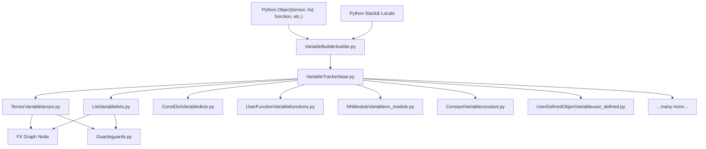
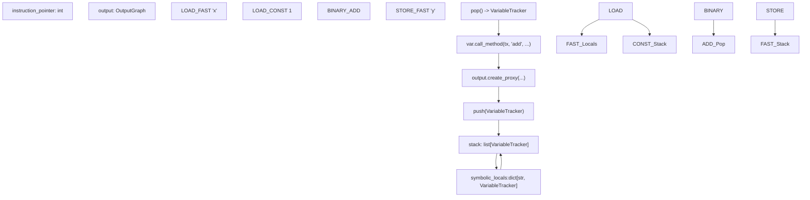
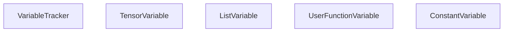
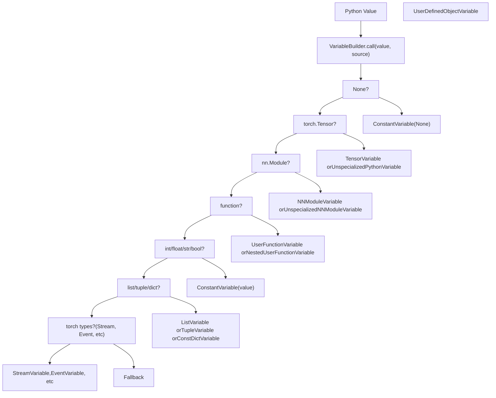
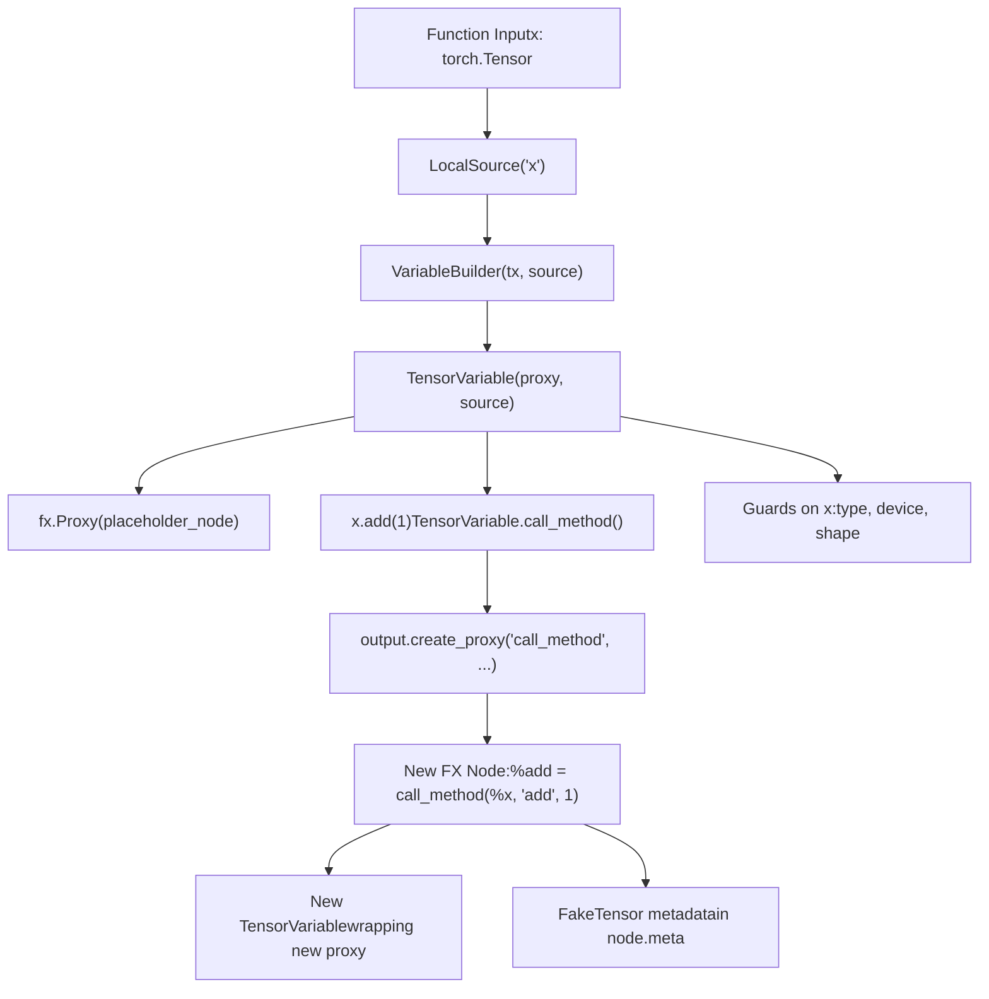
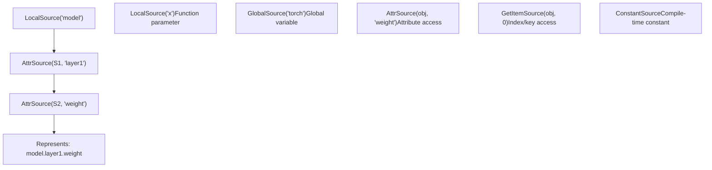
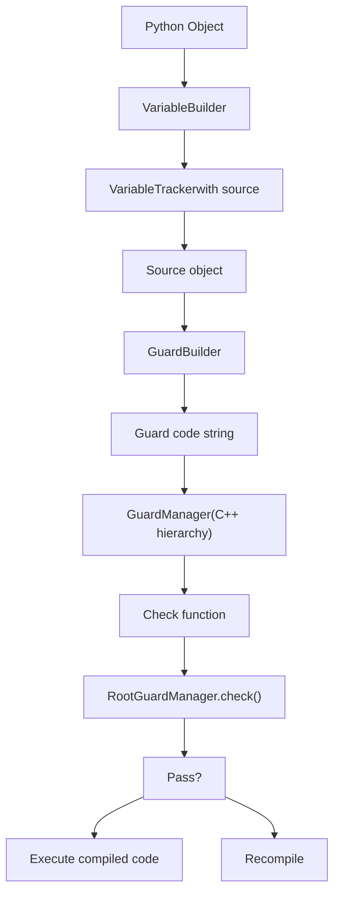

# Variable Tracking and Symbolic Execution

Relevant source files

-   [test/distributed/\_composable/fsdp/test\_fully\_shard\_compile.py](https://github.com/pytorch/pytorch/blob/915982a4/test/distributed/_composable/fsdp/test_fully_shard_compile.py)
-   [test/dynamo/test\_dicts.py](https://github.com/pytorch/pytorch/blob/915982a4/test/dynamo/test_dicts.py)
-   [test/dynamo/test\_error\_messages.py](https://github.com/pytorch/pytorch/blob/915982a4/test/dynamo/test_error_messages.py)
-   [test/dynamo/test\_functions.py](https://github.com/pytorch/pytorch/blob/915982a4/test/dynamo/test_functions.py)
-   [test/dynamo/test\_fwd\_loss\_bwd.py](https://github.com/pytorch/pytorch/blob/915982a4/test/dynamo/test_fwd_loss_bwd.py)
-   [test/dynamo/test\_list.py](https://github.com/pytorch/pytorch/blob/915982a4/test/dynamo/test_list.py)
-   [test/dynamo/test\_misc.py](https://github.com/pytorch/pytorch/blob/915982a4/test/dynamo/test_misc.py)
-   [test/dynamo/test\_modules.py](https://github.com/pytorch/pytorch/blob/915982a4/test/dynamo/test_modules.py)
-   [test/dynamo/test\_nested\_graph\_breaks.py](https://github.com/pytorch/pytorch/blob/915982a4/test/dynamo/test_nested_graph_breaks.py)
-   [test/dynamo/test\_repros.py](https://github.com/pytorch/pytorch/blob/915982a4/test/dynamo/test_repros.py)
-   [test/dynamo\_expected\_failures/TestCustomOp.test\_impl\_device\_cpu](https://github.com/pytorch/pytorch/blob/915982a4/test/dynamo_expected_failures/TestCustomOp.test_impl_device_cpu)
-   [torch/\_dynamo/bytecode\_analysis.py](https://github.com/pytorch/pytorch/blob/915982a4/torch/_dynamo/bytecode_analysis.py)
-   [torch/\_dynamo/bytecode\_transformation.py](https://github.com/pytorch/pytorch/blob/915982a4/torch/_dynamo/bytecode_transformation.py)
-   [torch/\_dynamo/codegen.py](https://github.com/pytorch/pytorch/blob/915982a4/torch/_dynamo/codegen.py)
-   [torch/\_dynamo/exc.py](https://github.com/pytorch/pytorch/blob/915982a4/torch/_dynamo/exc.py)
-   [torch/\_dynamo/graph\_break\_registry.json](https://github.com/pytorch/pytorch/blob/915982a4/torch/_dynamo/graph_break_registry.json)
-   [torch/\_dynamo/output\_graph.py](https://github.com/pytorch/pytorch/blob/915982a4/torch/_dynamo/output_graph.py)
-   [torch/\_dynamo/resume\_execution.py](https://github.com/pytorch/pytorch/blob/915982a4/torch/_dynamo/resume_execution.py)
-   [torch/\_dynamo/side\_effects.py](https://github.com/pytorch/pytorch/blob/915982a4/torch/_dynamo/side_effects.py)
-   [torch/\_dynamo/symbolic\_convert.py](https://github.com/pytorch/pytorch/blob/915982a4/torch/_dynamo/symbolic_convert.py)
-   [torch/\_dynamo/test\_case.py](https://github.com/pytorch/pytorch/blob/915982a4/torch/_dynamo/test_case.py)
-   [torch/\_dynamo/testing.py](https://github.com/pytorch/pytorch/blob/915982a4/torch/_dynamo/testing.py)
-   [torch/\_dynamo/trace\_rules.py](https://github.com/pytorch/pytorch/blob/915982a4/torch/_dynamo/trace_rules.py)
-   [torch/\_dynamo/variables/\_\_init\_\_.py](https://github.com/pytorch/pytorch/blob/915982a4/torch/_dynamo/variables/__init__.py)
-   [torch/\_dynamo/variables/base.py](https://github.com/pytorch/pytorch/blob/915982a4/torch/_dynamo/variables/base.py)
-   [torch/\_dynamo/variables/builder.py](https://github.com/pytorch/pytorch/blob/915982a4/torch/_dynamo/variables/builder.py)
-   [torch/\_dynamo/variables/builtin.py](https://github.com/pytorch/pytorch/blob/915982a4/torch/_dynamo/variables/builtin.py)
-   [torch/\_dynamo/variables/constant.py](https://github.com/pytorch/pytorch/blob/915982a4/torch/_dynamo/variables/constant.py)
-   [torch/\_dynamo/variables/ctx\_manager.py](https://github.com/pytorch/pytorch/blob/915982a4/torch/_dynamo/variables/ctx_manager.py)
-   [torch/\_dynamo/variables/dicts.py](https://github.com/pytorch/pytorch/blob/915982a4/torch/_dynamo/variables/dicts.py)
-   [torch/\_dynamo/variables/functions.py](https://github.com/pytorch/pytorch/blob/915982a4/torch/_dynamo/variables/functions.py)
-   [torch/\_dynamo/variables/higher\_order\_ops.py](https://github.com/pytorch/pytorch/blob/915982a4/torch/_dynamo/variables/higher_order_ops.py)
-   [torch/\_dynamo/variables/iter.py](https://github.com/pytorch/pytorch/blob/915982a4/torch/_dynamo/variables/iter.py)
-   [torch/\_dynamo/variables/lists.py](https://github.com/pytorch/pytorch/blob/915982a4/torch/_dynamo/variables/lists.py)
-   [torch/\_dynamo/variables/misc.py](https://github.com/pytorch/pytorch/blob/915982a4/torch/_dynamo/variables/misc.py)
-   [torch/\_dynamo/variables/nn\_module.py](https://github.com/pytorch/pytorch/blob/915982a4/torch/_dynamo/variables/nn_module.py)
-   [torch/\_dynamo/variables/optimizer.py](https://github.com/pytorch/pytorch/blob/915982a4/torch/_dynamo/variables/optimizer.py)
-   [torch/\_dynamo/variables/tensor.py](https://github.com/pytorch/pytorch/blob/915982a4/torch/_dynamo/variables/tensor.py)
-   [torch/\_dynamo/variables/torch.py](https://github.com/pytorch/pytorch/blob/915982a4/torch/_dynamo/variables/torch.py)
-   [torch/\_dynamo/variables/user\_defined.py](https://github.com/pytorch/pytorch/blob/915982a4/torch/_dynamo/variables/user_defined.py)

## Purpose and Scope

Variable tracking and symbolic execution form the core of TorchDynamo's bytecode interpretation system. When Dynamo intercepts Python bytecode execution (see [Frame Evaluation and Bytecode Analysis](/pytorch/pytorch/2.2.1-frame-evaluation-and-bytecode-analysis)), the `InstructionTranslator` performs **symbolic execution** by:

1.  Maintaining a symbolic stack of `VariableTracker` instances that mirrors Python's execution stack
2.  Converting each bytecode instruction into operations on `VariableTracker` objects
3.  Recording operations into FX graph nodes when appropriate
4.  Installing guards to track assumptions about runtime values

**Symbolic execution** means that instead of executing Python bytecode with actual values, Dynamo executes it with symbolic `VariableTracker` objects that represent values abstractly. For example, when executing `x + 1`, instead of computing the actual sum, Dynamo:

-   Pops two `VariableTracker` objects from the symbolic stack
-   Calls the appropriate method (e.g., `TensorVariable.__add__()`)
-   Creates an FX graph node representing the addition
-   Pushes the result `VariableTracker` back onto the stack

This page covers:

-   The `VariableTracker` type hierarchy and how different Python types are represented
-   How `InstructionTranslator` manipulates the symbolic stack
-   How operations are recorded into the FX graph
-   The `VariableBuilder` system for converting Python objects to trackers

## Architecture Overview

### High-Level Structure


**Sources:** [torch/\_dynamo/variables/builder.py1-20](https://github.com/pytorch/pytorch/blob/915982a4/torch/_dynamo/variables/builder.py#L1-L20) [torch/\_dynamo/variables/base.py1-36](https://github.com/pytorch/pytorch/blob/915982a4/torch/_dynamo/variables/base.py#L1-L36)

## Symbolic Execution Architecture

The `InstructionTranslator` class ([symbolic\_convert.py200-500](https://github.com/pytorch/pytorch/blob/915982a4/symbolic_convert.py#L200-L500)) implements the symbolic execution engine. It maintains:

-   **`stack`**: List of `VariableTracker` instances mirroring Python's value stack
-   **`symbolic_locals`**: Dict mapping variable names to `VariableTracker` instances
-   **`output`**: `OutputGraph` instance that builds the FX graph
-   **`instruction_pointer`**: Current position in bytecode

**Symbolic Execution Flow Diagram**


**Sources:** [torch/\_dynamo/symbolic\_convert.py200-1000](https://github.com/pytorch/pytorch/blob/915982a4/torch/_dynamo/symbolic_convert.py#L200-L1000) [torch/\_dynamo/output\_graph.py1-100](https://github.com/pytorch/pytorch/blob/915982a4/torch/_dynamo/output_graph.py#L1-L100)

## VariableTracker Type System

### VariableTracker Base Class

The `VariableTracker` base class ([variables/base.py60-400](https://github.com/pytorch/pytorch/blob/915982a4/variables/base.py#L60-L400)) is the abstract foundation for all symbolic representations. Every `VariableTracker` instance represents a Python value during symbolic execution and provides:

| Capability | Method/Attribute | Description |
| --- | --- | --- |
| **Source Tracking** | `self.source: Source | None` | Tracks origin for guard generation |
| **Proxy Creation** | `as_proxy() -> fx.Proxy` | Converts to FX proxy for graph building |
| **Constant Folding** | `as_python_constant() -> Any` | Returns Python value if statically known |
| **Type Checking** | `is_python_constant() -> bool` | Checks if value is constant |
| **Method Calls** | `call_method(tx, name, args, kwargs)` | Handles attribute/method invocations |
| **Function Calls** | `call_function(tx, args, kwargs)` | Handles calling the variable as a function |
| **Operators** | `__add__`, `__getitem__`, etc. | Magic methods for Python operators |
| **Reconstruction** | `reconstruct(codegen)` | Emits bytecode to recreate value |
| **Mutation Tracking** | `self.mutable_local: MutableLocal | None` | Records mutations for side effects |


**Sources:** [torch/\_dynamo/variables/base.py60-400](https://github.com/pytorch/pytorch/blob/915982a4/torch/_dynamo/variables/base.py#L60-L400)

## VariableBuilder: Creating Trackers from Python Objects

### VariableBuilder System

The `VariableBuilder` class ([variables/builder.py700-1200](https://github.com/pytorch/pytorch/blob/915982a4/variables/builder.py#L700-L1200)) converts Python objects into `VariableTracker` instances. Two variants exist:

**VariableBuilder**: For objects with a known `Source` (function inputs, module attributes, globals)

-   Signature: `VariableBuilder(tx, source)(python_value)`
-   Generates guards based on the source
-   Tracks origin for error messages and debugging
-   Used during initial frame setup

**SourcelessBuilder**: For ephemeral objects created during symbolic execution

-   Signature: `SourcelessBuilder(tx)(python_value)`
-   No source tracking or guard generation
-   Used for intermediate values like temporary lists
-   Lighter weight construction

### Type Dispatch Strategy

**Variable Builder Type Dispatch Diagram**


**Type Check Ordering** ([builder.py800-1150](https://github.com/pytorch/pytorch/blob/915982a4/builder.py#L800-L1150)):

1.  **None** → `ConstantVariable(None)`
2.  **`torch.Tensor`** → `TensorVariable` (with FX proxy) or `UnspecializedPythonVariable` (for scalars)
3.  **`nn.Module`** → `NNModuleVariable` (specialized) or `UnspecializedNNModuleVariable` (opaque)
4.  **Functions** → `UserFunctionVariable`, `NestedUserFunctionVariable`, or `SkipFunctionVariable`
5.  **Basic types** (int, float, str, bool) → `ConstantVariable`
6.  **Collections** (list, tuple, dict) → `ListVariable`, `TupleVariable`, `ConstDictVariable`
7.  **Torch-specific** → `StreamVariable`, `EventVariable`, `DistributedVariable`, etc.
8.  **Fallback** → `UserDefinedObjectVariable` for arbitrary Python objects

**Sources:** [torch/\_dynamo/variables/builder.py700-1150](https://github.com/pytorch/pytorch/blob/915982a4/torch/_dynamo/variables/builder.py#L700-L1150)

## Major VariableTracker Categories

The variable tracking system organizes over 100 `VariableTracker` subclasses into logical categories:

### Tensor and Numeric Types

| Class | Purpose | File |
| --- | --- | --- |
| `TensorVariable` | Represents `torch.Tensor` with FX proxy | tensor.py |
| `SymNodeVariable` | Symbolic integers/floats for sizes/strides | tensor.py |
| `UnspecializedPythonVariable` | Python int/float as 0-d tensor | tensor.py |
| `NumpyNdarrayVariable` | NumPy arrays via torch.\_numpy | tensor.py |
| `TensorSubclassVariable` | Tensor subclasses with **torch\_function** | tensor.py |

**Sources:** [torch/\_dynamo/variables/tensor.py1-50](https://github.com/pytorch/pytorch/blob/915982a4/torch/_dynamo/variables/tensor.py#L1-L50)

### Collections

| Class | Purpose | File |
| --- | --- | --- |
| `ListVariable` | Python lists, supports mutation | lists.py |
| `TupleVariable` | Python tuples, immutable | lists.py |
| `NamedTupleVariable` | Named tuples with field access | lists.py |
| `SizeVariable` | `torch.Size` with special proxy handling | lists.py |
| `SliceVariable` | Slice objects | lists.py |
| `RangeVariable` | Range objects for iteration | lists.py |
| `ConstDictVariable` | Dictionaries with constant keys | dicts.py |
| `DefaultDictVariable` | `collections.defaultdict` | dicts.py |
| `SetVariable` | Sets and frozensets | dicts.py |

**Sources:** [torch/\_dynamo/variables/lists.py1-50](https://github.com/pytorch/pytorch/blob/915982a4/torch/_dynamo/variables/lists.py#L1-L50) [torch/\_dynamo/variables/dicts.py1-50](https://github.com/pytorch/pytorch/blob/915982a4/torch/_dynamo/variables/dicts.py#L1-L50)

### Functions and Callables

| Class | Purpose | File |
| --- | --- | --- |
| `UserFunctionVariable` | User-defined Python functions | functions.py |
| `UserMethodVariable` | Bound methods | functions.py |
| `NestedUserFunctionVariable` | Nested/closure functions | functions.py |
| `BuiltinVariable` | Built-in functions (len, isinstance, etc.) | builtin.py |
| `TorchInGraphFunctionVariable` | torch.\* functions to inline | torch.py |
| `SkipFunctionVariable` | Functions to skip (graph break) | functions.py |
| `LambdaVariable` | Lambda functions | misc.py |

**Sources:** [torch/\_dynamo/variables/functions.py1-50](https://github.com/pytorch/pytorch/blob/915982a4/torch/_dynamo/variables/functions.py#L1-L50) [torch/\_dynamo/variables/builtin.py1-50](https://github.com/pytorch/pytorch/blob/915982a4/torch/_dynamo/variables/builtin.py#L1-L50)

### Modules and Classes

| Class | Purpose | File |
| --- | --- | --- |
| `NNModuleVariable` | `torch.nn.Module` instances | nn\_module.py |
| `UnspecializedNNModuleVariable` | Modules treated as opaque | nn\_module.py |
| `UserDefinedClassVariable` | Python classes/types | user\_defined.py |
| `UserDefinedObjectVariable` | Instances of user classes | user\_defined.py |
| `EnumVariable` | Enum values | constant.py |

**Sources:** [torch/\_dynamo/variables/nn\_module.py1-50](https://github.com/pytorch/pytorch/blob/915982a4/torch/_dynamo/variables/nn_module.py#L1-L50) [torch/\_dynamo/variables/user\_defined.py1-50](https://github.com/pytorch/pytorch/blob/915982a4/torch/_dynamo/variables/user_defined.py#L1-L50)

### Special Purpose

| Class | Purpose | File |
| --- | --- | --- |
| `ConstantVariable` | Compile-time constants | constant.py |
| `AutogradFunctionVariable` | `torch.autograd.Function` subclasses | misc.py |
| `ContextWrappingVariable` | Context managers | ctx\_manager.py |
| `StreamVariable`, `EventVariable` | CUDA streams/events | streams.py |
| `GradModeVariable` | torch.no\_grad/enable\_grad contexts | ctx\_manager.py |

**Sources:** [torch/\_dynamo/variables/constant.py1-50](https://github.com/pytorch/pytorch/blob/915982a4/torch/_dynamo/variables/constant.py#L1-L50) [torch/\_dynamo/variables/ctx\_manager.py1-50](https://github.com/pytorch/pytorch/blob/915982a4/torch/_dynamo/variables/ctx_manager.py#L1-L50) [torch/\_dynamo/variables/streams.py1-50](https://github.com/pytorch/pytorch/blob/915982a4/torch/_dynamo/variables/streams.py#L1-L50)

## Key VariableTracker Types

## Operation Recording: TensorVariable Example

### TensorVariable and Graph Node Creation

`TensorVariable` ([tensor.py100-800](https://github.com/pytorch/pytorch/blob/915982a4/tensor.py#L100-L800)) demonstrates how operations are recorded into the FX graph. Each `TensorVariable` maintains:

-   **`proxy: fx.Proxy`** - Links to an FX graph node
-   **`example_value: FakeTensor`** - Shape/dtype/device metadata (stored in `proxy.node.meta`)
-   **`specialized_value: torch.Tensor | None`** - Optional concrete value for constant folding
-   **`source: Source`** - Origin for guard generation

**Operation Recording Flow**

When a tensor operation is invoked (e.g., `x.add(1)`), the following sequence occurs:

1.  **Method Call**: `TensorVariable.call_method(tx, 'add', [ConstantVariable(1)], {})`
2.  **Proxy Creation**: Calls `tx.output.create_proxy('call_method', ...)`
3.  **FX Node Creation**: `OutputGraph` creates a new FX graph node
4.  **Wrapping**: Result proxy is wrapped in a new `TensorVariable`
5.  **FakeTensor Propagation**: FakeTensor system computes output metadata

**TensorVariable Operation Recording Diagram**

**Code Flow** ([tensor.py300-500](https://github.com/pytorch/pytorch/blob/915982a4/tensor.py#L300-L500) [output\_graph.py800-1000](https://github.com/pytorch/pytorch/blob/915982a4/output_graph.py#L800-L1000)):

```
# 1. TensorVariable.call_method (tensor.py)class TensorVariable(VariableTracker):    def call_method(self, tx, name, args, kwargs):        # Handle method call like x.add(1)        if name == "add":            # Convert args/kwargs to proxies            proxy_args, proxy_kwargs = proxy_args_kwargs([self] + args, kwargs)            # Create FX node via output graph            result_proxy = tx.output.create_proxy(                "call_method", name,                 args=proxy_args, kwargs=proxy_kwargs            )            # Wrap result in new TensorVariable            return wrap_fx_proxy(tx, result_proxy) # 2. OutputGraph.create_proxy (output_graph.py)class OutputGraph:    def create_proxy(self, kind, target, args, kwargs):        # Create FX node        node = self.graph.create_node(kind, target, args, kwargs)                # Run FakeTensorMode to compute metadata        with FakeTensorMode():            fake_result = target(*fake_args, **fake_kwargs)                # Store metadata        node.meta['example_value'] = fake_result                return fx.Proxy(node)
```
**Sources:** [torch/\_dynamo/variables/tensor.py300-500](https://github.com/pytorch/pytorch/blob/915982a4/torch/_dynamo/variables/tensor.py#L300-L500) [torch/\_dynamo/output\_graph.py800-1000](https://github.com/pytorch/pytorch/blob/915982a4/torch/_dynamo/output_graph.py#L800-L1000)

## Collection Variables: Lists and Tuples

### ListVariable and Sequence Operations

Collection variables like `ListVariable` and `TupleVariable` ([lists.py59-400](https://github.com/pytorch/pytorch/blob/915982a4/lists.py#L59-L400)) track sequences of `VariableTracker` instances:

**Key Attributes:**

-   **`items: list[VariableTracker]`** - The tracked elements
-   **`source: Source | None`** - Origin of the collection
-   **Mutability** - `ListVariable` supports mutations, `TupleVariable` is immutable

**Collection Operations:**

| Operation | Bytecode | Implementation | Result |
| --- | --- | --- | --- |
| Build list | `BUILD_LIST n` | Pop n items, create `ListVariable` | New list tracker |
| Append | `LIST_APPEND` | Call `list_var.call_method(tx, 'append', ...)` | Modified list |
| Index access | `BINARY_SUBSCR` | `list_var.call_method(tx, '__getitem__', [index])` | Element tracker |
| Unpack | `UNPACK_SEQUENCE` | `list_var.unpack_var_sequence(tx)` | Push items to stack |
| Iteration | `GET_ITER`, `FOR_ITER` | Create `ListIteratorVariable` | Iterator tracker |

**Example: Building a List**

```
# Python code: result = [x, x + 1]# Where x is a TensorVariable # Symbolic execution:# 1. LOAD_FAST 'x'           -> stack: [TensorVar(x)]# 2. LOAD_FAST 'x'           -> stack: [TensorVar(x), TensorVar(x)]# 3. LOAD_CONST 1            -> stack: [TensorVar(x), TensorVar(x), ConstVar(1)]# 4. BINARY_ADD              -> stack: [TensorVar(x), TensorVar(x+1)]# 5. BUILD_LIST 2            -> stack: [ListVariable([TensorVar(x), TensorVar(x+1)])]# 6. STORE_FAST 'result'     -> symbolic_locals['result'] = ListVariable(...)
```
**Sources:** [torch/\_dynamo/variables/lists.py59-400](https://github.com/pytorch/pytorch/blob/915982a4/torch/_dynamo/variables/lists.py#L59-L400) [torch/\_dynamo/symbolic\_convert.py1800-2000](https://github.com/pytorch/pytorch/blob/915982a4/torch/_dynamo/symbolic_convert.py#L1800-L2000)

## Function Variables and Inlining

### UserFunctionVariable: Inline Function Execution

`UserFunctionVariable` ([functions.py200-800](https://github.com/pytorch/pytorch/blob/915982a4/functions.py#L200-L800)) represents user-defined Python functions that Dynamo can inline. When called during symbolic execution, Dynamo recursively traces the function body.

**Key Attributes:**

-   **`fn: types.FunctionType`** - The actual Python function object
-   **`closure: dict[str, VariableTracker]`** - Captured closure variables converted to trackers
-   **`source: Source`** - For guard generation on function identity

**Inlining Process:**

1.  **Call Invocation**: `user_func_var.call_function(tx, args, kwargs)` is called
2.  **Argument Binding**: `bind_args_cached()` matches args to function parameters
3.  **Sub-Translator Creation**: Creates `InliningInstructionTranslator` with:
    -   Bound arguments as initial `symbolic_locals`
    -   Closure variables in scope
    -   Function's bytecode
4.  **Recursive Tracing**: Sub-translator executes function bytecode symbolically
5.  **Return**: Function's return value becomes a `VariableTracker` in parent scope

**Function Inlining Sequence Diagram**

> **[Mermaid sequence]**
> *(图表结构无法解析)*

**Example: Inlining a Helper Function**

```
# Python codedef helper(a, b):    return a * 2 + b def main(x):    return helper(x, 1) # When tracing main(x) where x is a tensor:# 1. main's LOAD_GLOBAL 'helper' -> UserFunctionVariable(helper)# 2. main's LOAD_FAST 'x' -> TensorVariable(x)# 3. main's LOAD_CONST 1 -> ConstantVariable(1)# 4. main's CALL_FUNCTION 2 -> Inline helper:#    a. Create InliningInstructionTranslator for helper#    b. Set symbolic_locals = {'a': TensorVar(x), 'b': ConstVar(1)}#    c. Execute helper's bytecode:#       - LOAD_FAST 'a' -> push TensorVar(x)#       - LOAD_CONST 2 -> push ConstVar(2)#       - BINARY_MULTIPLY -> creates %mul node, push TensorVar(x*2)#       - LOAD_FAST 'b' -> push ConstVar(1)#       - BINARY_ADD -> creates %add node, push TensorVar(x*2+1)#       - RETURN_VALUE -> return TensorVar(x*2+1)#    d. Return TensorVariable to main# 5. main's RETURN_VALUE -> output TensorVar(x*2+1) # Resulting FX graph:# def forward(x):#     mul = x * 2#     add = mul + 1#     return add
```
**Sources:** [torch/\_dynamo/variables/functions.py400-700](https://github.com/pytorch/pytorch/blob/915982a4/torch/_dynamo/variables/functions.py#L400-L700) [torch/\_dynamo/symbolic\_convert.py2000-2200](https://github.com/pytorch/pytorch/blob/915982a4/torch/_dynamo/symbolic_convert.py#L2000-L2200)

### ConstDictVariable

`ConstDictVariable` ([dicts.py100-600](https://github.com/pytorch/pytorch/blob/915982a4/dicts.py#L100-L600)) tracks dictionaries where keys are known at compile time:

-   **Items**: `dict[VariableTracker, VariableTracker]` mapping
-   **Mutation**: Tracks `__setitem__`, `__delitem__` for side effects
-   **Key Hashing**: Uses `_HashableTracker` wrapper for non-hashable keys
-   **Guard Generation**: Guards on dict version or key set

Dictionary operations create new variables:

-   `d[key]` → `call_method(tx, '__getitem__', [key])`
-   `d.keys()` → `DictKeysVariable`
-   `d.items()` → Creates list of `(key, value)` tuples

**Sources:** [torch/\_dynamo/variables/dicts.py200-600](https://github.com/pytorch/pytorch/blob/915982a4/torch/_dynamo/variables/dicts.py#L200-L600)

## Variable Lifecycle

### From Python Object to FX Graph Node


**Sources:** [torch/\_dynamo/variables/builder.py900-1000](https://github.com/pytorch/pytorch/blob/915982a4/torch/_dynamo/variables/builder.py#L900-L1000) [torch/\_dynamo/variables/tensor.py300-500](https://github.com/pytorch/pytorch/blob/915982a4/torch/_dynamo/variables/tensor.py#L300-L500) [torch/\_dynamo/output\_graph.py800-1000](https://github.com/pytorch/pytorch/blob/915982a4/torch/_dynamo/output_graph.py#L800-L1000)

## Symbolic Execution Example: Tracing `x + 1`

Consider tracing the function `def f(x): return x + 1` where `x` is a `torch.Tensor`. Here's the step-by-step symbolic execution:

**Step-by-Step Execution Table**

| Step | Bytecode | Stack Before | Action | Stack After | Graph Effect |
| --- | --- | --- | --- | --- | --- |
| 1 | Setup | `[]` | Create `TensorVariable` for input `x` | `[]` | Add placeholder node `%x` |
| 2 | `LOAD_FAST 'x'` | `[]` | Push `symbolic_locals['x']` | `[TensorVar(x)]` | None |
| 3 | `LOAD_CONST 1` | `[TensorVar(x)]` | Push `ConstantVariable(1)` | `[TensorVar(x), ConstVar(1)]` | None |
| 4 | `BINARY_ADD` | `[TensorVar(x), ConstVar(1)]` | Pop 2, call `__add__`, push result | `[TensorVar(x+1)]` | Add node `%add = call_function<FileRef file-url="https://github.com/pytorch/pytorch/blob/915982a4/add" undefined file-path="add">Hii</FileRef>` |
| 5 | `RETURN_VALUE` | `[TensorVar(x+1)]` | Pop and set as output | `[]` | Mark `%add` as output |

**Detailed Instruction Handling**

1.  **Frame Setup** ([symbolic\_convert.py800-900](https://github.com/pytorch/pytorch/blob/915982a4/symbolic_convert.py#L800-L900)):

    ```
    # InstructionTranslator.__init__self.stack = []self.symbolic_locals = {}self.output = OutputGraph(...) # Input handling - creates placeholderx_node = self.output.create_proxy('placeholder', 'x', ...)x_var = wrap_fx_proxy(self, x_node)  # Returns TensorVariableself.symbolic_locals['x'] = x_var
    ```

2.  **LOAD\_FAST 'x'** ([symbolic\_convert.py2400-2420](https://github.com/pytorch/pytorch/blob/915982a4/symbolic_convert.py#L2400-L2420)):

    ```
    # InstructionTranslator.LOAD_FASTdef LOAD_FAST(self, inst):    name = inst.argval    var = self.symbolic_locals[name]    self.push(var)  # Pushes TensorVariable to stack
    ```

3.  **LOAD\_CONST 1** ([symbolic\_convert.py2300-2320](https://github.com/pytorch/pytorch/blob/915982a4/symbolic_convert.py#L2300-L2320)):

    ```
    # InstructionTranslator.LOAD_CONSTdef LOAD_CONST(self, inst):    value = inst.argval    var = ConstantVariable.create(value)    self.push(var)  # Pushes ConstantVariable(1) to stack
    ```

4.  **BINARY\_ADD** ([symbolic\_convert.py1800-1850](https://github.com/pytorch/pytorch/blob/915982a4/symbolic_convert.py#L1800-L1850)):

    ```
    # InstructionTranslator.BINARY_ADDdef BINARY_ADD(self, inst):    right = self.pop()  # ConstantVariable(1)    left = self.pop()   # TensorVariable(x)    result = left.call_method(self, '__add__', [right], {})    self.push(result)   # Pushes new TensorVariable # Inside TensorVariable.__add__ (tensor.py:400-450)# Creates FX node: %add = call_function<FileRef file-url="https://github.com/pytorch/pytorch/blob/915982a4/operator.add" undefined  file-path="operator.add">Hii</FileRef># Returns new TensorVariable wrapping the proxy
    ```

5.  **RETURN\_VALUE** ([symbolic\_convert.py2700-2720](https://github.com/pytorch/pytorch/blob/915982a4/symbolic_convert.py#L2700-L2720)):

    ```
    # InstructionTranslator.RETURN_VALUEdef RETURN_VALUE(self, inst):    retval = self.pop()  # TensorVariable(x+1)    self.output.create_node('output', args=(retval.as_proxy(),))
    ```


**Resulting FX Graph**

```
# Generated FX graphdef forward(self, x):    add = torch.ops.aten.add.Tensor(x, 1)    return add
```
**Sources:** [torch/\_dynamo/symbolic\_convert.py800-2750](https://github.com/pytorch/pytorch/blob/915982a4/torch/_dynamo/symbolic_convert.py#L800-L2750) [torch/\_dynamo/variables/tensor.py400-450](https://github.com/pytorch/pytorch/blob/915982a4/torch/_dynamo/variables/tensor.py#L400-L450)

## Source Tracking and Guards

### Source Attribution

Every `VariableTracker` can have an optional `Source` that describes its origin:


**Sources:** [torch/\_dynamo/source.py1-500](https://github.com/pytorch/pytorch/blob/915982a4/torch/_dynamo/source.py#L1-L500)

### Guard Generation

Sources enable guard generation via `install_guard()` ([guards.py2000-2100](https://github.com/pytorch/pytorch/blob/915982a4/guards.py#L2000-L2100)):

```
# When creating TensorVariable for input x:source = LocalSource('x')install_guard(source.make_guard(GuardBuilder.TYPE_MATCH))install_guard(source.make_guard(GuardBuilder.TENSOR_MATCH))
```
The guard system uses sources to:

1.  Access runtime values during guard checking
2.  Generate guard code strings
3.  Organize guards hierarchically by source

Example guard for `model.layer1.weight`:

```
# Guard chain:# 1. ___check_obj_id(L['model'], <id>)# 2. ___check_obj_id(getattr(L['model'], 'layer1'), <id>)  # 3. TensorGuard(getattr(getattr(L['model'], 'layer1'), 'weight'))
```
**Sources:** [torch/\_dynamo/guards.py1000-1500](https://github.com/pytorch/pytorch/blob/915982a4/torch/_dynamo/guards.py#L1000-L1500) [torch/\_dynamo/source.py200-800](https://github.com/pytorch/pytorch/blob/915982a4/torch/_dynamo/source.py#L200-L800)

### Variable to Guard Flow


**Sources:** [torch/\_dynamo/guards.py600-1000](https://github.com/pytorch/pytorch/blob/915982a4/torch/_dynamo/guards.py#L600-L1000) [torch/csrc/dynamo/guards.cpp1-100](https://github.com/pytorch/pytorch/blob/915982a4/torch/csrc/dynamo/guards.cpp#L1-L100)

## Special Cases and Patterns

### Mutation Tracking

Variables track mutations via `MutableLocal` ([base.py40-80](https://github.com/pytorch/pytorch/blob/915982a4/base.py#L40-L80)):

```
# Example: list.append()class ListVariable(BaseListVariable):    def call_method(self, tx, name, args, kwargs):        if name == "append":            # Track mutation            result = self.clone(items=self.items + [args[0]])            return result.add_options(                mutable_local=MutableLocal()            )
```
Mutations are recorded in `SideEffects` ([side\_effects.py100-300](https://github.com/pytorch/pytorch/blob/915982a4/side_effects.py#L100-L300)) and reconstructed in the resume function.

**Sources:** [torch/\_dynamo/variables/base.py40-80](https://github.com/pytorch/pytorch/blob/915982a4/torch/_dynamo/variables/base.py#L40-L80) [torch/\_dynamo/side\_effects.py100-300](https://github.com/pytorch/pytorch/blob/915982a4/torch/_dynamo/side_effects.py#L100-L300)

### Lazy Variables

`LazyVariableTracker` ([lazy.py1-200](https://github.com/pytorch/pytorch/blob/915982a4/lazy.py#L1-L200)) defers variable creation until needed:

-   Used for expensive-to-create variables
-   `realize()` creates actual `VariableTracker`
-   Helps avoid unnecessary graph breaks

**Sources:** [torch/\_dynamo/variables/lazy.py1-200](https://github.com/pytorch/pytorch/blob/915982a4/torch/_dynamo/variables/lazy.py#L1-L200)

### Constant Folding

Variables can attempt constant folding via `as_python_constant()`:

```
# TensorVariable with static value:if self.specialized_value is not None:    return self.specialized_value    # ConstantVariable always succeeds:return self.value
```
This enables optimizations when values are provably constant.

**Sources:** [torch/\_dynamo/variables/base.py150-200](https://github.com/pytorch/pytorch/blob/915982a4/torch/_dynamo/variables/base.py#L150-L200) [torch/\_dynamo/variables/constant.py50-100](https://github.com/pytorch/pytorch/blob/915982a4/torch/_dynamo/variables/constant.py#L50-L100)

## Summary

The Variable Tracking System provides the symbolic execution layer for TorchDynamo:

| Component | Responsibility |
| --- | --- |
| **VariableTracker** | Base class for symbolic representations |
| **VariableBuilder** | Factory for creating trackers from Python objects |
| **TensorVariable** | Core tensor representation with FX proxies |
| **Collection Variables** | Lists, tuples, dicts with item tracking |
| **Function Variables** | User/builtin functions for inlining decisions |
| **Source Tracking** | Origin attribution for guard generation |
| **Mutation Tracking** | Side effect recording and replay |

The system enables Dynamo to maintain a parallel symbolic execution that:

1.  Tracks Python values without executing them
2.  Generates FX graph nodes for traced operations
3.  Installs guards to validate compiled code
4.  Reconstructs values in resume functions after graph breaks

**Sources:** [torch/\_dynamo/variables/base.py](https://github.com/pytorch/pytorch/blob/915982a4/torch/_dynamo/variables/base.py) [torch/\_dynamo/variables/builder.py](https://github.com/pytorch/pytorch/blob/915982a4/torch/_dynamo/variables/builder.py) [torch/\_dynamo/symbolic\_convert.py](https://github.com/pytorch/pytorch/blob/915982a4/torch/_dynamo/symbolic_convert.py) [torch/\_dynamo/guards.py](https://github.com/pytorch/pytorch/blob/915982a4/torch/_dynamo/guards.py)
