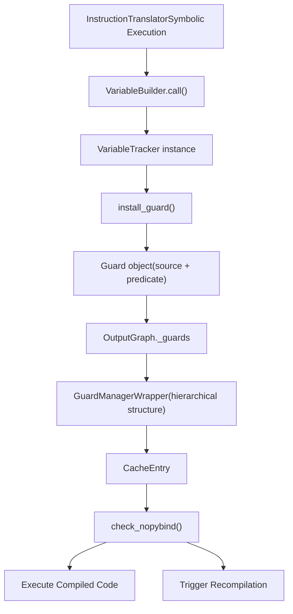
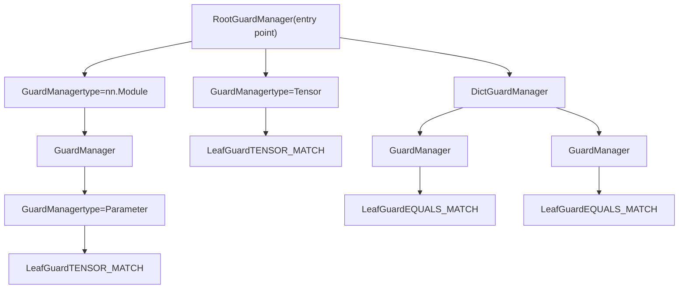
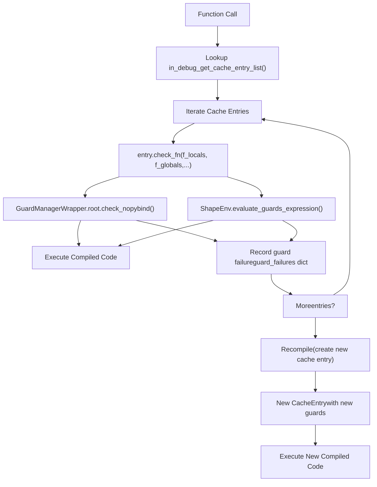
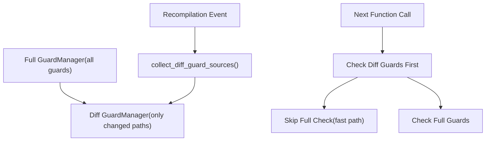

# Guard System and Recompilation

Relevant source files

-   [test/distributed/\_composable/fsdp/test\_fully\_shard\_compile.py](https://github.com/pytorch/pytorch/blob/915982a4/test/distributed/_composable/fsdp/test_fully_shard_compile.py)
-   [test/dynamo/test\_dicts.py](https://github.com/pytorch/pytorch/blob/915982a4/test/dynamo/test_dicts.py)
-   [test/dynamo/test\_error\_messages.py](https://github.com/pytorch/pytorch/blob/915982a4/test/dynamo/test_error_messages.py)
-   [test/dynamo/test\_functions.py](https://github.com/pytorch/pytorch/blob/915982a4/test/dynamo/test_functions.py)
-   [test/dynamo/test\_fwd\_loss\_bwd.py](https://github.com/pytorch/pytorch/blob/915982a4/test/dynamo/test_fwd_loss_bwd.py)
-   [test/dynamo/test\_guard\_manager.py](https://github.com/pytorch/pytorch/blob/915982a4/test/dynamo/test_guard_manager.py)
-   [test/dynamo/test\_list.py](https://github.com/pytorch/pytorch/blob/915982a4/test/dynamo/test_list.py)
-   [test/dynamo/test\_logging.py](https://github.com/pytorch/pytorch/blob/915982a4/test/dynamo/test_logging.py)
-   [test/dynamo/test\_misc.py](https://github.com/pytorch/pytorch/blob/915982a4/test/dynamo/test_misc.py)
-   [test/dynamo/test\_modules.py](https://github.com/pytorch/pytorch/blob/915982a4/test/dynamo/test_modules.py)
-   [test/dynamo/test\_nested\_graph\_breaks.py](https://github.com/pytorch/pytorch/blob/915982a4/test/dynamo/test_nested_graph_breaks.py)
-   [test/dynamo/test\_repros.py](https://github.com/pytorch/pytorch/blob/915982a4/test/dynamo/test_repros.py)
-   [test/dynamo/test\_skip\_guard\_eval\_unsafe.py](https://github.com/pytorch/pytorch/blob/915982a4/test/dynamo/test_skip_guard_eval_unsafe.py)
-   [test/dynamo\_expected\_failures/TestCustomOp.test\_impl\_device\_cpu](https://github.com/pytorch/pytorch/blob/915982a4/test/dynamo_expected_failures/TestCustomOp.test_impl_device_cpu)
-   [torch/\_C/\_dynamo/guards.pyi](https://github.com/pytorch/pytorch/blob/915982a4/torch/_C/_dynamo/guards.pyi)
-   [torch/\_decomp/decompositions\_for\_jvp.py](https://github.com/pytorch/pytorch/blob/915982a4/torch/_decomp/decompositions_for_jvp.py)
-   [torch/\_dispatch/python.py](https://github.com/pytorch/pytorch/blob/915982a4/torch/_dispatch/python.py)
-   [torch/\_dynamo/bytecode\_analysis.py](https://github.com/pytorch/pytorch/blob/915982a4/torch/_dynamo/bytecode_analysis.py)
-   [torch/\_dynamo/bytecode\_transformation.py](https://github.com/pytorch/pytorch/blob/915982a4/torch/_dynamo/bytecode_transformation.py)
-   [torch/\_dynamo/codegen.py](https://github.com/pytorch/pytorch/blob/915982a4/torch/_dynamo/codegen.py)
-   [torch/\_dynamo/exc.py](https://github.com/pytorch/pytorch/blob/915982a4/torch/_dynamo/exc.py)
-   [torch/\_dynamo/graph\_break\_registry.json](https://github.com/pytorch/pytorch/blob/915982a4/torch/_dynamo/graph_break_registry.json)
-   [torch/\_dynamo/guards.py](https://github.com/pytorch/pytorch/blob/915982a4/torch/_dynamo/guards.py)
-   [torch/\_dynamo/output\_graph.py](https://github.com/pytorch/pytorch/blob/915982a4/torch/_dynamo/output_graph.py)
-   [torch/\_dynamo/resume\_execution.py](https://github.com/pytorch/pytorch/blob/915982a4/torch/_dynamo/resume_execution.py)
-   [torch/\_dynamo/side\_effects.py](https://github.com/pytorch/pytorch/blob/915982a4/torch/_dynamo/side_effects.py)
-   [torch/\_dynamo/source.py](https://github.com/pytorch/pytorch/blob/915982a4/torch/_dynamo/source.py)
-   [torch/\_dynamo/symbolic\_convert.py](https://github.com/pytorch/pytorch/blob/915982a4/torch/_dynamo/symbolic_convert.py)
-   [torch/\_dynamo/test\_case.py](https://github.com/pytorch/pytorch/blob/915982a4/torch/_dynamo/test_case.py)
-   [torch/\_dynamo/testing.py](https://github.com/pytorch/pytorch/blob/915982a4/torch/_dynamo/testing.py)
-   [torch/\_dynamo/trace\_rules.py](https://github.com/pytorch/pytorch/blob/915982a4/torch/_dynamo/trace_rules.py)
-   [torch/\_dynamo/variables/\_\_init\_\_.py](https://github.com/pytorch/pytorch/blob/915982a4/torch/_dynamo/variables/__init__.py)
-   [torch/\_dynamo/variables/base.py](https://github.com/pytorch/pytorch/blob/915982a4/torch/_dynamo/variables/base.py)
-   [torch/\_dynamo/variables/builder.py](https://github.com/pytorch/pytorch/blob/915982a4/torch/_dynamo/variables/builder.py)
-   [torch/\_dynamo/variables/builtin.py](https://github.com/pytorch/pytorch/blob/915982a4/torch/_dynamo/variables/builtin.py)
-   [torch/\_dynamo/variables/constant.py](https://github.com/pytorch/pytorch/blob/915982a4/torch/_dynamo/variables/constant.py)
-   [torch/\_dynamo/variables/ctx\_manager.py](https://github.com/pytorch/pytorch/blob/915982a4/torch/_dynamo/variables/ctx_manager.py)
-   [torch/\_dynamo/variables/dicts.py](https://github.com/pytorch/pytorch/blob/915982a4/torch/_dynamo/variables/dicts.py)
-   [torch/\_dynamo/variables/functions.py](https://github.com/pytorch/pytorch/blob/915982a4/torch/_dynamo/variables/functions.py)
-   [torch/\_dynamo/variables/higher\_order\_ops.py](https://github.com/pytorch/pytorch/blob/915982a4/torch/_dynamo/variables/higher_order_ops.py)
-   [torch/\_dynamo/variables/iter.py](https://github.com/pytorch/pytorch/blob/915982a4/torch/_dynamo/variables/iter.py)
-   [torch/\_dynamo/variables/lists.py](https://github.com/pytorch/pytorch/blob/915982a4/torch/_dynamo/variables/lists.py)
-   [torch/\_dynamo/variables/misc.py](https://github.com/pytorch/pytorch/blob/915982a4/torch/_dynamo/variables/misc.py)
-   [torch/\_dynamo/variables/nn\_module.py](https://github.com/pytorch/pytorch/blob/915982a4/torch/_dynamo/variables/nn_module.py)
-   [torch/\_dynamo/variables/optimizer.py](https://github.com/pytorch/pytorch/blob/915982a4/torch/_dynamo/variables/optimizer.py)
-   [torch/\_dynamo/variables/tensor.py](https://github.com/pytorch/pytorch/blob/915982a4/torch/_dynamo/variables/tensor.py)
-   [torch/\_dynamo/variables/torch.py](https://github.com/pytorch/pytorch/blob/915982a4/torch/_dynamo/variables/torch.py)
-   [torch/\_dynamo/variables/user\_defined.py](https://github.com/pytorch/pytorch/blob/915982a4/torch/_dynamo/variables/user_defined.py)
-   [torch/\_guards.py](https://github.com/pytorch/pytorch/blob/915982a4/torch/_guards.py)
-   [torch/\_lazy/device\_context.py](https://github.com/pytorch/pytorch/blob/915982a4/torch/_lazy/device_context.py)
-   [torch/\_logging/\_internal.py](https://github.com/pytorch/pytorch/blob/915982a4/torch/_logging/_internal.py)
-   [torch/\_logging/\_registrations.py](https://github.com/pytorch/pytorch/blob/915982a4/torch/_logging/_registrations.py)
-   [torch/\_numpy/\_funcs\_impl.py](https://github.com/pytorch/pytorch/blob/915982a4/torch/_numpy/_funcs_impl.py)
-   [torch/\_numpy/\_reductions\_impl.py](https://github.com/pytorch/pytorch/blob/915982a4/torch/_numpy/_reductions_impl.py)
-   [torch/\_refs/fft.py](https://github.com/pytorch/pytorch/blob/915982a4/torch/_refs/fft.py)
-   [torch/csrc/dynamo/guards.cpp](https://github.com/pytorch/pytorch/blob/915982a4/torch/csrc/dynamo/guards.cpp)

## Purpose and Scope

The Guard System is TorchDynamo's mechanism for detecting when previously compiled code must be recompiled due to changes in program state. Guards are runtime checks that verify the assumptions made during graph capture remain valid. When a guard fails, TorchDynamo triggers recompilation to generate a new graph that is correct for the changed conditions.

This document covers:

-   How guards are created during symbolic execution
-   The structure and types of guards
-   The guard checking process and recompilation flow
-   The GuardManager architecture for efficient checking
-   Optimization techniques and debugging tools

For information about the bytecode analysis that produces guards, see [Frame Evaluation and Bytecode Analysis](/pytorch/pytorch/2.2.1-frame-evaluation-and-bytecode-analysis). For the graph capture process that guards protect, see [Variable Tracking and Symbolic Execution](/pytorch/pytorch/2.2.2-variable-tracking-and-symbolic-execution).

---

## Guard Fundamentals

### What Are Guards?

Guards are conditional checks inserted at function entry points that validate assumptions made during compilation. Each compiled graph has an associated set of guards that must all pass before the cached compiled function can be executed. If any guard fails, the cache entry is invalid and recompilation occurs.

**Key invariant**: Guards ensure that executing compiled code produces the same result as eager execution would have produced under the same conditions.

Common guard conditions include:

-   Tensor properties: shape, dtype, device, stride, requires\_grad
-   Object identity: `id(obj)` matches expected value
-   Type checks: `type(obj)` matches expected type
-   Value equality: constant values unchanged
-   Dictionary versions: dict contents unchanged
-   Function/class attributes: `__code__`, `__closure__`, etc. unchanged

Sources: [torch/\_dynamo/guards.py1-17](https://github.com/pytorch/pytorch/blob/915982a4/torch/_dynamo/guards.py#L1-L17)

### Guard Creation Flow


Sources: [torch/\_dynamo/guards.py563-571](https://github.com/pytorch/pytorch/blob/915982a4/torch/_dynamo/guards.py#L563-L571) [torch/\_dynamo/variables/builder.py479-549](https://github.com/pytorch/pytorch/blob/915982a4/torch/_dynamo/variables/builder.py#L479-L549)

### Sources: The Origin of Values

Every guard is associated with a **Source** that describes how to reconstruct a value from the function's input namespace. Sources form a tree structure representing attribute access, getitem operations, and other transformations.

**Example Source tree**:

```
LocalSource("model")
├─ AttrSource("encoder")
│  └─ AttrSource("weight")
│     └─ TensorPropertySource("shape")
└─ AttrSource("config")
   └─ DictGetItemSource("hidden_size")
```
Common Source types:

-   `LocalSource`: Function parameter or local variable
-   `GlobalSource`: Global variable
-   `AttrSource`: Attribute access (`.attr`)
-   `GetItemSource`: Index/key access (`[key]`)
-   `TensorPropertySource`: Tensor property (`.shape`, `.dtype`)
-   `ConstantSource`: Compile-time constant

Sources: [torch/\_dynamo/source.py1-100](https://github.com/pytorch/pytorch/blob/915982a4/torch/_dynamo/source.py#L1-L100) [torch/\_dynamo/guards.py119-165](https://github.com/pytorch/pytorch/blob/915982a4/torch/_dynamo/guards.py#L119-L165)

---

## Guard Types and Structure

### Guard Predicates

Guards use predicates (GuardBuilder methods) that define the condition to check:

| Predicate | Description | Example Use |
| --- | --- | --- |
| `TYPE_MATCH` | `type(obj) is ExpectedType` | User-defined classes, modules |
| `ID_MATCH` | `id(obj) == expected_id` | Object identity for singletons |
| `EQUALS_MATCH` | `obj == expected_value` | Constant primitive values |
| `TENSOR_MATCH` | Tensor properties match | Shape, dtype, device, stride |
| `SEQUENCE_LENGTH` | `len(obj) == expected_len` | Lists, tuples, dicts |
| `DICT_KEYS` | Dictionary keys unchanged | Dict iteration order |
| `DICT_VERSION` | Internal dict version tag | Fast dict mutation check |
| `CLOSURE_MATCH` | Function closure cells match | Captured variables in closures |

Sources: [torch/\_dynamo/guards.py229-238](https://github.com/pytorch/pytorch/blob/915982a4/torch/_dynamo/guards.py#L229-L238) [torch/\_dynamo/guards.py1076-1200](https://github.com/pytorch/pytorch/blob/915982a4/torch/_dynamo/guards.py#L1076-L1200)

### GuardBuilder: Creating Guard Expressions

`GuardBuilder` is a class with static methods that return callable guard predicates. During tracing, when code accesses a value, `install_guard()` is called with a Source and a GuardBuilder method:

```
# In VariableBuilder or operationsinstall_guard(    source.make_guard(GuardBuilder.TENSOR_MATCH))
```
The `Source.make_guard()` method combines the source path with the predicate to create a complete `Guard` object:

**Guard object structure**:

-   `name`: Reconstructed code expression (e.g., `"L['x'].shape[0]"`)
-   `source`: Source object describing the access path
-   `create_fn`: GuardBuilder callable that generates check code
-   Debug info: stack traces, user code context

Sources: [torch/\_dynamo/guards.py1002-1110](https://github.com/pytorch/pytorch/blob/915982a4/torch/_dynamo/guards.py#L1002-L1110) [torch/\_guards/\_\_init\_\_.py50-120](https://github.com/pytorch/pytorch/blob/915982a4/torch/_guards/__init__.py#L50-L120)

### Hierarchical Guard Manager Structure

Guards are organized into a tree structure called the **GuardManager hierarchy**, which mirrors the structure of the input namespace. This enables efficient checking and optimization.


**Key components**:

-   `RootGuardManager`: Top-level manager, entry point for checking
-   `GuardManager`: Manages guards for a single object and its children
-   `DictGuardManager`: Specialized for dict objects with key-value pairs
-   `LeafGuard`: Actual guard condition at leaves
-   `GuardAccessor`: Describes how to traverse from parent to child (GetAttrGuardAccessor, DictGetItemGuardAccessor, etc.)

Sources: [torch/\_dynamo/guards.py265-278](https://github.com/pytorch/pytorch/blob/915982a4/torch/_dynamo/guards.py#L265-L278) [torch/csrc/dynamo/guards.cpp1000-1100](https://github.com/pytorch/pytorch/blob/915982a4/torch/csrc/dynamo/guards.cpp#L1000-L1100)

---

## Guard Checking and Recompilation

### Runtime Guard Checking Flow

When a compiled function is called, guards are checked before executing the compiled graph:


**Two-stage checking**:

1.  **Python object guards**: Checked via `GuardManager` C++ code for speed
2.  **Symbolic shape guards**: Checked via `ShapeEnv` for dynamic shapes

Sources: [torch/\_dynamo/eval\_frame.py400-500](https://github.com/pytorch/pytorch/blob/915982a4/torch/_dynamo/eval_frame.py#L400-L500) [torch/\_dynamo/guards.py650-750](https://github.com/pytorch/pytorch/blob/915982a4/torch/_dynamo/guards.py#L650-L750)

### Guard Failure and Recompilation

When guards fail, the recompilation process:

1.  **Record failure**: Store guard failure information for debugging
2.  **Log reason**: Emit recompilation message (if logging enabled)
3.  **Restart tracing**: Call `convert_frame()` again with same inputs
4.  **Generate new guards**: Create guards appropriate for new conditions
5.  **Cache new entry**: Store compiled function with new guard set

**Speculation Log**: To avoid infinite recompilation loops, Dynamo uses a `SpeculationLog` that records which speculative optimizations failed. On retry, it avoids the same speculation.

Sources: [torch/\_dynamo/symbolic\_convert.py271-340](https://github.com/pytorch/pytorch/blob/915982a4/torch/_dynamo/symbolic_convert.py#L271-L340) [torch/\_dynamo/guards.py220-227](https://github.com/pytorch/pytorch/blob/915982a4/torch/_dynamo/guards.py#L220-L227)

### Recompilation Example

```
@torch.compiledef f(x, y):    if x.shape[0] > 10:  # Data-dependent branch        return x + y    else:        return x * y # First call: x.shape[0] = 15# - Traces the `if` branch# - Guards: x.shape[0] == 15, y.shape matches x.shape# - Compiled graph: add operation # Second call: x.shape[0] = 5# - Guards fail: x.shape[0] != 15# - Recompiles, traces the `else` branch# - New guards: x.shape[0] == 5# - New compiled graph: mul operation
```
Sources: [torch/\_dynamo/symbolic\_convert.py690-761](https://github.com/pytorch/pytorch/blob/915982a4/torch/_dynamo/symbolic_convert.py#L690-L761)

---

## GuardManager Architecture

### C++ Implementation for Performance

The guard checking logic is implemented in C++ (`torch/csrc/dynamo/guards.cpp`) for performance, as guards are checked on every function call:

**Key C++ classes**:

-   `RootGuardManager`: Entry point, manages global/local namespace access
-   `GuardManager`: Manages guards for a Python object
-   `DictGuardManager`: Specialized for dictionaries with key-value guards
-   `GuardAccessor`: Abstract base for accessing child objects
    -   `GetAttrGuardAccessor`: For attribute access
    -   `DictGetItemGuardAccessor`: For dict item access
    -   `TupleGetItemGuardAccessor`: For tuple indexing
-   `LeafGuard`: Terminal guard conditions

Sources: [torch/csrc/dynamo/guards.cpp1-100](https://github.com/pytorch/pytorch/blob/915982a4/torch/csrc/dynamo/guards.cpp#L1-L100)

### Guard Manager Tree Traversal

Guard checking traverses the manager tree depth-first, evaluating guards at each node:

```
def check_nopybind(local_scope, global_scope) -> bool:    """C++ implementation pseudo-code"""    # Check root-level guards    if not self.check_leaf_guards():        return False        # Traverse children    for accessor, child_manager in self.children:        # Get child object via accessor        child_obj = accessor.get_value(current_obj)                # Recursively check child        if not child_manager.check_nopybind(child_obj):            return False        return True
```
**Early termination**: Checking stops at the first failing guard for performance.

Sources: [torch/csrc/dynamo/guards.cpp2000-2100](https://github.com/pytorch/pytorch/blob/915982a4/torch/csrc/dynamo/guards.cpp#L2000-L2100)

### Guard Manager Example

For input `locals={'model': nn.Module(), 'x': tensor}`:

```
RootGuardManager
├─ locals['model']
│  ├─ LeafGuard: TYPE_MATCH -> nn.Module
│  └─ GetAttrGuardAccessor('encoder') → GuardManager
│     └─ GetAttrGuardAccessor('weight') → GuardManager
│        └─ LeafGuard: TENSOR_MATCH (shape, dtype)
│
└─ locals['x']
   └─ LeafGuard: TENSOR_MATCH (shape, dtype)
```
Sources: [torch/\_dynamo/guards.py265-290](https://github.com/pytorch/pytorch/blob/915982a4/torch/_dynamo/guards.py#L265-L290)

---

## Guard Optimization Techniques

### Diff Guards for Fast Tensor Recheck

**Problem**: When recompiling due to a single changed tensor property, we don't want to re-check all unchanged guards.

**Solution**: Dynamo maintains a separate **diff guard manager** that contains only the guards that failed or could change:


The diff guard manager enables fast-path checking on subsequent calls after a recompilation by checking only the guards that recently changed.

Sources: [torch/\_dynamo/guards.py304-352](https://github.com/pytorch/pytorch/blob/915982a4/torch/_dynamo/guards.py#L304-L352) [torch/\_dynamo/guards.py582-584](https://github.com/pytorch/pytorch/blob/915982a4/torch/_dynamo/guards.py#L582-L584)

### Recursive Dict Tag Optimization

**Problem**: Checking every key/value in large nested dictionaries is expensive.

**Solution**: Python dictionaries have an internal "version tag" that increments on any mutation. Dynamo can guard on this tag instead of individual keys/values:

```
# Instead of:if (dict['key1'] == val1 and     dict['key2'] == val2 and ...):    # 100s of checks # Use:if dict_version(dict) == expected_tag:    # Single integer comparison
```
**Recursive tag-safe nodes**: Dynamo identifies "tag-safe" objects where checking the top-level tag is sufficient:

-   Immutable objects (tensors with no accessors, frozen dataclasses)
-   Nested dictionaries where all keys/values are tag-safe
-   `nn.Module` instances (guards only `__dict__`)

When a tag-safe root is found, the entire subtree can be skipped if the tag matches.

Sources: [torch/\_dynamo/guards.py364-581](https://github.com/pytorch/pytorch/blob/915982a4/torch/_dynamo/guards.py#L364-L581)

### Tag-Safe Detection Algorithm

```
def find_tag_safe_roots(self):    """Identifies nodes where recursive dict tag checking applies."""        def visit(node: GuardManager) -> list[GuardManager]:        # Base cases: immutable objects        if node.is_guarded_value_immutable():            if isinstance(node.value, Tensor) and node.has_no_accessors():                node.mark_tag_safe()            else:                node.mark_tag_safe()                # Recursive case: nested dicts        elif isinstance(node.value, dict):            if all(child.is_tag_safe() for child in node.children):                node.mark_tag_safe()                # Special case: nn.Module with only __dict__ accessor        elif isinstance(node.value, nn.Module):            if only_accesses_generic_dict(node):                node.mark_tag_safe()                return [node]  # Tag-safe root!                return []  # Not a root
```
Sources: [torch/\_dynamo/guards.py420-542](https://github.com/pytorch/pytorch/blob/915982a4/torch/_dynamo/guards.py#L420-L542)

---

## Guard Compilation and Code Generation

### Generating Guard Check Functions

During graph finalization, guards are compiled into Python functions that perform the checks:

```
def compile_guards():    """Generate guard checking function."""    # Collect all guard expressions    guard_code = []    for guard in guards:        # Generate Python expression        expr = guard.create_fn(guard.source)        guard_code.append(f"({expr})")        # Combine with 'and'    check_expr = " and ".join(guard_code)        # Create function    code = f"""def ___check_tensors(L, G, **kwargs):    return {check_expr}"""        # Compile and return    exec(code, global_scope)    return global_scope['___check_tensors']
```
**Actual implementation**: Uses `GuardManagerWrapper` for the C++ checking path, but can also generate Python code for debugging.

Sources: [torch/\_dynamo/guards.py1500-1700](https://github.com/pytorch/pytorch/blob/915982a4/torch/_dynamo/guards.py#L1500-L1700)

### Guard Code Example

For a simple function with tensor input:

```
# Functiondef f(x):    return x + 1 # Generated guard code (simplified)def check_fn(L, G):    return (        hasattr(L['x'], '_dynamo_dynamic_indices') == False and        L['x'].dtype == torch.float32 and        L['x'].device == device('cuda:0') and          L['x'].requires_grad == False and        L['x'].ndim == 2 and        L['x'].shape[0] == 10 and        L['x'].shape[1] == 20 and        L['x'].stride == (20, 1)    )
```
Sources: [torch/\_dynamo/guards.py1650-1750](https://github.com/pytorch/pytorch/blob/915982a4/torch/_dynamo/guards.py#L1650-L1750)

---

## Debugging and Observability

### Viewing Guard Failures

When recompilation occurs, Dynamo logs the failing guard:

```
import torch._dynamo.config as config # Enable recompilation loggingconfig.verbose = True # Or use environment variable# TORCH_LOGS="recompiles"
```
**Guard failure output**:

```
[INFO] __recompiles__: Recompiling function 'forward' due to:
  L['x'].shape[0] was 10, now 15

  Full guard expression:
  L['x'].shape[0] == 10
```
Sources: [torch/\_dynamo/guards.py220-227](https://github.com/pytorch/pytorch/blob/915982a4/torch/_dynamo/guards.py#L220-L227)

### Extracting Guards Programmatically

Use `torch._dynamo.eval_frame._debug_get_cache_entry_list()` to inspect cache entries and their guards:

```
def get_guards_for_function(fn):    """Get all guards for a compiled function."""    entries = torch._dynamo.eval_frame._debug_get_cache_entry_list(fn)        for entry in entries:        guard_manager = entry.guard_manager_wrapper.root        # Traverse guard tree        print_guards(guard_manager)
```
Sources: [torch/\_dynamo/guards.py193-210](https://github.com/pytorch/pytorch/blob/915982a4/torch/_dynamo/guards.py#L193-L210) [test/dynamo/test\_misc.py193-222](https://github.com/pytorch/pytorch/blob/915982a4/test/dynamo/test_misc.py#L193-L222)

### Guard Visualization

The `verbose_guards_log` artifact logger provides detailed guard tree structure:

```
# Enable with TORCH_LOGS="verbose_guards" # Output shows hierarchical structure:# RootGuardManager# +- locals['x'] : Tensor# |  +- LeafGuard: TENSOR_MATCH# |     shape[0] == 10# |     dtype == torch.float32# +- locals['model'] : Module  #    +- attr 'encoder'#       +- attr 'weight'#          +- LeafGuard: TENSOR_MATCH
```
Sources: [torch/\_dynamo/guards.py226-227](https://github.com/pytorch/pytorch/blob/915982a4/torch/_dynamo/guards.py#L226-L227)

### Common Guard Failure Patterns

| Pattern | Cause | Solution |
| --- | --- | --- |
| Shape mismatch | Tensor shape changed | Use dynamic shapes or mark\_dynamic |
| Dict version changed | Dictionary mutated | Avoid mutating captured dicts |
| ID mismatch | Object identity changed | Use value-based guards if appropriate |
| Closure changed | Captured variable modified | Recompile expected |
| Too many recompilations | Excessive specialization | Increase cache size limits |

Sources: [torch/\_dynamo/guards.py1900-2000](https://github.com/pytorch/pytorch/blob/915982a4/torch/_dynamo/guards.py#L1900-L2000)

---

## Integration with Symbolic Shapes

### Dynamic Shape Guards

When `torch._dynamo.config.dynamic_shapes = True`, tensor shapes can be symbolic:

```
# Instead of: x.shape[0] == 10# Guard becomes: s0 == 10 (where s0 is a symbol) # Symbolic shape guards handled by ShapeEnv:shape_env.evaluate_guards_expression([    "Eq(s0, s1)",  # Two dimensions equal    "Gt(s0, 0)",   # Positive dimension])
```
The `ShapeEnv` maintains constraints between symbolic dimensions and generates guards that are checked alongside Python object guards.

Sources: [torch/\_dynamo/guards.py420-450](https://github.com/pytorch/pytorch/blob/915982a4/torch/_dynamo/guards.py#L420-L450) [torch/fx/experimental/symbolic\_shapes.py1-100](https://github.com/pytorch/pytorch/blob/915982a4/torch/fx/experimental/symbolic_shapes.py#L1-L100)

### Guard Expression Types

**Python guards**: Checked by `GuardManager`

-   Object properties, type checks, dict versions

**Shape guards**: Checked by `ShapeEnv`

-   Symbolic shape expressions
-   Backed SymInts (tied to real tensors)
-   Unbacked SymInts (not tied to inputs)

Both must pass for the cache entry to be valid.

Sources: [torch/\_dynamo/output\_graph.py387-428](https://github.com/pytorch/pytorch/blob/915982a4/torch/_dynamo/output_graph.py#L387-L428)

---

## Summary

The Guard System is TorchDynamo's correctness mechanism that enables safe caching and reuse of compiled graphs:

**Key points**:

1.  **Guards are runtime checks** inserted before compiled code execution
2.  **Created during tracing** when symbolic execution encounters values
3.  **Organized hierarchically** in GuardManager tree matching input structure
4.  **Implemented in C++** for fast checking performance
5.  **Trigger recompilation** when assumptions are violated
6.  **Optimized heavily** via diff guards, dict version tags, and tag-safe trees

**Trade-offs**:

-   More guards = more specialization = faster code but more recompilations
-   Fewer guards = less specialization = slower code but fewer recompilations
-   Dynamic shapes reduce guards but add runtime overhead for symbolic math

The guard system is fundamental to achieving both correctness and performance in PyTorch's JIT compilation.

Sources: [torch/\_dynamo/guards.py1-2000](https://github.com/pytorch/pytorch/blob/915982a4/torch/_dynamo/guards.py#L1-L2000) [torch/\_dynamo/symbolic\_convert.py1-1000](https://github.com/pytorch/pytorch/blob/915982a4/torch/_dynamo/symbolic_convert.py#L1-L1000)
