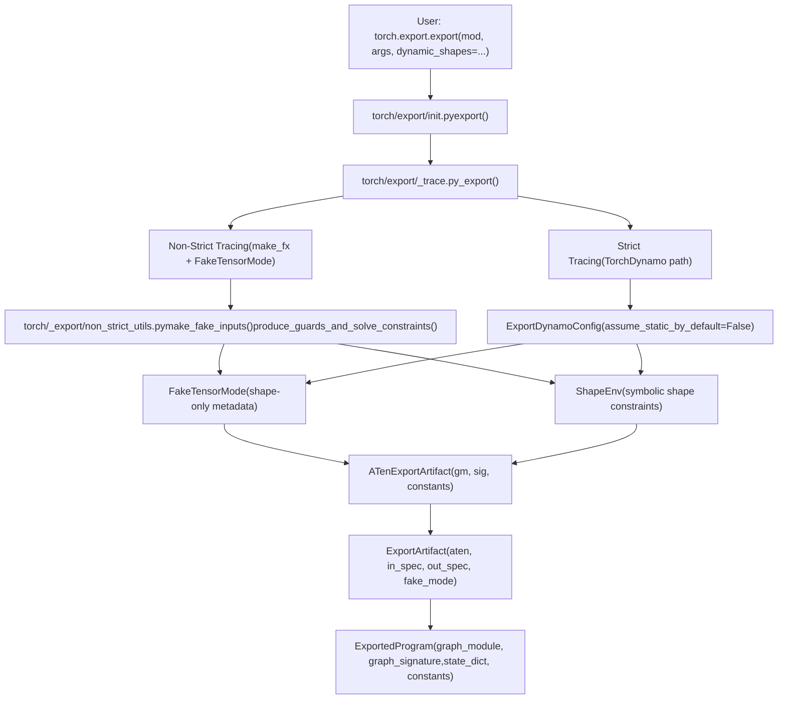

# torch.export: Static Graph Export

Relevant source files

-   [aten/src/ATen/core/PythonFallbackKernel.cpp](https://github.com/pytorch/pytorch/blob/915982a4/aten/src/ATen/core/PythonFallbackKernel.cpp)
-   [test/dynamo/test\_utils.py](https://github.com/pytorch/pytorch/blob/915982a4/test/dynamo/test_utils.py)
-   [test/export/test\_experimental.py](https://github.com/pytorch/pytorch/blob/915982a4/test/export/test_experimental.py)
-   [test/export/test\_export.py](https://github.com/pytorch/pytorch/blob/915982a4/test/export/test_export.py)
-   [test/fx/test\_fx\_xform\_observer.py](https://github.com/pytorch/pytorch/blob/915982a4/test/fx/test_fx_xform_observer.py)
-   [test/profiler/test\_record\_function.py](https://github.com/pytorch/pytorch/blob/915982a4/test/profiler/test_record_function.py)
-   [test/profiler/test\_torch\_tidy.py](https://github.com/pytorch/pytorch/blob/915982a4/test/profiler/test_torch_tidy.py)
-   [test/test\_dynamic\_shapes.py](https://github.com/pytorch/pytorch/blob/915982a4/test/test_dynamic_shapes.py)
-   [test/test\_proxy\_tensor.py](https://github.com/pytorch/pytorch/blob/915982a4/test/test_proxy_tensor.py)
-   [torch/\_dynamo/config.py](https://github.com/pytorch/pytorch/blob/915982a4/torch/_dynamo/config.py)
-   [torch/\_dynamo/convert\_frame.py](https://github.com/pytorch/pytorch/blob/915982a4/torch/_dynamo/convert_frame.py)
-   [torch/\_dynamo/eval\_frame.py](https://github.com/pytorch/pytorch/blob/915982a4/torch/_dynamo/eval_frame.py)
-   [torch/\_dynamo/functional\_export.py](https://github.com/pytorch/pytorch/blob/915982a4/torch/_dynamo/functional_export.py)
-   [torch/\_dynamo/utils.py](https://github.com/pytorch/pytorch/blob/915982a4/torch/_dynamo/utils.py)
-   [torch/\_export/non\_strict\_utils.py](https://github.com/pytorch/pytorch/blob/915982a4/torch/_export/non_strict_utils.py)
-   [torch/export/\_\_init\_\_.py](https://github.com/pytorch/pytorch/blob/915982a4/torch/export/__init__.py)
-   [torch/export/\_trace.py](https://github.com/pytorch/pytorch/blob/915982a4/torch/export/_trace.py)
-   [torch/fx/experimental/symbolic\_shapes.py](https://github.com/pytorch/pytorch/blob/915982a4/torch/fx/experimental/symbolic_shapes.py)
-   [torch/fx/passes/graph\_transform\_observer.py](https://github.com/pytorch/pytorch/blob/915982a4/torch/fx/passes/graph_transform_observer.py)

## Purpose and Scope

`torch.export` produces a fully-traced, serializable, ahead-of-time (AOT) artifact called an `ExportedProgram` from any `torch.nn.Module`. Unlike `torch.compile`, which optimizes at runtime using JIT compilation, `torch.export` captures a **complete, portable static graph** at export time with explicit shape constraints and no Python control flow in the exported representation.

This page covers the overall architecture of `torch.export`, the `ExportedProgram` artifact, strict vs. non-strict tracing modes, and the shape constraint system.

-   For details on the `ExportedProgram` API and `_trace.py` internals, see [2.3.1](/pytorch/pytorch/2.3.1-export-api-and-exportedprogram).
-   For symbolic shapes and `Dim`\-based dynamic dimensions, see [2.3.2](/pytorch/pytorch/2.3.2-symbolic-shapes-and-dynamic-dimensions).
-   For `FakeTensorMode` and metadata propagation, see [2.3.3](/pytorch/pytorch/2.3.3-faketensormode-and-metadata-propagation).
-   For how TorchDynamo works in strict mode, see [2.2](/pytorch/pytorch/2.2-torchdynamo-frontend).

---

## High-Level Architecture

The `export()` call takes a `torch.nn.Module` and example inputs and routes through either a Dynamo-based strict tracer or a `make_fx`\-based non-strict tracer, then packages the result into an `ExportedProgram`.

**Diagram: `torch.export` System Overview**


Sources: [torch/export/\_\_init\_\_.py59-68](https://github.com/pytorch/pytorch/blob/915982a4/torch/export/__init__.py#L59-L68) [torch/export/\_trace.py120-175](https://github.com/pytorch/pytorch/blob/915982a4/torch/export/_trace.py#L120-L175) [torch/\_export/non\_strict\_utils.py1-70](https://github.com/pytorch/pytorch/blob/915982a4/torch/_export/non_strict_utils.py#L1-L70)

---

## The `export()` API

The main entry point is `torch.export.export()` defined in [torch/export/\_\_init\_\_.py59-68](https://github.com/pytorch/pytorch/blob/915982a4/torch/export/__init__.py#L59-L68)

```
def export(    mod: torch.nn.Module,    args: tuple[Any, ...],    kwargs: Mapping[str, Any] | None = None,    *,    dynamic_shapes: dict[str, Any] | tuple[Any, ...] | list[Any] | None = None,    strict: bool = False,    preserve_module_call_signature: tuple[str, ...] = (),    prefer_deferred_runtime_asserts_over_guards: bool = False,) -> ExportedProgram:
```
| Parameter | Description |
| --- | --- |
| `mod` | The `nn.Module` to export |
| `args` | Example positional inputs used to trace |
| `kwargs` | Example keyword inputs |
| `dynamic_shapes` | Per-dimension dynamism spec using `Dim` objects |
| `strict` | `True` = Dynamo-based tracing; `False` = `make_fx`\-based (default) |
| `preserve_module_call_signature` | Keep specific submodule call signatures intact |
| `prefer_deferred_runtime_asserts_over_guards` | Emit runtime asserts instead of specializing at trace time |

**Key behavioral difference vs. `torch.compile`:** `export()` uses `assume_static_by_default=False` and `automatic_dynamic_shapes=False` (set in `ExportDynamoConfig` [torch/export/\_trace.py136-143](https://github.com/pytorch/pytorch/blob/915982a4/torch/export/_trace.py#L136-L143)), meaning all shapes are treated as potentially dynamic unless explicitly constrained — the opposite of the `torch.compile` default.

Sources: [torch/export/\_\_init\_\_.py59-175](https://github.com/pytorch/pytorch/blob/915982a4/torch/export/__init__.py#L59-L175) [torch/export/\_trace.py122-145](https://github.com/pytorch/pytorch/blob/915982a4/torch/export/_trace.py#L122-L145)

---

## ExportedProgram: The Output Artifact

An `ExportedProgram` is the primary output of `export()`. It bundles all information needed to execute or serialize the exported model.

**Diagram: `ExportedProgram` Structure**


Sources: [torch/export/\_\_init\_\_.py15-52](https://github.com/pytorch/pytorch/blob/915982a4/torch/export/__init__.py#L15-L52) [test/export/test\_export.py53-64](https://github.com/pytorch/pytorch/blob/915982a4/test/export/test_export.py#L53-L64) [torch/export/\_trace.py105-112](https://github.com/pytorch/pytorch/blob/915982a4/torch/export/_trace.py#L105-L112)

### Graph Signature

`ExportGraphSignature` (from `torch/export/graph_signature.py`) describes the flat input/output interface of the exported graph. Every placeholder node in the `GraphModule` corresponds to an entry classified by `InputKind`:

| `InputKind` | Description |
| --- | --- |
| `USER_INPUT` | Actual tensor arguments passed by the caller |
| `PARAMETER` | `nn.Parameter` lifted into the graph |
| `BUFFER` | `nn.Module` buffer lifted into the graph |
| `CONSTANT_TENSOR` | Constant tensor embedded into the graph |
| `TOKEN` | Effect token for functional side-effect modeling |

Every output node is similarly described by `OutputKind`, recording which outputs are user-visible values, which are buffer mutations, etc.

### State Dict and Constants

Model weights (`parameters`, `buffers`) and lifted constant tensors (`constants`) are stored separately from the graph. The graph only uses their names as identifiers. `ExportedProgram.state_dict` holds the actual parameter and buffer tensors.

Sources: [test/export/test\_export.py379-391](https://github.com/pytorch/pytorch/blob/915982a4/test/export/test_export.py#L379-L391) [torch/export/\_trace.py147-162](https://github.com/pytorch/pytorch/blob/915982a4/torch/export/_trace.py#L147-L162)

---

## Tracing Modes: Strict vs. Non-Strict

**Diagram: Tracing Mode Comparison**

Sources: [torch/export/\_trace.py122-175](https://github.com/pytorch/pytorch/blob/915982a4/torch/export/_trace.py#L122-L175) [torch/\_export/non\_strict\_utils.py1-65](https://github.com/pytorch/pytorch/blob/915982a4/torch/_export/non_strict_utils.py#L1-L65) [torch/\_dynamo/convert\_frame.py583-610](https://github.com/pytorch/pytorch/blob/915982a4/torch/_dynamo/convert_frame.py#L583-L610)

### Strict Mode

With `strict=True`, `export()` runs the module through TorchDynamo's full symbolic execution engine, using `ExportDynamoConfig` [torch/export/\_trace.py122-145](https://github.com/pytorch/pytorch/blob/915982a4/torch/export/_trace.py#L122-L145) to override normal compilation settings:

-   `assume_static_by_default=False`: all tensor shapes are treated as dynamic until proven static
-   `do_not_emit_runtime_asserts=True`: shape assertions are deferred to a post-processing pass
-   `automatic_dynamic_shapes=False`: no automatic inference of dynamic dims
-   `capture_dynamic_output_shape_ops=True`: ops with data-dependent output shapes are captured
-   `capture_scalar_outputs=True`: allows scalar outputs from `item()` calls

Dynamo's guard system still runs, but the output is used only for graph capture — not for recompilation, since the result is an `ExportedProgram`, not a compiled callable.

### Non-Strict Mode (Default)

With `strict=False`, the tracing is done via `make_fx()` with `FakeTensorMode` enabled. The key utility functions in [torch/\_export/non\_strict\_utils.py](https://github.com/pytorch/pytorch/blob/915982a4/torch/_export/non_strict_utils.py) are:

| Function | Role |
| --- | --- |
| `make_fake_inputs()` | Creates `FakeTensor` versions of all inputs with symbolic shapes |
| `_fakify_module_inputs()` | Creates fake versions of module parameters and buffers |
| `make_constraints()` | Converts `dynamic_shapes` `Dim` specs into `ShapeEnv` constraints |
| `produce_guards_and_solve_constraints()` | Runs the constraint solver and embeds shape guards into the graph |

Non-strict mode is generally faster and handles more Python patterns because it doesn't require full Dynamo symbolic execution of the Python bytecode. However, it may miss certain soundness checks that Dynamo's guard system would catch.

Sources: [torch/export/\_\_init\_\_.py65](https://github.com/pytorch/pytorch/blob/915982a4/torch/export/__init__.py#L65-L65) [torch/\_export/non\_strict\_utils.py1-70](https://github.com/pytorch/pytorch/blob/915982a4/torch/_export/non_strict_utils.py#L1-L70) [torch/export/\_trace.py122-175](https://github.com/pytorch/pytorch/blob/915982a4/torch/export/_trace.py#L122-L175)

---

## Dynamic Shapes and the `Dim` API

By default, all shapes in an exported program are **static** — the graph is specialized to the exact shapes of the example inputs. To allow a dimension to vary at runtime, use `torch.export.Dim`.

```
# From torch/export/__init__.pyfrom torch.export import Dim batch = Dim("batch", min=1, max=128)ep = torch.export.export(    mod,    (torch.randn(4, 16),),    dynamic_shapes={"x": {0: batch}},)
```
`Dim` objects are resolved through `dynamic_shapes` processing in [torch/export/dynamic\_shapes.py](https://github.com/pytorch/pytorch/blob/915982a4/torch/export/dynamic_shapes.py) (via `_process_dynamic_shapes`, `_check_dynamic_shapes`) and translated into `ShapeEnv` constraints. Any dimension not covered by a `Dim` spec remains static.

### Shape Constraint Flow

**Diagram: Dynamic Shape Constraint Resolution**

Sources: [torch/fx/experimental/symbolic\_shapes.py356-358](https://github.com/pytorch/pytorch/blob/915982a4/torch/fx/experimental/symbolic_shapes.py#L356-L358) [torch/\_export/non\_strict\_utils.py43-55](https://github.com/pytorch/pytorch/blob/915982a4/torch/_export/non_strict_utils.py#L43-L55) [test/export/test\_export.py332-350](https://github.com/pytorch/pytorch/blob/915982a4/test/export/test_export.py#L332-L350)

### `Dim.AUTO` and `Dim.STATIC`

Special sentinels exist for convenience:

-   `Dim.AUTO`: infer dynamism from usage (used in non-strict mode)
-   `Dim.STATIC`: explicitly mark a dimension as static

### `ConstraintViolationError`

If the example inputs violate the declared `Dim` bounds (e.g., a dimension is 3 but `min=6`), a `ConstraintViolationError` [torch/fx/experimental/symbolic\_shapes.py356-358](https://github.com/pytorch/pytorch/blob/915982a4/torch/fx/experimental/symbolic_shapes.py#L356-L358) is raised. In strict mode, the equivalent is a `torch._dynamo.exc.UserError`.

Sources: [test/export/test\_export.py332-350](https://github.com/pytorch/pytorch/blob/915982a4/test/export/test_export.py#L332-L350) [torch/fx/experimental/symbolic\_shapes.py356-358](https://github.com/pytorch/pytorch/blob/915982a4/torch/fx/experimental/symbolic_shapes.py#L356-L358)

---

## Internal Tracing Artifacts

**Diagram: Internal Data Flow in `_trace.py`**

Sources: [torch/export/\_trace.py147-175](https://github.com/pytorch/pytorch/blob/915982a4/torch/export/_trace.py#L147-L175) [torch/export/\_trace.py40-56](https://github.com/pytorch/pytorch/blob/915982a4/torch/export/_trace.py#L40-L56)

### Key Data Classes

| Class | File | Purpose |
| --- | --- | --- |
| `ExportDynamoConfig` | `torch/export/_trace.py` | Overrides Dynamo config specifically for export |
| `ATenExportArtifact` | `torch/export/_trace.py` | Holds the ATen-level FX graph + signature + constants |
| `ExportArtifact` | `torch/export/_trace.py` | Complete trace result including tree specs and `FakeTensorMode` |
| `ExportedProgram` | `torch/export/exported_program.py` | Final portable artifact returned to the user |
| `ExportGraphSignature` | `torch/export/graph_signature.py` | Maps flat graph I/O to semantic roles |

Sources: [torch/export/\_trace.py122-162](https://github.com/pytorch/pytorch/blob/915982a4/torch/export/_trace.py#L122-L162) [torch/export/\_\_init\_\_.py44-52](https://github.com/pytorch/pytorch/blob/915982a4/torch/export/__init__.py#L44-L52)

---

## Post-Export Operations

After the graph is captured, several operations can be applied to an `ExportedProgram`:

| Method / Function | Description |
| --- | --- |
| `ep.module()` | Returns a runnable `nn.Module` with parameters unlifted back into the module |
| `ep.run_decompositions(decomp_table)` | Decomposes composite ATen ops into primitive ones using `default_decompositions` |
| `torch.export.unflatten(ep)` | Reconstructs a module hierarchy from the flat exported graph (returns `UnflattenedModule`) |
| `torch.export.save(ep, path)` | Serializes the `ExportedProgram` to a zip file |
| `torch.export.load(path)` | Deserializes from a zip file |
| `ep._update(new_gm, new_sig)` | Creates a new `ExportedProgram` with a modified graph module and signature |

The `default_decompositions()` function [torch/export/\_\_init\_\_.py](https://github.com/pytorch/pytorch/blob/915982a4/torch/export/__init__.py) provides a standard table for lowering higher-level ATen ops. After running decompositions, the graph contains only "core ATen" operators, which is the canonical form used for serialization and most downstream backends.

Sources: [torch/export/\_\_init\_\_.py15-36](https://github.com/pytorch/pytorch/blob/915982a4/torch/export/__init__.py#L15-L36) [test/export/test\_export.py378-379](https://github.com/pytorch/pytorch/blob/915982a4/test/export/test_export.py#L378-L379) [test/export/test\_export.py628-654](https://github.com/pytorch/pytorch/blob/915982a4/test/export/test_export.py#L628-L654)

---

## Relationship to `torch.compile`

| Aspect | `torch.compile` | `torch.export` |
| --- | --- | --- |
| Output | Optimized callable with compiled kernels | Portable `ExportedProgram` (no kernels) |
| Execution | JIT at first call | AOT, graph is fully captured before use |
| Shape defaults | Static by default (`assume_static_by_default=True`) | Dynamic by default (`assume_static_by_default=False`) |
| Graph breaks | Allowed (falls back to Python) | Not allowed (export fails on unsupported ops) |
| Backend | TorchInductor, etc. | Any downstream consumer (TRT, ExecuTorch, etc.) |
| Recompilation | Automatic on guard failure | Not applicable; single static artifact |
| Operator set | Backend-specific lowered ops | Functional ATen operator set |

The `ExportDynamoConfig.replay_side_effects=False` and `side_effect_replay_policy="warn"` settings [torch/export/\_trace.py143-144](https://github.com/pytorch/pytorch/blob/915982a4/torch/export/_trace.py#L143-L144) further distinguish export's behavior: Python side effects are warned about rather than replicated, since the exported graph must be purely functional.

Sources: [torch/export/\_trace.py122-145](https://github.com/pytorch/pytorch/blob/915982a4/torch/export/_trace.py#L122-L145) [torch/\_dynamo/config.py156-163](https://github.com/pytorch/pytorch/blob/915982a4/torch/_dynamo/config.py#L156-L163)
