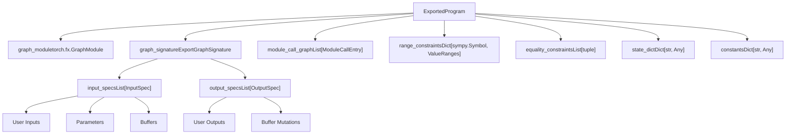
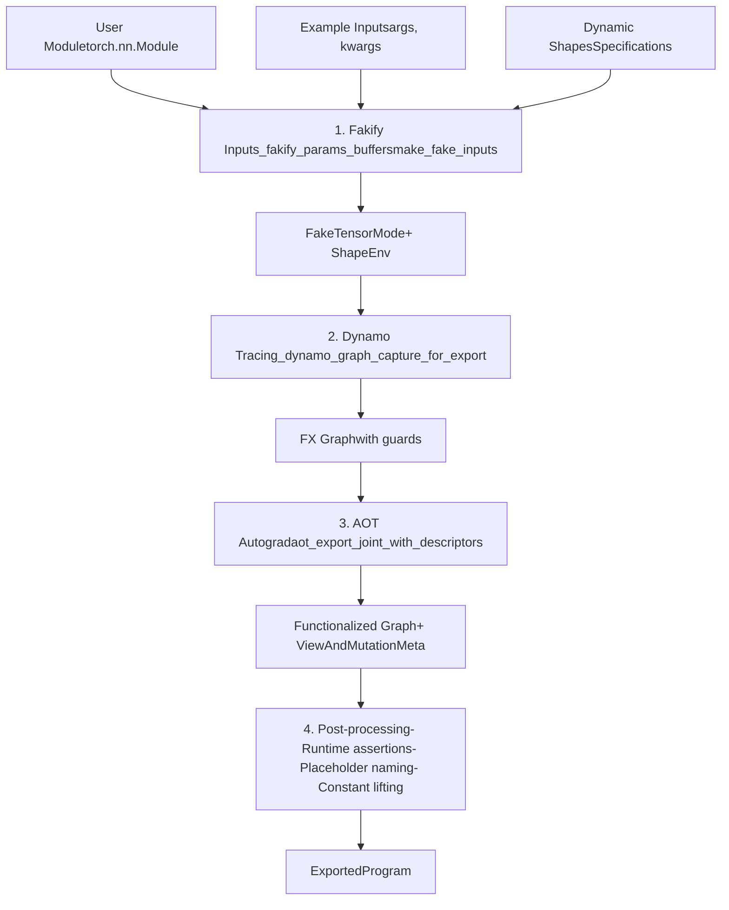
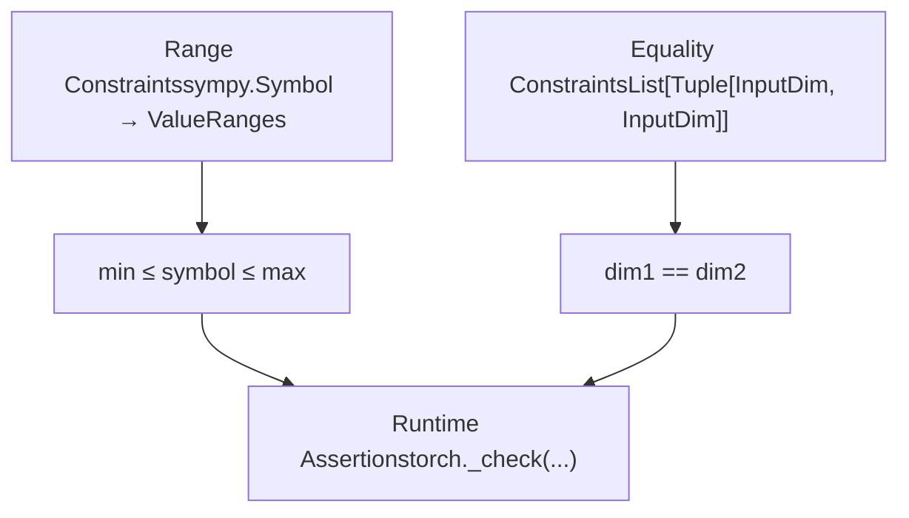
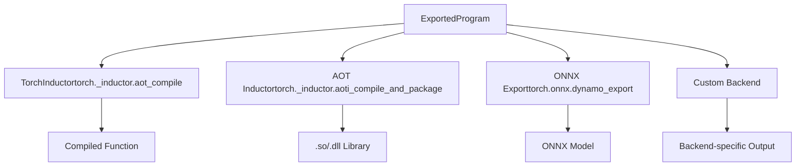

# Export API and ExportedProgram

Relevant source files

-   [aten/src/ATen/core/PythonFallbackKernel.cpp](https://github.com/pytorch/pytorch/blob/915982a4/aten/src/ATen/core/PythonFallbackKernel.cpp)
-   [test/dynamo/test\_utils.py](https://github.com/pytorch/pytorch/blob/915982a4/test/dynamo/test_utils.py)
-   [test/export/test\_experimental.py](https://github.com/pytorch/pytorch/blob/915982a4/test/export/test_experimental.py)
-   [test/export/test\_export.py](https://github.com/pytorch/pytorch/blob/915982a4/test/export/test_export.py)
-   [test/fx/test\_fx\_xform\_observer.py](https://github.com/pytorch/pytorch/blob/915982a4/test/fx/test_fx_xform_observer.py)
-   [test/profiler/test\_record\_function.py](https://github.com/pytorch/pytorch/blob/915982a4/test/profiler/test_record_function.py)
-   [test/profiler/test\_torch\_tidy.py](https://github.com/pytorch/pytorch/blob/915982a4/test/profiler/test_torch_tidy.py)
-   [test/test\_dynamic\_shapes.py](https://github.com/pytorch/pytorch/blob/915982a4/test/test_dynamic_shapes.py)
-   [test/test\_proxy\_tensor.py](https://github.com/pytorch/pytorch/blob/915982a4/test/test_proxy_tensor.py)
-   [torch/\_dynamo/config.py](https://github.com/pytorch/pytorch/blob/915982a4/torch/_dynamo/config.py)
-   [torch/\_dynamo/convert\_frame.py](https://github.com/pytorch/pytorch/blob/915982a4/torch/_dynamo/convert_frame.py)
-   [torch/\_dynamo/eval\_frame.py](https://github.com/pytorch/pytorch/blob/915982a4/torch/_dynamo/eval_frame.py)
-   [torch/\_dynamo/functional\_export.py](https://github.com/pytorch/pytorch/blob/915982a4/torch/_dynamo/functional_export.py)
-   [torch/\_dynamo/utils.py](https://github.com/pytorch/pytorch/blob/915982a4/torch/_dynamo/utils.py)
-   [torch/\_export/non\_strict\_utils.py](https://github.com/pytorch/pytorch/blob/915982a4/torch/_export/non_strict_utils.py)
-   [torch/export/\_\_init\_\_.py](https://github.com/pytorch/pytorch/blob/915982a4/torch/export/__init__.py)
-   [torch/export/\_trace.py](https://github.com/pytorch/pytorch/blob/915982a4/torch/export/_trace.py)
-   [torch/fx/experimental/symbolic\_shapes.py](https://github.com/pytorch/pytorch/blob/915982a4/torch/fx/experimental/symbolic_shapes.py)
-   [torch/fx/passes/graph\_transform\_observer.py](https://github.com/pytorch/pytorch/blob/915982a4/torch/fx/passes/graph_transform_observer.py)

## Purpose and Scope

This page documents PyTorch's **export API** and the **ExportedProgram** data structure. The export system enables capturing PyTorch models as portable, static computation graphs suitable for deployment, serialization, and ahead-of-time compilation.

**Related pages:**

-   For information about the full compilation pipeline starting from user code, see [2.1](/pytorch/pytorch/2.1-torch.compile-pipeline-overview)
-   For TorchDynamo's dynamic tracing system, see [2.2](/pytorch/pytorch/2.2-torchdynamo-frontend)
-   For AOT Autograd and graph transformations, see [2.4](/pytorch/pytorch/2.4-aot-autograd-and-functionalization)

**Key distinctions:**

-   **Export**: Creates a **static** graph representation with explicit shape constraints, suitable for serialization and deployment
-   **torch.compile**: Performs **dynamic** compilation with runtime guards and recompilation
-   **make\_fx**: Lower-level tracing utility; export builds on top of this with additional guarantees

---

## Export API Overview

The primary entry point for exporting models is the `torch.export.export()` function, which traces a PyTorch module and produces an `ExportedProgram`.

### Core API

```
def export(    mod: torch.nn.Module,    args: tuple[Any, ...],    kwargs: dict[str, Any] | None = None,    *,    dynamic_shapes: dict[str, Any] | tuple[Any] | list[Any] | None = None,    strict: bool = True,    preserve_module_call_signature: tuple[str, ...] = (),) -> ExportedProgram
```
**Sources:** [torch/export/\_\_init\_\_.py1-200](https://github.com/pytorch/pytorch/blob/915982a4/torch/export/__init__.py#L1-L200) [torch/export/\_trace.py1-100](https://github.com/pytorch/pytorch/blob/915982a4/torch/export/_trace.py#L1-L100)

### Basic Usage Pattern

```
import torchfrom torch.export import export, Dim class MyModel(torch.nn.Module):    def forward(self, x, y):        return x.matmul(y) + x model = MyModel()inputs = (torch.randn(4, 4), torch.randn(4, 4)) # Static shapes exportep = export(model, inputs) # Dynamic shapes exportbatch = Dim("batch", min=1, max=64)ep_dynamic = export(model, inputs, dynamic_shapes={"x": {0: batch}})
```
**Sources:** [test/export/test\_export.py600-700](https://github.com/pytorch/pytorch/blob/915982a4/test/export/test_export.py#L600-L700)

---

## ExportedProgram Structure

The `ExportedProgram` is the primary output of the export process, containing a complete, self-contained representation of the model.


**Diagram: ExportedProgram Data Structure**

### Key Components

| Component | Type | Description |
| --- | --- | --- |
| `graph_module` | `torch.fx.GraphModule` | FX graph containing ATen operations |
| `graph_signature` | `ExportGraphSignature` | Metadata about inputs/outputs and their semantics |
| `state_dict` | `Dict[str, Any]` | Parameters and buffers |
| `range_constraints` | `Dict[sympy.Symbol, ValueRanges]` | Constraints on symbolic dimensions |
| `module_call_graph` | `List[ModuleCallEntry]` | Hierarchical module structure |
| `constants` | `Dict[str, Any]` | Lifted constant tensors |

**Sources:** [torch/export/exported\_program.py1-300](https://github.com/pytorch/pytorch/blob/915982a4/torch/export/exported_program.py#L1-L300) [torch/export/graph\_signature.py1-200](https://github.com/pytorch/pytorch/blob/915982a4/torch/export/graph_signature.py#L1-L200)

### ExportGraphSignature Details

The graph signature specifies the semantic meaning of each graph input and output:

```
@dataclassclass ExportGraphSignature:    input_specs: List[InputSpec]    output_specs: List[OutputSpec]
```
**Input kinds:**

-   `InputKind.USER_INPUT`: Regular function arguments
-   `InputKind.PARAMETER`: Model parameters
-   `InputKind.BUFFER`: Model buffers
-   `InputKind.CONSTANT_TENSOR`: Lifted constants
-   `InputKind.CUSTOM_OBJ`: Custom objects (e.g., torch.ScriptObject)

**Output kinds:**

-   `OutputKind.USER_OUTPUT`: Regular return values
-   `OutputKind.LOSS_OUTPUT`: Training loss (preserved for backward)
-   `OutputKind.BUFFER_MUTATION`: Modified buffer
-   `OutputKind.GRADIENT_TO_PARAMETER`: Parameter gradients (training IR)
-   `OutputKind.GRADIENT_TO_USER_INPUT`: Input gradients (training IR)

**Sources:** [torch/export/graph\_signature.py1-300](https://github.com/pytorch/pytorch/blob/915982a4/torch/export/graph_signature.py#L1-L300)

---

## Export Process Flow

The export process involves multiple stages of transformation from user code to the final `ExportedProgram`.


**Diagram: Export Pipeline Stages**

### Stage 1: Input Fakification

Export begins by converting real tensors into `FakeTensor` objects that track symbolic shapes:

```
# Key function: _fakify_params_buffers in torch/_export/utils.py# Creates fake tensors for parameters and buffers# Establishes symbolic shape context fake_mode = FakeTensorMode(shape_env=ShapeEnv(...))fake_params = {}for name, param in module.named_parameters():    fake_params[name] = fake_mode.from_tensor(param, symbolic_context=...)
```
The `ShapeEnv` tracks symbolic relationships between dimensions and manages constraints.

**Sources:** [torch/\_export/utils.py1-200](https://github.com/pytorch/pytorch/blob/915982a4/torch/_export/utils.py#L1-L200) [torch/\_export/non\_strict\_utils.py200-400](https://github.com/pytorch/pytorch/blob/915982a4/torch/_export/non_strict_utils.py#L200-L400)

### Stage 2: Dynamo Graph Capture

TorchDynamo traces the module execution, capturing Python bytecode and converting it to FX operations:

```
# Implemented in torch/_dynamo/functional_export.pygm, guards, ... = _dynamo_graph_capture_for_export(    f=flat_fn,    args=flat_fake_args,    kwargs={},    dynamic_shapes=dynamic_shapes,)
```
This uses Dynamo's symbolic execution system but with export-specific configurations:

-   `assume_static_by_default=False` for dynamic shapes
-   `capture_scalar_outputs=True` to preserve scalar returns
-   `specialize_int=True` for proper int handling

**Sources:** [torch/\_dynamo/functional\_export.py1-300](https://github.com/pytorch/pytorch/blob/915982a4/torch/_dynamo/functional_export.py#L1-L300) [torch/export/\_trace.py400-600](https://github.com/pytorch/pytorch/blob/915982a4/torch/export/_trace.py#L400-L600)

### Stage 3: AOT Autograd Functionalization

The graph is processed through AOT Autograd to:

1.  Remove mutations (functionalization)
2.  Establish forward/backward split
3.  Generate metadata about view/mutation relationships

```
# torch/_functorch/aot_autograd.pygm, graph_signature = aot_export_joint_with_descriptors(    f=gm,    args=fake_args,    # Creates ViewAndMutationMeta)
```
**Sources:** [torch/\_functorch/aot\_autograd.py1-500](https://github.com/pytorch/pytorch/blob/915982a4/torch/_functorch/aot_autograd.py#L1-L500) [torch/export/\_trace.py600-800](https://github.com/pytorch/pytorch/blob/915982a4/torch/export/_trace.py#L600-L800)

### Stage 4: Post-Processing

Final transformations prepare the graph for export:

-   **Runtime assertion pass**: Converts shape guards to runtime checks
-   **Placeholder naming pass**: Assigns semantic names to graph inputs
-   **Constant lifting pass**: Extracts constant tensors to `constants` dict

**Sources:** [torch/\_export/utils.py300-500](https://github.com/pytorch/pytorch/blob/915982a4/torch/_export/utils.py#L300-L500) [torch/\_export/passes/lift\_constants\_pass.py1-200](https://github.com/pytorch/pytorch/blob/915982a4/torch/_export/passes/lift_constants_pass.py#L1-L200)

---

## Dynamic Shapes and Constraints

Export supports dynamic shapes through symbolic dimension specifications.

### Dim API

```
from torch.export import Dim # Basic dimension with rangebatch = Dim("batch", min=1, max=1024) # Dimension with exact valueseq_len = Dim("seq_len", min=128, max=128)  # Static dimension # Use in dynamic_shapesdynamic_shapes = {    "x": {0: batch, 1: seq_len},  # Dict mapping dim index to Dim    "y": {0: batch},} ep = export(model, (x, y), dynamic_shapes=dynamic_shapes)
```
### Constraint Types


**Diagram: Constraint System**

### How Constraints Are Established

1.  **User-specified via `Dim`**: Explicit min/max bounds
2.  **Inferred from operations**: Operations like indexing can create implicit constraints
3.  **Equality constraints**: Shared `Dim` objects create equality relationships

```
# Example: Equality constraintbatch = Dim("batch")dynamic_shapes = {    "x": {0: batch},    "y": {0: batch},  # Same batch dimension}# Creates equality constraint: x.shape[0] == y.shape[0]
```
**Runtime assertions** are inserted into the graph:

```
# Generated runtime checktorch._check(s0 >= 1)  # Min constrainttorch._check(s0 <= 1024)  # Max constraint
```
**Sources:** [torch/export/dynamic\_shapes.py1-400](https://github.com/pytorch/pytorch/blob/915982a4/torch/export/dynamic_shapes.py#L1-L400) [torch/\_export/utils.py500-700](https://github.com/pytorch/pytorch/blob/915982a4/torch/_export/utils.py#L500-L700)

---

## Strict vs Non-Strict Export

Export offers two modes with different tradeoffs:

| Aspect | Strict Mode | Non-Strict Mode (Default) |
| --- | --- | --- |
| **Graph Breaks** | Not allowed (error) | Allowed (multiple graphs) |
| **Python Control Flow** | Must be torch ops | Can be Python |
| **Side Effects** | Limited | More permissive |
| **Use Case** | Production deployment | Development/debugging |

### Non-Strict Mode

Non-strict mode is the default (`strict=False`) and provides more flexibility during development:

```
ep = export(model, inputs, strict=False)# - May contain graph breaks# - Python control flow preserved as separate subgraphs# - More flexible but less optimizable
```
**Implementation**: Uses special Dynamo configuration with relaxed constraints.

### Strict Mode

Strict mode (`strict=True`) provides stronger guarantees for production deployment:

```
ep = export(model, inputs, strict=True)# - Single graph, no breaks# - All control flow via torch.cond, torch.while_loop# - Fully static, optimizable
```
**Implementation**: Uses `capture_pre_autograd_graph=False` and strict Dynamo configs.

**Sources:** [torch/export/\_trace.py200-400](https://github.com/pytorch/pytorch/blob/915982a4/torch/export/_trace.py#L200-L400) [torch/\_export/non\_strict\_utils.py1-300](https://github.com/pytorch/pytorch/blob/915982a4/torch/_export/non_strict_utils.py#L1-L300)

---

## Integration with Compilation Backends

The `ExportedProgram` serves as input to various backends:


**Diagram: ExportedProgram Backend Integration**

### Example: Compilation

```
import torch._inductor # Export modelep = torch.export.export(model, example_inputs) # Compile with Inductorcompiled_fn = torch._inductor.aot_compile(    ep.module(),    example_inputs,) # Or package for deploymenttorch._inductor.aoti_compile_and_package(    ep,    package_path="model.pt2",)
```
**Sources:** [test/inductor/test\_aot\_inductor.py1-100](https://github.com/pytorch/pytorch/blob/915982a4/test/inductor/test_aot_inductor.py#L1-L100) [torch/\_inductor/aot\_compile.py1-200](https://github.com/pytorch/pytorch/blob/915982a4/torch/_inductor/aot_compile.py#L1-L200)

---

## Key Implementation Files

### Export Core

| File | Purpose |
| --- | --- |
| `torch/export/__init__.py` | Public API surface |
| `torch/export/_trace.py` | Core export implementation (`_export`) |
| `torch/export/exported_program.py` | `ExportedProgram` class definition |
| `torch/export/graph_signature.py` | Input/output specification types |
| `torch/export/dynamic_shapes.py` | Dynamic shape constraint system |

### Utilities and Passes

| File | Purpose |
| --- | --- |
| `torch/_export/utils.py` | Fakification, placeholder naming |
| `torch/_export/passes/lift_constants_pass.py` | Constant tensor lifting |
| `torch/_export/passes/collect_tracepoints_pass.py` | Debugging metadata |
| `torch/_export/non_strict_utils.py` | Non-strict mode support |

### Integration Points

| File | Purpose |
| --- | --- |
| `torch/_dynamo/functional_export.py` | Dynamo graph capture for export |
| `torch/_functorch/aot_autograd.py` | Functionalization and metadata |
| `torch/fx/experimental/symbolic_shapes.py` | Symbolic shape system |

**Sources:** All files listed above

---

## Example: Complete Export Workflow

```
import torchfrom torch.export import export, Dim # 1. Define modelclass MyModel(torch.nn.Module):    def __init__(self):        super().__init__()        self.linear = torch.nn.Linear(10, 10)        def forward(self, x, y):        return self.linear(x) * y model = MyModel() # 2. Prepare example inputsx = torch.randn(4, 10)y = torch.randn(4, 10) # 3. Define dynamic shapesbatch = Dim("batch", min=1, max=64)dynamic_shapes = {    "x": {0: batch},    "y": {0: batch},} # 4. Exportep = export(model, (x, y), dynamic_shapes=dynamic_shapes) # 5. Inspect structureprint(ep.graph_signature)# ExportGraphSignature(#   input_specs=[#     InputSpec(kind=USER_INPUT, arg=..., target='x'),#     InputSpec(kind=USER_INPUT, arg=..., target='y'),#     InputSpec(kind=PARAMETER, arg=..., target='linear.weight'),#     InputSpec(kind=PARAMETER, arg=..., target='linear.bias'),#   ],#   output_specs=[#     OutputSpec(kind=USER_OUTPUT, arg=..., target='output_0'),#   ]# ) print(ep.range_constraints)# {s0: ValueRanges(lower=1, upper=64)} # 6. Execute exported programresult = ep.module()(x, y) # 7. Verify correctnessexpected = model(x, y)assert torch.allclose(result, expected)
```
**Sources:** [test/export/test\_export.py600-700](https://github.com/pytorch/pytorch/blob/915982a4/test/export/test_export.py#L600-L700)
