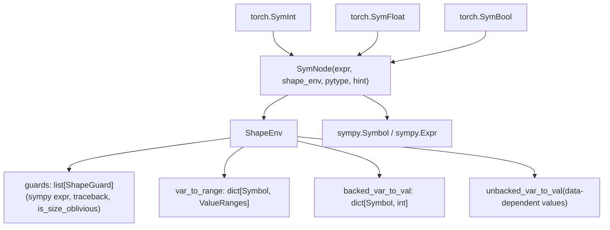
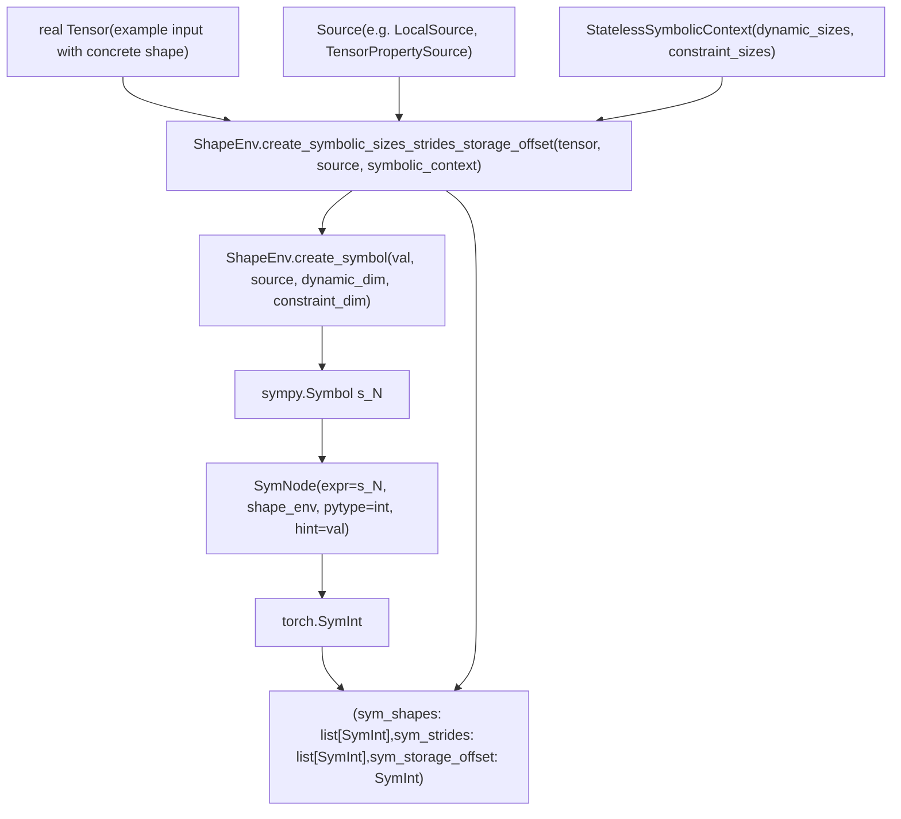
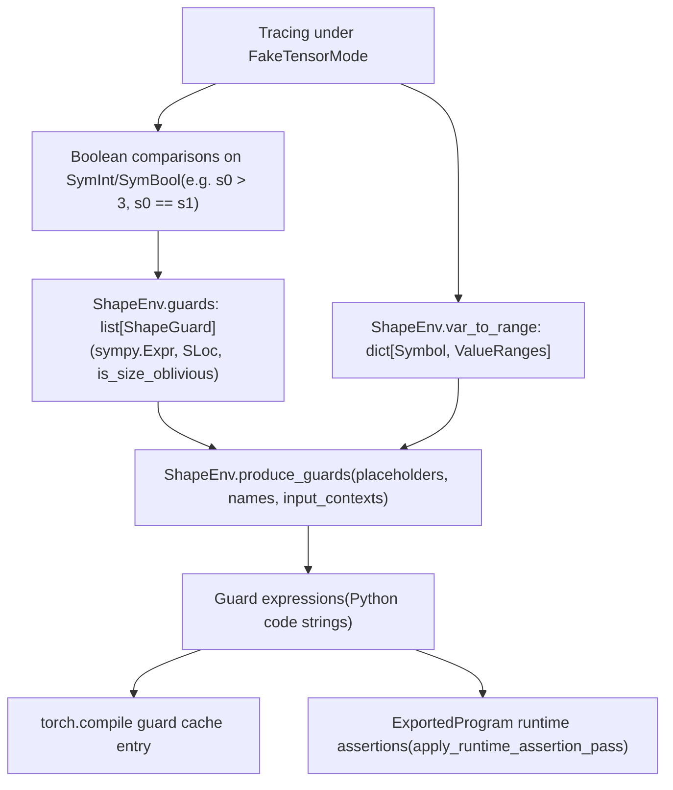
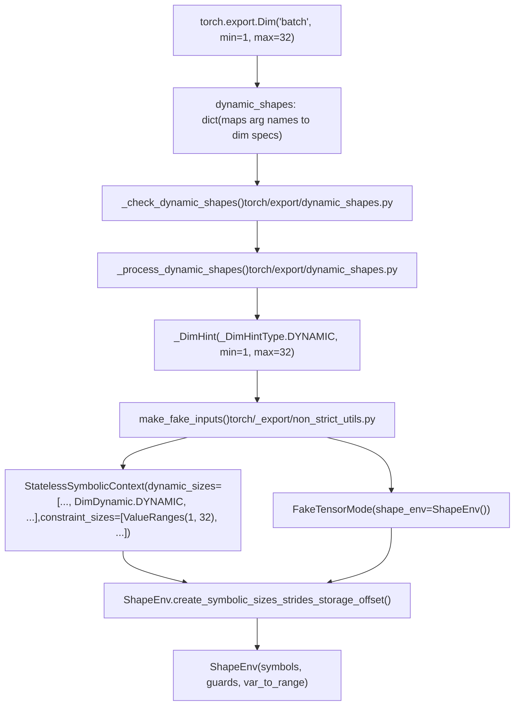

# Symbolic Shapes and Dynamic Dimensions

Relevant source files

-   [aten/src/ATen/core/PythonFallbackKernel.cpp](https://github.com/pytorch/pytorch/blob/915982a4/aten/src/ATen/core/PythonFallbackKernel.cpp)
-   [test/dynamo/test\_utils.py](https://github.com/pytorch/pytorch/blob/915982a4/test/dynamo/test_utils.py)
-   [test/export/test\_experimental.py](https://github.com/pytorch/pytorch/blob/915982a4/test/export/test_experimental.py)
-   [test/export/test\_export.py](https://github.com/pytorch/pytorch/blob/915982a4/test/export/test_export.py)
-   [test/fx/test\_fx\_xform\_observer.py](https://github.com/pytorch/pytorch/blob/915982a4/test/fx/test_fx_xform_observer.py)
-   [test/profiler/test\_record\_function.py](https://github.com/pytorch/pytorch/blob/915982a4/test/profiler/test_record_function.py)
-   [test/profiler/test\_torch\_tidy.py](https://github.com/pytorch/pytorch/blob/915982a4/test/profiler/test_torch_tidy.py)
-   [test/test\_dynamic\_shapes.py](https://github.com/pytorch/pytorch/blob/915982a4/test/test_dynamic_shapes.py)
-   [test/test\_proxy\_tensor.py](https://github.com/pytorch/pytorch/blob/915982a4/test/test_proxy_tensor.py)
-   [torch/\_dynamo/config.py](https://github.com/pytorch/pytorch/blob/915982a4/torch/_dynamo/config.py)
-   [torch/\_dynamo/convert\_frame.py](https://github.com/pytorch/pytorch/blob/915982a4/torch/_dynamo/convert_frame.py)
-   [torch/\_dynamo/eval\_frame.py](https://github.com/pytorch/pytorch/blob/915982a4/torch/_dynamo/eval_frame.py)
-   [torch/\_dynamo/functional\_export.py](https://github.com/pytorch/pytorch/blob/915982a4/torch/_dynamo/functional_export.py)
-   [torch/\_dynamo/utils.py](https://github.com/pytorch/pytorch/blob/915982a4/torch/_dynamo/utils.py)
-   [torch/\_export/non\_strict\_utils.py](https://github.com/pytorch/pytorch/blob/915982a4/torch/_export/non_strict_utils.py)
-   [torch/export/\_\_init\_\_.py](https://github.com/pytorch/pytorch/blob/915982a4/torch/export/__init__.py)
-   [torch/export/\_trace.py](https://github.com/pytorch/pytorch/blob/915982a4/torch/export/_trace.py)
-   [torch/fx/experimental/symbolic\_shapes.py](https://github.com/pytorch/pytorch/blob/915982a4/torch/fx/experimental/symbolic_shapes.py)
-   [torch/fx/passes/graph\_transform\_observer.py](https://github.com/pytorch/pytorch/blob/915982a4/torch/fx/passes/graph_transform_observer.py)

## Purpose and Scope

This page documents the symbolic shapes subsystem: the set of types, classes, and algorithms that allow PyTorch's compilation stack to reason about tensor dimensions that may vary at runtime. The primary components covered here are:

-   `SymInt`, `SymBool`, `SymFloat` — symbolic scalar types wrapping sympy expressions
-   `ShapeEnv` — the central environment managing symbolic variables, guards, and value ranges
-   `create_symbolic_sizes_strides_storage_offset` — how a tensor's concrete dimensions become symbolic during tracing
-   Guard generation via `produce_guards` and constraint solving
-   `ConstraintViolationError` — what happens when constraints cannot be satisfied

For how `FakeTensorMode` uses these types to propagate metadata without real data, see [2.3.3](/pytorch/pytorch/2.3.3-faketensormode-and-metadata-propagation). For how guards are evaluated at runtime and trigger recompilation in `torch.compile`, see [2.2.3](/pytorch/pytorch/2.2.3-guard-system-and-recompilation). For the `torch.export` API and `ExportedProgram` that consumes the resulting guard structure, see [2.3.1](/pytorch/pytorch/2.3.1-export-api-and-exportedprogram).

---

## Core Symbolic Types

Three Python-level types represent symbolic scalars during tracing. They are defined in C++ and exposed to Python as `torch.SymInt`, `torch.SymFloat`, and `torch.SymBool`.

| Python Type | Concrete Counterpart | Internal sympy type |
| --- | --- | --- |
| `torch.SymInt` | `int` | `sympy.Expr` (integer) |
| `torch.SymFloat` | `float` | `sympy.Expr` (real) |
| `torch.SymBool` | `bool` | `sympy.logic.boolalg.Boolean` |

Each symbolic type wraps a `SymNode` (defined in `torch/fx/experimental/sym_node.py`), which holds:

-   `expr`: the underlying sympy expression (e.g., `s0`, `s0 + s1`)
-   `shape_env`: a reference to the `ShapeEnv` that owns this symbol
-   `pytype`: the Python type (`int`, `float`, or `bool`)
-   `hint`: the concrete value observed from the example input

The `__all__` list in [torch/fx/experimental/symbolic\_shapes.py141-186](https://github.com/pytorch/pytorch/blob/915982a4/torch/fx/experimental/symbolic_shapes.py#L141-L186) exposes the primary API surface.

**Key scalar utility functions** in `torch/fx/experimental/symbolic_shapes.py`:

| Function | Purpose |
| --- | --- |
| `size_hint(a, fallback)` | Retrieve the concrete hint for a `SymInt` |
| `is_concrete_int(a)` | Returns `True` if the symbol has resolved to a constant |
| `is_concrete_float(a)` | Analogous check for `SymFloat` |
| `is_concrete_bool(a)` | Analogous check for `SymBool` |
| `has_static_value(a)` | User-facing check: is this value statically known? |
| `has_symbolic_sizes_strides(t)` | True if tensor `t` has any symbolic dimension or stride |

Sources: [torch/fx/experimental/symbolic\_shapes.py379-488](https://github.com/pytorch/pytorch/blob/915982a4/torch/fx/experimental/symbolic_shapes.py#L379-L488)

---

## ShapeEnv: The Central Registry

`ShapeEnv` is the singleton environment for a given tracing session. All symbolic variables, their constraints, and accumulated guards live here. It is defined in `torch/fx/experimental/symbolic_shapes.py` and referenced across the codebase via `fake_mode.shape_env`.

**Core responsibilities:**

| Responsibility | Key attribute / method |
| --- | --- |
| Allocate symbols | `create_symbol(val, source, dynamic_dim, ...)` |
| Create tensor symbolic sizes | `create_symbolic_sizes_strides_storage_offset(...)` |
| Track concrete hints | `backed_var_to_val: dict[Symbol, int]` |
| Track value ranges | `var_to_range: dict[Symbol, ValueRanges]` |
| Accumulate guards | `guards: list[ShapeGuard]` |
| Emit guard code | `produce_guards(placeholders, names, ...)` |

**`ShapeEnv` structural relationships:**


Sources: [torch/fx/experimental/symbolic\_shapes.py141-186](https://github.com/pytorch/pytorch/blob/915982a4/torch/fx/experimental/symbolic_shapes.py#L141-L186) [torch/fx/experimental/sym\_node.py](https://github.com/pytorch/pytorch/blob/915982a4/torch/fx/experimental/sym_node.py)

---

## DimDynamic: Dimension Classification

`DimDynamic` (imported at [torch/\_dynamo/eval\_frame.py90-95](https://github.com/pytorch/pytorch/blob/915982a4/torch/_dynamo/eval_frame.py#L90-L95)) is an enum that controls how each tensor dimension is handled when creating symbolic shapes:

| Value | Meaning |
| --- | --- |
| `DUCK` | Duck-type: specialize to the concrete value. Share an existing symbol if another dimension has the same value; allocate a fresh one otherwise. |
| `DYNAMIC` | Always allocate a fresh backed symbol regardless of value. |
| `STATIC` | Treat as concrete. No symbol is created; the integer literal is used directly. |
| `INFER_RANGE` | Allocate a symbol but use range analysis to bound it without an equality guard. |

In `torch.compile`, most dimensions default to `DUCK` (then possibly promoted to `DYNAMIC` by automatic dynamic shapes). In `torch.export` with user-supplied `Dim` objects, relevant dimensions use `DYNAMIC`.

Sources: [torch/\_dynamo/eval\_frame.py90-95](https://github.com/pytorch/pytorch/blob/915982a4/torch/_dynamo/eval_frame.py#L90-L95) [test/test\_dynamic\_shapes.py183-187](https://github.com/pytorch/pytorch/blob/915982a4/test/test_dynamic_shapes.py#L183-L187)

---

## Symbolic Contexts

A *symbolic context* bundles per-tensor configuration. It is passed directly to `create_symbolic_sizes_strides_storage_offset`.

| Class | When used |
| --- | --- |
| `StatelessSymbolicContext` | Most common; specifies `DimDynamic` mode and optional range constraints per dimension |
| `StatefulSymbolicContext` | Re-tracing; maps dimension indices to pre-existing sympy symbols |
| `SubclassSymbolicContext` | Extends the above for tensor subclasses |
| `SymIntSymbolicContext` | Wraps a pre-existing `SymInt` for scalar inputs |

All are exported in [torch/fx/experimental/symbolic\_shapes.py167-172](https://github.com/pytorch/pytorch/blob/915982a4/torch/fx/experimental/symbolic_shapes.py#L167-L172) and imported into the export pipeline at [torch/\_export/non\_strict\_utils.py43-55](https://github.com/pytorch/pytorch/blob/915982a4/torch/_export/non_strict_utils.py#L43-L55)

A `StatelessSymbolicContext` in practice:

```
StatelessSymbolicContext(    dynamic_sizes=[DimDynamic.DYNAMIC, DimDynamic.STATIC],    constraint_sizes=[None, None],)
```
[test/test\_dynamic\_shapes.py190-193](https://github.com/pytorch/pytorch/blob/915982a4/test/test_dynamic_shapes.py#L190-L193)

---

## Creating Symbolic Sizes for Tensors

The method `ShapeEnv.create_symbolic_sizes_strides_storage_offset(tensor, source, symbolic_context)` is the primary entry point for symbolifying a tensor's metadata. It returns a tuple `(sym_shapes, sym_strides, sym_storage_offset)`.

For each dimension `i`:

1.  The `DimDynamic` mode is read from `symbolic_context.dynamic_sizes[i]`.
2.  For `DUCK` or `DYNAMIC`, a sympy symbol `s_N` is created via `ShapeEnv.create_symbol(val, source, dynamic_dim)`.
3.  The symbol is wrapped into a `SymNode`, then into a `SymInt`.
4.  The concrete hint is stored in `backed_var_to_val[s_N] = val`.
5.  Stride expressions are computed as sympy expressions over the shape symbols.

**Tensor symbolification flow:**


Sources: [test/test\_dynamic\_shapes.py176-203](https://github.com/pytorch/pytorch/blob/915982a4/test/test_dynamic_shapes.py#L176-L203) [test/test\_dynamic\_shapes.py219-241](https://github.com/pytorch/pytorch/blob/915982a4/test/test_dynamic_shapes.py#L219-L241)

The `source` argument identifies the provenance of each symbol within the user's input structure (e.g., `TensorPropertySource(LocalSource("x"), TensorProperty.SIZE, dim=0)`). This is used later to emit human-readable guard code like `x.shape[0] == 5`.

---

## Backed vs Unbacked Symbols

| Category | How created | Concrete hint? | Guard strategy |
| --- | --- | --- | --- |
| **Backed** | From tensor shapes/strides at trace time | Yes — in `backed_var_to_val` | Static equality/range guards emitted |
| **Unbacked** | From data-dependent ops: `tensor.item()`, `torch.unique`, etc. | No | Deferred runtime assertions inserted into the graph |

Attempting to guard statically on an unbacked symbol — for example, `if tensor.item() > 0:` during tracing — raises `GuardOnDataDependentSymNode` [torch/fx/experimental/symbolic\_shapes.py123-128](https://github.com/pytorch/pytorch/blob/915982a4/torch/fx/experimental/symbolic_shapes.py#L123-L128)

Unbacked symbol bindings are stored in `node.meta["unbacked_bindings"]` on FX graph nodes. When re-tracing:

-   `resolve_unbacked_bindings` [torch/fx/experimental/symbolic\_shapes.py542-558](https://github.com/pytorch/pytorch/blob/915982a4/torch/fx/experimental/symbolic_shapes.py#L542-L558) applies renaming from `ShapeEnv.unbacked_renamings`
-   `rebind_unbacked` [torch/fx/experimental/symbolic\_shapes.py564-622](https://github.com/pytorch/pytorch/blob/915982a4/torch/fx/experimental/symbolic_shapes.py#L564-L622) reconciles old and new unbacked symbols

Also relevant:

-   `PendingUnbackedSymbolNotFound` [torch/fx/experimental/symbolic\_shapes.py131-133](https://github.com/pytorch/pytorch/blob/915982a4/torch/fx/experimental/symbolic_shapes.py#L131-L133) — raised when an expected unbacked symbol hasn't been bound yet
-   `GuardOnDataDependentSymNode` is imported in `torch/_dynamo/convert_frame.py` at [torch/\_dynamo/convert\_frame.py71-74](https://github.com/pytorch/pytorch/blob/915982a4/torch/_dynamo/convert_frame.py#L71-L74)

---

## Guard Generation via produce\_guards

After tracing, the accumulated guards in `ShapeEnv.guards` are converted into executable Python expressions by `ShapeEnv.produce_guards(placeholders, names, ...)`.

During tracing, every comparison involving a `SymInt` (e.g., `if s0 > 3:`, `torch.cat` checking dimension equality) appends a `ShapeGuard` (a tuple of `(sympy_expr, SLoc, is_size_oblivious)`) to `ShapeEnv.guards`.

`produce_guards` then:

1.  Substitutes placeholder names for sympy symbols
2.  Applies range simplifications from `var_to_range`
3.  Emits Python guard expressions that can be evaluated against new inputs

**Guard generation pipeline:**


For `torch.export` non-strict mode, `produce_guards_and_solve_constraints` (imported at [torch/export/\_trace.py38-40](https://github.com/pytorch/pytorch/blob/915982a4/torch/export/_trace.py#L38-L40)) wraps `produce_guards` and additionally runs `DimConstraints` to solve the user-specified `Dim` constraints.

Usage example from `test/test_proxy_tensor.py` [test/test\_proxy\_tensor.py49-53](https://github.com/pytorch/pytorch/blob/915982a4/test/test_proxy_tensor.py#L49-L53):

```
def show_guards(gm):    names = [strip_end(n, "_1") for n in fx_placeholder_targets(gm)]    return "\n".join(        gm.shape_env.produce_guards(fx_placeholder_vals(gm), names, _simplified=True, input_contexts=None)    )
```
Sources: [test/test\_proxy\_tensor.py49-53](https://github.com/pytorch/pytorch/blob/915982a4/test/test_proxy_tensor.py#L49-L53) [torch/export/\_trace.py38-40](https://github.com/pytorch/pytorch/blob/915982a4/torch/export/_trace.py#L38-L40) [torch/\_export/non\_strict\_utils.py38-40](https://github.com/pytorch/pytorch/blob/915982a4/torch/_export/non_strict_utils.py#L38-L40)

---

## The Dim API for torch.export

Users declare dynamic dimensions for `torch.export` using the `Dim` class:

```
dim_batch = torch.export.Dim("batch", min=1, max=32)ep = torch.export.export(    model,    (x,),    dynamic_shapes={"x": {0: dim_batch}},)
```
`Dim` is exposed at [torch/export/\_\_init\_\_.py43](https://github.com/pytorch/pytorch/blob/915982a4/torch/export/__init__.py#L43-L43) via:

```
from .dynamic_shapes import AdditionalInputs, Constraint, Dim, dims, ShapesCollection
```
**Processing pipeline from Dim to ShapeEnv:**


Sources: [torch/export/\_\_init\_\_.py43](https://github.com/pytorch/pytorch/blob/915982a4/torch/export/__init__.py#L43-L43) [torch/export/\_trace.py80-100](https://github.com/pytorch/pytorch/blob/915982a4/torch/export/_trace.py#L80-L100) [torch/\_export/non\_strict\_utils.py30-55](https://github.com/pytorch/pytorch/blob/915982a4/torch/_export/non_strict_utils.py#L30-L55)

Special `Dim` values:

| Value | Meaning |
| --- | --- |
| `Dim("name", min=m, max=n)` | Dynamic with explicit bounds |
| `Dim.AUTO` | Let the pipeline infer dynamic vs. static |
| `Dim.STATIC` | Force static treatment |
| `Dim.DYNAMIC` | Always dynamic, no explicit bounds |

---

## Constraint Solving and ConstraintViolationError

After tracing, the system must verify that the `dynamic_shapes` specification is consistent with what the model actually requires. Inconsistencies are reported as `ConstraintViolationError` [torch/fx/experimental/symbolic\_shapes.py356-357](https://github.com/pytorch/pytorch/blob/915982a4/torch/fx/experimental/symbolic_shapes.py#L356-L357)

**Causes:**

| Cause | Example |
| --- | --- |
| Example input value violates `Dim` bounds | `Dim("x", min=6)` but example has `x.shape[0] = 3` |
| Two `Dim`s declared separate but must be equal | Model requires `x.shape[0] == y.shape[0]` |
| A declared-dynamic dimension is specialized to a constant by the model | Model branches on `if x.shape[0] == 5:` |

In non-strict mode, the raised exception is `torch.fx.experimental.symbolic_shapes.ConstraintViolationError`. In strict mode (Dynamo), it becomes `torch._dynamo.exc.UserError`.

[test/export/test\_export.py332-350](https://github.com/pytorch/pytorch/blob/915982a4/test/export/test_export.py#L332-L350):

```
dim_x = torch.export.Dim("dim_x", min=6)# inp has shape [3], which violates min=6with self.assertRaisesRegex(error_type, "not in range"):    export(InvalidModel(), (inp,), dynamic_shapes={"x": {0: dim_x}})
```
**Constraint types** imported at [torch/\_export/non\_strict\_utils.py43-55](https://github.com/pytorch/pytorch/blob/915982a4/torch/_export/non_strict_utils.py#L43-L55):

| Class | Role |
| --- | --- |
| `EqualityConstraint` | Asserts two symbolic dimensions must be equal |
| `RelaxedUnspecConstraint` | Allows a dimension to vary freely within any range |
| `DimConstraints` | Solver that reduces guard expressions and produces user suggestions |

`DimConstraints` is part of `__all__` in `torch/fx/experimental/symbolic_shapes.py` and is also imported directly in [test/test\_dynamic\_shapes.py26-38](https://github.com/pytorch/pytorch/blob/915982a4/test/test_dynamic_shapes.py#L26-L38)

`ValueRangeError` (from `torch/utils/_sympy/value_ranges.py`, imported at [torch/export/\_trace.py103](https://github.com/pytorch/pytorch/blob/915982a4/torch/export/_trace.py#L103-L103)) is raised during range arithmetic if a constraint produces an empty interval.

---

## Full Pipeline Integration

**torch.export non-strict path:**

> **[Mermaid sequence]**
> *(图表结构无法解析)*

**torch.compile path:**

-   `ShapeEnv` is embedded in `FakeTensorMode` during Dynamo graph capture.
-   Accumulated guards are stored in the compiled cache entry (`GuardedCode`) alongside the compiled graph.
-   At each subsequent call, guards are evaluated; failure triggers recompilation. See [2.2.3](/pytorch/pytorch/2.2.3-guard-system-and-recompilation).
-   `ConstraintViolationError` is caught at [torch/\_dynamo/convert\_frame.py71-74](https://github.com/pytorch/pytorch/blob/915982a4/torch/_dynamo/convert_frame.py#L71-L74) and converted into a graph break or user error.

Sources: [torch/export/\_trace.py38-103](https://github.com/pytorch/pytorch/blob/915982a4/torch/export/_trace.py#L38-L103) [torch/\_export/non\_strict\_utils.py38-55](https://github.com/pytorch/pytorch/blob/915982a4/torch/_export/non_strict_utils.py#L38-L55) [torch/\_dynamo/convert\_frame.py71-74](https://github.com/pytorch/pytorch/blob/915982a4/torch/_dynamo/convert_frame.py#L71-L74)

---

## Key Symbols Reference

| Symbol | File | Role |
| --- | --- | --- |
| `ShapeEnv` | `torch/fx/experimental/symbolic_shapes.py` | Central registry for all symbolic variables and guards |
| `SymNode` | `torch/fx/experimental/sym_node.py` | Wrapper around a sympy expression with a concrete hint |
| `SymInt`, `SymFloat`, `SymBool` | `torch` (C++ backed) | Python-level symbolic scalar types |
| `DimDynamic` | `torch/fx/experimental/symbolic_shapes.py` | Enum controlling symbol allocation strategy per dimension |
| `StatelessSymbolicContext` | `torch/fx/experimental/symbolic_shapes.py` | Per-tensor dimension configuration |
| `create_symbolic_sizes_strides_storage_offset` | method on `ShapeEnv` | Assigns symbolic variables to a tensor |
| `produce_guards` | method on `ShapeEnv` | Emits executable guard expressions from accumulated constraints |
| `ConstraintViolationError` | `torch/fx/experimental/symbolic_shapes.py:356-357` | Raised when shape constraints are inconsistent |
| `GuardOnDataDependentSymNode` | `torch/fx/experimental/symbolic_shapes.py:123-128` | Raised when trying to guard statically on an unbacked symbol |
| `Dim` | `torch/export/dynamic_shapes.py` | User-facing API for declaring dynamic tensor dimensions |
| `EqualityConstraint` | `torch/fx/experimental/symbolic_shapes.py` | Asserts two symbols are equal |
| `DimConstraints` | `torch/fx/experimental/symbolic_shapes.py` | Solves and validates user-specified dimension constraints |
| `make_fake_inputs` | `torch/_export/non_strict_utils.py` | Creates `FakeTensor` objects with symbolic shapes for export |
| `produce_guards_and_solve_constraints` | `torch/_export/non_strict_utils.py` | Export-specific wrapper combining guard generation and constraint solving |
