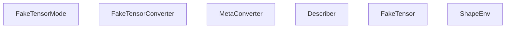
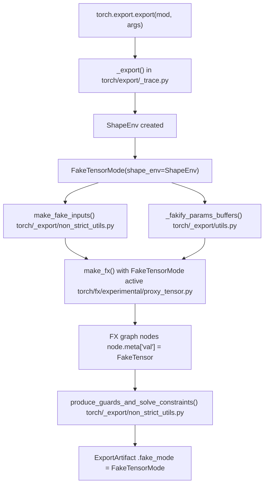
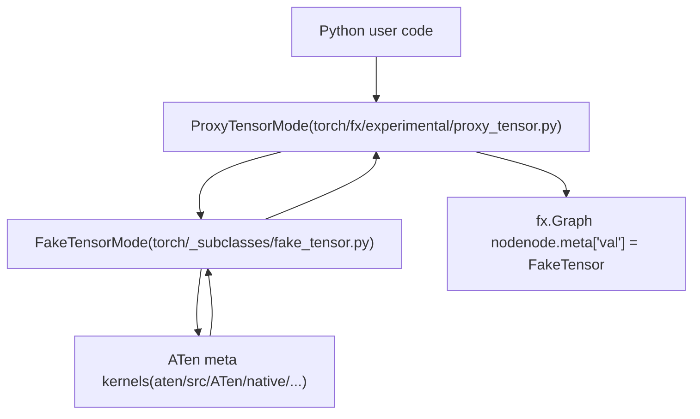

# FakeTensorMode and Metadata Propagation

Relevant source files

-   [aten/src/ATen/core/PythonFallbackKernel.cpp](https://github.com/pytorch/pytorch/blob/915982a4/aten/src/ATen/core/PythonFallbackKernel.cpp)
-   [test/dynamo/test\_utils.py](https://github.com/pytorch/pytorch/blob/915982a4/test/dynamo/test_utils.py)
-   [test/export/test\_experimental.py](https://github.com/pytorch/pytorch/blob/915982a4/test/export/test_experimental.py)
-   [test/export/test\_export.py](https://github.com/pytorch/pytorch/blob/915982a4/test/export/test_export.py)
-   [test/fx/test\_fx\_xform\_observer.py](https://github.com/pytorch/pytorch/blob/915982a4/test/fx/test_fx_xform_observer.py)
-   [test/profiler/test\_record\_function.py](https://github.com/pytorch/pytorch/blob/915982a4/test/profiler/test_record_function.py)
-   [test/profiler/test\_torch\_tidy.py](https://github.com/pytorch/pytorch/blob/915982a4/test/profiler/test_torch_tidy.py)
-   [test/test\_dynamic\_shapes.py](https://github.com/pytorch/pytorch/blob/915982a4/test/test_dynamic_shapes.py)
-   [test/test\_proxy\_tensor.py](https://github.com/pytorch/pytorch/blob/915982a4/test/test_proxy_tensor.py)
-   [torch/\_dynamo/config.py](https://github.com/pytorch/pytorch/blob/915982a4/torch/_dynamo/config.py)
-   [torch/\_dynamo/convert\_frame.py](https://github.com/pytorch/pytorch/blob/915982a4/torch/_dynamo/convert_frame.py)
-   [torch/\_dynamo/eval\_frame.py](https://github.com/pytorch/pytorch/blob/915982a4/torch/_dynamo/eval_frame.py)
-   [torch/\_dynamo/functional\_export.py](https://github.com/pytorch/pytorch/blob/915982a4/torch/_dynamo/functional_export.py)
-   [torch/\_dynamo/utils.py](https://github.com/pytorch/pytorch/blob/915982a4/torch/_dynamo/utils.py)
-   [torch/\_export/non\_strict\_utils.py](https://github.com/pytorch/pytorch/blob/915982a4/torch/_export/non_strict_utils.py)
-   [torch/export/\_\_init\_\_.py](https://github.com/pytorch/pytorch/blob/915982a4/torch/export/__init__.py)
-   [torch/export/\_trace.py](https://github.com/pytorch/pytorch/blob/915982a4/torch/export/_trace.py)
-   [torch/fx/experimental/symbolic\_shapes.py](https://github.com/pytorch/pytorch/blob/915982a4/torch/fx/experimental/symbolic_shapes.py)
-   [torch/fx/passes/graph\_transform\_observer.py](https://github.com/pytorch/pytorch/blob/915982a4/torch/fx/passes/graph_transform_observer.py)

## Purpose and Scope

This page documents `FakeTensorMode` and `FakeTensor` — the mechanism used throughout PyTorch's compilation and export pipelines to trace tensor operations on shape and dtype metadata alone, without executing real computations. It covers how tensor metadata (shape, stride, dtype, device) propagates through FX graph nodes during tracing, and how symbolic shapes (SymInt) integrate with this system.

For the symbolic shape expressions and constraint system built on top of FakeTensorMode, see [Symbolic Shapes and Dynamic Dimensions](/pytorch/pytorch/2.3.2-symbolic-shapes-and-dynamic-dimensions). For the export pipeline that orchestrates these components, see [Export API and ExportedProgram](/pytorch/pytorch/2.3.1-export-api-and-exportedprogram). For AOT Autograd's use of FakeTensorMode in joint tracing, see [AOT Autograd Pipeline](/pytorch/pytorch/2.4.1-aot-autograd-pipeline).

---

## Core Components

`FakeTensorMode` is a `TorchDispatchMode` (a Python-level dispatch mode that intercepts all ATen operations). When active, every tensor operation returns a `FakeTensor` — a subclass of `torch.Tensor` that carries real metadata (shape, stride, dtype, device layout) but holds no actual data in memory.

| Component | Location | Role |
| --- | --- | --- |
| `FakeTensorMode` | `torch/_subclasses/fake_tensor.py` | Dispatch mode; routes ops to meta implementations |
| `FakeTensor` | `torch/_subclasses/fake_tensor.py` | Tensor subclass carrying metadata only |
| `FakeTensorConverter` | `torch/_subclasses/fake_tensor.py` | Converts real tensors into `FakeTensor` instances |
| `MetaConverter` | `torch/_subclasses/meta_utils.py` | Converts storage/tensor structures to meta device equivalents |
| `ShapeEnv` | `torch/fx/experimental/symbolic_shapes.py` | Holds symbolic shape variables (SymInt/SymFloat) and guards |
| `StatelessSymbolicContext` | `torch/fx/experimental/symbolic_shapes.py` | Specifies which dimensions should be symbolic when creating a FakeTensor |

### Internal Structure of FakeTensorMode

**FakeTensorMode Internal Structure**


Sources: [torch/\_dynamo/convert\_frame.py210-218](https://github.com/pytorch/pytorch/blob/915982a4/torch/_dynamo/convert_frame.py#L210-L218) [test/test\_dynamic\_shapes.py206-216](https://github.com/pytorch/pytorch/blob/915982a4/test/test_dynamic_shapes.py#L206-L216)

---

## How FakeTensorMode Intercepts Operations

When `FakeTensorMode` is active on the dispatch stack, every `torch.ops.aten.*` call is redirected through `FakeTensorMode.__torch_dispatch__`. Rather than executing the real kernel, it looks up a **meta implementation** for the operator — a function that computes the output metadata (shape, dtype, etc.) from the input metadata without touching actual data.

Two important exception types signal when metadata-only reasoning is insufficient:

-   `DynamicOutputShapeException` — the output shape depends on the **values** of input tensors (e.g., `torch.nonzero`). This introduces unbacked SymInts.
-   `DataDependentOutputException` — the operation cannot be traced at all without data (e.g., some masked operations).

Sources: [test/test\_proxy\_tensor.py14](https://github.com/pytorch/pytorch/blob/915982a4/test/test_proxy_tensor.py#L14-L14)

---

## Metadata Propagation in FX Graph Nodes

When `make_fx` (from `torch/fx/experimental/proxy_tensor.py`) is used, it combines `FakeTensorMode` with `ProxyTensorMode`. Each operation is simultaneously:

1.  Dispatched through `FakeTensorMode` to compute output metadata.
2.  Recorded as an FX `Node` in the graph.

The FX node's `.meta` dictionary is populated with key fields:

| `node.meta` key | Type | Content |
| --- | --- | --- |
| `"val"` | `FakeTensor` or `SymInt` | The symbolic output of the operation |
| `"tensor_meta"` | `TensorMetadata` | Shape, stride, dtype (static snapshot) |
| `"unbacked_bindings"` | `dict[Symbol, KeyPath]` | Maps unbacked SymInt symbols to their pytree path in the output |
| `"nn_module_stack"` | `dict` | Stack of containing `nn.Module` instances |
| `"source_fn_stack"` | `list` | Stack of source function names for provenance |
| `"from_node"` | `list[NodeSource]` | Provenance tracking for graph transformations |

The `"val"` field is the primary carrier of propagated metadata: any downstream pass inspecting a node's output shape reads `node.meta["val"].shape`, which may contain `SymInt` objects backed by `ShapeEnv`.

**Node metadata flow during make\_fx tracing**

> **[Mermaid sequence]**
> *(图表结构无法解析)*

Sources: [torch/fx/experimental/symbolic\_shapes.py189-190](https://github.com/pytorch/pytorch/blob/915982a4/torch/fx/experimental/symbolic_shapes.py#L189-L190) [torch/export/\_trace.py89-94](https://github.com/pytorch/pytorch/blob/915982a4/torch/export/_trace.py#L89-L94)

---

## Creating FakeTensors with Symbolic Shapes

To trace a model with dynamic (symbolic) dimensions, `FakeTensorMode` must be instantiated with a `ShapeEnv`, and tensors are created via `from_tensor` with a `StatelessSymbolicContext` specifying which dimensions are dynamic.

The pattern used throughout the codebase:

```
# From test/test_dynamic_shapes.pywith FakeTensorMode(shape_env=shape_env) as fake_mode:    return fake_mode.from_tensor(        x,        symbolic_context=StatelessSymbolicContext(            dynamic_sizes=dynamic_sizes,            dynamic_strides=dynamic_strides,        ),    )
```
`StatelessSymbolicContext` accepts per-dimension `DimDynamic` flags:

-   `DimDynamic.STATIC` — treat as a concrete integer
-   `DimDynamic.DYNAMIC` — create a fresh `SymInt` backed by `ShapeEnv`
-   `DimDynamic.DUCK` — share a `SymInt` with other tensors that happen to have the same size at trace time

Sources: [test/test\_dynamic\_shapes.py206-216](https://github.com/pytorch/pytorch/blob/915982a4/test/test_dynamic_shapes.py#L206-L216)

---

## Role in torch.export

### Export Pipeline and FakeTensorMode

**FakeTensorMode placement in the export pipeline**


Sources: [torch/export/\_trace.py76](https://github.com/pytorch/pytorch/blob/915982a4/torch/export/_trace.py#L76-L76) [torch/export/\_trace.py147-162](https://github.com/pytorch/pytorch/blob/915982a4/torch/export/_trace.py#L147-L162) [torch/export/\_trace.py32-55](https://github.com/pytorch/pytorch/blob/915982a4/torch/export/_trace.py#L32-L55)

### Key Functions in the Export Path

| Function | Module | Purpose |
| --- | --- | --- |
| `make_fake_inputs` | `torch/_export/non_strict_utils.py` | Convert real input tensors to FakeTensors using dynamic shape spec |
| `_fakify_module_inputs` | `torch/_export/non_strict_utils.py` | Convert module forward inputs to FakeTensors |
| `_fakify_params_buffers` | `torch/_export/utils.py` | Convert `nn.Module` parameters and buffers to FakeTensors |
| `_fakify_script_objects` | `torch/_export/non_strict_utils.py` | Handle `torch.ScriptObject` inputs during non-strict tracing |
| `produce_guards_and_solve_constraints` | `torch/_export/non_strict_utils.py` | Extract guards from `ShapeEnv` and validate against user-specified `Dim` constraints |
| `make_constraints` | `torch/_export/non_strict_utils.py` | Translate `dynamic_shapes` spec into equality/value-range constraints |

Sources: [torch/export/\_trace.py32-55](https://github.com/pytorch/pytorch/blob/915982a4/torch/export/_trace.py#L32-L55)

### ExportArtifact Carries the FakeTensorMode

After tracing, the `ExportArtifact` struct retains the live `FakeTensorMode` instance:

```
# torch/export/_trace.py@dataclasses.dataclass(frozen=True)class ExportArtifact:    aten: ATenExportArtifact    in_spec: TreeSpec    out_spec: TreeSpec    fake_mode: FakeTensorMode          # <-- retained for downstream use    module_call_specs: dict[str, dict[str, pytree.TreeSpec]]
```
Downstream passes (e.g., AOT Autograd, runtime assertion insertion) access the `FakeTensorMode` from here to perform additional fake tensor propagation or guard resolution.

Sources: [torch/export/\_trace.py155-162](https://github.com/pytorch/pytorch/blob/915982a4/torch/export/_trace.py#L155-L162)

---

## Role in torch.compile (TorchDynamo)

During `torch.compile`, TorchDynamo intercepts Python frame execution. After Dynamo has captured an FX graph, it runs fake tensor propagation to annotate every node's `meta["val"]` before passing the graph downstream to AOT Autograd or Inductor.

`FakeTensorMode` instances created during Dynamo compilation maintain weak references to the real tensors they were created from (via `FakeTensorConverter`). To avoid memory leaks across compilations, these weak references are explicitly cleared:

```
# torch/_dynamo/convert_frame.pydef _clear_fake_mode_weakrefs(    fake_mode: torch._subclasses.fake_tensor.FakeTensorMode | None,) -> None:    describer = fake_mode.fake_tensor_converter.meta_converter.describer    describer.lookup_tensor.clear()    describer.lookup_storage.clear()
```
Sources: [torch/\_dynamo/convert\_frame.py210-218](https://github.com/pytorch/pytorch/blob/915982a4/torch/_dynamo/convert_frame.py#L210-L218)

---

## Unbacked SymInts and Retracing

When an operation's output shape depends on tensor values (e.g., `item()`, `nonzero`), `FakeTensorMode` creates **unbacked SymInts** — symbolic integers with no concrete value hint, tracked in `ShapeEnv` under an internal symbol name.

### Tracking Unbacked Bindings in Node Metadata

The proxy tensor infrastructure records which unbacked symbols were introduced by an operation in `node.meta["unbacked_bindings"]` — a mapping from the `sympy.Symbol` to the pytree key path within the operation's output where that symbol first appears.

### Rebinding Unbacked Symbols During Retracing

When an FX graph is retraced (e.g., re-running fake tensor propagation on an existing graph), new unbacked SymInts are allocated. The function `rebind_unbacked` establishes an equivalence between the old and new symbols in `ShapeEnv`:

```
# torch/fx/experimental/symbolic_shapes.pydef rebind_unbacked(shape_env, n: torch.fx.Node, result) -> None:    """    Inform ShapeEnv that the new unbacked symbol (from re-propagation)    is equivalent to the old one (from node.meta["unbacked_bindings"]).    """    if bindings := resolve_unbacked_bindings(shape_env, n.meta.get("unbacked_bindings")):        for raw_u0, path in bindings.items():            u1 = pytree.key_get(result, path)            ...
```
The helper `resolve_unbacked_bindings` applies any renamings that `ShapeEnv` has discovered:

```
def resolve_unbacked_bindings(shape_env, bindings):    return {shape_env.unbacked_renamings.get(k, k): v for k, v in bindings.items()}
```
Sources: [torch/fx/experimental/symbolic\_shapes.py542-558](https://github.com/pytorch/pytorch/blob/915982a4/torch/fx/experimental/symbolic_shapes.py#L542-L558) [torch/fx/experimental/symbolic\_shapes.py564-590](https://github.com/pytorch/pytorch/blob/915982a4/torch/fx/experimental/symbolic_shapes.py#L564-L590)

---

## FakeTensorMode in the Broader Dispatch Stack

**FakeTensorMode position in the dispatch hierarchy**


Sources: [torch/export/\_trace.py89-94](https://github.com/pytorch/pytorch/blob/915982a4/torch/export/_trace.py#L89-L94) [test/test\_proxy\_tensor.py14-26](https://github.com/pytorch/pytorch/blob/915982a4/test/test_proxy_tensor.py#L14-L26)

---

## ShapeEnv Integration Summary

`ShapeEnv` is the shared state between `FakeTensorMode` and the symbolic shape reasoning system. When `FakeTensorMode` is constructed with a `ShapeEnv`, every dynamic dimension in a `FakeTensor` is represented as a `SymInt` whose underlying expression is tracked by `ShapeEnv`.

| Event | ShapeEnv action |
| --- | --- |
| FakeTensor created from real tensor | `create_symbolic_sizes_strides_storage_offset` allocates `SymInt` symbols |
| Shape comparison (e.g., assert `x.shape[0] == 4`) | Guard added to `ShapeEnv.guards` |
| Data-dependent branch (e.g., `if x.item() > 0`) | Unbacked SymInt allocated; `GuardOnDataDependentSymNode` raised if guarded statically |
| Export completes | `produce_guards_and_solve_constraints` validates and serializes all guards |

For full detail on `ShapeEnv`, `SymInt`, and the guard system, see [Symbolic Shapes and Dynamic Dimensions](/pytorch/pytorch/2.3.2-symbolic-shapes-and-dynamic-dimensions).

Sources: [torch/fx/experimental/symbolic\_shapes.py1-105](https://github.com/pytorch/pytorch/blob/915982a4/torch/fx/experimental/symbolic_shapes.py#L1-L105) [torch/\_export/non\_strict\_utils.py43-55](https://github.com/pytorch/pytorch/blob/915982a4/torch/_export/non_strict_utils.py#L43-L55)
