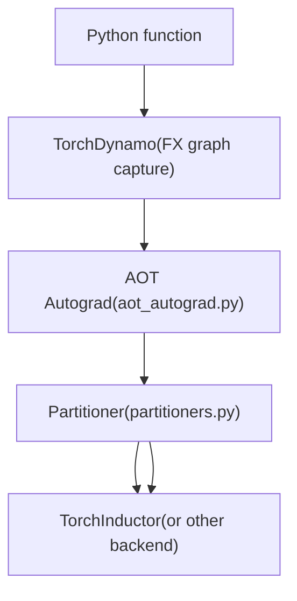
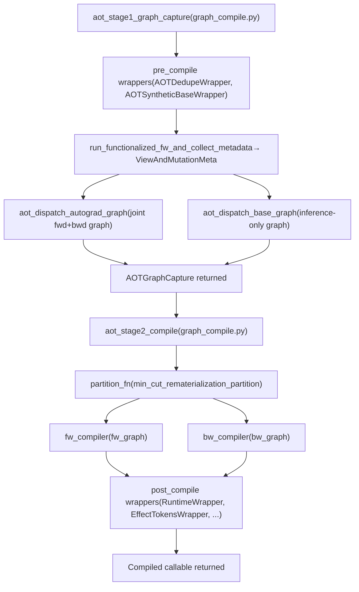
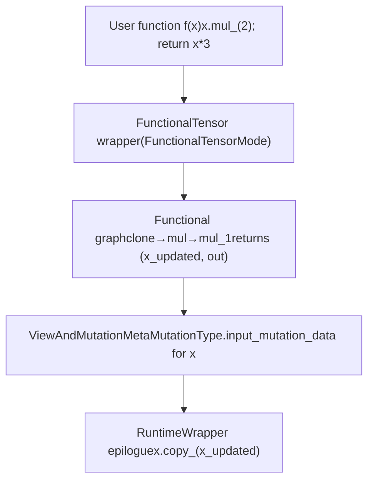
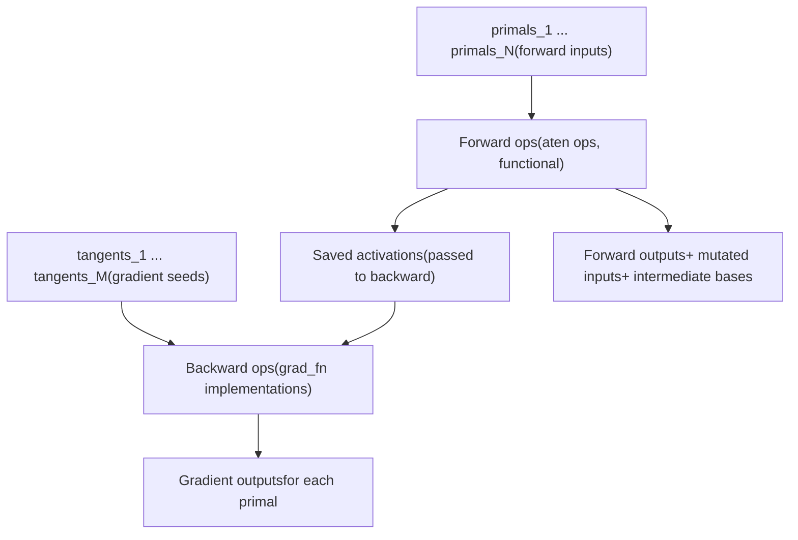
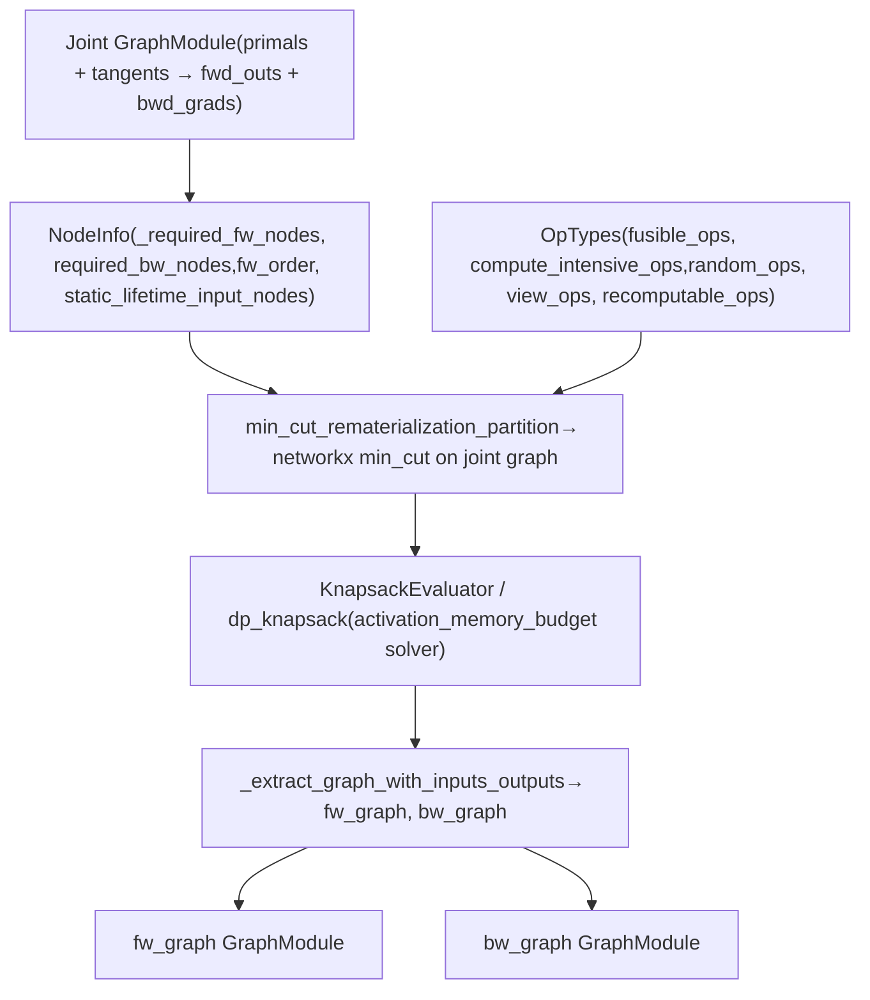
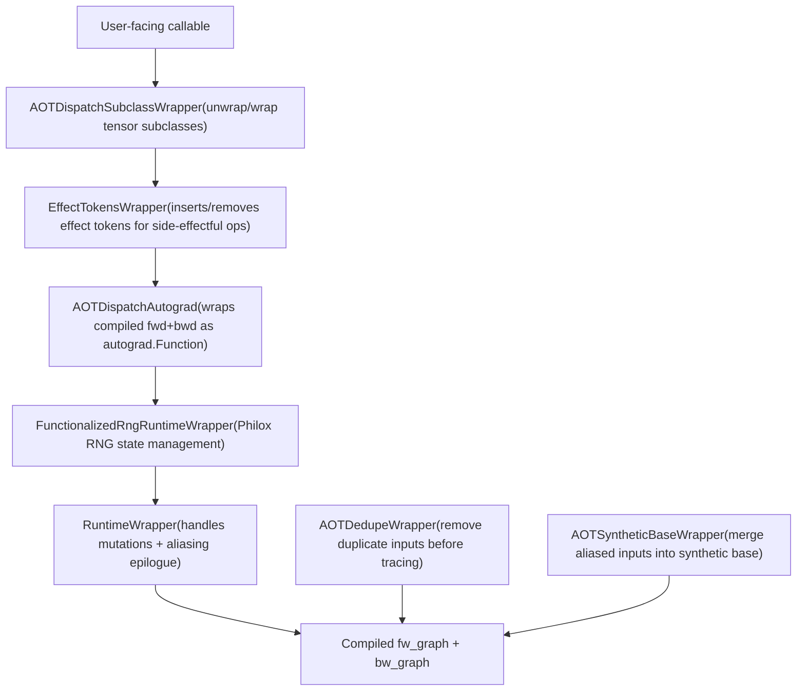

# AOT Autograd and Functionalization

Relevant source files

-   [.ci/docker/ci\_commit\_pins/torchbench.txt](https://github.com/pytorch/pytorch/blob/915982a4/.ci/docker/ci_commit_pins/torchbench.txt)
-   [aten/src/ATen/native/TensorCompare.cpp](https://github.com/pytorch/pytorch/blob/915982a4/aten/src/ATen/native/TensorCompare.cpp)
-   [test/distributed/tensor/test\_dtensor\_export.py](https://github.com/pytorch/pytorch/blob/915982a4/test/distributed/tensor/test_dtensor_export.py)
-   [test/dynamo/test\_activation\_checkpointing.py](https://github.com/pytorch/pytorch/blob/915982a4/test/dynamo/test_activation_checkpointing.py)
-   [test/dynamo/test\_activation\_offloading.py](https://github.com/pytorch/pytorch/blob/915982a4/test/dynamo/test_activation_offloading.py)
-   [test/dynamo/test\_aot\_autograd.py](https://github.com/pytorch/pytorch/blob/915982a4/test/dynamo/test_aot_autograd.py)
-   [test/dynamo/test\_aot\_compile.py](https://github.com/pytorch/pytorch/blob/915982a4/test/dynamo/test_aot_compile.py)
-   [test/dynamo/test\_package.py](https://github.com/pytorch/pytorch/blob/915982a4/test/dynamo/test_package.py)
-   [test/dynamo/test\_pgo.py](https://github.com/pytorch/pytorch/blob/915982a4/test/dynamo/test_pgo.py)
-   [test/dynamo/test\_precompile\_context.py](https://github.com/pytorch/pytorch/blob/915982a4/test/dynamo/test_precompile_context.py)
-   [test/functorch/test\_aotdispatch.py](https://github.com/pytorch/pytorch/blob/915982a4/test/functorch/test_aotdispatch.py)
-   [test/test\_autograd\_fallback.py](https://github.com/pytorch/pytorch/blob/915982a4/test/test_autograd_fallback.py)
-   [torch/\_dynamo/aot\_compile.py](https://github.com/pytorch/pytorch/blob/915982a4/torch/_dynamo/aot_compile.py)
-   [torch/\_dynamo/package.py](https://github.com/pytorch/pytorch/blob/915982a4/torch/_dynamo/package.py)
-   [torch/\_dynamo/pgo.py](https://github.com/pytorch/pytorch/blob/915982a4/torch/_dynamo/pgo.py)
-   [torch/\_dynamo/precompile\_context.py](https://github.com/pytorch/pytorch/blob/915982a4/torch/_dynamo/precompile_context.py)
-   [torch/\_functorch/\_activation\_offloading/\_\_init\_\_.py](https://github.com/pytorch/pytorch/blob/915982a4/torch/_functorch/_activation_offloading/__init__.py)
-   [torch/\_functorch/\_activation\_offloading/activation\_offloading.py](https://github.com/pytorch/pytorch/blob/915982a4/torch/_functorch/_activation_offloading/activation_offloading.py)
-   [torch/\_functorch/\_aot\_autograd/collect\_metadata\_analysis.py](https://github.com/pytorch/pytorch/blob/915982a4/torch/_functorch/_aot_autograd/collect_metadata_analysis.py)
-   [torch/\_functorch/\_aot\_autograd/frontend\_utils.py](https://github.com/pytorch/pytorch/blob/915982a4/torch/_functorch/_aot_autograd/frontend_utils.py)
-   [torch/\_functorch/\_aot\_autograd/fx\_utils.py](https://github.com/pytorch/pytorch/blob/915982a4/torch/_functorch/_aot_autograd/fx_utils.py)
-   [torch/\_functorch/\_aot\_autograd/graph\_capture.py](https://github.com/pytorch/pytorch/blob/915982a4/torch/_functorch/_aot_autograd/graph_capture.py)
-   [torch/\_functorch/\_aot\_autograd/graph\_capture\_wrappers.py](https://github.com/pytorch/pytorch/blob/915982a4/torch/_functorch/_aot_autograd/graph_capture_wrappers.py)
-   [torch/\_functorch/\_aot\_autograd/graph\_compile.py](https://github.com/pytorch/pytorch/blob/915982a4/torch/_functorch/_aot_autograd/graph_compile.py)
-   [torch/\_functorch/\_aot\_autograd/input\_output\_analysis.py](https://github.com/pytorch/pytorch/blob/915982a4/torch/_functorch/_aot_autograd/input_output_analysis.py)
-   [torch/\_functorch/\_aot\_autograd/runtime\_wrappers.py](https://github.com/pytorch/pytorch/blob/915982a4/torch/_functorch/_aot_autograd/runtime_wrappers.py)
-   [torch/\_functorch/\_aot\_autograd/schemas.py](https://github.com/pytorch/pytorch/blob/915982a4/torch/_functorch/_aot_autograd/schemas.py)
-   [torch/\_functorch/\_aot\_autograd/subclass\_parametrization.py](https://github.com/pytorch/pytorch/blob/915982a4/torch/_functorch/_aot_autograd/subclass_parametrization.py)
-   [torch/\_functorch/\_aot\_autograd/subclass\_utils.py](https://github.com/pytorch/pytorch/blob/915982a4/torch/_functorch/_aot_autograd/subclass_utils.py)
-   [torch/\_functorch/\_aot\_autograd/utils.py](https://github.com/pytorch/pytorch/blob/915982a4/torch/_functorch/_aot_autograd/utils.py)
-   [torch/\_functorch/aot\_autograd.py](https://github.com/pytorch/pytorch/blob/915982a4/torch/_functorch/aot_autograd.py)
-   [torch/\_functorch/config.py](https://github.com/pytorch/pytorch/blob/915982a4/torch/_functorch/config.py)
-   [torch/\_functorch/partitioners.py](https://github.com/pytorch/pytorch/blob/915982a4/torch/_functorch/partitioners.py)
-   [torch/\_library/autograd.py](https://github.com/pytorch/pytorch/blob/915982a4/torch/_library/autograd.py)
-   [torch/compiler/\_\_init\_\_.py](https://github.com/pytorch/pytorch/blob/915982a4/torch/compiler/__init__.py)
-   [torch/compiler/\_cache.py](https://github.com/pytorch/pytorch/blob/915982a4/torch/compiler/_cache.py)
-   [torch/compiler/config.py](https://github.com/pytorch/pytorch/blob/915982a4/torch/compiler/config.py)
-   [torch/csrc/autograd/autograd\_not\_implemented\_fallback.cpp](https://github.com/pytorch/pytorch/blob/915982a4/torch/csrc/autograd/autograd_not_implemented_fallback.cpp)
-   [torch/testing/\_internal/optests/aot\_autograd.py](https://github.com/pytorch/pytorch/blob/915982a4/torch/testing/_internal/optests/aot_autograd.py)
-   [torchgen/native\_function\_generation.py](https://github.com/pytorch/pytorch/blob/915982a4/torchgen/native_function_generation.py)

## Purpose and Scope

AOT Autograd (Ahead-of-Time Autograd) is the layer in the `torch.compile` stack responsible for tracing both the forward and backward passes of a function *before* execution, producing a fully functional joint graph that a backend compiler can optimize. It handles the transformation of in-place mutations into functional equivalents, resolves aliasing relationships between tensors, and partitions the joint graph into separate forward and backward graphs.

This page covers:

-   The two-stage pipeline (`aot_stage1_graph_capture` → `aot_stage2_compile`)
-   Functionalization of in-place operations
-   `ViewAndMutationMeta` collection
-   Joint graph construction and partitioning via `min_cut_rematerialization_partition`
-   Runtime wrapper composition

For the TorchDynamo frontend that produces the initial FX graph consumed by AOT Autograd, see [TorchDynamo Frontend](/pytorch/pytorch/2.2-torchdynamo-frontend). For the downstream Inductor backend that receives the partitioned graphs, see [TorchInductor Backend](/pytorch/pytorch/2.5-torchinductor-backend). For caching of compiled graphs, see [Autograd Caching](/pytorch/pytorch/2.4.2-autograd-caching).

---

## Position in the Compilation Stack

AOT Autograd sits between TorchDynamo and TorchInductor in the `torch.compile` pipeline. TorchDynamo captures a Python function into an FX graph using symbolic tracing. That FX graph is handed to AOT Autograd via an `aot_autograd` backend, which then traces the joint forward+backward, functionalizes the graph, partitions it, and passes the split forward and backward graphs to the configured backend compiler.

**AOT Autograd's position in `torch.compile`**


Sources: [torch/\_functorch/aot\_autograd.py1-170](https://github.com/pytorch/pytorch/blob/915982a4/torch/_functorch/aot_autograd.py#L1-L170) [torch/\_functorch/\_aot\_autograd/graph\_compile.py1-100](https://github.com/pytorch/pytorch/blob/915982a4/torch/_functorch/_aot_autograd/graph_compile.py#L1-L100)

---

## Core Module Layout

The AOT Autograd implementation is spread across several files under `torch/_functorch/_aot_autograd/`:

| File | Responsibility |
| --- | --- |
| `torch/_functorch/aot_autograd.py` | Public API, re-exports, top-level entry points (`aot_function`, `aot_module`) |
| `_aot_autograd/graph_compile.py` | Two-stage pipeline: `aot_stage1_graph_capture`, `aot_stage2_compile`, `aot_stage2_export` |
| `_aot_autograd/graph_capture.py` | Dispatch to `aot_dispatch_autograd_graph` (training) or `aot_dispatch_base_graph` (inference) |
| `_aot_autograd/graph_capture_wrappers.py` | Functionalization: `create_functionalized_fn`, `create_joint`, `fn_prepped_for_autograd` |
| `_aot_autograd/collect_metadata_analysis.py` | `run_functionalized_fw_and_collect_metadata` — builds `ViewAndMutationMeta` |
| `_aot_autograd/runtime_wrappers.py` | Runtime epilogue logic: `RuntimeWrapper`, `AOTDispatchAutograd`, `AOTDedupeWrapper` |
| `_aot_autograd/schemas.py` | All dataclasses and enums: `ViewAndMutationMeta`, `AOTConfig`, `OutputAliasInfo`, `MutationType` |
| `_aot_autograd/input_output_analysis.py` | `create_graph_signature`, `create_synthetic_base_metadata`, `remove_dupe_metadata` |
| `torch/_functorch/partitioners.py` | `min_cut_rematerialization_partition`, `default_partition` |
| `torch/_dynamo/aot_compile.py` | Serializable artifacts: `AOTCompiledFunction`, `AOTCompiledModel`, `CompileArtifacts` |

Sources: [torch/\_functorch/aot\_autograd.py38-157](https://github.com/pytorch/pytorch/blob/915982a4/torch/_functorch/aot_autograd.py#L38-L157) [torch/\_functorch/\_aot\_autograd/graph\_compile.py1-103](https://github.com/pytorch/pytorch/blob/915982a4/torch/_functorch/_aot_autograd/graph_compile.py#L1-L103)

---

## Two-Stage Pipeline

The compilation is split into two stages, defined in `torch/_functorch/_aot_autograd/graph_compile.py`.

**Two-stage AOT pipeline**


Sources: [torch/\_functorch/\_aot\_autograd/graph\_compile.py173-370](https://github.com/pytorch/pytorch/blob/915982a4/torch/_functorch/_aot_autograd/graph_compile.py#L173-L370)

### Stage 1: Graph Capture (`aot_stage1_graph_capture`)

`aot_stage1_graph_capture` in [torch/\_functorch/\_aot\_autograd/graph\_compile.py173-266](https://github.com/pytorch/pytorch/blob/915982a4/torch/_functorch/_aot_autograd/graph_compile.py#L173-L266) takes an `AOTState` and a flat function, then:

1.  Runs `pre_compile` wrappers: `AOTDedupeWrapper` removes duplicate inputs; `AOTSyntheticBaseWrapper` merges aliased inputs into a single synthetic base.
2.  Based on `aot_state.needs_autograd`, calls either:
    -   `aot_dispatch_autograd_graph` — traces the joint forward+backward graph for training.
    -   `aot_dispatch_base_graph` — traces only the forward for inference.
3.  Returns an `AOTGraphCapture` dataclass containing the traced `GraphModule`, updated flat args, and optional `SubclassMeta`.

### Stage 2: Compilation (`aot_stage2_compile`)

`aot_stage2_compile` in [torch/\_functorch/\_aot\_autograd/graph\_compile.py343-500](https://github.com/pytorch/pytorch/blob/915982a4/torch/_functorch/_aot_autograd/graph_compile.py#L343-L500) takes the `AOTGraphCapture` and:

1.  Calls `partition_fn` (default: `min_cut_rematerialization_partition`) on the joint graph to produce separate forward and backward `GraphModule`s.
2.  Calls `fw_compiler` on the forward graph and `bw_compiler` on the backward graph.
3.  Runs `post_compile` wrappers to build the final callable.

---

## Functionalization

Functionalization converts a graph containing in-place mutations and views into a purely functional (side-effect-free) equivalent. This is necessary because backend compilers like Inductor require a functional graph.

### How It Works

The main entry point is `create_functionalized_fn` in [torch/\_functorch/\_aot\_autograd/graph\_capture\_wrappers.py](https://github.com/pytorch/pytorch/blob/915982a4/torch/_functorch/_aot_autograd/graph_capture_wrappers.py) which wraps the user function in `FunctionalTensorMode`. Under this mode:

-   Every tensor argument is wrapped in a `FunctionalTensor`.
-   In-place ops (e.g., `add_`, `relu_`) on `FunctionalTensor` are recorded as mutations on a functional "shadow" tensor rather than modifying the underlying storage.
-   After the function runs, `sync_functional_tensor` is called to propagate mutations back.

`create_functionalized_fn` is called with a `remove_input_mutations` flag. When `True`, it also exposes input mutations as extra graph outputs (the mutated values), which the runtime epilogue (`RuntimeWrapper`) then applies via `copy_` after the compiled graph runs.

### Mutation Handling: Three Categories

`run_functionalized_fw_and_collect_metadata` in [torch/\_functorch/\_aot\_autograd/collect\_metadata\_analysis.py](https://github.com/pytorch/pytorch/blob/915982a4/torch/_functorch/_aot_autograd/collect_metadata_analysis.py) inspects the functionalized graph after the forward runs and classifies each input's mutation using the `MutationType` enum from [torch/\_functorch/\_aot\_autograd/schemas.py47-76](https://github.com/pytorch/pytorch/blob/915982a4/torch/_functorch/_aot_autograd/schemas.py#L47-L76):

| `MutationType` | Description |
| --- | --- |
| `none` | Input is not mutated |
| `input_mutation_data` | Input has a data mutation (e.g., `x.mul_(2)`) |
| `input_mutation_metadata` | Input has a metadata/view mutation (e.g., `x.t_()`) |
| `input_metadata_only_mutation` | Metadata-only, no data change |

The runtime wrapper applies mutations in the epilogue:

-   Data mutations: `x.copy_(x_updated)` after the compiled graph returns `x_updated`.
-   Metadata mutations: `x.as_strided_(...)` to replay the view transformation.

**Functionalization data flow**


Sources: [torch/\_functorch/\_aot\_autograd/graph\_capture\_wrappers.py1-90](https://github.com/pytorch/pytorch/blob/915982a4/torch/_functorch/_aot_autograd/graph_capture_wrappers.py#L1-L90) [torch/\_functorch/\_aot\_autograd/collect\_metadata\_analysis.py1-50](https://github.com/pytorch/pytorch/blob/915982a4/torch/_functorch/_aot_autograd/collect_metadata_analysis.py#L1-L50) [torch/\_functorch/aot\_autograd.py197-450](https://github.com/pytorch/pytorch/blob/915982a4/torch/_functorch/aot_autograd.py#L197-L450)

---

## `ViewAndMutationMeta` — Metadata Collection

`ViewAndMutationMeta` is the central data structure (defined in [torch/\_functorch/\_aot\_autograd/schemas.py](https://github.com/pytorch/pytorch/blob/915982a4/torch/_functorch/_aot_autograd/schemas.py)) that collects all aliasing and mutation information about a function's inputs and outputs. It is populated by `run_functionalized_fw_and_collect_metadata`.

Key fields:

| Field | Type | Purpose |
| --- | --- | --- |
| `input_info` | `list[InputAliasInfo]` | Per-input: mutation type, whether it's an alias, etc. |
| `output_info` | `list[OutputAliasInfo]` | Per-output: `OutputType`, `base_idx`, `requires_grad` |
| `num_intermediate_bases` | `int` | Number of intermediate tensor bases added as extra outputs |
| `keep_input_mutations` | `bool` | Whether input mutations stay in the graph or go to epilogue |
| `indices_of_inputs_that_require_grad` | `list[int]` | Which primal inputs need gradients |
| `num_outputs_aliased_to_inputs` | `int` | How many outputs alias forward inputs |
| `subclass_inp_meta` | `list` | Metadata for tensor subclass inputs |

`OutputAliasInfo` (in [torch/\_functorch/\_aot\_autograd/schemas.py80-140](https://github.com/pytorch/pytorch/blob/915982a4/torch/_functorch/_aot_autograd/schemas.py#L80-L140)) carries an `OutputType` enum value for each output:

| `OutputType` | Meaning |
| --- | --- |
| `non_alias` | A fresh tensor, no aliasing |
| `alias_of_input` | Output is a view of a forward input |
| `is_input` | Output **is** one of the forward inputs |
| `alias_of_intermediate_save_as_output` | Output aliases an intermediate that must be returned |
| `alias_of_intermediate` | Output aliases an already-returned intermediate |
| `custom_function_view` | View from a custom autograd.Function; treated normally |

Sources: [torch/\_functorch/\_aot\_autograd/schemas.py47-350](https://github.com/pytorch/pytorch/blob/915982a4/torch/_functorch/_aot_autograd/schemas.py#L47-L350) [torch/\_functorch/\_aot\_autograd/collect\_metadata\_analysis.py1-150](https://github.com/pytorch/pytorch/blob/915982a4/torch/_functorch/_aot_autograd/collect_metadata_analysis.py#L1-L150)

---

## Joint Graph and Autograd Tracing

For training (when `needs_autograd=True`), `aot_dispatch_autograd_graph` in [torch/\_functorch/\_aot\_autograd/graph\_capture.py](https://github.com/pytorch/pytorch/blob/915982a4/torch/_functorch/_aot_autograd/graph_capture.py) uses `make_fx` to trace a *joint* function that includes both the forward and backward passes in a single graph.

The joint function is constructed by `create_joint` in [torch/\_functorch/\_aot\_autograd/graph\_capture\_wrappers.py](https://github.com/pytorch/pytorch/blob/915982a4/torch/_functorch/_aot_autograd/graph_capture_wrappers.py):

1.  The forward is run under `FunctionalTensorMode` to produce primals.
2.  `torch.autograd.grad` is called on the forward outputs with respect to the primal inputs, producing the backward graph.
3.  The joint graph signature is: `joint(primals, tangents) → (fw_outputs, bw_gradients)`.

`fn_prepped_for_autograd` in [torch/\_functorch/\_aot\_autograd/graph\_capture\_wrappers.py](https://github.com/pytorch/pytorch/blob/915982a4/torch/_functorch/_aot_autograd/graph_capture_wrappers.py) wraps the functionalized forward to prepare it for joint tracing — it handles returning extra items needed for backward (intermediate bases, mutated inputs, etc.).

**Joint graph structure**


Sources: [torch/\_functorch/\_aot\_autograd/graph\_capture\_wrappers.py200-400](https://github.com/pytorch/pytorch/blob/915982a4/torch/_functorch/_aot_autograd/graph_capture_wrappers.py#L200-L400) [torch/\_functorch/\_aot\_autograd/graph\_capture.py50-200](https://github.com/pytorch/pytorch/blob/915982a4/torch/_functorch/_aot_autograd/graph_capture.py#L50-L200)

---

## Graph Partitioning

After the joint graph is traced, the partitioner splits it into a forward graph and a backward graph. The key question is: which intermediate tensors should be *saved* for use in the backward (increasing memory) vs *recomputed* in the backward (increasing compute)?

### `min_cut_rematerialization_partition`

The primary partitioner, `min_cut_rematerialization_partition` in [torch/\_functorch/partitioners.py](https://github.com/pytorch/pytorch/blob/915982a4/torch/_functorch/partitioners.py) models the problem as a min-cut on a graph where:

-   Source side = forward
-   Sink side = backward
-   Cutting a node = rematerializing it in the backward
-   Not cutting a node = saving it as an activation

The `NodeInfo` dataclass (in [torch/\_functorch/partitioners.py119-150](https://github.com/pytorch/pytorch/blob/915982a4/torch/_functorch/partitioners.py#L119-L150)) stores per-node information: which nodes are required by the forward, which by the backward, and ordering information.

**Recomputation heuristics** (controlled by `torch/_functorch/config.py`):

| Config flag | Default | Effect |
| --- | --- | --- |
| `ban_recompute_used_far_apart` | `True` | Avoids recomputing nodes used far apart in the graph |
| `ban_recompute_long_fusible_chains` | `True` | Breaks up long chains of recomputable ops |
| `ban_recompute_materialized_backward` | `True` | Bans recompute of nodes used by non-fusible bwd ops |
| `ban_recompute_reductions` | `True` | Never recomputes reductions |
| `recompute_views` | `False` | Always recomputes views (they're free) |
| `activation_memory_budget` | `1.0` | Knapsack budget for memory/compute tradeoff (0=max recompute, 1=min recompute) |
| `treat_parameters_as_free_to_save` | `True` | Parameters are free to pass to backward |

The `activation_memory_budget` setting enables a 0-1 knapsack solver to find the cheapest set of nodes to recompute while staying within a memory budget. Solvers include `dp_knapsack`, `greedy_knapsack`, and `ilp_knapsack` from `torch/_functorch/_activation_checkpointing/knapsack.py`.

### `default_partition`

`default_partition` in [torch/\_functorch/partitioners.py](https://github.com/pytorch/pytorch/blob/915982a4/torch/_functorch/partitioners.py) is a simpler partitioner that saves all intermediates needed by the backward without any recomputation analysis.

**Partitioner internals**


Sources: [torch/\_functorch/partitioners.py93-390](https://github.com/pytorch/pytorch/blob/915982a4/torch/_functorch/partitioners.py#L93-L390) [torch/\_functorch/config.py141-225](https://github.com/pytorch/pytorch/blob/915982a4/torch/_functorch/config.py#L141-L225)

---

## Runtime Wrappers

Runtime wrappers are composable objects (subclassing `CompilerWrapper` in [torch/\_functorch/\_aot\_autograd/schemas.py](https://github.com/pytorch/pytorch/blob/915982a4/torch/_functorch/_aot_autograd/schemas.py)) that wrap the compiled graph. They run in two phases: `pre_compile` (before compilation, to transform inputs/function) and `post_compile` (after compilation, to wrap the returned callable).

**Wrapper composition and roles**


| Wrapper | File | Role |
| --- | --- | --- |
| `AOTDedupeWrapper` | `runtime_wrappers.py` | Deduplicates inputs that are the same tensor object before tracing |
| `AOTSyntheticBaseWrapper` | `runtime_wrappers.py` | Replaces aliased inputs with a synthetic base tensor |
| `AOTDispatchSubclassWrapper` | `runtime_wrappers.py` | Unwraps tensor subclasses (e.g., `DTensor`) to inner tensors for tracing |
| `RuntimeWrapper` | `runtime_wrappers.py` | Applies input mutation epilogues (`copy_`, `as_strided_`) after the compiled graph runs |
| `AOTDispatchAutograd` | `runtime_wrappers.py` | Wraps the compiled forward/backward as a `torch.autograd.Function` so autograd can use it |
| `EffectTokensWrapper` | `runtime_wrappers.py` | Threads effect tokens for side-effectful ops (prints, torchbind calls) through the graph |
| `FunctionalizedRngRuntimeWrapper` | `runtime_wrappers.py` | Manages Philox RNG seeds/offsets for reproducible randomness in the functional graph |

Sources: [torch/\_functorch/\_aot\_autograd/runtime\_wrappers.py165-250](https://github.com/pytorch/pytorch/blob/915982a4/torch/_functorch/_aot_autograd/runtime_wrappers.py#L165-L250) [torch/\_functorch/\_aot\_autograd/graph\_compile.py166-171](https://github.com/pytorch/pytorch/blob/915982a4/torch/_functorch/_aot_autograd/graph_compile.py#L166-L171)

---

## Aliasing and Mutation Handling Notes

The inline comments in [torch/\_functorch/aot\_autograd.py197-450](https://github.com/pytorch/pytorch/blob/915982a4/torch/_functorch/aot_autograd.py#L197-L450) document the specific strategies AOT Autograd uses for several important edge cases. A summary:

### Input Data Mutations

When the function mutates an input (e.g., `x.mul_(2)`), AOT Autograd:

1.  Removes the mutation from the compiled graph.
2.  Returns the post-mutation value as an extra graph output.
3.  The runtime epilogue calls `x.copy_(x_updated)` to apply the mutation after graph execution.

### Input Metadata Mutations

When the function does a metadata-only mutation (e.g., `x.t_()`):

1.  The mutation is removed from the compiled graph.
2.  The updated view is returned as a graph output.
3.  The runtime epilogue calls `x.as_strided_(x_updated)`.

### Outputs Aliasing Inputs or Intermediates

-   **Alias of input**: The aliased output is regenerated in the epilogue using `gen_alias_from_base` (optionally via view replay) to avoid the `autograd.Function` restriction on mutating returned views.
-   **Alias of intermediate**: The intermediate base is added as an extra graph output, and the alias is regenerated from it in the epilogue.

### Aliased Inputs (Synthetic Bases)

When two inputs alias each other (e.g., `f(x, x.view(-1))`), `AOTSyntheticBaseWrapper` merges them into a single `base` input for the compiled graph. The original inputs are regenerated inside the compiled function from the base.

Sources: [torch/\_functorch/aot\_autograd.py197-450](https://github.com/pytorch/pytorch/blob/915982a4/torch/_functorch/aot_autograd.py#L197-L450) [torch/\_functorch/\_aot\_autograd/runtime\_wrappers.py207-270](https://github.com/pytorch/pytorch/blob/915982a4/torch/_functorch/_aot_autograd/runtime_wrappers.py#L207-L270)

---

## Effect Tokens

AOT Autograd allows certain side-effectful operators (prints, torchbind calls) in the post-AOT functional graph by threading "effect tokens" — dummy tensors — as data dependencies. The graph signature becomes:

```
gm(*tokens, *params_buffers, *user_inputs) → (*updated_tokens, *user_outputs)
```
`EffectTokensWrapper` injects `prims._make_token()` at the start and `prims._sink_tokens(...)` at the end when the `unlift_effect_tokens` config flag is set. This keeps the graph functional while preserving ordering of side effects.

Sources: [torch/\_functorch/aot\_autograd.py424-462](https://github.com/pytorch/pytorch/blob/915982a4/torch/_functorch/aot_autograd.py#L424-L462) [torch/\_functorch/\_aot\_autograd/runtime\_wrappers.py1-50](https://github.com/pytorch/pytorch/blob/915982a4/torch/_functorch/_aot_autograd/runtime_wrappers.py#L1-L50)

---

## RNG Functionalization

CUDA RNG operations are non-deterministic across runs unless the random state is carefully managed. AOT Autograd optionally functionalizes RNG ops (controlled by `torch/_functorch/config.py` flag `functionalize_rng_ops`) via:

-   `create_functionalized_rng_ops_wrapper` in [torch/\_functorch/\_aot\_autograd/graph\_capture\_wrappers.py](https://github.com/pytorch/pytorch/blob/915982a4/torch/_functorch/_aot_autograd/graph_capture_wrappers.py) — wraps the function to use a `PhiloxStateTracker` that converts stateful `torch.rand*` calls into deterministic calls parameterized by a seed and offset.
-   `FunctionalizedRngRuntimeWrapper` in `runtime_wrappers.py` — at runtime, seeds the Philox state from the current CUDA generator and threads it as graph inputs.

Sources: [torch/\_functorch/\_aot\_autograd/graph\_capture\_wrappers.py50-80](https://github.com/pytorch/pytorch/blob/915982a4/torch/_functorch/_aot_autograd/graph_capture_wrappers.py#L50-L80) [torch/\_functorch/config.py33](https://github.com/pytorch/pytorch/blob/915982a4/torch/_functorch/config.py#L33-L33)

---

## AOT Compile: Serializable Artifacts

For ahead-of-time compilation scenarios (e.g., `torch.compile(...).aot_compile(...)`), `torch/_dynamo/aot_compile.py` provides serializable wrappers around the AOT pipeline output.

**Key types in `torch/_dynamo/aot_compile.py`:**

| Class | Role |
| --- | --- |
| `CompileArtifacts` | Holds `signature`, `guard_manager`, `compiled_fn`, `runtime_env`, `source_info`; all serializable |
| `AOTCompiledFunction` | Wraps `CompileArtifacts`, implements `__call__` with guard checking, supports `save_compiled_function` / `deserialize` |
| `AOTCompiledModel` | Holds a `list[AOTCompiledFunction]` for multiple input contexts; dispatches calls by checking guards |
| `AOTCompilePickler` / `AOTCompileUnpickler` | Custom pickle support for closures, code objects, nested functions |
| `SerializedCode` | Frozen dataclass representation of a `types.CodeType`, safe for serialization |

`aot_compile_fullgraph` in [torch/\_dynamo/aot\_compile.py295-417](https://github.com/pytorch/pytorch/blob/915982a4/torch/_dynamo/aot_compile.py#L295-L417) orchestrates the full capture pipeline:

1.  Calls `convert_frame.fullgraph_capture` to get the Dynamo-captured graph.
2.  Runs the backend compiler (e.g., Inductor) to produce a `SerializableCallable`.
3.  Builds guards from the tracing context.
4.  Packages everything into a `CompileArtifacts` and wraps it in an `AOTCompiledFunction`.

Sources: [torch/\_dynamo/aot\_compile.py43-504](https://github.com/pytorch/pytorch/blob/915982a4/torch/_dynamo/aot_compile.py#L43-L504)

---

## Configuration Reference

Configuration is in `torch/_functorch/config.py`. Key flags:

| Flag | Default | Effect |
| --- | --- | --- |
| `functionalize_rng_ops` | `False` | Enables Philox RNG functionalization for CUDA ops |
| `debug_assert` | `False` | Enables extra correctness assertions in hot paths |
| `debug_partitioner` | `False` | Enables verbose logging from the partitioner |
| `cse` | `True` | Applies common subexpression elimination before partitioning |
| `static_weight_shapes` | `True` | Treats parameter shapes as static |
| `treat_parameters_as_free_to_save` | `True` | Considers parameters free to pass to backward |
| `activation_memory_budget` | `1.0` | Knapsack budget (0=max recompute, 1=min recompute) |
| `view_replay_for_aliased_outputs` | platform-dependent | Uses view replay instead of `as_strided` for alias reconstruction |
| `enable_autograd_cache` | `True` | Enables local `AOTAutogradCache` |
| `max_dist_from_bw` | `1000` | Distance heuristic for the partitioner |
| `unlift_effect_tokens` | `False` | Replaces token inputs/outputs with `_make_token` / `_sink_tokens` in-graph calls |

Sources: [torch/\_functorch/config.py1-310](https://github.com/pytorch/pytorch/blob/915982a4/torch/_functorch/config.py#L1-L310)
