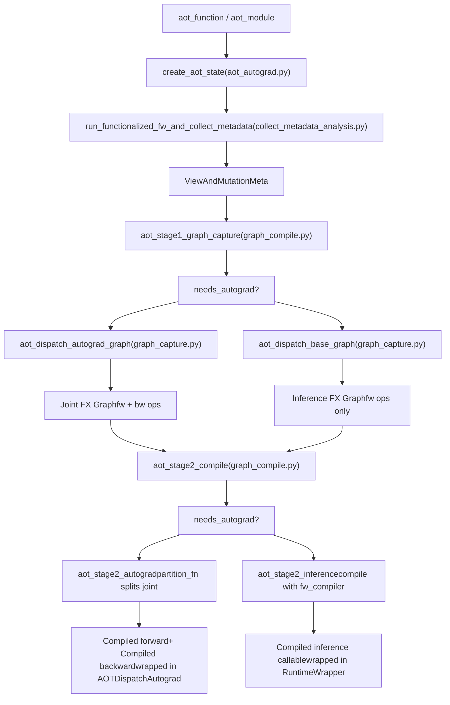
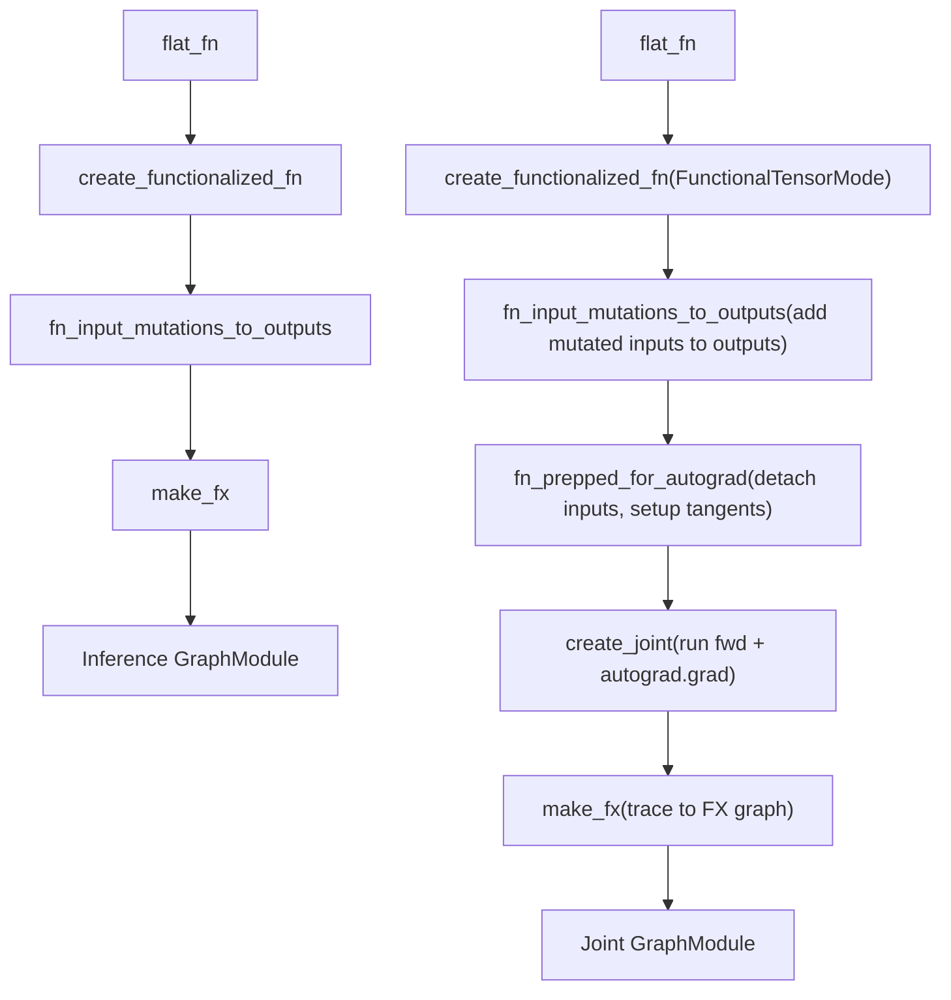
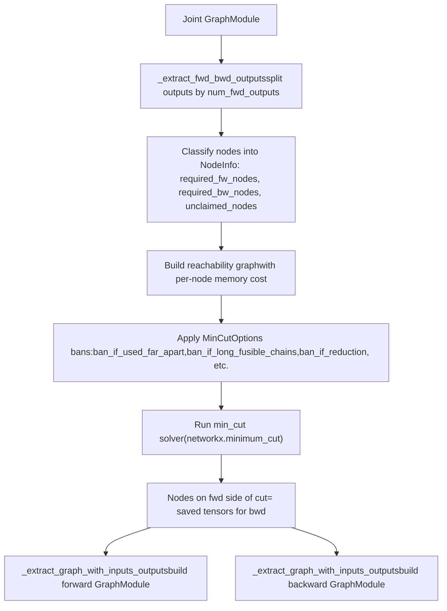
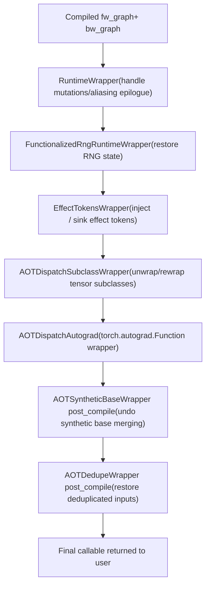

# AOT Autograd Pipeline

Relevant source files

-   [.ci/docker/ci\_commit\_pins/torchbench.txt](https://github.com/pytorch/pytorch/blob/915982a4/.ci/docker/ci_commit_pins/torchbench.txt)
-   [aten/src/ATen/native/TensorCompare.cpp](https://github.com/pytorch/pytorch/blob/915982a4/aten/src/ATen/native/TensorCompare.cpp)
-   [test/distributed/tensor/test\_dtensor\_export.py](https://github.com/pytorch/pytorch/blob/915982a4/test/distributed/tensor/test_dtensor_export.py)
-   [test/dynamo/test\_activation\_checkpointing.py](https://github.com/pytorch/pytorch/blob/915982a4/test/dynamo/test_activation_checkpointing.py)
-   [test/dynamo/test\_activation\_offloading.py](https://github.com/pytorch/pytorch/blob/915982a4/test/dynamo/test_activation_offloading.py)
-   [test/dynamo/test\_aot\_autograd.py](https://github.com/pytorch/pytorch/blob/915982a4/test/dynamo/test_aot_autograd.py)
-   [test/functorch/test\_aotdispatch.py](https://github.com/pytorch/pytorch/blob/915982a4/test/functorch/test_aotdispatch.py)
-   [test/test\_autograd\_fallback.py](https://github.com/pytorch/pytorch/blob/915982a4/test/test_autograd_fallback.py)
-   [torch/\_functorch/\_activation\_offloading/\_\_init\_\_.py](https://github.com/pytorch/pytorch/blob/915982a4/torch/_functorch/_activation_offloading/__init__.py)
-   [torch/\_functorch/\_activation\_offloading/activation\_offloading.py](https://github.com/pytorch/pytorch/blob/915982a4/torch/_functorch/_activation_offloading/activation_offloading.py)
-   [torch/\_functorch/\_aot\_autograd/collect\_metadata\_analysis.py](https://github.com/pytorch/pytorch/blob/915982a4/torch/_functorch/_aot_autograd/collect_metadata_analysis.py)
-   [torch/\_functorch/\_aot\_autograd/frontend\_utils.py](https://github.com/pytorch/pytorch/blob/915982a4/torch/_functorch/_aot_autograd/frontend_utils.py)
-   [torch/\_functorch/\_aot\_autograd/fx\_utils.py](https://github.com/pytorch/pytorch/blob/915982a4/torch/_functorch/_aot_autograd/fx_utils.py)
-   [torch/\_functorch/\_aot\_autograd/graph\_capture.py](https://github.com/pytorch/pytorch/blob/915982a4/torch/_functorch/_aot_autograd/graph_capture.py)
-   [torch/\_functorch/\_aot\_autograd/graph\_capture\_wrappers.py](https://github.com/pytorch/pytorch/blob/915982a4/torch/_functorch/_aot_autograd/graph_capture_wrappers.py)
-   [torch/\_functorch/\_aot\_autograd/graph\_compile.py](https://github.com/pytorch/pytorch/blob/915982a4/torch/_functorch/_aot_autograd/graph_compile.py)
-   [torch/\_functorch/\_aot\_autograd/input\_output\_analysis.py](https://github.com/pytorch/pytorch/blob/915982a4/torch/_functorch/_aot_autograd/input_output_analysis.py)
-   [torch/\_functorch/\_aot\_autograd/runtime\_wrappers.py](https://github.com/pytorch/pytorch/blob/915982a4/torch/_functorch/_aot_autograd/runtime_wrappers.py)
-   [torch/\_functorch/\_aot\_autograd/schemas.py](https://github.com/pytorch/pytorch/blob/915982a4/torch/_functorch/_aot_autograd/schemas.py)
-   [torch/\_functorch/\_aot\_autograd/subclass\_parametrization.py](https://github.com/pytorch/pytorch/blob/915982a4/torch/_functorch/_aot_autograd/subclass_parametrization.py)
-   [torch/\_functorch/\_aot\_autograd/subclass\_utils.py](https://github.com/pytorch/pytorch/blob/915982a4/torch/_functorch/_aot_autograd/subclass_utils.py)
-   [torch/\_functorch/\_aot\_autograd/utils.py](https://github.com/pytorch/pytorch/blob/915982a4/torch/_functorch/_aot_autograd/utils.py)
-   [torch/\_functorch/aot\_autograd.py](https://github.com/pytorch/pytorch/blob/915982a4/torch/_functorch/aot_autograd.py)
-   [torch/\_functorch/config.py](https://github.com/pytorch/pytorch/blob/915982a4/torch/_functorch/config.py)
-   [torch/\_functorch/partitioners.py](https://github.com/pytorch/pytorch/blob/915982a4/torch/_functorch/partitioners.py)
-   [torch/\_library/autograd.py](https://github.com/pytorch/pytorch/blob/915982a4/torch/_library/autograd.py)
-   [torch/csrc/autograd/autograd\_not\_implemented\_fallback.cpp](https://github.com/pytorch/pytorch/blob/915982a4/torch/csrc/autograd/autograd_not_implemented_fallback.cpp)
-   [torch/testing/\_internal/optests/aot\_autograd.py](https://github.com/pytorch/pytorch/blob/915982a4/torch/testing/_internal/optests/aot_autograd.py)
-   [torchgen/native\_function\_generation.py](https://github.com/pytorch/pytorch/blob/915982a4/torchgen/native_function_generation.py)

## Purpose and Scope

This page describes the internal stages of the AOT (Ahead-of-Time) Autograd pipeline: how a Python function captured by TorchDynamo is transformed into compiled, partitioned forward and backward FX graphs suitable for a backend compiler.

Topics covered include: metadata collection, functionalization, joint graph tracing, graph partitioning, and runtime wrapper construction. For a broader overview of AOT Autograd's role in the compilation stack, see the Compilation System overview (section [2.4](https://github.com/pytorch/pytorch/blob/915982a4/2.4)). For the caching layer built on top of this pipeline, see [2.4.2](https://github.com/pytorch/pytorch/blob/915982a4/2.4.2)

---

## Pipeline Overview

The pipeline consists of two major staged operations: graph capture and compilation. These map to `aot_stage1_graph_capture` and `aot_stage2_compile` in [torch/\_functorch/\_aot\_autograd/graph\_compile.py](https://github.com/pytorch/pytorch/blob/915982a4/torch/_functorch/_aot_autograd/graph_compile.py)

**AOT Autograd Pipeline — Stage Flow**


Sources: [torch/\_functorch/\_aot\_autograd/graph\_compile.py173-368](https://github.com/pytorch/pytorch/blob/915982a4/torch/_functorch/_aot_autograd/graph_compile.py#L173-L368) [torch/\_functorch/aot\_autograd.py473-637](https://github.com/pytorch/pytorch/blob/915982a4/torch/_functorch/aot_autograd.py#L473-L637)

---

## Key Data Structures

The pipeline is organized around a small set of dataclasses defined in [torch/\_functorch/\_aot\_autograd/schemas.py](https://github.com/pytorch/pytorch/blob/915982a4/torch/_functorch/_aot_autograd/schemas.py)

| Class | Purpose |
| --- | --- |
| `AOTConfig` | Static configuration: compilers, partition function, decompositions, flags |
| `AOTState` | Mutable state built during `create_aot_state`: `fw_metadata`, `flat_args`, `needs_autograd` |
| `AOTGraphCapture` | Output of Stage 1: the captured graph module, updated args, subclass metadata, wrappers |
| `ViewAndMutationMeta` | Per-input and per-output aliasing/mutation analysis |
| `InputAliasInfo` | Per-input flags: `mutates_data`, `mutates_metadata`, `requires_grad`, mutation type |
| `OutputAliasInfo` | Per-output classification: `output_type` (enum `OutputType`), `base_idx`, `requires_grad` |
| `SubclassMeta` | Metadata for dispatching tensor subclasses through the pipeline |
| `CompilerWrapper` | Abstract base for pre/post-compile wrappers (`AOTDedupeWrapper`, `RuntimeWrapper`, etc.) |

**Data Structure Relationships**


Sources: [torch/\_functorch/\_aot\_autograd/schemas.py47-250](https://github.com/pytorch/pytorch/blob/915982a4/torch/_functorch/_aot_autograd/schemas.py#L47-L250)

---

## Stage 1: State Creation and Metadata Collection

`create_aot_state` in [torch/\_functorch/aot\_autograd.py473-637](https://github.com/pytorch/pytorch/blob/915982a4/torch/_functorch/aot_autograd.py#L473-L637) sets up the tracing environment and performs a preliminary functionalized run of the forward function to collect aliasing and mutation metadata.

### Environment Setup

Before tracing, `create_aot_state` installs several context managers:

-   `FakeTensorMode`: all inputs are converted to fake tensors via `process_inputs` ([torch/\_functorch/\_aot\_autograd/frontend\_utils.py30-120](https://github.com/pytorch/pytorch/blob/915982a4/torch/_functorch/_aot_autograd/frontend_utils.py#L30-L120))
-   `enable_python_dispatcher()`: active if a `ShapeEnv` is present (for symbolic shapes)
-   `PhiloxStateTracker`: for tracking RNG state if `functionalize_rng_ops` is enabled
-   Multithreading is disabled, RNG state is preserved

### Metadata Collection

`run_functionalized_fw_and_collect_metadata` ([torch/\_functorch/\_aot\_autograd/collect\_metadata\_analysis.py](https://github.com/pytorch/pytorch/blob/915982a4/torch/_functorch/_aot_autograd/collect_metadata_analysis.py)) is called with the flat function and fake arguments. It:

1.  Wraps each input tensor with `to_fun()` to produce `FunctionalTensor` instances using `FunctionalTensorMode`
2.  Executes the forward function
3.  After execution, calls `from_fun()` and `sync_functional_tensor()` to extract the final state
4.  For each input, builds an `InputAliasInfo` recording whether it was mutated (`mutates_data`, `mutates_metadata`), and whether the mutation is hidden from autograd
5.  For each output, determines its `OutputType` by checking if it aliases an input, an intermediate, or is a fully new tensor
6.  Returns a populated `ViewAndMutationMeta`

The `OutputType` enum ([torch/\_functorch/\_aot\_autograd/schemas.py47-76](https://github.com/pytorch/pytorch/blob/915982a4/torch/_functorch/_aot_autograd/schemas.py#L47-L76)) classifies outputs:

| `OutputType` value | Meaning |
| --- | --- |
| `non_alias` | Freshly allocated output |
| `alias_of_input` | View of an input tensor |
| `is_input` | The input itself returned |
| `alias_of_intermediate_save_as_output` | View of an intermediate; base must be added as output |
| `alias_of_intermediate` | View of an intermediate already in outputs |
| `unsafe_view_alias` | View that can be treated as a new allocation |
| `custom_function_view` | Output of a custom autograd function returning a view |

Sources: [torch/\_functorch/aot\_autograd.py473-637](https://github.com/pytorch/pytorch/blob/915982a4/torch/_functorch/aot_autograd.py#L473-L637) [torch/\_functorch/\_aot\_autograd/collect\_metadata\_analysis.py1-50](https://github.com/pytorch/pytorch/blob/915982a4/torch/_functorch/_aot_autograd/collect_metadata_analysis.py#L1-L50)

---

## Stage 2: Pre-compile Wrappers

Before graph capture, `aot_stage1_graph_capture` applies two standard pre-compile wrappers via `_create_wrappers_for_dispatch` ([torch/\_functorch/\_aot\_autograd/graph\_compile.py166-170](https://github.com/pytorch/pytorch/blob/915982a4/torch/_functorch/_aot_autograd/graph_compile.py#L166-L170)):

```
wrappers = [AOTDedupeWrapper(), AOTSyntheticBaseWrapper(trace_joint=needs_autograd)]
```
These are run through `pre_compile` ([torch/\_functorch/\_aot\_autograd/runtime\_wrappers.py](https://github.com/pytorch/pytorch/blob/915982a4/torch/_functorch/_aot_autograd/runtime_wrappers.py)), which calls each wrapper's `pre_compile` method in order, potentially rewriting the flat function and argument list.

| Wrapper | Responsibility |
| --- | --- |
| `AOTDedupeWrapper` | Detects and removes duplicate input tensors; deduplication is undone at runtime |
| `AOTSyntheticBaseWrapper` | When inputs alias each other, replaces them with a single "synthetic base" tensor; individual aliased inputs are regenerated inside the graph |

The synthetic base handling is needed because functionalization requires that aliased inputs are visibly related; merging them into a single base makes this explicit. The inverse is performed by a runtime epilogue.

Sources: [torch/\_functorch/\_aot\_autograd/runtime\_wrappers.py1-100](https://github.com/pytorch/pytorch/blob/915982a4/torch/_functorch/_aot_autograd/runtime_wrappers.py#L1-L100) [torch/\_functorch/\_aot\_autograd/graph\_compile.py166-266](https://github.com/pytorch/pytorch/blob/915982a4/torch/_functorch/_aot_autograd/graph_compile.py#L166-L266)

---

## Stage 3: Graph Capture

After pre-compile wrappers, `aot_stage1_graph_capture` dispatches to one of two graph capture functions.

**Graph Capture — Function Transformation Chain**


Sources: [torch/\_functorch/\_aot\_autograd/graph\_capture.py](https://github.com/pytorch/pytorch/blob/915982a4/torch/_functorch/_aot_autograd/graph_capture.py) [torch/\_functorch/\_aot\_autograd/graph\_capture\_wrappers.py](https://github.com/pytorch/pytorch/blob/915982a4/torch/_functorch/_aot_autograd/graph_capture_wrappers.py)

### Functionalization

`create_functionalized_fn` ([torch/\_functorch/\_aot\_autograd/graph\_capture\_wrappers.py](https://github.com/pytorch/pytorch/blob/915982a4/torch/_functorch/_aot_autograd/graph_capture_wrappers.py)) wraps the function so that all inputs are `FunctionalTensor`s under a `FunctionalTensorMode`. Within this context:

-   All in-place operations (e.g., `add_`) are automatically converted to out-of-place operations (`add`) with the result written back
-   Storage mutations (`.set_()`) are tracked
-   After the function runs, `sync_functional_tensor` propagates any functional mutations back

`fn_input_mutations_to_outputs` ([torch/\_functorch/\_aot\_autograd/graph\_capture\_wrappers.py105-137](https://github.com/pytorch/pytorch/blob/915982a4/torch/_functorch/_aot_autograd/graph_capture_wrappers.py#L105-L137)) converts input mutations into extra return values. Inputs with `mutation_type == MUTATED_OUT_GRAPH` are returned alongside user outputs so the compiled graph remains purely functional. Runtime code copies these back after execution.

### Joint Graph Tracing (Training)

For the training path, `fn_prepped_for_autograd` detaches the primals from any existing autograd graph so they become fresh leaf nodes. `create_joint` ([torch/\_functorch/\_aot\_autograd/graph\_capture\_wrappers.py](https://github.com/pytorch/pytorch/blob/915982a4/torch/_functorch/_aot_autograd/graph_capture_wrappers.py)) builds a function with signature `(primals, tangents) -> (fwd_outputs, grad_inputs)` by:

1.  Running the prepared forward
2.  Calling `torch.autograd.grad` on the forward outputs with the provided tangents

This joint function is traced with `make_fx` under `FunctionalTensorMode`, producing a single `GraphModule` containing all forward and backward operations.

Primal placeholder nodes are tagged with `partitioner_tag = "is_forward"` and tangent placeholder nodes with `partitioner_tag = "is_backward"` to assist the partitioner.

### Handling Side Effects

When functions contain side-effectful operators (prints, TorchBind methods), `handle_effect_tokens_fn` in `graph_capture_wrappers.py` threads "effect tokens" through the graph. The token is passed as an additional input, threaded through each effectful op via the `with_effects` higher-order operator, and returned as an output. This preserves ordering semantics while keeping the graph functional. The `EffectTokensWrapper` runtime wrapper manages these tokens at execution time.

Sources: [torch/\_functorch/\_aot\_autograd/graph\_capture\_wrappers.py105-250](https://github.com/pytorch/pytorch/blob/915982a4/torch/_functorch/_aot_autograd/graph_capture_wrappers.py#L105-L250) [torch/\_functorch/aot\_autograd.py424-462](https://github.com/pytorch/pytorch/blob/915982a4/torch/_functorch/aot_autograd.py#L424-L462)

---

## Stage 4: Graph Partitioning

Partitioning transforms the joint graph into two separate graphs: a forward graph and a backward graph. The interface for a partition function is:

```
partition_fn(joint_module, joint_inputs, num_fwd_outputs) -> (fwd_graph, bwd_graph)
```
Two partitioners are provided in [torch/\_functorch/partitioners.py](https://github.com/pytorch/pytorch/blob/915982a4/torch/_functorch/partitioners.py)

### `default_partition`

Performs a simple topological split: forward nodes stay in the forward graph; backward nodes go to the backward graph. Tensors needed by the backward are saved as additional forward outputs. No recomputation occurs.

### `min_cut_rematerialization_partition`

Uses a minimum-cut algorithm (via NetworkX) to decide which intermediate tensors to save across the forward–backward boundary versus recompute. Recomputing cheap operations saves memory at the cost of redundant computation.

**Partition Flow — `min_cut_rematerialization_partition`**


Sources: [torch/\_functorch/partitioners.py119-388](https://github.com/pytorch/pytorch/blob/915982a4/torch/_functorch/partitioners.py#L119-L388) [torch/\_functorch/config.py142-220](https://github.com/pytorch/pytorch/blob/915982a4/torch/_functorch/config.py#L142-L220)

#### Key Partitioner Classes

| Class/Function | Role |
| --- | --- |
| `NodeInfo` ([partitioners.py119-151](https://github.com/pytorch/pytorch/blob/915982a4/partitioners.py#L119-L151)) | Tracks which nodes are required in forward, required in backward, or unclaimed |
| `MinCutOptions` ([partitioners.py153-159](https://github.com/pytorch/pytorch/blob/915982a4/partitioners.py#L153-L159)) | Boolean flags controlling recomputation heuristics |
| `OpTypes` ([partitioners.py93-116](https://github.com/pytorch/pytorch/blob/915982a4/partitioners.py#L93-L116)) | Classifies ops as fusible, compute-intensive, view, random, or recomputable |
| `_extract_fwd_bwd_outputs` ([partitioners.py443-458](https://github.com/pytorch/pytorch/blob/915982a4/partitioners.py#L443-L458)) | Splits joint graph output list into forward and backward parts |
| `_extract_graph_with_inputs_outputs` ([partitioners.py280-388](https://github.com/pytorch/pytorch/blob/915982a4/partitioners.py#L280-L388)) | Extracts a subgraph given specific input and output nodes |

#### Recomputation Heuristics

Configuration flags in [torch/\_functorch/config.py142-220](https://github.com/pytorch/pytorch/blob/915982a4/torch/_functorch/config.py#L142-L220) control what the min-cut partitioner is allowed to recompute:

| Config Flag | Default | Effect |
| --- | --- | --- |
| `ban_recompute_used_far_apart` | `True` | Do not recompute if result is used far after its production |
| `ban_recompute_long_fusible_chains` | `True` | Avoid long chains of recomputable ops |
| `ban_recompute_materialized_backward` | `True` | Do not recompute nodes consumed by non-fusible backward ops |
| `ban_recompute_not_in_allowlist` | `True` | Use an allowlist of safe-to-recompute ops |
| `ban_recompute_reductions` | `True` | Never recompute reduction operations |
| `recompute_views` | `False` | Always recompute view ops (they are free) |
| `activation_memory_budget` | `1.0` | Fraction of default activation memory; lower = more recomputation |

Nodes annotated with `CheckpointPolicy.MUST_RECOMPUTE` or `PREFER_RECOMPUTE` (from `torch.utils.checkpoint`) are always recomputed regardless of heuristics; `MUST_SAVE` nodes are never recomputed.

---

## Stage 5: Compilation and Runtime Wrappers

After partitioning, `aot_stage2_compile` ([torch/\_functorch/\_aot\_autograd/graph\_compile.py343-368](https://github.com/pytorch/pytorch/blob/915982a4/torch/_functorch/_aot_autograd/graph_compile.py#L343-L368)) routes to either `aot_stage2_inference` or `aot_stage2_autograd`.

### Inference Path (`aot_stage2_inference`)

The forward `GraphModule` is compiled with `inference_compiler` (defaults to `fw_compiler`). The result is then wrapped by the post-compile phase of `AOTDedupeWrapper` and `AOTSyntheticBaseWrapper`, and finally by `RuntimeWrapper`.

### Training Path (`aot_stage2_autograd`)

The joint graph is partitioned, then:

-   The forward graph is compiled with `fw_compiler`
-   The backward graph compilation is deferred via `AutogradLazyBackwardCompileInfo`; it is compiled with `bw_compiler` on first backward call

The compiled functions are wrapped by the following chain of post-compile wrappers, applied in reverse order (innermost first):

**Runtime Wrapper Stack (Training Path)**


Sources: [torch/\_functorch/\_aot\_autograd/runtime\_wrappers.py164-400](https://github.com/pytorch/pytorch/blob/915982a4/torch/_functorch/_aot_autograd/runtime_wrappers.py#L164-L400) [torch/\_functorch/\_aot\_autograd/graph\_compile.py343-550](https://github.com/pytorch/pytorch/blob/915982a4/torch/_functorch/_aot_autograd/graph_compile.py#L343-L550)

#### `RuntimeWrapper`

Defined in [torch/\_functorch/\_aot\_autograd/runtime\_wrappers.py164-184](https://github.com/pytorch/pytorch/blob/915982a4/torch/_functorch/_aot_autograd/runtime_wrappers.py#L164-L184) Its `post_compile` method builds a wrapper function that:

-   Copies mutated inputs back after the compiled forward runs (for `MUTATED_OUT_GRAPH` inputs)
-   Regenerates aliased outputs from their bases instead of returning graph outputs directly
-   Applies `as_strided` or view-replay to reconstruct output aliases

Output aliasing is handled by a dispatch table mapping `OutputType` values to handler classes (`AliasOfInputHandler`, `AliasOfIntermediateHandler`, `IsInputHandler`, `NoopAliasHandler`).

#### `AOTDispatchAutograd`

Wraps the compiled forward and lazy backward in a `torch.autograd.Function` subclass. The `forward` static method:

1.  Calls the compiled forward graph
2.  Saves the outputs needed for backward
3.  Returns user-visible outputs with correct `requires_grad` settings

The `backward` static method compiles (lazily) and calls the backward graph.

---

## Mutation and Aliasing: Summary of Cases

The extensive comments in [torch/\_functorch/aot\_autograd.py187-462](https://github.com/pytorch/pytorch/blob/915982a4/torch/_functorch/aot_autograd.py#L187-L462) document four main edge cases the pipeline handles. In all cases, the compiled graph itself is purely functional; side effects are re-applied by runtime wrappers.

| Case | Mechanism |
| --- | --- |
| Input data mutation (`x.mul_(2)`) | Compiled graph returns updated copy as extra output; runtime calls `x.copy_(updated)` |
| Input metadata mutation (`x.t_()`) | Compiled graph returns the view; runtime calls `x.as_strided_(view)` |
| Output aliases input | Graph returns aliased output normally; runtime regenerates it via `gen_alias_from_base` |
| Output aliases intermediate | Intermediate base is added as an extra graph output; runtime generates alias from it |
| Aliased inputs (`f(x, x.view(-1))`) | `AOTSyntheticBaseWrapper` merges them into a single base; individual views regenerated inside graph |

---

## Configuration Reference

Key flags from [torch/\_functorch/config.py](https://github.com/pytorch/pytorch/blob/915982a4/torch/_functorch/config.py) affecting pipeline behavior:

| Flag | Default | Effect |
| --- | --- | --- |
| `functionalize_rng_ops` | `False` | Convert CUDA RNG ops to functional Philox equivalents |
| `debug_assert` | `False` | Enable extra hotpath assertions for correctness checking |
| `cse` | `True` | Apply common subexpression elimination before partitioning |
| `static_weight_shapes` | `True` | Assume parameter/buffer shapes are static |
| `view_replay_for_aliased_outputs` | platform-dep | Use view-replay instead of `as_strided` when regenerating aliased outputs |
| `treat_parameters_as_free_to_save` | `True` | Partitioner treats parameter tensors as having zero save cost |
| `aggressive_recomputation` | `False` | Disable most ban heuristics; maximizes recomputation |
| `enable_activation_offloading` | `False` | Offload activation tensors to CPU during forward |
| `unlift_effect_tokens` | `False` | Remove effect tokens from graph I/O; replace with `_make_token`/`_sink_tokens` calls |
| `backward_pass_autocast` | `"same_as_forward"` | Autocast behavior during backward (`"same_as_forward"`, `"off"`, or explicit list) |

Sources: [torch/\_functorch/config.py1-380](https://github.com/pytorch/pytorch/blob/915982a4/torch/_functorch/config.py#L1-L380)
