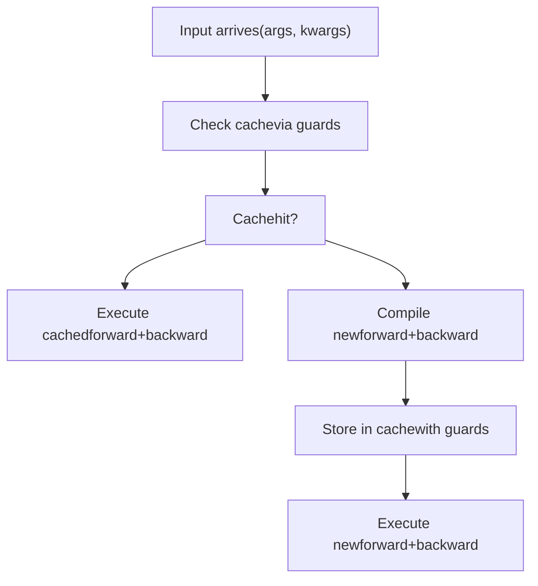
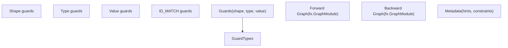
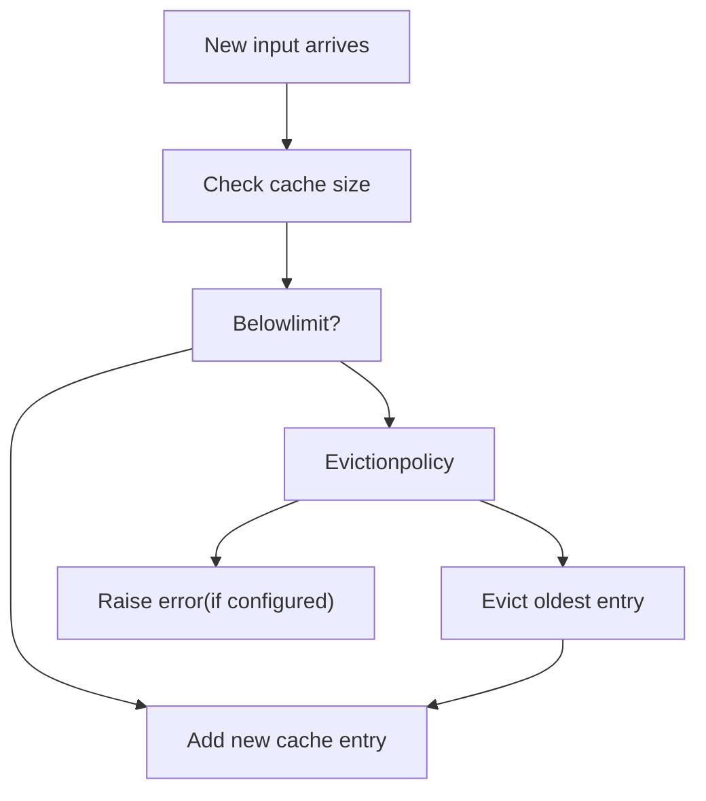
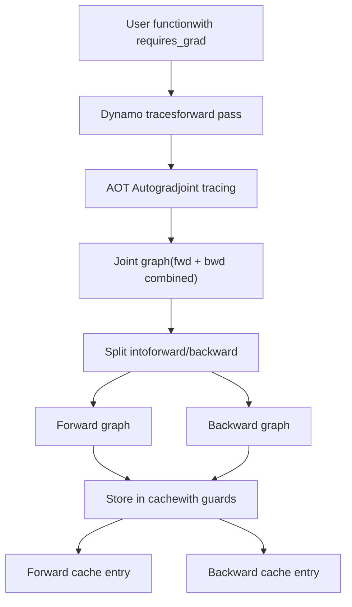
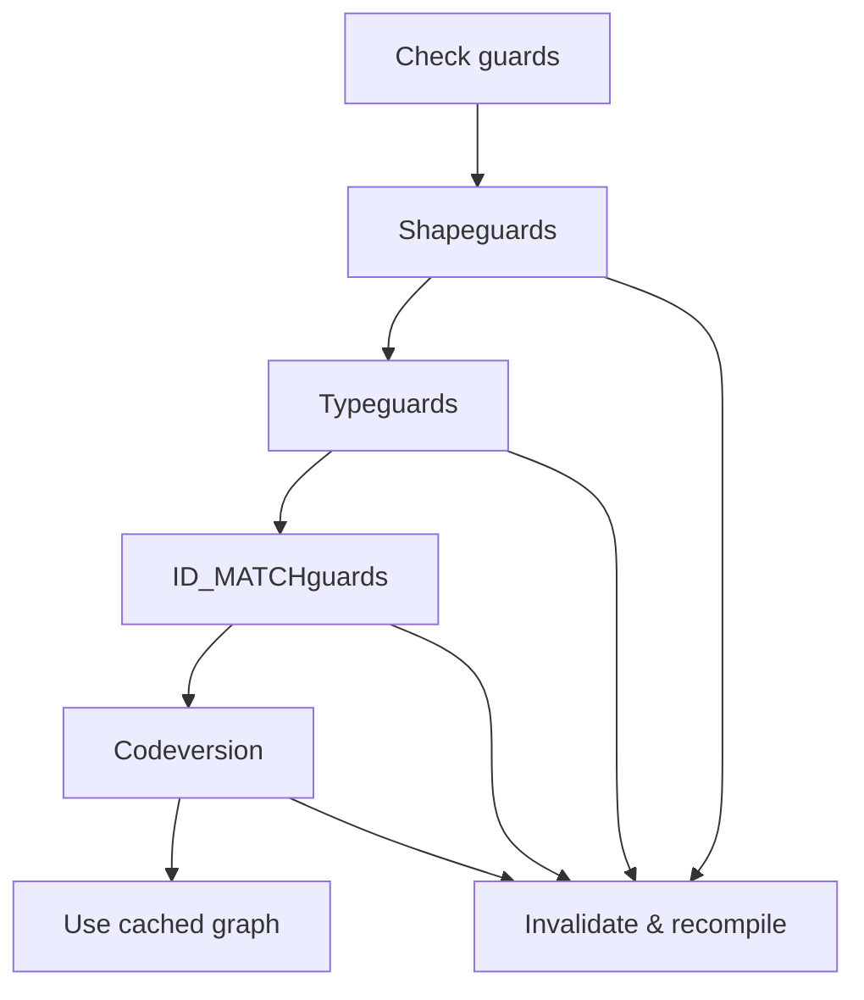
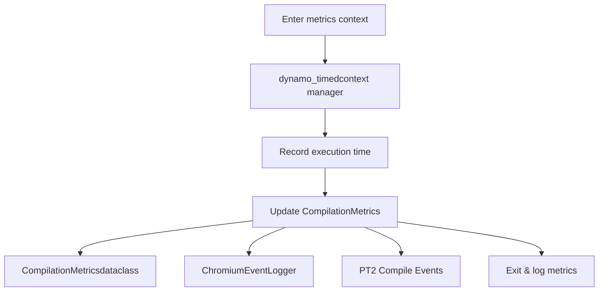
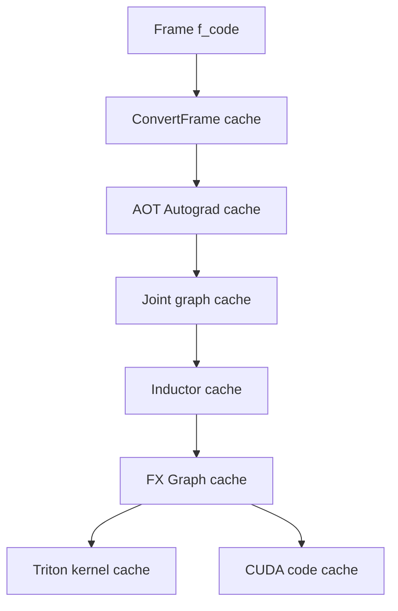

# Autograd Caching

Relevant source files

-   [.ci/docker/common/install\_jax.sh](https://github.com/pytorch/pytorch/blob/915982a4/.ci/docker/common/install_jax.sh)
-   [benchmarks/inductor\_backends/cutlass.py](https://github.com/pytorch/pytorch/blob/915982a4/benchmarks/inductor_backends/cutlass.py)
-   [test/dynamo/test\_aot\_compile.py](https://github.com/pytorch/pytorch/blob/915982a4/test/dynamo/test_aot_compile.py)
-   [test/dynamo/test\_package.py](https://github.com/pytorch/pytorch/blob/915982a4/test/dynamo/test_package.py)
-   [test/dynamo/test\_pgo.py](https://github.com/pytorch/pytorch/blob/915982a4/test/dynamo/test_pgo.py)
-   [test/dynamo/test\_precompile\_context.py](https://github.com/pytorch/pytorch/blob/915982a4/test/dynamo/test_precompile_context.py)
-   [test/dynamo/test\_structured\_trace.py](https://github.com/pytorch/pytorch/blob/915982a4/test/dynamo/test_structured_trace.py)
-   [test/inductor/test\_auto\_functionalize.py](https://github.com/pytorch/pytorch/blob/915982a4/test/inductor/test_auto_functionalize.py)
-   [test/inductor/test\_cutedsl\_template.py](https://github.com/pytorch/pytorch/blob/915982a4/test/inductor/test_cutedsl_template.py)
-   [test/inductor/test\_cutlass\_backend.py](https://github.com/pytorch/pytorch/blob/915982a4/test/inductor/test_cutlass_backend.py)
-   [test/inductor/test\_cutlass\_evt.py](https://github.com/pytorch/pytorch/blob/915982a4/test/inductor/test_cutlass_evt.py)
-   [test/inductor/test\_pallas.py](https://github.com/pytorch/pytorch/blob/915982a4/test/inductor/test_pallas.py)
-   [test/inductor/test\_provenance\_tracing.py](https://github.com/pytorch/pytorch/blob/915982a4/test/inductor/test_provenance_tracing.py)
-   [torch/\_dynamo/aot\_compile.py](https://github.com/pytorch/pytorch/blob/915982a4/torch/_dynamo/aot_compile.py)
-   [torch/\_dynamo/package.py](https://github.com/pytorch/pytorch/blob/915982a4/torch/_dynamo/package.py)
-   [torch/\_dynamo/pgo.py](https://github.com/pytorch/pytorch/blob/915982a4/torch/_dynamo/pgo.py)
-   [torch/\_dynamo/precompile\_context.py](https://github.com/pytorch/pytorch/blob/915982a4/torch/_dynamo/precompile_context.py)
-   [torch/\_inductor/\_\_init\_\_.py](https://github.com/pytorch/pytorch/blob/915982a4/torch/_inductor/__init__.py)
-   [torch/\_inductor/codecache.py](https://github.com/pytorch/pytorch/blob/915982a4/torch/_inductor/codecache.py)
-   [torch/\_inductor/codegen/cpp\_flex\_attention\_template.py](https://github.com/pytorch/pytorch/blob/915982a4/torch/_inductor/codegen/cpp_flex_attention_template.py)
-   [torch/\_inductor/codegen/cpp\_template\_kernel.py](https://github.com/pytorch/pytorch/blob/915982a4/torch/_inductor/codegen/cpp_template_kernel.py)
-   [torch/\_inductor/codegen/cutedsl/README.md](https://github.com/pytorch/pytorch/blob/915982a4/torch/_inductor/codegen/cutedsl/README.md)
-   [torch/\_inductor/codegen/cutedsl/\_\_init\_\_.py](https://github.com/pytorch/pytorch/blob/915982a4/torch/_inductor/codegen/cutedsl/__init__.py)
-   [torch/\_inductor/codegen/cutedsl/cutedsl\_op\_overrides.py](https://github.com/pytorch/pytorch/blob/915982a4/torch/_inductor/codegen/cutedsl/cutedsl_op_overrides.py)
-   [torch/\_inductor/codegen/cutedsl/cutedsl\_template.py](https://github.com/pytorch/pytorch/blob/915982a4/torch/_inductor/codegen/cutedsl/cutedsl_template.py)
-   [torch/\_inductor/codegen/pallas.py](https://github.com/pytorch/pytorch/blob/915982a4/torch/_inductor/codegen/pallas.py)
-   [torch/\_inductor/compile\_fx.py](https://github.com/pytorch/pytorch/blob/915982a4/torch/_inductor/compile_fx.py)
-   [torch/\_inductor/debug.py](https://github.com/pytorch/pytorch/blob/915982a4/torch/_inductor/debug.py)
-   [torch/\_inductor/runtime/runtime\_utils.py](https://github.com/pytorch/pytorch/blob/915982a4/torch/_inductor/runtime/runtime_utils.py)
-   [torch/compiler/\_\_init\_\_.py](https://github.com/pytorch/pytorch/blob/915982a4/torch/compiler/__init__.py)
-   [torch/compiler/\_cache.py](https://github.com/pytorch/pytorch/blob/915982a4/torch/compiler/_cache.py)
-   [torch/compiler/config.py](https://github.com/pytorch/pytorch/blob/915982a4/torch/compiler/config.py)
-   [torch/testing/\_internal/inductor\_utils.py](https://github.com/pytorch/pytorch/blob/915982a4/torch/testing/_internal/inductor_utils.py)
-   [torch/utils/\_pallas.py](https://github.com/pytorch/pytorch/blob/915982a4/torch/utils/_pallas.py)

## Purpose and Scope

This page describes the caching mechanisms used by AOT (Ahead-of-Time) Autograd to avoid recompiling forward and backward graphs when processing inputs with compatible properties. For information about the overall AOT Autograd pipeline, see [AOT Autograd Pipeline](/pytorch/pytorch/2.4.1-aot-autograd-pipeline). For broader compilation caching and frame-level caching, see [Guards System and Recompilation](/pytorch/pytorch/2.2.3-guard-system-and-recompilation).

Autograd caching specifically focuses on:

-   Storing compiled forward and backward graph pairs
-   Using guards to determine cache hit eligibility
-   Managing cache size and eviction policies
-   Integrating with the broader Dynamo compilation cache

---

## Overview

When PyTorch code is compiled with `torch.compile`, the AOT Autograd system creates both forward and backward computation graphs. Without caching, each invocation with different inputs (even slightly different shapes or strides) would trigger a full recompilation. Autograd caching solves this by:

1.  **Storing compiled artifacts**: After compilation, both forward and backward graph modules are cached along with their associated metadata
2.  **Guard-based lookup**: When new inputs arrive, guards determine if cached graphs can be reused
3.  **Cache management**: Configurable limits prevent unbounded cache growth


**Sources**: [torch/\_dynamo/convert\_frame.py585-734](https://github.com/pytorch/pytorch/blob/915982a4/torch/_dynamo/convert_frame.py#L585-L734) [torch/\_dynamo/utils.py172-189](https://github.com/pytorch/pytorch/blob/915982a4/torch/_dynamo/utils.py#L172-L189)

---

## Cache Structure

### Cache Entry Components

Each cache entry consists of:

| Component | Description | Location |
| --- | --- | --- |
| `GuardedCode` | Compiled bytecode with associated guards | Returned by conversion |
| Forward graph | FX graph module for forward pass | From AOT Autograd |
| Backward graph | FX graph module for backward pass | From AOT Autograd |
| Guards | Conditions that must hold for cache validity | Guard system |
| Metadata | Shape information, specialization hints | Node metadata |


**Sources**: [torch/\_dynamo/convert\_frame.py126-131](https://github.com/pytorch/pytorch/blob/915982a4/torch/_dynamo/convert_frame.py#L126-L131) [torch/\_dynamo/guards.py](https://github.com/pytorch/pytorch/blob/915982a4/torch/_dynamo/guards.py)

---

## Cache Lookup Process

### Guard Evaluation

When a function is called, the cache lookup proceeds as follows:

> **[Mermaid sequence]**
> *(图表结构无法解析)*

### Guard Checking Implementation

Guards are checked in C++ for performance:

1.  **Fast path**: C++ guard evaluation via `set_eval_frame`
2.  **Guard types**: Shape constraints, type checks, ID matching
3.  **Short-circuiting**: Fails fast on first guard violation

**Sources**: [torch/\_dynamo/convert\_frame.py612-696](https://github.com/pytorch/pytorch/blob/915982a4/torch/_dynamo/convert_frame.py#L612-L696) [torch/\_C/\_dynamo/eval\_frame.py](https://github.com/pytorch/pytorch/blob/915982a4/torch/_C/_dynamo/eval_frame.py)

---

## Cache Size Management

### Recompilation Limits

The caching system enforces limits to prevent unbounded growth:

| Configuration | Default | Purpose |
| --- | --- | --- |
| `recompile_limit` | 8 | Max cache entries with same ID\_MATCH'd objects |
| `accumulated_recompile_limit` | 256 | Total cache entries across all objects |
| `fail_on_recompile_limit_hit` | False | Raise error instead of evicting |


### Cache Size Computation

The `compute_cache_size` function tracks:

-   Number of entries with matching ID\_MATCH'd objects
-   Total accumulated cache entries
-   Cache entry metadata for debugging

**Sources**: [torch/\_dynamo/cache\_size.py](https://github.com/pytorch/pytorch/blob/915982a4/torch/_dynamo/cache_size.py) [torch/\_dynamo/config.py99-131](https://github.com/pytorch/pytorch/blob/915982a4/torch/_dynamo/config.py#L99-L131)

---

## Integration with AOT Autograd

### Joint Forward-Backward Compilation

AOT Autograd creates a joint forward-backward graph, then splits it:


### Descriptor-Based Export

The `aot_export_joint_with_descriptors` function handles:

-   Creating joint forward-backward graphs
-   Generating descriptors for graph inputs/outputs
-   Preserving metadata through compilation

**Sources**: [torch/\_functorch/aot\_autograd.py](https://github.com/pytorch/pytorch/blob/915982a4/torch/_functorch/aot_autograd.py) [torch/export/\_trace.py69-73](https://github.com/pytorch/pytorch/blob/915982a4/torch/export/_trace.py#L69-L73)

---

## Cache Invalidation

### Invalidation Triggers

Cached graphs are invalidated when:

1.  **Guard failures**: Input properties violate cached guards
2.  **Code changes**: Function bytecode modifications
3.  **Module mutations**: `nn.Module` state changes
4.  **Dynamic shapes**: Shape specialization mismatches
5.  **Tensor subclasses**: Wrapper/subclass type changes


### Automatic Dynamic Shapes

When `automatic_dynamic_shapes=True`, the system:

-   First attempts fully static compilation
-   On guard failure due to shape variation, recompiles with dynamic shapes
-   Marks all "wobbled" dimensions as dynamic

**Sources**: [torch/\_dynamo/config.py162-168](https://github.com/pytorch/pytorch/blob/915982a4/torch/_dynamo/config.py#L162-L168) [torch/\_dynamo/guards.py](https://github.com/pytorch/pytorch/blob/915982a4/torch/_dynamo/guards.py)

---

## Cache Metrics and Observability

### Compilation Metrics

The system tracks:

```
# Key metrics in compilation_time_metrics dict{    "entire_frame_compile": [list of times],    "backend_compile": [list of times],    "guards_check": [list of times],} # Cumulative time trackingcumulative_time_spent_ns: dict[str, float]
```
### Metrics Context

The `MetricsContext` class provides structured logging:


**Sources**: [torch/\_dynamo/utils.py336-373](https://github.com/pytorch/pytorch/blob/915982a4/torch/_dynamo/utils.py#L336-L373) [torch/\_dynamo/utils.py686-844](https://github.com/pytorch/pytorch/blob/915982a4/torch/_dynamo/utils.py#L686-L844)

---

## Configuration and Tuning

### Key Configuration Options

Set via `torch._dynamo.config`:

| Option | Effect | When to Use |
| --- | --- | --- |
| `cache_size_limit` | Max entries per ID\_MATCH | Increase for diverse input patterns |
| `accumulated_cache_size_limit` | Total cache entries | Increase for large applications |
| `fail_on_cache_limit_hit` | Error on limit | Development/debugging |
| `automatic_dynamic_shapes` | Auto-promote dynamics | Handle varying shapes |
| `assume_static_by_default` | Static-first compilation | Known static shapes |

### Example Configuration

```
import torch._dynamo.config as config # Allow more cache entries for diverse inputsconfig.cache_size_limit = 16config.accumulated_cache_size_limit = 512 # Enable automatic dynamic shapesconfig.automatic_dynamic_shapes = True # Fail fast during developmentconfig.fail_on_cache_limit_hit = True  # Development only
```
### Monitoring Cache Performance

```
from torch._dynamo.utils import (    calculate_time_spent,    compilation_time_metrics,) # After compilationtime_spent = calculate_time_spent()print(f"Total wall time: {time_spent['total_wall_time']}")print(f"Backend compile: {time_spent['backend_compile']}") # Per-function metricsfor func_name, times in compilation_time_metrics.items():    print(f"{func_name}: {len(times)} compilations")
```
**Sources**: [torch/\_dynamo/config.py99-131](https://github.com/pytorch/pytorch/blob/915982a4/torch/_dynamo/config.py#L99-L131) [torch/\_dynamo/utils.py305-332](https://github.com/pytorch/pytorch/blob/915982a4/torch/_dynamo/utils.py#L305-L332)

---

## Interaction with Broader Caching

### Multi-Level Cache Hierarchy


The autograd cache sits between frame-level caching (Dynamo) and backend-level caching (Inductor), providing:

-   **Guard propagation**: Guards from frame cache flow to autograd cache
-   **Artifact reuse**: Compiled graphs can be reused by backend cache
-   **Metadata preservation**: Shape and type information flows through cache layers

**Sources**: [torch/\_dynamo/convert\_frame.py728-795](https://github.com/pytorch/pytorch/blob/915982a4/torch/_dynamo/convert_frame.py#L728-L795) [torch/\_inductor/compile\_fx.py](https://github.com/pytorch/pytorch/blob/915982a4/torch/_inductor/compile_fx.py) [torch/fx/experimental/proxy\_tensor.py](https://github.com/pytorch/pytorch/blob/915982a4/torch/fx/experimental/proxy_tensor.py)
