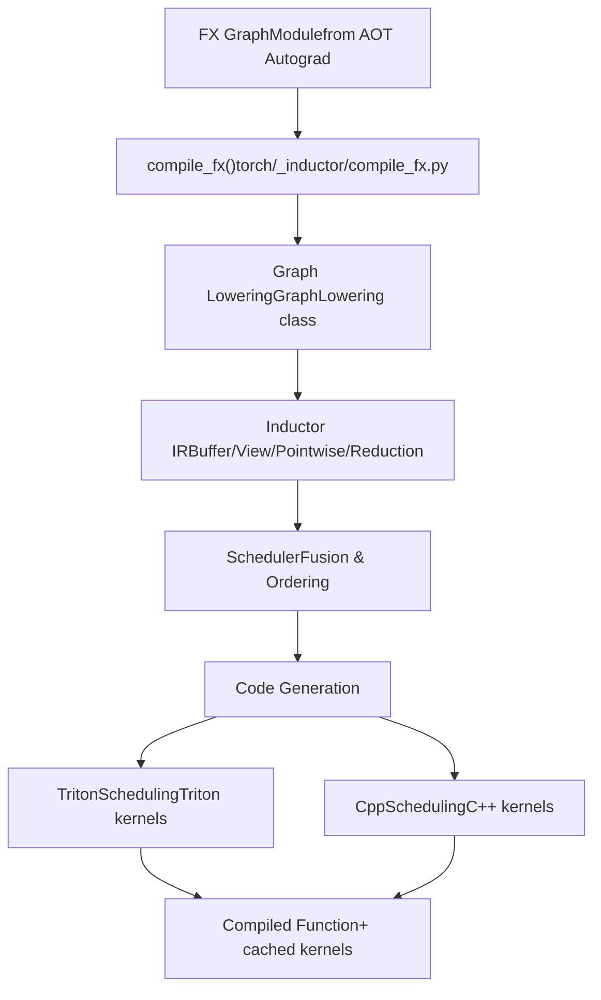
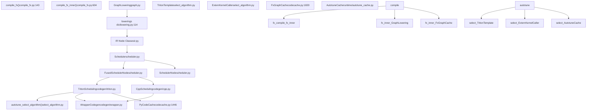
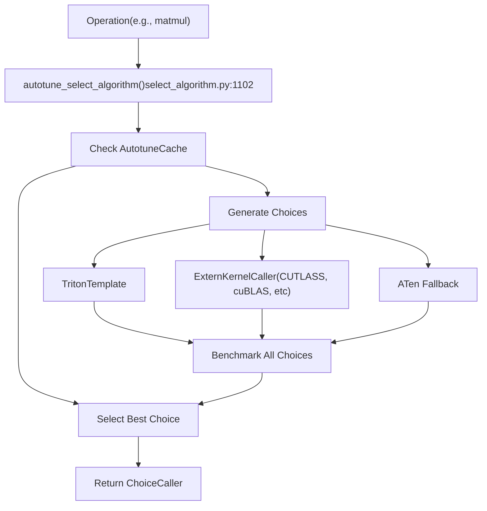

# TorchInductor Backend

Relevant source files

-   [.ci/docker/common/install\_jax.sh](https://github.com/pytorch/pytorch/blob/915982a4/.ci/docker/common/install_jax.sh)
-   [.flake8](https://github.com/pytorch/pytorch/blob/915982a4/.flake8)
-   [.lintrunner.toml](https://github.com/pytorch/pytorch/blob/915982a4/.lintrunner.toml)
-   [aten/src/ATen/cuda/CUDAGreenContext.cpp](https://github.com/pytorch/pytorch/blob/915982a4/aten/src/ATen/cuda/CUDAGreenContext.cpp)
-   [aten/src/ATen/cuda/CUDAGreenContext.h](https://github.com/pytorch/pytorch/blob/915982a4/aten/src/ATen/cuda/CUDAGreenContext.h)
-   [benchmarks/inductor\_backends/cutlass.py](https://github.com/pytorch/pytorch/blob/915982a4/benchmarks/inductor_backends/cutlass.py)
-   [docs/source/cuda.md](https://github.com/pytorch/pytorch/blob/915982a4/docs/source/cuda.md)
-   [pyproject.toml](https://github.com/pytorch/pytorch/blob/915982a4/pyproject.toml)
-   [test/dynamo/test\_structured\_trace.py](https://github.com/pytorch/pytorch/blob/915982a4/test/dynamo/test_structured_trace.py)
-   [test/inductor/test\_aot\_inductor.py](https://github.com/pytorch/pytorch/blob/915982a4/test/inductor/test_aot_inductor.py)
-   [test/inductor/test\_auto\_functionalize.py](https://github.com/pytorch/pytorch/blob/915982a4/test/inductor/test_auto_functionalize.py)
-   [test/inductor/test\_codecache.py](https://github.com/pytorch/pytorch/blob/915982a4/test/inductor/test_codecache.py)
-   [test/inductor/test\_combo\_kernels.py](https://github.com/pytorch/pytorch/blob/915982a4/test/inductor/test_combo_kernels.py)
-   [test/inductor/test\_cpu\_repro.py](https://github.com/pytorch/pytorch/blob/915982a4/test/inductor/test_cpu_repro.py)
-   [test/inductor/test\_cuda\_repro.py](https://github.com/pytorch/pytorch/blob/915982a4/test/inductor/test_cuda_repro.py)
-   [test/inductor/test\_custom\_op\_autotune.py](https://github.com/pytorch/pytorch/blob/915982a4/test/inductor/test_custom_op_autotune.py)
-   [test/inductor/test\_cutedsl\_template.py](https://github.com/pytorch/pytorch/blob/915982a4/test/inductor/test_cutedsl_template.py)
-   [test/inductor/test\_cutlass\_backend.py](https://github.com/pytorch/pytorch/blob/915982a4/test/inductor/test_cutlass_backend.py)
-   [test/inductor/test\_cutlass\_evt.py](https://github.com/pytorch/pytorch/blob/915982a4/test/inductor/test_cutlass_evt.py)
-   [test/inductor/test\_flex\_decoding.py](https://github.com/pytorch/pytorch/blob/915982a4/test/inductor/test_flex_decoding.py)
-   [test/inductor/test\_foreach.py](https://github.com/pytorch/pytorch/blob/915982a4/test/inductor/test_foreach.py)
-   [test/inductor/test\_lookup\_table.py](https://github.com/pytorch/pytorch/blob/915982a4/test/inductor/test_lookup_table.py)
-   [test/inductor/test\_max\_autotune.py](https://github.com/pytorch/pytorch/blob/915982a4/test/inductor/test_max_autotune.py)
-   [test/inductor/test\_mmdecomp.py](https://github.com/pytorch/pytorch/blob/915982a4/test/inductor/test_mmdecomp.py)
-   [test/inductor/test\_pallas.py](https://github.com/pytorch/pytorch/blob/915982a4/test/inductor/test_pallas.py)
-   [test/inductor/test\_provenance\_tracing.py](https://github.com/pytorch/pytorch/blob/915982a4/test/inductor/test_provenance_tracing.py)
-   [test/inductor/test\_segmented\_tree.py](https://github.com/pytorch/pytorch/blob/915982a4/test/inductor/test_segmented_tree.py)
-   [test/inductor/test\_torchinductor.py](https://github.com/pytorch/pytorch/blob/915982a4/test/inductor/test_torchinductor.py)
-   [test/inductor/test\_torchinductor\_codegen\_dynamic\_shapes.py](https://github.com/pytorch/pytorch/blob/915982a4/test/inductor/test_torchinductor_codegen_dynamic_shapes.py)
-   [test/test\_public\_bindings.py](https://github.com/pytorch/pytorch/blob/915982a4/test/test_public_bindings.py)
-   [test/test\_testing.py](https://github.com/pytorch/pytorch/blob/915982a4/test/test_testing.py)
-   [tools/linter/adapters/pyrefly\_linter.py](https://github.com/pytorch/pytorch/blob/915982a4/tools/linter/adapters/pyrefly_linter.py)
-   [tools/linter/adapters/test\_has\_main\_linter.py](https://github.com/pytorch/pytorch/blob/915982a4/tools/linter/adapters/test_has_main_linter.py)
-   [torch/\_inductor/\_\_init\_\_.py](https://github.com/pytorch/pytorch/blob/915982a4/torch/_inductor/__init__.py)
-   [torch/\_inductor/autotune\_process.py](https://github.com/pytorch/pytorch/blob/915982a4/torch/_inductor/autotune_process.py)
-   [torch/\_inductor/choices.py](https://github.com/pytorch/pytorch/blob/915982a4/torch/_inductor/choices.py)
-   [torch/\_inductor/codecache.py](https://github.com/pytorch/pytorch/blob/915982a4/torch/_inductor/codecache.py)
-   [torch/\_inductor/codegen/common.py](https://github.com/pytorch/pytorch/blob/915982a4/torch/_inductor/codegen/common.py)
-   [torch/\_inductor/codegen/cpp.py](https://github.com/pytorch/pytorch/blob/915982a4/torch/_inductor/codegen/cpp.py)
-   [torch/\_inductor/codegen/cpp\_flex\_attention\_template.py](https://github.com/pytorch/pytorch/blob/915982a4/torch/_inductor/codegen/cpp_flex_attention_template.py)
-   [torch/\_inductor/codegen/cpp\_template\_kernel.py](https://github.com/pytorch/pytorch/blob/915982a4/torch/_inductor/codegen/cpp_template_kernel.py)
-   [torch/\_inductor/codegen/cpp\_wrapper\_cpu.py](https://github.com/pytorch/pytorch/blob/915982a4/torch/_inductor/codegen/cpp_wrapper_cpu.py)
-   [torch/\_inductor/codegen/cpp\_wrapper\_cpu\_array\_ref.py](https://github.com/pytorch/pytorch/blob/915982a4/torch/_inductor/codegen/cpp_wrapper_cpu_array_ref.py)
-   [torch/\_inductor/codegen/cutedsl/README.md](https://github.com/pytorch/pytorch/blob/915982a4/torch/_inductor/codegen/cutedsl/README.md)
-   [torch/\_inductor/codegen/cutedsl/\_\_init\_\_.py](https://github.com/pytorch/pytorch/blob/915982a4/torch/_inductor/codegen/cutedsl/__init__.py)
-   [torch/\_inductor/codegen/cutedsl/cutedsl\_op\_overrides.py](https://github.com/pytorch/pytorch/blob/915982a4/torch/_inductor/codegen/cutedsl/cutedsl_op_overrides.py)
-   [torch/\_inductor/codegen/cutedsl/cutedsl\_template.py](https://github.com/pytorch/pytorch/blob/915982a4/torch/_inductor/codegen/cutedsl/cutedsl_template.py)
-   [torch/\_inductor/codegen/halide.py](https://github.com/pytorch/pytorch/blob/915982a4/torch/_inductor/codegen/halide.py)
-   [torch/\_inductor/codegen/pallas.py](https://github.com/pytorch/pytorch/blob/915982a4/torch/_inductor/codegen/pallas.py)
-   [torch/\_inductor/codegen/simd.py](https://github.com/pytorch/pytorch/blob/915982a4/torch/_inductor/codegen/simd.py)
-   [torch/\_inductor/codegen/subgraph.py](https://github.com/pytorch/pytorch/blob/915982a4/torch/_inductor/codegen/subgraph.py)
-   [torch/\_inductor/codegen/triton.py](https://github.com/pytorch/pytorch/blob/915982a4/torch/_inductor/codegen/triton.py)
-   [torch/\_inductor/codegen/triton\_combo\_kernel.py](https://github.com/pytorch/pytorch/blob/915982a4/torch/_inductor/codegen/triton_combo_kernel.py)
-   [torch/\_inductor/codegen/wrapper.py](https://github.com/pytorch/pytorch/blob/915982a4/torch/_inductor/codegen/wrapper.py)
-   [torch/\_inductor/compile\_fx.py](https://github.com/pytorch/pytorch/blob/915982a4/torch/_inductor/compile_fx.py)
-   [torch/\_inductor/config.py](https://github.com/pytorch/pytorch/blob/915982a4/torch/_inductor/config.py)
-   [torch/\_inductor/debug.py](https://github.com/pytorch/pytorch/blob/915982a4/torch/_inductor/debug.py)
-   [torch/\_inductor/decomposition.py](https://github.com/pytorch/pytorch/blob/915982a4/torch/_inductor/decomposition.py)
-   [torch/\_inductor/dtype\_propagation.py](https://github.com/pytorch/pytorch/blob/915982a4/torch/_inductor/dtype_propagation.py)
-   [torch/\_inductor/graph.py](https://github.com/pytorch/pytorch/blob/915982a4/torch/_inductor/graph.py)
-   [torch/\_inductor/ir.py](https://github.com/pytorch/pytorch/blob/915982a4/torch/_inductor/ir.py)
-   [torch/\_inductor/kernel/bmm.py](https://github.com/pytorch/pytorch/blob/915982a4/torch/_inductor/kernel/bmm.py)
-   [torch/\_inductor/kernel/conv.py](https://github.com/pytorch/pytorch/blob/915982a4/torch/_inductor/kernel/conv.py)
-   [torch/\_inductor/kernel/custom\_op.py](https://github.com/pytorch/pytorch/blob/915982a4/torch/_inductor/kernel/custom_op.py)
-   [torch/\_inductor/kernel/mm.py](https://github.com/pytorch/pytorch/blob/915982a4/torch/_inductor/kernel/mm.py)
-   [torch/\_inductor/kernel/mm\_plus\_mm.py](https://github.com/pytorch/pytorch/blob/915982a4/torch/_inductor/kernel/mm_plus_mm.py)
-   [torch/\_inductor/kernel\_inputs.py](https://github.com/pytorch/pytorch/blob/915982a4/torch/_inductor/kernel_inputs.py)
-   [torch/\_inductor/lowering.py](https://github.com/pytorch/pytorch/blob/915982a4/torch/_inductor/lowering.py)
-   [torch/\_inductor/memory.py](https://github.com/pytorch/pytorch/blob/915982a4/torch/_inductor/memory.py)
-   [torch/\_inductor/ops\_handler.py](https://github.com/pytorch/pytorch/blob/915982a4/torch/_inductor/ops_handler.py)
-   [torch/\_inductor/runtime/runtime\_utils.py](https://github.com/pytorch/pytorch/blob/915982a4/torch/_inductor/runtime/runtime_utils.py)
-   [torch/\_inductor/runtime/triton\_heuristics.py](https://github.com/pytorch/pytorch/blob/915982a4/torch/_inductor/runtime/triton_heuristics.py)
-   [torch/\_inductor/scheduler.py](https://github.com/pytorch/pytorch/blob/915982a4/torch/_inductor/scheduler.py)
-   [torch/\_inductor/select\_algorithm.py](https://github.com/pytorch/pytorch/blob/915982a4/torch/_inductor/select_algorithm.py)
-   [torch/\_inductor/shape\_propagation.py](https://github.com/pytorch/pytorch/blob/915982a4/torch/_inductor/shape_propagation.py)
-   [torch/\_inductor/sizevars.py](https://github.com/pytorch/pytorch/blob/915982a4/torch/_inductor/sizevars.py)
-   [torch/\_inductor/template\_heuristics/triton.py](https://github.com/pytorch/pytorch/blob/915982a4/torch/_inductor/template_heuristics/triton.py)
-   [torch/\_inductor/utils.py](https://github.com/pytorch/pytorch/blob/915982a4/torch/_inductor/utils.py)
-   [torch/\_inductor/virtualized.py](https://github.com/pytorch/pytorch/blob/915982a4/torch/_inductor/virtualized.py)
-   [torch/csrc/cuda/GreenContext.cpp](https://github.com/pytorch/pytorch/blob/915982a4/torch/csrc/cuda/GreenContext.cpp)
-   [torch/csrc/inductor/cpp\_wrapper/common.h](https://github.com/pytorch/pytorch/blob/915982a4/torch/csrc/inductor/cpp_wrapper/common.h)
-   [torch/cuda/green\_contexts.py](https://github.com/pytorch/pytorch/blob/915982a4/torch/cuda/green_contexts.py)
-   [torch/testing/\_internal/inductor\_utils.py](https://github.com/pytorch/pytorch/blob/915982a4/torch/testing/_internal/inductor_utils.py)
-   [torch/testing/\_internal/py312\_intrinsics.py](https://github.com/pytorch/pytorch/blob/915982a4/torch/testing/_internal/py312_intrinsics.py)
-   [torch/utils/\_pallas.py](https://github.com/pytorch/pytorch/blob/915982a4/torch/utils/_pallas.py)

## Purpose and Scope

TorchInductor is PyTorch's optimizing compiler backend that transforms FX graphs into highly optimized machine code. It receives FX graphs from the TorchDynamo frontend or torch.export, performs lowering to an intermediate representation, applies scheduling and fusion optimizations, and generates code for various backends including Triton GPU kernels, vendor-specific templates (CUTLASS, Composable Kernel), and C++ CPU code.

This page covers TorchInductor's overall architecture and compilation pipeline. For detailed information on specific subsystems:

-   IR representation and lowering: see [Inductor IR and Lowering](/pytorch/pytorch/2.5.1-inductor-ir-and-lowering)
-   Scheduling and fusion algorithms: see [Scheduling and Fusion](/pytorch/pytorch/2.5.2-scheduling-and-fusion)
-   Kernel selection and autotuning: see [Kernel Selection and Autotuning](/pytorch/pytorch/2.5.3-kernel-selection-and-autotuning)
-   Code generation backends: see [Code Generation: Triton, CUTLASS, C++](/pytorch/pytorch/2.5.4-code-generation:-triton-cutlass-pallas-c++)
-   Compilation caching: see [Compilation Cache and Code Storage](/pytorch/pytorch/2.5.5-compilation-cache-and-code-storage)
-   Optimized implementations: see [Specialized Kernel Implementations](/pytorch/pytorch/2.5.6-specialized-kernel-implementations)

## Overview

TorchInductor serves as the backend in PyTorch's compilation stack. It is invoked after TorchDynamo captures Python bytecode and produces FX graphs (page [2.2](/pytorch/pytorch/2.2-torchdynamo-frontend)), and after AOT Autograd decomposes and functionalizes these graphs (page [2.4](/pytorch/pytorch/2.4-aot-autograd-and-functionalization)). TorchInductor's responsibility is to take these FX graphs and produce efficient executable code.


**TorchInductor Compilation Flow**

Sources: [torch/\_inductor/compile\_fx.py](https://github.com/pytorch/pytorch/blob/915982a4/torch/_inductor/compile_fx.py) [Diagram 1 from high-level architecture](https://github.com/pytorch/pytorch/blob/915982a4/Diagram 1 from high-level architecture)

## Core Components and Classes

The following diagram maps TorchInductor's major subsystems to their primary implementation classes and files:


**TorchInductor Major Components and Key Classes**

Sources: [torch/\_inductor/compile\_fx.py](https://github.com/pytorch/pytorch/blob/915982a4/torch/_inductor/compile_fx.py) [torch/\_inductor/graph.py](https://github.com/pytorch/pytorch/blob/915982a4/torch/_inductor/graph.py) [torch/\_inductor/lowering.py](https://github.com/pytorch/pytorch/blob/915982a4/torch/_inductor/lowering.py) [torch/\_inductor/ir.py](https://github.com/pytorch/pytorch/blob/915982a4/torch/_inductor/ir.py) [torch/\_inductor/scheduler.py](https://github.com/pytorch/pytorch/blob/915982a4/torch/_inductor/scheduler.py) [torch/\_inductor/codegen/triton.py](https://github.com/pytorch/pytorch/blob/915982a4/torch/_inductor/codegen/triton.py) [torch/\_inductor/select\_algorithm.py](https://github.com/pytorch/pytorch/blob/915982a4/torch/_inductor/select_algorithm.py) [torch/\_inductor/codecache.py](https://github.com/pytorch/pytorch/blob/915982a4/torch/_inductor/codecache.py)

## Compilation Pipeline

The TorchInductor compilation pipeline consists of several sequential stages:

### 1\. Entry and Initialization

The compilation process begins with `compile_fx()` [torch/\_inductor/compile\_fx.py143](https://github.com/pytorch/pytorch/blob/915982a4/torch/_inductor/compile_fx.py#L143-L143) which handles:

-   Graph preparation and validation
-   Fake tensor mode setup for symbolic shape propagation
-   Caching checks via `FxGraphCache`
-   Invocation of `compile_fx_inner()` [torch/\_inductor/compile\_fx.py604](https://github.com/pytorch/pytorch/blob/915982a4/torch/_inductor/compile_fx.py#L604-L604)

### 2\. Graph Lowering

The `GraphLowering` class [torch/\_inductor/graph.py](https://github.com/pytorch/pytorch/blob/915982a4/torch/_inductor/graph.py) walks through the FX graph and:

-   Converts each FX node to Inductor IR nodes via the `lowerings` dictionary [torch/\_inductor/lowering.py114](https://github.com/pytorch/pytorch/blob/915982a4/torch/_inductor/lowering.py#L114-L114)
-   Creates `Buffer`, `Pointwise`, `Reduction`, and `View` IR nodes [torch/\_inductor/ir.py](https://github.com/pytorch/pytorch/blob/915982a4/torch/_inductor/ir.py)
-   Manages symbolic variables through `SizeVars` for dynamic shapes
-   Tracks memory layout and storage requirements

### 3\. Scheduling and Fusion

The `Scheduler` [torch/\_inductor/scheduler.py](https://github.com/pytorch/pytorch/blob/915982a4/torch/_inductor/scheduler.py) analyzes dependencies and:

-   Determines operation execution order
-   Identifies fusion opportunities
-   Creates `FusedSchedulerNode` instances for grouped operations [torch/\_inductor/scheduler.py](https://github.com/pytorch/pytorch/blob/915982a4/torch/_inductor/scheduler.py)
-   Applies memory planning and buffer reuse

### 4\. Code Generation

Backend-specific scheduling classes generate code:

-   `TritonScheduling` [torch/\_inductor/codegen/triton.py](https://github.com/pytorch/pytorch/blob/915982a4/torch/_inductor/codegen/triton.py) generates Triton GPU kernels
-   `CppScheduling` generates vectorized CPU code
-   `WrapperCodegen` [torch/\_inductor/codegen/wrapper.py](https://github.com/pytorch/pytorch/blob/915982a4/torch/_inductor/codegen/wrapper.py) creates Python wrapper code that:
    -   Allocates tensors
    -   Invokes generated kernels
    -   Handles runtime shape calculations

### 5\. Compilation and Caching

Generated code is compiled and cached:

-   `PyCodeCache` [torch/\_inductor/codecache.py1446](https://github.com/pytorch/pytorch/blob/915982a4/torch/_inductor/codecache.py#L1446-L1446) compiles Python wrapper code
-   Triton kernels are compiled via the Triton compiler
-   `FxGraphCache` [torch/\_inductor/codecache.py1820](https://github.com/pytorch/pytorch/blob/915982a4/torch/_inductor/codecache.py#L1820-L1820) enables graph-level caching
-   `AutotuneCache` stores autotuning results

> **[Mermaid sequence]**
> *(图表结构无法解析)*

**TorchInductor Compilation Sequence**

Sources: [torch/\_inductor/compile\_fx.py143-604](https://github.com/pytorch/pytorch/blob/915982a4/torch/_inductor/compile_fx.py#L143-L604) [torch/\_inductor/graph.py](https://github.com/pytorch/pytorch/blob/915982a4/torch/_inductor/graph.py) [torch/\_inductor/scheduler.py](https://github.com/pytorch/pytorch/blob/915982a4/torch/_inductor/scheduler.py) [torch/\_inductor/codegen/triton.py](https://github.com/pytorch/pytorch/blob/915982a4/torch/_inductor/codegen/triton.py)

## Inductor IR

TorchInductor uses a layered intermediate representation (IR) to model PyTorch operations and memory layouts. The IR is documented in detail on page [2.5.1](/pytorch/pytorch/2.5.1-inductor-ir-and-lowering). Key IR node types include:

| IR Node Type | Purpose | Source File |
| --- | --- | --- |
| `TensorBox` | Top-level tensor representation | [torch/\_inductor/ir.py198](https://github.com/pytorch/pytorch/blob/915982a4/torch/_inductor/ir.py#L198-L198) |
| `StorageBox` | Manages underlying storage | [torch/\_inductor/ir.py](https://github.com/pytorch/pytorch/blob/915982a4/torch/_inductor/ir.py) |
| `Buffer` | Represents allocated memory | [torch/\_inductor/ir.py](https://github.com/pytorch/pytorch/blob/915982a4/torch/_inductor/ir.py) |
| `View` | View operations (transpose, reshape) | [torch/\_inductor/ir.py](https://github.com/pytorch/pytorch/blob/915982a4/torch/_inductor/ir.py) |
| `Pointwise` | Element-wise operations | [torch/\_inductor/ir.py](https://github.com/pytorch/pytorch/blob/915982a4/torch/_inductor/ir.py) |
| `Reduction` | Reduction operations (sum, max) | [torch/\_inductor/ir.py](https://github.com/pytorch/pytorch/blob/915982a4/torch/_inductor/ir.py) |
| `Layout` | Memory layout specification | [torch/\_inductor/ir.py](https://github.com/pytorch/pytorch/blob/915982a4/torch/_inductor/ir.py) |

The `lowerings` dictionary [torch/\_inductor/lowering.py114](https://github.com/pytorch/pytorch/blob/915982a4/torch/_inductor/lowering.py#L114-L114) maps PyTorch operations (aten ops) to functions that generate these IR nodes.

Sources: [torch/\_inductor/ir.py](https://github.com/pytorch/pytorch/blob/915982a4/torch/_inductor/ir.py) [torch/\_inductor/lowering.py114](https://github.com/pytorch/pytorch/blob/915982a4/torch/_inductor/lowering.py#L114-L114)

## Scheduling and Fusion

The `Scheduler` class [torch/\_inductor/scheduler.py](https://github.com/pytorch/pytorch/blob/915982a4/torch/_inductor/scheduler.py) is responsible for determining the execution order of operations and identifying fusion opportunities. Key responsibilities include:

**Dependency Analysis**: The scheduler builds a dependency graph where nodes represent operations and edges represent data dependencies (`MemoryDep`, `StarDep`, `WeakDep`) [torch/\_inductor/dependencies.py](https://github.com/pytorch/pytorch/blob/915982a4/torch/_inductor/dependencies.py)

**Fusion Decisions**: Operations are fused based on:

-   Memory access patterns
-   Device compatibility
-   Loop ordering compatibility
-   Read/write dependencies
-   Configuration settings like `config.aggressive_fusion` [torch/\_inductor/config.py775](https://github.com/pytorch/pytorch/blob/915982a4/torch/_inductor/config.py#L775-L775)

**Node Types**: The scheduler creates:

-   `SchedulerNode` [torch/\_inductor/scheduler.py](https://github.com/pytorch/pytorch/blob/915982a4/torch/_inductor/scheduler.py) for individual operations
-   `FusedSchedulerNode` [torch/\_inductor/scheduler.py](https://github.com/pytorch/pytorch/blob/915982a4/torch/_inductor/scheduler.py) for fused groups
-   `NopKernelSchedulerNode` for operations with no computation

Detailed fusion algorithms and heuristics are covered on page [2.5.2](/pytorch/pytorch/2.5.2-scheduling-and-fusion).

Sources: [torch/\_inductor/scheduler.py](https://github.com/pytorch/pytorch/blob/915982a4/torch/_inductor/scheduler.py) [torch/\_inductor/dependencies.py](https://github.com/pytorch/pytorch/blob/915982a4/torch/_inductor/dependencies.py) [torch/\_inductor/config.py775](https://github.com/pytorch/pytorch/blob/915982a4/torch/_inductor/config.py#L775-L775)

## Kernel Selection and Autotuning

TorchInductor employs a sophisticated kernel selection system to choose the best implementation for each operation:


**Kernel Selection and Autotuning Flow**

The `autotune_select_algorithm()` function [torch/\_inductor/select\_algorithm.py1102](https://github.com/pytorch/pytorch/blob/915982a4/torch/_inductor/select_algorithm.py#L1102-L1102) coordinates the selection process:

1.  **Choice Generation**: Multiple kernel implementations are generated:

    -   `TritonTemplate` instances for Triton kernels [torch/\_inductor/select\_algorithm.py](https://github.com/pytorch/pytorch/blob/915982a4/torch/_inductor/select_algorithm.py)
    -   `ExternKernelCaller` for CUTLASS, cuBLAS, CK templates
    -   ATen fallback implementations
2.  **Benchmarking**: Each choice is benchmarked with actual inputs:

    -   `TritonBenchmarkRequest` [torch/\_inductor/autotune\_process.py](https://github.com/pytorch/pytorch/blob/915982a4/torch/_inductor/autotune_process.py) handles Triton kernel benchmarking
    -   `ExternKernelBenchmarkRequest` for external kernels
    -   Results measured in milliseconds
3.  **Configuration Tuning**: For Triton kernels, multiple configurations are tested:

    -   Block sizes (XBLOCK, YBLOCK, RBLOCK)
    -   Number of warps
    -   Number of stages
    -   Coordinate descent tuning via `CoordescTuner` [torch/\_inductor/runtime/coordinate\_descent\_tuner.py](https://github.com/pytorch/pytorch/blob/915982a4/torch/_inductor/runtime/coordinate_descent_tuner.py)
4.  **Caching**: Results stored in `AutotuneCache` [torch/\_inductor/runtime/autotune\_cache.py](https://github.com/pytorch/pytorch/blob/915982a4/torch/_inductor/runtime/autotune_cache.py) to avoid re-benchmarking.


Configuration options that control autotuning:

-   `config.max_autotune` [torch/\_inductor/config.py482](https://github.com/pytorch/pytorch/blob/915982a4/torch/_inductor/config.py#L482-L482) - enables autotuning
-   `config.max_autotune_gemm` [torch/\_inductor/config.py488](https://github.com/pytorch/pytorch/blob/915982a4/torch/_inductor/config.py#L488-L488) - for matrix operations
-   `config.max_autotune_pointwise` [torch/\_inductor/config.py485](https://github.com/pytorch/pytorch/blob/915982a4/torch/_inductor/config.py#L485-L485) - for pointwise operations
-   `config.autotune_local_cache` [torch/\_inductor/config.py134](https://github.com/pytorch/pytorch/blob/915982a4/torch/_inductor/config.py#L134-L134) - enables local caching
-   `config.coordinate_descent_tuning` [torch/\_inductor/config.py688](https://github.com/pytorch/pytorch/blob/915982a4/torch/_inductor/config.py#L688-L688) - enables coordinate descent

More details on autotuning strategies are on page [2.5.3](/pytorch/pytorch/2.5.3-kernel-selection-and-autotuning).

Sources: [torch/\_inductor/select\_algorithm.py1102](https://github.com/pytorch/pytorch/blob/915982a4/torch/_inductor/select_algorithm.py#L1102-L1102) [torch/\_inductor/autotune\_process.py](https://github.com/pytorch/pytorch/blob/915982a4/torch/_inductor/autotune_process.py) [torch/\_inductor/runtime/autotune\_cache.py](https://github.com/pytorch/pytorch/blob/915982a4/torch/_inductor/runtime/autotune_cache.py) [torch/\_inductor/config.py482-488](https://github.com/pytorch/pytorch/blob/915982a4/torch/_inductor/config.py#L482-L488)

## Code Generation Backends

TorchInductor supports multiple code generation backends:

### Triton Backend

The `TritonScheduling` class [torch/\_inductor/codegen/triton.py](https://github.com/pytorch/pytorch/blob/915982a4/torch/_inductor/codegen/triton.py) generates Triton GPU kernels:

**TritonKernel**: Represents a single Triton kernel with:

-   Loop iteration ranges (XBLOCK, YBLOCK, RBLOCK dimensions)
-   Indexing expressions for memory accesses
-   Computation body
-   Configuration (block sizes, num\_warps, num\_stages)

**Key Classes**:

-   `TritonKernel` [torch/\_inductor/codegen/triton.py](https://github.com/pytorch/pytorch/blob/915982a4/torch/_inductor/codegen/triton.py) - single kernel representation
-   `TritonSymbols` [torch/\_inductor/codegen/triton.py190](https://github.com/pytorch/pytorch/blob/915982a4/torch/_inductor/codegen/triton.py#L190-L190) - manages symbolic block offsets/sizes
-   `IndexingOptions` [torch/\_inductor/codegen/triton.py274](https://github.com/pytorch/pytorch/blob/915982a4/torch/_inductor/codegen/triton.py#L274-L274) - indexing and masking logic
-   `BlockPtrOptions` [torch/\_inductor/codegen/triton.py660](https://github.com/pytorch/pytorch/blob/915982a4/torch/_inductor/codegen/triton.py#L660-L660) - block pointer generation

**Features**:

-   Automatic memory coalescing
-   Persistent reductions
-   TMA (Tensor Memory Accelerator) support for newer GPUs
-   Mixed-order reduction fusion
-   Block pointer optimization

### CUTLASS and Vendor Templates

For CUDA GPUs, TorchInductor can use CUTLASS templates:

-   `CUTLASSGemmTemplate` for matrix multiplications
-   Auto-generated from CUTLASS library configurations
-   Optimized for specific GPU architectures (SM80+, SM90+)

For AMD GPUs, Composable Kernel (CK) templates provide optimized implementations.

### C++ Backend

The `CppScheduling` generates vectorized C++ code for CPU:

-   Uses SIMD intrinsics (AVX2, AVX512) via `CppVecKernel`
-   Parallel execution via OpenMP
-   Vectorized operations through `CppVecOverrides`

### Wrapper Code Generation

`WrapperCodegen` [torch/\_inductor/codegen/wrapper.py](https://github.com/pytorch/pytorch/blob/915982a4/torch/_inductor/codegen/wrapper.py) generates Python wrapper code that:

-   Allocates output tensors
-   Manages buffer reuse via `BufferPool`
-   Computes dynamic shapes
-   Invokes generated kernels
-   Handles CUDA graph recording

Key methods:

-   `generate()` [torch/\_inductor/codegen/wrapper.py](https://github.com/pytorch/pytorch/blob/915982a4/torch/_inductor/codegen/wrapper.py) - main entry point
-   `codegen_allocation()` - tensor allocation
-   `codegen_kernel_call()` - kernel invocation

More details on code generation are on page [2.5.4](/pytorch/pytorch/2.5.4-code-generation:-triton-cutlass-pallas-c++).

Sources: [torch/\_inductor/codegen/triton.py](https://github.com/pytorch/pytorch/blob/915982a4/torch/_inductor/codegen/triton.py) [torch/\_inductor/codegen/wrapper.py](https://github.com/pytorch/pytorch/blob/915982a4/torch/_inductor/codegen/wrapper.py) [torch/\_inductor/codegen/cpp.py](https://github.com/pytorch/pytorch/blob/915982a4/torch/_inductor/codegen/cpp.py)

## Compilation Caching

TorchInductor implements multi-layer caching to minimize compilation overhead:

| Cache Layer | Scope | Source |
| --- | --- | --- |
| `FxGraphCache` | FX graph level | [torch/\_inductor/codecache.py1820](https://github.com/pytorch/pytorch/blob/915982a4/torch/_inductor/codecache.py#L1820-L1820) |
| `PyCodeCache` | Python wrapper code | [torch/\_inductor/codecache.py1446](https://github.com/pytorch/pytorch/blob/915982a4/torch/_inductor/codecache.py#L1446-L1446) |
| `CUDACodeCache` | Compiled CUDA kernels | [torch/\_inductor/codecache.py](https://github.com/pytorch/pytorch/blob/915982a4/torch/_inductor/codecache.py) |
| `AutotuneCache` | Autotuning results | [torch/\_inductor/runtime/autotune\_cache.py](https://github.com/pytorch/pytorch/blob/915982a4/torch/_inductor/runtime/autotune_cache.py) |
| `TritonBundler` | Triton kernels | [torch/\_inductor/triton\_bundler.py](https://github.com/pytorch/pytorch/blob/915982a4/torch/_inductor/triton_bundler.py) |

**FxGraphCache**: Hash-based caching at the graph level:

-   Computes hash from FX graph structure and input metadata
-   Stores compiled output on disk
-   Checks for compatible cached versions on subsequent runs
-   Controlled by `config.fx_graph_cache` [torch/\_inductor/config.py104](https://github.com/pytorch/pytorch/blob/915982a4/torch/_inductor/config.py#L104-L104)

**PyCodeCache**: Compiles and caches Python wrapper code:

-   Uses `load_by_key_path()` [torch/\_inductor/codecache.py1510](https://github.com/pytorch/pytorch/blob/915982a4/torch/_inductor/codecache.py#L1510-L1510) to check cache
-   Writes generated Python to disk
-   Imports compiled modules dynamically

**Triton Kernel Caching**: Triton kernels are cached by:

-   Kernel source code hash
-   Target GPU architecture
-   Compiler version
-   Configuration (environment variables)

Configuration options:

-   `config.fx_graph_cache` [torch/\_inductor/config.py104](https://github.com/pytorch/pytorch/blob/915982a4/torch/_inductor/config.py#L104-L104) - enable graph caching
-   `config.autotune_local_cache` [torch/\_inductor/config.py134](https://github.com/pytorch/pytorch/blob/915982a4/torch/_inductor/config.py#L134-L134) - enable autotune caching
-   `config.fx_graph_remote_cache` [torch/\_inductor/config.py117](https://github.com/pytorch/pytorch/blob/915982a4/torch/_inductor/config.py#L117-L117) - enable remote caching
-   `config.force_disable_caches` [torch/\_inductor/config.py161](https://github.com/pytorch/pytorch/blob/915982a4/torch/_inductor/config.py#L161-L161) - disable all caches

More details on caching mechanisms are on page [2.5.5](/pytorch/pytorch/2.5.5-compilation-cache-and-code-storage).

Sources: [torch/\_inductor/codecache.py1820](https://github.com/pytorch/pytorch/blob/915982a4/torch/_inductor/codecache.py#L1820-L1820) [torch/\_inductor/codecache.py1446](https://github.com/pytorch/pytorch/blob/915982a4/torch/_inductor/codecache.py#L1446-L1446) [torch/\_inductor/runtime/autotune\_cache.py](https://github.com/pytorch/pytorch/blob/915982a4/torch/_inductor/runtime/autotune_cache.py) [torch/\_inductor/config.py104-161](https://github.com/pytorch/pytorch/blob/915982a4/torch/_inductor/config.py#L104-L161)

## Specialized Kernel Implementations

TorchInductor includes highly optimized implementations for common patterns:

### Matrix Multiplication Variants

**tuned\_mm and tuned\_bmm**: Optimized matrix multiply implementations [torch/\_inductor/kernel/mm.py](https://github.com/pytorch/pytorch/blob/915982a4/torch/_inductor/kernel/mm.py):

-   Auto-selection between CUTLASS, Triton, and cuBLAS
-   Support for mixed precision (FP16, BF16, FP8)
-   Heuristics via `InductorChoices` [torch/\_inductor/kernel/mm.py](https://github.com/pytorch/pytorch/blob/915982a4/torch/_inductor/kernel/mm.py)

**mm\_plus\_mm**: Fused "A @ B + C @ D" operations [torch/\_inductor/kernel/mm\_plus\_mm.py](https://github.com/pytorch/pytorch/blob/915982a4/torch/_inductor/kernel/mm_plus_mm.py):

-   Reduces memory bandwidth by fusing two matmuls
-   Custom Triton templates
-   Auto-tuned configurations

**Grouped Matrix Multiply**: [torch/\_inductor/kernel/mm\_grouped.py](https://github.com/pytorch/pytorch/blob/915982a4/torch/_inductor/kernel/mm_grouped.py)

-   Handles batches of variable-sized matrix multiplies
-   Optimized for cases where sizes vary across batch

### Flex Attention

Flexible attention implementations [torch/\_inductor/kernel/flex\_attention.py](https://github.com/pytorch/pytorch/blob/915982a4/torch/_inductor/kernel/flex_attention.py):

-   Custom attention patterns beyond standard scaled dot-product
-   Block-sparse attention support
-   Flash Attention integration [torch/\_inductor/kernel/flex\_flash\_attention.py](https://github.com/pytorch/pytorch/blob/915982a4/torch/_inductor/kernel/flex_flash_attention.py)

### Convolution

Specialized convolution kernels:

-   NHWC layout optimization
-   Winograd transformations for small kernels
-   Integration with cuDNN and MIOpen

Configuration for specialized kernels:

-   `config.use_mixed_mm` [torch/\_inductor/config.py368](https://github.com/pytorch/pytorch/blob/915982a4/torch/_inductor/config.py#L368-L368) (deprecated)
-   `config.triton.mm_heuristic` controls MM kernel selection
-   `config.force_fuse_int_mm_with_mul` [torch/\_inductor/config.py365](https://github.com/pytorch/pytorch/blob/915982a4/torch/_inductor/config.py#L365-L365)

More details on specialized kernels are on page [2.5.6](/pytorch/pytorch/2.5.6-specialized-kernel-implementations).

Sources: [torch/\_inductor/kernel/mm.py](https://github.com/pytorch/pytorch/blob/915982a4/torch/_inductor/kernel/mm.py) [torch/\_inductor/kernel/mm\_plus\_mm.py](https://github.com/pytorch/pytorch/blob/915982a4/torch/_inductor/kernel/mm_plus_mm.py) [torch/\_inductor/kernel/mm\_grouped.py](https://github.com/pytorch/pytorch/blob/915982a4/torch/_inductor/kernel/mm_grouped.py) [torch/\_inductor/kernel/flex\_attention.py](https://github.com/pytorch/pytorch/blob/915982a4/torch/_inductor/kernel/flex_attention.py)

## Configuration System

TorchInductor's behavior is controlled by the `config` module [torch/\_inductor/config.py](https://github.com/pytorch/pytorch/blob/915982a4/torch/_inductor/config.py) Key configuration categories:

### Compilation Control

-   `config.debug` [torch/\_inductor/config.py85](https://github.com/pytorch/pytorch/blob/915982a4/torch/_inductor/config.py#L85-L85) - enable debug mode
-   `config.verbose` - print compilation details
-   `config.fallback_random` [torch/\_inductor/config.py760](https://github.com/pytorch/pytorch/blob/915982a4/torch/_inductor/config.py#L760-L760) - fallback for random ops
-   `config.implicit_fallbacks` [torch/\_inductor/config.py766](https://github.com/pytorch/pytorch/blob/915982a4/torch/_inductor/config.py#L766-L766) - auto-fallback for unhandled ops

### Optimization Settings

-   `config.max_autotune` [torch/\_inductor/config.py482](https://github.com/pytorch/pytorch/blob/915982a4/torch/_inductor/config.py#L482-L482) - enable autotuning
-   `config.aggressive_fusion` [torch/\_inductor/config.py775](https://github.com/pytorch/pytorch/blob/915982a4/torch/_inductor/config.py#L775-L775) - aggressive operation fusion
-   `config.epilogue_fusion` [torch/\_inductor/config.py264](https://github.com/pytorch/pytorch/blob/915982a4/torch/_inductor/config.py#L264-L264) - fuse pointwise into epilogues
-   `config.prologue_fusion` [torch/\_inductor/config.py267](https://github.com/pytorch/pytorch/blob/915982a4/torch/_inductor/config.py#L267-L267) - fuse pointwise into prologues
-   `config.pattern_matcher` [torch/\_inductor/config.py273](https://github.com/pytorch/pytorch/blob/915982a4/torch/_inductor/config.py#L273-L273) - enable pattern matching optimizations

### Backend Selection

-   `config.cpu_backend` - "cpp" or "triton"
-   `config.cuda_backend` - "triton" or others
-   `config.max_autotune_gemm_backends` [torch/\_inductor/config.py579](https://github.com/pytorch/pytorch/blob/915982a4/torch/_inductor/config.py#L579-L579) - backends for GEMM autotuning

### Memory Management

-   `config.memory_planning` [torch/\_inductor/config.py245](https://github.com/pytorch/pytorch/blob/915982a4/torch/_inductor/config.py#L245-L245) - enable memory planning
-   `config.memory_pool` [torch/\_inductor/config.py256](https://github.com/pytorch/pytorch/blob/915982a4/torch/_inductor/config.py#L256-L256) - memory pooling strategy
-   `config.inplace_buffers` [torch/\_inductor/config.py239](https://github.com/pytorch/pytorch/blob/915982a4/torch/_inductor/config.py#L239-L239) - enable in-place operations
-   `config.allow_buffer_reuse` [torch/\_inductor/config.py242](https://github.com/pytorch/pytorch/blob/915982a4/torch/_inductor/config.py#L242-L242) - reuse buffers

### Triton-Specific

-   `config.triton.cudagraphs` - enable CUDA graphs
-   `config.triton.max_tiles` - max tiling factor
-   `config.triton.autotune_pointwise` - autotune pointwise kernels
-   `config.triton.mix_order_reduction` [torch/\_inductor/config.py273](https://github.com/pytorch/pytorch/blob/915982a4/torch/_inductor/config.py#L273-L273) - enable mixed-order reduction fusion

Configuration can be modified via:

```
with torch._inductor.config.patch({"max_autotune": True}):    # compilation with autotuning enabled    compiled_fn = torch.compile(fn)
```
Sources: [torch/\_inductor/config.py](https://github.com/pytorch/pytorch/blob/915982a4/torch/_inductor/config.py)

## Integration with Compilation Stack

TorchInductor integrates with the broader PyTorch compilation stack:

**Input**: Receives FX graphs from:

-   TorchDynamo (via `torch.compile`) - see page [2.2](/pytorch/pytorch/2.2-torchdynamo-frontend)
-   AOT Autograd (after functionalization) - see page [2.4](/pytorch/pytorch/2.4-aot-autograd-and-functionalization)
-   torch.export (for static graphs) - see page [2.3](/pytorch/pytorch/2.3-torch.export:-static-graph-export)

**Output**: Produces:

-   `CompiledFxGraph` [torch/\_inductor/output\_code.py](https://github.com/pytorch/pytorch/blob/915982a4/torch/_inductor/output_code.py) containing:
    -   Callable Python function
    -   Compiled kernels
    -   Constants and metadata
    -   CUDA graph if enabled

**Runtime Integration**: Generated code uses:

-   `torch._inductor.runtime.triton_heuristics` [torch/\_inductor/runtime/triton\_heuristics.py](https://github.com/pytorch/pytorch/blob/915982a4/torch/_inductor/runtime/triton_heuristics.py) for kernel launching
-   `torch._inductor.runtime.benchmarking` for performance measurement
-   Device-specific interfaces via `get_interface_for_device()`

Sources: [torch/\_inductor/compile\_fx.py](https://github.com/pytorch/pytorch/blob/915982a4/torch/_inductor/compile_fx.py) [torch/\_inductor/output\_code.py](https://github.com/pytorch/pytorch/blob/915982a4/torch/_inductor/output_code.py) [torch/\_inductor/runtime/](https://github.com/pytorch/pytorch/blob/915982a4/torch/_inductor/runtime/)
