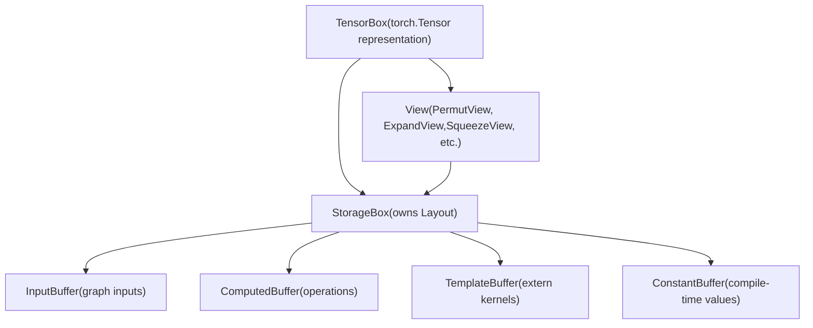
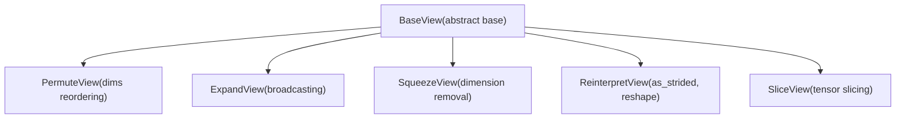
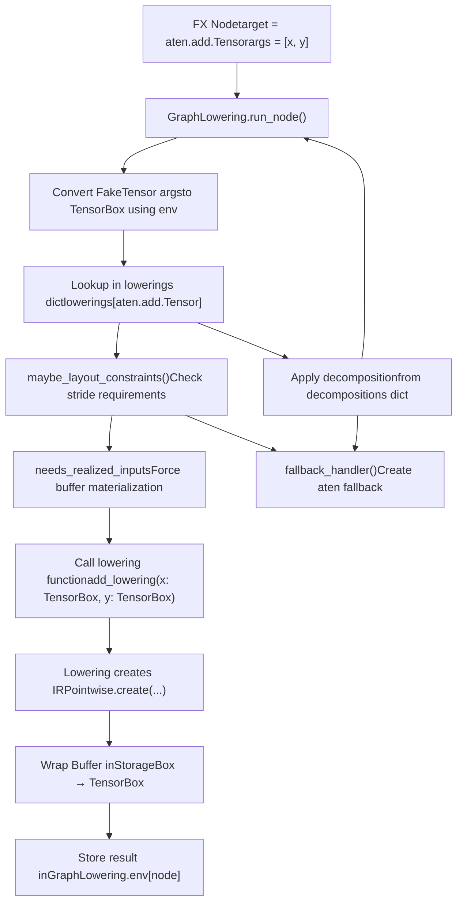

# Inductor IR and Lowering

Relevant source files

-   [test/inductor/test\_aot\_inductor.py](https://github.com/pytorch/pytorch/blob/915982a4/test/inductor/test_aot_inductor.py)
-   [test/inductor/test\_combo\_kernels.py](https://github.com/pytorch/pytorch/blob/915982a4/test/inductor/test_combo_kernels.py)
-   [test/inductor/test\_custom\_op\_autotune.py](https://github.com/pytorch/pytorch/blob/915982a4/test/inductor/test_custom_op_autotune.py)
-   [test/inductor/test\_foreach.py](https://github.com/pytorch/pytorch/blob/915982a4/test/inductor/test_foreach.py)
-   [test/inductor/test\_max\_autotune.py](https://github.com/pytorch/pytorch/blob/915982a4/test/inductor/test_max_autotune.py)
-   [test/inductor/test\_mmdecomp.py](https://github.com/pytorch/pytorch/blob/915982a4/test/inductor/test_mmdecomp.py)
-   [test/inductor/test\_torchinductor.py](https://github.com/pytorch/pytorch/blob/915982a4/test/inductor/test_torchinductor.py)
-   [test/inductor/test\_torchinductor\_codegen\_dynamic\_shapes.py](https://github.com/pytorch/pytorch/blob/915982a4/test/inductor/test_torchinductor_codegen_dynamic_shapes.py)
-   [torch/\_inductor/autotune\_process.py](https://github.com/pytorch/pytorch/blob/915982a4/torch/_inductor/autotune_process.py)
-   [torch/\_inductor/choices.py](https://github.com/pytorch/pytorch/blob/915982a4/torch/_inductor/choices.py)
-   [torch/\_inductor/codegen/common.py](https://github.com/pytorch/pytorch/blob/915982a4/torch/_inductor/codegen/common.py)
-   [torch/\_inductor/codegen/cpp\_wrapper\_cpu.py](https://github.com/pytorch/pytorch/blob/915982a4/torch/_inductor/codegen/cpp_wrapper_cpu.py)
-   [torch/\_inductor/codegen/cpp\_wrapper\_cpu\_array\_ref.py](https://github.com/pytorch/pytorch/blob/915982a4/torch/_inductor/codegen/cpp_wrapper_cpu_array_ref.py)
-   [torch/\_inductor/codegen/simd.py](https://github.com/pytorch/pytorch/blob/915982a4/torch/_inductor/codegen/simd.py)
-   [torch/\_inductor/codegen/subgraph.py](https://github.com/pytorch/pytorch/blob/915982a4/torch/_inductor/codegen/subgraph.py)
-   [torch/\_inductor/codegen/triton.py](https://github.com/pytorch/pytorch/blob/915982a4/torch/_inductor/codegen/triton.py)
-   [torch/\_inductor/codegen/triton\_combo\_kernel.py](https://github.com/pytorch/pytorch/blob/915982a4/torch/_inductor/codegen/triton_combo_kernel.py)
-   [torch/\_inductor/codegen/wrapper.py](https://github.com/pytorch/pytorch/blob/915982a4/torch/_inductor/codegen/wrapper.py)
-   [torch/\_inductor/config.py](https://github.com/pytorch/pytorch/blob/915982a4/torch/_inductor/config.py)
-   [torch/\_inductor/decomposition.py](https://github.com/pytorch/pytorch/blob/915982a4/torch/_inductor/decomposition.py)
-   [torch/\_inductor/dtype\_propagation.py](https://github.com/pytorch/pytorch/blob/915982a4/torch/_inductor/dtype_propagation.py)
-   [torch/\_inductor/graph.py](https://github.com/pytorch/pytorch/blob/915982a4/torch/_inductor/graph.py)
-   [torch/\_inductor/ir.py](https://github.com/pytorch/pytorch/blob/915982a4/torch/_inductor/ir.py)
-   [torch/\_inductor/kernel/bmm.py](https://github.com/pytorch/pytorch/blob/915982a4/torch/_inductor/kernel/bmm.py)
-   [torch/\_inductor/kernel/conv.py](https://github.com/pytorch/pytorch/blob/915982a4/torch/_inductor/kernel/conv.py)
-   [torch/\_inductor/kernel/custom\_op.py](https://github.com/pytorch/pytorch/blob/915982a4/torch/_inductor/kernel/custom_op.py)
-   [torch/\_inductor/kernel/mm.py](https://github.com/pytorch/pytorch/blob/915982a4/torch/_inductor/kernel/mm.py)
-   [torch/\_inductor/kernel/mm\_plus\_mm.py](https://github.com/pytorch/pytorch/blob/915982a4/torch/_inductor/kernel/mm_plus_mm.py)
-   [torch/\_inductor/kernel\_inputs.py](https://github.com/pytorch/pytorch/blob/915982a4/torch/_inductor/kernel_inputs.py)
-   [torch/\_inductor/lowering.py](https://github.com/pytorch/pytorch/blob/915982a4/torch/_inductor/lowering.py)
-   [torch/\_inductor/memory.py](https://github.com/pytorch/pytorch/blob/915982a4/torch/_inductor/memory.py)
-   [torch/\_inductor/ops\_handler.py](https://github.com/pytorch/pytorch/blob/915982a4/torch/_inductor/ops_handler.py)
-   [torch/\_inductor/runtime/triton\_heuristics.py](https://github.com/pytorch/pytorch/blob/915982a4/torch/_inductor/runtime/triton_heuristics.py)
-   [torch/\_inductor/scheduler.py](https://github.com/pytorch/pytorch/blob/915982a4/torch/_inductor/scheduler.py)
-   [torch/\_inductor/select\_algorithm.py](https://github.com/pytorch/pytorch/blob/915982a4/torch/_inductor/select_algorithm.py)
-   [torch/\_inductor/shape\_propagation.py](https://github.com/pytorch/pytorch/blob/915982a4/torch/_inductor/shape_propagation.py)
-   [torch/\_inductor/template\_heuristics/triton.py](https://github.com/pytorch/pytorch/blob/915982a4/torch/_inductor/template_heuristics/triton.py)
-   [torch/\_inductor/utils.py](https://github.com/pytorch/pytorch/blob/915982a4/torch/_inductor/utils.py)
-   [torch/\_inductor/virtualized.py](https://github.com/pytorch/pytorch/blob/915982a4/torch/_inductor/virtualized.py)
-   [torch/csrc/inductor/cpp\_wrapper/common.h](https://github.com/pytorch/pytorch/blob/915982a4/torch/csrc/inductor/cpp_wrapper/common.h)

This page describes Inductor's intermediate representation (IR) and the lowering process that transforms FX graph operations into this IR. The IR provides a functional, buffer-based representation of tensor operations that enables optimization and code generation.

For information about the subsequent scheduling and fusion stages, see [Scheduling and Fusion](/pytorch/pytorch/2.4.2-autograd-caching). For code generation from scheduled IR nodes, see [Code Generation Backends](#2.4.4).

## Purpose and Scope

Inductor IR serves as the bridge between PyTorch's high-level FX graph representation and low-level generated code. This page covers:

-   **IR Structure**: The core classes (`TensorBox`, `Buffer`, `View`, `StorageBox`) and their relationships
-   **Buffer Types**: Different buffer categories (input, computed, template) and their purposes
-   **Lowering Process**: How ATen operations from FX graphs are converted to IR nodes
-   **Operation Types**: Pointwise operations, reductions, and other computational patterns in IR

The IR design follows a functional programming model where mutation is handled through buffer reallocation, enabling aggressive optimization while maintaining correctness.

## IR Class Hierarchy

The IR distinguishes between tensors (which may be views) and storage (which owns memory). This separation models PyTorch's semantics where multiple tensor views can share underlying storage.

### Core IR Structure


**Ownership model:**

-   Direct storage: `TensorBox → StorageBox → Buffer`
-   View chain: `TensorBox → View → StorageBox → Buffer`
-   Views share the underlying `StorageBox` with the base tensor

Sources: [torch/\_inductor/ir.py154-193](https://github.com/pytorch/pytorch/blob/915982a4/torch/_inductor/ir.py#L154-L193)

### TensorBox: Top-Level Representation

`TensorBox` is the primary IR type returned from lowering operations. It represents a `torch.Tensor` and can point to either a `View` or directly to a `StorageBox`.

The `TensorBox` class provides a uniform interface for accessing tensor properties:

-   `get_size()`: Returns symbolic shape expressions as `list[sympy.Expr]`
-   `get_stride()`: Returns symbolic stride expressions
-   `get_device()`: Returns the device (`torch.device`)
-   `get_dtype()`: Returns the data type (`torch.dtype`)
-   `realize()`: Materialize any pending mutations by forcing buffer allocation
-   `make_loader()`: Create a function to load values at given indices

The wrapper allows operations to work uniformly whether the underlying representation is a view or direct storage. The `TensorBox.data` attribute holds either a `StorageBox` or a `View` instance.

Sources: [torch/\_inductor/ir.py4508-4700](https://github.com/pytorch/pytorch/blob/915982a4/torch/_inductor/ir.py#L4508-L4700)

### Buffer Types

Buffers represent actual memory allocations and computations:

| Buffer Type | Purpose | Creation Point | Base Class |
| --- | --- | --- | --- |
| `InputBuffer` | Graph inputs and parameters | Created for each FX graph input in `GraphLowering.graph_input()` | `Buffer` |
| `ComputedBuffer` | Results of pointwise/reduction operations | Created during lowering via `Pointwise.create()` or `Reduction.create()` | `Buffer` |
| `TemplateBuffer` | Extern kernels (cuBLAS, ATen fallbacks) | Created for operations without inductor lowering | `Buffer` |
| `ConstantBuffer` | Compile-time constant tensors | Created for `torch.tensor()` literals | `Buffer` |
| `ShapeAsConstantBuffer` | Shape/stride values materialized as tensors | Created when shapes need to be passed as tensor arguments | `Buffer` |

Each buffer type manages:

-   **Layout**: A `Layout` object defining size, stride, device, dtype, and offset
-   **Dependencies**: Tracked via `reads` and `writes` attributes using `MemoryDep` objects
-   **Name allocation**: Unique buffer names generated through `V.graph.register_buffer()`

The base `Buffer` class defines common operations like `get_name()`, `get_device()`, `get_dtype()`, `get_size()`, `get_stride()`, and `get_layout()`.

Sources: [torch/\_inductor/ir.py1700-2500](https://github.com/pytorch/pytorch/blob/915982a4/torch/_inductor/ir.py#L1700-L2500) [torch/\_inductor/graph.py600-800](https://github.com/pytorch/pytorch/blob/915982a4/torch/_inductor/graph.py#L600-L800)

### View Types

View operations modify tensor metadata without copying data. All views inherit from `BaseView`:

**View Class Hierarchy**


**View Chaining**: Operations like `t.transpose(0,1).expand(...)` create a chain: `TensorBox → PermuteView → ExpandView → StorageBox`.

Each view type must override:

-   `get_size()`: Transform size through the view operation
-   `get_stride()`: Transform stride through the view operation
-   `make_loader()`: Generate indexing expressions that apply the inverse view transformation
-   `make_indexer()`: Create an indexing function that accounts for the view

For example, `PermuteView.make_loader()` permutes the index tuple before passing it to the underlying loader, while `ExpandView.make_loader()` clamps broadcasted dimensions to index 0.

Sources: [torch/\_inductor/ir.py3600-4300](https://github.com/pytorch/pytorch/blob/915982a4/torch/_inductor/ir.py#L3600-L4300)

## Operation IR Nodes

Operations are represented by IR nodes that compute outputs from inputs. The main operation categories are:

### Pointwise Operations

`Pointwise` nodes represent element-wise operations where output elements are computed independently:

```
# Lowering example for addition creates a Pointwise nodedef add_lowering(x, y):    x, y = promote_constants([x, y])    return Pointwise.create(        device=x.get_device(),        dtype=get_promoted_dtype(x, y),        inner_fn=lambda index: ops.add(            x.make_loader()(index),             y.make_loader()(index)        ),        ranges=x.get_size(),    )
```
**Key `Pointwise` attributes:**

-   `inner_fn`: Lambda `(index: List[sympy.Expr]) -> OpsValue` that computes the value at each index
-   `ranges`: List of symbolic expressions defining the iteration space (output size)
-   `origin_node`: FX node that created this operation (for debugging)
-   Can be fused with adjacent pointwise operations by the scheduler

The `Pointwise.create()` factory method creates a `ComputedBuffer` wrapping the pointwise computation and returns it in a `TensorBox`.

### Reduction Operations

`Reduction` nodes represent operations that reduce over one or more dimensions:

```
# Example: sum reductionReduction.create(    device=x.get_device(),    dtype=x.get_dtype(),    inner_fn=lambda index, rindex: x.make_loader()(index + (rindex,)),    ranges=output_size,    reduction_ranges=reduced_dims,    reduction_type="sum",)
```
**Key `Reduction` attributes:**

-   `reduction_ranges`: Dict mapping reduction dimension symbols to their ranges
-   `reduction_type`: String identifier ("sum", "max", "min", "argmax", "argmin", "any", "prod", "xor\_sum")
-   `inner_fn`: Lambda `(index, rindex) -> OpsValue` taking both output index and reduction index
-   `src_dtype`: Source data type before reduction (may differ from output dtype)

Reductions can be **persistent** (entire reduction in one kernel) or **non-persistent** (split into multiple kernels). The scheduler decides based on reduction size and available resources.

Sources: [torch/\_inductor/ir.py2600-3200](https://github.com/pytorch/pytorch/blob/915982a4/torch/_inductor/ir.py#L2600-L3200) [torch/\_inductor/ops\_handler.py80-120](https://github.com/pytorch/pytorch/blob/915982a4/torch/_inductor/ops_handler.py#L80-L120)

## Lowering Process

Lowering transforms FX graph nodes (which call ATen operations) into Inductor IR nodes. This happens in `GraphLowering.run_node()` from [torch/\_inductor/graph.py800-1000](https://github.com/pytorch/pytorch/blob/915982a4/torch/_inductor/graph.py#L800-L1000)

### Lowering Flow

**Lowering Process in GraphLowering**


The `GraphLowering.run_node()` method orchestrates this process, maintaining the `env` dictionary that maps FX nodes to their IR representations (TensorBox instances).

Sources: [torch/\_inductor/graph.py900-1100](https://github.com/pytorch/pytorch/blob/915982a4/torch/_inductor/graph.py#L900-L1100) [torch/\_inductor/lowering.py1-200](https://github.com/pytorch/pytorch/blob/915982a4/torch/_inductor/lowering.py#L1-L200)

### Lowering Registration System

Operations are registered in the `lowerings` dictionary:

```
# From torch/_inductor/lowering.pylowerings: dict[Union[Callable, str], Callable] = {} # Registration decorator@register_lowering(torch.ops.aten.add)def add_lowering(x: TensorBox, y: TensorBox) -> TensorBox:    # Implementation returns TensorBox wrapping IR node    ... # Can also register multiple overloads@register_lowering([aten.add.Tensor, aten.add.Scalar])def add_lowering(...):    ...
```
The registration system supports multiple strategies:

**1\. Direct Lowering**: Map `OpOverload` → lowering function

-   Function signature must match operation arguments
-   Return value must be `TensorBox` or tuple of `TensorBox`
-   Examples: `add`, `mul`, `relu`, `max_pool2d`

**2\. Decomposition**: Register in `decompositions` dict to break complex ops into primitives

-   Applied before lowering lookup
-   Recursive decomposition until all ops have lowerings
-   Examples: `gelu`, `layer_norm`, `softmax`

**3\. Fallback**: Operations without lowering or decomposition

-   `fallback_handler()` creates `ExternKernel` calling ATen
-   Prevents fusion but maintains correctness
-   Used for unsupported operations

The function `get_overloads()` automatically registers all overloads of an `OpOverloadPacket`.

Sources: [torch/\_inductor/lowering.py114-350](https://github.com/pytorch/pytorch/blob/915982a4/torch/_inductor/lowering.py#L114-L350) [torch/\_inductor/graph.py1000-1200](https://github.com/pytorch/pytorch/blob/915982a4/torch/_inductor/graph.py#L1000-L1200)

### Layout Constraints

Some operations require specific memory layouts to ensure correctness or performance. The `maybe_layout_constraints()` function checks if an operation has layout requirements.

**Constraint Types and Enforcement**

| Constraint Type | Purpose | When Applied | Example Ops |
| --- | --- | --- | --- |
| `needs_fixed_stride_order` | Preserve input stride order | Operations sensitive to stride ordering | `aten.as_strided`, view ops |
| `needs_contiguous_strides` | Require contiguous layout | Performance-critical kernels | `aten.convolution`, `aten.mm` |
| `needs_exact_strides` | Match eager exact strides | Ops with strict layout semantics | ATen fallback operations |
| `flexible_layout` | No constraints | Most operations | Pointwise ops, reductions |

**Constraint Functions**:

-   `constrain_to_fx_strides()`: Forces buffers to match the stride order from FX graph
-   `constrain_to_fake_tensors()`: Matches exact strides from fake tensor metadata
-   `require_contiguous()`: Forces C-contiguous layout

These constraints are defined via:

1.  **Tag-based**: `torch._C.Tag` annotations on operations (e.g., `needs_fixed_stride_order` tag)
2.  **Explicit registration**: `add_layout_constraint()` function
3.  **Custom constraint function**: Mapped in `_maybe_layout_constraints` dict

When constraints fail to be satisfied, the buffer is **realized** (materialized into a new contiguous buffer) before the operation.

Sources: [torch/\_inductor/lowering.py170-231](https://github.com/pytorch/pytorch/blob/915982a4/torch/_inductor/lowering.py#L170-L231) [torch/\_inductor/graph.py1150-1250](https://github.com/pytorch/pytorch/blob/915982a4/torch/_inductor/graph.py#L1150-L1250)

## Example: Lowering Addition

Here's the complete flow for lowering `torch.add(x, y)`:

### Step 1: FX Node Entry

> **[Mermaid sequence]**
> *(图表结构无法解析)*

### Step 2: Lowering Implementation

The addition lowering handles type promotion and scalar broadcasting:

```
# From torch/_inductor/lowering.py@register_lowering(aten.add)def add(x, y, *, alpha=1):    # Handle scalar multiplication factor    if alpha != 1:        y = mul(y, alpha)        # Promote constants (Python scalars) to tensor IR    x, y = promote_constants(        [x, y],         type_promotion_kind=ELEMENTWISE_TYPE_PROMOTION_KIND.DEFAULT    )        # Get promoted dtype for mixed-precision inputs (e.g., float32 + float16)    dtype = get_promoted_dtype(        x, y,         type_promotion_kind=ELEMENTWISE_TYPE_PROMOTION_KIND.DEFAULT    )        # Create Pointwise IR node    return Pointwise.create(        device=x.get_device(),        dtype=dtype,        inner_fn=lambda idx: ops.add(            x.make_loader()(idx),            y.make_loader()(idx)        ),        ranges=list(x.get_size()),    )
```
**Key helper functions:**

-   `promote_constants()`: Converts Python scalars to IR constants
-   `get_promoted_dtype()`: Implements PyTorch type promotion rules
-   `ops.add()`: Creates an `OpsValue` representing the addition operation

### Step 3: IR Node Creation

The `Pointwise.create()` factory method performs these steps:

1.  **Create LoopBody**: Constructs a `LoopBody` object from `inner_fn` and `ranges`

    -   Analyzes index expressions to determine buffer reads
    -   Extracts dependencies on input buffers
2.  **Create ComputedBuffer**: Instantiates buffer with:

    -   `Layout`: Created from `device`, `dtype`, and `ranges` (output shape)
    -   `make_loader()`: Function that evaluates `inner_fn` at each index
    -   `get_read_writes()`: Returns dependencies on inputs (x and y buffers)
3.  **Wrap in StorageBox and TensorBox**:

    ```
    buffer = ComputedBuffer(...)storage = StorageBox(buffer)return TensorBox(storage)
    ```

4.  **Register with graph**: Buffer added to `V.graph.buffers` for scheduling


The resulting `TensorBox` can be:

-   Used as input to other operations
-   Fused with adjacent pointwise operations by the scheduler
-   Materialized into executable code during code generation

Sources: [torch/\_inductor/lowering.py500-600](https://github.com/pytorch/pytorch/blob/915982a4/torch/_inductor/lowering.py#L500-L600) [torch/\_inductor/ir.py2650-2850](https://github.com/pytorch/pytorch/blob/915982a4/torch/_inductor/ir.py#L2650-L2850)

## Decompositions

Many operations are lowered through **decomposition** rather than direct lowering. Decompositions break complex operations into sequences of simpler primitive operations that have direct lowerings.

### Decomposition Registry

The `decompositions` dictionary combines:

-   **Core ATen decompositions**: From `torch._decomp.core_aten_decompositions()`
-   **Inductor-specific decompositions**: From `inductor_decompositions` dict

```
# From torch/_inductor/decomposition.pydecompositions = {    **core_aten_decompositions(),     **inductor_decompositions} # Register decomposition@register_decomposition(aten.gelu)def gelu_decomposition(x, approximate="none"):    if approximate == "tanh":        # Approximate GELU using tanh        return 0.5 * x * (1.0 + torch.tanh(            math.sqrt(2.0 / math.pi) * (x + 0.044715 * x ** 3)        ))    else:        # Exact GELU using erf        return x * 0.5 * (1.0 + torch.erf(x / math.sqrt(2.0)))
```
### Decomposition Flow

When `GraphLowering` encounters an operation:

1.  **Check decompositions first**: If `op in decompositions`, apply decomposition
2.  **Recursive lowering**: Each primitive operation from the decomposition is lowered
3.  **Fusion opportunity**: Decomposed operations can fuse together in the scheduler

Example decomposition chain for `gelu(x)`:

```
gelu(x)
  → 0.5 * x * (1.0 + erf(x / sqrt(2)))
  → mul(mul(0.5, x), add(1.0, erf(div(x, sqrt(2)))))
  → Pointwise nodes for mul, add, erf, div
  → Fused into single kernel by scheduler
```
**Benefits of decomposition:**

-   **Reuse lowerings**: Complex ops share primitive op implementations
-   **Optimization opportunities**: Scheduler can fuse decomposed operations
-   **Maintainability**: Easier to add support for new operations

Some operations prefer **direct lowering** over decomposition for:

-   Performance-critical operations (e.g., `layer_norm` with specialized kernels)
-   Operations with external library support (e.g., `conv2d` using cuDNN)
-   Operations that don't decompose efficiently

Sources: [torch/\_inductor/decomposition.py64-150](https://github.com/pytorch/pytorch/blob/915982a4/torch/_inductor/decomposition.py#L64-L150) [torch/\_inductor/graph.py1100-1200](https://github.com/pytorch/pytorch/blob/915982a4/torch/_inductor/graph.py#L1100-L1200)

## Mutation Handling

Inductor IR follows a **functional programming model**—mutations are handled through buffer reallocation rather than in-place modification.

### Mutation Lowering Strategy

```
# Mutation example: x.add_(y)# Lowering creates:# 1. New ComputedBuffer computing x + y# 2. MutationOutput node marking mutation# 3. Update x's StorageBox to point to new buffer# 4. Old buffer marked for potential deallocation
```
**Key classes for mutation handling:**

-   **`MutationOutput`**: Wrapper that marks a buffer as the result of a mutation

    -   Tracks the mutated buffer name
    -   Ensures mutations are scheduled in correct order
    -   Generated by lowerings of in-place operations (ops ending in `_`)
-   **`MutableBox`**: Wrapper for `TensorBox` that allows updating the `data` pointer

    -   Used for graph outputs that may be mutated
    -   Allows swapping the underlying buffer without changing the wrapper reference
-   **`InputsKernel`**: Special operation type for graph inputs/outputs

    -   Handles mutations to inputs (e.g., parameter updates)
    -   Manages aliases between inputs and outputs

**Tracking mutations:**

-   `V.graph.mutated_buffers`: Set of buffer names that have been mutated
-   `V.graph.mutation_real_name`: Maps mutation names to original buffer names
-   Dependencies track mutation ordering through `MutationDep` edges

### Benefits of Functional Approach

This functional approach enables several optimizations:

1.  **Aggressive fusion**: No aliasing concerns since each buffer has single definition
2.  **Memory planning**: Can safely reuse buffer storage when no longer live
3.  **Correctness**: Mutation semantics preserved through dependency tracking
4.  **Optimization freedom**: Can reorder non-dependent operations without mutation hazards

### Example: In-Place Addition

```
# x.add_(y) lowering:@register_lowering(aten.add_)def add_(x, y):    # Create functional addition    result = add(x, y)        # Mark as mutation of x    result = MutationOutput(        layout=result.get_layout(),        inputs=[result],        mutated_name=x.get_name(),    )        # Update graph tracking    V.graph.mutated_buffers.add(x.get_name())        return result
```
The scheduler ensures the mutation is applied at the correct point, and the old buffer is deallocated if no other operations depend on it.

Sources: [torch/\_inductor/ir.py4100-4300](https://github.com/pytorch/pytorch/blob/915982a4/torch/_inductor/ir.py#L4100-L4300) [torch/\_inductor/lowering.py800-900](https://github.com/pytorch/pytorch/blob/915982a4/torch/_inductor/lowering.py#L800-L900)

## Summary: Key Components

| Component | File | Purpose |
| --- | --- | --- |
| `TensorBox` | [torch/\_inductor/ir.py4508-4595](https://github.com/pytorch/pytorch/blob/915982a4/torch/_inductor/ir.py#L4508-L4595) | Top-level IR tensor representation |
| `StorageBox` | [torch/\_inductor/ir.py4400-4500](https://github.com/pytorch/pytorch/blob/915982a4/torch/_inductor/ir.py#L4400-L4500) | Manages buffer and layout |
| `ComputedBuffer` | [torch/\_inductor/ir.py2000-2200](https://github.com/pytorch/pytorch/blob/915982a4/torch/_inductor/ir.py#L2000-L2200) | Stores computation definition |
| `Pointwise` | [torch/\_inductor/ir.py2600-2800](https://github.com/pytorch/pytorch/blob/915982a4/torch/_inductor/ir.py#L2600-L2800) | Element-wise operations |
| `Reduction` | [torch/\_inductor/ir.py2900-3100](https://github.com/pytorch/pytorch/blob/915982a4/torch/_inductor/ir.py#L2900-L3100) | Reduction operations |
| `lowerings` dict | [torch/\_inductor/lowering.py114](https://github.com/pytorch/pytorch/blob/915982a4/torch/_inductor/lowering.py#L114-L114) | Maps ops to lowering functions |
| `GraphLowering.run_node()` | [torch/\_inductor/graph.py800-1000](https://github.com/pytorch/pytorch/blob/915982a4/torch/_inductor/graph.py#L800-L1000) | Orchestrates lowering process |

The IR enables Inductor to:

1.  **Analyze** operations for fusion opportunities
2.  **Transform** high-level operations into optimizable primitives
3.  **Defer** decisions about memory layout and computation order
4.  **Generate** efficient code through subsequent scheduling and codegen phases

For how these IR nodes are scheduled and fused, see [Scheduling and Fusion](/pytorch/pytorch/2.4.2-autograd-caching).
