# Scheduling and Fusion

Relevant source files

-   [test/inductor/test\_aot\_inductor.py](https://github.com/pytorch/pytorch/blob/915982a4/test/inductor/test_aot_inductor.py)
-   [test/inductor/test\_combo\_kernels.py](https://github.com/pytorch/pytorch/blob/915982a4/test/inductor/test_combo_kernels.py)
-   [test/inductor/test\_custom\_op\_autotune.py](https://github.com/pytorch/pytorch/blob/915982a4/test/inductor/test_custom_op_autotune.py)
-   [test/inductor/test\_foreach.py](https://github.com/pytorch/pytorch/blob/915982a4/test/inductor/test_foreach.py)
-   [test/inductor/test\_max\_autotune.py](https://github.com/pytorch/pytorch/blob/915982a4/test/inductor/test_max_autotune.py)
-   [test/inductor/test\_mmdecomp.py](https://github.com/pytorch/pytorch/blob/915982a4/test/inductor/test_mmdecomp.py)
-   [test/inductor/test\_torchinductor.py](https://github.com/pytorch/pytorch/blob/915982a4/test/inductor/test_torchinductor.py)
-   [test/inductor/test\_torchinductor\_codegen\_dynamic\_shapes.py](https://github.com/pytorch/pytorch/blob/915982a4/test/inductor/test_torchinductor_codegen_dynamic_shapes.py)
-   [torch/\_inductor/autotune\_process.py](https://github.com/pytorch/pytorch/blob/915982a4/torch/_inductor/autotune_process.py)
-   [torch/\_inductor/choices.py](https://github.com/pytorch/pytorch/blob/915982a4/torch/_inductor/choices.py)
-   [torch/\_inductor/codegen/common.py](https://github.com/pytorch/pytorch/blob/915982a4/torch/_inductor/codegen/common.py)
-   [torch/\_inductor/codegen/cpp\_wrapper\_cpu.py](https://github.com/pytorch/pytorch/blob/915982a4/torch/_inductor/codegen/cpp_wrapper_cpu.py)
-   [torch/\_inductor/codegen/cpp\_wrapper\_cpu\_array\_ref.py](https://github.com/pytorch/pytorch/blob/915982a4/torch/_inductor/codegen/cpp_wrapper_cpu_array_ref.py)
-   [torch/\_inductor/codegen/simd.py](https://github.com/pytorch/pytorch/blob/915982a4/torch/_inductor/codegen/simd.py)
-   [torch/\_inductor/codegen/subgraph.py](https://github.com/pytorch/pytorch/blob/915982a4/torch/_inductor/codegen/subgraph.py)
-   [torch/\_inductor/codegen/triton.py](https://github.com/pytorch/pytorch/blob/915982a4/torch/_inductor/codegen/triton.py)
-   [torch/\_inductor/codegen/triton\_combo\_kernel.py](https://github.com/pytorch/pytorch/blob/915982a4/torch/_inductor/codegen/triton_combo_kernel.py)
-   [torch/\_inductor/codegen/wrapper.py](https://github.com/pytorch/pytorch/blob/915982a4/torch/_inductor/codegen/wrapper.py)
-   [torch/\_inductor/config.py](https://github.com/pytorch/pytorch/blob/915982a4/torch/_inductor/config.py)
-   [torch/\_inductor/decomposition.py](https://github.com/pytorch/pytorch/blob/915982a4/torch/_inductor/decomposition.py)
-   [torch/\_inductor/dtype\_propagation.py](https://github.com/pytorch/pytorch/blob/915982a4/torch/_inductor/dtype_propagation.py)
-   [torch/\_inductor/graph.py](https://github.com/pytorch/pytorch/blob/915982a4/torch/_inductor/graph.py)
-   [torch/\_inductor/ir.py](https://github.com/pytorch/pytorch/blob/915982a4/torch/_inductor/ir.py)
-   [torch/\_inductor/kernel/bmm.py](https://github.com/pytorch/pytorch/blob/915982a4/torch/_inductor/kernel/bmm.py)
-   [torch/\_inductor/kernel/conv.py](https://github.com/pytorch/pytorch/blob/915982a4/torch/_inductor/kernel/conv.py)
-   [torch/\_inductor/kernel/custom\_op.py](https://github.com/pytorch/pytorch/blob/915982a4/torch/_inductor/kernel/custom_op.py)
-   [torch/\_inductor/kernel/mm.py](https://github.com/pytorch/pytorch/blob/915982a4/torch/_inductor/kernel/mm.py)
-   [torch/\_inductor/kernel/mm\_plus\_mm.py](https://github.com/pytorch/pytorch/blob/915982a4/torch/_inductor/kernel/mm_plus_mm.py)
-   [torch/\_inductor/kernel\_inputs.py](https://github.com/pytorch/pytorch/blob/915982a4/torch/_inductor/kernel_inputs.py)
-   [torch/\_inductor/lowering.py](https://github.com/pytorch/pytorch/blob/915982a4/torch/_inductor/lowering.py)
-   [torch/\_inductor/memory.py](https://github.com/pytorch/pytorch/blob/915982a4/torch/_inductor/memory.py)
-   [torch/\_inductor/ops\_handler.py](https://github.com/pytorch/pytorch/blob/915982a4/torch/_inductor/ops_handler.py)
-   [torch/\_inductor/runtime/triton\_heuristics.py](https://github.com/pytorch/pytorch/blob/915982a4/torch/_inductor/runtime/triton_heuristics.py)
-   [torch/\_inductor/scheduler.py](https://github.com/pytorch/pytorch/blob/915982a4/torch/_inductor/scheduler.py)
-   [torch/\_inductor/select\_algorithm.py](https://github.com/pytorch/pytorch/blob/915982a4/torch/_inductor/select_algorithm.py)
-   [torch/\_inductor/shape\_propagation.py](https://github.com/pytorch/pytorch/blob/915982a4/torch/_inductor/shape_propagation.py)
-   [torch/\_inductor/template\_heuristics/triton.py](https://github.com/pytorch/pytorch/blob/915982a4/torch/_inductor/template_heuristics/triton.py)
-   [torch/\_inductor/utils.py](https://github.com/pytorch/pytorch/blob/915982a4/torch/_inductor/utils.py)
-   [torch/\_inductor/virtualized.py](https://github.com/pytorch/pytorch/blob/915982a4/torch/_inductor/virtualized.py)
-   [torch/csrc/inductor/cpp\_wrapper/common.h](https://github.com/pytorch/pytorch/blob/915982a4/torch/csrc/inductor/cpp_wrapper/common.h)

## Purpose and Scope

This document describes TorchInductor's scheduling and fusion subsystem, which analyzes dependencies between operations in the Inductor IR and fuses compatible operations into efficient kernels. The scheduler determines the execution order of operations and groups them into fused kernels to minimize memory traffic and maximize GPU/CPU utilization.

For information about the Inductor IR that serves as input to the scheduler, see [Inductor IR and Lowering](/pytorch/pytorch/2.5.1-inductor-ir-and-lowering). For information about how specific kernel implementations are selected after fusion, see [Kernel Selection and Autotuning](/pytorch/pytorch/2.5.3-kernel-selection-and-autotuning).

## Overview

The scheduler sits between IR lowering and code generation in the TorchInductor pipeline. It receives a graph of buffer operations in Inductor IR format, analyzes data dependencies, and produces a schedule of fused kernels that will be generated as Triton, C++, or other backend code.

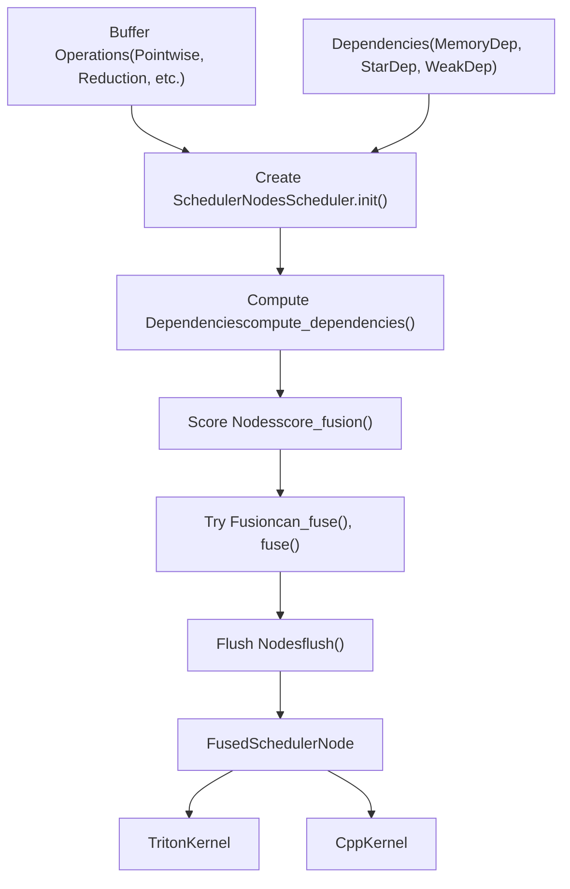
**Sources:** [torch/\_inductor/scheduler.py1-100](https://github.com/pytorch/pytorch/blob/915982a4/torch/_inductor/scheduler.py#L1-L100) [torch/\_inductor/codegen/triton.py1-100](https://github.com/pytorch/pytorch/blob/915982a4/torch/_inductor/codegen/triton.py#L1-L100)

## Scheduler Architecture

The scheduler is implemented primarily in the `Scheduler` class, which maintains the global scheduling state and orchestrates the fusion process.

### Core Classes

| Class | File | Purpose |
| --- | --- | --- |
| `Scheduler` | scheduler.py | Main scheduler orchestrating fusion and ordering |
| `BaseSchedulerNode` | scheduler.py | Base class for all scheduler nodes |
| `SchedulerNode` | scheduler.py | Represents a single buffer operation |
| `FusedSchedulerNode` | scheduler.py | Represents multiple fused operations |
| `ExternKernelSchedulerNode` | scheduler.py | Represents calls to external kernels |
| `NopKernelSchedulerNode` | scheduler.py | Represents no-op operations |

### Scheduler State

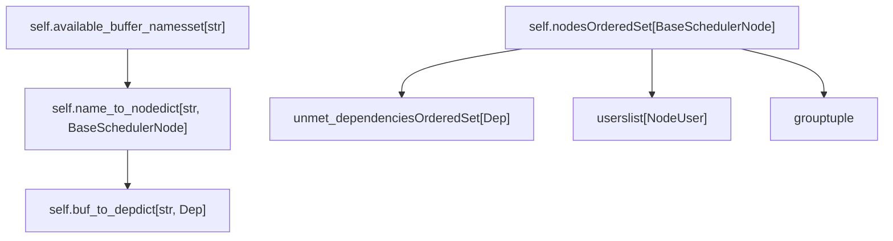
**Sources:** [torch/\_inductor/scheduler.py1000-1200](https://github.com/pytorch/pytorch/blob/915982a4/torch/_inductor/scheduler.py#L1000-L1200) [torch/\_inductor/scheduler.py269-500](https://github.com/pytorch/pytorch/blob/915982a4/torch/_inductor/scheduler.py#L269-L500)

## Node Types and Representation

Each operation in the Inductor IR is wrapped in a `SchedulerNode` that tracks its dependencies, users, and fusion compatibility.

### SchedulerNode Structure

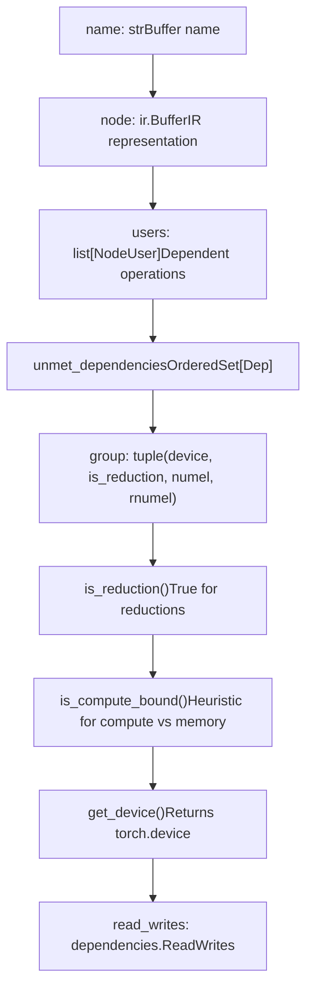
**Sources:** [torch/\_inductor/scheduler.py500-700](https://github.com/pytorch/pytorch/blob/915982a4/torch/_inductor/scheduler.py#L500-L700)

### FusedSchedulerNode

When nodes are fused, they are wrapped in a `FusedSchedulerNode` that manages the combined operation:

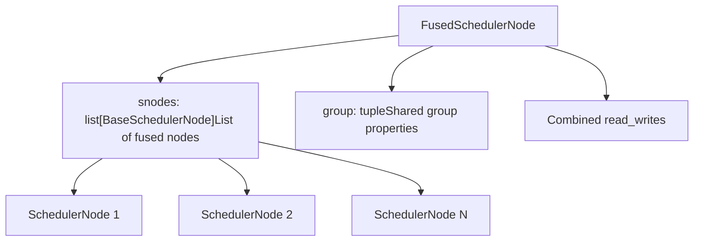
**Sources:** [torch/\_inductor/scheduler.py800-900](https://github.com/pytorch/pytorch/blob/915982a4/torch/_inductor/scheduler.py#L800-L900)

## Dependency Analysis

The scheduler performs dependency analysis to determine valid fusion opportunities and execution order. Dependencies are represented by the `Dep` class hierarchy.

### Dependency Types

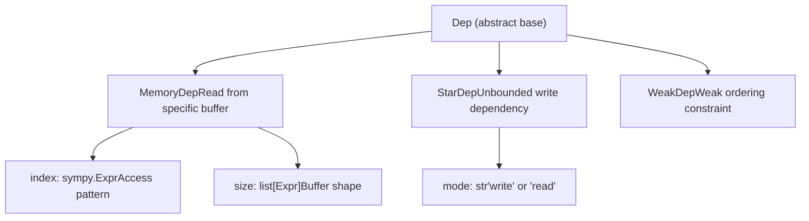
### Dependency Computation

The `compute_dependencies()` method analyzes each node to determine:

1.  Which buffers it reads from (`reads` dependencies)
2.  Which buffers it writes to (`writes`)
3.  Whether it has unbounded dependencies (`StarDep`)

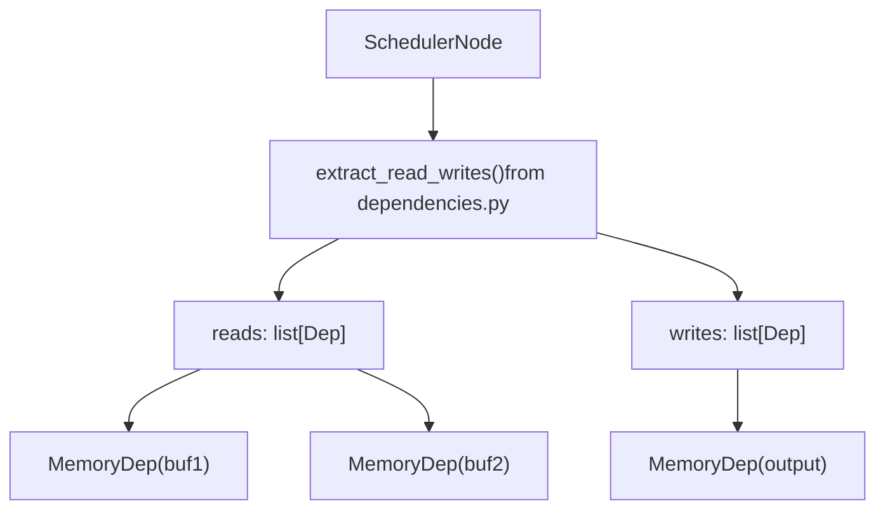
**Sources:** [torch/\_inductor/scheduler.py1400-1600](https://github.com/pytorch/pytorch/blob/915982a4/torch/_inductor/scheduler.py#L1400-L1600) [torch/\_inductor/dependencies.py1-200](https://github.com/pytorch/pytorch/blob/915982a4/torch/_inductor/dependencies.py#L1-L200)

## Fusion Strategy

The scheduler attempts to fuse operations to reduce memory traffic and kernel launch overhead. Fusion decisions are based on compatibility checks, performance heuristics, and memory constraints.

### Fusion Decision Flow

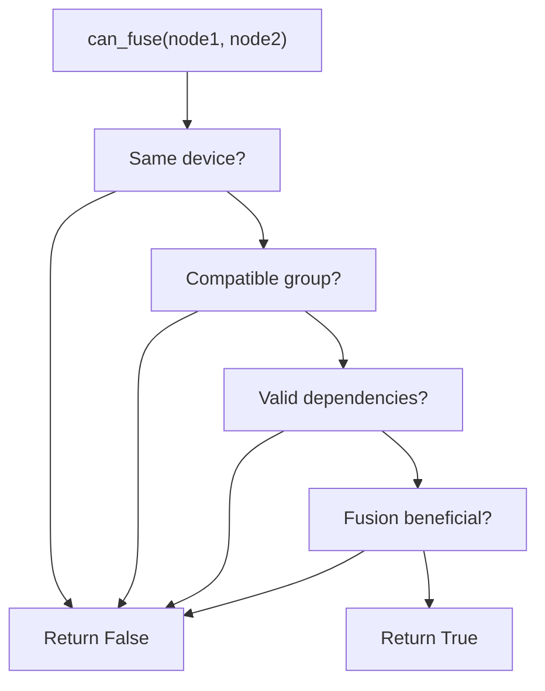
### Fusion Compatibility Checks

The `can_fuse()` method performs several checks:

| Check | Implementation | Purpose |
| --- | --- | --- |
| Device compatibility | `node1.get_device() == node2.get_device()` | Only fuse operations on same device |
| Group compatibility | `node1.group == node2.group` | Match reduction dimensions and sizes |
| Dependency validity | Check for circular dependencies | Ensure execution order is valid |
| Template compatibility | `node.is_template()` checks | Handle template-based operations specially |
| Memory constraints | Check buffer sizes and lifetimes | Avoid excessive memory usage |

**Sources:** [torch/\_inductor/scheduler.py2000-2300](https://github.com/pytorch/pytorch/blob/915982a4/torch/_inductor/scheduler.py#L2000-L2300)

## Fusion Types

TorchInductor supports several types of fusion, each optimizing different operation patterns.

### Pointwise Fusion

Fuses element-wise operations that operate on the same shape:

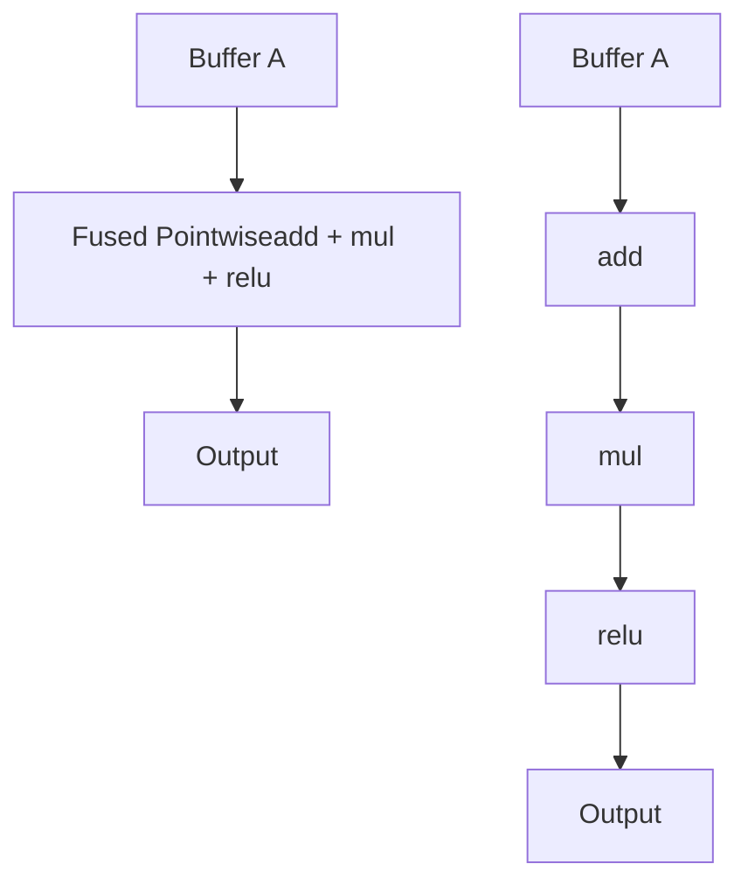
**Implementation:** [torch/\_inductor/scheduler.py2100-2200](https://github.com/pytorch/pytorch/blob/915982a4/torch/_inductor/scheduler.py#L2100-L2200)

### Reduction Fusion

Fuses operations with the same reduction dimensions:

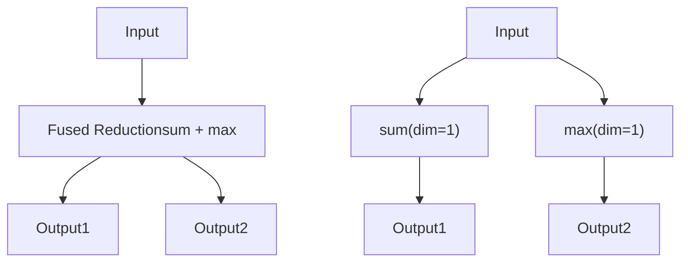
**Implementation:** [torch/\_inductor/scheduler.py2200-2400](https://github.com/pytorch/pytorch/blob/915982a4/torch/_inductor/scheduler.py#L2200-L2400)

### Epilogue and Prologue Fusion

Fuses pointwise operations into template kernels (e.g., GEMM) to avoid materialization of intermediate results.

**Epilogue Fusion:** Fuses operations after a template kernel

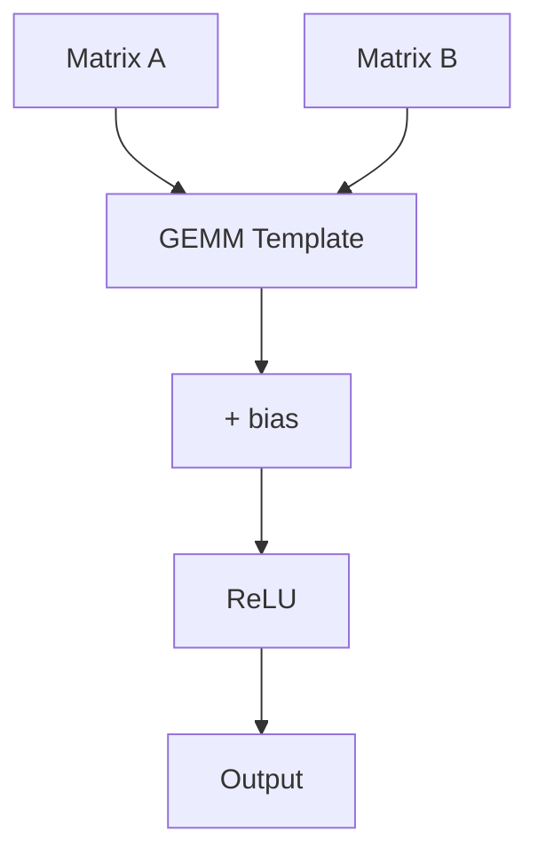
**Prologue Fusion:** Fuses operations before a template kernel

**Sources:** [torch/\_inductor/codegen/triton.py2500-2700](https://github.com/pytorch/pytorch/blob/915982a4/torch/_inductor/codegen/triton.py#L2500-L2700) [torch/\_inductor/config.py263-267](https://github.com/pytorch/pytorch/blob/915982a4/torch/_inductor/config.py#L263-L267)

### Mix Order Reduction

Special fusion for reductions with different loop orders but shared inputs. The `MixOrderReduction` class handles this complex case.

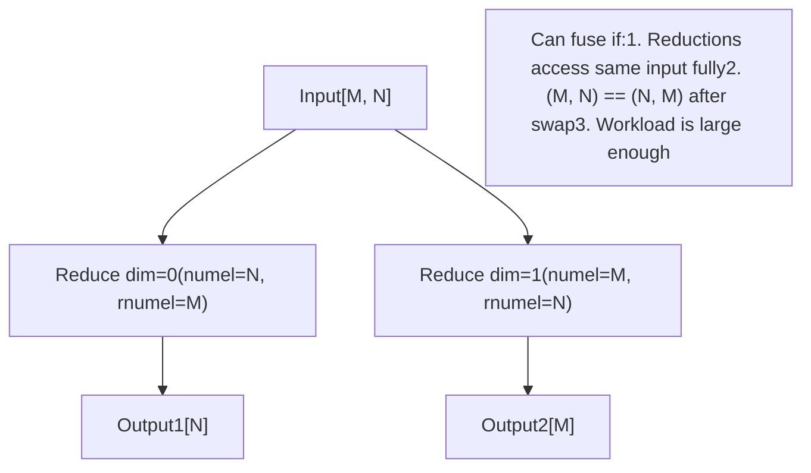
**Implementation:** [torch/\_inductor/scheduler.py137-267](https://github.com/pytorch/pytorch/blob/915982a4/torch/_inductor/scheduler.py#L137-L267)

**Key conditions for mix order reduction fusion:**

-   Reductions must access a common buffer with full access (not broadcast)
-   Loop orders must be reversed: `(numel1, rnumel1) == (rnumel2, numel2)`
-   Workload must be large enough to benefit from fusion
-   Only supported on GPU with Triton backend

**Sources:** [torch/\_inductor/scheduler.py137-350](https://github.com/pytorch/pytorch/blob/915982a4/torch/_inductor/scheduler.py#L137-L350)

### Horizontal Fusion

Fuses independent operations with the same group signature (device, shape, reduction dims) even if they don't share inputs.

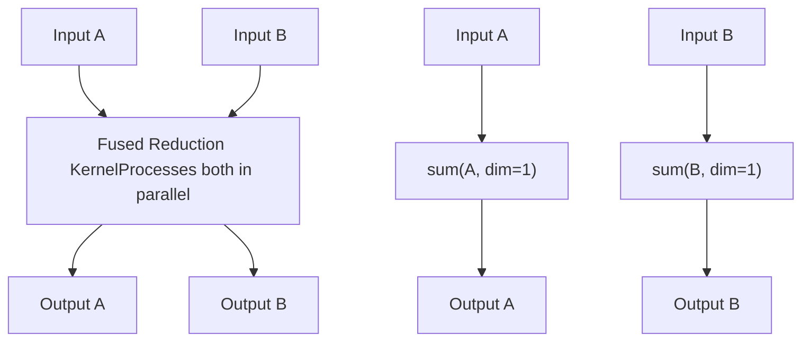
**Sources:** [torch/\_inductor/scheduler.py2400-2600](https://github.com/pytorch/pytorch/blob/915982a4/torch/_inductor/scheduler.py#L2400-L2600)

## Scheduling Algorithm

The main scheduling loop in `Scheduler.run()` processes nodes in order, attempting fusion where possible.

### Main Scheduling Loop

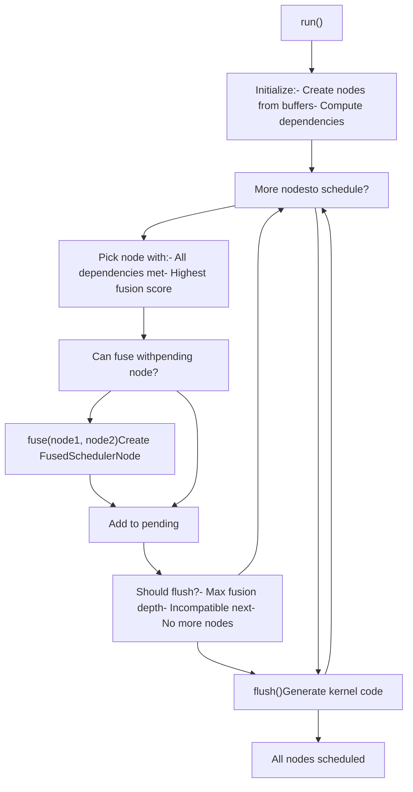
**Sources:** [torch/\_inductor/scheduler.py1200-1400](https://github.com/pytorch/pytorch/blob/915982a4/torch/_inductor/scheduler.py#L1200-L1400)

### Node Scoring

The `score_fusion()` method computes a score for each node to prioritize fusion decisions:

```
# Key scoring factors from scheduler.pyscore = (    node.is_reduction(),           # Prioritize reductions    node.is_template(),            # Then templates      len(node.users),               # More users = higher priority    node.get_name() in fused_buffer_names,  # Already fused    -num_shared_inputs,            # More shared inputs = higher score)
```
**Sources:** [torch/\_inductor/scheduler.py2600-2800](https://github.com/pytorch/pytorch/blob/915982a4/torch/_inductor/scheduler.py#L2600-L2800)

## Code Generation After Scheduling

Once scheduling completes, the `codegen()` method generates kernel code through backend-specific schedulers:

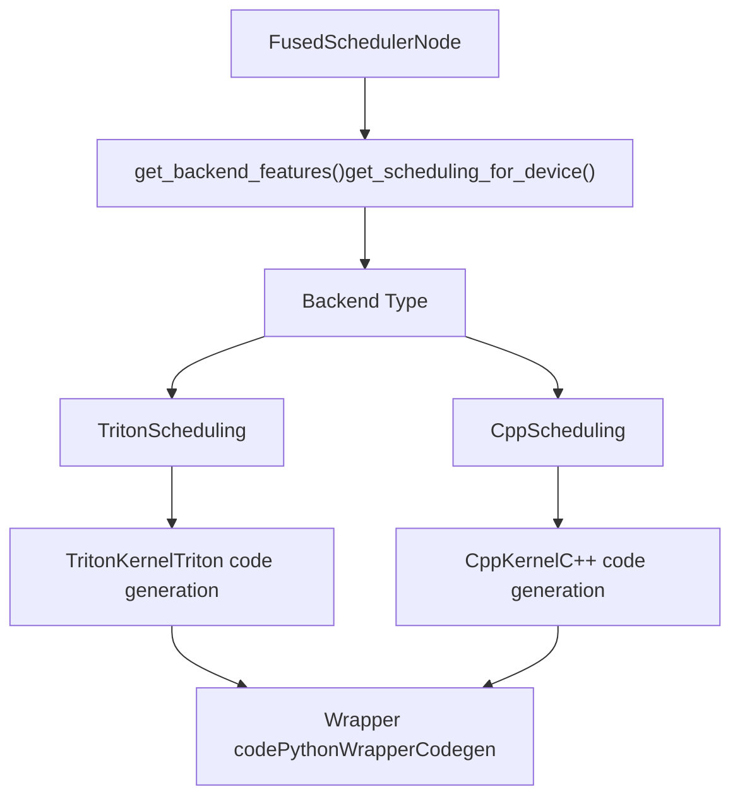
**Sources:** [torch/\_inductor/scheduler.py3000-3200](https://github.com/pytorch/pytorch/blob/915982a4/torch/_inductor/scheduler.py#L3000-L3200) [torch/\_inductor/codegen/triton.py100-300](https://github.com/pytorch/pytorch/blob/915982a4/torch/_inductor/codegen/triton.py#L100-L300) [torch/\_inductor/codegen/simd.py100-300](https://github.com/pytorch/pytorch/blob/915982a4/torch/_inductor/codegen/simd.py#L100-L300)

### Backend Scheduling Classes

| Class | File | Device | Purpose |
| --- | --- | --- | --- |
| `TritonScheduling` | codegen/triton.py | CUDA, HIP, XPU | Generates Triton GPU kernels |
| `CppScheduling` | codegen/simd.py | CPU | Generates vectorized C++ kernels |

Each scheduling class implements:

-   `can_fuse_vertical()` - Check if vertical fusion is possible
-   `can_fuse_horizontal()` - Check if horizontal fusion is possible
-   `group_fn()` - Compute node grouping key
-   `codegen()` - Generate kernel code for fused node

**Sources:** [torch/\_inductor/codegen/triton.py3000-3500](https://github.com/pytorch/pytorch/blob/915982a4/torch/_inductor/codegen/triton.py#L3000-L3500) [torch/\_inductor/codegen/simd.py2000-2500](https://github.com/pytorch/pytorch/blob/915982a4/torch/_inductor/codegen/simd.py#L2000-L2500)

## Configuration Options

The scheduler behavior is controlled by several configuration options:

| Config | Default | Purpose |
| --- | --- | --- |
| `aggressive_fusion` | False | Fuse even without common reads |
| `epilogue_fusion` | True | Enable epilogue fusion into templates |
| `prologue_fusion` | True | Enable prologue fusion into templates |
| `triton.mix_order_reduction` | True | Enable mix order reduction fusion |
| `realize_reads_threshold` | 4 | Max reads before forcing materialization |
| `realize_opcount_threshold` | 30 | Max ops before forcing materialization |

**Sources:** [torch/\_inductor/config.py236-790](https://github.com/pytorch/pytorch/blob/915982a4/torch/_inductor/config.py#L236-L790)

### Debug and Logging

The scheduler emits detailed logs through PyTorch's logging infrastructure:

```
# Key loggers in scheduler.pyschedule_log = torch._logging.getArtifactLogger(__name__, "schedule")fusion_log = torch._logging.getArtifactLogger(__name__, "fusion") # Enable with:# TORCH_LOGS="schedule,fusion" python script.py
```
**Sources:** [torch/\_inductor/scheduler.py90-98](https://github.com/pytorch/pytorch/blob/915982a4/torch/_inductor/scheduler.py#L90-L98)

## Performance Considerations

The scheduler makes several trade-offs to optimize performance:

### Memory vs Compute

**Rematerialization:** The scheduler may choose to recompute values instead of storing them if:

-   The computation is cheap (controlled by `realize_opcount_threshold`)
-   The value is read only a few times (controlled by `realize_reads_threshold`)
-   Memory pressure is high

**Fusion Depth:** Fusing too many operations can lead to:

-   Register pressure on GPU
-   Longer compilation times
-   Worse cache behavior

The scheduler limits fusion depth and flushes periodically.

### Loop Ordering

For operations with multiple loop dimensions, the scheduler chooses ordering based on:

1.  Memory access patterns (coalescing)
2.  Reduction dimensions
3.  Tile sizes

**Sources:** [torch/\_inductor/scheduler.py2800-3000](https://github.com/pytorch/pytorch/blob/915982a4/torch/_inductor/scheduler.py#L2800-L3000) [torch/\_inductor/codegen/triton.py1000-1200](https://github.com/pytorch/pytorch/blob/915982a4/torch/_inductor/codegen/triton.py#L1000-L1200)
