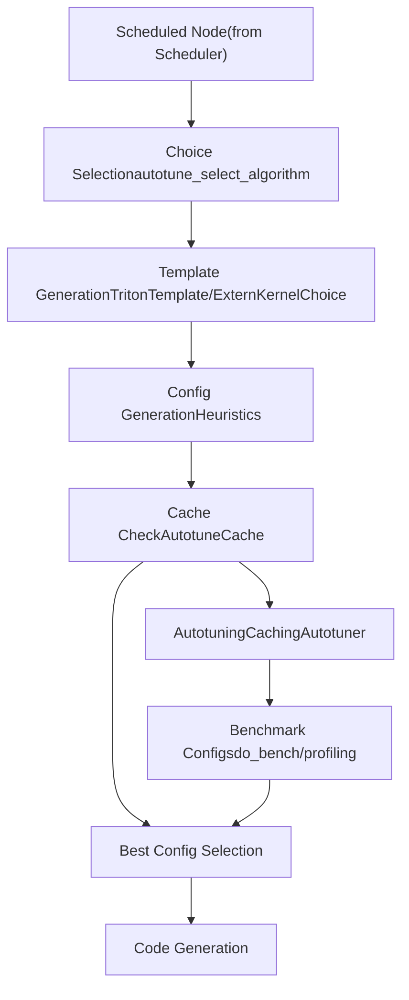
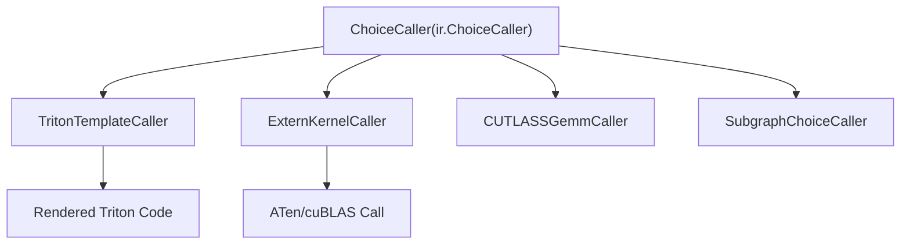
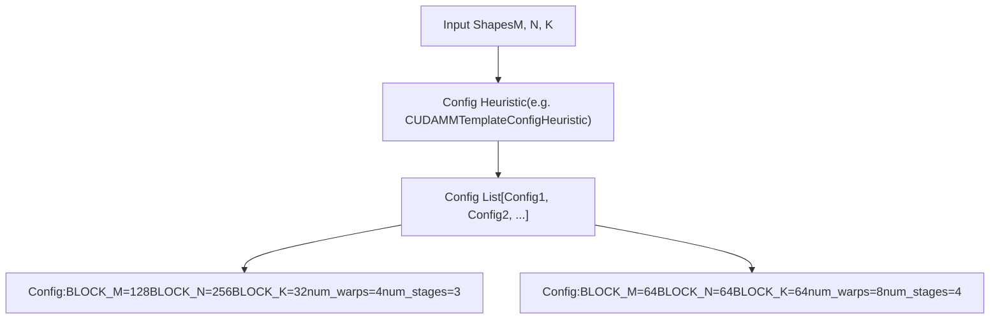
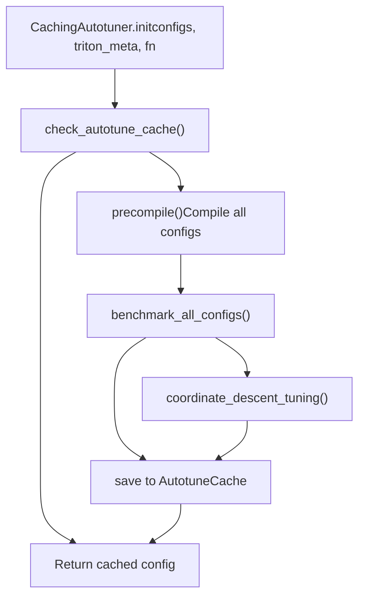
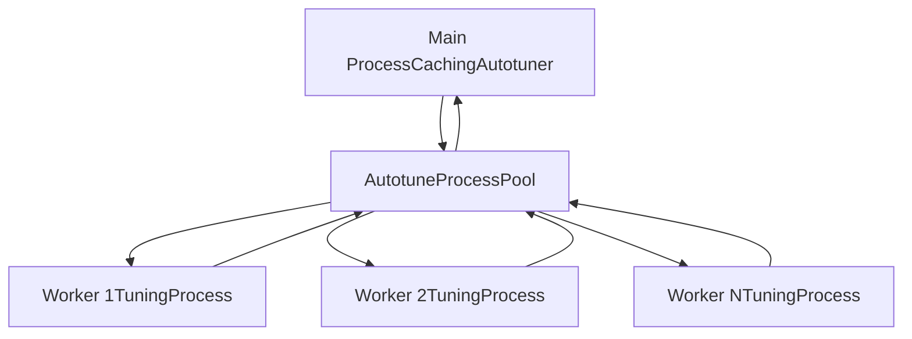
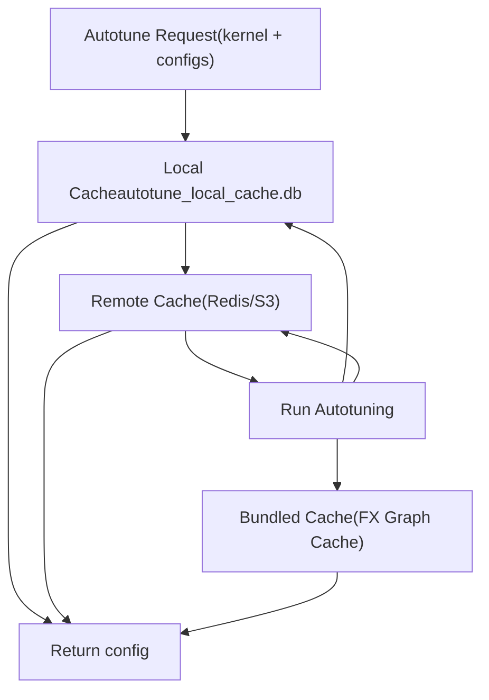
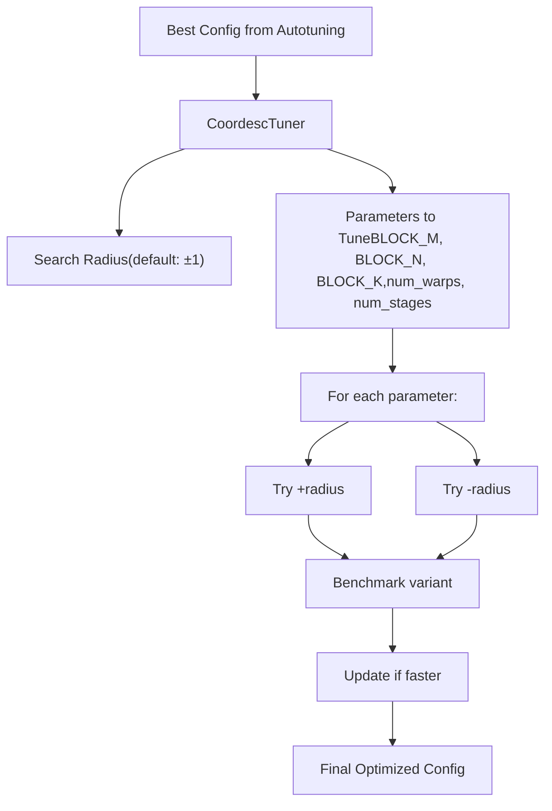
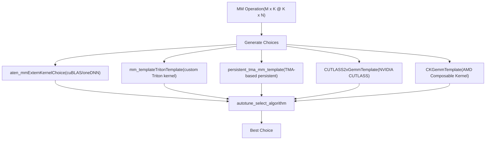

# Kernel Selection and Autotuning

Relevant source files

-   [aten/src/ATen/native/cuda/int8mm.cu](https://github.com/pytorch/pytorch/blob/915982a4/aten/src/ATen/native/cuda/int8mm.cu)
-   [test/higher\_order\_ops/test\_local\_map.py](https://github.com/pytorch/pytorch/blob/915982a4/test/higher_order_ops/test_local_map.py)
-   [test/inductor/test\_aot\_inductor.py](https://github.com/pytorch/pytorch/blob/915982a4/test/inductor/test_aot_inductor.py)
-   [test/inductor/test\_combo\_kernels.py](https://github.com/pytorch/pytorch/blob/915982a4/test/inductor/test_combo_kernels.py)
-   [test/inductor/test\_cpu\_cpp\_wrapper.py](https://github.com/pytorch/pytorch/blob/915982a4/test/inductor/test_cpu_cpp_wrapper.py)
-   [test/inductor/test\_cpu\_select\_algorithm.py](https://github.com/pytorch/pytorch/blob/915982a4/test/inductor/test_cpu_select_algorithm.py)
-   [test/inductor/test\_custom\_lowering.py](https://github.com/pytorch/pytorch/blob/915982a4/test/inductor/test_custom_lowering.py)
-   [test/inductor/test\_custom\_op\_autotune.py](https://github.com/pytorch/pytorch/blob/915982a4/test/inductor/test_custom_op_autotune.py)
-   [test/inductor/test\_distributed\_patterns.py](https://github.com/pytorch/pytorch/blob/915982a4/test/inductor/test_distributed_patterns.py)
-   [test/inductor/test\_foreach.py](https://github.com/pytorch/pytorch/blob/915982a4/test/inductor/test_foreach.py)
-   [test/inductor/test\_gpu\_cpp\_wrapper.py](https://github.com/pytorch/pytorch/blob/915982a4/test/inductor/test_gpu_cpp_wrapper.py)
-   [test/inductor/test\_gpu\_select\_algorithm.py](https://github.com/pytorch/pytorch/blob/915982a4/test/inductor/test_gpu_select_algorithm.py)
-   [test/inductor/test\_max\_autotune.py](https://github.com/pytorch/pytorch/blob/915982a4/test/inductor/test_max_autotune.py)
-   [test/inductor/test\_mem\_estimation.py](https://github.com/pytorch/pytorch/blob/915982a4/test/inductor/test_mem_estimation.py)
-   [test/inductor/test\_minifier.py](https://github.com/pytorch/pytorch/blob/915982a4/test/inductor/test_minifier.py)
-   [test/inductor/test\_mkldnn\_pattern\_matcher.py](https://github.com/pytorch/pytorch/blob/915982a4/test/inductor/test_mkldnn_pattern_matcher.py)
-   [test/inductor/test\_mmdecomp.py](https://github.com/pytorch/pytorch/blob/915982a4/test/inductor/test_mmdecomp.py)
-   [test/inductor/test\_move\_constructors\_to\_gpu.py](https://github.com/pytorch/pytorch/blob/915982a4/test/inductor/test_move_constructors_to_gpu.py)
-   [test/inductor/test\_select\_algorithm.py](https://github.com/pytorch/pytorch/blob/915982a4/test/inductor/test_select_algorithm.py)
-   [test/inductor/test\_torchinductor.py](https://github.com/pytorch/pytorch/blob/915982a4/test/inductor/test_torchinductor.py)
-   [test/inductor/test\_torchinductor\_codegen\_dynamic\_shapes.py](https://github.com/pytorch/pytorch/blob/915982a4/test/inductor/test_torchinductor_codegen_dynamic_shapes.py)
-   [test/inductor/test\_torchinductor\_opinfo.py](https://github.com/pytorch/pytorch/blob/915982a4/test/inductor/test_torchinductor_opinfo.py)
-   [test/inductor/test\_torchinductor\_strided\_blocks.py](https://github.com/pytorch/pytorch/blob/915982a4/test/inductor/test_torchinductor_strided_blocks.py)
-   [test/inductor/test\_triton\_kernels.py](https://github.com/pytorch/pytorch/blob/915982a4/test/inductor/test_triton_kernels.py)
-   [test/test\_nestedtensor.py](https://github.com/pytorch/pytorch/blob/915982a4/test/test_nestedtensor.py)
-   [torch/\_higher\_order\_ops/local\_map.py](https://github.com/pytorch/pytorch/blob/915982a4/torch/_higher_order_ops/local_map.py)
-   [torch/\_higher\_order\_ops/triton\_kernel\_wrap.py](https://github.com/pytorch/pytorch/blob/915982a4/torch/_higher_order_ops/triton_kernel_wrap.py)
-   [torch/\_inductor/autotune\_process.py](https://github.com/pytorch/pytorch/blob/915982a4/torch/_inductor/autotune_process.py)
-   [torch/\_inductor/choices.py](https://github.com/pytorch/pytorch/blob/915982a4/torch/_inductor/choices.py)
-   [torch/\_inductor/codegen/common.py](https://github.com/pytorch/pytorch/blob/915982a4/torch/_inductor/codegen/common.py)
-   [torch/\_inductor/codegen/cpp\_wrapper\_cpu.py](https://github.com/pytorch/pytorch/blob/915982a4/torch/_inductor/codegen/cpp_wrapper_cpu.py)
-   [torch/\_inductor/codegen/cpp\_wrapper\_cpu\_array\_ref.py](https://github.com/pytorch/pytorch/blob/915982a4/torch/_inductor/codegen/cpp_wrapper_cpu_array_ref.py)
-   [torch/\_inductor/codegen/simd.py](https://github.com/pytorch/pytorch/blob/915982a4/torch/_inductor/codegen/simd.py)
-   [torch/\_inductor/codegen/subgraph.py](https://github.com/pytorch/pytorch/blob/915982a4/torch/_inductor/codegen/subgraph.py)
-   [torch/\_inductor/codegen/triton.py](https://github.com/pytorch/pytorch/blob/915982a4/torch/_inductor/codegen/triton.py)
-   [torch/\_inductor/codegen/triton\_combo\_kernel.py](https://github.com/pytorch/pytorch/blob/915982a4/torch/_inductor/codegen/triton_combo_kernel.py)
-   [torch/\_inductor/codegen/wrapper.py](https://github.com/pytorch/pytorch/blob/915982a4/torch/_inductor/codegen/wrapper.py)
-   [torch/\_inductor/config.py](https://github.com/pytorch/pytorch/blob/915982a4/torch/_inductor/config.py)
-   [torch/\_inductor/decomposition.py](https://github.com/pytorch/pytorch/blob/915982a4/torch/_inductor/decomposition.py)
-   [torch/\_inductor/dtype\_propagation.py](https://github.com/pytorch/pytorch/blob/915982a4/torch/_inductor/dtype_propagation.py)
-   [torch/\_inductor/fx\_passes/mkldnn\_fusion.py](https://github.com/pytorch/pytorch/blob/915982a4/torch/_inductor/fx_passes/mkldnn_fusion.py)
-   [torch/\_inductor/fx\_passes/quantization.py](https://github.com/pytorch/pytorch/blob/915982a4/torch/_inductor/fx_passes/quantization.py)
-   [torch/\_inductor/graph.py](https://github.com/pytorch/pytorch/blob/915982a4/torch/_inductor/graph.py)
-   [torch/\_inductor/ir.py](https://github.com/pytorch/pytorch/blob/915982a4/torch/_inductor/ir.py)
-   [torch/\_inductor/jagged\_lowerings.py](https://github.com/pytorch/pytorch/blob/915982a4/torch/_inductor/jagged_lowerings.py)
-   [torch/\_inductor/kernel/bmm.py](https://github.com/pytorch/pytorch/blob/915982a4/torch/_inductor/kernel/bmm.py)
-   [torch/\_inductor/kernel/conv.py](https://github.com/pytorch/pytorch/blob/915982a4/torch/_inductor/kernel/conv.py)
-   [torch/\_inductor/kernel/custom\_op.py](https://github.com/pytorch/pytorch/blob/915982a4/torch/_inductor/kernel/custom_op.py)
-   [torch/\_inductor/kernel/mm.py](https://github.com/pytorch/pytorch/blob/915982a4/torch/_inductor/kernel/mm.py)
-   [torch/\_inductor/kernel/mm\_plus\_mm.py](https://github.com/pytorch/pytorch/blob/915982a4/torch/_inductor/kernel/mm_plus_mm.py)
-   [torch/\_inductor/kernel\_inputs.py](https://github.com/pytorch/pytorch/blob/915982a4/torch/_inductor/kernel_inputs.py)
-   [torch/\_inductor/lowering.py](https://github.com/pytorch/pytorch/blob/915982a4/torch/_inductor/lowering.py)
-   [torch/\_inductor/memory.py](https://github.com/pytorch/pytorch/blob/915982a4/torch/_inductor/memory.py)
-   [torch/\_inductor/mkldnn\_ir.py](https://github.com/pytorch/pytorch/blob/915982a4/torch/_inductor/mkldnn_ir.py)
-   [torch/\_inductor/mkldnn\_lowerings.py](https://github.com/pytorch/pytorch/blob/915982a4/torch/_inductor/mkldnn_lowerings.py)
-   [torch/\_inductor/ops\_handler.py](https://github.com/pytorch/pytorch/blob/915982a4/torch/_inductor/ops_handler.py)
-   [torch/\_inductor/runtime/triton\_heuristics.py](https://github.com/pytorch/pytorch/blob/915982a4/torch/_inductor/runtime/triton_heuristics.py)
-   [torch/\_inductor/scheduler.py](https://github.com/pytorch/pytorch/blob/915982a4/torch/_inductor/scheduler.py)
-   [torch/\_inductor/select\_algorithm.py](https://github.com/pytorch/pytorch/blob/915982a4/torch/_inductor/select_algorithm.py)
-   [torch/\_inductor/shape\_propagation.py](https://github.com/pytorch/pytorch/blob/915982a4/torch/_inductor/shape_propagation.py)
-   [torch/\_inductor/subgraph\_lowering.py](https://github.com/pytorch/pytorch/blob/915982a4/torch/_inductor/subgraph_lowering.py)
-   [torch/\_inductor/template\_heuristics/triton.py](https://github.com/pytorch/pytorch/blob/915982a4/torch/_inductor/template_heuristics/triton.py)
-   [torch/\_inductor/utils.py](https://github.com/pytorch/pytorch/blob/915982a4/torch/_inductor/utils.py)
-   [torch/\_inductor/virtualized.py](https://github.com/pytorch/pytorch/blob/915982a4/torch/_inductor/virtualized.py)
-   [torch/csrc/inductor/cpp\_wrapper/common.h](https://github.com/pytorch/pytorch/blob/915982a4/torch/csrc/inductor/cpp_wrapper/common.h)
-   [torch/nested/\_internal/nested\_tensor.py](https://github.com/pytorch/pytorch/blob/915982a4/torch/nested/_internal/nested_tensor.py)
-   [torch/nested/\_internal/ops.py](https://github.com/pytorch/pytorch/blob/915982a4/torch/nested/_internal/ops.py)

## Purpose and Scope

This page describes how TorchInductor selects and optimizes kernels for operations during compilation. When Inductor lowers operations from the IR (see [2.5.1](/pytorch/pytorch/2.5.1-inductor-ir-and-lowering)) and performs scheduling/fusion (see [2.5.2](/pytorch/pytorch/2.5.2-scheduling-and-fusion)), it must choose which implementation (kernel) to use for each fused operation. This document covers:

-   The template-based kernel choice system
-   Configuration space generation and pruning
-   Autotuning methodology (benchmarking multiple candidates)
-   Caching mechanisms for reusing autotuning results
-   Coordinate descent tuning for further optimization

For the actual code generation of selected kernels, see [2.5.4](/pytorch/pytorch/2.5.4-code-generation:-triton-cutlass-pallas-c++).

## Overview: From Scheduled Nodes to Optimized Kernels

The kernel selection and autotuning process bridges the gap between scheduled computation graphs and optimized executable kernels. For operations like matrix multiplication, convolution, or fused pointwise operations, Inductor generates multiple candidate implementations with different configurations, benchmarks them, and selects the fastest.


**Diagram: Kernel Selection and Autotuning Flow**

Sources: [torch/\_inductor/select\_algorithm.py1-100](https://github.com/pytorch/pytorch/blob/915982a4/torch/_inductor/select_algorithm.py#L1-L100) [torch/\_inductor/runtime/triton\_heuristics.py313-430](https://github.com/pytorch/pytorch/blob/915982a4/torch/_inductor/runtime/triton_heuristics.py#L313-L430)

## Template System and ChoiceCaller

### Template Types

Inductor uses multiple template types for different backends and operations:

| Template Type | Description | Primary Use |
| --- | --- | --- |
| `TritonTemplate` | Triton GPU kernels using Jinja2 templates | Matrix ops, reductions, pointwise |
| `ExternKernelChoice` | ATen/cuBLAS/cuDNN extern calls | Fallback for proven stable ops |
| `CUTLASSTemplate` | NVIDIA CUTLASS library templates | GEMM operations on CUDA |
| `CKGemmTemplate` | AMD Composable Kernel templates | GEMM operations on ROCm |
| `CppGemmTemplate` | C++ CPU templates | CPU matrix operations |
| `SubgraphTemplate` | Templates for subgraphs with HOPs | Control flow operations |

Sources: [torch/\_inductor/select\_algorithm.py100-200](https://github.com/pytorch/pytorch/blob/915982a4/torch/_inductor/select_algorithm.py#L100-L200) [torch/\_inductor/kernel/mm.py84-156](https://github.com/pytorch/pytorch/blob/915982a4/torch/_inductor/kernel/mm.py#L84-L156)

### ChoiceCaller Hierarchy


**Diagram: ChoiceCaller Class Hierarchy**

The `ChoiceCaller` abstract base class defines the interface for kernel choices. Key methods:

-   `benchmark(*args, out)` - Benchmark this choice
-   `output_node()` - Generate IR node for this choice
-   `get_estimated_runtime()` - Optional heuristic-based estimate

Sources: [torch/\_inductor/ir.py5000-5100](https://github.com/pytorch/pytorch/blob/915982a4/torch/_inductor/ir.py#L5000-L5100) [torch/\_inductor/select\_algorithm.py500-700](https://github.com/pytorch/pytorch/blob/915982a4/torch/_inductor/select_algorithm.py#L500-L700)

## Configuration Generation and Heuristics

### Configuration Space

For Triton templates, configurations specify block sizes, number of warps, pipeline stages, and other tuning parameters:


**Diagram: Configuration Generation Process**

Sources: [torch/\_inductor/template\_heuristics/triton.py1-100](https://github.com/pytorch/pytorch/blob/915982a4/torch/_inductor/template_heuristics/triton.py#L1-L100)

### Heuristic Classes

Template-specific heuristics generate candidate configurations based on problem size and hardware:

```
# Example: CUDAMMTemplateConfigHeuristicclass CUDAMMTemplateConfigHeuristic(BaseConfigHeuristic):    def mm_configs(        self,        m: int,        n: int,         k: int,        layout: MatmulLayout,        input_dtypes: tuple[torch.dtype, torch.dtype],    ) -> list[GemmConfig]:        # Returns configs like:        # GemmConfig(BLOCK_M=128, BLOCK_N=256, BLOCK_K=32,         #            num_warps=4, num_stages=3, group_m=8)
```
Key heuristic classes:

-   `CUDAMMTemplateConfigHeuristic` - CUDA matrix multiplication configs
-   `CUDAPersistentTMATemplateConfigHeuristic` - TMA-based persistent kernels
-   `ROCmConfigHeuristic` - AMD ROCm-specific configs
-   `XPUConfigHeuristic` - Intel XPU configs
-   `CPUConfigHeuristic` - CPU vectorization configs

Sources: [torch/\_inductor/template\_heuristics/triton.py200-500](https://github.com/pytorch/pytorch/blob/915982a4/torch/_inductor/template_heuristics/triton.py#L200-L500)

### Configuration Pruning

Not all configs are benchmarked. Pruning strategies include:

1.  **Shared memory limits**: Prune configs exceeding hardware limits
    -   [torch/\_inductor/template\_heuristics/triton.py600-650](https://github.com/pytorch/pytorch/blob/915982a4/torch/_inductor/template_heuristics/triton.py#L600-L650)
2.  **Divisibility checks**: Ensure block sizes are compatible with problem dimensions
3.  **Heuristic scoring**: Prioritize likely-fast configs based on past experience
4.  **Max autotune limit**: Cap total configs based on `max_autotune_gemm_search_space`

Sources: [torch/\_inductor/config.py605-620](https://github.com/pytorch/pytorch/blob/915982a4/torch/_inductor/config.py#L605-L620) [torch/\_inductor/template\_heuristics/triton.py600-700](https://github.com/pytorch/pytorch/blob/915982a4/torch/_inductor/template_heuristics/triton.py#L600-L700)

## Autotuning Process

### CachingAutotuner

The `CachingAutotuner` class orchestrates the autotuning process:


**Diagram: CachingAutotuner Workflow**

Sources: [torch/\_inductor/runtime/triton\_heuristics.py313-430](https://github.com/pytorch/pytorch/blob/915982a4/torch/_inductor/runtime/triton_heuristics.py#L313-L430)

### Benchmarking Methods

Inductor supports multiple benchmarking approaches:

**1\. Standard do\_bench (Triton default)**

```
# Uses Triton's do_bench with CUDA eventsdef benchmark(self, *args, out):    return do_bench(lambda: self.fn.run(*args, **kwargs))
```
**2\. Profiling-based benchmarking**

```
# Uses torch.profiler for more accurate timingdef do_bench_using_profiling(fn, warmup=25, rep=100):    # Filters profiler events, excludes overhead    # More accurate but slower
```
Controlled by `config.use_experimental_benchmarker`.

Sources: [torch/\_inductor/utils.py280-400](https://github.com/pytorch/pytorch/blob/915982a4/torch/_inductor/utils.py#L280-L400) [torch/\_inductor/runtime/benchmarking.py1-200](https://github.com/pytorch/pytorch/blob/915982a4/torch/_inductor/runtime/benchmarking.py#L1-L200)

### Multi-Process Autotuning

For large configuration spaces, Inductor can distribute autotuning across processes:


**Diagram: Multi-Process Autotuning Architecture**

Key classes:

-   `AutotuneProcessPool` - Manages worker processes
-   `TuningProcess` - Worker process that benchmarks configs
-   `TritonBenchmarkRequest` / `ExternKernelBenchmarkRequest` - Work items
-   `BenchmarkResult` - Timing and error information

Sources: [torch/\_inductor/autotune\_process.py1-300](https://github.com/pytorch/pytorch/blob/915982a4/torch/_inductor/autotune_process.py#L1-L300)

Configuration:

-   `config.autotune_in_subproc` - Enable multi-process mode
-   `config.autotune_multi_device` - Use separate GPU per process
-   `config.max_autotune_subproc_result_timeout_seconds` - Timeout per benchmark

Sources: [torch/\_inductor/config.py662-676](https://github.com/pytorch/pytorch/blob/915982a4/torch/_inductor/config.py#L662-L676)

## Cache Management

### Cache Hierarchy

Inductor maintains multiple cache levels for autotuning results:


**Diagram: Autotune Cache Hierarchy**

Sources: [torch/\_inductor/runtime/autotune\_cache.py1-200](https://github.com/pytorch/pytorch/blob/915982a4/torch/_inductor/runtime/autotune_cache.py#L1-L200)

### AutotuneCache Implementation

The `AutotuneCache` class manages persistence:

**Cache key generation:**

```
# Combines source code hash, config hashes, and inductor metadatadef cache_key(self, inductor_meta: dict) -> str:    hasher = hashlib.sha256()    hasher.update(self.filename.encode())  # Source hash    hasher.update(self.configs_hash.encode())    hasher.update(json.dumps(inductor_meta, sort_keys=True).encode())    return hasher.hexdigest()
```
**Cache operations:**

-   `read_best(inductor_meta, configs)` - Retrieve cached best config
-   `save_best(config, inductor_meta, time_taken_ns)` - Persist result
-   `invalidate()` - Clear cache entry

Sources: [torch/\_inductor/runtime/autotune\_cache.py50-200](https://github.com/pytorch/pytorch/blob/915982a4/torch/_inductor/runtime/autotune_cache.py#L50-L200)

### Cache Configuration

| Config Option | Purpose | Default |
| --- | --- | --- |
| `autotune_local_cache` | Enable local disk cache | True |
| `autotune_remote_cache` | Enable remote cache | None (JK-based in fbcode) |
| `bundled_autotune_remote_cache` | Bundle with FX graph cache | None |
| `fx_graph_cache` | Enable FX graph-level caching | True |
| `force_disable_caches` | Disable all caching | False |

Sources: [torch/\_inductor/config.py104-161](https://github.com/pytorch/pytorch/blob/915982a4/torch/_inductor/config.py#L104-L161)

## Coordinate Descent Tuning

After initial autotuning selects the best config from the candidate set, coordinate descent tuning can further optimize by exploring the parameter space around the winner.

### Algorithm Overview


**Diagram: Coordinate Descent Tuning Process**

Sources: [torch/\_inductor/runtime/coordinate\_descent\_tuner.py1-300](https://github.com/pytorch/pytorch/blob/915982a4/torch/_inductor/runtime/coordinate_descent_tuner.py#L1-L300)

### CoordescTuner Class

The `CoordescTuner` implements coordinate descent optimization:

**Key methods:**

-   `autotune(baseline_config, *args, **kwargs)` - Run coordinate descent
-   `_get_neighbour_configs(cfg)` - Generate neighbor configs
-   `_benchmark_config(cfg, *args, **kwargs)` - Time a single config

**Tunable parameters:**

-   Block sizes: `BLOCK_M`, `BLOCK_N`, `BLOCK_K`
-   Thread/warp configuration: `num_warps`, `num_stages`
-   Matrix multiplication specific: `group_m`, `SPLIT_K`

Configuration:

-   `config.coordinate_descent_tuning` - Enable coordinate descent
-   `config.coordinate_descent_search_radius` - Search radius (default: 1)
-   `config.coordinate_descent_check_all_directions` - Exhaustive vs greedy

Sources: [torch/\_inductor/runtime/coordinate\_descent\_tuner.py50-300](https://github.com/pytorch/pytorch/blob/915982a4/torch/_inductor/runtime/coordinate_descent_tuner.py#L50-L300) [torch/\_inductor/config.py688-696](https://github.com/pytorch/pytorch/blob/915982a4/torch/_inductor/config.py#L688-L696)

### Integration with Autotuning

Coordinate descent runs after initial autotuning:

```
# In CachingAutotuner.benchmark_all_configs()if self.inductor_meta.get("coordinate_descent_tuning"):    best_config = self.coordesc_tuner.autotune(        best_config,         example_inputs,        out=out    )
```
The result is saved to cache with `found_by_coordesc=True` flag, allowing it to be distinguished from heuristic-based configs.

Sources: [torch/\_inductor/runtime/triton\_heuristics.py600-700](https://github.com/pytorch/pytorch/blob/915982a4/torch/_inductor/runtime/triton_heuristics.py#L600-L700)

## Template-Specific Selection

### Matrix Multiplication (MM) Selection

For matrix multiplication operations, Inductor considers multiple choices:


**Diagram: MM Kernel Selection**

The selection logic is in `aten_mm_impl()`:

```
def aten_mm_impl(mat1, mat2):    choices = []        if use_aten_gemm_kernels():        choices.append(aten_mm.bind(mat1, mat2))        if use_triton_template():        mm_template.maybe_append_choice(            choices,            input_nodes=(mat1, mat2),            layout=layout,        )        if use_triton_tma_template():        persistent_tma_mm_template.maybe_append_choice(...)        if use_cutlass_template():        CUTLASSGemmTemplate.add_choices(...)            return autotune_select_algorithm(        "mm", choices, [mat1, mat2], layout    )
```
Sources: [torch/\_inductor/kernel/mm.py200-400](https://github.com/pytorch/pytorch/blob/915982a4/torch/_inductor/kernel/mm.py#L200-L400)

### Backend-Specific Conditions

The choice generation uses utility functions to check backend availability:

| Function | Checks | Purpose |
| --- | --- | --- |
| `use_aten_gemm_kernels()` | Config flag + device support | Include cuBLAS/oneDNN |
| `use_triton_template()` | Has Triton + config | Include standard Triton |
| `use_triton_tma_template()` | TMA device support | Include TMA persistent |
| `use_cutlass_template()` | CUDA + CUTLASS available | Include CUTLASS |
| `use_ck_gemm_template()` | ROCm + CK available | Include AMD CK |
| `use_cpp_gemm_template()` | CPU device | Include C++ kernels |

Sources: [torch/\_inductor/utils.py5000-5200](https://github.com/pytorch/pytorch/blob/915982a4/torch/_inductor/utils.py#L5000-L5200)

## Practical Example: MM Autotuning Flow

Let's trace a complete example of autotuning a matrix multiplication:

### 1\. Initial Selection

```
# In lowering.py@register_lowering(aten.mm)def mm_lowering(mat1, mat2):    return aten_mm_impl(mat1, mat2)
```
### 2\. Choice Generation

```
# In mm.py:aten_mm_implchoices = [] # Add extern (cuBLAS) choiceaten_mm.bind(mat1, mat2, out=layout)   # Add Triton template choice with configsfor config in CUDAMMTemplateConfigHeuristic().mm_configs(m, n, k):    # Config examples:    # {BLOCK_M: 128, BLOCK_N: 256, BLOCK_K: 32, num_warps: 4}    # {BLOCK_M: 64, BLOCK_N: 64, BLOCK_K: 64, num_warps: 8}    pass
```
### 3\. Cache Check

```
# In triton_heuristics.py:check_autotune_cacheautotune_cache = AutotuneCache.create(inductor_meta, filename, configs_hash)if best_config := autotune_cache.read_best(inductor_meta, configs):    configs = [best_config]  # Use cached result
```
### 4\. Precompilation

```
# Compile all candidate configs to Triton kernelsfor config in configs:    compiled = triton.compile(        fn=mm_kernel_src,        signature=signature,        device=device,        constants=constants,        configs=[config]    )
```
### 5\. Benchmarking

```
# Benchmark each compiled configfor launcher in launchers:    time_ms = do_bench(        lambda: launcher(grid, *args),        warmup=25,        rep=100    )
```
### 6\. Selection and Cache Save

```
# Select fastestbest_config = min(timings, key=lambda x: x[1]) # Save to cacheautotune_cache.save_best(best_config, inductor_meta, time_ns)
```
Sources: [torch/\_inductor/kernel/mm.py200-600](https://github.com/pytorch/pytorch/blob/915982a4/torch/_inductor/kernel/mm.py#L200-L600) [torch/\_inductor/runtime/triton\_heuristics.py400-700](https://github.com/pytorch/pytorch/blob/915982a4/torch/_inductor/runtime/triton_heuristics.py#L400-L700)

## Performance Considerations

### Autotune Overhead

Autotuning adds compilation overhead but provides runtime speedup:

**Mitigation strategies:**

1.  **Caching**: First run pays cost, subsequent runs are instant

2.  **Heuristic pruning**: Only benchmark promising configs

3.  **Max autotune flags**: Control compilation time vs performance

    -   `max_autotune=False`: Use heuristics only (fast compile)
    -   `max_autotune=True`: Full autotuning (slow compile, fast runtime)
    -   `max_autotune_gemm=True`: Autotune only GEMM operations
4.  **Parallel autotuning**: Distribute across CPU cores/GPUs

5.  **Remote cache**: Share results across machines


Sources: [torch/\_inductor/config.py480-515](https://github.com/pytorch/pytorch/blob/915982a4/torch/_inductor/config.py#L480-L515)

### Benchmarking Accuracy

Factors affecting benchmark accuracy:

-   **GPU state**: Warmup runs to reach steady-state clocks
-   **L2 cache**: Clear between runs to avoid unfair advantages
-   **CPU overhead**: Profiling-based benchmarking excludes host time
-   **Outliers**: Multiple repetitions with median/mean

The experimental benchmarker (`use_experimental_benchmarker`) provides more accurate results by using `torch.profiler` to filter device-only time.

Sources: [torch/\_inductor/utils.py281-400](https://github.com/pytorch/pytorch/blob/915982a4/torch/_inductor/utils.py#L281-L400) [torch/\_inductor/runtime/benchmarking.py1-300](https://github.com/pytorch/pytorch/blob/915982a4/torch/_inductor/runtime/benchmarking.py#L1-L300)

### Memory Considerations

Autotuning can consume significant memory:

-   Each config requires separate compiled kernel
-   Multiple input copies for extern vs Triton benchmarking
-   Temporary tensors for profiling

Config option `max_autotune_prune_choices_based_on_shared_mem` prunes configs that exceed shared memory limits before compilation.

Sources: [torch/\_inductor/config.py517-523](https://github.com/pytorch/pytorch/blob/915982a4/torch/_inductor/config.py#L517-L523)

## Key Classes and Functions Reference

### Core Selection API

| Symbol | Location | Purpose |
| --- | --- | --- |
| `autotune_select_algorithm()` | `select_algorithm.py:100-200` | Main entry point for choice selection |
| `AlgorithmSelectorCache` | `select_algorithm.py:3000-3100` | Cache for selected algorithms |
| `ChoiceCaller` | `ir.py:5000-5100` | Abstract base for kernel choices |
| `TritonTemplate` | `select_algorithm.py:500-800` | Triton kernel template wrapper |
| `ExternKernelChoice` | `select_algorithm.py:1500-1700` | ATen/cuBLAS/cuDNN wrapper |

Sources: [torch/\_inductor/select\_algorithm.py1-200](https://github.com/pytorch/pytorch/blob/915982a4/torch/_inductor/select_algorithm.py#L1-L200) [torch/\_inductor/ir.py5000-5100](https://github.com/pytorch/pytorch/blob/915982a4/torch/_inductor/ir.py#L5000-L5100)

### Autotuning Infrastructure

| Symbol | Location | Purpose |
| --- | --- | --- |
| `CachingAutotuner` | `triton_heuristics.py:313-430` | Main autotuning coordinator |
| `AutotuneCache` | `autotune_cache.py:50-200` | Persistent cache management |
| `CoordescTuner` | `coordinate_descent_tuner.py:50-300` | Coordinate descent optimizer |
| `AutotuneProcessPool` | `autotune_process.py:200-400` | Multi-process orchestration |
| `TuningProcess` | `autotune_process.py:50-150` | Worker process for benchmarking |

Sources: [torch/\_inductor/runtime/triton\_heuristics.py313-430](https://github.com/pytorch/pytorch/blob/915982a4/torch/_inductor/runtime/triton_heuristics.py#L313-L430) [torch/\_inductor/runtime/autotune\_cache.py1-200](https://github.com/pytorch/pytorch/blob/915982a4/torch/_inductor/runtime/autotune_cache.py#L1-L200) [torch/\_inductor/runtime/coordinate\_descent\_tuner.py1-300](https://github.com/pytorch/pytorch/blob/915982a4/torch/_inductor/runtime/coordinate_descent_tuner.py#L1-L300)

### Configuration Heuristics

| Symbol | Location | Purpose |
| --- | --- | --- |
| `CUDAMMTemplateConfigHeuristic` | `template_heuristics/triton.py:300-500` | CUDA MM config generation |
| `CUDAPersistentTMATemplateConfigHeuristic` | `template_heuristics/triton.py:700-900` | TMA persistent configs |
| `ROCmConfigHeuristic` | `template_heuristics/triton.py:1000-1200` | AMD ROCm configs |
| `XPUConfigHeuristic` | `template_heuristics/triton.py:1300-1500` | Intel XPU configs |
| `GemmConfig` | `template_heuristics/triton.py:53-73` | Config dataclass |

Sources: [torch/\_inductor/template\_heuristics/triton.py1-500](https://github.com/pytorch/pytorch/blob/915982a4/torch/_inductor/template_heuristics/triton.py#L1-L500)
