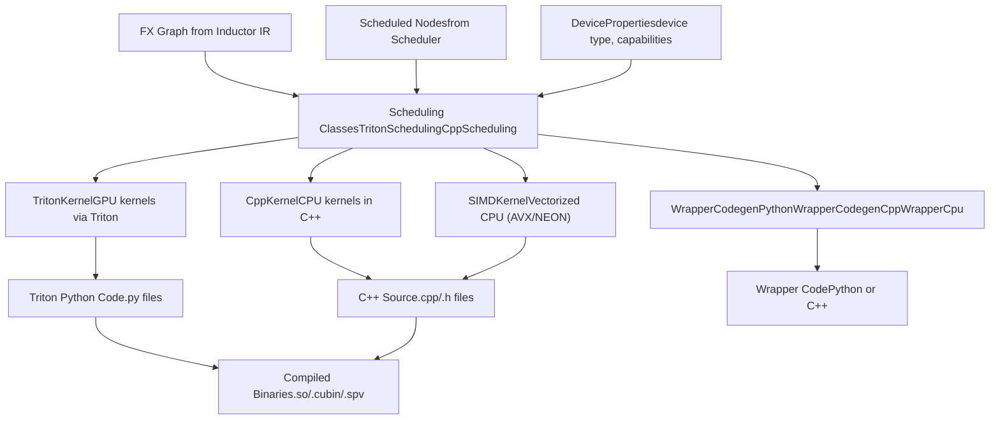
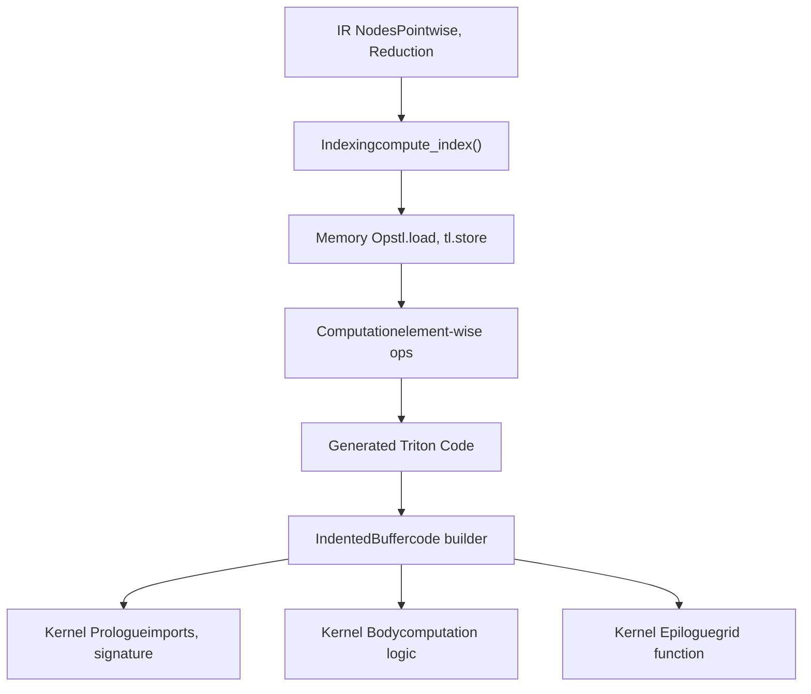
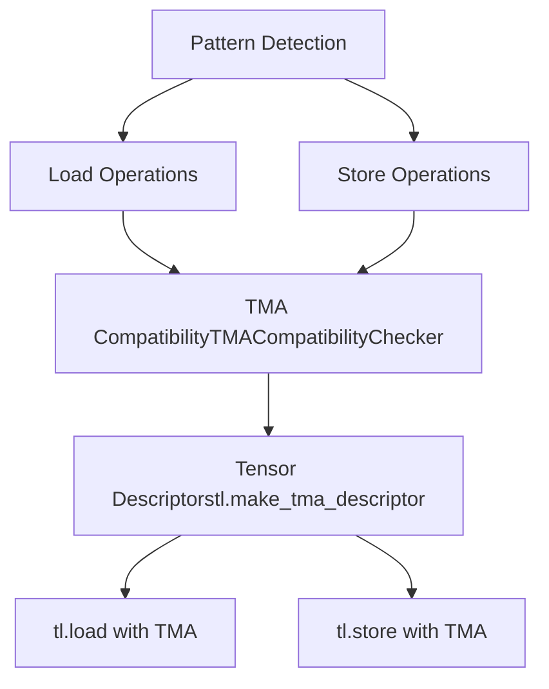
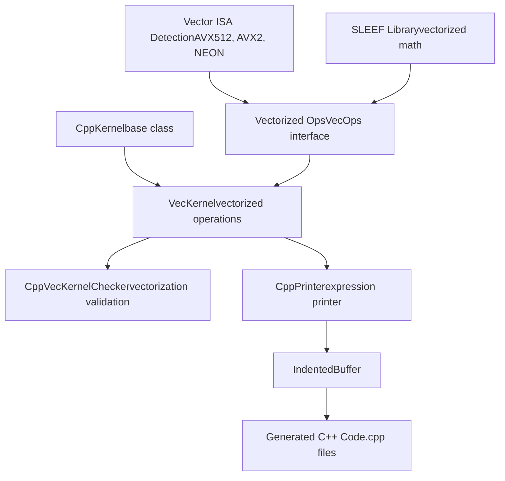
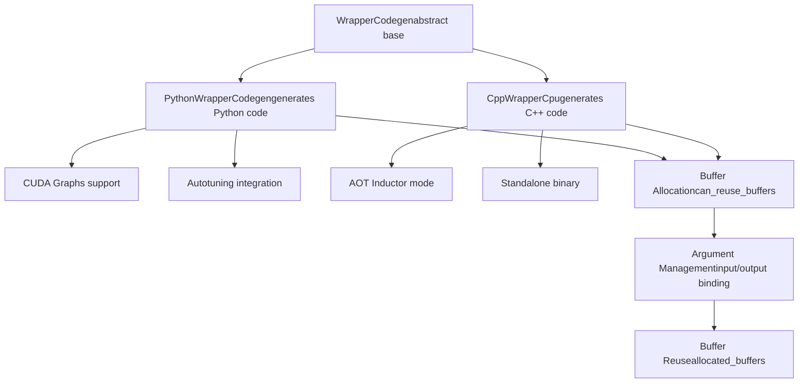
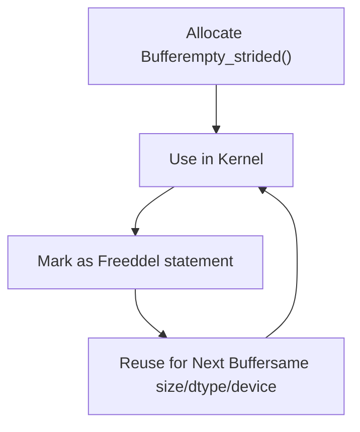
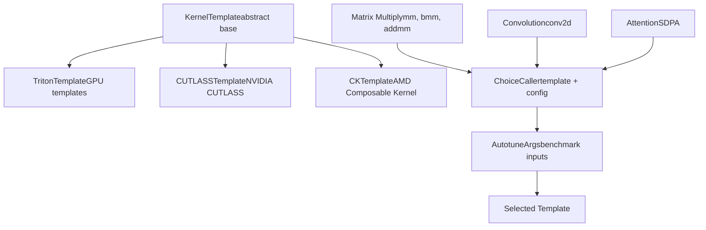
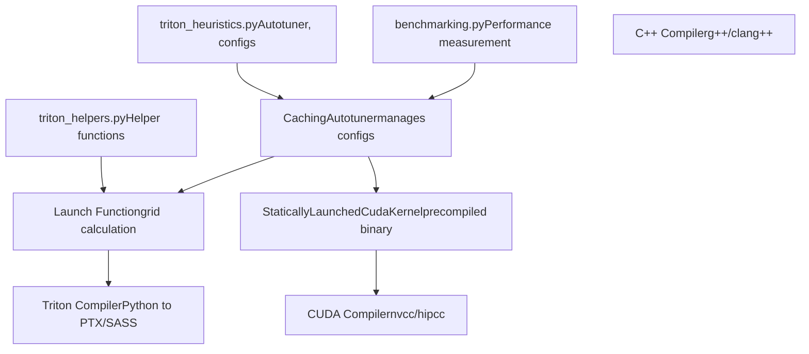
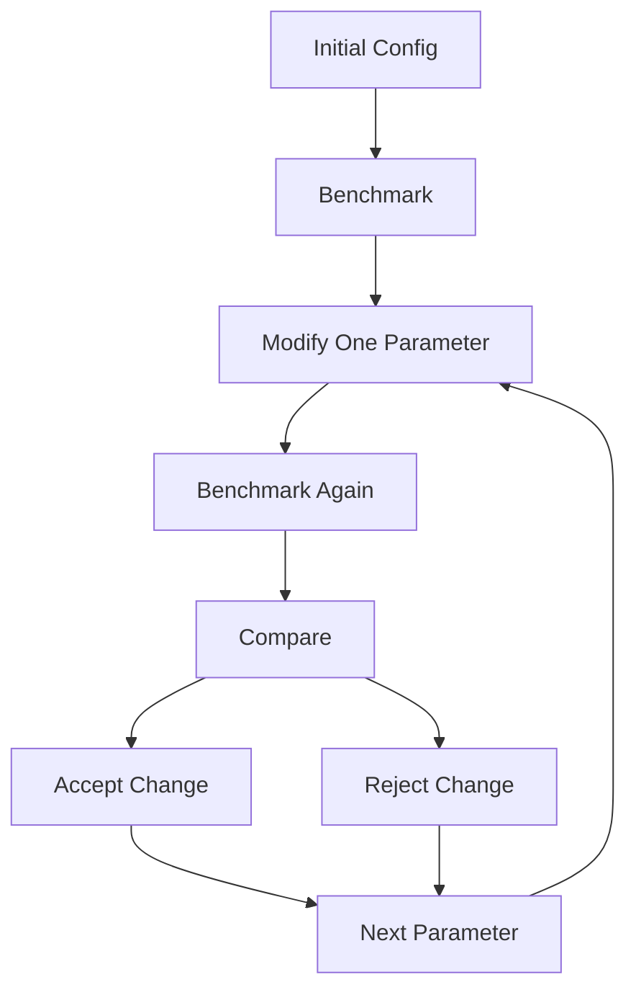

# Code Generation Backends

Relevant source files

-   [.ci/docker/common/install\_jax.sh](https://github.com/pytorch/pytorch/blob/915982a4/.ci/docker/common/install_jax.sh)
-   [.flake8](https://github.com/pytorch/pytorch/blob/915982a4/.flake8)
-   [.lintrunner.toml](https://github.com/pytorch/pytorch/blob/915982a4/.lintrunner.toml)
-   [aten/src/ATen/cuda/CUDAGreenContext.cpp](https://github.com/pytorch/pytorch/blob/915982a4/aten/src/ATen/cuda/CUDAGreenContext.cpp)
-   [aten/src/ATen/cuda/CUDAGreenContext.h](https://github.com/pytorch/pytorch/blob/915982a4/aten/src/ATen/cuda/CUDAGreenContext.h)
-   [benchmarks/inductor\_backends/cutlass.py](https://github.com/pytorch/pytorch/blob/915982a4/benchmarks/inductor_backends/cutlass.py)
-   [docs/source/cuda.md](https://github.com/pytorch/pytorch/blob/915982a4/docs/source/cuda.md)
-   [pyproject.toml](https://github.com/pytorch/pytorch/blob/915982a4/pyproject.toml)
-   [test/dynamo/test\_structured\_trace.py](https://github.com/pytorch/pytorch/blob/915982a4/test/dynamo/test_structured_trace.py)
-   [test/inductor/test\_aot\_inductor.py](https://github.com/pytorch/pytorch/blob/915982a4/test/inductor/test_aot_inductor.py)
-   [test/inductor/test\_auto\_functionalize.py](https://github.com/pytorch/pytorch/blob/915982a4/test/inductor/test_auto_functionalize.py)
-   [test/inductor/test\_codecache.py](https://github.com/pytorch/pytorch/blob/915982a4/test/inductor/test_codecache.py)
-   [test/inductor/test\_combo\_kernels.py](https://github.com/pytorch/pytorch/blob/915982a4/test/inductor/test_combo_kernels.py)
-   [test/inductor/test\_cpu\_repro.py](https://github.com/pytorch/pytorch/blob/915982a4/test/inductor/test_cpu_repro.py)
-   [test/inductor/test\_cuda\_repro.py](https://github.com/pytorch/pytorch/blob/915982a4/test/inductor/test_cuda_repro.py)
-   [test/inductor/test\_custom\_op\_autotune.py](https://github.com/pytorch/pytorch/blob/915982a4/test/inductor/test_custom_op_autotune.py)
-   [test/inductor/test\_cutedsl\_template.py](https://github.com/pytorch/pytorch/blob/915982a4/test/inductor/test_cutedsl_template.py)
-   [test/inductor/test\_cutlass\_backend.py](https://github.com/pytorch/pytorch/blob/915982a4/test/inductor/test_cutlass_backend.py)
-   [test/inductor/test\_cutlass\_evt.py](https://github.com/pytorch/pytorch/blob/915982a4/test/inductor/test_cutlass_evt.py)
-   [test/inductor/test\_flex\_decoding.py](https://github.com/pytorch/pytorch/blob/915982a4/test/inductor/test_flex_decoding.py)
-   [test/inductor/test\_foreach.py](https://github.com/pytorch/pytorch/blob/915982a4/test/inductor/test_foreach.py)
-   [test/inductor/test\_lookup\_table.py](https://github.com/pytorch/pytorch/blob/915982a4/test/inductor/test_lookup_table.py)
-   [test/inductor/test\_max\_autotune.py](https://github.com/pytorch/pytorch/blob/915982a4/test/inductor/test_max_autotune.py)
-   [test/inductor/test\_mmdecomp.py](https://github.com/pytorch/pytorch/blob/915982a4/test/inductor/test_mmdecomp.py)
-   [test/inductor/test\_pallas.py](https://github.com/pytorch/pytorch/blob/915982a4/test/inductor/test_pallas.py)
-   [test/inductor/test\_provenance\_tracing.py](https://github.com/pytorch/pytorch/blob/915982a4/test/inductor/test_provenance_tracing.py)
-   [test/inductor/test\_segmented\_tree.py](https://github.com/pytorch/pytorch/blob/915982a4/test/inductor/test_segmented_tree.py)
-   [test/inductor/test\_torchinductor.py](https://github.com/pytorch/pytorch/blob/915982a4/test/inductor/test_torchinductor.py)
-   [test/inductor/test\_torchinductor\_codegen\_dynamic\_shapes.py](https://github.com/pytorch/pytorch/blob/915982a4/test/inductor/test_torchinductor_codegen_dynamic_shapes.py)
-   [test/test\_public\_bindings.py](https://github.com/pytorch/pytorch/blob/915982a4/test/test_public_bindings.py)
-   [test/test\_testing.py](https://github.com/pytorch/pytorch/blob/915982a4/test/test_testing.py)
-   [tools/linter/adapters/pyrefly\_linter.py](https://github.com/pytorch/pytorch/blob/915982a4/tools/linter/adapters/pyrefly_linter.py)
-   [tools/linter/adapters/test\_has\_main\_linter.py](https://github.com/pytorch/pytorch/blob/915982a4/tools/linter/adapters/test_has_main_linter.py)
-   [torch/\_inductor/\_\_init\_\_.py](https://github.com/pytorch/pytorch/blob/915982a4/torch/_inductor/__init__.py)
-   [torch/\_inductor/autotune\_process.py](https://github.com/pytorch/pytorch/blob/915982a4/torch/_inductor/autotune_process.py)
-   [torch/\_inductor/choices.py](https://github.com/pytorch/pytorch/blob/915982a4/torch/_inductor/choices.py)
-   [torch/\_inductor/codecache.py](https://github.com/pytorch/pytorch/blob/915982a4/torch/_inductor/codecache.py)
-   [torch/\_inductor/codegen/common.py](https://github.com/pytorch/pytorch/blob/915982a4/torch/_inductor/codegen/common.py)
-   [torch/\_inductor/codegen/cpp.py](https://github.com/pytorch/pytorch/blob/915982a4/torch/_inductor/codegen/cpp.py)
-   [torch/\_inductor/codegen/cpp\_flex\_attention\_template.py](https://github.com/pytorch/pytorch/blob/915982a4/torch/_inductor/codegen/cpp_flex_attention_template.py)
-   [torch/\_inductor/codegen/cpp\_template\_kernel.py](https://github.com/pytorch/pytorch/blob/915982a4/torch/_inductor/codegen/cpp_template_kernel.py)
-   [torch/\_inductor/codegen/cpp\_wrapper\_cpu.py](https://github.com/pytorch/pytorch/blob/915982a4/torch/_inductor/codegen/cpp_wrapper_cpu.py)
-   [torch/\_inductor/codegen/cpp\_wrapper\_cpu\_array\_ref.py](https://github.com/pytorch/pytorch/blob/915982a4/torch/_inductor/codegen/cpp_wrapper_cpu_array_ref.py)
-   [torch/\_inductor/codegen/cutedsl/README.md](https://github.com/pytorch/pytorch/blob/915982a4/torch/_inductor/codegen/cutedsl/README.md)
-   [torch/\_inductor/codegen/cutedsl/\_\_init\_\_.py](https://github.com/pytorch/pytorch/blob/915982a4/torch/_inductor/codegen/cutedsl/__init__.py)
-   [torch/\_inductor/codegen/cutedsl/cutedsl\_op\_overrides.py](https://github.com/pytorch/pytorch/blob/915982a4/torch/_inductor/codegen/cutedsl/cutedsl_op_overrides.py)
-   [torch/\_inductor/codegen/cutedsl/cutedsl\_template.py](https://github.com/pytorch/pytorch/blob/915982a4/torch/_inductor/codegen/cutedsl/cutedsl_template.py)
-   [torch/\_inductor/codegen/halide.py](https://github.com/pytorch/pytorch/blob/915982a4/torch/_inductor/codegen/halide.py)
-   [torch/\_inductor/codegen/pallas.py](https://github.com/pytorch/pytorch/blob/915982a4/torch/_inductor/codegen/pallas.py)
-   [torch/\_inductor/codegen/simd.py](https://github.com/pytorch/pytorch/blob/915982a4/torch/_inductor/codegen/simd.py)
-   [torch/\_inductor/codegen/subgraph.py](https://github.com/pytorch/pytorch/blob/915982a4/torch/_inductor/codegen/subgraph.py)
-   [torch/\_inductor/codegen/triton.py](https://github.com/pytorch/pytorch/blob/915982a4/torch/_inductor/codegen/triton.py)
-   [torch/\_inductor/codegen/triton\_combo\_kernel.py](https://github.com/pytorch/pytorch/blob/915982a4/torch/_inductor/codegen/triton_combo_kernel.py)
-   [torch/\_inductor/codegen/wrapper.py](https://github.com/pytorch/pytorch/blob/915982a4/torch/_inductor/codegen/wrapper.py)
-   [torch/\_inductor/compile\_fx.py](https://github.com/pytorch/pytorch/blob/915982a4/torch/_inductor/compile_fx.py)
-   [torch/\_inductor/config.py](https://github.com/pytorch/pytorch/blob/915982a4/torch/_inductor/config.py)
-   [torch/\_inductor/debug.py](https://github.com/pytorch/pytorch/blob/915982a4/torch/_inductor/debug.py)
-   [torch/\_inductor/decomposition.py](https://github.com/pytorch/pytorch/blob/915982a4/torch/_inductor/decomposition.py)
-   [torch/\_inductor/dtype\_propagation.py](https://github.com/pytorch/pytorch/blob/915982a4/torch/_inductor/dtype_propagation.py)
-   [torch/\_inductor/graph.py](https://github.com/pytorch/pytorch/blob/915982a4/torch/_inductor/graph.py)
-   [torch/\_inductor/ir.py](https://github.com/pytorch/pytorch/blob/915982a4/torch/_inductor/ir.py)
-   [torch/\_inductor/kernel/bmm.py](https://github.com/pytorch/pytorch/blob/915982a4/torch/_inductor/kernel/bmm.py)
-   [torch/\_inductor/kernel/conv.py](https://github.com/pytorch/pytorch/blob/915982a4/torch/_inductor/kernel/conv.py)
-   [torch/\_inductor/kernel/custom\_op.py](https://github.com/pytorch/pytorch/blob/915982a4/torch/_inductor/kernel/custom_op.py)
-   [torch/\_inductor/kernel/mm.py](https://github.com/pytorch/pytorch/blob/915982a4/torch/_inductor/kernel/mm.py)
-   [torch/\_inductor/kernel/mm\_plus\_mm.py](https://github.com/pytorch/pytorch/blob/915982a4/torch/_inductor/kernel/mm_plus_mm.py)
-   [torch/\_inductor/kernel\_inputs.py](https://github.com/pytorch/pytorch/blob/915982a4/torch/_inductor/kernel_inputs.py)
-   [torch/\_inductor/lowering.py](https://github.com/pytorch/pytorch/blob/915982a4/torch/_inductor/lowering.py)
-   [torch/\_inductor/memory.py](https://github.com/pytorch/pytorch/blob/915982a4/torch/_inductor/memory.py)
-   [torch/\_inductor/ops\_handler.py](https://github.com/pytorch/pytorch/blob/915982a4/torch/_inductor/ops_handler.py)
-   [torch/\_inductor/runtime/runtime\_utils.py](https://github.com/pytorch/pytorch/blob/915982a4/torch/_inductor/runtime/runtime_utils.py)
-   [torch/\_inductor/runtime/triton\_heuristics.py](https://github.com/pytorch/pytorch/blob/915982a4/torch/_inductor/runtime/triton_heuristics.py)
-   [torch/\_inductor/scheduler.py](https://github.com/pytorch/pytorch/blob/915982a4/torch/_inductor/scheduler.py)
-   [torch/\_inductor/select\_algorithm.py](https://github.com/pytorch/pytorch/blob/915982a4/torch/_inductor/select_algorithm.py)
-   [torch/\_inductor/shape\_propagation.py](https://github.com/pytorch/pytorch/blob/915982a4/torch/_inductor/shape_propagation.py)
-   [torch/\_inductor/sizevars.py](https://github.com/pytorch/pytorch/blob/915982a4/torch/_inductor/sizevars.py)
-   [torch/\_inductor/template\_heuristics/triton.py](https://github.com/pytorch/pytorch/blob/915982a4/torch/_inductor/template_heuristics/triton.py)
-   [torch/\_inductor/utils.py](https://github.com/pytorch/pytorch/blob/915982a4/torch/_inductor/utils.py)
-   [torch/\_inductor/virtualized.py](https://github.com/pytorch/pytorch/blob/915982a4/torch/_inductor/virtualized.py)
-   [torch/csrc/cuda/GreenContext.cpp](https://github.com/pytorch/pytorch/blob/915982a4/torch/csrc/cuda/GreenContext.cpp)
-   [torch/csrc/inductor/cpp\_wrapper/common.h](https://github.com/pytorch/pytorch/blob/915982a4/torch/csrc/inductor/cpp_wrapper/common.h)
-   [torch/cuda/green\_contexts.py](https://github.com/pytorch/pytorch/blob/915982a4/torch/cuda/green_contexts.py)
-   [torch/testing/\_internal/inductor\_utils.py](https://github.com/pytorch/pytorch/blob/915982a4/torch/testing/_internal/inductor_utils.py)
-   [torch/testing/\_internal/py312\_intrinsics.py](https://github.com/pytorch/pytorch/blob/915982a4/torch/testing/_internal/py312_intrinsics.py)
-   [torch/utils/\_pallas.py](https://github.com/pytorch/pytorch/blob/915982a4/torch/utils/_pallas.py)

## Purpose and Scope

This document describes the code generation backends in TorchInductor that transform the intermediate representation (IR) into executable code for different hardware targets. Code generation is the final compilation stage that produces optimized kernels and wrapper code.

For information about the preceding compilation stages, see:

-   IR structure and lowering: [2.2.1](/pytorch/pytorch/2.2.1-frame-evaluation-and-bytecode-analysis) Compilation Pipeline and IR
-   Scheduling and fusion: [2.2.2](/pytorch/pytorch/2.2.2-variable-tracking-and-symbolic-execution) Scheduling and Fusion
-   Kernel selection: [2.2.3](/pytorch/pytorch/2.2.3-guard-system-and-recompilation) Kernel Selection and Autotuning
-   Code caching: [2.2.5](#2.2.5) CodeCache and Persistence

## Code Generation Architecture

The code generation system consists of multiple backend implementations that target different hardware platforms and programming models. The primary backends are:


Sources: [torch/\_inductor/codegen/triton.py1-100](https://github.com/pytorch/pytorch/blob/915982a4/torch/_inductor/codegen/triton.py#L1-L100) [torch/\_inductor/codegen/simd.py1-100](https://github.com/pytorch/pytorch/blob/915982a4/torch/_inductor/codegen/simd.py#L1-L100) [torch/\_inductor/codegen/wrapper.py1-100](https://github.com/pytorch/pytorch/blob/915982a4/torch/_inductor/codegen/wrapper.py#L1-L100)

### Backend Dispatch Mechanism

Backend selection occurs through the scheduling system, which determines the appropriate code generation strategy based on device type and kernel characteristics:

| Backend | Device Types | Use Cases | Implementation |
| --- | --- | --- | --- |
| `TritonScheduling` | CUDA, ROCm, XPU | GPU pointwise, reductions, templates | `torch/_inductor/codegen/triton.py` |
| `CppScheduling` | CPU | General CPU operations | `torch/_inductor/codegen/cpp.py` |
| `SIMDScheduling` | CPU | Vectorized operations | `torch/_inductor/codegen/simd.py` |

The `get_scheduling_for_device()` function in [torch/\_inductor/codegen/common.py800-850](https://github.com/pytorch/pytorch/blob/915982a4/torch/_inductor/codegen/common.py#L800-L850) dispatches to the appropriate scheduling class.

Sources: [torch/\_inductor/codegen/common.py800-900](https://github.com/pytorch/pytorch/blob/915982a4/torch/_inductor/codegen/common.py#L800-L900) [torch/\_inductor/scheduler.py1-100](https://github.com/pytorch/pytorch/blob/915982a4/torch/_inductor/scheduler.py#L1-L100)

## Triton Code Generation

The Triton backend generates GPU kernels using the Triton language, which provides a Python-based interface for writing high-performance GPU code.

### TritonKernel Class

The `TritonKernel` class in [torch/\_inductor/codegen/triton.py1000-1500](https://github.com/pytorch/pytorch/blob/915982a4/torch/_inductor/codegen/triton.py#L1000-L1500) is the core code generator for Triton kernels. It extends `SIMDKernel` and provides GPU-specific code generation:


Key methods in `TritonKernel`:

-   `codegen_kernel()` - Main entry point for kernel generation
-   `store()` - Generate store operations
-   `load()` - Generate load operations
-   `compute()` - Generate computation code
-   `indexing()` - Generate indexing expressions

Sources: [torch/\_inductor/codegen/triton.py1000-2000](https://github.com/pytorch/pytorch/blob/915982a4/torch/_inductor/codegen/triton.py#L1000-L2000)

### Triton Code Structure

A typical generated Triton kernel has this structure:

```
# Imports (generated by gen_common_triton_imports)import tritonimport triton.language as tlfrom torch._inductor.runtime import triton_helpers # Kernel function with autotune decorator@triton_heuristics.pointwise(...)@triton.jitdef triton_poi_fused_kernel_0(in_ptr0, out_ptr0, xnumel, XBLOCK : tl.constexpr):    # Thread indexing    xoffset = tl.program_id(0) * XBLOCK    xindex = xoffset + tl.arange(0, XBLOCK)    xmask = xindex < xnumel        # Load inputs    x0 = xindex    tmp0 = tl.load(in_ptr0 + x0, xmask)        # Compute    tmp1 = tmp0 + 1.0        # Store output    tl.store(out_ptr0 + x0, tmp1, xmask) # Grid functiondef grid(meta):    return (triton.cdiv(meta['xnumel'], meta['XBLOCK']),)
```
The code generation produces:

1.  **Imports** - Common Triton imports via `gen_common_triton_imports()` [torch/\_inductor/codegen/triton.py180-200](https://github.com/pytorch/pytorch/blob/915982a4/torch/_inductor/codegen/triton.py#L180-L200)
2.  **Decorators** - Autotuning hints via `triton_heuristics` [torch/\_inductor/runtime/triton\_heuristics.py260-360](https://github.com/pytorch/pytorch/blob/915982a4/torch/_inductor/runtime/triton_heuristics.py#L260-L360)
3.  **Signature** - Kernel parameters (pointers, sizes, constexpr block sizes)
4.  **Indexing** - Thread and block indexing logic
5.  **Loads/Stores** - Memory operations with masking
6.  **Grid function** - Dynamic grid size calculation

Sources: [torch/\_inductor/codegen/triton.py180-300](https://github.com/pytorch/pytorch/blob/915982a4/torch/_inductor/codegen/triton.py#L180-L300) [torch/\_inductor/codegen/triton.py1000-1500](https://github.com/pytorch/pytorch/blob/915982a4/torch/_inductor/codegen/triton.py#L1000-L1500)

### Triton-Specific Features

#### Block Pattern Matching

The `BlockPatternMatcher` in [torch/\_inductor/codegen/block\_analysis.py](https://github.com/pytorch/pytorch/blob/915982a4/torch/_inductor/codegen/block_analysis.py) identifies opportunities for TMA (Tensor Memory Accelerator) operations on modern GPUs:


Sources: [torch/\_inductor/codegen/triton.py2000-2500](https://github.com/pytorch/pytorch/blob/915982a4/torch/_inductor/codegen/triton.py#L2000-L2500)

#### Autotuning Integration

Triton kernels are wrapped with autotuning decorators that enable runtime configuration selection:

-   `@triton_heuristics.pointwise()` - For pointwise operations
-   `@triton_heuristics.reduction()` - For reduction operations
-   `@triton_heuristics.persistent_reduction()` - For persistent reductions
-   `@triton_heuristics.template()` - For template kernels

The `CachingAutotuner` class in [torch/\_inductor/runtime/triton\_heuristics.py260-450](https://github.com/pytorch/pytorch/blob/915982a4/torch/_inductor/runtime/triton_heuristics.py#L260-L450) manages:

-   Configuration selection from multiple `triton.Config` objects
-   Benchmarking of configurations
-   Caching of best configurations
-   Coordinate descent tuning via `CoordescTuner`

Sources: [torch/\_inductor/runtime/triton\_heuristics.py260-600](https://github.com/pytorch/pytorch/blob/915982a4/torch/_inductor/runtime/triton_heuristics.py#L260-L600)

## C++ and SIMD Code Generation

For CPU operations, Inductor generates C++ code with optional vectorization through SIMD instructions.

### C++ Backend Architecture


Sources: [torch/\_inductor/codegen/simd.py100-500](https://github.com/pytorch/pytorch/blob/915982a4/torch/_inductor/codegen/simd.py#L100-L500) [torch/\_inductor/codegen/cpp.py1-200](https://github.com/pytorch/pytorch/blob/915982a4/torch/_inductor/codegen/cpp.py#L1-L200)

### SIMDKernel Implementation

The `SIMDKernel` class in [torch/\_inductor/codegen/simd.py500-1500](https://github.com/pytorch/pytorch/blob/915982a4/torch/_inductor/codegen/simd.py#L500-L1500) provides the foundation for both C++ and Triton backends. It manages:

**Iteration Ranges:**

-   `IterationRanges` - Represents loop dimensions and iteration spaces
-   `IterationRangesRoot` - Root of iteration tree
-   `IterationRangesEntry` - Individual dimension entries

**Loop Ordering:**

-   Determines optimal loop nest ordering for cache locality
-   Considers memory coalescing patterns
-   Supports reduction dimensions

**Indexing:**

-   `cse` (Common Subexpression Elimination) - Eliminates redundant index calculations
-   `indexing()` - Generates index expressions
-   `index_to_str()` - Converts symbolic indices to code

The generated C++ code structure:

```
#pragma omp parallel forfor (long i0 = 0; i0 < numel; i0++) {    auto tmp0 = in_ptr0[i0];    auto tmp1 = tmp0 + 1.0f;    out_ptr0[i0] = tmp1;}
```
For vectorized code:

```
#pragma omp parallel forfor (long i0 = 0; i0 < numel; i0 += 8) {    auto tmp0 = at::vec::Vectorized<float>::loadu(in_ptr0 + i0);    auto tmp1 = tmp0 + at::vec::Vectorized<float>(1.0f);    tmp1.store(out_ptr0 + i0);}
```
Sources: [torch/\_inductor/codegen/simd.py500-2000](https://github.com/pytorch/pytorch/blob/915982a4/torch/_inductor/codegen/simd.py#L500-L2000) [torch/\_inductor/codegen/cpp.py200-500](https://github.com/pytorch/pytorch/blob/915982a4/torch/_inductor/codegen/cpp.py#L200-L500)

### Vector ISA Selection

CPU vectorization support is determined at runtime by `pick_vec_isa()` in [torch/\_inductor/cpu\_vec\_isa.py](https://github.com/pytorch/pytorch/blob/915982a4/torch/_inductor/cpu_vec_isa.py):

| ISA | Instruction Set | Platforms |
| --- | --- | --- |
| `VecAVX512` | AVX-512 | Intel Skylake-X and newer |
| `VecAVX2` | AVX2 | Intel Haswell and newer |
| `VecNEON` | ARM NEON | ARM CPUs |
| `VecZVECTOR` | z/Architecture Vector | IBM Z |

The selection considers:

-   CPU capabilities via CPUID
-   Configuration overrides (`config.cpp.vec_isa_ok`)
-   Platform availability

Sources: [torch/\_inductor/cpu\_vec\_isa.py1-200](https://github.com/pytorch/pytorch/blob/915982a4/torch/_inductor/cpu_vec_isa.py#L1-L200)

## Wrapper Code Generation

The wrapper layer orchestrates kernel execution by generating code that:

1.  Allocates tensors and buffers
2.  Invokes generated kernels with correct arguments
3.  Manages memory lifetimes
4.  Handles dynamic shapes and guards

### Wrapper Types


Sources: [torch/\_inductor/codegen/wrapper.py50-150](https://github.com/pytorch/pytorch/blob/915982a4/torch/_inductor/codegen/wrapper.py#L50-L150) [torch/\_inductor/codegen/cpp\_wrapper\_cpu.py50-150](https://github.com/pytorch/pytorch/blob/915982a4/torch/_inductor/codegen/cpp_wrapper_cpu.py#L50-L150)

### PythonWrapperCodegen

The `PythonWrapperCodegen` class in [torch/\_inductor/codegen/wrapper.py100-500](https://github.com/pytorch/pytorch/blob/915982a4/torch/_inductor/codegen/wrapper.py#L100-L500) generates Python code that imports and calls compiled kernels. Key responsibilities:

**Buffer Management:**

-   `can_reuse_buffers()` - Determines if buffers can be reused based on `buffer_reuse_key()`
-   `allocated_buffers` - Tracks allocated buffer names
-   `freed_buffers` - Pool of freed buffers available for reuse

**Kernel Invocation:**

```
# Generated wrapper code structuredef call(args):    # Unpack arguments    arg0_1, arg1_1 = args        # Allocate buffers    buf0 = empty_strided(..., device='cuda', dtype=torch.float32)        # Call kernel    triton_poi_fused_kernel_0.run(arg0_1, buf0, ...)        # Return outputs    return (buf0, )
```
**Features:**

-   Dynamic shape handling via symbolic size variables
-   CUDA graph recording support
-   Autotuning integration
-   Intermediate hooks for debugging

Sources: [torch/\_inductor/codegen/wrapper.py500-1500](https://github.com/pytorch/pytorch/blob/915982a4/torch/_inductor/codegen/wrapper.py#L500-L1500)

### CppWrapperCpu

The `CppWrapperCpu` class in [torch/\_inductor/codegen/cpp\_wrapper\_cpu.py54-200](https://github.com/pytorch/pytorch/blob/915982a4/torch/_inductor/codegen/cpp_wrapper_cpu.py#L54-L200) generates C++ wrapper code for AOT (Ahead-of-Time) compilation. This enables:

**AOT Inductor Mode:**

-   Standalone binaries without Python runtime
-   `AOTInductorModel` C++ class generation
-   Model parameter serialization
-   C++ API for inference

**Generated C++ Structure:**

```
class AOTInductorModel {public:    AOTInductorModel();        std::vector<at::Tensor> run(        const std::vector<at::Tensor>& inputs    );    private:    // Constant tensors    at::Tensor constant0_;        // Workspace buffers    std::unique_ptr<uint8_t[]> workspace_;};
```
The C++ wrapper:

-   Uses ATen C++ API (`at::Tensor`, `at::empty`, etc.)
-   Manages memory via RAII
-   Supports dynamic shapes through runtime size computation
-   Integrates with PyTorch's dispatcher

Sources: [torch/\_inductor/codegen/cpp\_wrapper\_cpu.py54-500](https://github.com/pytorch/pytorch/blob/915982a4/torch/_inductor/codegen/cpp_wrapper_cpu.py#L54-L500)

### Wrapper Code Features

#### Buffer Reuse Strategy

The wrapper implements sophisticated buffer reuse to minimize memory allocation:


The `buffer_reuse_key()` function in [torch/\_inductor/codegen/wrapper.py96-108](https://github.com/pytorch/pytorch/blob/915982a4/torch/_inductor/codegen/wrapper.py#L96-L108) computes a key based on:

-   Device (CUDA, CPU, etc.)
-   Dtype (float32, int64, etc.)
-   Symbolic size expression
-   Alignment requirements

Sources: [torch/\_inductor/codegen/wrapper.py96-140](https://github.com/pytorch/pytorch/blob/915982a4/torch/_inductor/codegen/wrapper.py#L96-L140)

#### Argument Handling

Wrappers manage different argument types:

| Argument Type | Class | Purpose |
| --- | --- | --- |
| `TensorArg` | Input/output tensors | Regular tensor arguments |
| `SizeArg` | Symbolic sizes | Dynamic shape values |
| `WorkspaceArg` | Temporary buffers | Scratch memory for kernels |
| `ConstexprArg` | Compile-time constants | Triton constexpr parameters |

The `args` system in [torch/\_inductor/codegen/common.py100-300](https://github.com/pytorch/pytorch/blob/915982a4/torch/_inductor/codegen/common.py#L100-L300) tracks argument metadata including names, types, and constraints.

Sources: [torch/\_inductor/codegen/common.py150-400](https://github.com/pytorch/pytorch/blob/915982a4/torch/_inductor/codegen/common.py#L150-L400) [torch/\_inductor/codegen/wrapper.py600-800](https://github.com/pytorch/pytorch/blob/915982a4/torch/_inductor/codegen/wrapper.py#L600-L800)

## Template Kernels and Algorithm Selection

Beyond basic code generation, Inductor uses template-based kernels for performance-critical operations.

### Template System


Sources: [torch/\_inductor/select\_algorithm.py100-500](https://github.com/pytorch/pytorch/blob/915982a4/torch/_inductor/select_algorithm.py#L100-L500) [torch/\_inductor/codegen/common.py1000-1500](https://github.com/pytorch/pytorch/blob/915982a4/torch/_inductor/codegen/common.py#L1000-L1500)

### TritonTemplate

The `TritonTemplate` class in [torch/\_inductor/select\_algorithm.py500-1000](https://github.com/pytorch/pytorch/blob/915982a4/torch/_inductor/select_algorithm.py#L500-L1000) provides a framework for writing reusable kernel templates:

**Template Structure:**

```
class TritonTemplate(KernelTemplate):    def render(self, kernel: TritonTemplateKernel, **kwargs) -> str:        # Generate Triton code from template        return template_code            def make_kernel_render(self, kernel: TritonTemplateKernel, **kwargs):        # Create kernel with substitutions        ...
```
**Key Features:**

-   `GEMM_TEMPLATE` - Matrix multiplication templates
-   `CONV_TEMPLATE` - Convolution templates
-   Subgraph rendering via `SubgraphInfo`
-   Prologue/epilogue fusion

Templates support:

-   Multiple configurations (e.g., different tile sizes)
-   Dynamic shapes through symbolic expressions
-   Autotuning across configurations

Sources: [torch/\_inductor/select\_algorithm.py500-1500](https://github.com/pytorch/pytorch/blob/915982a4/torch/_inductor/select_algorithm.py#L500-L1500)

### Algorithm Selection Process

The `AlgorithmSelectorCache` in [torch/\_inductor/select\_algorithm.py200-400](https://github.com/pytorch/pytorch/blob/915982a4/torch/_inductor/select_algorithm.py#L200-L400) orchestrates template selection:

1.  **Choice Generation:** Create `ChoiceCaller` objects for each template/config
2.  **Benchmarking:** Use `AutotuneArgs` to benchmark each choice
3.  **Selection:** Pick fastest configuration
4.  **Caching:** Store result in `PersistentCache`

Example for matrix multiply:

```
# Generated choiceschoices = [    TritonTemplateCaller(GEMM_TEMPLATE, config1),    TritonTemplateCaller(GEMM_TEMPLATE, config2),    ExternKernelCaller(torch.ops.aten.mm),    CUTLASSGemmTemplate(...),] # Benchmark and selectwinner = min(choices, key=lambda c: benchmark(c))
```
Sources: [torch/\_inductor/select\_algorithm.py200-700](https://github.com/pytorch/pytorch/blob/915982a4/torch/_inductor/select_algorithm.py#L200-L700)

## Kernel Execution and Runtime

The final piece is the runtime system that executes generated kernels.

### Runtime Components


Sources: [torch/\_inductor/runtime/triton\_heuristics.py1-300](https://github.com/pytorch/pytorch/blob/915982a4/torch/_inductor/runtime/triton_heuristics.py#L1-L300) [torch/\_inductor/runtime/triton\_helpers.py1-100](https://github.com/pytorch/pytorch/blob/915982a4/torch/_inductor/runtime/triton_helpers.py#L1-L100)

### CachingAutotuner

The `CachingAutotuner` class in [torch/\_inductor/runtime/triton\_heuristics.py260-450](https://github.com/pytorch/pytorch/blob/915982a4/torch/_inductor/runtime/triton_heuristics.py#L260-L450) is the primary interface for executing Triton kernels with autotuning:

**Initialization:**

```
autotuner = CachingAutotuner(    fn=kernel_fn,    triton_meta={'device': device_props, ...},    configs=[config1, config2, ...],    heuristic_type=HeuristicType.POINTWISE,)
```
**Execution Flow:**

1.  **Precompile:** Compile all configs in worker process
2.  **Grid Calculation:** Compute grid dimensions from meta parameters
3.  **Benchmark:** Time each config if not cached
4.  **Launch:** Execute fastest config

**Key Methods:**

-   `precompile()` - Compile kernels ahead of time [torch/\_inductor/runtime/triton\_heuristics.py420-440](https://github.com/pytorch/pytorch/blob/915982a4/torch/_inductor/runtime/triton_heuristics.py#L420-L440)
-   `run()` - Execute kernel with arguments
-   `benchmark()` - Measure performance
-   `_dynamic_scale_rblock()` - Adjust reduction block sizes dynamically

Sources: [torch/\_inductor/runtime/triton\_heuristics.py260-650](https://github.com/pytorch/pytorch/blob/915982a4/torch/_inductor/runtime/triton_heuristics.py#L260-L650)

### Coordinate Descent Tuning

For complex kernels, the `CoordescTuner` in [torch/\_inductor/runtime/coordinate\_descent\_tuner.py](https://github.com/pytorch/pytorch/blob/915982a4/torch/_inductor/runtime/coordinate_descent_tuner.py) performs iterative optimization:


This enables fine-tuning of block sizes, number of warps, and other parameters beyond the initial configuration set.

Sources: [torch/\_inductor/runtime/coordinate\_descent\_tuner.py1-200](https://github.com/pytorch/pytorch/blob/915982a4/torch/_inductor/runtime/coordinate_descent_tuner.py#L1-L200)

### Static CUDA Launcher

For AOT compilation, the `StaticallyLaunchedCudaKernel` in [torch/\_inductor/runtime/static\_cuda\_launcher.py](https://github.com/pytorch/pytorch/blob/915982a4/torch/_inductor/runtime/static_cuda_launcher.py) allows precompiled CUDA/HIP binaries:

```
// Generated static launchervoid launch_kernel_0(    CUstream stream,    void** args,    int grid_x, int grid_y, int grid_z) {    // Launch precompiled CUBIN/HSACO    cuLaunchKernel(        cubin_kernel_0,        grid_x, grid_y, grid_z,        block_x, block_y, block_z,        shared_mem, stream,        args, nullptr    );}
```
This eliminates runtime compilation overhead and enables:

-   Embedding kernels in shared libraries
-   Deployment without Triton compiler
-   Better binary size control

Sources: [torch/\_inductor/runtime/static\_cuda\_launcher.py1-200](https://github.com/pytorch/pytorch/blob/915982a4/torch/_inductor/runtime/static_cuda_launcher.py#L1-L200)

## Multi-Kernel and Combo Kernels

Inductor can generate multi-kernel implementations that dispatch to different kernel variants based on runtime conditions.

### Multi-Kernel System

The `MultiKernel` class in [torch/\_inductor/codegen/multi\_kernel.py50-200](https://github.com/pytorch/pytorch/blob/915982a4/torch/_inductor/codegen/multi_kernel.py#L50-L200) enables:

**Size Hint Dispatch:**

```
# Generated multi-kernel dispatcherif numel < 256:    triton_kernel_small(...)elif numel < 4096:    triton_kernel_medium(...)else:    triton_kernel_large(...)
```
**Use Cases:**

-   Different tile sizes for different input sizes
-   Persistent vs. non-persistent reductions
-   Autotuning with size-dependent configs

Sources: [torch/\_inductor/codegen/multi\_kernel.py50-300](https://github.com/pytorch/pytorch/blob/915982a4/torch/_inductor/codegen/multi_kernel.py#L50-L300)

### Combo Kernels

The `TritonComboKernel` in [torch/\_inductor/codegen/triton\_combo\_kernel.py100-400](https://github.com/pytorch/pytorch/blob/915982a4/torch/_inductor/codegen/triton_combo_kernel.py#L100-L400) combines multiple independent kernels into a single launch:

**Benefits:**

-   Reduced launch overhead
-   Better GPU utilization for small kernels
-   Simplified scheduling

**Scheduling Strategies:**

-   `SequentialComboKernelGrid` - Execute kernels sequentially
-   `RoundRobinComboKernelGrid` - Interleave kernel work

Example combo kernel:

```
@triton.jitdef combo_kernel_0(    # Arguments for kernel A    in_ptr0_a, out_ptr0_a, numel_a,    # Arguments for kernel B      in_ptr0_b, out_ptr0_b, numel_b,    # Combined grid    BLOCK_SIZE: tl.constexpr):    kernel_id = tl.program_id(2)  # Z dimension selects kernel    if kernel_id == 0:        # Execute kernel A        ...    else:        # Execute kernel B        ...
```
Sources: [torch/\_inductor/codegen/triton\_combo\_kernel.py100-600](https://github.com/pytorch/pytorch/blob/915982a4/torch/_inductor/codegen/triton_combo_kernel.py#L100-L600)

## Code Generation Utilities

Several utility modules support code generation across all backends.

### IndentedBuffer

The `IndentedBuffer` class in [torch/\_inductor/utils.py1000-1200](https://github.com/pytorch/pytorch/blob/915982a4/torch/_inductor/utils.py#L1000-L1200) provides structured code emission:

```
buf = IndentedBuffer()buf.writeline("def kernel():")with buf.indent():    buf.writeline("# Kernel body")    buf.writeline("x = 1")code = buf.getvalue()
```
Features:

-   Automatic indentation tracking
-   Line context for debugging
-   Deferred line emission

Sources: [torch/\_inductor/utils.py1000-1300](https://github.com/pytorch/pytorch/blob/915982a4/torch/_inductor/utils.py#L1000-L1300)

### PythonPrinter

The `PythonPrinter` in [torch/\_inductor/codegen/common.py500-800](https://github.com/pytorch/pytorch/blob/915982a4/torch/_inductor/codegen/common.py#L500-L800) converts SymPy expressions to Python/C++ code:

```
printer = PythonPrinter()expr = sympy.Symbol('x') + 1code = printer.doprint(expr)  # "x + 1"
```
Handles:

-   Operator precedence
-   Type conversions
-   Special functions (FloorDiv, ModularIndexing, etc.)

Sources: [torch/\_inductor/codegen/common.py500-900](https://github.com/pytorch/pytorch/blob/915982a4/torch/_inductor/codegen/common.py#L500-L900)

### CSE (Common Subexpression Elimination)

The `CSE` class in [torch/\_inductor/codegen/common.py1200-1500](https://github.com/pytorch/pytorch/blob/915982a4/torch/_inductor/codegen/common.py#L1200-L1500) eliminates redundant computations:

```
cse = CSE()x = cse.generate(sympy.Symbol('i') * 4 + 8)  # tmp0y = cse.generate(sympy.Symbol('i') * 4 + 8)  # tmp0 (reused)
```
Generated code:

```
tmp0 = i * 4 + 8# Both x and y use tmp0
```
This optimization is crucial for:

-   Index calculations with complex expressions
-   Reducing register pressure
-   Improving readability of generated code

Sources: [torch/\_inductor/codegen/common.py1200-1600](https://github.com/pytorch/pytorch/blob/915982a4/torch/_inductor/codegen/common.py#L1200-L1600)

## Summary

The code generation backend system in TorchInductor consists of:

1.  **Triton Backend** - GPU kernel generation using Triton language with autotuning and TMA support
2.  **C++/SIMD Backend** - CPU kernel generation with vectorization for AVX/NEON
3.  **Wrapper Generation** - Python or C++ orchestration code for kernel invocation
4.  **Template System** - Reusable kernel templates for GEMM, convolution, etc.
5.  **Runtime System** - Autotuning, benchmarking, and kernel execution infrastructure
6.  **Multi-Kernel Support** - Dispatch to different kernel variants based on runtime conditions

These backends work together through the scheduling system to produce optimized code for diverse hardware targets while maintaining a unified compilation pipeline.

Sources: [torch/\_inductor/codegen/triton.py1-100](https://github.com/pytorch/pytorch/blob/915982a4/torch/_inductor/codegen/triton.py#L1-L100) [torch/\_inductor/codegen/simd.py1-100](https://github.com/pytorch/pytorch/blob/915982a4/torch/_inductor/codegen/simd.py#L1-L100) [torch/\_inductor/codegen/wrapper.py1-100](https://github.com/pytorch/pytorch/blob/915982a4/torch/_inductor/codegen/wrapper.py#L1-L100) [torch/\_inductor/runtime/triton\_heuristics.py1-300](https://github.com/pytorch/pytorch/blob/915982a4/torch/_inductor/runtime/triton_heuristics.py#L1-L300)
