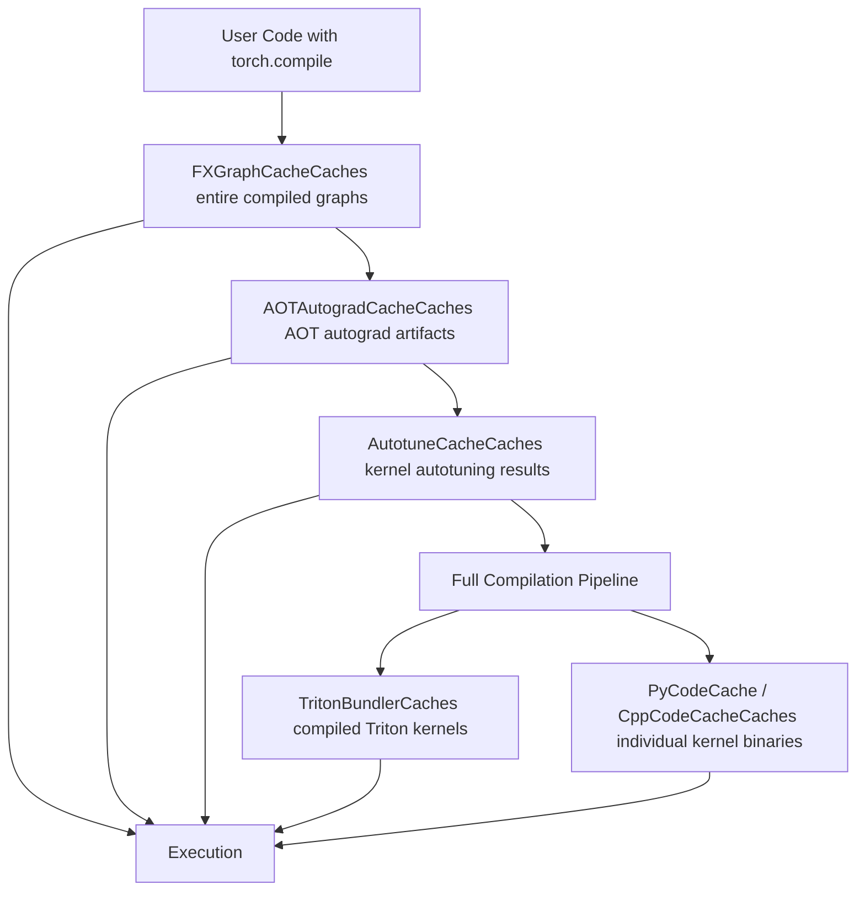
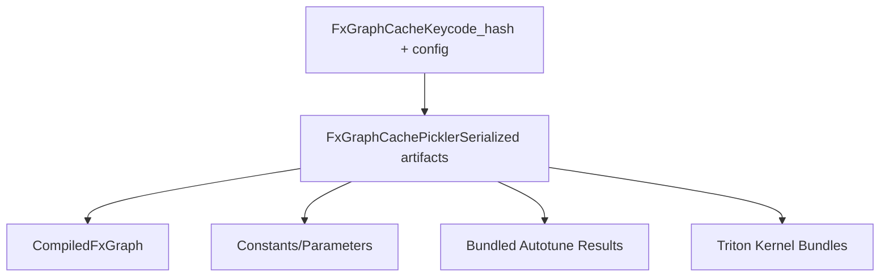
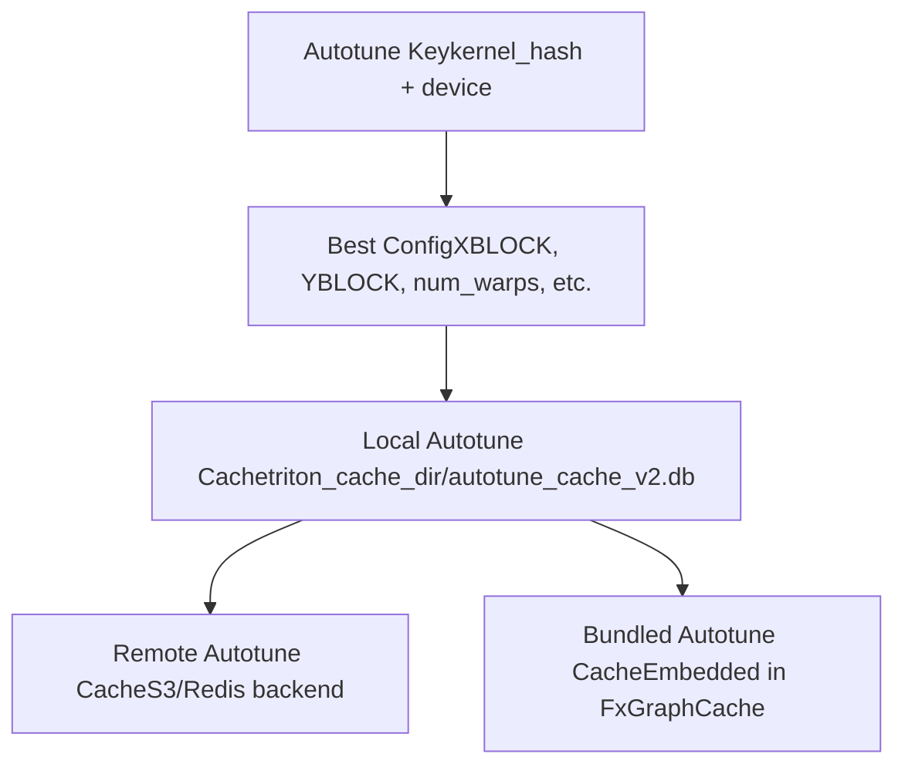
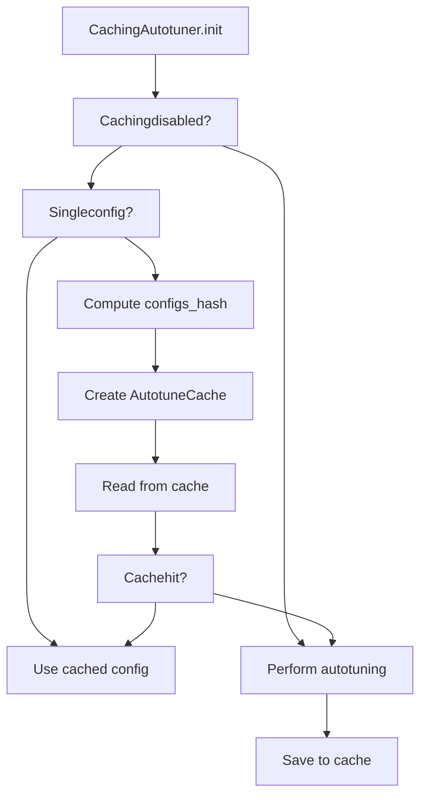
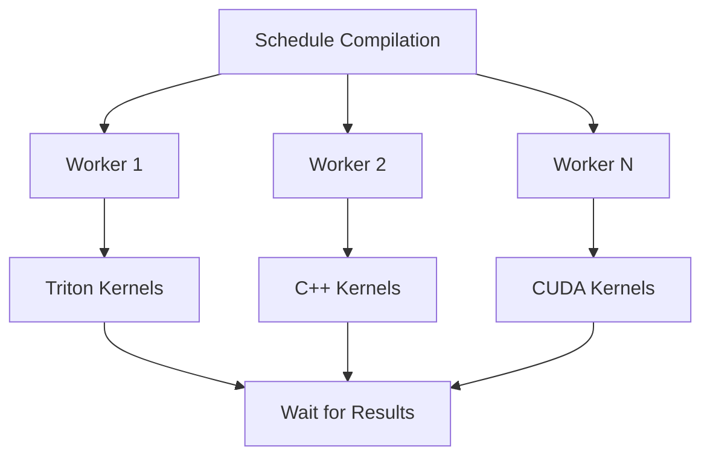
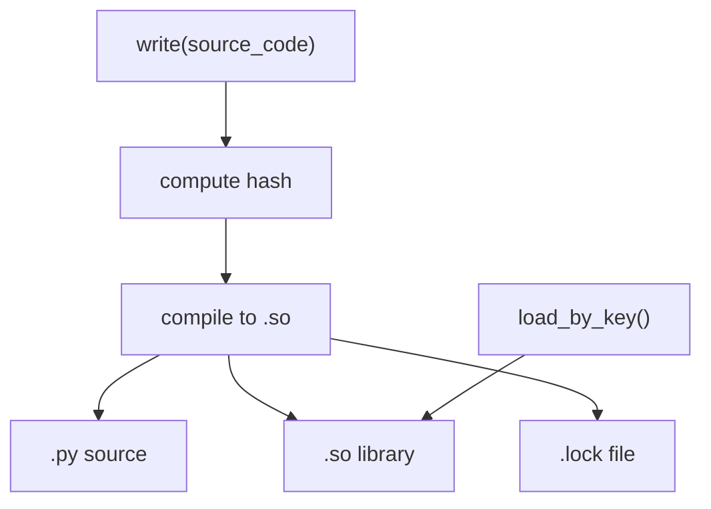
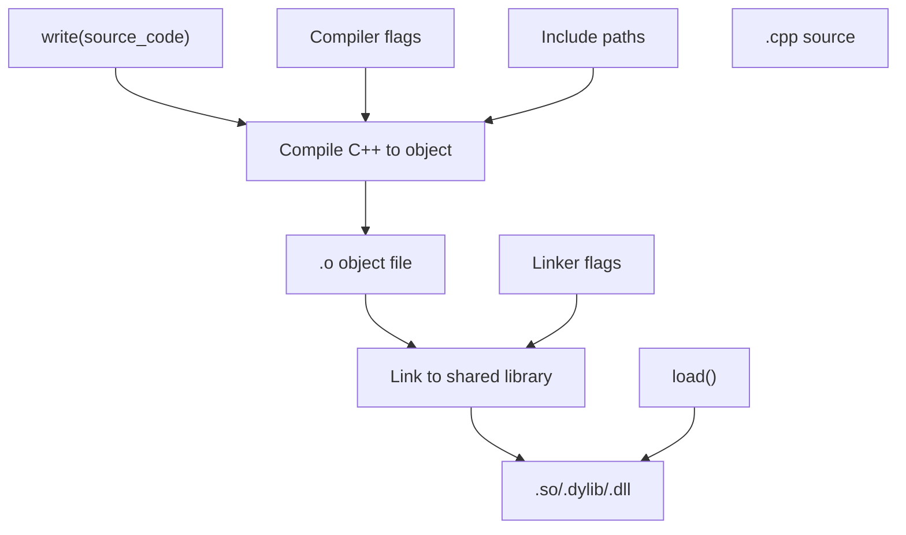
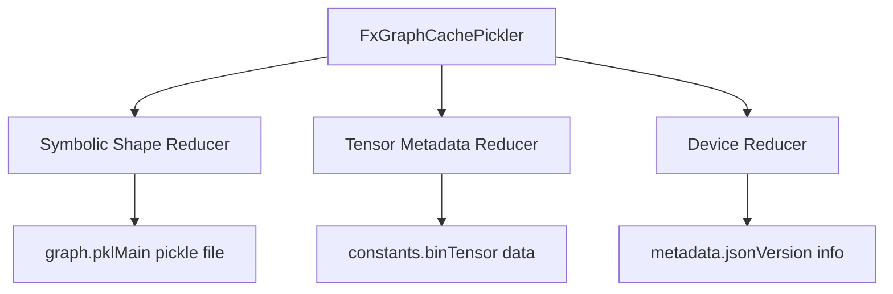
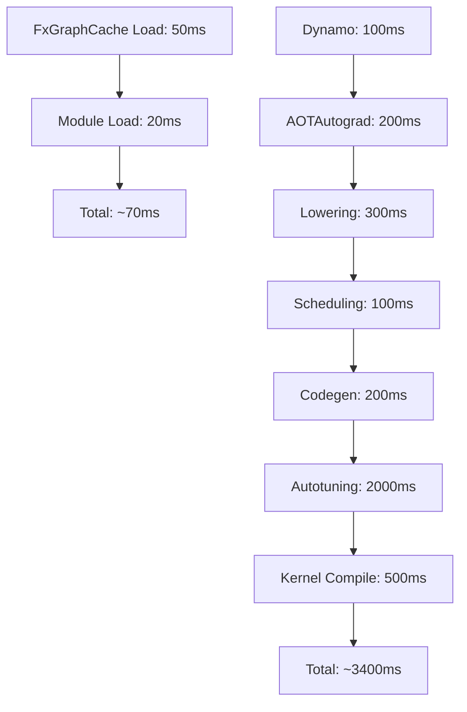

# Code Cache and Compilation

Relevant source files

-   [.ci/docker/common/install\_jax.sh](https://github.com/pytorch/pytorch/blob/915982a4/.ci/docker/common/install_jax.sh)
-   [benchmarks/inductor\_backends/cutlass.py](https://github.com/pytorch/pytorch/blob/915982a4/benchmarks/inductor_backends/cutlass.py)
-   [test/dynamo/test\_aot\_compile.py](https://github.com/pytorch/pytorch/blob/915982a4/test/dynamo/test_aot_compile.py)
-   [test/dynamo/test\_package.py](https://github.com/pytorch/pytorch/blob/915982a4/test/dynamo/test_package.py)
-   [test/dynamo/test\_pgo.py](https://github.com/pytorch/pytorch/blob/915982a4/test/dynamo/test_pgo.py)
-   [test/dynamo/test\_precompile\_context.py](https://github.com/pytorch/pytorch/blob/915982a4/test/dynamo/test_precompile_context.py)
-   [test/dynamo/test\_structured\_trace.py](https://github.com/pytorch/pytorch/blob/915982a4/test/dynamo/test_structured_trace.py)
-   [test/inductor/test\_auto\_functionalize.py](https://github.com/pytorch/pytorch/blob/915982a4/test/inductor/test_auto_functionalize.py)
-   [test/inductor/test\_cutedsl\_template.py](https://github.com/pytorch/pytorch/blob/915982a4/test/inductor/test_cutedsl_template.py)
-   [test/inductor/test\_cutlass\_backend.py](https://github.com/pytorch/pytorch/blob/915982a4/test/inductor/test_cutlass_backend.py)
-   [test/inductor/test\_cutlass\_evt.py](https://github.com/pytorch/pytorch/blob/915982a4/test/inductor/test_cutlass_evt.py)
-   [test/inductor/test\_pallas.py](https://github.com/pytorch/pytorch/blob/915982a4/test/inductor/test_pallas.py)
-   [test/inductor/test\_provenance\_tracing.py](https://github.com/pytorch/pytorch/blob/915982a4/test/inductor/test_provenance_tracing.py)
-   [torch/\_dynamo/aot\_compile.py](https://github.com/pytorch/pytorch/blob/915982a4/torch/_dynamo/aot_compile.py)
-   [torch/\_dynamo/package.py](https://github.com/pytorch/pytorch/blob/915982a4/torch/_dynamo/package.py)
-   [torch/\_dynamo/pgo.py](https://github.com/pytorch/pytorch/blob/915982a4/torch/_dynamo/pgo.py)
-   [torch/\_dynamo/precompile\_context.py](https://github.com/pytorch/pytorch/blob/915982a4/torch/_dynamo/precompile_context.py)
-   [torch/\_inductor/\_\_init\_\_.py](https://github.com/pytorch/pytorch/blob/915982a4/torch/_inductor/__init__.py)
-   [torch/\_inductor/codecache.py](https://github.com/pytorch/pytorch/blob/915982a4/torch/_inductor/codecache.py)
-   [torch/\_inductor/codegen/cpp\_flex\_attention\_template.py](https://github.com/pytorch/pytorch/blob/915982a4/torch/_inductor/codegen/cpp_flex_attention_template.py)
-   [torch/\_inductor/codegen/cpp\_template\_kernel.py](https://github.com/pytorch/pytorch/blob/915982a4/torch/_inductor/codegen/cpp_template_kernel.py)
-   [torch/\_inductor/codegen/cutedsl/README.md](https://github.com/pytorch/pytorch/blob/915982a4/torch/_inductor/codegen/cutedsl/README.md)
-   [torch/\_inductor/codegen/cutedsl/\_\_init\_\_.py](https://github.com/pytorch/pytorch/blob/915982a4/torch/_inductor/codegen/cutedsl/__init__.py)
-   [torch/\_inductor/codegen/cutedsl/cutedsl\_op\_overrides.py](https://github.com/pytorch/pytorch/blob/915982a4/torch/_inductor/codegen/cutedsl/cutedsl_op_overrides.py)
-   [torch/\_inductor/codegen/cutedsl/cutedsl\_template.py](https://github.com/pytorch/pytorch/blob/915982a4/torch/_inductor/codegen/cutedsl/cutedsl_template.py)
-   [torch/\_inductor/codegen/pallas.py](https://github.com/pytorch/pytorch/blob/915982a4/torch/_inductor/codegen/pallas.py)
-   [torch/\_inductor/compile\_fx.py](https://github.com/pytorch/pytorch/blob/915982a4/torch/_inductor/compile_fx.py)
-   [torch/\_inductor/debug.py](https://github.com/pytorch/pytorch/blob/915982a4/torch/_inductor/debug.py)
-   [torch/\_inductor/runtime/runtime\_utils.py](https://github.com/pytorch/pytorch/blob/915982a4/torch/_inductor/runtime/runtime_utils.py)
-   [torch/compiler/\_\_init\_\_.py](https://github.com/pytorch/pytorch/blob/915982a4/torch/compiler/__init__.py)
-   [torch/compiler/\_cache.py](https://github.com/pytorch/pytorch/blob/915982a4/torch/compiler/_cache.py)
-   [torch/compiler/config.py](https://github.com/pytorch/pytorch/blob/915982a4/torch/compiler/config.py)
-   [torch/testing/\_internal/inductor\_utils.py](https://github.com/pytorch/pytorch/blob/915982a4/torch/testing/_internal/inductor_utils.py)
-   [torch/utils/\_pallas.py](https://github.com/pytorch/pytorch/blob/915982a4/torch/utils/_pallas.py)

This document describes the multi-level caching infrastructure and asynchronous compilation system in TorchInductor. These systems cache compiled artifacts at various stages to avoid redundant compilation work and improve cold start times.

For information about the broader Inductor backend architecture, see [TorchInductor Backend](/pytorch/pytorch/2.4-aot-autograd-and-functionalization). For kernel selection and autotuning specifics, see [Kernel Selection and Autotuning](#2.4.3).

## Overview of Caching Layers

TorchInductor employs a multi-tier caching strategy to minimize compilation overhead:


**Sources:** [torch/\_inductor/codecache.py1-200](https://github.com/pytorch/pytorch/blob/915982a4/torch/_inductor/codecache.py#L1-L200) [torch/\_inductor/compile\_fx.py1-100](https://github.com/pytorch/pytorch/blob/915982a4/torch/_inductor/compile_fx.py#L1-L100)

## FXGraphCache: Graph-Level Caching

The `FxGraphCache` is the top-level cache that stores entire compiled graphs, avoiding the need to recompile graphs that have been seen before.

### Cache Structure


### Key Generation

The cache key is computed from:

-   FX graph code hash (bytecode-level representation)
-   Guard conditions and dynamic shape constraints
-   Configuration flags affecting compilation
-   Device properties and capabilities

[torch/\_inductor/codecache.py2600-2750](https://github.com/pytorch/pytorch/blob/915982a4/torch/_inductor/codecache.py#L2600-L2750) shows the `FxGraphCachePickler` class that handles serialization of cache entries. The key generation logic is in `FxGraphCache._get_cache_key()` and includes:

| Component | Description | Purpose |
| --- | --- | --- |
| Code Hash | Hash of FX graph bytecode | Identifies unique graph structure |
| Guards | Dynamic shape guards | Ensures correctness for symbolic shapes |
| Config Hash | Compilation configuration | Invalidates on config changes |
| Device Props | GPU/CPU properties | Handles device-specific compilation |
| ABI Version | PyTorch ABI version | Invalidates on PyTorch version changes |

**Sources:** [torch/\_inductor/codecache.py2200-2400](https://github.com/pytorch/pytorch/blob/915982a4/torch/_inductor/codecache.py#L2200-L2400) [torch/\_inductor/compile\_fx.py400-600](https://github.com/pytorch/pytorch/blob/915982a4/torch/_inductor/compile_fx.py#L400-L600)

### Cache Lookup Flow

> **[Mermaid sequence]**
> *(图表结构无法解析)*

The `FxGraphCache` supports both local and remote caching. Configuration flags control this behavior:

-   `config.fx_graph_cache`: Enable local caching
-   `config.fx_graph_remote_cache`: Enable remote caching
-   `config.bundle_triton_into_fx_graph_cache`: Include Triton kernels in cache

**Sources:** [torch/\_inductor/codecache.py2400-2600](https://github.com/pytorch/pytorch/blob/915982a4/torch/_inductor/codecache.py#L2400-L2600) [torch/\_inductor/compile\_fx.py800-1000](https://github.com/pytorch/pytorch/blob/915982a4/torch/_inductor/compile_fx.py#L800-L1000)

## Autotune Cache

The autotune cache stores the best kernel configurations found during autotuning, avoiding the need to re-benchmark kernels.

### AutotuneCache Structure


### Autotune Cache Checking

The `check_autotune_cache` function in [torch/\_inductor/runtime/triton\_heuristics.py257-304](https://github.com/pytorch/pytorch/blob/915982a4/torch/_inductor/runtime/triton_heuristics.py#L257-L304) determines whether to use cached configurations or perform autotuning:


The `CachingAutotuner` class integrates with the cache system:

-   **Precompilation**: Compiles all candidate configs upfront
-   **Benchmarking**: Measures performance for each config
-   **Caching**: Stores the best config for reuse
-   **Coordinate Descent Tuning**: Optional iterative refinement

**Sources:** [torch/\_inductor/runtime/triton\_heuristics.py306-450](https://github.com/pytorch/pytorch/blob/915982a4/torch/_inductor/runtime/triton_heuristics.py#L306-L450) [torch/\_inductor/select\_algorithm.py1-100](https://github.com/pytorch/pytorch/blob/915982a4/torch/_inductor/select_algorithm.py#L1-L100)

## Triton Bundler: Kernel Artifact Caching

The `TritonBundler` manages Triton kernel compilation artifacts to enable fast loading without recompilation.

### Bundler Architecture

The `TritonBundler` class [torch/\_inductor/triton\_bundler.py1-200](https://github.com/pytorch/pytorch/blob/915982a4/torch/_inductor/triton_bundler.py#L1-L200) provides:

**Key Methods:**

| Method | Purpose |
| --- | --- |
| `put(key, device)` | Store kernel for later bundling |
| `get_stored_bundle()` | Retrieve bundled kernels |
| `put_static_autotuner()` | Cache autotuner instances |
| `get_static_autotuner()` | Load cached autotuner |

When `config.bundle_triton_into_fx_graph_cache` is enabled, Triton kernels are embedded directly into the FxGraphCache, eliminating separate Triton cache lookups.

**Sources:** [torch/\_inductor/triton\_bundler.py1-200](https://github.com/pytorch/pytorch/blob/915982a4/torch/_inductor/triton_bundler.py#L1-L200) [torch/\_inductor/codecache.py2600-2700](https://github.com/pytorch/pytorch/blob/915982a4/torch/_inductor/codecache.py#L2600-L2700)

## AsyncCompile: Parallel Compilation Infrastructure

The `AsyncCompile` system enables parallel compilation of multiple kernels to reduce wall-clock compilation time.

### Compilation Pipeline


### AsyncCompile Implementation

The `AsyncCompile` class [torch/\_inductor/codecache.py500-700](https://github.com/pytorch/pytorch/blob/915982a4/torch/_inductor/codecache.py#L500-L700) manages a thread pool for parallel compilation:

> **[Mermaid sequence]**
> *(图表结构无法解析)*

**Key Features:**

-   **Parallel Compilation**: Multiple kernels compile simultaneously
-   **Cache Integration**: Results written atomically to cache
-   **Error Handling**: Failed compilations logged and retried
-   **Warm Cache Support**: Fast path for cache hits

Configuration:

-   `config.compile_threads`: Number of worker threads (default: CPU count)
-   Worker pool initialized lazily on first use
-   Subprocess pool for Triton autotuning when `config.autotune_in_subproc` enabled

**Sources:** [torch/\_inductor/codecache.py500-800](https://github.com/pytorch/pytorch/blob/915982a4/torch/_inductor/codecache.py#L500-L800) [torch/\_inductor/async\_compile.py1-200](https://github.com/pytorch/pytorch/blob/915982a4/torch/_inductor/async_compile.py#L1-L200)

## Code Cache Implementations

TorchInductor provides specialized cache implementations for different code types.

### PyCodeCache

Caches Python-generated kernels (primarily Triton):


**Location:** `torch_compile/[hash].py` and `torch_compile/[hash].so`

**Key Methods:**

-   `write(source_code, extra)`: Compile and cache Python code
-   `load_by_key(key)`: Load cached module
-   `get_hash(source_code)`: Compute cache key

**Sources:** [torch/\_inductor/codecache.py1500-1700](https://github.com/pytorch/pytorch/blob/915982a4/torch/_inductor/codecache.py#L1500-L1700)

### CppCodeCache

Caches C++ kernels for CPU and GPU:


**Location:** `torch_compile/[hash].cpp` and `torch_compile/[hash].so`

**Specializations:**

-   `CUDACodeCache`: CUDA kernels (nvcc compilation)
-   `ROCmCodeCache`: ROCm kernels (hipcc compilation)
-   `CppWrapperCodeCache`: C++ wrappers for Python-free execution

**Sources:** [torch/\_inductor/codecache.py1800-2200](https://github.com/pytorch/pytorch/blob/915982a4/torch/_inductor/codecache.py#L1800-L2200) [torch/\_inductor/cpp\_builder.py1-500](https://github.com/pytorch/pytorch/blob/915982a4/torch/_inductor/cpp_builder.py#L1-L500)

## Cache Key Generation

Cache keys must be stable and comprehensive to ensure correctness while maximizing hit rates.

### Key Components


### Hash Computation

The `code_hash` function [torch/\_inductor/codecache.py100-200](https://github.com/pytorch/pytorch/blob/915982a4/torch/_inductor/codecache.py#L100-L200) computes stable hashes:

```
# Simplified version from codecache.pydef code_hash(code: str, extra: str = "") -> str:    """    Compute hash for cache key.    Includes normalization for cross-platform stability.    """    # Normalize whitespace, comments    normalized = normalize_code(code)        # Combine with extra metadata    combined = normalized + extra        # SHA256 hash    return hashlib.sha256(combined.encode()).hexdigest()
```
**Hash Inputs:**

For FXGraphCache:

-   FX graph structure and operations
-   Input shapes/dtypes (concrete or symbolic)
-   Guard conditions
-   Config flags: `config.max_autotune`, `config.triton.*`, etc.
-   Device capabilities: SM version, max threads, etc.

For AutotuneCache:

-   Kernel source code
-   Candidate configuration space
-   Device properties
-   Input size hints

**Sources:** [torch/\_inductor/codecache.py100-300](https://github.com/pytorch/pytorch/blob/915982a4/torch/_inductor/codecache.py#L100-L300) [torch/\_inductor/runtime/triton\_heuristics.py100-200](https://github.com/pytorch/pytorch/blob/915982a4/torch/_inductor/runtime/triton_heuristics.py#L100-L200)

## Cache Management and Invalidation

Proper cache management ensures correctness and prevents unbounded growth.

### Cache Directory Structure

```
$TORCH_CACHE_DIR/inductor_cache/
├── fx_graph_cache_v1/
│   ├── [hash]_py.pkl          # Pickled FxGraph artifacts
│   └── [hash]_constants.bin   # Serialized constants
├── autotune_cache_v2.db        # SQLite autotune cache
├── triton_cache/               # Triton kernel cache
│   ├── [hash].so
│   └── [hash].json
└── torch_compile/              # PyCodeCache
    ├── [hash].py
    └── [hash].so
```
### Invalidation Triggers

| Trigger | Scope | Behavior |
| --- | --- | --- |
| PyTorch Version Change | All caches | Full invalidation via ABI version check |
| Config Change | FxGraphCache | New cache key generated |
| Device Change | Device-specific | Separate cache entries per device |
| Guard Failure | FxGraphCache | Runtime guard check triggers recompile |
| Manual Clear | All caches | `torch._inductor.codecache.clear_cache()` |

### Cache Size Management

The cache implements LRU-like behavior:

-   Old entries cleaned periodically based on access time
-   Configurable via `config.cache_size_limit`
-   Per-device quotas to prevent one device from dominating

**Sources:** [torch/\_inductor/codecache.py200-400](https://github.com/pytorch/pytorch/blob/915982a4/torch/_inductor/codecache.py#L200-L400) [torch/\_inductor/runtime/runtime\_utils.py50-150](https://github.com/pytorch/pytorch/blob/915982a4/torch/_inductor/runtime/runtime_utils.py#L50-L150)

## Integration with Compilation Pipeline

The caching system integrates at multiple points in the compilation flow.

### Compilation with Caching

> **[Mermaid sequence]**
> *(图表结构无法解析)*

### Warm Cache Optimization

For deployment scenarios, caches can be pre-warmed:

1.  **AOT Cache Generation**: Compile with representative inputs, save cache
2.  **Cache Distribution**: Package cache with model artifacts
3.  **Fast Startup**: First run loads from cache, no compilation

Configuration:

-   `config.fx_graph_cache = True`: Enable local cache
-   `config.fx_graph_remote_cache`: Use remote cache service
-   `config.bundle_triton_into_fx_graph_cache`: Include all Triton artifacts

**Sources:** [torch/\_inductor/compile\_fx.py200-400](https://github.com/pytorch/pytorch/blob/915982a4/torch/_inductor/compile_fx.py#L200-L400) [torch/\_inductor/codecache.py2600-2800](https://github.com/pytorch/pytorch/blob/915982a4/torch/_inductor/codecache.py#L2600-L2800)

## Cache Serialization

The cache uses multiple serialization formats optimized for different content types.

### FxGraphCache Serialization


The `FxGraphCachePickler` [torch/\_inductor/codecache.py2600-2750](https://github.com/pytorch/pytorch/blob/915982a4/torch/_inductor/codecache.py#L2600-L2750) handles special types:

-   **SymInt/SymFloat**: Serializes symbolic expressions
-   **FakeTensor**: Stores metadata without data
-   **torch.device**: Converts to serializable format
-   **Code Objects**: Handles function references

**Key Features:**

-   **Deterministic**: Same graph produces same pickle
-   **Compact**: Tensors stored separately in binary format
-   **Version-aware**: Includes PyTorch version for invalidation

**Sources:** [torch/\_inductor/codecache.py2600-2900](https://github.com/pytorch/pytorch/blob/915982a4/torch/_inductor/codecache.py#L2600-L2900)

## Performance Characteristics

Understanding cache performance helps optimize compilation times.

### Cache Hit Rates

Typical hit rates by cache level:

| Cache Level | Cold Start | Warm Cache | Production |
| --- | --- | --- | --- |
| FxGraphCache | 0% | 90-95% | 95-99% |
| AutotuneCache | 0-10% | 80-90% | 85-95% |
| PyCodeCache | 10-20% | 95-99% | 99%+ |

**Measurement:**

-   `torch._dynamo.utils.counters` tracks cache hits/misses
-   Logged at TORCH\_LOGS="+inductor" level

### Compilation Time Breakdown

With effective caching:


**Optimization Strategies:**

-   Pre-warm cache for production deployment
-   Use remote cache for distributed teams
-   Bundle Triton kernels in FxGraphCache for single load
-   Enable `config.autotune_in_subproc` for parallel autotuning

**Sources:** [torch/\_inductor/compile\_fx.py1-100](https://github.com/pytorch/pytorch/blob/915982a4/torch/_inductor/compile_fx.py#L1-L100) [torch/\_inductor/metrics.py1-200](https://github.com/pytorch/pytorch/blob/915982a4/torch/_inductor/metrics.py#L1-L200)
