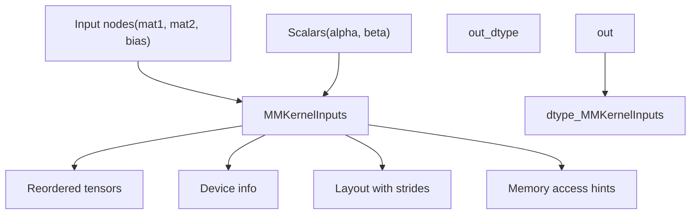
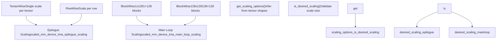
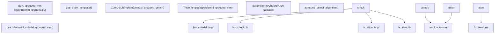
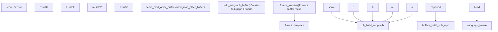
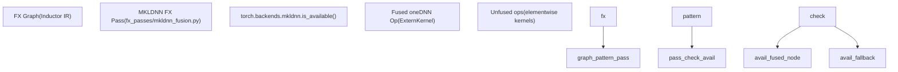

# Specialized Kernel Implementations

Relevant source files

-   [.ci/pytorch/macos-build.sh](https://github.com/pytorch/pytorch/blob/915982a4/.ci/pytorch/macos-build.sh)
-   [.ci/pytorch/macos-common.sh](https://github.com/pytorch/pytorch/blob/915982a4/.ci/pytorch/macos-common.sh)
-   [.ci/pytorch/macos-test.sh](https://github.com/pytorch/pytorch/blob/915982a4/.ci/pytorch/macos-test.sh)
-   [.gitignore](https://github.com/pytorch/pytorch/blob/915982a4/.gitignore)
-   [BUILD.bazel](https://github.com/pytorch/pytorch/blob/915982a4/BUILD.bazel)
-   [CMakeLists.txt](https://github.com/pytorch/pytorch/blob/915982a4/CMakeLists.txt)
-   [aten/src/ATen/native/cuda/int8mm.cu](https://github.com/pytorch/pytorch/blob/915982a4/aten/src/ATen/native/cuda/int8mm.cu)
-   [buckbuild.bzl](https://github.com/pytorch/pytorch/blob/915982a4/buckbuild.bzl)
-   [c10/core/impl/alloc\_cpu.cpp](https://github.com/pytorch/pytorch/blob/915982a4/c10/core/impl/alloc_cpu.cpp)
-   [c10/ovrsource\_defs.bzl](https://github.com/pytorch/pytorch/blob/915982a4/c10/ovrsource_defs.bzl)
-   [cmake/Dependencies.cmake](https://github.com/pytorch/pytorch/blob/915982a4/cmake/Dependencies.cmake)
-   [cmake/Summary.cmake](https://github.com/pytorch/pytorch/blob/915982a4/cmake/Summary.cmake)
-   [cmake/public/cuda.cmake](https://github.com/pytorch/pytorch/blob/915982a4/cmake/public/cuda.cmake)
-   [docs/source/nn.attention.flex\_attention.md](https://github.com/pytorch/pytorch/blob/915982a4/docs/source/nn.attention.flex_attention.md)
-   [setup.py](https://github.com/pytorch/pytorch/blob/915982a4/setup.py)
-   [test/higher\_order\_ops/test\_local\_map.py](https://github.com/pytorch/pytorch/blob/915982a4/test/higher_order_ops/test_local_map.py)
-   [test/inductor/test\_cpu\_cpp\_wrapper.py](https://github.com/pytorch/pytorch/blob/915982a4/test/inductor/test_cpu_cpp_wrapper.py)
-   [test/inductor/test\_cpu\_select\_algorithm.py](https://github.com/pytorch/pytorch/blob/915982a4/test/inductor/test_cpu_select_algorithm.py)
-   [test/inductor/test\_custom\_lowering.py](https://github.com/pytorch/pytorch/blob/915982a4/test/inductor/test_custom_lowering.py)
-   [test/inductor/test\_cutedsl\_grouped\_mm.py](https://github.com/pytorch/pytorch/blob/915982a4/test/inductor/test_cutedsl_grouped_mm.py)
-   [test/inductor/test\_distributed\_patterns.py](https://github.com/pytorch/pytorch/blob/915982a4/test/inductor/test_distributed_patterns.py)
-   [test/inductor/test\_flex\_attention.py](https://github.com/pytorch/pytorch/blob/915982a4/test/inductor/test_flex_attention.py)
-   [test/inductor/test\_flex\_flash.py](https://github.com/pytorch/pytorch/blob/915982a4/test/inductor/test_flex_flash.py)
-   [test/inductor/test\_gpu\_cpp\_wrapper.py](https://github.com/pytorch/pytorch/blob/915982a4/test/inductor/test_gpu_cpp_wrapper.py)
-   [test/inductor/test\_gpu\_select\_algorithm.py](https://github.com/pytorch/pytorch/blob/915982a4/test/inductor/test_gpu_select_algorithm.py)
-   [test/inductor/test\_mem\_estimation.py](https://github.com/pytorch/pytorch/blob/915982a4/test/inductor/test_mem_estimation.py)
-   [test/inductor/test\_minifier.py](https://github.com/pytorch/pytorch/blob/915982a4/test/inductor/test_minifier.py)
-   [test/inductor/test\_mkldnn\_pattern\_matcher.py](https://github.com/pytorch/pytorch/blob/915982a4/test/inductor/test_mkldnn_pattern_matcher.py)
-   [test/inductor/test\_move\_constructors\_to\_gpu.py](https://github.com/pytorch/pytorch/blob/915982a4/test/inductor/test_move_constructors_to_gpu.py)
-   [test/inductor/test\_select\_algorithm.py](https://github.com/pytorch/pytorch/blob/915982a4/test/inductor/test_select_algorithm.py)
-   [test/inductor/test\_torchinductor\_opinfo.py](https://github.com/pytorch/pytorch/blob/915982a4/test/inductor/test_torchinductor_opinfo.py)
-   [test/inductor/test\_torchinductor\_strided\_blocks.py](https://github.com/pytorch/pytorch/blob/915982a4/test/inductor/test_torchinductor_strided_blocks.py)
-   [test/inductor/test\_triton\_kernels.py](https://github.com/pytorch/pytorch/blob/915982a4/test/inductor/test_triton_kernels.py)
-   [test/test\_nestedtensor.py](https://github.com/pytorch/pytorch/blob/915982a4/test/test_nestedtensor.py)
-   [torch/CMakeLists.txt](https://github.com/pytorch/pytorch/blob/915982a4/torch/CMakeLists.txt)
-   [torch/\_higher\_order\_ops/flex\_attention.py](https://github.com/pytorch/pytorch/blob/915982a4/torch/_higher_order_ops/flex_attention.py)
-   [torch/\_higher\_order\_ops/local\_map.py](https://github.com/pytorch/pytorch/blob/915982a4/torch/_higher_order_ops/local_map.py)
-   [torch/\_higher\_order\_ops/triton\_kernel\_wrap.py](https://github.com/pytorch/pytorch/blob/915982a4/torch/_higher_order_ops/triton_kernel_wrap.py)
-   [torch/\_inductor/codegen/cutedsl/\_cutedsl\_utils.py](https://github.com/pytorch/pytorch/blob/915982a4/torch/_inductor/codegen/cutedsl/_cutedsl_utils.py)
-   [torch/\_inductor/codegen/cutedsl/cutedsl\_kernel.py](https://github.com/pytorch/pytorch/blob/915982a4/torch/_inductor/codegen/cutedsl/cutedsl_kernel.py)
-   [torch/\_inductor/fx\_passes/mkldnn\_fusion.py](https://github.com/pytorch/pytorch/blob/915982a4/torch/_inductor/fx_passes/mkldnn_fusion.py)
-   [torch/\_inductor/fx\_passes/quantization.py](https://github.com/pytorch/pytorch/blob/915982a4/torch/_inductor/fx_passes/quantization.py)
-   [torch/\_inductor/jagged\_lowerings.py](https://github.com/pytorch/pytorch/blob/915982a4/torch/_inductor/jagged_lowerings.py)
-   [torch/\_inductor/kernel/flex/common.py](https://github.com/pytorch/pytorch/blob/915982a4/torch/_inductor/kernel/flex/common.py)
-   [torch/\_inductor/kernel/flex/flex\_attention.py](https://github.com/pytorch/pytorch/blob/915982a4/torch/_inductor/kernel/flex/flex_attention.py)
-   [torch/\_inductor/kernel/flex/flex\_cpu.py](https://github.com/pytorch/pytorch/blob/915982a4/torch/_inductor/kernel/flex/flex_cpu.py)
-   [torch/\_inductor/kernel/flex/flex\_decoding.py](https://github.com/pytorch/pytorch/blob/915982a4/torch/_inductor/kernel/flex/flex_decoding.py)
-   [torch/\_inductor/kernel/flex/flex\_flash\_attention.py](https://github.com/pytorch/pytorch/blob/915982a4/torch/_inductor/kernel/flex/flex_flash_attention.py)
-   [torch/\_inductor/kernel/flex/templates/common.py.jinja](https://github.com/pytorch/pytorch/blob/915982a4/torch/_inductor/kernel/flex/templates/common.py.jinja)
-   [torch/\_inductor/kernel/flex/templates/flash\_attention.py.jinja](https://github.com/pytorch/pytorch/blob/915982a4/torch/_inductor/kernel/flex/templates/flash_attention.py.jinja)
-   [torch/\_inductor/kernel/flex/templates/flash\_attention\_backward.py.jinja](https://github.com/pytorch/pytorch/blob/915982a4/torch/_inductor/kernel/flex/templates/flash_attention_backward.py.jinja)
-   [torch/\_inductor/kernel/flex/templates/flex\_attention.py.jinja](https://github.com/pytorch/pytorch/blob/915982a4/torch/_inductor/kernel/flex/templates/flex_attention.py.jinja)
-   [torch/\_inductor/kernel/flex/templates/flex\_backwards.py.jinja](https://github.com/pytorch/pytorch/blob/915982a4/torch/_inductor/kernel/flex/templates/flex_backwards.py.jinja)
-   [torch/\_inductor/kernel/flex/templates/flex\_decode.py.jinja](https://github.com/pytorch/pytorch/blob/915982a4/torch/_inductor/kernel/flex/templates/flex_decode.py.jinja)
-   [torch/\_inductor/kernel/flex/templates/utilities.py.jinja](https://github.com/pytorch/pytorch/blob/915982a4/torch/_inductor/kernel/flex/templates/utilities.py.jinja)
-   [torch/\_inductor/kernel/mm\_common.py](https://github.com/pytorch/pytorch/blob/915982a4/torch/_inductor/kernel/mm_common.py)
-   [torch/\_inductor/kernel/mm\_grouped.py](https://github.com/pytorch/pytorch/blob/915982a4/torch/_inductor/kernel/mm_grouped.py)
-   [torch/\_inductor/kernel/templates/cutedsl\_mm\_grouped.py.jinja](https://github.com/pytorch/pytorch/blob/915982a4/torch/_inductor/kernel/templates/cutedsl_mm_grouped.py.jinja)
-   [torch/\_inductor/mkldnn\_ir.py](https://github.com/pytorch/pytorch/blob/915982a4/torch/_inductor/mkldnn_ir.py)
-   [torch/\_inductor/mkldnn\_lowerings.py](https://github.com/pytorch/pytorch/blob/915982a4/torch/_inductor/mkldnn_lowerings.py)
-   [torch/\_inductor/subgraph\_lowering.py](https://github.com/pytorch/pytorch/blob/915982a4/torch/_inductor/subgraph_lowering.py)
-   [torch/\_inductor/template\_heuristics/cutedsl.py](https://github.com/pytorch/pytorch/blob/915982a4/torch/_inductor/template_heuristics/cutedsl.py)
-   [torch/csrc/jit/serialization/unpickler.h](https://github.com/pytorch/pytorch/blob/915982a4/torch/csrc/jit/serialization/unpickler.h)
-   [torch/distributed/\_\_init\_\_.py](https://github.com/pytorch/pytorch/blob/915982a4/torch/distributed/__init__.py)
-   [torch/distributed/\_shard/sharded\_tensor/reshard.py](https://github.com/pytorch/pytorch/blob/915982a4/torch/distributed/_shard/sharded_tensor/reshard.py)
-   [torch/distributed/\_shard/sharding\_spec/chunk\_sharding\_spec\_ops/embedding\_bag.py](https://github.com/pytorch/pytorch/blob/915982a4/torch/distributed/_shard/sharding_spec/chunk_sharding_spec_ops/embedding_bag.py)
-   [torch/distributed/nn/functional.py](https://github.com/pytorch/pytorch/blob/915982a4/torch/distributed/nn/functional.py)
-   [torch/nested/\_internal/nested\_tensor.py](https://github.com/pytorch/pytorch/blob/915982a4/torch/nested/_internal/nested_tensor.py)
-   [torch/nested/\_internal/ops.py](https://github.com/pytorch/pytorch/blob/915982a4/torch/nested/_internal/ops.py)
-   [torch/nn/attention/\_utils.py](https://github.com/pytorch/pytorch/blob/915982a4/torch/nn/attention/_utils.py)
-   [torch/nn/attention/flex\_attention.py](https://github.com/pytorch/pytorch/blob/915982a4/torch/nn/attention/flex_attention.py)

This document describes TorchInductor's specialized kernel implementations for high-performance operations: standard and grouped matrix multiplications, flexible attention mechanisms, MKLDNN CPU fusion patterns, and quantization passes. These implementations provide optimized backend-specific code generation with autotuning capabilities.

For information about the general kernel selection and autotuning framework, see [Kernel Selection and Autotuning](/pytorch/pytorch/2.5.3-kernel-selection-and-autotuning). For code generation backends (Triton, CUTLASS, C++), see [Code Generation: Triton, CUTLASS, C++](/pytorch/pytorch/2.5.4-code-generation:-triton-cutlass-pallas-c++). For the IR and lowering process that precedes kernel selection, see [Inductor IR and Lowering](/pytorch/pytorch/2.5.1-inductor-ir-and-lowering).

## Matrix Multiplication Kernel Family

TorchInductor provides specialized lowering functions for various matrix multiplication operations, each supporting multiple backend implementations through template-based code generation.

### Core MM Operations

The `tuned_mm` function [torch/\_inductor/kernel/mm.py304-549](https://github.com/pytorch/pytorch/blob/915982a4/torch/_inductor/kernel/mm.py#L304-L549) handles `aten.mm` lowering with support for multiple backends:


Sources: [torch/\_inductor/kernel/mm.py304-549](https://github.com/pytorch/pytorch/blob/915982a4/torch/_inductor/kernel/mm.py#L304-L549) [torch/\_inductor/kernel/mm.py84-121](https://github.com/pytorch/pytorch/blob/915982a4/torch/_inductor/kernel/mm.py#L84-L121) [torch/\_inductor/kernel/bmm.py53-58](https://github.com/pytorch/pytorch/blob/915982a4/torch/_inductor/kernel/bmm.py#L53-L58)

**Key kernel variants:**

| Operation | Function | Template | Special Features |
| --- | --- | --- | --- |
| Standard MM | `tuned_mm` | `mm_template` | Basic matrix multiply |
| Batch MM | `tuned_bmm` | `bmm_template` | Batched operations |
| AddMM | `tuned_addmm` | `mm_template` | Bias fusion (C = αAB + βC) |
| Int8 MM | `tuned_int_mm` | `mm_template` | Integer operations |
| Scaled MM | `tuned_scaled_mm` | `scaled_mm_*_template` | FP8 scaling support |
| Sparse MM | `tuned_sparse_semi_structured_mm` | CUTLASS | 2:4 sparsity |

Sources: [torch/\_inductor/kernel/mm.py304-549](https://github.com/pytorch/pytorch/blob/915982a4/torch/_inductor/kernel/mm.py#L304-L549) [torch/\_inductor/kernel/mm.py552-598](https://github.com/pytorch/pytorch/blob/915982a4/torch/_inductor/kernel/mm.py#L552-L598) [torch/\_inductor/kernel/mm.py601-716](https://github.com/pytorch/pytorch/blob/915982a4/torch/_inductor/kernel/mm.py#L601-L716) [torch/\_inductor/kernel/mm.py860-1017](https://github.com/pytorch/pytorch/blob/915982a4/torch/_inductor/kernel/mm.py#L860-L1017) [torch/\_inductor/kernel/bmm.py72-228](https://github.com/pytorch/pytorch/blob/915982a4/torch/_inductor/kernel/bmm.py#L72-L228)

### Triton Templates

The main Triton templates are defined with grid functions and source code:

```
# Standard MM templatemm_template = TritonTemplate(    name="mm",    grid=mm_grid,    source=load_kernel_template("triton_mm"),    cache_codegen_enabled_for_template=True,    prologue_loads_all_inputs=True,) # Persistent TMA template (Hopper+ GPUs)persistent_tma_mm_template = TritonTemplate(    name="mm_persistent_tma",    grid=persistent_mm_grid,    source=load_kernel_template("triton_persistent_tma_mm"),) # Blackwell-optimized templateblackwell_ws_persistent_device_tma_mm_template = TritonTemplate(    name="blackwell_ws_persistent_device_tma",    grid=persistent_mm_grid,    source=load_kernel_template("triton_blackwell_ws_persistent_device_tma_mm"),)
```
Sources: [torch/\_inductor/kernel/mm.py84-121](https://github.com/pytorch/pytorch/blob/915982a4/torch/_inductor/kernel/mm.py#L84-L121) [torch/\_inductor/kernel/mm\_common.py60-96](https://github.com/pytorch/pytorch/blob/915982a4/torch/_inductor/kernel/mm_common.py#L60-L96)

### Kernel Input Handling

All MM operations use the `MMKernelInputs` class [torch/\_inductor/kernel\_inputs.py143-249](https://github.com/pytorch/pytorch/blob/915982a4/torch/_inductor/kernel_inputs.py#L143-L249) to encapsulate inputs:


Sources: [torch/\_inductor/kernel\_inputs.py143-249](https://github.com/pytorch/pytorch/blob/915982a4/torch/_inductor/kernel_inputs.py#L143-L249) [torch/\_inductor/kernel/mm.py376-377](https://github.com/pytorch/pytorch/blob/915982a4/torch/_inductor/kernel/mm.py#L376-L377)

### K-Dimension Decomposition

For large K dimensions, the `decompose_k_subgraph_template` splits the reduction:

```
def decomposeK(a, b, k_splits):    m = a.shape[0]    n = b.shape[1]    k = a.shape[1]        k_parts = k // k_splits    B = k_splits    a_reshaped = torch.permute(a.reshape(m, B, k_parts), (1, 0, 2))    b_reshaped = b.reshape(B, k_parts, n)    result = torch.bmm(a_reshaped, b_reshaped, out_dtype=torch.float32)    reduced_buf = torch.sum(result, 0)    return reduced_buf.to(a.dtype)
```
This is selected via `use_decompose_k_choice(m, n, k)` heuristics [torch/\_inductor/kernel/mm.py411-420](https://github.com/pytorch/pytorch/blob/915982a4/torch/_inductor/kernel/mm.py#L411-L420)

Sources: [torch/\_inductor/kernel/mm.py202-248](https://github.com/pytorch/pytorch/blob/915982a4/torch/_inductor/kernel/mm.py#L202-L248) [torch/\_inductor/kernel/mm.py411-420](https://github.com/pytorch/pytorch/blob/915982a4/torch/_inductor/kernel/mm.py#L411-L420)

### Scaled Matrix Multiplication

The `tuned_scaled_mm` operation [torch/\_inductor/kernel/mm.py860-1017](https://github.com/pytorch/pytorch/blob/915982a4/torch/_inductor/kernel/mm.py#L860-L1017) supports FP8 and block-wise scaling:


Sources: [torch/\_inductor/kernel/mm.py860-1017](https://github.com/pytorch/pytorch/blob/915982a4/torch/_inductor/kernel/mm.py#L860-L1017) [torch/\_inductor/kernel/mm.py768-858](https://github.com/pytorch/pytorch/blob/915982a4/torch/_inductor/kernel/mm.py#L768-L858) [torch/\_inductor/kernel/mm.py810-829](https://github.com/pytorch/pytorch/blob/915982a4/torch/_inductor/kernel/mm.py#L810-L829)

### Grouped Matrix Multiplication

Grouped GEMM is implemented in `torch/_inductor/kernel/mm_grouped.py` and lowers `aten._grouped_mm`. Three backends are available, selected based on hardware capability:

**Grouped MM backend selection diagram:**


Sources: [torch/\_inductor/kernel/mm\_grouped.py1-39](https://github.com/pytorch/pytorch/blob/915982a4/torch/_inductor/kernel/mm_grouped.py#L1-L39)

The CuTeDSL path uses a kernel vendored from CUTLASS. During the build, `mirror_inductor_external_kernels()` in `setup.py` copies `third_party/cutlass/examples/python/CuTeDSL/blackwell/grouped_gemm.py` to `torch/_inductor/kernel/vendored_templates/cutedsl_grouped_gemm.py`. The `CuteDSLTemplate` class from `torch/_inductor/codegen/cutedsl/cutedsl_template.py` wraps this source. For CuTeDSL-specific config tuning, `get_groupgemm_configs()` from `torch/_inductor/template_heuristics/cutedsl.py` provides Blackwell-optimized configurations.

**Config structure** [torch/\_inductor/kernel/mm\_grouped.py43-46](https://github.com/pytorch/pytorch/blob/915982a4/torch/_inductor/kernel/mm_grouped.py#L43-L46):

The `Config` dataclass holds `kwargs: dict[str, int]` (block sizes plus `NUM_CONSUMER_GROUPS`), `num_stages: int`, and `num_warps: int`. The `_NV_CONFIGS` list [torch/\_inductor/kernel/mm\_grouped.py50-66](https://github.com/pytorch/pytorch/blob/915982a4/torch/_inductor/kernel/mm_grouped.py#L50-L66) enumerates the Triton config search space:

| Parameter | Values |
| --- | --- |
| `BLOCK_M` | 16, 32, 64, 128 |
| `BLOCK_N` | 64, 128, 256 |
| `BLOCK_K` | 64, 128, 256 |
| `num_stages` | 3, 4 |
| `num_warps` | 4, 8 |

`grouped_mm_configs()` [torch/\_inductor/kernel/mm\_grouped.py69-70](https://github.com/pytorch/pytorch/blob/915982a4/torch/_inductor/kernel/mm_grouped.py#L69-L70) returns `_NV_CONFIGS`. `early_config_prune` [torch/\_inductor/kernel/mm\_grouped.py73-94](https://github.com/pytorch/pytorch/blob/915982a4/torch/_inductor/kernel/mm_grouped.py#L73-L94) filters configs based on group count `g`, problem size `m`, and data type byte size `dtsize` to prevent shared memory overflows at runtime.

The `use_nv_universal_gemm_template()` utility (from `torch/_inductor/utils.py`) provides an additional template selection path for NVIDIA universal GEMM kernels.

Sources: [torch/\_inductor/kernel/mm\_grouped.py43-94](https://github.com/pytorch/pytorch/blob/915982a4/torch/_inductor/kernel/mm_grouped.py#L43-L94) [setup.py633-671](https://github.com/pytorch/pytorch/blob/915982a4/setup.py#L633-L671)

## Flex Attention Kernels

Flex attention provides a flexible attention mechanism with custom score and mask modifications. It consists of three main kernel implementations optimized for different scenarios.

### Architecture Overview


Sources: [torch/\_inductor/kernel/flex/flex\_attention.py107-299](https://github.com/pytorch/pytorch/blob/915982a4/torch/_inductor/kernel/flex/flex_attention.py#L107-L299) [torch/nn/attention/flex\_attention.py1-100](https://github.com/pytorch/pytorch/blob/915982a4/torch/nn/attention/flex_attention.py#L1-L100) [torch/\_inductor/kernel/flex/flex\_decoding.py39-76](https://github.com/pytorch/pytorch/blob/915982a4/torch/_inductor/kernel/flex/flex_decoding.py#L39-L76)

### Standard Flex Attention

The main flex attention kernel [torch/\_inductor/kernel/flex/flex\_attention.py98-104](https://github.com/pytorch/pytorch/blob/915982a4/torch/_inductor/kernel/flex/flex_attention.py#L98-L104) uses a Triton template:

```
flex_attention_template = TritonTemplate(    name="flex_attention",    grid=flex_attention_grid,    source=load_flex_template("flex_attention")    + load_flex_template("utilities")    + load_flex_template("common"),) @SymbolicGridFndef flex_attention_grid(batch_size, q_heads, num_queries, d_model, meta, *, cdiv):    """Parallelization: (ceil_div(queries, BLOCK_M), batch, heads)"""    return (cdiv(num_queries, meta["BLOCK_M"]), batch_size, q_heads)
```
**Key features:**

-   Supports arbitrary `score_mod` and `mask_mod` functions via subgraph compilation
-   Handles block-sparse patterns via `BlockMask`
-   Outputs attention result plus `logsumexp` and `max_scores` for backward pass
-   Configurable via `FlexKernelOptions` (BLOCK\_M, BLOCK\_N, num\_stages, num\_warps)

Sources: [torch/\_inductor/kernel/flex/flex\_attention.py98-104](https://github.com/pytorch/pytorch/blob/915982a4/torch/_inductor/kernel/flex/flex_attention.py#L98-L104) [torch/\_inductor/kernel/flex/flex\_attention.py73-80](https://github.com/pytorch/pytorch/blob/915982a4/torch/_inductor/kernel/flex/flex_attention.py#L73-L80) [torch/nn/attention/flex\_attention.py75-207](https://github.com/pytorch/pytorch/blob/915982a4/torch/nn/attention/flex_attention.py#L75-L207)

### Flex Decoding (Short Sequences)

When query sequence length is short (< 128), flex decoding [torch/\_inductor/kernel/flex/flex\_decoding.py1-356](https://github.com/pytorch/pytorch/blob/915982a4/torch/_inductor/kernel/flex/flex_decoding.py#L1-L356) provides better performance:

```mermaid
flowchart TD
    short_query["query.size(-2) < 128"]
    static_batch["Static batch dimension"]
    static_heads["Static num_heads dimension"]
    valid_gqa["GQA: single kv_num_blocks per batch/head"]
    non_zero["query.size(-2) > 0"]
    split_kv["Split KV across blocksNUM_KV_SPLIT_GROUP"]
    parallel_reduce["Parallel reductionacross splits"]
    kv_buffer["KV split buffers(batch, heads, splits, head_dim)"]
    grid_decode["flex_decoding_grid:(NUM_KV_SPLIT_GROUP, batch, q_heads)"]

    short --> query_static_batch
    static --> batch_static_heads
    static --> heads_valid_gqa
    valid --> gqa_non_zero
    non --> zero_split_kv
    split --> kv_kv_buffer
    kv --> buffer_parallel_reduce
    parallel --> reduce_grid_decode
```


The number of splits is calculated dynamically [torch/\_inductor/kernel/flex/flex\_decoding.py78-94](https://github.com/pytorch/pytorch/blob/915982a4/torch/_inductor/kernel/flex/flex_decoding.py#L78-L94):

```
def _get_num_kv_split(Bq, Hq):    """Calculate KV split groups based on batch and head dimensions"""    return min(max(Bq * Hq // 4, 1), 64)
```
Sources: [torch/\_inductor/kernel/flex/flex\_decoding.py39-76](https://github.com/pytorch/pytorch/blob/915982a4/torch/_inductor/kernel/flex/flex_decoding.py#L39-L76) [torch/\_inductor/kernel/flex/flex\_decoding.py78-94](https://github.com/pytorch/pytorch/blob/915982a4/torch/_inductor/kernel/flex/flex_decoding.py#L78-L94) [torch/\_inductor/kernel/flex/flex\_decoding.py123-356](https://github.com/pytorch/pytorch/blob/915982a4/torch/_inductor/kernel/flex/flex_decoding.py#L123-L356)

### Flash Attention Integration

For trivial score/mask modifications, Inductor can use Flash Attention 4 via CuteDSL [torch/\_inductor/kernel/flex/flex\_flash\_attention.py1-720](https://github.com/pytorch/pytorch/blob/915982a4/torch/_inductor/kernel/flex/flex_flash_attention.py#L1-L720):

```
def _use_flex_flash_attention(    subgraph, mask_graph, kernel_options, num_score_mod_placeholders, backend):    """Determine if flash attention can be used"""    if not ensure_flash_available():        return False        # Check for trivial graphs    is_trivial_score = is_trivial_score_graph(subgraph, num_score_mod_placeholders)    is_trivial_mask = is_trivial_mask_graph(mask_graph)        # Flash requires both to be trivial    return is_trivial_score and is_trivial_mask
```
Flash attention uses `CuteDSLTemplate` instead of Triton [torch/\_inductor/kernel/flex/flex\_flash\_attention.py42-48](https://github.com/pytorch/pytorch/blob/915982a4/torch/_inductor/kernel/flex/flex_flash_attention.py#L42-L48):

```
flash_attention_cutedsl_template = CuteDSLTemplate(    name="flash_attention_cutedsl",     source=load_flex_template("flash_attention"))flash_attention_backward_cutedsl_template = CuteDSLTemplate(    name="flash_attention_backward_cutedsl",    source=load_flex_template("flash_attention_backward"),)
```
**Hierarchical indexing for CuteDSL:** Flash attention requires structured multi-dimensional indices rather than flattened linear offsets. This is handled via `HierarchicalIndex` [torch/\_inductor/kernel/flex/flex\_flash\_attention.py51-92](https://github.com/pytorch/pytorch/blob/915982a4/torch/_inductor/kernel/flex/flex_flash_attention.py#L51-L92):

```
class HierarchicalIndex(sympy.Function):    """Wrapper to carry N-D index tuples through Inductor's SymPy IR"""        @classmethod    def eval(cls, *args):        return None  # Keep inert, no simplification def _hierarchical_indexer_cute(size, stride=None, offset=Integer(0)):    """Return indexer that preserves multi-dimensional indices"""    def indexer(indices):        if len(indices) == 1:            return indices[0]        return HierarchicalIndex(*indices)    return indexer
```
The patch is applied via context manager [torch/\_inductor/kernel/flex/flex\_flash\_attention.py95-114](https://github.com/pytorch/pytorch/blob/915982a4/torch/_inductor/kernel/flex/flex_flash_attention.py#L95-L114):

```
@contextmanagerdef patch_fixed_layout_indexer_for_cutedsl():    """Temporarily swap FixedLayout.make_indexer for CuteDSL"""    original_make_indexer = FixedLayout.make_indexer    FixedLayout.make_indexer = cutedsl_make_indexer    try:        yield    finally:        FixedLayout.make_indexer = original_make_indexer
```
Sources: [torch/\_inductor/kernel/flex/flex\_flash\_attention.py172-246](https://github.com/pytorch/pytorch/blob/915982a4/torch/_inductor/kernel/flex/flex_flash_attention.py#L172-L246) [torch/\_inductor/kernel/flex/flex\_flash\_attention.py42-48](https://github.com/pytorch/pytorch/blob/915982a4/torch/_inductor/kernel/flex/flex_flash_attention.py#L42-L48) [torch/\_inductor/kernel/flex/flex\_flash\_attention.py51-114](https://github.com/pytorch/pytorch/blob/915982a4/torch/_inductor/kernel/flex/flex_flash_attention.py#L51-L114)

### Subgraph Compilation

Both `score_mod` and `mask_mod` are compiled into subgraphs:


The subgraph is created via `build_subgraph_buffer` [torch/\_inductor/kernel/flex/common.py122-178](https://github.com/pytorch/pytorch/blob/915982a4/torch/_inductor/kernel/flex/common.py#L122-L178) and then frozen with `freeze_irnodes` [torch/\_inductor/kernel/flex/common.py215-224](https://github.com/pytorch/pytorch/blob/915982a4/torch/_inductor/kernel/flex/common.py#L215-L224) to prevent buffer reuse across kernel boundaries.

Sources: [torch/\_inductor/kernel/flex/flex\_attention.py181-208](https://github.com/pytorch/pytorch/blob/915982a4/torch/_inductor/kernel/flex/flex_attention.py#L181-L208) [torch/\_inductor/kernel/flex/common.py122-224](https://github.com/pytorch/pytorch/blob/915982a4/torch/_inductor/kernel/flex/common.py#L122-L224)

### Backward Pass

The backward pass uses a separate template [torch/\_inductor/kernel/flex/templates/flex\_backwards.py.jinja1-300](https://github.com/pytorch/pytorch/blob/915982a4/torch/_inductor/kernel/flex/templates/flex_backwards.py.jinja#L1-L300) with different block sizing:

**Forward config:**

-   `BLOCK_M`: Query block size
-   `BLOCK_N`: Key/Value block size

**Backward config:**

-   `BLOCK_M1`, `BLOCK_N1`: First iteration blocks
-   `BLOCK_M2`, `BLOCK_N2`: Second iteration blocks
-   Constraint: `BLOCK_N1 % BLOCK_M1 == 0` and `BLOCK_M2 % BLOCK_N2 == 0`

Sources: [torch/\_inductor/template\_heuristics/triton.py112-142](https://github.com/pytorch/pytorch/blob/915982a4/torch/_inductor/template_heuristics/triton.py#L112-L142) [torch/\_inductor/kernel/flex/templates/flex\_backwards.py.jinja1-10](https://github.com/pytorch/pytorch/blob/915982a4/torch/_inductor/kernel/flex/templates/flex_backwards.py.jinja#L1-L10)

## Fused Operations

### MM + MM Fusion

The `tuned_mm_plus_mm` operation [torch/\_inductor/kernel/mm\_plus\_mm.py128-181](https://github.com/pytorch/pytorch/blob/915982a4/torch/_inductor/kernel/mm_plus_mm.py#L128-L181) fuses two matrix multiplications:

```
def tuned_mm_plus_mm(mat1, mat2, mat3, mat4, *, layout=None):    """Computes mm(mat1, mat2) + mm(mat3, mat4)"""    # Optimization requires identical matrix shapes and same K    if not V.graph.sizevars.statically_known_list_equals(        mat1.get_size(), mat3.get_size()    ) or not V.graph.sizevars.statically_known_list_equals(        mat2.get_size(), mat4.get_size()    ):        # Fall back to separate operations        return lowerings<FileRef file-url="https://github.com/pytorch/pytorch/blob/915982a4/aten.add" undefined  file-path="aten.add">Hii</FileRef>             lowerings<FileRef file-url="https://github.com/pytorch/pytorch/blob/915982a4/aten.mm" undefined  file-path="aten.mm">Hii</FileRef>        )
```
The fused kernel [torch/\_inductor/kernel/mm\_plus\_mm.py33-124](https://github.com/pytorch/pytorch/blob/915982a4/torch/_inductor/kernel/mm_plus_mm.py#L33-L124) interleaves both matmuls in a single Triton kernel:

```
# Pseudo-code from templatefor k1 in range(K1, 0, -BLOCK_K):    # First matmul: A @ B    a = tl.load(A)    b = tl.load(B)    acc += tl.dot(a, b, allow_tf32=ALLOW_TF32)    A += BLOCK_K * stride_ak    B += BLOCK_K * stride_bk for k2 in range(K1, 0, -BLOCK_K):    # Second matmul: C @ D    c = tl.load(C)    d = tl.load(D)    acc += tl.dot(c, d, allow_tf32=ALLOW_TF32)    C += BLOCK_K * stride_ck    D += BLOCK_K * stride_dk
```
Sources: [torch/\_inductor/kernel/mm\_plus\_mm.py128-181](https://github.com/pytorch/pytorch/blob/915982a4/torch/_inductor/kernel/mm_plus_mm.py#L128-L181) [torch/\_inductor/kernel/mm\_plus\_mm.py33-124](https://github.com/pytorch/pytorch/blob/915982a4/torch/_inductor/kernel/mm_plus_mm.py#L33-L124)

## MKLDNN Fusion Patterns

Inductor applies Intel oneDNN (MKL-DNN) CPU fusion patterns through its FX pass system. These replace subgraphs with fused oneDNN primitives when `torch.backends.mkldnn.is_available()` returns `True`. The test suite is in `test/inductor/test_mkldnn_pattern_matcher.py`.

**Pattern matching flow:**


Sources: [test/inductor/test\_mkldnn\_pattern\_matcher.py1-16](https://github.com/pytorch/pytorch/blob/915982a4/test/inductor/test_mkldnn_pattern_matcher.py#L1-L16)

**Key fusion categories:**

| Pattern | Fused Operations |
| --- | --- |
| Conv + BN | `conv2d` followed by `batch_norm` |
| Conv + ReLU | `conv2d` followed by `relu` |
| Conv + BN + ReLU | Three-op fusion chain |
| Linear + GELU | `linear` followed by `gelu` |
| Linear + ReLU | `linear` followed by `relu` |
| Quantized Conv | int8 `conv2d` with quant/dequant nodes |
| Quantized Linear | int8 `linear` with quant/dequant nodes |

Pattern application is verified in tests via `counters["inductor"]` metrics, confirming that Inductor-level fusions occur rather than falling back to unfused kernels. The patterns are registered in the FX passes infrastructure under `torch/_inductor/fx_passes/` and execute during Inductor's lowering phase before kernel code generation.

Sources: [test/inductor/test\_mkldnn\_pattern\_matcher.py1-16](https://github.com/pytorch/pytorch/blob/915982a4/test/inductor/test_mkldnn_pattern_matcher.py#L1-L16)

## Quantization Passes

Inductor supports quantized kernel dispatch on CPU via the select algorithm infrastructure, tested in `test/inductor/test_cpu_select_algorithm.py`.

**Quantization mode to kernel mapping:**

```mermaid
flowchart TD
    q_linear["Quantized Linear(compiled with torch.compile)"]
    static_q["Static int8(quantize_per_tensor + linear + dequantize)"]
    dyn_q["Dynamic per-channel(_calculate_dynamic_per_channel_qparams)"]
    amx_check["VecAMX available?"]
    cpp_tmpl["CppGemmTemplate(int8 inputs)"]
    amx_tmpl["VecAMX template(AMX-accelerated)"]
    aten_bk["ExternKernelChoice(ATen fallback)"]
    autotune["autotune_select_algorithm()"]

    q --> linear_static_q
    q --> linear_dyn_q
    static --> q_amx_check
    dyn --> q_amx_check
    amx --> check_amx_tmpl
    amx --> check_cpp_tmpl
    cpp --> tmpl_autotune
    amx --> tmpl_autotune
    aten --> bk_autotune
```


Sources: [test/inductor/test\_cpu\_select\_algorithm.py1-50](https://github.com/pytorch/pytorch/blob/915982a4/test/inductor/test_cpu_select_algorithm.py#L1-L50)

When quantized linear modules (e.g., `_static_reference_quantized_linear_module`) are lowered, the CPU select algorithm competes template backends against the ATen fallback. In testing, the `skip_cache` patch in `test_cpu_select_algorithm.py` intentionally penalizes `ExternKernelCaller` timings by 1000× to ensure template kernels with epilogue fusions are selected.

The `max_autotune_gemm_backends="CPP,ATEN"` config option (set in `inductor_config.patch` calls) restricts which backends participate in autotuning for CPU quantized matmul. `VecAMX` from `torch._inductor.cpu_vec_isa` is used to detect Intel AMX support at runtime.

Sources: [test/inductor/test\_cpu\_select\_algorithm.py1-50](https://github.com/pytorch/pytorch/blob/915982a4/test/inductor/test_cpu_select_algorithm.py#L1-L50)

## Configuration and Tuning

### Template Configuration Heuristics

All specialized kernels use the `BaseConfigHeuristic` class [torch/\_inductor/template\_heuristics/triton.py230-709](https://github.com/pytorch/pytorch/blob/915982a4/torch/_inductor/template_heuristics/triton.py#L230-L709) and device-specific subclasses:

```mermaid
flowchart TD
    BaseConfig["BaseConfigHeuristicCommon configs"]
    CUDAConfig["CUDAConfigHeuristicNVIDIA GPU"]
    ROCmConfig["ROCmConfigHeuristicAMD GPU"]
    XPUConfig["XPUConfigHeuristicIntel GPU"]
    CPUConfig["CPUConfigHeuristicCPU"]
    mm_configs["mm_configsStandard GEMM"]
    persistent_configs["persistent_mm_configsPersistent kernels"]
    int8_configs["int8_mm_configsInteger matmul"]
    scaled_configs["scaled_mm_configsFP8 scaled"]
    flex_configs["flex_attn_fwd_configsFlex attention"]
    conv_configs["conv_configsConvolution"]
    block_m["BLOCK_M"]
    block_n["BLOCK_N"]
    block_k["BLOCK_K"]
    num_stages["num_stages"]
    num_warps["num_warps"]
    group_m["group_m(GEMM only)"]

    BaseConfig --> CUDAConfig
    BaseConfig --> ROCmConfig
    BaseConfig --> XPUConfig
    BaseConfig --> CPUConfig
    CUDAConfig --> mm_configs
    CUDAConfig --> persistent_configs
    CUDAConfig --> int8_configs
    CUDAConfig --> scaled_configs
    CUDAConfig --> flex_configs
    mm --> configs_block_m
    mm --> configs_block_n
    mm --> configs_block_k
    mm --> configs_num_stages
    mm --> configs_num_warps
    mm --> configs_group_m
```


Sources: [torch/\_inductor/template\_heuristics/triton.py230-709](https://github.com/pytorch/pytorch/blob/915982a4/torch/_inductor/template_heuristics/triton.py#L230-L709) [torch/\_inductor/template\_heuristics/triton.py53-90](https://github.com/pytorch/pytorch/blob/915982a4/torch/_inductor/template_heuristics/triton.py#L53-L90)

### Config Selection Flow

The `InductorChoices` class [torch/\_inductor/choices.py85-324](https://github.com/pytorch/pytorch/blob/915982a4/torch/_inductor/choices.py#L85-L324) coordinates config retrieval:

```mermaid
flowchart TD
    get_template_configs["V.choices.get_template_configs()Main entry point"]
    kernel_inputs["MMKernelInputsInput metadata"]
    templates["List of templates"]
    op_name["Operation name(mm, addmm, bmm, etc.)"]
    get_ktc["get_ktc()Get KernelTemplateChoice generator"]
    get_template_heuristic["get_template_heuristic()Template-specific heuristic"]
    get_template_configs_heur["heuristic.get_template_configs()Generate configs"]
    preprocess["preprocess_mm_configs()Filter by dtype/size"]
    scale["scale_configs()Adjust for problem size"]
    finalize["_finalize_mm_configs()Deduplicate"]
    ktc_list["List[KernelTemplateChoice]"]
    choice_callers["List[ChoiceCaller]"]

    get --> template_configs_kernel_inputs
    get --> template_configs_templates
    get --> template_configs_op_name
    get --> template_configs_get_ktc
    get --> ktc_get_template_heuristic
    get --> template_heuristic_get_template_configs_heur
    get --> template_configs_heur_preprocess
    preprocess --> scale
    scale --> finalize
    finalize --> ktc_list
    ktc --> list_choice_callers
```


**Key methods:**

| Method | Location | Purpose |
| --- | --- | --- |
| `get_template_configs()` | [torch/\_inductor/choices.py269-323](https://github.com/pytorch/pytorch/blob/915982a4/torch/_inductor/choices.py#L269-L323) | Main coordination |
| `get_ktc()` | [torch/\_inductor/choices.py174-212](https://github.com/pytorch/pytorch/blob/915982a4/torch/_inductor/choices.py#L174-L212) | Per-template generator |
| `get_template_heuristic()` | Template heuristics registry | Lookup heuristic by name |
| `preprocess_mm_configs()` | [torch/\_inductor/template\_heuristics/gemm.py90-177](https://github.com/pytorch/pytorch/blob/915982a4/torch/_inductor/template_heuristics/gemm.py#L90-L177) | Filter by constraints |
| `scale_configs()` | [torch/\_inductor/template\_heuristics/gemm.py179-330](https://github.com/pytorch/pytorch/blob/915982a4/torch/_inductor/template_heuristics/gemm.py#L179-L330) | Adjust block sizes |

Sources: [torch/\_inductor/choices.py269-323](https://github.com/pytorch/pytorch/blob/915982a4/torch/_inductor/choices.py#L269-L323) [torch/\_inductor/choices.py174-212](https://github.com/pytorch/pytorch/blob/915982a4/torch/_inductor/choices.py#L174-L212) [torch/\_inductor/template\_heuristics/gemm.py1-330](https://github.com/pytorch/pytorch/blob/915982a4/torch/_inductor/template_heuristics/gemm.py#L1-L330)

### AutoHeuristic Integration

For MM operations, AutoHeuristic can rank configs [torch/\_inductor/kernel/mm.py478-524](https://github.com/pytorch/pytorch/blob/915982a4/torch/_inductor/kernel/mm.py#L478-L524):

```
if (    out_dtype is None    and is_nonzero    and use_triton_template(layout)    and torch._inductor.config.run_autoheuristic(name)    and is_triton(mat1)):    # Generate additional configs for AutoHeuristic    choices.extend(        V.choices.get_template_configs(            kernel_inputs,            [mm_template],            "mm-ah",  # Special suffix for extra configs        )    )        # Use AutoHeuristic for ranking    ah_choices = mm_autoheuristic(        mat1, mat2, m, n, k, choices, name, input_nodes,        mm_operations(), None, top_k=10, always_included=always_included    )        if ah_choices and len(ah_choices) > 0:        choices = [choice for choice in choices if choice in ah_choices]
```
Sources: [torch/\_inductor/kernel/mm.py478-524](https://github.com/pytorch/pytorch/blob/915982a4/torch/_inductor/kernel/mm.py#L478-L524) [torch/\_inductor/autoheuristic/autoheuristic.py](https://github.com/pytorch/pytorch/blob/915982a4/torch/_inductor/autoheuristic/autoheuristic.py)

### Specialized Config Examples

**Standard MM configs** [torch/\_inductor/template\_heuristics/triton.py245-266](https://github.com/pytorch/pytorch/blob/915982a4/torch/_inductor/template_heuristics/triton.py#L245-L266):

```
mm_configs = [    GemmConfig(32, 32, 16, 1, 2),    GemmConfig(64, 64, 32, 2, 4),    GemmConfig(128, 128, 32, 2, 8),    GemmConfig(128, 128, 64, 3, 4),    # ... 20 total configs]
```
**Persistent MM configs** (Hopper+ TMA) [torch/\_inductor/template\_heuristics/triton.py318-327](https://github.com/pytorch/pytorch/blob/915982a4/torch/_inductor/template_heuristics/triton.py#L318-L327):

```
persistent_mm_configs = [    GemmConfig(128, 256, 64, 3, 8),    GemmConfig(128, 128, 128, 3, 8),    GemmConfig(256, 128, 64, 4, 8),    # ... optimized for persistent kernels]
```
**Blackwell GPU configs** [torch/\_inductor/template\_heuristics/triton.py329-442](https://github.com/pytorch/pytorch/blob/915982a4/torch/_inductor/template_heuristics/triton.py#L329-L442):

```
blackwell_persistent_mm_configs = [    BlackwellGPUGemmConfig(        128, 256, 64, 4, 8,        epilogue_subtile=2,      # Epilogue tiling        warp_specialize=True,     # Warp specialization        flatten=True,             # Loop flattening    ),    # ... with various epilogue_subtile values (1, 2, 4)]
```
**Flex attention configs** [torch/\_inductor/template\_heuristics/triton.py657-680](https://github.com/pytorch/pytorch/blob/915982a4/torch/_inductor/template_heuristics/triton.py#L657-L680):

```
flex_attn_fwd_autotune_configs = [    FlexConfig(128, 64, 3, 4),   # (BLOCK_M, BLOCK_N, num_stages, num_warps)    FlexConfig(128, 128, 3, 4),    FlexConfig(64, 128, 3, 4),] flex_attn_bwd_autotune_configs = [    FlexBwDConfig(BLOCK_M, BLOCK_N, BLOCK_N, BLOCK_M, s, w)    for BLOCK_M in [32, 64]    for BLOCK_N in [32, 64, 128]    for s in [1, 3, 4, 5]    for w in ([4, 8] if BLOCK_M >= 128 or BLOCK_N >= 128 else [4])    if BLOCK_N % BLOCK_M == 0  # Kernel constraint]
```
Sources: [torch/\_inductor/template\_heuristics/triton.py245-709](https://github.com/pytorch/pytorch/blob/915982a4/torch/_inductor/template_heuristics/triton.py#L245-L709) [torch/\_inductor/template\_heuristics/triton.py53-90](https://github.com/pytorch/pytorch/blob/915982a4/torch/_inductor/template_heuristics/triton.py#L53-L90)

### ROCm-Specific Extensions

AMD ROCm configs include additional tuning parameters [torch/\_inductor/template\_heuristics/triton.py156-208](https://github.com/pytorch/pytorch/blob/915982a4/torch/_inductor/template_heuristics/triton.py#L156-L208):

```
@dataclassclass ROCmGemmConfig(GemmConfig):    matrix_instr_nonkdim: int = 16  # Matrix instruction size    waves_per_eu: int = 0            # Waves per execution unit    kpack: int = 2                   # K-dimension packing
```
Sources: [torch/\_inductor/template\_heuristics/triton.py156-208](https://github.com/pytorch/pytorch/blob/915982a4/torch/_inductor/template_heuristics/triton.py#L156-L208)

## Summary

Specialized kernel implementations in TorchInductor provide:

1.  **Matrix multiplication family**: `tuned_mm`, `tuned_bmm`, `tuned_addmm` with variants for int8, sparse, and scaled operations
2.  **Flex attention kernels**: Three implementations (standard, decoding, flash) optimized for different scenarios
3.  **Fused operations**: `mm_plus_mm` fusion for memory efficiency
4.  **Template-based codegen**: Triton, CUTLASS, CK, and C++ backends with unified interface
5.  **Sophisticated config selection**: Heuristics, autotuning, and AutoHeuristic ranking
6.  **Device-specific optimizations**: Persistent kernels (Hopper), Blackwell features, ROCm tuning

The key abstraction is `KernelTemplateChoice` [torch/\_inductor/kernel\_template\_choice.py18-82](https://github.com/pytorch/pytorch/blob/915982a4/torch/_inductor/kernel_template_choice.py#L18-L82) which lazily constructs `ChoiceCaller` objects from templates and configs, enabling efficient exploration of the kernel search space during autotuning.

Sources: [torch/\_inductor/kernel/mm.py1-1092](https://github.com/pytorch/pytorch/blob/915982a4/torch/_inductor/kernel/mm.py#L1-L1092) [torch/\_inductor/kernel/bmm.py1-289](https://github.com/pytorch/pytorch/blob/915982a4/torch/_inductor/kernel/bmm.py#L1-L289) [torch/\_inductor/kernel/flex/flex\_attention.py1-900](https://github.com/pytorch/pytorch/blob/915982a4/torch/_inductor/kernel/flex/flex_attention.py#L1-L900) [torch/\_inductor/kernel/flex/flex\_decoding.py1-356](https://github.com/pytorch/pytorch/blob/915982a4/torch/_inductor/kernel/flex/flex_decoding.py#L1-L356) [torch/\_inductor/kernel/flex/flex\_flash\_attention.py1-720](https://github.com/pytorch/pytorch/blob/915982a4/torch/_inductor/kernel/flex/flex_flash_attention.py#L1-L720) [torch/\_inductor/kernel/mm\_plus\_mm.py1-181](https://github.com/pytorch/pytorch/blob/915982a4/torch/_inductor/kernel/mm_plus_mm.py#L1-L181) [torch/\_inductor/template\_heuristics/triton.py1-1500](https://github.com/pytorch/pytorch/blob/915982a4/torch/_inductor/template_heuristics/triton.py#L1-L1500) [torch/\_inductor/choices.py85-324](https://github.com/pytorch/pytorch/blob/915982a4/torch/_inductor/choices.py#L85-L324) [torch/\_inductor/kernel\_template\_choice.py18-82](https://github.com/pytorch/pytorch/blob/915982a4/torch/_inductor/kernel_template_choice.py#L18-L82)
