# Higher-Order Operators

Relevant source files

-   [aten/src/ATen/native/cuda/int8mm.cu](https://github.com/pytorch/pytorch/blob/915982a4/aten/src/ATen/native/cuda/int8mm.cu)
-   [test/dynamo/test\_decorators.py](https://github.com/pytorch/pytorch/blob/915982a4/test/dynamo/test_decorators.py)
-   [test/dynamo/test\_flat\_apply.py](https://github.com/pytorch/pytorch/blob/915982a4/test/dynamo/test_flat_apply.py)
-   [test/dynamo/test\_guard\_serialization.py](https://github.com/pytorch/pytorch/blob/915982a4/test/dynamo/test_guard_serialization.py)
-   [test/dynamo/test\_higher\_order\_ops.py](https://github.com/pytorch/pytorch/blob/915982a4/test/dynamo/test_higher_order_ops.py)
-   [test/dynamo/test\_modes.py](https://github.com/pytorch/pytorch/blob/915982a4/test/dynamo/test_modes.py)
-   [test/dynamo/test\_wrap\_inductor\_compiled\_regions.py](https://github.com/pytorch/pytorch/blob/915982a4/test/dynamo/test_wrap_inductor_compiled_regions.py)
-   [test/functorch/test\_control\_flow.py](https://github.com/pytorch/pytorch/blob/915982a4/test/functorch/test_control_flow.py)
-   [test/functorch/test\_leaf\_function.py](https://github.com/pytorch/pytorch/blob/915982a4/test/functorch/test_leaf_function.py)
-   [test/higher\_order\_ops/test\_invoke\_subgraph.py](https://github.com/pytorch/pytorch/blob/915982a4/test/higher_order_ops/test_invoke_subgraph.py)
-   [test/higher\_order\_ops/test\_local\_map.py](https://github.com/pytorch/pytorch/blob/915982a4/test/higher_order_ops/test_local_map.py)
-   [test/higher\_order\_ops/test\_with\_effects.py](https://github.com/pytorch/pytorch/blob/915982a4/test/higher_order_ops/test_with_effects.py)
-   [test/inductor/test\_cpu\_cpp\_wrapper.py](https://github.com/pytorch/pytorch/blob/915982a4/test/inductor/test_cpu_cpp_wrapper.py)
-   [test/inductor/test\_cpu\_select\_algorithm.py](https://github.com/pytorch/pytorch/blob/915982a4/test/inductor/test_cpu_select_algorithm.py)
-   [test/inductor/test\_custom\_lowering.py](https://github.com/pytorch/pytorch/blob/915982a4/test/inductor/test_custom_lowering.py)
-   [test/inductor/test\_distributed\_patterns.py](https://github.com/pytorch/pytorch/blob/915982a4/test/inductor/test_distributed_patterns.py)
-   [test/inductor/test\_gpu\_cpp\_wrapper.py](https://github.com/pytorch/pytorch/blob/915982a4/test/inductor/test_gpu_cpp_wrapper.py)
-   [test/inductor/test\_gpu\_select\_algorithm.py](https://github.com/pytorch/pytorch/blob/915982a4/test/inductor/test_gpu_select_algorithm.py)
-   [test/inductor/test\_mem\_estimation.py](https://github.com/pytorch/pytorch/blob/915982a4/test/inductor/test_mem_estimation.py)
-   [test/inductor/test\_minifier.py](https://github.com/pytorch/pytorch/blob/915982a4/test/inductor/test_minifier.py)
-   [test/inductor/test\_mkldnn\_pattern\_matcher.py](https://github.com/pytorch/pytorch/blob/915982a4/test/inductor/test_mkldnn_pattern_matcher.py)
-   [test/inductor/test\_move\_constructors\_to\_gpu.py](https://github.com/pytorch/pytorch/blob/915982a4/test/inductor/test_move_constructors_to_gpu.py)
-   [test/inductor/test\_select\_algorithm.py](https://github.com/pytorch/pytorch/blob/915982a4/test/inductor/test_select_algorithm.py)
-   [test/inductor/test\_torchinductor\_opinfo.py](https://github.com/pytorch/pytorch/blob/915982a4/test/inductor/test_torchinductor_opinfo.py)
-   [test/inductor/test\_torchinductor\_strided\_blocks.py](https://github.com/pytorch/pytorch/blob/915982a4/test/inductor/test_torchinductor_strided_blocks.py)
-   [test/inductor/test\_triton\_kernels.py](https://github.com/pytorch/pytorch/blob/915982a4/test/inductor/test_triton_kernels.py)
-   [test/test\_nestedtensor.py](https://github.com/pytorch/pytorch/blob/915982a4/test/test_nestedtensor.py)
-   [torch/\_dynamo/dce\_extra\_outputs.py](https://github.com/pytorch/pytorch/blob/915982a4/torch/_dynamo/dce_extra_outputs.py)
-   [torch/\_dynamo/decorators.py](https://github.com/pytorch/pytorch/blob/915982a4/torch/_dynamo/decorators.py)
-   [torch/\_higher\_order\_ops/associative\_scan.py](https://github.com/pytorch/pytorch/blob/915982a4/torch/_higher_order_ops/associative_scan.py)
-   [torch/\_higher\_order\_ops/auto\_functionalize.py](https://github.com/pytorch/pytorch/blob/915982a4/torch/_higher_order_ops/auto_functionalize.py)
-   [torch/\_higher\_order\_ops/base\_hop.py](https://github.com/pytorch/pytorch/blob/915982a4/torch/_higher_order_ops/base_hop.py)
-   [torch/\_higher\_order\_ops/cond.py](https://github.com/pytorch/pytorch/blob/915982a4/torch/_higher_order_ops/cond.py)
-   [torch/\_higher\_order\_ops/effects.py](https://github.com/pytorch/pytorch/blob/915982a4/torch/_higher_order_ops/effects.py)
-   [torch/\_higher\_order\_ops/flat\_apply.py](https://github.com/pytorch/pytorch/blob/915982a4/torch/_higher_order_ops/flat_apply.py)
-   [torch/\_higher\_order\_ops/invoke\_leaf\_function.py](https://github.com/pytorch/pytorch/blob/915982a4/torch/_higher_order_ops/invoke_leaf_function.py)
-   [torch/\_higher\_order\_ops/invoke\_subgraph.py](https://github.com/pytorch/pytorch/blob/915982a4/torch/_higher_order_ops/invoke_subgraph.py)
-   [torch/\_higher\_order\_ops/local\_map.py](https://github.com/pytorch/pytorch/blob/915982a4/torch/_higher_order_ops/local_map.py)
-   [torch/\_higher\_order\_ops/map.py](https://github.com/pytorch/pytorch/blob/915982a4/torch/_higher_order_ops/map.py)
-   [torch/\_higher\_order\_ops/scan.py](https://github.com/pytorch/pytorch/blob/915982a4/torch/_higher_order_ops/scan.py)
-   [torch/\_higher\_order\_ops/schema.py](https://github.com/pytorch/pytorch/blob/915982a4/torch/_higher_order_ops/schema.py)
-   [torch/\_higher\_order\_ops/triton\_kernel\_wrap.py](https://github.com/pytorch/pytorch/blob/915982a4/torch/_higher_order_ops/triton_kernel_wrap.py)
-   [torch/\_higher\_order\_ops/utils.py](https://github.com/pytorch/pytorch/blob/915982a4/torch/_higher_order_ops/utils.py)
-   [torch/\_higher\_order\_ops/while\_loop.py](https://github.com/pytorch/pytorch/blob/915982a4/torch/_higher_order_ops/while_loop.py)
-   [torch/\_higher\_order\_ops/wrap.py](https://github.com/pytorch/pytorch/blob/915982a4/torch/_higher_order_ops/wrap.py)
-   [torch/\_inductor/fx\_passes/mkldnn\_fusion.py](https://github.com/pytorch/pytorch/blob/915982a4/torch/_inductor/fx_passes/mkldnn_fusion.py)
-   [torch/\_inductor/fx\_passes/quantization.py](https://github.com/pytorch/pytorch/blob/915982a4/torch/_inductor/fx_passes/quantization.py)
-   [torch/\_inductor/jagged\_lowerings.py](https://github.com/pytorch/pytorch/blob/915982a4/torch/_inductor/jagged_lowerings.py)
-   [torch/\_inductor/mkldnn\_ir.py](https://github.com/pytorch/pytorch/blob/915982a4/torch/_inductor/mkldnn_ir.py)
-   [torch/\_inductor/mkldnn\_lowerings.py](https://github.com/pytorch/pytorch/blob/915982a4/torch/_inductor/mkldnn_lowerings.py)
-   [torch/\_inductor/output\_code.py](https://github.com/pytorch/pytorch/blob/915982a4/torch/_inductor/output_code.py)
-   [torch/\_inductor/subgraph\_lowering.py](https://github.com/pytorch/pytorch/blob/915982a4/torch/_inductor/subgraph_lowering.py)
-   [torch/\_ops.py](https://github.com/pytorch/pytorch/blob/915982a4/torch/_ops.py)
-   [torch/nested/\_internal/nested\_tensor.py](https://github.com/pytorch/pytorch/blob/915982a4/torch/nested/_internal/nested_tensor.py)
-   [torch/nested/\_internal/ops.py](https://github.com/pytorch/pytorch/blob/915982a4/torch/nested/_internal/ops.py)
-   [torch/utils/\_contextlib.py](https://github.com/pytorch/pytorch/blob/915982a4/torch/utils/_contextlib.py)
-   [torch/utils/\_device.py](https://github.com/pytorch/pytorch/blob/915982a4/torch/utils/_device.py)
-   [torch/utils/\_functools.py](https://github.com/pytorch/pytorch/blob/915982a4/torch/utils/_functools.py)

Higher-Order Operators (HOPs) are a fundamental component of PyTorch's compilation system that enable structured control flow within compiled graphs. HOPs allow operations like conditionals (`torch.cond`), loops (`torch.while_loop`), and scans to be captured, traced, and compiled by TorchDynamo and TorchInductor while maintaining their semantic behavior.

This document covers the implementation of higher-order operators in PyTorch, including their core operators, tracing mechanics, autograd integration, and compilation pipeline. For information about the broader compilation system, see [Compilation System](/pytorch/pytorch/2-compilation-system). For details on torch.export's handling of HOPs, see [torch.export System](/pytorch/pytorch/2.5-torchinductor-backend).

## Core Higher-Order Operators

PyTorch provides several higher-order operators that enable control flow in traced graphs:

| Operator | Purpose | Source Module |
| --- | --- | --- |
| `torch.cond` | Conditional branching (if/else) | `torch._higher_order_ops.cond` |
| `torch.while_loop` | While loops with iteration | `torch._higher_order_ops.while_loop` |
| `scan` | Sequential scanning with carry | `torch._higher_order_ops.scan` |
| `associative_scan` | Parallel associative scan | `torch._higher_order_ops.associative_scan` |
| `map` | Map function over sequences | `torch._higher_order_ops.map` |
| `invoke_subgraph` | Nested compilation regions | `torch._higher_order_ops.invoke_subgraph` |

Each HOP is implemented as a `HigherOrderOperator` subclass and has dispatch implementations for different keys (FakeTensor, Autograd, ProxyTensor, etc.).

Sources: [torch/\_higher\_order\_ops/cond.py1-100](https://github.com/pytorch/pytorch/blob/915982a4/torch/_higher_order_ops/cond.py#L1-L100) [torch/\_higher\_order\_ops/while\_loop.py1-136](https://github.com/pytorch/pytorch/blob/915982a4/torch/_higher_order_ops/while_loop.py#L1-L136) [torch/\_higher\_order\_ops/scan.py1-100](https://github.com/pytorch/pytorch/blob/915982a4/torch/_higher_order_ops/scan.py#L1-L100)

### torch.cond - Conditional Execution

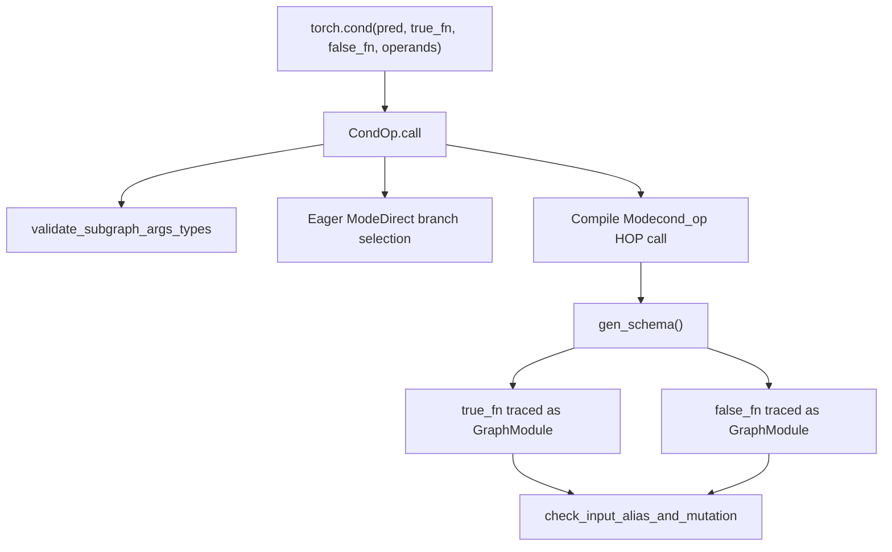
The `torch.cond` operator executes one of two branches based on a predicate. The implementation uses the `CondOp` class which extends `HigherOrderOperator`.

**Key Implementation Details:**

-   The predicate can be a boolean, scalar tensor, or symbolic boolean expression
-   Both branches must have consistent input/output signatures
-   Branch functions are traced into `GraphModule` instances during compilation
-   The operator validates that inputs and outputs match between branches

**Schema Generation:** The `gen_schema()` method materializes both branches as graphs and analyzes them for mutations and aliasing. It creates a schema indicating which inputs are mutated by either branch.

Sources: [torch/\_higher\_order\_ops/cond.py47-92](https://github.com/pytorch/pytorch/blob/915982a4/torch/_higher_order_ops/cond.py#L47-L92) [torch/\_\_init\_\_.py95-183](https://github.com/pytorch/pytorch/blob/915982a4/torch/__init__.py#L95-L183)

### torch.while\_loop - Iterative Loops

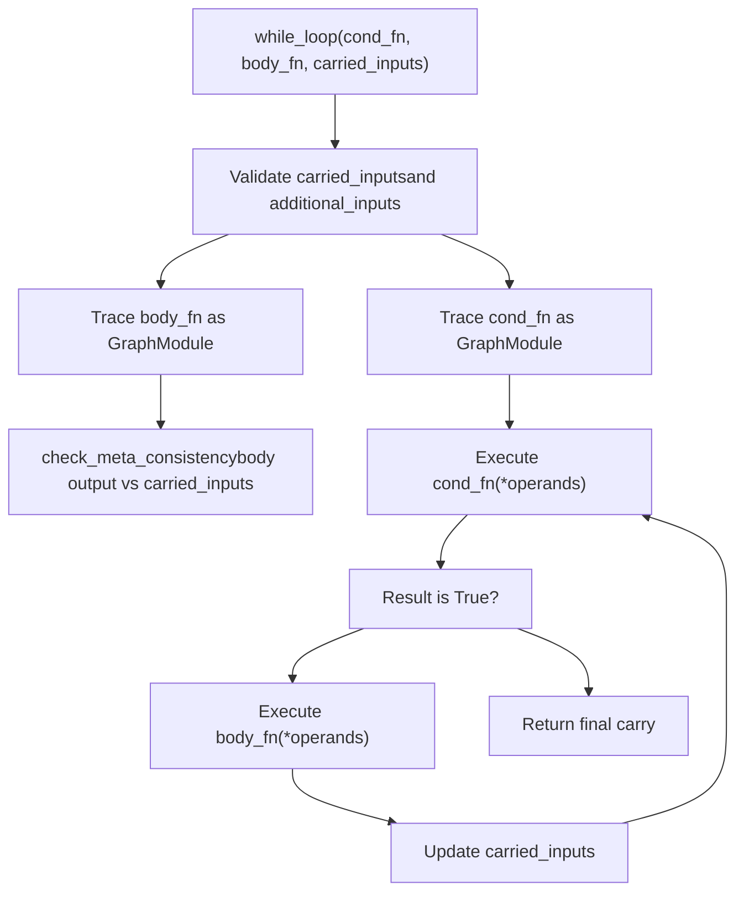
The `while_loop` operator executes a body function repeatedly while a condition function returns true. The carried inputs are updated on each iteration.

**Key Features:**

-   `cond_fn`: Takes carried inputs and additional inputs, returns boolean tensor or scalar
-   `body_fn`: Takes same inputs, returns new values for carried inputs
-   `carried_inputs`: Values that are updated each iteration
-   `additional_inputs`: Read-only inputs passed to both functions

**Important Constraints:**

-   The body function's output must match the metadata (shape, dtype) of carried inputs
-   Input mutations are not supported
-   The condition function must return a scalar boolean or boolean tensor with one element

Sources: [torch/\_higher\_order\_ops/while\_loop.py30-136](https://github.com/pytorch/pytorch/blob/915982a4/torch/_higher_order_ops/while_loop.py#L30-L136) [test/functorch/test\_control\_flow.py192-409](https://github.com/pytorch/pytorch/blob/915982a4/test/functorch/test_control_flow.py#L192-L409)

### scan - Sequential Scanning

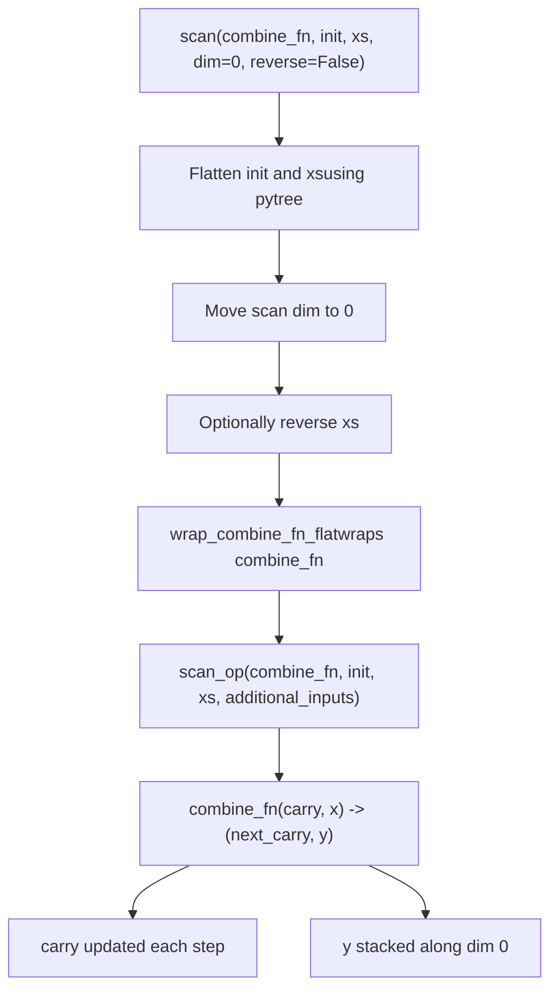
The `scan` operator performs an inclusive scan with a binary combine function. It processes input tensors along a specified dimension, maintaining a carry state.

**Signature:**

-   `combine_fn`: Binary function `(carry, x) -> (next_carry, y)`
-   `init`: Initial carry value (tensor or pytree)
-   `xs`: Input tensors to scan over (tensor or pytree)
-   `dim`: Dimension to scan along (default 0)
-   `reverse`: Whether to scan in reverse (default False)

**Returns:**

-   `final_carry`: The final carry after scanning all elements
-   `out`: Stacked outputs along the scan dimension

**Restrictions:**

-   No aliasing between inputs/outputs allowed
-   Input mutations not supported in combine\_fn
-   Carry structure must match between iterations

Sources: [torch/\_higher\_order\_ops/scan.py77-221](https://github.com/pytorch/pytorch/blob/915982a4/torch/_higher_order_ops/scan.py#L77-L221) [test/functorch/test\_control\_flow.py106-190](https://github.com/pytorch/pytorch/blob/915982a4/test/functorch/test_control_flow.py#L106-L190)

## TorchDynamo Integration

### Subgraph Speculation and Tracing

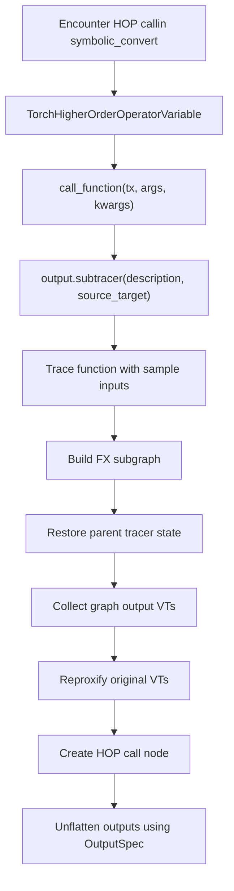
Dynamo handles higher-order operators through specialized `VariableTracker` subclasses that capture the control flow structure and trace the subgraphs.

**Subgraph Speculation Process:**

The `speculate_subgraph` function is the core mechanism for tracing HOPs:

1.  **Setup**: Creates a new `SubgraphTracer` context that isolates graph building
2.  **Tracing**: Executes the function with VariableTracker inputs to symbolically record operations
3.  **Output Handling**: Collects tensor and SymInt outputs, filters constants
4.  **Proxification**: Updates original VariableTrackers to point to HOP outputs

**Key Classes:**

| Class | Purpose |
| --- | --- |
| `TorchHigherOrderOperatorVariable` | Base for HOP variable trackers |
| `CondHigherOrderVariable` | Handles `torch.cond` |
| `WhileLoopHigherOrderVariable` | Handles `torch.while_loop` |
| `ScanHigherOrderVariable` | Handles `scan` operations |

Sources: [torch/\_dynamo/variables/higher\_order\_ops.py1-100](https://github.com/pytorch/pytorch/blob/915982a4/torch/_dynamo/variables/higher_order_ops.py#L1-L100) [torch/\_dynamo/variables/higher\_order\_ops.py619-878](https://github.com/pytorch/pytorch/blob/915982a4/torch/_dynamo/variables/higher_order_ops.py#L619-L878)

### Output Specification and Flattening

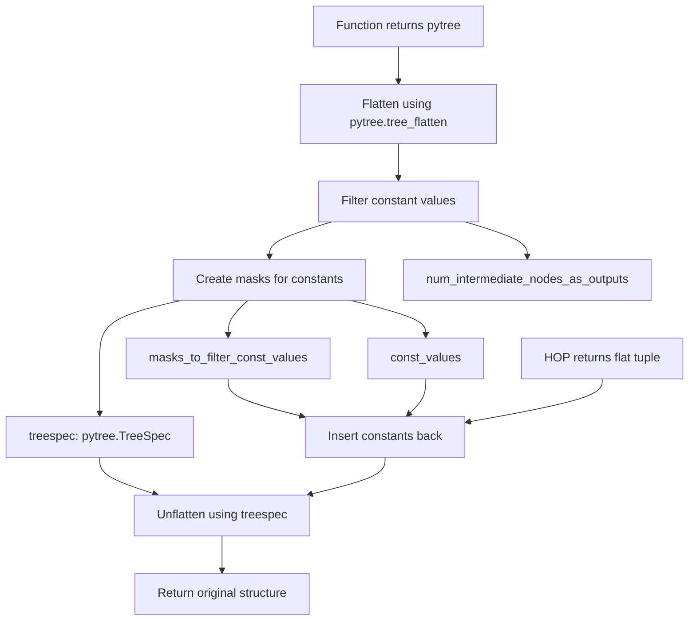
The `OutputSpec` dataclass encapsulates information needed to flatten and unflatten HOP outputs:

-   `treespec`: The pytree structure of the output
-   `masks_to_filter_const_values`: Boolean mask indicating constant positions
-   `const_values`: The actual constant values filtered out
-   `num_intermediate_nodes_as_outputs`: Count of intermediate nodes included as outputs for side effect tracking

Constants are filtered from the graph output to simplify the graph for AOTAutograd and Inductor. They are re-inserted during unflattening.

Sources: [torch/\_dynamo/variables/higher\_order\_ops.py86-113](https://github.com/pytorch/pytorch/blob/915982a4/torch/_dynamo/variables/higher_order_ops.py#L86-L113) [torch/\_dynamo/variables/higher\_order\_ops.py364-427](https://github.com/pytorch/pytorch/blob/915982a4/torch/_dynamo/variables/higher_order_ops.py#L364-L427)

### Automatic vs Manual Output Flattening

Higher-order operators support two output handling modes:

**Automatic Output Flattening** (`speculate_subgraph_with_auto_output_flattening`):

-   Used by most HOPs (cond, while\_loop, scan)
-   Automatically collects all tensor/SymInt outputs from the subgraph
-   Includes intermediate outputs for side effect tracking
-   Reproxifies existing VTs to point to HOP outputs

**Manual Output Flattening** (`speculate_subgraph`):

-   Used when explicit control over outputs is needed
-   Caller specifies exactly which outputs to include
-   Returns both the output VTs and flattened structure

The automatic mode simplifies HOP implementation by handling output collection and intermediate node tracking transparently.

Sources: [torch/\_dynamo/variables/higher\_order\_ops.py1000-1200](https://github.com/pytorch/pytorch/blob/915982a4/torch/_dynamo/variables/higher_order_ops.py#L1000-L1200) [torch/\_dynamo/output\_graph.py1-100](https://github.com/pytorch/pytorch/blob/915982a4/torch/_dynamo/output_graph.py#L1-L100)

### Side Effects and Intermediate Outputs

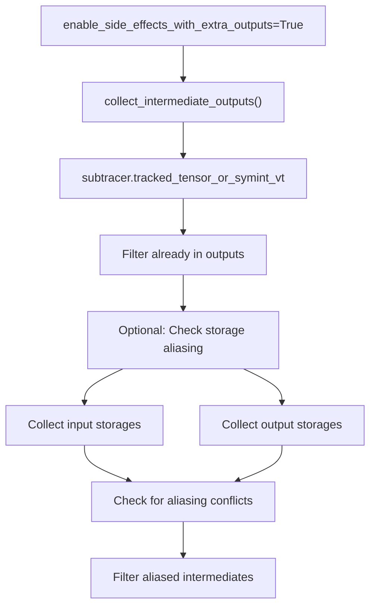
When `enable_side_effects_with_extra_outputs` is enabled, HOPs track all intermediate tensor and SymInt operations as potential side effects. These are added as extra outputs.

**StorageAliasingTracker:**

The `StorageAliasingTracker` class filters intermediate outputs that would create aliasing issues:

-   Collects `StorageWeakRef` from input placeholders
-   Collects storage from existing graph outputs
-   Filters intermediates that share storage with inputs or outputs
-   Prevents aliasing violations for HOPs like `invoke_subgraph` that don't support aliasing

This mechanism allows capturing side effects (like list.append) while maintaining correctness constraints.

Sources: [torch/\_dynamo/variables/higher\_order\_ops.py475-592](https://github.com/pytorch/pytorch/blob/915982a4/torch/_dynamo/variables/higher_order_ops.py#L475-L592) [torch/\_dynamo/dce\_extra\_outputs.py1-50](https://github.com/pytorch/pytorch/blob/915982a4/torch/_dynamo/dce_extra_outputs.py#L1-L50)

## AOT Autograd Integration

### Joint Graph Construction

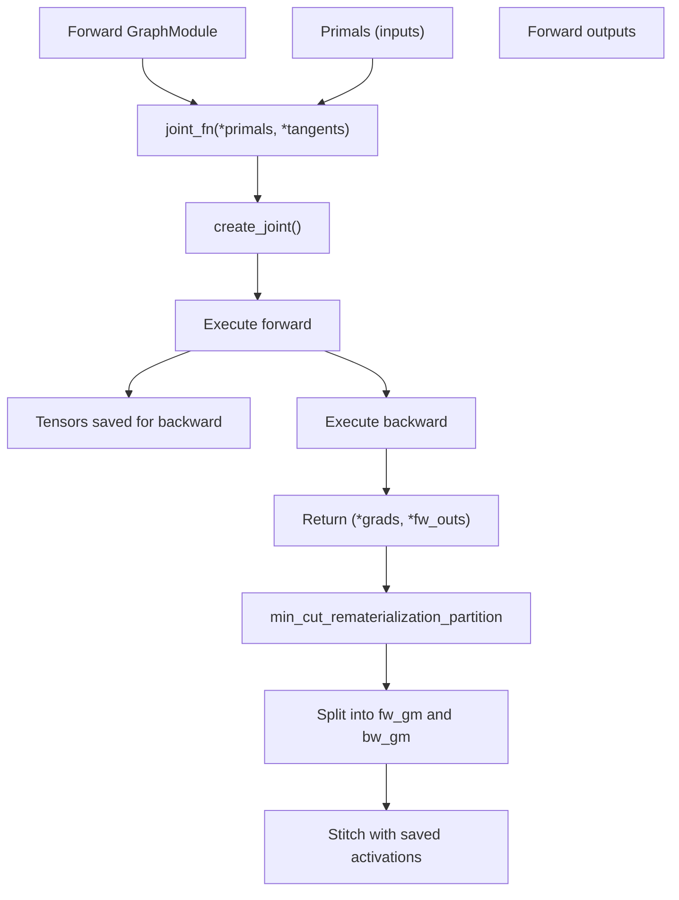
AOT Autograd processes HOPs by creating a joint forward-backward graph that can be partitioned:

1.  **Joint Function Creation**: Combines forward and backward logic into a single callable
2.  **Tracing**: Executes forward with inputs, backward with tangents
3.  **Output Format**: Returns `(*grads, *fw_outs)` - deliberately grads first
4.  **Partitioning**: Uses min-cut algorithm to split into forward and backward graphs

The joint graph approach simplifies partitioning because the entire computation flow is visible in one graph.

Sources: [torch/\_higher\_order\_ops/invoke\_subgraph.py308-346](https://github.com/pytorch/pytorch/blob/915982a4/torch/_higher_order_ops/invoke_subgraph.py#L308-L346) [torch/\_higher\_order\_ops/utils.py1-100](https://github.com/pytorch/pytorch/blob/915982a4/torch/_higher_order_ops/utils.py#L1-L100)

### Autograd Function Integration

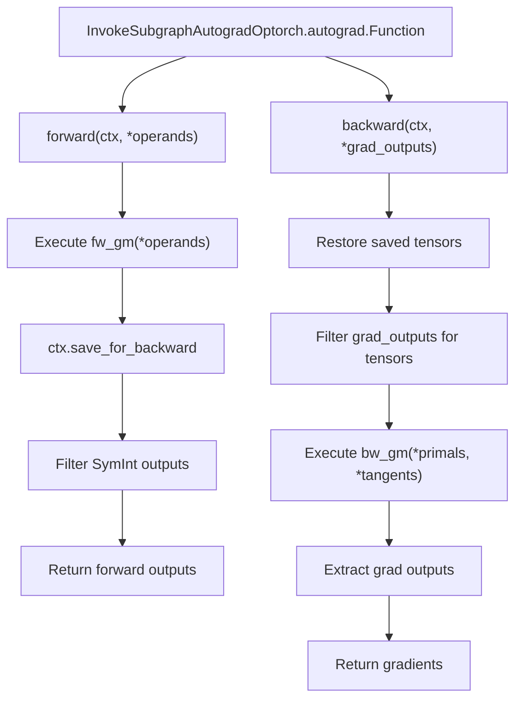
HOPs integrate with autograd through custom `torch.autograd.Function` implementations that wrap the forward and backward graph modules:

**OutputMetadata Tracking:**

-   `num_fw_outs`: Number of forward outputs
-   `indexes_with_symint`: Which outputs are SymInts (no gradients)
-   `indexes_with_no_grad`: Which tensor outputs don't require gradients

The metadata filters gradients appropriately during backward, skipping SymInt outputs and handling non-differentiable tensors.

Sources: [torch/\_higher\_order\_ops/invoke\_subgraph.py48-56](https://github.com/pytorch/pytorch/blob/915982a4/torch/_higher_order_ops/invoke_subgraph.py#L48-L56) [torch/\_higher\_order\_ops/invoke\_subgraph.py370-500](https://github.com/pytorch/pytorch/blob/915982a4/torch/_higher_order_ops/invoke_subgraph.py#L370-L500)

## Inductor Compilation

### HOP Dispatch in Inductor

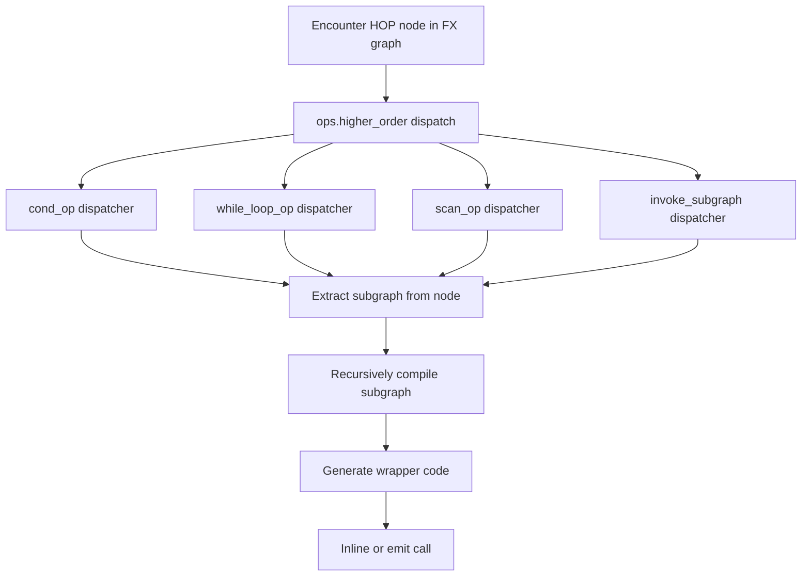
Inductor handles HOPs through specialized lowering implementations that recursively compile subgraphs:

**Compilation Process:**

1.  **Node Detection**: Inductor encounters HOP call node during graph traversal
2.  **Subgraph Extraction**: Retrieves embedded GraphModule from node arguments
3.  **Recursive Compilation**: Compiles subgraph using same Inductor pipeline
4.  **Code Generation**: Generates kernel code with appropriate control flow

Each HOP has a registered dispatcher in `torch._inductor.lowering` that handles its specific semantics.

Sources: [torch/\_inductor/lowering.py1-100](https://github.com/pytorch/pytorch/blob/915982a4/torch/_inductor/lowering.py#L1-L100) [test/inductor/test\_control\_flow.py1-100](https://github.com/pytorch/pytorch/blob/915982a4/test/inductor/test_control_flow.py#L1-L100)

### Nested Compile Regions

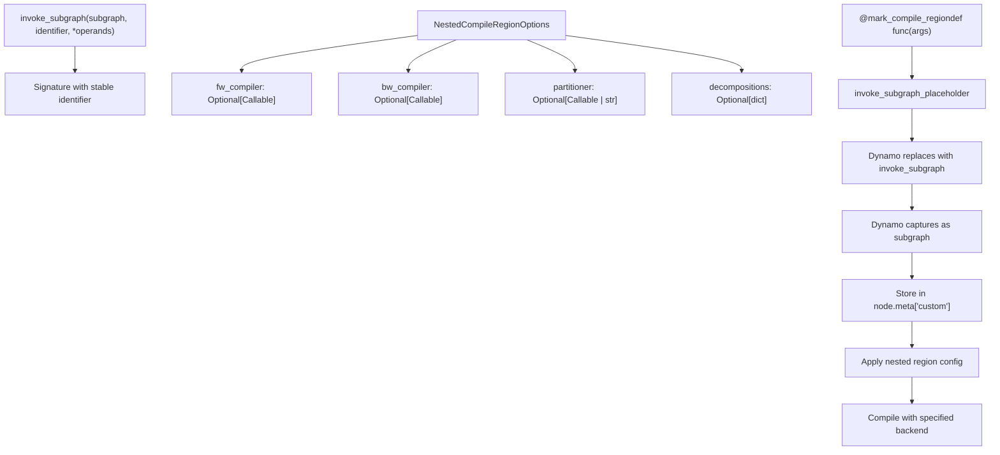
The `invoke_subgraph` HOP enables explicit nested compilation regions with custom compilation strategies:

**Key Features:**

-   **Stable Identifier**: Ensures consistent caching across invocations
-   **Custom Compilers**: Specify different compilation backends for nested regions
-   **Partitioner Control**: Choose partitioning strategy (min-cut, default, etc.)
-   **Decomposition Control**: Override decompositions within nested region

**mark\_compile\_region Decorator:**

The `mark_compile_region` decorator provides a user-friendly API:

-   Wraps functions to use `invoke_subgraph_placeholder` in eager mode
-   Dynamo automatically replaces placeholder with actual `invoke_subgraph` HOP
-   Supports optional `NestedCompileRegionOptions` for fine-grained control

Sources: [torch/\_higher\_order\_ops/invoke\_subgraph.py58-79](https://github.com/pytorch/pytorch/blob/915982a4/torch/_higher_order_ops/invoke_subgraph.py#L58-L79) [torch/\_higher\_order\_ops/invoke\_subgraph.py265-298](https://github.com/pytorch/pytorch/blob/915982a4/torch/_higher_order_ops/invoke_subgraph.py#L265-L298) [test/higher\_order\_ops/test\_invoke\_subgraph.py1-150](https://github.com/pytorch/pytorch/blob/915982a4/test/higher_order_ops/test_invoke_subgraph.py#L1-L150)

## Schema Generation

### HopSchemaGenerator

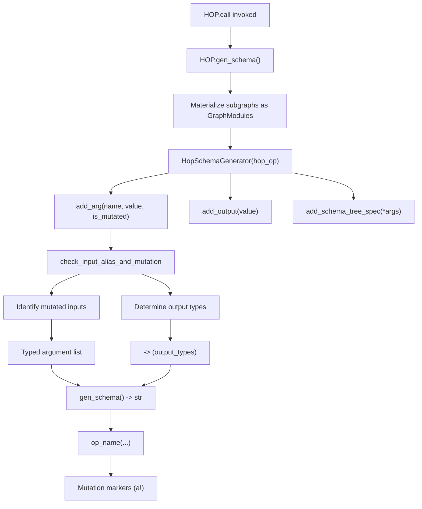
Schema generation enables dynamic schema creation for HOPs based on runtime arguments:

**HopSchemaGenerator Class:**

The generator accumulates information about HOP arguments and outputs:

-   `add_arg()`: Registers an argument with optional mutation flag
-   `add_output()`: Registers an output value with inferred type
-   `add_schema_tree_spec()`: Stores pytree structure for validation
-   `gen_schema()`: Produces final schema string

**Type Inference:**

The generator infers types from example values:

-   `torch.Tensor` → `Tensor` (with mutation annotation if needed)
-   `torch.SymInt` → `SymInt`
-   `int`, `bool`, `float` → Corresponding Python types
-   `FakeScriptObject` → Handled as opaque type
-   `GraphModule` → `Any` type for subgraph arguments

**Mutation Annotations:**

Arguments are annotated with `(a!)` if they are mutated within the subgraph, as determined by `check_input_alias_and_mutation`.

Sources: [torch/\_higher\_order\_ops/schema.py1-100](https://github.com/pytorch/pytorch/blob/915982a4/torch/_higher_order_ops/schema.py#L1-L100) [torch/\_higher\_order\_ops/cond.py56-90](https://github.com/pytorch/pytorch/blob/915982a4/torch/_higher_order_ops/cond.py#L56-L90) [torch/\_higher\_order\_ops/while\_loop.py56-125](https://github.com/pytorch/pytorch/blob/915982a4/torch/_higher_order_ops/while_loop.py#L56-L125)

## Utilities and Shared Infrastructure

### Subgraph Validation

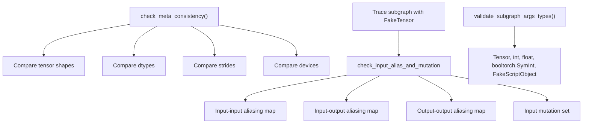
HOPs share common validation infrastructure:

**Type Validation:**

-   `validate_subgraph_args_types()` ensures only supported types are passed
-   Raises error for unsupported types like lists or custom objects

**Alias and Mutation Analysis:**

-   Uses FakeTensor tracing to detect aliasing patterns
-   `check_input_alias_and_mutation()` returns maps of aliasing relationships
-   Most HOPs prohibit aliasing to maintain functional semantics

**Metadata Consistency:**

-   `check_meta_consistency()` compares tensor metadata between expected and actual
-   Used by `while_loop` to ensure loop body output matches carried inputs
-   Extracts `TensorMetadata` including shape, dtype, stride, and device

Sources: [torch/\_higher\_order\_ops/utils.py159-239](https://github.com/pytorch/pytorch/blob/915982a4/torch/_higher_order_ops/utils.py#L159-L239) [torch/\_higher\_order\_ops/utils.py342-411](https://github.com/pytorch/pytorch/blob/915982a4/torch/_higher_order_ops/utils.py#L342-L411)

### Graph Materialization

The `materialize_as_graph()` function converts callables into traced `GraphModule` instances:

**Process:**

1.  Detects if already a GraphModule (returns as-is)
2.  Unwraps FunctionalTensor if needed
3.  Uses `_maybe_reenter_make_fx()` to trace with appropriate mode
4.  Handles FakeTensorMode and shape environment
5.  Returns fully traced GraphModule

This function is used by schema generation and validation to obtain concrete graph representations of HOP subgraphs.

Sources: [torch/\_higher\_order\_ops/utils.py1-50](https://github.com/pytorch/pytorch/blob/915982a4/torch/_higher_order_ops/utils.py#L1-L50)

### Compilation Environment Setup

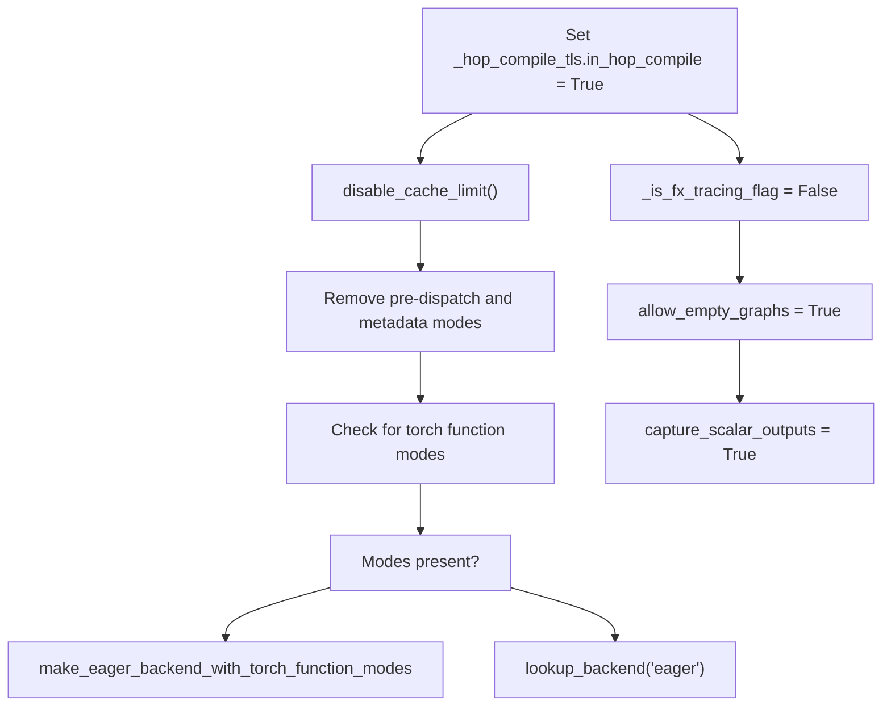
The `setup_compilation_env()` context manager configures the environment for compiling HOPs:

**Purpose:**

-   Prevents infinite recursion when HOPs compile nested regions
-   Removes incompatible torch function modes temporarily
-   Sets configuration flags for proper tracing

**TLS Flag:**

-   `_hop_compile_tls.in_hop_compile` tracks nested compilation
-   Prevents incorrect caching during HOP compilation
-   Used by `_in_hop_compile()` query function

This infrastructure enables HOPs to safely invoke `torch.compile` on nested regions without causing tracing issues.

Sources: [torch/\_higher\_order\_ops/utils.py242-311](https://github.com/pytorch/pytorch/blob/915982a4/torch/_higher_order_ops/utils.py#L242-L311)

## Auto-Functionalization

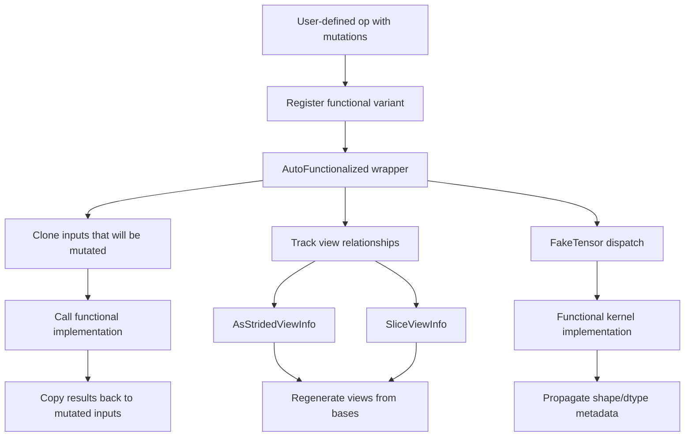
Auto-functionalization automatically converts operations with mutations into functional equivalents:

**AutoFunctionalized Class:**

The `AutoFunctionalized` HOP wraps mutating operations:

-   Takes both mutated and immutable arguments
-   Calls functional kernel implementation
-   Updates mutated arguments with results
-   Tracks view relationships for correctness

**ViewInfo Tracking:**

Different view types are tracked:

-   `AsStridedViewInfo`: Records size, stride, storage\_offset
-   `SliceViewInfo`: Records dimension, start, end for slicing
-   `AliasViewInfo`: Simple alias without transformation
-   Views are regenerated from bases during backward

**Use Cases:**

-   Custom operators with in-place semantics
-   Automatic integration with torch.compile
-   Maintains functional purity in compiled graphs

Sources: [torch/\_higher\_order\_ops/auto\_functionalize.py1-130](https://github.com/pytorch/pytorch/blob/915982a4/torch/_higher_order_ops/auto_functionalize.py#L1-L130) [test/inductor/test\_auto\_functionalize.py1-100](https://github.com/pytorch/pytorch/blob/915982a4/test/inductor/test_auto_functionalize.py#L1-L100)

## Testing Infrastructure

PyTorch includes comprehensive tests for HOPs across different execution modes:

**Test Categories:**

| Test File | Coverage |
| --- | --- |
| `test_control_flow.py` | Core control flow HOPs (cond, while\_loop) |
| `test_invoke_subgraph.py` | Nested compile regions |
| `test_higher_order_ops.py` | Dynamo integration tests |
| `test_auto_functionalize.py` | Auto-functionalization |

**Testing Modes:**

-   Eager execution (baseline correctness)
-   `torch.compile(backend="eager")` (graph capture)
-   `torch.compile(backend="inductor")` (full compilation)
-   AOT Autograd with graph recording
-   Dynamic shapes with automatic\_dynamic\_shapes=True

Sources: [test/functorch/test\_control\_flow.py1-100](https://github.com/pytorch/pytorch/blob/915982a4/test/functorch/test_control_flow.py#L1-L100) [test/higher\_order\_ops/test\_invoke\_subgraph.py1-100](https://github.com/pytorch/pytorch/blob/915982a4/test/higher_order_ops/test_invoke_subgraph.py#L1-L100) [test/dynamo/test\_higher\_order\_ops.py1-100](https://github.com/pytorch/pytorch/blob/915982a4/test/dynamo/test_higher_order_ops.py#L1-L100)
