# Device Backends and Native Operations

Relevant source files

-   [aten/src/ATen/CMakeLists.txt](https://github.com/pytorch/pytorch/blob/915982a4/aten/src/ATen/CMakeLists.txt)
-   [aten/src/ATen/core/CachingHostAllocator.h](https://github.com/pytorch/pytorch/blob/915982a4/aten/src/ATen/core/CachingHostAllocator.h)
-   [aten/src/ATen/cuda/CachingHostAllocator.cpp](https://github.com/pytorch/pytorch/blob/915982a4/aten/src/ATen/cuda/CachingHostAllocator.cpp)
-   [aten/src/ATen/native/Blas.cpp](https://github.com/pytorch/pytorch/blob/915982a4/aten/src/ATen/native/Blas.cpp)
-   [aten/src/ATen/native/GroupedMMUtils.h](https://github.com/pytorch/pytorch/blob/915982a4/aten/src/ATen/native/GroupedMMUtils.h)
-   [aten/src/ATen/native/ScaledBlasUtils.cpp](https://github.com/pytorch/pytorch/blob/915982a4/aten/src/ATen/native/ScaledBlasUtils.cpp)
-   [aten/src/ATen/native/ScaledBlasUtils.h](https://github.com/pytorch/pytorch/blob/915982a4/aten/src/ATen/native/ScaledBlasUtils.h)
-   [aten/src/ATen/native/cuda/Blas.cpp](https://github.com/pytorch/pytorch/blob/915982a4/aten/src/ATen/native/cuda/Blas.cpp)
-   [aten/src/ATen/native/cuda/GroupedBlas.cpp](https://github.com/pytorch/pytorch/blob/915982a4/aten/src/ATen/native/cuda/GroupedBlas.cpp)
-   [aten/src/ATen/native/cuda/ScaledBlas.cpp](https://github.com/pytorch/pytorch/blob/915982a4/aten/src/ATen/native/cuda/ScaledBlas.cpp)
-   [aten/src/ATen/native/cudnn/ConvShared.cpp](https://github.com/pytorch/pytorch/blob/915982a4/aten/src/ATen/native/cudnn/ConvShared.cpp)
-   [aten/src/ATen/native/hip/ck\_group\_gemm.h](https://github.com/pytorch/pytorch/blob/915982a4/aten/src/ATen/native/hip/ck_group_gemm.h)
-   [aten/src/ATen/native/hip/ck\_group\_gemm.hip](https://github.com/pytorch/pytorch/blob/915982a4/aten/src/ATen/native/hip/ck_group_gemm.hip)
-   [aten/src/ATen/native/mkldnn/Conv.cpp](https://github.com/pytorch/pytorch/blob/915982a4/aten/src/ATen/native/mkldnn/Conv.cpp)
-   [aten/src/ATen/native/mkldnn/Linear.cpp](https://github.com/pytorch/pytorch/blob/915982a4/aten/src/ATen/native/mkldnn/Linear.cpp)
-   [aten/src/ATen/native/mkldnn/Matmul.cpp](https://github.com/pytorch/pytorch/blob/915982a4/aten/src/ATen/native/mkldnn/Matmul.cpp)
-   [aten/src/ATen/native/mkldnn/xpu/ScaledBlas.cpp](https://github.com/pytorch/pytorch/blob/915982a4/aten/src/ATen/native/mkldnn/xpu/ScaledBlas.cpp)
-   [aten/src/ATen/native/mps/kernels/CrossKernel.metal](https://github.com/pytorch/pytorch/blob/915982a4/aten/src/ATen/native/mps/kernels/CrossKernel.metal)
-   [aten/src/ATen/native/mps/kernels/Distributions.metal](https://github.com/pytorch/pytorch/blob/915982a4/aten/src/ATen/native/mps/kernels/Distributions.metal)
-   [aten/src/ATen/native/mps/kernels/Indexing.h](https://github.com/pytorch/pytorch/blob/915982a4/aten/src/ATen/native/mps/kernels/Indexing.h)
-   [aten/src/ATen/native/mps/kernels/Indexing.metal](https://github.com/pytorch/pytorch/blob/915982a4/aten/src/ATen/native/mps/kernels/Indexing.metal)
-   [aten/src/ATen/native/mps/kernels/LinearAlgebra.h](https://github.com/pytorch/pytorch/blob/915982a4/aten/src/ATen/native/mps/kernels/LinearAlgebra.h)
-   [aten/src/ATen/native/mps/kernels/LinearAlgebra.metal](https://github.com/pytorch/pytorch/blob/915982a4/aten/src/ATen/native/mps/kernels/LinearAlgebra.metal)
-   [aten/src/ATen/native/mps/operations/CrossKernel.mm](https://github.com/pytorch/pytorch/blob/915982a4/aten/src/ATen/native/mps/operations/CrossKernel.mm)
-   [aten/src/ATen/native/mps/operations/Distributions.mm](https://github.com/pytorch/pytorch/blob/915982a4/aten/src/ATen/native/mps/operations/Distributions.mm)
-   [aten/src/ATen/native/mps/operations/Indexing.mm](https://github.com/pytorch/pytorch/blob/915982a4/aten/src/ATen/native/mps/operations/Indexing.mm)
-   [aten/src/ATen/native/mps/operations/LinearAlgebra.mm](https://github.com/pytorch/pytorch/blob/915982a4/aten/src/ATen/native/mps/operations/LinearAlgebra.mm)
-   [aten/src/ATen/native/mps/operations/Pad.mm](https://github.com/pytorch/pytorch/blob/915982a4/aten/src/ATen/native/mps/operations/Pad.mm)
-   [aten/src/ATen/native/mps/operations/ScanKernel.mm](https://github.com/pytorch/pytorch/blob/915982a4/aten/src/ATen/native/mps/operations/ScanKernel.mm)
-   [aten/src/ATen/native/mps/operations/UpSample.mm](https://github.com/pytorch/pytorch/blob/915982a4/aten/src/ATen/native/mps/operations/UpSample.mm)
-   [aten/src/ATen/native/native\_functions.yaml](https://github.com/pytorch/pytorch/blob/915982a4/aten/src/ATen/native/native_functions.yaml)
-   [aten/src/ATen/native/sparse/SoftMax.cpp](https://github.com/pytorch/pytorch/blob/915982a4/aten/src/ATen/native/sparse/SoftMax.cpp)
-   [aten/src/ATen/native/sparse/mps/SparseMPSTensorMath.mm](https://github.com/pytorch/pytorch/blob/915982a4/aten/src/ATen/native/sparse/mps/SparseMPSTensorMath.mm)
-   [aten/src/ATen/native/sparse/mps/kernels/SparseTensorMath.metal](https://github.com/pytorch/pytorch/blob/915982a4/aten/src/ATen/native/sparse/mps/kernels/SparseTensorMath.metal)
-   [aten/src/ATen/test/cuda\_caching\_host\_allocator\_test.cpp](https://github.com/pytorch/pytorch/blob/915982a4/aten/src/ATen/test/cuda_caching_host_allocator_test.cpp)
-   [aten/src/ATen/test/scalar\_test.cpp](https://github.com/pytorch/pytorch/blob/915982a4/aten/src/ATen/test/scalar_test.cpp)
-   [aten/src/ATen/xpu/CachingHostAllocator.cpp](https://github.com/pytorch/pytorch/blob/915982a4/aten/src/ATen/xpu/CachingHostAllocator.cpp)
-   [aten/src/ATen/xpu/XPUScaledBlas.cpp](https://github.com/pytorch/pytorch/blob/915982a4/aten/src/ATen/xpu/XPUScaledBlas.cpp)
-   [aten/src/ATen/xpu/XPUScaledBlas.h](https://github.com/pytorch/pytorch/blob/915982a4/aten/src/ATen/xpu/XPUScaledBlas.h)
-   [c10/core/AllocatorConfig.cpp](https://github.com/pytorch/pytorch/blob/915982a4/c10/core/AllocatorConfig.cpp)
-   [c10/core/AllocatorConfig.h](https://github.com/pytorch/pytorch/blob/915982a4/c10/core/AllocatorConfig.h)
-   [c10/cuda/CUDAAllocatorConfig.cpp](https://github.com/pytorch/pytorch/blob/915982a4/c10/cuda/CUDAAllocatorConfig.cpp)
-   [c10/cuda/CUDAAllocatorConfig.h](https://github.com/pytorch/pytorch/blob/915982a4/c10/cuda/CUDAAllocatorConfig.h)
-   [c10/cuda/CUDACachingAllocator.cpp](https://github.com/pytorch/pytorch/blob/915982a4/c10/cuda/CUDACachingAllocator.cpp)
-   [c10/cuda/CUDACachingAllocator.h](https://github.com/pytorch/pytorch/blob/915982a4/c10/cuda/CUDACachingAllocator.h)
-   [c10/metal/atomic.h](https://github.com/pytorch/pytorch/blob/915982a4/c10/metal/atomic.h)
-   [c10/test/core/AllocatorConfig\_test.cpp](https://github.com/pytorch/pytorch/blob/915982a4/c10/test/core/AllocatorConfig_test.cpp)
-   [c10/xpu/XPUCachingAllocator.cpp](https://github.com/pytorch/pytorch/blob/915982a4/c10/xpu/XPUCachingAllocator.cpp)
-   [c10/xpu/XPUCachingAllocator.h](https://github.com/pytorch/pytorch/blob/915982a4/c10/xpu/XPUCachingAllocator.h)
-   [docs/source/cuda.aliases.md](https://github.com/pytorch/pytorch/blob/915982a4/docs/source/cuda.aliases.md)
-   [docs/source/notes/cuda.rst](https://github.com/pytorch/pytorch/blob/915982a4/docs/source/notes/cuda.rst)
-   [docs/source/xpu.aliases.md](https://github.com/pytorch/pytorch/blob/915982a4/docs/source/xpu.aliases.md)
-   [docs/source/xpu.md](https://github.com/pytorch/pytorch/blob/915982a4/docs/source/xpu.md)
-   [test/distributed/tensor/test\_strategy\_validation.py](https://github.com/pytorch/pytorch/blob/915982a4/test/distributed/tensor/test_strategy_validation.py)
-   [test/nn/test\_dropout.py](https://github.com/pytorch/pytorch/blob/915982a4/test/nn/test_dropout.py)
-   [test/test\_accelerator.py](https://github.com/pytorch/pytorch/blob/915982a4/test/test_accelerator.py)
-   [test/test\_cuda.py](https://github.com/pytorch/pytorch/blob/915982a4/test/test_cuda.py)
-   [test/test\_cuda\_compatibility.py](https://github.com/pytorch/pytorch/blob/915982a4/test/test_cuda_compatibility.py)
-   [test/test\_indexing.py](https://github.com/pytorch/pytorch/blob/915982a4/test/test_indexing.py)
-   [test/test\_jiterator.py](https://github.com/pytorch/pytorch/blob/915982a4/test/test_jiterator.py)
-   [test/test\_matmul\_cuda.py](https://github.com/pytorch/pytorch/blob/915982a4/test/test_matmul_cuda.py)
-   [test/test\_mps.py](https://github.com/pytorch/pytorch/blob/915982a4/test/test_mps.py)
-   [test/test\_scaled\_matmul\_cuda.py](https://github.com/pytorch/pytorch/blob/915982a4/test/test_scaled_matmul_cuda.py)
-   [test/test\_sparse.py](https://github.com/pytorch/pytorch/blob/915982a4/test/test_sparse.py)
-   [test/test\_xpu.py](https://github.com/pytorch/pytorch/blob/915982a4/test/test_xpu.py)
-   [torch/\_C/\_\_init\_\_.pyi.in](https://github.com/pytorch/pytorch/blob/915982a4/torch/_C/__init__.pyi.in)
-   [torch/\_utils.py](https://github.com/pytorch/pytorch/blob/915982a4/torch/_utils.py)
-   [torch/csrc/DeviceAccelerator.cpp](https://github.com/pytorch/pytorch/blob/915982a4/torch/csrc/DeviceAccelerator.cpp)
-   [torch/csrc/Module.cpp](https://github.com/pytorch/pytorch/blob/915982a4/torch/csrc/Module.cpp)
-   [torch/csrc/autograd/python\_variable\_indexing.cpp](https://github.com/pytorch/pytorch/blob/915982a4/torch/csrc/autograd/python_variable_indexing.cpp)
-   [torch/csrc/cuda/Module.cpp](https://github.com/pytorch/pytorch/blob/915982a4/torch/csrc/cuda/Module.cpp)
-   [torch/csrc/cuda/memory\_snapshot.cpp](https://github.com/pytorch/pytorch/blob/915982a4/torch/csrc/cuda/memory_snapshot.cpp)
-   [torch/csrc/profiler/combined\_traceback.cpp](https://github.com/pytorch/pytorch/blob/915982a4/torch/csrc/profiler/combined_traceback.cpp)
-   [torch/csrc/profiler/combined\_traceback.h](https://github.com/pytorch/pytorch/blob/915982a4/torch/csrc/profiler/combined_traceback.h)
-   [torch/csrc/profiler/python/combined\_traceback.cpp](https://github.com/pytorch/pytorch/blob/915982a4/torch/csrc/profiler/python/combined_traceback.cpp)
-   [torch/csrc/xpu/Module.cpp](https://github.com/pytorch/pytorch/blob/915982a4/torch/csrc/xpu/Module.cpp)
-   [torch/cuda/\_\_init\_\_.py](https://github.com/pytorch/pytorch/blob/915982a4/torch/cuda/__init__.py)
-   [torch/cuda/\_device\_limits.py](https://github.com/pytorch/pytorch/blob/915982a4/torch/cuda/_device_limits.py)
-   [torch/cuda/memory.py](https://github.com/pytorch/pytorch/blob/915982a4/torch/cuda/memory.py)
-   [torch/distributed/tensor/\_ops/strategy\_validation.py](https://github.com/pytorch/pytorch/blob/915982a4/torch/distributed/tensor/_ops/strategy_validation.py)
-   [torch/testing/\_comparison.py](https://github.com/pytorch/pytorch/blob/915982a4/torch/testing/_comparison.py)
-   [torch/testing/\_internal/common\_methods\_invocations.py](https://github.com/pytorch/pytorch/blob/915982a4/torch/testing/_internal/common_methods_invocations.py)
-   [torch/testing/\_internal/common\_mps.py](https://github.com/pytorch/pytorch/blob/915982a4/torch/testing/_internal/common_mps.py)
-   [torch/testing/\_internal/common\_quantized.py](https://github.com/pytorch/pytorch/blob/915982a4/torch/testing/_internal/common_quantized.py)
-   [torch/testing/\_internal/opinfo/core.py](https://github.com/pytorch/pytorch/blob/915982a4/torch/testing/_internal/opinfo/core.py)
-   [torch/testing/\_internal/opinfo/definitions/\_masked.py](https://github.com/pytorch/pytorch/blob/915982a4/torch/testing/_internal/opinfo/definitions/_masked.py)
-   [torch/testing/\_internal/opinfo/definitions/linalg.py](https://github.com/pytorch/pytorch/blob/915982a4/torch/testing/_internal/opinfo/definitions/linalg.py)
-   [torch/testing/\_internal/opinfo/definitions/special.py](https://github.com/pytorch/pytorch/blob/915982a4/torch/testing/_internal/opinfo/definitions/special.py)
-   [torch/utils/viz/MemoryViz.js](https://github.com/pytorch/pytorch/blob/915982a4/torch/utils/viz/MemoryViz.js)
-   [torch/xpu/\_\_init\_\_.py](https://github.com/pytorch/pytorch/blob/915982a4/torch/xpu/__init__.py)
-   [torch/xpu/graphs.py](https://github.com/pytorch/pytorch/blob/915982a4/torch/xpu/graphs.py)
-   [torch/xpu/memory.py](https://github.com/pytorch/pytorch/blob/915982a4/torch/xpu/memory.py)

## Purpose and Scope

This document describes PyTorch's low-level device backend infrastructure that enables execution on different hardware accelerators. It covers:

-   The ATen native function system for declaring and dispatching operators to device-specific implementations
-   Device memory allocators (caching allocators for CUDA, XPU, and the MPS backend)
-   Backend implementations for NVIDIA GPUs (CUDA), Intel GPUs (XPU), and Apple Silicon (Metal Performance Shaders)
-   Testing infrastructure for cross-device validation (OpInfo framework)

For higher-level compilation and code generation, see Compilation System [2](/pytorch/pytorch/2-compilation-system). For distributed training using these backends, see Distributed Training Systems [4](/pytorch/pytorch/4-distributed-training-systems). Build system and code generation details are covered in Build and Test Infrastructure [5](/pytorch/pytorch/5-build-and-test-infrastructure).

## ATen Native Function System

### Native Functions YAML Schema

All PyTorch operators are declaratively defined in `native_functions.yaml`. This file specifies function signatures, dispatch mappings to device-specific implementations, and metadata for code generation.

**Operator Definition Structure**

```
- func: add.Tensor(Tensor self, Tensor other, *, Scalar alpha=1) -> Tensor  device_check: NoCheck   # TensorIterator  structured_delegate: add.out  variants: function, method  dispatch:    SparseCPU, SparseCUDA, SparseMPS, SparseMeta: add_sparse    SparseCsrCPU, SparseCsrCUDA, SparseCsrMeta: add_sparse_csr    MkldnnCPU: mkldnn_add    ZeroTensor: add_zerotensor    NestedTensorCPU, NestedTensorHPU, NestedTensorCUDA: NestedTensor_add_Tensor  tags: [core, pointwise]
```
Key fields:

-   **func**: Function signature with C++ type annotations (Tensor, Scalar, etc.)
-   **dispatch**: Maps dispatch keys (device + layout combinations) to implementation function names
-   **variants**: Controls API exposure as `torch.add()` (function) or `tensor.add()` (method)
-   **structured\_delegate**: Enables structured kernel pattern for sharing CPU/CUDA code
-   **device\_check**: Specifies device validation behavior
-   **tags**: Metadata for optimization hints and test categorization

Sources: [aten/src/ATen/native/native\_functions.yaml554-593](https://github.com/pytorch/pytorch/blob/915982a4/aten/src/ATen/native/native_functions.yaml#L554-L593)

### Dispatcher Architecture

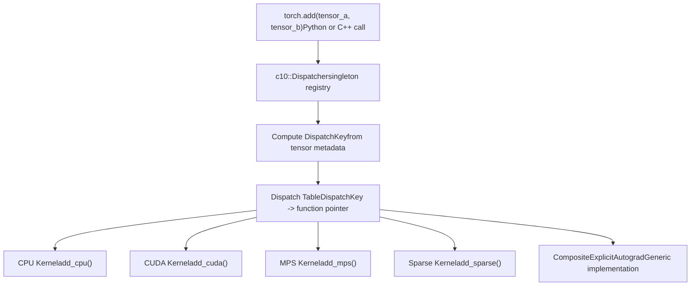
**DispatchKey Computation**: The dispatcher computes a `DispatchKey` from:

1.  **Device type**: CPU, CUDA, XPU, MPS, etc.
2.  **Layout**: Strided (dense), SparseCOO, SparseCsr, etc.
3.  **Autograd mode**: Whether gradients are required
4.  **Other modifiers**: Quantization, nested tensors, etc.

The computed key indexes into a dispatch table populated during code generation from `native_functions.yaml`.

Sources: [aten/src/ATen/native/native\_functions.yaml554-593](https://github.com/pytorch/pytorch/blob/915982a4/aten/src/ATen/native/native_functions.yaml#L554-L593)

### Code Generation Pipeline

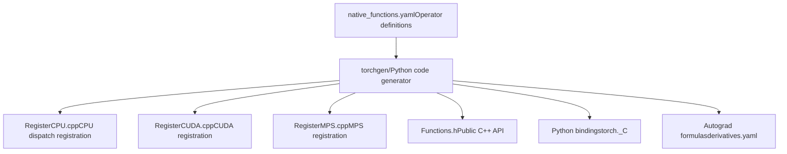
The `torchgen` tool parses `native_functions.yaml` and generates:

-   **Registration code**: Populates dispatch tables for each backend
-   **Public API headers**: C++ function declarations for `torch::` namespace
-   **Python bindings**: Exposes operators to Python via `torch._C`
-   **Autograd derivatives**: Automatic differentiation rules from `derivatives.yaml`

Sources: [aten/src/ATen/native/native\_functions.yaml1-100](https://github.com/pytorch/pytorch/blob/915982a4/aten/src/ATen/native/native_functions.yaml#L1-L100)

## Device Allocator Architecture

All device backends use a **caching allocator** pattern to amortize the cost of calling slow driver-level allocation APIs (e.g., `cudaMalloc`, which can take milliseconds).

### Allocator Class Hierarchy

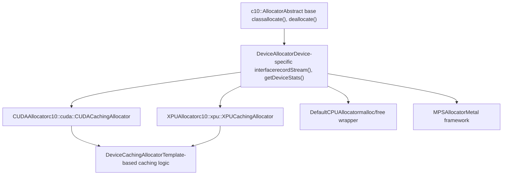
**DeviceAllocator Interface** key methods:

-   `allocate(size, stream)`: Allocate memory on device
-   `raw_delete(ptr)`: Free allocated pointer
-   `recordStream(ptr, stream)`: Track tensor usage across streams
-   `getDeviceStats(device)`: Return memory statistics
-   `emptyCache()`: Release cached blocks back to driver
-   `snapshot()`: Memory profiling snapshot

Sources: [c10/cuda/CUDACachingAllocator.h111-261](https://github.com/pytorch/pytorch/blob/915982a4/c10/cuda/CUDACachingAllocator.h#L111-L261) [c10/xpu/XPUCachingAllocator.h9-14](https://github.com/pytorch/pytorch/blob/915982a4/c10/xpu/XPUCachingAllocator.h#L9-L14)

### Caching Allocator Pattern

**Core Concept**: Maintain pools of free memory blocks organized by size. Reuse cached blocks for new allocations instead of calling driver APIs.

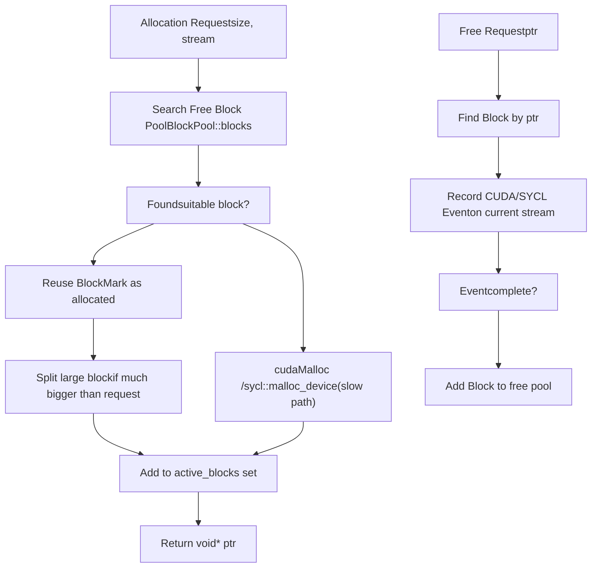
**Block Structure** [c10/cuda/CUDACachingAllocator.cpp189-258](https://github.com/pytorch/pytorch/blob/915982a4/c10/cuda/CUDACachingAllocator.cpp#L189-L258):

```
struct Block {  c10::DeviceIndex device;  cudaStream_t stream;          // Allocation stream  stream_set stream_uses;       // All streams that used this block  size_t size;                  // Block size in bytes  size_t requested_size;        // Original allocation request size  BlockPool* pool;              // Small or large pool  void* ptr;                    // Device memory pointer  bool allocated;               // Currently in use  bool mapped;                  // Backed by physical memory (for expandable segments)  Block* prev, *next;           // Linked list for split blocks  int event_count;              // Outstanding synchronization events  ExpandableSegment* expandable_segment_;}
```
**BlockPool Structure** [c10/cuda/CUDACachingAllocator.cpp164-185](https://github.com/pytorch/pytorch/blob/915982a4/c10/cuda/CUDACachingAllocator.cpp#L164-L185):

-   `std::set<Block*, Comparison> blocks`: Free blocks ordered by size (for best-fit allocation)
-   `std::set<Block*, Comparison> unmapped`: Unmapped blocks (for expandable segments)
-   `bool is_small`: Small pool (<1MB) or large pool (≥1MB)
-   Two separate pools reduce search time and fragmentation

Sources: [c10/cuda/CUDACachingAllocator.cpp68-100](https://github.com/pytorch/pytorch/blob/915982a4/c10/cuda/CUDACachingAllocator.cpp#L68-L100) [c10/cuda/CUDACachingAllocator.cpp164-258](https://github.com/pytorch/pytorch/blob/915982a4/c10/cuda/CUDACachingAllocator.cpp#L164-L258)

### Key Caching Allocator Behaviors

From [c10/cuda/CUDACachingAllocator.cpp70-100](https://github.com/pytorch/pytorch/blob/915982a4/c10/cuda/CUDACachingAllocator.cpp#L70-L100):

1.  **Stream Association**: Blocks are bound to the stream where they were allocated. Reusing a block on a different stream requires synchronization.

2.  **Size-Based Pooling**: Separate pools for:

    -   Small allocations: < 1MB, packed into 2MB buffers
    -   Large allocations: ≥ 1MB, rounded to 2MB boundaries
3.  **Block Splitting**: Large cached blocks can be split to satisfy smaller requests. Split blocks remain linked via `prev`/`next` pointers.

4.  **Block Coalescing**: Adjacent free blocks are merged to reduce fragmentation.

5.  **Garbage Collection**: When allocation fails, the allocator:

    -   First tries to free one suitable-sized cached block
    -   Then tries to free all cached blocks
    -   Finally calls driver allocation if still insufficient memory
6.  **Event Synchronization**: Before reusing a block on a different stream, the allocator records a CUDA event to ensure prior work completes.


Sources: [c10/cuda/CUDACachingAllocator.cpp68-100](https://github.com/pytorch/pytorch/blob/915982a4/c10/cuda/CUDACachingAllocator.cpp#L68-L100)

## CUDA Backend

### CUDA Memory Management Components

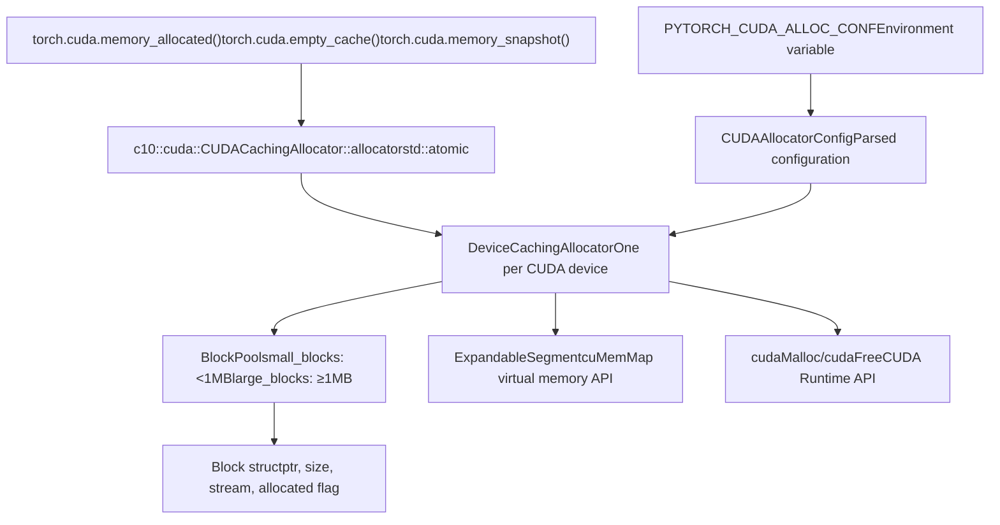
**Global Allocator Singleton**: [c10/cuda/CUDACachingAllocator.h268-272](https://github.com/pytorch/pytorch/blob/915982a4/c10/cuda/CUDACachingAllocator.h#L268-L272)

```
namespace c10::cuda::CUDACachingAllocator {  extern std::atomic<CUDAAllocator*> allocator;    inline CUDAAllocator* get() {    return allocator.load();  }}
```
Sources: [c10/cuda/CUDACachingAllocator.h268-272](https://github.com/pytorch/pytorch/blob/915982a4/c10/cuda/CUDACachingAllocator.h#L268-L272) [c10/cuda/CUDACachingAllocator.cpp486-600](https://github.com/pytorch/pytorch/blob/915982a4/c10/cuda/CUDACachingAllocator.cpp#L486-L600) [torch/cuda/memory.py1-64](https://github.com/pytorch/pytorch/blob/915982a4/torch/cuda/memory.py#L1-L64)

### Expandable Segments

Expandable segments reduce fragmentation when batch sizes vary by using CUDA's low-level virtual memory APIs.

**Motivation** [c10/cuda/CUDACachingAllocator.cpp274-300](https://github.com/pytorch/pytorch/blob/915982a4/c10/cuda/CUDACachingAllocator.cpp#L274-L300): When running inference with varying batch sizes (e.g., N → N+1), traditional allocation creates many small unusable memory "slivers" at the end of segments, leading to OOM even when total free memory is sufficient.

**Solution**: Use `cuMemMap` and `cuMemAddressReserve` to:

1.  Reserve a large virtual address space (up to 256 TiB)
2.  Initially map only the needed physical memory
3.  Grow segments dynamically by mapping additional physical pages
4.  Unmap pages during OOM to defragment

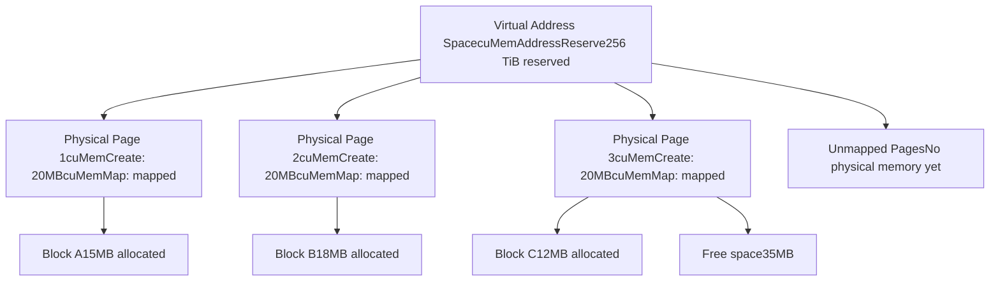
**Implementation** [c10/cuda/CUDACachingAllocator.cpp368-494](https://github.com/pytorch/pytorch/blob/915982a4/c10/cuda/CUDACachingAllocator.cpp#L368-L494):

```
struct ExpandableSegment {  uintptr_t ptr_;              // Base virtual address  size_t segment_size_;        // Page size (2MB or 20MB)  size_t max_handles_;         // Max number of pages  std::vector<std::optional<CUmemGenericAllocationHandle>> handles_;    SegmentRange map(SegmentRange range) {    // Map physical memory to virtual address range    for (size_t i = begin; i < end; i++) {      CUmemGenericAllocationHandle handle;      cuMemCreate(&handle, segment_size_, &prop, 0);      cuMemMap(ptr_ + i * segment_size_, segment_size_, 0, handle, 0);      cuMemSetAccess(ptr_ + i * segment_size_, segment_size_, &accessDesc, 1);      handles_[i] = handle;    }  }    SegmentRange unmap(SegmentRange range) {    // Unmap and release physical memory    for (size_t i = begin; i < end; i++) {      cuMemUnmap(ptr_ + i * segment_size_, segment_size_);      cuMemRelease(handles_[i]);      handles_[i] = std::nullopt;    }  }}
```
**Configuration**: `PYTORCH_CUDA_ALLOC_CONF=expandable_segments:True`

**Limitations**:

-   Requires CUDA 11.4+ and driver support
-   IPC (inter-process communication) for multiprocessing requires special handling
-   Slightly slower initial allocation due to virtual memory setup

Sources: [c10/cuda/CUDACachingAllocator.cpp274-366](https://github.com/pytorch/pytorch/blob/915982a4/c10/cuda/CUDACachingAllocator.cpp#L274-L366) [c10/cuda/CUDACachingAllocator.cpp368-494](https://github.com/pytorch/pytorch/blob/915982a4/c10/cuda/CUDACachingAllocator.cpp#L368-L494)

### CUDA Python Memory API

The `torch.cuda.memory` module provides Python access to allocator functionality.

| Function | Purpose | C++ Implementation |
| --- | --- | --- |
| `memory_allocated(device)` | Current allocated bytes | `CUDAAllocator::getDeviceStats()` |
| `max_memory_allocated(device)` | Peak allocated bytes | DeviceStats peak tracking |
| `memory_reserved(device)` | Total cached memory | Reserved segments in allocator |
| `empty_cache()` | Release free blocks | `CUDAAllocator::emptyCache()` |
| `memory_stats(device)` | Detailed statistics dict | `CUDAAllocator::getDeviceStats()` |
| `memory_snapshot()` | Allocation history | `CUDAAllocator::snapshot()` |
| `set_per_process_memory_fraction(frac, dev)` | Limit memory usage | `CUDAAllocator::setMemoryFraction()` |
| `caching_allocator_alloc(size, stream)` | Raw allocation | `raw_alloc_with_stream()` |
| `caching_allocator_delete(ptr)` | Raw free | `raw_delete()` |

**Memory Statistics Categories** [torch/cuda/memory.py227-285](https://github.com/pytorch/pytorch/blob/915982a4/torch/cuda/memory.py#L227-L285):

-   **Pool types**: `all`, `large_pool`, `small_pool`
-   **Metric types**: `current`, `peak`, `allocated`, `freed`
-   **Stat names**: `allocated_bytes`, `reserved_bytes`, `active_bytes`, `inactive_split_bytes`, `segment`, `num_alloc_retries`, `num_ooms`

Example: `allocated_bytes.large_pool.peak` = peak bytes allocated in the large pool

Sources: [torch/cuda/memory.py32-285](https://github.com/pytorch/pytorch/blob/915982a4/torch/cuda/memory.py#L32-L285) [torch/csrc/cuda/Module.cpp1-100](https://github.com/pytorch/pytorch/blob/915982a4/torch/csrc/cuda/Module.cpp#L1-L100)

### CUDA Graph Support

**Challenge** [c10/cuda/CUDACachingAllocator.cpp102-133](https://github.com/pytorch/pytorch/blob/915982a4/c10/cuda/CUDACachingAllocator.cpp#L102-L133): CUDA graphs capture memory addresses during recording. These addresses must remain valid during replay, but the caching allocator normally reuses memory.

**Solution**: Private memory pools per graph (identified by `MempoolId_t`).

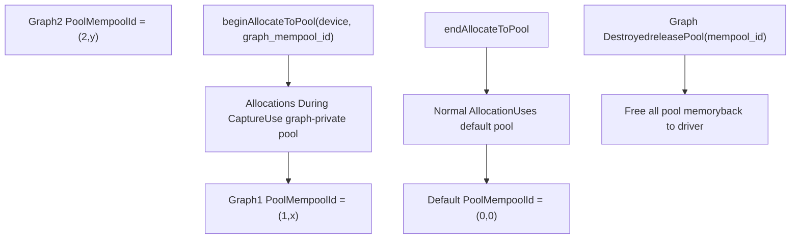
**API** [c10/cuda/CUDACachingAllocator.h134-141](https://github.com/pytorch/pytorch/blob/915982a4/c10/cuda/CUDACachingAllocator.h#L134-L141):

```
class CUDAAllocator {  virtual void beginAllocateToPool(      DeviceIndex device,      MempoolId_t mempool_id,      std::function<bool(cudaStream_t)> filter) = 0;        virtual void endAllocateToPool(      DeviceIndex device,      MempoolId_t mempool_id) = 0;        virtual void releasePool(      DeviceIndex device,      MempoolId_t mempool_id) = 0;}
```
During capture, all allocations on matching streams go to the graph's private pool. The pool persists until the graph is destroyed, ensuring addresses remain valid.

Sources: [c10/cuda/CUDACachingAllocator.cpp102-133](https://github.com/pytorch/pytorch/blob/915982a4/c10/cuda/CUDACachingAllocator.cpp#L102-L133) [c10/cuda/CUDACachingAllocator.h134-141](https://github.com/pytorch/pytorch/blob/915982a4/c10/cuda/CUDACachingAllocator.h#L134-L141)

### CUDA Allocator Configuration

Configuration is parsed from environment variables by [c10/cuda/CUDAAllocatorConfig.cpp72-134](https://github.com/pytorch/pytorch/blob/915982a4/c10/cuda/CUDAAllocatorConfig.cpp#L72-L134)

**Configuration Options**:

| Option | Type | Default | Description |
| --- | --- | --- | --- |
| `backend` | string | `native` | `native` or `cudaMallocAsync` |
| `max_split_size_mb` | size\_t | ∞ | Maximum size for splitting large blocks (MB) |
| `garbage_collection_threshold` | double | 0.0 | Trigger GC when free/total ratio exceeds this |
| `expandable_segments` | bool | False | Use `cuMemMap` for expandable segments |
| `release_lock_on_cudamalloc` | bool | False | Release allocator lock during `cudaMalloc` |
| `pinned_use_cuda_host_register` | bool | False | Use `cudaHostRegister` for pinned memory |
| `pinned_num_register_threads` | size\_t | 1 | Threads for parallel registration |
| `roundup_power2_divisions` | size\_t\[\] | \[0,...\] | Rounding granularity per size range |

**Example Configuration**:

```
PYTORCH_CUDA_ALLOC_CONF="expandable_segments:True,max_split_size_mb:512,garbage_collection_threshold:0.8"
```
Sources: [c10/cuda/CUDAAllocatorConfig.h1-180](https://github.com/pytorch/pytorch/blob/915982a4/c10/cuda/CUDAAllocatorConfig.h#L1-L180) [c10/cuda/CUDAAllocatorConfig.cpp1-170](https://github.com/pytorch/pytorch/blob/915982a4/c10/cuda/CUDAAllocatorConfig.cpp#L1-L170)

### Pinned Memory Allocator

Pinned (page-locked) memory enables faster CPU↔GPU transfers by preventing the OS from paging memory to disk.

**CachingHostAllocator** [aten/src/ATen/cuda/CachingHostAllocator.cpp15-66](https://github.com/pytorch/pytorch/blob/915982a4/aten/src/ATen/cuda/CachingHostAllocator.cpp#L15-L66):

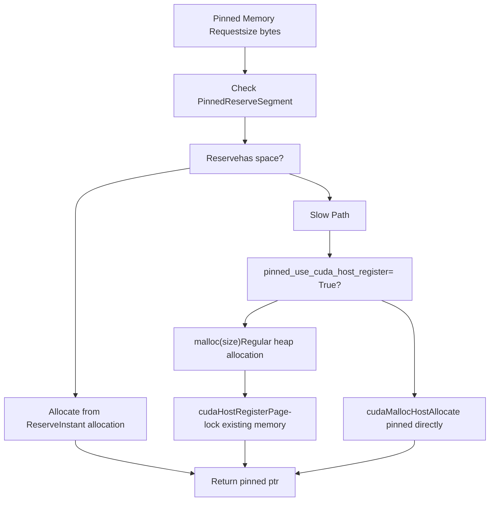
**Benefits of `cudaHostRegister`** [aten/src/ATen/cuda/CachingHostAllocator.cpp32-38](https://github.com/pytorch/pytorch/blob/915982a4/aten/src/ATen/cuda/CachingHostAllocator.cpp#L32-L38):

-   Works with any memory allocation (not just `cudaMallocHost`)
-   Faster for large allocations (no immediate memory zeroing)
-   Requires same virtual address space on host and device

**Reserve Segment**: Pre-allocated pool of pinned memory for fast allocation. Size configured via `pinned_reserve_segment_size_mb`.

Sources: [aten/src/ATen/cuda/CachingHostAllocator.cpp1-200](https://github.com/pytorch/pytorch/blob/915982a4/aten/src/ATen/cuda/CachingHostAllocator.cpp#L1-L200) [c10/cuda/CUDAAllocatorConfig.h69-86](https://github.com/pytorch/pytorch/blob/915982a4/c10/cuda/CUDAAllocatorConfig.h#L69-L86)

## XPU Backend (Intel GPUs)

The XPU backend for Intel GPUs mirrors CUDA's architecture but uses SYCL APIs instead of CUDA Runtime.

### XPU Allocator Structure

**DeviceCachingAllocator** [c10/xpu/XPUCachingAllocator.cpp486-529](https://github.com/pytorch/pytorch/blob/915982a4/c10/xpu/XPUCachingAllocator.cpp#L486-L529):

```
class DeviceCachingAllocator { private:  std::recursive_mutex mutex;  BlockPool large_blocks;  // ≥1MB allocations  BlockPool small_blocks;  // <1MB allocations  ska::flat_hash_set<Block*> active_blocks;  ska::flat_hash_map<xpu::XPUStream,                      std::deque<std::pair<sycl::event, Block*>>> xpu_events;  std::vector<ExpandableSegment*> expandable_segments;  DeviceIndex device_index;};
```
**Key Differences from CUDA**:

-   Uses `sycl::queue*` instead of `cudaStream_t`
-   Uses `sycl::event` instead of `cudaEvent_t`
-   Driver allocation: `sycl::aligned_alloc_device` instead of `cudaMalloc`
-   Driver free: `sycl::free` instead of `cudaFree`

Sources: [c10/xpu/XPUCachingAllocator.cpp486-529](https://github.com/pytorch/pytorch/blob/915982a4/c10/xpu/XPUCachingAllocator.cpp#L486-L529)

### XPU Expandable Segments

Uses SYCL's virtual memory extensions [c10/xpu/XPUCachingAllocator.cpp133-240](https://github.com/pytorch/pytorch/blob/915982a4/c10/xpu/XPUCachingAllocator.cpp#L133-L240):

```
struct ExpandableSegment {  ExpandableSegment(DeviceIndex device,                     std::optional<sycl::queue*> queue,                    size_t segment_size,                    std::vector<DeviceIndex> peers) {    // Reserve virtual address space    ptr_ = sycl::ext::oneapi::experimental::reserve_virtual_mem(        segment_size_ * max_handles_,         xpu::get_device_context());  }    SegmentRange map(SegmentRange range) {    // Allocate and map physical memory    auto& mem = handle.emplace(        xpu::get_raw_device(device_),        xpu::get_device_context(),        segment_size_);    mem.map(ptr_ + i * segment_size_, segment_size_,            sycl::ext::oneapi::experimental::address_access_mode::read_write);  }    SegmentRange unmap(SegmentRange range) {    // Unmap physical memory    sycl::ext::oneapi::experimental::unmap(        ptr_ + segment_size_ * i,        segment_size_,        xpu::get_device_context());    handles_[i].reset();  // Destroy physical_mem object  }}
```
**SYCL Virtual Memory**: Uses `sycl::ext::oneapi::experimental::physical_mem` for physical page allocation and `reserve_virtual_mem` / `unmap` for virtual address space management.

Sources: [c10/xpu/XPUCachingAllocator.cpp133-240](https://github.com/pytorch/pytorch/blob/915982a4/c10/xpu/XPUCachingAllocator.cpp#L133-L240)

### XPU Python Memory API

Parallel to CUDA API, defined in [torch/xpu/memory.py26-195](https://github.com/pytorch/pytorch/blob/915982a4/torch/xpu/memory.py#L26-L195):

| XPU Function | Equivalent CUDA Function |
| --- | --- |
| `torch.xpu.empty_cache()` | `torch.cuda.empty_cache()` |
| `torch.xpu.memory_allocated(device)` | `torch.cuda.memory_allocated(device)` |
| `torch.xpu.max_memory_allocated(device)` | `torch.cuda.max_memory_allocated(device)` |
| `torch.xpu.memory_reserved(device)` | `torch.cuda.memory_reserved(device)` |
| `torch.xpu.memory_stats(device)` | `torch.cuda.memory_stats(device)` |
| `torch.xpu.reset_peak_memory_stats(device)` | `torch.cuda.reset_peak_memory_stats(device)` |
| `torch.xpu.memory_snapshot()` | `torch.cuda.memory_snapshot()` |

**Device Management** [torch/xpu/\_\_init\_\_.py1-600](https://github.com/pytorch/pytorch/blob/915982a4/torch/xpu/__init__.py#L1-L600):

-   `torch.xpu.device_count()` - Number of XPU devices
-   `torch.xpu.current_device()` - Active device index
-   `torch.xpu.set_device(device)` - Set active device
-   `torch.xpu.get_device_properties(device)` - Device capabilities

Sources: [torch/xpu/memory.py1-200](https://github.com/pytorch/pytorch/blob/915982a4/torch/xpu/memory.py#L1-L200) [torch/xpu/\_\_init\_\_.py1-600](https://github.com/pytorch/pytorch/blob/915982a4/torch/xpu/__init__.py#L1-L600) [torch/csrc/xpu/Module.cpp1-100](https://github.com/pytorch/pytorch/blob/915982a4/torch/csrc/xpu/Module.cpp#L1-L100)

## MPS Backend (Metal Performance Shaders)

The MPS backend enables PyTorch operations on Apple Silicon GPUs using Metal Performance Shaders.

### MPS Architecture

Unlike CUDA/XPU, MPS does not use a caching allocator. Memory is managed directly through Metal's allocation APIs.

**MPS Operation Implementation Pattern** [aten/src/ATen/native/sparse/mps/SparseMPSTensorMath.mm55-108](https://github.com/pytorch/pytorch/blob/915982a4/aten/src/ATen/native/sparse/mps/SparseMPSTensorMath.mm#L55-L108):

```
static Tensor& s_addmm_out_sparse_dense_mps(    Tensor& r,    const Tensor& t,    const SparseTensor& sparse_,    const Tensor& dense,    const Scalar& beta,    const Scalar& alpha) {    // Validate dimensions  TORCH_CHECK(sparse_.sparse_dim() == 2, "sparse_dim must be 2");  TORCH_CHECK(dense.dim() == 2, "dense must be 2D");    // Get Metal shader library  #ifndef PYTORCH_JIT_COMPILE_SHADERS  static auto& lib = MetalShaderLibrary::getBundledLibrary();  #endif    // Coalesce sparse tensor (merge duplicate indices)  auto sparse = sparse_.coalesce();    // Create MPSGraph and add nodes for computation  // ... MPSGraph construction ...    // Execute graph on MPS device  // ... execution code ...    return r;}
```
**Metal Shaders**: Custom kernels written in Metal Shading Language (.metal files) and compiled into `.metallib` archives.

Sources: [aten/src/ATen/native/sparse/mps/SparseMPSTensorMath.mm1-108](https://github.com/pytorch/pytorch/blob/915982a4/aten/src/ATen/native/sparse/mps/SparseMPSTensorMath.mm#L1-L108) [c10/metal/utils.h1-50](https://github.com/pytorch/pytorch/blob/915982a4/c10/metal/utils.h#L1-L50)

### MPS Binary Operations

Binary operations (add, mul, div) use MPSGraph API [aten/src/ATen/native/mps/operations/BinaryKernel.mm1-100](https://github.com/pytorch/pytorch/blob/915982a4/aten/src/ATen/native/mps/operations/BinaryKernel.mm#L1-L100):

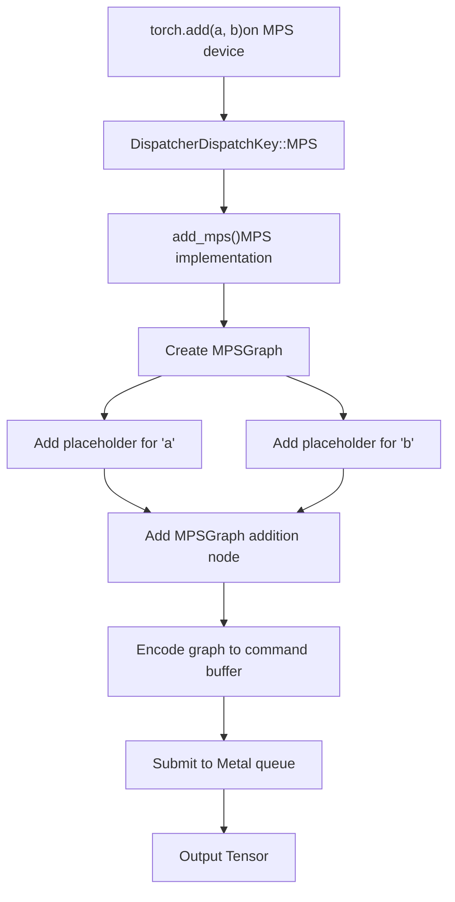
**MPSGraph**: Apple's graph-based computation API that compiles to optimized Metal kernels.

Sources: [aten/src/ATen/native/mps/operations/BinaryKernel.mm1-100](https://github.com/pytorch/pytorch/blob/915982a4/aten/src/ATen/native/mps/operations/BinaryKernel.mm#L1-L100)

## Testing Infrastructure

### OpInfo Database

The OpInfo framework systematically tests all PyTorch operators across devices and dtypes.

**OpInfo Filtering for Device Support** [test/test\_sparse.py39-54](https://github.com/pytorch/pytorch/blob/915982a4/test/test_sparse.py#L39-L54):

```
# Filter operators that support any sparse layoutdef _op_supports_any_sparse(op):    return (op.supports_sparse            or op.supports_sparse_csr            or op.supports_sparse_csc            or op.supports_sparse_bsr            or op.supports_sparse_bsc) # Get operators with sparse supportreduction_ops_with_sparse_support = [    op for op in reduction_ops     if 'masked.' not in op.name and _op_supports_any_sparse(op)] binary_ufuncs_with_sparse_support = [    op for op in binary_ufuncs     if _op_supports_any_sparse(op)]
```
**OpInfo Structure**: Each operator has an `OpInfo` object defining:

-   `name`: Operator name (e.g., "add", "mul")
-   `sample_inputs_func`: Generates test inputs with various shapes/dtypes
-   `supports_sparse`, `supports_sparse_csr`, etc.: Layout support flags
-   `dtypes`: Supported data types per device
-   `skips`: Expected test failures for specific configurations
-   `decorators`: Device-specific test modifiers

Sources: [test/test\_sparse.py28-56](https://github.com/pytorch/pytorch/blob/915982a4/test/test_sparse.py#L28-L56)

### Cross-Device Test Pattern

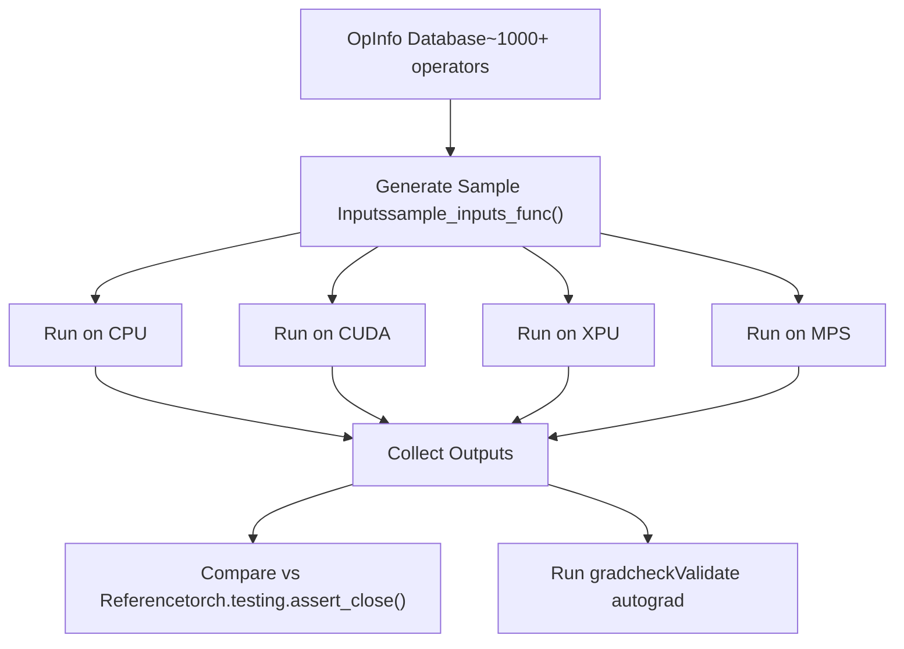
**XPU Test Example** [test/test\_xpu.py59-90](https://github.com/pytorch/pytorch/blob/915982a4/test/test_xpu.py#L59-L90):

```
_xpu_computation_op_list = [    "fill", "zeros", "clone", "add", "sub", "mul", "div", "abs"]_xpu_all_ops = [    op for op in ops_and_refs     if op.name in _xpu_all_op_list] @ops(_xpu_all_ops, allowed_dtypes=any_common_cpu_xpu_one)def test_xpu_ops(self, device, dtype, op):    samples = op.sample_inputs(device, dtype)    for sample in samples:        result = op(sample.input, *sample.args, **sample.kwargs)        # Validate output shape, dtype, and values        self.assertEqual(result.device.type, 'xpu')
```
**CUDA Test Example** [test/test\_cuda.py133-145](https://github.com/pytorch/pytorch/blob/915982a4/test/test_cuda.py#L133-L145):

```
@unittest.skipIf(not TEST_CUDA, "CUDA not available")class TestCuda(TestCase):    _do_cuda_memory_leak_check = True    _do_cuda_non_default_stream = True        def test_memory_allocation(self):        prev = torch.cuda.memory_allocated()        mem = torch.cuda.caching_allocator_alloc(size)        self.assertGreater(torch.cuda.memory_allocated(), prev)        torch.cuda.caching_allocator_delete(mem)        self.assertEqual(torch.cuda.memory_allocated(), prev)
```
Sources: [test/test\_cuda.py133-145](https://github.com/pytorch/pytorch/blob/915982a4/test/test_cuda.py#L133-L145) [test/test\_xpu.py59-115](https://github.com/pytorch/pytorch/blob/915982a4/test/test_xpu.py#L59-L115)

### Device-Specific Test Markers

Tests use decorators to control execution:

-   `@unittest.skipIf(not TEST_CUDA, ...)` - Skip if CUDA unavailable
-   `@onlyCUDA` - Run only on CUDA
-   `@skipCUDAIf(condition, reason)` - Skip CUDA under specific conditions
-   `@largeTensorTest("30GB", "cuda")` - Require large GPU memory
-   `@expectedFailureMPS` - Mark known MPS failures

Sources: [test/test\_cuda.py1-100](https://github.com/pytorch/pytorch/blob/915982a4/test/test_cuda.py#L1-L100) [test/test\_xpu.py1-100](https://github.com/pytorch/pytorch/blob/915982a4/test/test_xpu.py#L1-L100) [test/test\_sparse.py1-100](https://github.com/pytorch/pytorch/blob/915982a4/test/test_sparse.py#L1-L100)

## Allocator Configuration System

Shared configuration parsing for all backends.

### Configuration Tokenizer

[c10/core/AllocatorConfig.h34-115](https://github.com/pytorch/pytorch/blob/915982a4/c10/core/AllocatorConfig.h#L34-L115) provides `ConfigTokenizer` class:

```
class ConfigTokenizer {  std::vector<std::string> config_;    explicit ConfigTokenizer(const std::string& env) {    // Tokenize "key1:val1,key2:val2" into:    // ["key1", ":", "val1", ",", "key2", ":", "val2"]    for (char ch : env) {      if (ch == ',' || ch == ':' || ch == '[' || ch == ']') {        if (!buffer.empty()) {          config_.emplace_back(std::move(buffer));          buffer.clear();        }        config_.emplace_back(1, ch);      } else if (!std::isspace(ch)) {        buffer += ch;      }    }  }    const std::string& operator[](size_t i) const;  size_t size() const;  size_t toSizeT(size_t i) const;  bool toBool(size_t i) const;}
```
### Parsing Flow

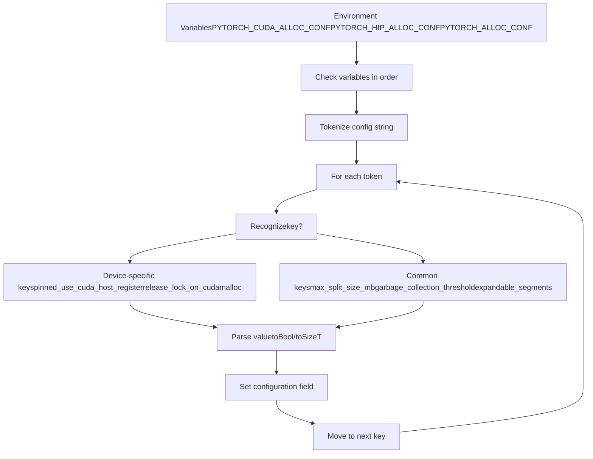
Sources: [c10/core/AllocatorConfig.cpp1-250](https://github.com/pytorch/pytorch/blob/915982a4/c10/core/AllocatorConfig.cpp#L1-L250)

### Common Configuration Options

Defined in [c10/core/AllocatorConfig.h1-250](https://github.com/pytorch/pytorch/blob/915982a4/c10/core/AllocatorConfig.h#L1-L250):

| Option | Type | Default | Range | Description |
| --- | --- | --- | --- | --- |
| `max_split_size_mb` | size\_t | ∞ | ≥ large\_segment\_size | Maximum block split size |
| `large_segment_size_mb` | size\_t | 20 | \> 1 | Threshold for large pool |
| `garbage_collection_threshold` | double | 0.0 | 0.0-1.0 | Free/total ratio to trigger GC |
| `expandable_segments` | bool | False | \- | Use virtual memory segments |
| `roundup_power2_divisions` | size\_t\[\] | \[0,...,0\] | ≥0 per range | Rounding granularity 1MB-64GB |
| `pinned_use_background_threads` | bool | False | \- | Async pinned memory operations |

**Round-up Divisions**: Controls memory rounding for different size ranges to reduce fragmentation. Array has 16 entries covering 1MB to 64GB in power-of-2 intervals.

Sources: [c10/core/AllocatorConfig.h1-250](https://github.com/pytorch/pytorch/blob/915982a4/c10/core/AllocatorConfig.h#L1-L250) [c10/core/AllocatorConfig.cpp1-250](https://github.com/pytorch/pytorch/blob/915982a4/c10/core/AllocatorConfig.cpp#L1-L250)

## Memory Snapshot and Visualization

### Snapshot Data Structure

Memory snapshots capture the complete state of the allocator for analysis [torch/csrc/cuda/memory\_snapshot.cpp1-500](https://github.com/pytorch/pytorch/blob/915982a4/torch/csrc/cuda/memory_snapshot.cpp#L1-L500):

```
struct SnapshotInfo {  std::vector<SegmentInfo> segments;       // All allocated segments  std::vector<std::vector<TraceEntry>> device_traces;  // Per-device history  std::vector<AnnotationEntry> external_annotations;    // User metadata  AllocatorConfigInfo config_metadata;     // Configuration at snapshot time}; struct SegmentInfo {  void* address;  size_t total_size;  size_t allocated_size;  bool is_large;  std::vector<BlockInfo> blocks;           // Blocks within segment}; struct BlockInfo {  void* address;  size_t size;  size_t requested_size;  bool allocated;  std::shared_ptr<GatheredContext> context;  // Stack trace};
```
### Visualization Components

The snapshot is rendered using JavaScript [torch/utils/viz/MemoryViz.js1-1000](https://github.com/pytorch/pytorch/blob/915982a4/torch/utils/viz/MemoryViz.js#L1-L1000):

```
// Core data structuresfunction Segment(addr, size, stream, frames, version, user_metadata) {  return {addr, size, stream, version, frames, user_metadata};} function Block(addr, size, requested_size, frames,                free_requested, version, user_metadata) {  return {addr, size, requested_size, frames,           free_requested, version, user_metadata};} // Visualization typesfunction EventSelector(outer, events, stack_info, memory_view) {  // Timeline view of allocation events} function SegmentTimeline(parent, segments, streams, max_addr) {  // Visual timeline showing segment lifetime} function StackTraceView(outer, events, selected_event) {  // Display Python/C++ stack traces for allocations}
```
**Visualization Features**:

-   Timeline of allocations and frees
-   Memory usage over time
-   Segment/block hierarchy with addresses
-   Stack trace for each allocation
-   Stream coloring to show parallelism
-   Fragmentation analysis

Sources: [torch/utils/viz/MemoryViz.js1-100](https://github.com/pytorch/pytorch/blob/915982a4/torch/utils/viz/MemoryViz.js#L1-L100) [torch/csrc/cuda/memory\_snapshot.cpp1-100](https://github.com/pytorch/pytorch/blob/915982a4/torch/csrc/cuda/memory_snapshot.cpp#L1-L100)

## Sparse Tensor Backend Support

### Sparse Layouts in Native Functions

PyTorch supports multiple sparse tensor layouts, each with dedicated dispatch keys.

**Sparse Layout Dispatch Keys** [aten/src/ATen/native/native\_functions.yaml340-365](https://github.com/pytorch/pytorch/blob/915982a4/aten/src/ATen/native/native_functions.yaml#L340-L365):

```
- func: abs(Tensor self) -> Tensor  dispatch:    CompositeExplicitAutograd: abs           # Generic fallback    SparseCPU, SparseCUDA, SparseMPS: abs_sparse    SparseCsrCPU, SparseCsrCUDA, SparseCsrMPS, SparseCsrMeta: abs_sparse_csr    NestedTensorCPU, NestedTensorHPU, NestedTensorCUDA: NestedTensor_abs
```
**Sparse Formats**:

-   **SparseCOO** (`torch.sparse_coo`): Coordinate format with indices and values
-   **SparseCsr** (`torch.sparse_csr`): Compressed Sparse Row
-   **SparseCsc** (`torch.sparse_csc`): Compressed Sparse Column
-   **SparseBsr** (`torch.sparse_bsr`): Block Sparse Row
-   **SparseBsc** (`torch.sparse_bsc`): Block Sparse Column

Each format has dispatch keys per device:

-   CPU: `SparseCPU`, `SparseCsrCPU`, etc.
-   CUDA: `SparseCUDA`, `SparseCsrCUDA`, etc.
-   MPS: `SparseMPS`, `SparseCsrMPS`, etc.

Sources: [aten/src/ATen/native/native\_functions.yaml340-365](https://github.com/pytorch/pytorch/blob/915982a4/aten/src/ATen/native/native_functions.yaml#L340-L365)

### Sparse Operations Testing

Test suite validates sparse operations across layouts and devices [test/test\_sparse.py134-154](https://github.com/pytorch/pytorch/blob/915982a4/test/test_sparse.py#L134-L154):

```
@all_sparse_layouts(test_name='layout', include_strided=False)@gradcheck_semantics(test_name='gradcheck')def test_sparse_operation(self, layout, gradcheck):    # Test operator on given sparse layout    # layout is one of: torch.sparse_coo, torch.sparse_csr, etc.    # gradcheck is either sparse or masked semantics
```
The `@all_sparse_layouts` decorator tests across:

-   `torch.sparse_coo`
-   `torch.sparse_csr`
-   `torch.sparse_csc`
-   `torch.sparse_bsr`
-   `torch.sparse_bsc`

Sources: [test/test\_sparse.py134-154](https://github.com/pytorch/pytorch/blob/915982a4/test/test_sparse.py#L134-L154)

### MPS Sparse Implementation

MPS sparse operations in [aten/src/ATen/native/sparse/mps/SparseMPSTensorMath.mm1-2000](https://github.com/pytorch/pytorch/blob/915982a4/aten/src/ATen/native/sparse/mps/SparseMPSTensorMath.mm#L1-L2000) include:

-   `addmm` - Sparse-dense matrix multiplication
-   `_sparse_softmax` - Softmax on sparse tensors
-   `_sparse_log_softmax` - Log-softmax on sparse tensors
-   Sparse binary operations (add, mul)

**Registration** [aten/src/ATen/native/sparse/mps/SparseMPSTensorMath.mm50-80](https://github.com/pytorch/pytorch/blob/915982a4/aten/src/ATen/native/sparse/mps/SparseMPSTensorMath.mm#L50-L80):

```
TORCH_LIBRARY_IMPL(aten, SparseMPS, m) {  m.impl("addmm", TORCH_FN(s_addmm_out_sparse_dense_mps));  m.impl("_sparse_softmax", TORCH_FN(_sparse_softmax_mps));  m.impl("_sparse_log_softmax", TORCH_FN(_sparse_log_softmax_mps));}
```
Sources: [aten/src/ATen/native/sparse/mps/SparseMPSTensorMath.mm1-108](https://github.com/pytorch/pytorch/blob/915982a4/aten/src/ATen/native/sparse/mps/SparseMPSTensorMath.mm#L1-L108)

## Summary

PyTorch's device backend system provides a unified interface to diverse hardware accelerators through several key architectural patterns:

**Native Function System**:

-   Declarative operator definitions in `native_functions.yaml`
-   Automatic code generation for dispatch tables
-   Device and layout-specific routing via `DispatchKey`

**Caching Allocators** (CUDA, XPU):

-   Block pooling to reduce driver API overhead
-   Stream-aware allocation with event synchronization
-   Expandable segments for fragmentation reduction
-   Graph-private memory pools for CUDA graph support

**MPS Backend**:

-   MPSGraph API for operation composition
-   Direct Metal framework integration
-   Custom Metal shaders for specialized operations

**Testing Infrastructure**:

-   OpInfo database for systematic cross-device validation
-   ~1000+ operators tested on CPU, CUDA, XPU, MPS
-   Device-specific test markers and expected failures

**Configuration System**:

-   Unified environment variable parsing
-   Device-specific and shared configuration options
-   Runtime tuning of memory allocation behavior

For compilation and kernel optimization, see TorchInductor Backend [2.5](/pytorch/pytorch/2.5-torchinductor-backend). For distributed memory management across devices, see Distributed Training Systems [4](/pytorch/pytorch/4-distributed-training-systems).

Sources: [aten/src/ATen/native/native\_functions.yaml1-667673](https://github.com/pytorch/pytorch/blob/915982a4/aten/src/ATen/native/native_functions.yaml#L1-L667673) [c10/cuda/CUDACachingAllocator.cpp1-2688](https://github.com/pytorch/pytorch/blob/915982a4/c10/cuda/CUDACachingAllocator.cpp#L1-L2688) [c10/xpu/XPUCachingAllocator.cpp1-2000](https://github.com/pytorch/pytorch/blob/915982a4/c10/xpu/XPUCachingAllocator.cpp#L1-L2000) [aten/src/ATen/native/sparse/mps/SparseMPSTensorMath.mm1-2000](https://github.com/pytorch/pytorch/blob/915982a4/aten/src/ATen/native/sparse/mps/SparseMPSTensorMath.mm#L1-L2000) [test/test\_cuda.py1-3000](https://github.com/pytorch/pytorch/blob/915982a4/test/test_cuda.py#L1-L3000) [test/test\_xpu.py1-2500](https://github.com/pytorch/pytorch/blob/915982a4/test/test_xpu.py#L1-L2500) [test/test\_sparse.py1-5000](https://github.com/pytorch/pytorch/blob/915982a4/test/test_sparse.py#L1-L5000)
