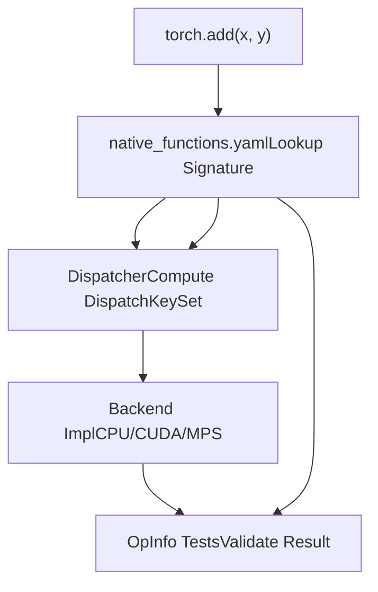
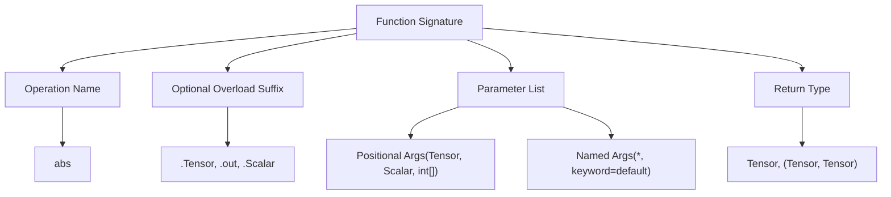
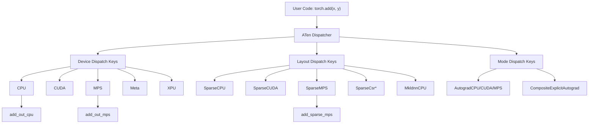
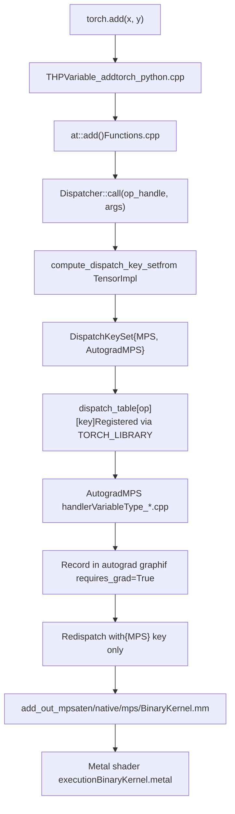
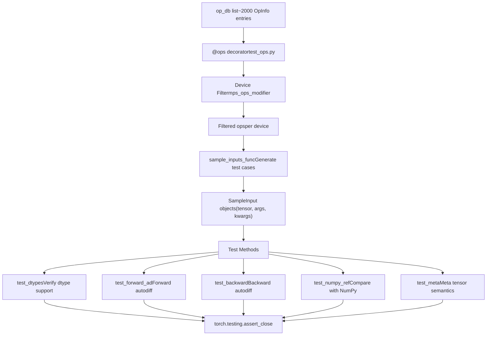
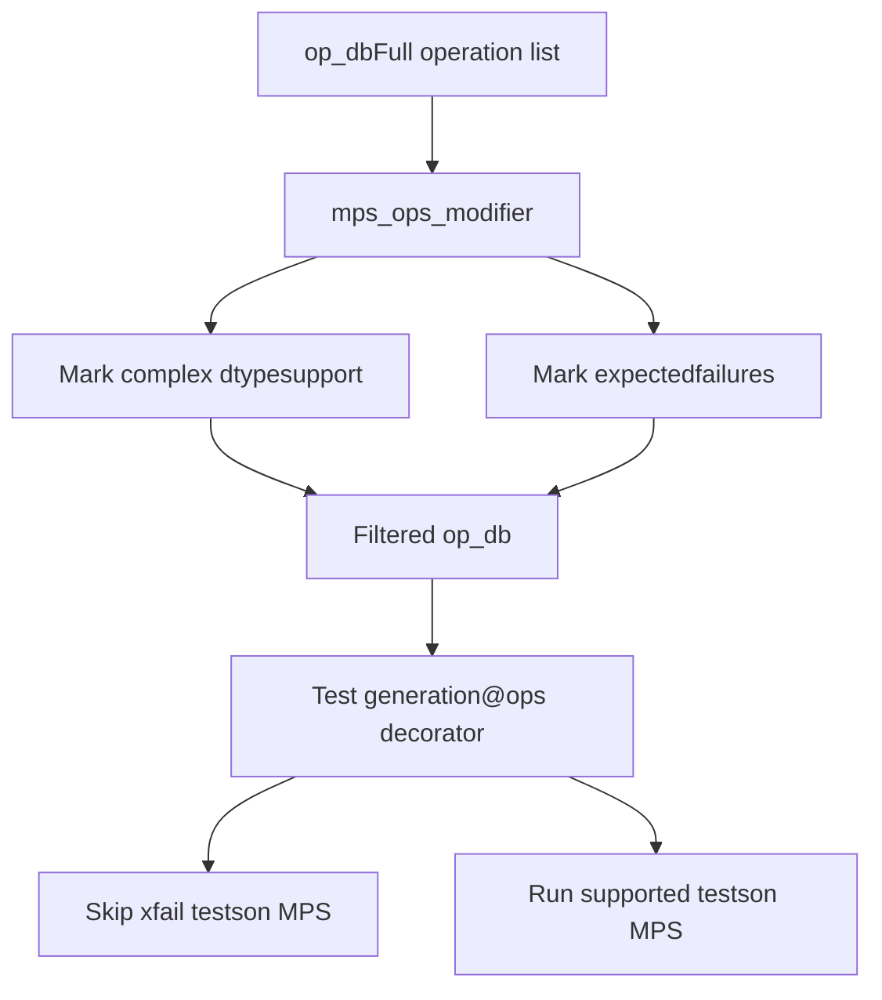

# ATen Native Function System

Relevant source files

-   [aten/src/ATen/native/cudnn/ConvShared.cpp](https://github.com/pytorch/pytorch/blob/915982a4/aten/src/ATen/native/cudnn/ConvShared.cpp)
-   [aten/src/ATen/native/mkldnn/Conv.cpp](https://github.com/pytorch/pytorch/blob/915982a4/aten/src/ATen/native/mkldnn/Conv.cpp)
-   [aten/src/ATen/native/mkldnn/Linear.cpp](https://github.com/pytorch/pytorch/blob/915982a4/aten/src/ATen/native/mkldnn/Linear.cpp)
-   [aten/src/ATen/native/mkldnn/Matmul.cpp](https://github.com/pytorch/pytorch/blob/915982a4/aten/src/ATen/native/mkldnn/Matmul.cpp)
-   [aten/src/ATen/native/mps/kernels/CrossKernel.metal](https://github.com/pytorch/pytorch/blob/915982a4/aten/src/ATen/native/mps/kernels/CrossKernel.metal)
-   [aten/src/ATen/native/mps/kernels/Distributions.metal](https://github.com/pytorch/pytorch/blob/915982a4/aten/src/ATen/native/mps/kernels/Distributions.metal)
-   [aten/src/ATen/native/mps/kernels/Indexing.h](https://github.com/pytorch/pytorch/blob/915982a4/aten/src/ATen/native/mps/kernels/Indexing.h)
-   [aten/src/ATen/native/mps/kernels/Indexing.metal](https://github.com/pytorch/pytorch/blob/915982a4/aten/src/ATen/native/mps/kernels/Indexing.metal)
-   [aten/src/ATen/native/mps/kernels/LinearAlgebra.h](https://github.com/pytorch/pytorch/blob/915982a4/aten/src/ATen/native/mps/kernels/LinearAlgebra.h)
-   [aten/src/ATen/native/mps/kernels/LinearAlgebra.metal](https://github.com/pytorch/pytorch/blob/915982a4/aten/src/ATen/native/mps/kernels/LinearAlgebra.metal)
-   [aten/src/ATen/native/mps/operations/CrossKernel.mm](https://github.com/pytorch/pytorch/blob/915982a4/aten/src/ATen/native/mps/operations/CrossKernel.mm)
-   [aten/src/ATen/native/mps/operations/Distributions.mm](https://github.com/pytorch/pytorch/blob/915982a4/aten/src/ATen/native/mps/operations/Distributions.mm)
-   [aten/src/ATen/native/mps/operations/Indexing.mm](https://github.com/pytorch/pytorch/blob/915982a4/aten/src/ATen/native/mps/operations/Indexing.mm)
-   [aten/src/ATen/native/mps/operations/LinearAlgebra.mm](https://github.com/pytorch/pytorch/blob/915982a4/aten/src/ATen/native/mps/operations/LinearAlgebra.mm)
-   [aten/src/ATen/native/mps/operations/Pad.mm](https://github.com/pytorch/pytorch/blob/915982a4/aten/src/ATen/native/mps/operations/Pad.mm)
-   [aten/src/ATen/native/mps/operations/ScanKernel.mm](https://github.com/pytorch/pytorch/blob/915982a4/aten/src/ATen/native/mps/operations/ScanKernel.mm)
-   [aten/src/ATen/native/mps/operations/UpSample.mm](https://github.com/pytorch/pytorch/blob/915982a4/aten/src/ATen/native/mps/operations/UpSample.mm)
-   [aten/src/ATen/native/native\_functions.yaml](https://github.com/pytorch/pytorch/blob/915982a4/aten/src/ATen/native/native_functions.yaml)
-   [aten/src/ATen/native/sparse/SoftMax.cpp](https://github.com/pytorch/pytorch/blob/915982a4/aten/src/ATen/native/sparse/SoftMax.cpp)
-   [aten/src/ATen/native/sparse/mps/SparseMPSTensorMath.mm](https://github.com/pytorch/pytorch/blob/915982a4/aten/src/ATen/native/sparse/mps/SparseMPSTensorMath.mm)
-   [aten/src/ATen/native/sparse/mps/kernels/SparseTensorMath.metal](https://github.com/pytorch/pytorch/blob/915982a4/aten/src/ATen/native/sparse/mps/kernels/SparseTensorMath.metal)
-   [c10/metal/atomic.h](https://github.com/pytorch/pytorch/blob/915982a4/c10/metal/atomic.h)
-   [test/distributed/tensor/test\_strategy\_validation.py](https://github.com/pytorch/pytorch/blob/915982a4/test/distributed/tensor/test_strategy_validation.py)
-   [test/nn/test\_dropout.py](https://github.com/pytorch/pytorch/blob/915982a4/test/nn/test_dropout.py)
-   [test/test\_indexing.py](https://github.com/pytorch/pytorch/blob/915982a4/test/test_indexing.py)
-   [test/test\_jiterator.py](https://github.com/pytorch/pytorch/blob/915982a4/test/test_jiterator.py)
-   [test/test\_mps.py](https://github.com/pytorch/pytorch/blob/915982a4/test/test_mps.py)
-   [test/test\_sparse.py](https://github.com/pytorch/pytorch/blob/915982a4/test/test_sparse.py)
-   [torch/csrc/autograd/python\_variable\_indexing.cpp](https://github.com/pytorch/pytorch/blob/915982a4/torch/csrc/autograd/python_variable_indexing.cpp)
-   [torch/distributed/tensor/\_ops/strategy\_validation.py](https://github.com/pytorch/pytorch/blob/915982a4/torch/distributed/tensor/_ops/strategy_validation.py)
-   [torch/testing/\_comparison.py](https://github.com/pytorch/pytorch/blob/915982a4/torch/testing/_comparison.py)
-   [torch/testing/\_internal/common\_methods\_invocations.py](https://github.com/pytorch/pytorch/blob/915982a4/torch/testing/_internal/common_methods_invocations.py)
-   [torch/testing/\_internal/common\_mps.py](https://github.com/pytorch/pytorch/blob/915982a4/torch/testing/_internal/common_mps.py)
-   [torch/testing/\_internal/opinfo/core.py](https://github.com/pytorch/pytorch/blob/915982a4/torch/testing/_internal/opinfo/core.py)
-   [torch/testing/\_internal/opinfo/definitions/\_masked.py](https://github.com/pytorch/pytorch/blob/915982a4/torch/testing/_internal/opinfo/definitions/_masked.py)
-   [torch/testing/\_internal/opinfo/definitions/linalg.py](https://github.com/pytorch/pytorch/blob/915982a4/torch/testing/_internal/opinfo/definitions/linalg.py)
-   [torch/testing/\_internal/opinfo/definitions/special.py](https://github.com/pytorch/pytorch/blob/915982a4/torch/testing/_internal/opinfo/definitions/special.py)

## Overview

The ATen Native Function System defines the interface between PyTorch's high-level API and device-specific backend implementations. It consists of three core components:

1.  **native\_functions.yaml** - Declarative registry defining operation signatures, dispatch rules, and metadata
2.  **Dispatch System** - Runtime routing mechanism that maps operations to backend implementations based on tensor properties
3.  **OpInfo Testing Framework** - Comprehensive test infrastructure ensuring operation correctness across all backends and dtypes

**Operational Flow:**


The system operates as follows:

1.  **Registry Lookup**: Operation signature resolved from `native_functions.yaml`
2.  **Key Computation**: Dispatcher extracts device type, layout, and execution mode from tensor metadata
3.  **Backend Routing**: Dispatch table routes to appropriate implementation (e.g., `add_out_mps` for MPS tensors)
4.  **Validation**: OpInfo framework tests operation across all supported configurations

This architecture enables PyTorch to support 5+ hardware backends (CPU, CUDA, MPS, XPU, Meta) while maintaining a unified API surface. The registry contains ~2000 operations, each with backend-specific implementations registered through the dispatch system.

Sources: [aten/src/ATen/native/native\_functions.yaml1-100](https://github.com/pytorch/pytorch/blob/915982a4/aten/src/ATen/native/native_functions.yaml#L1-L100) [torch/testing/\_internal/common\_methods\_invocations.py1-100](https://github.com/pytorch/pytorch/blob/915982a4/torch/testing/_internal/common_methods_invocations.py#L1-L100)

## Operator Definition: native\_functions.yaml

The `native_functions.yaml` file ([aten/src/ATen/native/native\_functions.yaml](https://github.com/pytorch/pytorch/blob/915982a4/aten/src/ATen/native/native_functions.yaml)) is the authoritative specification for all ATen operations. Each entry defines an operation's signature, variants (function/method), dispatch targets, and metadata that controls code generation.

### Operation Entry Structure

```
- func: add.Tensor(Tensor self, Tensor other, *, Scalar alpha=1) -> Tensor  device_check: NoCheck   # TensorIterator  structured_delegate: add.out  variants: function, method  dispatch:    SparseCPU, SparseCUDA, SparseMPS, SparseMeta: add_sparse    SparseCsrCPU, SparseCsrCUDA, SparseCsrMeta: add_sparse_csr    MkldnnCPU: mkldnn_add    ZeroTensor: add_zerotensor    NestedTensorCPU, NestedTensorHPU, NestedTensorCUDA: NestedTensor_add_Tensor  tags: [core, pointwise]
```
**Key Components:**

-   `func`: Operation signature with typed parameters and return type
-   `variants`: Whether the operation is available as `torch.add()` (function) or `tensor.add()` (method)
-   `dispatch`: Maps dispatch keys to C++ implementation function names
-   `structured_delegate`: Routes to a structured kernel for memory management
-   `tags`: Categories for operation classification (`core`, `pointwise`, `reduction`, etc.)

Sources: [aten/src/ATen/native/native\_functions.yaml552-562](https://github.com/pytorch/pytorch/blob/915982a4/aten/src/ATen/native/native_functions.yaml#L552-L562)

### Function Signature Syntax


Sources: [aten/src/ATen/native/native\_functions.yaml1-100](https://github.com/pytorch/pytorch/blob/915982a4/aten/src/ATen/native/native_functions.yaml#L1-L100)

### Dispatch Key System

The dispatch system routes operations to backend-specific implementations based on tensor device, layout, and execution mode.

#### Dispatch Key Hierarchy


Sources: [aten/src/ATen/native/native\_functions.yaml552-591](https://github.com/pytorch/pytorch/blob/915982a4/aten/src/ATen/native/native_functions.yaml#L552-L591)

### Backend Registration Patterns

Operations specify which backends provide implementations through the `dispatch` field. This maps dispatch keys to C++ function names.

**Pattern 1: Direct Backend Registration**

```
- func: arange.start_out(Scalar start, Scalar end, Scalar step=1, *, Tensor(a!) out) -> Tensor(a!)  dispatch:    CPU, Meta: arange_out    CUDA: arange_cuda_out    MPS: arange_mps_out    MTIA: arange_mtia_out
```
Each backend provides its own implementation. The dispatcher calls `arange_mps_out()` when tensors are on MPS device.

**Pattern 2: Composite Implementation**

```
- func: add.Scalar(Tensor self, Scalar other, Scalar alpha=1) -> Tensor  dispatch:    CompositeExplicitAutograd: add
```
Composite implementations are defined in terms of other ATen operations and work across all backends. The function body calls existing operations rather than backend-specific code.

**Pattern 3: Structured Kernels**

```
- func: add.out(Tensor self, Tensor other, *, Scalar alpha=1, Tensor(a!) out) -> Tensor(a!)  structured: True  structured_inherits: TensorIteratorBase
```
Structured kernels use `TensorIterator` for automatic memory management, broadcasting, and type promotion. Backends implement a `TORCH_IMPL_FUNC` that populates the output tensor.

**Pattern 4: Sparse Layout Registration**

```
- func: add.Tensor(Tensor self, Tensor other, *, Scalar alpha=1) -> Tensor  dispatch:    SparseCPU, SparseCUDA, SparseMPS: add_sparse    SparseCsrCPU, SparseCsrCUDA: add_sparse_csr
```
Layout-specific dispatch keys enable specialized implementations for sparse tensors. The implementation function `add_sparse()` in [aten/src/ATen/native/sparse/SparseTensorMath.cpp](https://github.com/pytorch/pytorch/blob/915982a4/aten/src/ATen/native/sparse/SparseTensorMath.cpp) handles COO sparse format.

Sources: [aten/src/ATen/native/native\_functions.yaml793-825](https://github.com/pytorch/pytorch/blob/915982a4/aten/src/ATen/native/native_functions.yaml#L793-L825) [aten/src/ATen/native/native\_functions.yaml620-633](https://github.com/pytorch/pytorch/blob/915982a4/aten/src/ATen/native/native_functions.yaml#L620-L633) [aten/src/ATen/native/native\_functions.yaml575-591](https://github.com/pytorch/pytorch/blob/915982a4/aten/src/ATen/native/native_functions.yaml#L575-L591) [aten/src/ATen/native/native\_functions.yaml554-564](https://github.com/pytorch/pytorch/blob/915982a4/aten/src/ATen/native/native_functions.yaml#L554-L564)

## Operation Metadata and Code Generation

### Autogeneration Directives

The registry controls which additional operation variants are auto-generated:

```
- func: abs(Tensor self) -> Tensor  variants: function, method  dispatch:    CompositeExplicitAutograd: abs    SparseCPU, SparseCUDA, SparseMPS: abs_sparse  tags: [core, pointwise] - func: abs_(Tensor(a!) self) -> Tensor(a!)  variants: function, method  dispatch:    CompositeExplicitAutograd: abs_    SparseCPU, SparseCUDA, SparseMPS: abs_sparse_    - func: abs.out(Tensor self, *, Tensor(a!) out) -> Tensor(a!)  dispatch:    CPU, CUDA, MPS, MTIA: abs_out    SparseCPU, SparseCUDA, SparseMPS: abs_sparse_out
```
For some operations, the `autogen` field automatically creates output variants:

```
- func: affine_grid_generator(Tensor theta, SymInt[] size, bool align_corners) -> Tensor  dispatch:    CompositeExplicitAutograd: affine_grid_generator  autogen: affine_grid_generator.out
```
Sources: [aten/src/ATen/native/native\_functions.yaml340-366](https://github.com/pytorch/pytorch/blob/915982a4/aten/src/ATen/native/native_functions.yaml#L340-L366) [aten/src/ATen/native/native\_functions.yaml671-675](https://github.com/pytorch/pytorch/blob/915982a4/aten/src/ATen/native/native_functions.yaml#L671-L675)

### Operation Tags

Tags categorize operations for testing, optimization, and documentation:

| Tag | Purpose | Example Operations |
| --- | --- | --- |
| `core` | Essential operations included in minimal builds | `add`, `mul`, `arange` |
| `pointwise` | Element-wise operations | `abs`, `sin`, `exp` |
| `reduction` | Reduce operations | `sum`, `mean`, `all` |
| `nondeterministic_seeded` | Uses random number generation | `native_dropout`, `randn` |
| `data_dependent_output` | Output shape depends on data values | `allclose`, `nonzero` |
| `inplace_view` | In-place operation that creates a view | `as_strided_`, `rename_` |

Sources: [aten/src/ATen/native/native\_functions.yaml340-366](https://github.com/pytorch/pytorch/blob/915982a4/aten/src/ATen/native/native_functions.yaml#L340-L366) [aten/src/ATen/native/native\_functions.yaml701-756](https://github.com/pytorch/pytorch/blob/915982a4/aten/src/ATen/native/native_functions.yaml#L701-L756)

## Code Generation Infrastructure

The `torchgen` package ([torchgen/](https://github.com/pytorch/pytorch/blob/915982a4/torchgen/)) reads `native_functions.yaml` to generate C++ APIs, Python bindings, and dispatch registration code. This runs during the build process.

**Key Generated Files:**

| Generator Script | Output | Purpose |
| --- | --- | --- |
| `gen.py` | `Functions.h`, `NativeFunctions.h` | C++ operator declarations and stubs |
| `gen_backend_stubs.py` | `RegisterCPU.cpp`, `RegisterCUDA.cpp` | Per-backend dispatch table registration |
| `gen_python_bindings.py` | `torch_python.cpp` | Python `torch._C` extension module bindings |

**Example: Generated C++ API for `abs()`**

From `native_functions.yaml` entry:

```
- func: abs(Tensor self) -> Tensor  variants: function, method
```
Generates in `Functions.h`:

```
namespace at {  TORCH_API Tensor abs(const Tensor& self);}
```
The generator also produces dispatch registration code that populates the dispatch table with backend implementations. Autograd integration is handled separately by `gen_variable_type.py`, which reads `derivatives.yaml` to generate backward pass wrappers.

Sources: [aten/src/ATen/native/native\_functions.yaml340-348](https://github.com/pytorch/pytorch/blob/915982a4/aten/src/ATen/native/native_functions.yaml#L340-L348) [torchgen/gen.py1-100](https://github.com/pytorch/pytorch/blob/915982a4/torchgen/gen.py#L1-L100)

## Dispatch Mechanism

The dispatch system routes operations to backend-specific implementations using a key-based lookup mechanism. At runtime, the dispatcher computes a `DispatchKeySet` from tensor metadata and searches a table mapping `(operation, key set) → function pointer`.

### Dispatch Key Computation

**Dispatch Key Sources:**

| Tensor Property | Dispatch Key Examples | Code Location |
| --- | --- | --- |
| Device type | `CPU`, `CUDA`, `MPS`, `XPU`, `Meta` | `Tensor::device()` |
| Layout | `SparseCOO`, `SparseCsr`, `SparseBsr`, `SparseBsc` | `Tensor::layout()` |
| Backend library | `MkldnnCPU`, `QuantizedCPU` | Specialized tensor subclasses |
| Execution mode | `AutogradCPU`, `AutogradCUDA`, `AutogradMPS` | `Tensor::requires_grad()` |
| Wrapper modes | `FuncTorchBatched`, `Python`, `VMAP` | Thread-local mode stack |

**Key Computation Example:**

For an MPS tensor with `requires_grad=True`:

```
// Dispatcher extracts keys from TensorImplDispatchKeySet key_set = tensor.key_set();// Result: {MPS, AutogradMPS, ADInplaceOrView, ...} // Priority-ordered lookup in dispatch tableauto& dispatch_table = Dispatcher::singleton().table_;auto handler = dispatch_table[op_handle][key_set.highestPriorityTypeId()];
```
The dispatcher prioritizes keys in a fixed order defined in [c10/core/DispatchKey.h](https://github.com/pytorch/pytorch/blob/915982a4/c10/core/DispatchKey.h) For example, `Autograd*` keys have higher priority than backend keys like `MPS`, enabling autograd wrappers to intercept operations before backend execution.

Sources: [aten/src/ATen/native/native\_functions.yaml554-564](https://github.com/pytorch/pytorch/blob/915982a4/aten/src/ATen/native/native_functions.yaml#L554-L564) [c10/core/DispatchKeySet.h1-100](https://github.com/pytorch/pytorch/blob/915982a4/c10/core/DispatchKeySet.h#L1-L100) [aten/src/ATen/core/dispatch/Dispatcher.h1-200](https://github.com/pytorch/pytorch/blob/915982a4/aten/src/ATen/core/dispatch/Dispatcher.h#L1-L200)

### Dispatch Architecture and Code Flow

**Diagram: Complete Dispatch Path from Python to Backend**


**Key Code Entities:**

1.  **`Dispatcher::call`** ([aten/src/ATen/core/dispatch/Dispatcher.cpp100-200](https://github.com/pytorch/pytorch/blob/915982a4/aten/src/ATen/core/dispatch/Dispatcher.cpp#L100-L200)): Central dispatch entry point

    ```
    template<typename Return, typename... Args>Return Dispatcher::call(const OperatorHandle& op, Args&&... args) {  auto key_set = computeDispatchKeySet(args...);  return op.callBoxed(key_set, args...);}
    ```

2.  **Dispatch Table Registration** ([aten/src/ATen/RegisterCPU.cpp1-100](https://github.com/pytorch/pytorch/blob/915982a4/aten/src/ATen/RegisterCPU.cpp#L1-L100)): Backends register implementations

    ```
    TORCH_LIBRARY_IMPL(aten, MPS, m) {  m.impl("add.out", TORCH_FN(add_out_mps));  m.impl("mul.out", TORCH_FN(mul_out_mps));  // ... ~2000 operations}
    ```

3.  **Backend Implementation** ([aten/src/ATen/native/mps/operations/BinaryKernel.mm34-58](https://github.com/pytorch/pytorch/blob/915982a4/aten/src/ATen/native/mps/operations/BinaryKernel.mm#L34-L58)):

    ```
    Tensor& add_out_mps(const Tensor& self, const Tensor& other,                      const Scalar& alpha, Tensor& output) {  using namespace mps;  binary_op_kernel("add", self, other, output, alpha);  return output;}
    ```


The dispatch mechanism enables PyTorch to support multiple backends without hardcoding device-specific logic in the high-level API. Each backend registers its implementations during library initialization via `TORCH_LIBRARY_IMPL` macros.

Sources: [aten/src/ATen/native/native\_functions.yaml340-366](https://github.com/pytorch/pytorch/blob/915982a4/aten/src/ATen/native/native_functions.yaml#L340-L366) [aten/src/ATen/native/mps/operations/BinaryKernel.mm34-58](https://github.com/pytorch/pytorch/blob/915982a4/aten/src/ATen/native/mps/operations/BinaryKernel.mm#L34-L58) [aten/src/ATen/core/dispatch/Dispatcher.h1-200](https://github.com/pytorch/pytorch/blob/915982a4/aten/src/ATen/core/dispatch/Dispatcher.h#L1-L200)

### Multi-Backend Implementation Example

The dispatch system enables a single operation signature to route to different backend implementations based on tensor device and layout.

**Operation Registry Entry:**

```
# From aten/src/ATen/native/native_functions.yaml:359-365- func: abs.out(Tensor self, *, Tensor(a!) out) -> Tensor(a!)  dispatch:    CPU, CUDA, MPS, MTIA: abs_out    SparseCPU, SparseCUDA, SparseMPS: abs_sparse_out    SparseCsrCPU, SparseCsrCUDA, SparseCsrMPS: abs_sparse_csr_out  tags: pointwise
```
**Backend Implementation Comparison:**

| Backend | Function | Location | Key Technology |
| --- | --- | --- | --- |
| CPU | `abs_out` | [aten/src/ATen/native/cpu/UnaryOps.cpp](https://github.com/pytorch/pytorch/blob/915982a4/aten/src/ATen/native/cpu/UnaryOps.cpp) | TensorIterator + AVX2/AVX512 |
| CUDA | `abs_out` | [aten/src/ATen/native/cuda/UnaryKernels.cu](https://github.com/pytorch/pytorch/blob/915982a4/aten/src/ATen/native/cuda/UnaryKernels.cu) | CUDA kernel launch |
| MPS | `abs_out_mps` | [aten/src/ATen/native/mps/operations/UnaryOps.mm64-129](https://github.com/pytorch/pytorch/blob/915982a4/aten/src/ATen/native/mps/operations/UnaryOps.mm#L64-L129) | MPSGraph API |
| SparseMPS | `abs_sparse_out` | [aten/src/ATen/native/sparse/mps/SparseMPSTensorMath.mm](https://github.com/pytorch/pytorch/blob/915982a4/aten/src/ATen/native/sparse/mps/SparseMPSTensorMath.mm) | Sparse-aware Metal kernels |

**CPU Implementation Pattern:**

```
// Uses TensorIterator for memory traversalTORCH_IMPL_FUNC(abs_out)(const Tensor& self, const Tensor& result) {  abs_stub(device_type(), *this);  // Vectorized AVX2/AVX512}
```
**MPS Implementation Pattern:**

```
// Uses MPSGraph for Metal Performance ShadersTORCH_IMPL_FUNC(abs_out_mps)(const Tensor& self, const Tensor& output) {  unary_op(self, output, "abs", ^MPSGraphTensor*(MPSGraph* graph, MPSGraphTensor* input) {    return [graph absoluteWithTensor:input name:nil];  });}
```
The `unary_op()` helper ([aten/src/ATen/native/mps/OperationUtils.mm](https://github.com/pytorch/pytorch/blob/915982a4/aten/src/ATen/native/mps/OperationUtils.mm)) caches the MPSGraph computation graph, avoiding recompilation on subsequent calls. Each backend optimizes for its hardware: SIMD instructions (CPU), warp execution (CUDA), or Metal shader compilation (MPS).

Sources: [aten/src/ATen/native/native\_functions.yaml359-365](https://github.com/pytorch/pytorch/blob/915982a4/aten/src/ATen/native/native_functions.yaml#L359-L365) [aten/src/ATen/native/mps/operations/UnaryOps.mm64-129](https://github.com/pytorch/pytorch/blob/915982a4/aten/src/ATen/native/mps/operations/UnaryOps.mm#L64-L129) [aten/src/ATen/native/cpu/UnaryOps.cpp1-100](https://github.com/pytorch/pytorch/blob/915982a4/aten/src/ATen/native/cpu/UnaryOps.cpp#L1-L100)

## Testing Infrastructure: OpInfo Framework

The OpInfo framework ([torch/testing/\_internal/common\_methods\_invocations.py](https://github.com/pytorch/pytorch/blob/915982a4/torch/testing/_internal/common_methods_invocations.py)) provides comprehensive test coverage for all ATen operations. The `op_db` list contains ~2000 `OpInfo` entries specifying test configurations, sample inputs, supported dtypes, and reference implementations.

### OpInfo Entry Structure

**Core OpInfo Fields:**

| Field | Type | Purpose | Example |
| --- | --- | --- | --- |
| `name` | str | Operation identifier | `"abs"`, `"add.Tensor"` |
| `dtypes` | tuple | Supported dtypes to test | `all_types_and_complex()` |
| `sample_inputs_func` | callable | Generates test cases | `sample_inputs_elementwise_unary` |
| `ref` | callable | Reference implementation | `np.abs` for NumPy comparison |
| `supports_forward_ad` | bool | Forward-mode autodiff support | `True` |
| `skips` | tuple | Test exclusions per backend | `DecorateInfo(...)` |

**Example OpInfo Definition:**

```
# From torch/testing/_internal/common_methods_invocations.pyOpInfo('abs',       dtypes=all_types_and_complex_and(torch.half, torch.bfloat16),       sample_inputs_func=sample_inputs_elementwise_unary,       supports_forward_ad=True,       supports_fwgrad_bwgrad=True,       ref=np.abs,  # Reference for correctness validation       skips=(           DecorateInfo(unittest.skip("Skipped"), 'TestCommon',                        'test_variant_consistency_eager', device_type='mps'),       ),)
```
**Sample Input Generator Pattern:**

```
def sample_inputs_elementwise_unary(op_info, device, dtype, requires_grad, **kwargs):    """Generates diverse test inputs for unary operations."""    make_arg = partial(make_tensor, device=device, dtype=dtype, requires_grad=requires_grad)        yield SampleInput(make_arg((S, S)))        # 2D tensor    yield SampleInput(make_arg((S,)))          # 1D tensor    yield SampleInput(make_arg(()))            # 0D scalar    yield SampleInput(make_arg((S, 1, S)))     # Broadcasting case    yield SampleInput(make_arg((0, S)))        # Empty dimension
```
The generator yields `SampleInput` objects containing tensors configured for the target device and dtype. Test infrastructure iterates over all combinations of (operation, device, dtype, sample) to ensure comprehensive coverage.

Sources: [torch/testing/\_internal/common\_methods\_invocations.py1-200](https://github.com/pytorch/pytorch/blob/915982a4/torch/testing/_internal/common_methods_invocations.py#L1-L200) [torch/testing/\_internal/opinfo/core.py1-300](https://github.com/pytorch/pytorch/blob/915982a4/torch/testing/_internal/opinfo/core.py#L1-L300)

### OpInfo Test Execution Flow

**Diagram: OpInfo-Driven Testing Architecture**


**Test Execution Code Pattern:**

```
# From test/test_ops.py@ops(op_db, dtypes=OpDTypes.any_one)def test_forward_ad(self, device, dtype, op):    """Tests forward-mode automatic differentiation."""    samples = op.sample_inputs(device, dtype, requires_grad=True)    for sample in samples:        # Create dual tensors for forward AD        primal = sample.input        tangent = torch.ones_like(primal)        dual = torch.autograd.forward_ad.make_dual(primal, tangent)                # Execute operation        result = op(dual, *sample.args, **sample.kwargs)                # Verify forward gradient        _, grad = torch.autograd.forward_ad.unpack_dual(result)        self.assertIsNotNone(grad)
```
The `@ops` decorator instantiates test methods for every (operation, device, dtype) combination, resulting in thousands of test cases per run. Backend-specific filters skip unsupported configurations.

Sources: [test/test\_ops.py1-200](https://github.com/pytorch/pytorch/blob/915982a4/test/test_ops.py#L1-L200) [torch/testing/\_internal/common\_device\_type.py1-300](https://github.com/pytorch/pytorch/blob/915982a4/torch/testing/_internal/common_device_type.py#L1-L300)

### Backend-Specific Test Filtering

Backends declare operation support through modifier functions that filter the `op_db` and mark expected failures.

**MPS Backend Modifier** ([torch/testing/\_internal/common\_mps.py13-299](https://github.com/pytorch/pytorch/blob/915982a4/torch/testing/_internal/common_mps.py#L13-L299)):

```
def mps_ops_modifier(ops, device_type="mps", xfail_exclusion=None, sparse=False):    """Configures OpInfo tests for MPS backend."""        # Operations with complex dtype support    SUPPORTED_COMPLEX_OPS = {        "abs", "add", "mul", "exp", "matmul", "mm", "bmm",        "sin", "cos", "log", "sqrt", "conj", "view_as_real",        # ... ~200 operations    }        # Operations not yet implemented on MPS    UNIMPLEMENTED_XFAILLIST = {        "logspace": None,              # Not implemented        "linalg.eig": None,            # Missing backend        "nn.functional.grid_sample": None,  # Border padding unsupported        "linalg.qr": None,        # ... ~50 operations    }        for op in ops:        # Enable complex dtype testing for supported ops        if op.name in SUPPORTED_COMPLEX_OPS:            op.dtypes_to_test.add(torch.complex64)                    # Mark unimplemented ops as expected failures        if op.name in UNIMPLEMENTED_XFAILLIST:            dtypes = UNIMPLEMENTED_XFAILLIST[op.name]            op.decorators.append(DecorateInfo(                unittest.expectedFailure,                dtypes=dtypes,                device_type='mps'            ))        return ops
```
**Test Filtering Flow:**


The modifier runs before test instantiation, allowing backends to declaratively specify support coverage. Tests for unsupported operations are marked as `expectedFailure` rather than erroring, enabling incremental backend development.

**Additional Modifiers:**

-   `mps_ops_grad_modifier` - Configures gradient testing
-   `mps_ops_error_inputs_modifier` - Configures error input testing

Sources: [torch/testing/\_internal/common\_mps.py13-299](https://github.com/pytorch/pytorch/blob/915982a4/torch/testing/_internal/common_mps.py#L13-L299) [test/test\_mps.py52-63](https://github.com/pytorch/pytorch/blob/915982a4/test/test_mps.py#L52-L63)

## Key Files and Entry Points

| Component | File Path | Purpose |
| --- | --- | --- |
| Operation Registry | [aten/src/ATen/native/native\_functions.yaml](https://github.com/pytorch/pytorch/blob/915982a4/aten/src/ATen/native/native_functions.yaml) | Central specification for all operations |
| MPS Unary Ops | [aten/src/ATen/native/mps/operations/UnaryOps.mm](https://github.com/pytorch/pytorch/blob/915982a4/aten/src/ATen/native/mps/operations/UnaryOps.mm) | Trigonometric, exponential, etc. |
| MPS Binary Ops | [aten/src/ATen/native/mps/operations/BinaryOps.mm](https://github.com/pytorch/pytorch/blob/915982a4/aten/src/ATen/native/mps/operations/BinaryOps.mm) | Addition, multiplication, comparison |
| MPS Sparse Ops | [aten/src/ATen/native/sparse/mps/SparseMPSTensorMath.mm](https://github.com/pytorch/pytorch/blob/915982a4/aten/src/ATen/native/sparse/mps/SparseMPSTensorMath.mm) | Sparse matrix operations |
| Metal Unary Shaders | [aten/src/ATen/native/mps/kernels/UnaryKernel.metal](https://github.com/pytorch/pytorch/blob/915982a4/aten/src/ATen/native/mps/kernels/UnaryKernel.metal) | Custom GPU kernels for unary ops |
| Metal Binary Shaders | [aten/src/ATen/native/mps/kernels/BinaryKernel.metal](https://github.com/pytorch/pytorch/blob/915982a4/aten/src/ATen/native/mps/kernels/BinaryKernel.metal) | Custom GPU kernels for binary ops |
| Shader Library | [aten/src/ATen/native/mps/MetalShaderLibrary.h](https://github.com/pytorch/pytorch/blob/915982a4/aten/src/ATen/native/mps/MetalShaderLibrary.h) | Shader compilation and caching |
| Operation Utils | [aten/src/ATen/native/mps/OperationUtils.mm/.h](https://github.com/pytorch/pytorch/blob/915982a4/aten/src/ATen/native/mps/OperationUtils.mm/.h) | Type conversion, graph caching |
| Inductor MPS Codegen | [torch/\_inductor/codegen/mps.py](https://github.com/pytorch/pytorch/blob/915982a4/torch/_inductor/codegen/mps.py) | Compile-time kernel generation |
| AOTI MPS Shim | [torch/csrc/inductor/aoti\_torch/shim\_mps.cpp](https://github.com/pytorch/pytorch/blob/915982a4/torch/csrc/inductor/aoti_torch/shim_mps.cpp) | Runtime bindings for compiled models |
| Metal Indexing | [c10/metal/indexing.h](https://github.com/pytorch/pytorch/blob/915982a4/c10/metal/indexing.h) | Low-level indexing primitives |
| Metal Math | [c10/metal/special\_math.h](https://github.com/pytorch/pytorch/blob/915982a4/c10/metal/special_math.h) | Special function implementations |

Sources: All files listed in table
