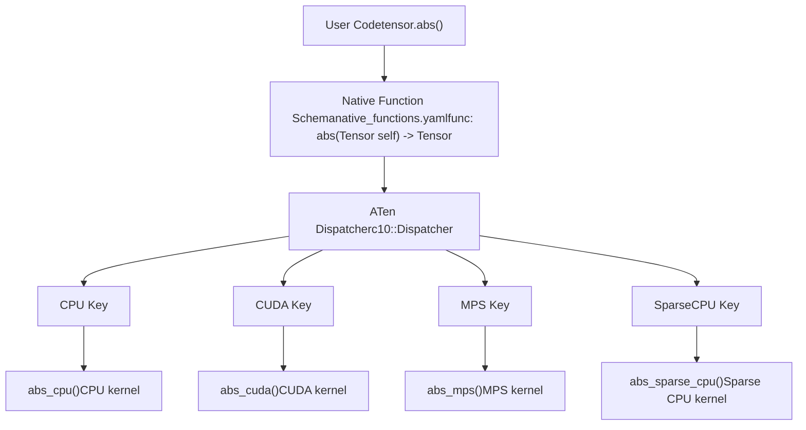
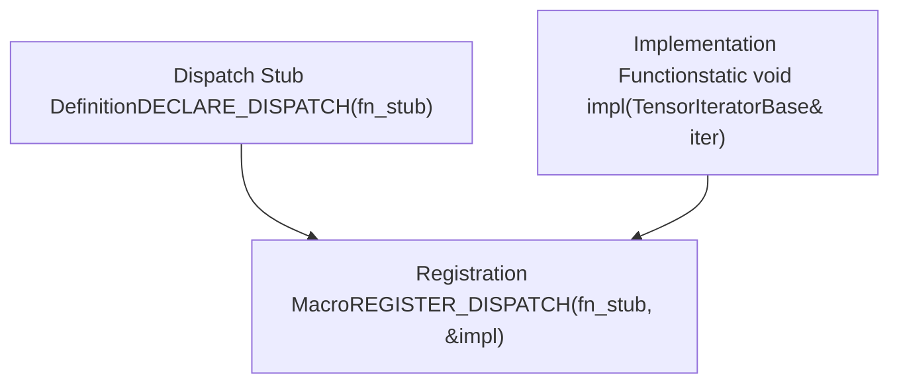
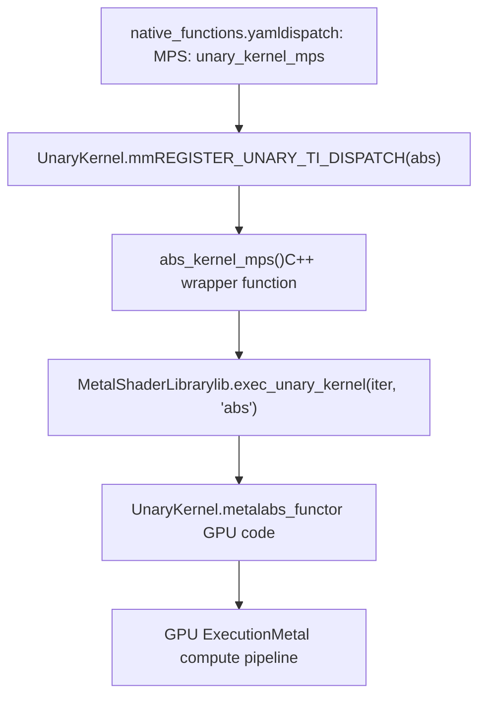
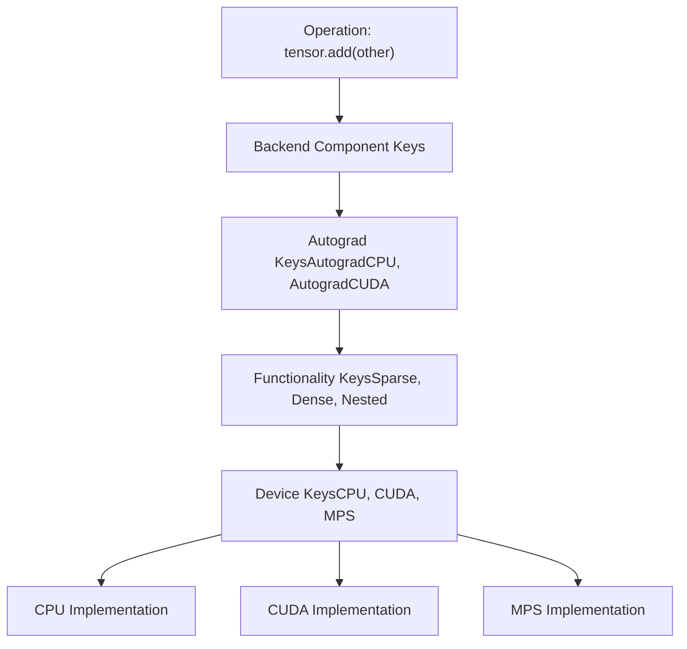
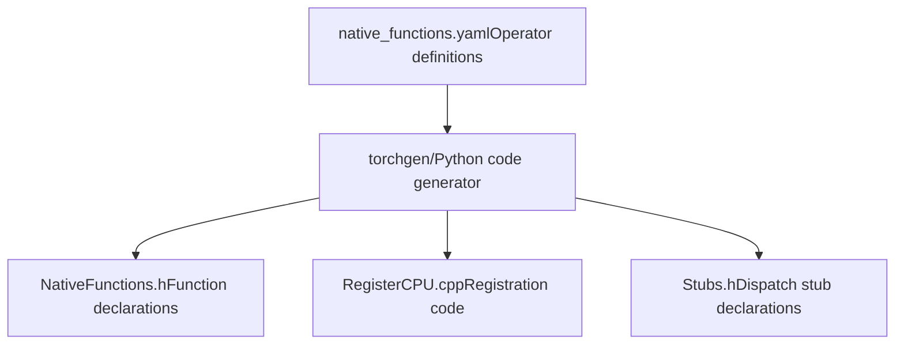

# Native Function Registration and Dispatch

Relevant source files

-   [aten/src/ATen/native/cudnn/ConvShared.cpp](https://github.com/pytorch/pytorch/blob/915982a4/aten/src/ATen/native/cudnn/ConvShared.cpp)
-   [aten/src/ATen/native/mkldnn/Conv.cpp](https://github.com/pytorch/pytorch/blob/915982a4/aten/src/ATen/native/mkldnn/Conv.cpp)
-   [aten/src/ATen/native/mkldnn/Linear.cpp](https://github.com/pytorch/pytorch/blob/915982a4/aten/src/ATen/native/mkldnn/Linear.cpp)
-   [aten/src/ATen/native/mkldnn/Matmul.cpp](https://github.com/pytorch/pytorch/blob/915982a4/aten/src/ATen/native/mkldnn/Matmul.cpp)
-   [aten/src/ATen/native/mps/kernels/CrossKernel.metal](https://github.com/pytorch/pytorch/blob/915982a4/aten/src/ATen/native/mps/kernels/CrossKernel.metal)
-   [aten/src/ATen/native/mps/kernels/Distributions.metal](https://github.com/pytorch/pytorch/blob/915982a4/aten/src/ATen/native/mps/kernels/Distributions.metal)
-   [aten/src/ATen/native/mps/kernels/Indexing.h](https://github.com/pytorch/pytorch/blob/915982a4/aten/src/ATen/native/mps/kernels/Indexing.h)
-   [aten/src/ATen/native/mps/kernels/Indexing.metal](https://github.com/pytorch/pytorch/blob/915982a4/aten/src/ATen/native/mps/kernels/Indexing.metal)
-   [aten/src/ATen/native/mps/kernels/LinearAlgebra.h](https://github.com/pytorch/pytorch/blob/915982a4/aten/src/ATen/native/mps/kernels/LinearAlgebra.h)
-   [aten/src/ATen/native/mps/kernels/LinearAlgebra.metal](https://github.com/pytorch/pytorch/blob/915982a4/aten/src/ATen/native/mps/kernels/LinearAlgebra.metal)
-   [aten/src/ATen/native/mps/operations/CrossKernel.mm](https://github.com/pytorch/pytorch/blob/915982a4/aten/src/ATen/native/mps/operations/CrossKernel.mm)
-   [aten/src/ATen/native/mps/operations/Distributions.mm](https://github.com/pytorch/pytorch/blob/915982a4/aten/src/ATen/native/mps/operations/Distributions.mm)
-   [aten/src/ATen/native/mps/operations/Indexing.mm](https://github.com/pytorch/pytorch/blob/915982a4/aten/src/ATen/native/mps/operations/Indexing.mm)
-   [aten/src/ATen/native/mps/operations/LinearAlgebra.mm](https://github.com/pytorch/pytorch/blob/915982a4/aten/src/ATen/native/mps/operations/LinearAlgebra.mm)
-   [aten/src/ATen/native/mps/operations/Pad.mm](https://github.com/pytorch/pytorch/blob/915982a4/aten/src/ATen/native/mps/operations/Pad.mm)
-   [aten/src/ATen/native/mps/operations/ScanKernel.mm](https://github.com/pytorch/pytorch/blob/915982a4/aten/src/ATen/native/mps/operations/ScanKernel.mm)
-   [aten/src/ATen/native/mps/operations/UpSample.mm](https://github.com/pytorch/pytorch/blob/915982a4/aten/src/ATen/native/mps/operations/UpSample.mm)
-   [aten/src/ATen/native/native\_functions.yaml](https://github.com/pytorch/pytorch/blob/915982a4/aten/src/ATen/native/native_functions.yaml)
-   [aten/src/ATen/native/sparse/SoftMax.cpp](https://github.com/pytorch/pytorch/blob/915982a4/aten/src/ATen/native/sparse/SoftMax.cpp)
-   [aten/src/ATen/native/sparse/mps/SparseMPSTensorMath.mm](https://github.com/pytorch/pytorch/blob/915982a4/aten/src/ATen/native/sparse/mps/SparseMPSTensorMath.mm)
-   [aten/src/ATen/native/sparse/mps/kernels/SparseTensorMath.metal](https://github.com/pytorch/pytorch/blob/915982a4/aten/src/ATen/native/sparse/mps/kernels/SparseTensorMath.metal)
-   [c10/metal/atomic.h](https://github.com/pytorch/pytorch/blob/915982a4/c10/metal/atomic.h)
-   [test/distributed/tensor/test\_strategy\_validation.py](https://github.com/pytorch/pytorch/blob/915982a4/test/distributed/tensor/test_strategy_validation.py)
-   [test/nn/test\_dropout.py](https://github.com/pytorch/pytorch/blob/915982a4/test/nn/test_dropout.py)
-   [test/test\_indexing.py](https://github.com/pytorch/pytorch/blob/915982a4/test/test_indexing.py)
-   [test/test\_jiterator.py](https://github.com/pytorch/pytorch/blob/915982a4/test/test_jiterator.py)
-   [test/test\_mps.py](https://github.com/pytorch/pytorch/blob/915982a4/test/test_mps.py)
-   [test/test\_sparse.py](https://github.com/pytorch/pytorch/blob/915982a4/test/test_sparse.py)
-   [torch/csrc/autograd/python\_variable\_indexing.cpp](https://github.com/pytorch/pytorch/blob/915982a4/torch/csrc/autograd/python_variable_indexing.cpp)
-   [torch/distributed/tensor/\_ops/strategy\_validation.py](https://github.com/pytorch/pytorch/blob/915982a4/torch/distributed/tensor/_ops/strategy_validation.py)
-   [torch/testing/\_comparison.py](https://github.com/pytorch/pytorch/blob/915982a4/torch/testing/_comparison.py)
-   [torch/testing/\_internal/common\_methods\_invocations.py](https://github.com/pytorch/pytorch/blob/915982a4/torch/testing/_internal/common_methods_invocations.py)
-   [torch/testing/\_internal/common\_mps.py](https://github.com/pytorch/pytorch/blob/915982a4/torch/testing/_internal/common_mps.py)
-   [torch/testing/\_internal/opinfo/core.py](https://github.com/pytorch/pytorch/blob/915982a4/torch/testing/_internal/opinfo/core.py)
-   [torch/testing/\_internal/opinfo/definitions/\_masked.py](https://github.com/pytorch/pytorch/blob/915982a4/torch/testing/_internal/opinfo/definitions/_masked.py)
-   [torch/testing/\_internal/opinfo/definitions/linalg.py](https://github.com/pytorch/pytorch/blob/915982a4/torch/testing/_internal/opinfo/definitions/linalg.py)
-   [torch/testing/\_internal/opinfo/definitions/special.py](https://github.com/pytorch/pytorch/blob/915982a4/torch/testing/_internal/opinfo/definitions/special.py)

## Purpose and Scope

This document describes how PyTorch operators are defined in `native_functions.yaml` and dispatched to device-specific implementations. It covers the operator schema specification, the dispatch key system, and registration mechanisms that connect high-level operator definitions to backend implementations (CPU, CUDA, MPS, etc.).

For information about the OpInfo testing framework that validates these operators, see [3.1.2](/pytorch/pytorch/3.1.2-opinfo-testing-framework). For details about specific backend implementations, see [3.2](/pytorch/pytorch/3.2-cuda-backend) (CUDA) and [3.3](/pytorch/pytorch/3.3-mps-backend-(metal-performance-shaders)) (MPS).

---

## Native Functions YAML: Operator Definition

All PyTorch native operators are defined in a single source of truth: `native_functions.yaml`. This YAML file specifies the operator schema, dispatch behavior, and metadata for code generation.

### Operator Schema Structure

Each operator entry in `native_functions.yaml` follows this structure:

```
- func: operator_name(Tensor self, ...) -> ReturnType  variants: function, method  dispatch:    CPU: cpu_impl_func    CUDA: cuda_impl_func    MPS: mps_impl_func  device_check: CheckType  tags: [tag1, tag2]
```
**Key Fields:**

-   **func**: C++ function signature defining inputs, outputs, and mutability annotations
-   **variants**: Whether the operator is available as `torch.func()` and/or `tensor.method()`
-   **dispatch**: Maps dispatch keys to implementation function names
-   **device\_check**: Controls device compatibility checking (e.g., `NoCheck`, default)
-   **tags**: Metadata for autograd, sparsity, determinism, etc.

Sources: [aten/src/ATen/native/native\_functions.yaml1-100](https://github.com/pytorch/pytorch/blob/915982a4/aten/src/ATen/native/native_functions.yaml#L1-L100)

### Dispatch Key System

The `dispatch` field routes operator calls to backend-specific implementations using **dispatch keys**:

| Dispatch Key | Target Backend | Example Use Case |
| --- | --- | --- |
| `CPU` | CPU tensor operations | Default CPU implementation |
| `CUDA` | NVIDIA GPU via CUDA | GPU-accelerated operations |
| `MPS` | Apple Silicon GPU via Metal | Mac GPU acceleration |
| `SparseCPU` / `SparseCUDA` | Sparse tensor layouts | Sparse matrix operations |
| `CompositeExplicitAutograd` | Cross-backend fallback | Implementation works on any device |
| `Meta` | Shape/dtype inference only | No actual computation |

**Example from native\_functions.yaml:**

[aten/src/ATen/native/native\_functions.yaml286-294](https://github.com/pytorch/pytorch/blob/915982a4/aten/src/ATen/native/native_functions.yaml#L286-L294)

```
- func: native_dropout(Tensor input, float p, bool? train) -> (Tensor, Tensor)  variants: function  dispatch:    CPU: native_dropout_cpu    CUDA: native_dropout_cuda    MPS: native_dropout_mps  tags: [nondeterministic_seeded, core]
```
This shows `native_dropout` dispatching to three different implementations based on tensor device.

Sources: [aten/src/ATen/native/native\_functions.yaml286-294](https://github.com/pytorch/pytorch/blob/915982a4/aten/src/ATen/native/native_functions.yaml#L286-L294)

---

## Dispatch Architecture


**Dispatch Flow:**

1.  User calls `tensor.abs()`
2.  Dispatcher examines tensor's device and layout
3.  Dispatcher selects appropriate dispatch key (e.g., `MPS` for Apple Silicon)
4.  Registered kernel function executes (e.g., `abs_mps`)

Sources: [aten/src/ATen/native/native\_functions.yaml340-365](https://github.com/pytorch/pytorch/blob/915982a4/aten/src/ATen/native/native_functions.yaml#L340-L365) High-level architecture diagrams

---

## Registration Mechanisms

Backends register their implementations with the dispatcher using `REGISTER_DISPATCH` macros or direct kernel registration.

### REGISTER\_DISPATCH Macro Pattern

The `REGISTER_DISPATCH` macro connects dispatch keys to implementation functions:


**Example from MPS Binary Operations:**

[aten/src/ATen/native/mps/operations/BinaryKernel.mm235-268](https://github.com/pytorch/pytorch/blob/915982a4/aten/src/ATen/native/mps/operations/BinaryKernel.mm#L235-L268)

```
// Define kernel implementationsstatic void atan2_mps_kernel(TensorIteratorBase& iter) {  lib.exec_binary_kernel(iter, "atan2");} static void fmax_mps_kernel(TensorIteratorBase& iter) {  if (isFloatingType(iter.common_dtype())) {    lib.exec_binary_kernel(iter, "fmax");  }} // Register with dispatcherREGISTER_DISPATCH(atan2_stub, &atan2_mps_kernel)REGISTER_DISPATCH(fmax_stub, &fmax_mps_kernel)REGISTER_DISPATCH(mul_stub, &mul_mps_kernel)
```
This pattern appears throughout backend implementations:

-   **Stub declaration** in `NativeFunctions.h` (auto-generated)
-   **Implementation** in backend-specific `.mm`/`.cpp` files
-   **Registration** via `REGISTER_DISPATCH` at file scope

Sources: [aten/src/ATen/native/mps/operations/BinaryKernel.mm235-269](https://github.com/pytorch/pytorch/blob/915982a4/aten/src/ATen/native/mps/operations/BinaryKernel.mm#L235-L269)

### Sparse Tensor Dispatch Example

Sparse tensors use specialized dispatch keys to route to sparse-optimized implementations:

[aten/src/ATen/native/native\_functions.yaml340-365](https://github.com/pytorch/pytorch/blob/915982a4/aten/src/ATen/native/native_functions.yaml#L340-L365)

```
- func: abs(Tensor self) -> Tensor  variants: function, method  dispatch:    CompositeExplicitAutograd: abs    SparseCPU, SparseCUDA, SparseMPS: abs_sparse    SparseCsrCPU, SparseCsrCUDA, SparseCsrMPS: abs_sparse_csr
```
This shows:

-   Dense tensors use `CompositeExplicitAutograd` (generic implementation)
-   Sparse COO tensors use `abs_sparse` (all devices)
-   Sparse CSR tensors use `abs_sparse_csr` (compressed sparse row format)

Sources: [aten/src/ATen/native/native\_functions.yaml340-366](https://github.com/pytorch/pytorch/blob/915982a4/aten/src/ATen/native/native_functions.yaml#L340-L366)

---

## Device-Specific Implementation: MPS Backend Example

The MPS (Metal Performance Shaders) backend demonstrates the complete registration-to-execution flow.

### MPS Registration Pipeline


### MPS Unary Operation Registration

[aten/src/ATen/native/mps/operations/UnaryKernel.mm18-86](https://github.com/pytorch/pytorch/blob/915982a4/aten/src/ATen/native/mps/operations/UnaryKernel.mm#L18-L86)

```
// Registration macro that generates kernel function#define REGISTER_UNARY_TI_DISPATCH(NAME)                    \  static void NAME##_kernel_mps(TensorIteratorBase& iter) { \    lib.exec_unary_kernel(iter, #NAME);                     \  }                                                         \  REGISTER_DISPATCH(NAME##_stub, NAME##_kernel_mps) // Register multiple unary opsREGISTER_UNARY_TI_DISPATCH(exp);REGISTER_UNARY_TI_DISPATCH(abs);REGISTER_UNARY_TI_DISPATCH(sin);REGISTER_UNARY_TI_DISPATCH(sqrt);
```
This macro:

1.  Creates wrapper function `{NAME}_kernel_mps`
2.  Calls `lib.exec_unary_kernel()` with operation name string
3.  Registers wrapper with dispatcher via `REGISTER_DISPATCH`

Sources: [aten/src/ATen/native/mps/operations/UnaryKernel.mm17-86](https://github.com/pytorch/pytorch/blob/915982a4/aten/src/ATen/native/mps/operations/UnaryKernel.mm#L17-L86)

### Metal Shader Implementation

The actual GPU computation is in Metal Shading Language:

[aten/src/ATen/native/mps/kernels/UnaryKernel.metal87-96](https://github.com/pytorch/pytorch/blob/915982a4/aten/src/ATen/native/mps/kernels/UnaryKernel.metal#L87-L96)

```
struct abs_functor {  template <typename T, enable_if_t<!is_complex_v<T>, bool> = true>  inline T operator()(const T x) {    return static_cast<T>(precise::abs(x));  }  template <typename T, enable_if_t<is_complex_v<T>, bool> = true>  inline T operator()(const T x) {    return T(::precise::sqrt(dot(x, x)), 0);  }};
```
The `exec_unary_kernel` function (in MetalShaderLibrary) instantiates this functor for the appropriate dtype and dispatches it to GPU.

Sources: [aten/src/ATen/native/mps/kernels/UnaryKernel.metal87-96](https://github.com/pytorch/pytorch/blob/915982a4/aten/src/ATen/native/mps/kernels/UnaryKernel.metal#L87-L96) [aten/src/ATen/native/mps/operations/UnaryKernel.mm18-22](https://github.com/pytorch/pytorch/blob/915982a4/aten/src/ATen/native/mps/operations/UnaryKernel.mm#L18-L22)

---

## Sparse Operation Dispatch Example

Sparse tensors demonstrate multi-level dispatch with device and layout combinations.

### Sparse MPS Dispatch Table

[aten/src/ATen/native/native\_functions.yaml554-593](https://github.com/pytorch/pytorch/blob/915982a4/aten/src/ATen/native/native_functions.yaml#L554-L593)

```
- func: add.Tensor(Tensor self, Tensor other, *, Scalar alpha=1) -> Tensor  dispatch:    SparseCPU, SparseCUDA, SparseMPS, SparseMeta: add_sparse    SparseCsrCPU, SparseCsrCUDA, SparseCsrMeta: add_sparse_csr    MkldnnCPU: mkldnn_add    ZeroTensor: add_zerotensor    NestedTensorCPU, NestedTensorCUDA: NestedTensor_add_Tensor
```
This shows **layout-specific dispatch**: sparse COO, sparse CSR, dense, and nested tensors all have different implementations of `add`.

### Sparse MPS Implementation

[aten/src/ATen/native/sparse/mps/SparseMPSTensorMath.mm55-146](https://github.com/pytorch/pytorch/blob/915982a4/aten/src/ATen/native/sparse/mps/SparseMPSTensorMath.mm#L55-L146)

The sparse MPS implementation for `addmm` (sparse-dense matrix multiply):

```
static Tensor& s_addmm_out_sparse_dense_mps(    Tensor& r,    const Tensor& t,    const SparseTensor& sparse_,    const Tensor& dense,    const Scalar& beta,    const Scalar& alpha) {    // Coalesce sparse tensor  auto sparse = sparse_.coalesce();  const int64_t nnz = sparse._nnz();    // Extract indices and values  auto indices2d = sparse._indices().contiguous();  auto values = sparse._values().to(compute_dtype);    // Dispatch Metal kernel  dispatch_sync_with_rethrow(stream->queue(), ^() {    auto pso = lib.getPipelineStateForFunc("spmm_addmm_coo_" + dtype);    // ... kernel launch code  });}
```
This function:

1.  Coalesces sparse tensor to canonical form
2.  Extracts sparse indices and values
3.  Launches Metal compute kernel `spmm_addmm_coo`
4.  Returns result tensor

Sources: [aten/src/ATen/native/sparse/mps/SparseMPSTensorMath.mm55-146](https://github.com/pytorch/pytorch/blob/915982a4/aten/src/ATen/native/sparse/mps/SparseMPSTensorMath.mm#L55-L146)

### Sparse Metal Kernel

[aten/src/ATen/native/sparse/mps/kernels/SparseTensorMath.metal244-282](https://github.com/pytorch/pytorch/blob/915982a4/aten/src/ATen/native/sparse/mps/kernels/SparseTensorMath.metal#L244-L282)

```
template <typename T>kernel void spmm_addmm_coo(    device const long*   indices2d,    device const T*      vals,    device const T*      dense,    device const T*      t_in,    device T*            out,    constant uint3&      dims,    constant float2&     alpha_beta,    constant uint&       nnz,    uint3                tid [[thread_position_in_grid]]){  // Compute sparse matrix multiply on GPU  device const long* rows = indices2d;  device const long* cols = indices2d + nnz;    // Find row range using binary search  const uint start = lower_bound_i64(rows, 0u, nnz, (long)i);  const uint end = upper_bound_i64(rows, 0u, nnz, (long)i);    // Accumulate sparse row dot product  for (uint p = start; p < end; ++p) {    acc += mul(vals[p], dense[cols[p] * K + k]);  }    out[off] = base + alpha * acc;}
```
Sources: [aten/src/ATen/native/sparse/mps/kernels/SparseTensorMath.metal244-282](https://github.com/pytorch/pytorch/blob/915982a4/aten/src/ATen/native/sparse/mps/kernels/SparseTensorMath.metal#L244-L282)

---

## Dispatch Key Hierarchy

PyTorch's dispatcher supports a hierarchical key system where certain keys can "catch" operations before device-specific keys:


**Dispatch Priority (highest to lowest):**

1.  **Autograd keys**: Capture operations for gradient tracking
2.  **Functionality keys**: Layout-specific dispatch (Sparse, Quantized)
3.  **Backend keys**: Device-specific implementations (CPU, CUDA, MPS)
4.  **Fallback keys**: Generic implementations (CompositeExplicitAutograd)

Sources: [aten/src/ATen/native/native\_functions.yaml554-594](https://github.com/pytorch/pytorch/blob/915982a4/aten/src/ATen/native/native_functions.yaml#L554-L594) High-level architecture

---

## CompositeExplicitAutograd: Cross-Backend Implementations

The `CompositeExplicitAutograd` dispatch key allows writing implementations that work on any device:

[aten/src/ATen/native/native\_functions.yaml195-213](https://github.com/pytorch/pytorch/blob/915982a4/aten/src/ATen/native/native_functions.yaml#L195-L213)

```
- func: _print(str s) -> ()  dispatch:    CompositeExplicitAutograd: _print - func: sym_constrain_range(Scalar size, *, int? min=None, int? max=None) -> ()  dispatch:    CompositeExplicitAutograd: sym_constrain_range - func: _functional_sym_constrain_range(Scalar size, int? min, int? max, Tensor dep_token) -> Tensor  dispatch:    CompositeExplicitAutograd: _functional_sym_constrain_range
```
**CompositeExplicitAutograd** means:

-   Implementation works on tensors from any device
-   Does **not** automatically generate backward pass (unlike `CompositeImplicitAutograd`)
-   Backend implementer must manually define gradients if needed

This is useful for operations that:

-   Only manipulate metadata (reshape, view)
-   Compose existing operators (decompositions)
-   Perform device-agnostic logic

Sources: [aten/src/ATen/native/native\_functions.yaml195-213](https://github.com/pytorch/pytorch/blob/915982a4/aten/src/ATen/native/native_functions.yaml#L195-L213)

---

## Code Generation: YAML to C++

The `torchgen` system (see [5.1](/pytorch/pytorch/5.1-build-system-and-code-generation)) generates C++ code from `native_functions.yaml`:


**Generated Artifacts:**

-   **Function declarations**: Public API in `Functions.h`
-   **Dispatcher registration**: Connects schemas to dispatch tables
-   **Dispatch stubs**: Declarations for backend implementation points
-   **Python bindings**: PyTorch Python API exposure

The build system invokes `torchgen` before compilation, ensuring all operator definitions are synchronized across the codebase.

Sources: High-level architecture Diagram 4, [5.1](/pytorch/pytorch/5.1-build-system-and-code-generation) reference

---

## Structured Kernels and TensorIterator

Many operators use the **structured kernel** pattern with `TensorIterator` for automatic broadcasting and dtype handling:

[aten/src/ATen/native/native\_functions.yaml447-455](https://github.com/pytorch/pytorch/blob/915982a4/aten/src/ATen/native/native_functions.yaml#L447-L455)

```
- func: sgn.out(Tensor self, *, Tensor(a!) out) -> Tensor(a!)  structured: True  structured_inherits: TensorIteratorBase  dispatch:    CPU, CUDA: sgn_out    MPS: sgn_out_mps
```
**Structured Kernel Benefits:**

-   Automatic output tensor allocation
-   Broadcasting logic handled by framework
-   Consistent striding and memory layout handling

[aten/src/ATen/native/mps/operations/BinaryKernel.mm48-58](https://github.com/pytorch/pytorch/blob/915982a4/aten/src/ATen/native/mps/operations/BinaryKernel.mm#L48-L58)

The MPS binary kernel uses `TensorIterator` to handle all tensor configurations:

```
auto iter = TensorIteratorConfig()                .allow_cpu_scalars(true)                .add_output(output)                .add_input(input)                .add_input(other)                .check_all_same_dtype(false)                .promote_inputs_to_common_dtype(true)                .build(); lib.exec_binary_kernel(iter, func_name, alpha);
```
Sources: [aten/src/ATen/native/native\_functions.yaml447-455](https://github.com/pytorch/pytorch/blob/915982a4/aten/src/ATen/native/native_functions.yaml#L447-L455) [aten/src/ATen/native/mps/operations/BinaryKernel.mm48-58](https://github.com/pytorch/pytorch/blob/915982a4/aten/src/ATen/native/mps/operations/BinaryKernel.mm#L48-L58)

---

## Testing and Validation

Operators defined in `native_functions.yaml` are systematically tested using the OpInfo framework (see [3.1.2](/pytorch/pytorch/3.1.2-opinfo-testing-framework) for details).

**Test Coverage:**

-   **Dtype validation**: All supported dtypes for each device
-   **Shape broadcasting**: Various input shape combinations
-   **Gradient checking**: Autograd correctness
-   **Device compatibility**: CPU, CUDA, MPS consistency

[test/test\_sparse.py23-28](https://github.com/pytorch/pytorch/blob/915982a4/test/test_sparse.py#L23-L28)

```
from torch.testing._internal.common_device_type import (    instantiate_device_type_tests, ops, dtypes,     onlyCPU, onlyCUDA, expectedFailureMPS)
```
The test infrastructure automatically parameterizes tests across devices and dtypes, ensuring consistent behavior across all dispatch paths.

Sources: [test/test\_sparse.py23-28](https://github.com/pytorch/pytorch/blob/915982a4/test/test_sparse.py#L23-L28) [3.1.2](/pytorch/pytorch/3.1.2-opinfo-testing-framework) reference
