# OpInfo Testing Framework

Relevant source files

-   [aten/src/ATen/native/cudnn/ConvShared.cpp](https://github.com/pytorch/pytorch/blob/915982a4/aten/src/ATen/native/cudnn/ConvShared.cpp)
-   [aten/src/ATen/native/mkldnn/Conv.cpp](https://github.com/pytorch/pytorch/blob/915982a4/aten/src/ATen/native/mkldnn/Conv.cpp)
-   [aten/src/ATen/native/mkldnn/Linear.cpp](https://github.com/pytorch/pytorch/blob/915982a4/aten/src/ATen/native/mkldnn/Linear.cpp)
-   [aten/src/ATen/native/mkldnn/Matmul.cpp](https://github.com/pytorch/pytorch/blob/915982a4/aten/src/ATen/native/mkldnn/Matmul.cpp)
-   [aten/src/ATen/native/mps/kernels/CrossKernel.metal](https://github.com/pytorch/pytorch/blob/915982a4/aten/src/ATen/native/mps/kernels/CrossKernel.metal)
-   [aten/src/ATen/native/mps/kernels/Distributions.metal](https://github.com/pytorch/pytorch/blob/915982a4/aten/src/ATen/native/mps/kernels/Distributions.metal)
-   [aten/src/ATen/native/mps/kernels/Indexing.h](https://github.com/pytorch/pytorch/blob/915982a4/aten/src/ATen/native/mps/kernels/Indexing.h)
-   [aten/src/ATen/native/mps/kernels/Indexing.metal](https://github.com/pytorch/pytorch/blob/915982a4/aten/src/ATen/native/mps/kernels/Indexing.metal)
-   [aten/src/ATen/native/mps/kernels/LinearAlgebra.h](https://github.com/pytorch/pytorch/blob/915982a4/aten/src/ATen/native/mps/kernels/LinearAlgebra.h)
-   [aten/src/ATen/native/mps/kernels/LinearAlgebra.metal](https://github.com/pytorch/pytorch/blob/915982a4/aten/src/ATen/native/mps/kernels/LinearAlgebra.metal)
-   [aten/src/ATen/native/mps/operations/CrossKernel.mm](https://github.com/pytorch/pytorch/blob/915982a4/aten/src/ATen/native/mps/operations/CrossKernel.mm)
-   [aten/src/ATen/native/mps/operations/Distributions.mm](https://github.com/pytorch/pytorch/blob/915982a4/aten/src/ATen/native/mps/operations/Distributions.mm)
-   [aten/src/ATen/native/mps/operations/Indexing.mm](https://github.com/pytorch/pytorch/blob/915982a4/aten/src/ATen/native/mps/operations/Indexing.mm)
-   [aten/src/ATen/native/mps/operations/LinearAlgebra.mm](https://github.com/pytorch/pytorch/blob/915982a4/aten/src/ATen/native/mps/operations/LinearAlgebra.mm)
-   [aten/src/ATen/native/mps/operations/Pad.mm](https://github.com/pytorch/pytorch/blob/915982a4/aten/src/ATen/native/mps/operations/Pad.mm)
-   [aten/src/ATen/native/mps/operations/ScanKernel.mm](https://github.com/pytorch/pytorch/blob/915982a4/aten/src/ATen/native/mps/operations/ScanKernel.mm)
-   [aten/src/ATen/native/mps/operations/UpSample.mm](https://github.com/pytorch/pytorch/blob/915982a4/aten/src/ATen/native/mps/operations/UpSample.mm)
-   [aten/src/ATen/native/native\_functions.yaml](https://github.com/pytorch/pytorch/blob/915982a4/aten/src/ATen/native/native_functions.yaml)
-   [aten/src/ATen/native/sparse/SoftMax.cpp](https://github.com/pytorch/pytorch/blob/915982a4/aten/src/ATen/native/sparse/SoftMax.cpp)
-   [aten/src/ATen/native/sparse/mps/SparseMPSTensorMath.mm](https://github.com/pytorch/pytorch/blob/915982a4/aten/src/ATen/native/sparse/mps/SparseMPSTensorMath.mm)
-   [aten/src/ATen/native/sparse/mps/kernels/SparseTensorMath.metal](https://github.com/pytorch/pytorch/blob/915982a4/aten/src/ATen/native/sparse/mps/kernels/SparseTensorMath.metal)
-   [c10/metal/atomic.h](https://github.com/pytorch/pytorch/blob/915982a4/c10/metal/atomic.h)
-   [docs/source/distributed.md](https://github.com/pytorch/pytorch/blob/915982a4/docs/source/distributed.md)
-   [test/distributed/tensor/test\_strategy\_validation.py](https://github.com/pytorch/pytorch/blob/915982a4/test/distributed/tensor/test_strategy_validation.py)
-   [test/distributed/test\_c10d\_nccl.py](https://github.com/pytorch/pytorch/blob/915982a4/test/distributed/test_c10d_nccl.py)
-   [test/jit/test\_autodiff\_subgraph\_slicing.py](https://github.com/pytorch/pytorch/blob/915982a4/test/jit/test_autodiff_subgraph_slicing.py)
-   [test/nn/test\_dropout.py](https://github.com/pytorch/pytorch/blob/915982a4/test/nn/test_dropout.py)
-   [test/test\_indexing.py](https://github.com/pytorch/pytorch/blob/915982a4/test/test_indexing.py)
-   [test/test\_jit.py](https://github.com/pytorch/pytorch/blob/915982a4/test/test_jit.py)
-   [test/test\_jit\_autocast.py](https://github.com/pytorch/pytorch/blob/915982a4/test/test_jit_autocast.py)
-   [test/test\_jit\_fuser.py](https://github.com/pytorch/pytorch/blob/915982a4/test/test_jit_fuser.py)
-   [test/test\_jit\_fuser\_legacy.py](https://github.com/pytorch/pytorch/blob/915982a4/test/test_jit_fuser_legacy.py)
-   [test/test\_jit\_fuser\_te.py](https://github.com/pytorch/pytorch/blob/915982a4/test/test_jit_fuser_te.py)
-   [test/test\_jit\_legacy.py](https://github.com/pytorch/pytorch/blob/915982a4/test/test_jit_legacy.py)
-   [test/test\_jiterator.py](https://github.com/pytorch/pytorch/blob/915982a4/test/test_jiterator.py)
-   [test/test\_mps.py](https://github.com/pytorch/pytorch/blob/915982a4/test/test_mps.py)
-   [test/test\_sparse.py](https://github.com/pytorch/pytorch/blob/915982a4/test/test_sparse.py)
-   [torch/csrc/autograd/python\_variable\_indexing.cpp](https://github.com/pytorch/pytorch/blob/915982a4/torch/csrc/autograd/python_variable_indexing.cpp)
-   [torch/csrc/distributed/c10d/Backend.hpp](https://github.com/pytorch/pytorch/blob/915982a4/torch/csrc/distributed/c10d/Backend.hpp)
-   [torch/csrc/distributed/c10d/NCCLUtils.cpp](https://github.com/pytorch/pytorch/blob/915982a4/torch/csrc/distributed/c10d/NCCLUtils.cpp)
-   [torch/csrc/distributed/c10d/NCCLUtils.hpp](https://github.com/pytorch/pytorch/blob/915982a4/torch/csrc/distributed/c10d/NCCLUtils.hpp)
-   [torch/csrc/distributed/c10d/ProcessGroupNCCL.cpp](https://github.com/pytorch/pytorch/blob/915982a4/torch/csrc/distributed/c10d/ProcessGroupNCCL.cpp)
-   [torch/csrc/distributed/c10d/ProcessGroupNCCL.hpp](https://github.com/pytorch/pytorch/blob/915982a4/torch/csrc/distributed/c10d/ProcessGroupNCCL.hpp)
-   [torch/distributed/distributed\_c10d.py](https://github.com/pytorch/pytorch/blob/915982a4/torch/distributed/distributed_c10d.py)
-   [torch/distributed/tensor/\_ops/strategy\_validation.py](https://github.com/pytorch/pytorch/blob/915982a4/torch/distributed/tensor/_ops/strategy_validation.py)
-   [torch/testing/\_comparison.py](https://github.com/pytorch/pytorch/blob/915982a4/torch/testing/_comparison.py)
-   [torch/testing/\_internal/common\_distributed.py](https://github.com/pytorch/pytorch/blob/915982a4/torch/testing/_internal/common_distributed.py)
-   [torch/testing/\_internal/common\_fsdp.py](https://github.com/pytorch/pytorch/blob/915982a4/torch/testing/_internal/common_fsdp.py)
-   [torch/testing/\_internal/common\_methods\_invocations.py](https://github.com/pytorch/pytorch/blob/915982a4/torch/testing/_internal/common_methods_invocations.py)
-   [torch/testing/\_internal/common\_mps.py](https://github.com/pytorch/pytorch/blob/915982a4/torch/testing/_internal/common_mps.py)
-   [torch/testing/\_internal/common\_nn.py](https://github.com/pytorch/pytorch/blob/915982a4/torch/testing/_internal/common_nn.py)
-   [torch/testing/\_internal/common\_utils.py](https://github.com/pytorch/pytorch/blob/915982a4/torch/testing/_internal/common_utils.py)
-   [torch/testing/\_internal/distributed/distributed\_test.py](https://github.com/pytorch/pytorch/blob/915982a4/torch/testing/_internal/distributed/distributed_test.py)
-   [torch/testing/\_internal/opinfo/core.py](https://github.com/pytorch/pytorch/blob/915982a4/torch/testing/_internal/opinfo/core.py)
-   [torch/testing/\_internal/opinfo/definitions/\_masked.py](https://github.com/pytorch/pytorch/blob/915982a4/torch/testing/_internal/opinfo/definitions/_masked.py)
-   [torch/testing/\_internal/opinfo/definitions/linalg.py](https://github.com/pytorch/pytorch/blob/915982a4/torch/testing/_internal/opinfo/definitions/linalg.py)
-   [torch/testing/\_internal/opinfo/definitions/special.py](https://github.com/pytorch/pytorch/blob/915982a4/torch/testing/_internal/opinfo/definitions/special.py)

The OpInfo Testing Framework is PyTorch's systematic testing infrastructure for validating ~1000+ operators across devices, dtypes, and execution modes. It provides a declarative way to specify operator metadata, generate test inputs, and validate behavior consistency across CPU, CUDA, MPS, and other backends.

## Overview

The OpInfo framework enables comprehensive operator testing through:

-   **Declarative operator metadata** via the `OpInfo` class
-   **Automated sample input generation** for diverse test cases
-   **Cross-backend validation** ensuring CPU, CUDA, MPS consistency
-   **Gradient testing** with `gradcheck` and autograd validation
-   **Reference implementations** for numerical correctness verification
-   **Device-specific customization** via modifier functions like `mps_ops_modifier`

The framework is central to PyTorch's quality assurance, automatically generating test cases for operations defined in `native_functions.yaml` and validating their implementations across hardware backends.

**Sources:** [torch/testing/\_internal/common\_methods\_invocations.py1-123](https://github.com/pytorch/pytorch/blob/915982a4/torch/testing/_internal/common_methods_invocations.py#L1-L123) [torch/testing/\_internal/opinfo/core.py1-104](https://github.com/pytorch/pytorch/blob/915982a4/torch/testing/_internal/opinfo/core.py#L1-L104)

## OpInfo Class Structure

The `OpInfo` class is the central data structure that describes an operator for testing purposes. It encapsulates metadata about the operation including its name, dtypes, sample input generators, and testing behavior.

### Core OpInfo Attributes

```mermaid
flowchart TD
    OpInfo["OpInfo(Base Class)"]
    Identity["Identity Attributes"]
    Testing["Testing Configuration"]
    Generation["Input Generation"]
    Validation["Validation"]
    Name["name: str(e.g., 'abs')"]
    Op["op: Callable(e.g., torch.abs)"]
    Variant["variant_test_name: str(e.g., 'out')"]
    Dtypes["dtypes: Sequence[dtype](supported dtypes)"]
    Decorators["decorators: List[DecorateInfo](skip/xfail rules)"]
    Tags["tags: Set[str](e.g., 'core', 'pointwise')"]
    SampleInputFunc["sample_inputs_func: Callable(generates SampleInput)"]
    ErrorInputFunc["error_inputs_func: Callable(generates ErrorInput)"]
    RefInputFunc["reference_inputs_func: Callable(generates reference data)"]
    Ref["ref: Optional[Callable](reference implementation)"]
    Gradcheck["supports_forward_ad: boolsupports_fwgrad_bwgrad: bool"]
    Autograd["supports_autograd: boolsupports_gradgrad: bool"]

    OpInfo --> Identity
    OpInfo --> Testing
    OpInfo --> Generation
    OpInfo --> Validation
    Identity --> Name
    Identity --> Op
    Identity --> Variant
    Testing --> Dtypes
    Testing --> Decorators
    Testing --> Tags
    Generation --> SampleInputFunc
    Generation --> ErrorInputFunc
    Generation --> RefInputFunc
    Validation --> Ref
    Validation --> Gradcheck
    Validation --> Autograd
```
**OpInfo class hierarchy showing key attributes**

### OpInfo Subclasses

The framework provides specialized `OpInfo` subclasses for different operator categories:

| Class | Purpose | Example Operators |
| --- | --- | --- |
| `UnaryUfuncInfo` | Unary element-wise operations | `abs`, `sin`, `exp`, `sqrt` |
| `BinaryUfuncInfo` | Binary element-wise operations | `add`, `mul`, `div`, `pow` |
| `ReductionOpInfo` | Reduction operations | `sum`, `mean`, `max`, `min` |
| `SpectralFuncInfo` | FFT and spectral operations | `fft.fft`, `fft.ifft`, `fft.rfft` |
| `ShapeFuncInfo` | Shape manipulation operations | `reshape`, `view`, `transpose` |
| `ForeachFuncInfo` | Foreach operations | `_foreach_add`, `_foreach_mul` |

**Sources:** [torch/testing/\_internal/opinfo/core.py1-104](https://github.com/pytorch/pytorch/blob/915982a4/torch/testing/_internal/opinfo/core.py#L1-L104) [torch/testing/\_internal/common\_methods\_invocations.py59-109](https://github.com/pytorch/pytorch/blob/915982a4/torch/testing/_internal/common_methods_invocations.py#L59-L109)

## Sample Input Generation

Sample input generation is the process of creating diverse test inputs that exercise operator behavior across dtypes, shapes, and edge cases. Each `OpInfo` specifies a `sample_inputs_func` that generates `SampleInput` objects.

### SampleInput Structure

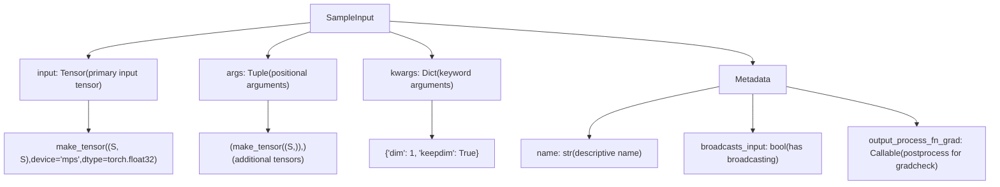
**SampleInput structure and components**

### Sample Input Generation Example

```
# From torch/testing/_internal/common_methods_invocations.pydef sample_inputs_slice(op_info, device, dtype, requires_grad, **kwargs):    make_input = partial(make_tensor, device=device, dtype=dtype,                         low=None, high=None, requires_grad=requires_grad)     yield SampleInput(make_input(3), 0)    yield SampleInput(make_input(20, 30, 40), dim=1, start=1, end=-2)    yield SampleInput(make_input(20, 30, 40), dim=1, start=1, end=-2, step=3)    yield SampleInput(make_input(20, 30, 40), dim=0, start=-10, end=-2, step=2)
```
This generates four test cases with varying tensor dimensions and slice parameters.

**Sources:** [torch/testing/\_internal/common\_methods\_invocations.py174-186](https://github.com/pytorch/pytorch/blob/915982a4/torch/testing/_internal/common_methods_invocations.py#L174-L186) [torch/testing/\_internal/opinfo/core.py1-104](https://github.com/pytorch/pytorch/blob/915982a4/torch/testing/_internal/opinfo/core.py#L1-L104)

### Common Sample Input Patterns

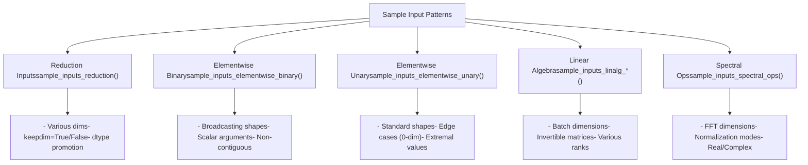
**Common sample input generation patterns**

**Sources:** [torch/testing/\_internal/opinfo/core.py1-104](https://github.com/pytorch/pytorch/blob/915982a4/torch/testing/_internal/opinfo/core.py#L1-L104) [torch/testing/\_internal/common\_methods\_invocations.py174-210](https://github.com/pytorch/pytorch/blob/915982a4/torch/testing/_internal/common_methods_invocations.py#L174-L210) [torch/testing/\_internal/opinfo/definitions/linalg.py1-53](https://github.com/pytorch/pytorch/blob/915982a4/torch/testing/_internal/opinfo/definitions/linalg.py#L1-L53)

## The OpInfo Database (op\_db)

The `op_db` is a comprehensive list of `OpInfo` objects that describes all testable PyTorch operators. It is defined in `torch/testing/_internal/common_methods_invocations.py` and contains ~1000+ operator definitions.

### OpInfo Database Structure

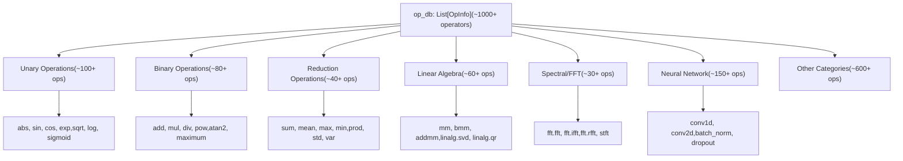
**OpInfo database organization by operator category**

### OpInfo Example: abs Operation

```
# From torch/testing/_internal/common_methods_invocations.pyUnaryUfuncInfo(    'abs',    ref=np.abs,    dtypes=all_types_and_complex_and(torch.half, torch.bfloat16),    dtypesIfMPS=all_types_and(torch.half, torch.bfloat16),    supports_forward_ad=True,    supports_fwgrad_bwgrad=True,    decorators=(        # Skip certain dtypes on specific devices        DecorateInfo(unittest.skip("Skipped!"), 'TestUnaryUfuncs',                      device_type='mps', dtypes=[torch.uint8]),    ),)
```
This defines:

-   Operation name: `'abs'`
-   Reference implementation: `np.abs` (NumPy)
-   Supported dtypes: all numeric types including half precision
-   MPS-specific dtypes: excludes complex types
-   Automatic differentiation: supports forward and forward-backward
-   Device-specific decorators: skips uint8 on MPS

**Sources:** [torch/testing/\_internal/common\_methods\_invocations.py59-109](https://github.com/pytorch/pytorch/blob/915982a4/torch/testing/_internal/common_methods_invocations.py#L59-L109) [test/test\_ops.py99-107](https://github.com/pytorch/pytorch/blob/915982a4/test/test_ops.py#L99-L107)

### OpInfo Database Extensions

The op\_db can be extended with additional operator definitions:

```
# From test/test_mps.pytest_consistency_op_db = copy.deepcopy(op_db) # Add custom operator variant for testingfor op in op_db:    if op.name != "_upsample_bilinear2d_aa":        continue    op = copy.deepcopy(op)    op.name = "_upsample_bicubic2d_aa"    op.op = torch.ops.aten._upsample_bicubic2d_aa    test_consistency_op_db.append(op)    break
```
**Sources:** [test/test\_mps.py52-63](https://github.com/pytorch/pytorch/blob/915982a4/test/test_mps.py#L52-L63)

## OpInfo Testing Infrastructure

The OpInfo framework integrates with PyTorch's test infrastructure to automatically generate and execute test cases across devices and dtypes.

### Test Generation Flow

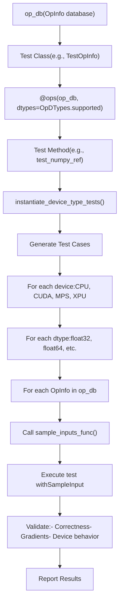
**OpInfo-based test generation and execution flow**

### Example Test Using OpInfo

```
# From test/test_ops.py@ops(_ref_test_ops, allowed_dtypes=(torch.float64, torch.long, torch.complex128))def test_numpy_ref(self, device, dtype, op):    # Sets the default dtype to NumPy's default dtype of double    with set_default_dtype(torch.double):        for sample_input in op.reference_inputs(device, dtype):            self.compare_with_reference(                op, op.ref, sample_input, exact_dtype=(dtype is not torch.long)            )
```
This test:

1.  Iterates over all ops in `_ref_test_ops` with reference implementations
2.  Generates test cases for each (device, dtype, op) combination
3.  Calls `op.reference_inputs()` to get sample inputs
4.  Compares operator output against reference implementation (e.g., NumPy)

**Sources:** [test/test\_ops.py469-490](https://github.com/pytorch/pytorch/blob/915982a4/test/test_ops.py#L469-L490) [test/test\_ops.py1-107](https://github.com/pytorch/pytorch/blob/915982a4/test/test_ops.py#L1-L107)

### Device-Specific Test Organization

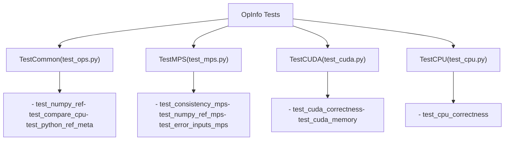
**Device-specific test organization**

**Sources:** [test/test\_ops.py218-261](https://github.com/pytorch/pytorch/blob/915982a4/test/test_ops.py#L218-L261) [test/test\_mps.py1-80](https://github.com/pytorch/pytorch/blob/915982a4/test/test_mps.py#L1-L80)

## Device-Specific Testing: MPS Backend

The MPS backend demonstrates how OpInfo testing is customized for device-specific behavior using modifier functions.

### MPS OpInfo Modifier

The `mps_ops_modifier` function filters and customizes OpInfo entries for MPS testing:

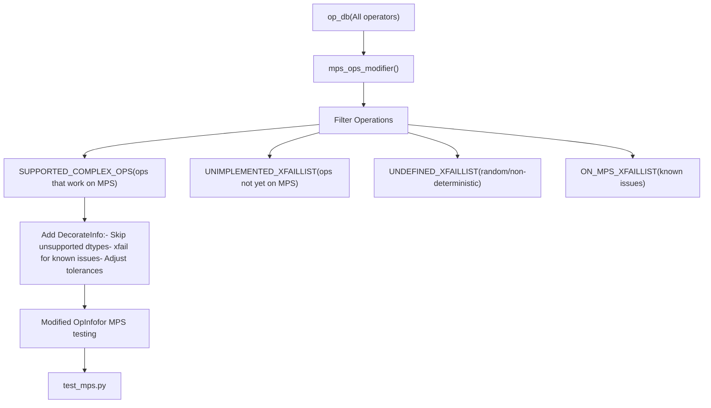
**MPS OpInfo modifier flow**

### MPS-Specific OpInfo Customization

```
# From torch/testing/_internal/common_mps.pydef mps_ops_modifier(    ops: Sequence[OpInfo],    device_type: str = "mps",    xfail_exclusion: Optional[list[str]] = None,    sparse: bool = False,) -> Sequence[OpInfo]:        # Supported complex operations on MPS    SUPPORTED_COMPLEX_OPS = {        "abs", "add", "mul", "div", "matmul", "mm", "bmm",        "sin", "cos", "exp", "log", # ... more ops    }        # Operations not yet implemented    UNIMPLEMENTED_XFAILLIST = {        "linalg.eig": None,        "linalg.qr": None,        "nn.functional.grid_sample": None,        # ... more ops    }        # Random operations with undefined behavior    UNDEFINED_XFAILLIST = {        "multinomial": [torch.float16, torch.float32, torch.bfloat16],        "uniform": [torch.float16, torch.float32, torch.bfloat16],        "normal": [torch.float16, torch.float32, torch.bfloat16],        # ... more ops    }
```
The modifier adds `DecorateInfo` to skip or xfail tests based on MPS capabilities.

**Sources:** [torch/testing/\_internal/common\_mps.py13-300](https://github.com/pytorch/pytorch/blob/915982a4/torch/testing/_internal/common_mps.py#L13-L300) [torch/testing/\_internal/common\_mps.py309-676](https://github.com/pytorch/pytorch/blob/915982a4/torch/testing/_internal/common_mps.py#L309-L676)

### MPS Test Example

```
# From test/test_mps.pytest_consistency_op_db = copy.deepcopy(op_db)test_error_inputs_op_db = copy.deepcopy(op_db) # Apply MPS-specific modificationsmps_ops_modifier(test_consistency_op_db, device_type="mps")mps_ops_error_inputs_modifier(test_error_inputs_op_db, device_type="mps") @ops(test_consistency_op_db, allowed_dtypes=(torch.float32,))def test_consistency_mps(self, device, dtype, op):    samples = op.sample_inputs(device, dtype, requires_grad=False)    for sample in samples:        cpu_result = op(sample.input.cpu(), *sample.args, **sample.kwargs)        mps_result = op(sample.input, *sample.args, **sample.kwargs)        self.assertEqual(mps_result.cpu(), cpu_result)
```
**Sources:** [test/test\_mps.py52-80](https://github.com/pytorch/pytorch/blob/915982a4/test/test_mps.py#L52-L80)

## Cross-Backend Validation

OpInfo enables systematic validation that operations produce consistent results across CPU, CUDA, MPS, and other backends.

### Cross-Backend Testing Flow

> **[Mermaid sequence]**
> *(图表结构无法解析)*

**Cross-backend validation sequence**

### CPU vs CUDA Consistency Test

```
# From test/test_ops.py@onlyOn(['cuda', 'xpu'])@suppress_warnings@skipCUDAIfNotRocm@ops(_ops_and_refs_with_no_numpy_ref, dtypes=OpDTypes.any_common_cpu_cuda_one)def test_compare_cpu(self, device, dtype, op):    def to_cpu(arg):        if isinstance(arg, torch.Tensor):            return arg.to(device="cpu")        return arg     samples = op.reference_inputs(device, dtype)     for sample in samples:        cpu_sample = sample.transform(to_cpu)        cuda_results = op(sample.input, *sample.args, **sample.kwargs)        cpu_results = op(cpu_sample.input, *cpu_sample.args, **cpu_sample.kwargs)         # Apply output processing for operations like SVD that may        # return valid but different results        cuda_results = sample.output_process_fn_grad(cuda_results)        cpu_results = cpu_sample.output_process_fn_grad(cpu_results)         atol, rtol = 0, 0        if dtype.is_floating_point or dtype.is_complex:            atol, rtol = 1e-3, 1e-3        self.assertEqual(cuda_results, cpu_results, atol=atol, rtol=rtol)
```
**Sources:** [test/test\_ops.py493-521](https://github.com/pytorch/pytorch/blob/915982a4/test/test_ops.py#L493-L521)

### MPS Consistency Validation

```
# From test/test_mps.py@ops(test_consistency_op_db, allowed_dtypes=(torch.float32,))def test_consistency_mps(self, device, dtype, op):    samples = op.sample_inputs(device, dtype, requires_grad=False)        for sample in samples:        # Execute on CPU        cpu_input = sample.input.cpu()        cpu_args = [arg.cpu() if isinstance(arg, torch.Tensor) else arg                     for arg in sample.args]        cpu_result = op(cpu_input, *cpu_args, **sample.kwargs)                # Execute on MPS        mps_result = op(sample.input, *sample.args, **sample.kwargs)                # Compare results        self.assertEqual(mps_result.cpu(), cpu_result)
```
**Sources:** [test/test\_mps.py52-80](https://github.com/pytorch/pytorch/blob/915982a4/test/test_mps.py#L52-L80)

## Gradient and Autograd Testing

OpInfo provides metadata for automatic gradient testing using `gradcheck` and related utilities.

### Gradient Testing Configuration

```mermaid
flowchart TD
    OpInfo["OpInfo"]
    AutogradSupport["Autograd Support Flags"]
    GradcheckConfig["Gradcheck Configuration"]
    GradientWrappers["Gradient Wrappers"]
    SupportsAutograd["supports_autograd: bool(basic backward)"]
    SupportsGradgrad["supports_gradgrad: bool(second-order)"]
    SupportsForwardAD["supports_forward_ad: bool(forward mode)"]
    SupportsFwgradBwgrad["supports_fwgrad_bwgrad: bool(forward+backward)"]
    GradcheckNondet["gradcheck_nondet_tol: float(tolerance for non-deterministic)"]
    CheckInplace["check_inplace: bool(validate inplace variants)"]
    CheckBatched["check_batched_grad: bool(validate vmap gradients)"]
    OutputProcessFn["output_process_fn_grad(postprocess before gradcheck)"]
    GradcheckWrapper["gradcheck_wrapper(wrap operation for gradcheck)"]

    OpInfo --> AutogradSupport
    OpInfo --> GradcheckConfig
    OpInfo --> GradientWrappers
    AutogradSupport --> SupportsAutograd
    AutogradSupport --> SupportsGradgrad
    AutogradSupport --> SupportsForwardAD
    AutogradSupport --> SupportsFwgradBwgrad
    GradcheckConfig --> GradcheckNondet
    GradcheckConfig --> CheckInplace
    GradcheckConfig --> CheckBatched
    GradientWrappers --> OutputProcessFn
    GradientWrappers --> GradcheckWrapper
```
**Gradient testing configuration in OpInfo**

### Gradcheck Example

```
# From test/test_ops.py@ops(op_db, allowed_dtypes=(torch.float64,))def test_gradcheck(self, device, dtype, op):    samples = op.sample_inputs(device, dtype, requires_grad=True)        for sample in samples:        # Skip if operator doesn't support autograd        if not op.supports_autograd:            continue                    # Run gradcheck with appropriate tolerances        func = lambda *args, **kwargs: op(*args, **kwargs)                # Apply gradcheck wrapper if specified        if op.gradcheck_wrapper:            func = op.gradcheck_wrapper(func)                    # Run first-order gradcheck        gradcheck(func, (sample.input, *sample.args),                   check_grad_dtypes=True, **sample.kwargs)                # Run second-order gradcheck if supported        if op.supports_gradgrad:            gradgradcheck(func, (sample.input, *sample.args),                          check_grad_dtypes=True, **sample.kwargs)
```
**Sources:** [torch/testing/\_internal/opinfo/core.py1-104](https://github.com/pytorch/pytorch/blob/915982a4/torch/testing/_internal/opinfo/core.py#L1-L104) [test/test\_ops.py1-107](https://github.com/pytorch/pytorch/blob/915982a4/test/test_ops.py#L1-L107)

### Gradient Wrapper Functions

OpInfo provides specialized gradient wrappers for operations with special requirements:

| Wrapper Function | Purpose | Example Operations |
| --- | --- | --- |
| `gradcheck_wrapper_hermitian_input` | Ensures input is Hermitian | `linalg.eigh`, `linalg.eigvalsh` |
| `gradcheck_wrapper_triangular_input` | Ensures input is triangular | `linalg.solve_triangular` |
| `gradcheck_wrapper_masked_operation` | Handles masked operations | `masked.sum`, `masked.mean` |
| `clone_sample` | Clones input to test inplace | Inplace operations |

**Sources:** [torch/testing/\_internal/opinfo/core.py102-109](https://github.com/pytorch/pytorch/blob/915982a4/torch/testing/_internal/opinfo/core.py#L102-L109) [torch/testing/\_internal/common\_methods\_invocations.py102-108](https://github.com/pytorch/pytorch/blob/915982a4/torch/testing/_internal/common_methods_invocations.py#L102-L108)

## Reference Implementations

OpInfo can specify reference implementations (`ref` attribute) for validating numerical correctness. These are typically NumPy or SciPy functions.

### Reference Implementation Structure

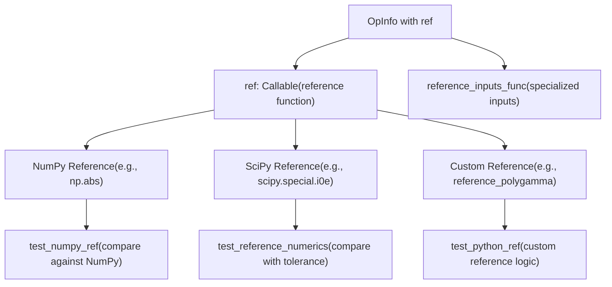
**Reference implementation types and testing**

### Example: NumPy Reference

```
# From torch/testing/_internal/common_methods_invocations.pyUnaryUfuncInfo(    'abs',    ref=np.abs,  # NumPy reference    dtypes=all_types_and_complex_and(torch.half, torch.bfloat16),    supports_forward_ad=True,    supports_fwgrad_bwgrad=True,)
```
Test automatically compares `torch.abs(x)` against `np.abs(x.cpu().numpy())`.

**Sources:** [torch/testing/\_internal/common\_methods\_invocations.py59-109](https://github.com/pytorch/pytorch/blob/915982a4/torch/testing/_internal/common_methods_invocations.py#L59-L109)

### Example: SciPy Reference with Custom Logic

```
# From torch/testing/_internal/opinfo/definitions/special.pydef reference_polygamma(x, n):    # WEIRD scipy.special.polygamma behavior requires dtype handling    result_dtype = torch_to_numpy_dtype_dict[torch.get_default_dtype()]    if x.dtype == np.double:        result_dtype = np.double    return scipy.special.polygamma(n, x).astype(result_dtype) UnaryUfuncInfo(    'special.polygamma',    op=lambda x, n, **kwargs: torch.special.polygamma(n, x, **kwargs),    ref=reference_polygamma if TEST_SCIPY else None,    dtypes=all_types_and(torch.bool, torch.half, torch.bfloat16),    supports_forward_ad=True,    supports_fwgrad_bwgrad=True,    sample_inputs_func=sample_inputs_polygamma,)
```
**Sources:** [torch/testing/\_internal/opinfo/definitions/special.py81-93](https://github.com/pytorch/pytorch/blob/915982a4/torch/testing/_internal/opinfo/definitions/special.py#L81-L93) [torch/testing/\_internal/opinfo/definitions/special.py206-247](https://github.com/pytorch/pytorch/blob/915982a4/torch/testing/_internal/opinfo/definitions/special.py#L206-L247)

### Reference Numerics Filtering

Some operations require filtering edge cases before comparing with references:

```
# From torch/testing/_internal/opinfo/definitions/special.pyUnaryUfuncInfo(    'special.polygamma',    # ... other attributes ...    reference_numerics_filter=NumericsFilter(        condition=lambda x: (x < 0.1) & ((x - x.round()).abs() < 1e-4),         safe_val=1    ),)
```
This filters out values near negative integers where polygamma has singularities.

**Sources:** [torch/testing/\_internal/opinfo/definitions/special.py206-247](https://github.com/pytorch/pytorch/blob/915982a4/torch/testing/_internal/opinfo/definitions/special.py#L206-L247) [torch/testing/\_internal/opinfo/core.py1-104](https://github.com/pytorch/pytorch/blob/915982a4/torch/testing/_internal/opinfo/core.py#L1-L104)

## Error Input Testing

OpInfo supports testing error conditions via `error_inputs_func`, which generates `ErrorInput` objects that specify expected exceptions.

### ErrorInput Structure

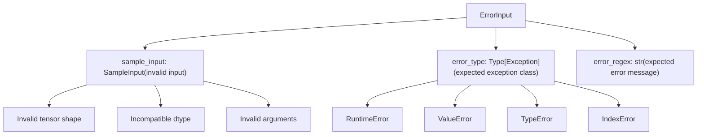
**ErrorInput structure for error condition testing**

### Error Input Example

```
# From torch/testing/_internal/common_methods_invocations.pydef error_inputs_hsplit(op_info, device, **kwargs):    make_arg = partial(make_tensor, dtype=torch.float32, device=device)        # Error: 0-dimensional tensor    err_msg1 = ("torch.hsplit requires a tensor with at least 1 dimension, "                "but got a tensor with 0 dimensions!")    yield ErrorInput(SampleInput(make_arg(()), 0), error_regex=err_msg1)     # Error: size not divisible by split_size    err_msg2 = (f"torch.hsplit attempted to split along dimension 1, "                f"but the size of the dimension {S} "                f"is not divisible by the split_size 0!")    yield ErrorInput(SampleInput(make_arg((S, S, S)), 0), error_regex=err_msg2)     # Error: incorrect type for argument    err_msg3 = ("received an invalid combination of arguments.")    yield ErrorInput(        SampleInput(make_arg((S, S, S)), "abc"),        error_type=TypeError, error_regex=err_msg3)
```
**Sources:** [torch/testing/\_internal/common\_methods\_invocations.py230-246](https://github.com/pytorch/pytorch/blob/915982a4/torch/testing/_internal/common_methods_invocations.py#L230-L246)

### Error Input Testing Infrastructure

```
# From test/test_ops.py@ops(test_error_inputs_op_db, dtypes=OpDTypes.none)def test_error_inputs(self, device, op):    # Iterate over error inputs    error_inputs = op.error_inputs(device)        for error_input in error_inputs:        # Extract sample input and expected error        sample = error_input.sample_input        error_type = error_input.error_type or RuntimeError        error_regex = error_input.error_regex                # Verify operation raises expected error        with self.assertRaisesRegex(error_type, error_regex):            op(sample.input, *sample.args, **sample.kwargs)
```
**Sources:** [test/test\_ops.py1-107](https://github.com/pytorch/pytorch/blob/915982a4/test/test_ops.py#L1-L107) [torch/testing/\_internal/opinfo/core.py1-104](https://github.com/pytorch/pytorch/blob/915982a4/torch/testing/_internal/opinfo/core.py#L1-L104)

## OpInfo Organization by Category

OpInfo definitions are organized into specialized modules by operation category:

### OpInfo Definition Modules

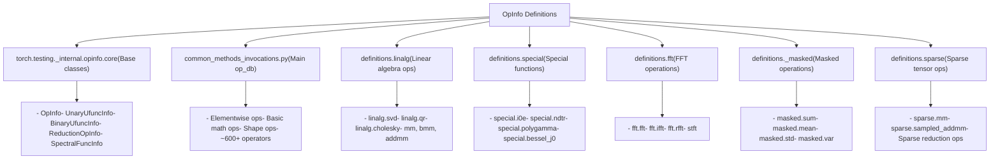
**OpInfo definition module organization**

### Module Responsibility Table

| Module | File Path | Responsibility |
| --- | --- | --- |
| **Core** | `torch/testing/_internal/opinfo/core.py` | Base `OpInfo` classes and infrastructure |
| **Main** | `torch/testing/_internal/common_methods_invocations.py` | Primary operator database (~600+ ops) |
| **Linear Algebra** | `torch/testing/_internal/opinfo/definitions/linalg.py` | Matrix operations and decompositions |
| **Special Functions** | `torch/testing/_internal/opinfo/definitions/special.py` | Mathematical special functions |
| **FFT** | `torch/testing/_internal/opinfo/definitions/fft.py` | Fourier transform operations |
| **Masked** | `torch/testing/_internal/opinfo/definitions/_masked.py` | Operations with mask support |
| **Sparse** | `torch/testing/_internal/opinfo/definitions/sparse.py` | Sparse tensor operations |

**Sources:** [torch/testing/\_internal/opinfo/core.py1-104](https://github.com/pytorch/pytorch/blob/915982a4/torch/testing/_internal/opinfo/core.py#L1-L104) [torch/testing/\_internal/common\_methods\_invocations.py1-123](https://github.com/pytorch/pytorch/blob/915982a4/torch/testing/_internal/common_methods_invocations.py#L1-L123) [torch/testing/\_internal/opinfo/definitions/linalg.py1-53](https://github.com/pytorch/pytorch/blob/915982a4/torch/testing/_internal/opinfo/definitions/linalg.py#L1-L53) [torch/testing/\_internal/opinfo/definitions/special.py1-39](https://github.com/pytorch/pytorch/blob/915982a4/torch/testing/_internal/opinfo/definitions/special.py#L1-L39) [torch/testing/\_internal/opinfo/definitions/fft.py1-40](https://github.com/pytorch/pytorch/blob/915982a4/torch/testing/_internal/opinfo/definitions/fft.py#L1-L40) [torch/testing/\_internal/opinfo/definitions/\_masked.py1-31](https://github.com/pytorch/pytorch/blob/915982a4/torch/testing/_internal/opinfo/definitions/_masked.py#L1-L31)

## DecorateInfo: Conditional Test Decorators

The `DecorateInfo` class allows OpInfo to conditionally apply decorators (skip, xfail, tolerance overrides) based on device, dtype, and test name.

### DecorateInfo Structure

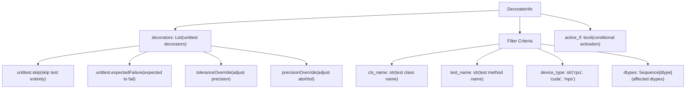
**DecorateInfo structure for conditional decorators**

### DecorateInfo Example

```
# From torch/testing/_internal/common_methods_invocations.pyUnaryUfuncInfo(    'special.i1',    aten_name='special_i1',    ref=np_unary_ufunc_integer_promotion_wrapper(scipy.special.i1),    dtypes=all_types_and(torch.bool, torch.half, torch.bfloat16),    decorators=(        DecorateInfo(            toleranceOverride({                torch.float32: tol(atol=1e-4, rtol=0),                torch.bool: tol(atol=1e-4, rtol=0),            })        ),    ),    skips=(        DecorateInfo(            unittest.skip("Incorrect result!"),            "TestUnaryUfuncs",            "test_reference_numerics_large",            dtypes=(torch.int8,),        ),    ),)
```
This applies:

-   Tolerance override for float32 and bool dtypes (all tests)
-   Skip for int8 dtype on specific test method

**Sources:** [torch/testing/\_internal/opinfo/definitions/special.py138-170](https://github.com/pytorch/pytorch/blob/915982a4/torch/testing/_internal/opinfo/definitions/special.py#L138-L170) [torch/testing/\_internal/opinfo/core.py74-104](https://github.com/pytorch/pytorch/blob/915982a4/torch/testing/_internal/opinfo/core.py#L74-L104)

### MPS-Specific DecorateInfo Usage

```
# From torch/testing/_internal/common_mps.pydef mps_ops_modifier(ops, device_type="mps", **kwargs):    for op in ops:        if op.name in UNIMPLEMENTED_XFAILLIST:            # Add xfail decorator for unimplemented ops            op.decorators.append(                DecorateInfo(                    unittest.expectedFailure,                    device_type=device_type,                    dtypes=UNIMPLEMENTED_XFAILLIST[op.name]                )            )
```
**Sources:** [torch/testing/\_internal/common\_mps.py13-300](https://github.com/pytorch/pytorch/blob/915982a4/torch/testing/_internal/common_mps.py#L13-L300)

## Summary

The operation dispatch system routes PyTorch operations to appropriate backend implementations through:

1.  **Dispatch Keys**: Device, layout, and functional tags identify execution context
2.  **YAML Specification**: `native_functions.yaml` maps operations to implementations
3.  **Runtime Selection**: Dispatcher examines tensor properties and selects kernel
4.  **Backend Implementations**: Each backend provides optimized kernels
5.  **Fallback Mechanisms**: Composite implementations provide cross-backend defaults
6.  **Testing Infrastructure**: Automated validation ensures consistency across backends

This architecture enables PyTorch to support diverse hardware while maintaining a unified user-facing API.
