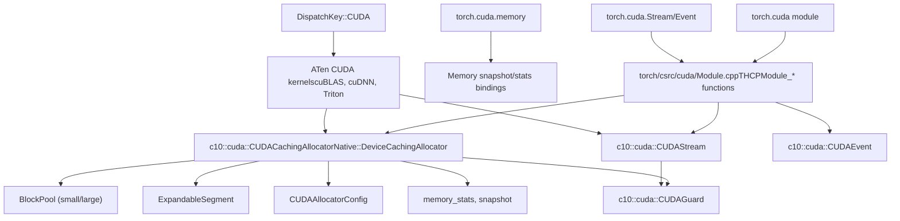
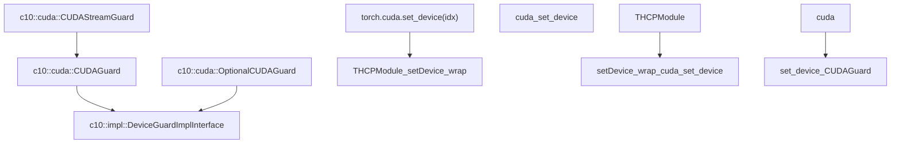
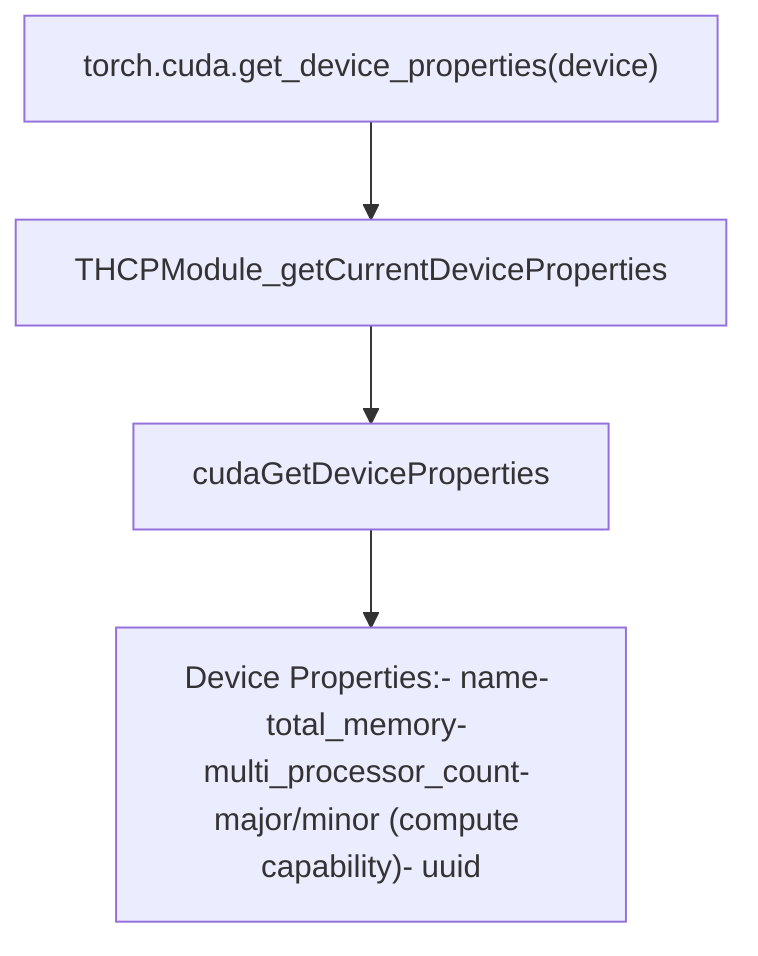
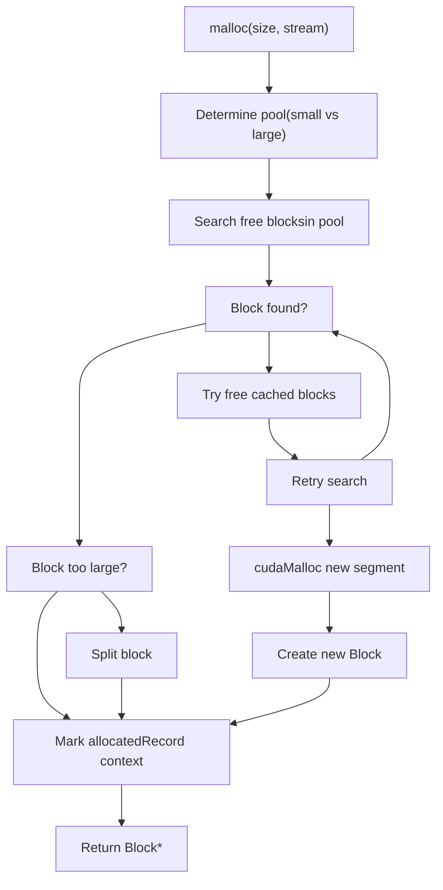
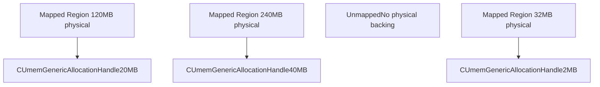
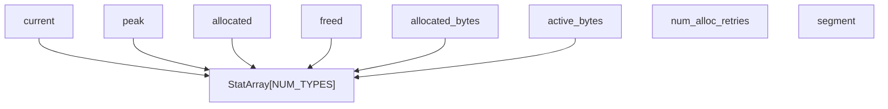
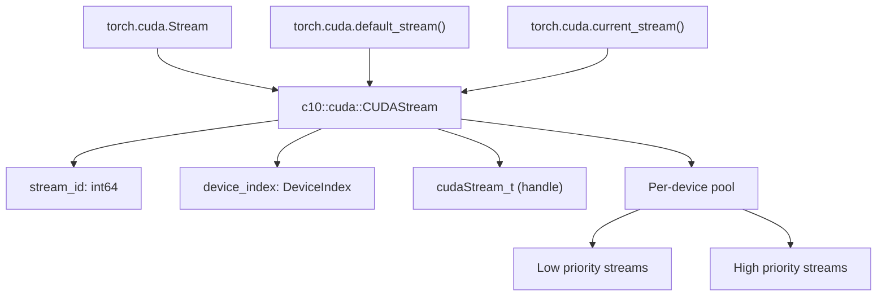
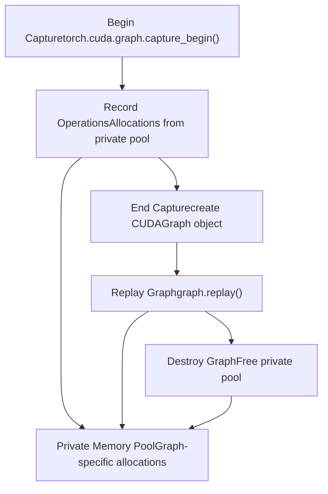
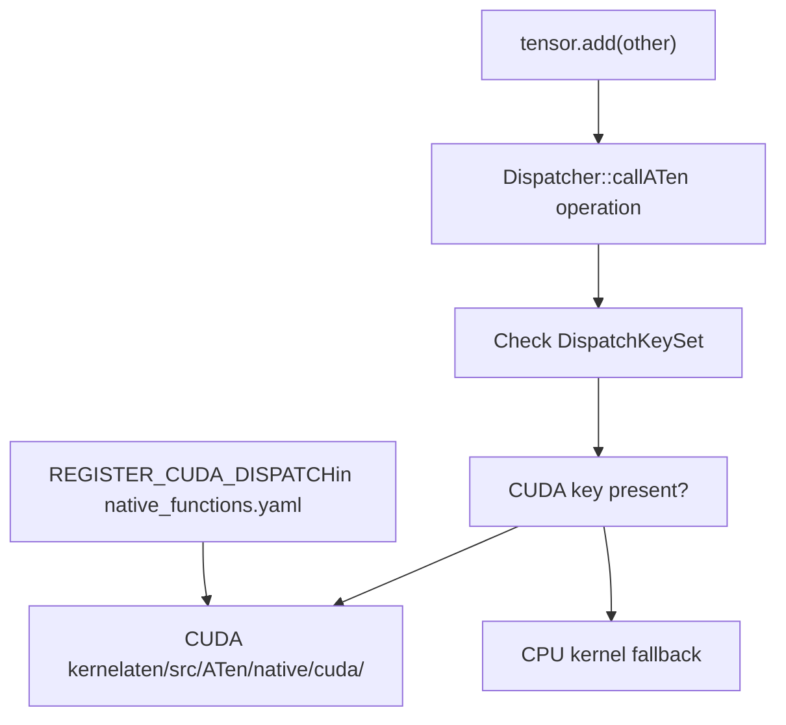
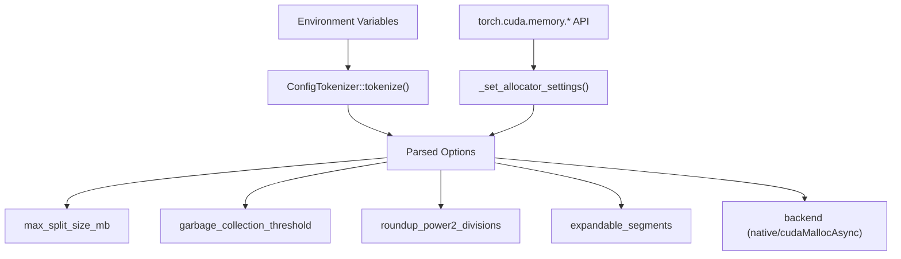

# CUDA Backend

Relevant source files

-   [aten/src/ATen/CMakeLists.txt](https://github.com/pytorch/pytorch/blob/915982a4/aten/src/ATen/CMakeLists.txt)
-   [aten/src/ATen/core/CachingHostAllocator.h](https://github.com/pytorch/pytorch/blob/915982a4/aten/src/ATen/core/CachingHostAllocator.h)
-   [aten/src/ATen/cuda/CachingHostAllocator.cpp](https://github.com/pytorch/pytorch/blob/915982a4/aten/src/ATen/cuda/CachingHostAllocator.cpp)
-   [aten/src/ATen/native/Blas.cpp](https://github.com/pytorch/pytorch/blob/915982a4/aten/src/ATen/native/Blas.cpp)
-   [aten/src/ATen/native/GroupedMMUtils.h](https://github.com/pytorch/pytorch/blob/915982a4/aten/src/ATen/native/GroupedMMUtils.h)
-   [aten/src/ATen/native/ScaledBlasUtils.cpp](https://github.com/pytorch/pytorch/blob/915982a4/aten/src/ATen/native/ScaledBlasUtils.cpp)
-   [aten/src/ATen/native/ScaledBlasUtils.h](https://github.com/pytorch/pytorch/blob/915982a4/aten/src/ATen/native/ScaledBlasUtils.h)
-   [aten/src/ATen/native/cuda/Blas.cpp](https://github.com/pytorch/pytorch/blob/915982a4/aten/src/ATen/native/cuda/Blas.cpp)
-   [aten/src/ATen/native/cuda/GroupedBlas.cpp](https://github.com/pytorch/pytorch/blob/915982a4/aten/src/ATen/native/cuda/GroupedBlas.cpp)
-   [aten/src/ATen/native/cuda/ScaledBlas.cpp](https://github.com/pytorch/pytorch/blob/915982a4/aten/src/ATen/native/cuda/ScaledBlas.cpp)
-   [aten/src/ATen/native/hip/ck\_group\_gemm.h](https://github.com/pytorch/pytorch/blob/915982a4/aten/src/ATen/native/hip/ck_group_gemm.h)
-   [aten/src/ATen/native/hip/ck\_group\_gemm.hip](https://github.com/pytorch/pytorch/blob/915982a4/aten/src/ATen/native/hip/ck_group_gemm.hip)
-   [aten/src/ATen/native/mkldnn/xpu/ScaledBlas.cpp](https://github.com/pytorch/pytorch/blob/915982a4/aten/src/ATen/native/mkldnn/xpu/ScaledBlas.cpp)
-   [aten/src/ATen/test/cuda\_caching\_host\_allocator\_test.cpp](https://github.com/pytorch/pytorch/blob/915982a4/aten/src/ATen/test/cuda_caching_host_allocator_test.cpp)
-   [aten/src/ATen/test/scalar\_test.cpp](https://github.com/pytorch/pytorch/blob/915982a4/aten/src/ATen/test/scalar_test.cpp)
-   [aten/src/ATen/xpu/CachingHostAllocator.cpp](https://github.com/pytorch/pytorch/blob/915982a4/aten/src/ATen/xpu/CachingHostAllocator.cpp)
-   [aten/src/ATen/xpu/XPUScaledBlas.cpp](https://github.com/pytorch/pytorch/blob/915982a4/aten/src/ATen/xpu/XPUScaledBlas.cpp)
-   [aten/src/ATen/xpu/XPUScaledBlas.h](https://github.com/pytorch/pytorch/blob/915982a4/aten/src/ATen/xpu/XPUScaledBlas.h)
-   [c10/core/AllocatorConfig.cpp](https://github.com/pytorch/pytorch/blob/915982a4/c10/core/AllocatorConfig.cpp)
-   [c10/core/AllocatorConfig.h](https://github.com/pytorch/pytorch/blob/915982a4/c10/core/AllocatorConfig.h)
-   [c10/cuda/CUDAAllocatorConfig.cpp](https://github.com/pytorch/pytorch/blob/915982a4/c10/cuda/CUDAAllocatorConfig.cpp)
-   [c10/cuda/CUDAAllocatorConfig.h](https://github.com/pytorch/pytorch/blob/915982a4/c10/cuda/CUDAAllocatorConfig.h)
-   [c10/cuda/CUDACachingAllocator.cpp](https://github.com/pytorch/pytorch/blob/915982a4/c10/cuda/CUDACachingAllocator.cpp)
-   [c10/cuda/CUDACachingAllocator.h](https://github.com/pytorch/pytorch/blob/915982a4/c10/cuda/CUDACachingAllocator.h)
-   [c10/test/core/AllocatorConfig\_test.cpp](https://github.com/pytorch/pytorch/blob/915982a4/c10/test/core/AllocatorConfig_test.cpp)
-   [c10/xpu/XPUCachingAllocator.cpp](https://github.com/pytorch/pytorch/blob/915982a4/c10/xpu/XPUCachingAllocator.cpp)
-   [c10/xpu/XPUCachingAllocator.h](https://github.com/pytorch/pytorch/blob/915982a4/c10/xpu/XPUCachingAllocator.h)
-   [docs/source/cuda.aliases.md](https://github.com/pytorch/pytorch/blob/915982a4/docs/source/cuda.aliases.md)
-   [docs/source/notes/cuda.rst](https://github.com/pytorch/pytorch/blob/915982a4/docs/source/notes/cuda.rst)
-   [docs/source/xpu.aliases.md](https://github.com/pytorch/pytorch/blob/915982a4/docs/source/xpu.aliases.md)
-   [docs/source/xpu.md](https://github.com/pytorch/pytorch/blob/915982a4/docs/source/xpu.md)
-   [test/test\_accelerator.py](https://github.com/pytorch/pytorch/blob/915982a4/test/test_accelerator.py)
-   [test/test\_cuda.py](https://github.com/pytorch/pytorch/blob/915982a4/test/test_cuda.py)
-   [test/test\_cuda\_compatibility.py](https://github.com/pytorch/pytorch/blob/915982a4/test/test_cuda_compatibility.py)
-   [test/test\_matmul\_cuda.py](https://github.com/pytorch/pytorch/blob/915982a4/test/test_matmul_cuda.py)
-   [test/test\_scaled\_matmul\_cuda.py](https://github.com/pytorch/pytorch/blob/915982a4/test/test_scaled_matmul_cuda.py)
-   [test/test\_xpu.py](https://github.com/pytorch/pytorch/blob/915982a4/test/test_xpu.py)
-   [torch/\_C/\_\_init\_\_.pyi.in](https://github.com/pytorch/pytorch/blob/915982a4/torch/_C/__init__.pyi.in)
-   [torch/\_utils.py](https://github.com/pytorch/pytorch/blob/915982a4/torch/_utils.py)
-   [torch/csrc/DeviceAccelerator.cpp](https://github.com/pytorch/pytorch/blob/915982a4/torch/csrc/DeviceAccelerator.cpp)
-   [torch/csrc/Module.cpp](https://github.com/pytorch/pytorch/blob/915982a4/torch/csrc/Module.cpp)
-   [torch/csrc/cuda/Module.cpp](https://github.com/pytorch/pytorch/blob/915982a4/torch/csrc/cuda/Module.cpp)
-   [torch/csrc/cuda/memory\_snapshot.cpp](https://github.com/pytorch/pytorch/blob/915982a4/torch/csrc/cuda/memory_snapshot.cpp)
-   [torch/csrc/profiler/combined\_traceback.cpp](https://github.com/pytorch/pytorch/blob/915982a4/torch/csrc/profiler/combined_traceback.cpp)
-   [torch/csrc/profiler/combined\_traceback.h](https://github.com/pytorch/pytorch/blob/915982a4/torch/csrc/profiler/combined_traceback.h)
-   [torch/csrc/profiler/python/combined\_traceback.cpp](https://github.com/pytorch/pytorch/blob/915982a4/torch/csrc/profiler/python/combined_traceback.cpp)
-   [torch/csrc/xpu/Module.cpp](https://github.com/pytorch/pytorch/blob/915982a4/torch/csrc/xpu/Module.cpp)
-   [torch/cuda/\_\_init\_\_.py](https://github.com/pytorch/pytorch/blob/915982a4/torch/cuda/__init__.py)
-   [torch/cuda/\_device\_limits.py](https://github.com/pytorch/pytorch/blob/915982a4/torch/cuda/_device_limits.py)
-   [torch/cuda/memory.py](https://github.com/pytorch/pytorch/blob/915982a4/torch/cuda/memory.py)
-   [torch/testing/\_internal/common\_quantized.py](https://github.com/pytorch/pytorch/blob/915982a4/torch/testing/_internal/common_quantized.py)
-   [torch/utils/viz/MemoryViz.js](https://github.com/pytorch/pytorch/blob/915982a4/torch/utils/viz/MemoryViz.js)
-   [torch/xpu/\_\_init\_\_.py](https://github.com/pytorch/pytorch/blob/915982a4/torch/xpu/__init__.py)
-   [torch/xpu/graphs.py](https://github.com/pytorch/pytorch/blob/915982a4/torch/xpu/graphs.py)
-   [torch/xpu/memory.py](https://github.com/pytorch/pytorch/blob/915982a4/torch/xpu/memory.py)

## Purpose and Scope

The CUDA Backend provides GPU acceleration for PyTorch operations on NVIDIA GPUs. It encompasses device memory management, stream synchronization, and the dispatch of ATen operations to CUDA implementations. This document covers the core runtime infrastructure that enables CUDA tensor operations.

For information about:

-   Native operation registry and dispatch system, see [3.1](/pytorch/pytorch/3.1-aten-native-function-system)
-   Distributed training with NCCL, see [4](/pytorch/pytorch/4-distributed-training-systems)
-   Inductor code generation for CUDA, see [2.5](/pytorch/pytorch/2.5-torchinductor-backend)

## Architecture Overview


**Title: CUDA Backend Component Architecture**

The CUDA backend consists of three layers:

1.  **Python Interface**: User-facing APIs in `torch.cuda`
2.  **C++ Bindings**: Bridge between Python and C++ in `torch/csrc/cuda/`
3.  **Runtime Core**: C++ implementation in `c10/cuda/` and `ATen/cuda/`

Sources: [torch/cuda/\_\_init\_\_.py1-100](https://github.com/pytorch/pytorch/blob/915982a4/torch/cuda/__init__.py#L1-L100) [torch/csrc/cuda/Module.cpp1-100](https://github.com/pytorch/pytorch/blob/915982a4/torch/csrc/cuda/Module.cpp#L1-L100) [c10/cuda/CUDACachingAllocator.cpp1-150](https://github.com/pytorch/pytorch/blob/915982a4/c10/cuda/CUDACachingAllocator.cpp#L1-L150)

## Device Management

### Device Context and Guards


**Title: Device Context Management Flow**

Key device management functions:

| Function | Location | Purpose |
| --- | --- | --- |
| `THCPModule_setDevice_wrap` | [torch/csrc/cuda/Module.cpp62-72](https://github.com/pytorch/pytorch/blob/915982a4/torch/csrc/cuda/Module.cpp#L62-L72) | Python binding for device selection |
| `THCPModule_exchangeDevice` | [torch/csrc/cuda/Module.cpp74-87](https://github.com/pytorch/pytorch/blob/915982a4/torch/csrc/cuda/Module.cpp#L74-L87) | Swap current device, return previous |
| `THCPModule_maybeExchangeDevice` | [torch/csrc/cuda/Module.cpp89-101](https://github.com/pytorch/pytorch/blob/915982a4/torch/csrc/cuda/Module.cpp#L89-L101) | Conditional device exchange |
| `c10::cuda::set_device` | C++ API | Low-level device setter with force parameter |
| `c10::cuda::CUDAGuard` | RAII wrapper | Automatic device context management |

The device guard pattern ensures that CUDA operations execute on the correct GPU:

-   `CUDAGuard` automatically restores the previous device on scope exit
-   `OptionalCUDAGuard` only switches if the device differs
-   `CUDAStreamGuard` combines device and stream management

Sources: [torch/csrc/cuda/Module.cpp62-101](https://github.com/pytorch/pytorch/blob/915982a4/torch/csrc/cuda/Module.cpp#L62-L101) [torch/cuda/\_\_init\_\_.py400-450](https://github.com/pytorch/pytorch/blob/915982a4/torch/cuda/__init__.py#L400-L450)

### Device Properties

Device information is exposed through `torch.cuda.get_device_properties()`:


**Title: Device Property Query Flow**

Sources: [torch/csrc/cuda/Module.cpp399-409](https://github.com/pytorch/pytorch/blob/915982a4/torch/csrc/cuda/Module.cpp#L399-L409) [test/test\_cuda.py377-409](https://github.com/pytorch/pytorch/blob/915982a4/test/test_cuda.py#L377-L409)

## Memory Management: CUDACachingAllocator

### Design Philosophy

The CUDA Caching Allocator implements a sophisticated memory pooling system to avoid expensive `cudaMalloc`/`cudaFree` calls. Key design principles from [c10/cuda/CUDACachingAllocator.cpp70-100](https://github.com/pytorch/pytorch/blob/915982a4/c10/cuda/CUDACachingAllocator.cpp#L70-L100):

1.  **Stream-aware allocation**: Blocks are associated with streams and can only be reused on the same stream without synchronization
2.  **Size-based pooling**: Separate pools for small (≤2MB) and large (>2MB) allocations
3.  **Split management**: Large blocks can be split to satisfy smaller requests
4.  **Lazy deallocation**: Memory is cached after free until explicitly needed

### Block and Pool Structure


**Title: CachingAllocator Class Structure**

Sources: [c10/cuda/CUDACachingAllocator.cpp189-258](https://github.com/pytorch/pytorch/blob/915982a4/c10/cuda/CUDACachingAllocator.cpp#L189-L258) [c10/cuda/CUDACachingAllocator.cpp164-186](https://github.com/pytorch/pytorch/blob/915982a4/c10/cuda/CUDACachingAllocator.cpp#L164-L186)

### Allocation Flow


**Title: Memory Allocation Decision Tree**

The allocator searches for blocks using `BlockComparatorSize` which orders by:

1.  Stream pointer (blocks must be from the same stream)
2.  Size (smallest sufficient block)
3.  Address (for determinism)

Sources: [c10/cuda/CUDACachingAllocator.cpp160-163](https://github.com/pytorch/pytorch/blob/915982a4/c10/cuda/CUDACachingAllocator.cpp#L160-L163) [c10/cuda/CUDACachingAllocator.cpp1100-1200](https://github.com/pytorch/pytorch/blob/915982a4/c10/cuda/CUDACachingAllocator.cpp#L1100-L1200)

### Expandable Segments

Expandable segments use CUDA's virtual memory API to reduce fragmentation. From [c10/cuda/CUDACachingAllocator.cpp275-345](https://github.com/pytorch/pytorch/blob/915982a4/c10/cuda/CUDACachingAllocator.cpp#L275-L345):

**Key Concept**: Allocate large virtual address ranges (up to GPU's total memory), but only map physical pages as needed. This allows segments to grow without creating fragmentation from multiple fixed-size allocations.


**Title: Expandable Segment Memory Mapping**

Implementation details:

-   Enabled via `expandable_segments:True` configuration
-   Uses `cuMemAddressReserve`, `cuMemCreate`, `cuMemMap`, `cuMemSetAccess`
-   Small pool uses 2MB pages, large pool uses 20MB pages
-   Physical memory can be unmapped and returned when blocks are freed

Configuration check: [c10/cuda/CUDACachingAllocator.cpp20-56](https://github.com/pytorch/pytorch/blob/915982a4/c10/cuda/CUDACachingAllocator.cpp#L20-L56) defines driver API support requirements.

Sources: [c10/cuda/CUDACachingAllocator.cpp275-345](https://github.com/pytorch/pytorch/blob/915982a4/c10/cuda/CUDACachingAllocator.cpp#L275-L345) [c10/cuda/CUDAAllocatorConfig.h34-74](https://github.com/pytorch/pytorch/blob/915982a4/c10/cuda/CUDAAllocatorConfig.h#L34-L74)

### Memory Statistics

The allocator tracks comprehensive statistics in `StatArray` and `DeviceStats`:


**Title: Memory Statistics Structure**

Key statistics functions:

| Function | Purpose |
| --- | --- |
| `memory_allocated(device)` | Current allocated bytes |
| `max_memory_allocated(device)` | Peak allocated bytes |
| `memory_reserved(device)` | Cached + allocated bytes |
| `memory_stats(device)` | Full dictionary of statistics |
| `memory_snapshot()` | Detailed allocation trace with stack traces |
| `reset_peak_memory_stats()` | Reset peak counters |
| `reset_accumulated_memory_stats()` | Reset accumulated counters |

Python interface: [torch/cuda/memory.py130-250](https://github.com/pytorch/pytorch/blob/915982a4/torch/cuda/memory.py#L130-L250) C++ implementation: [c10/cuda/CUDACachingAllocator.cpp2100-2300](https://github.com/pytorch/pytorch/blob/915982a4/c10/cuda/CUDACachingAllocator.cpp#L2100-L2300)

Sources: [torch/cuda/memory.py30-100](https://github.com/pytorch/pytorch/blob/915982a4/torch/cuda/memory.py#L30-L100) [c10/cuda/CUDACachingAllocator.cpp2100-2200](https://github.com/pytorch/pytorch/blob/915982a4/c10/cuda/CUDACachingAllocator.cpp#L2100-L2200)

## Streams, Events, and Synchronization

### Stream Management

CUDA streams enable asynchronous execution and concurrency:


**Title: CUDA Stream Architecture**

Stream lifecycle:

1.  Created via `torch.cuda.Stream(device, priority)` → [torch/csrc/Stream.cpp124-147](https://github.com/pytorch/pytorch/blob/915982a4/torch/csrc/Stream.cpp#L124-L147)
2.  Set as current via `with stream:` context manager
3.  Operations submitted to current stream
4.  Stream synchronizes via `stream.synchronize()` or `stream.wait_stream(other)`

Key stream operations:

| Method | Location | Purpose |
| --- | --- | --- |
| `query()` | [torch/csrc/Stream.cpp147](https://github.com/pytorch/pytorch/blob/915982a4/torch/csrc/Stream.cpp#L147-L147) | Check if all work completed (non-blocking) |
| `synchronize()` | [torch/csrc/Stream.cpp148](https://github.com/pytorch/pytorch/blob/915982a4/torch/csrc/Stream.cpp#L148-L148) | Block until all work completed |
| `wait_event(event)` | [torch/csrc/Stream.cpp149](https://github.com/pytorch/pytorch/blob/915982a4/torch/csrc/Stream.cpp#L149-L149) | Stream waits for event |
| `wait_stream(other)` | [torch/csrc/Stream.cpp150](https://github.com/pytorch/pytorch/blob/915982a4/torch/csrc/Stream.cpp#L150-L150) | Stream waits for other stream |
| `record_event(event)` | [torch/csrc/Stream.cpp151](https://github.com/pytorch/pytorch/blob/915982a4/torch/csrc/Stream.cpp#L151-L151) | Record event on stream |

Sources: [torch/csrc/Stream.cpp124-156](https://github.com/pytorch/pytorch/blob/915982a4/torch/csrc/Stream.cpp#L124-L156) [torch/cuda/\_\_init\_\_.py600-700](https://github.com/pytorch/pytorch/blob/915982a4/torch/cuda/__init__.py#L600-L700)

### Event Synchronization

Events provide fine-grained synchronization between streams:

> **[Mermaid sequence]**
> *(图表结构无法解析)*

**Title: Event-based Stream Synchronization**

Event API:

| Method | Purpose |
| --- | --- |
| `Event(enable_timing, blocking, interprocess)` | Create event with options |
| `record(stream)` | Record event on stream |
| `wait(stream)` | Make stream wait for event |
| `query()` | Non-blocking completion check |
| `synchronize()` | CPU blocks until event complete |
| `elapsed_time(other_event)` | Time between events (if timing enabled) |
| `ipc_handle()` | Get handle for inter-process sharing |

Memory allocator integration: When a block is used on multiple streams, the allocator calls `Block::recordStream()` which tracks stream dependencies. The block can only be reused after all recorded streams have completed work.

Sources: [torch/csrc/Event.cpp157-178](https://github.com/pytorch/pytorch/blob/915982a4/torch/csrc/Event.cpp#L157-L178) [torch/cuda/\_\_init\_\_.py700-800](https://github.com/pytorch/pytorch/blob/915982a4/torch/cuda/__init__.py#L700-L800) [c10/cuda/CUDACachingAllocator.cpp1300-1400](https://github.com/pytorch/pytorch/blob/915982a4/c10/cuda/CUDACachingAllocator.cpp#L1300-L1400)

### CUDA Graphs

CUDA Graphs capture a sequence of CUDA operations for replay with reduced overhead:


**Title: CUDA Graph Lifecycle**

From [c10/cuda/CUDACachingAllocator.cpp102-133](https://github.com/pytorch/pytorch/blob/915982a4/c10/cuda/CUDACachingAllocator.cpp#L102-L133) (Note \[Interaction with CUDA graph capture\]):

**Key invariant**: Memory allocated during graph capture must remain available during replay. The allocator creates a private pool for each graph:

-   During capture, allocations come from the graph's private pool
-   Private pool memory is reserved until the graph is destroyed
-   Prevents address conflicts during replay

Graph API functions:

-   `notifyCaptureBegin()`: Start using private pool for current stream
-   `notifyCaptureAboutToEnd()`: Prepare to finalize capture
-   `notifyCaptureEnded()`: Return to default pool
-   `notifyCaptureDestroy()`: Free graph's private pool

Sources: [c10/cuda/CUDACachingAllocator.cpp102-133](https://github.com/pytorch/pytorch/blob/915982a4/c10/cuda/CUDACachingAllocator.cpp#L102-L133) [torch/cuda/graphs.py](https://github.com/pytorch/pytorch/blob/915982a4/torch/cuda/graphs.py) [test/test\_cuda.py2000-2100](https://github.com/pytorch/pytorch/blob/915982a4/test/test_cuda.py#L2000-L2100)

## Python Interface

### torch.cuda Module Structure


**Title: torch.cuda Module API Structure**

Key initialization behavior from [torch/cuda/\_\_init\_\_.py46-100](https://github.com/pytorch/pytorch/blob/915982a4/torch/cuda/__init__.py#L46-L100):

-   CUDA is **lazily initialized** on first use
-   `_lazy_init()` is called automatically by most functions
-   Initialization can be forced with `torch.cuda.init()`
-   Checks `_is_in_bad_fork()` to detect unsafe multiprocessing scenarios

Sources: [torch/cuda/\_\_init\_\_.py1-200](https://github.com/pytorch/pytorch/blob/915982a4/torch/cuda/__init__.py#L1-L200) [torch/cuda/memory.py1-100](https://github.com/pytorch/pytorch/blob/915982a4/torch/cuda/memory.py#L1-L100)

### Memory Management Python API

Memory allocation functions exposed to Python:

```
# Direct allocator access (rarely used)ptr = torch.cuda.caching_allocator_alloc(size)torch.cuda.caching_allocator_delete(ptr) # High-level memory managementtorch.cuda.empty_cache()  # Free all cached blockstorch.cuda.synchronize()  # Wait for all streams # Memory statisticsstats = torch.cuda.memory_stats(device)snapshot = torch.cuda.memory_snapshot()summary = torch.cuda.memory_summary(device) # Memory limitstorch.cuda.set_per_process_memory_fraction(fraction, device)
```
Implementation: [torch/cuda/memory.py100-300](https://github.com/pytorch/pytorch/blob/915982a4/torch/cuda/memory.py#L100-L300)

The `memory_snapshot()` function produces detailed allocation traces:

-   Stack traces for each allocation (via `context_when_allocated`)
-   Segment information from expandable segments
-   Active/cached block status
-   Stream associations

Visualization tools use this data: [torch/cuda/\_memory\_viz.py](https://github.com/pytorch/pytorch/blob/915982a4/torch/cuda/_memory_viz.py)

Sources: [torch/cuda/memory.py100-400](https://github.com/pytorch/pytorch/blob/915982a4/torch/cuda/memory.py#L100-L400) [test/test\_cuda.py332-367](https://github.com/pytorch/pytorch/blob/915982a4/test/test_cuda.py#L332-L367)

## Native Operation Dispatch to CUDA

### Registration and Dispatch Mechanism

Operations dispatch to CUDA kernels via the dispatcher:


**Title: Operation Dispatch to CUDA Kernels**

Example dispatch entry from [aten/src/ATen/native/native\_functions.yaml554-594](https://github.com/pytorch/pytorch/blob/915982a4/aten/src/ATen/native/native_functions.yaml#L554-L594):

```
- func: add.Tensor(Tensor self, Tensor other, *, Scalar alpha=1) -> Tensor  dispatch:    CPU, CUDA: add_out    SparseCUDA: add_sparse
```
The dispatcher checks the `DispatchKeySet` of tensor arguments:

-   CUDA tensors have `DispatchKey::CUDA` set
-   Operations route to corresponding CUDA implementations
-   If no CUDA implementation exists, may error or fallback

### CUDA Kernel Organization

CUDA kernel implementations are organized in:

| Directory | Purpose | Example Files |
| --- | --- | --- |
| `aten/src/ATen/native/cuda/` | Core CUDA kernels | Binary ops, indexing, reduction |
| `aten/src/ATen/native/cudnn/` | cuDNN wrappers | Convolution, batch norm, RNN |
| `aten/src/ATen/cuda/` | CUDA utilities | CUDAContext, TensorInfo, DeviceUtils |

Kernel launch pattern:

1.  Get CUDA stream: `at::cuda::getCurrentCUDAStream()`
2.  Launch kernel on stream: `kernel<<<blocks, threads, 0, stream>>>(args)`
3.  Allocate output via `at::empty({sizes}, options.device(kCUDA))`

The allocator automatically uses the current stream for memory allocations.

Sources: [aten/src/ATen/native/native\_functions.yaml554-594](https://github.com/pytorch/pytorch/blob/915982a4/aten/src/ATen/native/native_functions.yaml#L554-L594) [build\_variables.bzl](https://github.com/pytorch/pytorch/blob/915982a4/build_variables.bzl)

## Configuration and Environment Variables

### Allocator Configuration

The allocator is configured via environment variables or Python API:


**Title: Allocator Configuration Flow**

Key configuration options from [c10/core/AllocatorConfig.h16-150](https://github.com/pytorch/pytorch/blob/915982a4/c10/core/AllocatorConfig.h#L16-L150):

| Option | Default | Purpose |
| --- | --- | --- |
| `max_split_size_mb` | ∞ | Max size for block splitting (prevents fragmentation) |
| `garbage_collection_threshold` | 0.0 | Trigger cache cleanup when this fraction free |
| `roundup_power2_divisions` | 16 intervals | Granularity for size rounding |
| `expandable_segments` | False | Enable virtual memory-based segments |
| `backend` | "native" | Use native allocator or cudaMallocAsync |

Setting via environment:

```
export PYTORCH_CUDA_ALLOC_CONF="expandable_segments:True,max_split_size_mb:512"
```
Setting via Python:

```
torch.cuda.memory._set_allocator_settings("expandable_segments:True")
```
Sources: [c10/cuda/CUDAAllocatorConfig.cpp10-100](https://github.com/pytorch/pytorch/blob/915982a4/c10/cuda/CUDAAllocatorConfig.cpp#L10-L100) [c10/core/AllocatorConfig.h1-150](https://github.com/pytorch/pytorch/blob/915982a4/c10/core/AllocatorConfig.h#L1-L150) [test/test\_cuda.py150-300](https://github.com/pytorch/pytorch/blob/915982a4/test/test_cuda.py#L150-L300)

### Backend Selection

PyTorch supports multiple allocator backends:

1.  **Native** (default): CUDACachingAllocator implementation
2.  **cudaMallocAsync**: CUDA 11.2+ stream-ordered allocator
3.  **Custom**: User-provided via `CUDAPluggableAllocator`

Backend selection logic in [torch/cuda/memory.py500-600](https://github.com/pytorch/pytorch/blob/915982a4/torch/cuda/memory.py#L500-L600):

```
def get_allocator_backend():    return torch._C._cuda_getAllocatorBackend() class CUDAPluggableAllocator:    """Allow custom memory allocator implementation"""    def __init__(self, alloc_fn, free_fn):        self._alloc_fn = alloc_fn        self._free_fn = free_fn
```
Custom allocators must implement the `c10::Allocator` interface.

Sources: [torch/cuda/memory.py500-700](https://github.com/pytorch/pytorch/blob/915982a4/torch/cuda/memory.py#L500-L700) [torch/csrc/cuda/CUDAPluggableAllocator.cpp](https://github.com/pytorch/pytorch/blob/915982a4/torch/csrc/cuda/CUDAPluggableAllocator.cpp)

## Testing and Debugging

### Memory Leak Detection

Tests can enable memory leak checking via `TEST_MPS_MEM_LEAK_CHECK` environment variable (similar pattern for CUDA in [test/test\_cuda.py136-145](https://github.com/pytorch/pytorch/blob/915982a4/test/test_cuda.py#L136-L145)):

```
class TestCuda(TestCase):    _do_cuda_memory_leak_check = True    _do_cuda_non_default_stream = True
```
Memory leak check implementation:

1.  Record memory state before test: `torch.cuda.memory_allocated()`
2.  Run test
3.  Garbage collect: `gc.collect()`
4.  Check memory state after: assert no increase

Sources: [test/test\_cuda.py133-145](https://github.com/pytorch/pytorch/blob/915982a4/test/test_cuda.py#L133-L145) [test/test\_mps.py97-168](https://github.com/pytorch/pytorch/blob/915982a4/test/test_mps.py#L97-L168)

### Memory Profiling and Visualization

The memory profiler captures allocation traces:

```
# Start profilingtorch.cuda.memory._record_memory_history(    enabled='all',  # or 'state' for less detail    context='all',  # or 'alloc', 'free', 'state'    stacks='all'    # capture stack traces) # Run codemodel.forward(input) # Get snapshotsnapshot = torch.cuda.memory._snapshot() # Visualizefrom torch.cuda._memory_viz import profile_plotprofile_plot(snapshot, device=0)
```
Snapshot structure from [torch/csrc/cuda/memory\_snapshot.cpp](https://github.com/pytorch/pytorch/blob/915982a4/torch/csrc/cuda/memory_snapshot.cpp):

-   Segment information (address ranges, expandable segments)
-   Block allocation status and sizes
-   Stack traces at allocation time
-   Stream associations

Visualization generates timeline plots showing memory usage over time.

Sources: [test/test\_cuda.py29-34](https://github.com/pytorch/pytorch/blob/915982a4/test/test_cuda.py#L29-L34) [torch/cuda/\_memory\_viz.py](https://github.com/pytorch/pytorch/blob/915982a4/torch/cuda/_memory_viz.py)

### Common Test Patterns

From [test/test\_cuda.py317-456](https://github.com/pytorch/pytorch/blob/915982a4/test/test_cuda.py#L317-L456):

```
# Test memory allocationdef test_memory_allocation(self):    gc.collect()    torch.cuda.empty_cache()        prev = torch.cuda.memory_allocated()    mem = torch.cuda.caching_allocator_alloc(size)    self.assertGreater(torch.cuda.memory_allocated(), prev)        torch.cuda.caching_allocator_delete(mem)    self.assertEqual(torch.cuda.memory_allocated(), prev) # Test out-of-memory handling  def test_out_of_memory(self):    with self.assertRaisesRegex(RuntimeError, "out of memory"):        torch.empty(1024**4, dtype=torch.int8, device='cuda') # Test stream synchronizationdef test_stream_synchronization(self):    stream = torch.cuda.Stream()    with torch.cuda.stream(stream):        x = torch.randn(100, device='cuda')    stream.synchronize()    self.assertTrue(stream.query())
```
Sources: [test/test\_cuda.py317-600](https://github.com/pytorch/pytorch/blob/915982a4/test/test_cuda.py#L317-L600)
