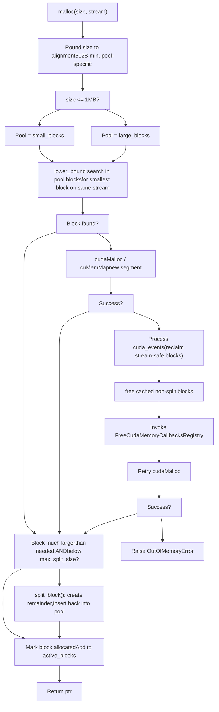

# CUDA Caching Allocator

Relevant source files

-   [aten/src/ATen/core/CachingHostAllocator.h](https://github.com/pytorch/pytorch/blob/915982a4/aten/src/ATen/core/CachingHostAllocator.h)
-   [aten/src/ATen/cuda/CachingHostAllocator.cpp](https://github.com/pytorch/pytorch/blob/915982a4/aten/src/ATen/cuda/CachingHostAllocator.cpp)
-   [aten/src/ATen/test/cuda\_caching\_host\_allocator\_test.cpp](https://github.com/pytorch/pytorch/blob/915982a4/aten/src/ATen/test/cuda_caching_host_allocator_test.cpp)
-   [aten/src/ATen/xpu/CachingHostAllocator.cpp](https://github.com/pytorch/pytorch/blob/915982a4/aten/src/ATen/xpu/CachingHostAllocator.cpp)
-   [c10/core/AllocatorConfig.cpp](https://github.com/pytorch/pytorch/blob/915982a4/c10/core/AllocatorConfig.cpp)
-   [c10/core/AllocatorConfig.h](https://github.com/pytorch/pytorch/blob/915982a4/c10/core/AllocatorConfig.h)
-   [c10/cuda/CUDAAllocatorConfig.cpp](https://github.com/pytorch/pytorch/blob/915982a4/c10/cuda/CUDAAllocatorConfig.cpp)
-   [c10/cuda/CUDAAllocatorConfig.h](https://github.com/pytorch/pytorch/blob/915982a4/c10/cuda/CUDAAllocatorConfig.h)
-   [c10/cuda/CUDACachingAllocator.cpp](https://github.com/pytorch/pytorch/blob/915982a4/c10/cuda/CUDACachingAllocator.cpp)
-   [c10/cuda/CUDACachingAllocator.h](https://github.com/pytorch/pytorch/blob/915982a4/c10/cuda/CUDACachingAllocator.h)
-   [c10/test/core/AllocatorConfig\_test.cpp](https://github.com/pytorch/pytorch/blob/915982a4/c10/test/core/AllocatorConfig_test.cpp)
-   [c10/xpu/XPUCachingAllocator.cpp](https://github.com/pytorch/pytorch/blob/915982a4/c10/xpu/XPUCachingAllocator.cpp)
-   [c10/xpu/XPUCachingAllocator.h](https://github.com/pytorch/pytorch/blob/915982a4/c10/xpu/XPUCachingAllocator.h)
-   [docs/source/cuda.aliases.md](https://github.com/pytorch/pytorch/blob/915982a4/docs/source/cuda.aliases.md)
-   [docs/source/notes/cuda.rst](https://github.com/pytorch/pytorch/blob/915982a4/docs/source/notes/cuda.rst)
-   [docs/source/xpu.aliases.md](https://github.com/pytorch/pytorch/blob/915982a4/docs/source/xpu.aliases.md)
-   [docs/source/xpu.md](https://github.com/pytorch/pytorch/blob/915982a4/docs/source/xpu.md)
-   [test/test\_accelerator.py](https://github.com/pytorch/pytorch/blob/915982a4/test/test_accelerator.py)
-   [test/test\_cuda.py](https://github.com/pytorch/pytorch/blob/915982a4/test/test_cuda.py)
-   [test/test\_cuda\_compatibility.py](https://github.com/pytorch/pytorch/blob/915982a4/test/test_cuda_compatibility.py)
-   [test/test\_xpu.py](https://github.com/pytorch/pytorch/blob/915982a4/test/test_xpu.py)
-   [torch/\_C/\_\_init\_\_.pyi.in](https://github.com/pytorch/pytorch/blob/915982a4/torch/_C/__init__.pyi.in)
-   [torch/\_utils.py](https://github.com/pytorch/pytorch/blob/915982a4/torch/_utils.py)
-   [torch/csrc/DeviceAccelerator.cpp](https://github.com/pytorch/pytorch/blob/915982a4/torch/csrc/DeviceAccelerator.cpp)
-   [torch/csrc/Module.cpp](https://github.com/pytorch/pytorch/blob/915982a4/torch/csrc/Module.cpp)
-   [torch/csrc/cuda/Module.cpp](https://github.com/pytorch/pytorch/blob/915982a4/torch/csrc/cuda/Module.cpp)
-   [torch/csrc/cuda/memory\_snapshot.cpp](https://github.com/pytorch/pytorch/blob/915982a4/torch/csrc/cuda/memory_snapshot.cpp)
-   [torch/csrc/profiler/combined\_traceback.cpp](https://github.com/pytorch/pytorch/blob/915982a4/torch/csrc/profiler/combined_traceback.cpp)
-   [torch/csrc/profiler/combined\_traceback.h](https://github.com/pytorch/pytorch/blob/915982a4/torch/csrc/profiler/combined_traceback.h)
-   [torch/csrc/profiler/python/combined\_traceback.cpp](https://github.com/pytorch/pytorch/blob/915982a4/torch/csrc/profiler/python/combined_traceback.cpp)
-   [torch/csrc/xpu/Module.cpp](https://github.com/pytorch/pytorch/blob/915982a4/torch/csrc/xpu/Module.cpp)
-   [torch/cuda/\_\_init\_\_.py](https://github.com/pytorch/pytorch/blob/915982a4/torch/cuda/__init__.py)
-   [torch/cuda/\_device\_limits.py](https://github.com/pytorch/pytorch/blob/915982a4/torch/cuda/_device_limits.py)
-   [torch/cuda/memory.py](https://github.com/pytorch/pytorch/blob/915982a4/torch/cuda/memory.py)
-   [torch/utils/viz/MemoryViz.js](https://github.com/pytorch/pytorch/blob/915982a4/torch/utils/viz/MemoryViz.js)
-   [torch/xpu/\_\_init\_\_.py](https://github.com/pytorch/pytorch/blob/915982a4/torch/xpu/__init__.py)
-   [torch/xpu/graphs.py](https://github.com/pytorch/pytorch/blob/915982a4/torch/xpu/graphs.py)
-   [torch/xpu/memory.py](https://github.com/pytorch/pytorch/blob/915982a4/torch/xpu/memory.py)

## Purpose and Scope

This page describes the `CUDACachingAllocator` system: how it represents and manages GPU memory blocks, how the allocation and deallocation lifecycle works, how fragmentation is reduced through size classes and expandable segments, and how behavior is tuned through `CUDAAllocatorConfig`.

For CUDA Graph capture, `PrivatePool` management, and stream-aware memory reuse during graph replay, see [3.2.2](/pytorch/pytorch/3.2.2-cuda-graph-capture-and-memory-pools). For the general CUDA backend overview, see [3.2](/pytorch/pytorch/3.2-cuda-backend).

---

## Overview

The CUDA Caching Allocator avoids per-operation `cudaMalloc`/`cudaFree` overhead by maintaining a pool of previously allocated GPU memory. When a tensor is freed, its memory is returned to the pool rather than to CUDA. Future allocations of compatible size and stream can reuse cached blocks.

The allocator lives in the `c10::cuda::CUDACachingAllocator` namespace. The native implementation is under the nested `Native` namespace. The key classes are `DeviceCachingAllocator` (one per GPU device) and the outer `NativeCUDAAllocator`, which wraps a vector of them and implements the `CUDAAllocator` interface.

Core design rules (from the allocator's own documentation at [c10/cuda/CUDACachingAllocator.cpp73-102](https://github.com/pytorch/pytorch/blob/915982a4/c10/cuda/CUDACachingAllocator.cpp#L73-L102)):

-   Allocations are **stream-scoped**: a freed block can only be reused on the same stream.
-   **Large (>1 MB) and small (≤1 MB)** allocations use separate pools.
-   Small requests are packed into 2 MB buffers; requests between 1–10 MB are served from 20 MB buffers.
-   Blocks at or above `max_split_size` are never split.

---

## Core Data Structures

### `Block`

`Block` is the fundamental unit of memory management. Each `Block` represents a contiguous GPU memory range. Blocks within the same `cudaMalloc`\-ed segment are linked in a doubly-linked list via `prev`/`next`.

| Field | Type | Description |
| --- | --- | --- |
| `device` | `c10::DeviceIndex` | GPU index |
| `stream` | `cudaStream_t` | Stream this block is bound to |
| `stream_uses` | `stream_set` | Other streams that have accessed this block |
| `size` | `size_t` | Block size in bytes |
| `requested_size` | `size_t` | Size originally requested by the user |
| `pool` | `BlockPool*` | Owning pool |
| `ptr` | `void*` | GPU memory address |
| `allocated` | `bool` | `true` if currently in use |
| `mapped` | `bool` | `false` if not backed by physical pages (expandable segments only) |
| `prev`, `next` | `Block*` | Neighbors in the segment's linked list |
| `event_count` | `int` | Pending CUDA events before this block may be reused |
| `gc_count_base` | `int64_t` | Pool's call count when block was inserted (for GC aging) |
| `expandable_segment_` | `ExpandableSegment*` | Non-null when block belongs to an expandable segment |

[c10/cuda/CUDACachingAllocator.cpp191-260](https://github.com/pytorch/pytorch/blob/915982a4/c10/cuda/CUDACachingAllocator.cpp#L191-L260)

A block is "split" if `prev != nullptr || next != nullptr`. Only an unsplit block whose entire segment is free can be returned to CUDA via `cudaFree`.

### `BlockPool`

`BlockPool` holds the free blocks for one size class (small or large).

| Field | Type | Description |
| --- | --- | --- |
| `blocks` | `std::set<Block*, Comparison>` | Free blocks, ordered by `(stream, size, ptr)` |
| `unmapped` | `std::set<Block*, Comparison>` | Unmapped expandable-segment blocks, ordered by address |
| `is_small` | `bool` | `true` for the ≤1 MB pool |
| `owner_PrivatePool` | `PrivatePool*` | Non-null for CUDA graph private pools |
| `get_free_blocks_call_count` | `int64_t` | Monotonic counter used for GC block aging |

[c10/cuda/CUDACachingAllocator.cpp166-187](https://github.com/pytorch/pytorch/blob/915982a4/c10/cuda/CUDACachingAllocator.cpp#L166-L187)

Block lookup uses `BlockComparatorSize` so that a best-fit search is an `O(log n)` lower-bound on the set.

### `DeviceCachingAllocator`

The per-device allocator class. Its key members are:

-   `large_blocks` — `BlockPool` for blocks > 1 MB
-   `small_blocks` — `BlockPool` for blocks ≤ 1 MB
-   `active_blocks` — `ska::flat_hash_set<Block*>` of all in-use blocks
-   `cuda_events` — `deque<(cudaEvent_t, Block*)>` for deferred stream-safe deallocation
-   `stats` — `DeviceStats` counters

**Diagram: Core Allocator Class Relationships**

Sources: [c10/cuda/CUDACachingAllocator.cpp166-260](https://github.com/pytorch/pytorch/blob/915982a4/c10/cuda/CUDACachingAllocator.cpp#L166-L260) [c10/cuda/CUDACachingAllocator.h111-165](https://github.com/pytorch/pytorch/blob/915982a4/c10/cuda/CUDACachingAllocator.h#L111-L165)

---

## Allocation Lifecycle

### Allocation Steps

When a tensor is created on CUDA, `DeviceCachingAllocator::malloc(size, stream)` runs:

1.  **Size rounding.** Sizes are rounded up to at least 512 bytes. Requests ≤1 MB go to the small pool (rounded to 512 B boundaries). Requests between 1–10 MB use the large pool with 20 MB buffers. Requests >10 MB are rounded to 2 MB boundaries.

2.  **Pool selection.** ≤1 MB → `small_blocks`; >1 MB → `large_blocks`.

3.  **Best-fit search.** The pool's `blocks` set is searched with `std::lower_bound` for the smallest free block on the same stream that fits.

4.  **Split.** If the found block is much larger than needed (and is below `max_split_size`), it is split. The remainder becomes a new free block inserted back into the pool.

5.  **`cudaMalloc` fallback.** If no suitable block exists, a new segment is requested via `cudaMalloc` (or `cuMemCreate`/`cuMemMap` with expandable segments).

6.  **OOM recovery sequence.** If `cudaMalloc` fails:

    -   Process all pending `cuda_events` to reclaim blocks.
    -   Free all cached non-split blocks back to CUDA.
    -   Call registered `FreeCudaMemoryCallbacksRegistry` callbacks.
    -   Retry allocation. Raise `OutOfMemoryError` if still failing.

**Diagram: Allocation Decision Flow**

Sources: [c10/cuda/CUDACachingAllocator.cpp73-102](https://github.com/pytorch/pytorch/blob/915982a4/c10/cuda/CUDACachingAllocator.cpp#L73-L102) [c10/core/AllocatorConfig.h14-25](https://github.com/pytorch/pytorch/blob/915982a4/c10/core/AllocatorConfig.h#L14-L25)

### Deallocation

When a tensor is freed, `DeviceCachingAllocator::free(block)` runs:

1.  Block is removed from `active_blocks`.
2.  If `block->stream_uses` is non-empty (used on other streams via `recordStream()`), a CUDA event is recorded on each such stream. The block is pushed to `cuda_events` and cannot be reused until each event completes.
3.  Otherwise the block is immediately inserted into the pool's `blocks` set.
4.  Adjacent free blocks in the linked list are **coalesced** (merged) into a single larger block.
5.  If the merged block covers a complete `cudaMalloc`\-ed segment and no other blocks in that segment are active, the segment may be released via `cudaFree` (subject to GC threshold configuration).

### Stream Safety: `recordStream`

`recordStream(ptr, stream)` registers that the memory at `ptr` is being read or written by `stream`. The allocator:

1.  Adds `stream` to `block->stream_uses`.
2.  Before reusing the block, a CUDA event on that stream must complete.

This is the mechanism that safely allows tensors to be shared across CUDA streams. `recordStream` is called automatically by operations that transfer tensors between streams.

Sources: [c10/cuda/CUDACachingAllocator.h126-130](https://github.com/pytorch/pytorch/blob/915982a4/c10/cuda/CUDACachingAllocator.h#L126-L130) [c10/cuda/CUDACachingAllocator.cpp96-101](https://github.com/pytorch/pytorch/blob/915982a4/c10/cuda/CUDACachingAllocator.cpp#L96-L101)

---

## Expandable Segments

Standard operation allocates one `cudaMalloc` segment per large allocation. When batch sizes vary slightly across iterations, each new size may not fit in existing segments, causing free "slivers" at segment ends that cannot be reclaimed. Expandable segments address this.

### Mechanism

`ExpandableSegment` (inside `Native`) uses CUDA's virtual memory management (VMM) API:

-   **`cuMemAddressReserve`** — reserves a virtual address range of ~1.125 × total GPU memory (address space only; no physical memory yet).
-   **`cuMemCreate`** — allocates a physical memory handle for one "page".
-   **`cuMemMap` / `cuMemSetAccess`** — maps physical pages into the reserved virtual range.
-   **`cuMemUnmap` / `cuMemRelease`** — returns physical pages to CUDA without releasing the virtual range.

| Pool | Physical page size |
| --- | --- |
| Small (≤1 MB) | 2 MB |
| Large (>1 MB) | 20 MB |

When more memory is needed, new physical pages are appended to the virtual range. When memory is scarce, wholly-empty pages can be unmapped and returned to CUDA for use at other addresses.

The allocator preferentially maps new pages at the lowest available address within the segment, encouraging previously unmapped gaps to be filled before extending the segment end.

[c10/cuda/CUDACachingAllocator.cpp277-369](https://github.com/pytorch/pytorch/blob/915982a4/c10/cuda/CUDACachingAllocator.cpp#L277-L369)

### Enabling

Set `expandable_segments:True` in `PYTORCH_CUDA_ALLOC_CONF`.
Default: enabled on platforms with `PYTORCH_C10_DRIVER_API_SUPPORTED` or ROCm.

### IPC Handle Types

| `Expandable_Segments_Handle_Type` value | Handle | Notes |
| --- | --- | --- |
| `UNSPECIFIED` | Auto-detect | Try fabric handle first; fall back to POSIX FD |
| `POSIX_FD` | POSIX file descriptor | Standard cross-process sharing |
| `FABRIC_HANDLE` | NVLink fabric handle | CUDA ≥ 12.3 only |

[c10/cuda/CUDAAllocatorConfig.h12-16](https://github.com/pytorch/pytorch/blob/915982a4/c10/cuda/CUDAAllocatorConfig.h#L12-L16)

### Limitations

-   IPC of CUDA tensors is not supported by default with expandable segments. Disable for tensors that must cross process boundaries.
-   `cudaDeviceEnablePeerAccess` does not work for VMM-mapped memory; use the allocator's `enablePeerAccess` method instead.
-   Initial mapping is slower than `cudaMalloc`.

Sources: [c10/cuda/CUDACachingAllocator.cpp277-369](https://github.com/pytorch/pytorch/blob/915982a4/c10/cuda/CUDACachingAllocator.cpp#L277-L369) [c10/cuda/CUDAAllocatorConfig.h34-54](https://github.com/pytorch/pytorch/blob/915982a4/c10/cuda/CUDAAllocatorConfig.h#L34-L54)

---

## Fragmentation Management

### Size Classes

The constants are defined in `c10/core/AllocatorConfig.h`:

| Constant | Value | Role |
| --- | --- | --- |
| `kMinBlockSize` | 512 B | Minimum alignment for all blocks |
| `kSmallSize` | 1 MB | Upper bound for "small" pool |
| `kSmallBuffer` | 2 MB | Segment size for small allocations |
| `kMinLargeAlloc` | 10 MB | Allocations above this skip the 20 MB buffer |
| `kRoundLarge` | 2 MB | Rounding granularity for large allocations |

[c10/core/AllocatorConfig.h14-25](https://github.com/pytorch/pytorch/blob/915982a4/c10/core/AllocatorConfig.h#L14-L25)

### `max_split_size`

Blocks at or above `max_split_size` are never split. This prevents a large cached block from being fragmented into smaller unusable pieces. A cached block within 1 MB of a `max_split_size`\-class request will be used directly.

Set via `max_split_size:<bytes>` in `PYTORCH_CUDA_ALLOC_CONF`.

### Garbage Collection (`garbage_collection_threshold`)

When the allocator cannot find a free block and total reserved memory exceeds `garbage_collection_threshold × total_device_memory`, it proactively ages out free blocks before calling `cudaMalloc`.

Block age is tracked by:

-   `block->gc_count_base` — value of `pool->get_free_blocks_call_count` when the block was inserted into the pool.
-   `block->gc_count()` — current count minus `gc_count_base`; higher means older.

Older blocks are prioritized for `cudaFree` during the GC pass.

### `roundup_power2_divisions`

Accepts a 16-element list of power-of-2 subdivision counts, one per logarithmic size interval from 1 MB to 64 GB. Each element controls how finely sizes in that interval are rounded up, reducing cached-but-wasted space.

Sources: [c10/core/AllocatorConfig.h14-25](https://github.com/pytorch/pytorch/blob/915982a4/c10/core/AllocatorConfig.h#L14-L25) [c10/core/AllocatorConfig.cpp43-60](https://github.com/pytorch/pytorch/blob/915982a4/c10/core/AllocatorConfig.cpp#L43-L60)

---

## `CUDAAllocatorConfig` Options

Configuration is parsed from the `PYTORCH_CUDA_ALLOC_CONF` environment variable at process start (also `PYTORCH_HIP_ALLOC_CONF` on ROCm; or the unified `PYTORCH_ALLOC_CONF`). The format is `key:value,key:value,...`.

At runtime, the same string format is accepted by `torch.cuda.memory._set_allocator_settings(settings_str)`.

### Shared Options (`AcceleratorAllocatorConfig` in `c10/core/AllocatorConfig.h`)

| Key | Default | Description |
| --- | --- | --- |
| `max_split_size` | `SIZE_MAX` | Blocks ≥ this (bytes) are never split |
| `garbage_collection_threshold` | `0.0` | GC trigger as fraction of total GPU memory |
| `expandable_segments` | platform | Use VMM-based expandable segments |
| `roundup_power2_divisions` | all `0` | Per-interval power-of-2 rounding |
| `large_segment_size` | 20 MB | Segment size for 1–10 MB allocations |
| `max_non_split_rounding_size` | \= `large_segment_size` | Max size rounded without splitting |
| `pinned_use_background_threads` | `false` | Async pinned memory allocation |

### CUDA-Specific Options (`CUDAAllocatorConfig` in `c10/cuda/CUDAAllocatorConfig.h`)

| Key | Default | Description |
| --- | --- | --- |
| `backend` | `native` | `native` or `cudaMallocAsync` |
| `release_lock_on_cudamalloc` | `false` | Release allocator mutex during `cudaMalloc` |
| `pinned_use_cuda_host_register` | `false` | Use `cudaHostRegister` instead of `cudaMallocHost` |
| `pinned_num_register_threads` | `1` | Parallel registration threads (max 128) |
| `pinned_reserve_segment_size_mb` | `0` | Pre-reserved pinned memory segment in MB |
| `graph_capture_record_stream_reuse` | `false` | Allow reuse during CUDA graph capture |
| `per_process_memory_fraction` | `1.0` | Fraction of GPU memory this process may use |

Sources: [c10/cuda/CUDAAllocatorConfig.h19-206](https://github.com/pytorch/pytorch/blob/915982a4/c10/cuda/CUDAAllocatorConfig.h#L19-L206) [c10/cuda/CUDAAllocatorConfig.cpp72-140](https://github.com/pytorch/pytorch/blob/915982a4/c10/cuda/CUDAAllocatorConfig.cpp#L72-L140) [c10/core/AllocatorConfig.h70-200](https://github.com/pytorch/pytorch/blob/915982a4/c10/core/AllocatorConfig.h#L70-L200)

---

## Allocator Backends

The `backend` key selects among concrete `CUDAAllocator` implementations:

| Backend name | Implementing class | Description |
| --- | --- | --- |
| `native` | `Native::NativeCUDAAllocator` | Default caching allocator described in this page |
| `cudaMallocAsync` | `CudaMallocAsync` | Delegates to CUDA's built-in stream-ordered async allocator (requires CUDA ≥ 11.4) |
| (pluggable) | `CUDAPluggableAllocator` | Third-party custom allocator interface |

The active allocator is retrieved via `c10::cuda::CUDACachingAllocator::get()`.

**Diagram: `CUDAAllocator` Class Hierarchy**

Sources: [c10/cuda/CUDACachingAllocator.h111-280](https://github.com/pytorch/pytorch/blob/915982a4/c10/cuda/CUDACachingAllocator.h#L111-L280) [c10/cuda/CUDACachingAllocator.cpp65-70](https://github.com/pytorch/pytorch/blob/915982a4/c10/cuda/CUDACachingAllocator.cpp#L65-L70)

---

## Memory Statistics

`torch.cuda.memory_stats(device)` returns a flat dictionary of counters. Each counter is identified by a key of the form `<metric>.<pool>.<stat>`:

-   **`<metric>`:** `allocated_bytes`, `reserved_bytes`, `active_bytes`, `requested_bytes`, `num_alloc_retries`, `num_ooms`, etc.
-   **`<pool>`:** `all`, `large_pool`, `small_pool`
-   **`<stat>`:** `current`, `peak`, `allocated` (cumulative), `freed` (cumulative)

Key scalar counters:

| Key | Description |
| --- | --- |
| `num_alloc_retries` | `cudaMalloc` retries after OOM recovery |
| `num_ooms` | OOM errors raised |
| `num_device_free_bytes_threshold_crossings` | Times GC threshold was crossed |
| `oversize_allocations.current` | Active allocations exceeding `max_split_size` |

`torch.cuda.memory_snapshot()` returns a `SnapshotInfo` structure with a per-segment block-level view and an allocation trace log (when history is enabled). This feeds the visualization tools in `torch.cuda._memory_viz` (`profile_plot`, `segment_plot`, `trace_plot`).

Sources: [torch/cuda/memory.py32-65](https://github.com/pytorch/pytorch/blob/915982a4/torch/cuda/memory.py#L32-L65) [c10/cuda/CUDACachingAllocator.h61-82](https://github.com/pytorch/pytorch/blob/915982a4/c10/cuda/CUDACachingAllocator.h#L61-L82) [torch/csrc/cuda/memory\_snapshot.cpp1-10](https://github.com/pytorch/pytorch/blob/915982a4/torch/csrc/cuda/memory_snapshot.cpp#L1-L10)

---

## Python API Reference

The Python surface in `torch/cuda/memory.py`:

| Function | Description |
| --- | --- |
| `empty_cache()` | Release all unoccupied cached blocks to CUDA |
| `memory_stats(device)` | Flat dict of allocator statistics |
| `memory_snapshot()` | Full segment/block snapshot (`SnapshotInfo`) |
| `memory_summary(device)` | Human-readable summary string |
| `set_per_process_memory_fraction(f, device)` | Limit allocator to `f × total_memory` |
| `get_per_process_memory_fraction(device)` | Query current fraction |
| `reset_peak_memory_stats(device)` | Reset peak counters |
| `reset_accumulated_memory_stats(device)` | Reset cumulative counters |
| `caching_allocator_alloc(size, device, stream)` | Raw allocation (for framework interop) |
| `caching_allocator_delete(mem_ptr)` | Raw deallocation |
| `caching_allocator_enable(value)` | Enable or disable the allocator |
| `_set_allocator_settings(settings_str)` | Apply `PYTORCH_CUDA_ALLOC_CONF`\-style config at runtime |
| `MemPool` | Handle to a named private memory pool |
| `use_mem_pool(pool)` | Context manager routing allocations to a `MemPool` |

Sources: [torch/cuda/memory.py32-65](https://github.com/pytorch/pytorch/blob/915982a4/torch/cuda/memory.py#L32-L65) [torch/cuda/memory.py110-165](https://github.com/pytorch/pytorch/blob/915982a4/torch/cuda/memory.py#L110-L165)
