# CUDA Graph Capture and Memory Pools

Relevant source files

-   [aten/src/ATen/core/CachingHostAllocator.h](https://github.com/pytorch/pytorch/blob/915982a4/aten/src/ATen/core/CachingHostAllocator.h)
-   [aten/src/ATen/cuda/CachingHostAllocator.cpp](https://github.com/pytorch/pytorch/blob/915982a4/aten/src/ATen/cuda/CachingHostAllocator.cpp)
-   [aten/src/ATen/test/cuda\_caching\_host\_allocator\_test.cpp](https://github.com/pytorch/pytorch/blob/915982a4/aten/src/ATen/test/cuda_caching_host_allocator_test.cpp)
-   [aten/src/ATen/xpu/CachingHostAllocator.cpp](https://github.com/pytorch/pytorch/blob/915982a4/aten/src/ATen/xpu/CachingHostAllocator.cpp)
-   [c10/core/AllocatorConfig.cpp](https://github.com/pytorch/pytorch/blob/915982a4/c10/core/AllocatorConfig.cpp)
-   [c10/core/AllocatorConfig.h](https://github.com/pytorch/pytorch/blob/915982a4/c10/core/AllocatorConfig.h)
-   [c10/cuda/CUDAAllocatorConfig.cpp](https://github.com/pytorch/pytorch/blob/915982a4/c10/cuda/CUDAAllocatorConfig.cpp)
-   [c10/cuda/CUDAAllocatorConfig.h](https://github.com/pytorch/pytorch/blob/915982a4/c10/cuda/CUDAAllocatorConfig.h)
-   [c10/cuda/CUDACachingAllocator.cpp](https://github.com/pytorch/pytorch/blob/915982a4/c10/cuda/CUDACachingAllocator.cpp)
-   [c10/cuda/CUDACachingAllocator.h](https://github.com/pytorch/pytorch/blob/915982a4/c10/cuda/CUDACachingAllocator.h)
-   [c10/test/core/AllocatorConfig\_test.cpp](https://github.com/pytorch/pytorch/blob/915982a4/c10/test/core/AllocatorConfig_test.cpp)
-   [c10/xpu/XPUCachingAllocator.cpp](https://github.com/pytorch/pytorch/blob/915982a4/c10/xpu/XPUCachingAllocator.cpp)
-   [c10/xpu/XPUCachingAllocator.h](https://github.com/pytorch/pytorch/blob/915982a4/c10/xpu/XPUCachingAllocator.h)
-   [docs/source/cuda.aliases.md](https://github.com/pytorch/pytorch/blob/915982a4/docs/source/cuda.aliases.md)
-   [docs/source/notes/cuda.rst](https://github.com/pytorch/pytorch/blob/915982a4/docs/source/notes/cuda.rst)
-   [docs/source/xpu.aliases.md](https://github.com/pytorch/pytorch/blob/915982a4/docs/source/xpu.aliases.md)
-   [docs/source/xpu.md](https://github.com/pytorch/pytorch/blob/915982a4/docs/source/xpu.md)
-   [test/test\_accelerator.py](https://github.com/pytorch/pytorch/blob/915982a4/test/test_accelerator.py)
-   [test/test\_cuda.py](https://github.com/pytorch/pytorch/blob/915982a4/test/test_cuda.py)
-   [test/test\_cuda\_compatibility.py](https://github.com/pytorch/pytorch/blob/915982a4/test/test_cuda_compatibility.py)
-   [test/test\_xpu.py](https://github.com/pytorch/pytorch/blob/915982a4/test/test_xpu.py)
-   [torch/\_C/\_\_init\_\_.pyi.in](https://github.com/pytorch/pytorch/blob/915982a4/torch/_C/__init__.pyi.in)
-   [torch/\_utils.py](https://github.com/pytorch/pytorch/blob/915982a4/torch/_utils.py)
-   [torch/csrc/DeviceAccelerator.cpp](https://github.com/pytorch/pytorch/blob/915982a4/torch/csrc/DeviceAccelerator.cpp)
-   [torch/csrc/Module.cpp](https://github.com/pytorch/pytorch/blob/915982a4/torch/csrc/Module.cpp)
-   [torch/csrc/cuda/Module.cpp](https://github.com/pytorch/pytorch/blob/915982a4/torch/csrc/cuda/Module.cpp)
-   [torch/csrc/cuda/memory\_snapshot.cpp](https://github.com/pytorch/pytorch/blob/915982a4/torch/csrc/cuda/memory_snapshot.cpp)
-   [torch/csrc/profiler/combined\_traceback.cpp](https://github.com/pytorch/pytorch/blob/915982a4/torch/csrc/profiler/combined_traceback.cpp)
-   [torch/csrc/profiler/combined\_traceback.h](https://github.com/pytorch/pytorch/blob/915982a4/torch/csrc/profiler/combined_traceback.h)
-   [torch/csrc/profiler/python/combined\_traceback.cpp](https://github.com/pytorch/pytorch/blob/915982a4/torch/csrc/profiler/python/combined_traceback.cpp)
-   [torch/csrc/xpu/Module.cpp](https://github.com/pytorch/pytorch/blob/915982a4/torch/csrc/xpu/Module.cpp)
-   [torch/cuda/\_\_init\_\_.py](https://github.com/pytorch/pytorch/blob/915982a4/torch/cuda/__init__.py)
-   [torch/cuda/\_device\_limits.py](https://github.com/pytorch/pytorch/blob/915982a4/torch/cuda/_device_limits.py)
-   [torch/cuda/memory.py](https://github.com/pytorch/pytorch/blob/915982a4/torch/cuda/memory.py)
-   [torch/utils/viz/MemoryViz.js](https://github.com/pytorch/pytorch/blob/915982a4/torch/utils/viz/MemoryViz.js)
-   [torch/xpu/\_\_init\_\_.py](https://github.com/pytorch/pytorch/blob/915982a4/torch/xpu/__init__.py)
-   [torch/xpu/graphs.py](https://github.com/pytorch/pytorch/blob/915982a4/torch/xpu/graphs.py)
-   [torch/xpu/memory.py](https://github.com/pytorch/pytorch/blob/915982a4/torch/xpu/memory.py)

This page describes PyTorch's CUDA graph capture system and the specialized memory pool management required to support it. CUDA graphs enable efficient replay of operation sequences by capturing kernel launches into a reusable graph structure. Graph memory management uses private pools to ensure address stability across replay operations. For general CUDA memory allocation, see page [3.2.1](https://github.com/pytorch/pytorch/blob/915982a4/3.2.1)

## Overview

CUDA graph capture in PyTorch requires specialized memory management to ensure correctness:

-   **Graph Capture**: Records a sequence of CUDA operations into a `cudaGraph_t` that can be replayed with minimal overhead
-   **Address Stability**: Captured graphs bake in memory addresses, requiring those addresses to remain valid during replay
-   **Private Pools**: Each graph uses an isolated memory pool (`PrivatePool`) to prevent address reuse conflicts
-   **Pool Lifecycle**: Memory pools are created during capture and persist until graph destruction
-   **Integration**: The caching allocator (`DeviceCachingAllocator`) coordinates with CUDA graph capture APIs

The implementation spans the caching allocator in [c10/cuda/CUDACachingAllocator.cpp](https://github.com/pytorch/pytorch/blob/915982a4/c10/cuda/CUDACachingAllocator.cpp) and graph utilities in [ATen/cuda/CUDAGraphsUtils.cuh](https://github.com/pytorch/pytorch/blob/915982a4/ATen/cuda/CUDAGraphsUtils.cuh) with Python APIs in [torch/cuda/graphs.py](https://github.com/pytorch/pytorch/blob/915982a4/torch/cuda/graphs.py)

Sources: [c10/cuda/CUDACachingAllocator.cpp102-133](https://github.com/pytorch/pytorch/blob/915982a4/c10/cuda/CUDACachingAllocator.cpp#L102-L133) [torch/cuda/graphs.py1-50](https://github.com/pytorch/pytorch/blob/915982a4/torch/cuda/graphs.py#L1-L50)

## Graph Capture Architecture

CUDA graph capture records kernel launches into a reusable graph structure. The following diagram shows the capture and replay flow:

**Graph Capture and Replay Architecture**

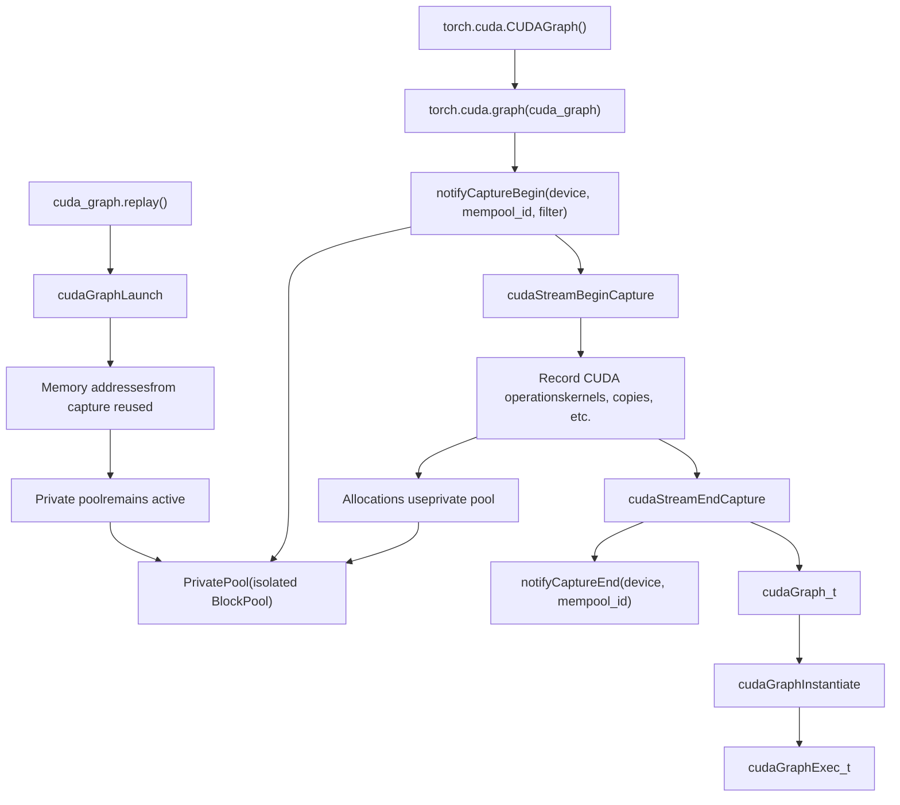
Sources: [c10/cuda/CUDACachingAllocator.cpp102-133](https://github.com/pytorch/pytorch/blob/915982a4/c10/cuda/CUDACachingAllocator.cpp#L102-L133) [ATen/cuda/CUDAGraphsUtils.cuh1-50](https://github.com/pytorch/pytorch/blob/915982a4/ATen/cuda/CUDAGraphsUtils.cuh#L1-L50) [torch/cuda/graphs.py124-200](https://github.com/pytorch/pytorch/blob/915982a4/torch/cuda/graphs.py#L124-L200)

## Why Graphs Need Private Memory Pools

Graph capture requires special memory management because captured graphs store raw memory addresses of tensors used during recording. These addresses must remain valid when the graph is replayed.

### The Address Stability Problem

**Without Private Pools (Incorrect)**

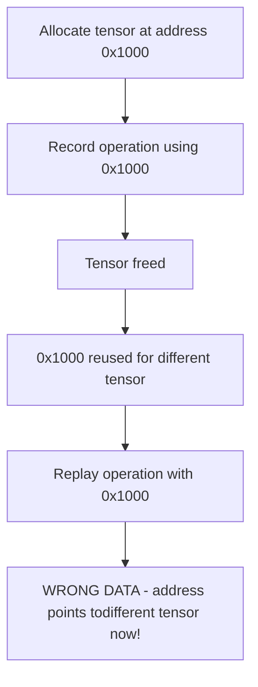
**With Private Pools (Correct)**

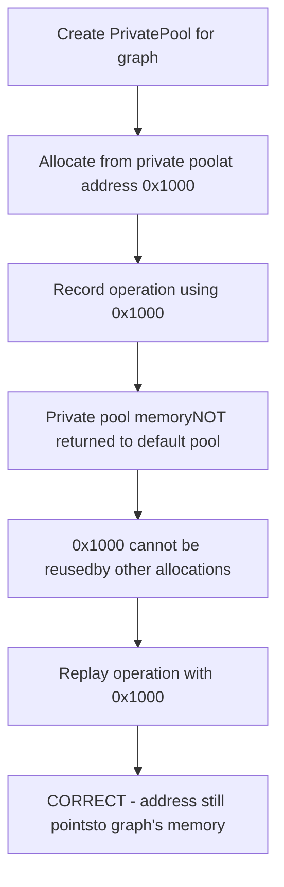
Private pools prevent the default allocator from reusing graph memory addresses for other tensors, ensuring captured addresses remain valid.

Sources: [c10/cuda/CUDACachingAllocator.cpp102-133](https://github.com/pytorch/pytorch/blob/915982a4/c10/cuda/CUDACachingAllocator.cpp#L102-L133)

### Memory Pool Identifier (MempoolId\_t)

Each graph's private pool is identified by a `MempoolId_t`:

```
// MempoolId_t definitionusing MempoolId_t = std::pair<int64_t, int64_t>;// First element: CaptureId (unique per capture)// Second element: Alternative identifier
```
The mempool ID associates allocations with specific graph captures, ensuring isolation.

Sources: [c10/cuda/CUDAGraphsC10Utils.h15-25](https://github.com/pytorch/pytorch/blob/915982a4/c10/cuda/CUDAGraphsC10Utils.h#L15-L25) [c10/cuda/CUDACachingAllocator.h49-110](https://github.com/pytorch/pytorch/blob/915982a4/c10/cuda/CUDACachingAllocator.h#L49-L110)

## Private Pool Implementation

The `PrivatePool` struct manages memory for a single graph capture. Each private pool contains its own `BlockPool` instances for small and large allocations.

### PrivatePool Structure

**PrivatePool Components**

```mermaid
flowchart TD
    PoolId["MempoolId_t id"]
    UseCount["int use_count(number of live graphs)"]
    AllocCount["int allocation_count(unfreed allocations)"]
    Allocator["XPUAllocator* allocator_(optional custom allocator)"]
    LargeBlocks["BlockPool large_blocks(size >= 1MB)"]
    SmallBlocks["BlockPool small_blocks(size < 1MB)"]
    Blocks["std::set blocks(free blocks, sorted by size)"]
    Unmapped["std::set unmapped(for expandable segments)"]
    IsSmall["bool is_small"]
    OwnerPool["PrivatePool* owner_PrivatePool"]
    BlockDevice["DeviceIndex device"]
    BlockStream["cudaStream_t stream"]
    BlockSize["size_t size"]
    BlockPtr["void* ptr"]
    BlockAllocated["bool allocated"]
    BlockPool["BlockPool* pool"]
    Block["Block"]

    LargeBlocks --> BlockPool
    SmallBlocks --> BlockPool
    Blocks --> Block
    Unmapped --> Block
    IsSmall --> BlockPool
    BlockDevice --> Block
    BlockStream --> Block
    BlockSize --> Block
    BlockPtr --> Block
    BlockAllocated --> Block
    PoolId --> PrivatePool
    UseCount --> PrivatePool
    AllocCount --> PrivatePool
    Allocator --> PrivatePool
    OwnerPool --> PrivatePool
```
**Key Fields**:

-   `id`: Unique identifier for the pool (`MempoolId_t`)
-   `use_count`: Number of graphs currently using this pool
-   `allocation_count`: Number of live allocations from this pool
-   `large_blocks` / `small_blocks`: Separate pools for different allocation sizes
-   Pool is freed when both `use_count` and `allocation_count` reach zero

Sources: [c10/cuda/CUDACachingAllocator.cpp1045-1086](https://github.com/pytorch/pytorch/blob/915982a4/c10/cuda/CUDACachingAllocator.cpp#L1045-L1086) [c10/xpu/XPUCachingAllocator.cpp365-393](https://github.com/pytorch/pytorch/blob/915982a4/c10/xpu/XPUCachingAllocator.cpp#L365-L393)

### BlockPool for Graph Memory

Each `PrivatePool` contains two `BlockPool` instances:

| BlockPool | Size Range | Purpose |
| --- | --- | --- |
| `small_blocks` | < 1 MB | Small tensor allocations, uses 2MB buffers |
| `large_blocks` | \>= 1 MB | Large tensor allocations, individual segments |

`BlockPool` maintains a sorted set of free blocks, enabling best-fit allocation within the graph's isolated memory.

Sources: [c10/cuda/CUDACachingAllocator.cpp164-185](https://github.com/pytorch/pytorch/blob/915982a4/c10/cuda/CUDACachingAllocator.cpp#L164-L185) [c10/xpu/XPUCachingAllocator.cpp28-42](https://github.com/pytorch/pytorch/blob/915982a4/c10/xpu/XPUCachingAllocator.cpp#L28-L42)

## Graph Capture Lifecycle

The allocator coordinates with CUDA graph capture through a series of notification callbacks that manage private pool creation and destruction.

### Capture Phase Notifications

**Graph Capture Notification Flow**

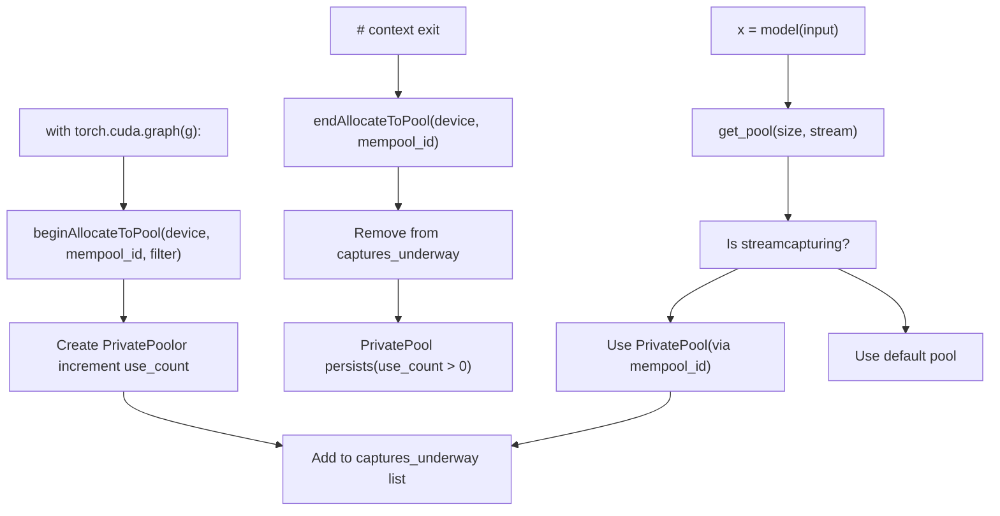
**Key Functions**:

-   `beginAllocateToPool(device, mempool_id, filter)`: Starts routing allocations to a private pool
-   `endAllocateToPool(device, mempool_id)`: Stops routing new allocations to the pool
-   `releasePool(device, mempool_id)`: Decrements `use_count` and potentially frees the pool

Sources: [c10/cuda/CUDACachingAllocator.cpp2605-2667](https://github.com/pytorch/pytorch/blob/915982a4/c10/cuda/CUDACachingAllocator.cpp#L2605-L2667) [c10/cuda/CUDACachingAllocator.h360-370](https://github.com/pytorch/pytorch/blob/915982a4/c10/cuda/CUDACachingAllocator.h#L360-L370)

### Pool Destruction

A `PrivatePool` is destroyed when both conditions are met:

```
// Destruction criteriaif (pool->use_count == 0 && pool->allocation_count == 0) {    // Safe to delete the pool    free_pool(pool);}
```
**Reference Counting**:

-   `use_count`: Number of active graph captures using this pool (incremented on `beginAllocateToPool`, decremented on `releasePool`)
-   `allocation_count`: Number of live tensors allocated from this pool (incremented on allocation, decremented on free)

When a graph is destroyed, `releasePool` is called to decrement `use_count`. If all allocations have been freed (`allocation_count == 0`), the pool is destroyed.

Sources: [c10/cuda/CUDACachingAllocator.cpp2715-2775](https://github.com/pytorch/pytorch/blob/915982a4/c10/cuda/CUDACachingAllocator.cpp#L2715-L2775) [c10/xpu/XPUCachingAllocator.cpp365-393](https://github.com/pytorch/pytorch/blob/915982a4/c10/xpu/XPUCachingAllocator.cpp#L365-L393)

## Allocation During Graph Capture

When a stream is capturing, allocations on that stream are routed to the graph's private pool instead of the default pool.

### Allocation Routing Logic

**Allocation Pool Selection**

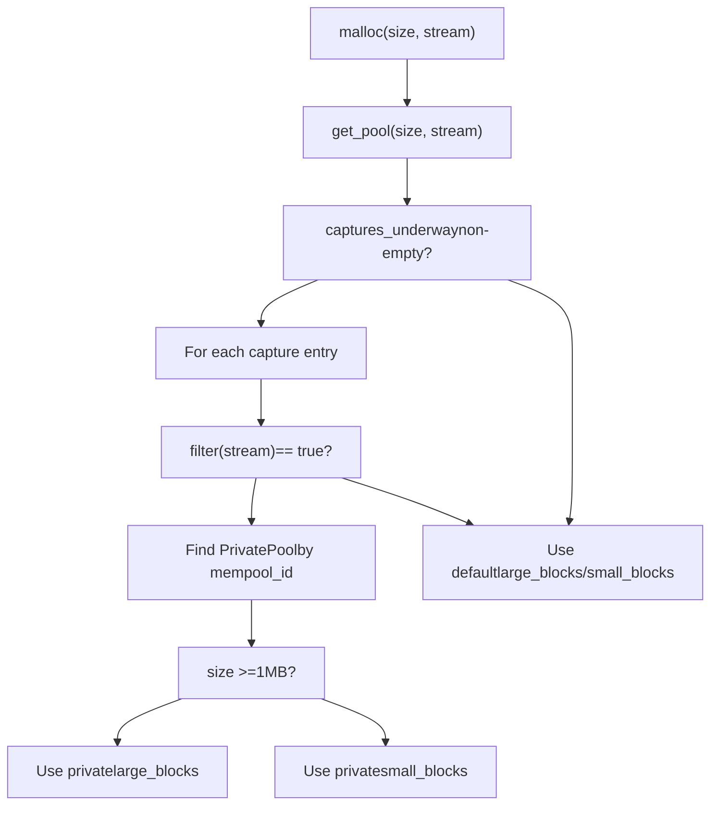
**Key Data Structures**:

-   `captures_underway`: `vector<pair<MempoolId_t, function<bool(cudaStream_t)>>>`
-   Each entry pairs a mempool ID with a stream filter function
-   The filter returns `true` if the allocation's stream is part of the capture

Sources: [c10/cuda/CUDACachingAllocator.cpp1566-1618](https://github.com/pytorch/pytorch/blob/915982a4/c10/cuda/CUDACachingAllocator.cpp#L1566-L1618) [c10/xpu/XPUCachingAllocator.cpp670-691](https://github.com/pytorch/pytorch/blob/915982a4/c10/xpu/XPUCachingAllocator.cpp#L670-L691)

### Stream Filter Function

The filter function determines which streams belong to a graph capture:

```
// Typical filter for single-stream captureauto filter = <FileRef file-url="https://github.com/pytorch/pytorch/blob/915982a4/captured_stream" undefined  file-path="captured_stream">Hii</FileRef> {    return stream == captured_stream;};
```
This allows the allocator to route only relevant allocations to the private pool, while other streams continue using the default pool.

Sources: [c10/cuda/CUDACachingAllocator.h137-143](https://github.com/pytorch/pytorch/blob/915982a4/c10/cuda/CUDACachingAllocator.h#L137-L143) [c10/cuda/CUDACachingAllocator.cpp2605-2628](https://github.com/pytorch/pytorch/blob/915982a4/c10/cuda/CUDACachingAllocator.cpp#L2605-L2628)

## Python API

PyTorch provides a high-level Python API for CUDA graph capture that handles memory pool management automatically.

### Basic Graph Capture

```
# Create a graph objectg = torch.cuda.CUDAGraph() # Warmup phase (optional but recommended)s = torch.cuda.Stream()with torch.cuda.stream(s):    for _ in range(3):        output = model(input)s.synchronize() # Capture phasewith torch.cuda.graph(g):    output = model(input) # Replay phaseg.replay()
```
**Capture Context Manager**:

-   `torch.cuda.graph(g)` enters capture mode on the current stream
-   Calls `beginAllocateToPool` to create/use a private pool
-   Records all CUDA operations into the graph
-   Calls `endAllocateToPool` on context exit
-   Captured graph can be replayed with `g.replay()`

Sources: [torch/cuda/graphs.py124-200](https://github.com/pytorch/pytorch/blob/915982a4/torch/cuda/graphs.py#L124-L200) [test/test\_cuda.py4698-4850](https://github.com/pytorch/pytorch/blob/915982a4/test/test_cuda.py#L4698-L4850)

### Graph Lifecycle

**Graph Creation and Destruction**

```
# Graph creationg = torch.cuda.CUDAGraph()  # Graph not yet instantiated # Capture (instantiates the graph)with torch.cuda.graph(g):    y = x + 1 # Multiple replays (efficient)for _ in range(100):    g.replay() # Cleanup (releases private pool)del g  # Calls releasePool, decrements use_count
```
When the graph object is deleted, the allocator is notified via `releasePool`, which decrements the private pool's `use_count`. If no allocations remain (`allocation_count == 0`), the pool is freed.

Sources: [torch/cuda/graphs.py278-330](https://github.com/pytorch/pytorch/blob/915982a4/torch/cuda/graphs.py#L278-L330) [c10/cuda/CUDACachingAllocator.cpp2715-2775](https://github.com/pytorch/pytorch/blob/915982a4/c10/cuda/CUDACachingAllocator.cpp#L2715-L2775)

### Graph Pool Handle

For advanced use cases, you can explicitly manage graph pools:

```
# Create a graph pool handlegraph_pool_handle = torch.cuda.graph_pool_handle() # Use the pool for multiple graphswith torch.cuda.graph(g1, pool=graph_pool_handle):    y1 = model1(x) with torch.cuda.graph(g2, pool=graph_pool_handle):    y2 = model2(x) # Both graphs share the same private pool
```
This allows multiple graphs to share a pool, reducing memory fragmentation.

Sources: [torch/cuda/graphs.py359-390](https://github.com/pytorch/pytorch/blob/915982a4/torch/cuda/graphs.py#L359-L390) [test/test\_cuda.py4925-4980](https://github.com/pytorch/pytorch/blob/915982a4/test/test_cuda.py#L4925-L4980)

## Stream-Aware Memory Reuse

The caching allocator ties block reuse to CUDA stream completion. A block allocated on one stream cannot be freely returned to the pool and handed to a different stream until it is safe to do so.

### recordStream Mechanism

When a tensor is accessed on a stream different from its allocation stream, `recordStream(ptr, stream)` must be called. Internally this does two things:

1.  Adds the new stream to `Block::stream_uses` (a `ska::flat_hash_set<cuda::CUDAStream>`)
2.  Prevents the block from being recycled until all recorded streams have completed their work

The check is implemented via CUDA events: when the block is freed, an event is recorded on each stream in `stream_uses`. The block enters the pool only after those events complete.

**stream\_uses and Block Reuse**

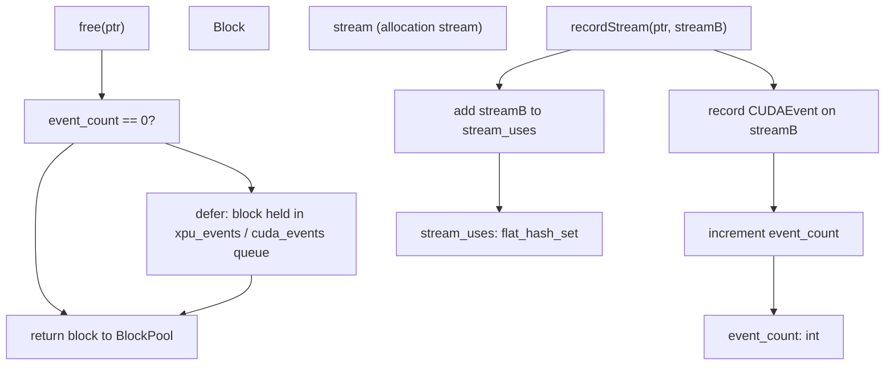
Sources: [c10/cuda/CUDACachingAllocator.cpp190-210](https://github.com/pytorch/pytorch/blob/915982a4/c10/cuda/CUDACachingAllocator.cpp#L190-L210) [c10/cuda/CUDACachingAllocator.cpp164-187](https://github.com/pytorch/pytorch/blob/915982a4/c10/cuda/CUDACachingAllocator.cpp#L164-L187)

### Graph Capture Record Stream Reuse

During graph capture, `recordStream` semantics interact with the private pool. By default, calling `recordStream` during capture is restricted because the replayed graph will always execute in the same stream order. The `graph_capture_record_stream_reuse` config option relaxes this for multi-stream graph capture scenarios:

| Setting | Behavior |
| --- | --- |
| `graph_capture_record_stream_reuse:False` (default) | `recordStream` during capture is a no-op; addresses are stable by construction |
| `graph_capture_record_stream_reuse:True` | Allows `recordStream` during capture; enables multi-stream graphs at the cost of extra events |

```
torch.cuda.memory._set_allocator_settings(    "graph_capture_record_stream_reuse:True")
```
Sources: [c10/cuda/CUDAAllocatorConfig.h60-62](https://github.com/pytorch/pytorch/blob/915982a4/c10/cuda/CUDAAllocatorConfig.h#L60-L62) [c10/cuda/CUDAAllocatorConfig.cpp106-109](https://github.com/pytorch/pytorch/blob/915982a4/c10/cuda/CUDAAllocatorConfig.cpp#L106-L109)

## Memory Pool Configuration

Graph capture behavior can be controlled through allocator configuration options.

### Per-Process Memory Fraction

Limits graph pool memory usage:

```
# Limit graph pools to 50% of device memorytorch.cuda.set_per_process_memory_fraction(0.5)
```
This setting applies to both default pools and graph private pools.

Sources: [c10/cuda/CUDAAllocatorConfig.h64-66](https://github.com/pytorch/pytorch/blob/915982a4/c10/cuda/CUDAAllocatorConfig.h#L64-L66) [test/test\_cuda.py462-500](https://github.com/pytorch/pytorch/blob/915982a4/test/test_cuda.py#L462-L500)

### Pool Management APIs

**`CUDAAllocator` Pool Management Methods**

| Method | Purpose |
| --- | --- |
| `beginAllocateToPool(device, mempool_id, filter)` | Start routing allocations to a private pool |
| `endAllocateToPool(device, mempool_id)` | Stop routing new allocations |
| `releasePool(device, mempool_id)` | Decrement pool use count |
| `getPoolUseCount(device, mempool_id)` | Query number of graphs using pool |
| `checkPoolLiveAllocations(device, mempool_id, addrs)` | Validate live allocations |
| `setNoSplit(device, mempool_id)` | Prevent block splitting within a pool |
| `setUseOnOOM(device, mempool_id, use_on_oom)` | Fall back to pool on OOM |

These C++ APIs are typically called by the Python graph capture context manager and are not directly exposed to users.

Sources: [c10/cuda/CUDACachingAllocator.h134-189](https://github.com/pytorch/pytorch/blob/915982a4/c10/cuda/CUDACachingAllocator.h#L134-L189) [c10/xpu/XPUCachingAllocator.h62-91](https://github.com/pytorch/pytorch/blob/915982a4/c10/xpu/XPUCachingAllocator.h#L62-L91)

## Graph Pool Isolation Example

This example demonstrates how private pools prevent address conflicts:

**Scenario Without Private Pools (Broken)**

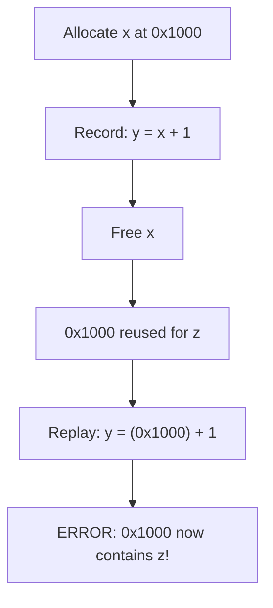
**Scenario With Private Pools (Correct)**

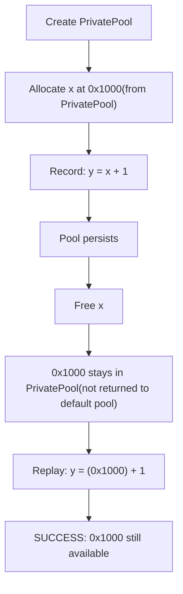
The private pool ensures that addresses captured during graph creation remain valid when the graph is replayed.

Sources: [c10/cuda/CUDACachingAllocator.cpp102-133](https://github.com/pytorch/pytorch/blob/915982a4/c10/cuda/CUDACachingAllocator.cpp#L102-L133)

## CachingHostAllocator (Pinned Host Memory)

The `CachingHostAllocator` manages a cache of pinned (page-locked) host memory. Pinned memory is required for fast, asynchronous CPU-GPU transfers via DMA, but allocation through `cudaHostAlloc` is expensive. The allocator reuses blocks across transfers using a stream-event mechanism analogous to the device caching allocator.

### Implementation Structure

The CUDA-specific implementation is `CUDACachingHostAllocatorImpl` in `aten/src/ATen/cuda/CachingHostAllocator.cpp`, which specializes the template base class `CachingHostAllocatorImpl<CUDAStream, CUDAEventPool::Event>` from `aten/src/ATen/core/CachingHostAllocator.h`.

**CachingHostAllocator class hierarchy**

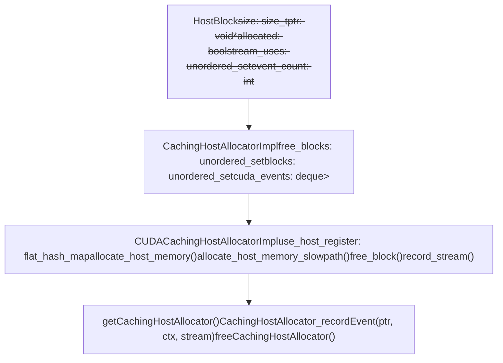
Sources: [aten/src/ATen/cuda/CachingHostAllocator.cpp1-60](https://github.com/pytorch/pytorch/blob/915982a4/aten/src/ATen/cuda/CachingHostAllocator.cpp#L1-L60) [aten/src/ATen/core/CachingHostAllocator.h1-100](https://github.com/pytorch/pytorch/blob/915982a4/aten/src/ATen/core/CachingHostAllocator.h#L1-L100)

### Allocation Modes

`CUDACachingHostAllocatorImpl` supports two modes for obtaining pinned memory:

| Mode | Config Key | Mechanism |
| --- | --- | --- |
| Default | `pinned_use_cuda_host_register:False` | `cudaHostAlloc` — allocates pinned memory directly |
| Register mode | `pinned_use_cuda_host_register:True` | `cudaHostRegister` — pins existing pageable memory |

The register mode can use multiple threads to parallelize registration, controlled by `pinned_num_register_threads` (default 1, max 128).

A reserve segment optimization is available via `pinned_reserve_segment_size_mb`: the allocator pre-maps a segment from which small allocations are sub-allocated without calling `cudaHostAlloc`, reducing latency for repeated small allocations.

Sources: [aten/src/ATen/cuda/CachingHostAllocator.cpp20-80](https://github.com/pytorch/pytorch/blob/915982a4/aten/src/ATen/cuda/CachingHostAllocator.cpp#L20-L80) [c10/cuda/CUDAAllocatorConfig.h68-93](https://github.com/pytorch/pytorch/blob/915982a4/c10/cuda/CUDAAllocatorConfig.h#L68-L93)

### Stream-Aware Reuse for Host Memory

Host blocks track which CUDA streams have issued transfers using their memory via `HostBlock::stream_uses`. When a host block is freed:

1.  If `stream_uses` is empty, the block returns to `free_blocks` immediately.
2.  Otherwise, a `CUDAEvent` is recorded on each stream in `stream_uses`.
3.  The block enters the `cuda_events` deque, paired with its event.
4.  On subsequent allocation attempts, completed events are processed: blocks whose events have fired are moved back to `free_blocks`.

This is analogous to device-side `Block::stream_uses` but operates on host (pinned) memory.

**Host block lifecycle**

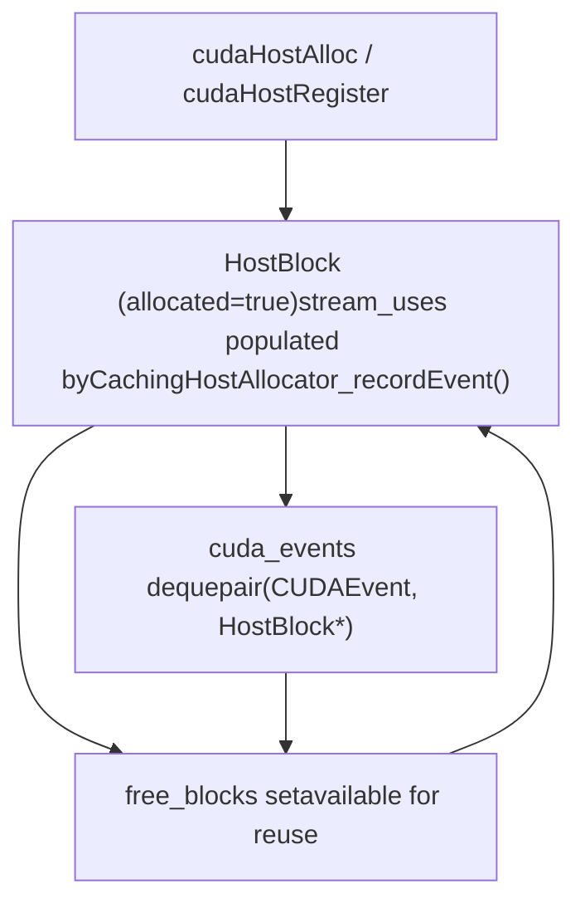
Sources: [aten/src/ATen/core/CachingHostAllocator.h100-200](https://github.com/pytorch/pytorch/blob/915982a4/aten/src/ATen/core/CachingHostAllocator.h#L100-L200) [aten/src/ATen/cuda/CachingHostAllocator.cpp80-160](https://github.com/pytorch/pytorch/blob/915982a4/aten/src/ATen/cuda/CachingHostAllocator.cpp#L80-L160)

### Python-Visible Host Memory Stats

The host allocator exposes statistics via `torch.cuda.host_memory_stats()`. Key counters:

| Stat Key | Meaning |
| --- | --- |
| `allocated_bytes.current` | Currently allocated pinned bytes |
| `allocated_bytes.peak` | Peak allocated pinned bytes |
| `num_host_alloc` | Total `cudaHostAlloc` calls |
| `num_host_free` | Total host frees |
| `active_requests.current` | Live pinned-memory allocations |
| `host_alloc_time.count` | Count of timed allocations |

Stats are reset with `torch.cuda.reset_peak_host_memory_stats()` and `torch.cuda.reset_accumulated_host_memory_stats()`.

Sources: [test/test\_cuda.py182-272](https://github.com/pytorch/pytorch/blob/915982a4/test/test_cuda.py#L182-L272) [torch/cuda/memory.py44-64](https://github.com/pytorch/pytorch/blob/915982a4/torch/cuda/memory.py#L44-L64)

## XPU Graph Support

The XPU backend (Intel GPUs) also supports graph capture with similar private pool management.

### XPU Private Pool Structure

XPU uses an equivalent `PrivatePool` structure with the same lifecycle management:

```
struct PrivatePool {    MempoolId_t id;    int use_count;    int allocation_count;    XPUAllocator* allocator_;    BlockPool large_blocks;  // size >= 1MB    BlockPool small_blocks;  // size < 1MB};
```
The XPU implementation mirrors CUDA's design but uses SYCL APIs instead of CUDA Runtime APIs.

Sources: [c10/xpu/XPUCachingAllocator.cpp365-393](https://github.com/pytorch/pytorch/blob/915982a4/c10/xpu/XPUCachingAllocator.cpp#L365-L393)

### XPU Graph Capture

XPU graphs use the same notification callbacks:

| Callback | XPU Implementation |
| --- | --- |
| `beginAllocateToPool` | Routes allocations to XPU private pool |
| `endAllocateToPool` | Stops routing to private pool |
| `releasePool` | Decrements XPU pool use count |

The Python API is also identical:

```
# XPU graph capture (same API as CUDA)g = torch.xpu.XPUGraph()with torch.xpu.graph(g):    output = model(input)g.replay()
```
Sources: [c10/xpu/XPUCachingAllocator.cpp1182-1290](https://github.com/pytorch/pytorch/blob/915982a4/c10/xpu/XPUCachingAllocator.cpp#L1182-L1290) [torch/xpu/graphs.py](https://github.com/pytorch/pytorch/blob/915982a4/torch/xpu/graphs.py)

## Testing and Validation

PyTorch includes comprehensive tests for CUDA BLAS operations:

### Test Categories

| Test Suite | Coverage | File |
| --- | --- | --- |
| Accuracy Tests | Verify correctness across dtypes and precisions | [test/test\_matmul\_cuda.py104-277](https://github.com/pytorch/pytorch/blob/915982a4/test/test_matmul_cuda.py#L104-L277) |
| Grouped GEMM | Test grouped operations with various layouts | [test/test\_matmul\_cuda.py402-577](https://github.com/pytorch/pytorch/blob/915982a4/test/test_matmul_cuda.py#L402-L577) |
| Determinism | Verify deterministic results | [test/test\_matmul\_cuda.py358-366](https://github.com/pytorch/pytorch/blob/915982a4/test/test_matmul_cuda.py#L358-L366) |
| Alignment | Test TMA alignment requirements | [test/test\_matmul\_cuda.py282-298](https://github.com/pytorch/pytorch/blob/915982a4/test/test_matmul_cuda.py#L282-L298) |
| Autotuning | Test template selection and benchmarking | [test/inductor/test\_max\_autotune.py](https://github.com/pytorch/pytorch/blob/915982a4/test/inductor/test_max_autotune.py) |

### Tolerance Settings

The test suite uses architecture-specific tolerances:

-   **FP32**: `atol=1e-4, rtol=1e-4`
-   **FP16/BF16**: `atol=1e-3, rtol=3e-3`
-   **Reduced precision**: `atol=2e-3, rtol=2e-3`
-   **MI200 (ROCm)**: Relaxed tolerances for specific dtypes

Sources: [test/test\_matmul\_cuda.py186-277](https://github.com/pytorch/pytorch/blob/915982a4/test/test_matmul_cuda.py#L186-L277) [test/inductor/test\_max\_autotune.py](https://github.com/pytorch/pytorch/blob/915982a4/test/inductor/test_max_autotune.py)
