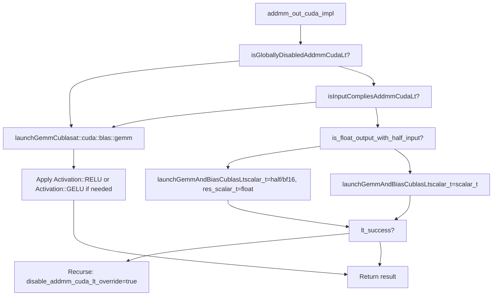
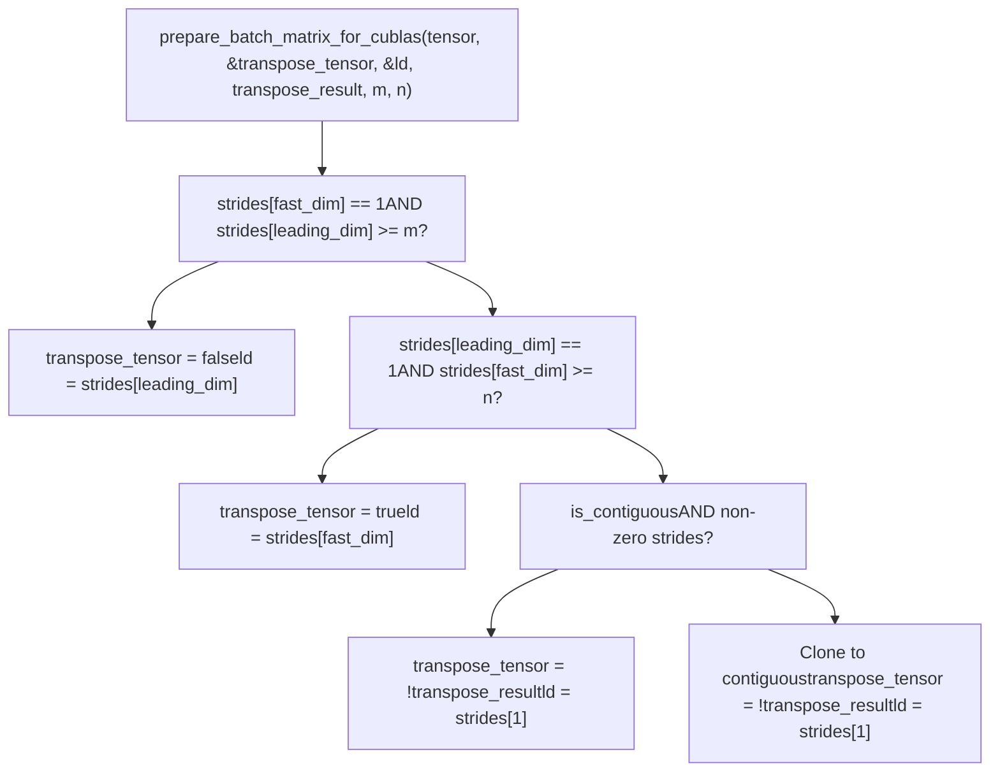
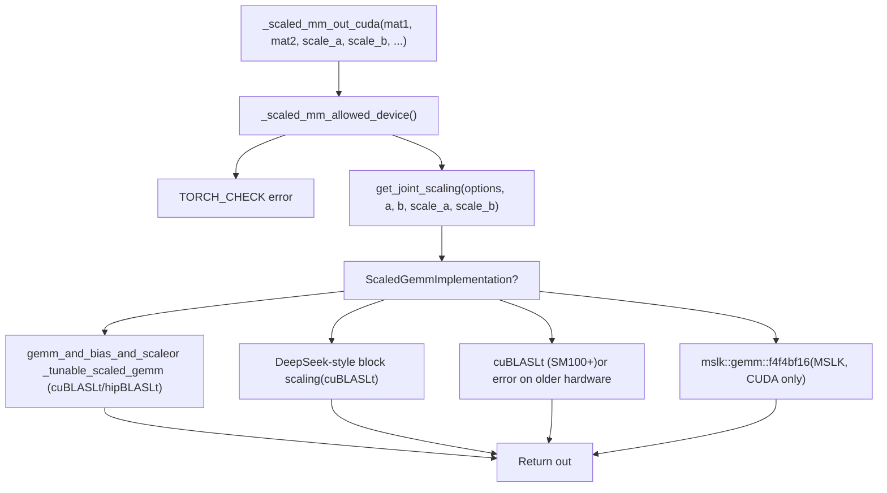
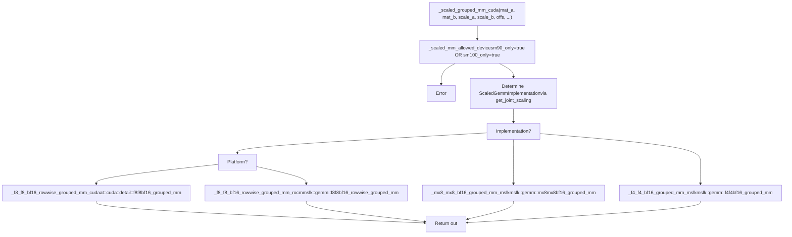

# BLAS and Matrix Multiplication Operations

Relevant source files

-   [aten/src/ATen/CMakeLists.txt](https://github.com/pytorch/pytorch/blob/915982a4/aten/src/ATen/CMakeLists.txt)
-   [aten/src/ATen/native/Blas.cpp](https://github.com/pytorch/pytorch/blob/915982a4/aten/src/ATen/native/Blas.cpp)
-   [aten/src/ATen/native/GroupedMMUtils.h](https://github.com/pytorch/pytorch/blob/915982a4/aten/src/ATen/native/GroupedMMUtils.h)
-   [aten/src/ATen/native/ScaledBlasUtils.cpp](https://github.com/pytorch/pytorch/blob/915982a4/aten/src/ATen/native/ScaledBlasUtils.cpp)
-   [aten/src/ATen/native/ScaledBlasUtils.h](https://github.com/pytorch/pytorch/blob/915982a4/aten/src/ATen/native/ScaledBlasUtils.h)
-   [aten/src/ATen/native/cuda/Blas.cpp](https://github.com/pytorch/pytorch/blob/915982a4/aten/src/ATen/native/cuda/Blas.cpp)
-   [aten/src/ATen/native/cuda/GroupedBlas.cpp](https://github.com/pytorch/pytorch/blob/915982a4/aten/src/ATen/native/cuda/GroupedBlas.cpp)
-   [aten/src/ATen/native/cuda/ScaledBlas.cpp](https://github.com/pytorch/pytorch/blob/915982a4/aten/src/ATen/native/cuda/ScaledBlas.cpp)
-   [aten/src/ATen/native/hip/ck\_group\_gemm.h](https://github.com/pytorch/pytorch/blob/915982a4/aten/src/ATen/native/hip/ck_group_gemm.h)
-   [aten/src/ATen/native/hip/ck\_group\_gemm.hip](https://github.com/pytorch/pytorch/blob/915982a4/aten/src/ATen/native/hip/ck_group_gemm.hip)
-   [aten/src/ATen/native/mkldnn/xpu/ScaledBlas.cpp](https://github.com/pytorch/pytorch/blob/915982a4/aten/src/ATen/native/mkldnn/xpu/ScaledBlas.cpp)
-   [aten/src/ATen/test/scalar\_test.cpp](https://github.com/pytorch/pytorch/blob/915982a4/aten/src/ATen/test/scalar_test.cpp)
-   [aten/src/ATen/xpu/XPUScaledBlas.cpp](https://github.com/pytorch/pytorch/blob/915982a4/aten/src/ATen/xpu/XPUScaledBlas.cpp)
-   [aten/src/ATen/xpu/XPUScaledBlas.h](https://github.com/pytorch/pytorch/blob/915982a4/aten/src/ATen/xpu/XPUScaledBlas.h)
-   [test/test\_matmul\_cuda.py](https://github.com/pytorch/pytorch/blob/915982a4/test/test_matmul_cuda.py)
-   [test/test\_scaled\_matmul\_cuda.py](https://github.com/pytorch/pytorch/blob/915982a4/test/test_scaled_matmul_cuda.py)
-   [torch/testing/\_internal/common\_quantized.py](https://github.com/pytorch/pytorch/blob/915982a4/torch/testing/_internal/common_quantized.py)

## Purpose and Scope

This page covers PyTorch's CUDA BLAS integration for matrix multiplication. It documents the CUDA implementations of `addmm`, `mm`, `baddbmm`, `bmm`, `dot`, and `vdot`, the dispatch logic between cuBLAS and cuBLASLt, the `_scaled_mm` family of operations for FP8/MXFP8/NVFP4 precision formats, and the grouped matrix multiplication (`grouped_mm` and `_scaled_grouped_mm`) used in Mixture-of-Experts layers.

For how ATen operator dispatch routes calls to these implementations, see [ATen Native Function System](/pytorch/pytorch/3.1-aten-native-function-system). For Inductor kernel selection and autotuning on top of these BLAS calls, see [Kernel Selection and Autotuning](/pytorch/pytorch/2.5.3-kernel-selection-and-autotuning).

---

## Operation-to-File Map

| Operation | CUDA Entry Point | Primary File |
| --- | --- | --- |
| `torch.addmm` | `addmm_out_cuda` | `aten/src/ATen/native/cuda/Blas.cpp` |
| `torch.mm` | `mm_out_cuda` | `aten/src/ATen/native/cuda/Blas.cpp` |
| `torch.baddbmm` | `baddbmm_out_cuda` | `aten/src/ATen/native/cuda/Blas.cpp` |
| `torch.bmm` | `bmm_out_cuda` | `aten/src/ATen/native/cuda/Blas.cpp` |
| `torch.dot` | `dot_cuda` | `aten/src/ATen/native/cuda/Blas.cpp` |
| `torch.vdot` | `vdot_cuda` | `aten/src/ATen/native/cuda/Blas.cpp` |
| `torch._scaled_mm` / `F.scaled_mm` | `_scaled_mm_out_cuda` | `aten/src/ATen/native/cuda/ScaledBlas.cpp` |
| `torch._scaled_grouped_mm` / `F.scaled_grouped_mm` | `_scaled_grouped_mm_cuda` | `aten/src/ATen/native/cuda/GroupedBlas.cpp` |
| `torch.nn.functional.grouped_mm` | `grouped_mm_cuda` | `aten/src/ATen/native/cuda/GroupedBlas.cpp` |

---

## Standard BLAS Operations

### addmm and mm

`addmm` computes `out = beta * self + alpha * mat1 @ mat2`. The full CUDA implementation is `addmm_out_cuda_impl` [aten/src/ATen/native/cuda/Blas.cpp343-515](https://github.com/pytorch/pytorch/blob/915982a4/aten/src/ATen/native/cuda/Blas.cpp#L343-L515)

`mm_out_cuda` delegates to `addmm_out_cuda_impl` with `beta=0` and `alpha=1` [aten/src/ATen/native/cuda/Blas.cpp649-652](https://github.com/pytorch/pytorch/blob/915982a4/aten/src/ATen/native/cuda/Blas.cpp#L649-L652)

The implementation chooses between two execution paths:

1.  **cuBLASLt path** (`launchGemmAndBiasCublasLt`): supports fused bias epilogue and optionally fused activations.
2.  **Standard cuBLAS path** (`launchGemmCublas`): a direct `cublas*gemm` call.

The cuBLASLt path is attempted first. It is gated by `isGloballyDisabledAddmmCudaLt` and `isInputCompliesAddmmCudaLt` [aten/src/ATen/native/cuda/Blas.cpp116-234](https://github.com/pytorch/pytorch/blob/915982a4/aten/src/ATen/native/cuda/Blas.cpp#L116-L234)

**Conditions for the cuBLASLt path** (checked in `isInputCompliesAddmmCudaLt`):

-   `beta == 1.0`
-   Result is 2-D and contiguous
-   Bias (`self`) is 1-D (or squeezable to 1-D) matching `mat2`'s column count, or 2-D with a fused activation
-   `mat2` dimensions both > 1
-   dtype is `float32`, `float16`, or `bfloat16`

If the cuBLASLt call returns failure, execution recurses with `disable_addmm_cuda_lt_override=true` to force the cuBLAS path.

**Diagram: addmm Dispatch Flow**

Sources: [aten/src/ATen/native/cuda/Blas.cpp116-515](https://github.com/pytorch/pytorch/blob/915982a4/aten/src/ATen/native/cuda/Blas.cpp#L116-L515)

### Activation Fusion

`_addmm_activation` (used by fused linear layers) fuses a post-GEMM activation by passing an `Activation` enum value to `addmm_out_cuda_impl` [aten/src/ATen/native/cuda/Blas.cpp96-114](https://github.com/pytorch/pytorch/blob/915982a4/aten/src/ATen/native/cuda/Blas.cpp#L96-L114):

| `Activation` | cuBLASLt epilogue | Fallback |
| --- | --- | --- |
| `Activation::None` | None | None |
| `Activation::RELU` | `GEMMAndBiasActivationEpilogue::RELU` | `at::relu_()` |
| `Activation::GELU` | `GEMMAndBiasActivationEpilogue::GELU` | `at::gelu_(..., "tanh")` |

Sources: [aten/src/ATen/native/cuda/Blas.cpp96-114](https://github.com/pytorch/pytorch/blob/915982a4/aten/src/ATen/native/cuda/Blas.cpp#L96-L114) [aten/src/ATen/native/cuda/Blas.cpp486-513](https://github.com/pytorch/pytorch/blob/915982a4/aten/src/ATen/native/cuda/Blas.cpp#L486-L513)

### baddbmm and bmm

`baddbmm_out_cuda_impl` [aten/src/ATen/native/cuda/Blas.cpp517-635](https://github.com/pytorch/pytorch/blob/915982a4/aten/src/ATen/native/cuda/Blas.cpp#L517-L635) computes `out = beta * self + alpha * batch1 @ batch2` over a batch dimension. Key details:

-   Calls `prepare_batch_matrix_for_cublas` [aten/src/ATen/native/cuda/Blas.cpp63-92](https://github.com/pytorch/pytorch/blob/915982a4/aten/src/ATen/native/cuda/Blas.cpp#L63-L92) for each of `batch1` and `batch2` to resolve transpose flags and leading dimensions.
-   If `num_batches == 1`, uses `at::cuda::blas::gemm` instead of `at::cuda::blas::bgemm` for efficiency.
-   Supports float32 output from float16/bfloat16 input via `bgemm<scalar_t, float>`.

`bmm_out_cuda` calls `baddbmm_out_cuda_impl` with `beta=0, alpha=1` [aten/src/ATen/native/cuda/Blas.cpp661-668](https://github.com/pytorch/pytorch/blob/915982a4/aten/src/ATen/native/cuda/Blas.cpp#L661-L668)

### dot and vdot

`dot_cuda` [aten/src/ATen/native/cuda/Blas.cpp706-753](https://github.com/pytorch/pytorch/blob/915982a4/aten/src/ATen/native/cuda/Blas.cpp#L706-L753) computes the inner product of two 1-D vectors via `at::cuda::blas::dot`. The cuBLAS handle is set to `CUBLAS_POINTER_MODE_DEVICE` so the scalar result is written directly to a device tensor without a host round-trip.

`vdot_cuda` [aten/src/ATen/native/cuda/Blas.cpp755-802](https://github.com/pytorch/pytorch/blob/915982a4/aten/src/ATen/native/cuda/Blas.cpp#L755-L802) computes the conjugate dot product for complex types via `at::cuda::blas::vdot`. Both functions redirect conjugated inputs to avoid explicit `.conj()` copies where possible.

---

## Argument Preparation: `prepare_batch_matrix_for_cublas`

Before invoking any batched cuBLAS API, stride information must be analyzed to determine whether a transpose is needed and what the leading dimension is.

**Diagram: prepare\_batch\_matrix\_for\_cublas Logic**

Sources: [aten/src/ATen/native/cuda/Blas.cpp63-92](https://github.com/pytorch/pytorch/blob/915982a4/aten/src/ATen/native/cuda/Blas.cpp#L63-L92)

---

## cuBLASLt vs cuBLAS Backend Selection

The preferred BLAS backend can be controlled at runtime using `torch.backends.cuda.preferred_blas_library()`.

`isGloballyDisabledAddmmCudaLt` [aten/src/ATen/native/cuda/Blas.cpp120-154](https://github.com/pytorch/pytorch/blob/915982a4/aten/src/ATen/native/cuda/Blas.cpp#L120-L154) determines whether cuBLASLt is globally disabled:

| Condition | CUDA | ROCm |
| --- | --- | --- |
| `DISABLE_ADDMM_CUDA_LT=1` env var | Disables Lt | Disables Lt |
| Architecture not in `getHipblasltSupportedArchs()` | N/A | Disables Lt |
| `preferred_blas_library("cublas")` | No effect | Disables Lt |
| `preferred_blas_library("cublaslt")` | No effect | Enables Lt |

The `blas_library_context` context manager from tests demonstrates the runtime switching pattern [test/test\_matmul\_cuda.py81-87](https://github.com/pytorch/pytorch/blob/915982a4/test/test_matmul_cuda.py#L81-L87)

### Precision Flags

| Flag | Effect |
| --- | --- |
| `torch.backends.cuda.matmul.allow_tf32` | Enables TF32 accumulation (Ampere+) for FP32 inputs |
| `torch.backends.cuda.matmul.allow_bf16_reduced_precision_reduction` | Allows BF16 intermediate reductions |
| `torch.backends.cuda.matmul.allow_fp16_reduced_precision_reduction` | Allows FP16 intermediate reductions |
| `torch.backends.cuda.matmul.allow_fp16_accumulation` | Accumulate products in FP16 (faster, lower precision) |

Sources: [aten/src/ATen/native/cuda/Blas.cpp120-154](https://github.com/pytorch/pytorch/blob/915982a4/aten/src/ATen/native/cuda/Blas.cpp#L120-L154) [test/test\_matmul\_cuda.py106-183](https://github.com/pytorch/pytorch/blob/915982a4/test/test_matmul_cuda.py#L106-L183)

---

## Tunable GEMM

When `at::cuda::tunable::getTuningContext()->IsTunableOpEnabled()` is true, `launchGemmAndBiasCublasLt` delegates to `launchTunableGemmAndBias` [aten/src/ATen/native/cuda/Blas.cpp236-274](https://github.com/pytorch/pytorch/blob/915982a4/aten/src/ATen/native/cuda/Blas.cpp#L236-L274) instead of calling `gemm_and_bias` directly. This dispatches through `GemmAndBiasTunableOp<scalar_t, BlasOp::T/N, BlasOp::T/N>` (from `ATen/cuda/tunable/TunableGemm.h`), which can record and replay the best kernel configuration per shape.

Similarly, `_tunable_scaled_gemm_rocm` in `ScaledBlas.cpp` routes scaled GEMM through `ScaledGemmTunableOp` when tuning is enabled [aten/src/ATen/native/cuda/ScaledBlas.cpp242-340](https://github.com/pytorch/pytorch/blob/915982a4/aten/src/ATen/native/cuda/ScaledBlas.cpp#L242-L340)

---

## Scaled Matrix Multiplication (`_scaled_mm`)

`torch._scaled_mm` (also exposed as `torch.nn.functional.scaled_mm`) is the FP8/low-precision GEMM primitive. It takes explicit per-tensor, per-row, or block-wise scale tensors for both inputs.

### Device Requirements

`_scaled_mm_allowed_device` [aten/src/ATen/native/cuda/ScaledBlas.cpp72-93](https://github.com/pytorch/pytorch/blob/915982a4/aten/src/ATen/native/cuda/ScaledBlas.cpp#L72-L93) restricts operation to:

-   **CUDA**: SM ≥ 8.9 (Ada Lovelace, Hopper) or SM 9.x / 10.x
-   **ROCm**: `gfx942` (MI300), `gfx1200`/`gfx1201` (ROCm ≥ 6.3), `gfx950` (ROCm ≥ 6.5)

### Scaling Types

The `ScalingType` enum (from `ATen/BlasBackend.h`) and detection functions in `ScaledBlas.cpp` classify each scale tensor:

| `ScalingType` | Data Type | Scale dtype | Scale shape (for A) |
| --- | --- | --- | --- |
| `TensorWise` | FP8 | `float32` | singleton |
| `RowWise` | FP8 | `float32` | `(M, 1)` contiguous |
| `BlockWise1x128` | FP8 | `float32` | `(M, K/128)` outer-dim-major |
| `BlockWise128x128` | FP8 | `float32` | `(M/128, K/128)` inner-dim-major |
| `BlockWise1x32` | FP8 or FP4 | `float8_e8m0fnu` | `round_up(M,128) * round_up(K/32,4)` elements, contiguous |
| `BlockWise1x16` | FP4 (packed 2x) | `float8_e4m3fn` | `round_up(M,128) * round_up(K/16,4)` elements, contiguous |

Detection functions like `is_tensorwise_scaling`, `is_rowwise_scaling`, `is_blockwise_1x32_scaling` [aten/src/ATen/native/cuda/ScaledBlas.cpp127-191](https://github.com/pytorch/pytorch/blob/915982a4/aten/src/ATen/native/cuda/ScaledBlas.cpp#L127-L191) are used internally. `get_joint_scaling` [aten/src/ATen/native/cuda/ScaledBlas.cpp213-239](https://github.com/pytorch/pytorch/blob/915982a4/aten/src/ATen/native/cuda/ScaledBlas.cpp#L213-L239) resolves the combined (A, B) scaling mode by iterating over valid combinations.

### Implementations

The `ScaledGemmImplementation` enum [aten/src/ATen/native/ScaledBlasUtils.h14-25](https://github.com/pytorch/pytorch/blob/915982a4/aten/src/ATen/native/ScaledBlasUtils.h#L14-L25) identifies which concrete kernel path is taken:

| Enum | A Type | B Type | Scale format | Backend |
| --- | --- | --- | --- | --- |
| `TENSORWISE_TENSORWISE` | FP8 | FP8 | `float32` singleton | cuBLASLt / hipBLASLt |
| `ROWWISE_ROWWISE` | FP8 | FP8 | `float32` row vectors | cuBLASLt / hipBLASLt |
| `BLOCK_128x128_1x128` | FP8 | FP8 | `float32` block (DeepSeek) | cuBLASLt |
| `BLOCK_1x128_128x128` | FP8 | FP8 | `float32` block (DeepSeek) | cuBLASLt |
| `BLOCK_1x128_1x128` | FP8 | FP8 | `float32` block | cuBLASLt |
| `MXFP8_MXFP8` | FP8 | FP8 | `float8_e8m0fnu` MX | MSLK (CUTLASS) |
| `NVFP4_NVFP4` | FP4 | FP4 | `float8_e4m3fn` + `float32` global | MSLK (CUTLASS) |
| `NVFP4_NVFP4_SINGLE_SCALE` | FP4 | FP4 | `float8_e4m3fn` only | MSLK (CUTLASS) |
| `MXFP4_MXFP4` | FP4 | FP4 | `float8_e8m0fnu` MX | MSLK (CUTLASS) |

**Diagram: \_scaled\_mm Dispatch (CUDA)**

Sources: [aten/src/ATen/native/cuda/ScaledBlas.cpp72-240](https://github.com/pytorch/pytorch/blob/915982a4/aten/src/ATen/native/cuda/ScaledBlas.cpp#L72-L240) [aten/src/ATen/native/ScaledBlasUtils.h14-25](https://github.com/pytorch/pytorch/blob/915982a4/aten/src/ATen/native/ScaledBlasUtils.h#L14-L25)

---

## Grouped Matrix Multiplication

Grouped GEMM runs multiple independent matrix multiplications as a single GPU operation, sharing a kernel launch. The primary use case is MoE (Mixture-of-Experts) layers where tokens are routed to different expert weight matrices.

### Standard `grouped_mm`

Python API: `torch.nn.functional.grouped_mm`. The four supported input configurations:

| Mode | `mat_a` | `mat_b` | `offs` | Output |
| --- | --- | --- | --- | --- |
| 2D/2D | `(M, total_K)` | `(N, total_K)` | `(G,)` K-offsets | `(G, M, N)` |
| 2D/3D | `(total_M, K)` | `(G, N, K)` | `(G,)` M-offsets | `(total_M, N)` |
| 3D/2D | `(G, M, K)` | `(total_N, K)` | `(G,)` N-offsets | `(M, total_N)` |
| 3D/3D | `(G, M, K)` | `(G, N, K)` | None | `(G, M, N)` |

Input validation happens in `_grouped_mm_validate_inputs` [aten/src/ATen/native/GroupedMMUtils.h88-112](https://github.com/pytorch/pytorch/blob/915982a4/aten/src/ATen/native/GroupedMMUtils.h#L88-L112) and output tensor creation in `create_grouped_gemm_output_tensor` [aten/src/ATen/native/GroupedMMUtils.h38-86](https://github.com/pytorch/pytorch/blob/915982a4/aten/src/ATen/native/GroupedMMUtils.h#L38-L86)

`check_valid_strides_and_return_transposed` [aten/src/ATen/native/GroupedMMUtils.h20-36](https://github.com/pytorch/pytorch/blob/915982a4/aten/src/ATen/native/GroupedMMUtils.h#L20-L36) enforces 16-byte stride alignment required for TMA (Tensor Memory Accelerator) transfers. It also returns whether the matrix is column-major (transposed).

On CUDA, output tensors are allocated with padded strides (`round_up(last_dim, 16/element_size)`) to ensure alignment. On ROCm, 2D/2D outputs are zero-initialized to handle empty groups.

### ROCm CK Grouped GEMM

On ROCm, the standard grouped GEMM can use **Composable Kernels (CK)** via `group_gemm_ck` declared in [aten/src/ATen/native/hip/ck\_group\_gemm.h10-15](https://github.com/pytorch/pytorch/blob/915982a4/aten/src/ATen/native/hip/ck_group_gemm.h#L10-L15) The dispatch function `launch_grouped_bgemm_ck_impl_dispatch` [aten/src/ATen/native/hip/ck\_group\_gemm.hip49-300](https://github.com/pytorch/pytorch/blob/915982a4/aten/src/ATen/native/hip/ck_group_gemm.hip#L49-L300) builds `GemmDesc` structs per group and invokes the CK kernel type `DeviceGroupedGemmMultipleDSplitKXdlCShuffleTwoStage` [aten/src/ATen/native/hip/ck\_group\_gemm.hip34-46](https://github.com/pytorch/pytorch/blob/915982a4/aten/src/ATen/native/hip/ck_group_gemm.hip#L34-L46) with layout-template dispatch.

The CK path is opt-in via the `ROCM_ALLOW_GROUP_GEMM_CK=1` environment variable; the default is hipBLASLt. Test coverage is in [test/test\_matmul\_cuda.py721-758](https://github.com/pytorch/pytorch/blob/915982a4/test/test_matmul_cuda.py#L721-L758)

### Scaled Grouped GEMM (`_scaled_grouped_mm`)

`_scaled_grouped_mm_cuda` [aten/src/ATen/native/cuda/GroupedBlas.cpp418-600](https://github.com/pytorch/pytorch/blob/915982a4/aten/src/ATen/native/cuda/GroupedBlas.cpp#L418-L600) is the entry point for FP8/FP4 grouped GEMM. It is restricted to SM 9.0, SM 10.0, or ROCm MI300+.

**Diagram: Scaled Grouped GEMM Dispatch**

Sources: [aten/src/ATen/native/cuda/GroupedBlas.cpp72-415](https://github.com/pytorch/pytorch/blob/915982a4/aten/src/ATen/native/cuda/GroupedBlas.cpp#L72-L415)

---

## MSLK Library Integration

Several scaled GEMM paths rely on **MSLK** (a third-party CUTLASS-based kernel library). It is conditionally compiled via the `USE_MSLK` CMake flag [aten/src/ATen/CMakeLists.txt358-411](https://github.com/pytorch/pytorch/blob/915982a4/aten/src/ATen/CMakeLists.txt#L358-L411)

| MSLK Function | Operation | Available on |
| --- | --- | --- |
| `mslk::gemm::mx8mx8bf16_grouped_mm` | MXFP8 × MXFP8 → BF16 grouped GEMM | CUDA (CUTLASS) |
| `mslk::gemm::f4f4bf16_grouped_mm` | FP4 × FP4 → BF16 grouped GEMM (NVFP4 + MXFP4) | CUDA (CUTLASS) |
| `mslk::gemm::f8f8bf16_rowwise_grouped_mm` | FP8 rowwise grouped GEMM | ROCm (CK) |

**Scale tensor layout requirements for MSLK:**

-   **MXFP8**: scales are `float8_e8m0fnu`, in "blocked" swizzle format `SWIZZLE_32_4_4` on CUDA, `NO_SWIZZLE` on ROCm [aten/src/ATen/native/cuda/GroupedBlas.cpp119-125](https://github.com/pytorch/pytorch/blob/915982a4/aten/src/ATen/native/cuda/GroupedBlas.cpp#L119-L125)
-   **NVFP4**: two-level scaling — per-block `float8_e4m3fn` scales and per-tensor `float32` global scale, which are combined before the kernel call [aten/src/ATen/native/cuda/GroupedBlas.cpp264-276](https://github.com/pytorch/pytorch/blob/915982a4/aten/src/ATen/native/cuda/GroupedBlas.cpp#L264-L276)
-   **MXFP4**: same layout as MXFP8 (BlockWise1x32 with `float8_e8m0fnu` scales).

The MSLK kernel selector is restricted to specific architectures: CUDA Blackwell (`100a`, `103a`, `110a`) and ROCm `gfx942`/`gfx950` [aten/src/ATen/CMakeLists.txt366-447](https://github.com/pytorch/pytorch/blob/915982a4/aten/src/ATen/CMakeLists.txt#L366-L447)

Sources: [aten/src/ATen/native/cuda/GroupedBlas.cpp98-300](https://github.com/pytorch/pytorch/blob/915982a4/aten/src/ATen/native/cuda/GroupedBlas.cpp#L98-L300) [aten/src/ATen/CMakeLists.txt358-455](https://github.com/pytorch/pytorch/blob/915982a4/aten/src/ATen/CMakeLists.txt#L358-L455)

---

## Scaling Recipe Validation

`ScaledBlasUtils.h` [aten/src/ATen/native/ScaledBlasUtils.h](https://github.com/pytorch/pytorch/blob/915982a4/aten/src/ATen/native/ScaledBlasUtils.h) and its implementation [aten/src/ATen/native/ScaledBlasUtils.cpp](https://github.com/pytorch/pytorch/blob/915982a4/aten/src/ATen/native/ScaledBlasUtils.cpp) provide helper functions that validate whether a pair of tensors and scale tensors conforms to a specific recipe:

| Function | Valid combination |
| --- | --- |
| `check_tensorwise_recipe` | Both FP8, both scales are `float32` scalars |
| `check_rowwise_recipe` | Both FP8, both scales are `float32` row vectors |
| `check_deepseek_recipe` | Both FP8, scales are `float32` block-wise (1x128 + 128x128) |
| `check_mxfp8_recipe` | Both FP8, both scales are `float8_e8m0fnu` |
| `check_nvfp4_recipe` | Both FP4, scales are `float8_e4m3fn` (block) + `float32` (global) |
| `check_nvfp4_recipe_single_scale` | Both FP4, scales are `float8_e4m3fn` only |

These are called from both `ScaledBlas.cpp` and `GroupedBlas.cpp` to select the `ScaledGemmImplementation`.

---

## End-to-End Code Entity Map

**Diagram: Key Code Entities and Their Relationships**

```mermaid
flowchart TD
    P1["torch.addmmtorch.mm"]
    P2["torch.baddbmmtorch.bmm"]
    P3["torch.dottorch.vdot"]
    P4["torch._scaled_mmF.scaled_mm"]
    P5["F.grouped_mm"]
    P6["torch._scaled_grouped_mmF.scaled_grouped_mm"]
    C1["addmm_out_cuda_impl"]
    C2["baddbmm_out_cuda_impl"]
    C3["dot_cudavdot_cuda"]
    PREP["prepare_batch_matrix_for_cublascublasCommonArgs"]
    C4["_scaled_mm_out_cudaget_joint_scaling_scaled_mm_allowed_device"]
    C5["grouped_mm_cuda"]
    C6["_scaled_grouped_mm_cuda_f8_f8_bf16_rowwise_grouped_mm_mx8_mx8_bf16_grouped_mm_mslk_f4_f4_bf16_grouped_mm_mslk"]
    B1["at::cuda::blas::gemmat::cuda::blas::bgemm(cuBLAS)"]
    B2["at::cuda::blas::gemm_and_bias(cuBLASLt / hipBLASLt)"]
    B3["mslk::gemm::mx8mx8bf16_grouped_mmmslk::gemm::f4f4bf16_grouped_mm(MSLK / CUTLASS)"]
    B4["group_gemm_ckDeviceGroupedGemmMultipleDSplitKXdlCShuffleTwoStage(ROCm CK)"]

    P1 --> C1
    P2 --> C2
    P3 --> C3
    P4 --> C4
    P5 --> C5
    P6 --> C6
    C1 --> B1
    C1 --> B2
    C1 --> PREP
    C2 --> B1
    C2 --> PREP
    C3 --> B1
    C4 --> B2
    C4 --> B3
    C5 --> B1
    C5 --> B4
    C6 --> B2
    C6 --> B3
```

Sources: [aten/src/ATen/native/cuda/Blas.cpp](https://github.com/pytorch/pytorch/blob/915982a4/aten/src/ATen/native/cuda/Blas.cpp) [aten/src/ATen/native/cuda/ScaledBlas.cpp](https://github.com/pytorch/pytorch/blob/915982a4/aten/src/ATen/native/cuda/ScaledBlas.cpp) [aten/src/ATen/native/cuda/GroupedBlas.cpp](https://github.com/pytorch/pytorch/blob/915982a4/aten/src/ATen/native/cuda/GroupedBlas.cpp) [aten/src/ATen/native/hip/ck\_group\_gemm.h](https://github.com/pytorch/pytorch/blob/915982a4/aten/src/ATen/native/hip/ck_group_gemm.h)
