# MPS Backend (Metal Performance Shaders)

Relevant source files

-   [aten/src/ATen/native/cudnn/ConvShared.cpp](https://github.com/pytorch/pytorch/blob/915982a4/aten/src/ATen/native/cudnn/ConvShared.cpp)
-   [aten/src/ATen/native/mkldnn/Conv.cpp](https://github.com/pytorch/pytorch/blob/915982a4/aten/src/ATen/native/mkldnn/Conv.cpp)
-   [aten/src/ATen/native/mkldnn/Linear.cpp](https://github.com/pytorch/pytorch/blob/915982a4/aten/src/ATen/native/mkldnn/Linear.cpp)
-   [aten/src/ATen/native/mkldnn/Matmul.cpp](https://github.com/pytorch/pytorch/blob/915982a4/aten/src/ATen/native/mkldnn/Matmul.cpp)
-   [aten/src/ATen/native/mps/kernels/CrossKernel.metal](https://github.com/pytorch/pytorch/blob/915982a4/aten/src/ATen/native/mps/kernels/CrossKernel.metal)
-   [aten/src/ATen/native/mps/kernels/Distributions.metal](https://github.com/pytorch/pytorch/blob/915982a4/aten/src/ATen/native/mps/kernels/Distributions.metal)
-   [aten/src/ATen/native/mps/kernels/Indexing.h](https://github.com/pytorch/pytorch/blob/915982a4/aten/src/ATen/native/mps/kernels/Indexing.h)
-   [aten/src/ATen/native/mps/kernels/Indexing.metal](https://github.com/pytorch/pytorch/blob/915982a4/aten/src/ATen/native/mps/kernels/Indexing.metal)
-   [aten/src/ATen/native/mps/kernels/LinearAlgebra.h](https://github.com/pytorch/pytorch/blob/915982a4/aten/src/ATen/native/mps/kernels/LinearAlgebra.h)
-   [aten/src/ATen/native/mps/kernels/LinearAlgebra.metal](https://github.com/pytorch/pytorch/blob/915982a4/aten/src/ATen/native/mps/kernels/LinearAlgebra.metal)
-   [aten/src/ATen/native/mps/operations/CrossKernel.mm](https://github.com/pytorch/pytorch/blob/915982a4/aten/src/ATen/native/mps/operations/CrossKernel.mm)
-   [aten/src/ATen/native/mps/operations/Distributions.mm](https://github.com/pytorch/pytorch/blob/915982a4/aten/src/ATen/native/mps/operations/Distributions.mm)
-   [aten/src/ATen/native/mps/operations/Indexing.mm](https://github.com/pytorch/pytorch/blob/915982a4/aten/src/ATen/native/mps/operations/Indexing.mm)
-   [aten/src/ATen/native/mps/operations/LinearAlgebra.mm](https://github.com/pytorch/pytorch/blob/915982a4/aten/src/ATen/native/mps/operations/LinearAlgebra.mm)
-   [aten/src/ATen/native/mps/operations/Pad.mm](https://github.com/pytorch/pytorch/blob/915982a4/aten/src/ATen/native/mps/operations/Pad.mm)
-   [aten/src/ATen/native/mps/operations/ScanKernel.mm](https://github.com/pytorch/pytorch/blob/915982a4/aten/src/ATen/native/mps/operations/ScanKernel.mm)
-   [aten/src/ATen/native/mps/operations/UpSample.mm](https://github.com/pytorch/pytorch/blob/915982a4/aten/src/ATen/native/mps/operations/UpSample.mm)
-   [aten/src/ATen/native/native\_functions.yaml](https://github.com/pytorch/pytorch/blob/915982a4/aten/src/ATen/native/native_functions.yaml)
-   [aten/src/ATen/native/sparse/SoftMax.cpp](https://github.com/pytorch/pytorch/blob/915982a4/aten/src/ATen/native/sparse/SoftMax.cpp)
-   [aten/src/ATen/native/sparse/mps/SparseMPSTensorMath.mm](https://github.com/pytorch/pytorch/blob/915982a4/aten/src/ATen/native/sparse/mps/SparseMPSTensorMath.mm)
-   [aten/src/ATen/native/sparse/mps/kernels/SparseTensorMath.metal](https://github.com/pytorch/pytorch/blob/915982a4/aten/src/ATen/native/sparse/mps/kernels/SparseTensorMath.metal)
-   [c10/metal/atomic.h](https://github.com/pytorch/pytorch/blob/915982a4/c10/metal/atomic.h)
-   [test/distributed/tensor/test\_strategy\_validation.py](https://github.com/pytorch/pytorch/blob/915982a4/test/distributed/tensor/test_strategy_validation.py)
-   [test/nn/test\_dropout.py](https://github.com/pytorch/pytorch/blob/915982a4/test/nn/test_dropout.py)
-   [test/test\_indexing.py](https://github.com/pytorch/pytorch/blob/915982a4/test/test_indexing.py)
-   [test/test\_jiterator.py](https://github.com/pytorch/pytorch/blob/915982a4/test/test_jiterator.py)
-   [test/test\_mps.py](https://github.com/pytorch/pytorch/blob/915982a4/test/test_mps.py)
-   [test/test\_sparse.py](https://github.com/pytorch/pytorch/blob/915982a4/test/test_sparse.py)
-   [torch/csrc/autograd/python\_variable\_indexing.cpp](https://github.com/pytorch/pytorch/blob/915982a4/torch/csrc/autograd/python_variable_indexing.cpp)
-   [torch/distributed/tensor/\_ops/strategy\_validation.py](https://github.com/pytorch/pytorch/blob/915982a4/torch/distributed/tensor/_ops/strategy_validation.py)
-   [torch/testing/\_comparison.py](https://github.com/pytorch/pytorch/blob/915982a4/torch/testing/_comparison.py)
-   [torch/testing/\_internal/common\_methods\_invocations.py](https://github.com/pytorch/pytorch/blob/915982a4/torch/testing/_internal/common_methods_invocations.py)
-   [torch/testing/\_internal/common\_mps.py](https://github.com/pytorch/pytorch/blob/915982a4/torch/testing/_internal/common_mps.py)
-   [torch/testing/\_internal/opinfo/core.py](https://github.com/pytorch/pytorch/blob/915982a4/torch/testing/_internal/opinfo/core.py)
-   [torch/testing/\_internal/opinfo/definitions/\_masked.py](https://github.com/pytorch/pytorch/blob/915982a4/torch/testing/_internal/opinfo/definitions/_masked.py)
-   [torch/testing/\_internal/opinfo/definitions/linalg.py](https://github.com/pytorch/pytorch/blob/915982a4/torch/testing/_internal/opinfo/definitions/linalg.py)
-   [torch/testing/\_internal/opinfo/definitions/special.py](https://github.com/pytorch/pytorch/blob/915982a4/torch/testing/_internal/opinfo/definitions/special.py)

## Purpose and Scope

The MPS backend provides GPU-accelerated tensor operations for Apple Silicon devices using the Metal framework. It translates ATen operations to Metal compute kernels, enabling PyTorch to leverage Apple's unified memory architecture and GPU capabilities on macOS.

**Key aspects:**

-   **Device target:** Apple Silicon (M1/M2/M3 series) and Intel-based Macs with AMD GPUs
-   **Memory model:** Unified memory architecture - tensors accessible from CPU and GPU without explicit copies
-   **Shader language:** Metal Shading Language (MSL) compiled to `.metallib` bundles
-   **Operation coverage:** ~800+ operations including linear algebra, convolutions, reductions, and sparse operations

Related pages: For ATen dispatch mechanics, see page 3.1. For CUDA backend comparison, see page 3.2. For MPS operation implementations, see page 3.3.1.

**Sources:** [aten/src/ATen/native/mps/operations/LinearAlgebra.mm1-50](https://github.com/pytorch/pytorch/blob/915982a4/aten/src/ATen/native/mps/operations/LinearAlgebra.mm#L1-L50) [test/test\_mps.py77-85](https://github.com/pytorch/pytorch/blob/915982a4/test/test_mps.py#L77-L85) [torch/testing/\_internal/common\_mps.py1-20](https://github.com/pytorch/pytorch/blob/915982a4/torch/testing/_internal/common_mps.py#L1-L20)

## Architecture Overview

The MPS backend integrates with ATen's dispatch mechanism to provide Metal-accelerated implementations for tensors on the `mps` device.

### System Architecture and Dispatch Flow

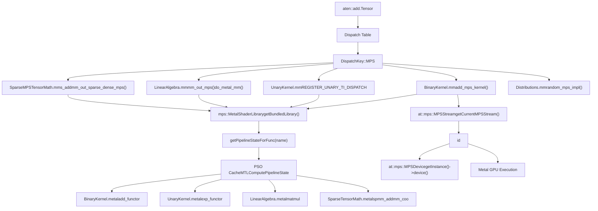
**Key code entities:**

-   **`mps::MetalShaderLibrary`**: Singleton managing compiled Metal kernels [aten/src/ATen/native/mps/operations/LinearAlgebra.mm51-55](https://github.com/pytorch/pytorch/blob/915982a4/aten/src/ATen/native/mps/operations/LinearAlgebra.mm#L51-L55)
-   **`mps::getCurrentMPSStream()`**: Returns current command queue for MPS operations [aten/src/ATen/native/mps/operations/LinearAlgebra.mm85](https://github.com/pytorch/pytorch/blob/915982a4/aten/src/ATen/native/mps/operations/LinearAlgebra.mm#L85-L85)
-   **`dispatch_sync_with_rethrow()`**: Synchronous Metal command dispatch with error handling [aten/src/ATen/native/mps/operations/LinearAlgebra.mm111-139](https://github.com/pytorch/pytorch/blob/915982a4/aten/src/ATen/native/mps/operations/LinearAlgebra.mm#L111-L139)
-   **`MTLComputePipelineState`**: Compiled Metal compute pipeline (PSO) for a specific kernel

**Sources:** [aten/src/ATen/native/mps/operations/LinearAlgebra.mm48-110](https://github.com/pytorch/pytorch/blob/915982a4/aten/src/ATen/native/mps/operations/LinearAlgebra.mm#L48-L110) [aten/src/ATen/native/mps/operations/UnaryKernel.mm1-30](https://github.com/pytorch/pytorch/blob/915982a4/aten/src/ATen/native/mps/operations/UnaryKernel.mm#L1-L30) [aten/src/ATen/native/mps/operations/BinaryKernel.mm1-60](https://github.com/pytorch/pytorch/blob/915982a4/aten/src/ATen/native/mps/operations/BinaryKernel.mm#L1-L60)

### Operation Registration in native\_functions.yaml

Operations register MPS implementations via the `dispatch:` key with `MPS:` prefix:

**Example registrations:**

```
# Direct MPS implementation- func: native_dropout(Tensor input, float p, bool? train) -> (Tensor, Tensor)  dispatch:    CPU: native_dropout_cpu    CUDA: native_dropout_cuda    MPS: native_dropout_mps
```
```
# Structured kernel with MPS variant- func: add.out(Tensor self, Tensor other, *, Scalar alpha=1, Tensor(a!) out) -> Tensor(a!)  structured: True  dispatch:    CPU, CUDA: add_out    MPS: add_out_mps
```
**Registration patterns:**

| Pattern | Example Op | MPS Function | Metal Kernel |
| --- | --- | --- | --- |
| Direct dispatch | `native_dropout` | `native_dropout_mps()` | `native_dropout_mask_and_scale` |
| Structured kernel | `add.out` | `add_out_mps()` | `add_functor<T>` |
| TensorIterator stub | `exp` | `exp_stub → exp_kernel_mps()` | `exp_functor<T>` |
| Custom Metal kernel | `mm` | `mm_out_mps() → do_metal_mm()` | `matmul<T>` |

**Sources:** [aten/src/ATen/native/native\_functions.yaml286-302](https://github.com/pytorch/pytorch/blob/915982a4/aten/src/ATen/native/native_functions.yaml#L286-L302) [aten/src/ATen/native/native\_functions.yaml554-594](https://github.com/pytorch/pytorch/blob/915982a4/aten/src/ATen/native/native_functions.yaml#L554-L594)

## Metal Shader Compilation and Caching

### Build-Time vs Runtime Compilation

The MPS backend supports two shader compilation modes controlled by the `PYTORCH_JIT_COMPILE_SHADERS` preprocessor flag:

**Build-time compilation (default):**

```
#ifndef PYTORCH_JIT_COMPILE_SHADERSstatic auto& lib = MetalShaderLibrary::getBundledLibrary();#else#include <ATen/native/mps/LinearAlgebra_metallib.h>#endif
```
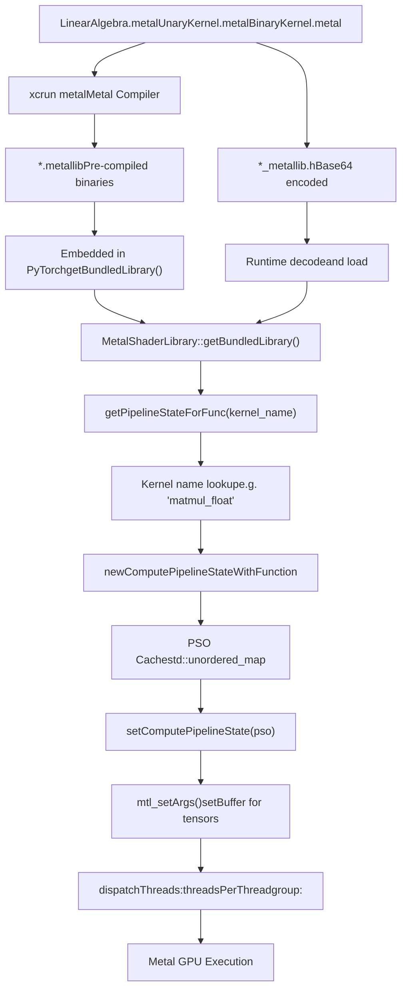
**Key implementation details:**

1.  **Kernel name construction**: Function names are built from operation and dtype

    ```
    // From LinearAlgebra.mm:86auto matmulPSO = lib.getPipelineStateForFunc(    "matmul_" + mps::scalarToMetalTypeString(output));
    ```

2.  **PSO caching**: `getPipelineStateForFunc()` maintains an internal cache to avoid recompilation

    -   Cache key: kernel function name (e.g., `"matmul_float"`, `"add_functor_half"`)
    -   Cache value: `id<MTLComputePipelineState>`
3.  **Thread dispatch patterns**:

    ```
    // Tiled 2D dispatch for matrix operationsMTLSize threadsPerThreadgroup = MTLSizeMake(16, 16, 1);MTLSize threadgroupsPerGrid = MTLSizeMake(gridSizeX, gridSizeY, 1);[encoder dispatchThreadgroups:threadgroupsPerGrid          threadsPerThreadgroup:threadsPerThreadgroup];
    ```


**Sources:** [aten/src/ATen/native/mps/operations/LinearAlgebra.mm51-56](https://github.com/pytorch/pytorch/blob/915982a4/aten/src/ATen/native/mps/operations/LinearAlgebra.mm#L51-L56) [aten/src/ATen/native/mps/operations/LinearAlgebra.mm86-108](https://github.com/pytorch/pytorch/blob/915982a4/aten/src/ATen/native/mps/operations/LinearAlgebra.mm#L86-L108) [aten/src/ATen/native/mps/operations/UnaryKernel.mm10-15](https://github.com/pytorch/pytorch/blob/915982a4/aten/src/ATen/native/mps/operations/UnaryKernel.mm#L10-L15)

### MetalShaderLibrary API

The `MetalShaderLibrary` class provides high-level execution interfaces:

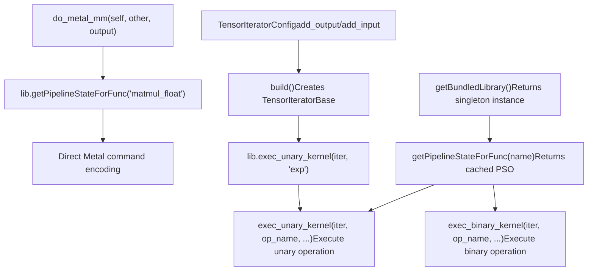
**Execution pattern comparison:**

| Pattern | Use Case | Example | Advantages |
| --- | --- | --- | --- |
| `exec_unary_kernel()` | Element-wise unary ops | `exp`, `sqrt`, `log` | Auto broadcasting, stride handling |
| `exec_binary_kernel()` | Element-wise binary ops | `add`, `mul`, `div` | Broadcasting, alpha parameter support |
| Custom Metal dispatch | Matrix/reduction ops | `mm`, `bmm`, `sum` | Fine-grained control, custom threading |

**Sources:** [aten/src/ATen/native/mps/operations/UnaryKernel.mm17-22](https://github.com/pytorch/pytorch/blob/915982a4/aten/src/ATen/native/mps/operations/UnaryKernel.mm#L17-L22) [aten/src/ATen/native/mps/operations/BinaryKernel.mm33-58](https://github.com/pytorch/pytorch/blob/915982a4/aten/src/ATen/native/mps/operations/BinaryKernel.mm#L33-L58) [aten/src/ATen/native/mps/operations/LinearAlgebra.mm79-109](https://github.com/pytorch/pytorch/blob/915982a4/aten/src/ATen/native/mps/operations/LinearAlgebra.mm#L79-L109)

## Key Operation Implementations

### Linear Algebra Operations

Matrix operations use tiled computation with threadgroup memory for coalesced access patterns.

#### Matrix Multiplication (`mm`) Implementation Flow

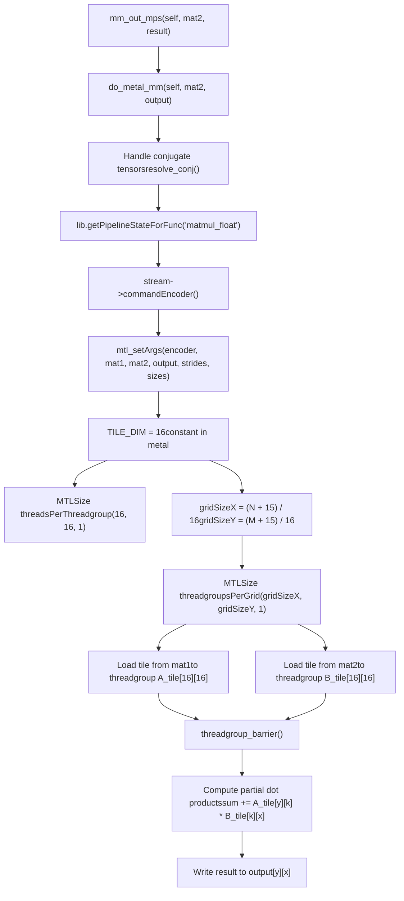
**Key implementation details:**

1.  **Tiled algorithm** [aten/src/ATen/native/mps/kernels/LinearAlgebra.metal10-50](https://github.com/pytorch/pytorch/blob/915982a4/aten/src/ATen/native/mps/kernels/LinearAlgebra.metal#L10-L50):

    -   Each threadgroup processes a 16×16 output tile
    -   Threadgroup memory (`A_tile`, `B_tile`) holds input tiles for fast access
    -   Outer loop iterates over K dimension in tile-sized chunks
2.  **Conjugate handling** [aten/src/ATen/native/mps/operations/LinearAlgebra.mm81-82](https://github.com/pytorch/pytorch/blob/915982a4/aten/src/ATen/native/mps/operations/LinearAlgebra.mm#L81-L82):

    ```
    auto self_ = self.is_conj() ? self.resolve_conj() : self;auto other_ = other.is_conj() ? other.resolve_conj() : other;
    ```

3.  **Threading configuration** [aten/src/ATen/native/mps/operations/LinearAlgebra.mm97-102](https://github.com/pytorch/pytorch/blob/915982a4/aten/src/ATen/native/mps/operations/LinearAlgebra.mm#L97-L102):

    ```
    constexpr uint32_t TILE_DIM = 16;uint32_t gridSizeX = (output.size(1) + TILE_DIM - 1) / TILE_DIM;uint32_t gridSizeY = (self_.size(0) + TILE_DIM - 1) / TILE_DIM;
    ```


**Sources:** [aten/src/ATen/native/mps/operations/LinearAlgebra.mm79-109](https://github.com/pytorch/pytorch/blob/915982a4/aten/src/ATen/native/mps/operations/LinearAlgebra.mm#L79-L109) [aten/src/ATen/native/mps/kernels/LinearAlgebra.metal10-50](https://github.com/pytorch/pytorch/blob/915982a4/aten/src/ATen/native/mps/kernels/LinearAlgebra.metal#L10-L50) [aten/src/ATen/native/mps/kernels/LinearAlgebra.metal100-118](https://github.com/pytorch/pytorch/blob/915982a4/aten/src/ATen/native/mps/kernels/LinearAlgebra.metal#L100-L118)

#### Sparse Matrix Operations (COO Format)

Sparse operations use coordinate (COO) format with auxiliary pointer structures for efficient traversal:

**Sparse matrix multiply-add (`addmm` with sparse LHS):**

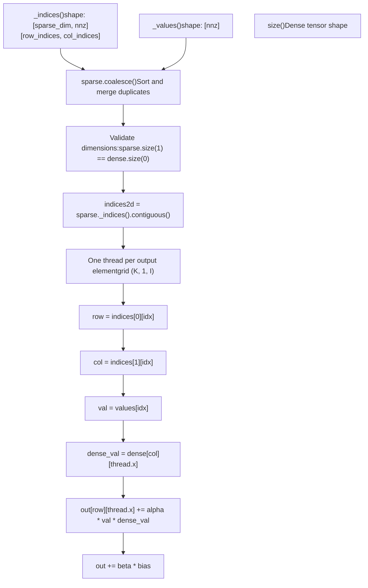
**Batched sparse BMM auxiliary structures:**

| Structure | Purpose | Build Function |
| --- | --- | --- |
| `batch_ptr` | Start/end indices for each batch in sorted COO | `build_batch_ptr_mps()` |
| `row_ptr` | Per-batch CSR-style row pointers | `build_row_ptr_per_batch_mps()` |

Example for 3 batches with nnz=7:

```
indices[0] (batch): [0, 0, 0, 1, 1, 2, 2]
batch_ptr:          [0, 3, 5, 7]  // batch 0: <FileRef file-url="https://github.com/pytorch/pytorch/blob/915982a4/0,3), batch 1#LNaN-LNaN" NaN  file-path="0,3), batch 1">Hii</FileRef> <FileRef file-url="https://github.com/pytorch/pytorch/blob/915982a4/aten/src/ATen/native/sparse/mps/SparseMPSTensorMath.mm#L149-L189" min=149 max=189 file-path="aten/src/ATen/native/sparse/mps/SparseMPSTensorMath.mm">Hii</FileRef> <FileRef file-url="https://github.com/pytorch/pytorch/blob/915982a4/aten/src/ATen/native/sparse/mps/SparseMPSTensorMath.mm#L245-L303" min=245 max=303 file-path="aten/src/ATen/native/sparse/mps/SparseMPSTensorMath.mm">Hii</FileRef>

### Unary Operations (Element-wise)

Unary operations use the `REGISTER_UNARY_TI_DISPATCH` macro pattern with TensorIterator for broadcasting and stride handling.

#### Registration and Dispatch Pattern

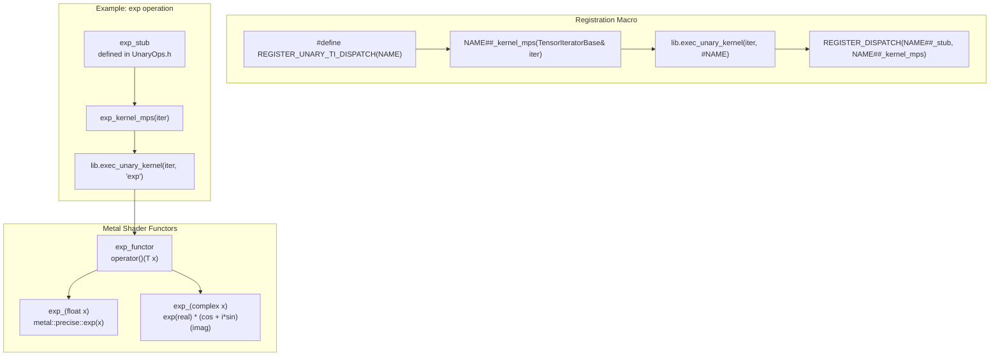
**Supported operation categories:**

| Category | Operations | Metal Functor |
| --- | --- | --- |
| Exponential | `exp`, `expm1`, `exp2` | `exp_functor`, `expm1_functor`, `exp2_functor` |
| Logarithmic | `log`, `log1p`, `log2`, `log10` | `log_functor`, `log1p_functor`, `log2_functor`, `log10_functor` |
| Trigonometric | `sin`, `cos`, `tan`, `asin`, `acos`, `atan` | `sin_functor`, `cos_functor`, etc. |
| Hyperbolic | `sinh`, `cosh`, `tanh`, `asinh`, `acosh`, `atanh` | `sinh_functor`, `cosh_functor`, etc. |
| Special | `erf`, `erfc`, `erfinv`, `erfcx` | `erf_functor`, `erfc_functor`, etc. |

**TensorIterator benefits:**

-   Automatic broadcasting of input/output shapes
-   Stride-aware iteration for non-contiguous tensors
-   Type promotion and casting
-   Efficient parallelization strategy

**Sources:** [aten/src/ATen/native/mps/operations/UnaryKernel.mm18-86](https://github.com/pytorch/pytorch/blob/915982a4/aten/src/ATen/native/mps/operations/UnaryKernel.mm#L18-L86) [aten/src/ATen/native/mps/kernels/UnaryKernel.metal23-70](https://github.com/pytorch/pytorch/blob/915982a4/aten/src/ATen/native/mps/kernels/UnaryKernel.metal#L23-L70)

### Binary Operations (Element-wise with Broadcasting)

Binary operations use `exec_binary_kernel()` which handles broadcasting via TensorIterator.

#### Alpha-Scaled Operations

Operations like `add` and `sub` support an optional alpha scalar multiplier:

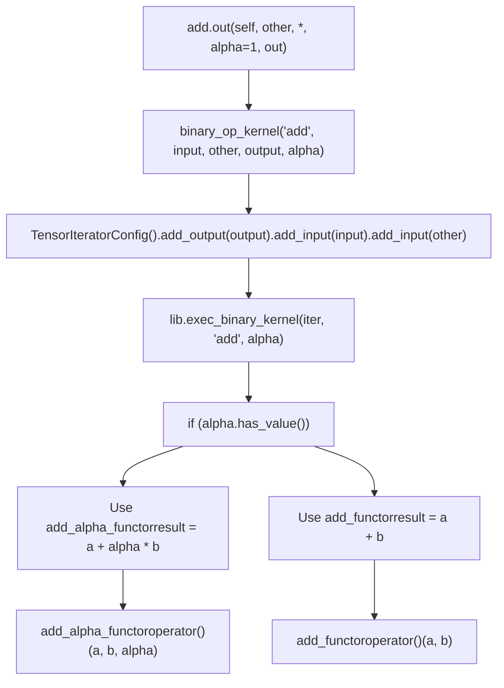
**Functor implementations** [aten/src/ATen/native/mps/kernels/BinaryKernel.metal7-50](https://github.com/pytorch/pytorch/blob/915982a4/aten/src/ATen/native/mps/kernels/BinaryKernel.metal#L7-L50):

```
// Basic addstruct add_functor {  template <typename T>  inline T operator()(const T a, const T b) {    return static_cast<T>(a + b);  }}; // Add with alpha scalingstruct add_alpha_functor {  template <typename T>  inline T operator()(const T a, const T b, const T alpha) {    return static_cast<T>(a + c10::metal::mul(alpha, b));  }};
```
**Comparison and special operations:**

| Operation | Metal Functor | Special Handling |
| --- | --- | --- |
| `maximum` | `maximum_functor` | Propagates NaN (unlike `fmax`) |
| `minimum` | `minimum_functor` | Propagates NaN (unlike `fmin`) |
| `fmax` | `fmax_functor` | Uses `metal::fmax` (NaN-safe) |
| `copysign` | `copysign_functor` | Copies sign bit only |
| `nextafter` | `nextafter_functor` | Next representable float |

**Sources:** [aten/src/ATen/native/mps/kernels/BinaryKernel.metal7-200](https://github.com/pytorch/pytorch/blob/915982a4/aten/src/ATen/native/mps/kernels/BinaryKernel.metal#L7-L200) [aten/src/ATen/native/mps/operations/BinaryKernel.mm34-90](https://github.com/pytorch/pytorch/blob/915982a4/aten/src/ATen/native/mps/operations/BinaryKernel.mm#L34-L90)

### Random Number Generation

The MPS backend uses Philox PRNG with per-thread state for reproducible random number generation.

#### Random Operation Implementation Pattern

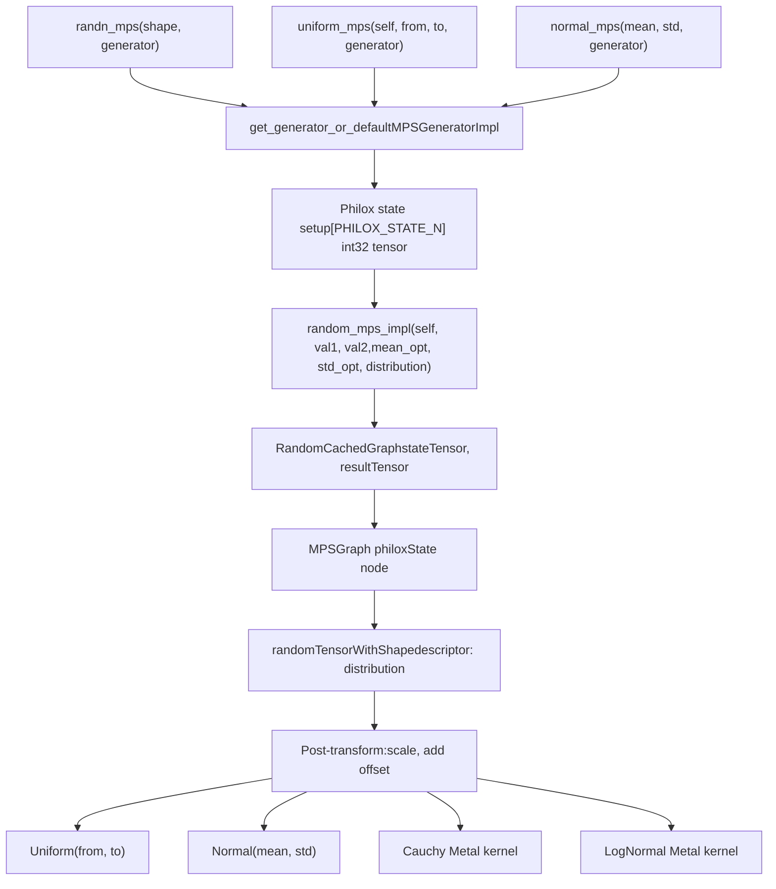
**Philox state management** [aten/src/ATen/native/mps/operations/Distributions.mm71-79](https://github.com/pytorch/pytorch/blob/915982a4/aten/src/ATen/native/mps/operations/Distributions.mm#L71-L79):

-   State size: `PHILOX_STATE_N` int32 values (contains seed and counter)
-   Per-thread offset: `seed_base_offset.y + thread_id` ensures thread-unique streams
-   Generator captures: `MPSGeneratorImpl` maintains current state

**Distribution implementations:**

| Distribution | Implementation | Metal Kernel |
| --- | --- | --- |
| Uniform | MPSGraph built-in | N/A |
| Normal | MPSGraph built-in | N/A |
| Cauchy | Custom kernel | `cauchy<T>` - inverse CDF transform |
| Log-Normal | Custom kernel | `log_normal<T>` - Box-Muller transform |
| Bernoulli | Custom kernel | `bernoulli<T>` - threshold uniform |

**Sources:** [aten/src/ATen/native/mps/operations/Distributions.mm33-150](https://github.com/pytorch/pytorch/blob/915982a4/aten/src/ATen/native/mps/operations/Distributions.mm#L33-L150) [aten/src/ATen/native/mps/kernels/Distributions.metal1-80](https://github.com/pytorch/pytorch/blob/915982a4/aten/src/ATen/native/mps/kernels/Distributions.metal#L1-L80)

## Memory Management and Leak Detection

The MPS backend uses a caching allocator pattern similar to CUDA to minimize MTLBuffer allocation overhead.

### Memory Query APIs

| Function | Returns | Source |
| --- | --- | --- |
| `torch.mps.current_allocated_memory()` | Bytes allocated by caching allocator (includes cached free blocks) | Caching layer |
| `torch.mps.driver_allocated_memory()` | Bytes allocated by Metal driver (actual GPU memory) | Metal driver |
| `torch.mps.empty_cache()` | N/A - Releases cached memory back to driver | Caching layer |

### Test Infrastructure Memory Leak Detection

The `TestCaseMPS` base class provides automatic leak detection when `TEST_MPS_MEM_LEAK_CHECK=1`:

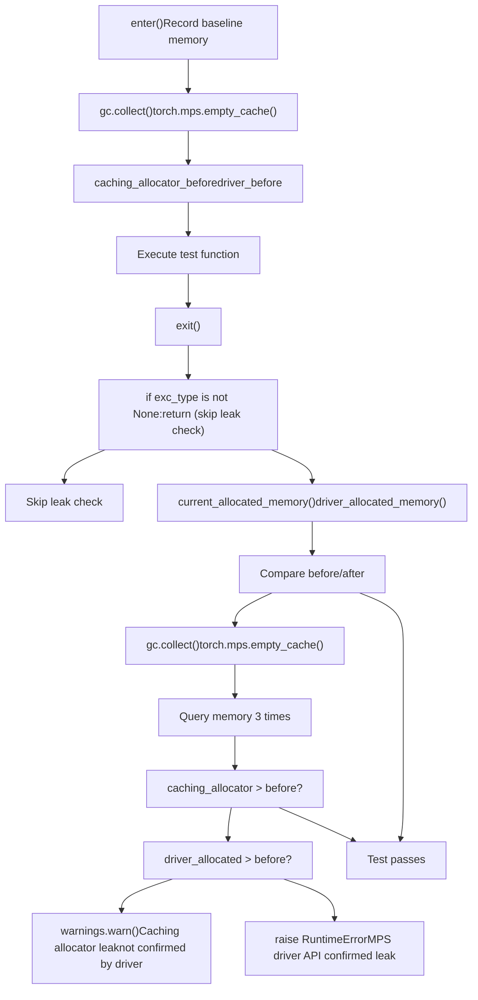
**Test class decorator pattern** [test/test\_mps.py351-374](https://github.com/pytorch/pytorch/blob/915982a4/test/test_mps.py#L351-L374):

```
class TestCaseMPS(TestCase):    _do_mps_memory_leak_check = True        def __init__(self, method_name='runTest'):        # Wrap test method with leak detection if enabled        if TEST_MPS_MEM_LEAK_CHECK:            self.wrap_with_mps_policy(method_name, self.assertLeaksNoMpsTensors)
```
**Intentional leak test** [test/test\_mps.py383-394](https://github.com/pytorch/pytorch/blob/915982a4/test/test_mps.py#L383-L394):

```
@self.wrap_with_mps_memory_checkdef leak_gpu0():    # Force new block allocation (8MB)    l.append(torch.randn(1024 * 1024 * 8, device=torch.device("mps"))) with self.assertRaisesRegex(RuntimeError, r"MPS driver API confirmed .+"):    leak_gpu0()
```
**Sources:** [test/test\_mps.py97-168](https://github.com/pytorch/pytorch/blob/915982a4/test/test_mps.py#L97-L168) [test/test\_mps.py375-410](https://github.com/pytorch/pytorch/blob/915982a4/test/test_mps.py#L375-L410)

## Device Capabilities and Testing

### Data Type Support

**Supported types:**

-   Floating-point: `float32`, `float16`, `bfloat16`
-   Integer: `int8`, `int16`, `int32`, `int64`, `uint8`, `bool`
-   Complex: `complex64` (complex32 for individual components)

**Unsupported types:**

-   `float64` (double) - Metal does not support double precision
-   `complex128` - Metal does not support double-precision complex

```
# From test_mps.pyMPS_UNSUPPORTED_TYPES = [torch.double, torch.cdouble]MPS_DTYPES = [t for t in get_all_dtypes() if t not in MPS_UNSUPPORTED_TYPES]
```
**Sources:** [test/test\_mps.py84-85](https://github.com/pytorch/pytorch/blob/915982a4/test/test_mps.py#L84-L85)

### Operation Support Matrix

Testing infrastructure in `common_mps.py` categorizes operations into support levels:

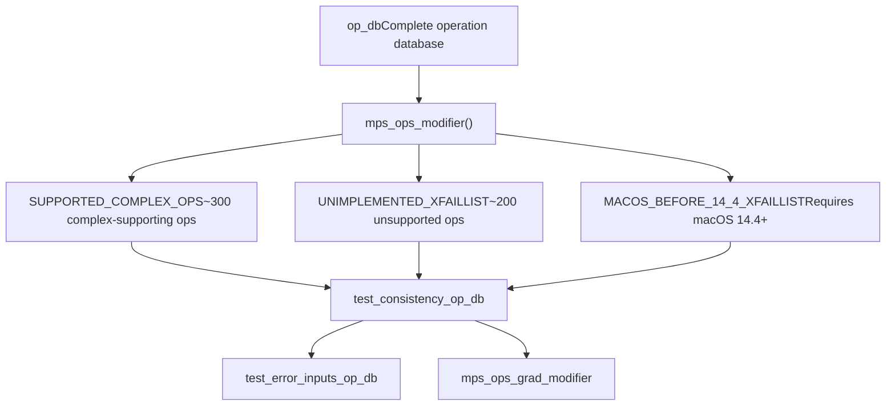
**Examples of unimplemented operations** [torch/testing/\_internal/common\_mps.py308-661](https://github.com/pytorch/pytorch/blob/915982a4/torch/testing/_internal/common_mps.py#L308-L661):

| Category | Operations | Reason |
| --- | --- | --- |
| Eigenvalue | `linalg.eig`, `linalg.eigvals` | No Metal implementation |
| Matrix factorization | `linalg.qr`, `geqrf`, `qr` | Missing backend support |
| Statistical | `mode`, `median`, `kthvalue` | Complex implementation |
| Convolution dtypes | `nn.functional.conv2d[int64]` | Integral types unsupported for conv |

**Complex operation support** [torch/testing/\_internal/common\_mps.py23-300](https://github.com/pytorch/pytorch/blob/915982a4/torch/testing/_internal/common_mps.py#L23-L300):

```
SUPPORTED_COMPLEX_OPS = {    "abs", "add", "conj_physical", "cos", "exp", "log",    "matmul", "mm", "mul", "neg", "sin", "sqrt", "sub", ...}
```
**Sources:** [torch/testing/\_internal/common\_mps.py13-661](https://github.com/pytorch/pytorch/blob/915982a4/torch/testing/_internal/common_mps.py#L13-L661)

## Command Queue and Synchronization

### MPSStream Architecture

MPS operations execute on a serial command queue with explicit synchronization points:

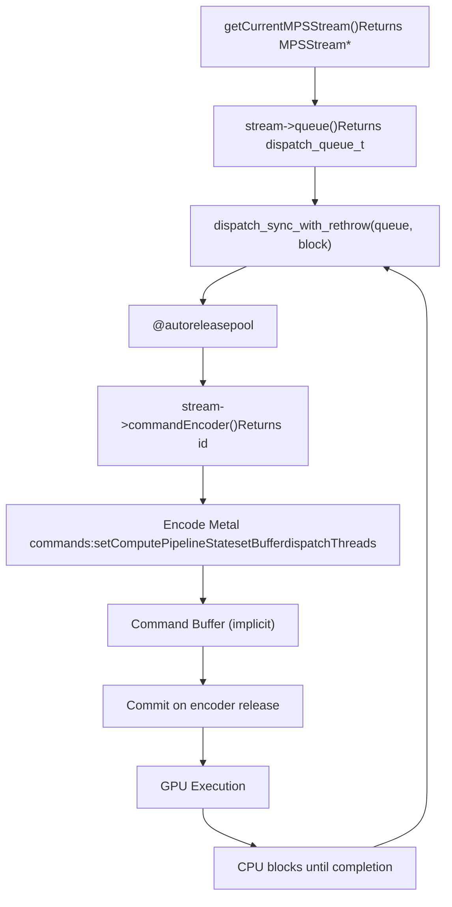
**Dispatch pattern** [aten/src/ATen/native/mps/operations/LinearAlgebra.mm111-139](https://github.com/pytorch/pytorch/blob/915982a4/aten/src/ATen/native/mps/operations/LinearAlgebra.mm#L111-L139):

```
auto stream = getCurrentMPSStream();dispatch_sync_with_rethrow(stream->queue(), ^() {  @autoreleasepool {    auto computeEncoder = stream->commandEncoder();    [computeEncoder setComputePipelineState:pso];    // Encode work...    [computeEncoder dispatchThreads:grid threadsPerThreadgroup:tgs];  }});// GPU work is complete when dispatch_sync returns
```
**Synchronization semantics:**

-   **`dispatch_sync_with_rethrow()`**: Synchronous dispatch with Objective-C++ exception handling
-   **`@autoreleasepool`**: Manages Metal API object lifetimes within the block
-   **Command encoder**: Implicitly creates command buffer on first use, commits on release
-   **CPU blocking**: Host thread blocks until GPU completes all encoded work

**Sources:** [aten/src/ATen/native/mps/operations/LinearAlgebra.mm85-108](https://github.com/pytorch/pytorch/blob/915982a4/aten/src/ATen/native/mps/operations/LinearAlgebra.mm#L85-L108) [aten/src/ATen/native/sparse/mps/SparseMPSTensorMath.mm169-189](https://github.com/pytorch/pytorch/blob/915982a4/aten/src/ATen/native/sparse/mps/SparseMPSTensorMath.mm#L169-L189)

## Autocast and Mixed Precision Training

### Autocast Context

The MPS backend supports automatic mixed precision via `torch.autocast(device_type="mps")`:

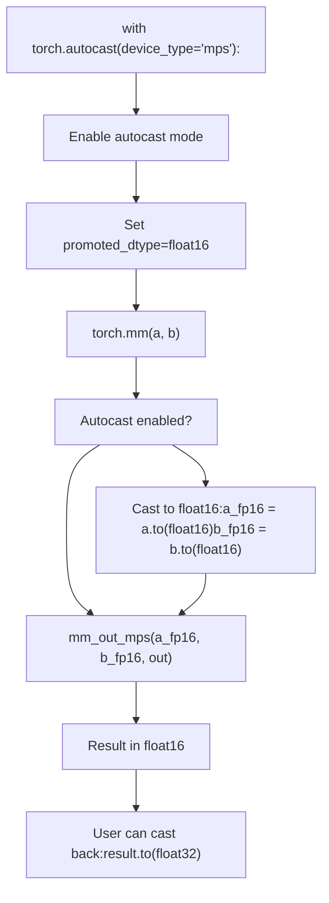
**Autocast behavior table:**

| Operation Category | Default Autocast Dtype | Reason |
| --- | --- | --- |
| Matrix multiply (`mm`, `bmm`, `addmm`) | `float16` | Compute-bound, benefits from lower precision |
| Convolution (`conv2d`, `conv3d`) | `float16` | Compute-bound, large memory savings |
| Pointwise (`add`, `mul`, `exp`) | Input dtype (no cast) | Memory-bound, casting adds overhead |
| Reductions (`sum`, `mean`) | `float32` | Accumulation precision important |
| LayerNorm, BatchNorm | `float32` | Stability-critical operations |

**Sources:** [test/test\_mps.py169-205](https://github.com/pytorch/pytorch/blob/915982a4/test/test_mps.py#L169-L205)

### Gradient Scaling

The `torch.amp.GradScaler` supports MPS for mixed precision training:

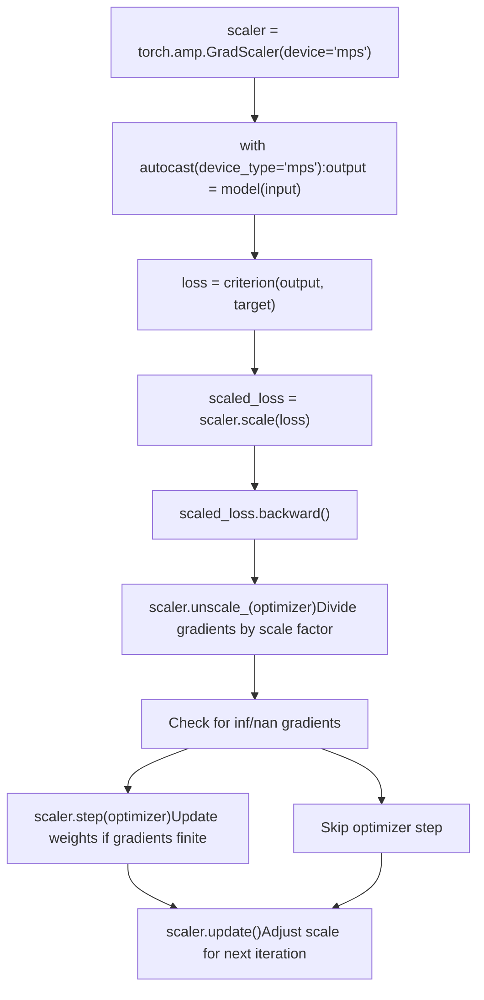
**Key implementation details** [test/test\_mps.py232-290](https://github.com/pytorch/pytorch/blob/915982a4/test/test_mps.py#L232-L290):

1.  **Loss scaling**: Multiplies loss by scale factor (e.g., 65536.0) before backward pass
2.  **Gradient unscaling**: Divides accumulated gradients by scale factor before optimizer step
3.  **Dynamic scaling**: Adjusts scale factor based on gradient overflow detection
4.  **MPS-specific**: Uses same scaling logic as CPU/CUDA but with MPS tensors

Example test comparing CPU and MPS [test/test\_mps.py252-290](https://github.com/pytorch/pytorch/blob/915982a4/test/test_mps.py#L252-L290):

```
scaler_cpu = torch.amp.GradScaler(device="cpu")scaler_mps = torch.amp.GradScaler(device="mps") for iteration in range(5):    # CPU path    with torch.amp.autocast(device_type="cpu", dtype=dtype):        output_cpu = model_cpu(input_cpu)        loss_cpu = loss_fn(output_cpu, target_cpu)    scaler_cpu.scale(loss_cpu).backward()    scaler_cpu.step(optimizer_cpu)    scaler_cpu.update()        # MPS path (should match)    with torch.autocast(device_type="mps", dtype=dtype):        output_mps = model_mps(input_mps)        loss_mps = loss_fn(output_mps, target_mps)    scaler_mps.scale(loss_mps).backward()    scaler_mps.step(optimizer_mps)    scaler_mps.update()
```
**Sources:** [test/test\_mps.py169-291](https://github.com/pytorch/pytorch/blob/915982a4/test/test_mps.py#L169-L291)

## Testing Infrastructure

### Test Organization

Test classes in [test/test\_mps.py](https://github.com/pytorch/pytorch/blob/915982a4/test/test_mps.py):

-   `TestAutocastMPS` - Autocast and gradient scaling tests [test/test\_mps.py169-349](https://github.com/pytorch/pytorch/blob/915982a4/test/test_mps.py#L169-L349)
-   `TestCaseMPS` - Base class with memory leak detection [test/test\_mps.py351-374](https://github.com/pytorch/pytorch/blob/915982a4/test/test_mps.py#L351-L374)
-   `TestMemoryLeak` - Explicit memory leak tests [test/test\_mps.py375-411](https://github.com/pytorch/pytorch/blob/915982a4/test/test_mps.py#L375-L411)
-   Various operation-specific test classes

### OpInfo Testing

Operations are tested using the OpInfo framework with MPS-specific modifiers:

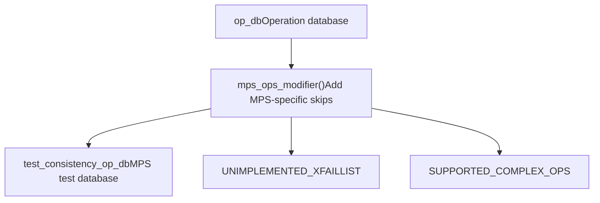
**Sources:** [test/test\_mps.py52-63](https://github.com/pytorch/pytorch/blob/915982a4/test/test_mps.py#L52-L63) [torch/testing/\_internal/common\_mps.py13-20](https://github.com/pytorch/pytorch/blob/915982a4/torch/testing/_internal/common_mps.py#L13-L20)
