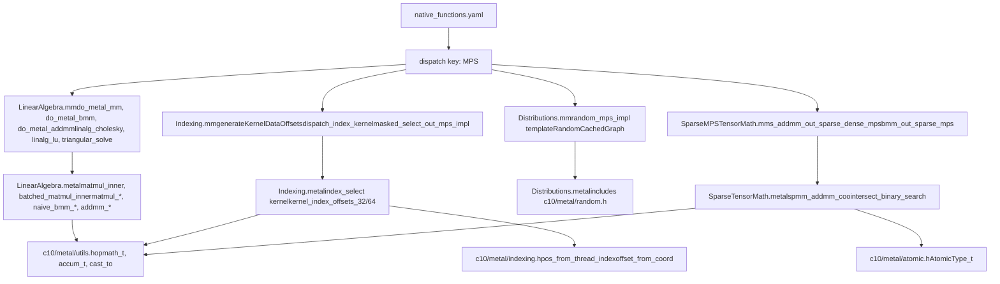
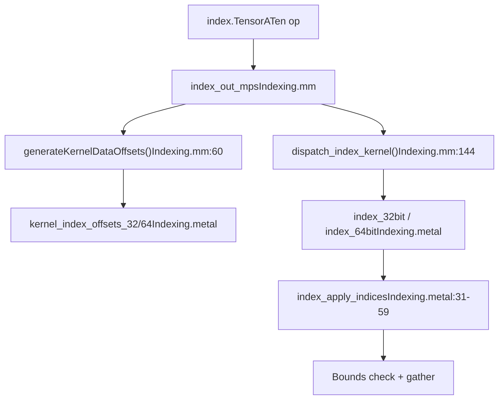
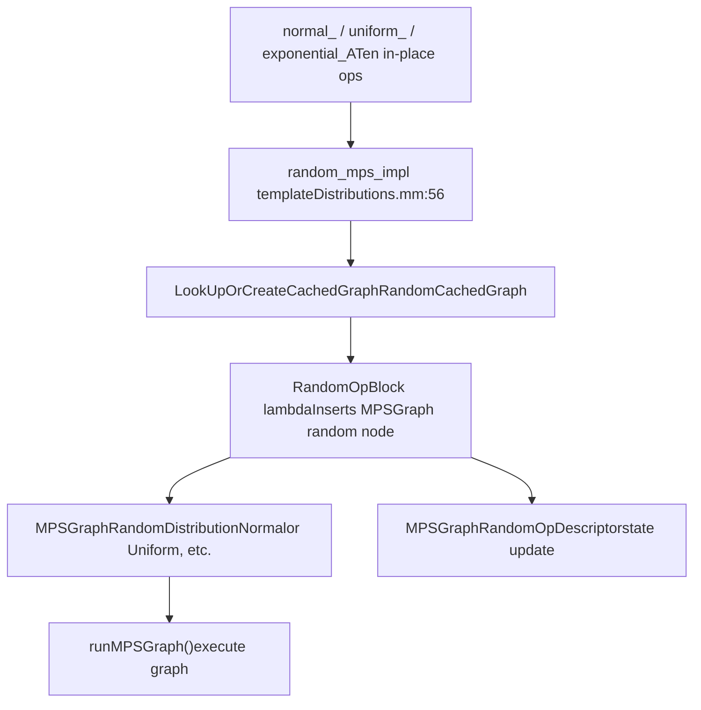
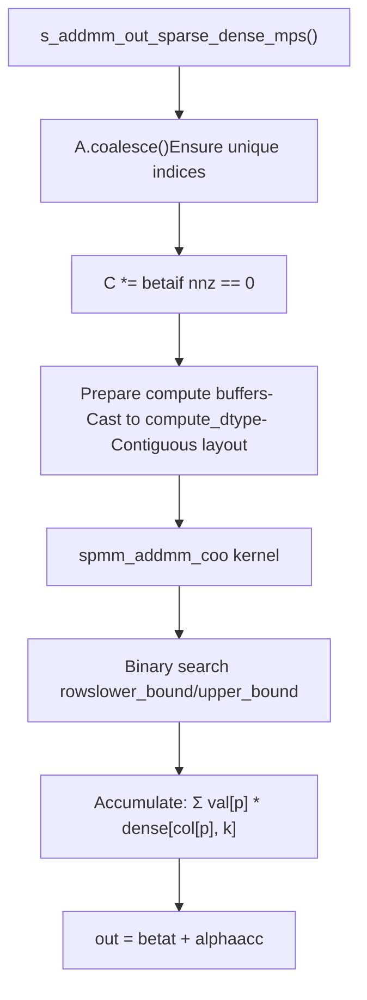
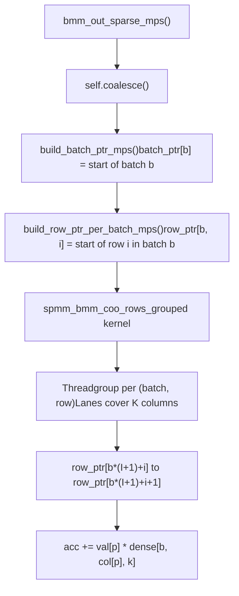
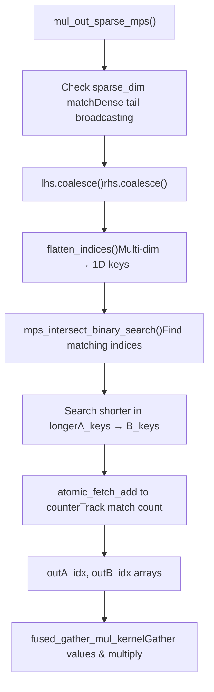
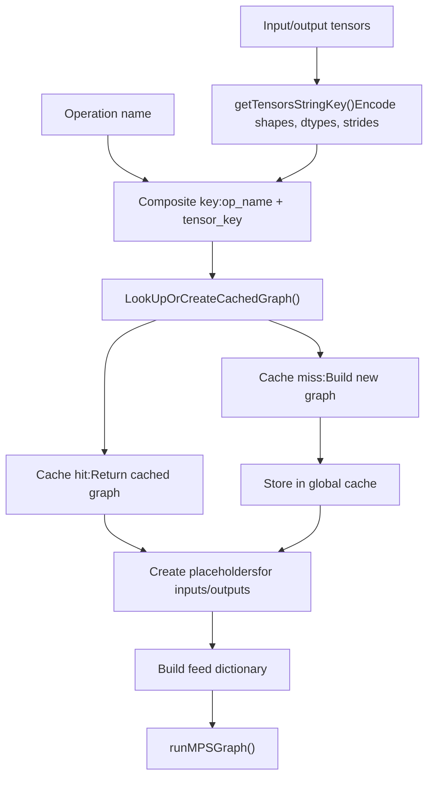

# MPS Operations and Metal Kernels

Relevant source files

-   [aten/src/ATen/native/cudnn/ConvShared.cpp](https://github.com/pytorch/pytorch/blob/915982a4/aten/src/ATen/native/cudnn/ConvShared.cpp)
-   [aten/src/ATen/native/mkldnn/Conv.cpp](https://github.com/pytorch/pytorch/blob/915982a4/aten/src/ATen/native/mkldnn/Conv.cpp)
-   [aten/src/ATen/native/mkldnn/Linear.cpp](https://github.com/pytorch/pytorch/blob/915982a4/aten/src/ATen/native/mkldnn/Linear.cpp)
-   [aten/src/ATen/native/mkldnn/Matmul.cpp](https://github.com/pytorch/pytorch/blob/915982a4/aten/src/ATen/native/mkldnn/Matmul.cpp)
-   [aten/src/ATen/native/mps/kernels/CrossKernel.metal](https://github.com/pytorch/pytorch/blob/915982a4/aten/src/ATen/native/mps/kernels/CrossKernel.metal)
-   [aten/src/ATen/native/mps/kernels/Distributions.metal](https://github.com/pytorch/pytorch/blob/915982a4/aten/src/ATen/native/mps/kernels/Distributions.metal)
-   [aten/src/ATen/native/mps/kernels/Indexing.h](https://github.com/pytorch/pytorch/blob/915982a4/aten/src/ATen/native/mps/kernels/Indexing.h)
-   [aten/src/ATen/native/mps/kernels/Indexing.metal](https://github.com/pytorch/pytorch/blob/915982a4/aten/src/ATen/native/mps/kernels/Indexing.metal)
-   [aten/src/ATen/native/mps/kernels/LinearAlgebra.h](https://github.com/pytorch/pytorch/blob/915982a4/aten/src/ATen/native/mps/kernels/LinearAlgebra.h)
-   [aten/src/ATen/native/mps/kernels/LinearAlgebra.metal](https://github.com/pytorch/pytorch/blob/915982a4/aten/src/ATen/native/mps/kernels/LinearAlgebra.metal)
-   [aten/src/ATen/native/mps/operations/CrossKernel.mm](https://github.com/pytorch/pytorch/blob/915982a4/aten/src/ATen/native/mps/operations/CrossKernel.mm)
-   [aten/src/ATen/native/mps/operations/Distributions.mm](https://github.com/pytorch/pytorch/blob/915982a4/aten/src/ATen/native/mps/operations/Distributions.mm)
-   [aten/src/ATen/native/mps/operations/Indexing.mm](https://github.com/pytorch/pytorch/blob/915982a4/aten/src/ATen/native/mps/operations/Indexing.mm)
-   [aten/src/ATen/native/mps/operations/LinearAlgebra.mm](https://github.com/pytorch/pytorch/blob/915982a4/aten/src/ATen/native/mps/operations/LinearAlgebra.mm)
-   [aten/src/ATen/native/mps/operations/Pad.mm](https://github.com/pytorch/pytorch/blob/915982a4/aten/src/ATen/native/mps/operations/Pad.mm)
-   [aten/src/ATen/native/mps/operations/ScanKernel.mm](https://github.com/pytorch/pytorch/blob/915982a4/aten/src/ATen/native/mps/operations/ScanKernel.mm)
-   [aten/src/ATen/native/mps/operations/UpSample.mm](https://github.com/pytorch/pytorch/blob/915982a4/aten/src/ATen/native/mps/operations/UpSample.mm)
-   [aten/src/ATen/native/native\_functions.yaml](https://github.com/pytorch/pytorch/blob/915982a4/aten/src/ATen/native/native_functions.yaml)
-   [aten/src/ATen/native/sparse/SoftMax.cpp](https://github.com/pytorch/pytorch/blob/915982a4/aten/src/ATen/native/sparse/SoftMax.cpp)
-   [aten/src/ATen/native/sparse/mps/SparseMPSTensorMath.mm](https://github.com/pytorch/pytorch/blob/915982a4/aten/src/ATen/native/sparse/mps/SparseMPSTensorMath.mm)
-   [aten/src/ATen/native/sparse/mps/kernels/SparseTensorMath.metal](https://github.com/pytorch/pytorch/blob/915982a4/aten/src/ATen/native/sparse/mps/kernels/SparseTensorMath.metal)
-   [c10/metal/atomic.h](https://github.com/pytorch/pytorch/blob/915982a4/c10/metal/atomic.h)
-   [test/distributed/tensor/test\_strategy\_validation.py](https://github.com/pytorch/pytorch/blob/915982a4/test/distributed/tensor/test_strategy_validation.py)
-   [test/nn/test\_dropout.py](https://github.com/pytorch/pytorch/blob/915982a4/test/nn/test_dropout.py)
-   [test/test\_indexing.py](https://github.com/pytorch/pytorch/blob/915982a4/test/test_indexing.py)
-   [test/test\_jiterator.py](https://github.com/pytorch/pytorch/blob/915982a4/test/test_jiterator.py)
-   [test/test\_mps.py](https://github.com/pytorch/pytorch/blob/915982a4/test/test_mps.py)
-   [test/test\_sparse.py](https://github.com/pytorch/pytorch/blob/915982a4/test/test_sparse.py)
-   [torch/csrc/autograd/python\_variable\_indexing.cpp](https://github.com/pytorch/pytorch/blob/915982a4/torch/csrc/autograd/python_variable_indexing.cpp)
-   [torch/distributed/tensor/\_ops/strategy\_validation.py](https://github.com/pytorch/pytorch/blob/915982a4/torch/distributed/tensor/_ops/strategy_validation.py)
-   [torch/testing/\_comparison.py](https://github.com/pytorch/pytorch/blob/915982a4/torch/testing/_comparison.py)
-   [torch/testing/\_internal/common\_methods\_invocations.py](https://github.com/pytorch/pytorch/blob/915982a4/torch/testing/_internal/common_methods_invocations.py)
-   [torch/testing/\_internal/common\_mps.py](https://github.com/pytorch/pytorch/blob/915982a4/torch/testing/_internal/common_mps.py)
-   [torch/testing/\_internal/opinfo/core.py](https://github.com/pytorch/pytorch/blob/915982a4/torch/testing/_internal/opinfo/core.py)
-   [torch/testing/\_internal/opinfo/definitions/\_masked.py](https://github.com/pytorch/pytorch/blob/915982a4/torch/testing/_internal/opinfo/definitions/_masked.py)
-   [torch/testing/\_internal/opinfo/definitions/linalg.py](https://github.com/pytorch/pytorch/blob/915982a4/torch/testing/_internal/opinfo/definitions/linalg.py)
-   [torch/testing/\_internal/opinfo/definitions/special.py](https://github.com/pytorch/pytorch/blob/915982a4/torch/testing/_internal/opinfo/definitions/special.py)

## Purpose and Scope

This document describes specific MPS (Metal Performance Shaders) backend operator implementations for Apple Silicon GPUs. It covers the LinearAlgebra, Indexing, Distributions, and Pad operation groups, the structure of their Metal Shading Language (MSL) kernels, and sparse tensor implementations.

For general MPS backend architecture and device management, see page 3.3. For operator registration in the native function system, see page 3.1.1.

## Architecture Overview

The MPS operations layer consists of three main components:

1.  **C++/Objective-C++ dispatch layer** — Handles graph construction, type promotion, memory management, and direct Metal kernel dispatch
2.  **Metal Shading Language (MSL) kernels** — GPU compute code compiled into Metal libraries and loaded at runtime
3.  **Operator registration** — Connects ATen operators to MPS implementations via the `MPS` dispatch key in `native_functions.yaml`

Two execution strategies are used depending on the operation:

-   **MPSGraph path**: Builds an `MPSGraph` computation graph (used for Distributions and some linear algebra ops). Graphs are cached in `MPSCachedGraph` subclasses keyed on tensor metadata.
-   **Direct Metal path**: Obtains a pipeline state object (`MTLComputePipelineState`) from `MetalShaderLibrary::getBundledLibrary()` and dispatches threads directly (used for matrix multiply, indexing, and sparse ops).

**File-to-Operation Map**


Sources: [aten/src/ATen/native/mps/operations/LinearAlgebra.mm1-56](https://github.com/pytorch/pytorch/blob/915982a4/aten/src/ATen/native/mps/operations/LinearAlgebra.mm#L1-L56) [aten/src/ATen/native/mps/operations/Indexing.mm1-58](https://github.com/pytorch/pytorch/blob/915982a4/aten/src/ATen/native/mps/operations/Indexing.mm#L1-L58) [aten/src/ATen/native/mps/operations/Distributions.mm1-51](https://github.com/pytorch/pytorch/blob/915982a4/aten/src/ATen/native/mps/operations/Distributions.mm#L1-L51) [aten/src/ATen/native/sparse/mps/SparseMPSTensorMath.mm1-53](https://github.com/pytorch/pytorch/blob/915982a4/aten/src/ATen/native/sparse/mps/SparseMPSTensorMath.mm#L1-L53)

## LinearAlgebra Operations

### Matrix Multiply (mm, bmm, addmm)

Matrix multiply operations in [aten/src/ATen/native/mps/operations/LinearAlgebra.mm](https://github.com/pytorch/pytorch/blob/915982a4/aten/src/ATen/native/mps/operations/LinearAlgebra.mm) bypass MPSGraph and dispatch directly to custom Metal kernels via `MetalShaderLibrary::getBundledLibrary()`. This avoids graph compilation overhead for these performance-critical operations.

The three primary dispatch functions are:

| Function | Metal Kernel Pattern | Registered ATen Op |
| --- | --- | --- |
| `do_metal_mm` | `matmul_<dtype>` | `mm_mps` |
| `do_metal_bmm` | `naive_bmm_<dtype>` | `bmm_mps` |
| `do_metal_addmm` | `addmm_<dtype>` (or `matmul_` when `beta=0, alpha=1`) | `addmm_out_mps` |

The `do_metal_addmm` function short-circuits to `do_metal_mm` when `beta == 0` and `alpha == 1`, avoiding the bias addition pass.

**AlphaBeta union** — Scalar alpha and beta values are packed into a `union AlphaBeta` ([aten/src/ATen/native/mps/operations/LinearAlgebra.mm58-77](https://github.com/pytorch/pytorch/blob/915982a4/aten/src/ATen/native/mps/operations/LinearAlgebra.mm#L58-L77)) that stores the values in the appropriate scalar type (`i64`, `i32`, `f32`, or `c64`) for the Metal kernel.

**Thread grid sizing** — All three kernels use a `TILE_DIM = 16` threadgroup tile:

[aten/src/ATen/native/mps/operations/LinearAlgebra.mm97-104](https://github.com/pytorch/pytorch/blob/915982a4/aten/src/ATen/native/mps/operations/LinearAlgebra.mm#L97-L104)

```
gridSizeX = (output.size(1) + TILE_DIM - 1) / TILE_DIM
gridSizeY = (self.size(0) + TILE_DIM - 1) / TILE_DIM
threadsPerThreadgroup = MTLSizeMake(16, 16, 1)
```
For `do_metal_bmm`, `gridSizeZ = output.size(0)` dispatches one Z-slice per batch element.

**Dispatch flow for mm:**

Sources: [aten/src/ATen/native/mps/operations/LinearAlgebra.mm79-151](https://github.com/pytorch/pytorch/blob/915982a4/aten/src/ATen/native/mps/operations/LinearAlgebra.mm#L79-L151)

### Tiled Matrix Multiply Kernel

The Metal kernel uses a tiled algorithm with threadgroup shared memory to improve memory access locality:

[aten/src/ATen/native/mps/kernels/LinearAlgebra.metal11-50](https://github.com/pytorch/pytorch/blob/915982a4/aten/src/ATen/native/mps/kernels/LinearAlgebra.metal#L11-L50)

-   Each 16×16 threadgroup loads a tile of `A` and a tile of `B` into `threadgroup T A_tile[16][16]` and `B_tile[16][16]`
-   A `threadgroup_barrier(mem_flags::mem_threadgroup)` synchronizes tile loads before the inner product accumulation
-   Accumulation uses `c10::metal::opmath_t<T>` (e.g., `float` for `half` inputs) to maintain precision
-   Template instantiations cover `float`, `half`, `bfloat16`, `int32_t`, `int64_t`, and `complex<float>`

Sources: [aten/src/ATen/native/mps/kernels/LinearAlgebra.metal1-50](https://github.com/pytorch/pytorch/blob/915982a4/aten/src/ATen/native/mps/kernels/LinearAlgebra.metal#L1-L50) [aten/src/ATen/native/mps/kernels/LinearAlgebra.h1-10](https://github.com/pytorch/pytorch/blob/915982a4/aten/src/ATen/native/mps/kernels/LinearAlgebra.h#L1-L10)

### Higher-Level Linear Algebra

Beyond matrix multiply, `LinearAlgebra.mm` implements several factorization and solve operations that use MPSGraph APIs:

| Operation | Function | Notes |
| --- | --- | --- |
| Cholesky decomposition | `linalg_cholesky_ex_mps` | Uses `MPSGraphMatrixDecompositionCholesky` |
| LU factorization | `linalg_lu_factor_ex_mps` | Uses `MPSGraphMatrixDecompositionLU` |
| Triangular solve | `linalg_solve_triangular_mps` | Uses `MPSGraphTriangularSolve` |
| LU unpack | `lu_unpack_mps` | Decomposes LU result into L, U, P |
| QR / Householder | `orgqr_mps` | Householder product via MPSGraph |

Sources: [aten/src/ATen/native/mps/operations/LinearAlgebra.mm200-650](https://github.com/pytorch/pytorch/blob/915982a4/aten/src/ATen/native/mps/operations/LinearAlgebra.mm#L200-L650)

## Indexing Operations

### Kernel Data Offsets

The `generateKernelDataOffsets` function ([aten/src/ATen/native/mps/operations/Indexing.mm60-98](https://github.com/pytorch/pytorch/blob/915982a4/aten/src/ATen/native/mps/operations/Indexing.mm#L60-L98)) pre-computes per-thread byte offsets for a `TensorIteratorBase`. It dispatches either `kernel_index_offsets_32` or `kernel_index_offsets_64` Metal kernels depending on whether 32-bit indexing is sufficient (`iter.can_use_32bit_indexing()`). The result is a `MTLBuffer` of `simd_uint3` (or `simd_ulong3`) triples encoding `(output_offset, input_offset, indices_offset)` for each thread.

### Index Kernel Dispatch

`dispatch_index_kernel` ([aten/src/ATen/native/mps/operations/Indexing.mm144-165](https://github.com/pytorch/pytorch/blob/915982a4/aten/src/ATen/native/mps/operations/Indexing.mm#L144-L165)) validates that no more than 16 index tensors are used (a hard limit in MPS indexing kernels), then selects a named Metal kernel. When the iterator cannot use 32-bit indexing, it recursively splits via `iter.with_32bit_indexing()`.

**Index kernel naming convention:**

```
<op>_<bit_size>bit
```
Examples: `index_32bit`, `index_put_64bit`

**Metal kernel for `index_select`** ([aten/src/ATen/native/mps/kernels/Indexing.metal62-110](https://github.com/pytorch/pytorch/blob/915982a4/aten/src/ATen/native/mps/kernels/Indexing.metal#L62-L110)): Each GPU thread reads its output/input/indices offsets from the pre-computed offset buffer, applies `index_apply_indices` which iterates over all index arrays with bounds checking, and writes the gathered value.


Sources: [aten/src/ATen/native/mps/operations/Indexing.mm60-165](https://github.com/pytorch/pytorch/blob/915982a4/aten/src/ATen/native/mps/operations/Indexing.mm#L60-L165) [aten/src/ATen/native/mps/kernels/Indexing.metal1-110](https://github.com/pytorch/pytorch/blob/915982a4/aten/src/ATen/native/mps/kernels/Indexing.metal#L1-L110)

### IndexAB Struct and Bounds Checking

The `IndexAB` struct ([aten/src/ATen/native/mps/kernels/Indexing.metal10-12](https://github.com/pytorch/pytorch/blob/915982a4/aten/src/ATen/native/mps/kernels/Indexing.metal#L10-L12)) holds a `constant int64_t* indexArray` pointer for one index tensor. An array of `IndexAB` is passed to the kernel, one per index dimension. The `index_apply_indices` function iterates over all indices, checks `idx < -sizes[i] || idx >= sizes[i]`, and reports out-of-bounds via `TORCH_REPORT_ERROR` into a `device ErrorMessages*` buffer.

### Other Indexed Operations

| Function | Implementation | Notes |
| --- | --- | --- |
| `masked_select` | `masked_select_out_mps_impl` → `at::index_out` | Expands mask/self then delegates |
| `masked_fill` | Direct MPSGraph node | Uses `MPSGraphSelectWithPredicateTensor` |
| `masked_scatter` | Custom Metal kernel | Requires prefix-sum for output positions |
| `nonzero` | `nonzero_mps` | Limited to `nonZeroMaxSize = 1<<24` elements |
| `index_put` | `index_put_mps` | Supports accumulation mode |
| `flip` | `flip_mps` | Reverses along specified dims |

Sources: [aten/src/ATen/native/mps/operations/Indexing.mm121-142](https://github.com/pytorch/pytorch/blob/915982a4/aten/src/ATen/native/mps/operations/Indexing.mm#L121-L142)

## Distributions

### RandomCachedGraph and MPSGraph Path

Most distributions use the MPSGraph path rather than custom Metal kernels. The `RandomCachedGraph` struct ([aten/src/ATen/native/mps/operations/Distributions.mm40-48](https://github.com/pytorch/pytorch/blob/915982a4/aten/src/ATen/native/mps/operations/Distributions.mm#L40-L48)) extends `MPSCachedGraph` and stores:

-   `stateTensor` — MPSGraph tensor node for the RNG state
-   `probTensor`, `resultTensor` — used for multinomial
-   `meanTensor`, `stdTensor` — used for normal distributions

### `random_mps_impl` Template

The core dispatch function is `random_mps_impl<scalar_t>` ([aten/src/ATen/native/mps/operations/Distributions.mm56-130](https://github.com/pytorch/pytorch/blob/915982a4/aten/src/ATen/native/mps/operations/Distributions.mm#L56-L130)). It:

1.  Handles the 5D+ reshape workaround (MPS random is broken for tensors with >4 dimensions; the tensor is reshaped to 4D before dispatch)
2.  Calls `LookUpOrCreateCachedGraph<RandomCachedGraph>` to build or reuse an MPSGraph
3.  Passes a `RandomOpBlock` lambda that inserts the appropriate MPSGraph random node
4.  Executes via `runMPSGraph()`

**Dispatch flow:**


Sources: [aten/src/ATen/native/mps/operations/Distributions.mm40-130](https://github.com/pytorch/pytorch/blob/915982a4/aten/src/ATen/native/mps/operations/Distributions.mm#L40-L130)

### Supported Distributions

| ATen Op | Implementation Path | Notes |
| --- | --- | --- |
| `uniform_` | `random_mps_impl` + `MPSGraphRandomDistributionUniform` | Scalar `from`/`to` |
| `normal_` | `random_mps_impl` + `MPSGraphRandomDistributionNormal` | Tensor or scalar mean/std |
| `exponential_` | `random_mps_impl` + uniform → `-log(u)/lambda` transform |  |
| `cauchy_` | `random_mps_impl` + uniform → `median + sigma*tan(pi*(u-0.5))` |  |
| `log_normal_` | `random_mps_impl` + normal → `exp(mean + std*n)` |  |
| `geometric_` | `random_mps_impl` + uniform → `ceil(log(u)/log(1-p))` |  |
| `bernoulli_` | Separate path using `MPSGraphRandomDistributionUniform` + compare |  |
| `multinomial` | MPSGraph via `topk` on probability tensor |  |
| `randperm` | `randperm_mps` → `randperm_out_mps` with argsort trick |  |

The `Distributions.metal` file ([aten/src/ATen/native/mps/kernels/Distributions.metal](https://github.com/pytorch/pytorch/blob/915982a4/aten/src/ATen/native/mps/kernels/Distributions.metal)) is minimal — it includes `c10/metal/random.h` and defines an `eps` constant. The actual distribution computation is expressed as MPSGraph arithmetic nodes rather than custom Metal kernels.

Sources: [aten/src/ATen/native/mps/operations/Distributions.mm130-380](https://github.com/pytorch/pytorch/blob/915982a4/aten/src/ATen/native/mps/operations/Distributions.mm#L130-L380)

## Shared Metal Utilities

Metal kernels across all operation groups share a common set of type utilities from `c10/metal`:

| Utility | Purpose |
| --- | --- |
| `opmath_t<T>` | Promotion type for arithmetic (e.g., `half` → `float`) |
| `accum_t<T>` | Accumulation type for reductions |
| `cast_to<T>(U)` | Safe scalar cast including complex |
| `is_complex_v<T>` | Compile-time complex type check |
| `AtomicType_t<T>` | Maps a type to its Metal atomic counterpart |
| `pos_from_thread_index` | Converts a flat thread index into an N-D position |
| `offset_from_coord` | Computes byte offset from position and strides |

Sources: [c10/metal/atomic.h1-50](https://github.com/pytorch/pytorch/blob/915982a4/c10/metal/atomic.h#L1-L50) [aten/src/ATen/native/mps/kernels/Indexing.metal1-10](https://github.com/pytorch/pytorch/blob/915982a4/aten/src/ATen/native/mps/kernels/Indexing.metal#L1-L10)

## Sparse Tensor Operations

### Sparse-Dense Matrix Multiplication

The MPS backend implements specialized kernels for sparse COO tensor operations:


**Key implementation:** [aten/src/ATen/native/sparse/mps/SparseMPSTensorMath.mm55-146](https://github.com/pytorch/pytorch/blob/915982a4/aten/src/ATen/native/sparse/mps/SparseMPSTensorMath.mm#L55-L146)

The `spmm_addmm_coo` kernel uses binary search to locate row ranges efficiently:

[aten/src/ATen/native/sparse/mps/kernels/SparseTensorMath.metal243-282](https://github.com/pytorch/pytorch/blob/915982a4/aten/src/ATen/native/sparse/mps/kernels/SparseTensorMath.metal#L243-L282)

```
kernel void spmm_addmm_coo(    device const long*   indices2d,   // [2, nnz] (rows, cols)    device const T*      vals,        // [nnz]    device const T*      dense,       // [J, K]    device const T*      t_in,        // [I, K]    device T*            out,         // [I, K]    constant uint3&      dims,        // (I, J, K)    constant float2&     alpha_beta,    constant uint&       nnz) {    const uint start = lower_bound_i64(rows, 0u, nnz, (long)i);  const uint end = upper_bound_i64(rows, 0u, nnz, (long)i);    auto acc = static_cast<accum_t<T>>(T(0));  for (uint p = start; p < end; ++p) {    const uint c = (uint)cols[p];    acc += mul(vals[p], dense[c * K + k]);  }    out[i * K + k] = static_cast<T>(beta*t_in[i*K+k] + alpha*acc);}
```
**Sources:** [aten/src/ATen/native/sparse/mps/SparseMPSTensorMath.mm55-146](https://github.com/pytorch/pytorch/blob/915982a4/aten/src/ATen/native/sparse/mps/SparseMPSTensorMath.mm#L55-L146) [aten/src/ATen/native/sparse/mps/kernels/SparseTensorMath.metal6-32](https://github.com/pytorch/pytorch/blob/915982a4/aten/src/ATen/native/sparse/mps/kernels/SparseTensorMath.metal#L6-L32) [aten/src/ATen/native/sparse/mps/kernels/SparseTensorMath.metal243-282](https://github.com/pytorch/pytorch/blob/915982a4/aten/src/ATen/native/sparse/mps/kernels/SparseTensorMath.metal#L243-L282)

### Sparse Batch Matrix Multiplication (BMM)

For batched sparse @ dense operations, MPS builds per-batch row pointers:


**Batch pointer construction:** [aten/src/ATen/native/sparse/mps/SparseMPSTensorMath.mm149-189](https://github.com/pytorch/pytorch/blob/915982a4/aten/src/ATen/native/sparse/mps/SparseMPSTensorMath.mm#L149-L189)

The `build_batch_ptr_from_sorted_batches` kernel uses binary search to find batch boundaries:

[aten/src/ATen/native/sparse/mps/kernels/SparseTensorMath.metal216-241](https://github.com/pytorch/pytorch/blob/915982a4/aten/src/ATen/native/sparse/mps/kernels/SparseTensorMath.metal#L216-L241)

```
kernel void build_batch_ptr_from_sorted_batches(    device const long* batches,      // sorted batch indices [nnz]    device long*       batch_ptr,    // [B+1] output    constant uint2&    nnz_B) {    uint b = tid.x;  if (b == batch) {    batch_ptr[b] = (long)nnz;  // sentinel    return;  }    // Binary search for first occurrence of batch b  uint lo = 0, hi = nnz;  while (lo < hi) {    uint mid = (lo + hi) >> 1;    if (batches[mid] < (long)b) lo = mid + 1;    else hi = mid;  }  batch_ptr[b] = (long)lo;}
```
**Sources:** [aten/src/ATen/native/sparse/mps/SparseMPSTensorMath.mm149-189](https://github.com/pytorch/pytorch/blob/915982a4/aten/src/ATen/native/sparse/mps/SparseMPSTensorMath.mm#L149-L189) [aten/src/ATen/native/sparse/mps/SparseMPSTensorMath.mm191-243](https://github.com/pytorch/pytorch/blob/915982a4/aten/src/ATen/native/sparse/mps/SparseMPSTensorMath.mm#L191-L243) [aten/src/ATen/native/sparse/mps/kernels/SparseTensorMath.metal64-100](https://github.com/pytorch/pytorch/blob/915982a4/aten/src/ATen/native/sparse/mps/kernels/SparseTensorMath.metal#L64-L100)

### Sparse-Sparse Element-wise Operations

Element-wise multiplication of two sparse tensors requires structural intersection:


**Intersection kernel:** [aten/src/ATen/native/sparse/mps/kernels/SparseTensorMath.metal133-167](https://github.com/pytorch/pytorch/blob/915982a4/aten/src/ATen/native/sparse/mps/kernels/SparseTensorMath.metal#L133-L167)

```
kernel void intersect_binary_search(    device const long*  keysA,        // [lenA] flattened indices    device const long*  keysB,        // [lenB] flattened indices    device long*        outA_idx,     // [matches] output    device long*        outB_idx,     // [matches] output    device atomic_uint* counter) {    uint gid = tid_in_grid.x;  long key = keysA[gid];    // Binary search in B  uint lo = 0, hi = lenB;  while (lo < hi) {    uint mid = (lo + hi) >> 1;    if (keysB[mid] < key) lo = mid + 1;    else hi = mid;  }    if (lo < lenB && keysB[lo] == key) {    uint pos = atomic_fetch_add_explicit(counter, 1u, memory_order_relaxed);    outA_idx[pos] = (long)gid;    outB_idx[pos] = (long)lo;  }}
```
**Sources:** [aten/src/ATen/native/sparse/mps/SparseMPSTensorMath.mm460-485](https://github.com/pytorch/pytorch/blob/915982a4/aten/src/ATen/native/sparse/mps/SparseMPSTensorMath.mm#L460-L485) [aten/src/ATen/native/sparse/mps/SparseMPSTensorMath.mm488-657](https://github.com/pytorch/pytorch/blob/915982a4/aten/src/ATen/native/sparse/mps/SparseMPSTensorMath.mm#L488-L657) [aten/src/ATen/native/sparse/mps/kernels/SparseTensorMath.metal133-167](https://github.com/pytorch/pytorch/blob/915982a4/aten/src/ATen/native/sparse/mps/kernels/SparseTensorMath.metal#L133-L167)

## Graph Caching and Optimization

### MPSCachedGraph System

MPS operations use aggressive graph caching to avoid recompilation:


**Cache data structures:**

| Type | Purpose | Key Components |
| --- | --- | --- |
| `MPSCachedGraph` | Base graph cache | `graph`, creation timestamp |
| `MPSUnaryCachedGraph` | Unary ops | `inputTensor_`, `outputTensor_` |
| `BinaryOpCachedGraph` | Binary ops | `primaryTensor`, `secondaryTensor`, `outputTensor_` |

**Sources:** [aten/src/ATen/native/mps/operations/UnaryOps.mm63-110](https://github.com/pytorch/pytorch/blob/915982a4/aten/src/ATen/native/mps/operations/UnaryOps.mm#L63-L110) [aten/src/ATen/native/mps/operations/BinaryOps.mm37-105](https://github.com/pytorch/pytorch/blob/915982a4/aten/src/ATen/native/mps/operations/BinaryOps.mm#L37-L105)

### Special Handling

**Non-contiguous tensors:**

-   Pre-macOS 15.0: Create contiguous copy via `mps_copy_()` [aten/src/ATen/native/mps/operations/UnaryOps.mm86-92](https://github.com/pytorch/pytorch/blob/915982a4/aten/src/ATen/native/mps/operations/UnaryOps.mm#L86-L92)
-   macOS 15.0+: Direct gather/scatter support

**View tensors:**

-   Detect if output is a view and creates aliasing issues
-   Allocate temporary output, then copy back [aten/src/ATen/native/mps/operations/BinaryOps.mm68-75](https://github.com/pytorch/pytorch/blob/915982a4/aten/src/ATen/native/mps/operations/BinaryOps.mm#L68-L75)

**Sources:** [aten/src/ATen/native/mps/operations/UnaryOps.mm63-110](https://github.com/pytorch/pytorch/blob/915982a4/aten/src/ATen/native/mps/operations/UnaryOps.mm#L63-L110) [aten/src/ATen/native/mps/operations/BinaryOps.mm47-105](https://github.com/pytorch/pytorch/blob/915982a4/aten/src/ATen/native/mps/operations/BinaryOps.mm#L47-L105)

## Operator Coverage

### Registered Operations

**Unary operations:** [aten/src/ATen/native/mps/operations/UnaryKernel.mm54-86](https://github.com/pytorch/pytorch/blob/915982a4/aten/src/ATen/native/mps/operations/UnaryKernel.mm#L54-L86)

| Operation | Metal Functor | Dispatch Stub |
| --- | --- | --- |
| `exp`, `expm1` | `exp_functor`, `expm1_functor` | `exp_stub`, `expm1_stub` |
| `sin`, `cos`, `tan` | `sin_functor`, `cos_functor`, `tan_functor` | `sin_stub`, `cos_stub`, `tan_stub` |
| `sinh`, `cosh`, `tanh` | `sinh_functor`, `cosh_functor`, `tanh_functor` | `sinh_stub`, `cosh_stub`, `tanh_stub` |
| `asin`, `acos`, `atan` | `asin_functor`, `acos_functor`, `atan_functor` | `asin_stub`, `acos_stub`, `atan_stub` |
| `log`, `log1p`, `log2`, `log10` | `log_functor`, `log1p_functor`, etc. | `log_stub`, etc. |
| `sqrt`, `rsqrt`, `reciprocal` | `sqrt_functor`, `rsqrt_functor`, `reciprocal_functor` | `sqrt_stub`, etc. |
| `abs`, `neg`, `angle` | `abs_functor`, `neg_functor`, `angle_functor` | `abs_stub`, `neg_stub`, `angle_stub` |
| `erf`, `erfc`, `erfinv` | Implemented in `special_math.h` | `erf_stub`, `erfc_stub`, `erfinv_stub` |
| `sigmoid` | `sigmoid_functor` | `sigmoid_stub` |

**Binary operations:** [aten/src/ATen/native/mps/operations/BinaryKernel.mm235-269](https://github.com/pytorch/pytorch/blob/915982a4/aten/src/ATen/native/mps/operations/BinaryKernel.mm#L235-L269)

| Operation | Metal Functor | Dispatch Stub |
| --- | --- | --- |
| `mul`, `div_true`, `div_floor`, `div_trunc` | `mul_functor`, `div_*_functor` | `mul_stub`, `div_*_stub` |
| `fmax`, `fmin`, `maximum`, `minimum` | `fmax_functor`, etc. | `fmax_stub`, etc. |
| `atan2`, `copysign`, `hypot` | `atan2_functor`, etc. | `atan2_stub`, etc. |
| `remainder`, `fmod` | `remainder_functor`, `fmod_functor` | `remainder_stub`, `fmod_stub` |
| `nextafter` | `nextafter_functor` | `nextafter_stub` |
| `logaddexp`, `logaddexp2` | `logaddexp_functor`, etc. | `logaddexp_stub`, etc. |
| `igamma`, `igammac` | Regularized incomplete gamma | `igamma_stub`, `igammac_stub` |
| `polar`, `complex` | Complex construction | `polar_stub`, `complex_stub` |
| Chebyshev polynomials | `chebyshev_polynomial_*_functor` | Various stubs |

**Sources:** [aten/src/ATen/native/mps/operations/UnaryKernel.mm54-86](https://github.com/pytorch/pytorch/blob/915982a4/aten/src/ATen/native/mps/operations/UnaryKernel.mm#L54-L86) [aten/src/ATen/native/mps/operations/BinaryKernel.mm235-269](https://github.com/pytorch/pytorch/blob/915982a4/aten/src/ATen/native/mps/operations/BinaryKernel.mm#L235-L269)

### Native Functions Dispatch

Operations are registered through `native_functions.yaml`:

[aten/src/ATen/native/native\_functions.yaml286-294](https://github.com/pytorch/pytorch/blob/915982a4/aten/src/ATen/native/native_functions.yaml#L286-L294)

```
- func: native_dropout(Tensor input, float p, bool? train) -> (Tensor, Tensor)  variants: function  dispatch:    CPU: native_dropout_cpu    CUDA: native_dropout_cuda    MPS: native_dropout_mps    NestedTensorCPU, NestedTensorHPU, NestedTensorCUDA: native_dropout_nested  tags: [nondeterministic_seeded, core]
```
**Sources:** [aten/src/ATen/native/native\_functions.yaml286-294](https://github.com/pytorch/pytorch/blob/915982a4/aten/src/ATen/native/native_functions.yaml#L286-L294) [aten/src/ATen/native/native\_functions.yaml340-365](https://github.com/pytorch/pytorch/blob/915982a4/aten/src/ATen/native/native_functions.yaml#L340-L365)
