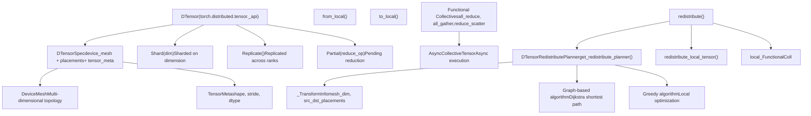
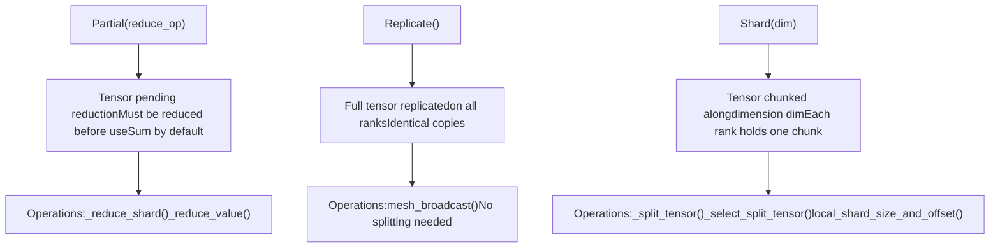
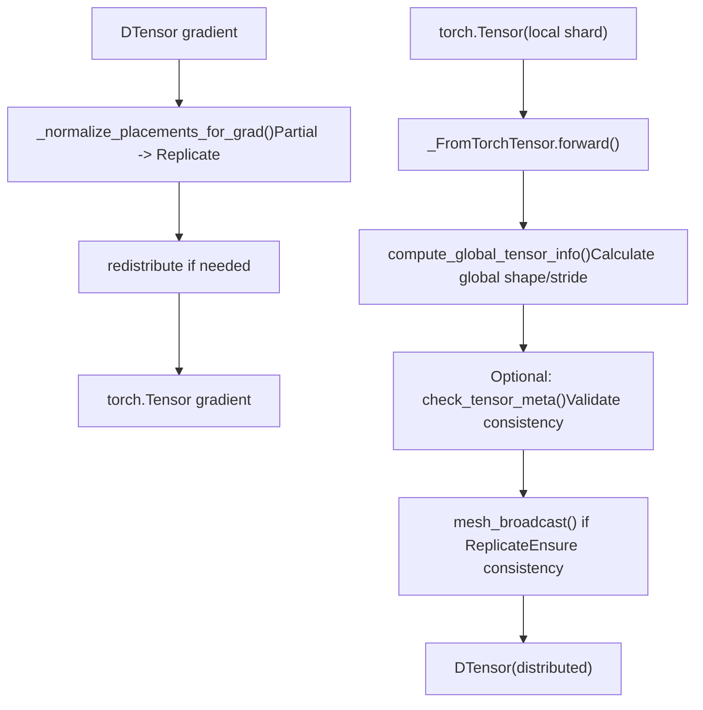
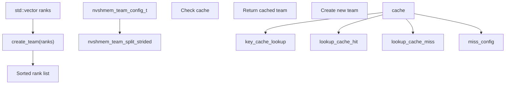

# Distributed Training Systems

Relevant source files

-   [build\_variables.bzl](https://github.com/pytorch/pytorch/blob/915982a4/build_variables.bzl)
-   [caffe2/CMakeLists.txt](https://github.com/pytorch/pytorch/blob/915982a4/caffe2/CMakeLists.txt)
-   [docs/source/distributed.md](https://github.com/pytorch/pytorch/blob/915982a4/docs/source/distributed.md)
-   [test/distributed/\_pycute/test\_coalesce.py](https://github.com/pytorch/pytorch/blob/915982a4/test/distributed/_pycute/test_coalesce.py)
-   [test/distributed/\_pycute/test\_complement.py](https://github.com/pytorch/pytorch/blob/915982a4/test/distributed/_pycute/test_complement.py)
-   [test/distributed/\_pycute/test\_composition.py](https://github.com/pytorch/pytorch/blob/915982a4/test/distributed/_pycute/test_composition.py)
-   [test/distributed/\_pycute/test\_int\_tuple.py](https://github.com/pytorch/pytorch/blob/915982a4/test/distributed/_pycute/test_int_tuple.py)
-   [test/distributed/\_pycute/test\_left\_inverse.py](https://github.com/pytorch/pytorch/blob/915982a4/test/distributed/_pycute/test_left_inverse.py)
-   [test/distributed/\_pycute/test\_right\_inverse.py](https://github.com/pytorch/pytorch/blob/915982a4/test/distributed/_pycute/test_right_inverse.py)
-   [test/distributed/\_pycute/test\_typing.py](https://github.com/pytorch/pytorch/blob/915982a4/test/distributed/_pycute/test_typing.py)
-   [test/distributed/tensor/debug/test\_debug\_mode.py](https://github.com/pytorch/pytorch/blob/915982a4/test/distributed/tensor/debug/test_debug_mode.py)
-   [test/distributed/tensor/experimental/test\_register\_sharding.py](https://github.com/pytorch/pytorch/blob/915982a4/test/distributed/tensor/experimental/test_register_sharding.py)
-   [test/distributed/tensor/test\_decompositions.py](https://github.com/pytorch/pytorch/blob/915982a4/test/distributed/tensor/test_decompositions.py)
-   [test/distributed/tensor/test\_dtensor.py](https://github.com/pytorch/pytorch/blob/915982a4/test/distributed/tensor/test_dtensor.py)
-   [test/distributed/tensor/test\_dtensor\_compile.py](https://github.com/pytorch/pytorch/blob/915982a4/test/distributed/tensor/test_dtensor_compile.py)
-   [test/distributed/tensor/test\_dtensor\_dispatch\_overhead.py](https://github.com/pytorch/pytorch/blob/915982a4/test/distributed/tensor/test_dtensor_dispatch_overhead.py)
-   [test/distributed/tensor/test\_dtensor\_ops.py](https://github.com/pytorch/pytorch/blob/915982a4/test/distributed/tensor/test_dtensor_ops.py)
-   [test/distributed/tensor/test\_math\_ops.py](https://github.com/pytorch/pytorch/blob/915982a4/test/distributed/tensor/test_math_ops.py)
-   [test/distributed/tensor/test\_matrix\_ops.py](https://github.com/pytorch/pytorch/blob/915982a4/test/distributed/tensor/test_matrix_ops.py)
-   [test/distributed/tensor/test\_op\_strategy.py](https://github.com/pytorch/pytorch/blob/915982a4/test/distributed/tensor/test_op_strategy.py)
-   [test/distributed/tensor/test\_placement\_types.py](https://github.com/pytorch/pytorch/blob/915982a4/test/distributed/tensor/test_placement_types.py)
-   [test/distributed/tensor/test\_pointwise\_ops.py](https://github.com/pytorch/pytorch/blob/915982a4/test/distributed/tensor/test_pointwise_ops.py)
-   [test/distributed/tensor/test\_redistribute.py](https://github.com/pytorch/pytorch/blob/915982a4/test/distributed/tensor/test_redistribute.py)
-   [test/distributed/tensor/test\_single\_dim\_strategy.py](https://github.com/pytorch/pytorch/blob/915982a4/test/distributed/tensor/test_single_dim_strategy.py)
-   [test/distributed/tensor/test\_tensor\_ops.py](https://github.com/pytorch/pytorch/blob/915982a4/test/distributed/tensor/test_tensor_ops.py)
-   [test/distributed/tensor/test\_utils.py](https://github.com/pytorch/pytorch/blob/915982a4/test/distributed/tensor/test_utils.py)
-   [test/distributed/tensor/test\_view\_ops.py](https://github.com/pytorch/pytorch/blob/915982a4/test/distributed/tensor/test_view_ops.py)
-   [test/distributed/test\_c10d\_nccl.py](https://github.com/pytorch/pytorch/blob/915982a4/test/distributed/test_c10d_nccl.py)
-   [test/distributed/test\_device\_mesh.py](https://github.com/pytorch/pytorch/blob/915982a4/test/distributed/test_device_mesh.py)
-   [test/distributed/test\_nccl.py](https://github.com/pytorch/pytorch/blob/915982a4/test/distributed/test_nccl.py)
-   [test/distributed/test\_nvshmem.py](https://github.com/pytorch/pytorch/blob/915982a4/test/distributed/test_nvshmem.py)
-   [test/dynamo/test\_aot\_autograd\_cache.py](https://github.com/pytorch/pytorch/blob/915982a4/test/dynamo/test_aot_autograd_cache.py)
-   [test/jit/test\_autodiff\_subgraph\_slicing.py](https://github.com/pytorch/pytorch/blob/915982a4/test/jit/test_autodiff_subgraph_slicing.py)
-   [test/test\_jit.py](https://github.com/pytorch/pytorch/blob/915982a4/test/test_jit.py)
-   [test/test\_jit\_autocast.py](https://github.com/pytorch/pytorch/blob/915982a4/test/test_jit_autocast.py)
-   [test/test\_jit\_fuser.py](https://github.com/pytorch/pytorch/blob/915982a4/test/test_jit_fuser.py)
-   [test/test\_jit\_fuser\_legacy.py](https://github.com/pytorch/pytorch/blob/915982a4/test/test_jit_fuser_legacy.py)
-   [test/test\_jit\_fuser\_te.py](https://github.com/pytorch/pytorch/blob/915982a4/test/test_jit_fuser_te.py)
-   [test/test\_jit\_legacy.py](https://github.com/pytorch/pytorch/blob/915982a4/test/test_jit_legacy.py)
-   [torch/\_C/\_distributed.pyi](https://github.com/pytorch/pytorch/blob/915982a4/torch/_C/_distributed.pyi)
-   [torch/\_C/\_distributed\_c10d.pyi](https://github.com/pytorch/pytorch/blob/915982a4/torch/_C/_distributed_c10d.pyi)
-   [torch/\_dynamo/backends/debugging.py](https://github.com/pytorch/pytorch/blob/915982a4/torch/_dynamo/backends/debugging.py)
-   [torch/\_dynamo/backends/distributed.py](https://github.com/pytorch/pytorch/blob/915982a4/torch/_dynamo/backends/distributed.py)
-   [torch/\_dynamo/variables/distributed.py](https://github.com/pytorch/pytorch/blob/915982a4/torch/_dynamo/variables/distributed.py)
-   [torch/\_functorch/\_aot\_autograd/autograd\_cache.py](https://github.com/pytorch/pytorch/blob/915982a4/torch/_functorch/_aot_autograd/autograd_cache.py)
-   [torch/\_inductor/runtime/benchmarking.py](https://github.com/pytorch/pytorch/blob/915982a4/torch/_inductor/runtime/benchmarking.py)
-   [torch/\_library/triton.py](https://github.com/pytorch/pytorch/blob/915982a4/torch/_library/triton.py)
-   [torch/\_meta\_registrations.py](https://github.com/pytorch/pytorch/blob/915982a4/torch/_meta_registrations.py)
-   [torch/csrc/distributed/Placement.h](https://github.com/pytorch/pytorch/blob/915982a4/torch/csrc/distributed/Placement.h)
-   [torch/csrc/distributed/c10d/Backend.hpp](https://github.com/pytorch/pytorch/blob/915982a4/torch/csrc/distributed/c10d/Backend.hpp)
-   [torch/csrc/distributed/c10d/NCCLUtils.cpp](https://github.com/pytorch/pytorch/blob/915982a4/torch/csrc/distributed/c10d/NCCLUtils.cpp)
-   [torch/csrc/distributed/c10d/NCCLUtils.hpp](https://github.com/pytorch/pytorch/blob/915982a4/torch/csrc/distributed/c10d/NCCLUtils.hpp)
-   [torch/csrc/distributed/c10d/ProcessGroupNCCL.cpp](https://github.com/pytorch/pytorch/blob/915982a4/torch/csrc/distributed/c10d/ProcessGroupNCCL.cpp)
-   [torch/csrc/distributed/c10d/ProcessGroupNCCL.hpp](https://github.com/pytorch/pytorch/blob/915982a4/torch/csrc/distributed/c10d/ProcessGroupNCCL.hpp)
-   [torch/csrc/distributed/c10d/init.cpp](https://github.com/pytorch/pytorch/blob/915982a4/torch/csrc/distributed/c10d/init.cpp)
-   [torch/csrc/distributed/c10d/symm\_mem/CUDASymmetricMemory.cu](https://github.com/pytorch/pytorch/blob/915982a4/torch/csrc/distributed/c10d/symm_mem/CUDASymmetricMemory.cu)
-   [torch/csrc/distributed/c10d/symm\_mem/CUDASymmetricMemory.hpp](https://github.com/pytorch/pytorch/blob/915982a4/torch/csrc/distributed/c10d/symm_mem/CUDASymmetricMemory.hpp)
-   [torch/csrc/distributed/c10d/symm\_mem/NCCLSymmetricMemory.cu](https://github.com/pytorch/pytorch/blob/915982a4/torch/csrc/distributed/c10d/symm_mem/NCCLSymmetricMemory.cu)
-   [torch/csrc/distributed/c10d/symm\_mem/NCCLSymmetricMemory.hpp](https://github.com/pytorch/pytorch/blob/915982a4/torch/csrc/distributed/c10d/symm_mem/NCCLSymmetricMemory.hpp)
-   [torch/csrc/distributed/c10d/symm\_mem/SymmetricMemory.cpp](https://github.com/pytorch/pytorch/blob/915982a4/torch/csrc/distributed/c10d/symm_mem/SymmetricMemory.cpp)
-   [torch/csrc/distributed/c10d/symm\_mem/SymmetricMemory.hpp](https://github.com/pytorch/pytorch/blob/915982a4/torch/csrc/distributed/c10d/symm_mem/SymmetricMemory.hpp)
-   [torch/csrc/distributed/c10d/symm\_mem/nccl\_extension.cu](https://github.com/pytorch/pytorch/blob/915982a4/torch/csrc/distributed/c10d/symm_mem/nccl_extension.cu)
-   [torch/csrc/distributed/c10d/symm\_mem/nvshmem\_extension.cu](https://github.com/pytorch/pytorch/blob/915982a4/torch/csrc/distributed/c10d/symm_mem/nvshmem_extension.cu)
-   [torch/csrc/distributed/c10d/symm\_mem/nvshmem\_team\_manager.hpp](https://github.com/pytorch/pytorch/blob/915982a4/torch/csrc/distributed/c10d/symm_mem/nvshmem_team_manager.hpp)
-   [torch/csrc/distributed/python\_placement.cpp](https://github.com/pytorch/pytorch/blob/915982a4/torch/csrc/distributed/python_placement.cpp)
-   [torch/csrc/distributed/python\_placement.h](https://github.com/pytorch/pytorch/blob/915982a4/torch/csrc/distributed/python_placement.h)
-   [torch/csrc/dynamo/guards.h](https://github.com/pytorch/pytorch/blob/915982a4/torch/csrc/dynamo/guards.h)
-   [torch/distributed/\_composable/checkpoint\_activation.py](https://github.com/pytorch/pytorch/blob/915982a4/torch/distributed/_composable/checkpoint_activation.py)
-   [torch/distributed/\_composable/replicate.py](https://github.com/pytorch/pytorch/blob/915982a4/torch/distributed/_composable/replicate.py)
-   [torch/distributed/\_functional\_collectives.py](https://github.com/pytorch/pytorch/blob/915982a4/torch/distributed/_functional_collectives.py)
-   [torch/distributed/\_local\_tensor/\_\_init\_\_.py](https://github.com/pytorch/pytorch/blob/915982a4/torch/distributed/_local_tensor/__init__.py)
-   [torch/distributed/\_local\_tensor/\_c10d.py](https://github.com/pytorch/pytorch/blob/915982a4/torch/distributed/_local_tensor/_c10d.py)
-   [torch/distributed/\_mesh\_layout.py](https://github.com/pytorch/pytorch/blob/915982a4/torch/distributed/_mesh_layout.py)
-   [torch/distributed/\_ops/device\_mesh.py](https://github.com/pytorch/pytorch/blob/915982a4/torch/distributed/_ops/device_mesh.py)
-   [torch/distributed/\_pycute/\_\_init\_\_.py](https://github.com/pytorch/pytorch/blob/915982a4/torch/distributed/_pycute/__init__.py)
-   [torch/distributed/\_pycute/int\_tuple.py](https://github.com/pytorch/pytorch/blob/915982a4/torch/distributed/_pycute/int_tuple.py)
-   [torch/distributed/\_pycute/layout.py](https://github.com/pytorch/pytorch/blob/915982a4/torch/distributed/_pycute/layout.py)
-   [torch/distributed/\_pycute/typing.py](https://github.com/pytorch/pytorch/blob/915982a4/torch/distributed/_pycute/typing.py)
-   [torch/distributed/\_symmetric\_memory/\_\_init\_\_.py](https://github.com/pytorch/pytorch/blob/915982a4/torch/distributed/_symmetric_memory/__init__.py)
-   [torch/distributed/device\_mesh.py](https://github.com/pytorch/pytorch/blob/915982a4/torch/distributed/device_mesh.py)
-   [torch/distributed/distributed\_c10d.py](https://github.com/pytorch/pytorch/blob/915982a4/torch/distributed/distributed_c10d.py)
-   [torch/distributed/optim/zero\_redundancy\_optimizer.py](https://github.com/pytorch/pytorch/blob/915982a4/torch/distributed/optim/zero_redundancy_optimizer.py)
-   [torch/distributed/tensor/README.md](https://github.com/pytorch/pytorch/blob/915982a4/torch/distributed/tensor/README.md)
-   [torch/distributed/tensor/\_api.py](https://github.com/pytorch/pytorch/blob/915982a4/torch/distributed/tensor/_api.py)
-   [torch/distributed/tensor/\_collective\_utils.py](https://github.com/pytorch/pytorch/blob/915982a4/torch/distributed/tensor/_collective_utils.py)
-   [torch/distributed/tensor/\_decompositions.py](https://github.com/pytorch/pytorch/blob/915982a4/torch/distributed/tensor/_decompositions.py)
-   [torch/distributed/tensor/\_dtensor\_spec.py](https://github.com/pytorch/pytorch/blob/915982a4/torch/distributed/tensor/_dtensor_spec.py)
-   [torch/distributed/tensor/\_nonlinear\_redux.py](https://github.com/pytorch/pytorch/blob/915982a4/torch/distributed/tensor/_nonlinear_redux.py)
-   [torch/distributed/tensor/\_op\_schema.py](https://github.com/pytorch/pytorch/blob/915982a4/torch/distributed/tensor/_op_schema.py)
-   [torch/distributed/tensor/\_ops/\_conv\_ops.py](https://github.com/pytorch/pytorch/blob/915982a4/torch/distributed/tensor/_ops/_conv_ops.py)
-   [torch/distributed/tensor/\_ops/\_embedding\_ops.py](https://github.com/pytorch/pytorch/blob/915982a4/torch/distributed/tensor/_ops/_embedding_ops.py)
-   [torch/distributed/tensor/\_ops/\_math\_ops.py](https://github.com/pytorch/pytorch/blob/915982a4/torch/distributed/tensor/_ops/_math_ops.py)
-   [torch/distributed/tensor/\_ops/\_matrix\_ops.py](https://github.com/pytorch/pytorch/blob/915982a4/torch/distributed/tensor/_ops/_matrix_ops.py)
-   [torch/distributed/tensor/\_ops/\_pointwise\_ops.py](https://github.com/pytorch/pytorch/blob/915982a4/torch/distributed/tensor/_ops/_pointwise_ops.py)
-   [torch/distributed/tensor/\_ops/\_random\_ops.py](https://github.com/pytorch/pytorch/blob/915982a4/torch/distributed/tensor/_ops/_random_ops.py)
-   [torch/distributed/tensor/\_ops/\_tensor\_ops.py](https://github.com/pytorch/pytorch/blob/915982a4/torch/distributed/tensor/_ops/_tensor_ops.py)
-   [torch/distributed/tensor/\_ops/\_view\_ops.py](https://github.com/pytorch/pytorch/blob/915982a4/torch/distributed/tensor/_ops/_view_ops.py)
-   [torch/distributed/tensor/\_ops/single\_dim\_strategy.py](https://github.com/pytorch/pytorch/blob/915982a4/torch/distributed/tensor/_ops/single_dim_strategy.py)
-   [torch/distributed/tensor/\_ops/utils.py](https://github.com/pytorch/pytorch/blob/915982a4/torch/distributed/tensor/_ops/utils.py)
-   [torch/distributed/tensor/\_redistribute.py](https://github.com/pytorch/pytorch/blob/915982a4/torch/distributed/tensor/_redistribute.py)
-   [torch/distributed/tensor/\_sharding\_prop.py](https://github.com/pytorch/pytorch/blob/915982a4/torch/distributed/tensor/_sharding_prop.py)
-   [torch/distributed/tensor/\_utils.py](https://github.com/pytorch/pytorch/blob/915982a4/torch/distributed/tensor/_utils.py)
-   [torch/distributed/tensor/debug/\_\_init\_\_.py](https://github.com/pytorch/pytorch/blob/915982a4/torch/distributed/tensor/debug/__init__.py)
-   [torch/distributed/tensor/examples/comm\_mode\_features\_example.py](https://github.com/pytorch/pytorch/blob/915982a4/torch/distributed/tensor/examples/comm_mode_features_example.py)
-   [torch/distributed/tensor/examples/flex\_attention\_cp.py](https://github.com/pytorch/pytorch/blob/915982a4/torch/distributed/tensor/examples/flex_attention_cp.py)
-   [torch/distributed/tensor/examples/torchrec\_sharding\_example.py](https://github.com/pytorch/pytorch/blob/915982a4/torch/distributed/tensor/examples/torchrec_sharding_example.py)
-   [torch/distributed/tensor/examples/visualize\_sharding\_example.py](https://github.com/pytorch/pytorch/blob/915982a4/torch/distributed/tensor/examples/visualize_sharding_example.py)
-   [torch/distributed/tensor/placement\_types.py](https://github.com/pytorch/pytorch/blob/915982a4/torch/distributed/tensor/placement_types.py)
-   [torch/testing/\_internal/common\_distributed.py](https://github.com/pytorch/pytorch/blob/915982a4/torch/testing/_internal/common_distributed.py)
-   [torch/testing/\_internal/common\_fsdp.py](https://github.com/pytorch/pytorch/blob/915982a4/torch/testing/_internal/common_fsdp.py)
-   [torch/testing/\_internal/common\_nn.py](https://github.com/pytorch/pytorch/blob/915982a4/torch/testing/_internal/common_nn.py)
-   [torch/testing/\_internal/common\_ops\_unbacked.py](https://github.com/pytorch/pytorch/blob/915982a4/torch/testing/_internal/common_ops_unbacked.py)
-   [torch/testing/\_internal/common\_utils.py](https://github.com/pytorch/pytorch/blob/915982a4/torch/testing/_internal/common_utils.py)
-   [torch/testing/\_internal/distributed/\_tensor/common\_dtensor.py](https://github.com/pytorch/pytorch/blob/915982a4/torch/testing/_internal/distributed/_tensor/common_dtensor.py)
-   [torch/testing/\_internal/distributed/distributed\_test.py](https://github.com/pytorch/pytorch/blob/915982a4/torch/testing/_internal/distributed/distributed_test.py)

## Purpose and Scope

This document describes PyTorch's distributed training infrastructure, which enables efficient multi-GPU and multi-node training through two main components:

1.  **DTensor (Distributed Tensor)**: A tensor abstraction that transparently handles sharding, replication, and communication across devices
2.  **Symmetric Memory**: Low-level peer-to-peer memory access primitives for high-performance collective operations

For information about the compilation system that integrates with these distributed primitives, see [Compilation System](/pytorch/pytorch/2-compilation-system). For device-specific backend implementations, see [Device Backends and Native Operations](/pytorch/pytorch/3-device-backends-and-native-operations).

---

## DTensor: Distributed Tensor Abstraction

### Overview

DTensor provides a single-device programming model for multi-device tensors. It abstracts distributed tensor storage and automatically inserts collective communication operations during computation. The system consists of three core components:

1.  **Placement strategies** that describe how tensors are distributed
2.  **DeviceMesh** that defines the device topology
3.  **Redistribution planner** that optimizes data movement between placements

**DTensor Architecture**


Sources: [torch/distributed/tensor/\_api.py269-600](https://github.com/pytorch/pytorch/blob/915982a4/torch/distributed/tensor/_api.py#L269-L600) [torch/distributed/tensor/\_dtensor\_spec.py1-200](https://github.com/pytorch/pytorch/blob/915982a4/torch/distributed/tensor/_dtensor_spec.py#L1-L200) [torch/distributed/tensor/placement\_types.py1-100](https://github.com/pytorch/pytorch/blob/915982a4/torch/distributed/tensor/placement_types.py#L1-L100)

### DTensor Class and Placement Types

The `DTensor` class in [torch/distributed/tensor/\_api.py269-600](https://github.com/pytorch/pytorch/blob/915982a4/torch/distributed/tensor/_api.py#L269-L600) is a `torch.Tensor` subclass that wraps a local tensor shard with a `DTensorSpec` describing its global properties:

| Component | Purpose | Key Attributes |
| --- | --- | --- |
| `DTensor` | Main distributed tensor class | `_local_tensor`, `_spec` |
| `DTensorSpec` | Distribution specification | `mesh`, `placements`, `tensor_meta` |
| `DeviceMesh` | Device topology | `mesh`, `mesh_dim_names` |
| `TensorMeta` | Tensor metadata | `shape`, `stride`, `dtype` |

**Placement Types**

Three placement strategies define how tensors are distributed:


Sources: [torch/distributed/tensor/placement\_types.py36-300](https://github.com/pytorch/pytorch/blob/915982a4/torch/distributed/tensor/placement_types.py#L36-L300)

**Placement Implementation Details:**

-   **Shard**: Implemented in [torch/distributed/tensor/placement\_types.py36-200](https://github.com/pytorch/pytorch/blob/915982a4/torch/distributed/tensor/placement_types.py#L36-L200) Uses `torch.chunk()` semantics for splitting tensors. Supports uneven sharding where last ranks may have smaller or empty shards.

-   **Replicate**: Implemented in [torch/distributed/tensor/placement\_types.py300-400](https://github.com/pytorch/pytorch/blob/915982a4/torch/distributed/tensor/placement_types.py#L300-L400) Requires broadcast for consistency when created from local tensors.

-   **Partial**: Implemented in [torch/distributed/tensor/placement\_types.py450-600](https://github.com/pytorch/pytorch/blob/915982a4/torch/distributed/tensor/placement_types.py#L450-L600) Represents intermediate states requiring reduction. Converted to `Replicate` during gradient computation.


### Creating DTensors: from\_local and to\_local

DTensor provides two autograd-aware conversion functions between local and distributed tensors:

**from\_local Conversion**


Sources: [torch/distributed/tensor/\_api.py156-267](https://github.com/pytorch/pytorch/blob/915982a4/torch/distributed/tensor/_api.py#L156-L267)

The `from_local` implementation in [torch/distributed/tensor/\_api.py156-267](https://github.com/pytorch/pytorch/blob/915982a4/torch/distributed/tensor/_api.py#L156-L267) uses `_FromTorchTensor` autograd function:

-   **Forward**: Wraps local tensor with `DTensorSpec`, optionally validates metadata consistency
-   **Backward**: Converts distributed gradients back to local, redistributing from `Partial` to `Replicate` placement
-   **Gradient Placement Guarantees** (documented in [torch/distributed/tensor/\_api.py53-69](https://github.com/pytorch/pytorch/blob/915982a4/torch/distributed/tensor/_api.py#L53-L69)):
    -   `Shard(fwd)` → `Shard(grad_input)`
    -   `Replicate(fwd)` → `Replicate(grad_input)`
    -   `Partial(fwd)` → `Replicate(grad_input)` (always normalized)

**to\_local Conversion**

The `to_local` method in [torch/distributed/tensor/\_api.py92-154](https://github.com/pytorch/pytorch/blob/915982a4/torch/distributed/tensor/_api.py#L92-L154) uses `_ToTorchTensor` autograd function:

-   **Forward**: Returns view of `_local_tensor` (fresh object for autograd metadata)
-   **Backward**: Wraps torch.Tensor gradient as DTensor with appropriate placements
-   Accepts optional `grad_placements` parameter to specify gradient distribution strategy

Sources: [torch/distributed/tensor/\_api.py92-154](https://github.com/pytorch/pytorch/blob/915982a4/torch/distributed/tensor/_api.py#L92-L154)

### Redistribution and Communication

Redistribution transforms a DTensor from one set of placements to another, inserting collective operations as needed. The system uses two algorithms depending on complexity:

**Redistribution Planner Architecture**

```mermaid
flowchart TD
    redistribute_call["dtensor.redistribute(mesh, placements)"]
    Redistribute_class["Redistribute.apply()"]
    get_planner["get_redistribute_planner()(cached factory)"]
    Planner["DTensorRedistributePlanner"]
    plan_method["plan_redistribution()"]
    check_shard_order["Check non-defaultshard_order?"]
    force_flag["Check FORCE_MIN_COSTREDISTRIBUTION_PLAN"]
    choose_algo["Choose algorithm"]
    gen_transform["_gen_transform_infos()"]
    graph_based["Graph-based Algorithm_gen_transform_infos_graph_based()"]
    greedy["Greedy Algorithm_gen_transform_infos_greedy()"]
    apply_transforms["Apply _TransformInfo sequence"]
    shard_to_rep["Shard -> Replicateall_gather_into_tensor"]
    rep_to_shard["Replicate -> Shardsplit tensor"]
    partial_to_rep["Partial -> Replicateall_reduce"]
    shard_to_shard["Shard -> Shardshard_dim_alltoall"]
    redistribute_local["redistribute_local_tensor()"]

    redistribute --> call_Redistribute_class
    Redistribute --> class_get_planner
    get --> planner_Planner
    Planner --> plan_method
    plan --> method_check_shard_order
    check --> shard_order_force_flag
    force --> flag_choose_algo
    choose --> algo_gen_transform
    gen --> transform_graph_based
    gen --> transform_greedy
    graph --> based_apply_transforms
    greedy --> apply_transforms
    apply --> transforms_shard_to_rep
    apply --> transforms_rep_to_shard
    apply --> transforms_partial_to_rep
    apply --> transforms_shard_to_shard
    apply --> transforms_redistribute_local
```
Sources: [torch/distributed/tensor/\_redistribute.py1-300](https://github.com/pytorch/pytorch/blob/915982a4/torch/distributed/tensor/_redistribute.py#L1-L300) [torch/distributed/tensor/\_api.py604-800](https://github.com/pytorch/pytorch/blob/915982a4/torch/distributed/tensor/_api.py#L604-L800)

**Algorithm Selection Logic**

The planner selects between two algorithms based on [torch/distributed/tensor/\_redistribute.py38-104](https://github.com/pytorch/pytorch/blob/915982a4/torch/distributed/tensor/_redistribute.py#L38-L104):

| Condition | Algorithm | Reason |
| --- | --- | --- |
| Non-default shard order present | Graph-based (forced) | Required for correctness with strided shards |
| `_FORCE_MIN_COST_REDISTRIBUTION_PLAN=True` | Graph-based | User override via context manager |
| `use_graph_based_transform=True` parameter | Graph-based | Explicit parameter to `_gen_transform_infos` |
| Default case | Greedy | Faster planning, sufficient for simple cases |

**Graph-based Algorithm**

Implemented in [torch/distributed/tensor/\_redistribute.py400-700](https://github.com/pytorch/pytorch/blob/915982a4/torch/distributed/tensor/_redistribute.py#L400-L700) uses Dijkstra's shortest path to find minimum-cost transformation sequence:

1.  **Build state graph**: Each state is `(placements, shard_order)` tuple
2.  **Add edges**: Each edge represents a single transformation with cost
3.  **Cost calculation**: Uses `one_step_redistribute_cost()` from [torch/distributed/tensor/\_collective\_utils.py1-100](https://github.com/pytorch/pytorch/blob/915982a4/torch/distributed/tensor/_collective_utils.py#L1-L100)
4.  **Find shortest path**: Returns optimal sequence of `_TransformInfo` objects

**Greedy Algorithm**

Implemented in [torch/distributed/tensor/\_redistribute.py300-400](https://github.com/pytorch/pytorch/blob/915982a4/torch/distributed/tensor/_redistribute.py#L300-L400) makes locally optimal choices:

1.  Process each mesh dimension independently
2.  Transform placement one step at a time
3.  Handles special cases: `Partial` always converts to `Replicate` first
4.  Faster but may not find global optimum

**Transform Execution**

The `redistribute_local_tensor()` function in [torch/distributed/tensor/\_redistribute.py800-1200](https://github.com/pytorch/pytorch/blob/915982a4/torch/distributed/tensor/_redistribute.py#L800-L1200) executes the planned transformations:

```mermaid
flowchart TD
    S2S_start["Shard on dim i"]
    S2S_a2a["shard_dim_alltoall"]
    S2S_reshape["Reshape chunks"]
    S2S_end["Shard on dim j"]
    P2R_start["Partial tensor"]
    P2R_reduce["all_reduce(reduce_op)"]
    P2R_end["Full tensor"]
    R2S_start["Full tensor"]
    R2S_chunk["chunk along dim"]
    R2S_select["Select rank's chunk"]
    R2S_end["Local shard"]
    S2R_start["Local shard"]
    S2R_ag["all_gather_into_tensor"]
    S2R_chunk["chunk + concat"]
    S2R_end["Full tensor"]

    S2S --> start_S2S_a2a
    S2S --> a2a_S2S_reshape
    S2S --> reshape_S2S_end
    P2R --> start_P2R_reduce
    P2R --> reduce_P2R_end
    R2S --> start_R2S_chunk
    R2S --> chunk_R2S_select
    R2S --> select_R2S_end
    S2R --> start_S2R_ag
    S2R --> ag_S2R_chunk
    S2R --> chunk_S2R_end
```


Sources: [torch/distributed/tensor/\_redistribute.py800-1200](https://github.com/pytorch/pytorch/blob/915982a4/torch/distributed/tensor/_redistribute.py#L800-L1200)

**Functional Collectives Integration**

DTensor uses functional collectives from [torch/distributed/\_functional\_collectives.py1-500](https://github.com/pytorch/pytorch/blob/915982a4/torch/distributed/_functional_collectives.py#L1-L500) which return `AsyncCollectiveTensor` for non-blocking communication:

-   `all_gather_into_tensor`: Gather shards to full tensor
-   `reduce_scatter_tensor`: Reduce and scatter to shards
-   `all_reduce`: Full reduction across ranks
-   `all_to_all_single`: Direct shard-to-shard exchange

The collectives integrate with autograd and support both eager and compiled execution.

Sources: [torch/distributed/\_functional\_collectives.py1-500](https://github.com/pytorch/pytorch/blob/915982a4/torch/distributed/_functional_collectives.py#L1-L500)

### DebugMode and Observability

`DebugMode` provides runtime introspection of DTensor operations, tracking redistribution decisions and collective communication patterns.

**DebugMode Architecture**


Sources: [torch/utils/\_debug\_mode.py1-300](https://github.com/pytorch/pytorch/blob/915982a4/torch/utils/_debug_mode.py#L1-L300)

**DebugMode Implementation**

The `DebugMode` class in [torch/utils/\_debug\_mode.py748-1200](https://github.com/pytorch/pytorch/blob/915982a4/torch/utils/_debug_mode.py#L748-L1200) is a `TorchDispatchMode` that intercepts operations:

```
# Example usage from test filewith DebugMode() as debug_mode:    x_dtensor = DTensor.from_local(x, mesh, [Shard(0)])    y_dtensor = DTensor.from_local(y, mesh, [Shard(0)])    result = torch.mm(x_dtensor, y_dtensor).sum() print(debug_mode.debug_string())
```
**Output Format**

The `debug_string()` method in [torch/utils/\_debug\_mode.py1000-1100](https://github.com/pytorch/pytorch/blob/915982a4/torch/utils/_debug_mode.py#L1000-L1100) produces hierarchical output:

```
torch.mm(dt$0: f32[8, 8]| S(0), dt$1: f32[8, 32]| S(0))  ->  dt$7: f32[8, 32]| S(0)
  aten::mm(dt$0: f32[8, 8]| S(0), dt$1: f32[8, 32]| S(0))
    -> output: S(0)
    redistribute_input [implicit] (1, S(0) -> R)
      redistribute_input(t$2: f32[1, 32], trace: S(0)->R)
        _c10d_functional::all_gather_into_tensor(t$2: f32[1, 32], 8, 0)  ->  t$3: f32[8, 32]
        _c10d_functional::wait_tensor(t$3: f32[8, 32])  ->  t$3: f32[8, 32]
    aten::mm(t$5: f32[1, 8], t$3: f32[8, 32])  ->  t$6: f32[1, 32]
```
**Key Features:**

| Feature | Implementation | Purpose |
| --- | --- | --- |
| Call tracking | `_OpCall`, `_RedistributeCall` classes | Record operation hierarchy |
| Tensor IDs | `TensorIdTracker` class | Track tensor identity across operations |
| Placement annotations | DTensorSpec formatting | Show distribution strategy |
| Explicit/implicit markers | `is_explicit` flag | Distinguish user vs automatic redistribution |
| Hash logging | `hash_tensor_fn`, `norm_hash_fn` | Numerical debugging |
| Stack traces | `record_stack_trace=True` | Source code location tracking |

Sources: [torch/utils/\_debug\_mode.py294-670](https://github.com/pytorch/pytorch/blob/915982a4/torch/utils/_debug_mode.py#L294-L670)

**Redistribution Tracking**

The `_RedistributeCall` class in [torch/utils/\_debug\_mode.py416-485](https://github.com/pytorch/pytorch/blob/915982a4/torch/utils/_debug_mode.py#L416-L485) specifically tracks redistribution decisions:

-   Logs `[implicit]` for automatic redistributions during operator dispatch
-   Logs `[explicit]` for user-called `redistribute()` or `full_tensor()`
-   Shows transformation trace: `S(0)->R` (Shard(0) to Replicate)
-   Multi-step transformations show full path: `S(1)[0]S(1)[1]->S(1)R->RR`

**Integration with Compilation**

DebugMode provides `DebugInterpreter` class in [torch/utils/\_debug\_mode.py676-746](https://github.com/pytorch/pytorch/blob/915982a4/torch/utils/_debug_mode.py#L676-L746) for compiled regions:

-   Intercepts FX graph execution in AOT Autograd
-   Extracts metadata from FX nodes (`nn_module_stack`, `stack_trace`)
-   Annotates compiled region boundaries: `[aot_eager region (compile)] enter/exit`
-   Requires `run_compile_with_interpreter=True` flag

Sources: [torch/utils/\_debug\_mode.py676-850](https://github.com/pytorch/pytorch/blob/915982a4/torch/utils/_debug_mode.py#L676-L850) [test/distributed/tensor/debug/test\_debug\_mode.py1-300](https://github.com/pytorch/pytorch/blob/915982a4/test/distributed/tensor/debug/test_debug_mode.py#L1-L300)

---

## Symmetric Memory for P2P Communication

### Overview

Symmetric Memory provides low-level peer-to-peer memory access capabilities for high-performance collective operations. It enables direct GPU-to-GPU memory access without CPU involvement, supporting both one-sided communication (put/get) and collective operations.

**Symmetric Memory System Architecture**

```mermaid
flowchart TD
    empty_strided["empty_strided_p2p()"]
    rendezvous["rendezvous()"]
    get_allocator["get_allocator()"]
    SymmMemAllocator["SymmetricMemoryAllocator(abstract base)"]
    AllocatorMap["AllocatorMap(singleton registry)"]
    set_backend["set_backend(name)"]
    NVSHMEM["NVSHMEMSymmetricMemoryDevice-side collectives"]
    NCCL["NCCLSymmetricMemoryWindow-based P2P"]
    CUDA["CUDASymmetricMemoryVMM-based access"]
    SymmMem["_SymmetricMemory(TorchBind class)"]
    HandleType["HandleTypeBackend-specific handle"]
    SignalPad["Signal PadSynchronization primitive"]
    GroupInfo["GroupInforank, world_size, store"]
    MemPool["MemPoolCUDACachingAllocator"]
    persistent["Persistent allocationsalloc_id tracking"]
    workspace["Workspace tensorper process group"]

    empty --> strided_get_allocator
    get --> allocator_AllocatorMap
    AllocatorMap --> SymmMemAllocator
    SymmMemAllocator --> NVSHMEM
    SymmMemAllocator --> NCCL
    SymmMemAllocator --> CUDA
    set --> backend_AllocatorMap
    rendezvous --> SymmMem
    SymmMem --> HandleType
    SymmMem --> SignalPad
    SymmMem --> GroupInfo
    empty --> strided_MemPool
    empty --> strided_persistent
    get --> allocator_workspace
```


Sources: [torch/distributed/\_symmetric\_memory/\_\_init\_\_.py1-300](https://github.com/pytorch/pytorch/blob/915982a4/torch/distributed/_symmetric_memory/__init__.py#L1-L300) [torch/csrc/distributed/c10d/symm\_mem/SymmetricMemory.cpp1-200](https://github.com/pytorch/pytorch/blob/915982a4/torch/csrc/distributed/c10d/symm_mem/SymmetricMemory.cpp#L1-L200)

### Symmetric Memory Allocation and Rendezvous

**Allocation Process**

The allocation process follows these steps:

1.  **Allocate**: Call `empty_strided_p2p()` to allocate symmetric memory
2.  **Rendezvous**: Exchange memory handles across ranks via `rendezvous()`
3.  **Access**: Use returned `_SymmetricMemory` object for P2P operations

```mermaid
flowchart TD
    call_empty["empty_strided_p2p(size, dtype, device, group)"]
    get_alloc["get_allocator(device_type)"]
    backend_alloc["allocator.alloc(size, device_idx, group)"]
    wrap_tensor["at::from_blob() with deleter"]
    call_rdzv["rendezvous(tensor, group)"]
    extract_ptr["tensor.storage().data_ptr()"]
    backend_rdzv["allocator.rendezvous(ptr, group)"]
    exchange_handles["StoreExchange protocol"]
    build_peers["Build peer access table"]
    symm_mem_obj["_SymmetricMemory object"]
    get_remote["get_remote_tensor(rank)"]
    get_signal_pad["get_signal_pad(rank)"]
    multicast_ptr["multicast_ptr (NVLS)"]

    call --> empty_get_alloc
    get --> alloc_backend_alloc
    backend --> alloc_wrap_tensor
    wrap --> tensor_call_rdzv
    call --> rdzv_extract_ptr
    extract --> ptr_backend_rdzv
    backend --> rdzv_exchange_handles
    exchange --> handles_build_peers
    build --> peers_symm_mem_obj
    symm --> mem_obj_get_remote
    symm --> mem_obj_get_signal_pad
    symm --> mem_obj_multicast_ptr
```
Sources: [torch/distributed/\_symmetric\_memory/\_\_init\_\_.py240-280](https://github.com/pytorch/pytorch/blob/915982a4/torch/distributed/_symmetric_memory/__init__.py#L240-L280) [torch/csrc/distributed/c10d/symm\_mem/SymmetricMemory.cpp246-283](https://github.com/pytorch/pytorch/blob/915982a4/torch/csrc/distributed/c10d/symm_mem/SymmetricMemory.cpp#L246-L283)

**SymmetricMemory Handle**

The `_SymmetricMemory` class is a TorchBind custom class in [torch/csrc/distributed/c10d/symm\_mem/SymmetricMemory.cpp17-18](https://github.com/pytorch/pytorch/blob/915982a4/torch/csrc/distributed/c10d/symm_mem/SymmetricMemory.cpp#L17-L18):

| Method | Purpose | Returns |
| --- | --- | --- |
| `get_buffer_ptrs()` | Get all peer buffer pointers | `std::vector<void*>` |
| `get_buffer_ptrs_dev()` | Device array of peer pointers | `uintptr_t` (device ptr) |
| `get_signal_pad_ptrs_dev()` | Device array of signal pad pointers | `uintptr_t` |
| `get_signal_pad(rank)` | Get signal pad for rank | `at::Tensor` |
| `multicast_ptr` | NVLS multicast pointer (if available) | `uintptr_t` |

**Signal Pads**

Signal pads provide fine-grained synchronization between ranks:

-   Allocated as small symmetric memory regions (default 256 bytes per rank)
-   Used for signaling completion of one-sided operations
-   Size configurable via `set_signal_pad_size()` in [torch/csrc/distributed/c10d/symm\_mem/SymmetricMemory.cpp207-214](https://github.com/pytorch/pytorch/blob/915982a4/torch/csrc/distributed/c10d/symm_mem/SymmetricMemory.cpp#L207-L214)

**Persistent Allocations**

The system supports persistent allocations with `alloc_id` parameter in [torch/distributed/\_symmetric\_memory/\_\_init\_\_.py240-260](https://github.com/pytorch/pytorch/blob/915982a4/torch/distributed/_symmetric_memory/__init__.py#L240-L260):

```
# First allocation with alloc_id=42tensor1 = symm_mem.empty_strided_p2p(    size=(1024,), stride=(1,), dtype=torch.float32,    device=device, group_name=group, alloc_id=42) # Subsequent calls with same alloc_id reuse allocationtensor2 = symm_mem.empty_strided_p2p(    size=(1024,), stride=(1,), dtype=torch.float32,     device=device, group_name=group, alloc_id=42)# tensor1 and tensor2 share underlying memory
```
Implementation details in [torch/csrc/distributed/c10d/symm\_mem/SymmetricMemory.cpp118-176](https://github.com/pytorch/pytorch/blob/915982a4/torch/csrc/distributed/c10d/symm_mem/SymmetricMemory.cpp#L118-L176):

-   Maps `alloc_id` to device pointer and weak storage reference
-   Reuses existing allocation if storage is still alive
-   Validates size matches on reuse

Sources: [torch/distributed/\_symmetric\_memory/\_\_init\_\_.py240-280](https://github.com/pytorch/pytorch/blob/915982a4/torch/distributed/_symmetric_memory/__init__.py#L240-L280) [torch/csrc/distributed/c10d/symm\_mem/SymmetricMemory.cpp118-300](https://github.com/pytorch/pytorch/blob/915982a4/torch/csrc/distributed/c10d/symm_mem/SymmetricMemory.cpp#L118-L300)

### NVSHMEM Backend

NVSHMEM provides device-side collective operations and one-sided communication primitives.

**NVSHMEM Architecture**

```mermaid
flowchart TD
    NVSHMEMAlloc["NVSHMEMSymmetricMemory"]
    alloc_method["alloc() -> nvshmem_malloc"]
    rendezvous_method["rendezvous() -> NVSHMEMPeerAllocInfo"]
    TeamManager["NVSHMEMTeamManager"]
    create_team["create_team(ranks)"]
    nvshmem_team["nvshmem_team_t"]
    team_cache["Team cache by rank list"]
    nvshmem_put["nvshmem_put_with_signalOne-sided write"]
    nvshmem_get["nvshmem_getOne-sided read"]
    wait_signal["nvshmem_wait_for_signalWait on signal pad"]
    broadcast["nvshmem_broadcast"]
    all_to_all["nvshmem_all_to_all"]
    all_to_all_vdev["all_to_all_vdevVariable device-side"]
    all_to_all_vdev_2d["all_to_all_vdev_2d2D with alignment"]
    base_ptrs["Base pointers arraynvshmem_ptr(mype, rank)"]
    signal_pads["Signal pads arrayPer-rank sync primitives"]
    multicast["NVLS multicast ptr(if supported)"]

    NVSHMEMAlloc --> alloc_method
    alloc --> method_rendezvous_method
    rendezvous --> method_TeamManager
    TeamManager --> create_team
    create --> team_nvshmem_team
    create --> team_team_cache
    rendezvous --> method_base_ptrs
    rendezvous --> method_signal_pads
    rendezvous --> method_multicast
    base --> ptrs_nvshmem_put
    base --> ptrs_nvshmem_get
    signal --> pads_wait_signal
    nvshmem --> team_broadcast
    nvshmem --> team_all_to_all
    nvshmem --> team_all_to_all_vdev
    nvshmem --> team_all_to_all_vdev_2d
```


Sources: [torch/csrc/distributed/c10d/symm\_mem/NVSHMEMSymmetricMemory.cu1-300](https://github.com/pytorch/pytorch/blob/915982a4/torch/csrc/distributed/c10d/symm_mem/NVSHMEMSymmetricMemory.cu#L1-L300) [torch/csrc/distributed/c10d/symm\_mem/nvshmem\_team\_manager.hpp1-100](https://github.com/pytorch/pytorch/blob/915982a4/torch/csrc/distributed/c10d/symm_mem/nvshmem_team_manager.hpp#L1-L100)

**NVSHMEM Operations**

The NVSHMEM backend provides device-callable operations registered in [torch/csrc/distributed/c10d/symm\_mem/nvshmem\_extension.cu1-500](https://github.com/pytorch/pytorch/blob/915982a4/torch/csrc/distributed/c10d/symm_mem/nvshmem_extension.cu#L1-L500):

**One-sided Communication:**

| Operation | Signature | Description |
| --- | --- | --- |
| `nvshmem_put_with_signal` | `(tensor, signal_pad, signal_val, target_rank)` | Write to remote memory with signal |
| `nvshmem_get` | `(tensor, source_rank)` | Read from remote memory |
| `nvshmem_wait_for_signal` | `(signal_pad, expected_val, pe)` | Wait for signal value |

**Collectives:**

| Operation | Use Case | Implementation |
| --- | --- | --- |
| `nvshmem_broadcast` | Broadcast from root to all ranks | `nvshmemx_broadcast_on_stream` |
| `nvshmem_all_to_all` | Fixed-size all-to-all exchange | `nvshmemx_alltoall_on_stream` |
| `all_to_all_vdev` | Variable-size all-to-all | Device-side with split exchange |
| `all_to_all_vdev_2d` | 2D with alignment padding | Expert-parallel MoE routing |

**NVSHMEM Collective Implementation Example**

The `all_to_all_vdev_2d` operation in [torch/csrc/distributed/c10d/symm\_mem/nvshmem\_extension.cu700-1000](https://github.com/pytorch/pytorch/blob/915982a4/torch/csrc/distributed/c10d/symm_mem/nvshmem_extension.cu#L700-L1000) demonstrates device-side collective:

1.  **Split exchange**: Ranks exchange input split sizes via `all_to_all_vdev`
2.  **Output allocation**: Compute output sizes and offsets with padding
3.  **Data exchange**: Direct device-to-device scatter with alignment
4.  **Synchronization**: Use NVSHMEM fence for completion

**Team Management**

The `NVSHMEMTeamManager` in [torch/csrc/distributed/c10d/symm\_mem/nvshmem\_team\_manager.hpp1-150](https://github.com/pytorch/pytorch/blob/915982a4/torch/csrc/distributed/c10d/symm_mem/nvshmem_team_manager.hpp#L1-L150) manages NVSHMEM teams:


Sources: [torch/csrc/distributed/c10d/symm\_mem/nvshmem\_team\_manager.hpp1-150](https://github.com/pytorch/pytorch/blob/915982a4/torch/csrc/distributed/c10d/symm_mem/nvshmem_team_manager.hpp#L1-L150)

### NCCL and CUDA Symmetric Memory Backends

PyTorch provides two additional symmetric memory backends for systems without NVSHMEM.

**NCCL Symmetric Memory**

Implemented in [torch/csrc/distributed/c10d/symm\_mem/NCCLSymmetricMemory.cu1-300](https://github.com/pytorch/pytorch/blob/915982a4/torch/csrc/distributed/c10d/symm_mem/NCCLSymmetricMemory.cu#L1-L300) uses NCCL window registration (NCCL 2.24+):

```mermaid
flowchart TD
    ncclAlloc["NCCLAllocationncclMemAlloc()"]
    window_reg["ncclCommWindowRegisterNCCL_WIN_COLL_SYMMETRIC"]
    peer_info["NCCLPeerAllocInfoPer-group info"]
    buffer_win["buffer_win_ncclWindow_t"]
    signal_win["signal_handle_ncclWindow_t"]
    get_lsa["ncclGetLsaPointerGet remote ptr"]
    build_ptr["build_ptr_dev kernelBuild pointer array"]
    remote_access["Direct remote accessvia LSA pointers"]

    ncclAlloc --> window_reg
    window --> reg_peer_info
    peer --> info_buffer_win
    peer --> info_signal_win
    buffer --> win_get_lsa
    signal --> win_get_lsa
    get --> lsa_build_ptr
    build --> ptr_remote_access
```


Key features:

-   Uses `ncclMemAlloc` for symmetric allocation in [torch/csrc/distributed/c10d/symm\_mem/NCCLSymmetricMemory.cu37-51](https://github.com/pytorch/pytorch/blob/915982a4/torch/csrc/distributed/c10d/symm_mem/NCCLSymmetricMemory.cu#L37-L51)
-   Registers memory with `ncclCommWindowRegister` for P2P access
-   Device kernel builds pointer arrays using `ncclGetLsaPointer`
-   Supports multicast via NCCL's NVLS integration

Sources: [torch/csrc/distributed/c10d/symm\_mem/NCCLSymmetricMemory.cu1-300](https://github.com/pytorch/pytorch/blob/915982a4/torch/csrc/distributed/c10d/symm_mem/NCCLSymmetricMemory.cu#L1-L300)

**CUDA Virtual Memory Backend**

Implemented in [torch/csrc/distributed/c10d/symm\_mem/CUDASymmetricMemory.cu1-500](https://github.com/pytorch/pytorch/blob/915982a4/torch/csrc/distributed/c10d/symm_mem/CUDASymmetricMemory.cu#L1-L500) uses CUDA VMM API:

```mermaid
flowchart TD
    check_fabric["Check CUDA fabric support"]
    create_mc["cuMulticastCreate"]
    bind_mc["cuMulticastBindAddr"]
    multicast_ptr["Multicast VA pointer"]
    reserve_vmm["cuMemAddressReserveReserve VA space"]
    create_handle["cuMemCreatePhysical allocation"]
    map_memory["cuMemMapMap physical to VA"]
    set_access["cuMemSetAccessEnable P2P"]
    export_handle["cuMemExportToShareableHandleGet IPC handle"]
    store_exchange["StoreExchange.send/recv"]
    import_handle["cuMemImportFromShareableHandleImport peer handle"]

    reserve --> vmm_create_handle
    create --> handle_map_memory
    map --> memory_set_access
    create --> handle_export_handle
    export --> handle_store_exchange
    store --> exchange_import_handle
    import --> handle_map_memory
    check --> fabric_create_mc
    create --> mc_bind_mc
    bind --> mc_multicast_ptr
```


Key features:

-   Virtual memory management with reservations
-   IPC handle exchange for peer access setup
-   Multicast support via `cuMulticastCreate` (CUDA 12.3+)
-   Granular control over memory properties

Sources: [torch/csrc/distributed/c10d/symm\_mem/CUDASymmetricMemory.cu1-500](https://github.com/pytorch/pytorch/blob/915982a4/torch/csrc/distributed/c10d/symm_mem/CUDASymmetricMemory.cu#L1-L500)

**Backend Comparison**

| Feature | NVSHMEM | NCCL SymmMem | CUDA VMM |
| --- | --- | --- | --- |
| **API Level** | NVSHMEM library | NCCL 2.24+ | CUDA Driver API |
| **Device collectives** | Yes (native) | Via fallback | Via fallback |
| **One-sided ops** | Yes | Limited | Limited |
| **Multicast** | NVLS native | Via NCCL | Via cuMulticast |
| **Team support** | nvshmem\_team\_t | ncclComm | Manual |
| **Sync primitives** | Device-side | Signal pads | Signal pads |
| **Setup overhead** | Medium | Low | High |
| **Best for** | HPC collectives | NCCL integration | Full control |

**Backend Selection**

Backend selection logic in [torch/csrc/distributed/c10d/symm\_mem/SymmetricMemory.cpp49-66](https://github.com/pytorch/pytorch/blob/915982a4/torch/csrc/distributed/c10d/symm_mem/SymmetricMemory.cpp#L49-L66):

```
# Python APIimport torch.distributed._symmetric_memory as symm_mem # Set backend before first allocationsymm_mem.set_backend("NVSHMEM")  # or "NCCL" or "CUDA" # Check current backendbackend = symm_mem.get_backend(torch.device("cuda"))
```
The `AllocatorMap` singleton in [torch/csrc/distributed/c10d/symm\_mem/SymmetricMemory.cpp28-114](https://github.com/pytorch/pytorch/blob/915982a4/torch/csrc/distributed/c10d/symm_mem/SymmetricMemory.cpp#L28-L114) manages backend registration:

-   Backends register at static initialization time
-   `set_backend()` validates and activates selected backend
-   Once used, backend cannot be changed (enforced by `in_use_` flag)

Sources: [torch/distributed/\_symmetric\_memory/\_\_init\_\_.py1-100](https://github.com/pytorch/pytorch/blob/915982a4/torch/distributed/_symmetric_memory/__init__.py#L1-L100) [torch/csrc/distributed/c10d/symm\_mem/SymmetricMemory.cpp28-200](https://github.com/pytorch/pytorch/blob/915982a4/torch/csrc/distributed/c10d/symm_mem/SymmetricMemory.cpp#L28-L200)
