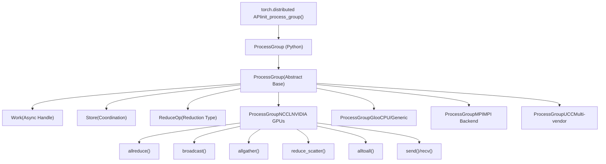
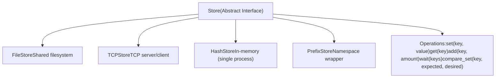
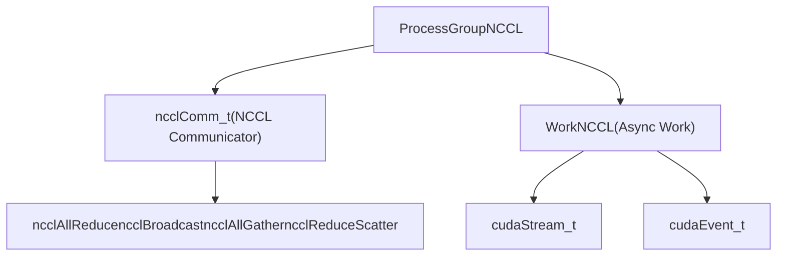
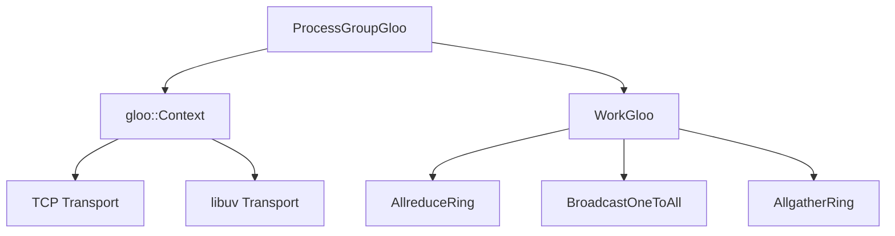
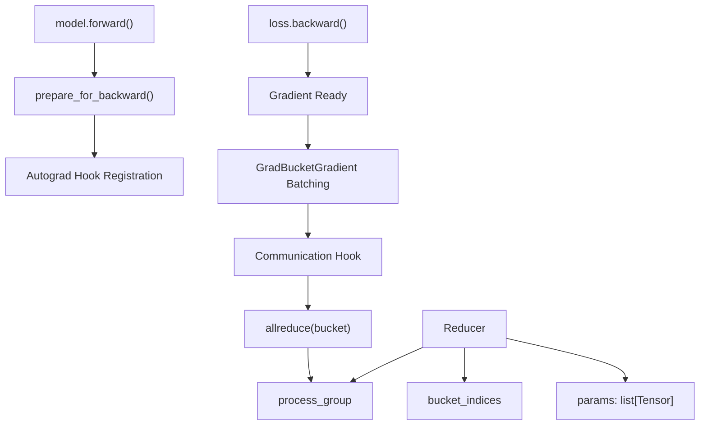
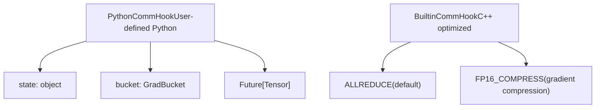
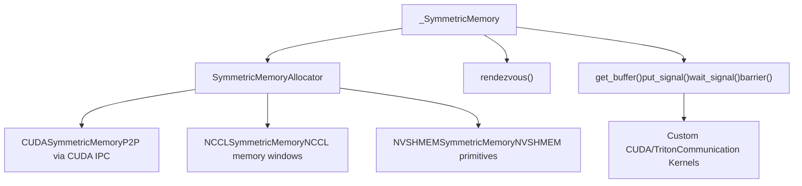
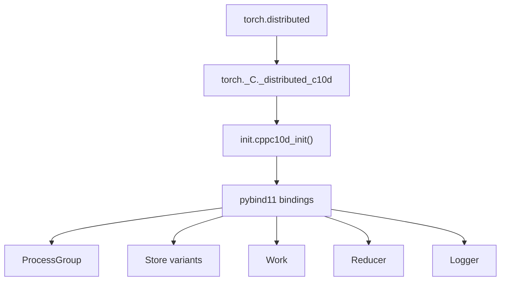

# c10d Collective Communication

Relevant source files

-   [build\_variables.bzl](https://github.com/pytorch/pytorch/blob/915982a4/build_variables.bzl)
-   [caffe2/CMakeLists.txt](https://github.com/pytorch/pytorch/blob/915982a4/caffe2/CMakeLists.txt)
-   [docs/source/distributed.md](https://github.com/pytorch/pytorch/blob/915982a4/docs/source/distributed.md)
-   [test/distributed/test\_c10d\_nccl.py](https://github.com/pytorch/pytorch/blob/915982a4/test/distributed/test_c10d_nccl.py)
-   [test/distributed/test\_nccl.py](https://github.com/pytorch/pytorch/blob/915982a4/test/distributed/test_nccl.py)
-   [test/distributed/test\_nvshmem.py](https://github.com/pytorch/pytorch/blob/915982a4/test/distributed/test_nvshmem.py)
-   [test/jit/test\_autodiff\_subgraph\_slicing.py](https://github.com/pytorch/pytorch/blob/915982a4/test/jit/test_autodiff_subgraph_slicing.py)
-   [test/test\_jit.py](https://github.com/pytorch/pytorch/blob/915982a4/test/test_jit.py)
-   [test/test\_jit\_autocast.py](https://github.com/pytorch/pytorch/blob/915982a4/test/test_jit_autocast.py)
-   [test/test\_jit\_fuser.py](https://github.com/pytorch/pytorch/blob/915982a4/test/test_jit_fuser.py)
-   [test/test\_jit\_fuser\_legacy.py](https://github.com/pytorch/pytorch/blob/915982a4/test/test_jit_fuser_legacy.py)
-   [test/test\_jit\_fuser\_te.py](https://github.com/pytorch/pytorch/blob/915982a4/test/test_jit_fuser_te.py)
-   [test/test\_jit\_legacy.py](https://github.com/pytorch/pytorch/blob/915982a4/test/test_jit_legacy.py)
-   [torch/\_C/\_distributed\_c10d.pyi](https://github.com/pytorch/pytorch/blob/915982a4/torch/_C/_distributed_c10d.pyi)
-   [torch/csrc/distributed/c10d/Backend.hpp](https://github.com/pytorch/pytorch/blob/915982a4/torch/csrc/distributed/c10d/Backend.hpp)
-   [torch/csrc/distributed/c10d/NCCLUtils.cpp](https://github.com/pytorch/pytorch/blob/915982a4/torch/csrc/distributed/c10d/NCCLUtils.cpp)
-   [torch/csrc/distributed/c10d/NCCLUtils.hpp](https://github.com/pytorch/pytorch/blob/915982a4/torch/csrc/distributed/c10d/NCCLUtils.hpp)
-   [torch/csrc/distributed/c10d/ProcessGroupNCCL.cpp](https://github.com/pytorch/pytorch/blob/915982a4/torch/csrc/distributed/c10d/ProcessGroupNCCL.cpp)
-   [torch/csrc/distributed/c10d/ProcessGroupNCCL.hpp](https://github.com/pytorch/pytorch/blob/915982a4/torch/csrc/distributed/c10d/ProcessGroupNCCL.hpp)
-   [torch/csrc/distributed/c10d/init.cpp](https://github.com/pytorch/pytorch/blob/915982a4/torch/csrc/distributed/c10d/init.cpp)
-   [torch/csrc/distributed/c10d/symm\_mem/CUDASymmetricMemory.cu](https://github.com/pytorch/pytorch/blob/915982a4/torch/csrc/distributed/c10d/symm_mem/CUDASymmetricMemory.cu)
-   [torch/csrc/distributed/c10d/symm\_mem/CUDASymmetricMemory.hpp](https://github.com/pytorch/pytorch/blob/915982a4/torch/csrc/distributed/c10d/symm_mem/CUDASymmetricMemory.hpp)
-   [torch/csrc/distributed/c10d/symm\_mem/NCCLSymmetricMemory.cu](https://github.com/pytorch/pytorch/blob/915982a4/torch/csrc/distributed/c10d/symm_mem/NCCLSymmetricMemory.cu)
-   [torch/csrc/distributed/c10d/symm\_mem/NCCLSymmetricMemory.hpp](https://github.com/pytorch/pytorch/blob/915982a4/torch/csrc/distributed/c10d/symm_mem/NCCLSymmetricMemory.hpp)
-   [torch/csrc/distributed/c10d/symm\_mem/SymmetricMemory.cpp](https://github.com/pytorch/pytorch/blob/915982a4/torch/csrc/distributed/c10d/symm_mem/SymmetricMemory.cpp)
-   [torch/csrc/distributed/c10d/symm\_mem/SymmetricMemory.hpp](https://github.com/pytorch/pytorch/blob/915982a4/torch/csrc/distributed/c10d/symm_mem/SymmetricMemory.hpp)
-   [torch/csrc/distributed/c10d/symm\_mem/nccl\_extension.cu](https://github.com/pytorch/pytorch/blob/915982a4/torch/csrc/distributed/c10d/symm_mem/nccl_extension.cu)
-   [torch/csrc/distributed/c10d/symm\_mem/nvshmem\_extension.cu](https://github.com/pytorch/pytorch/blob/915982a4/torch/csrc/distributed/c10d/symm_mem/nvshmem_extension.cu)
-   [torch/csrc/distributed/c10d/symm\_mem/nvshmem\_team\_manager.hpp](https://github.com/pytorch/pytorch/blob/915982a4/torch/csrc/distributed/c10d/symm_mem/nvshmem_team_manager.hpp)
-   [torch/distributed/\_symmetric\_memory/\_\_init\_\_.py](https://github.com/pytorch/pytorch/blob/915982a4/torch/distributed/_symmetric_memory/__init__.py)
-   [torch/distributed/distributed\_c10d.py](https://github.com/pytorch/pytorch/blob/915982a4/torch/distributed/distributed_c10d.py)
-   [torch/testing/\_internal/common\_distributed.py](https://github.com/pytorch/pytorch/blob/915982a4/torch/testing/_internal/common_distributed.py)
-   [torch/testing/\_internal/common\_fsdp.py](https://github.com/pytorch/pytorch/blob/915982a4/torch/testing/_internal/common_fsdp.py)
-   [torch/testing/\_internal/common\_nn.py](https://github.com/pytorch/pytorch/blob/915982a4/torch/testing/_internal/common_nn.py)
-   [torch/testing/\_internal/common\_utils.py](https://github.com/pytorch/pytorch/blob/915982a4/torch/testing/_internal/common_utils.py)
-   [torch/testing/\_internal/distributed/distributed\_test.py](https://github.com/pytorch/pytorch/blob/915982a4/torch/testing/_internal/distributed/distributed_test.py)

The c10d library provides the foundational collective communication primitives for PyTorch's distributed training. It defines an abstract `ProcessGroup` interface with multiple backend implementations (NCCL, Gloo, MPI, UCC) and supports standard collective operations like allreduce, broadcast, and allgather. This layer sits below higher-level distributed APIs like DDP and DTensor.

**Scope**: This page covers the core c10d communication primitives, backend abstractions, and the Reducer component used by DistributedDataParallel. For distributed tensor abstractions built on top of c10d, see [DTensor](/pytorch/pytorch/4.2-dtensor:-distributed-tensor-abstraction). For high-performance symmetric memory communication, see [Symmetric Memory](/pytorch/pytorch/4.3-symmetric-memory-for-high-performance-communication).

## Architecture Overview

The c10d library implements a layered architecture separating the abstract communication interface from backend-specific implementations:


**Sources**: [torch/csrc/distributed/c10d/init.cpp19-46](https://github.com/pytorch/pytorch/blob/915982a4/torch/csrc/distributed/c10d/init.cpp#L19-L46) [torch/\_C/\_distributed\_c10d.pyi1-300](https://github.com/pytorch/pytorch/blob/915982a4/torch/_C/_distributed_c10d.pyi#L1-L300)

## Core Abstractions

### ProcessGroup

The `ProcessGroup` class is the abstract interface for all communication backends. Each process in a distributed job has a reference to one or more ProcessGroup instances representing communication domains.

| Method | Purpose | Returns |
| --- | --- | --- |
| `broadcast()` | Send tensor from root to all ranks | `Work` |
| `allreduce()` | Reduce tensors across all ranks | `Work` |
| `reduce()` | Reduce tensors to a single rank | `Work` |
| `allgather()` | Gather tensors from all ranks | `Work` |
| `gather()` | Gather tensors to a single rank | `Work` |
| `scatter()` | Scatter tensor to all ranks | `Work` |
| `reduce_scatter()` | Reduce then scatter result | `Work` |
| `alltoall()` | All-to-all tensor exchange | `Work` |
| `barrier()` | Synchronization barrier | `Work` |
| `send()`/`recv()` | Point-to-point communication | `Work` |

**Sources**: [torch/\_C/\_distributed\_c10d.pyi276-370](https://github.com/pytorch/pytorch/blob/915982a4/torch/_C/_distributed_c10d.pyi#L276-L370)

### Store

The `Store` interface provides a distributed key-value store used for initialization and coordination:


| Store Type | Use Case | Source |
| --- | --- | --- |
| `FileStore` | Shared filesystem coordination | [torch/\_C/\_distributed\_c10d.pyi225-226](https://github.com/pytorch/pytorch/blob/915982a4/torch/_C/_distributed_c10d.pyi#L225-L226) |
| `TCPStore` | Network-based coordination with master | [torch/\_C/\_distributed\_c10d.pyi231-247](https://github.com/pytorch/pytorch/blob/915982a4/torch/_C/_distributed_c10d.pyi#L231-L247) |
| `HashStore` | Single-process testing | [torch/\_C/\_distributed\_c10d.pyi228-229](https://github.com/pytorch/pytorch/blob/915982a4/torch/_C/_distributed_c10d.pyi#L228-L229) |
| `PrefixStore` | Namespace isolation for multiple groups | [torch/\_C/\_distributed\_c10d.pyi249-252](https://github.com/pytorch/pytorch/blob/915982a4/torch/_C/_distributed_c10d.pyi#L249-L252) |

**Sources**: [torch/\_C/\_distributed\_c10d.pyi201-252](https://github.com/pytorch/pytorch/blob/915982a4/torch/_C/_distributed_c10d.pyi#L201-L252) [torch/csrc/distributed/c10d/init.cpp207-345](https://github.com/pytorch/pytorch/blob/915982a4/torch/csrc/distributed/c10d/init.cpp#L207-L345)

### Work Object

All collective operations return a `Work` object representing an asynchronous operation:

```
class Work:    def wait(self, timeout: timedelta = ...) -> bool    def get_future(self) -> Future[list[Tensor]]    def is_completed(self) -> bool    def is_success(self) -> bool    def exception(self) -> Exception    def source_rank(self) -> int    def result(self) -> list[Tensor]    def synchronize(self) -> None
```
**Sources**: [torch/\_C/\_distributed\_c10d.pyi373-391](https://github.com/pytorch/pytorch/blob/915982a4/torch/_C/_distributed_c10d.pyi#L373-L391)

## Collective Operations Flow

The execution flow for a typical collective operation:

> **[Mermaid sequence]**
> *(图表结构无法解析)*

**Sources**: [torch/\_C/\_distributed\_c10d.pyi276-370](https://github.com/pytorch/pytorch/blob/915982a4/torch/_C/_distributed_c10d.pyi#L276-L370) [torch/csrc/distributed/c10d/init.cpp800-900](https://github.com/pytorch/pytorch/blob/915982a4/torch/csrc/distributed/c10d/init.cpp#L800-L900)

## Backend Implementations

### NCCL Backend

ProcessGroupNCCL is the primary backend for NVIDIA GPU communication, using the NCCL library:


Key features:

-   One-shot device operations with stream ordering
-   GPU Direct RDMA support for intra-node communication
-   Supports CUDA tensors on NVIDIA GPUs
-   Conditional compilation via `USE_C10D_NCCL` flag

**Sources**: [torch/csrc/distributed/c10d/init.cpp33-37](https://github.com/pytorch/pytorch/blob/915982a4/torch/csrc/distributed/c10d/init.cpp#L33-L37) [build\_variables.bzl1-100](https://github.com/pytorch/pytorch/blob/915982a4/build_variables.bzl#L1-L100)

### Gloo Backend

ProcessGroupGloo provides CPU and generic GPU communication:


Features:

-   CPU tensor support (fallback for non-CUDA environments)
-   Multiple transport layers (TCP, UV)
-   Ring-based collective algorithms
-   Conditional compilation via `USE_C10D_GLOO` flag

**Sources**: [torch/csrc/distributed/c10d/init.cpp24-27](https://github.com/pytorch/pytorch/blob/915982a4/torch/csrc/distributed/c10d/init.cpp#L24-L27) [build\_variables.bzl1-100](https://github.com/pytorch/pytorch/blob/915982a4/build_variables.bzl#L1-L100)

### Other Backends

| Backend | Purpose | Compilation Flag |
| --- | --- | --- |
| MPI | HPC environments with MPI | `USE_C10D_MPI` |
| UCC | Unified Communication framework | `USE_C10D_UCC` |
| XCCL | Vendor-agnostic collectives | `USE_C10D_XCCL` |

**Sources**: [torch/csrc/distributed/c10d/init.cpp39-45](https://github.com/pytorch/pytorch/blob/915982a4/torch/csrc/distributed/c10d/init.cpp#L39-L45)

## Reducer and DDP Integration

The `Reducer` class orchestrates gradient synchronization for `DistributedDataParallel`:


**Sources**: [torch/csrc/distributed/c10d/init.cpp490-740](https://github.com/pytorch/pytorch/blob/915982a4/torch/csrc/distributed/c10d/init.cpp#L490-L740) [torch/\_C/\_distributed\_c10d.pyi42-81](https://github.com/pytorch/pytorch/blob/915982a4/torch/_C/_distributed_c10d.pyi#L42-L81)

### GradBucket

`GradBucket` represents a batch of gradients ready for communication:

| Method | Purpose |
| --- | --- |
| `index()` | Bucket index in the DDP model |
| `buffer()` | Flattened 1D gradient tensor |
| `gradients()` | List of per-parameter gradient tensors |
| `parameters()` | List of corresponding parameters |
| `is_last()` | Whether this is the last bucket (first layers in forward) |
| `set_buffer()` | Replace bucket tensor (for compression hooks) |

**Sources**: [torch/\_C/\_distributed\_c10d.pyi34-41](https://github.com/pytorch/pytorch/blob/915982a4/torch/_C/_distributed_c10d.pyi#L34-L41) [torch/csrc/distributed/c10d/init.cpp490-555](https://github.com/pytorch/pytorch/blob/915982a4/torch/csrc/distributed/c10d/init.cpp#L490-L555)

### Communication Hooks

DDP supports two types of communication hooks:


Registration API:

```
# Python hook_register_comm_hook(reducer, state, comm_hook) # Built-in hook_register_builtin_comm_hook(reducer, BuiltinCommHookType.FP16_COMPRESS)
```
**Sources**: [torch/\_C/\_distributed\_c10d.pyi22-30](https://github.com/pytorch/pytorch/blob/915982a4/torch/_C/_distributed_c10d.pyi#L22-L30) [torch/csrc/distributed/c10d/init.cpp381-396](https://github.com/pytorch/pytorch/blob/915982a4/torch/csrc/distributed/c10d/init.cpp#L381-L396)

## Operation Options and Configuration

Each collective operation accepts an options object with operation-specific parameters:

| Options Class | Key Parameters | Used By |
| --- | --- | --- |
| `BroadcastOptions` | `rootRank`, `rootTensor`, `timeout` | broadcast() |
| `AllreduceOptions` | `reduceOp`, `timeout`, `sparseIndices` | allreduce() |
| `ReduceOptions` | `reduceOp`, `rootRank`, `timeout` | reduce() |
| `AllgatherOptions` | `timeout` | allgather() |
| `ReduceScatterOptions` | `reduceOp`, `timeout` | reduce\_scatter() |
| `AllToAllOptions` | `timeout` | alltoall() |
| `BarrierOptions` | `device_ids`, `timeout` | barrier() |

**Sources**: [torch/\_C/\_distributed\_c10d.pyi151-200](https://github.com/pytorch/pytorch/blob/915982a4/torch/_C/_distributed_c10d.pyi#L151-L200)

### ReduceOp

The `ReduceOp` enum specifies the reduction operation:

```
class ReduceOp:    SUM         # Sum across all ranks    AVG         # Average across all ranks    PRODUCT     # Product across all ranks    MIN         # Element-wise minimum    MAX         # Element-wise maximum    BAND        # Bitwise AND    BOR         # Bitwise OR    BXOR        # Bitwise XOR    PREMUL_SUM  # Pre-multiplied sum
```
**Sources**: [torch/\_C/\_distributed\_c10d.pyi119-143](https://github.com/pytorch/pytorch/blob/915982a4/torch/_C/_distributed_c10d.pyi#L119-L143)

## Symmetric Memory Integration

c10d integrates with the symmetric memory system for advanced communication patterns:


Key APIs:

-   `_SymmetricMemory.empty_strided_p2p()` - Allocate symmetric memory
-   `_SymmetricMemory.rendezvous()` - Establish peer mappings
-   `_SymmetricMemory.get_buffer()` - Access remote peer buffers

**Sources**: [torch/\_C/\_distributed\_c10d.pyi427-516](https://github.com/pytorch/pytorch/blob/915982a4/torch/_C/_distributed_c10d.pyi#L427-L516) [torch/csrc/distributed/c10d/symm\_mem/SymmetricMemory.hpp1-40](https://github.com/pytorch/pytorch/blob/915982a4/torch/csrc/distributed/c10d/symm_mem/SymmetricMemory.hpp#L1-L40) [torch/csrc/distributed/c10d/symm\_mem/SymmetricMemory.cpp1-300](https://github.com/pytorch/pytorch/blob/915982a4/torch/csrc/distributed/c10d/symm_mem/SymmetricMemory.cpp#L1-L300)

## Python Bindings

The C++ c10d implementation is exposed to Python via pybind11:


Key binding functions in `init.cpp`:

-   `c10d_init()` - Main module initialization [torch/csrc/distributed/c10d/init.cpp457-458](https://github.com/pytorch/pytorch/blob/915982a4/torch/csrc/distributed/c10d/init.cpp#L457-L458)
-   Store class bindings [torch/csrc/distributed/c10d/init.cpp800-900](https://github.com/pytorch/pytorch/blob/915982a4/torch/csrc/distributed/c10d/init.cpp#L800-L900)
-   ProcessGroup bindings [torch/csrc/distributed/c10d/init.cpp1000-1500](https://github.com/pytorch/pytorch/blob/915982a4/torch/csrc/distributed/c10d/init.cpp#L1000-L1500)
-   Reducer/DDP bindings [torch/csrc/distributed/c10d/init.cpp562-740](https://github.com/pytorch/pytorch/blob/915982a4/torch/csrc/distributed/c10d/init.cpp#L562-L740)

**Sources**: [torch/csrc/distributed/c10d/init.cpp1-300](https://github.com/pytorch/pytorch/blob/915982a4/torch/csrc/distributed/c10d/init.cpp#L1-L300) [torch/\_C/\_distributed\_c10d.pyi1-516](https://github.com/pytorch/pytorch/blob/915982a4/torch/_C/_distributed_c10d.pyi#L1-L516)

## Debugging and Logging

c10d provides debugging utilities and logging:

| Feature | Description | API |
| --- | --- | --- |
| Debug Level | Control verbosity | `set_debug_level(DebugLevel)` |
| Logger | DDP-specific logging | `Logger.set_construction_data_and_log()` |
| Flight Recorder | Record collective history | `_enable_flight_recorder()` |
| Timeout Detection | Detect hung collectives | Configurable via options |

Debug levels:

-   `DebugLevel.OFF` - No debug output
-   `DebugLevel.INFO` - Basic info logging
-   `DebugLevel.DETAIL` - Detailed operation logs

**Sources**: [torch/\_C/\_distributed\_c10d.pyi110-117](https://github.com/pytorch/pytorch/blob/915982a4/torch/_C/_distributed_c10d.pyi#L110-L117) [torch/csrc/distributed/c10d/init.cpp742-788](https://github.com/pytorch/pytorch/blob/915982a4/torch/csrc/distributed/c10d/init.cpp#L742-L788)

## Control Plane Collectives

Separate from data plane collectives, c10d provides lightweight control plane collectives for coordination:

```
class _ControlCollectives:    def barrier(self, key: str, timeout: timedelta, blocking: bool)    def broadcast_send(self, key: str, data: str, timeout: timedelta)    def broadcast_recv(self, key: str, timeout: timedelta) -> str    def gather_send(self, key: str, data: str, timeout: timedelta)    def gather_recv(self, key: str, timeout: timedelta) -> str    def scatter_send(self, key: str, data: str, timeout: timedelta)    def scatter_recv(self, key: str, timeout: timedelta) -> str    def all_gather(self, key: str, data: str, timeout: timedelta) -> str    def all_sum(self, key: str, data: int, timeout: timedelta) -> int
```
These operate on small metadata (strings/ints) rather than tensors and are used for coordination tasks.

**Sources**: [torch/\_C/\_distributed\_c10d.pyi254-264](https://github.com/pytorch/pytorch/blob/915982a4/torch/_C/_distributed_c10d.pyi#L254-L264) [torch/csrc/distributed/c10d/init.cpp10-13](https://github.com/pytorch/pytorch/blob/915982a4/torch/csrc/distributed/c10d/init.cpp#L10-L13)

## Testing and Validation

c10d includes extensive testing infrastructure:

| Test Suite | Coverage | Source |
| --- | --- | --- |
| NCCL Tests | Backend functionality, symmetric memory | [test/distributed/test\_nccl.py](https://github.com/pytorch/pytorch/blob/915982a4/test/distributed/test_nccl.py) |
| NVSHMEM Tests | Symmetric memory with NVSHMEM | [test/distributed/test\_nvshmem.py](https://github.com/pytorch/pytorch/blob/915982a4/test/distributed/test_nvshmem.py) |
| Multi-process Tests | Process group coordination | Test files |

Example test structure:

```
class MultiProcContinuousTest:    """Base class for multi-process distributed tests"""    @property    def world_size(self) -> int: ...    @property      def rank(self) -> int: ...
```
**Sources**: [test/distributed/test\_nccl.py1-100](https://github.com/pytorch/pytorch/blob/915982a4/test/distributed/test_nccl.py#L1-L100) [test/distributed/test\_nvshmem.py1-100](https://github.com/pytorch/pytorch/blob/915982a4/test/distributed/test_nvshmem.py#L1-L100)
