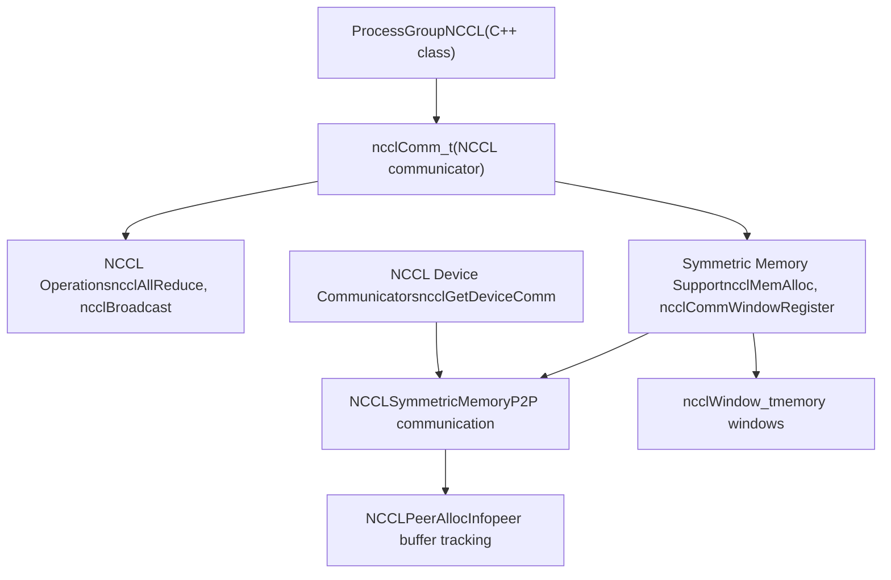
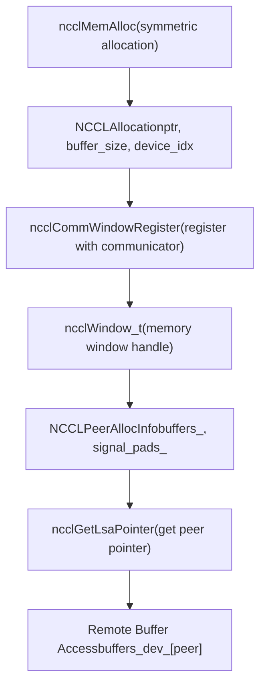
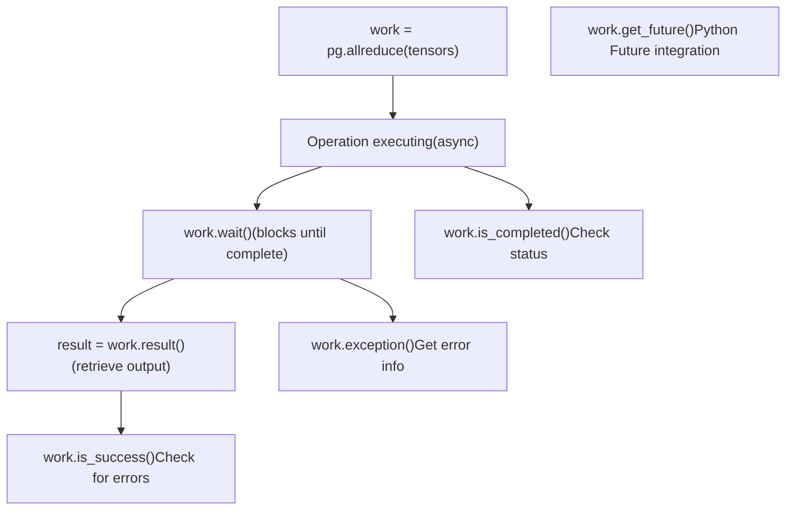
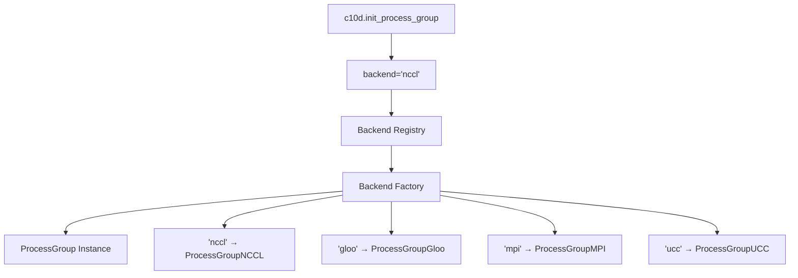
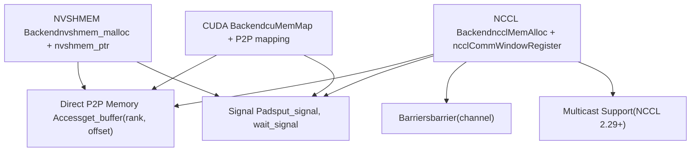
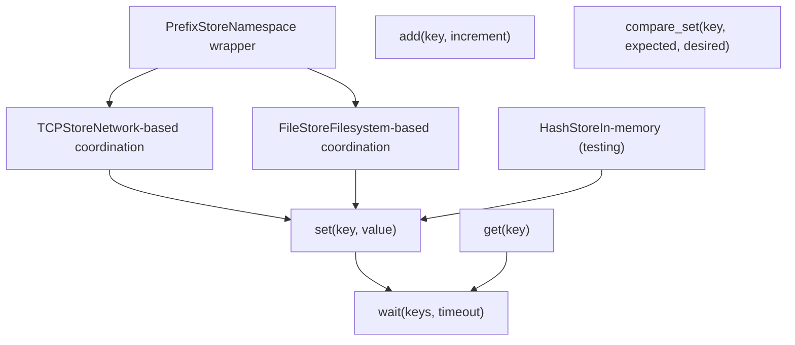
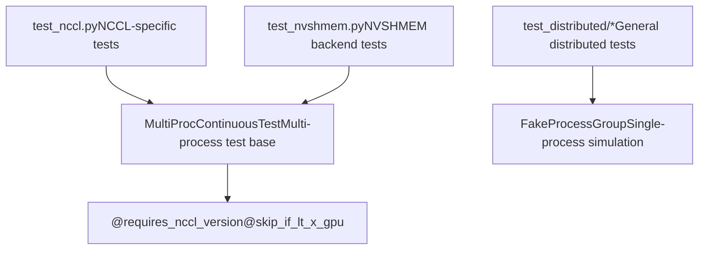

# ProcessGroup Backends

Relevant source files

-   [build\_variables.bzl](https://github.com/pytorch/pytorch/blob/915982a4/build_variables.bzl)
-   [caffe2/CMakeLists.txt](https://github.com/pytorch/pytorch/blob/915982a4/caffe2/CMakeLists.txt)
-   [docs/source/distributed.md](https://github.com/pytorch/pytorch/blob/915982a4/docs/source/distributed.md)
-   [test/distributed/test\_c10d\_nccl.py](https://github.com/pytorch/pytorch/blob/915982a4/test/distributed/test_c10d_nccl.py)
-   [test/distributed/test\_nccl.py](https://github.com/pytorch/pytorch/blob/915982a4/test/distributed/test_nccl.py)
-   [test/distributed/test\_nvshmem.py](https://github.com/pytorch/pytorch/blob/915982a4/test/distributed/test_nvshmem.py)
-   [test/jit/test\_autodiff\_subgraph\_slicing.py](https://github.com/pytorch/pytorch/blob/915982a4/test/jit/test_autodiff_subgraph_slicing.py)
-   [test/test\_jit.py](https://github.com/pytorch/pytorch/blob/915982a4/test/test_jit.py)
-   [test/test\_jit\_autocast.py](https://github.com/pytorch/pytorch/blob/915982a4/test/test_jit_autocast.py)
-   [test/test\_jit\_fuser.py](https://github.com/pytorch/pytorch/blob/915982a4/test/test_jit_fuser.py)
-   [test/test\_jit\_fuser\_legacy.py](https://github.com/pytorch/pytorch/blob/915982a4/test/test_jit_fuser_legacy.py)
-   [test/test\_jit\_fuser\_te.py](https://github.com/pytorch/pytorch/blob/915982a4/test/test_jit_fuser_te.py)
-   [test/test\_jit\_legacy.py](https://github.com/pytorch/pytorch/blob/915982a4/test/test_jit_legacy.py)
-   [torch/\_C/\_distributed\_c10d.pyi](https://github.com/pytorch/pytorch/blob/915982a4/torch/_C/_distributed_c10d.pyi)
-   [torch/csrc/distributed/c10d/Backend.hpp](https://github.com/pytorch/pytorch/blob/915982a4/torch/csrc/distributed/c10d/Backend.hpp)
-   [torch/csrc/distributed/c10d/NCCLUtils.cpp](https://github.com/pytorch/pytorch/blob/915982a4/torch/csrc/distributed/c10d/NCCLUtils.cpp)
-   [torch/csrc/distributed/c10d/NCCLUtils.hpp](https://github.com/pytorch/pytorch/blob/915982a4/torch/csrc/distributed/c10d/NCCLUtils.hpp)
-   [torch/csrc/distributed/c10d/ProcessGroupNCCL.cpp](https://github.com/pytorch/pytorch/blob/915982a4/torch/csrc/distributed/c10d/ProcessGroupNCCL.cpp)
-   [torch/csrc/distributed/c10d/ProcessGroupNCCL.hpp](https://github.com/pytorch/pytorch/blob/915982a4/torch/csrc/distributed/c10d/ProcessGroupNCCL.hpp)
-   [torch/csrc/distributed/c10d/init.cpp](https://github.com/pytorch/pytorch/blob/915982a4/torch/csrc/distributed/c10d/init.cpp)
-   [torch/csrc/distributed/c10d/symm\_mem/CUDASymmetricMemory.cu](https://github.com/pytorch/pytorch/blob/915982a4/torch/csrc/distributed/c10d/symm_mem/CUDASymmetricMemory.cu)
-   [torch/csrc/distributed/c10d/symm\_mem/CUDASymmetricMemory.hpp](https://github.com/pytorch/pytorch/blob/915982a4/torch/csrc/distributed/c10d/symm_mem/CUDASymmetricMemory.hpp)
-   [torch/csrc/distributed/c10d/symm\_mem/NCCLSymmetricMemory.cu](https://github.com/pytorch/pytorch/blob/915982a4/torch/csrc/distributed/c10d/symm_mem/NCCLSymmetricMemory.cu)
-   [torch/csrc/distributed/c10d/symm\_mem/NCCLSymmetricMemory.hpp](https://github.com/pytorch/pytorch/blob/915982a4/torch/csrc/distributed/c10d/symm_mem/NCCLSymmetricMemory.hpp)
-   [torch/csrc/distributed/c10d/symm\_mem/SymmetricMemory.cpp](https://github.com/pytorch/pytorch/blob/915982a4/torch/csrc/distributed/c10d/symm_mem/SymmetricMemory.cpp)
-   [torch/csrc/distributed/c10d/symm\_mem/SymmetricMemory.hpp](https://github.com/pytorch/pytorch/blob/915982a4/torch/csrc/distributed/c10d/symm_mem/SymmetricMemory.hpp)
-   [torch/csrc/distributed/c10d/symm\_mem/nccl\_extension.cu](https://github.com/pytorch/pytorch/blob/915982a4/torch/csrc/distributed/c10d/symm_mem/nccl_extension.cu)
-   [torch/csrc/distributed/c10d/symm\_mem/nvshmem\_extension.cu](https://github.com/pytorch/pytorch/blob/915982a4/torch/csrc/distributed/c10d/symm_mem/nvshmem_extension.cu)
-   [torch/csrc/distributed/c10d/symm\_mem/nvshmem\_team\_manager.hpp](https://github.com/pytorch/pytorch/blob/915982a4/torch/csrc/distributed/c10d/symm_mem/nvshmem_team_manager.hpp)
-   [torch/distributed/\_symmetric\_memory/\_\_init\_\_.py](https://github.com/pytorch/pytorch/blob/915982a4/torch/distributed/_symmetric_memory/__init__.py)
-   [torch/distributed/distributed\_c10d.py](https://github.com/pytorch/pytorch/blob/915982a4/torch/distributed/distributed_c10d.py)
-   [torch/testing/\_internal/common\_distributed.py](https://github.com/pytorch/pytorch/blob/915982a4/torch/testing/_internal/common_distributed.py)
-   [torch/testing/\_internal/common\_fsdp.py](https://github.com/pytorch/pytorch/blob/915982a4/torch/testing/_internal/common_fsdp.py)
-   [torch/testing/\_internal/common\_nn.py](https://github.com/pytorch/pytorch/blob/915982a4/torch/testing/_internal/common_nn.py)
-   [torch/testing/\_internal/common\_utils.py](https://github.com/pytorch/pytorch/blob/915982a4/torch/testing/_internal/common_utils.py)
-   [torch/testing/\_internal/distributed/distributed\_test.py](https://github.com/pytorch/pytorch/blob/915982a4/torch/testing/_internal/distributed/distributed_test.py)

## Purpose and Scope

This page documents the backend implementations for PyTorch's c10d collective communication library. A **ProcessGroup** is the core abstraction that provides collective operations (allreduce, broadcast, scatter, gather, etc.) for distributed training. Different backends implement this interface to support various hardware and network configurations.

For information about how ProcessGroups are used in distributed data parallelism, see [Reducer and DistributedDataParallel](/pytorch/pytorch/4.1.2-reducer-and-distributeddataparallel). For information about DTensor's use of ProcessGroups, see [DTensor Architecture and Placement Types](/pytorch/pytorch/4.2.1-dtensor-architecture-and-placement-types).

---

## ProcessGroup Abstraction

### Core Interface

The `ProcessGroup` class is an abstract base that defines the collective communication API. All backend implementations inherit from this class and implement its virtual methods.


**Sources:** [torch/csrc/distributed/c10d/init.cpp1-976](https://github.com/pytorch/pytorch/blob/915982a4/torch/csrc/distributed/c10d/init.cpp#L1-L976) [torch/\_C/\_distributed\_c10d.pyi268-295](https://github.com/pytorch/pytorch/blob/915982a4/torch/_C/_distributed_c10d.pyi#L268-L295)

### Options Classes

Each collective operation has an associated options class that specifies operation parameters:

| Options Class | Purpose | Key Fields |
| --- | --- | --- |
| `AllreduceOptions` | Configure allreduce operations | `reduceOp`, `timeout`, `asyncOp`, `sparseIndices` |
| `BroadcastOptions` | Configure broadcast operations | `rootRank`, `rootTensor`, `timeout` |
| `ReduceOptions` | Configure reduce operations | `reduceOp`, `rootRank`, `timeout` |
| `AllgatherOptions` | Configure allgather operations | `timeout`, `asyncOp` |
| `ReduceScatterOptions` | Configure reduce-scatter operations | `reduceOp`, `timeout` |
| `BarrierOptions` | Configure barrier operations | `device_ids`, `device`, `timeout` |
| `AllToAllOptions` | Configure all-to-all operations | `timeout`, `asyncOp` |

**Sources:** [torch/\_C/\_distributed\_c10d.pyi151-200](https://github.com/pytorch/pytorch/blob/915982a4/torch/_C/_distributed_c10d.pyi#L151-L200) [torch/csrc/distributed/c10d/init.cpp800-1200](https://github.com/pytorch/pytorch/blob/915982a4/torch/csrc/distributed/c10d/init.cpp#L800-L1200)

---

## Backend Implementations

### NCCL Backend (ProcessGroupNCCL)

The **NCCL backend** is the primary backend for NVIDIA GPU communication. It provides high-performance collective operations using NVIDIA's NCCL library.


**Key Features:**

-   **High-performance GPU collectives**: Optimized for NVIDIA hardware with direct GPU-to-GPU communication
-   **Symmetric memory support**: When NCCL version ≥ 2.27, supports `ncclMemAlloc` and window registration for advanced P2P patterns
-   **Device communicators**: NCCL 2.28+ supports device-side communication handles
-   **Multicast support**: NCCL 2.29+ provides multicast device pointers for efficient one-to-many communication

**Sources:** [torch/csrc/distributed/c10d/symm\_mem/NCCLSymmetricMemory.cu1-250](https://github.com/pytorch/pytorch/blob/915982a4/torch/csrc/distributed/c10d/symm_mem/NCCLSymmetricMemory.cu#L1-L250) [torch/csrc/distributed/c10d/symm\_mem/NCCLSymmetricMemory.hpp1-50](https://github.com/pytorch/pytorch/blob/915982a4/torch/csrc/distributed/c10d/symm_mem/NCCLSymmetricMemory.hpp#L1-L50) [torch/csrc/distributed/c10d/init.cpp34-37](https://github.com/pytorch/pytorch/blob/915982a4/torch/csrc/distributed/c10d/init.cpp#L34-L37)

#### NCCL Symmetric Memory Architecture


**Sources:** [torch/csrc/distributed/c10d/symm\_mem/NCCLSymmetricMemory.cu26-151](https://github.com/pytorch/pytorch/blob/915982a4/torch/csrc/distributed/c10d/symm_mem/NCCLSymmetricMemory.cu#L26-L151) [torch/csrc/distributed/c10d/symm\_mem/nccl\_extension.cu1-200](https://github.com/pytorch/pytorch/blob/915982a4/torch/csrc/distributed/c10d/symm_mem/nccl_extension.cu#L1-L200)

---

### Gloo Backend (ProcessGroupGloo)

The **Gloo backend** provides cross-platform CPU-based collective communication. It's the fallback backend when GPU communication is not available or for CPU-only training.

**Key Features:**

-   **CPU communication**: Uses system networking (TCP, InfiniBand via ibverbs)
-   **Cross-platform**: Works on Linux, macOS, and Windows
-   **Heterogeneous support**: Can communicate between different device types
-   **Timeout handling**: Robust timeout and error detection

**Configuration:**

```
gloo::Context context
gloo::transport::Device device  # tcp or ibverbs
gloo::rendezvous::Store store   # coordination store
```
**Sources:** [torch/csrc/distributed/c10d/init.cpp24-27](https://github.com/pytorch/pytorch/blob/915982a4/torch/csrc/distributed/c10d/init.cpp#L24-L27) [build\_variables.bzl1-100](https://github.com/pytorch/pytorch/blob/915982a4/build_variables.bzl#L1-L100)

---

### MPI Backend (ProcessGroupMPI)

The **MPI backend** leverages existing MPI installations for distributed training. It's useful in HPC environments where MPI is the standard communication layer.

**Key Features:**

-   **MPI standard compliance**: Uses standard MPI-3 collective operations
-   **HPC integration**: Seamless integration with existing MPI job schedulers
-   **High-performance interconnects**: Leverages MPI's optimized transport layers

**Prerequisites:**

-   Compile-time flag: `USE_C10D_MPI=1`
-   MPI library installed (OpenMPI, MPICH, Intel MPI, etc.)

**Sources:** [torch/csrc/distributed/c10d/init.cpp39-41](https://github.com/pytorch/pytorch/blob/915982a4/torch/csrc/distributed/c10d/init.cpp#L39-L41)

---

### UCC Backend (ProcessGroupUCC)

The **UCC backend** provides a unified interface to multiple vendor-specific communication libraries through the Unified Collective Communication (UCC) framework.

**Key Features:**

-   **Multi-vendor support**: Single API for NCCL, UCX, SHARP, etc.
-   **Automatic optimization**: UCC selects optimal algorithms based on hardware
-   **Modular architecture**: Plugin system for different transport layers

**Prerequisites:**

-   Compile-time flag: `USE_C10D_UCC=1`
-   UCC library installed

**Sources:** [torch/csrc/distributed/c10d/init.cpp43-45](https://github.com/pytorch/pytorch/blob/915982a4/torch/csrc/distributed/c10d/init.cpp#L43-L45)

---

### FakeProcessGroup (Testing)

The **FakeProcessGroup** is a minimal backend implementation used for testing distributed code without actual multi-process execution.

**Key Features:**

-   **Single-process simulation**: Simulates multi-rank behavior in one process
-   **Deterministic testing**: No actual network communication
-   **Fast iteration**: Quick unit testing of distributed logic

**Sources:** [torch/csrc/distributed/c10d/init.cpp19](https://github.com/pytorch/pytorch/blob/915982a4/torch/csrc/distributed/c10d/init.cpp#L19-L19) [torch/\_C/\_distributed\_c10d.pyi296-302](https://github.com/pytorch/pytorch/blob/915982a4/torch/_C/_distributed_c10d.pyi#L296-L302)

---

## Collective Operations Interface

### Operation Categories


**Sources:** [torch/\_C/\_distributed\_c10d.pyi268-295](https://github.com/pytorch/pytorch/blob/915982a4/torch/_C/_distributed_c10d.pyi#L268-L295)

### ReduceOp Enumeration

The `ReduceOp` class specifies the reduction operation for collective operations:

| Operation | Description | Symbol |
| --- | --- | --- |
| `SUM` | Element-wise sum | ∑ |
| `PRODUCT` | Element-wise product | ∏ |
| `MIN` | Element-wise minimum | min |
| `MAX` | Element-wise maximum | max |
| `BAND` | Bitwise AND | & |
| `BOR` | Bitwise OR | | |
| `BXOR` | Bitwise XOR | ^ |
| `AVG` | Element-wise average | ∑/n |
| `PREMUL_SUM` | Pre-multiplied sum (for mixed precision) | \- |

**Sources:** [torch/\_C/\_distributed\_c10d.pyi119-150](https://github.com/pytorch/pytorch/blob/915982a4/torch/_C/_distributed_c10d.pyi#L119-L150) [torch/csrc/distributed/c10d/init.cpp413-455](https://github.com/pytorch/pytorch/blob/915982a4/torch/csrc/distributed/c10d/init.cpp#L413-L455)

---

## Work Objects and Asynchronous Execution

### Work Abstraction

Collective operations return a `Work` object that represents an asynchronous operation. This allows overlapping computation with communication.


**Key Methods:**

-   `wait(timeout)`: Block until operation completes
-   `is_completed()`: Non-blocking status check
-   `is_success()`: Check if operation succeeded
-   `result()`: Get output tensors (for operations that return tensors)
-   `get_future()`: Get a Python `Future` object for async/await patterns

**Sources:** [torch/\_C/\_distributed\_c10d.pyi304-346](https://github.com/pytorch/pytorch/blob/915982a4/torch/_C/_distributed_c10d.pyi#L304-L346) [torch/csrc/distributed/c10d/init.cpp1400-1500](https://github.com/pytorch/pytorch/blob/915982a4/torch/csrc/distributed/c10d/init.cpp#L1400-L1500)

---

## Backend Selection and Initialization

### Backend Registration

Backends are registered in the C++ initialization code and can be selected at runtime:


**Backend strings:**

-   `"nccl"`: NVIDIA GPU communication
-   `"gloo"`: CPU/cross-platform communication
-   `"mpi"`: MPI-based communication
-   `"ucc"`: UCC framework communication

**Sources:** [torch/csrc/distributed/c10d/init.cpp457-550](https://github.com/pytorch/pytorch/blob/915982a4/torch/csrc/distributed/c10d/init.cpp#L457-L550)

### Initialization Example (Python → C++ binding)

The initialization flow from Python to C++:

1.  **Python**: `torch.distributed.init_process_group(backend="nccl", ...)`
2.  **C++ Binding**: `c10d_init()` function in [torch/csrc/distributed/c10d/init.cpp457-473](https://github.com/pytorch/pytorch/blob/915982a4/torch/csrc/distributed/c10d/init.cpp#L457-L473)
3.  **Backend Factory**: Creates appropriate `ProcessGroup` subclass
4.  **Store Setup**: Establishes coordination store (TCPStore, FileStore, etc.)
5.  **Communicator Init**: Backend-specific initialization (e.g., `ncclCommInitRank` for NCCL)

**Sources:** [torch/csrc/distributed/c10d/init.cpp457-1000](https://github.com/pytorch/pytorch/blob/915982a4/torch/csrc/distributed/c10d/init.cpp#L457-L1000)

---

## Backend-Specific Features

### NCCL Advanced Features

#### 1\. Symmetric Memory

NCCL 2.27+ supports symmetric memory allocation for advanced P2P communication patterns:


**Implementation:**

-   `NCCLSymmetricMemory` class: [torch/csrc/distributed/c10d/symm\_mem/NCCLSymmetricMemory.cu1-300](https://github.com/pytorch/pytorch/blob/915982a4/torch/csrc/distributed/c10d/symm_mem/NCCLSymmetricMemory.cu#L1-L300)
-   `NVSHMEMSymmetricMemory` class: [torch/csrc/distributed/c10d/symm\_mem/NVSHMEMSymmetricMemory.cu1-200](https://github.com/pytorch/pytorch/blob/915982a4/torch/csrc/distributed/c10d/symm_mem/NVSHMEMSymmetricMemory.cu#L1-L200)
-   `CUDASymmetricMemory` class: [torch/csrc/distributed/c10d/symm\_mem/CUDASymmetricMemory.cu1-400](https://github.com/pytorch/pytorch/blob/915982a4/torch/csrc/distributed/c10d/symm_mem/CUDASymmetricMemory.cu#L1-L400)

**Sources:** [torch/csrc/distributed/c10d/symm\_mem/NCCLSymmetricMemory.cu1-300](https://github.com/pytorch/pytorch/blob/915982a4/torch/csrc/distributed/c10d/symm_mem/NCCLSymmetricMemory.cu#L1-L300) [torch/csrc/distributed/c10d/symm\_mem/SymmetricMemory.hpp1-250](https://github.com/pytorch/pytorch/blob/915982a4/torch/csrc/distributed/c10d/symm_mem/SymmetricMemory.hpp#L1-L250)

#### 2\. Device Communicators

NCCL 2.28+ provides device-side communication handles for kernel-level collectives:

-   `ncclGetDeviceComm()`: Obtains device communicator from host communicator
-   `NCCLDevCommManager`: Manages lifecycle of device communicators [torch/csrc/distributed/c10d/symm\_mem/nccl\_devcomm\_manager.hpp](https://github.com/pytorch/pytorch/blob/915982a4/torch/csrc/distributed/c10d/symm_mem/nccl_devcomm_manager.hpp)
-   Enables custom CUDA kernels to invoke NCCL operations directly

**Sources:** [torch/csrc/distributed/c10d/symm\_mem/NCCLSymmetricMemory.cu110-116](https://github.com/pytorch/pytorch/blob/915982a4/torch/csrc/distributed/c10d/symm_mem/NCCLSymmetricMemory.cu#L110-L116)

#### 3\. Flight Recorder

The NCCL backend includes a flight recorder for debugging collective operations:

-   Records recent collective operations with timestamps
-   Captures error states and pending operations
-   Accessible via `TORCH_DISTRIBUTED_DEBUG=DETAIL`

**Sources:** [torch/csrc/distributed/c10d/init.cpp800-900](https://github.com/pytorch/pytorch/blob/915982a4/torch/csrc/distributed/c10d/init.cpp#L800-L900)

---

## Store Abstraction

ProcessGroups use a `Store` for coordination and metadata exchange:


**Store Types:**

-   **TCPStore**: Most common, uses TCP server for coordination
-   **FileStore**: Uses shared filesystem (e.g., NFS)
-   **HashStore**: In-memory only, for single-process testing
-   **PrefixStore**: Adds namespace prefix to keys

**Sources:** [torch/\_C/\_distributed\_c10d.pyi201-253](https://github.com/pytorch/pytorch/blob/915982a4/torch/_C/_distributed_c10d.pyi#L201-L253) [torch/csrc/distributed/c10d/init.cpp1100-1300](https://github.com/pytorch/pytorch/blob/915982a4/torch/csrc/distributed/c10d/init.cpp#L1100-L1300)

---

## Testing and Debugging

### Test Infrastructure

The codebase includes extensive testing for ProcessGroup backends:


**Key Test Patterns:**

1.  **Multi-GPU tests**: Use `MultiProcContinuousTest` to spawn multiple processes
2.  **Backend-specific tests**: Conditional on hardware/library availability
3.  **Symmetric memory tests**: Validate P2P access and signaling primitives
4.  **Timeout tests**: Verify error handling and timeout behavior

**Sources:** [test/distributed/test\_nccl.py1-200](https://github.com/pytorch/pytorch/blob/915982a4/test/distributed/test_nccl.py#L1-L200) [test/distributed/test\_nvshmem.py1-400](https://github.com/pytorch/pytorch/blob/915982a4/test/distributed/test_nvshmem.py#L1-L400)

### Debugging Tools

**Environment Variables:**

-   `TORCH_DISTRIBUTED_DEBUG=OFF|INFO|DETAIL`: Control debug verbosity
-   `NCCL_DEBUG=VERSION|WARN|INFO|TRACE`: NCCL-specific debugging
-   `TORCH_NCCL_BLOCKING_WAIT=1`: Enable synchronous NCCL operations for debugging

**Flight Recorder API:**

```
# Access NCCL flight recordertorch.distributed._get_debug_mode()  # Get current debug leveltorch.distributed._set_debug_mode(DebugLevel.DETAIL)  # Enable detailed logging
```
**Sources:** [torch/csrc/distributed/c10d/init.cpp790-810](https://github.com/pytorch/pytorch/blob/915982a4/torch/csrc/distributed/c10d/init.cpp#L790-L810) [torch/\_C/\_distributed\_c10d.pyi110-118](https://github.com/pytorch/pytorch/blob/915982a4/torch/_C/_distributed_c10d.pyi#L110-L118)
