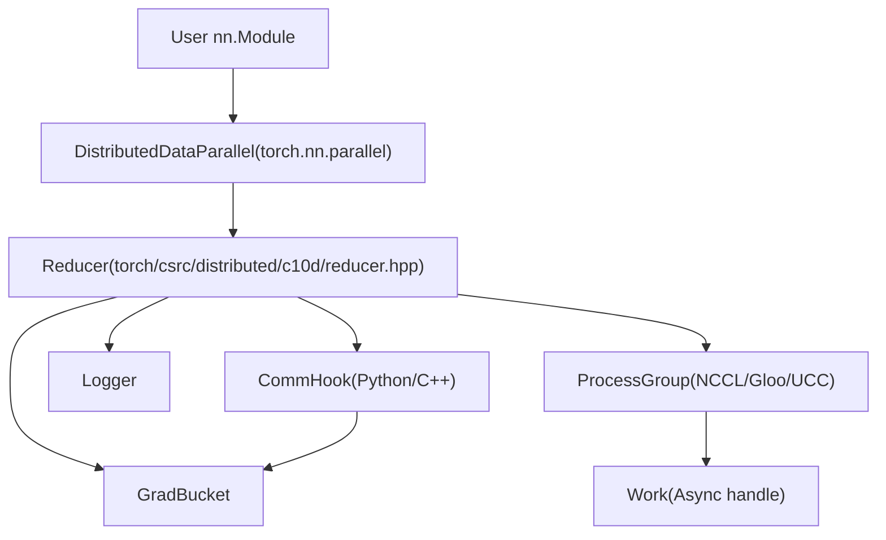
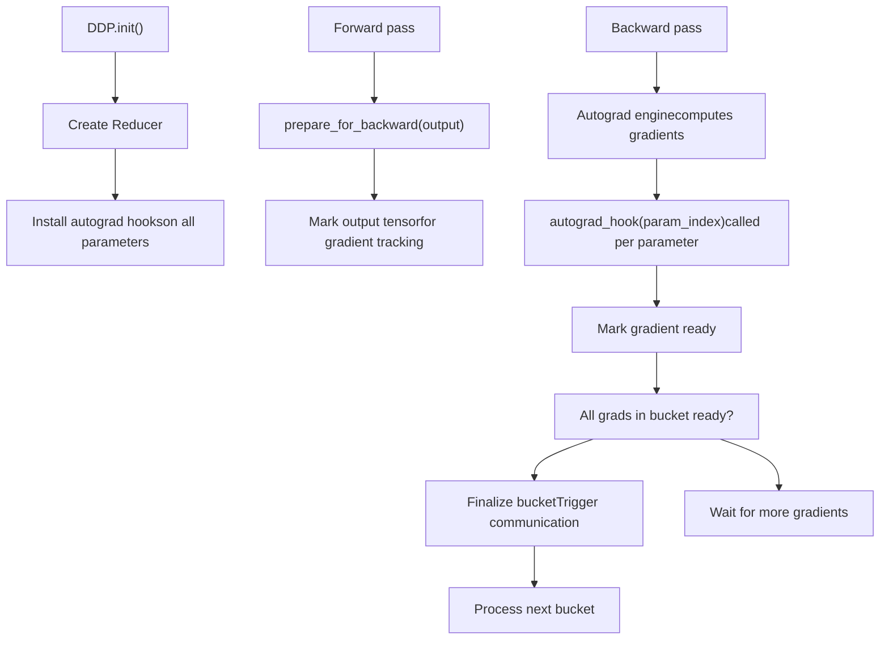
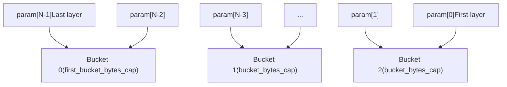
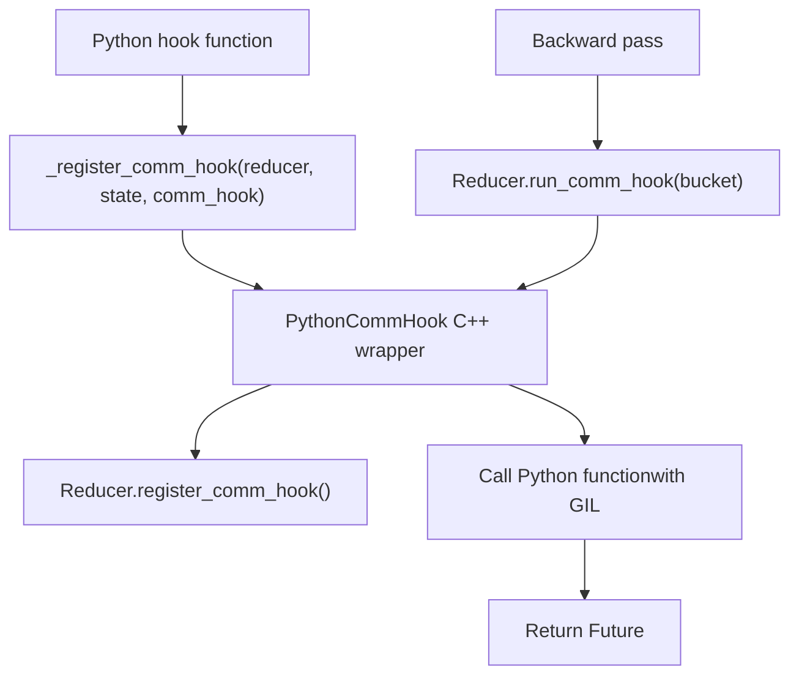
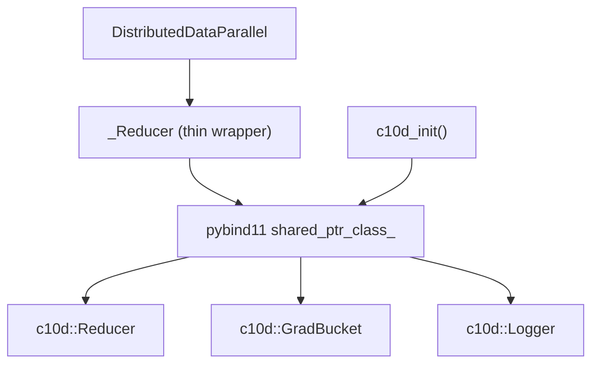

# Reducer and DistributedDataParallel

Relevant source files

-   [build\_variables.bzl](https://github.com/pytorch/pytorch/blob/915982a4/build_variables.bzl)
-   [caffe2/CMakeLists.txt](https://github.com/pytorch/pytorch/blob/915982a4/caffe2/CMakeLists.txt)
-   [docs/source/distributed.md](https://github.com/pytorch/pytorch/blob/915982a4/docs/source/distributed.md)
-   [test/distributed/test\_c10d\_nccl.py](https://github.com/pytorch/pytorch/blob/915982a4/test/distributed/test_c10d_nccl.py)
-   [test/distributed/test\_nccl.py](https://github.com/pytorch/pytorch/blob/915982a4/test/distributed/test_nccl.py)
-   [test/distributed/test\_nvshmem.py](https://github.com/pytorch/pytorch/blob/915982a4/test/distributed/test_nvshmem.py)
-   [test/jit/test\_autodiff\_subgraph\_slicing.py](https://github.com/pytorch/pytorch/blob/915982a4/test/jit/test_autodiff_subgraph_slicing.py)
-   [test/test\_jit.py](https://github.com/pytorch/pytorch/blob/915982a4/test/test_jit.py)
-   [test/test\_jit\_autocast.py](https://github.com/pytorch/pytorch/blob/915982a4/test/test_jit_autocast.py)
-   [test/test\_jit\_fuser.py](https://github.com/pytorch/pytorch/blob/915982a4/test/test_jit_fuser.py)
-   [test/test\_jit\_fuser\_legacy.py](https://github.com/pytorch/pytorch/blob/915982a4/test/test_jit_fuser_legacy.py)
-   [test/test\_jit\_fuser\_te.py](https://github.com/pytorch/pytorch/blob/915982a4/test/test_jit_fuser_te.py)
-   [test/test\_jit\_legacy.py](https://github.com/pytorch/pytorch/blob/915982a4/test/test_jit_legacy.py)
-   [torch/\_C/\_distributed\_c10d.pyi](https://github.com/pytorch/pytorch/blob/915982a4/torch/_C/_distributed_c10d.pyi)
-   [torch/csrc/distributed/c10d/Backend.hpp](https://github.com/pytorch/pytorch/blob/915982a4/torch/csrc/distributed/c10d/Backend.hpp)
-   [torch/csrc/distributed/c10d/NCCLUtils.cpp](https://github.com/pytorch/pytorch/blob/915982a4/torch/csrc/distributed/c10d/NCCLUtils.cpp)
-   [torch/csrc/distributed/c10d/NCCLUtils.hpp](https://github.com/pytorch/pytorch/blob/915982a4/torch/csrc/distributed/c10d/NCCLUtils.hpp)
-   [torch/csrc/distributed/c10d/ProcessGroupNCCL.cpp](https://github.com/pytorch/pytorch/blob/915982a4/torch/csrc/distributed/c10d/ProcessGroupNCCL.cpp)
-   [torch/csrc/distributed/c10d/ProcessGroupNCCL.hpp](https://github.com/pytorch/pytorch/blob/915982a4/torch/csrc/distributed/c10d/ProcessGroupNCCL.hpp)
-   [torch/csrc/distributed/c10d/init.cpp](https://github.com/pytorch/pytorch/blob/915982a4/torch/csrc/distributed/c10d/init.cpp)
-   [torch/csrc/distributed/c10d/symm\_mem/CUDASymmetricMemory.cu](https://github.com/pytorch/pytorch/blob/915982a4/torch/csrc/distributed/c10d/symm_mem/CUDASymmetricMemory.cu)
-   [torch/csrc/distributed/c10d/symm\_mem/CUDASymmetricMemory.hpp](https://github.com/pytorch/pytorch/blob/915982a4/torch/csrc/distributed/c10d/symm_mem/CUDASymmetricMemory.hpp)
-   [torch/csrc/distributed/c10d/symm\_mem/NCCLSymmetricMemory.cu](https://github.com/pytorch/pytorch/blob/915982a4/torch/csrc/distributed/c10d/symm_mem/NCCLSymmetricMemory.cu)
-   [torch/csrc/distributed/c10d/symm\_mem/NCCLSymmetricMemory.hpp](https://github.com/pytorch/pytorch/blob/915982a4/torch/csrc/distributed/c10d/symm_mem/NCCLSymmetricMemory.hpp)
-   [torch/csrc/distributed/c10d/symm\_mem/SymmetricMemory.cpp](https://github.com/pytorch/pytorch/blob/915982a4/torch/csrc/distributed/c10d/symm_mem/SymmetricMemory.cpp)
-   [torch/csrc/distributed/c10d/symm\_mem/SymmetricMemory.hpp](https://github.com/pytorch/pytorch/blob/915982a4/torch/csrc/distributed/c10d/symm_mem/SymmetricMemory.hpp)
-   [torch/csrc/distributed/c10d/symm\_mem/nccl\_extension.cu](https://github.com/pytorch/pytorch/blob/915982a4/torch/csrc/distributed/c10d/symm_mem/nccl_extension.cu)
-   [torch/csrc/distributed/c10d/symm\_mem/nvshmem\_extension.cu](https://github.com/pytorch/pytorch/blob/915982a4/torch/csrc/distributed/c10d/symm_mem/nvshmem_extension.cu)
-   [torch/csrc/distributed/c10d/symm\_mem/nvshmem\_team\_manager.hpp](https://github.com/pytorch/pytorch/blob/915982a4/torch/csrc/distributed/c10d/symm_mem/nvshmem_team_manager.hpp)
-   [torch/distributed/\_symmetric\_memory/\_\_init\_\_.py](https://github.com/pytorch/pytorch/blob/915982a4/torch/distributed/_symmetric_memory/__init__.py)
-   [torch/distributed/distributed\_c10d.py](https://github.com/pytorch/pytorch/blob/915982a4/torch/distributed/distributed_c10d.py)
-   [torch/testing/\_internal/common\_distributed.py](https://github.com/pytorch/pytorch/blob/915982a4/torch/testing/_internal/common_distributed.py)
-   [torch/testing/\_internal/common\_fsdp.py](https://github.com/pytorch/pytorch/blob/915982a4/torch/testing/_internal/common_fsdp.py)
-   [torch/testing/\_internal/common\_nn.py](https://github.com/pytorch/pytorch/blob/915982a4/torch/testing/_internal/common_nn.py)
-   [torch/testing/\_internal/common\_utils.py](https://github.com/pytorch/pytorch/blob/915982a4/torch/testing/_internal/common_utils.py)
-   [torch/testing/\_internal/distributed/distributed\_test.py](https://github.com/pytorch/pytorch/blob/915982a4/torch/testing/_internal/distributed/distributed_test.py)

## Purpose and Scope

This document describes the **Reducer** class and its role in **DistributedDataParallel (DDP)** training. The Reducer manages gradient synchronization across processes by bucketing gradients, registering autograd hooks, and coordinating all-reduce operations through ProcessGroup backends.

For information about:

-   **ProcessGroup backends** (NCCL, Gloo, UCC), see [4.1.1](/pytorch/pytorch/4.1.1-processgroup-backends)
-   **DTensor-based distributed training**, see [4.2](/pytorch/pytorch/4.2-dtensor:-distributed-tensor-abstraction)
-   **Symmetric memory communication primitives**, see [4.3](/pytorch/pytorch/4.3-symmetric-memory-for-high-performance-communication)

---

## Overview

DistributedDataParallel (DDP) is PyTorch's data-parallel training wrapper that replicates a model across multiple processes and synchronizes gradients during backpropagation. The **Reducer** is the core C++ component responsible for:

1.  **Gradient bucketing**: Grouping model parameters into buckets for efficient communication
2.  **Autograd hook management**: Installing hooks to intercept gradient computation
3.  **Communication orchestration**: Triggering all-reduce operations on gradient buckets
4.  **Optimization features**: Supporting gradient-as-bucket-view, find-unused-parameters, and static graphs

**Architecture Positioning**:


**Sources**: [torch/csrc/distributed/c10d/init.cpp562-740](https://github.com/pytorch/pytorch/blob/915982a4/torch/csrc/distributed/c10d/init.cpp#L562-L740) High-level architecture diagram

---

## Core Components

### Reducer Class

The `Reducer` class is instantiated by the Python `DistributedDataParallel` wrapper and manages the entire gradient synchronization lifecycle.

**Constructor Signature**:


**Key Parameters**:

-   `params`: List of model parameters to synchronize
-   `bucket_indices`: Pre-computed grouping of parameter indices into buckets
-   `process_group`: Backend for collective communication
-   `bucket_bytes_cap`: Maximum size of each bucket (default: 25 MB)
-   `find_unused_parameters`: Whether to detect and skip unused parameters
-   `gradient_as_bucket_view`: Optimization to avoid gradient copies
-   `first_bucket_bytes_cap`: Size limit for the first bucket (typically larger)

**Sources**: [torch/csrc/distributed/c10d/init.cpp562-609](https://github.com/pytorch/pytorch/blob/915982a4/torch/csrc/distributed/c10d/init.cpp#L562-L609) [torch/\_C/\_distributed\_c10d.pyi42-80](https://github.com/pytorch/pytorch/blob/915982a4/torch/_C/_distributed_c10d.pyi#L42-L80)

---

### GradBucket

`GradBucket` encapsulates a collection of gradients that will be all-reduced together. It provides both a flattened buffer view and access to individual per-parameter gradients.

**API**:

| Method | Return Type | Description |
| --- | --- | --- |
| `index()` | `int` | Bucket index (0 = last bucket in backward order) |
| `buffer()` | `Tensor` | Flattened 1D tensor containing all gradients |
| `gradients()` | `list[Tensor]` | List of per-parameter gradient tensors |
| `parameters()` | `list[Tensor]` | List of corresponding model parameters |
| `is_last()` | `bool` | True if this is the last bucket to synchronize |
| `set_buffer(tensor)` | `None` | Replace the gradient buffer (for custom processing) |

**Bucket Ordering**: Buckets are indexed in reverse order of gradient readiness. Bucket 0 corresponds to the **first layers** in the forward pass (last to compute gradients), ensuring communication overlaps with computation.

**Sources**: [torch/csrc/distributed/c10d/init.cpp490-555](https://github.com/pytorch/pytorch/blob/915982a4/torch/csrc/distributed/c10d/init.cpp#L490-L555) [torch/\_C/\_distributed\_c10d.pyi34-40](https://github.com/pytorch/pytorch/blob/915982a4/torch/_C/_distributed_c10d.pyi#L34-L40)

---

### ProcessGroup Integration

The Reducer delegates all collective operations to a `ProcessGroup` backend:

> **[Mermaid sequence]**
> *(图表结构无法解析)*

**Sources**: [torch/csrc/distributed/c10d/init.cpp692-707](https://github.com/pytorch/pytorch/blob/915982a4/torch/csrc/distributed/c10d/init.cpp#L692-L707)

---

## Gradient Synchronization Pipeline

### Forward Pass Preparation

Before each forward pass, `prepare_for_forward()` resets internal state:

1.  Clears gradient ready counters
2.  Resets bucket indices
3.  Prepares unused parameter tracking (if enabled)

**Sources**: [torch/csrc/distributed/c10d/init.cpp611-613](https://github.com/pytorch/pytorch/blob/915982a4/torch/csrc/distributed/c10d/init.cpp#L611-L613)

---

### Backward Pass and Autograd Hooks

The Reducer installs autograd hooks on each parameter to intercept gradient computation:

**Hook Registration Flow**:


**Key Methods**:

-   `prepare_for_backward(output)`: Called after forward, registers output tensor for gradient tracking
-   `autograd_hook(index)`: Called when gradient for parameter at `index` is computed

**Sources**: [torch/csrc/distributed/c10d/init.cpp614-623](https://github.com/pytorch/pytorch/blob/915982a4/torch/csrc/distributed/c10d/init.cpp#L614-L623) [torch/csrc/distributed/c10d/init.cpp710-714](https://github.com/pytorch/pytorch/blob/915982a4/torch/csrc/distributed/c10d/init.cpp#L710-L714)

---

### Bucketing Strategy

Gradients are grouped into buckets to amortize communication overhead:

**Bucket Construction**:


**Configuration**:

-   `bucket_bytes_cap`: Default 25 MB per bucket
-   `first_bucket_bytes_cap`: Default 1 MB (smaller to start communication early)
-   `bucket_indices`: Pre-computed during DDP initialization
-   `bucket_bytes_cap_list`: Per-bucket size limits (advanced use)

**Dynamic Rebuilding**: After the first iteration, buckets may be rebuilt based on actual gradient arrival order using `_rebuild_buckets()`.

**Sources**: [torch/csrc/distributed/c10d/init.cpp596-607](https://github.com/pytorch/pytorch/blob/915982a4/torch/csrc/distributed/c10d/init.cpp#L596-L607) [torch/csrc/distributed/c10d/init.cpp639-641](https://github.com/pytorch/pytorch/blob/915982a4/torch/csrc/distributed/c10d/init.cpp#L639-L641)

---

### All-Reduce Operations

When all gradients in a bucket are ready, the Reducer triggers an all-reduce:

**All-Reduce Pipeline**:

> **[Mermaid sequence]**
> *(图表结构无法解析)*

**Sources**: [torch/csrc/distributed/c10d/init.cpp692-707](https://github.com/pytorch/pytorch/blob/915982a4/torch/csrc/distributed/c10d/init.cpp#L692-L707) [torch/csrc/distributed/c10d/init.cpp700-707](https://github.com/pytorch/pytorch/blob/915982a4/torch/csrc/distributed/c10d/init.cpp#L700-L707)

---

## Communication Hooks

Communication hooks allow customization of gradient processing and communication patterns.

### Built-in Hooks

**`BuiltinCommHookType`** enum:

| Hook | Behavior |
| --- | --- |
| `ALLREDUCE` | Standard all-reduce with averaging |
| `FP16_COMPRESS` | Compress gradients to FP16 before all-reduce, then decompress |

**Registration**:

```
# Python APIfrom torch.distributed.algorithms.ddp_comm_hooks import default_hooksddp_model._register_builtin_comm_hook(    torch.distributed.algorithms.ddp_comm_hooks.BuiltinCommHookType.FP16_COMPRESS)
```
**Sources**: [torch/csrc/distributed/c10d/init.cpp557-560](https://github.com/pytorch/pytorch/blob/915982a4/torch/csrc/distributed/c10d/init.cpp#L557-L560) [torch/csrc/distributed/c10d/init.cpp392-396](https://github.com/pytorch/pytorch/blob/915982a4/torch/csrc/distributed/c10d/init.cpp#L392-L396)

---

### Custom Python Hooks

Users can register custom Python functions to process gradients:

**Hook Signature**:

```
def my_hook(state: Any, bucket: torch.distributed.GradBucket) -> torch.futures.Future:    # Process bucket.buffer() or bucket.gradients()    # Return a Future that resolves to the processed tensor    pass
```
**Registration via C++**:


**Sources**: [torch/csrc/distributed/c10d/init.cpp381-387](https://github.com/pytorch/pytorch/blob/915982a4/torch/csrc/distributed/c10d/init.cpp#L381-L387)

---

## Advanced Features

### Static Graph Optimization

When the computation graph is static across iterations, DDP can skip certain bookkeeping:

**API**:

-   `_set_static_graph()`: Enable static graph mode
-   `_ddp_graph_static()`: Query if static graph is active

**Benefits**:

-   Skips unused parameter detection after first iteration
-   Avoids bucket rebuilding
-   Reduces overhead for models with consistent execution paths

**Sources**: [torch/csrc/distributed/c10d/init.cpp680-686](https://github.com/pytorch/pytorch/blob/915982a4/torch/csrc/distributed/c10d/init.cpp#L680-L686)

---

### Find Unused Parameters

Detects parameters that don't contribute to loss and skips their synchronization:

**Mechanism**:

1.  Tracks which parameters receive gradients during backward
2.  Builds a local used map tensor
3.  All-reduces the used map to detect globally unused parameters
4.  Skips all-reduce for unused parameters (or errors if `skip_all_reduce_unused_params=False`)

**API**:

-   Constructor flag: `find_unused_parameters=True`
-   `_get_local_used_map()`: Returns per-parameter usage bitmap

**Sources**: [torch/csrc/distributed/c10d/init.cpp571-576](https://github.com/pytorch/pytorch/blob/915982a4/torch/csrc/distributed/c10d/init.cpp#L571-L576) [torch/csrc/distributed/c10d/init.cpp672-673](https://github.com/pytorch/pytorch/blob/915982a4/torch/csrc/distributed/c10d/init.cpp#L672-L673)

---

### Gradient as Bucket View

Optimization to avoid copying gradients into bucket buffers:

**Without optimization**:

```
Parameter.grad → [Copy] → Bucket buffer → All-reduce → [Copy back] → Parameter.grad
```
**With `gradient_as_bucket_view=True`**:

```
Parameter.grad = View into bucket buffer → All-reduce in-place
```
**Trade-offs**:

-   **Pro**: Eliminates two copies per parameter per iteration
-   **Con**: Parameters share storage with buckets, which may complicate debugging

**Sources**: [torch/csrc/distributed/c10d/init.cpp572-576](https://github.com/pytorch/pytorch/blob/915982a4/torch/csrc/distributed/c10d/init.cpp#L572-L576)

---

### Mixed Precision Support

**API**: `_set_mixed_precision_param_dtype(dtype)`

Configures the Reducer to handle parameters at a specified dtype (e.g., `torch.float16`) while performing reductions at a higher precision if needed.

**Sources**: [torch/csrc/distributed/c10d/init.cpp657-663](https://github.com/pytorch/pytorch/blob/915982a4/torch/csrc/distributed/c10d/init.cpp#L657-L663)

---

## Logging and Debugging

### Logger Class

The `Logger` tracks DDP construction and runtime statistics:

**Logged Data**:


**Construction Data**:

-   Module name
-   Device IDs
-   Output device
-   Broadcast buffers setting
-   SyncBatchNorm usage
-   Static graph mode

**Runtime Stats**:

-   Gradient bucket information
-   Unused parameter statistics
-   Communication hook details

**Sources**: [torch/csrc/distributed/c10d/init.cpp742-788](https://github.com/pytorch/pytorch/blob/915982a4/torch/csrc/distributed/c10d/init.cpp#L742-L788) [torch/\_C/\_distributed\_c10d.pyi82-102](https://github.com/pytorch/pytorch/blob/915982a4/torch/_C/_distributed_c10d.pyi#L82-L102)

---

### Debug Levels

The `DebugLevel` enum controls distributed debugging verbosity:

| Level | Description |
| --- | --- |
| `OFF` | No debug output |
| `INFO` | Basic synchronization info |
| `DETAIL` | Detailed gradient sync and bucket info |

**API**:

```
import torch.distributed as distdist.set_debug_level(dist.DebugLevel.DETAIL)
```
**Sources**: [torch/csrc/distributed/c10d/init.cpp790-808](https://github.com/pytorch/pytorch/blob/915982a4/torch/csrc/distributed/c10d/init.cpp#L790-L808)

---

## Integration with Python

### Python Bindings

The C++ Reducer is exposed to Python via pybind11:

**Binding Structure**:


**Module Registration**: The `c10d_init()` function creates a submodule `torch._C._distributed_c10d` containing all distributed primitives.

**Sources**: [torch/csrc/distributed/c10d/init.cpp457-488](https://github.com/pytorch/pytorch/blob/915982a4/torch/csrc/distributed/c10d/init.cpp#L457-L488) [torch/csrc/distributed/c10d/init.cpp562-740](https://github.com/pytorch/pytorch/blob/915982a4/torch/csrc/distributed/c10d/init.cpp#L562-L740)

---

### DistributedDataParallel Wrapper

The Python `DistributedDataParallel` class wraps the Reducer and provides the `nn.Module` interface:

**Responsibilities**:

1.  **Initialization**: Creates Reducer with computed bucket indices
2.  **Broadcast**: Synchronizes initial parameters across processes
3.  **Hook Management**: Installs hooks for gradient synchronization
4.  **Buffer Synchronization**: Broadcasts buffers (e.g., BatchNorm stats) if enabled
5.  **Joining**: Handles uneven inputs across processes

**Typical Usage**:

```
import torchimport torch.distributed as distimport torch.nn as nn # Initialize process groupdist.init_process_group(backend='nccl') model = nn.Linear(10, 10).cuda()ddp_model = nn.parallel.DistributedDataParallel(    model,    device_ids=[torch.cuda.current_device()],    bucket_cap_mb=25,    find_unused_parameters=False,    gradient_as_bucket_view=True) # Training loopfor data, target in dataloader:    output = ddp_model(data)    loss = criterion(output, target)    loss.backward()  # Reducer intercepts gradients here    optimizer.step()
```
**Sources**: Python implementation not provided in files, but referenced by [torch/csrc/distributed/c10d/init.cpp562-740](https://github.com/pytorch/pytorch/blob/915982a4/torch/csrc/distributed/c10d/init.cpp#L562-L740)

---

## Summary Table: Key Classes and Methods

| Class | Key Methods | Purpose |
| --- | --- | --- |
| `Reducer` | `prepare_for_forward()`, `prepare_for_backward()`, `autograd_hook()`, `run_comm_hook()` | Orchestrates gradient synchronization |
| `GradBucket` | `buffer()`, `gradients()`, `is_last()`, `set_buffer()` | Encapsulates bucket of gradients |
| `Logger` | `set_construction_data_and_log()`, `set_runtime_stats_and_log()` | Tracks DDP metrics |
| `PythonCommHook` | `runHook()` | Wraps custom Python gradient processing |
| `ProcessGroup` | `allreduce()`, `broadcast()` | Backend for collective operations |

**Sources**: [torch/csrc/distributed/c10d/init.cpp490-788](https://github.com/pytorch/pytorch/blob/915982a4/torch/csrc/distributed/c10d/init.cpp#L490-L788) [torch/\_C/\_distributed\_c10d.pyi22-102](https://github.com/pytorch/pytorch/blob/915982a4/torch/_C/_distributed_c10d.pyi#L22-L102)
