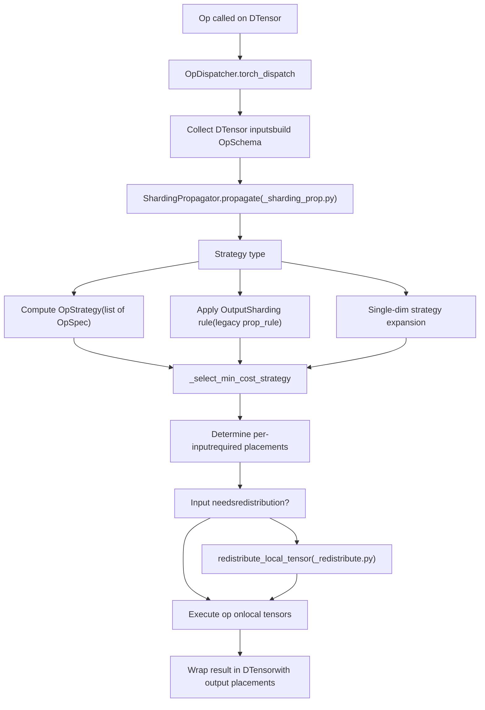
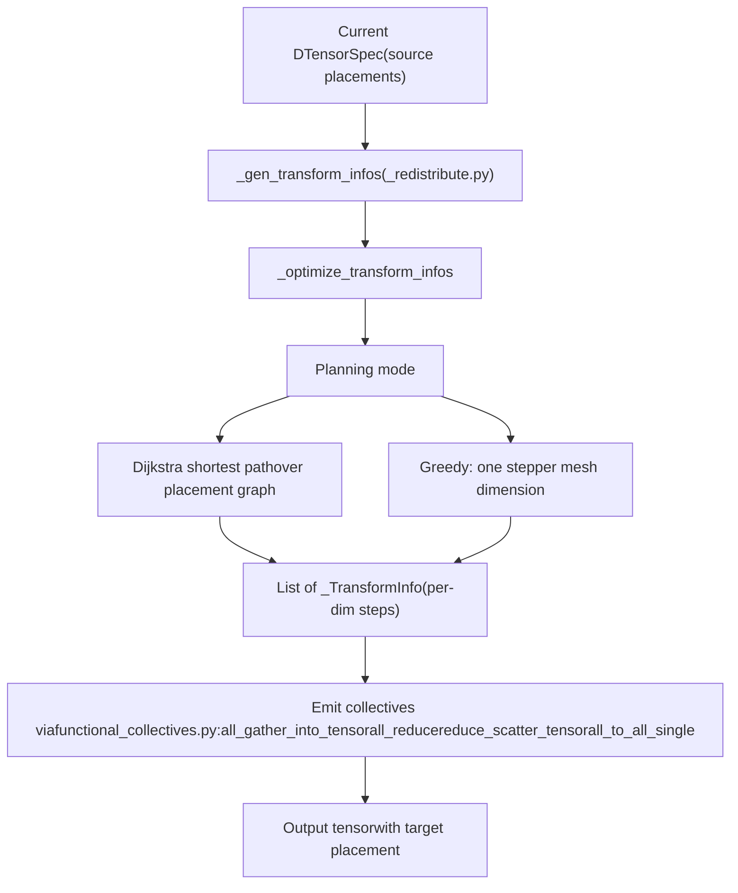

# DTensor: Distributed Tensor Abstraction

Relevant source files

-   [test/distributed/\_pycute/test\_coalesce.py](https://github.com/pytorch/pytorch/blob/915982a4/test/distributed/_pycute/test_coalesce.py)
-   [test/distributed/\_pycute/test\_complement.py](https://github.com/pytorch/pytorch/blob/915982a4/test/distributed/_pycute/test_complement.py)
-   [test/distributed/\_pycute/test\_composition.py](https://github.com/pytorch/pytorch/blob/915982a4/test/distributed/_pycute/test_composition.py)
-   [test/distributed/\_pycute/test\_int\_tuple.py](https://github.com/pytorch/pytorch/blob/915982a4/test/distributed/_pycute/test_int_tuple.py)
-   [test/distributed/\_pycute/test\_left\_inverse.py](https://github.com/pytorch/pytorch/blob/915982a4/test/distributed/_pycute/test_left_inverse.py)
-   [test/distributed/\_pycute/test\_right\_inverse.py](https://github.com/pytorch/pytorch/blob/915982a4/test/distributed/_pycute/test_right_inverse.py)
-   [test/distributed/\_pycute/test\_typing.py](https://github.com/pytorch/pytorch/blob/915982a4/test/distributed/_pycute/test_typing.py)
-   [test/distributed/tensor/debug/test\_debug\_mode.py](https://github.com/pytorch/pytorch/blob/915982a4/test/distributed/tensor/debug/test_debug_mode.py)
-   [test/distributed/tensor/experimental/test\_register\_sharding.py](https://github.com/pytorch/pytorch/blob/915982a4/test/distributed/tensor/experimental/test_register_sharding.py)
-   [test/distributed/tensor/test\_decompositions.py](https://github.com/pytorch/pytorch/blob/915982a4/test/distributed/tensor/test_decompositions.py)
-   [test/distributed/tensor/test\_dtensor.py](https://github.com/pytorch/pytorch/blob/915982a4/test/distributed/tensor/test_dtensor.py)
-   [test/distributed/tensor/test\_dtensor\_compile.py](https://github.com/pytorch/pytorch/blob/915982a4/test/distributed/tensor/test_dtensor_compile.py)
-   [test/distributed/tensor/test\_dtensor\_dispatch\_overhead.py](https://github.com/pytorch/pytorch/blob/915982a4/test/distributed/tensor/test_dtensor_dispatch_overhead.py)
-   [test/distributed/tensor/test\_dtensor\_ops.py](https://github.com/pytorch/pytorch/blob/915982a4/test/distributed/tensor/test_dtensor_ops.py)
-   [test/distributed/tensor/test\_math\_ops.py](https://github.com/pytorch/pytorch/blob/915982a4/test/distributed/tensor/test_math_ops.py)
-   [test/distributed/tensor/test\_matrix\_ops.py](https://github.com/pytorch/pytorch/blob/915982a4/test/distributed/tensor/test_matrix_ops.py)
-   [test/distributed/tensor/test\_op\_strategy.py](https://github.com/pytorch/pytorch/blob/915982a4/test/distributed/tensor/test_op_strategy.py)
-   [test/distributed/tensor/test\_placement\_types.py](https://github.com/pytorch/pytorch/blob/915982a4/test/distributed/tensor/test_placement_types.py)
-   [test/distributed/tensor/test\_pointwise\_ops.py](https://github.com/pytorch/pytorch/blob/915982a4/test/distributed/tensor/test_pointwise_ops.py)
-   [test/distributed/tensor/test\_redistribute.py](https://github.com/pytorch/pytorch/blob/915982a4/test/distributed/tensor/test_redistribute.py)
-   [test/distributed/tensor/test\_single\_dim\_strategy.py](https://github.com/pytorch/pytorch/blob/915982a4/test/distributed/tensor/test_single_dim_strategy.py)
-   [test/distributed/tensor/test\_tensor\_ops.py](https://github.com/pytorch/pytorch/blob/915982a4/test/distributed/tensor/test_tensor_ops.py)
-   [test/distributed/tensor/test\_utils.py](https://github.com/pytorch/pytorch/blob/915982a4/test/distributed/tensor/test_utils.py)
-   [test/distributed/tensor/test\_view\_ops.py](https://github.com/pytorch/pytorch/blob/915982a4/test/distributed/tensor/test_view_ops.py)
-   [test/distributed/test\_device\_mesh.py](https://github.com/pytorch/pytorch/blob/915982a4/test/distributed/test_device_mesh.py)
-   [test/dynamo/test\_aot\_autograd\_cache.py](https://github.com/pytorch/pytorch/blob/915982a4/test/dynamo/test_aot_autograd_cache.py)
-   [torch/\_C/\_distributed.pyi](https://github.com/pytorch/pytorch/blob/915982a4/torch/_C/_distributed.pyi)
-   [torch/\_dynamo/backends/debugging.py](https://github.com/pytorch/pytorch/blob/915982a4/torch/_dynamo/backends/debugging.py)
-   [torch/\_dynamo/backends/distributed.py](https://github.com/pytorch/pytorch/blob/915982a4/torch/_dynamo/backends/distributed.py)
-   [torch/\_dynamo/variables/distributed.py](https://github.com/pytorch/pytorch/blob/915982a4/torch/_dynamo/variables/distributed.py)
-   [torch/\_functorch/\_aot\_autograd/autograd\_cache.py](https://github.com/pytorch/pytorch/blob/915982a4/torch/_functorch/_aot_autograd/autograd_cache.py)
-   [torch/\_inductor/runtime/benchmarking.py](https://github.com/pytorch/pytorch/blob/915982a4/torch/_inductor/runtime/benchmarking.py)
-   [torch/\_library/triton.py](https://github.com/pytorch/pytorch/blob/915982a4/torch/_library/triton.py)
-   [torch/\_meta\_registrations.py](https://github.com/pytorch/pytorch/blob/915982a4/torch/_meta_registrations.py)
-   [torch/csrc/distributed/Placement.h](https://github.com/pytorch/pytorch/blob/915982a4/torch/csrc/distributed/Placement.h)
-   [torch/csrc/distributed/python\_placement.cpp](https://github.com/pytorch/pytorch/blob/915982a4/torch/csrc/distributed/python_placement.cpp)
-   [torch/csrc/distributed/python\_placement.h](https://github.com/pytorch/pytorch/blob/915982a4/torch/csrc/distributed/python_placement.h)
-   [torch/csrc/dynamo/guards.h](https://github.com/pytorch/pytorch/blob/915982a4/torch/csrc/dynamo/guards.h)
-   [torch/distributed/\_composable/checkpoint\_activation.py](https://github.com/pytorch/pytorch/blob/915982a4/torch/distributed/_composable/checkpoint_activation.py)
-   [torch/distributed/\_composable/replicate.py](https://github.com/pytorch/pytorch/blob/915982a4/torch/distributed/_composable/replicate.py)
-   [torch/distributed/\_functional\_collectives.py](https://github.com/pytorch/pytorch/blob/915982a4/torch/distributed/_functional_collectives.py)
-   [torch/distributed/\_local\_tensor/\_\_init\_\_.py](https://github.com/pytorch/pytorch/blob/915982a4/torch/distributed/_local_tensor/__init__.py)
-   [torch/distributed/\_local\_tensor/\_c10d.py](https://github.com/pytorch/pytorch/blob/915982a4/torch/distributed/_local_tensor/_c10d.py)
-   [torch/distributed/\_mesh\_layout.py](https://github.com/pytorch/pytorch/blob/915982a4/torch/distributed/_mesh_layout.py)
-   [torch/distributed/\_ops/device\_mesh.py](https://github.com/pytorch/pytorch/blob/915982a4/torch/distributed/_ops/device_mesh.py)
-   [torch/distributed/\_pycute/\_\_init\_\_.py](https://github.com/pytorch/pytorch/blob/915982a4/torch/distributed/_pycute/__init__.py)
-   [torch/distributed/\_pycute/int\_tuple.py](https://github.com/pytorch/pytorch/blob/915982a4/torch/distributed/_pycute/int_tuple.py)
-   [torch/distributed/\_pycute/layout.py](https://github.com/pytorch/pytorch/blob/915982a4/torch/distributed/_pycute/layout.py)
-   [torch/distributed/\_pycute/typing.py](https://github.com/pytorch/pytorch/blob/915982a4/torch/distributed/_pycute/typing.py)
-   [torch/distributed/device\_mesh.py](https://github.com/pytorch/pytorch/blob/915982a4/torch/distributed/device_mesh.py)
-   [torch/distributed/optim/zero\_redundancy\_optimizer.py](https://github.com/pytorch/pytorch/blob/915982a4/torch/distributed/optim/zero_redundancy_optimizer.py)
-   [torch/distributed/tensor/README.md](https://github.com/pytorch/pytorch/blob/915982a4/torch/distributed/tensor/README.md)
-   [torch/distributed/tensor/\_api.py](https://github.com/pytorch/pytorch/blob/915982a4/torch/distributed/tensor/_api.py)
-   [torch/distributed/tensor/\_collective\_utils.py](https://github.com/pytorch/pytorch/blob/915982a4/torch/distributed/tensor/_collective_utils.py)
-   [torch/distributed/tensor/\_decompositions.py](https://github.com/pytorch/pytorch/blob/915982a4/torch/distributed/tensor/_decompositions.py)
-   [torch/distributed/tensor/\_dtensor\_spec.py](https://github.com/pytorch/pytorch/blob/915982a4/torch/distributed/tensor/_dtensor_spec.py)
-   [torch/distributed/tensor/\_nonlinear\_redux.py](https://github.com/pytorch/pytorch/blob/915982a4/torch/distributed/tensor/_nonlinear_redux.py)
-   [torch/distributed/tensor/\_op\_schema.py](https://github.com/pytorch/pytorch/blob/915982a4/torch/distributed/tensor/_op_schema.py)
-   [torch/distributed/tensor/\_ops/\_conv\_ops.py](https://github.com/pytorch/pytorch/blob/915982a4/torch/distributed/tensor/_ops/_conv_ops.py)
-   [torch/distributed/tensor/\_ops/\_embedding\_ops.py](https://github.com/pytorch/pytorch/blob/915982a4/torch/distributed/tensor/_ops/_embedding_ops.py)
-   [torch/distributed/tensor/\_ops/\_math\_ops.py](https://github.com/pytorch/pytorch/blob/915982a4/torch/distributed/tensor/_ops/_math_ops.py)
-   [torch/distributed/tensor/\_ops/\_matrix\_ops.py](https://github.com/pytorch/pytorch/blob/915982a4/torch/distributed/tensor/_ops/_matrix_ops.py)
-   [torch/distributed/tensor/\_ops/\_pointwise\_ops.py](https://github.com/pytorch/pytorch/blob/915982a4/torch/distributed/tensor/_ops/_pointwise_ops.py)
-   [torch/distributed/tensor/\_ops/\_random\_ops.py](https://github.com/pytorch/pytorch/blob/915982a4/torch/distributed/tensor/_ops/_random_ops.py)
-   [torch/distributed/tensor/\_ops/\_tensor\_ops.py](https://github.com/pytorch/pytorch/blob/915982a4/torch/distributed/tensor/_ops/_tensor_ops.py)
-   [torch/distributed/tensor/\_ops/\_view\_ops.py](https://github.com/pytorch/pytorch/blob/915982a4/torch/distributed/tensor/_ops/_view_ops.py)
-   [torch/distributed/tensor/\_ops/single\_dim\_strategy.py](https://github.com/pytorch/pytorch/blob/915982a4/torch/distributed/tensor/_ops/single_dim_strategy.py)
-   [torch/distributed/tensor/\_ops/utils.py](https://github.com/pytorch/pytorch/blob/915982a4/torch/distributed/tensor/_ops/utils.py)
-   [torch/distributed/tensor/\_redistribute.py](https://github.com/pytorch/pytorch/blob/915982a4/torch/distributed/tensor/_redistribute.py)
-   [torch/distributed/tensor/\_sharding\_prop.py](https://github.com/pytorch/pytorch/blob/915982a4/torch/distributed/tensor/_sharding_prop.py)
-   [torch/distributed/tensor/\_utils.py](https://github.com/pytorch/pytorch/blob/915982a4/torch/distributed/tensor/_utils.py)
-   [torch/distributed/tensor/debug/\_\_init\_\_.py](https://github.com/pytorch/pytorch/blob/915982a4/torch/distributed/tensor/debug/__init__.py)
-   [torch/distributed/tensor/examples/comm\_mode\_features\_example.py](https://github.com/pytorch/pytorch/blob/915982a4/torch/distributed/tensor/examples/comm_mode_features_example.py)
-   [torch/distributed/tensor/examples/flex\_attention\_cp.py](https://github.com/pytorch/pytorch/blob/915982a4/torch/distributed/tensor/examples/flex_attention_cp.py)
-   [torch/distributed/tensor/examples/torchrec\_sharding\_example.py](https://github.com/pytorch/pytorch/blob/915982a4/torch/distributed/tensor/examples/torchrec_sharding_example.py)
-   [torch/distributed/tensor/examples/visualize\_sharding\_example.py](https://github.com/pytorch/pytorch/blob/915982a4/torch/distributed/tensor/examples/visualize_sharding_example.py)
-   [torch/distributed/tensor/placement\_types.py](https://github.com/pytorch/pytorch/blob/915982a4/torch/distributed/tensor/placement_types.py)
-   [torch/testing/\_internal/common\_ops\_unbacked.py](https://github.com/pytorch/pytorch/blob/915982a4/torch/testing/_internal/common_ops_unbacked.py)
-   [torch/testing/\_internal/distributed/\_tensor/common\_dtensor.py](https://github.com/pytorch/pytorch/blob/915982a4/torch/testing/_internal/distributed/_tensor/common_dtensor.py)

## Purpose and Scope

This page gives a high-level overview of DTensor (`torch.distributed.tensor`), PyTorch's abstraction for expressing distributed tensor computation under the SPMD (Single Program Multiple Data) programming model. It covers how DTensors are created, how operator dispatch is wired together, how autograd interacts with distributed tensors, and how `torch.compile` integrates with this system.

Child pages cover individual subsystems in more depth:

-   For the `DTensor` class API and Placement types (`Shard`, `Replicate`, `Partial`, `_StridedShard`), see [4.2.1](/pytorch/pytorch/4.2.1-dtensor-architecture-and-placement-types)
-   For sharding propagation, `OpStrategy`, and `OpSpec`, see [4.2.2](/pytorch/pytorch/4.2.2-sharding-propagation-and-opstrategy)
-   For redistribution logic and communication planning, see [4.2.3](/pytorch/pytorch/4.2.3-redistribution-and-communication-planning)
-   For `DebugMode` and `CommDebugMode` observability tools, see [4.2.4](/pytorch/pytorch/4.2.4-debugmode-and-observability)
-   For `DeviceMesh`, `_MeshLayout`, and process group management, see [4.2.5](/pytorch/pytorch/4.2.5-devicemesh-and-device-topology)

For the underlying collective communication primitives (NCCL, Gloo, process groups), see [4.1](/pytorch/pytorch/4.1-c10d-collective-communication).

---

## SPMD Programming Model

DTensor implements the SPMD model: the same Python program runs on every rank simultaneously. Each rank holds a *local shard* of a globally-described tensor. Operators on DTensors execute locally on each shard, with communication automatically inserted when the operator requires data from other ranks.

This removes the need to manually scatter/gather tensors or insert `dist.all_reduce()` calls. The programmer annotates tensors with **placement specifications** — the system inserts collectives as needed.

---

## Core Abstractions at a Glance

**DTensor class hierarchy and principal components:**


Sources: [torch/distributed/tensor/\_api.py290-335](https://github.com/pytorch/pytorch/blob/915982a4/torch/distributed/tensor/_api.py#L290-L335) [torch/distributed/tensor/placement\_types.py47-63](https://github.com/pytorch/pytorch/blob/915982a4/torch/distributed/tensor/placement_types.py#L47-L63) [torch/distributed/device\_mesh.py151-210](https://github.com/pytorch/pytorch/blob/915982a4/torch/distributed/device_mesh.py#L151-L210)

---

## DTensor Lifecycle

### Creating DTensors

| API | Description | File |
| --- | --- | --- |
| `DTensor.from_local(local_tensor, mesh, placements)` | Wraps an existing per-rank local tensor | `_api.py` |
| `distribute_tensor(tensor, mesh, placements)` | Shards a global tensor across the mesh | `_api.py` |
| `distribute_module(module, mesh, ...)` | Converts a `nn.Module`'s parameters to DTensors | `_api.py` |
| `ones/zeros/rand/randn/empty/full(...)` | DTensor factory functions matching torch namespace | `_api.py` |

`from_local` is backed by the autograd function `_FromTorchTensor` [torch/distributed/tensor/\_api.py164-287](https://github.com/pytorch/pytorch/blob/915982a4/torch/distributed/tensor/_api.py#L164-L287) which computes the global shape from the local tensor and placements, optionally running a cross-rank shape check (`run_check=True` broadcasts from rank 0).

`distribute_tensor` shards a global tensor that the calling process holds in full. It calls `Shard._split_tensor` to extract the correct local shard for the current rank.

### Consuming DTensors

| API | Description |
| --- | --- |
| `dtensor.to_local()` | Returns the `_local_tensor` with autograd hookup via `_ToTorchTensor` |
| `dtensor.redistribute(mesh, placements)` | Changes the distribution, inserting collectives |
| `dtensor.full_tensor()` | Gathers all shards to a replicated tensor; returns the full tensor |

`to_local` is backed by `_ToTorchTensor` [torch/distributed/tensor/\_api.py96-161](https://github.com/pytorch/pytorch/blob/915982a4/torch/distributed/tensor/_api.py#L96-L161) Its backward wraps the incoming gradient back into a `DTensor` using the saved spec.

---

## Operator Dispatch Pipeline

When a PyTorch operator is called on a `DTensor`, it is intercepted through `__torch_dispatch__`. The `OpDispatcher` class [torch/distributed/tensor/\_dispatch.py](https://github.com/pytorch/pytorch/blob/915982a4/torch/distributed/tensor/_dispatch.py) orchestrates the full process:

**DTensor operator dispatch flow:**


Sources: [torch/distributed/tensor/\_sharding\_prop.py303-400](https://github.com/pytorch/pytorch/blob/915982a4/torch/distributed/tensor/_sharding_prop.py#L303-L400) [torch/distributed/tensor/\_redistribute.py1-50](https://github.com/pytorch/pytorch/blob/915982a4/torch/distributed/tensor/_redistribute.py#L1-L50)

### Strategy Registration

Two parallel registration patterns coexist:

1.  **`register_op_strategy`** — Registers a function `(OpSchema) -> OpStrategy` (or `TupleStrategy`). `OpStrategy` holds a list of `OpSpec` objects, each describing one valid `(input_placements, output_placements, redistribute_cost)` tuple. The propagator selects the cheapest one.

2.  **`register_prop_rule`** — Registers a legacy function `(OpSchema) -> OutputSharding`. Used for older ops.

3.  **`register_single_dim_strategy`** — Registers sharding rules in terms of per-dimension placement patterns; these are expanded to full mesh strategies by `_expand_single_dim_strategy_to_mesh`.


See [torch/distributed/tensor/\_ops/utils.py](https://github.com/pytorch/pytorch/blob/915982a4/torch/distributed/tensor/_ops/utils.py) for `register_op_strategy` and `register_prop_rule`.

Strategies are implemented per-category in:

| File | Category |
| --- | --- |
| `_ops/_pointwise_ops.py` | Elementwise ops via `pointwise_rule` |
| `_ops/_math_ops.py` | Reductions, norms, scatter/gather |
| `_ops/_tensor_ops.py` | Reshape, select, slice, etc. |
| `_ops/_matrix_ops.py` | Matrix multiplication, linear |
| `_ops/single_dim_strategy.py` | Single-dimension sharding patterns |

---

## Redistribution and Communication

When an operator's required input placement differs from the actual DTensor placement, `redistribute_local_tensor` is called [torch/distributed/tensor/\_redistribute.py](https://github.com/pytorch/pytorch/blob/915982a4/torch/distributed/tensor/_redistribute.py) It produces a plan consisting of one or more collective operations:

**Redistribution planning:**


Sources: [torch/distributed/tensor/\_redistribute.py1-100](https://github.com/pytorch/pytorch/blob/915982a4/torch/distributed/tensor/_redistribute.py#L1-L100) [torch/distributed/\_functional\_collectives.py](https://github.com/pytorch/pytorch/blob/915982a4/torch/distributed/_functional_collectives.py)

### Placement Transition Table

| From | To | Collective |
| --- | --- | --- |
| `Shard(d)` | `Replicate` | `all_gather_into_tensor` |
| `Replicate` | `Shard(d)` | local slice (no comm) |
| `Partial(sum)` | `Replicate` | `all_reduce` |
| `Partial(sum)` | `Shard(d)` | `reduce_scatter_tensor` |
| `Shard(d)` | `Shard(e)` | `shard_dim_alltoall` |

---

## Autograd Integration

DTensor participates in PyTorch's autograd engine through two `torch.autograd.Function` wrappers:

-   **`_FromTorchTensor`** [torch/distributed/tensor/\_api.py164-237](https://github.com/pytorch/pytorch/blob/915982a4/torch/distributed/tensor/_api.py#L164-L237) — Forward: constructs a `DTensor` from a local tensor. Backward: redistributes the incoming `DTensor` gradient to match the forward input's placement.

-   **`_ToTorchTensor`** [torch/distributed/tensor/\_api.py96-161](https://github.com/pytorch/pytorch/blob/915982a4/torch/distributed/tensor/_api.py#L96-L161) — Forward: returns the raw `_local_tensor`. Backward: wraps the incoming plain-tensor gradient back into a `DTensor` using the spec saved in `ctx`.


Gradient placements follow a convention: `Partial` forward placements produce `Replicate` gradient placements (because each rank only holds a partial contribution in the forward, so during backward the gradient is already the full-gradient for that rank).

---

## `torch.compile` Integration

DTensor is designed to work with `torch.compile`. The dispatch mechanism goes through `__torch_dispatch__`, which is transparent to TorchDynamo. Dynamo traces through DTensor operations and sees the underlying ATen ops plus collective calls.

Key integration points:

-   `DeviceMesh` process groups are lifted as inputs in the compiled graph via `_get_pg_from_name` [torch/distributed/device\_mesh.py74-92](https://github.com/pytorch/pytorch/blob/915982a4/torch/distributed/device_mesh.py#L74-L92) to avoid retracing when meshes change.
-   `FakeTensorMode` propagation is performed inside `ShardingPropagator._propagate_tensor_meta` using DTensorSpec's metadata, allowing shape propagation without real data.
-   The `_FromTorchTensor` and `_ToTorchTensor` autograd functions are exportable via `mark_subclass_constructor_exportable_experimental`.

---

## LocalTensorMode: Single-Process Simulation

`LocalTensorMode` [torch/distributed/\_local\_tensor/\_\_init\_\_.py](https://github.com/pytorch/pytorch/blob/915982a4/torch/distributed/_local_tensor/__init__.py) provides a mechanism to run the full DTensor dispatch stack (including collectives) on a single process. Each "shard" is held as an element in a list on rank 0. Collective operations are simulated by applying the mathematically equivalent local transformation.

This is used heavily in tests to run DTensor logic without spawning multiple processes. The `LocalTensor` subclass handles this simulation by intercepting dispatch and routing each operation to per-shard local tensors.

---

## Observability

| Tool | Location | Purpose |
| --- | --- | --- |
| `DebugMode` | `torch/utils/_debug_mode.py` | Records every `__torch_dispatch__` call in a hierarchical log, including redistribution steps |
| `CommDebugMode` | `torch/distributed/tensor/debug/__init__.py` | Counts and categorizes collective calls (all\_reduce, all\_gather, etc.) within a context |

`CommDebugMode` is the primary tool for auditing communication volume during model development. Example usage from tests [test/distributed/tensor/test\_redistribute.py90-103](https://github.com/pytorch/pytorch/blob/915982a4/test/distributed/tensor/test_redistribute.py#L90-L103):

```
comm_mode = CommDebugMode()with comm_mode:    reshard_dtensor = dtensor.redistribute(device_mesh, [Replicate()])comm_mode.get_comm_counts()[funcol.all_gather_into_tensor]  # == 1
```
See [4.2.4](/pytorch/pytorch/4.2.4-debugmode-and-observability) for more detail on both debug tools.

---

## Key File Index

| File | Role |
| --- | --- |
| `torch/distributed/tensor/_api.py` | `DTensor` class, `from_local`, `to_local`, `distribute_tensor`, `distribute_module` |
| `torch/distributed/tensor/placement_types.py` | `Shard`, `Replicate`, `Partial`, `_StridedShard` |
| `torch/distributed/device_mesh.py` | `DeviceMesh`, `init_device_mesh`, process group management |
| `torch/distributed/_mesh_layout.py` | `_MeshLayout` (CuTe-inspired layout algebra for internal bookkeeping) |
| `torch/distributed/tensor/_dtensor_spec.py` | `DTensorSpec`, `TensorMeta`, `ShardOrderEntry` |
| `torch/distributed/tensor/_sharding_prop.py` | `ShardingPropagator`, strategy selection |
| `torch/distributed/tensor/_op_schema.py` | `OpSchema`, `OpStrategy`, `OpSpec`, `TupleStrategy`, `OutputSharding` |
| `torch/distributed/tensor/_redistribute.py` | `redistribute_local_tensor`, `_TransformInfo`, Dijkstra/greedy planners |
| `torch/distributed/tensor/_dispatch.py` | `OpDispatcher` — `__torch_dispatch__` entry point |
| `torch/distributed/_functional_collectives.py` | Functional collective ops (`all_gather_into_tensor`, etc.) |
| `torch/distributed/_local_tensor/__init__.py` | `LocalTensor`, `LocalTensorMode` for single-process simulation |
| `torch/distributed/tensor/_ops/` | Per-category op sharding strategies |
| `torch/utils/_debug_mode.py` | `DebugMode` observability tool |

Sources: [torch/distributed/tensor/\_api.py1-55](https://github.com/pytorch/pytorch/blob/915982a4/torch/distributed/tensor/_api.py#L1-L55) [torch/distributed/device\_mesh.py1-20](https://github.com/pytorch/pytorch/blob/915982a4/torch/distributed/device_mesh.py#L1-L20) [torch/distributed/tensor/\_sharding\_prop.py1-45](https://github.com/pytorch/pytorch/blob/915982a4/torch/distributed/tensor/_sharding_prop.py#L1-L45) [torch/distributed/tensor/\_op\_schema.py1-40](https://github.com/pytorch/pytorch/blob/915982a4/torch/distributed/tensor/_op_schema.py#L1-L40) [torch/distributed/tensor/\_redistribute.py1-40](https://github.com/pytorch/pytorch/blob/915982a4/torch/distributed/tensor/_redistribute.py#L1-L40) [torch/distributed/\_local\_tensor/\_\_init\_\_.py1-93](https://github.com/pytorch/pytorch/blob/915982a4/torch/distributed/_local_tensor/__init__.py#L1-L93)
