# DTensor Architecture and Dispatch

Relevant source files

-   [test/distributed/tensor/debug/test\_debug\_mode.py](https://github.com/pytorch/pytorch/blob/915982a4/test/distributed/tensor/debug/test_debug_mode.py)
-   [test/distributed/tensor/test\_dtensor.py](https://github.com/pytorch/pytorch/blob/915982a4/test/distributed/tensor/test_dtensor.py)
-   [test/distributed/tensor/test\_dtensor\_compile.py](https://github.com/pytorch/pytorch/blob/915982a4/test/distributed/tensor/test_dtensor_compile.py)
-   [test/distributed/tensor/test\_placement\_types.py](https://github.com/pytorch/pytorch/blob/915982a4/test/distributed/tensor/test_placement_types.py)
-   [test/distributed/tensor/test\_redistribute.py](https://github.com/pytorch/pytorch/blob/915982a4/test/distributed/tensor/test_redistribute.py)
-   [test/distributed/tensor/test\_utils.py](https://github.com/pytorch/pytorch/blob/915982a4/test/distributed/tensor/test_utils.py)
-   [test/dynamo/test\_aot\_autograd\_cache.py](https://github.com/pytorch/pytorch/blob/915982a4/test/dynamo/test_aot_autograd_cache.py)
-   [torch/\_C/\_distributed.pyi](https://github.com/pytorch/pytorch/blob/915982a4/torch/_C/_distributed.pyi)
-   [torch/\_dynamo/backends/debugging.py](https://github.com/pytorch/pytorch/blob/915982a4/torch/_dynamo/backends/debugging.py)
-   [torch/\_dynamo/backends/distributed.py](https://github.com/pytorch/pytorch/blob/915982a4/torch/_dynamo/backends/distributed.py)
-   [torch/\_dynamo/variables/distributed.py](https://github.com/pytorch/pytorch/blob/915982a4/torch/_dynamo/variables/distributed.py)
-   [torch/\_functorch/\_aot\_autograd/autograd\_cache.py](https://github.com/pytorch/pytorch/blob/915982a4/torch/_functorch/_aot_autograd/autograd_cache.py)
-   [torch/\_inductor/runtime/benchmarking.py](https://github.com/pytorch/pytorch/blob/915982a4/torch/_inductor/runtime/benchmarking.py)
-   [torch/\_library/triton.py](https://github.com/pytorch/pytorch/blob/915982a4/torch/_library/triton.py)
-   [torch/csrc/distributed/Placement.h](https://github.com/pytorch/pytorch/blob/915982a4/torch/csrc/distributed/Placement.h)
-   [torch/csrc/distributed/python\_placement.cpp](https://github.com/pytorch/pytorch/blob/915982a4/torch/csrc/distributed/python_placement.cpp)
-   [torch/csrc/distributed/python\_placement.h](https://github.com/pytorch/pytorch/blob/915982a4/torch/csrc/distributed/python_placement.h)
-   [torch/csrc/dynamo/guards.h](https://github.com/pytorch/pytorch/blob/915982a4/torch/csrc/dynamo/guards.h)
-   [torch/distributed/\_functional\_collectives.py](https://github.com/pytorch/pytorch/blob/915982a4/torch/distributed/_functional_collectives.py)
-   [torch/distributed/tensor/README.md](https://github.com/pytorch/pytorch/blob/915982a4/torch/distributed/tensor/README.md)
-   [torch/distributed/tensor/\_api.py](https://github.com/pytorch/pytorch/blob/915982a4/torch/distributed/tensor/_api.py)
-   [torch/distributed/tensor/\_collective\_utils.py](https://github.com/pytorch/pytorch/blob/915982a4/torch/distributed/tensor/_collective_utils.py)
-   [torch/distributed/tensor/\_dtensor\_spec.py](https://github.com/pytorch/pytorch/blob/915982a4/torch/distributed/tensor/_dtensor_spec.py)
-   [torch/distributed/tensor/\_ops/\_embedding\_ops.py](https://github.com/pytorch/pytorch/blob/915982a4/torch/distributed/tensor/_ops/_embedding_ops.py)
-   [torch/distributed/tensor/\_redistribute.py](https://github.com/pytorch/pytorch/blob/915982a4/torch/distributed/tensor/_redistribute.py)
-   [torch/distributed/tensor/\_utils.py](https://github.com/pytorch/pytorch/blob/915982a4/torch/distributed/tensor/_utils.py)
-   [torch/distributed/tensor/placement\_types.py](https://github.com/pytorch/pytorch/blob/915982a4/torch/distributed/tensor/placement_types.py)

## Purpose and Scope

This page describes the core architecture of DTensor (Distributed Tensor), focusing on the structure of DTensor objects, the semantics of placement types, and the dispatch mechanism. DTensor is a tensor subclass that provides single-device-like abstraction for multi-device tensors, allowing distributed computation through automatic sharding propagation and communication insertion.

This page covers:

-   The structure of DTensor objects and their specifications (`DTensor`, `DTensorSpec`, `TensorMeta`)
-   The `DeviceMesh` abstraction that describes the device topology
-   **Placement types** (`Shard`, `Replicate`, `Partial`, `_StridedShard`) and their semantics
-   The dispatch mechanism that intercepts operations and routes them to sharded execution
-   How placement information propagates through operations

For details on redistribution planning and communication patterns, see page 4.1.2. For debugging and observability tools, see page 4.1.3.

## DTensor Object Structure

A `DTensor` is a `torch.Tensor` subclass that wraps a local tensor shard and metadata describing its global structure.

### Core Components

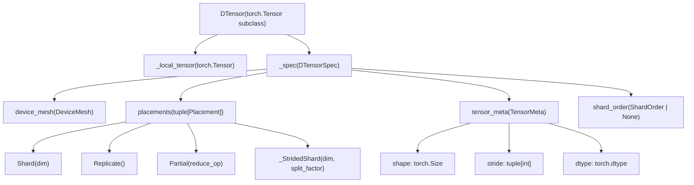
**Sources:** [torch/distributed/tensor/\_api.py248-293](https://github.com/pytorch/pytorch/blob/915982a4/torch/distributed/tensor/_api.py#L248-L293) [torch/distributed/tensor/\_dtensor\_spec.py1-100](https://github.com/pytorch/pytorch/blob/915982a4/torch/distributed/tensor/_dtensor_spec.py#L1-L100)

### DTensorSpec

The `DTensorSpec` class encapsulates all metadata needed to describe how a tensor is distributed:

| Field | Type | Description |
| --- | --- | --- |
| `mesh` | `DeviceMesh` | N-dimensional mesh of devices |
| `placements` | `tuple[Placement, ...]` | One placement per mesh dimension |
| `tensor_meta` | `TensorMeta` | Global shape, stride, dtype |
| `shard_order` | `ShardOrder | None` | Optional ordering for multi-dimensional sharding |

The `placements` tuple has length equal to `mesh.ndim`, where each placement describes how the tensor is distributed along the corresponding mesh dimension.

#### ShardOrder

When a tensor dimension is sharded across multiple mesh dimensions, `shard_order` specifies the sequence in which these shardings are applied. Each `ShardOrderEntry` contains:

-   `tensor_dim`: The tensor dimension being sharded
-   `mesh_dims`: Tuple of mesh dimensions, in execution order

Example:

```
# Tensor dim 0 sharded on mesh dim 1, tensor dim 1 sharded on mesh dims 0 then 2shard_order = (    ShardOrderEntry(tensor_dim=0, mesh_dims=(1,)),    ShardOrderEntry(tensor_dim=1, mesh_dims=(0, 2)),)
```
**Sources:** [torch/distributed/tensor/\_dtensor\_spec.py21-90](https://github.com/pytorch/pytorch/blob/915982a4/torch/distributed/tensor/_dtensor_spec.py#L21-L90) [torch/distributed/tensor/\_dtensor\_spec.py68-254](https://github.com/pytorch/pytorch/blob/915982a4/torch/distributed/tensor/_dtensor_spec.py#L68-L254)

## DeviceMesh

The `DeviceMesh` class represents an N-dimensional mesh of devices (e.g., GPUs) that forms the topology for distributed tensor operations.

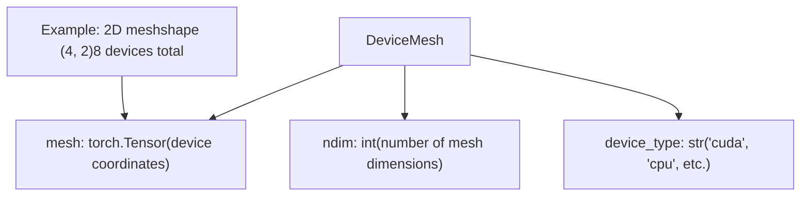
Key properties:

-   `mesh.shape`: Tuple describing the dimensions of the mesh (e.g., `(4, 2)` for a 2D mesh with 4 rows and 2 columns)
-   `mesh.ndim`: Number of mesh dimensions
-   `mesh.size(mesh_dim)`: Size of a specific mesh dimension
-   `mesh.get_coordinate()`: Returns the coordinate tuple for the current rank

Each DTensor's placements tuple must have length equal to `mesh.ndim`, with one placement per mesh dimension.

**Sources:** [torch/distributed/device\_mesh.py](https://github.com/pytorch/pytorch/blob/915982a4/torch/distributed/device_mesh.py) [torch/distributed/tensor/\_dtensor\_spec.py69-71](https://github.com/pytorch/pytorch/blob/915982a4/torch/distributed/tensor/_dtensor_spec.py#L69-L71)

## Placement Types

Placement types describe how a DTensor is distributed along a specific mesh dimension. There are four placement types: `Shard`, `Replicate`, `Partial`, and `_StridedShard`.

### Placement Type Overview

Diagram: **Placement Type Hierarchy**

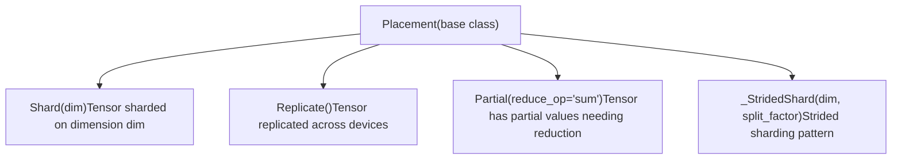
**Sources:** [torch/distributed/tensor/placement\_types.py27-34](https://github.com/pytorch/pytorch/blob/915982a4/torch/distributed/tensor/placement_types.py#L27-L34) [torch/\_C/\_distributed.pyi3-15](https://github.com/pytorch/pytorch/blob/915982a4/torch/_C/_distributed.pyi#L3-L15)

### Shard Placement

`Shard(dim)` indicates that a tensor is sharded (split) along tensor dimension `dim` across the devices of the corresponding mesh dimension. The sharding follows `torch.chunk` semantics.

Diagram: **Shard(0) on 4 devices**

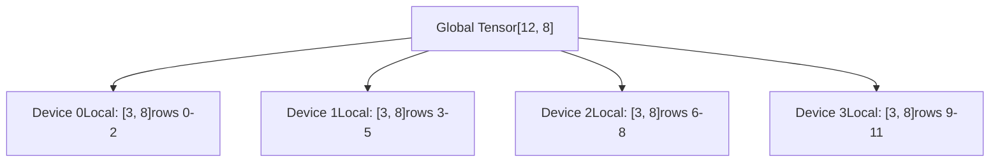
Key methods ([torch/distributed/tensor/placement\_types.py36-287](https://github.com/pytorch/pytorch/blob/915982a4/torch/distributed/tensor/placement_types.py#L36-L287)):

-   `_split_tensor(tensor, num_chunks)`: Splits a tensor into shards, with optional padding for uneven divisions
-   `_select_split_tensor(tensor, num_chunks, index)`: Returns only the shard at the given index (optimized)
-   `local_shard_size_and_offset(curr_local_size, num_chunks, rank)`: Computes local shard size and offset

**Uneven Sharding:** When the tensor dimension size is not evenly divisible by the number of devices, the last few devices may receive smaller shards or empty tensors. The implementation pads shards when necessary for collective operations.

Example:

```
# Tensor of shape [10, 8] sharded on dim 0 across 4 devices:# Device 0: [3, 8] (rows 0-2)# Device 1: [3, 8] (rows 3-5)# Device 2: [3, 8] (rows 6-8)# Device 3: [1, 8] (row 9)
```
**Sources:** [torch/distributed/tensor/placement\_types.py36-287](https://github.com/pytorch/pytorch/blob/915982a4/torch/distributed/tensor/placement_types.py#L36-L287) [test/distributed/tensor/test\_redistribute.py346-392](https://github.com/pytorch/pytorch/blob/915982a4/test/distributed/tensor/test_redistribute.py#L346-L392)

### Replicate Placement

`Replicate()` indicates that each device holds a complete copy of the tensor. All devices have identical data.

Diagram: **Replicate on 4 devices**

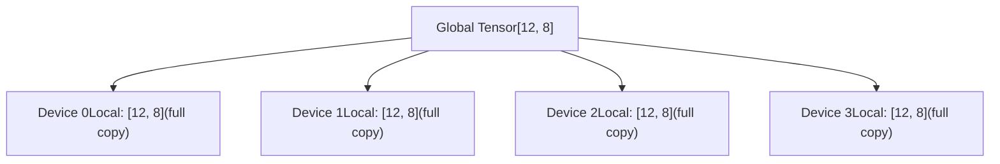
Replicate placement is used when:

-   Operations require access to the full tensor (e.g., softmax across a sharded dimension)
-   Broadcasting parameters to all devices
-   Ensuring all devices can independently compute a result

Key behaviors:

-   `to_local()` returns the full tensor without communication
-   Gradient accumulation: Gradients are summed across replicated devices during backward pass

**Sources:** [torch/distributed/tensor/placement\_types.py510-525](https://github.com/pytorch/pytorch/blob/915982a4/torch/distributed/tensor/placement_types.py#L510-L525) [test/distributed/tensor/test\_redistribute.py110-136](https://github.com/pytorch/pytorch/blob/915982a4/test/distributed/tensor/test_redistribute.py#L110-L136)

### Partial Placement

`Partial(reduce_op='sum')` indicates that each device holds a partial result that needs to be reduced across devices. This is an intermediate state, typically produced by reduction operations or as part of tensor parallel strategies.

Diagram: **Partial (sum) on 4 devices**

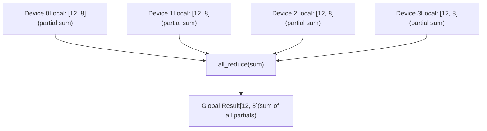
Supported reduction operations ([torch/distributed/tensor/placement\_types.py527-536](https://github.com/pytorch/pytorch/blob/915982a4/torch/distributed/tensor/placement_types.py#L527-L536)):

-   `"sum"`: Sum partial values across devices
-   `"max"`: Take maximum partial value across devices
-   `"min"`: Take minimum partial value across devices
-   `"prod"`: Multiply partial values across devices
-   `"mean"`: Average partial values across devices
-   `"all"`: Logical AND across devices
-   `"any"`: Logical OR across devices

**Common usage pattern:**

```
# RowwiseParallel linear layer produces Partial output:# input: Replicate# weight: Shard(0)  # output = input @ weight.T → Partial (needs all_reduce)
```
**Conversion to other placements:**

-   `Partial → Replicate`: Requires `all_reduce` collective
-   `Partial → Shard(dim)`: Requires `reduce_scatter` collective

**Sources:** [torch/distributed/tensor/placement\_types.py527-666](https://github.com/pytorch/pytorch/blob/915982a4/torch/distributed/tensor/placement_types.py#L527-L666) [test/distributed/tensor/test\_redistribute.py139-177](https://github.com/pytorch/pytorch/blob/915982a4/test/distributed/tensor/test_redistribute.py#L139-L177) [test/distributed/tensor/test\_redistribute.py253-289](https://github.com/pytorch/pytorch/blob/915982a4/test/distributed/tensor/test_redistribute.py#L253-L289)

### \_StridedShard Placement

`_StridedShard(dim, split_factor)` is an advanced placement type that represents strided sharding patterns. Unlike regular `Shard` which uses contiguous chunks, `_StridedShard` distributes elements with a specific stride pattern.

The `split_factor` parameter controls the granularity of the strided pattern. This is typically used in advanced tensor parallel strategies where finer-grained distribution is needed.

Example:

```
# StridedShard(0, split_factor=2) on 4 devices with tensor shape [16, 8]:# Device 0: rows [0, 2, 4, 6, 8, 10, 12, 14] (even rows)# Device 1: rows [1, 3, 5, 7, 9, 11, 13, 15] (odd rows)# (with split_factor=2, the mesh is treated as 2 devices for this dimension)
```
**Important:** `_StridedShard` is an internal experimental placement type (indicated by the `_` prefix) and its API may change. Redistribution from or to `_StridedShard` requires the graph-based redistribution planner rather than the greedy algorithm.

**Sources:** [torch/distributed/tensor/placement\_types.py668-842](https://github.com/pytorch/pytorch/blob/915982a4/torch/distributed/tensor/placement_types.py#L668-L842) [torch/distributed/tensor/\_redistribute.py38-48](https://github.com/pytorch/pytorch/blob/915982a4/torch/distributed/tensor/_redistribute.py#L38-L48) [test/distributed/tensor/test\_utils.py57-59](https://github.com/pytorch/pytorch/blob/915982a4/test/distributed/tensor/test_utils.py#L57-L59)

### Placement Combinations

Multiple placements can be combined to describe distribution across multiple mesh dimensions:

**Example: 2D mesh (4, 2) with placements \[Shard(0), Shard(1)\]**

```
# Tensor shape: [16, 16]# Mesh: 4x2 = 8 devices# Placements: [Shard(0), Shard(1)]# # Each device gets a [4, 8] local tensor:# - Dimension 0 sharded across first mesh dim (4 chunks)# - Dimension 1 sharded across second mesh dim (2 chunks)
```
**Example: 2D mesh with \[Shard(0), Replicate()\]**

```
# Tensor shape: [16, 16]# Mesh: 4x2 = 8 devices# Placements: [Shard(0), Replicate()]## Dimension 0 sharded across first mesh dim (4 chunks)# Replicated across second mesh dim# Devices (0,0) and (0,1) have same local tensor [4, 16]# Devices (1,0) and (1,1) have same local tensor [4, 16]# etc.
```
Common placement patterns:

-   `[Shard(0), Shard(1)]`: 2D sharding, useful for large tensors
-   `[Shard(0), Replicate()]`: Data parallel on first dim, tensor parallel on second
-   `[Replicate(), Shard(0)]`: Tensor parallel on first dim, data parallel on second
-   `[Partial(), Replicate()]`: Partial reduction needed on first dim, replicated on second

**Sources:** [torch/distributed/tensor/\_dtensor\_spec.py92-254](https://github.com/pytorch/pytorch/blob/915982a4/torch/distributed/tensor/_dtensor_spec.py#L92-L254) [test/distributed/tensor/test\_dtensor.py406-410](https://github.com/pytorch/pytorch/blob/915982a4/test/distributed/tensor/test_dtensor.py#L406-L410)

## Dispatch Mechanism Overview

</old\_str>

<old\_str>

## Dispatch Architecture

DTensor implements `__torch_dispatch__` to intercept all operations on DTensor objects and route them through a specialized dispatch system.

### Dispatch Entry Point

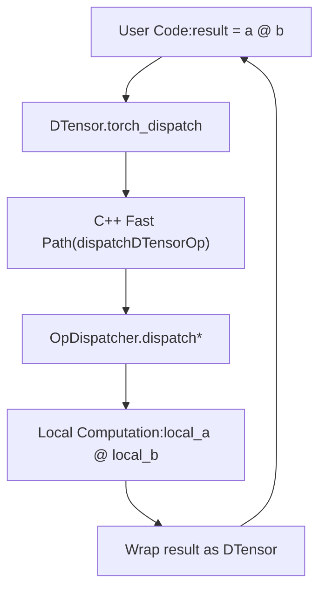
The dispatch flow has been optimized with a C++ fast path that handles common cases before falling back to Python.

**Sources:** [torch/distributed/tensor/\_dispatch.py124-178](https://github.com/pytorch/pytorch/blob/915982a4/torch/distributed/tensor/_dispatch.py#L124-L178) [torch/distributed/tensor/\_api.py534-566](https://github.com/pytorch/pytorch/blob/915982a4/torch/distributed/tensor/_api.py#L534-L566)

### OpDispatcher Class

The `OpDispatcher` class ([torch/distributed/tensor/\_dispatch.py124-137](https://github.com/pytorch/pytorch/blob/915982a4/torch/distributed/tensor/_dispatch.py#L124-L137)) is the core dispatch coordinator. It maintains:

-   `sharding_propagator`: A `ShardingPropagator` instance that determines output sharding
-   `_random_ops`: Set of random ops requiring special RNG handling
-   `_custom_op_handlers`: Dict of ops requiring custom dispatch logic

Key methods:

| Method | Purpose |
| --- | --- |
| `unwrap_to_op_info()` | Unwraps DTensor args to local tensors and creates `OpInfo` |
| `_propagate_op_sharding_dispatch_slow_path()` | Determines output sharding via `ShardingPropagator` |
| `_dispatch_get_local_results_slow_path()` | Performs redistribution if needed, runs local op |
| `_dispatch_fast_path_python_tail()` | Wraps results back to DTensor |
| `redistribute_local_args()` | Redistributes args when sharding propagation requires it |

**Sources:** [torch/distributed/tensor/\_dispatch.py124-652](https://github.com/pytorch/pytorch/blob/915982a4/torch/distributed/tensor/_dispatch.py#L124-L652)

## Detailed Dispatch Flow

### Phase 1: Argument Unwrapping

> **[Mermaid sequence]**
> *(图表结构无法解析)*

The `unwrap_to_op_info` method ([torch/distributed/tensor/\_dispatch.py520-609](https://github.com/pytorch/pytorch/blob/915982a4/torch/distributed/tensor/_dispatch.py#L520-L609)) extracts:

-   **Local tensors** from DTensor arguments for actual computation
-   **DTensorSpec** objects describing the sharding of each DTensor argument
-   **Compute mesh** - the common DeviceMesh for all DTensor arguments
-   **Schema information** for the operation

**Sources:** [torch/distributed/tensor/\_dispatch.py520-609](https://github.com/pytorch/pytorch/blob/915982a4/torch/distributed/tensor/_dispatch.py#L520-L609)

### Phase 2: Sharding Propagation

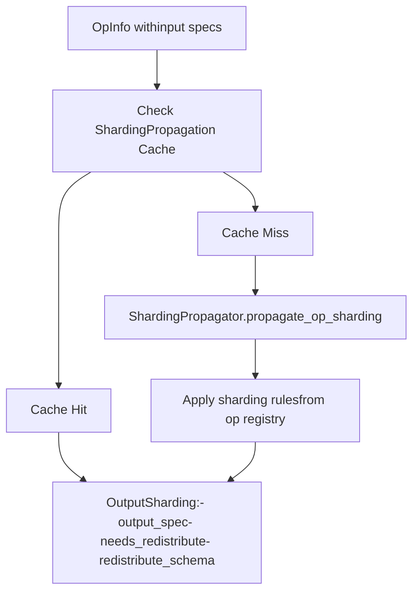
The `ShardingPropagator` ([torch/distributed/tensor/\_sharding\_prop.py](https://github.com/pytorch/pytorch/blob/915982a4/torch/distributed/tensor/_sharding_prop.py)) determines the output sharding specification based on:

1.  **Input sharding specs** from the DTensor arguments
2.  **Operator semantics** (registered sharding rules)
3.  **Cache lookup** to avoid recomputation

The result is an `OutputSharding` object containing:

-   `output_spec`: The sharding specification for the output(s)
-   `needs_redistribute`: Whether any inputs need resharding
-   `redistribute_schema`: If needed, the target specs for input resharding

**Sources:** [torch/distributed/tensor/\_dispatch.py191-246](https://github.com/pytorch/pytorch/blob/915982a4/torch/distributed/tensor/_dispatch.py#L191-L246) [torch/distributed/tensor/\_sharding\_prop.py](https://github.com/pytorch/pytorch/blob/915982a4/torch/distributed/tensor/_sharding_prop.py)

### Phase 3: Redistribution (if needed)

When `needs_redistribute` is true, the `redistribute_local_args` method ([torch/distributed/tensor/\_dispatch.py461-519](https://github.com/pytorch/pytorch/blob/915982a4/torch/distributed/tensor/_dispatch.py#L461-L519)) performs collective communications to transform input tensors to the required sharding:

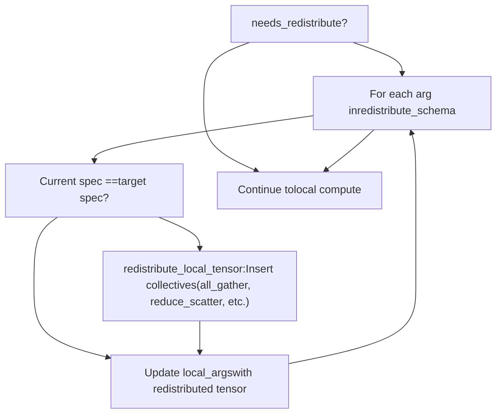
The redistribution is performed by `redistribute_local_tensor` ([torch/distributed/tensor/\_redistribute.py](https://github.com/pytorch/pytorch/blob/915982a4/torch/distributed/tensor/_redistribute.py)) which inserts the necessary collective operations (all-gather, reduce-scatter, all-to-all, etc.). See page 4.1.2 for detailed redistribution planning.

**Sources:** [torch/distributed/tensor/\_dispatch.py461-519](https://github.com/pytorch/pytorch/blob/915982a4/torch/distributed/tensor/_dispatch.py#L461-L519) [torch/distributed/tensor/\_redistribute.py184-391](https://github.com/pytorch/pytorch/blob/915982a4/torch/distributed/tensor/_redistribute.py#L184-L391)

### Phase 4: Local Computation

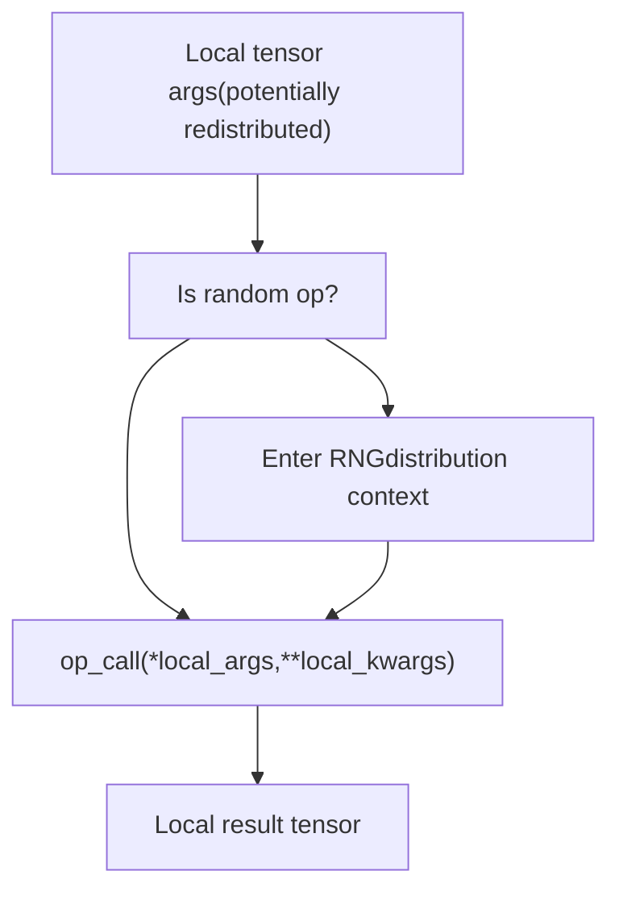
The actual computation happens on local tensor shards. Special handling exists for:

-   **Random ops** ([torch/distributed/tensor/\_dispatch.py289-318](https://github.com/pytorch/pytorch/blob/915982a4/torch/distributed/tensor/_dispatch.py#L289-L318)): Executed within an `RNGTracker` context to ensure deterministic distributed random number generation
-   **Non-participating ranks** ([torch/distributed/tensor/\_dispatch.py323-365](https://github.com/pytorch/pytorch/blob/915982a4/torch/distributed/tensor/_dispatch.py#L323-L365)): Ranks not in the device mesh return empty tensors
-   **Custom handlers** ([torch/distributed/tensor/\_dispatch.py156-166](https://github.com/pytorch/pytorch/blob/915982a4/torch/distributed/tensor/_dispatch.py#L156-L166)): Some ops (e.g., `convolution`, `as_strided`) have custom dispatch logic

**Sources:** [torch/distributed/tensor/\_dispatch.py247-365](https://github.com/pytorch/pytorch/blob/915982a4/torch/distributed/tensor/_dispatch.py#L247-L365)

### Phase 5: Result Wrapping

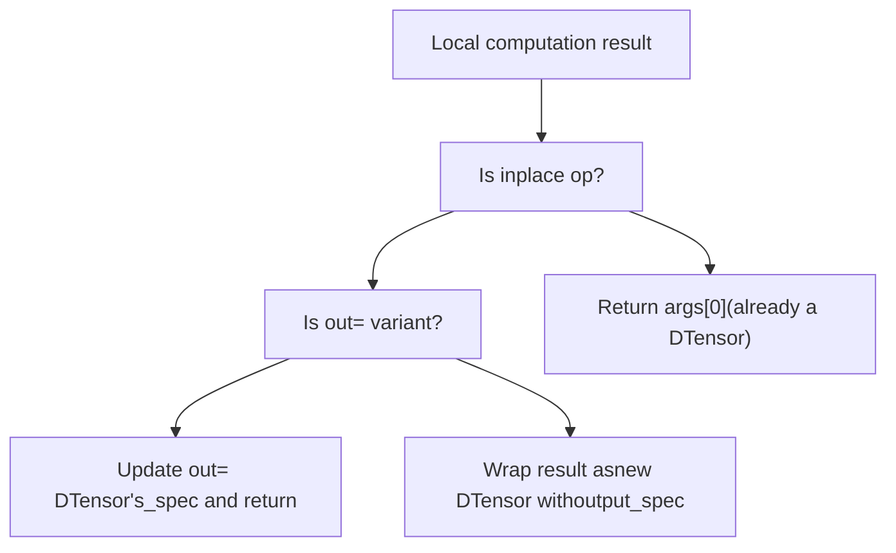
The wrapping logic ([torch/distributed/tensor/\_dispatch.py367-460](https://github.com/pytorch/pytorch/blob/915982a4/torch/distributed/tensor/_dispatch.py#L367-L460)) handles three cases:

1.  **Inplace operations** (e.g., `add_`): Return the modified input DTensor
2.  **Out-variant operations** (e.g., `add(..., out=x)`): Update the `out` DTensor's spec
3.  **Normal operations**: Create a new DTensor wrapping the local result

**Sources:** [torch/distributed/tensor/\_dispatch.py367-460](https://github.com/pytorch/pytorch/blob/915982a4/torch/distributed/tensor/_dispatch.py#L367-L460)

## C++ Fast Path Optimization

To minimize Python overhead, common dispatch cases are handled in C++:

Diagram: **C++ Fast Path**

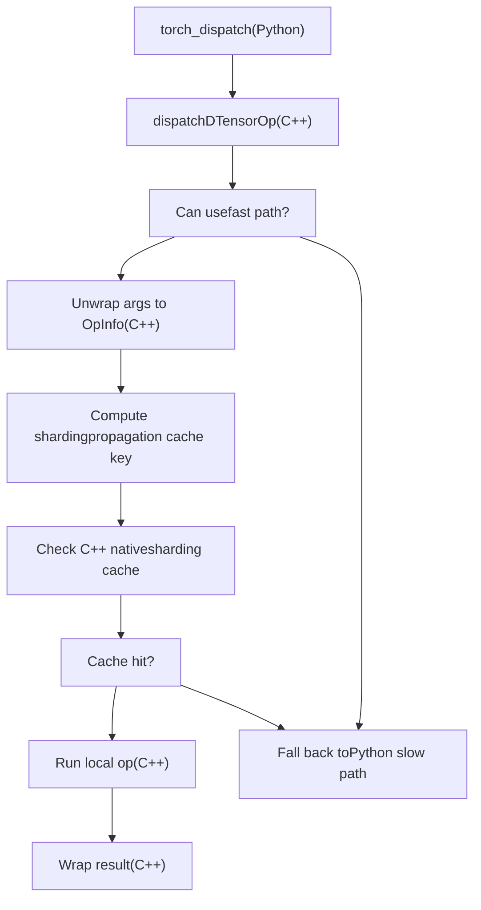
The C++ fast path ([torch/csrc/autograd/python\_variable.cpp](https://github.com/pytorch/pytorch/blob/915982a4/torch/csrc/autograd/python_variable.cpp) as mentioned in comments) handles:

-   Argument unwrapping
-   Cache key computation
-   Cache lookup in the C++ native cache
-   Local computation
-   Result wrapping

When any of these steps cannot be handled in C++, control returns to Python slow path methods.

**Sources:** [torch/distributed/tensor/\_dispatch.py169-177](https://github.com/pytorch/pytorch/blob/915982a4/torch/distributed/tensor/_dispatch.py#L169-L177) [torch/distributed/tensor/\_api.py389-397](https://github.com/pytorch/pytorch/blob/915982a4/torch/distributed/tensor/_api.py#L389-L397)

## Sharding Propagation

The `ShardingPropagator` maintains a registry of sharding rules for different operations. When an operation is dispatched:

Diagram: **Sharding Rule Lookup**

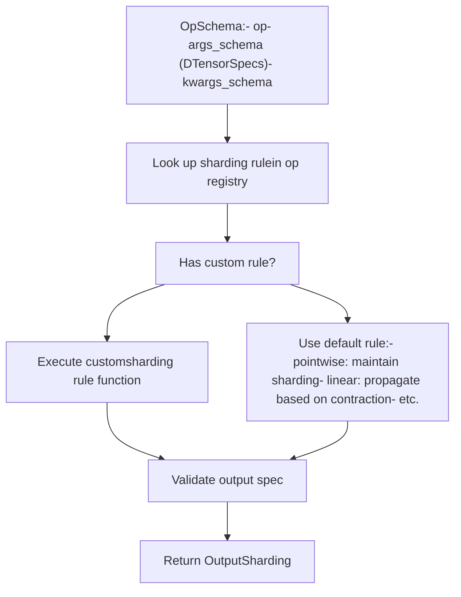
Sharding rules define:

1.  **Output placements** - how the result should be sharded
2.  **Redistribution needs** - whether inputs need resharding
3.  **Partial reduce requirements** - when partial tensors need reduction

Common patterns:

-   **Pointwise ops** (e.g., `add`, `mul`): Output follows input sharding
-   **Reduction ops** (e.g., `sum`, `mean`): May convert `Shard` to `Partial`
-   **Matrix multiply** (e.g., `mm`, `matmul`): Follows linear algebra sharding rules
-   **View ops** (e.g., `reshape`, `transpose`): Transform sharding dimensions

**Sources:** [torch/distributed/tensor/\_sharding\_prop.py](https://github.com/pytorch/pytorch/blob/915982a4/torch/distributed/tensor/_sharding_prop.py) [torch/distributed/tensor/\_op\_schema.py](https://github.com/pytorch/pytorch/blob/915982a4/torch/distributed/tensor/_op_schema.py)

## Integration with torch.compile

DTensor operations can be compiled with `torch.compile`. The compilation flow integrates naturally:

Diagram: **Compilation Path**

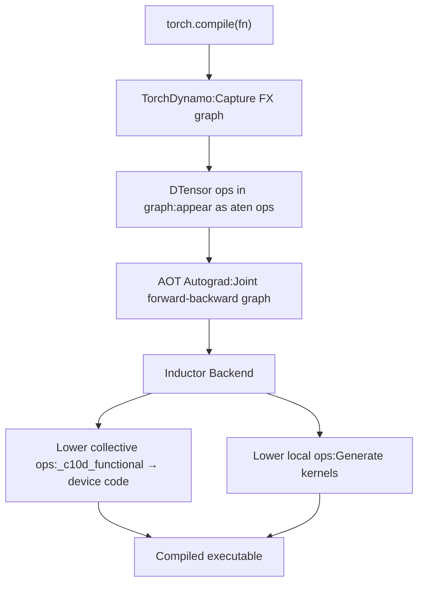
Key points:

-   DTensor operations appear as regular ATen operations in the FX graph
-   Sharding propagation occurs during tracing
-   Collective operations (`_c10d_functional.*`) are first-class graph nodes
-   Local computations can be fused by Inductor's optimization passes

**Sources:** [test/distributed/tensor/test\_dtensor\_compile.py149-175](https://github.com/pytorch/pytorch/blob/915982a4/test/distributed/tensor/test_dtensor_compile.py#L149-L175) [torch/distributed/tensor/\_dispatch.py124-652](https://github.com/pytorch/pytorch/blob/915982a4/torch/distributed/tensor/_dispatch.py#L124-L652)

## Summary

The DTensor architecture provides a complete system for distributed tensor computation:

1.  **DTensor and DTensorSpec** encapsulate both the local tensor shard and distribution metadata
2.  **Placement types** (`Shard`, `Replicate`, `Partial`, `_StridedShard`) describe how tensors are distributed
3.  **DeviceMesh** provides the device topology abstraction
4.  **Dispatch mechanism** intercepts operations, propagates sharding, and inserts communications
5.  **C++ fast path** optimizes common operations
6.  **Integration with torch.compile** enables optimized distributed execution

The dispatch system ensures correctness while maintaining performance through caching and optimized paths. For details on redistribution planning and communication patterns, see page 4.1.2.

**Sources:** [torch/distributed/tensor/\_api.py269-566](https://github.com/pytorch/pytorch/blob/915982a4/torch/distributed/tensor/_api.py#L269-L566) [torch/distributed/tensor/\_dispatch.py124-652](https://github.com/pytorch/pytorch/blob/915982a4/torch/distributed/tensor/_dispatch.py#L124-L652) [torch/distributed/tensor/placement\_types.py1-842](https://github.com/pytorch/pytorch/blob/915982a4/torch/distributed/tensor/placement_types.py#L1-L842)

DTensor implements `__torch_dispatch__` to intercept all operations on DTensor objects and route them through a specialized dispatch system.

### Dispatch Entry Point


The dispatch flow has been optimized with a C++ fast path that handles common cases before falling back to Python.

**Sources:** [torch/distributed/tensor/\_dispatch.py124-178](https://github.com/pytorch/pytorch/blob/915982a4/torch/distributed/tensor/_dispatch.py#L124-L178) [torch/distributed/tensor/\_api.py534-566](https://github.com/pytorch/pytorch/blob/915982a4/torch/distributed/tensor/_api.py#L534-L566)

### OpDispatcher Class

The `OpDispatcher` class ([torch/distributed/tensor/\_dispatch.py124-137](https://github.com/pytorch/pytorch/blob/915982a4/torch/distributed/tensor/_dispatch.py#L124-L137)) is the core dispatch coordinator. It maintains:

-   `sharding_propagator`: A `ShardingPropagator` instance that determines output sharding
-   `_random_ops`: Set of random ops requiring special RNG handling
-   `_custom_op_handlers`: Dict of ops requiring custom dispatch logic

Key methods:

| Method | Purpose |
| --- | --- |
| `unwrap_to_op_info()` | Unwraps DTensor args to local tensors and creates `OpInfo` |
| `_propagate_op_sharding_dispatch_slow_path()` | Determines output sharding via `ShardingPropagator` |
| `_dispatch_get_local_results_slow_path()` | Performs redistribution if needed, runs local op |
| `_dispatch_fast_path_python_tail()` | Wraps results back to DTensor |
| `redistribute_local_args()` | Redistributes args when sharding propagation requires it |

**Sources:** [torch/distributed/tensor/\_dispatch.py124-652](https://github.com/pytorch/pytorch/blob/915982a4/torch/distributed/tensor/_dispatch.py#L124-L652)

## Detailed Dispatch Flow

### Phase 1: Argument Unwrapping

> **[Mermaid sequence]**
> *(图表结构无法解析)*

The `unwrap_to_op_info` method ([torch/distributed/tensor/\_dispatch.py520-609](https://github.com/pytorch/pytorch/blob/915982a4/torch/distributed/tensor/_dispatch.py#L520-L609)) extracts:

-   **Local tensors** from DTensor arguments for actual computation
-   **DTensorSpec** objects describing the sharding of each DTensor argument
-   **Compute mesh** - the common DeviceMesh for all DTensor arguments
-   **Schema information** for the operation

**Sources:** [torch/distributed/tensor/\_dispatch.py520-609](https://github.com/pytorch/pytorch/blob/915982a4/torch/distributed/tensor/_dispatch.py#L520-L609)

### Phase 2: Sharding Propagation


The `ShardingPropagator` ([torch/distributed/tensor/\_sharding\_prop.py](https://github.com/pytorch/pytorch/blob/915982a4/torch/distributed/tensor/_sharding_prop.py)) determines the output sharding specification based on:

1.  **Input sharding specs** from the DTensor arguments
2.  **Operator semantics** (registered sharding rules)
3.  **Cache lookup** to avoid recomputation

The result is an `OutputSharding` object containing:

-   `output_spec`: The sharding specification for the output(s)
-   `needs_redistribute`: Whether any inputs need resharding
-   `redistribute_schema`: If needed, the target specs for input resharding

**Sources:** [torch/distributed/tensor/\_dispatch.py191-246](https://github.com/pytorch/pytorch/blob/915982a4/torch/distributed/tensor/_dispatch.py#L191-L246) [torch/distributed/tensor/\_sharding\_prop.py](https://github.com/pytorch/pytorch/blob/915982a4/torch/distributed/tensor/_sharding_prop.py)

### Phase 3: Redistribution (if needed)

When `needs_redistribute` is true, the `redistribute_local_args` method ([torch/distributed/tensor/\_dispatch.py461-519](https://github.com/pytorch/pytorch/blob/915982a4/torch/distributed/tensor/_dispatch.py#L461-L519)) performs collective communications to transform input tensors to the required sharding:


The redistribution is performed by `redistribute_local_tensor` ([torch/distributed/tensor/\_redistribute.py](https://github.com/pytorch/pytorch/blob/915982a4/torch/distributed/tensor/_redistribute.py)) which inserts the necessary collective operations (all-gather, reduce-scatter, all-to-all, etc.).

**Sources:** [torch/distributed/tensor/\_dispatch.py461-519](https://github.com/pytorch/pytorch/blob/915982a4/torch/distributed/tensor/_dispatch.py#L461-L519) [torch/distributed/tensor/\_redistribute.py184-391](https://github.com/pytorch/pytorch/blob/915982a4/torch/distributed/tensor/_redistribute.py#L184-L391)

### Phase 4: Local Computation


The actual computation happens on local tensor shards. Special handling exists for:

-   **Random ops** ([torch/distributed/tensor/\_dispatch.py289-318](https://github.com/pytorch/pytorch/blob/915982a4/torch/distributed/tensor/_dispatch.py#L289-L318)): Executed within an `RNGTracker` context to ensure deterministic distributed random number generation
-   **Non-participating ranks** ([torch/distributed/tensor/\_dispatch.py323-365](https://github.com/pytorch/pytorch/blob/915982a4/torch/distributed/tensor/_dispatch.py#L323-L365)): Ranks not in the device mesh return empty tensors
-   **Custom handlers** ([torch/distributed/tensor/\_dispatch.py156-166](https://github.com/pytorch/pytorch/blob/915982a4/torch/distributed/tensor/_dispatch.py#L156-L166)): Some ops (e.g., `convolution`, `as_strided`) have custom dispatch logic

**Sources:** [torch/distributed/tensor/\_dispatch.py247-365](https://github.com/pytorch/pytorch/blob/915982a4/torch/distributed/tensor/_dispatch.py#L247-L365)

### Phase 5: Result Wrapping


The wrapping logic ([torch/distributed/tensor/\_dispatch.py367-460](https://github.com/pytorch/pytorch/blob/915982a4/torch/distributed/tensor/_dispatch.py#L367-L460)) handles three cases:

1.  **Inplace operations** (e.g., `add_`): Return the modified input DTensor
2.  **Out-variant operations** (e.g., `add(..., out=x)`): Update the `out` DTensor's spec
3.  **Normal operations**: Create a new DTensor wrapping the local result

**Sources:** [torch/distributed/tensor/\_dispatch.py367-460](https://github.com/pytorch/pytorch/blob/915982a4/torch/distributed/tensor/_dispatch.py#L367-L460)

## C++ Fast Path Optimization

To minimize Python overhead, common dispatch cases are handled in C++:


The C++ fast path ([torch/csrc/autograd/python\_variable.cpp1453-1460](https://github.com/pytorch/pytorch/blob/915982a4/torch/csrc/autograd/python_variable.cpp#L1453-L1460) as mentioned in comments) handles:

-   Argument unwrapping
-   Cache key computation
-   Cache lookup in the C++ native cache
-   Local computation
-   Result wrapping

When any of these steps cannot be handled in C++, control returns to Python slow path methods.

**Sources:** [torch/distributed/tensor/\_dispatch.py169-177](https://github.com/pytorch/pytorch/blob/915982a4/torch/distributed/tensor/_dispatch.py#L169-L177)

## DebugMode Integration

DTensor integrates with `DebugMode` to provide visibility into redistribution operations that are normally hidden from the user:

```mermaid
flowchart TD
    OpDispatch["DTensor operation dispatch"]
    CheckDebug["DebugMode active?"]
    RecordOp["Record DTensor op callwith placements"]
    NeedRedist["needs_redistribute?"]
    RecordRedist["record_redistribute_calls:Log redistribution details"]
    InsertRedist["Insert collective ops(all_gather, reduce_scatter, etc.)"]
    RecordCollective["DebugMode recordscollective ops"]
    RecordOutput["record_output_placements:Log output placements"]

    OpDispatch --> CheckDebug
    CheckDebug --> NeedRedist
    CheckDebug --> RecordOp
    RecordOp --> NeedRedist
    NeedRedist --> RecordRedist
    NeedRedist --> RecordOutput
    RecordRedist --> InsertRedist
    InsertRedist --> RecordCollective
    RecordCollective --> RecordOutput
```
Example debug output ([test/distributed/tensor/debug/test\_debug\_mode.py74-89](https://github.com/pytorch/pytorch/blob/915982a4/test/distributed/tensor/debug/test_debug_mode.py#L74-L89)):

```
torch.mm(dt$0: f32[8, 8]| S(0), dt$1: f32[8, 32]| S(0))  ->  dt$7: f32[8, 32]| S(0)
  aten::mm(dt$0: f32[8, 8]| S(0), dt$1: f32[8, 32]| S(0))
    -> output: S(0)
    redistribute_input(1, S(0) -> R)
      redistribute_input(t$2: f32[1, 32], trace: S(0)->R)
        _c10d_functional::all_gather_into_tensor(t$2: f32[1, 32], 8, 0)  ->  t$3: f32[8, 32]
        _c10d_functional::wait_tensor(t$3: f32[8, 32])  ->  t$3: f32[8, 32]
    aten::mm(t$5: f32[1, 8], t$3: f32[8, 32])  ->  t$6: f32[1, 32]
```
The integration points are:

-   `get_active_debug_mode()` ([torch/utils/\_debug\_mode.py73](https://github.com/pytorch/pytorch/blob/915982a4/torch/utils/_debug_mode.py#L73-L73)) checks if DebugMode is active
-   `record_redistribute_calls()` ([torch/distributed/tensor/\_dispatch.py483-488](https://github.com/pytorch/pytorch/blob/915982a4/torch/distributed/tensor/_dispatch.py#L483-L488)) context manager logs redistribution operations
-   `record_output_placements()` ([torch/distributed/tensor/\_dispatch.py258-260](https://github.com/pytorch/pytorch/blob/915982a4/torch/distributed/tensor/_dispatch.py#L258-L260) [torch/distributed/tensor/\_dispatch.py384-386](https://github.com/pytorch/pytorch/blob/915982a4/torch/distributed/tensor/_dispatch.py#L384-L386)) records output sharding

**Sources:** [torch/distributed/tensor/\_dispatch.py258-260](https://github.com/pytorch/pytorch/blob/915982a4/torch/distributed/tensor/_dispatch.py#L258-L260) [torch/distributed/tensor/\_dispatch.py461-519](https://github.com/pytorch/pytorch/blob/915982a4/torch/distributed/tensor/_dispatch.py#L461-L519) [torch/utils/\_debug\_mode.py1-663](https://github.com/pytorch/pytorch/blob/915982a4/torch/utils/_debug_mode.py#L1-L663) [test/distributed/tensor/debug/test\_debug\_mode.py63-89](https://github.com/pytorch/pytorch/blob/915982a4/test/distributed/tensor/debug/test_debug_mode.py#L63-L89)

## Sharding Propagation Details

The `ShardingPropagator` maintains a registry of sharding rules for different operations. When an operation is dispatched:

```mermaid
flowchart TD
    OpSchema["OpSchema:- op- args_schema (DTensorSpecs)- kwargs_schema"]
    LookupRule["Look up sharding rulein op registry"]
    DefaultRule["Has custom rule?"]
    CustomRule["Execute customsharding rule function"]
    DefaultImpl["Use default rule:- pointwise: maintain sharding- linear: propagate based on contraction- etc."]
    ValidateOutput["Validate output spec"]
    OutputSharding["Return OutputSharding"]

    OpSchema --> LookupRule
    LookupRule --> DefaultRule
    DefaultRule --> CustomRule
    DefaultRule --> DefaultImpl
    CustomRule --> ValidateOutput
    DefaultImpl --> ValidateOutput
    ValidateOutput --> OutputSharding
```
Sharding rules define:

1.  **Output placements** - how the result should be sharded
2.  **Redistribution needs** - whether inputs need resharding
3.  **Partial reduce requirements** - when partial tensors need reduction

Common patterns ([torch/distributed/tensor/\_sharding\_prop.py](https://github.com/pytorch/pytorch/blob/915982a4/torch/distributed/tensor/_sharding_prop.py)):

-   **Pointwise ops** (e.g., `add`, `mul`): Output follows input sharding
-   **Reduction ops** (e.g., `sum`, `mean`): May convert `Shard` to `Partial`
-   **Matrix multiply** (e.g., `mm`, `matmul`): Follows linear algebra sharding rules
-   **View ops** (e.g., `reshape`, `transpose`): Transform sharding dimensions

**Sources:** [torch/distributed/tensor/\_sharding\_prop.py](https://github.com/pytorch/pytorch/blob/915982a4/torch/distributed/tensor/_sharding_prop.py) [torch/distributed/tensor/\_op\_schema.py](https://github.com/pytorch/pytorch/blob/915982a4/torch/distributed/tensor/_op_schema.py)

## Redistribution Strategies

When redistribution is required, `redistribute_local_tensor` ([torch/distributed/tensor/\_redistribute.py184-391](https://github.com/pytorch/pytorch/blob/915982a4/torch/distributed/tensor/_redistribute.py#L184-L391)) determines the sequence of collective operations:

### Transformation Graph

```mermaid
flowchart TD
    Shard0["Shard(0)"]
    Shard1["Shard(1)"]
    Replicate["Replicate"]
    Partial["Partial"]

    Shard0 --> Replicate
    Shard1 --> Replicate
    Replicate --> Shard0
    Replicate --> Shard1
    Shard0 --> Shard1
    Shard1 --> Shard0
    Partial --> Shard0
    Partial --> Shard1
    Partial --> Replicate
```
The planner uses either:

-   **Greedy algorithm** ([torch/distributed/tensor/\_redistribute.py419-621](https://github.com/pytorch/pytorch/blob/915982a4/torch/distributed/tensor/_redistribute.py#L419-L621)): Makes locally optimal choices at each step
-   **Graph-based algorithm** ([torch/distributed/tensor/\_redistribute.py623-867](https://github.com/pytorch/pytorch/blob/915982a4/torch/distributed/tensor/_redistribute.py#L623-L867)): Uses Dijkstra's algorithm for minimum-cost path

The graph-based approach is required for complex cases like `_StridedShard` redistribution ([torch/distributed/tensor/\_redistribute.py45-82](https://github.com/pytorch/pytorch/blob/915982a4/torch/distributed/tensor/_redistribute.py#L45-L82)).

**Sources:** [torch/distributed/tensor/\_redistribute.py1-867](https://github.com/pytorch/pytorch/blob/915982a4/torch/distributed/tensor/_redistribute.py#L1-L867)

## Inductor Integration

When DTensor code is compiled with `torch.compile`, the Inductor backend integrates through:

### Compilation Path

```mermaid
flowchart TD
    TorchCompile["torch.compile(fn)"]
    Dynamo["TorchDynamo:Capture FX graph"]
    DTensorOps["DTensor ops in graph:aten ops on DTensor"]
    AOTAutograd["AOT Autograd:Joint forward-backward graph"]
    Inductor["Inductor Backend"]
    LowerCollectives["Lower collective ops:_c10d_functional → device code"]
    LocalOps["Lower local ops:Generate Triton/C++ kernels"]
    CompiledCode["Compiled executable"]

    TorchCompile --> Dynamo
    Dynamo --> DTensorOps
    DTensorOps --> AOTAutograd
    AOTAutograd --> Inductor
    Inductor --> LowerCollectives
    Inductor --> LocalOps
    LowerCollectives --> CompiledCode
    LocalOps --> CompiledCode
```
Key integration points:

1.  **FX graph capture**: DTensor operations appear as regular ATen operations in the graph
2.  **Collective lowering**: `_c10d_functional` ops (all\_gather, reduce\_scatter, etc.) are lowered to device-specific implementations
3.  **Local computation**: Local tensor operations are optimized by Inductor's kernel fusion and code generation

The dispatch mechanism works seamlessly with compilation because:

-   Sharding propagation occurs during tracing
-   Collective operations are first-class graph nodes
-   Local computations fuse with surrounding operations

**Sources:** [test/distributed/tensor/test\_dtensor\_compile.py149-161](https://github.com/pytorch/pytorch/blob/915982a4/test/distributed/tensor/test_dtensor_compile.py#L149-L161)

## Custom Operation Handlers

Some operations require custom dispatch logic beyond standard sharding propagation:

| Operation | Handler | Reason |
| --- | --- | --- |
| `aten.convolution` | `convolution_handler` | Complex sharding patterns for spatial dimensions |
| `aten.as_strided` | `as_strided_handler` | View operation that may not be safely shardable |
| `aten.argmin/argmax` | `argminmax_handler` | Non-linear reduction requiring special handling |
| `aten.max/min.dim` | `minmax_dim_handler` | Returns both values and indices |
| `_amp_foreach_non_finite_check_and_unscale_` | `found_inf_reduce_handler` | AMP special case requiring cross-rank reduction |

These handlers ([torch/distributed/tensor/\_dispatch.py156-166](https://github.com/pytorch/pytorch/blob/915982a4/torch/distributed/tensor/_dispatch.py#L156-L166)) are registered in `OpDispatcher._custom_op_handlers` and bypass normal sharding propagation.

**Sources:** [torch/distributed/tensor/\_dispatch.py53-122](https://github.com/pytorch/pytorch/blob/915982a4/torch/distributed/tensor/_dispatch.py#L53-L122) [torch/distributed/tensor/\_tp\_conv.py](https://github.com/pytorch/pytorch/blob/915982a4/torch/distributed/tensor/_tp_conv.py) [torch/distributed/tensor/\_nonlinear\_redux.py](https://github.com/pytorch/pytorch/blob/915982a4/torch/distributed/tensor/_nonlinear_redux.py)

## Summary: Complete Dispatch Pipeline

```mermaid
flowchart TD
    Start["User calls op(dtensor_args)"]
    TorchDispatch["torch_dispatch"]
    FastPath["C++ fast path"]
    CanHandle["Can C++handle?"]
    UnwrapCpp["C++: Unwrap args"]
    UnwrapPy["Python: unwrap_to_op_info"]
    CacheCheck["Check shardingpropagation cache"]
    PropagateSharding["ShardingPropagator:Determine output sharding"]
    NeedRedist["needs_redistribute?"]
    Redistribute["redistribute_local_args:Insert collectives"]
    LocalOp["Execute local op:op_call(*local_args)"]
    Wrap["Wrap result as DTensor"]
    Return["Return to user"]

    Start --> TorchDispatch
    TorchDispatch --> FastPath
    FastPath --> CanHandle
    CanHandle --> UnwrapCpp
    CanHandle --> UnwrapPy
    UnwrapCpp --> CacheCheck
    UnwrapPy --> CacheCheck
    CacheCheck --> PropagateSharding
    PropagateSharding --> NeedRedist
    NeedRedist --> Redistribute
    NeedRedist --> LocalOp
    Redistribute --> LocalOp
    LocalOp --> Wrap
    Wrap --> Return
```
The dispatch system ensures that:

1.  **Correctness**: All operations respect DTensor semantics and sharding contracts
2.  **Performance**: C++ fast path and caching minimize overhead
3.  **Flexibility**: Custom handlers support complex operations
4.  **Observability**: DebugMode integration provides visibility into implicit operations
5.  **Compilability**: Seamless integration with torch.compile and Inductor

**Sources:** [torch/distributed/tensor/\_dispatch.py124-652](https://github.com/pytorch/pytorch/blob/915982a4/torch/distributed/tensor/_dispatch.py#L124-L652) [torch/distributed/tensor/\_api.py534-566](https://github.com/pytorch/pytorch/blob/915982a4/torch/distributed/tensor/_api.py#L534-L566)
