# Sharding Propagation and OpStrategy

Relevant source files

-   [test/distributed/tensor/experimental/test\_register\_sharding.py](https://github.com/pytorch/pytorch/blob/915982a4/test/distributed/tensor/experimental/test_register_sharding.py)
-   [test/distributed/tensor/test\_decompositions.py](https://github.com/pytorch/pytorch/blob/915982a4/test/distributed/tensor/test_decompositions.py)
-   [test/distributed/tensor/test\_dtensor\_dispatch\_overhead.py](https://github.com/pytorch/pytorch/blob/915982a4/test/distributed/tensor/test_dtensor_dispatch_overhead.py)
-   [test/distributed/tensor/test\_dtensor\_ops.py](https://github.com/pytorch/pytorch/blob/915982a4/test/distributed/tensor/test_dtensor_ops.py)
-   [test/distributed/tensor/test\_math\_ops.py](https://github.com/pytorch/pytorch/blob/915982a4/test/distributed/tensor/test_math_ops.py)
-   [test/distributed/tensor/test\_matrix\_ops.py](https://github.com/pytorch/pytorch/blob/915982a4/test/distributed/tensor/test_matrix_ops.py)
-   [test/distributed/tensor/test\_op\_strategy.py](https://github.com/pytorch/pytorch/blob/915982a4/test/distributed/tensor/test_op_strategy.py)
-   [test/distributed/tensor/test\_pointwise\_ops.py](https://github.com/pytorch/pytorch/blob/915982a4/test/distributed/tensor/test_pointwise_ops.py)
-   [test/distributed/tensor/test\_single\_dim\_strategy.py](https://github.com/pytorch/pytorch/blob/915982a4/test/distributed/tensor/test_single_dim_strategy.py)
-   [test/distributed/tensor/test\_tensor\_ops.py](https://github.com/pytorch/pytorch/blob/915982a4/test/distributed/tensor/test_tensor_ops.py)
-   [test/distributed/tensor/test\_view\_ops.py](https://github.com/pytorch/pytorch/blob/915982a4/test/distributed/tensor/test_view_ops.py)
-   [torch/\_meta\_registrations.py](https://github.com/pytorch/pytorch/blob/915982a4/torch/_meta_registrations.py)
-   [torch/distributed/tensor/\_decompositions.py](https://github.com/pytorch/pytorch/blob/915982a4/torch/distributed/tensor/_decompositions.py)
-   [torch/distributed/tensor/\_nonlinear\_redux.py](https://github.com/pytorch/pytorch/blob/915982a4/torch/distributed/tensor/_nonlinear_redux.py)
-   [torch/distributed/tensor/\_op\_schema.py](https://github.com/pytorch/pytorch/blob/915982a4/torch/distributed/tensor/_op_schema.py)
-   [torch/distributed/tensor/\_ops/\_conv\_ops.py](https://github.com/pytorch/pytorch/blob/915982a4/torch/distributed/tensor/_ops/_conv_ops.py)
-   [torch/distributed/tensor/\_ops/\_math\_ops.py](https://github.com/pytorch/pytorch/blob/915982a4/torch/distributed/tensor/_ops/_math_ops.py)
-   [torch/distributed/tensor/\_ops/\_matrix\_ops.py](https://github.com/pytorch/pytorch/blob/915982a4/torch/distributed/tensor/_ops/_matrix_ops.py)
-   [torch/distributed/tensor/\_ops/\_pointwise\_ops.py](https://github.com/pytorch/pytorch/blob/915982a4/torch/distributed/tensor/_ops/_pointwise_ops.py)
-   [torch/distributed/tensor/\_ops/\_random\_ops.py](https://github.com/pytorch/pytorch/blob/915982a4/torch/distributed/tensor/_ops/_random_ops.py)
-   [torch/distributed/tensor/\_ops/\_tensor\_ops.py](https://github.com/pytorch/pytorch/blob/915982a4/torch/distributed/tensor/_ops/_tensor_ops.py)
-   [torch/distributed/tensor/\_ops/\_view\_ops.py](https://github.com/pytorch/pytorch/blob/915982a4/torch/distributed/tensor/_ops/_view_ops.py)
-   [torch/distributed/tensor/\_ops/single\_dim\_strategy.py](https://github.com/pytorch/pytorch/blob/915982a4/torch/distributed/tensor/_ops/single_dim_strategy.py)
-   [torch/distributed/tensor/\_ops/utils.py](https://github.com/pytorch/pytorch/blob/915982a4/torch/distributed/tensor/_ops/utils.py)
-   [torch/distributed/tensor/\_sharding\_prop.py](https://github.com/pytorch/pytorch/blob/915982a4/torch/distributed/tensor/_sharding_prop.py)
-   [torch/distributed/tensor/debug/\_\_init\_\_.py](https://github.com/pytorch/pytorch/blob/915982a4/torch/distributed/tensor/debug/__init__.py)
-   [torch/testing/\_internal/common\_ops\_unbacked.py](https://github.com/pytorch/pytorch/blob/915982a4/torch/testing/_internal/common_ops_unbacked.py)

## Purpose and Scope

This document describes the **sharding propagation system** in DTensor, which determines how tensor sharding specifications (placements) propagate through operations. Given input tensors with known placements (e.g., `Shard(0)`, `Replicate()`, `Partial()`), the system computes valid output placements and selects the optimal sharding strategy.

For information about DTensor's overall architecture and placement types, see [DTensor Architecture and Placement Types](/pytorch/pytorch/4.2.1-dtensor-architecture-and-placement-types). For details on how sharding changes are executed through collective communication, see [Redistribution and Communication Planning](/pytorch/pytorch/4.2.3-redistribution-and-communication-planning).

## Core Data Structures

### OpStrategy and OpSpec

The sharding propagation system uses a strategy-based approach where each operation can support multiple valid sharding configurations:

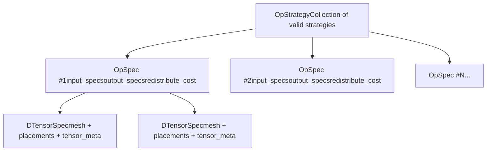
**OpStrategy** ([torch/distributed/tensor/\_op\_schema.py166-226](https://github.com/pytorch/pytorch/blob/915982a4/torch/distributed/tensor/_op_schema.py#L166-L226)) represents all acceptable sharding configurations for an operation:

-   Contains a list of `OpSpec` strategies
-   Each strategy is independently valid
-   System selects minimum-cost strategy at runtime

**OpSpec** ([torch/distributed/tensor/\_op\_schema.py122-163](https://github.com/pytorch/pytorch/blob/915982a4/torch/distributed/tensor/_op_schema.py#L122-L163)) describes a single valid configuration:

-   `input_specs`: Tuple of `DTensorSpec` for each input tensor
-   `output_specs`: `DTensorSpec` or tuple for output(s)
-   `redistribute_cost`: 2D list of costs to transform from any input strategy to this one

**OutputSharding** ([torch/distributed/tensor/\_op\_schema.py228-278](https://github.com/pytorch/pytorch/blob/915982a4/torch/distributed/tensor/_op_schema.py#L228-L278)) is a simpler alternative:

-   Used for propagation rules that don't need full strategy enumeration
-   Specifies output specs and optional schema suggestions
-   Can request specific input redistributions via `schema_suggestions`

Sources: [torch/distributed/tensor/\_op\_schema.py122-278](https://github.com/pytorch/pytorch/blob/915982a4/torch/distributed/tensor/_op_schema.py#L122-L278) [torch/distributed/tensor/\_sharding\_prop.py206-204](https://github.com/pytorch/pytorch/blob/915982a4/torch/distributed/tensor/_sharding_prop.py#L206-L204)

---

## Sharding Propagation Workflow

### High-Level Flow

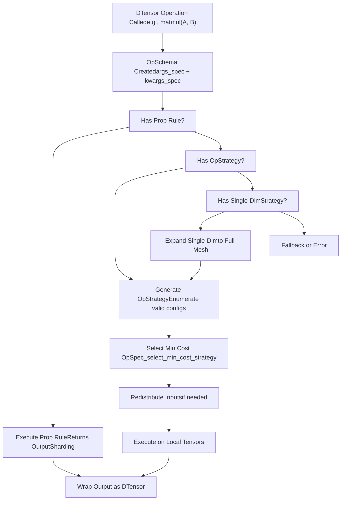
**Sources:** [torch/distributed/tensor/\_sharding\_prop.py331-402](https://github.com/pytorch/pytorch/blob/915982a4/torch/distributed/tensor/_sharding_prop.py#L331-L402) [torch/distributed/tensor/\_sharding\_prop.py421-609](https://github.com/pytorch/pytorch/blob/915982a4/torch/distributed/tensor/_sharding_prop.py#L421-L609)

---

### ShardingPropagator Class

The `ShardingPropagator` class ([torch/distributed/tensor/\_sharding\_prop.py206-609](https://github.com/pytorch/pytorch/blob/915982a4/torch/distributed/tensor/_sharding_prop.py#L206-L609)) manages the entire propagation system:

| Method | Purpose | Returns |
| --- | --- | --- |
| `propagate_op_sharding` | Main entry point for sharding propagation | `OutputSharding` or `OutputSpecType` |
| `register_sharding_prop_rule` | Register simple propagation rule | void |
| `register_op_strategy` | Register full strategy generator | void |
| `register_single_dim_op_strategy` | Register single-dimension strategy | void |
| `_select_min_cost_strategy` | Choose optimal strategy from OpStrategy | `OpSpec` |
| `_propagate_tensor_meta` | Infer output tensor metadata via fake tensors | `TensorMeta` or `Sequence[TensorMeta]` |

**Key data structures maintained:**

-   `op_to_rules`: Dict mapping `OpOverload` to propagation rule functions
-   `op_strategy_funcs`: Dict mapping `OpOverload` to strategy generator functions
-   `op_single_dim_strategy_funcs`: Dict mapping `OpOverload` to single-dim strategies
-   `op_to_schema_info`: Dict mapping `OpOverload` to `RuntimeSchemaInfo` for cache control

Sources: [torch/distributed/tensor/\_sharding\_prop.py206-329](https://github.com/pytorch/pytorch/blob/915982a4/torch/distributed/tensor/_sharding_prop.py#L206-L329)

---

## Strategy Registration Mechanisms

### Three Registration Patterns

DTensor provides three ways to specify how operations propagate sharding:

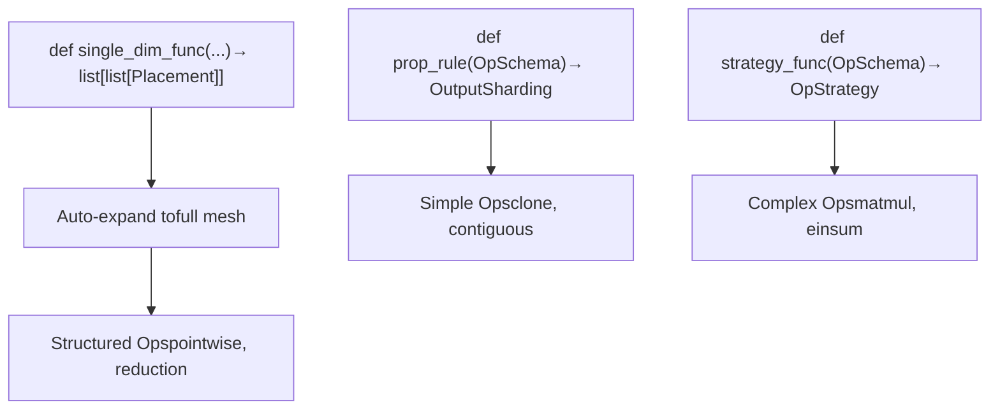
Sources: [torch/distributed/tensor/\_sharding\_prop.py250-329](https://github.com/pytorch/pytorch/blob/915982a4/torch/distributed/tensor/_sharding_prop.py#L250-L329) [torch/distributed/tensor/\_ops/utils.py64-106](https://github.com/pytorch/pytorch/blob/915982a4/torch/distributed/tensor/_ops/utils.py#L64-L106)

---

### 1\. Propagation Rules (Simple Pattern)

For operations where output placement directly follows input placement:

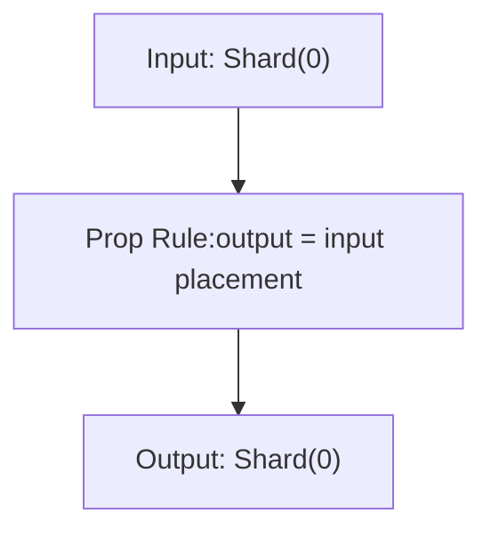
**Example operations:** `clone`, `contiguous`, `detach`, `relu`, `sigmoid`

**Registration:**

```
@register_prop_rule(aten.clone.default)def clone_prop_rule(op_schema: OpSchema) -> OutputSharding:    # Output has same placement as input    return OutputSharding(output_spec=op_schema.args_spec[0])
```
Sources: [torch/distributed/tensor/\_ops/\_tensor\_ops.py54-103](https://github.com/pytorch/pytorch/blob/915982a4/torch/distributed/tensor/_ops/_tensor_ops.py#L54-L103)

---

### 2\. Full OpStrategy (Complete Enumeration)

For operations requiring multiple valid strategies with cost analysis:

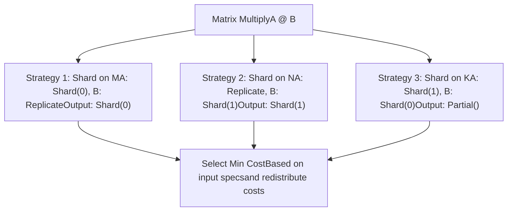
**Key characteristics:**

-   Enumerates all mathematically valid sharding combinations
-   Associates redistribution costs for each strategy
-   System automatically selects optimal based on current input specs

**Example:** Matrix multiplication strategies ([torch/distributed/tensor/\_ops/\_matrix\_ops.py80-128](https://github.com/pytorch/pytorch/blob/915982a4/torch/distributed/tensor/_ops/_matrix_ops.py#L80-L128))

Sources: [torch/distributed/tensor/\_ops/\_matrix\_ops.py80-214](https://github.com/pytorch/pytorch/blob/915982a4/torch/distributed/tensor/_ops/_matrix_ops.py#L80-L214) [torch/distributed/tensor/\_sharding\_prop.py276-329](https://github.com/pytorch/pytorch/blob/915982a4/torch/distributed/tensor/_sharding_prop.py#L276-L329)

---

### 3\. Single-Dim Strategy (Expandable Pattern)

For operations that can be described per mesh dimension and automatically expanded to N-dimensional meshes:

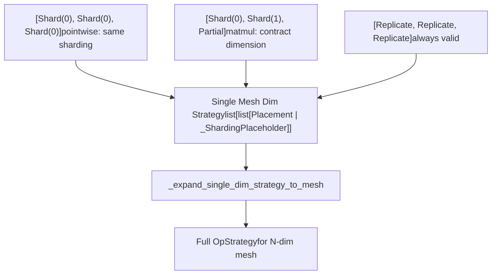
**\_ShardingPlaceholder** ([torch/distributed/tensor/\_ops/single\_dim\_strategy.py34-47](https://github.com/pytorch/pytorch/blob/915982a4/torch/distributed/tensor/_ops/single_dim_strategy.py#L34-L47)): Marks a dimension that will be sharded, with details filled in during expansion.

**Example:** Pointwise operations ([torch/distributed/tensor/\_ops/\_pointwise\_ops.py426-499](https://github.com/pytorch/pytorch/blob/915982a4/torch/distributed/tensor/_ops/_pointwise_ops.py#L426-L499))

Sources: [torch/distributed/tensor/\_ops/single\_dim\_strategy.py60-199](https://github.com/pytorch/pytorch/blob/915982a4/torch/distributed/tensor/_ops/single_dim_strategy.py#L60-L199) [torch/distributed/tensor/\_ops/\_pointwise\_ops.py426-545](https://github.com/pytorch/pytorch/blob/915982a4/torch/distributed/tensor/_ops/_pointwise_ops.py#L426-L545)

---

## Strategy Selection and Cost Model

### Minimum Cost Selection

The `_select_min_cost_strategy` function ([torch/distributed/tensor/\_sharding\_prop.py139-203](https://github.com/pytorch/pytorch/blob/915982a4/torch/distributed/tensor/_sharding_prop.py#L139-L203)) chooses the optimal `OpSpec` from an `OpStrategy`:

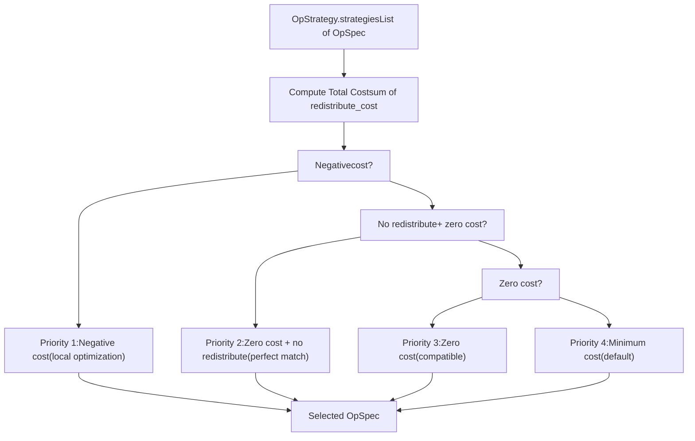
**Cost calculation:**

-   Each `OpSpec` has a `redistribute_cost` matrix: `[num_inputs][num_strategies]`
-   For each input, the cost is the redistribution cost from its current strategy to the desired input spec
-   Total cost = sum of all input redistribution costs

**Negative costs:** Some strategies intentionally have negative costs to encourage local optimizations (e.g., view operations that can avoid communication through local tensor chunking).

Sources: [torch/distributed/tensor/\_sharding\_prop.py139-203](https://github.com/pytorch/pytorch/blob/915982a4/torch/distributed/tensor/_sharding_prop.py#L139-L203) [torch/distributed/tensor/\_ops/utils.py265-291](https://github.com/pytorch/pytorch/blob/915982a4/torch/distributed/tensor/_ops/utils.py#L265-L291)

---

## Redistribution Cost Calculation

The `generate_redistribute_costs` function ([torch/distributed/tensor/\_ops/utils.py265-291](https://github.com/pytorch/pytorch/blob/915982a4/torch/distributed/tensor/_ops/utils.py#L265-L291)) computes the cost matrix:

| From Placement | To Placement | Cost | Reason |
| --- | --- | --- | --- |
| Same | Same | 0.0 | No operation needed |
| Replicate | Shard | 0.0 | Local slicing only |
| Shard(i) | Shard(j), i≠j | High | Requires all-to-all communication |
| Shard | Replicate | High | Requires all-gather |
| Partial | Replicate | High | Requires reduce-scatter or all-reduce |
| Any | Different mesh | Very High | Cross-mesh redistribution |

The actual cost is computed using the `redistribute_cost` function ([torch/distributed/tensor/\_collective\_utils.py170-224](https://github.com/pytorch/pytorch/blob/915982a4/torch/distributed/tensor/_collective_utils.py#L170-L224)):

-   Returns float representing relative communication cost
-   Considers mesh topology and operation types
-   Used for cost-based strategy selection

Sources: [torch/distributed/tensor/\_ops/utils.py265-291](https://github.com/pytorch/pytorch/blob/915982a4/torch/distributed/tensor/_ops/utils.py#L265-L291) [torch/distributed/tensor/\_collective\_utils.py170-224](https://github.com/pytorch/pytorch/blob/915982a4/torch/distributed/tensor/_collective_utils.py#L170-L224)

---

## Pointwise Operations Strategy

Pointwise operations (element-wise ops like `add`, `mul`, `relu`) use a flexible strategy:

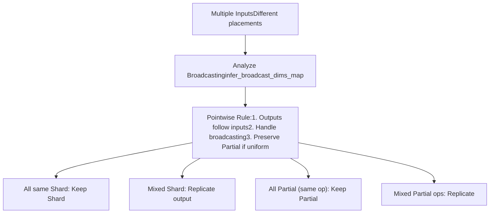
**Key function:** `pointwise_rule` ([torch/distributed/tensor/\_ops/\_common\_rules.py60-257](https://github.com/pytorch/pytorch/blob/915982a4/torch/distributed/tensor/_ops/_common_rules.py#L60-L257))

**Placement propagation logic:**

1.  If all inputs have same `Shard(i)` on a dimension → output is `Shard(i)`
2.  If inputs have different placements → output is `Replicate()` (requires redistribution)
3.  If all inputs are `Partial(op)` with same reduce\_op → output is `Partial(op)`
4.  If inputs have different `Partial` ops → output is `Replicate()` (requires reduction)

Sources: [torch/distributed/tensor/\_ops/\_common\_rules.py60-257](https://github.com/pytorch/pytorch/blob/915982a4/torch/distributed/tensor/_ops/_common_rules.py#L60-L257) [torch/distributed/tensor/\_ops/\_pointwise\_ops.py426-545](https://github.com/pytorch/pytorch/blob/915982a4/torch/distributed/tensor/_ops/_pointwise_ops.py#L426-L545)

---

## Reduction Operations Strategy

Reduction operations have special handling for dimension collapsing:

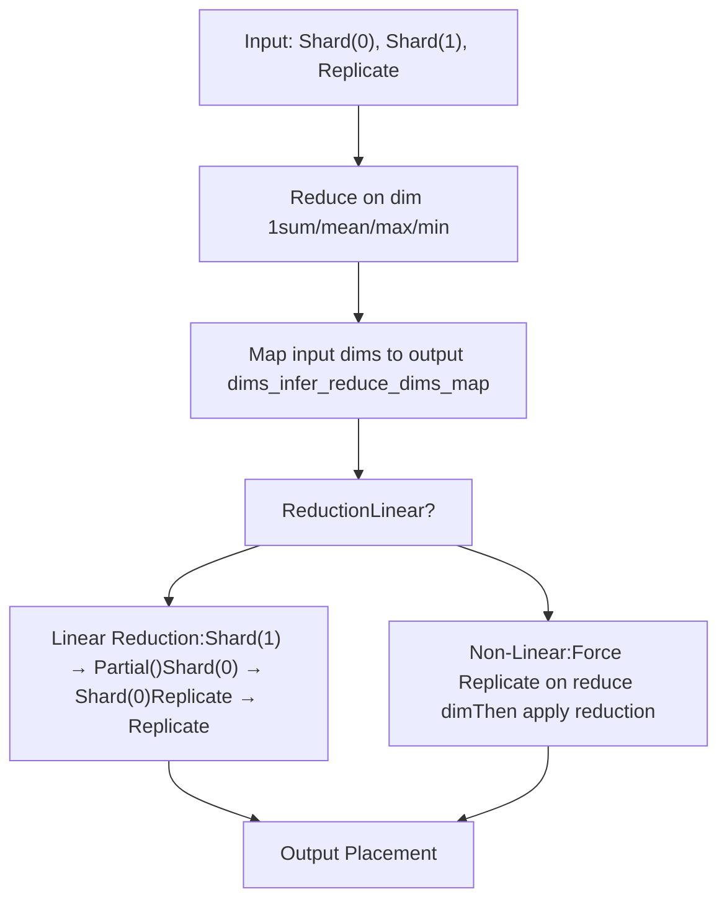
**Linear vs Non-Linear Reductions:**

-   **Linear** (`sum`, `prod`, `mean`, `max`, `min`): Can be computed on sharded data, then reduced
    -   Sharded dimension being reduced → `Partial()` output
    -   Other dimensions preserve their sharding
-   **Non-Linear** (`argmax`, `argmin`): Return indices, cannot use `Partial`
    -   Force replication on reduction dimensions before operation
    -   Prevents incorrect local index values

**Source code:**

-   Linear reductions: [torch/distributed/tensor/\_ops/\_math\_ops.py346-369](https://github.com/pytorch/pytorch/blob/915982a4/torch/distributed/tensor/_ops/_math_ops.py#L346-L369)
-   Argmax/argmin strategy: [torch/distributed/tensor/\_ops/\_math\_ops.py372-402](https://github.com/pytorch/pytorch/blob/915982a4/torch/distributed/tensor/_ops/_math_ops.py#L372-L402)
-   Reduction helper: [torch/distributed/tensor/\_ops/\_math\_ops.py240-304](https://github.com/pytorch/pytorch/blob/915982a4/torch/distributed/tensor/_ops/_math_ops.py#L240-L304)

Sources: [torch/distributed/tensor/\_ops/\_math\_ops.py240-418](https://github.com/pytorch/pytorch/blob/915982a4/torch/distributed/tensor/_ops/_math_ops.py#L240-L418)

---

## Matrix Multiplication Strategies

Matrix multiplication demonstrates the full power of OpStrategy enumeration:

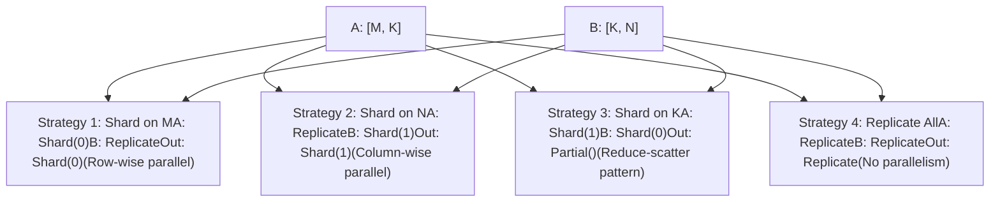
**Strategy generation:** The `mm_single_dim_strategy` function ([torch/distributed/tensor/\_ops/\_matrix\_ops.py157-188](https://github.com/pytorch/pytorch/blob/915982a4/torch/distributed/tensor/_ops/_matrix_ops.py#L157-L188)) generates strategies for a single mesh dimension, which are then expanded to full mesh via `_expand_single_dim_strategy_to_mesh`.

**Einsum integration:** Matrix operations use einsum notation internally (`mk,kn->mn` for mm) to generate strategies systematically ([torch/distributed/tensor/\_ops/\_einsum\_strategy.py](https://github.com/pytorch/pytorch/blob/915982a4/torch/distributed/tensor/_ops/_einsum_strategy.py)).

Sources: [torch/distributed/tensor/\_ops/\_matrix\_ops.py80-214](https://github.com/pytorch/pytorch/blob/915982a4/torch/distributed/tensor/_ops/_matrix_ops.py#L80-L214) [torch/distributed/tensor/\_ops/\_matrix\_ops.py157-188](https://github.com/pytorch/pytorch/blob/915982a4/torch/distributed/tensor/_ops/_matrix_ops.py#L157-L188)

---

## Tensor Metadata Propagation

Before determining output placements, the system must know the output tensor's metadata (shape, stride, dtype):

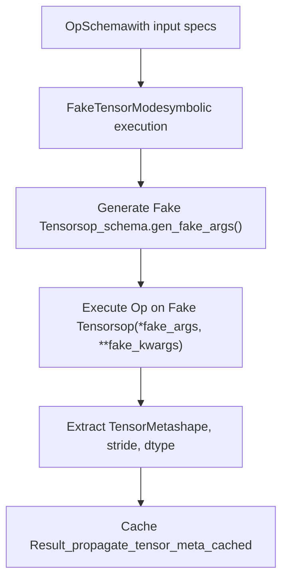
**Key methods:**

-   `_propagate_tensor_meta` ([torch/distributed/tensor/\_sharding\_prop.py391-402](https://github.com/pytorch/pytorch/blob/915982a4/torch/distributed/tensor/_sharding_prop.py#L391-L402)): Main entry point
-   `_propagate_tensor_meta_cached` ([torch/distributed/tensor/\_sharding\_prop.py381-389](https://github.com/pytorch/pytorch/blob/915982a4/torch/distributed/tensor/_sharding_prop.py#L381-L389)): Cached version using `@lru_cache`
-   `_propagate_tensor_meta_non_cached` ([torch/distributed/tensor/\_sharding\_prop.py331-379](https://github.com/pytorch/pytorch/blob/915982a4/torch/distributed/tensor/_sharding_prop.py#L331-L379)): Actual implementation using FakeTensorMode

**Why FakeTensorMode?** Allows symbolic execution without materializing actual tensor data, enabling fast shape inference even for very large tensors.

Sources: [torch/distributed/tensor/\_sharding\_prop.py331-402](https://github.com/pytorch/pytorch/blob/915982a4/torch/distributed/tensor/_sharding_prop.py#L331-L402)

---

## Single-Dim Strategy Expansion

Single-dimension strategies simplify strategy authoring by describing behavior per mesh dimension, then automatically expanding to N-dimensional meshes:

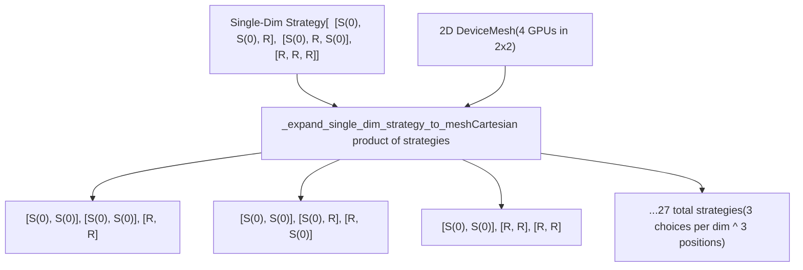
**Expansion algorithm ([torch/distributed/tensor/\_ops/single\_dim\_strategy.py184-380](https://github.com/pytorch/pytorch/blob/915982a4/torch/distributed/tensor/_ops/single_dim_strategy.py#L184-L380)):**

1.  **Fill placeholders**: Replace `_ShardingPlaceholder(dim)` with actual `Shard(dim)` based on tensor metadata
2.  **Insert replication**: Add all-replicate strategy as fallback
3.  **Deduplicate**: Remove duplicate placement combinations using `_get_unique_placements`
4.  **Cartesian product**: For N-dim mesh, generate all combinations of per-dim strategies
5.  **Build OpSpecs**: Create full `OpSpec` objects with redistribute costs

**Benefits:**

-   Write strategy once, works for any mesh dimensionality
-   Reduces code duplication
-   Automatic expansion ensures completeness

Sources: [torch/distributed/tensor/\_ops/single\_dim\_strategy.py71-380](https://github.com/pytorch/pytorch/blob/915982a4/torch/distributed/tensor/_ops/single_dim_strategy.py#L71-L380) [test/distributed/tensor/test\_single\_dim\_strategy.py87-157](https://github.com/pytorch/pytorch/blob/915982a4/test/distributed/tensor/test_single_dim_strategy.py#L87-L157)

---

## Caching and Performance

The sharding propagator employs sophisticated caching to avoid redundant computation:

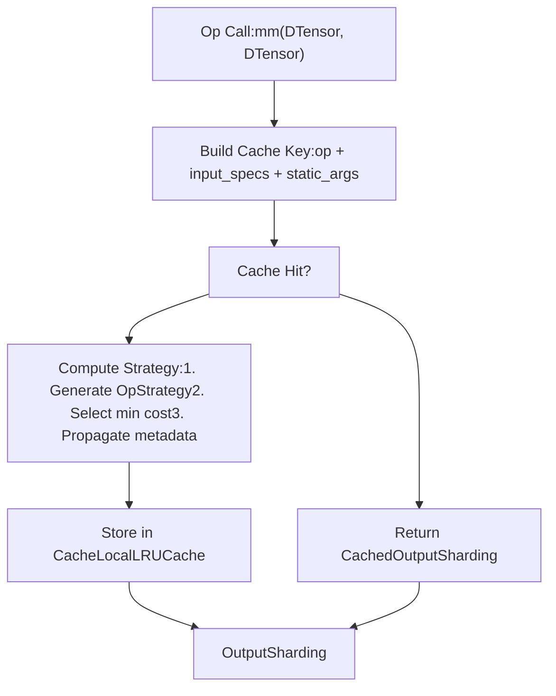
**LocalLRUCache** ([torch/distributed/tensor/\_sharding\_prop.py109-137](https://github.com/pytorch/pytorch/blob/915982a4/torch/distributed/tensor/_sharding_prop.py#L109-L137)): Thread-local LRU cache

-   Each thread has its own cache to avoid synchronization
-   Unbounded size (`lru_cache(None)`)
-   Debug logging for cache hits/misses

**RuntimeSchemaInfo** ([torch/distributed/tensor/\_op\_schema.py280-333](https://github.com/pytorch/pytorch/blob/915982a4/torch/distributed/tensor/_op_schema.py#L280-L333)): Controls what gets cached

-   `static_argnum`: Index of first non-tensor arg to include in cache key
-   `static_kwargkey`: List of kwarg names to include in cache key
-   `needs_pytree`: Whether to flatten nested structures

**Cache clearing:** Tests can call `_clear_sharding_prop_cache()` ([torch/distributed/tensor/debug/\_\_init\_\_.py](https://github.com/pytorch/pytorch/blob/915982a4/torch/distributed/tensor/debug/__init__.py)) to reset cache between test cases.

Sources: [torch/distributed/tensor/\_sharding\_prop.py109-137](https://github.com/pytorch/pytorch/blob/915982a4/torch/distributed/tensor/_sharding_prop.py#L109-L137) [torch/distributed/tensor/\_sharding\_prop.py229-231](https://github.com/pytorch/pytorch/blob/915982a4/torch/distributed/tensor/_sharding_prop.py#L229-L231) [torch/distributed/tensor/\_op\_schema.py280-333](https://github.com/pytorch/pytorch/blob/915982a4/torch/distributed/tensor/_op_schema.py#L280-L333)

---

## Error Handling and Fallbacks

When sharding propagation fails, DTensor provides clear error messages:

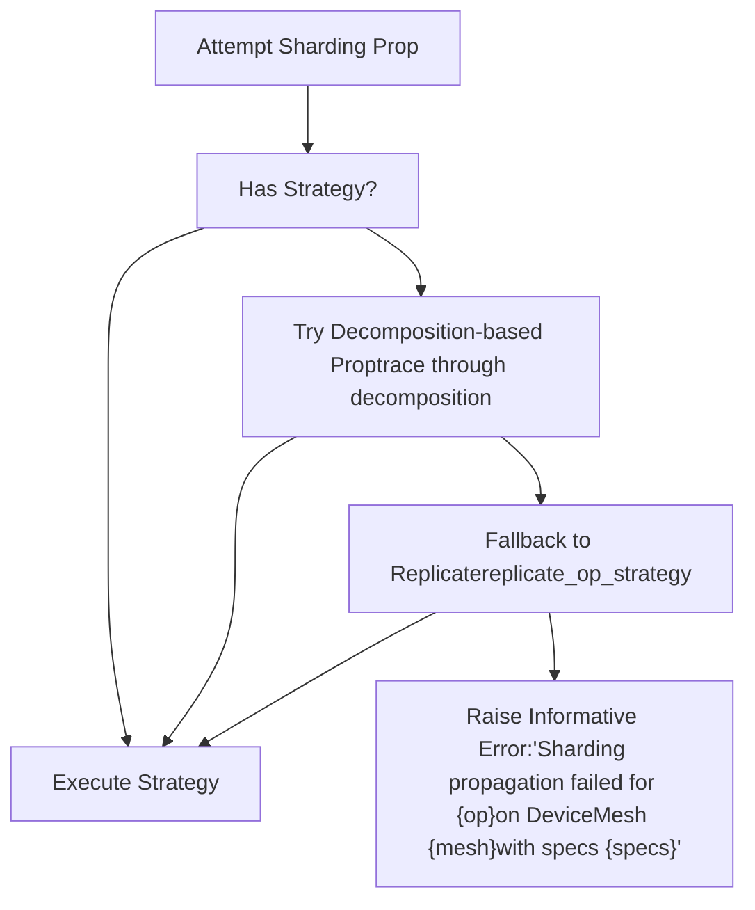
**Error message structure ([test/distributed/tensor/test\_tensor\_ops.py715-720](https://github.com/pytorch/pytorch/blob/915982a4/test/distributed/tensor/test_tensor_ops.py#L715-L720)):**

```
Sharding propagation failed for aten.embedding.default
(Spec(f32<FileRef file-url="https://github.com/pytorch/pytorch/blob/915982a4/2048, 256" undefined  file-path="2048, 256">Hii</FileRef>)), Spec(i64<FileRef file-url="https://github.com/pytorch/pytorch/blob/915982a4/16, 2048" undefined  file-path="16, 2048">Hii</FileRef>R)))
on DeviceMesh((dp=2, tp=2), ...
```
**Decomposition-based fallback ([torch/distributed/tensor/\_decompositions.py50-187](https://github.com/pytorch/pytorch/blob/915982a4/torch/distributed/tensor/_decompositions.py#L50-L187)):**

-   If no registered strategy, try tracing through the op's decomposition
-   Derive strategy from decomposed ops that do have strategies
-   Useful for composite ops built from primitives

Sources: [torch/distributed/tensor/\_sharding\_prop.py421-609](https://github.com/pytorch/pytorch/blob/915982a4/torch/distributed/tensor/_sharding_prop.py#L421-L609) [torch/distributed/tensor/\_decompositions.py50-187](https://github.com/pytorch/pytorch/blob/915982a4/torch/distributed/tensor/_decompositions.py#L50-L187) [test/distributed/tensor/test\_tensor\_ops.py715-720](https://github.com/pytorch/pytorch/blob/915982a4/test/distributed/tensor/test_tensor_ops.py#L715-L720)

---

## Testing Sharding Propagation

The test infrastructure validates strategy correctness:

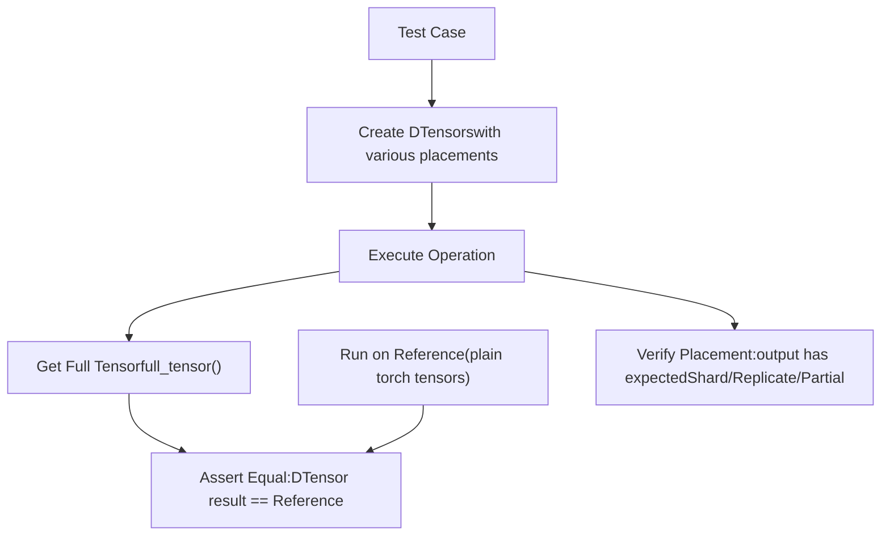
**Key test classes:**

-   `DTensorOpTestBase` ([torch/testing/\_internal/distributed/\_tensor/common\_dtensor.py](https://github.com/pytorch/pytorch/blob/915982a4/torch/testing/_internal/distributed/_tensor/common_dtensor.py)): Base for distributed tests
-   `DTensorConverter` ([test/distributed/tensor/test\_dtensor\_ops.py](https://github.com/pytorch/pytorch/blob/915982a4/test/distributed/tensor/test_dtensor_ops.py)): Converts tensor inputs to DTensors with various placements
-   `validate_sharding_rule_sample` ([test/distributed/tensor/test\_dtensor\_ops.py33](https://github.com/pytorch/pytorch/blob/915982a4/test/distributed/tensor/test_dtensor_ops.py#L33-L33)): Validates a single sharding strategy

**Test coverage:** Tests iterate over:

-   All valid placement combinations (Shard(0-N), Replicate, Partial)
-   Various tensor shapes (evenly/unevenly shardable)
-   Multiple mesh configurations (1D, 2D, 3D meshes)

Sources: [test/distributed/tensor/test\_dtensor\_ops.py483-657](https://github.com/pytorch/pytorch/blob/915982a4/test/distributed/tensor/test_dtensor_ops.py#L483-L657) [test/distributed/tensor/test\_tensor\_ops.py32-516](https://github.com/pytorch/pytorch/blob/915982a4/test/distributed/tensor/test_tensor_ops.py#L32-L516)
