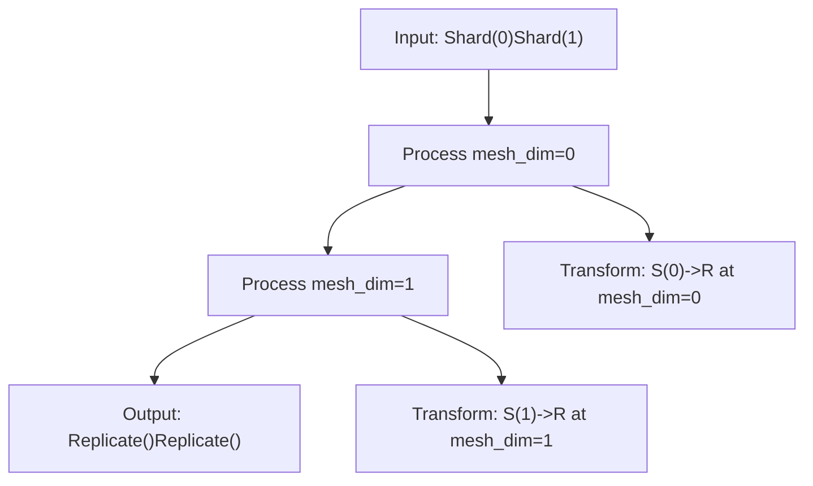
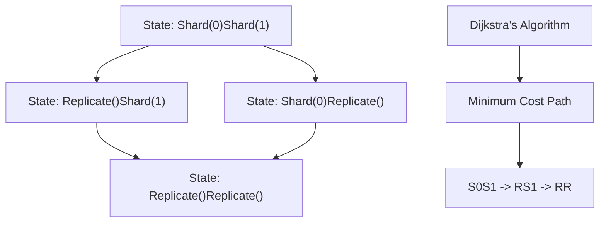
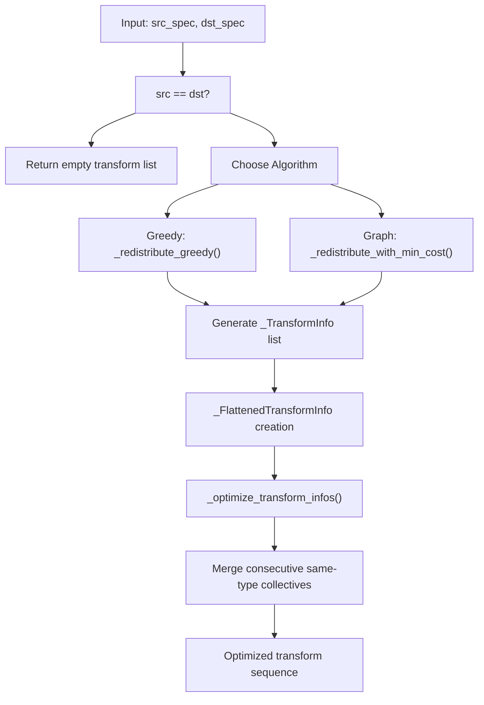
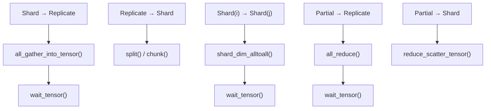
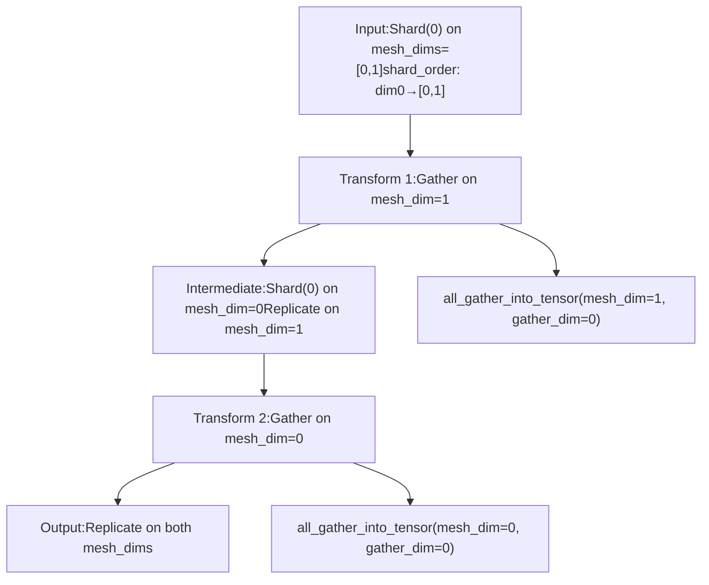

# Redistribution and Communication Planning

Relevant source files

-   [test/distributed/tensor/debug/test\_debug\_mode.py](https://github.com/pytorch/pytorch/blob/915982a4/test/distributed/tensor/debug/test_debug_mode.py)
-   [test/distributed/tensor/experimental/test\_register\_sharding.py](https://github.com/pytorch/pytorch/blob/915982a4/test/distributed/tensor/experimental/test_register_sharding.py)
-   [test/distributed/tensor/test\_decompositions.py](https://github.com/pytorch/pytorch/blob/915982a4/test/distributed/tensor/test_decompositions.py)
-   [test/distributed/tensor/test\_dtensor.py](https://github.com/pytorch/pytorch/blob/915982a4/test/distributed/tensor/test_dtensor.py)
-   [test/distributed/tensor/test\_dtensor\_compile.py](https://github.com/pytorch/pytorch/blob/915982a4/test/distributed/tensor/test_dtensor_compile.py)
-   [test/distributed/tensor/test\_dtensor\_dispatch\_overhead.py](https://github.com/pytorch/pytorch/blob/915982a4/test/distributed/tensor/test_dtensor_dispatch_overhead.py)
-   [test/distributed/tensor/test\_dtensor\_ops.py](https://github.com/pytorch/pytorch/blob/915982a4/test/distributed/tensor/test_dtensor_ops.py)
-   [test/distributed/tensor/test\_math\_ops.py](https://github.com/pytorch/pytorch/blob/915982a4/test/distributed/tensor/test_math_ops.py)
-   [test/distributed/tensor/test\_matrix\_ops.py](https://github.com/pytorch/pytorch/blob/915982a4/test/distributed/tensor/test_matrix_ops.py)
-   [test/distributed/tensor/test\_op\_strategy.py](https://github.com/pytorch/pytorch/blob/915982a4/test/distributed/tensor/test_op_strategy.py)
-   [test/distributed/tensor/test\_placement\_types.py](https://github.com/pytorch/pytorch/blob/915982a4/test/distributed/tensor/test_placement_types.py)
-   [test/distributed/tensor/test\_pointwise\_ops.py](https://github.com/pytorch/pytorch/blob/915982a4/test/distributed/tensor/test_pointwise_ops.py)
-   [test/distributed/tensor/test\_redistribute.py](https://github.com/pytorch/pytorch/blob/915982a4/test/distributed/tensor/test_redistribute.py)
-   [test/distributed/tensor/test\_single\_dim\_strategy.py](https://github.com/pytorch/pytorch/blob/915982a4/test/distributed/tensor/test_single_dim_strategy.py)
-   [test/distributed/tensor/test\_tensor\_ops.py](https://github.com/pytorch/pytorch/blob/915982a4/test/distributed/tensor/test_tensor_ops.py)
-   [test/distributed/tensor/test\_utils.py](https://github.com/pytorch/pytorch/blob/915982a4/test/distributed/tensor/test_utils.py)
-   [test/distributed/tensor/test\_view\_ops.py](https://github.com/pytorch/pytorch/blob/915982a4/test/distributed/tensor/test_view_ops.py)
-   [test/dynamo/test\_aot\_autograd\_cache.py](https://github.com/pytorch/pytorch/blob/915982a4/test/dynamo/test_aot_autograd_cache.py)
-   [torch/\_C/\_distributed.pyi](https://github.com/pytorch/pytorch/blob/915982a4/torch/_C/_distributed.pyi)
-   [torch/\_dynamo/backends/debugging.py](https://github.com/pytorch/pytorch/blob/915982a4/torch/_dynamo/backends/debugging.py)
-   [torch/\_dynamo/backends/distributed.py](https://github.com/pytorch/pytorch/blob/915982a4/torch/_dynamo/backends/distributed.py)
-   [torch/\_dynamo/variables/distributed.py](https://github.com/pytorch/pytorch/blob/915982a4/torch/_dynamo/variables/distributed.py)
-   [torch/\_functorch/\_aot\_autograd/autograd\_cache.py](https://github.com/pytorch/pytorch/blob/915982a4/torch/_functorch/_aot_autograd/autograd_cache.py)
-   [torch/\_inductor/runtime/benchmarking.py](https://github.com/pytorch/pytorch/blob/915982a4/torch/_inductor/runtime/benchmarking.py)
-   [torch/\_library/triton.py](https://github.com/pytorch/pytorch/blob/915982a4/torch/_library/triton.py)
-   [torch/\_meta\_registrations.py](https://github.com/pytorch/pytorch/blob/915982a4/torch/_meta_registrations.py)
-   [torch/csrc/distributed/Placement.h](https://github.com/pytorch/pytorch/blob/915982a4/torch/csrc/distributed/Placement.h)
-   [torch/csrc/distributed/python\_placement.cpp](https://github.com/pytorch/pytorch/blob/915982a4/torch/csrc/distributed/python_placement.cpp)
-   [torch/csrc/distributed/python\_placement.h](https://github.com/pytorch/pytorch/blob/915982a4/torch/csrc/distributed/python_placement.h)
-   [torch/csrc/dynamo/guards.h](https://github.com/pytorch/pytorch/blob/915982a4/torch/csrc/dynamo/guards.h)
-   [torch/distributed/\_functional\_collectives.py](https://github.com/pytorch/pytorch/blob/915982a4/torch/distributed/_functional_collectives.py)
-   [torch/distributed/tensor/README.md](https://github.com/pytorch/pytorch/blob/915982a4/torch/distributed/tensor/README.md)
-   [torch/distributed/tensor/\_api.py](https://github.com/pytorch/pytorch/blob/915982a4/torch/distributed/tensor/_api.py)
-   [torch/distributed/tensor/\_collective\_utils.py](https://github.com/pytorch/pytorch/blob/915982a4/torch/distributed/tensor/_collective_utils.py)
-   [torch/distributed/tensor/\_decompositions.py](https://github.com/pytorch/pytorch/blob/915982a4/torch/distributed/tensor/_decompositions.py)
-   [torch/distributed/tensor/\_dtensor\_spec.py](https://github.com/pytorch/pytorch/blob/915982a4/torch/distributed/tensor/_dtensor_spec.py)
-   [torch/distributed/tensor/\_nonlinear\_redux.py](https://github.com/pytorch/pytorch/blob/915982a4/torch/distributed/tensor/_nonlinear_redux.py)
-   [torch/distributed/tensor/\_op\_schema.py](https://github.com/pytorch/pytorch/blob/915982a4/torch/distributed/tensor/_op_schema.py)
-   [torch/distributed/tensor/\_ops/\_conv\_ops.py](https://github.com/pytorch/pytorch/blob/915982a4/torch/distributed/tensor/_ops/_conv_ops.py)
-   [torch/distributed/tensor/\_ops/\_embedding\_ops.py](https://github.com/pytorch/pytorch/blob/915982a4/torch/distributed/tensor/_ops/_embedding_ops.py)
-   [torch/distributed/tensor/\_ops/\_math\_ops.py](https://github.com/pytorch/pytorch/blob/915982a4/torch/distributed/tensor/_ops/_math_ops.py)
-   [torch/distributed/tensor/\_ops/\_matrix\_ops.py](https://github.com/pytorch/pytorch/blob/915982a4/torch/distributed/tensor/_ops/_matrix_ops.py)
-   [torch/distributed/tensor/\_ops/\_pointwise\_ops.py](https://github.com/pytorch/pytorch/blob/915982a4/torch/distributed/tensor/_ops/_pointwise_ops.py)
-   [torch/distributed/tensor/\_ops/\_random\_ops.py](https://github.com/pytorch/pytorch/blob/915982a4/torch/distributed/tensor/_ops/_random_ops.py)
-   [torch/distributed/tensor/\_ops/\_tensor\_ops.py](https://github.com/pytorch/pytorch/blob/915982a4/torch/distributed/tensor/_ops/_tensor_ops.py)
-   [torch/distributed/tensor/\_ops/\_view\_ops.py](https://github.com/pytorch/pytorch/blob/915982a4/torch/distributed/tensor/_ops/_view_ops.py)
-   [torch/distributed/tensor/\_ops/single\_dim\_strategy.py](https://github.com/pytorch/pytorch/blob/915982a4/torch/distributed/tensor/_ops/single_dim_strategy.py)
-   [torch/distributed/tensor/\_ops/utils.py](https://github.com/pytorch/pytorch/blob/915982a4/torch/distributed/tensor/_ops/utils.py)
-   [torch/distributed/tensor/\_redistribute.py](https://github.com/pytorch/pytorch/blob/915982a4/torch/distributed/tensor/_redistribute.py)
-   [torch/distributed/tensor/\_sharding\_prop.py](https://github.com/pytorch/pytorch/blob/915982a4/torch/distributed/tensor/_sharding_prop.py)
-   [torch/distributed/tensor/\_utils.py](https://github.com/pytorch/pytorch/blob/915982a4/torch/distributed/tensor/_utils.py)
-   [torch/distributed/tensor/debug/\_\_init\_\_.py](https://github.com/pytorch/pytorch/blob/915982a4/torch/distributed/tensor/debug/__init__.py)
-   [torch/distributed/tensor/placement\_types.py](https://github.com/pytorch/pytorch/blob/915982a4/torch/distributed/tensor/placement_types.py)
-   [torch/testing/\_internal/common\_ops\_unbacked.py](https://github.com/pytorch/pytorch/blob/915982a4/torch/testing/_internal/common_ops_unbacked.py)

## Purpose and Scope

This page documents the **redistribution system** in PyTorch DTensor, which is responsible for planning and executing tensor layout transformations between different placements during distributed execution. After [Sharding Propagation](/pytorch/pytorch/4.2.2-sharding-propagation-and-opstrategy) determines the optimal placement strategy for an operation, the redistribution system computes the actual sequence of collective communication operations needed to transform tensors from their current placement to the required target placement.

For information about how placement decisions are made, see [Sharding Propagation and OpStrategy](/pytorch/pytorch/4.2.2-sharding-propagation-and-opstrategy). For tools to observe and debug redistribution behavior, see [DebugMode and Observability](/pytorch/pytorch/4.2.4-debugmode-and-observability).

**Key Responsibilities:**

-   Planning optimal sequences of collective operations to transform tensor placements
-   Executing transformations using PyTorch's functional collectives (`c10d_functional`)
-   Supporting complex multi-dimensional mesh redistributions
-   Optimizing consecutive collectives to reduce communication overhead
-   Tracking shard order for multi-dimensional sharding patterns

## System Architecture

### Core Components

```mermaid
flowchart TD
    DTensor_redistribute["DTensor.redistribute()"]
    redistribute_fn["_redistribute()"]
    redistribute_local["redistribute_local_tensor()"]
    gen_transforms["_gen_transform_infos()"]
    optimize_transforms["_optimize_transform_infos()"]
    TransformInfo["_TransformInfo dataclass"]
    FlattenedInfo["_FlattenedTransformInfo dataclass"]
    use_min_cost["use_min_cost_redistribution_plan context"]
    greedy_plan["_redistribute_greedy()"]
    graph_plan["_redistribute_with_min_cost()"]
    compute_cost["redistribute_cost()"]
    apply_transforms["_apply_redistribute_with_local_tensor()"]
    collective_ops["c10d_functional opsall_gather/reduce_scatter/all_to_all"]

    DTensor --> redistribute_redistribute_fn
    redistribute --> fn_gen_transforms
    gen --> transforms_optimize_transforms
    optimize --> transforms_greedy_plan
    optimize --> transforms_graph_plan
    greedy --> plan_apply_transforms
    graph --> plan_apply_transforms
    apply --> transforms_collective_ops
    use --> min_cost_graph_plan
    compute --> cost_graph_plan
```
Sources: [torch/distributed/tensor/\_redistribute.py1-100](https://github.com/pytorch/pytorch/blob/915982a4/torch/distributed/tensor/_redistribute.py#L1-L100) [torch/distributed/tensor/\_api.py383-456](https://github.com/pytorch/pytorch/blob/915982a4/torch/distributed/tensor/_api.py#L383-L456)

### Transform Information Structures

The redistribution system uses two key data structures to represent placement transformations:

| Structure | Purpose | Key Fields |
| --- | --- | --- |
| `_TransformInfo` | Represents a single transformation step | `src_placement`, `dst_placement`, `mesh_dim`, `transform_type` |
| `_FlattenedTransformInfo` | Sequence of transforms across mesh dims | `src_placements`, `dst_placements`, `transform_infos`, `shard_order` |

**Transform Types:**

-   `"S->R"`: Shard to Replicate (all-gather)
-   `"R->S"`: Replicate to Shard (split)
-   `"S->S"`: Shard-to-Shard on different dims (all-to-all)
-   `"P->R"`: Partial to Replicate (all-reduce)
-   `"R->P"`: Replicate to Partial (no-op, special handling)

Sources: [torch/distributed/tensor/\_redistribute.py95-154](https://github.com/pytorch/pytorch/blob/915982a4/torch/distributed/tensor/_redistribute.py#L95-L154)

## Redistribution Planning Strategies

### Greedy Algorithm (Default)

The greedy algorithm processes each mesh dimension independently, choosing the most direct transformation for each dimension without considering global optimization.


**Algorithm:**

1.  For each mesh dimension in order (0 to N-1):
    -   Compare source and destination placements for that mesh dimension
    -   If different, generate a `_TransformInfo` with the direct transformation type
    -   Track shard order changes if needed

**When Used:**

-   Default for all redistributions
-   Sufficient for most common cases
-   Fast planning with minimal overhead

Sources: [torch/distributed/tensor/\_redistribute.py472-568](https://github.com/pytorch/pytorch/blob/915982a4/torch/distributed/tensor/_redistribute.py#L472-L568)

### Graph-Based Algorithm with Dijkstra's Shortest Path

The graph-based algorithm constructs a complete state space of possible placements and uses Dijkstra's algorithm to find the minimum-cost path through transformations.


**Algorithm:**

1.  Generate all possible placement states for the mesh
2.  Build a directed graph with:
    -   Nodes: each possible placement combination
    -   Edges: legal one-step transformations
    -   Weights: `redistribute_cost()` for each transformation
3.  Run Dijkstra's shortest path from source to target
4.  Return the optimal sequence of transformations

**When Used:**

-   Required for `_StridedShard` placement transformations
-   Can be forced via `use_min_cost_redistribution_plan(True)` context manager
-   Controlled by global flag `_FORCE_MIN_COST_REDISTRIBUTION_PLAN`

Sources: [torch/distributed/tensor/\_redistribute.py570-665](https://github.com/pytorch/pytorch/blob/915982a4/torch/distributed/tensor/_redistribute.py#L570-L665) [torch/distributed/tensor/\_collective\_utils.py346-436](https://github.com/pytorch/pytorch/blob/915982a4/torch/distributed/tensor/_collective_utils.py#L346-L436)

### Cost Model

The `redistribute_cost()` function assigns costs to each transformation type:

```
# From torch/distributed/tensor/_collective_utils.pydef redistribute_cost(mesh, src_placement, dst_placement):    # P->R: all_reduce cost    if src_placement.is_partial() and not dst_placement.is_partial():        return mesh.size(mesh_dim) - 1  # (N-1) communication steps        # S->R: all_gather cost    elif src_placement.is_shard() and dst_placement.is_replicate():        return mesh.size(mesh_dim)  # N-fold data increase        # S->S: all_to_all cost    elif src_placement.is_shard() and dst_placement.is_shard():        return mesh.size(mesh_dim)  # N-way exchange        # R->S: split (local, no communication)    elif src_placement.is_replicate() and dst_placement.is_shard():        return 0  # Free operation
```
Sources: [torch/distributed/tensor/\_collective\_utils.py346-436](https://github.com/pytorch/pytorch/blob/915982a4/torch/distributed/tensor/_collective_utils.py#L346-L436)

## Transform Generation and Optimization

### Transform Generation Pipeline


Sources: [torch/distributed/tensor/\_redistribute.py472-783](https://github.com/pytorch/pytorch/blob/915982a4/torch/distributed/tensor/_redistribute.py#L472-L783)

### Transform Optimization

The `_optimize_transform_infos()` function merges consecutive collective operations of the same type to reduce overhead:

**Optimization Rules:**

| Pattern | Before | After |
| --- | --- | --- |
| Consecutive Gathers | `all_gather(mesh_dim=0)` → `all_gather(mesh_dim=1)` | Single `all_gather_nd([0,1])` |
| Consecutive Reduces | `all_reduce(mesh_dim=0)` → `all_reduce(mesh_dim=1)` | Single `all_reduce_nd([0,1])` |
| Consecutive Scatters | `reduce_scatter(mesh_dim=0)` → `reduce_scatter(mesh_dim=1)` | Single `reduce_scatter_nd([0,1])` |

**Implementation:**

```
def _optimize_transform_infos(transform_infos):    # Group consecutive transforms by type    # Merge transforms of same type with consecutive mesh dims    # Return flattened list with merged operations    pass
```
**Example:**

```
Before optimization:
  [S(0)->R at mesh_dim=0, S(1)->R at mesh_dim=1]
  → Generates: all_gather(dim=0), all_gather(dim=1)

After optimization:
  [Merged S(0)S(1)->RR at mesh_dims=[0,1]]
  → Generates: all_gather_nd(dims=[0,1])
```
**Control Flag:**

-   `_DISABLE_REDISTRIBUTE_TRANSFORM_OPTIMIZATION = True` disables this optimization
-   Useful for debugging or when flattened collectives cause issues

Sources: [torch/distributed/tensor/\_redistribute.py156-282](https://github.com/pytorch/pytorch/blob/915982a4/torch/distributed/tensor/_redistribute.py#L156-L282)

## Communication Primitives Mapping

### Placement Transformation to Collective Operation


Sources: [torch/distributed/tensor/\_redistribute.py327-470](https://github.com/pytorch/pytorch/blob/915982a4/torch/distributed/tensor/_redistribute.py#L327-L470)

### Collective Operation Details

#### 1\. Shard to Replicate: All-Gather

```
# torch/distributed/tensor/_redistribute.py:358-375def _all_gather_to_replicate(local_tensor, mesh, mesh_dim, shard_spec):    # Gather all shards along the mesh dimension    gathered = funcol.all_gather_into_tensor(        local_tensor,         gather_dim=shard_spec.dim,  # tensor dimension        group=(mesh, mesh_dim)       # process group    )    # Wrap for autograd tracking    gathered = funcol._wrap_tensor_autograd(gathered)    # Wait for completion    return funcol.wait_tensor(gathered)
```
**Communication Pattern:**

-   Each rank sends its local shard to all other ranks
-   Result: each rank has a complete replicated copy
-   Cost: O(N) where N = mesh size

#### 2\. Shard(i) to Shard(j): All-to-All

```
# torch/distributed/tensor/_redistribute.py:389-422def _shard_dim_alltoall(local_tensor, mesh, mesh_dim,                         input_shard_dim, output_shard_dim):    # Split input along output_shard_dim into N chunks    # Send chunk i to rank i    # Concatenate received chunks along input_shard_dim    return shard_dim_alltoall(        local_tensor,        mesh,        input_shard_dim,        output_shard_dim,        mesh_dim    )
```
**Communication Pattern:**

-   Each rank sends different slices to different ranks
-   Rearranges data for different sharding dimension
-   Cost: O(N) all-to-all exchange

#### 3\. Partial to Replicate: All-Reduce

```
# torch/distributed/tensor/_redistribute.py:377-387def _partial_to_replicate(local_tensor, mesh, mesh_dim, partial_spec):    # Reduce across all ranks with specified reduce operation    reduced = funcol.all_reduce(        local_tensor,        reduceOp=partial_spec.reduce_op,  # "sum", "avg", "max", etc.        group=(mesh, mesh_dim)    )    return funcol.wait_tensor(reduced)
```
**Reduce Operations:**

-   `"sum"`: Sum all partial values
-   `"avg"`: Average all partial values
-   `"max"`, `"min"`: Element-wise max/min
-   Custom: `_NormPartial` for p-norms with special handling

#### 4\. Replicate to Shard: Local Split

```
# torch/distributed/tensor/_redistribute.py:327-356def _replicate_to_shard(local_tensor, mesh, mesh_dim, shard_spec):    # Pure local operation - no communication    num_chunks = mesh.size(mesh_dim)        # Split into num_chunks along shard dimension    chunks = torch.chunk(local_tensor, num_chunks, dim=shard_spec.dim)        # Return this rank's chunk    my_rank = dist.get_rank(mesh.get_group(mesh_dim))    return chunks[my_rank]
```
**Note:** This is a local operation with zero communication cost.

Sources: [torch/distributed/tensor/\_redistribute.py327-470](https://github.com/pytorch/pytorch/blob/915982a4/torch/distributed/tensor/_redistribute.py#L327-L470)

## Integration with Sharding Propagation

### Placement Decision to Execution Flow

> **[Mermaid sequence]**
> *(图表结构无法解析)*

### Implicit vs Explicit Redistribution

**Implicit Redistribution** (during operation execution):

```
# Triggered automatically by sharding propagationresult = torch.mm(dtensor_A, dtensor_B)# If dtensor_B needs different placement, redistribute happens here
```
**Explicit Redistribution** (user-initiated):

```
# User explicitly requests placement changedtensor = dtensor.redistribute(mesh, [Replicate()]) # Or via full_tensor()global_tensor = dtensor.full_tensor()  # Redistributes to replicated
```
**DebugMode Annotations:**

-   Implicit: `redistribute_input [implicit]`
-   Explicit: `redistribute_input [explicit]`

Sources: [torch/distributed/tensor/\_sharding\_prop.py318-425](https://github.com/pytorch/pytorch/blob/915982a4/torch/distributed/tensor/_sharding_prop.py#L318-L425) [torch/utils/\_debug\_mode.py416-485](https://github.com/pytorch/pytorch/blob/915982a4/torch/utils/_debug_mode.py#L416-L485)

## Multi-Dimensional Mesh Support

### Shard Order Tracking

For multi-dimensional meshes, the system tracks the order in which tensor dimensions are sharded across mesh dimensions using `ShardOrderEntry`:

```
# Example: 2D mesh (4, 2), tensor sharded on both mesh dimsshard_order = (    ShardOrderEntry(tensor_dim=0, mesh_dims=(0, 1)),  # dim-0 sharded across both)
```
**Purpose:**

-   Determines the logical grouping of shards
-   Affects how transformations are applied
-   Critical for correct all-to-all operations in multi-dimensional settings

### Complex Redistribution Example


**Key Considerations:**

-   Order matters: mesh\_dim 1 before mesh\_dim 0 in this case
-   Shard order determines how chunks are organized
-   After each step, update the intermediate placement spec

Sources: [torch/distributed/tensor/\_redistribute.py667-783](https://github.com/pytorch/pytorch/blob/915982a4/torch/distributed/tensor/_redistribute.py#L667-L783) [torch/distributed/tensor/\_dtensor\_spec.py21-140](https://github.com/pytorch/pytorch/blob/915982a4/torch/distributed/tensor/_dtensor_spec.py#L21-L140)

## DebugMode Integration

The redistribution system integrates with `DebugMode` to provide visibility into communication patterns:

### Debug Output Format

```
aten::mm(dt: f32[8, 8]| S(0), dt: f32[8, 32]| S(0))
  redistribute_input [implicit] (1, S(0) -> R)
    redistribute_input(t: f32[1, 32], trace: S(0)->R)
      _c10d_functional::all_gather_into_tensor(t: f32[1, 32], 8, 0)  ->  t: f32[8, 32]
      _c10d_functional::_wrap_tensor_autograd(t: f32[8, 32])  ->  t: f32[8, 32]
      _c10d_functional::wait_tensor(t: f32[8, 32])  ->  t: f32[8, 32]
  aten::mm(t: f32[1, 8], t: f32[8, 32])  ->  t: f32[1, 32]
```
**Information Captured:**

1.  `[implicit]` vs `[explicit]` annotation
2.  Argument index and placement transformation
3.  Full trace of collective operations
4.  Input/output tensor shapes and dtypes
5.  Placement trace string (e.g., `"S(0)->R"`)

### Logging Redistribution Calls

```
# torch/utils/_debug_mode.py:416-485class _RedistributeCall(_DebugCall):    def __init__(self, arg, src_placement, dst_placement,                  transform_info_str, call_depth, is_explicit=False):        self.arg = arg        self.src_placement = src_placement        self.dst_placement = dst_placement        self.transform_info_str = transform_info_str  # e.g., "S(0)->R"        self.is_explicit = is_explicit            def render(self):        annotation = " [explicit] " if self.is_explicit else " [implicit] "        return f"redistribute_input{annotation}({self.arg_str}, {placement_str})"
```
Sources: [torch/utils/\_debug\_mode.py416-485](https://github.com/pytorch/pytorch/blob/915982a4/torch/utils/_debug_mode.py#L416-L485) [test/distributed/tensor/debug/test\_debug\_mode.py287-351](https://github.com/pytorch/pytorch/blob/915982a4/test/distributed/tensor/debug/test_debug_mode.py#L287-L351)

## Advanced Features

### Transform Optimization Control

```
# Disable transform optimization globallyfrom torch.distributed.tensor._redistribute import (    disable_redistribute_transform_optimization) with disable_redistribute_transform_optimization():    # Redistributions will use individual collectives    # instead of merged operations    dtensor = dtensor.redistribute(mesh, [Replicate(), Replicate()])
```
### Force Minimum Cost Planning

```
# Force graph-based planning instead of greedyfrom torch.distributed.tensor._redistribute import (    use_min_cost_redistribution_plan) with use_min_cost_redistribution_plan(enabled=True):    # Uses Dijkstra's algorithm for all redistributions    dtensor = dtensor.redistribute(mesh, target_placements)
```
### Cost Query API

```
# Query cost without executingfrom torch.distributed.tensor._collective_utils import redistribute_cost cost = redistribute_cost(    device_mesh=mesh,    src_spec=current_spec,    dst_spec=target_spec)
```
Sources: [torch/distributed/tensor/\_redistribute.py52-93](https://github.com/pytorch/pytorch/blob/915982a4/torch/distributed/tensor/_redistribute.py#L52-L93)

## Implementation Reference

### Key Functions and Classes

| Symbol | Location | Purpose |
| --- | --- | --- |
| `DTensor.redistribute()` | [torch/distributed/tensor/\_api.py383-456](https://github.com/pytorch/pytorch/blob/915982a4/torch/distributed/tensor/_api.py#L383-L456) | Public API for explicit redistribution |
| `_redistribute()` | [torch/distributed/tensor/\_redistribute.py785-873](https://github.com/pytorch/pytorch/blob/915982a4/torch/distributed/tensor/_redistribute.py#L785-L873) | Main entry point for planning and execution |
| `redistribute_local_tensor()` | [torch/distributed/tensor/\_redistribute.py875-1097](https://github.com/pytorch/pytorch/blob/915982a4/torch/distributed/tensor/_redistribute.py#L875-L1097) | Execution engine for transform application |
| `_gen_transform_infos()` | [torch/distributed/tensor/\_redistribute.py667-783](https://github.com/pytorch/pytorch/blob/915982a4/torch/distributed/tensor/_redistribute.py#L667-L783) | Generates transformation sequence |
| `_optimize_transform_infos()` | [torch/distributed/tensor/\_redistribute.py156-282](https://github.com/pytorch/pytorch/blob/915982a4/torch/distributed/tensor/_redistribute.py#L156-L282) | Merges consecutive collectives |
| `_redistribute_greedy()` | [torch/distributed/tensor/\_redistribute.py472-568](https://github.com/pytorch/pytorch/blob/915982a4/torch/distributed/tensor/_redistribute.py#L472-L568) | Greedy planning algorithm |
| `_redistribute_with_min_cost()` | [torch/distributed/tensor/\_redistribute.py570-665](https://github.com/pytorch/pytorch/blob/915982a4/torch/distributed/tensor/_redistribute.py#L570-L665) | Graph-based planning with Dijkstra |
| `shard_dim_alltoall()` | [torch/distributed/tensor/\_collective\_utils.py165-267](https://github.com/pytorch/pytorch/blob/915982a4/torch/distributed/tensor/_collective_utils.py#L165-L267) | All-to-all implementation for shard changes |
| `redistribute_cost()` | [torch/distributed/tensor/\_collective\_utils.py346-436](https://github.com/pytorch/pytorch/blob/915982a4/torch/distributed/tensor/_collective_utils.py#L346-L436) | Cost calculation for transformations |

### Configuration Flags

| Flag | Type | Purpose |
| --- | --- | --- |
| `_FORCE_MIN_COST_REDISTRIBUTION_PLAN` | `bool | None` | Global control for planning strategy |
| `_DISABLE_REDISTRIBUTE_TRANSFORM_OPTIMIZATION` | `bool` | Disables transform merging optimization |

Sources: [torch/distributed/tensor/\_redistribute.py1-100](https://github.com/pytorch/pytorch/blob/915982a4/torch/distributed/tensor/_redistribute.py#L1-L100)
