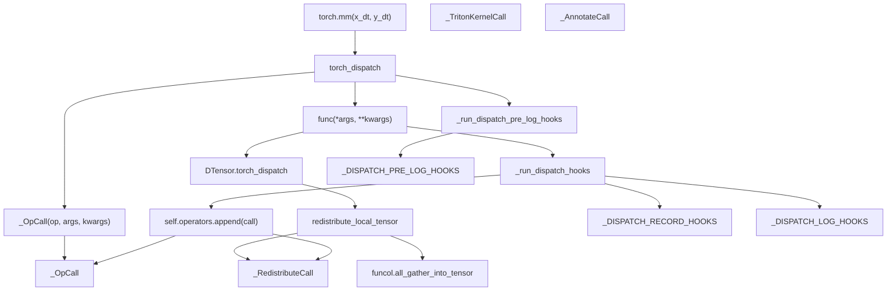
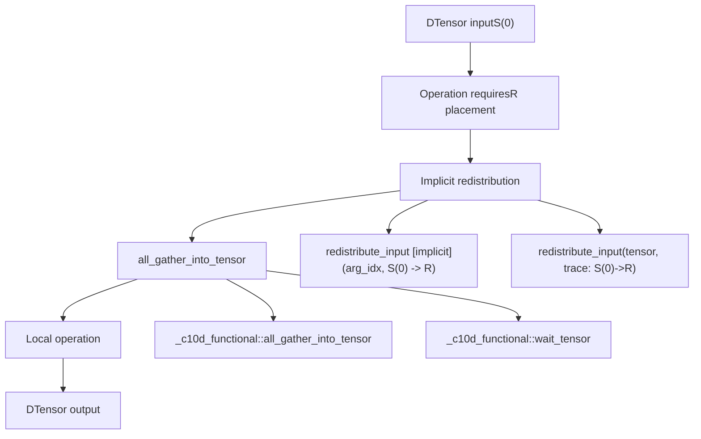
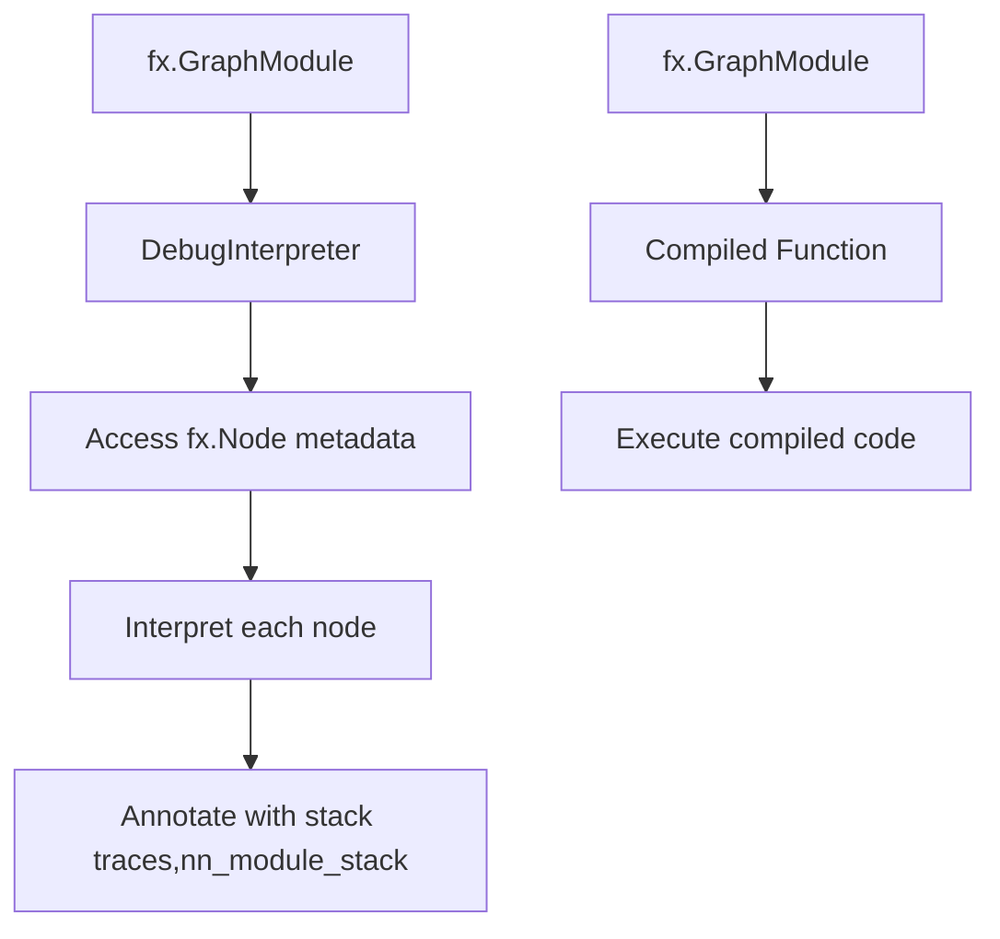
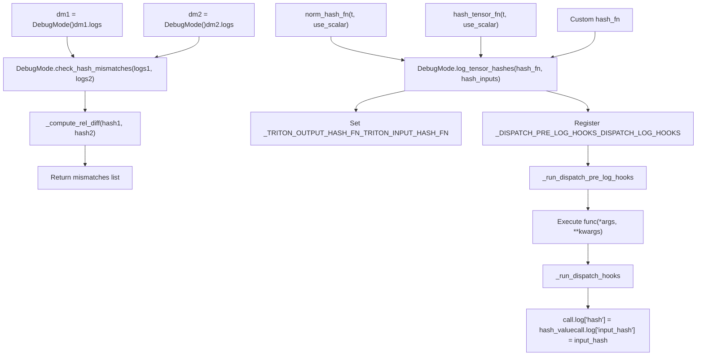
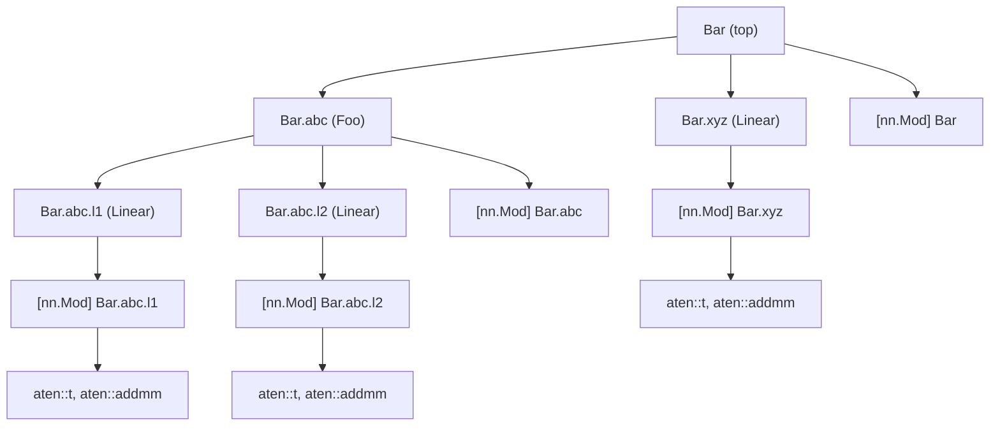

# DebugMode and Observability

Relevant source files

-   [test/distributed/tensor/debug/test\_debug\_mode.py](https://github.com/pytorch/pytorch/blob/915982a4/test/distributed/tensor/debug/test_debug_mode.py)
-   [test/distributed/tensor/test\_dtensor.py](https://github.com/pytorch/pytorch/blob/915982a4/test/distributed/tensor/test_dtensor.py)
-   [test/distributed/tensor/test\_dtensor\_compile.py](https://github.com/pytorch/pytorch/blob/915982a4/test/distributed/tensor/test_dtensor_compile.py)
-   [test/distributed/tensor/test\_placement\_types.py](https://github.com/pytorch/pytorch/blob/915982a4/test/distributed/tensor/test_placement_types.py)
-   [test/distributed/tensor/test\_redistribute.py](https://github.com/pytorch/pytorch/blob/915982a4/test/distributed/tensor/test_redistribute.py)
-   [test/distributed/tensor/test\_utils.py](https://github.com/pytorch/pytorch/blob/915982a4/test/distributed/tensor/test_utils.py)
-   [test/dynamo/test\_aot\_autograd\_cache.py](https://github.com/pytorch/pytorch/blob/915982a4/test/dynamo/test_aot_autograd_cache.py)
-   [torch/\_C/\_distributed.pyi](https://github.com/pytorch/pytorch/blob/915982a4/torch/_C/_distributed.pyi)
-   [torch/\_dynamo/backends/debugging.py](https://github.com/pytorch/pytorch/blob/915982a4/torch/_dynamo/backends/debugging.py)
-   [torch/\_dynamo/backends/distributed.py](https://github.com/pytorch/pytorch/blob/915982a4/torch/_dynamo/backends/distributed.py)
-   [torch/\_dynamo/variables/distributed.py](https://github.com/pytorch/pytorch/blob/915982a4/torch/_dynamo/variables/distributed.py)
-   [torch/\_functorch/\_aot\_autograd/autograd\_cache.py](https://github.com/pytorch/pytorch/blob/915982a4/torch/_functorch/_aot_autograd/autograd_cache.py)
-   [torch/\_inductor/runtime/benchmarking.py](https://github.com/pytorch/pytorch/blob/915982a4/torch/_inductor/runtime/benchmarking.py)
-   [torch/\_library/triton.py](https://github.com/pytorch/pytorch/blob/915982a4/torch/_library/triton.py)
-   [torch/csrc/distributed/Placement.h](https://github.com/pytorch/pytorch/blob/915982a4/torch/csrc/distributed/Placement.h)
-   [torch/csrc/distributed/python\_placement.cpp](https://github.com/pytorch/pytorch/blob/915982a4/torch/csrc/distributed/python_placement.cpp)
-   [torch/csrc/distributed/python\_placement.h](https://github.com/pytorch/pytorch/blob/915982a4/torch/csrc/distributed/python_placement.h)
-   [torch/csrc/dynamo/guards.h](https://github.com/pytorch/pytorch/blob/915982a4/torch/csrc/dynamo/guards.h)
-   [torch/distributed/\_functional\_collectives.py](https://github.com/pytorch/pytorch/blob/915982a4/torch/distributed/_functional_collectives.py)
-   [torch/distributed/tensor/README.md](https://github.com/pytorch/pytorch/blob/915982a4/torch/distributed/tensor/README.md)
-   [torch/distributed/tensor/\_api.py](https://github.com/pytorch/pytorch/blob/915982a4/torch/distributed/tensor/_api.py)
-   [torch/distributed/tensor/\_collective\_utils.py](https://github.com/pytorch/pytorch/blob/915982a4/torch/distributed/tensor/_collective_utils.py)
-   [torch/distributed/tensor/\_dtensor\_spec.py](https://github.com/pytorch/pytorch/blob/915982a4/torch/distributed/tensor/_dtensor_spec.py)
-   [torch/distributed/tensor/\_ops/\_embedding\_ops.py](https://github.com/pytorch/pytorch/blob/915982a4/torch/distributed/tensor/_ops/_embedding_ops.py)
-   [torch/distributed/tensor/\_redistribute.py](https://github.com/pytorch/pytorch/blob/915982a4/torch/distributed/tensor/_redistribute.py)
-   [torch/distributed/tensor/\_utils.py](https://github.com/pytorch/pytorch/blob/915982a4/torch/distributed/tensor/_utils.py)
-   [torch/distributed/tensor/placement\_types.py](https://github.com/pytorch/pytorch/blob/915982a4/torch/distributed/tensor/placement_types.py)

## Purpose and Scope

This document covers `DebugMode`, a debugging infrastructure that provides comprehensive runtime observability for DTensor operations, redistributions, and collective communications. It intercepts PyTorch operations and generates hierarchical string dumps showing operation sequences, placement transformations, and communication patterns.

For DTensor architecture and basic concepts, see [DTensor Architecture and Placement Types](/pytorch/pytorch/4.1.1-processgroup-backends). For redistribution algorithms and communication primitives, see [Redistribution and Communication](/pytorch/pytorch/4.1.2-reducer-and-distributeddataparallel).

## Overview

`DebugMode` is a `TorchDispatchMode` that intercepts PyTorch operations at runtime to provide detailed execution traces. It is particularly valuable for debugging DTensor programs because it exposes:

-   Implicit and explicit redistribution operations
-   Placement transformations (e.g., `S(0)->R`, `P(sum)->S(1)`)
-   Collective communication operations (all\_gather, reduce\_scatter, etc.)
-   Operation hierarchies showing how high-level ops decompose to lower-level primitives
-   Integration with torch.compile to show operations in compiled regions

**Sources:** [torch/utils/\_debug\_mode.py1-33](https://github.com/pytorch/pytorch/blob/915982a4/torch/utils/_debug_mode.py#L1-L33)

## Core Architecture

### TorchDispatchMode Integration


The `DebugMode` class extends `TorchDispatchMode` to intercept all operations passing through PyTorch's dispatcher. When an operation is called:

1.  **Interception**: `__torch_dispatch__` is invoked before the actual operation
2.  **Call object creation**: An appropriate `_DebugCall` subclass is instantiated (e.g., `_OpCall`)
3.  **Pre-execution hooks**: `_run_dispatch_pre_log_hooks` runs with global `_DISPATCH_PRE_LOG_HOOKS`
4.  **Operation execution**: The original operation proceeds normally via `func(*args, **kwargs)`
5.  **Post-execution hooks**: `_run_dispatch_hooks` runs with `_DISPATCH_RECORD_HOOKS` and `_DISPATCH_LOG_HOOKS`
6.  **Storage**: The call object is appended to `self.operators` list

The hook system uses three global lists to allow extensions:

-   `_DISPATCH_PRE_LOG_HOOKS`: Run before operation, can log input state
-   `_DISPATCH_RECORD_HOOKS`: Store data in `call.record` dict (e.g., output tensors)
-   `_DISPATCH_LOG_HOOKS`: Store metadata in `call.log` dict (e.g., hashes)

**Sources:** [torch/utils/\_debug\_mode.py748-1038](https://github.com/pytorch/pytorch/blob/915982a4/torch/utils/_debug_mode.py#L748-L1038) [torch/utils/\_debug\_mode.py76-92](https://github.com/pytorch/pytorch/blob/915982a4/torch/utils/_debug_mode.py#L76-L92) [torch/utils/\_debug\_mode.py618-649](https://github.com/pytorch/pytorch/blob/915982a4/torch/utils/_debug_mode.py#L618-L649)

### Call Tracking Classes


Each call type captures different information:

-   **`_OpCall`**: Standard PyTorch operations with arguments, keyword arguments, and optional output
-   **`_RedistributeCall`**: DTensor redistribution showing source/destination placements and transformation sequence
-   **`_OutputPlacementCall`**: Records output placements for multi-output DTensor operations
-   **`_TritonKernelCall`**: Inductor-generated Triton kernels with pre/post hashes for numerical validation
-   **`_AnnotateCall`**: User annotations and region boundaries (e.g., compiled regions, nn.Module calls)

**Sources:** [torch/utils/\_debug\_mode.py293-608](https://github.com/pytorch/pytorch/blob/915982a4/torch/utils/_debug_mode.py#L293-L608)

### Hierarchical Logging

The `call_depth` attribute tracks operation nesting to produce indented output:

```
torch.mm(dt$0: f32[8, 8]| S(0), dt$1: f32[8, 32]| S(0))  ->  dt$7: f32[8, 32]| S(0)
  aten::mm(dt$0: f32[8, 8]| S(0), dt$1: f32[8, 32]| S(0))
    redistribute_input [implicit] (1, S(0) -> R)
      redistribute_input(t$2: f32[1, 32], trace: S(0)->R)
        _c10d_functional::all_gather_into_tensor(t$2: f32[1, 32], 8, 0)  ->  t$3: f32[8, 32]
        _c10d_functional::wait_tensor(t$3: f32[8, 32])  ->  t$3: f32[8, 32]
    aten::mm(t$5: f32[1, 8], t$3: f32[8, 32])  ->  t$6: f32[1, 32]
```
This structure shows:

-   Top-level user operation (`torch.mm`)
-   ATen-level operation decomposition (`aten::mm`)
-   Implicit redistribution decision
-   Actual collective communication (`all_gather_into_tensor`)
-   Local operation on sharded data

**Sources:** [torch/utils/\_debug\_mode.py1103-1237](https://github.com/pytorch/pytorch/blob/915982a4/torch/utils/_debug_mode.py#L1103-L1237) [test/distributed/tensor/debug/test\_debug\_mode.py63-89](https://github.com/pytorch/pytorch/blob/915982a4/test/distributed/tensor/debug/test_debug_mode.py#L63-L89)

## DTensor-Specific Features

### Redistribution Logging

DebugMode provides special visibility into DTensor redistribution operations, which are normally hidden from users:


Two levels of redistribution logging:

1.  **Outer call**: Shows high-level decision with `[implicit]` or `[explicit]` annotation
2.  **Inner call**: Shows actual tensor transformation with placement trace

**Example output:**

```
aten::mm(dt: f32[8, 8]| S(0), dt: f32[8, 32]| S(0))
  redistribute_input [implicit] (1, S(0) -> R)
    redistribute_input(t: f32[1, 32], trace: S(0)->R)
      _c10d_functional::all_gather_into_tensor(t: f32[1, 32], 8, 0)
```
The `[implicit]` tag indicates this redistribution was automatically inserted by DTensor's sharding propagation, while `[explicit]` appears for user-called `.redistribute()` operations.

**Sources:** [torch/utils/\_debug\_mode.py416-485](https://github.com/pytorch/pytorch/blob/915982a4/torch/utils/_debug_mode.py#L416-L485) [test/distributed/tensor/debug/test\_debug\_mode.py320-350](https://github.com/pytorch/pytorch/blob/915982a4/test/distributed/tensor/debug/test_debug_mode.py#L320-L350)

### Multi-Step Redistribution Traces

For complex redistributions involving multiple mesh dimensions or shard orders, DebugMode shows the complete transformation sequence:

```
redistribute_input(t: f32[8, 16], trace: S(1)[0]S(1)[1]->S(1)R->RR)
  _c10d_functional::all_gather_into_tensor(t: f32[8, 16], 2, 3)
  aten::chunk(t: f32[16, 16], 2)
  aten::cat(['t: f32[8, 16]', 't: f32[8, 16]'], 1)
  _c10d_functional::all_gather_into_tensor(t: f32[8, 32], 4, 1)
  aten::chunk(t: f32[32, 32], 4)
  aten::cat(['t: f32[8, 32]', 't: f32[8, 32]', 't: f32[8, 32]', 't: f32[8, 32]'], 1)
```
The trace `S(1)[0]S(1)[1]->S(1)R->RR` shows three states:

1.  Initial: Tensor dim 1 sharded on mesh dims \[0, 1\]
2.  Intermediate: Tensor dim 1 sharded only on mesh dim 1
3.  Final: Fully replicated

**Sources:** [test/distributed/tensor/debug/test\_debug\_mode.py287-318](https://github.com/pytorch/pytorch/blob/915982a4/test/distributed/tensor/debug/test_debug_mode.py#L287-L318)

### Output Placement Recording

For operations returning multiple DTensor outputs (e.g., `topk`), DebugMode records the placement of each output:

```
aten::topk(dt: f32[8, 16]| S(1), 4, 1)
  -> output: ('R', 'R')
  redistribute_input [implicit] (0, S(1) -> R)
    ...
  aten::topk(t: f32[8, 16], 4, 1)  ->  ('t: f32[8, 4]', 't: i64[8, 4]')
```
The `-> output: ('R', 'R')` line shows both outputs (values and indices) have `Replicate()` placement.

**Sources:** [torch/utils/\_debug\_mode.py487-501](https://github.com/pytorch/pytorch/blob/915982a4/torch/utils/_debug_mode.py#L487-L501) [test/distributed/tensor/debug/test\_debug\_mode.py352-378](https://github.com/pytorch/pytorch/blob/915982a4/test/distributed/tensor/debug/test_debug_mode.py#L352-L378)

## Compilation Integration

### Behavior Under torch.compile

DebugMode operates "under" compilation, meaning:

1.  **Compilation phase**: DebugMode hides itself, allowing Dynamo to trace normally
2.  **Runtime phase**: DebugMode re-engages to log actual execution
3.  **Result**: Compiled code doesn't include DebugMode overhead, but runtime execution is still logged

```
@torch.compile(backend="aot_eager")def fn(x, y):    return (x @ y).sum() with DebugMode() as debug_mode:    result = fn(x_dtensor, y_dtensor) # debug_mode.debug_string() shows runtime execution details
```
**Sources:** [torch/utils/\_debug\_mode.py17-18](https://github.com/pytorch/pytorch/blob/915982a4/torch/utils/_debug_mode.py#L17-L18) [test/distributed/tensor/debug/test\_debug\_mode.py559-575](https://github.com/pytorch/pytorch/blob/915982a4/test/distributed/tensor/debug/test_debug_mode.py#L559-L575)

### DebugInterpreter for AOT Regions


When `run_compile_with_interpreter=True`, DebugMode replaces compiled functions with `DebugInterpreter`, which:

1.  Runs the graph using fx.Interpreter
2.  Accesses fx.Node metadata (stack\_trace, nn\_module\_stack)
3.  Annotates logs with compilation context
4.  Shows region boundaries with `[aot_eager region (compile)]` markers

**Example:**

```
[aot_eager region (compile)] enter
  [nn.Mod (compile)] L['self'].l1
    aten::t(t: f32[8, 8])  ->  t: f32[8, 8]
    aten::addmm(t: f32[8], t: f32[8, 8], t: f32[8, 8])  ->  t: f32[8, 8]
[aot_eager region (compile)] exit
```
**Sources:** [torch/utils/\_debug\_mode.py676-745](https://github.com/pytorch/pytorch/blob/915982a4/torch/utils/_debug_mode.py#L676-L745) [test/distributed/tensor/debug/test\_debug\_mode.py245-286](https://github.com/pytorch/pytorch/blob/915982a4/test/distributed/tensor/debug/test_debug_mode.py#L245-L286)

## Usage Patterns and Configuration

### Basic Usage

```
from torch.utils._debug_mode import DebugMode mesh = DeviceMesh("cuda", list(range(world_size)))x = torch.randn(8, 8)y = torch.randn(8, 32)x_dt = DTensor.from_local(x, mesh, [Shard(0)])y_dt = DTensor.from_local(y, mesh, [Shard(0)]) with DebugMode() as debug_mode:    result = torch.mm(x_dt, y_dt).sum() print(debug_mode.debug_string())
```
**Sources:** [torch/utils/\_debug\_mode.py28-32](https://github.com/pytorch/pytorch/blob/915982a4/torch/utils/_debug_mode.py#L28-L32)

### Configuration Options

| Parameter | Default | Description |
| --- | --- | --- |
| `record_torchfunction` | `False` | Log `__torch_function__` calls (incompatible with compile) |
| `record_faketensor` | `False` | Log operations on FakeTensors |
| `record_realtensor` | `True` | Log operations on real tensors |
| `record_localtensor` | `True` | Log operations on LocalTensor |
| `record_tensor_attributes` | `[]` | List of tensor attributes to display (e.g., custom tags) |
| `record_nn_module` | `False` | Track nn.Module call hierarchy |
| `store_original_args` | `False` | Keep original args/kwargs (memory intensive) |
| `record_stack_trace` | `False` | Capture stack traces for each operation |
| `record_output` | `True` | Record operation outputs |
| `record_ids` | `False` | Annotate with graph-style tensor IDs (e.g., `$0`, `$1`) |
| `record_profiler_context` | `True` | Show profiler.record\_function contexts |
| `run_compile_with_interpreter` | `False` | Use DebugInterpreter for AOT regions |

**Context manager helpers:**

DebugMode provides several context manager class methods for common use cases:

-   `DebugMode.record_outputs()`: Enables output recording without full DebugMode
-   `DebugMode.log_tensor_hashes(hash_fn, hash_inputs)`: Enables tensor hashing
-   `DebugMode.dispatch_hooks(record_hook, log_hook, pre_log_hook)`: Registers custom hooks

Example combining multiple context managers:

```
with (    DebugMode() as dm,    DebugMode.record_outputs(),    DebugMode.log_tensor_hashes(hash_fn=["norm", "hash_tensor"])):    output = model(input) # Access recorded outputsfor op in dm.operators:    if hasattr(op, 'record') and op.record:        print(op.record['output'])
```
**Sources:** [torch/utils/\_debug\_mode.py749-820](https://github.com/pytorch/pytorch/blob/915982a4/torch/utils/_debug_mode.py#L749-L820) [torch/utils/\_debug\_mode.py1585-1634](https://github.com/pytorch/pytorch/blob/915982a4/torch/utils/_debug_mode.py#L1585-L1634)

### Output Interpretation

The `debug_string()` method produces indented, hierarchical output:

**Tensor notation:**

-   `dt`: DTensor
-   `t`: regular Tensor
-   `ft`: FakeTensor
-   `$N`: optional tensor ID when `record_ids=True`
-   `f32[8, 32]`: dtype and shape
-   `| S(0)`: placement specification

**Placement notation:**

-   `S(dim)`: Shard on dimension
-   `S(dim)[mesh_dim0]S(dim)[mesh_dim1]`: Multi-mesh-dim shard with explicit order
-   `R`: Replicate
-   `P(sum)`: Partial with reduce\_op

**Redistribution traces:**

-   `S(0)->R`: Simple transformation
-   `S(1)[0]S(1)[1]->S(1)R->RR`: Multi-step transformation

**Sources:** [torch/utils/\_debug\_mode.py1103-1237](https://github.com/pytorch/pytorch/blob/915982a4/torch/utils/_debug_mode.py#L1103-L1237)

## Advanced Features

### Tensor Hashing for Numerical Debugging


**Usage:**

```
# Log input and output hasheswith (    DebugMode() as dm,    DebugMode.log_tensor_hashes(hash_fn="norm", hash_inputs=True)):    output = model(input) # Output includes hashes# aten::add(t: i64[], 1)  ->  t: i64[]  # {'input_hash': ((1.0, None), {}), 'hash': 2.0}
```
**Comparing runs:**

```
with DebugMode() as dm1, DebugMode.log_tensor_hashes():    output1 = model(input1) with DebugMode() as dm2, DebugMode.log_tensor_hashes():    output2 = model(input2) mismatches = DebugMode.check_hash_mismatches(dm1.logs, dm2.logs)# Returns list of dicts: [{'call': 'aten::sin', 'hash1': ..., 'hash2': ..., 'rel_diff': ...}, ...]
```
**Hash functions:**

The `hash_fn` parameter accepts:

-   `"norm"`: Uses `norm_hash_fn` - computes L1 norm in float64/complex128 for stability
-   `"hash_tensor"`: Uses `hash_tensor_fn` - wraps `torch.hash_tensor` for exact bitwise comparison
-   `["norm", "hash_tensor"]`: Computes both hashes, stored as tuple in `call.log['hash']`
-   Custom callable: Any function `(tensor) -> scalar`

**Implementation details:**

-   `norm_hash_fn(t, use_scalar)`: Converts to float64/complex128, handles NaN/inf, computes L1 norm
-   `hash_tensor_fn(t, use_scalar)`: Converts to int64/float64/complex128, calls `torch.hash_tensor`
-   For DTensor inputs, hashes are computed on local tensors via `dt.to_local()`
-   Relative difference computed as `|hash1 - hash2| / max(|hash1|, |hash2|, 1e-10)`

**Sources:** [torch/utils/\_debug\_mode.py173-224](https://github.com/pytorch/pytorch/blob/915982a4/torch/utils/_debug_mode.py#L173-L224) [torch/utils/\_debug\_mode.py195-200](https://github.com/pytorch/pytorch/blob/915982a4/torch/utils/_debug_mode.py#L195-L200) [test/distributed/tensor/debug/test\_debug\_mode.py884-906](https://github.com/pytorch/pytorch/blob/915982a4/test/distributed/tensor/debug/test_debug_mode.py#L884-L906)

### Stack Trace Recording

When `record_stack_trace=True`, each operation captures its Python call stack:

```
with DebugMode(record_stack_trace=True) as debug_mode:    out = model(input)    out.backward() # Access stack trace for specific operationop_call = debug_mode.operators[10]print(op_call.stack_trace)  # Full Python stackprint(op_call.fwd_stack_trace)  # Forward stack for backward ops
```
For compiled regions with interpreter mode, stack traces come from fx.Node metadata:

```
with DebugMode(    record_stack_trace=True,    run_compile_with_interpreter=True) as debug_mode:    out = torch.compile(model)(input) # Stack traces point to original user code, not compiled graph
```
**Sources:** [torch/utils/\_debug\_mode.py226-254](https://github.com/pytorch/pytorch/blob/915982a4/torch/utils/_debug_mode.py#L226-L254) [test/distributed/tensor/debug/test\_debug\_mode.py245-286](https://github.com/pytorch/pytorch/blob/915982a4/test/distributed/tensor/debug/test_debug_mode.py#L245-L286)

### nn.Module Tracking


**Usage:**

```
class Model(nn.Module):    def __init__(self):        super().__init__()        self.layer1 = nn.Linear(8, 8)        self.layer2 = nn.Linear(8, 8)        def forward(self, x):        return self.layer2(self.layer1(x)) with DebugMode(record_nn_module=True) as debug_mode:    model(input) # Output shows module hierarchy with operations
```
For compiled regions, module tracking uses `nn_module_stack` from fx.Node metadata:

```
[aot_eager region (compile)] enter
  [nn.Mod (compile)] L['self'].layer1
    aten::t(...)
    aten::addmm(...)
  [nn.Mod (compile)] L['self'].layer2
    aten::t(...)
    aten::addmm(...)
[aot_eager region (compile)] exit
```
**Sources:** [torch/utils/\_debug\_mode.py1385-1514](https://github.com/pytorch/pytorch/blob/915982a4/torch/utils/_debug_mode.py#L1385-L1514) [test/distributed/tensor/debug/test\_debug\_mode.py625-678](https://github.com/pytorch/pytorch/blob/915982a4/test/distributed/tensor/debug/test_debug_mode.py#L625-L678)

### Triton Kernel Logging

DebugMode can intercept and log Inductor-generated Triton kernels via `_TritonKernelCall`:

```
def call_triton(x, y):    output = torch.zeros_like(x)    n_elements = output.numel()    grid = lambda meta: (triton.cdiv(n_elements, meta["BLOCK_SIZE"]),)    add_kernel<FileRef file-url="https://github.com/pytorch/pytorch/blob/915982a4/grid" undefined  file-path="grid">Hii</FileRef>    return output with DebugMode() as debug_mode:    torch.compile(call_triton)(x, y) # Output includes Triton kernel calls# [triton] add_kernel(x=t: f32[128], y=t: f32[128], output=t: f32[128], n_elements=128)
```
With hash logging:

```
with (    DebugMode() as dm,    DebugMode.log_tensor_hashes()):    torch.compile(call_triton)(x, y) # [triton] add_kernel(...)#   # pre-kernel hashes: {x: 123.45, y: 67.89}#   # post-kernel hashes: {output: 191.34}
```
**Implementation details:**

Triton kernel interception requires special handling since kernels aren't dispatched through `__torch_dispatch__`. Instead:

1.  Inductor's kernel wrapper captures kernel launches
2.  Pre-kernel hashes computed using `_TRITON_INPUT_HASH_FN` global
3.  Device synchronization performed via `device_interface.synchronize()`
4.  Post-kernel hashes and outputs captured using `_TRITON_OUTPUT_HASH_FN` and `_RECORD_TRITON_OUTPUTS` globals
5.  `_TritonKernelCall.finalize()` method handles synchronization and data capture

The `_TritonKernelCall` class stores kernel name, arguments, and optional pre/post hashes for debugging numerical issues in compiled kernels.

**Sources:** [torch/utils/\_debug\_mode.py503-587](https://github.com/pytorch/pytorch/blob/915982a4/torch/utils/_debug_mode.py#L503-L587) [torch/utils/\_debug\_mode.py84-90](https://github.com/pytorch/pytorch/blob/915982a4/torch/utils/_debug_mode.py#L84-L90) [test/distributed/tensor/debug/test\_debug\_mode.py858-882](https://github.com/pytorch/pytorch/blob/915982a4/test/distributed/tensor/debug/test_debug_mode.py#L858-L882)

### Custom Annotations

Users can add custom annotations to debug logs using `DebugMode._annotate()`:

```
class MyModel(nn.Module):    def forward(self, x):        DebugMode._annotate("preprocessing")        x = self.preprocess(x)                DebugMode._annotate("main computation")        x = self.compute(x)                return x with DebugMode() as debug_mode:    model(input) # Output:# [annotate] preprocessing#   aten::add(...)# [annotate] main computation#   aten::mm(...)
```
**Implementation details:**

The `_annotate()` function is registered as a custom operator `torch.ops.debug_mode_ops.annotate` to work correctly in compiled graphs:

```
@torch.library.custom_op("debug_mode_ops::annotate", mutates_args=())def _annotate(tag: str) -> None:    # Special-cased in DebugMode.__torch_dispatch__    return None
```
The operator is decorated with `torch._dynamo.dont_skip_tracing` to ensure it's captured in Dynamo graphs, and marked as side-effectful to prevent DCE (dead code elimination) in AOT Autograd. For Inductor backend, a no-op lowering is registered.

Annotations work in both eager and compiled modes (with AOT backends).

**Sources:** [torch/utils/\_debug\_mode.py665-673](https://github.com/pytorch/pytorch/blob/915982a4/torch/utils/_debug_mode.py#L665-L673) [torch/utils/\_debug\_mode.py269-291](https://github.com/pytorch/pytorch/blob/915982a4/torch/utils/_debug_mode.py#L269-L291) [test/distributed/tensor/debug/test\_debug\_mode.py562-608](https://github.com/pytorch/pytorch/blob/915982a4/test/distributed/tensor/debug/test_debug_mode.py#L562-L608)

## Integration with Benchmarking

When Inductor performs autotuning, DebugMode logging is temporarily disabled to avoid polluting logs with benchmark kernel launches:

```
# In torch._inductor.runtime.benchmarkingfrom torch.utils._debug_mode import _IN_INDUCTOR_BENCHMARK def benchmark_gpu(...):    global _IN_INDUCTOR_BENCHMARK    _IN_INDUCTOR_BENCHMARK = True    try:        # Benchmark different kernel configurations        # (DebugMode won't log these)        ...    finally:        _IN_INDUCTOR_BENCHMARK = False
```
This ensures `debug_string()` only shows actual execution, not autotuning overhead.

**Sources:** [torch/utils/\_debug\_mode.py81-83](https://github.com/pytorch/pytorch/blob/915982a4/torch/utils/_debug_mode.py#L81-L83) [torch/\_inductor/runtime/benchmarking.py15](https://github.com/pytorch/pytorch/blob/915982a4/torch/_inductor/runtime/benchmarking.py#L15-L15)
