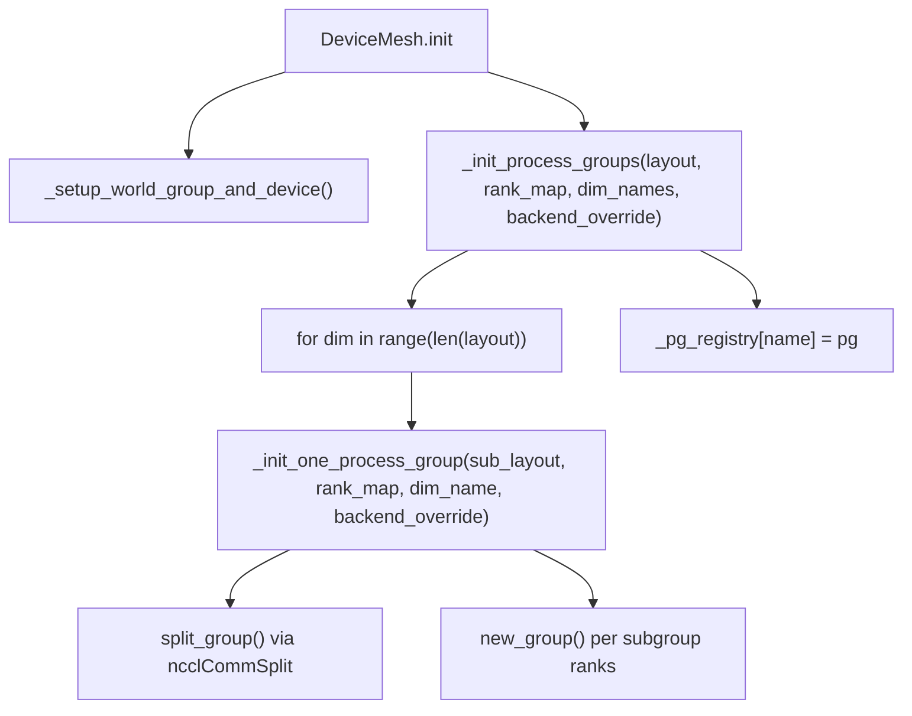
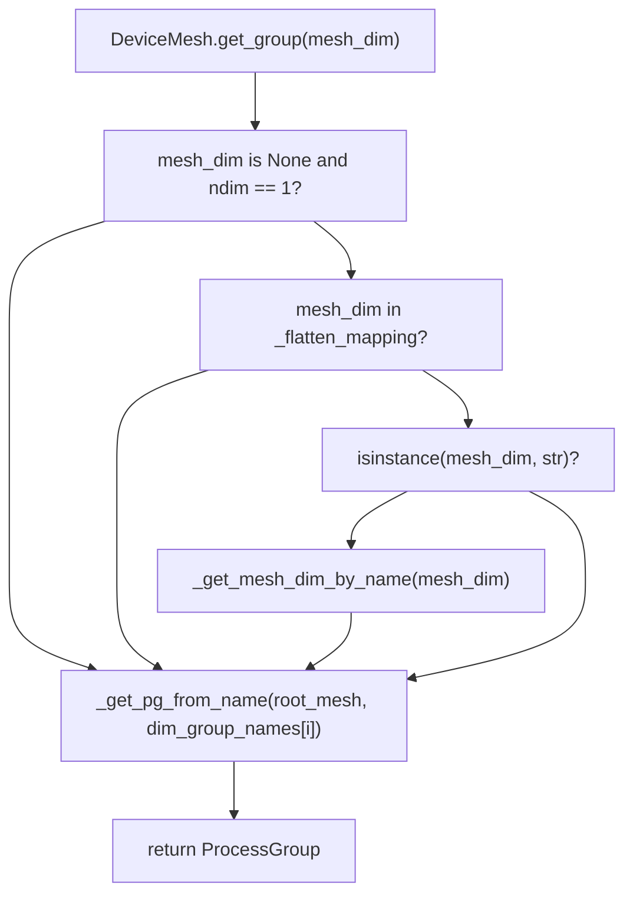

# DeviceMesh and Device Topology

Relevant source files

-   [test/distributed/\_pycute/test\_coalesce.py](https://github.com/pytorch/pytorch/blob/915982a4/test/distributed/_pycute/test_coalesce.py)
-   [test/distributed/\_pycute/test\_complement.py](https://github.com/pytorch/pytorch/blob/915982a4/test/distributed/_pycute/test_complement.py)
-   [test/distributed/\_pycute/test\_composition.py](https://github.com/pytorch/pytorch/blob/915982a4/test/distributed/_pycute/test_composition.py)
-   [test/distributed/\_pycute/test\_int\_tuple.py](https://github.com/pytorch/pytorch/blob/915982a4/test/distributed/_pycute/test_int_tuple.py)
-   [test/distributed/\_pycute/test\_left\_inverse.py](https://github.com/pytorch/pytorch/blob/915982a4/test/distributed/_pycute/test_left_inverse.py)
-   [test/distributed/\_pycute/test\_right\_inverse.py](https://github.com/pytorch/pytorch/blob/915982a4/test/distributed/_pycute/test_right_inverse.py)
-   [test/distributed/\_pycute/test\_typing.py](https://github.com/pytorch/pytorch/blob/915982a4/test/distributed/_pycute/test_typing.py)
-   [test/distributed/test\_device\_mesh.py](https://github.com/pytorch/pytorch/blob/915982a4/test/distributed/test_device_mesh.py)
-   [torch/distributed/\_composable/checkpoint\_activation.py](https://github.com/pytorch/pytorch/blob/915982a4/torch/distributed/_composable/checkpoint_activation.py)
-   [torch/distributed/\_composable/replicate.py](https://github.com/pytorch/pytorch/blob/915982a4/torch/distributed/_composable/replicate.py)
-   [torch/distributed/\_local\_tensor/\_\_init\_\_.py](https://github.com/pytorch/pytorch/blob/915982a4/torch/distributed/_local_tensor/__init__.py)
-   [torch/distributed/\_local\_tensor/\_c10d.py](https://github.com/pytorch/pytorch/blob/915982a4/torch/distributed/_local_tensor/_c10d.py)
-   [torch/distributed/\_mesh\_layout.py](https://github.com/pytorch/pytorch/blob/915982a4/torch/distributed/_mesh_layout.py)
-   [torch/distributed/\_ops/device\_mesh.py](https://github.com/pytorch/pytorch/blob/915982a4/torch/distributed/_ops/device_mesh.py)
-   [torch/distributed/\_pycute/\_\_init\_\_.py](https://github.com/pytorch/pytorch/blob/915982a4/torch/distributed/_pycute/__init__.py)
-   [torch/distributed/\_pycute/int\_tuple.py](https://github.com/pytorch/pytorch/blob/915982a4/torch/distributed/_pycute/int_tuple.py)
-   [torch/distributed/\_pycute/layout.py](https://github.com/pytorch/pytorch/blob/915982a4/torch/distributed/_pycute/layout.py)
-   [torch/distributed/\_pycute/typing.py](https://github.com/pytorch/pytorch/blob/915982a4/torch/distributed/_pycute/typing.py)
-   [torch/distributed/device\_mesh.py](https://github.com/pytorch/pytorch/blob/915982a4/torch/distributed/device_mesh.py)
-   [torch/distributed/optim/zero\_redundancy\_optimizer.py](https://github.com/pytorch/pytorch/blob/915982a4/torch/distributed/optim/zero_redundancy_optimizer.py)
-   [torch/distributed/tensor/examples/comm\_mode\_features\_example.py](https://github.com/pytorch/pytorch/blob/915982a4/torch/distributed/tensor/examples/comm_mode_features_example.py)
-   [torch/distributed/tensor/examples/flex\_attention\_cp.py](https://github.com/pytorch/pytorch/blob/915982a4/torch/distributed/tensor/examples/flex_attention_cp.py)
-   [torch/distributed/tensor/examples/torchrec\_sharding\_example.py](https://github.com/pytorch/pytorch/blob/915982a4/torch/distributed/tensor/examples/torchrec_sharding_example.py)
-   [torch/distributed/tensor/examples/visualize\_sharding\_example.py](https://github.com/pytorch/pytorch/blob/915982a4/torch/distributed/tensor/examples/visualize_sharding_example.py)
-   [torch/testing/\_internal/distributed/\_tensor/common\_dtensor.py](https://github.com/pytorch/pytorch/blob/915982a4/torch/testing/_internal/distributed/_tensor/common_dtensor.py)

## Purpose and Scope

This page documents the `DeviceMesh` class, its internal layout algebra (`_MeshLayout`), ProcessGroup management per mesh dimension, the `init_device_mesh` factory function, and the `LocalTensor` single-process simulation mode. These components form the device topology layer that all DTensor-based distributed training relies on.

For information about how DTensor uses a `DeviceMesh` to represent sharding placements, see [4.2.1](/pytorch/pytorch/4.2.1-dtensor-architecture-and-placement-types). For how collective operations are planned across mesh dimensions, see [4.2.3](/pytorch/pytorch/4.2.3-redistribution-and-communication-planning). For the underlying `ProcessGroup` abstraction that `DeviceMesh` wraps, see [4.1.1](/pytorch/pytorch/4.1.1-processgroup-backends).

---

## Overview

`DeviceMesh` represents a cluster of devices as an N-dimensional array of global process ranks. Each dimension of the mesh corresponds to a parallelism axis (e.g., data parallelism, tensor parallelism, pipeline parallelism). The mesh manages one `ProcessGroup` per dimension, which is used to route collective communications.

The design follows the SPMD model: every process in the job runs the same Python code and constructs an identical mesh. The mesh tensor must be identical across all ranks; inconsistency leads to hangs.

```
mesh = [[0, 1, 2, 3],
        [4, 5, 6, 7]]
```
In this 2×4 mesh, dimension 0 (rows) connects ranks across hosts, and dimension 1 (columns) connects ranks within a host.

---

## Key Classes

### `DeviceMesh`

Defined in [torch/distributed/device\_mesh.py151-870](https://github.com/pytorch/pytorch/blob/915982a4/torch/distributed/device_mesh.py#L151-L870)

`DeviceMesh` is a subclass of `torch._opaque_base.OpaqueBase`. Its primary internal state:

| Field | Type | Purpose |
| --- | --- | --- |
| `_device_type` | `str` | Device type: `"cuda"`, `"cpu"`, etc. |
| `_layout` | `_MeshLayout` | CuTe-style layout encoding shape and strides of the mesh |
| `_rank_map` | `torch.Tensor` | 1-D flat tensor mapping layout indices to global ranks |
| `_mesh_dim_names` | `tuple[str, ...]` | Optional names for each mesh dimension |
| `_dim_group_names` | `list[GroupName]` | Names of the per-dimension `ProcessGroup` objects |
| `_pg_registry` | `dict[str, ProcessGroup]` | Cache of name → `ProcessGroup` for fast lookup during `torch.compile` |
| `_root_mesh` | `DeviceMesh` | Reference to the parent mesh when this is a submesh |
| `_flatten_mapping` | `dict[str, DeviceMesh]` | Maps flattened dimension names to their mesh objects |
| `_coordinate_on_dim` | `tuple[int, ...]` | This rank's coordinates in the mesh |

### `_MeshLayout`

Defined in [torch/distributed/\_mesh\_layout.py26-320](https://github.com/pytorch/pytorch/blob/915982a4/torch/distributed/_mesh_layout.py#L26-L320)

`_MeshLayout` is a frozen dataclass that stores a `(shape, stride)` pair and provides layout algebra operations. It is the internal bookkeeping layer that decouples the mesh topology from the actual rank assignment in `_rank_map`.

### `_MeshEnv`

Defined in [torch/distributed/device\_mesh.py94-140](https://github.com/pytorch/pytorch/blob/915982a4/torch/distributed/device_mesh.py#L94-L140)

`_MeshEnv` is a `threading.local` singleton (`_mesh_resources`) that holds a stack of active `DeviceMesh` objects. `DeviceMesh` implements the context manager protocol (`__enter__` / `__exit__`) to push/pop itself onto this stack. DTensor operations consult `_mesh_resources.get_current_mesh()` to identify the active mesh when one is not explicitly provided.

---

## Architecture

**DeviceMesh Internal Structure**


Sources: [torch/distributed/device\_mesh.py151-210](https://github.com/pytorch/pytorch/blob/915982a4/torch/distributed/device_mesh.py#L151-L210) [torch/distributed/\_mesh\_layout.py26-100](https://github.com/pytorch/pytorch/blob/915982a4/torch/distributed/_mesh_layout.py#L26-L100)

---

## `_MeshLayout` and the CuTe Layout Algebra

`_MeshLayout` borrows the Layout concept from [NVIDIA CuTe](https://docs.nvidia.com/cutlass/media/docs/cpp/cute/02_layout_algebra.html), adapted to PyTorch's lexicographic ordering. A layout is a `(shape, stride)` pair that maps logical coordinates to linear indices (rank indices in this context).

The underlying primitive types are defined in [torch/distributed/\_pycute/](https://github.com/pytorch/pytorch/blob/915982a4/torch/distributed/_pycute/):

| Module | Key Exports |
| --- | --- |
| `_pycute/int_tuple.py` | `IntTuple`, `flatten`, `suffix_product`, `crd2idx`, `idx2crd` |
| `_pycute/layout.py` | `Layout`, `coalesce`, `complement`, `composition` |
| `_pycute/__init__.py` | Re-exports all of the above |

**Key `_MeshLayout` Operations**

| Method | Description |
| --- | --- |
| `numel()` | Product of all sizes — total number of ranks in this layout |
| `cosize()` | Codomain size: largest rank index the layout can produce + 1 |
| `complement(world_size)` | Computes the complementary layout needed to fill up `world_size` |
| `coalesce()` | Merges adjacent dimensions with compatible strides |
| `composition(layout)` | Applies `layout` as a selector over `self` |
| `remap_to_tensor(rank_map)` | Materializes the layout as a `torch.Tensor` indexed into `rank_map` |
| `all_ranks_from_zero()` | Enumerates all rank indices from coordinate `0` using the layout |
| `global_ranks(world_size)` | Returns all rank groups for this layout over `world_size` ranks |
| `check_non_overlap()` | Validates that no two coordinates map to the same rank index |

**How `remap_to_tensor` works**

Given a 1-D `rank_map` holding the actual global ranks and a layout, `remap_to_tensor` calls `as_strided` using the layout's complement and then reshapes the result. This produces a tensor whose shape matches the mesh dimensions:

[torch/distributed/\_mesh\_layout.py274-320](https://github.com/pytorch/pytorch/blob/915982a4/torch/distributed/_mesh_layout.py#L274-L320)

**Example: 2×4 mesh on 8 ranks**

-   Layout: shape=`(2, 4)`, stride=`(4, 1)` (row-major)
-   `rank_map`: `[0, 1, 2, 3, 4, 5, 6, 7]`
-   `remap_to_tensor` produces `[[0,1,2,3],[4,5,6,7]]`

**\_MeshLayout Complement and Global Ranks**

For a mesh dimension with layout `(4:1)` and `world_size=8`:

-   `complement(8)` = `(2:4)` — the complementary offset layout
-   `global_ranks(8)` = `[[0,1,2,3], [4,5,6,7]]` — one group per complementary offset

Sources: [torch/distributed/\_mesh\_layout.py1-320](https://github.com/pytorch/pytorch/blob/915982a4/torch/distributed/_mesh_layout.py#L1-L320) [torch/distributed/\_pycute/int\_tuple.py1-286](https://github.com/pytorch/pytorch/blob/915982a4/torch/distributed/_pycute/int_tuple.py#L1-L286) [torch/distributed/\_pycute/layout.py1-300](https://github.com/pytorch/pytorch/blob/915982a4/torch/distributed/_pycute/layout.py#L1-L300)

---

## ProcessGroup Initialization

When a `DeviceMesh` is created with `_init_backend=True` (the default), two steps run:

1.  **World group setup** via `_setup_world_group_and_device` — ensures `init_process_group` has been called and selects the device for the current process.
2.  **Per-dimension group creation** via `_init_process_groups` — creates one `ProcessGroup` per mesh dimension.

**ProcessGroup Initialization Flow**


Sources: [torch/distributed/device\_mesh.py299-326](https://github.com/pytorch/pytorch/blob/915982a4/torch/distributed/device_mesh.py#L299-L326) [torch/distributed/device\_mesh.py492-619](https://github.com/pytorch/pytorch/blob/915982a4/torch/distributed/device_mesh.py#L492-L619)

**Process Group Strategy**

`_init_one_process_group` uses three strategies, in priority order:

1.  **World-spanning single group**: If the dimension covers all ranks and no `backend_override` is set, reuse the default process group (or create `mesh_default`).
2.  **`split_group` / `ncclCommSplit`**: If the default group has `bound_device_id` (eager NCCL init) or `dist_config.use_torchcomms` is set, call `split_group` once for the entire dimension. This is more efficient, making only one collective API call per dimension.
3.  **`new_group` loop**: Otherwise, iterate over all rank combinations for the dimension and call `new_group` for each subgroup.

[torch/distributed/device\_mesh.py492-590](https://github.com/pytorch/pytorch/blob/915982a4/torch/distributed/device_mesh.py#L492-L590)

**Naming convention**: The group name for a dimension named `"tp"` is `"mesh_tp"`. For unnamed dimensions it is `"mesh_dim_0"`, `"mesh_dim_1"`, etc.

---

## `init_device_mesh` Factory Function

`init_device_mesh` is the recommended public API for creating a `DeviceMesh`.

[torch/distributed/device\_mesh.py](https://github.com/pytorch/pytorch/blob/915982a4/torch/distributed/device_mesh.py) (function defined after line 870)

```
init_device_mesh(
    device_type: str,
    mesh_shape: tuple[int, ...],
    *,
    mesh_dim_names: tuple[str, ...] | None = None,
) -> DeviceMesh
```
It validates that:

-   `device_type` does not include an index (e.g., `"cuda:0"` is rejected).
-   `mesh_dim_names`, if provided, is the same length as `mesh_shape` and contains no duplicates.
-   The product of `mesh_shape` equals `get_world_size()`.

It then constructs the mesh tensor using `torch.arange(world_size).reshape(mesh_shape)` and creates a `DeviceMesh`.

**Typical usage patterns**

| Pattern | Example |
| --- | --- |
| 1-D tensor parallelism | `init_device_mesh("cuda", (8,), mesh_dim_names=("tp",))` |
| 2-D data + tensor parallelism | `init_device_mesh("cuda", (2, 4), mesh_dim_names=("dp", "tp"))` |
| 3-D DP + PP + TP | `init_device_mesh("cuda", (2, 2, 2), mesh_dim_names=("dp", "pp", "tp"))` |

Sources: [torch/distributed/device\_mesh.py870-960](https://github.com/pytorch/pytorch/blob/915982a4/torch/distributed/device_mesh.py#L870-L960) (approximate range for `init_device_mesh`)

---

## Submesh Slicing

`DeviceMesh.__getitem__` slices a parent mesh into a submesh along named dimensions.

[torch/distributed/device\_mesh.py674-748](https://github.com/pytorch/pytorch/blob/915982a4/torch/distributed/device_mesh.py#L674-L748)

```
mesh_2d = init_device_mesh("cuda", (2, 4), mesh_dim_names=("dp", "tp"))tp_mesh  = mesh_2d["tp"]   # 1-D submesh, size 4dp_mesh  = mesh_2d["dp"]   # 1-D submesh, size 2dp_tp    = mesh_3d["dp", "cp"]  # 2-D submesh reordered
```
Slicing works by:

1.  Looking up the `_layout` for the requested dimension names via `_get_slice_mesh_layout`.
2.  Calling `_create_sub_mesh` which builds a new `DeviceMesh` with `_root_mesh` pointing to the parent.
3.  The sub-mesh's `_dim_group_names` are taken from the parent's already-created groups.

The submesh does **not** create new `ProcessGroup` objects — it reuses the ones already created by the root mesh. The `_pg_registry` of sub-meshes points to the root mesh's registry.

**Submesh relationship**

Sources: [torch/distributed/device\_mesh.py674-870](https://github.com/pytorch/pytorch/blob/915982a4/torch/distributed/device_mesh.py#L674-L870)

---

## Mesh Coordinates and Local Rank

Each process can query its position within the mesh:

| Method | Description |
| --- | --- |
| `get_coordinate()` | Returns `_coordinate_on_dim`, the N-D coordinate of this rank |
| `get_local_rank(mesh_dim)` | Returns the coordinate along a single named or integer dimension |
| `_compute_coordinate_on_dim()` | Called at init; searches the mesh tensor for this rank |

[torch/distributed/device\_mesh.py339-370](https://github.com/pytorch/pytorch/blob/915982a4/torch/distributed/device_mesh.py#L339-L370)

For a rank that is not part of the mesh (e.g., a rank outside a submesh), `get_coordinate()` returns `None`.

---

## Dimension Group Lookup


`_get_pg_from_name` checks `torch.compiler.is_compiling()` to decide whether to look up from the local `_pg_registry` (compile-time) or from `_resolve_process_group` (runtime). This allows `torch.compile` to lift process group objects as graph inputs.

[torch/distributed/device\_mesh.py74-92](https://github.com/pytorch/pytorch/blob/915982a4/torch/distributed/device_mesh.py#L74-L92) [torch/distributed/device\_mesh.py750-806](https://github.com/pytorch/pytorch/blob/915982a4/torch/distributed/device_mesh.py#L750-L806)

---

## Device Selection at Initialization

When `_setup_world_group_and_device` runs, it sets the current CUDA device for the process using this priority order:

1.  **Already initialized**: If the device handle reports it is already initialized, skip.
2.  **`LOCAL_RANK` env var**: If set (e.g., by `torchrun`), use `device_handle.set_device(LOCAL_RANK)`.
3.  **Heuristic**: Fall back to `global_rank % num_devices_per_host`.
4.  **Fake backend**: If `get_backend() == "fake"`, skip device setup entirely (cross-compilation mode on CPU-only machines).

[torch/distributed/device\_mesh.py432-490](https://github.com/pytorch/pytorch/blob/915982a4/torch/distributed/device_mesh.py#L432-L490)

---

## `LocalTensor` Single-Process Simulation Mode

`LocalTensor` is defined in [torch/distributed/\_local\_tensor/\_\_init\_\_.py](https://github.com/pytorch/pytorch/blob/915982a4/torch/distributed/_local_tensor/__init__.py) and provides a single-process simulation of multi-rank distributed execution. It is intended for **debugging only** — not production training.

A `LocalTensor` wraps a `dict[int, torch.Tensor]` mapping virtual rank IDs to local tensor shards. When a PyTorch operation is dispatched on a `LocalTensor`, the runtime executes the operation independently for each simulated rank via `_for_each_rank_run_func`.

**Collective simulation**

Collective operations (all-reduce, all-gather, reduce-scatter, etc.) are intercepted and simulated in [torch/distributed/\_local\_tensor/\_c10d.py](https://github.com/pytorch/pytorch/blob/915982a4/torch/distributed/_local_tensor/_c10d.py) The module:

1.  Resolves the `ProcessGroup` to a set of rank indices via `_prepare_collective_groups`.
2.  Determines the rank layout from the group's indices using `_indices_to_layout` (which infers a `_MeshLayout`).
3.  Applies the collective logic directly to the per-rank tensors in memory.

| Collective | Simulator |
| --- | --- |
| `all_gather_into_tensor` | `_local_functional_all_gather_into_tensor` |
| `reduce_scatter_tensor` | `_local_functional_reduce_scatter_tensor` |
| `allreduce_` | `_local_all_reduce_` |
| `broadcast_` | `_local_broadcast_` |
| `all_to_all_single` | `_local_functional_all_to_all_single` |

[torch/distributed/\_local\_tensor/\_c10d.py1-415](https://github.com/pytorch/pytorch/blob/915982a4/torch/distributed/_local_tensor/_c10d.py#L1-L415)

**`LocalTensorMode` context manager**

`LocalTensorMode` is a `TorchDispatchMode` that, when active, intercepts all tensor operations and dispatches them across simulated ranks. It is enabled by:

```
with LocalTensorMode(ranks=[0, 1, 2, 3]):    # all operations on LocalTensor here execute for each rank    ...
```
[torch/distributed/\_local\_tensor/\_\_init\_\_.py580-900](https://github.com/pytorch/pytorch/blob/915982a4/torch/distributed/_local_tensor/__init__.py#L580-L900) (approximate)

**`LocalIntNode`**

`LocalIntNode` is a custom SymInt node that holds a per-rank integer (e.g., per-rank tensor sizes after sharding). It participates in shape arithmetic so that `LocalTensor` operations see different shapes per rank when needed.

[torch/distributed/\_local\_tensor/\_\_init\_\_.py423-578](https://github.com/pytorch/pytorch/blob/915982a4/torch/distributed/_local_tensor/__init__.py#L423-L578)

**Summary of `LocalTensor` vs real distributed**

| Aspect | `LocalTensor` | Real `DeviceMesh` |
| --- | --- | --- |
| Number of processes | 1 | N (one per rank) |
| Collectives | Simulated in Python | Actual NCCL/Gloo |
| Purpose | Debugging / single-machine testing | Production training |
| Performance | Very high overhead | Normal distributed overhead |

Sources: [torch/distributed/\_local\_tensor/\_\_init\_\_.py1-100](https://github.com/pytorch/pytorch/blob/915982a4/torch/distributed/_local_tensor/__init__.py#L1-L100) [torch/distributed/\_local\_tensor/\_c10d.py1-103](https://github.com/pytorch/pytorch/blob/915982a4/torch/distributed/_local_tensor/_c10d.py#L1-L103)

---

## `DeviceMesh.from_group`

`from_group` is a class method that constructs a `DeviceMesh` from pre-existing `ProcessGroup` objects:

```
@classmethoddef from_group(    cls,    group: ProcessGroup | list[ProcessGroup],    device_type: str,    mesh: ArrayLike | None = None,    *,    mesh_dim_names: tuple[str, ...] | None = None,) -> DeviceMesh
```
[torch/distributed/device\_mesh.py870-960](https://github.com/pytorch/pytorch/blob/915982a4/torch/distributed/device_mesh.py#L870-L960) (approximate)

This is useful when process groups were already created externally (e.g., by `DistributedDataParallel`) and you want to wrap them in a `DeviceMesh` for DTensor usage.

---

## Serialization

`DeviceMesh` implements `__getstate__` / `__setstate__` to support pickling. `ProcessGroup` objects cannot be pickled, so `_pg_registry` is excluded from `__getstate__` and reconstructed on deserialization by re-resolving group names via `_resolve_process_group`.

[torch/distributed/device\_mesh.py372-394](https://github.com/pytorch/pytorch/blob/915982a4/torch/distributed/device_mesh.py#L372-L394)

A warning is emitted if the process groups do not yet exist at deserialization time (e.g., when pickling before `init_process_group` has been called), as this will cause failures under `torch.compile`.

---

## `_MeshEnv` and the Mesh Stack

`_mesh_resources` is a module-level `_MeshEnv` instance. It is thread-local, so each thread maintains its own mesh stack.

> **[Mermaid sequence]**
> *(图表结构无法解析)*

Sources: [torch/distributed/device\_mesh.py94-140](https://github.com/pytorch/pytorch/blob/915982a4/torch/distributed/device_mesh.py#L94-L140) [torch/distributed/device\_mesh.py624-632](https://github.com/pytorch/pytorch/blob/915982a4/torch/distributed/device_mesh.py#L624-L632)

---

## Compile-Time Coordinate Operator

For `torch.compile` compatibility, `DeviceMesh` mesh coordinates are not computed with simple tensor indexing at trace time, because the rank is a runtime value. Instead, a custom operator is registered:

```
device_mesh::_runtime_compute_coordinate_on_dim(Tensor full_mesh, int index) -> SymInt
```
[torch/distributed/\_ops/device\_mesh.py1-64](https://github.com/pytorch/pytorch/blob/915982a4/torch/distributed/_ops/device_mesh.py#L1-L64)

-   The fake implementation creates an unbacked `SymInt` bounded to `[0, mesh_size - 1]`.
-   The real implementation calls `DeviceMesh._compute_coordinates_from_mesh` at runtime.
-   During Dynamo tracing, the SymInt is marked as `ignorable_fresh_unbacked_symbols` because rank values affect tensor data, not shapes.

---

## File Reference Summary

| File | Role |
| --- | --- |
| `torch/distributed/device_mesh.py` | `DeviceMesh`, `_MeshEnv`, `_mesh_resources`, `init_device_mesh` |
| `torch/distributed/_mesh_layout.py` | `_MeshLayout` layout algebra class |
| `torch/distributed/_pycute/int_tuple.py` | Primitive `IntTuple` operations |
| `torch/distributed/_pycute/layout.py` | `Layout` base class, `coalesce`, `complement`, `composition` |
| `torch/distributed/_local_tensor/__init__.py` | `LocalTensor`, `LocalTensorMode`, `LocalIntNode` |
| `torch/distributed/_local_tensor/_c10d.py` | Collective simulators for `LocalTensor` |
| `torch/distributed/_ops/device_mesh.py` | `_runtime_compute_coordinate_on_dim` custom op |
| `test/distributed/test_device_mesh.py` | Tests for `DeviceMesh` behavior |
