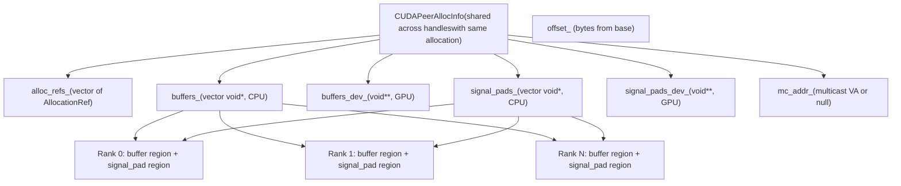

# Symmetric Memory for High-Performance Communication

Relevant source files

-   [build\_variables.bzl](https://github.com/pytorch/pytorch/blob/915982a4/build_variables.bzl)
-   [caffe2/CMakeLists.txt](https://github.com/pytorch/pytorch/blob/915982a4/caffe2/CMakeLists.txt)
-   [test/distributed/test\_nccl.py](https://github.com/pytorch/pytorch/blob/915982a4/test/distributed/test_nccl.py)
-   [test/distributed/test\_nvshmem.py](https://github.com/pytorch/pytorch/blob/915982a4/test/distributed/test_nvshmem.py)
-   [torch/\_C/\_distributed\_c10d.pyi](https://github.com/pytorch/pytorch/blob/915982a4/torch/_C/_distributed_c10d.pyi)
-   [torch/csrc/distributed/c10d/init.cpp](https://github.com/pytorch/pytorch/blob/915982a4/torch/csrc/distributed/c10d/init.cpp)
-   [torch/csrc/distributed/c10d/symm\_mem/CUDASymmetricMemory.cu](https://github.com/pytorch/pytorch/blob/915982a4/torch/csrc/distributed/c10d/symm_mem/CUDASymmetricMemory.cu)
-   [torch/csrc/distributed/c10d/symm\_mem/CUDASymmetricMemory.hpp](https://github.com/pytorch/pytorch/blob/915982a4/torch/csrc/distributed/c10d/symm_mem/CUDASymmetricMemory.hpp)
-   [torch/csrc/distributed/c10d/symm\_mem/NCCLSymmetricMemory.cu](https://github.com/pytorch/pytorch/blob/915982a4/torch/csrc/distributed/c10d/symm_mem/NCCLSymmetricMemory.cu)
-   [torch/csrc/distributed/c10d/symm\_mem/NCCLSymmetricMemory.hpp](https://github.com/pytorch/pytorch/blob/915982a4/torch/csrc/distributed/c10d/symm_mem/NCCLSymmetricMemory.hpp)
-   [torch/csrc/distributed/c10d/symm\_mem/SymmetricMemory.cpp](https://github.com/pytorch/pytorch/blob/915982a4/torch/csrc/distributed/c10d/symm_mem/SymmetricMemory.cpp)
-   [torch/csrc/distributed/c10d/symm\_mem/SymmetricMemory.hpp](https://github.com/pytorch/pytorch/blob/915982a4/torch/csrc/distributed/c10d/symm_mem/SymmetricMemory.hpp)
-   [torch/csrc/distributed/c10d/symm\_mem/nccl\_extension.cu](https://github.com/pytorch/pytorch/blob/915982a4/torch/csrc/distributed/c10d/symm_mem/nccl_extension.cu)
-   [torch/csrc/distributed/c10d/symm\_mem/nvshmem\_extension.cu](https://github.com/pytorch/pytorch/blob/915982a4/torch/csrc/distributed/c10d/symm_mem/nvshmem_extension.cu)
-   [torch/csrc/distributed/c10d/symm\_mem/nvshmem\_team\_manager.hpp](https://github.com/pytorch/pytorch/blob/915982a4/torch/csrc/distributed/c10d/symm_mem/nvshmem_team_manager.hpp)
-   [torch/distributed/\_symmetric\_memory/\_\_init\_\_.py](https://github.com/pytorch/pytorch/blob/915982a4/torch/distributed/_symmetric_memory/__init__.py)

## Overview

The SymmetricMemory system enables direct peer-to-peer (P2P) and multicast GPU memory access across ranks in distributed PyTorch. Each rank allocates identical-sized memory regions that are directly accessible by all peers in a process group, enabling zero-copy communication without intermediate CPU buffers or explicit message passing.

**Key Capabilities:**

-   **Direct P2P Memory Access**: Load/store operations to peer GPU memory within CUDA kernels
-   **Multicast Support**: One-to-many communication using NVLink SHARP (where available)
-   **Device-side Synchronization**: Barriers, signals, and atomic operations accessible from kernels
-   **Custom Communication Patterns**: Substrate for implementing specialized collectives (all-to-all, reduce-scatter variants)
-   **MemPool Integration**: Seamless integration with CUDA memory pool allocator for zero-overhead allocation

**Backend Implementations:** The system provides three backend implementations with automatic fallback:

1.  **NVSHMEM**: High-performance PGAS programming model with device-side operations ([4.3.2](/pytorch/pytorch/4.3.2-backend-implementations:-nvshmem-nccl-cuda))
2.  **NCCL**: Symmetric memory windows using NCCL 2.28+ APIs ([4.3.2](/pytorch/pytorch/4.3.2-backend-implementations:-nvshmem-nccl-cuda))
3.  **CUDA**: Virtual memory management via CUDA Driver API ([4.3.2](/pytorch/pytorch/4.3.2-backend-implementations:-nvshmem-nccl-cuda))

For detailed architecture, see [Symmetric Memory Architecture](/pytorch/pytorch/4.3.1-symmetric-memory-architecture). For distributed tensor abstractions built on top of symmetric memory, see [DTensor System](/pytorch/pytorch/4.2-dtensor:-distributed-tensor-abstraction).

## System Architecture

The SymmetricMemory system uses a multi-backend architecture where a common interface (`SymmetricMemory`) is implemented by backend-specific allocators. Backend selection occurs at runtime based on environment configuration and hardware capabilities.

**Diagram: SymmetricMemory Class Hierarchy and Backend Registry**

```mermaid
flowchart TD
    empty_fn["empty()"]
    rendezvous_fn["rendezvous()"]
    set_backend_fn["set_backend()"]
    get_backend_fn["get_backend()"]
    get_mempool_fn["get_mempool_allocator()"]
    AllocatorMap["AllocatorMap (singleton)register_allocator()register_availability()set_backend()get_allocator()"]
    MemPoolAllocatorMap["MemPoolAllocatorMap (singleton)register_mempool_allocator()get_mempool_allocator()"]
    empty_p2p["empty_strided_p2p()"]
    rendezvous_cpp["rendezvous()"]
    SymmMemBase["SymmetricMemoryget_buffer_ptrs()get_signal_pad_ptrs()get_buffer_ptrs_dev()barrier() / put_signal() / wait_signal()"]
    AllocatorBase["SymmetricMemoryAllocatoralloc() / free()rendezvous()has_multicast_support()"]
    CUDAAlloc["CUDASymmetricMemoryAllocator"]
    CUDAMem["CUDASymmetricMemory"]
    CUDAPeerInfo["CUDAPeerAllocInfobuffers_ / signal_pads_buffers_dev_ / signal_pads_dev_"]
    AllocRef["AllocationRef(vaddr + handle pair)"]
    NCCLAlloc["NCCLSymmetricMemoryAllocator"]
    NCCLMem["NCCLSymmetricMemory"]
    NCCLPeerInfo["NCCLPeerAllocInfobuffer_win_ (ncclWindow_t)signal_handle_ (ncclWindow_t)"]
    NVSHMEMAlloc["NVSHMEMSymmetricMemoryAllocator"]
    NVSHMEMMem["NVSHMEMSymmetricMemory"]
    TeamMgr["TeamManagerget_team() / get_n_teams()"]

    empty --> fn_empty_p2p
    rendezvous --> fn_rendezvous_cpp
    set --> backend_fn_AllocatorMap
    get --> backend_fn_AllocatorMap
    get --> mempool_fn_MemPoolAllocatorMap
    empty --> p2p_AllocatorMap
    rendezvous --> cpp_AllocatorMap
    AllocatorMap --> CUDAAlloc
    AllocatorMap --> NCCLAlloc
    AllocatorMap --> NVSHMEMAlloc
    CUDAAlloc --> AllocatorBase
    NCCLAlloc --> AllocatorBase
    NVSHMEMAlloc --> AllocatorBase
    CUDAAlloc --> CUDAMem
    NCCLAlloc --> NCCLMem
    NVSHMEMAlloc --> NVSHMEMMem
    CUDAMem --> SymmMemBase
    NCCLMem --> SymmMemBase
    NVSHMEMMem --> SymmMemBase
    CUDAMem --> CUDAPeerInfo
    CUDAPeerInfo --> AllocRef
    NCCLMem --> NCCLPeerInfo
    NVSHMEMMem --> TeamMgr
```


Sources: [torch/csrc/distributed/c10d/symm\_mem/SymmetricMemory.hpp39-116](https://github.com/pytorch/pytorch/blob/915982a4/torch/csrc/distributed/c10d/symm_mem/SymmetricMemory.hpp#L39-L116) [torch/csrc/distributed/c10d/symm\_mem/SymmetricMemory.cpp28-114](https://github.com/pytorch/pytorch/blob/915982a4/torch/csrc/distributed/c10d/symm_mem/SymmetricMemory.cpp#L28-L114) [torch/csrc/distributed/c10d/symm\_mem/CUDASymmetricMemory.hpp13-155](https://github.com/pytorch/pytorch/blob/915982a4/torch/csrc/distributed/c10d/symm_mem/CUDASymmetricMemory.hpp#L13-L155) [torch/csrc/distributed/c10d/symm\_mem/NCCLSymmetricMemory.hpp12-62](https://github.com/pytorch/pytorch/blob/915982a4/torch/csrc/distributed/c10d/symm_mem/NCCLSymmetricMemory.hpp#L12-L62)

### Backend Selection

The `AllocatorMap` singleton ([torch/csrc/distributed/c10d/symm\_mem/SymmetricMemory.cpp28-114](https://github.com/pytorch/pytorch/blob/915982a4/torch/csrc/distributed/c10d/symm_mem/SymmetricMemory.cpp#L28-L114)) maintains a registry mapping device types to allocator implementations. A separate `avail_map_` tracks all registered backends by name, while `map_` holds the active backend per device type. The `set_backend()` function checks `avail_map_` and moves the selection to `map_`, rejecting changes after the allocator has been used (`in_use_` flag).

From Python, `set_backend()` and `get_backend()` in `torch/distributed/_symmetric_memory/__init__.py` delegate directly to the C++ `AllocatorMap`. The `is_nvshmem_available()` check in `nvshmem_extension.cu` probes for `libnvshmem_host.so.3` at runtime.

**Backend Comparison:**

| Backend | Key Library | NCCL Min Version | P2P Access | Multicast | Device-side Ops | Scope |
| --- | --- | --- | --- | --- | --- | --- |
| `CUDA` | CUDA Driver API | — | Yes | No | Via custom kernels | Intra-node |
| `NCCL` | NCCL | 2.28+ (`ncclCommWindowRegister`) | Yes | 2.29+ (`ncclGetLsaMultimemDevicePointer`) | Limited | Any |
| `NVSHMEM` | NVSHMEM 3.x | — | Yes | Yes (NVLink SHARP) | Full NVSHMEM API | Any |

For detailed backend implementations, see page 4.3.2.

Sources: [torch/csrc/distributed/c10d/symm\_mem/SymmetricMemory.cpp28-114](https://github.com/pytorch/pytorch/blob/915982a4/torch/csrc/distributed/c10d/symm_mem/SymmetricMemory.cpp#L28-L114) [torch/distributed/\_symmetric\_memory/\_\_init\_\_.py1-55](https://github.com/pytorch/pytorch/blob/915982a4/torch/distributed/_symmetric_memory/__init__.py#L1-L55) [torch/csrc/distributed/c10d/symm\_mem/nvshmem\_extension.cu44-69](https://github.com/pytorch/pytorch/blob/915982a4/torch/csrc/distributed/c10d/symm_mem/nvshmem_extension.cu#L44-L69)

## Core Concepts

### Allocation and Rendezvous

The symmetric memory lifecycle consists of two phases:

1.  **Allocation**: Each rank calls `symm_mem.empty()` (Python) → `empty_strided_p2p()` (C++) → `allocator->alloc()`, creating identically-sized memory on each participating device.
2.  **Rendezvous**: Each rank calls `symm_mem.rendezvous(tensor, group)` → `allocator->rendezvous()`, which exchanges memory handles via `c10d::Store` and constructs a `CUDAPeerAllocInfo` / `NCCLPeerAllocInfo` that contains all peer buffer pointers.

**Diagram: Symmetric Memory Allocation and Rendezvous Flow**

> **[Mermaid sequence]**
> *(图表结构无法解析)*

Persistent allocation is also supported via `empty_strided_p2p_persistent()` ([torch/csrc/distributed/c10d/symm\_mem/SymmetricMemory.cpp123-176](https://github.com/pytorch/pytorch/blob/915982a4/torch/csrc/distributed/c10d/symm_mem/SymmetricMemory.cpp#L123-L176)), which uses an `alloc_id` to reuse the same physical allocation across calls. This is useful for iterative training loops where the allocation size stays fixed.

For detailed rendezvous protocols by backend, see page 4.3.1.

Sources: [torch/csrc/distributed/c10d/symm\_mem/SymmetricMemory.cpp246-283](https://github.com/pytorch/pytorch/blob/915982a4/torch/csrc/distributed/c10d/symm_mem/SymmetricMemory.cpp#L246-L283) [torch/distributed/\_symmetric\_memory/\_\_init\_\_.py96-135](https://github.com/pytorch/pytorch/blob/915982a4/torch/distributed/_symmetric_memory/__init__.py#L96-L135) [torch/csrc/distributed/c10d/symm\_mem/CUDASymmetricMemory.cu29-103](https://github.com/pytorch/pytorch/blob/915982a4/torch/csrc/distributed/c10d/symm_mem/CUDASymmetricMemory.cu#L29-L103)

### The SymmetricMemory Handle

After rendezvous, each rank receives a `_SymmetricMemory` object (`CUDASymmetricMemory` or `NCCLSymmetricMemory`). Both expose the same abstract interface defined in `SymmetricMemory.hpp`.

**Available methods on `_SymmetricMemory`:**

| Method | Description |
| --- | --- |
| `get_buffer(rank, sizes, dtype, storage_offset)` | Returns a tensor view of `rank`'s buffer region |
| `get_remote_tensor(peer, sizes, dtype)` | Like `get_buffer` but using the handle's own offset |
| `get_buffer_ptrs()` | CPU-side `vector<void*>` of all peer buffer addresses |
| `get_signal_pad_ptrs()` | CPU-side `vector<void*>` of all peer signal pad addresses |
| `get_buffer_ptrs_dev()` | GPU-side `void**` array (device memory), for use in kernels |
| `get_signal_pad_ptrs_dev()` | GPU-side `void**` array for signal pads, for use in kernels |
| `barrier(channel, timeout_ms)` | Device-side all-rank barrier on given channel |
| `put_signal(dst_rank, channel, timeout_ms)` | Write signal to `dst_rank`'s signal pad |
| `wait_signal(src_rank, channel, timeout_ms)` | Spin until signal from `src_rank` is received |
| `get_multicast_ptr()` | Returns multicast VA (if `has_multicast_support()`) |
| `get_rank()`, `get_world_size()`, `get_buffer_size()`, `get_offset()` | Metadata accessors |

**Diagram: SymmetricMemory Handle Memory Layout**


Sources: [torch/csrc/distributed/c10d/symm\_mem/SymmetricMemory.hpp39-97](https://github.com/pytorch/pytorch/blob/915982a4/torch/csrc/distributed/c10d/symm_mem/SymmetricMemory.hpp#L39-L97) [torch/csrc/distributed/c10d/symm\_mem/CUDASymmetricMemory.hpp13-103](https://github.com/pytorch/pytorch/blob/915982a4/torch/csrc/distributed/c10d/symm_mem/CUDASymmetricMemory.hpp#L13-L103) [torch/\_C/\_distributed\_c10d.pyi265-329](https://github.com/pytorch/pytorch/blob/915982a4/torch/_C/_distributed_c10d.pyi#L265-L329)

### P2P Memory Access

Symmetric memory enables direct load/store operations to peer GPU memory without any CPU involvement.

**Host-side access** is available via `get_buffer(rank, sizes, dtype, storage_offset)` and `get_remote_tensor(peer, sizes, dtype)` ([torch/csrc/distributed/c10d/symm\_mem/SymmetricMemory.cpp398-413](https://github.com/pytorch/pytorch/blob/915982a4/torch/csrc/distributed/c10d/symm_mem/SymmetricMemory.cpp#L398-L413)). Both return an `at::Tensor` wrapping the peer's memory using `at::for_blob`, so standard ATen operations can be used to read or write peer memory.

**Device-side access** is available in custom CUDA kernels by passing `get_buffer_ptrs_dev()` or `get_signal_pad_ptrs_dev()` (both return a `void**` residing in device memory). Within a kernel, indexing by `peer` rank gives the base pointer for that peer's buffer or signal pad region. This enables zero-copy direct reads and writes from within a running kernel.

The Python `torch.ops.symm_mem.get_remote_tensors(tensor, group_name)` op returns a list of tensor views for all peers at once ([test/distributed/test\_nvshmem.py229-241](https://github.com/pytorch/pytorch/blob/915982a4/test/distributed/test_nvshmem.py#L229-L241)).

Sources: [torch/csrc/distributed/c10d/symm\_mem/SymmetricMemory.cpp360-413](https://github.com/pytorch/pytorch/blob/915982a4/torch/csrc/distributed/c10d/symm_mem/SymmetricMemory.cpp#L360-L413) [torch/csrc/distributed/c10d/symm\_mem/SymmetricMemory.hpp43-53](https://github.com/pytorch/pytorch/blob/915982a4/torch/csrc/distributed/c10d/symm_mem/SymmetricMemory.hpp#L43-L53) [torch/\_C/\_distributed\_c10d.pyi280-310](https://github.com/pytorch/pytorch/blob/915982a4/torch/_C/_distributed_c10d.pyi#L280-L310)

### Synchronization Primitives

Signal pads are P2P-accessible memory regions allocated alongside each rank's data buffer, dedicated to synchronization. The `SymmetricMemory` interface exposes three device-executed primitives:

-   **`barrier(channel, timeout_ms)`**: Implemented by `barrier_kernel` in `CUDASymmetricMemory.cu` ([torch/csrc/distributed/c10d/symm\_mem/CUDASymmetricMemory.cu173-224](https://github.com/pytorch/pytorch/blob/915982a4/torch/csrc/distributed/c10d/symm_mem/CUDASymmetricMemory.cu#L173-L224)). Each rank sets a signal to every other rank's signal pad and waits for all incoming signals. The kernel is launched with `world_size` threads.
-   **`put_signal(dst_rank, channel, timeout_ms)`**: Sends a signal token to `dst_rank`'s signal pad slot. Implemented by `put_signal_kernel`.
-   **`wait_signal(src_rank, channel, timeout_ms)`**: Spins until the signal from `src_rank` appears. Implemented by `wait_signal_kernel`. Both kernels use `try_put_signal` / `try_wait_signal` helpers with memory ordering semantics.

**Synchronization channels** allow multiple independent synchronizations on the same `SymmetricMemory` handle across different CUDA streams without interference. The signal pad for rank `r` is laid out as a 2D array indexed by `[world_size * channel + sender_rank]`. Each channel corresponds to a non-overlapping slice of the signal pad region.

The total signal pad size is controlled by `get_signal_pad_size()` / `set_signal_pad_size()` ([torch/csrc/distributed/c10d/symm\_mem/SymmetricMemory.cpp207-214](https://github.com/pytorch/pytorch/blob/915982a4/torch/csrc/distributed/c10d/symm_mem/SymmetricMemory.cpp#L207-L214)). The default is `default_signal_pad_size`; this must be configured before the first allocation.

Sources: [torch/csrc/distributed/c10d/symm\_mem/CUDASymmetricMemory.cu155-305](https://github.com/pytorch/pytorch/blob/915982a4/torch/csrc/distributed/c10d/symm_mem/CUDASymmetricMemory.cu#L155-L305) [torch/csrc/distributed/c10d/symm\_mem/SymmetricMemory.hpp23-38](https://github.com/pytorch/pytorch/blob/915982a4/torch/csrc/distributed/c10d/symm_mem/SymmetricMemory.hpp#L23-L38) [torch/csrc/distributed/c10d/symm\_mem/SymmetricMemory.cpp207-214](https://github.com/pytorch/pytorch/blob/915982a4/torch/csrc/distributed/c10d/symm_mem/SymmetricMemory.cpp#L207-L214)

## Communication Operations

### Collective Operations

Symmetric memory enables efficient collective operations through direct peer buffer access. Operations are registered as `torch.ops.symm_mem.*` custom ops.

**Available collective ops:**

| Op | Backend | Description |
| --- | --- | --- |
| `torch.ops.symm_mem.nvshmem_broadcast` | NVSHMEM | Device-side broadcast via `nvshmemx_broadcastmem_on_stream` |
| `torch.ops.symm_mem.nvshmem_all_to_all` | NVSHMEM | Fixed-size all-to-all via NVSHMEM team ops |
| `torch.ops.symm_mem.all_to_all_vdev` | NVSHMEM | Variable-size all-to-all for expert parallelism (MoE) |
| `torch.ops.symm_mem.all_to_all_vdev_2d` | NVSHMEM | 2D variable all-to-all with expert-major layout and alignment |
| `torch.ops.symm_mem.get_remote_tensors` | All | Returns list of tensor views to all peer buffers |
| `torch.ops.symm_mem.nvshmem_put` | NVSHMEM | One-sided put via `nvshmemx_putmem_on_stream` |
| `torch.ops.symm_mem.nvshmem_get` | NVSHMEM | One-sided get via `nvshmemx_getmem_on_stream` |
| `torch.ops.symm_mem.nvshmem_put_with_signal` | NVSHMEM | Put + atomic signal notification |
| `torch.ops.symm_mem.nvshmem_wait_for_signal` | NVSHMEM | Spin-wait on signal pad via `nvshmemx_signal_wait_until_on_stream` |

All NVSHMEM ops internally call `rendezvous()` to get the handle, then dispatch to `nvshmemx_*_on_stream` device APIs. The `all_to_all_vdev_2d` variant handles expert-parallel all-to-all where input/output splits are 2D tensors arranged in `[expert, rank]` order, and supports an alignment parameter for CUTLASS compatibility.

For detailed implementation of each backend's collectives, see page 4.3.2.

Sources: [torch/csrc/distributed/c10d/symm\_mem/nvshmem\_extension.cu80-172](https://github.com/pytorch/pytorch/blob/915982a4/torch/csrc/distributed/c10d/symm_mem/nvshmem_extension.cu#L80-L172) [torch/csrc/distributed/c10d/symm\_mem/nvshmem\_extension.cu201-377](https://github.com/pytorch/pytorch/blob/915982a4/torch/csrc/distributed/c10d/symm_mem/nvshmem_extension.cu#L201-L377) [test/distributed/test\_nvshmem.py302-509](https://github.com/pytorch/pytorch/blob/915982a4/test/distributed/test_nvshmem.py#L302-L509)

### Multicast Support

On hardware with NVLink SHARP, symmetric memory provides a multicast virtual address alongside the regular P2P buffer. Writes to the multicast address are delivered to all peers simultaneously.

The `has_multicast_support()` method checks whether a multicast VA was successfully established during rendezvous. `get_multicast_ptr()` returns the pointer offset-adjusted for the handle's `offset_` field.

Multicast is available per backend:

-   **CUDA backend**: Uses `cuMulticastCreate` / `cuMulticastAddDevice` from the CUDA Driver API (CUDART 12.3+, `CUDART_SUPPORTS_MULTICAST`). The multicast handle `mc_handle_` is stored in `CUDAPeerAllocInfo` ([torch/csrc/distributed/c10d/symm\_mem/CUDASymmetricMemory.cu73-103](https://github.com/pytorch/pytorch/blob/915982a4/torch/csrc/distributed/c10d/symm_mem/CUDASymmetricMemory.cu#L73-L103)).
-   **NCCL backend**: Uses `ncclGetLsaMultimemDevicePointer` (NCCL 2.29+) to obtain `mc_addr_` ([torch/csrc/distributed/c10d/symm\_mem/NCCLSymmetricMemory.cu145-150](https://github.com/pytorch/pytorch/blob/915982a4/torch/csrc/distributed/c10d/symm_mem/NCCLSymmetricMemory.cu#L145-L150)).
-   **NVSHMEM backend**: Uses NVSHMEM's NVLink SHARP support. `_SymmetricMemory.has_multicast_support(DeviceType.CUDA, device_idx)` can be used to query availability ([test/distributed/test\_nvshmem.py35-47](https://github.com/pytorch/pytorch/blob/915982a4/test/distributed/test_nvshmem.py#L35-L47)).

The `multicast_ptr` property on the Python `_SymmetricMemory` handle returns 0 if not available, or a nonzero integer pointer when NVLS is supported.

Sources: [torch/csrc/distributed/c10d/symm\_mem/SymmetricMemory.hpp56-57](https://github.com/pytorch/pytorch/blob/915982a4/torch/csrc/distributed/c10d/symm_mem/SymmetricMemory.hpp#L56-L57) [torch/csrc/distributed/c10d/symm\_mem/CUDASymmetricMemory.cu17-25](https://github.com/pytorch/pytorch/blob/915982a4/torch/csrc/distributed/c10d/symm_mem/CUDASymmetricMemory.cu#L17-L25) [torch/csrc/distributed/c10d/symm\_mem/NCCLSymmetricMemory.cu144-151](https://github.com/pytorch/pytorch/blob/915982a4/torch/csrc/distributed/c10d/symm_mem/NCCLSymmetricMemory.cu#L144-L151)

### MemPool Integration

Symmetric memory integrates with CUDA's `MemPool` allocator so that tensors created by standard factory ops (`torch.randn`, `torch.mm`, etc.) can reside in symmetric memory without an explicit `symm_mem.empty()` call.

The `MemPoolAllocatorMap` singleton ([torch/csrc/distributed/c10d/symm\_mem/SymmetricMemory.cpp301-334](https://github.com/pytorch/pytorch/blob/915982a4/torch/csrc/distributed/c10d/symm_mem/SymmetricMemory.cpp#L301-L334)) maintains a separate registry mapping device types to `c10::Allocator` implementations for MemPool use. The Python `get_mempool_allocator(device)` function retrieves this allocator, which can then be wrapped in a `torch.cuda.MemPool` and activated via `torch.cuda.use_mem_pool(mempool)`.

Within the `use_mem_pool` context, all CUDA allocations come from the symmetric allocator. Since the CUDA caching allocator routes through the pool, compute op outputs (e.g., `torch.mm`) are also symmetric. The subsequent `rendezvous()` call recognizes the allocation's origin and maps it across peers.

Tests in `test/distributed/test_nvshmem.py` cover:

-   `test_mempool_tensor_factory`: tensor factory ops inside MemPool context ([test/distributed/test\_nvshmem.py107-129](https://github.com/pytorch/pytorch/blob/915982a4/test/distributed/test_nvshmem.py#L107-L129))
-   `test_mempool_compute_ops`: compute op outputs inside MemPool context ([test/distributed/test\_nvshmem.py154-177](https://github.com/pytorch/pytorch/blob/915982a4/test/distributed/test_nvshmem.py#L154-L177))
-   `test_mempool_tensor_w_collective`: standard `dist.all_reduce` on MemPool-allocated tensor ([test/distributed/test\_nvshmem.py131-152](https://github.com/pytorch/pytorch/blob/915982a4/test/distributed/test_nvshmem.py#L131-L152))

Sources: [torch/csrc/distributed/c10d/symm\_mem/SymmetricMemory.cpp291-348](https://github.com/pytorch/pytorch/blob/915982a4/torch/csrc/distributed/c10d/symm_mem/SymmetricMemory.cpp#L291-L348) [test/distributed/test\_nvshmem.py107-177](https://github.com/pytorch/pytorch/blob/915982a4/test/distributed/test_nvshmem.py#L107-L177)

## Python API

The public Python surface lives in `torch/distributed/_symmetric_memory/__init__.py`. The module imports `_SymmetricMemory` from `torch._C._distributed_c10d` (bound from C++ in `torch/csrc/distributed/c10d/init.cpp`).

### Key Functions

| Function | Description |
| --- | --- |
| `set_backend(name)` | Set active backend (`"CUDA"`, `"NCCL"`, `"NVSHMEM"`) before first use |
| `get_backend(device)` | Query currently active backend for a device |
| `is_nvshmem_available()` | Runtime check for NVSHMEM library availability |
| `empty(size, dtype, device, alloc_id=None)` | Allocate symmetric tensor; `alloc_id` enables persistent reuse |
| `rendezvous(tensor, group)` | Establish peer mapping and return `_SymmetricMemory` handle |
| `get_mempool_allocator(device)` | Retrieve `c10::Allocator` compatible with `torch.cuda.MemPool` |
| `get_symm_mem_workspace(group_name, min_size)` | Get or lazily grow a shared workspace tensor and its handle |
| `is_symm_mem_enabled_for_group(group_name)` | Check if a group has an active symmetric memory store association |

The `enable_symm_mem_for_group()` function exists but is **deprecated** — group registration now happens automatically ([torch/distributed/\_symmetric\_memory/\_\_init\_\_.py25-53](https://github.com/pytorch/pytorch/blob/915982a4/torch/distributed/_symmetric_memory/__init__.py#L25-L53)).

### Pipelined Communication Helpers

The module also provides high-level pipelined communication primitives used internally by DTensor and other distributed training components:

-   **`_pipelined_all_gather_and_consume(shard, shard_consumer, ag_out, group_name)`**: Performs an all-gather with micro-pipelined computation/communication overlap. Internally uses `get_symm_mem_workspace()` and alternates between two CUDA streams ([torch/distributed/\_symmetric\_memory/\_\_init\_\_.py296-322](https://github.com/pytorch/pytorch/blob/915982a4/torch/distributed/_symmetric_memory/__init__.py#L296-L322)).
-   **`_pipelined_multi_all_gather_and_consume`**: Multi-tensor variant of the above ([torch/distributed/\_symmetric\_memory/\_\_init\_\_.py146-293](https://github.com/pytorch/pytorch/blob/915982a4/torch/distributed/_symmetric_memory/__init__.py#L146-L293)).
-   **`_pipelined_produce_and_all2all(chunk_producer, output, group_name)`**: Pipelined all-to-all where a `chunk_producer` callable fills chunks for each destination rank while P2P copies of prior chunks proceed in parallel ([torch/distributed/\_symmetric\_memory/\_\_init\_\_.py325-450](https://github.com/pytorch/pytorch/blob/915982a4/torch/distributed/_symmetric_memory/__init__.py#L325-L450)).

These helpers use `symm_mem.barrier(channel=...)` with channel-based isolation to avoid stream interference.

Sources: [torch/distributed/\_symmetric\_memory/\_\_init\_\_.py1-700](https://github.com/pytorch/pytorch/blob/915982a4/torch/distributed/_symmetric_memory/__init__.py#L1-L700) [torch/csrc/distributed/c10d/init.cpp51-56](https://github.com/pytorch/pytorch/blob/915982a4/torch/csrc/distributed/c10d/init.cpp#L51-L56) [torch/\_C/\_distributed\_c10d.pyi265-329](https://github.com/pytorch/pytorch/blob/915982a4/torch/_C/_distributed_c10d.pyi#L265-L329)

## Custom Kernel Integration

### Triton Kernel Support (NVSHMEM)

The `torch/distributed/_symmetric_memory/_nvshmem_triton.py` module provides Triton language bindings for NVSHMEM device APIs. It exposes functions like `put`, `get`, `barrier_all`, `fence`, `quiet`, and team collective operations (`broadcast`, etc.) callable from Triton JIT kernels. Internally it calls `nvshmemx_cumodule_init` ([torch/csrc/distributed/c10d/symm\_mem/nvshmem\_extension.cu72-78](https://github.com/pytorch/pytorch/blob/915982a4/torch/csrc/distributed/c10d/symm_mem/nvshmem_extension.cu#L72-L78)) to initialize the NVSHMEM device state in the compiled Triton `CUmodule`.

Test coverage is in `test/distributed/test_nvshmem_triton.py`.

### Direct CUDA Kernel Access

For custom CUDA/CUTLASS kernels, `get_buffer_ptrs_dev()` and `get_signal_pad_ptrs_dev()` each return a `void**` residing in device memory ([torch/csrc/distributed/c10d/symm\_mem/SymmetricMemory.hpp48-53](https://github.com/pytorch/pytorch/blob/915982a4/torch/csrc/distributed/c10d/symm_mem/SymmetricMemory.hpp#L48-L53)). Kernels can index these arrays by peer rank to obtain direct read/write pointers to each rank's buffer or signal pad region. This is the same mechanism used internally by `barrier_kernel`, `put_signal_kernel`, and `wait_signal_kernel` in `CUDASymmetricMemory.cu`.

The `lsa_put_kernel` and `lsa_put_signal_kernel` in `nccl_extension.cu` ([torch/csrc/distributed/c10d/symm\_mem/nccl\_extension.cu87-165](https://github.com/pytorch/pytorch/blob/915982a4/torch/csrc/distributed/c10d/symm_mem/nccl_extension.cu#L87-L165)) show a concrete example of kernel-side direct P2P writes: they index `buffer[dst_peer]` to get the remote pointer and use 16-byte vectorized stores (`ld_vec<16>` / `st_vec<16>`) for efficiency.

Sources: [torch/csrc/distributed/c10d/symm\_mem/SymmetricMemory.hpp48-53](https://github.com/pytorch/pytorch/blob/915982a4/torch/csrc/distributed/c10d/symm_mem/SymmetricMemory.hpp#L48-L53) [torch/csrc/distributed/c10d/symm\_mem/nvshmem\_extension.cu72-78](https://github.com/pytorch/pytorch/blob/915982a4/torch/csrc/distributed/c10d/symm_mem/nvshmem_extension.cu#L72-L78) [torch/csrc/distributed/c10d/symm\_mem/nccl\_extension.cu87-165](https://github.com/pytorch/pytorch/blob/915982a4/torch/csrc/distributed/c10d/symm_mem/nccl_extension.cu#L87-L165)

## Build and Testing

### CMake Integration

The symmetric memory sources are compiled conditionally based on the build configuration. The base C++ abstractions (`SymmetricMemory.cpp`, `DMAConnectivity.cpp`) are always included when `USE_DISTRIBUTED` is set. CUDA-specific backends require `USE_CUDA` and are listed in `libtorch_cuda_distributed_extra_sources` in `caffe2/CMakeLists.txt`.

Source files involved per backend:

| Backend | Source Files | Condition |
| --- | --- | --- |
| Core abstractions | `symm_mem/SymmetricMemory.cpp`, `symm_mem/DMAConnectivity.cpp` | `USE_DISTRIBUTED` |
| CUDA | `symm_mem/CUDASymmetricMemory.cu`, `symm_mem/CUDASymmetricMemoryOps.cu`, `symm_mem/CUDASymmetricMemoryUtils.cpp`, `symm_mem/CudaDMAConnectivity.cpp` | `USE_CUDA` |
| NCCL | `symm_mem/NCCLSymmetricMemory.cu`, `symm_mem/nccl_extension.cu`, `symm_mem/cuda_mem_pool.cpp` | `USE_CUDA` + NCCL |
| NVSHMEM | `symm_mem/nvshmem_extension.cu` | `USE_NVSHMEM` |

All CUDA source files under `symm_mem/` are compiled with `-DPYTORCH_C10_DRIVER_API_SUPPORTED=1` ([caffe2/CMakeLists.txt587-599](https://github.com/pytorch/pytorch/blob/915982a4/caffe2/CMakeLists.txt#L587-L599)).

Sources: [caffe2/CMakeLists.txt583-599](https://github.com/pytorch/pytorch/blob/915982a4/caffe2/CMakeLists.txt#L583-L599) [build\_variables.bzl536-538](https://github.com/pytorch/pytorch/blob/915982a4/build_variables.bzl#L536-L538)

## Testing Infrastructure

### Test Organization

The test suite covers backend-specific functionality and cross-backend scenarios:

| Test File | Purpose |
| --- | --- |
| `test/distributed/test_nvshmem.py` | NVSHMEM backend tests: allocation, collectives, MemPool |
| `test/distributed/test_nvshmem_triton.py` | Triton kernel integration tests |
| `test/distributed/test_nccl.py` | NCCL backend tests including symmetric memory |
| `test/distributed/test_ce_colls.py` | Copy Engine collectives (NCCL 2.28+) |

**Sources:** [test/distributed/test\_nvshmem.py1-900](https://github.com/pytorch/pytorch/blob/915982a4/test/distributed/test_nvshmem.py#L1-L900) [test/distributed/test\_nvshmem\_triton.py1-800](https://github.com/pytorch/pytorch/blob/915982a4/test/distributed/test_nvshmem_triton.py#L1-L800) [test/distributed/test\_nccl.py1-500](https://github.com/pytorch/pytorch/blob/915982a4/test/distributed/test_nccl.py#L1-L500)

### Test Patterns

**Multi-Process Test Framework:**

```
from torch.testing._internal.common_distributed import MultiProcContinuousTest class NVSHMEMSymmetricMemoryTest(MultiProcContinuousTest):    def _init_device(self):        device_module.set_device(self.device)        symm_mem.set_backend("NVSHMEM")        def test_alloc(self):        tensor = symm_mem.empty(1024, device=self.device)        handle = symm_mem.rendezvous(tensor, group_name)
```
**Collective Testing Pattern:**

```
def test_broadcast(self):    tensor = symm_mem.empty(numel, device=self.device)    if self.rank == 0:        tensor.fill_(42)        torch.ops.symm_mem.nvshmem_broadcast(tensor, root=0, group_name)        # All ranks should now have value 42    self.assertEqual(tensor, torch.full_like(tensor, 42))
```
**Sources:** [test/distributed/test\_nvshmem.py65-300](https://github.com/pytorch/pytorch/blob/915982a4/test/distributed/test_nvshmem.py#L65-L300) [test/distributed/test\_nvshmem\_triton.py278-800](https://github.com/pytorch/pytorch/blob/915982a4/test/distributed/test_nvshmem_triton.py#L278-L800)
