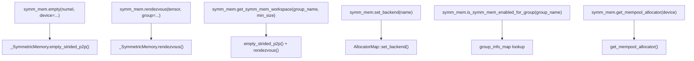

# Symmetric Memory Architecture

Relevant source files

-   [build\_variables.bzl](https://github.com/pytorch/pytorch/blob/915982a4/build_variables.bzl)
-   [caffe2/CMakeLists.txt](https://github.com/pytorch/pytorch/blob/915982a4/caffe2/CMakeLists.txt)
-   [test/distributed/test\_nccl.py](https://github.com/pytorch/pytorch/blob/915982a4/test/distributed/test_nccl.py)
-   [test/distributed/test\_nvshmem.py](https://github.com/pytorch/pytorch/blob/915982a4/test/distributed/test_nvshmem.py)
-   [torch/\_C/\_distributed\_c10d.pyi](https://github.com/pytorch/pytorch/blob/915982a4/torch/_C/_distributed_c10d.pyi)
-   [torch/csrc/distributed/c10d/init.cpp](https://github.com/pytorch/pytorch/blob/915982a4/torch/csrc/distributed/c10d/init.cpp)
-   [torch/csrc/distributed/c10d/symm\_mem/CUDASymmetricMemory.cu](https://github.com/pytorch/pytorch/blob/915982a4/torch/csrc/distributed/c10d/symm_mem/CUDASymmetricMemory.cu)
-   [torch/csrc/distributed/c10d/symm\_mem/CUDASymmetricMemory.hpp](https://github.com/pytorch/pytorch/blob/915982a4/torch/csrc/distributed/c10d/symm_mem/CUDASymmetricMemory.hpp)
-   [torch/csrc/distributed/c10d/symm\_mem/NCCLSymmetricMemory.cu](https://github.com/pytorch/pytorch/blob/915982a4/torch/csrc/distributed/c10d/symm_mem/NCCLSymmetricMemory.cu)
-   [torch/csrc/distributed/c10d/symm\_mem/NCCLSymmetricMemory.hpp](https://github.com/pytorch/pytorch/blob/915982a4/torch/csrc/distributed/c10d/symm_mem/NCCLSymmetricMemory.hpp)
-   [torch/csrc/distributed/c10d/symm\_mem/SymmetricMemory.cpp](https://github.com/pytorch/pytorch/blob/915982a4/torch/csrc/distributed/c10d/symm_mem/SymmetricMemory.cpp)
-   [torch/csrc/distributed/c10d/symm\_mem/SymmetricMemory.hpp](https://github.com/pytorch/pytorch/blob/915982a4/torch/csrc/distributed/c10d/symm_mem/SymmetricMemory.hpp)
-   [torch/csrc/distributed/c10d/symm\_mem/nccl\_extension.cu](https://github.com/pytorch/pytorch/blob/915982a4/torch/csrc/distributed/c10d/symm_mem/nccl_extension.cu)
-   [torch/csrc/distributed/c10d/symm\_mem/nvshmem\_extension.cu](https://github.com/pytorch/pytorch/blob/915982a4/torch/csrc/distributed/c10d/symm_mem/nvshmem_extension.cu)
-   [torch/csrc/distributed/c10d/symm\_mem/nvshmem\_team\_manager.hpp](https://github.com/pytorch/pytorch/blob/915982a4/torch/csrc/distributed/c10d/symm_mem/nvshmem_team_manager.hpp)
-   [torch/distributed/\_symmetric\_memory/\_\_init\_\_.py](https://github.com/pytorch/pytorch/blob/915982a4/torch/distributed/_symmetric_memory/__init__.py)

## Purpose and Scope

This page describes the symmetric memory subsystem in PyTorch, which provides GPU-to-GPU memory access for high-bandwidth, low-latency collective communication in distributed training. It covers the C++ abstract interfaces (`SymmetricMemory`, `SymmetricMemoryAllocator`), the rendezvous protocol that establishes cross-device access, and the Python API in `torch.distributed._symmetric_memory`.

For details on the specific backend implementations (CUDA IPC, NCCL windows, NVSHMEM), see [4.3.2](/pytorch/pytorch/4.3.2-backend-implementations:-nvshmem-nccl-cuda). For general c10d collective communication using standard `ProcessGroup`, see [4.1](/pytorch/pytorch/4.1-c10d-collective-communication).

---

## What Is Symmetric Memory?

In standard distributed training, GPUs communicate through collective operations (all-reduce, all-gather, etc.) mediated by a communication library. Symmetric memory takes a different approach: each GPU in a group allocates a buffer of identical size and then establishes direct read/write access to every peer's buffer. After a one-time *rendezvous* step, each rank holds host-side and device-side pointer arrays indexable by peer rank.

This enables:

-   **Load/store communication**: kernels can directly read from or write to remote GPU memory without explicit message passing.
-   **Custom synchronization**: signal pads allow fine-grained, channel-based inter-GPU signaling within CUDA kernels.
-   **Fused compute and communication**: pipelined primitives in Python overlap data production with transfers.

---

## Core C++ Abstractions

The abstractions live in the `c10d::symmetric_memory` namespace.

**Architecture: Core Class Hierarchy**

Sources: [torch/csrc/distributed/c10d/symm\_mem/SymmetricMemory.hpp39-116](https://github.com/pytorch/pytorch/blob/915982a4/torch/csrc/distributed/c10d/symm_mem/SymmetricMemory.hpp#L39-L116) [torch/csrc/distributed/c10d/symm\_mem/CUDASymmetricMemory.hpp33-69](https://github.com/pytorch/pytorch/blob/915982a4/torch/csrc/distributed/c10d/symm_mem/CUDASymmetricMemory.hpp#L33-L69) [torch/csrc/distributed/c10d/symm\_mem/NCCLSymmetricMemory.hpp12-58](https://github.com/pytorch/pytorch/blob/915982a4/torch/csrc/distributed/c10d/symm_mem/NCCLSymmetricMemory.hpp#L12-L58)

### `SymmetricMemory`

Defined in [torch/csrc/distributed/c10d/symm\_mem/SymmetricMemory.hpp39-97](https://github.com/pytorch/pytorch/blob/915982a4/torch/csrc/distributed/c10d/symm_mem/SymmetricMemory.hpp#L39-L97)

`SymmetricMemory` is an abstract base class that inherits from `torch::CustomClassHolder` (registered as a TorchBind custom class at `__torch__.torch.classes.c10d.SymmetricMemory`). Instances are produced only by a backend's `rendezvous()` call and are never directly constructed.

| Method group | Methods | Purpose |
| --- | --- | --- |
| Buffer pointers | `get_buffer_ptrs()`, `get_buffer_ptrs_dev()` | Host and device arrays of per-rank buffer addresses |
| Signal pad pointers | `get_signal_pad_ptrs()`, `get_signal_pad_ptrs_dev()` | Host and device arrays of per-rank signal pad addresses |
| Tensor views | `get_buffer()`, `get_signal_pad()`, `get_remote_tensor()` | Create ATen tensor views into local or remote memory regions |
| Synchronization | `barrier()`, `put_signal()`, `wait_signal()` | In-kernel P2P synchronization using signal pads |
| Multicast | `has_multicast_support()`, `get_multicast_ptr()` | NVLink SHARP / NCCL multicast support |
| Group topology | `get_rank()`, `get_world_size()`, `get_device()` | Identity within the rendezvous group |

### `SymmetricMemoryAllocator`

Defined in [torch/csrc/distributed/c10d/symm\_mem/SymmetricMemory.hpp99-116](https://github.com/pytorch/pytorch/blob/915982a4/torch/csrc/distributed/c10d/symm_mem/SymmetricMemory.hpp#L99-L116)

Each backend implements `SymmetricMemoryAllocator`. The allocator is responsible for:

1.  Allocating P2P-accessible memory (`alloc`).
2.  Running the rendezvous protocol to exchange handles with peers and return a `SymmetricMemory` handle (`rendezvous`).
3.  Freeing memory (`free`).

### `AllocatorMap` (Backend Registry)

Defined in [torch/csrc/distributed/c10d/symm\_mem/SymmetricMemory.cpp28-114](https://github.com/pytorch/pytorch/blob/915982a4/torch/csrc/distributed/c10d/symm_mem/SymmetricMemory.cpp#L28-L114)

`AllocatorMap` is a process-level singleton that:

-   Maps `c10::DeviceType` → active `SymmetricMemoryAllocator` (the `map_` field).
-   Maintains a named registry (`avail_map_`) of all compiled-in allocators (e.g., `"CUDA"`, `"NCCL"`, `"NVSHMEM"`).
-   Exposes `set_backend(name)` to switch the active allocator before first use.
-   Prevents backend switching after first allocation (`in_use_` flag).

The free functions `register_allocator`, `register_availability`, `set_backend`, `get_backend`, `has_allocator`, and `get_allocator` all delegate to this singleton.

---

## Memory Layout

Each symmetric allocation consists of two contiguous regions within a single device allocation:

**Diagram: Per-Rank Allocation Layout**

-   **Buffer region**: User data, accessible by all peers for load/store.
-   **Signal pad region**: Array of `uint32_t` slots indexed by `(world_size * channel + src_rank)`, used by `barrier`, `put_signal`, and `wait_signal`.

The signal pad size defaults to `default_signal_pad_size` (from `SymmetricMemory.hpp`) and can be overridden at runtime via `set_signal_pad_size()`. The number of available synchronization channels is `signal_pad_size / sizeof(uint32_t) / world_size`.

Sources: [torch/csrc/distributed/c10d/symm\_mem/SymmetricMemory.hpp9-38](https://github.com/pytorch/pytorch/blob/915982a4/torch/csrc/distributed/c10d/symm_mem/SymmetricMemory.hpp#L9-L38) [torch/csrc/distributed/c10d/symm\_mem/CUDASymmetricMemory.cu155-171](https://github.com/pytorch/pytorch/blob/915982a4/torch/csrc/distributed/c10d/symm_mem/CUDASymmetricMemory.cu#L155-L171)

---

## Rendezvous Protocol

Rendezvous is the one-time, collective operation that transforms a locally allocated P2P buffer into a `SymmetricMemory` object that knows about all peers' buffers.

**Diagram: Rendezvous Flow**

> **[Mermaid sequence]**
> *(图表结构无法解析)*

Sources: [torch/csrc/distributed/c10d/symm\_mem/SymmetricMemory.cpp246-283](https://github.com/pytorch/pytorch/blob/915982a4/torch/csrc/distributed/c10d/symm_mem/SymmetricMemory.cpp#L246-L283) [torch/csrc/distributed/c10d/symm\_mem/CUDASymmetricMemory.cu1-45](https://github.com/pytorch/pytorch/blob/915982a4/torch/csrc/distributed/c10d/symm_mem/CUDASymmetricMemory.cu#L1-L45) [torch/distributed/\_symmetric\_memory/\_\_init\_\_.py1-54](https://github.com/pytorch/pytorch/blob/915982a4/torch/distributed/_symmetric_memory/__init__.py#L1-L54)

After rendezvous:

-   Each rank holds a `SymmetricMemory` object.
-   `get_buffer_ptrs()[i]` returns a locally-accessible pointer to rank `i`'s buffer.
-   `get_buffer_ptrs_dev()` returns a device-side array for direct kernel use.

The mapping between a local memory region and its `SymmetricMemory` object is unique per `(ptr, group_name)` pair. A second call to `rendezvous` with the same pointer returns the cached object.

### Persistent Allocations

`empty_strided_p2p_persistent` (called when `alloc_id` is provided) allows re-use of the same physical allocation across process restarts or repeated script invocations. It uses `alloc_id_to_dev_ptr` and `alloc_id_to_storage` maps to track and reclaim device pointers:

[torch/csrc/distributed/c10d/symm\_mem/SymmetricMemory.cpp123-176](https://github.com/pytorch/pytorch/blob/915982a4/torch/csrc/distributed/c10d/symm_mem/SymmetricMemory.cpp#L123-L176)

---

## Signal Pads and Synchronization

**NOTE** from the header: signal pads must remain zero-filled following successful synchronization. Callers are responsible for not leaving stale signal values.

**Diagram: barrier\_kernel Signal Exchange (CUDA backend)**

> **[Mermaid sequence]**
> *(图表结构无法解析)*

Sources: [torch/csrc/distributed/c10d/symm\_mem/CUDASymmetricMemory.cu173-225](https://github.com/pytorch/pytorch/blob/915982a4/torch/csrc/distributed/c10d/symm_mem/CUDASymmetricMemory.cu#L173-L225)

**Synchronization channels** allow a single `SymmetricMemory` handle to be used safely on multiple concurrent CUDA streams. Each `barrier`, `put_signal`, or `wait_signal` call takes an integer `channel` parameter. Signals for different channels occupy non-overlapping slots in the signal pad array, so barriers on stream A (channel 0) cannot interfere with barriers on stream B (channel 1).

---

## CUDA Backend Internals

The CUDA backend uses `CUDASymmetricMemory` and `CUDASymmetricMemoryAllocator`.

**Diagram: CUDA Backend Class Structure**

Sources: [torch/csrc/distributed/c10d/symm\_mem/CUDASymmetricMemory.hpp13-142](https://github.com/pytorch/pytorch/blob/915982a4/torch/csrc/distributed/c10d/symm_mem/CUDASymmetricMemory.hpp#L13-L142) [torch/csrc/distributed/c10d/symm\_mem/CUDASymmetricMemory.cu73-118](https://github.com/pytorch/pytorch/blob/915982a4/torch/csrc/distributed/c10d/symm_mem/CUDASymmetricMemory.cu#L73-L118)

-   `AllocationRef`: RAII wrapper that, on destruction, calls `cuMemUnmap` + `cuMemRelease` (or ROCm equivalents). Multicast handles (`cuMulticastUnbind`) are also released here.
-   `CUDAPeerAllocInfo`: Shared across multiple `CUDASymmetricMemory` instances that live in the same allocation block but rendezvous over the same group. Holds the final host and device pointer arrays.
-   `Block`: Per-allocation metadata stored by `CUDASymmetricMemoryAllocator`. A block may participate in multiple groups, each producing its own `CUDAPeerAllocInfo`.

Multicast (NVLink SHARP) support is available when `CUDART_VERSION >= 12030`. The `mc_addr_` pointer in `CUDAPeerAllocInfo` is non-null when multicast is enabled; `get_multicast_ptr()` returns `mc_addr_ + offset_`.

---

## Group Information

Before rendezvous can succeed, each rank must register its process group information with the symmetric memory subsystem. This is done via:

```
c10d::symmetric_memory::set_group_info(group_name, rank, world_size, store)
```
Internally, this populates the `group_info_map` (a `std::unordered_map<std::string, GroupInfo>`) in [torch/csrc/distributed/c10d/symm\_mem/SymmetricMemory.cpp116](https://github.com/pytorch/pytorch/blob/915982a4/torch/csrc/distributed/c10d/symm_mem/SymmetricMemory.cpp#L116-L116)

`GroupInfo` carries `rank`, `world_size`, and a `c10::intrusive_ptr<Store>` used for handle exchange during rendezvous. The `StoreExchange` helper class wraps this store with a namespace prefix to avoid key collisions.

Sources: [torch/csrc/distributed/c10d/symm\_mem/SymmetricMemory.cpp225-244](https://github.com/pytorch/pytorch/blob/915982a4/torch/csrc/distributed/c10d/symm_mem/SymmetricMemory.cpp#L225-L244)

---

## Python API

The Python-facing API is in `torch.distributed._symmetric_memory` (`torch/distributed/_symmetric_memory/__init__.py`). It imports the C++ `_SymmetricMemory` class as:

```
from torch._C._distributed_c10d import _SymmetricMemory
```
**Diagram: Python API to C++ Mapping**


Sources: [torch/distributed/\_symmetric\_memory/\_\_init\_\_.py1-135](https://github.com/pytorch/pytorch/blob/915982a4/torch/distributed/_symmetric_memory/__init__.py#L1-L135) [torch/\_C/\_distributed\_c10d.pyi1-50](https://github.com/pytorch/pytorch/blob/915982a4/torch/_C/_distributed_c10d.pyi#L1-L50)

### Key Python Functions

| Function | Description |
| --- | --- |
| `empty(numel, dtype, device)` | Allocate a symmetric tensor; delegates to `_SymmetricMemory.empty_strided_p2p` |
| `rendezvous(tensor, group)` | Run rendezvous protocol; returns Python-side `_SymmetricMemory` handle |
| `get_symm_mem_workspace(group_name, min_size)` | Get or lazily (re-)allocate a shared workspace tensor |
| `set_backend(name)` | Select backend by name (`"CUDA"`, `"NCCL"`, `"NVSHMEM"`) |
| `is_symm_mem_enabled_for_group(group_name)` | Check whether rendezvous data exists for a group |
| `get_mempool_allocator(device)` | Return a `c10.Allocator`\-compatible allocator for use with `torch.cuda.MemPool` |

### Pipelined Communication Helpers

The Python layer provides two composable pipelined primitives:

**`_pipelined_all_gather_and_consume`** [torch/distributed/\_symmetric\_memory/\_\_init\_\_.py296-322](https://github.com/pytorch/pytorch/blob/915982a4/torch/distributed/_symmetric_memory/__init__.py#L296-L322)

Overlaps an all-gather with a user-supplied `shard_consumer` callback. Each rank writes its shard to a local P2P buffer, then all ranks issue independent P2P copies interleaved with computation on alternating CUDA streams.

**`_pipelined_produce_and_all2all`** [torch/distributed/\_symmetric\_memory/\_\_init\_\_.py325-435](https://github.com/pytorch/pytorch/blob/915982a4/torch/distributed/_symmetric_memory/__init__.py#L325-L435)

Overlaps chunk production with an all-to-all. Uses two alternating local P2P buffers to allow a remote rank to copy from buffer `i` while the local rank writes buffer `i+1`.

Both helpers use `get_symm_mem_workspace` to acquire a shared P2P buffer region, and `_get_backend_stream()` to provide a second CUDA stream for overlap.

---

## Backend Registration

Backends register themselves at static initialization time by calling `register_availability` (not `register_allocator`). This avoids backend-specific initialization running for unselected backends:

[torch/csrc/distributed/c10d/symm\_mem/SymmetricMemory.cpp44-66](https://github.com/pytorch/pytorch/blob/915982a4/torch/csrc/distributed/c10d/symm_mem/SymmetricMemory.cpp#L44-L66)

The first call to `get_allocator()` marks the map `in_use_`, preventing subsequent `set_backend` calls. The order of events:

> **[Mermaid sequence]**
> *(图表结构无法解析)*

Sources: [torch/csrc/distributed/c10d/symm\_mem/SymmetricMemory.cpp28-114](https://github.com/pytorch/pytorch/blob/915982a4/torch/csrc/distributed/c10d/symm_mem/SymmetricMemory.cpp#L28-L114)

### MemPool Integration

For NVSHMEM and other backends that need to intercept standard tensor allocations (e.g., `torch.arange`, `torch.mm`), symmetric memory can be made the allocator for a `torch.cuda.MemPool`. After wrapping operations in `torch.cuda.use_mem_pool(mempool)`, tensors produced by factory ops are allocated from symmetric memory and can participate in rendezvous:

[test/distributed/test\_nvshmem.py107-129](https://github.com/pytorch/pytorch/blob/915982a4/test/distributed/test_nvshmem.py#L107-L129)

---

## Build System Integration

The symmetric memory files span platform-specific compilation units:

| File | Build target |
| --- | --- |
| `symm_mem/SymmetricMemory.cpp` | `libtorch_distributed_base_sources` (all platforms with `USE_DISTRIBUTED`) |
| `symm_mem/DMAConnectivity.cpp` | `libtorch_distributed_base_sources` |
| `symm_mem/CUDASymmetricMemory.cu` | `libtorch_cuda_distributed_extra_sources` (Linux + CUDA) |
| `symm_mem/CUDASymmetricMemoryOps.cu` | Same |
| `symm_mem/NCCLSymmetricMemory.cu` | Same |
| `symm_mem/nccl_extension.cu` | Same |

CUDA-specific files are compiled with `-DPYTORCH_C10_DRIVER_API_SUPPORTED=1`, enabling the `cuMemUnmap`/`cuMemRelease` driver API path used in `AllocationRef`.

Sources: [build\_variables.bzl499-538](https://github.com/pytorch/pytorch/blob/915982a4/build_variables.bzl#L499-L538) [caffe2/CMakeLists.txt583-600](https://github.com/pytorch/pytorch/blob/915982a4/caffe2/CMakeLists.txt#L583-L600)

---

## Summary of Key Symbols

| Symbol | Location | Role |
| --- | --- | --- |
| `SymmetricMemory` | `symm_mem/SymmetricMemory.hpp` | Abstract handle to cross-device memory |
| `SymmetricMemoryAllocator` | `symm_mem/SymmetricMemory.hpp` | Abstract factory for allocations + rendezvous |
| `AllocatorMap` | `symm_mem/SymmetricMemory.cpp` | Process-level backend registry singleton |
| `CUDASymmetricMemory` | `symm_mem/CUDASymmetricMemory.hpp` | CUDA IPC backend implementation |
| `CUDAPeerAllocInfo` | `symm_mem/CUDASymmetricMemory.hpp` | Shared per-group pointer arrays (CUDA) |
| `AllocationRef` | `symm_mem/CUDASymmetricMemory.hpp` | RAII vaddr + handle lifecycle |
| `NCCLSymmetricMemory` | `symm_mem/NCCLSymmetricMemory.hpp` | NCCL window backend implementation |
| `Block` | `symm_mem/CUDASymmetricMemory.hpp` | Per-allocation metadata in CUDA allocator |
| `GroupInfo` | `symm_mem/SymmetricMemory.hpp` | Rank, world size, Store for a group |
| `StoreExchange` | (internal) | Namespaced IPC handle exchange via `c10d::Store` |
| `_SymmetricMemory` | `torch/_C/_distributed_c10d.pyi` | Python-bound C++ class |
| `get_symm_mem_workspace` | `torch/distributed/_symmetric_memory/__init__.py` | Lazy workspace allocator |
| `_pipelined_all_gather_and_consume` | `torch/distributed/_symmetric_memory/__init__.py` | Overlapped AG + compute |
| `_pipelined_produce_and_all2all` | `torch/distributed/_symmetric_memory/__init__.py` | Overlapped produce + A2A |
