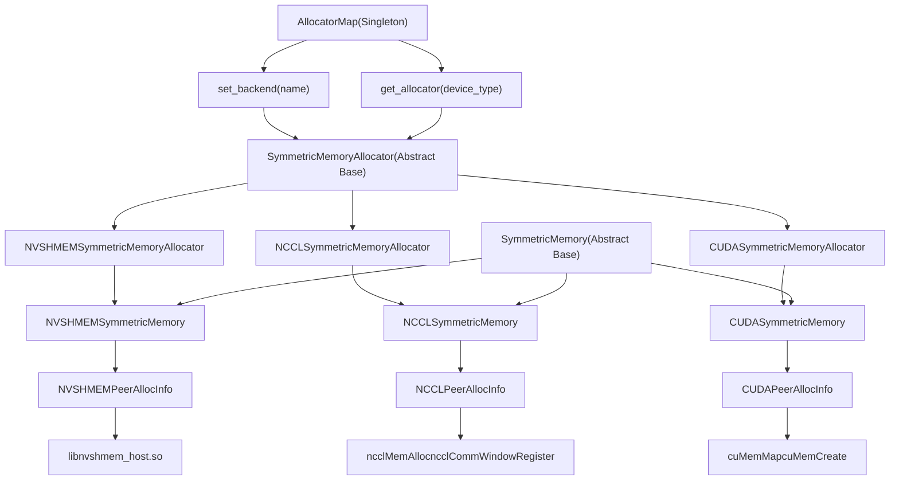
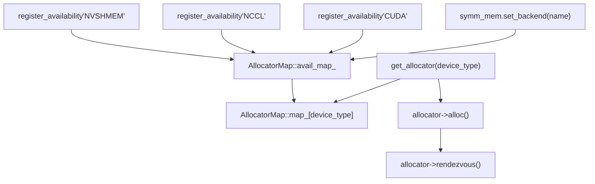
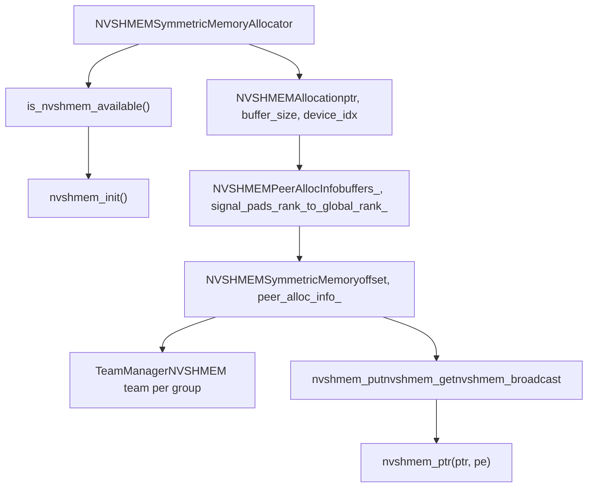
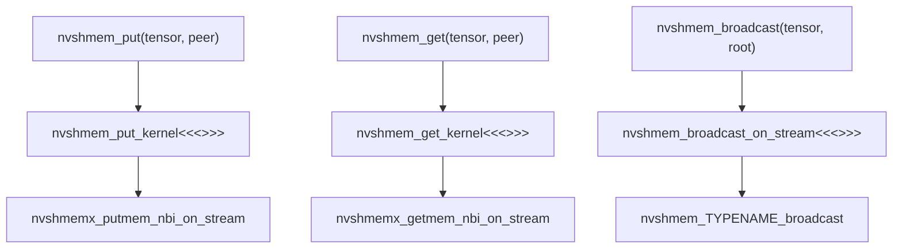
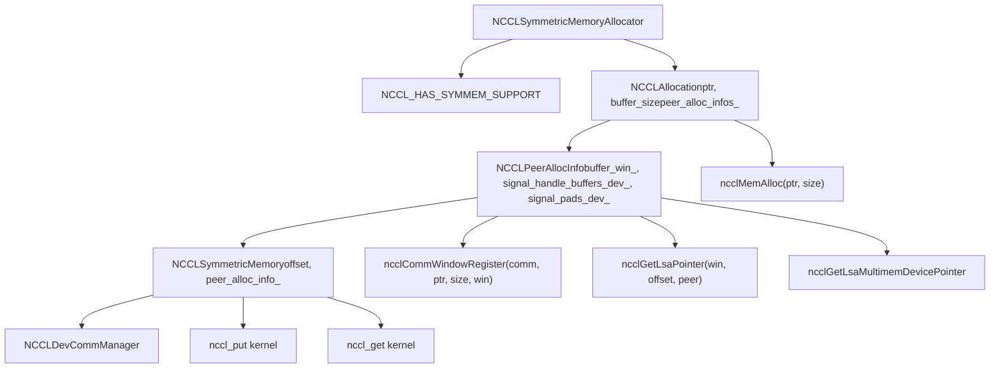
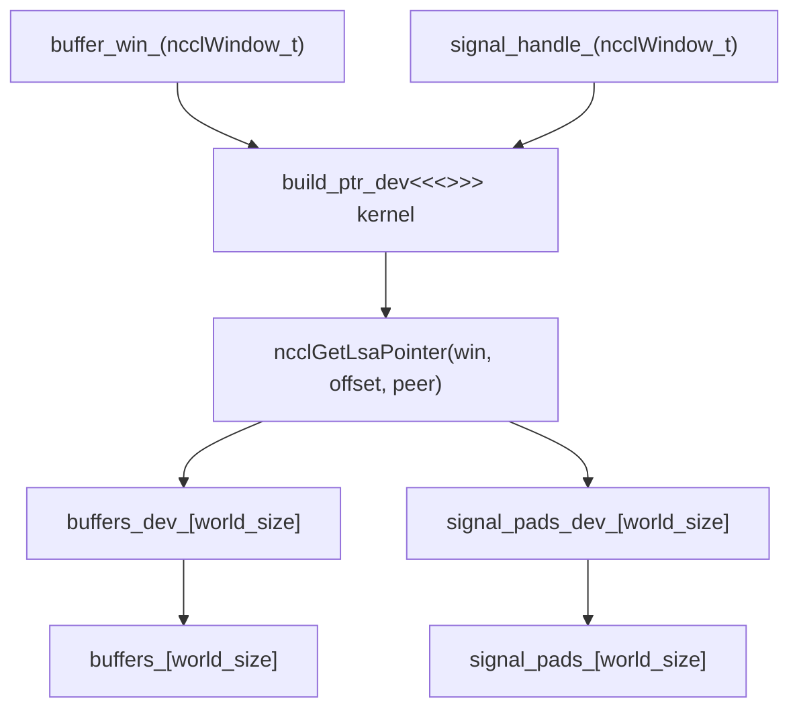
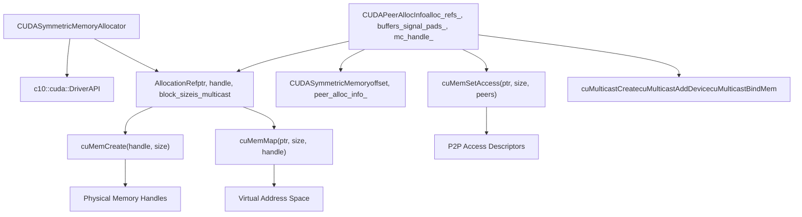

# Backend Implementations: NVSHMEM, NCCL, CUDA

Relevant source files

-   [build\_variables.bzl](https://github.com/pytorch/pytorch/blob/915982a4/build_variables.bzl)
-   [caffe2/CMakeLists.txt](https://github.com/pytorch/pytorch/blob/915982a4/caffe2/CMakeLists.txt)
-   [test/distributed/test\_nccl.py](https://github.com/pytorch/pytorch/blob/915982a4/test/distributed/test_nccl.py)
-   [test/distributed/test\_nvshmem.py](https://github.com/pytorch/pytorch/blob/915982a4/test/distributed/test_nvshmem.py)
-   [torch/\_C/\_distributed\_c10d.pyi](https://github.com/pytorch/pytorch/blob/915982a4/torch/_C/_distributed_c10d.pyi)
-   [torch/csrc/distributed/c10d/init.cpp](https://github.com/pytorch/pytorch/blob/915982a4/torch/csrc/distributed/c10d/init.cpp)
-   [torch/csrc/distributed/c10d/symm\_mem/CUDASymmetricMemory.cu](https://github.com/pytorch/pytorch/blob/915982a4/torch/csrc/distributed/c10d/symm_mem/CUDASymmetricMemory.cu)
-   [torch/csrc/distributed/c10d/symm\_mem/CUDASymmetricMemory.hpp](https://github.com/pytorch/pytorch/blob/915982a4/torch/csrc/distributed/c10d/symm_mem/CUDASymmetricMemory.hpp)
-   [torch/csrc/distributed/c10d/symm\_mem/NCCLSymmetricMemory.cu](https://github.com/pytorch/pytorch/blob/915982a4/torch/csrc/distributed/c10d/symm_mem/NCCLSymmetricMemory.cu)
-   [torch/csrc/distributed/c10d/symm\_mem/NCCLSymmetricMemory.hpp](https://github.com/pytorch/pytorch/blob/915982a4/torch/csrc/distributed/c10d/symm_mem/NCCLSymmetricMemory.hpp)
-   [torch/csrc/distributed/c10d/symm\_mem/SymmetricMemory.cpp](https://github.com/pytorch/pytorch/blob/915982a4/torch/csrc/distributed/c10d/symm_mem/SymmetricMemory.cpp)
-   [torch/csrc/distributed/c10d/symm\_mem/SymmetricMemory.hpp](https://github.com/pytorch/pytorch/blob/915982a4/torch/csrc/distributed/c10d/symm_mem/SymmetricMemory.hpp)
-   [torch/csrc/distributed/c10d/symm\_mem/nccl\_extension.cu](https://github.com/pytorch/pytorch/blob/915982a4/torch/csrc/distributed/c10d/symm_mem/nccl_extension.cu)
-   [torch/csrc/distributed/c10d/symm\_mem/nvshmem\_extension.cu](https://github.com/pytorch/pytorch/blob/915982a4/torch/csrc/distributed/c10d/symm_mem/nvshmem_extension.cu)
-   [torch/csrc/distributed/c10d/symm\_mem/nvshmem\_team\_manager.hpp](https://github.com/pytorch/pytorch/blob/915982a4/torch/csrc/distributed/c10d/symm_mem/nvshmem_team_manager.hpp)
-   [torch/distributed/\_symmetric\_memory/\_\_init\_\_.py](https://github.com/pytorch/pytorch/blob/915982a4/torch/distributed/_symmetric_memory/__init__.py)

## Purpose and Scope

This document describes the three backend implementations for PyTorch's Symmetric Memory system: NVSHMEM, NCCL, and CUDA. These backends provide different mechanisms for allocating and accessing symmetric memory across distributed GPU devices, each with different performance characteristics and hardware requirements.

For an overview of the Symmetric Memory architecture and API, see [4.3.1](/pytorch/pytorch/4.3.1-symmetric-memory-architecture). For information on using Symmetric Memory in high-performance communication patterns, see [4.3](/pytorch/pytorch/4.3-symmetric-memory-for-high-performance-communication).

## Architecture Overview

The Symmetric Memory system uses a pluggable backend architecture where different implementations share a common interface but use different underlying technologies for memory allocation and peer-to-peer access.

**Sources:** [torch/csrc/distributed/c10d/symm\_mem/SymmetricMemory.cpp28-114](https://github.com/pytorch/pytorch/blob/915982a4/torch/csrc/distributed/c10d/symm_mem/SymmetricMemory.cpp#L28-L114) [torch/csrc/distributed/c10d/symm\_mem/SymmetricMemory.hpp1-227](https://github.com/pytorch/pytorch/blob/915982a4/torch/csrc/distributed/c10d/symm_mem/SymmetricMemory.hpp#L1-L227)

## Backend Selection and Registration

Backends register themselves at static initialization time through the `AllocatorMap` singleton. Users can select a backend via `set_backend()` before any allocations occur.

**Key Functions:**

-   `register_availability(name, allocator)`: Registers a backend at static init time
-   `set_backend(name)`: Selects the active backend for a device type
-   `get_allocator(device_type)`: Returns the registered allocator for the device

**Sources:** [torch/csrc/distributed/c10d/symm\_mem/SymmetricMemory.cpp186-205](https://github.com/pytorch/pytorch/blob/915982a4/torch/csrc/distributed/c10d/symm_mem/SymmetricMemory.cpp#L186-L205) [torch/distributed/\_symmetric\_memory/\_\_init\_\_.py1-1000](https://github.com/pytorch/pytorch/blob/915982a4/torch/distributed/_symmetric_memory/__init__.py#L1-L1000)

## NVSHMEM Backend

The NVSHMEM backend uses NVIDIA's NVSHMEM library to provide one-sided RDMA communication primitives. It requires the `libnvshmem_host.so` library to be available at runtime.

### Architecture

### Availability Check

The NVSHMEM backend performs a runtime check for library availability using `dlopen`:

**Sources:** [torch/csrc/distributed/c10d/symm\_mem/nvshmem\_extension.cu43-69](https://github.com/pytorch/pytorch/blob/915982a4/torch/csrc/distributed/c10d/symm_mem/nvshmem_extension.cu#L43-L69)

### Memory Allocation

NVSHMEM allocations use `nvshmem_malloc()` to create symmetric memory:

**Key Classes:**

-   `NVSHMEMAllocation`: Resource wrapper managing `nvshmem_free()` on destruction
-   `NVSHMEMPeerAllocInfo`: Stores peer pointer arrays and global rank mappings
-   `NVSHMEMSymmetricMemory`: Handle with offset into base allocation

**Sources:** [torch/csrc/distributed/c10d/symm\_mem/NVSHMEMSymmetricMemory.cu30-52](https://github.com/pytorch/pytorch/blob/915982a4/torch/csrc/distributed/c10d/symm_mem/NVSHMEMSymmetricMemory.cu#L30-L52) [torch/csrc/distributed/c10d/symm\_mem/NVSHMEMSymmetricMemory.cu64-138](https://github.com/pytorch/pytorch/blob/915982a4/torch/csrc/distributed/c10d/symm_mem/NVSHMEMSymmetricMemory.cu#L64-L138)

### Team Management

NVSHMEM teams map process groups to NVSHMEM collective contexts:

**Sources:** [torch/csrc/distributed/c10d/symm\_mem/nvshmem\_team\_manager.hpp1-200](https://github.com/pytorch/pytorch/blob/915982a4/torch/csrc/distributed/c10d/symm_mem/nvshmem_team_manager.hpp#L1-L200) [torch/csrc/distributed/c10d/symm\_mem/nvshmem\_extension.cu80-147](https://github.com/pytorch/pytorch/blob/915982a4/torch/csrc/distributed/c10d/symm_mem/nvshmem_extension.cu#L80-L147)

### Device-Side Operations

NVSHMEM provides device-side put/get primitives callable from CUDA kernels:

**Sources:** [torch/csrc/distributed/c10d/symm\_mem/nvshmem\_extension.cu148-250](https://github.com/pytorch/pytorch/blob/915982a4/torch/csrc/distributed/c10d/symm_mem/nvshmem_extension.cu#L148-L250) [torch/csrc/distributed/c10d/symm\_mem/nvshmem\_extension.cuh1-50](https://github.com/pytorch/pytorch/blob/915982a4/torch/csrc/distributed/c10d/symm_mem/nvshmem_extension.cuh#L1-L50)

## NCCL Backend

The NCCL backend uses NCCL's symmetric memory APIs (available since NCCL 2.27) to allocate and register memory for low-latency collectives. It optionally supports NVLink SHARP multicast.

### Architecture

### Capability Detection

The NCCL backend is conditionally compiled based on NCCL version:

**Compile-time checks:**

-   `NCCL_HAS_SYMMEM_SUPPORT`: Requires NCCL >= 2.27
-   `NCCL_HAS_SYMMEM_DEVICE_SUPPORT`: Requires NCCL >= 2.28 for device communicators

**Sources:** [torch/csrc/distributed/c10d/symm\_mem/nccl\_dev\_cap.hpp1-30](https://github.com/pytorch/pytorch/blob/915982a4/torch/csrc/distributed/c10d/symm_mem/nccl_dev_cap.hpp#L1-L30)

### Memory Allocation and Registration

NCCL allocates memory via `ncclMemAlloc()` and registers it as a communication window:

**Key Flow:**

1.  Allocate buffer: `ncclMemAlloc(&ptr, size)`
2.  Register window: `ncclCommWindowRegister(comm, ptr, size, &win, NCCL_WIN_COLL_SYMMETRIC)`
3.  Allocate signal pad: `ncclMemAlloc(&signal_ptr, signal_pad_size)`
4.  Register signal window: `ncclCommWindowRegister(comm, signal_ptr, signal_pad_size, &signal_win, NCCL_WIN_COLL_SYMMETRIC)`

**Sources:** [torch/csrc/distributed/c10d/symm\_mem/NCCLSymmetricMemory.cu68-109](https://github.com/pytorch/pytorch/blob/915982a4/torch/csrc/distributed/c10d/symm_mem/NCCLSymmetricMemory.cu#L68-L109)

### Peer Pointer Resolution

With NCCL 2.28+, peer pointers are resolved on the device using `ncclGetLsaPointer()`:

**Sources:** [torch/csrc/distributed/c10d/symm\_mem/NCCLSymmetricMemory.cu54-142](https://github.com/pytorch/pytorch/blob/915982a4/torch/csrc/distributed/c10d/symm_mem/NCCLSymmetricMemory.cu#L54-L142)

### Multicast Support

NCCL 2.29+ provides multicast pointers via `ncclGetLsaMultimemDevicePointer()` for NVLink SHARP:

**Sources:** [torch/csrc/distributed/c10d/symm\_mem/NCCLSymmetricMemory.cu144-150](https://github.com/pytorch/pytorch/blob/915982a4/torch/csrc/distributed/c10d/symm_mem/NCCLSymmetricMemory.cu#L144-L150)

### Device Communication Manager

The `NCCLDevCommManager` creates and manages NCCL device communicators:

**Sources:** [torch/csrc/distributed/c10d/symm\_mem/nccl\_devcomm\_manager.hpp1-200](https://github.com/pytorch/pytorch/blob/915982a4/torch/csrc/distributed/c10d/symm_mem/nccl_devcomm_manager.hpp#L1-L200)

### Device-Side Operations

NCCL backend provides custom kernels for P2P operations:

**Key Operations:**

-   `nccl_put`: Copy data to remote peer using `ncclGetLsaPointer()`
-   `nccl_get`: Copy data from remote peer
-   `nccl_wait_for_signal`: Poll signal pad until value matches

**Sources:** [torch/csrc/distributed/c10d/symm\_mem/nccl\_extension.cu1-500](https://github.com/pytorch/pytorch/blob/915982a4/torch/csrc/distributed/c10d/symm_mem/nccl_extension.cu#L1-L500) [torch/csrc/distributed/c10d/symm\_mem/nccl\_extension.cuh1-19](https://github.com/pytorch/pytorch/blob/915982a4/torch/csrc/distributed/c10d/symm_mem/nccl_extension.cuh#L1-L19)

## CUDA Backend

The CUDA backend uses CUDA Driver API to create virtual memory mappings for P2P access. It serves as a fallback when NVSHMEM and NCCL are not available.

### Architecture

### Virtual Memory Allocation

The CUDA backend uses the driver API for fine-grained memory control:

**Allocation Steps:**

1.  Reserve virtual address space: `cuMemAddressReserve()`
2.  Create physical memory handle: `cuMemCreate()`
3.  Map virtual to physical: `cuMemMap()`
4.  Set access permissions: `cuMemSetAccess()`

**Sources:** [torch/csrc/distributed/c10d/symm\_mem/CUDASymmetricMemory.cu1-1000](https://github.com/pytorch/pytorch/blob/915982a4/torch/csrc/distributed/c10d/symm_mem/CUDASymmetricMemory.cu#L1-L1000)

### Peer-to-Peer Access Setup

P2P access is established through `cuMemSetAccess()` with peer device descriptors:

> **[Mermaid sequence]**
> *(图表结构无法解析)*

**Sources:** [torch/csrc/distributed/c10d/symm\_mem/CUDASymmetricMemory.cu200-500](https://github.com/pytorch/pytorch/blob/915982a4/torch/csrc/distributed/c10d/symm_mem/CUDASymmetricMemory.cu#L200-L500)

### Multicast Support (CUDA 12.3+)

On supported hardware, the CUDA backend can create multicast memory groups:

**Multicast Setup:**

1.  `cuMulticastCreate()`: Create multicast handle
2.  `cuMulticastAddDevice()`: Add each device to multicast group
3.  `cuMulticastBindMem()`: Bind memory handle to multicast
4.  `cuMulticastGetGranularity()`: Query alignment requirements

**Sources:** [torch/csrc/distributed/c10d/symm\_mem/CUDASymmetricMemory.cu600-800](https://github.com/pytorch/pytorch/blob/915982a4/torch/csrc/distributed/c10d/symm_mem/CUDASymmetricMemory.cu#L600-L800)

### Store-Based Rendezvous

The CUDA backend uses the process group store for IPC handle exchange:

**Exchange Protocol:**

1.  Each rank exports its memory handle: `exportMemHandle()`
2.  Rank serializes handle to bytes and stores: `store.set("ipc_handle/{rank}", bytes)`
3.  Each rank imports all peer handles: `importMemHandle()`
4.  Each rank maps and sets access for all peer memory

**Sources:** [torch/csrc/distributed/c10d/symm\_mem/CUDASymmetricMemory.cu400-600](https://github.com/pytorch/pytorch/blob/915982a4/torch/csrc/distributed/c10d/symm_mem/CUDASymmetricMemory.cu#L400-L600)

## Backend Comparison

| Feature | NVSHMEM | NCCL | CUDA |
| --- | --- | --- | --- |
| **Availability** | NVSHMEM library required | NCCL >= 2.27 | CUDA Driver API |
| **Device-side Collectives** | Yes (native) | Limited | No |
| **One-sided RDMA** | Yes | Via custom kernels | Via custom kernels |
| **Multicast (NVLink SHARP)** | Via NVSHMEM teams | NCCL >= 2.29 | CUDA >= 12.3 |
| **Network Support** | InfiniBand + NVLink | NVLink only | NVLink only |
| **Team/Group Support** | NVSHMEM teams | NCCL communicators | Manual |
| **Memory Registration** | `nvshmem_malloc()` | `ncclMemAlloc()` + `ncclCommWindowRegister()` | `cuMemCreate()` + `cuMemMap()` |
| **Peer Pointer Access** | `nvshmem_ptr()` | `ncclGetLsaPointer()` | Direct VA mapping |
| **Signal Synchronization** | Built-in | Via device communicators | Via polling |

**Use Case Recommendations:**

-   **NVSHMEM**: Best for distributed training with InfiniBand clusters, requires device-side collectives
-   **NCCL**: Recommended for NVLink-based systems with NCCL 2.27+, good NCCL integration
-   **CUDA**: Fallback for systems without NVSHMEM/NCCL, or when fine-grained control needed

**Sources:** [torch/csrc/distributed/c10d/symm\_mem/SymmetricMemory.cpp1-500](https://github.com/pytorch/pytorch/blob/915982a4/torch/csrc/distributed/c10d/symm_mem/SymmetricMemory.cpp#L1-L500) [torch/distributed/\_symmetric\_memory/\_\_init\_\_.py1-1000](https://github.com/pytorch/pytorch/blob/915982a4/torch/distributed/_symmetric_memory/__init__.py#L1-L1000)

## Testing

Backend implementations have dedicated test coverage:

**Test Files:**

-   `test_nvshmem.py`: NVSHMEM-specific tests including allocation, rendezvous, put/get/broadcast
-   `test_nccl.py`: NCCL general tests with some symmetric memory coverage

**Key Test Classes:**

-   `NVSHMEMSymmetricMemoryTest`: Tests NVSHMEM allocation, mempool integration, handle offsets
-   `NVSHMEMAll2AllTest`: Tests all-to-all collectives with variable-sized data

**Sources:** [test/distributed/test\_nvshmem.py1-500](https://github.com/pytorch/pytorch/blob/915982a4/test/distributed/test_nvshmem.py#L1-L500) [test/distributed/test\_nccl.py1-100](https://github.com/pytorch/pytorch/blob/915982a4/test/distributed/test_nccl.py#L1-L100)
