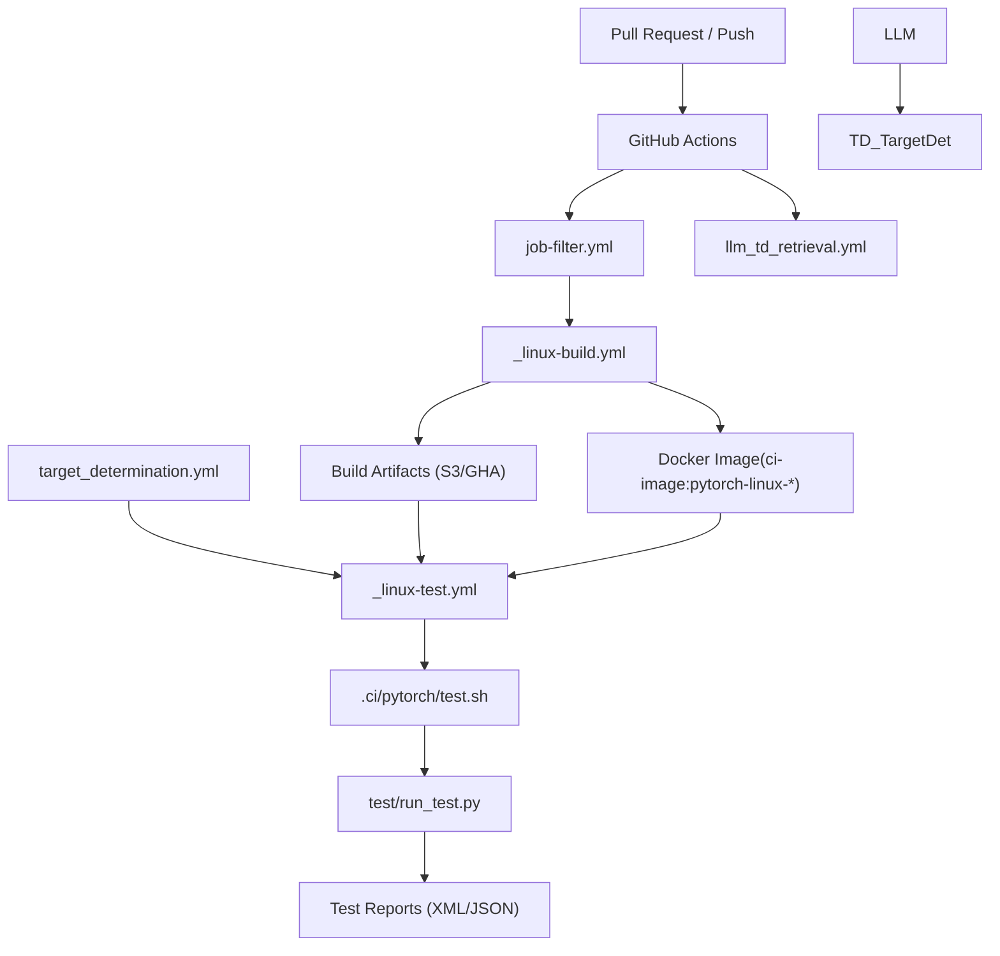
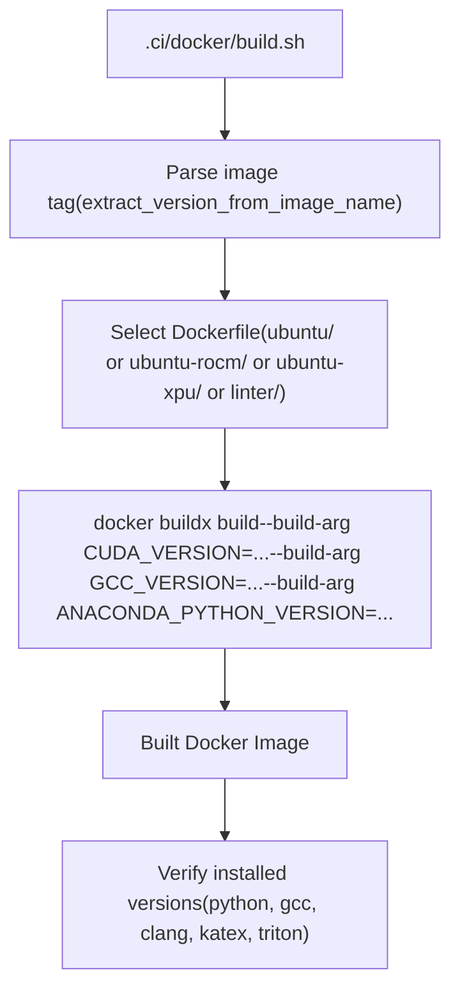
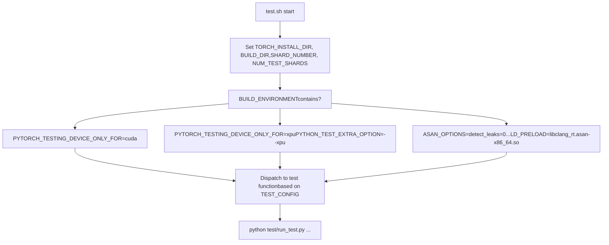
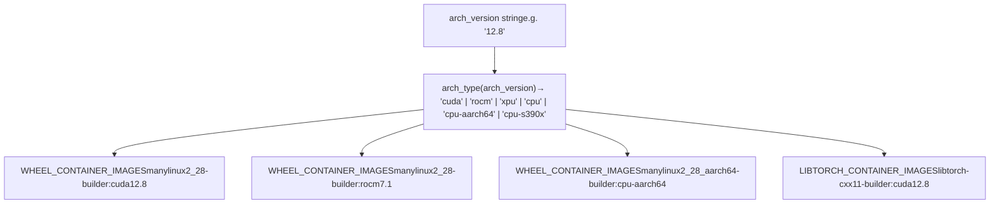
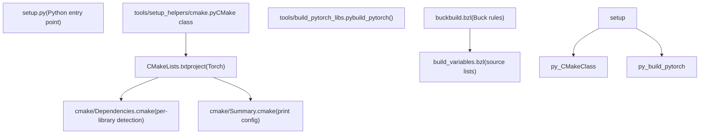

# Build and Test Infrastructure

Relevant source files

-   [.ci/docker/README.md](https://github.com/pytorch/pytorch/blob/915982a4/.ci/docker/README.md)
-   [.ci/docker/build.sh](https://github.com/pytorch/pytorch/blob/915982a4/.ci/docker/build.sh)
-   [.ci/docker/common/install\_amdsmi.sh](https://github.com/pytorch/pytorch/blob/915982a4/.ci/docker/common/install_amdsmi.sh)
-   [.ci/docker/common/install\_cache.sh](https://github.com/pytorch/pytorch/blob/915982a4/.ci/docker/common/install_cache.sh)
-   [.ci/docker/common/install\_conda.sh](https://github.com/pytorch/pytorch/blob/915982a4/.ci/docker/common/install_conda.sh)
-   [.ci/docker/common/install\_cpython.sh](https://github.com/pytorch/pytorch/blob/915982a4/.ci/docker/common/install_cpython.sh)
-   [.ci/docker/common/install\_cuda.sh](https://github.com/pytorch/pytorch/blob/915982a4/.ci/docker/common/install_cuda.sh)
-   [.ci/docker/common/install\_cusparselt.sh](https://github.com/pytorch/pytorch/blob/915982a4/.ci/docker/common/install_cusparselt.sh)
-   [.ci/docker/common/install\_inductor\_benchmark\_deps.sh](https://github.com/pytorch/pytorch/blob/915982a4/.ci/docker/common/install_inductor_benchmark_deps.sh)
-   [.ci/docker/common/install\_mingw.sh](https://github.com/pytorch/pytorch/blob/915982a4/.ci/docker/common/install_mingw.sh)
-   [.ci/docker/common/install\_rocm.sh](https://github.com/pytorch/pytorch/blob/915982a4/.ci/docker/common/install_rocm.sh)
-   [.ci/docker/manywheel/build\_scripts/manylinux1-check.py](https://github.com/pytorch/pytorch/blob/915982a4/.ci/docker/manywheel/build_scripts/manylinux1-check.py)
-   [.ci/docker/manywheel/build\_scripts/ssl-check.py](https://github.com/pytorch/pytorch/blob/915982a4/.ci/docker/manywheel/build_scripts/ssl-check.py)
-   [.ci/docker/ubuntu-rocm/Dockerfile](https://github.com/pytorch/pytorch/blob/915982a4/.ci/docker/ubuntu-rocm/Dockerfile)
-   [.ci/docker/ubuntu/Dockerfile](https://github.com/pytorch/pytorch/blob/915982a4/.ci/docker/ubuntu/Dockerfile)
-   [.ci/libtorch/extract\_libtorch\_from\_wheel.py](https://github.com/pytorch/pytorch/blob/915982a4/.ci/libtorch/extract_libtorch_from_wheel.py)
-   [.ci/pytorch/build.sh](https://github.com/pytorch/pytorch/blob/915982a4/.ci/pytorch/build.sh)
-   [.ci/pytorch/common\_utils.sh](https://github.com/pytorch/pytorch/blob/915982a4/.ci/pytorch/common_utils.sh)
-   [.ci/pytorch/macos-build.sh](https://github.com/pytorch/pytorch/blob/915982a4/.ci/pytorch/macos-build.sh)
-   [.ci/pytorch/macos-common.sh](https://github.com/pytorch/pytorch/blob/915982a4/.ci/pytorch/macos-common.sh)
-   [.ci/pytorch/macos-test.sh](https://github.com/pytorch/pytorch/blob/915982a4/.ci/pytorch/macos-test.sh)
-   [.ci/pytorch/numba-cuda-13.patch](https://github.com/pytorch/pytorch/blob/915982a4/.ci/pytorch/numba-cuda-13.patch)
-   [.ci/pytorch/smoke\_test/smoke\_test.py](https://github.com/pytorch/pytorch/blob/915982a4/.ci/pytorch/smoke_test/smoke_test.py)
-   [.ci/pytorch/test.sh](https://github.com/pytorch/pytorch/blob/915982a4/.ci/pytorch/test.sh)
-   [.ci/wheel/build\_wheel.sh](https://github.com/pytorch/pytorch/blob/915982a4/.ci/wheel/build_wheel.sh)
-   [.github/actions/linux-test/action.yml](https://github.com/pytorch/pytorch/blob/915982a4/.github/actions/linux-test/action.yml)
-   [.github/actions/test-pytorch-binary/action.yml](https://github.com/pytorch/pytorch/blob/915982a4/.github/actions/test-pytorch-binary/action.yml)
-   [.github/ci\_commit\_pins/fbgemm\_rocm.txt](https://github.com/pytorch/pytorch/blob/915982a4/.github/ci_commit_pins/fbgemm_rocm.txt)
-   [.github/scripts/close\_nonexistent\_disable\_issues.py](https://github.com/pytorch/pytorch/blob/915982a4/.github/scripts/close_nonexistent_disable_issues.py)
-   [.github/scripts/generate\_binary\_build\_matrix.py](https://github.com/pytorch/pytorch/blob/915982a4/.github/scripts/generate_binary_build_matrix.py)
-   [.github/scripts/generate\_ci\_workflows.py](https://github.com/pytorch/pytorch/blob/915982a4/.github/scripts/generate_ci_workflows.py)
-   [.github/scripts/label\_utils.py](https://github.com/pytorch/pytorch/blob/915982a4/.github/scripts/label_utils.py)
-   [.github/templates/linux\_binary\_build\_workflow.yml.j2](https://github.com/pytorch/pytorch/blob/915982a4/.github/templates/linux_binary_build_workflow.yml.j2)
-   [.github/templates/macos\_binary\_build\_workflow.yml.j2](https://github.com/pytorch/pytorch/blob/915982a4/.github/templates/macos_binary_build_workflow.yml.j2)
-   [.github/templates/upload.yml.j2](https://github.com/pytorch/pytorch/blob/915982a4/.github/templates/upload.yml.j2)
-   [.github/templates/windows\_binary\_build\_workflow.yml.j2](https://github.com/pytorch/pytorch/blob/915982a4/.github/templates/windows_binary_build_workflow.yml.j2)
-   [.github/workflows/\_linux-build.yml](https://github.com/pytorch/pytorch/blob/915982a4/.github/workflows/_linux-build.yml)
-   [.github/workflows/\_linux-test.yml](https://github.com/pytorch/pytorch/blob/915982a4/.github/workflows/_linux-test.yml)
-   [.github/workflows/\_xpu-test.yml](https://github.com/pytorch/pytorch/blob/915982a4/.github/workflows/_xpu-test.yml)
-   [.github/workflows/docker-builds.yml](https://github.com/pytorch/pytorch/blob/915982a4/.github/workflows/docker-builds.yml)
-   [.github/workflows/dynamo-unittest.yml](https://github.com/pytorch/pytorch/blob/915982a4/.github/workflows/dynamo-unittest.yml)
-   [.github/workflows/generated-linux-aarch64-binary-manywheel-nightly.yml](https://github.com/pytorch/pytorch/blob/915982a4/.github/workflows/generated-linux-aarch64-binary-manywheel-nightly.yml)
-   [.github/workflows/generated-linux-binary-manywheel-nightly.yml](https://github.com/pytorch/pytorch/blob/915982a4/.github/workflows/generated-linux-binary-manywheel-nightly.yml)
-   [.github/workflows/generated-linux-s390x-binary-manywheel-nightly.yml](https://github.com/pytorch/pytorch/blob/915982a4/.github/workflows/generated-linux-s390x-binary-manywheel-nightly.yml)
-   [.github/workflows/generated-macos-arm64-binary-wheel-nightly.yml](https://github.com/pytorch/pytorch/blob/915982a4/.github/workflows/generated-macos-arm64-binary-wheel-nightly.yml)
-   [.github/workflows/generated-windows-arm64-binary-libtorch-debug-nightly.yml](https://github.com/pytorch/pytorch/blob/915982a4/.github/workflows/generated-windows-arm64-binary-libtorch-debug-nightly.yml)
-   [.github/workflows/generated-windows-arm64-binary-wheel-nightly.yml](https://github.com/pytorch/pytorch/blob/915982a4/.github/workflows/generated-windows-arm64-binary-wheel-nightly.yml)
-   [.github/workflows/generated-windows-binary-libtorch-debug-nightly.yml](https://github.com/pytorch/pytorch/blob/915982a4/.github/workflows/generated-windows-binary-libtorch-debug-nightly.yml)
-   [.github/workflows/generated-windows-binary-wheel-nightly.yml](https://github.com/pytorch/pytorch/blob/915982a4/.github/workflows/generated-windows-binary-wheel-nightly.yml)
-   [.github/workflows/inductor-micro-benchmark.yml](https://github.com/pytorch/pytorch/blob/915982a4/.github/workflows/inductor-micro-benchmark.yml)
-   [.github/workflows/inductor-perf-compare.yml](https://github.com/pytorch/pytorch/blob/915982a4/.github/workflows/inductor-perf-compare.yml)
-   [.github/workflows/inductor-perf-test-b200.yml](https://github.com/pytorch/pytorch/blob/915982a4/.github/workflows/inductor-perf-test-b200.yml)
-   [.github/workflows/inductor-perf-test-nightly-h100.yml](https://github.com/pytorch/pytorch/blob/915982a4/.github/workflows/inductor-perf-test-nightly-h100.yml)
-   [.github/workflows/inductor-perf-test-nightly.yml](https://github.com/pytorch/pytorch/blob/915982a4/.github/workflows/inductor-perf-test-nightly.yml)
-   [.github/workflows/inductor-periodic.yml](https://github.com/pytorch/pytorch/blob/915982a4/.github/workflows/inductor-periodic.yml)
-   [.github/workflows/inductor-unittest.yml](https://github.com/pytorch/pytorch/blob/915982a4/.github/workflows/inductor-unittest.yml)
-   [.github/workflows/inductor.yml](https://github.com/pytorch/pytorch/blob/915982a4/.github/workflows/inductor.yml)
-   [.github/workflows/pull.yml](https://github.com/pytorch/pytorch/blob/915982a4/.github/workflows/pull.yml)
-   [.github/workflows/rocm-nightly.yml](https://github.com/pytorch/pytorch/blob/915982a4/.github/workflows/rocm-nightly.yml)
-   [.github/workflows/slow.yml](https://github.com/pytorch/pytorch/blob/915982a4/.github/workflows/slow.yml)
-   [.github/workflows/torchbench.yml](https://github.com/pytorch/pytorch/blob/915982a4/.github/workflows/torchbench.yml)
-   [.github/workflows/trunk.yml](https://github.com/pytorch/pytorch/blob/915982a4/.github/workflows/trunk.yml)
-   [.gitignore](https://github.com/pytorch/pytorch/blob/915982a4/.gitignore)
-   [BUILD.bazel](https://github.com/pytorch/pytorch/blob/915982a4/BUILD.bazel)
-   [CMakeLists.txt](https://github.com/pytorch/pytorch/blob/915982a4/CMakeLists.txt)
-   [aten/src/ATen/native/tags.yaml](https://github.com/pytorch/pytorch/blob/915982a4/aten/src/ATen/native/tags.yaml)
-   [buckbuild.bzl](https://github.com/pytorch/pytorch/blob/915982a4/buckbuild.bzl)
-   [c10/core/impl/alloc\_cpu.cpp](https://github.com/pytorch/pytorch/blob/915982a4/c10/core/impl/alloc_cpu.cpp)
-   [c10/ovrsource\_defs.bzl](https://github.com/pytorch/pytorch/blob/915982a4/c10/ovrsource_defs.bzl)
-   [cmake/Dependencies.cmake](https://github.com/pytorch/pytorch/blob/915982a4/cmake/Dependencies.cmake)
-   [cmake/Summary.cmake](https://github.com/pytorch/pytorch/blob/915982a4/cmake/Summary.cmake)
-   [cmake/public/cuda.cmake](https://github.com/pytorch/pytorch/blob/915982a4/cmake/public/cuda.cmake)
-   [cmake/public/utils.cmake](https://github.com/pytorch/pytorch/blob/915982a4/cmake/public/utils.cmake)
-   [setup.py](https://github.com/pytorch/pytorch/blob/915982a4/setup.py)
-   [test/custom\_operator/test\_out\_variant.py](https://github.com/pytorch/pytorch/blob/915982a4/test/custom_operator/test_out_variant.py)
-   [test/inductor/test\_cutedsl\_grouped\_mm.py](https://github.com/pytorch/pytorch/blob/915982a4/test/inductor/test_cutedsl_grouped_mm.py)
-   [test/jit/test\_freezing.py](https://github.com/pytorch/pytorch/blob/915982a4/test/jit/test_freezing.py)
-   [test/run\_test.py](https://github.com/pytorch/pytorch/blob/915982a4/test/run_test.py)
-   [test/test\_bundled\_inputs.py](https://github.com/pytorch/pytorch/blob/915982a4/test/test_bundled_inputs.py)
-   [test/test\_complex.py](https://github.com/pytorch/pytorch/blob/915982a4/test/test_complex.py)
-   [test/test\_ops.py](https://github.com/pytorch/pytorch/blob/915982a4/test/test_ops.py)
-   [test/test\_type\_hints.py](https://github.com/pytorch/pytorch/blob/915982a4/test/test_type_hints.py)
-   [test/test\_type\_info.py](https://github.com/pytorch/pytorch/blob/915982a4/test/test_type_info.py)
-   [tools/stats/monitor.py](https://github.com/pytorch/pytorch/blob/915982a4/tools/stats/monitor.py)
-   [tools/stats/utilization\_stats\_lib.py](https://github.com/pytorch/pytorch/blob/915982a4/tools/stats/utilization_stats_lib.py)
-   [torch/CMakeLists.txt](https://github.com/pytorch/pytorch/blob/915982a4/torch/CMakeLists.txt)
-   [torch/\_inductor/kernel/mm\_common.py](https://github.com/pytorch/pytorch/blob/915982a4/torch/_inductor/kernel/mm_common.py)
-   [torch/\_inductor/kernel/mm\_grouped.py](https://github.com/pytorch/pytorch/blob/915982a4/torch/_inductor/kernel/mm_grouped.py)
-   [torch/\_inductor/kernel/templates/cutedsl\_mm\_grouped.py.jinja](https://github.com/pytorch/pytorch/blob/915982a4/torch/_inductor/kernel/templates/cutedsl_mm_grouped.py.jinja)
-   [torch/\_inductor/template\_heuristics/cutedsl.py](https://github.com/pytorch/pytorch/blob/915982a4/torch/_inductor/template_heuristics/cutedsl.py)
-   [torch/\_library/\_out\_variant.py](https://github.com/pytorch/pytorch/blob/915982a4/torch/_library/_out_variant.py)
-   [torch/csrc/distributed/c10d/symm\_mem/nccl\_dev\_cap.hpp](https://github.com/pytorch/pytorch/blob/915982a4/torch/csrc/distributed/c10d/symm_mem/nccl_dev_cap.hpp)
-   [torch/csrc/distributed/c10d/symm\_mem/nccl\_devcomm\_manager.hpp](https://github.com/pytorch/pytorch/blob/915982a4/torch/csrc/distributed/c10d/symm_mem/nccl_devcomm_manager.hpp)
-   [torch/csrc/jit/serialization/unpickler.h](https://github.com/pytorch/pytorch/blob/915982a4/torch/csrc/jit/serialization/unpickler.h)
-   [torch/distributed/\_\_init\_\_.py](https://github.com/pytorch/pytorch/blob/915982a4/torch/distributed/__init__.py)
-   [torch/distributed/\_shard/sharded\_tensor/reshard.py](https://github.com/pytorch/pytorch/blob/915982a4/torch/distributed/_shard/sharded_tensor/reshard.py)
-   [torch/distributed/\_shard/sharding\_spec/chunk\_sharding\_spec\_ops/embedding\_bag.py](https://github.com/pytorch/pytorch/blob/915982a4/torch/distributed/_shard/sharding_spec/chunk_sharding_spec_ops/embedding_bag.py)
-   [torch/distributed/nn/functional.py](https://github.com/pytorch/pytorch/blob/915982a4/torch/distributed/nn/functional.py)
-   [torch/testing/\_internal/opinfo/definitions/fft.py](https://github.com/pytorch/pytorch/blob/915982a4/torch/testing/_internal/opinfo/definitions/fft.py)

This page covers PyTorch's build system, CI/CD automation, Docker image management, test orchestration, and binary release pipeline. The scope is the tooling that builds, validates, and packages PyTorch — not the runtime library APIs it produces.

For detail on the CMake build configuration, code generation, and feature flags, see [Build System and Code Generation](/pytorch/pytorch/5.1-build-system-and-code-generation). For the Python testing utilities and parametrize framework, see [Testing Infrastructure and OpInfo](/pytorch/pytorch/5.2-testing-infrastructure-and-opinfo). For CI/CD workflow files and Docker image structure, see [CI/CD Workflows and Docker Image Builds](/pytorch/pytorch/5.3-cicd-workflows-and-docker-image-builds). For the binary release pipeline, see [Binary Release Pipeline](/pytorch/pytorch/5.4-binary-release-pipeline). For the vLLM integration, see [External Integration: vLLM CI Pipeline](/pytorch/pytorch/5.5-external-integration:-vllm-ci-pipeline).

---

## System Overview

The build and test infrastructure spans five layers:

**Build System** — CMake (`CMakeLists.txt`, `cmake/Dependencies.cmake`) and Python (`setup.py`) together configure and compile the C++/CUDA library. Buck rules (`buckbuild.bzl`) serve the internal Meta monorepo build.

**Docker Images** — Hermetic build and test environments are constructed from Dockerfiles in `.ci/docker/` and assembled by `.ci/docker/build.sh`.

**CI/CD Workflows** — GitHub Actions workflows in `.github/workflows/` orchestrate builds, tests, and releases for every pull request and trunk push.

**Test Runner** — `test/run_test.py` selects, shards, and executes both Python and C++ tests. `.ci/pytorch/test.sh` is the CI entry point that calls it.

**Binary Release** — `.github/scripts/generate_binary_build_matrix.py` defines the matrix of platform/Python/accelerator combinations that produces wheels and libtorch archives.

**CI/CD Flow Diagram**


Sources: `.github/workflows/pull.yml`, `.github/workflows/trunk.yml`, `.github/workflows/_linux-test.yml`, `.ci/pytorch/test.sh`, `test/run_test.py`

---

## Build System

### CMake Configuration

The primary build system is CMake, with `CMakeLists.txt` at the repository root. It requires CMake ≥ 3.27 and sets C++20 (`CMAKE_CXX_STANDARD=20`) and C17 as the language standards.

`setup.py` is the Python entry point. It invokes `CMake` from `tools/setup_helpers/cmake.py` and then `build_pytorch` from `tools/build_pytorch_libs.py` to produce the compiled library. The `CMake` class reads environment variables and translates them into `-D` flags passed to `cmake`.

**Key feature flags in `CMakeLists.txt`:**

| CMake Flag | Default | Purpose |
| --- | --- | --- |
| `USE_CUDA` | ON | CUDA support |
| `USE_ROCM` | ON (Linux/Win) | AMD ROCm support |
| `USE_XPU` | ON | Intel XPU/SYCL support |
| `USE_DISTRIBUTED` | ON | c10d, Gloo, MPI, NCCL |
| `USE_NCCL` | ON (if CUDA/ROCm) | NCCL collective comms |
| `USE_MKLDNN` | ON (x86) | oneDNN CPU kernels |
| `USE_MPS` | ON (macOS 12.3+) | Metal Performance Shaders |
| `BUILD_TEST` | ON | Build C++ test binaries |
| `BUILD_PYTHON` | ON | Build Python bindings |

[CMakeLists.txt204-365](https://github.com/pytorch/pytorch/blob/915982a4/CMakeLists.txt#L204-L365)

`cmake/Dependencies.cmake` handles per-dependency detection and linking. It conditionally includes:

-   `cmake/public/cuda.cmake` when `USE_CUDA` is set
-   `cmake/public/xpu.cmake` when `USE_XPU` is set
-   `cmake/ProtoBuf.cmake` for protobuf
-   UBSAN disable/enable macros (`disable_ubsan` / `enable_ubsan`) surrounding protobuf compilation

[cmake/Dependencies.cmake1-110](https://github.com/pytorch/pytorch/blob/915982a4/cmake/Dependencies.cmake#L1-L110)

### setup.py Entry Point

`setup.py` accepts environment variable controls documented at the top of the file. Key variables:

| Variable | Effect |
| --- | --- |
| `DEBUG=1` | Compile with `-O0 -g` |
| `USE_CUDA=0` | Disable CUDA |
| `MAX_JOBS` | Parallel compile jobs |
| `TORCH_CUDA_ARCH_LIST` | CUDA compute capabilities to target |
| `PYTORCH_ROCM_ARCH` | ROCm GPU targets |
| `BUILD_LIBTORCH_WHL` | Build `libtorch.so` as a separate wheel |
| `BUILD_PYTHON_ONLY` | Build Python bindings only (requires pre-built libtorch) |

[setup.py1-243](https://github.com/pytorch/pytorch/blob/915982a4/setup.py#L1-L243)

### Buck Build

`buckbuild.bzl` defines the Buck build rules used in Meta's internal monorepo. It loads ATen source lists from `build_variables.bzl`, template sources from `pt_template_srcs.bzl`, and operator backend sets from `pt_ops.bzl`. This file is shared between internal and OSS environments but the load paths resolve differently depending on context.

[buckbuild.bzl1-35](https://github.com/pytorch/pytorch/blob/915982a4/buckbuild.bzl#L1-L35)

---

## Docker Image Construction

Docker images serve as hermetic build and test environments. The `.ci/docker/` directory contains all image definitions.

**Docker Image Build Flow**


Sources: `.ci/docker/build.sh`

`build.sh` takes an image name as its sole argument and uses it to:

1.  Extract version components from the image name via `extract_version_from_image_name`
2.  Select the appropriate Dockerfile (`ubuntu/Dockerfile`, `ubuntu-rocm/Dockerfile`, `ubuntu-xpu/Dockerfile`, `linter/Dockerfile`)
3.  Run `docker buildx build` with all relevant `--build-arg` values
4.  Validate the built image's installed package versions

[.ci/docker/build.sh1-478](https://github.com/pytorch/pytorch/blob/915982a4/.ci/docker/build.sh#L1-L478)

**Named image configurations** (hardcoded in `build.sh` `case` statement):

| Image Tag | CUDA | Python | Compiler | Extras |
| --- | --- | --- | --- | --- |
| `pytorch-linux-jammy-cuda12.8-cudnn9-py3-gcc11` | 12.8.1 | 3.10 | GCC 11 | Vision, Triton, MinGW |
| `pytorch-linux-jammy-cuda13.0-cudnn9-py3-gcc11` | 13.0.2 | 3.10 | GCC 11 | Vision, Triton |
| `pytorch-linux-jammy-rocm-n-py3` | — | 3.10 | GCC 13 | ROCm 7.2, Triton |
| `pytorch-linux-noble-xpu-n-py3` | — | 3.10 | GCC 13 | XPU 2025.3, Triton |
| `pytorch-linux-jammy-py3-clang18-asan` | — | 3.10 | Clang 18 | — |
| `pytorch-linux-jammy-py3.12-halide` | 12.6 | 3.12 | GCC 11 | Halide, Triton |
| `pytorch-linux-jammy-tpu-py3.12-pallas` | — | 3.12 | GCC 11 | Pallas, TPU |

[.ci/docker/build.sh93-347](https://github.com/pytorch/pytorch/blob/915982a4/.ci/docker/build.sh#L93-L347)

The Ubuntu Dockerfile at `.ci/docker/ubuntu/Dockerfile` layers installations in order:

1.  Base Ubuntu image
2.  `install_base.sh` — common OS packages
3.  `install_clang.sh` (conditional on `CLANG_VERSION`)
4.  `install_cuda.sh` — CUDA toolkit + cuDNN + NVSHMEM
5.  Conda + Python (`install_conda.sh`)
6.  Optional extras: `install_triton.sh`, `install_vision.sh`, `install_inductor_benchmark_deps.sh`

[.ci/docker/ubuntu/Dockerfile1-120](https://github.com/pytorch/pytorch/blob/915982a4/.ci/docker/ubuntu/Dockerfile#L1-L120)

CUDA installation is version-specific. `install_cuda.sh` defines per-version functions (`install_124`, `install_126`, `install_128`, `install_129`, `install_130`) that download the CUDA runfile, install it silently, then call `install_cudnn` and `install_nvshmem`.

[.ci/docker/common/install\_cuda.sh1-82](https://github.com/pytorch/pytorch/blob/915982a4/.ci/docker/common/install_cuda.sh#L1-L82)

### docker-builds Workflow

The `docker-builds.yml` workflow triggers on:

-   Push to `main`, `release/*`, `landchecks/*`
-   Pull requests that modify `.ci/docker/**`
-   A weekly schedule (Wednesday 03:01 UTC)

It runs a matrix job building all named image variants. On `main` branch pushes, images are pushed to the container registry via the `docker-build` GitHub environment.

[.github/workflows/docker-builds.yml1-130](https://github.com/pytorch/pytorch/blob/915982a4/.github/workflows/docker-builds.yml#L1-L130)

---

## CI/CD Workflows

### Workflow Topology

**GitHub Actions Workflow Dependency Graph**

```mermaid
flowchart TD
    pull_yml["pull.yml(PRs + main pushes)"]
    job_filter["job-filter.yml"]
    llm_td["llm_td_retrieval.yml"]
    target_det["target_determination.yml"]
    get_label["_runner-determinator.yml"]
    linux_build["_linux-build.yml"]
    linux_test["_linux-test.yml"]
    trunk_yml["trunk.yml(main + release branches)"]
    inductor_yml["inductor-unittest.yml"]

    pull --> yml_job_filter
    pull --> yml_llm_td
    llm --> td_target_det
    pull --> yml_get_label
    job --> filter_linux_build
    target --> det_linux_test
    linux --> build_linux_test
    trunk --> yml_linux_build
    trunk --> yml_linux_test
    inductor --> yml_linux_build
    inductor --> yml_linux_test
```


Sources: `.github/workflows/pull.yml`, `.github/workflows/trunk.yml`, `.github/workflows/inductor-unittest.yml`, `.github/workflows/_linux-test.yml`

### pull.yml

Triggers on pull requests (excluding `nightly`) and pushes to `main`, `release/*`, `landchecks/*`. Key jobs:

-   **`job-filter`** — filters which jobs to run based on input or label
-   **`llm-td`** and **`target-determination`** — determine which tests to run using LLM-based target determination; informs the test job via `TEST_SELECTION_FILE`
-   **`get-label-type`** — routes to self-hosted vs. GitHub-hosted runners via `_runner-determinator.yml`
-   Build+Test pairs for each build environment (`linux-jammy-py3.10-gcc11`, `linux-jammy-cuda12.8-...`, ASAN, etc.)

[.github/workflows/pull.yml1-200](https://github.com/pytorch/pytorch/blob/915982a4/.github/workflows/pull.yml#L1-L200)

### trunk.yml

Runs on pushes to `main` and `release/*`, and on a nightly schedule. Adds heavier build configurations not run on every PR, including:

-   CUDA 12.8 and 13.0 GPU test jobs
-   ROCm and XPU builds
-   `libtorch` debug builds
-   Cross-compile for Windows

[.github/workflows/trunk.yml1-120](https://github.com/pytorch/pytorch/blob/915982a4/.github/workflows/trunk.yml#L1-L120)

### \_linux-test.yml (Reusable Workflow)

This is the canonical reusable workflow used by both `pull.yml` and `trunk.yml` for running Python tests on Linux. It accepts:

| Input | Description |
| --- | --- |
| `build-environment` | String label like `linux-jammy-cuda12.8-py3.10-gcc11` |
| `test-matrix` | JSON matrix of `{config, shard, num_shards, runner}` entries |
| `docker-image` | Docker image URI to run tests inside |
| `tests-to-include` | Space-separated filter passed to test runner |

Each matrix entry runs `.ci/pytorch/test.sh` inside the specified Docker container. The `config` field (`default`, `distributed`, `inductor`, `dynamo_wrapped`, etc.) controls which test subsets are executed.

[.github/workflows/\_linux-test.yml1-170](https://github.com/pytorch/pytorch/blob/915982a4/.github/workflows/_linux-test.yml#L1-L170)

### inductor-unittest.yml

A dedicated workflow for TorchInductor unit tests. Runs on pull requests touching the workflow file and on a nightly schedule (for memory-leak checks and re-running disabled tests). Uses CUDA GPU runners and invokes `test_inductor_core`, `test_inductor_shard`, and related functions in `.ci/pytorch/test.sh`.

[.github/workflows/inductor-unittest.yml1-80](https://github.com/pytorch/pytorch/blob/915982a4/.github/workflows/inductor-unittest.yml#L1-L80)

---

## Test Orchestration

### .ci/pytorch/test.sh

This is the CI entry point for all test execution. It sources `common.sh` and `common-build.sh`, then dispatches to named test functions based on `TEST_CONFIG` and `BUILD_ENVIRONMENT`.

**Environment Setup Logic:**


Sources: `.ci/pytorch/test.sh`

**Test function to `run_test.py` flag mapping:**

| Function | `run_test.py` flags |
| --- | --- |
| `test_python_shard` | `--exclude-jit-executor --exclude-distributed-tests --shard $N $TOTAL` |
| `test_dynamo_wrapped_shard` | `--dynamo --exclude-inductor-tests --shard $N $TOTAL` |
| `test_inductor_shard` | `--inductor --include test_modules test_ops ...` |
| `test_inductor_core` | `--include-inductor-core-tests --exclude inductor/test_benchmark_fusion ...` |
| `test_dynamo_core` | `--include-dynamo-core-tests` |
| `test_inductor_distributed` | Individual `run_test.py -i` calls for each distributed test |
| `test_python_smoke` | `--include inductor/test_flex_attention test_matmul_cuda ...` |

[.ci/pytorch/test.sh314-600](https://github.com/pytorch/pytorch/blob/915982a4/.ci/pytorch/test.sh#L314-L600)

Valgrind is enabled by default (`VALGRIND=ON`) but suppressed for clang9, XPU, ROCm, s390x, aarch64, and ASAN builds.

[.ci/pytorch/test.sh66-113](https://github.com/pytorch/pytorch/blob/915982a4/.ci/pytorch/test.sh#L66-L113)

### test/run\_test.py

`run_test.py` is the Python test orchestrator. It discovers tests, applies platform-specific blocklists, computes shards, and runs each test file either serially or in parallel.

**Key data structures:**

| Symbol | Type | Purpose |
| --- | --- | --- |
| `TESTS` | `list[str]` | All discovered test modules (from `tools/testing/discover_tests.py`) |
| `WINDOWS_BLOCKLIST` | `list[str]` | Tests skipped on Windows |
| `ROCM_BLOCKLIST` | `list[str]` | Tests skipped on ROCm |
| `S390X_BLOCKLIST` | `list[str]` | Tests skipped on s390x |
| `CI_SERIAL_LIST` | `list[str]` | Tests that must not run in parallel with others |
| `RUN_PARALLEL_BLOCKLIST` | `list[str]` | Tests whose internal cases cannot be parallelized |
| `CORE_TEST_LIST` | `list[str]` | Baseline correctness tests |
| `ShardedTest` | `NamedTuple` | A test assigned to a specific shard |

[test/run\_test.py146-360](https://github.com/pytorch/pytorch/blob/915982a4/test/run_test.py#L146-L360)

**Test Group Prefixes:**

| Prefix / Pattern | Group |
| --- | --- |
| `distributed/` | `DISTRIBUTED_TESTS` |
| `inductor/` | `INDUCTOR_TESTS` |
| `dynamo/` | `DYNAMO_CORE_TESTS` |
| `export/` | `TORCH_EXPORT_TESTS` |
| `functorch/test_aotdispatch` | `AOT_DISPATCH_TESTS` |
| `onnx/` | `ONNX_TESTS` |
| `cpp/` | `CPP_TESTS` |

[test/run\_test.py415-434](https://github.com/pytorch/pytorch/blob/915982a4/test/run_test.py#L415-L434)

**`run_test` function** executes a single `ShardedTest` via subprocess. For Python tests it uses `sys.executable -bb`; for C++ tests it uses `pytest`. It handles distributed tests by setting `WORLD_SIZE` from `DISTRIBUTED_TESTS_CONFIG` and using a `launcher_cmd`.

[test/run\_test.py485-600](https://github.com/pytorch/pytorch/blob/915982a4/test/run_test.py#L485-L600)

**Sharding** is computed by `calculate_shards` from `tools/testing/test_selections.py` using historical timing data fetched via `tools/stats/import_test_stats.py` (`TEST_TIMES_FILE`, `TEST_CLASS_TIMES_FILE`). Tests slower than `SLOW_TEST_THRESHOLD` (300 seconds) are candidates for target determination.

[test/run\_test.py362-365](https://github.com/pytorch/pytorch/blob/915982a4/test/run_test.py#L362-L365)

**ROCm parallel GPU assignment:** `maybe_set_hip_visible_devies` assigns each parallel pool worker a dedicated GPU via `HIP_VISIBLE_DEVICES = worker_index % NUM_PROCS` to avoid GPU oversubscription.

[test/run\_test.py124-131](https://github.com/pytorch/pytorch/blob/915982a4/test/run_test.py#L124-L131)

---

## Binary Release Pipeline

### Build Matrix Generation

`generate_binary_build_matrix.py` is the single source of truth for which (OS, Python version, accelerator) combinations are built and released.

**Supported accelerator targets:**

| Variable | Values |
| --- | --- |
| `CUDA_ARCHES` | `["12.6", "12.8", "12.9", "13.0"]` |
| `ROCM_ARCHES` | `["7.1", "7.2"]` |
| `XPU_ARCHES` | `["xpu"]` |
| `CPU_AARCH64_ARCH` | `["cpu-aarch64"]` |
| `CPU_S390X_ARCH` | `["cpu-s390x"]` |
| `CUDA_AARCH64_ARCHES` | `["12.6-aarch64", "12.8-aarch64", ...]` |
| `FULL_PYTHON_VERSIONS` | `["3.10", "3.11", "3.12", "3.13", "3.13t", "3.14", "3.14t"]` |

[.github/scripts/generate\_binary\_build\_matrix.py25-50](https://github.com/pytorch/pytorch/blob/915982a4/.github/scripts/generate_binary_build_matrix.py#L25-L50)

**`generate_wheels_matrix(os, arches, python_versions)`** returns a list of build configuration dicts. Each entry includes `python_version`, `gpu_arch_type`, `gpu_arch_version`, `desired_cuda`, `container_image`, `package_type` (`manywheel` on Linux, `wheel` otherwise), and `pytorch_extra_install_requirements`.

**`generate_libtorch_matrix(os, release_type, arches, libtorch_variants)`** generates libtorch archive configurations for variants: `shared-with-deps`, `shared-without-deps`, `static-with-deps`, `static-without-deps`. ROCm without-deps variants are skipped.

[.github/scripts/generate\_binary\_build\_matrix.py299-480](https://github.com/pytorch/pytorch/blob/915982a4/.github/scripts/generate_binary_build_matrix.py#L299-L480)

**Consistency validation** runs at module import time:

-   `validate_nccl_dep_consistency` — confirms the NCCL submodule pin matches the wheel version in `PYTORCH_EXTRA_INSTALL_REQUIREMENTS`
-   `validate_cudnn_version_consistency` — checks that cuDNN versions in `.ci/docker/common/install_cuda.sh` (Linux) and `.ci/pytorch/windows/internal/cuda_install.bat` (Windows) match for each CUDA version

[.github/scripts/generate\_binary\_build\_matrix.py168-236](https://github.com/pytorch/pytorch/blob/915982a4/.github/scripts/generate_binary_build_matrix.py#L168-L236)

### Container Image Mapping


Sources: `.github/scripts/generate_binary_build_matrix.py`

### Nightly Workflow Structure

`generated-linux-binary-manywheel-nightly.yml` (and its aarch64 variant) instantiate the full Cartesian product. Each (python, arch) combination generates three dependent jobs:

```
{name}-build  →  {name}-test  →  {name}-upload
```
-   **build** — calls `_binary-build-linux.yml` which runs `.ci/wheel/build_wheel.sh` inside the builder Docker image
-   **test** — calls `_binary-test-linux.yml` which installs the built wheel and runs smoke tests
-   **upload** — calls `_binary-upload.yml` which pushes the artifact to Cloudflare R2 via OIDC

[.github/workflows/generated-linux-binary-manywheel-nightly.yml41-512](https://github.com/pytorch/pytorch/blob/915982a4/.github/workflows/generated-linux-binary-manywheel-nightly.yml#L41-L512)

**`PYTORCH_EXTRA_INSTALL_REQUIREMENTS`** — a per-CUDA-version dict of `|`\-separated pip requirements injected into the wheel metadata so that `pip install torch` automatically pulls CUDA runtime libraries (cuDNN, NCCL, NVSHMEM, cuSPARSELt, etc.).

[.github/scripts/generate\_binary\_build\_matrix.py51-107](https://github.com/pytorch/pytorch/blob/915982a4/.github/scripts/generate_binary_build_matrix.py#L51-L107)

---

## Key File Index

**Build System** — Code Entity Map


Sources: `setup.py`, `CMakeLists.txt`, `cmake/Dependencies.cmake`, `buckbuild.bzl`

**CI/CD + Test** — Code Entity Map

```mermaid
flowchart TD
    pull_yml["pull.yml"]
    linux_build_yml["_linux-build.yml"]
    linux_test_yml["_linux-test.yml"]
    test_sh[".ci/pytorch/test.sh(test_python_shard,test_inductor_shard, etc.)"]
    run_test["test/run_test.pyrun_test(), ShardedTest,calculate_shards()"]
    discover["tools/testing/discover_tests.pyTESTS, CPP_TEST_PATH"]
    selections["tools/testing/test_selections.pycalculate_shards(), NUM_PROCS"]
    upload["tools/testing/upload_artifacts.pyparse_xml_and_upload_json()"]
    gen_matrix["generate_binary_build_matrix.pygenerate_wheels_matrix()generate_libtorch_matrix()"]
    nightly_yml["generated-linux-binary-manywheel-nightly.yml"]

    pull --> yml_linux_build_yml
    pull --> yml_linux_test_yml
    linux --> test_yml_test_sh
    test --> sh_run_test
    run --> test_discover
    run --> test_selections
    run --> test_upload
    gen --> matrix_nightly_yml
```


Sources: `.github/workflows/pull.yml`, `.ci/pytorch/test.sh`, `test/run_test.py`, `.github/scripts/generate_binary_build_matrix.py`
