# Build System and Code Generation

Relevant source files

-   [.ci/pytorch/macos-build.sh](https://github.com/pytorch/pytorch/blob/915982a4/.ci/pytorch/macos-build.sh)
-   [.ci/pytorch/macos-common.sh](https://github.com/pytorch/pytorch/blob/915982a4/.ci/pytorch/macos-common.sh)
-   [.ci/pytorch/macos-test.sh](https://github.com/pytorch/pytorch/blob/915982a4/.ci/pytorch/macos-test.sh)
-   [.gitignore](https://github.com/pytorch/pytorch/blob/915982a4/.gitignore)
-   [BUILD.bazel](https://github.com/pytorch/pytorch/blob/915982a4/BUILD.bazel)
-   [CMakeLists.txt](https://github.com/pytorch/pytorch/blob/915982a4/CMakeLists.txt)
-   [buckbuild.bzl](https://github.com/pytorch/pytorch/blob/915982a4/buckbuild.bzl)
-   [c10/core/impl/alloc\_cpu.cpp](https://github.com/pytorch/pytorch/blob/915982a4/c10/core/impl/alloc_cpu.cpp)
-   [c10/ovrsource\_defs.bzl](https://github.com/pytorch/pytorch/blob/915982a4/c10/ovrsource_defs.bzl)
-   [cmake/Dependencies.cmake](https://github.com/pytorch/pytorch/blob/915982a4/cmake/Dependencies.cmake)
-   [cmake/Summary.cmake](https://github.com/pytorch/pytorch/blob/915982a4/cmake/Summary.cmake)
-   [cmake/public/cuda.cmake](https://github.com/pytorch/pytorch/blob/915982a4/cmake/public/cuda.cmake)
-   [setup.py](https://github.com/pytorch/pytorch/blob/915982a4/setup.py)
-   [test/inductor/test\_cutedsl\_grouped\_mm.py](https://github.com/pytorch/pytorch/blob/915982a4/test/inductor/test_cutedsl_grouped_mm.py)
-   [torch/CMakeLists.txt](https://github.com/pytorch/pytorch/blob/915982a4/torch/CMakeLists.txt)
-   [torch/\_inductor/kernel/mm\_common.py](https://github.com/pytorch/pytorch/blob/915982a4/torch/_inductor/kernel/mm_common.py)
-   [torch/\_inductor/kernel/mm\_grouped.py](https://github.com/pytorch/pytorch/blob/915982a4/torch/_inductor/kernel/mm_grouped.py)
-   [torch/\_inductor/kernel/templates/cutedsl\_mm\_grouped.py.jinja](https://github.com/pytorch/pytorch/blob/915982a4/torch/_inductor/kernel/templates/cutedsl_mm_grouped.py.jinja)
-   [torch/\_inductor/template\_heuristics/cutedsl.py](https://github.com/pytorch/pytorch/blob/915982a4/torch/_inductor/template_heuristics/cutedsl.py)
-   [torch/csrc/jit/serialization/unpickler.h](https://github.com/pytorch/pytorch/blob/915982a4/torch/csrc/jit/serialization/unpickler.h)
-   [torch/distributed/\_\_init\_\_.py](https://github.com/pytorch/pytorch/blob/915982a4/torch/distributed/__init__.py)
-   [torch/distributed/\_shard/sharded\_tensor/reshard.py](https://github.com/pytorch/pytorch/blob/915982a4/torch/distributed/_shard/sharded_tensor/reshard.py)
-   [torch/distributed/\_shard/sharding\_spec/chunk\_sharding\_spec\_ops/embedding\_bag.py](https://github.com/pytorch/pytorch/blob/915982a4/torch/distributed/_shard/sharding_spec/chunk_sharding_spec_ops/embedding_bag.py)
-   [torch/distributed/nn/functional.py](https://github.com/pytorch/pytorch/blob/915982a4/torch/distributed/nn/functional.py)

**Purpose**: This document describes PyTorch's build infrastructure and code generation pipeline. It covers the build entry points ([pyproject.toml](https://github.com/pytorch/pytorch/blob/915982a4/pyproject.toml) [setup.py](https://github.com/pytorch/pytorch/blob/915982a4/setup.py)), CMake-based C++ compilation, dependency management, and the `torchgen` code generation system that produces C++ operators, autograd functions, and Python bindings from YAML specifications.

For information about testing infrastructure, see [5.2](/pytorch/pytorch/5.2-testing-infrastructure-and-opinfo). For information about the compilation system (TorchDynamo, TorchInductor), see [2](/pytorch/pytorch/2-compilation-system).

---

## Build System Architecture

PyTorch uses a hybrid build system combining Python's PEP 517 build backend (setuptools) with CMake for C++ compilation. The build process coordinates submodule initialization, code generation, C++ compilation, and Python extension packaging.

### Build Entry Points and Orchestration

The build system has three primary entry points:

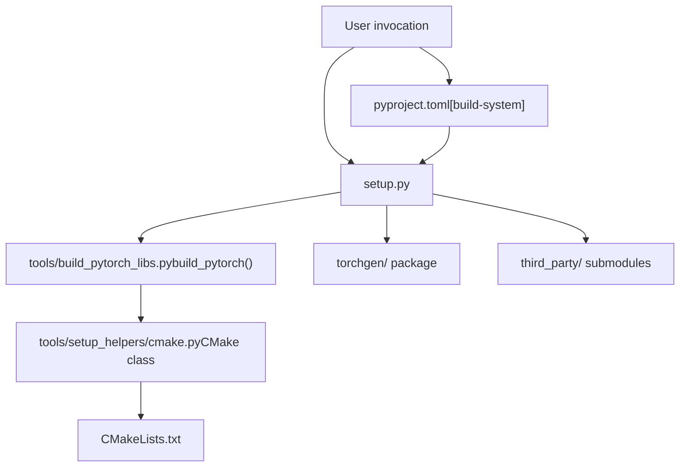
**Sources**: [pyproject.toml3-17](https://github.com/pytorch/pytorch/blob/915982a4/pyproject.toml#L3-L17) [setup.py1-50](https://github.com/pytorch/pytorch/blob/915982a4/setup.py#L1-L50) [setup.py519-586](https://github.com/pytorch/pytorch/blob/915982a4/setup.py#L519-L586)

The [pyproject.toml3-17](https://github.com/pytorch/pytorch/blob/915982a4/pyproject.toml#L3-L17) file defines the PEP 517 build system requirements:

```
[build-system]requires = [    "setuptools>=70.1.0,<82",    "cmake>=3.27",    "ninja",    "numpy",    "packaging",    "pyyaml",    "requests",    ...]build-backend = "setuptools.build_meta"
```
The [setup.py](https://github.com/pytorch/pytorch/blob/915982a4/setup.py) script serves as the main orchestrator, performing:

-   Environment variable parsing and validation
-   Submodule initialization via `check_submodules()` [setup.py541-586](https://github.com/pytorch/pytorch/blob/915982a4/setup.py#L541-L586)
-   File mirroring for the `torchgen` package via `mirror_files_into_torchgen()` [setup.py590-631](https://github.com/pytorch/pytorch/blob/915982a4/setup.py#L590-L631)
-   Invoking CMake through `build_pytorch()` from [tools/build\_pytorch\_libs.py](https://github.com/pytorch/pytorch/blob/915982a4/tools/build_pytorch_libs.py)

**Sources**: [pyproject.toml1-100](https://github.com/pytorch/pytorch/blob/915982a4/pyproject.toml#L1-L100) [setup.py245-631](https://github.com/pytorch/pytorch/blob/915982a4/setup.py#L245-L631) [tools/build\_pytorch\_libs.py1-50](https://github.com/pytorch/pytorch/blob/915982a4/tools/build_pytorch_libs.py#L1-L50)

### CMake Build Configuration

The C++ build is managed by CMake with a top-level [CMakeLists.txt](https://github.com/pytorch/pytorch/blob/915982a4/CMakeLists.txt) that includes backend-specific configurations:

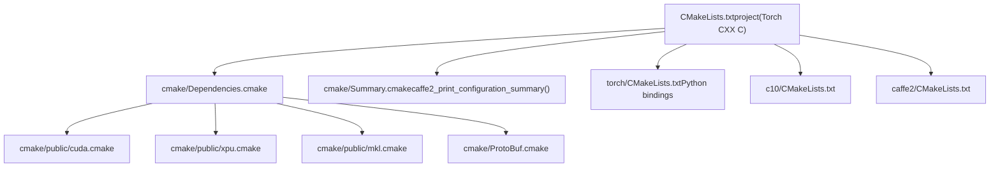
**Sources**: [CMakeLists.txt1-100](https://github.com/pytorch/pytorch/blob/915982a4/CMakeLists.txt#L1-L100) [cmake/Dependencies.cmake1-100](https://github.com/pytorch/pytorch/blob/915982a4/cmake/Dependencies.cmake#L1-L100) [cmake/Summary.cmake1-50](https://github.com/pytorch/pytorch/blob/915982a4/cmake/Summary.cmake#L1-L50)

The [CMakeLists.txt1-55](https://github.com/pytorch/pytorch/blob/915982a4/CMakeLists.txt#L1-L55) file establishes core build requirements:

-   C++17 standard requirement [CMakeLists.txt47-54](https://github.com/pytorch/pytorch/blob/915982a4/CMakeLists.txt#L47-L54)
-   Policy settings for compiler detection [CMakeLists.txt6-20](https://github.com/pytorch/pytorch/blob/915982a4/CMakeLists.txt#L6-L20)
-   Minimum GCC version check (9.3+) [CMakeLists.txt60-65](https://github.com/pytorch/pytorch/blob/915982a4/CMakeLists.txt#L60-L65)
-   Architecture detection (CPU\_INTEL, CPU\_AARCH64, CPU\_POWER, CPU\_RISCV) [CMakeLists.txt171-184](https://github.com/pytorch/pytorch/blob/915982a4/CMakeLists.txt#L171-L184)

**Sources**: [CMakeLists.txt1-400](https://github.com/pytorch/pytorch/blob/915982a4/CMakeLists.txt#L1-L400)

### Build Options and Environment Variables

PyTorch supports extensive build customization through CMake options and environment variables:

| Category | Variable | Default | Description |
| --- | --- | --- | --- |
| **Core** | `DEBUG` | OFF | Build with -O0 and -g debug symbols |
| **Core** | `MAX_JOBS` | Auto | Maximum parallel compilation jobs |
| **Core** | `BUILD_PYTHON` | ON | Build Python bindings |
| **CUDA** | `USE_CUDA` | ON | Enable CUDA support |
| **CUDA** | `USE_CUDNN` | ON (if USE\_CUDA) | Enable cuDNN |
| **CUDA** | `TORCH_CUDA_ARCH_LIST` | Auto | CUDA architectures to target |
| **BLAS** | `BLAS` | MKL | BLAS library (MKL/OpenBLAS/Eigen/etc) |
| **Distributed** | `USE_DISTRIBUTED` | ON | Enable c10d and distributed training |
| **Distributed** | `USE_NCCL` | ON (if USE\_CUDA) | Enable NCCL backend |
| **Mobile** | `BUILD_LITE_INTERPRETER` | OFF | Build mobile lite interpreter |

**Sources**: [setup.py1-243](https://github.com/pytorch/pytorch/blob/915982a4/setup.py#L1-L243) [CMakeLists.txt201-400](https://github.com/pytorch/pytorch/blob/915982a4/CMakeLists.txt#L201-L400)

The [setup.py329-367](https://github.com/pytorch/pytorch/blob/915982a4/setup.py#L329-L367) function `str2bool()` standardizes boolean environment variable parsing, accepting values like "1", "true", "yes", "on" for true and "0", "false", "no", "off" for false.

**Sources**: [setup.py329-367](https://github.com/pytorch/pytorch/blob/915982a4/setup.py#L329-L367) [CMakeLists.txt240-400](https://github.com/pytorch/pytorch/blob/915982a4/CMakeLists.txt#L240-L400)

---

## Code Generation System (torchgen)

PyTorch's code generation system, located in the `torchgen/` directory, generates C++ operators, autograd functions, Python bindings, and type stubs from YAML specifications. This ensures consistency across operators and reduces manual code maintenance.

### Native Functions YAML Specification

The [aten/src/ATen/native/native\_functions.yaml](https://github.com/pytorch/pytorch/blob/915982a4/aten/src/ATen/native/native_functions.yaml) file is the canonical source of truth for all PyTorch operators:

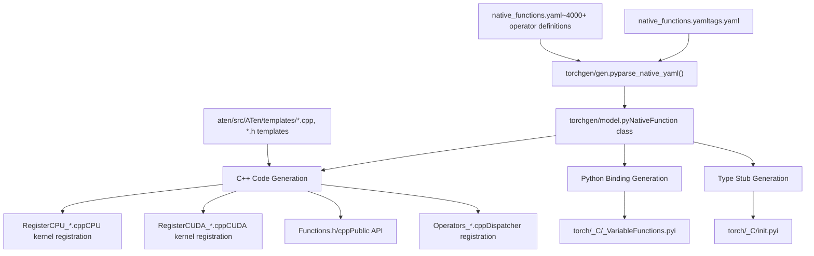
**Sources**: [aten/src/ATen/native/native\_functions.yaml1-100](https://github.com/pytorch/pytorch/blob/915982a4/aten/src/ATen/native/native_functions.yaml#L1-L100) (referenced), [CMakeLists.txt](https://github.com/pytorch/pytorch/blob/915982a4/CMakeLists.txt) (generation rules)

Each operator in `native_functions.yaml` follows this structure:

```
- func: add.Tensor(Tensor self, Tensor other, *, Scalar alpha=1) -> Tensor  variants: function, method  dispatch:    CPU: add_cpu    CUDA: add_cuda  tags: pointwise
```
The YAML schema is parsed by [torchgen/gen.py](https://github.com/pytorch/pytorch/blob/915982a4/torchgen/gen.py) into `NativeFunction` objects from [torchgen/model.py](https://github.com/pytorch/pytorch/blob/915982a4/torchgen/model.py) which contain:

-   Function signature and overload information
-   Dispatch keys mapping to kernel implementations
-   Backend availability (CPU, CUDA, Meta, etc.)
-   Tags for categorization (pointwise, core, etc.)

**Sources**: [torchgen/model.py](https://github.com/pytorch/pytorch/blob/915982a4/torchgen/model.py) (referenced), [torchgen/gen.py](https://github.com/pytorch/pytorch/blob/915982a4/torchgen/gen.py) (referenced)

### Code Generation Pipeline

The code generation pipeline is invoked during the build process and produces multiple categories of files:

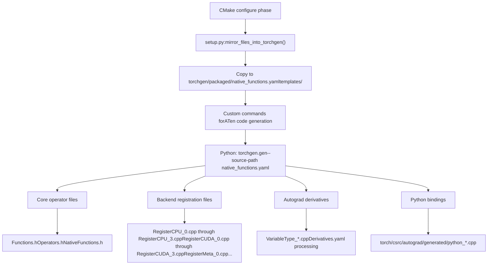
**Sources**: [setup.py590-631](https://github.com/pytorch/pytorch/blob/915982a4/setup.py#L590-L631) [CMakeLists.txt](https://github.com/pytorch/pytorch/blob/915982a4/CMakeLists.txt) (generation rules)

The [setup.py590-631](https://github.com/pytorch/pytorch/blob/915982a4/setup.py#L590-L631) function `mirror_files_into_torchgen()` copies essential files into the `torchgen/packaged/` directory:

-   `native_functions.yaml` → `torchgen/packaged/ATen/native/native_functions.yaml`
-   `tags.yaml` → `torchgen/packaged/ATen/native/tags.yaml`
-   `aten/src/ATen/templates/` → `torchgen/packaged/ATen/templates/`
-   `tools/autograd/` → `torchgen/packaged/autograd/`

This mirroring allows `torchgen` to be packaged independently for use in downstream projects.

**Sources**: [setup.py590-631](https://github.com/pytorch/pytorch/blob/915982a4/setup.py#L590-L631)

### Generated Files by Category

The code generation system produces several categories of files:

#### Operator Registration Files

Split across multiple files to parallelize compilation:

| File Pattern | Purpose | Count |
| --- | --- | --- |
| `RegisterCPU_*.cpp` | CPU kernel registration | 4 files (0-3) |
| `RegisterCUDA_*.cpp` | CUDA kernel registration | 4 files (0-3) |
| `RegisterMeta_*.cpp` | Meta tensor shape inference | 1 file |
| `RegisterBackendSelect.cpp` | Backend selection logic | 1 file |
| `RegisterCompositeImplicitAutograd_*.cpp` | Composite operators | Multiple |
| `RegisterSchema.cpp` | Operator schema registration | 1 file |

**Sources**: [CMakeLists.txt](https://github.com/pytorch/pytorch/blob/915982a4/CMakeLists.txt) (generation rules), Build output

#### Public API Headers

| File | Purpose |
| --- | --- |
| `Functions.h` | Functional API (e.g., `torch::add()`) |
| `Operators.h` | Operator API (e.g., `at::add()`) |
| `NativeFunctions.h` | Native function declarations |
| `RedispatchFunctions.h` | Redispatch mechanism |
| `CPUFunctions.h` | CPU-specific functions |

**Sources**: Build output (generated files)

#### Autograd Files

| File Pattern | Purpose |
| --- | --- |
| `VariableType_*.cpp` | Autograd Variable type implementations |
| `TraceType_*.cpp` | JIT tracing support |
| `Functions.cpp` | Autograd function implementations |
| `python_*.cpp` | Python autograd bindings |

**Sources**: [torch/csrc/autograd/generated/](https://github.com/pytorch/pytorch/blob/915982a4/torch/csrc/autograd/generated/) (output directory)

### Template-Based Code Generation

The code generation uses Jinja2 templates located in [aten/src/ATen/templates/](https://github.com/pytorch/pytorch/blob/915982a4/aten/src/ATen/templates/):

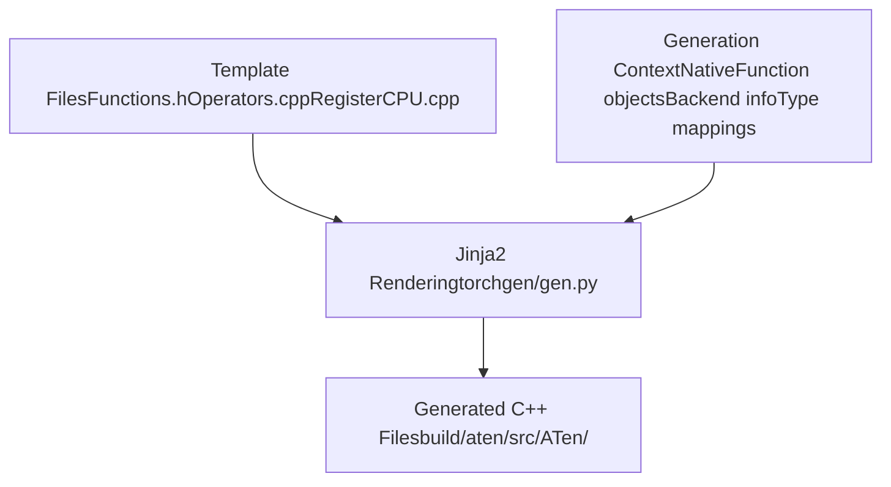
**Sources**: [aten/src/ATen/templates/](https://github.com/pytorch/pytorch/blob/915982a4/aten/src/ATen/templates/) (directory), [torchgen/gen.py](https://github.com/pytorch/pytorch/blob/915982a4/torchgen/gen.py) (referenced)

Templates use Jinja2 syntax to iterate over operators and generate repetitive code:

```
// Template excerpt from Functions.h{{function.return_type}} {{function.name}}({{function.parameters}});
```
The template engine receives context including:

-   Parsed `NativeFunction` objects
-   Backend dispatch information
-   Type conversion mappings
-   Kernel availability per backend

**Sources**: [aten/src/ATen/templates/](https://github.com/pytorch/pytorch/blob/915982a4/aten/src/ATen/templates/) (directory)

---

## Build Process Flow

The complete build process follows this sequence:

### Build Invocation to Compiled Artifacts

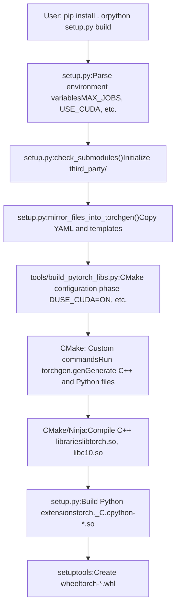
**Sources**: [setup.py1-900](https://github.com/pytorch/pytorch/blob/915982a4/setup.py#L1-L900) [tools/build\_pytorch\_libs.py1-100](https://github.com/pytorch/pytorch/blob/915982a4/tools/build_pytorch_libs.py#L1-L100)

### Submodule Management

PyTorch depends on numerous third-party libraries managed as Git submodules:

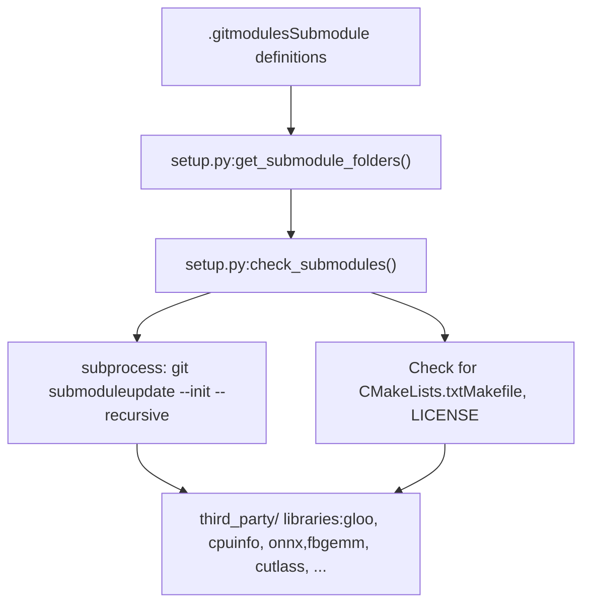
**Sources**: [setup.py519-586](https://github.com/pytorch/pytorch/blob/915982a4/setup.py#L519-L586)

The [setup.py541-586](https://github.com/pytorch/pytorch/blob/915982a4/setup.py#L541-L586) function `check_submodules()`:

1.  Calls `get_submodule_folders()` [setup.py519-538](https://github.com/pytorch/pytorch/blob/915982a4/setup.py#L519-L538) to enumerate submodules from `.gitmodules`
2.  Checks if submodule directories exist and contain expected files
3.  If submodules are missing, runs `git submodule update --init --recursive`
4.  Validates essential files exist (CMakeLists.txt, LICENSE, etc.)

Key submodules include:

-   `third_party/gloo` - Collective communication library
-   `third_party/cpuinfo` - CPU feature detection
-   `third_party/onnx` - ONNX format support
-   `third_party/fbgemm` - Quantized GEMM operations
-   `third_party/cutlass` - NVIDIA CUTLASS CUDA templates

**Sources**: [setup.py519-586](https://github.com/pytorch/pytorch/blob/915982a4/setup.py#L519-L586)

### Dependency Resolution

The [cmake/Dependencies.cmake](https://github.com/pytorch/pytorch/blob/915982a4/cmake/Dependencies.cmake) file manages external dependencies:

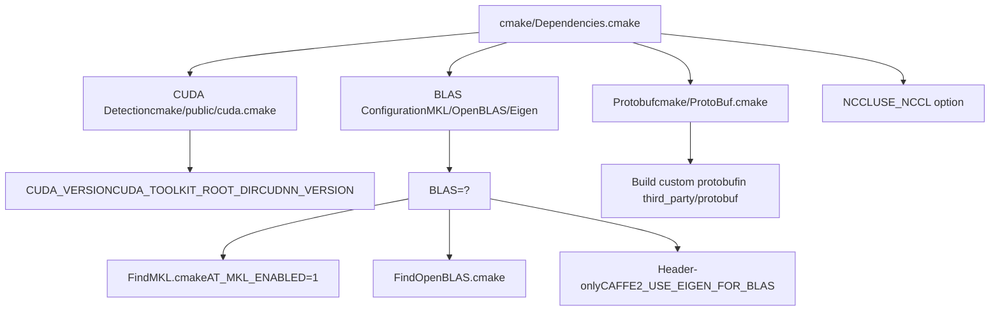
**Sources**: [cmake/Dependencies.cmake1-500](https://github.com/pytorch/pytorch/blob/915982a4/cmake/Dependencies.cmake#L1-L500)

The dependency resolution follows this priority:

1.  **CUDA/ROCm**: Detected via `FindCUDA` or `FindHIP`, sets `CAFFE2_USE_CUDA` [cmake/Dependencies.cmake36-89](https://github.com/pytorch/pytorch/blob/915982a4/cmake/Dependencies.cmake#L36-L89)
2.  **BLAS**: Priority order MKL → OpenBLAS → ATLAS → Eigen [cmake/Dependencies.cmake159-267](https://github.com/pytorch/pytorch/blob/915982a4/cmake/Dependencies.cmake#L159-L267)
3.  **NCCL/RCCL**: Conditional on `USE_DISTRIBUTED` and CUDA/ROCm availability [cmake/Dependencies.cmake278-286](https://github.com/pytorch/pytorch/blob/915982a4/cmake/Dependencies.cmake#L278-L286)
4.  **Protobuf**: Either system-provided or built from `third_party/protobuf` [cmake/Dependencies.cmake104-109](https://github.com/pytorch/pytorch/blob/915982a4/cmake/Dependencies.cmake#L104-L109)

**Sources**: [cmake/Dependencies.cmake1-600](https://github.com/pytorch/pytorch/blob/915982a4/cmake/Dependencies.cmake#L1-L600)

---

## Advanced Build Features

### Conditional Compilation and Backend Selection

PyTorch supports selective compilation of backends and operators:

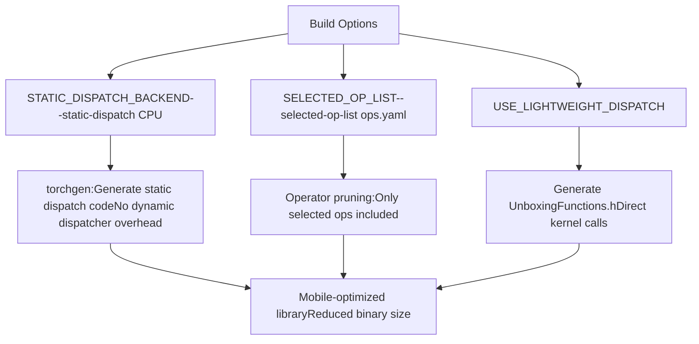
**Sources**: [CMakeLists.txt541-559](https://github.com/pytorch/pytorch/blob/915982a4/CMakeLists.txt#L541-L559)

These options are primarily used for mobile builds [CMakeLists.txt210-230](https://github.com/pytorch/pytorch/blob/915982a4/CMakeLists.txt#L210-L230):

-   `BUILD_LITE_INTERPRETER`: Enable mobile lite interpreter
-   `SELECTED_OP_LIST`: Path to YAML file listing operators to include
-   `STATIC_DISPATCH_BACKEND`: Generate static dispatch for specific backend (e.g., "CPU")
-   `USE_LIGHTWEIGHT_DISPATCH`: Enable unboxed kernel calling convention

**Sources**: [CMakeLists.txt210-559](https://github.com/pytorch/pytorch/blob/915982a4/CMakeLists.txt#L210-L559)

### Python Type Stub Generation

PyTorch generates `.pyi` type stub files for IDE support and type checking:

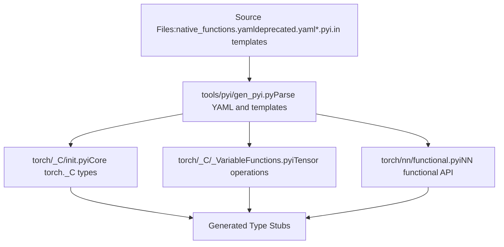
**Sources**: [torch/CMakeLists.txt236-263](https://github.com/pytorch/pytorch/blob/915982a4/torch/CMakeLists.txt#L236-L263)

The [torch/CMakeLists.txt239-263](https://github.com/pytorch/pytorch/blob/915982a4/torch/CMakeLists.txt#L239-L263) custom command generates type stubs:

```
add_custom_command(    OUTPUT    "${TORCH_SRC_DIR}/_C/__init__.pyi"    "${TORCH_SRC_DIR}/_C/_VariableFunctions.pyi"    "${TORCH_SRC_DIR}/nn/functional.pyi"    COMMAND    "${Python_EXECUTABLE}" -mtools.pyi.gen_pyi      --native-functions-path "aten/src/ATen/native/native_functions.yaml"      --tags-path "aten/src/ATen/native/tags.yaml"      --deprecated-functions-path "tools/autograd/deprecated.yaml"    ...)
```
The generation process:

1.  Parses `native_functions.yaml` for operator signatures
2.  Reads `.pyi.in` template files with placeholders
3.  Generates type annotations based on C++ types
4.  Outputs complete `.pyi` files for IDE consumption

**Sources**: [torch/CMakeLists.txt229-276](https://github.com/pytorch/pytorch/blob/915982a4/torch/CMakeLists.txt#L229-L276) [tools/pyi/gen\_pyi.py](https://github.com/pytorch/pytorch/blob/915982a4/tools/pyi/gen_pyi.py) (referenced)

### Linting and Code Quality

The build system integrates code quality checks via [.lintrunner.toml](https://github.com/pytorch/pytorch/blob/915982a4/.lintrunner.toml):

| Linter | Code | Files | Purpose |
| --- | --- | --- | --- |
| Flake8 | `FLAKE8` | `**/*.py` | Python style checking |
| clang-format | `CLANGFORMAT` | `**/*.cpp, **/*.h` | C++ formatting |
| clang-tidy | `CLANGTIDY` | `aten/src/**/*.cpp` | C++ static analysis |
| cmake-lint | `CMAKE` | `**/CMakeLists.txt` | CMake style |
| Native Functions | `NATIVEFUNCTIONS` | `native_functions.yaml` | YAML validation |

**Sources**: [.lintrunner.toml1-400](https://github.com/pytorch/pytorch/blob/915982a4/.lintrunner.toml#L1-L400)

The [.lintrunner.toml1-50](https://github.com/pytorch/pytorch/blob/915982a4/.lintrunner.toml#L1-L50) configuration defines multiple linters:

-   Python linters: FLAKE8, TYPEIGNORE, NOQA
-   C++ linters: CLANGFORMAT, CLANGTIDY
-   Build file linters: CMAKE, NATIVEFUNCTIONS
-   Specialized linters: PYBIND11\_INCLUDE, CUBINCLUDE

**Sources**: [.lintrunner.toml1-500](https://github.com/pytorch/pytorch/blob/915982a4/.lintrunner.toml#L1-L500) [.flake81-53](https://github.com/pytorch/pytorch/blob/915982a4/.flake8#L1-L53)

### Specialized Kernel Template Integration

For advanced GPU kernels, the build system copies external templates into the source tree:

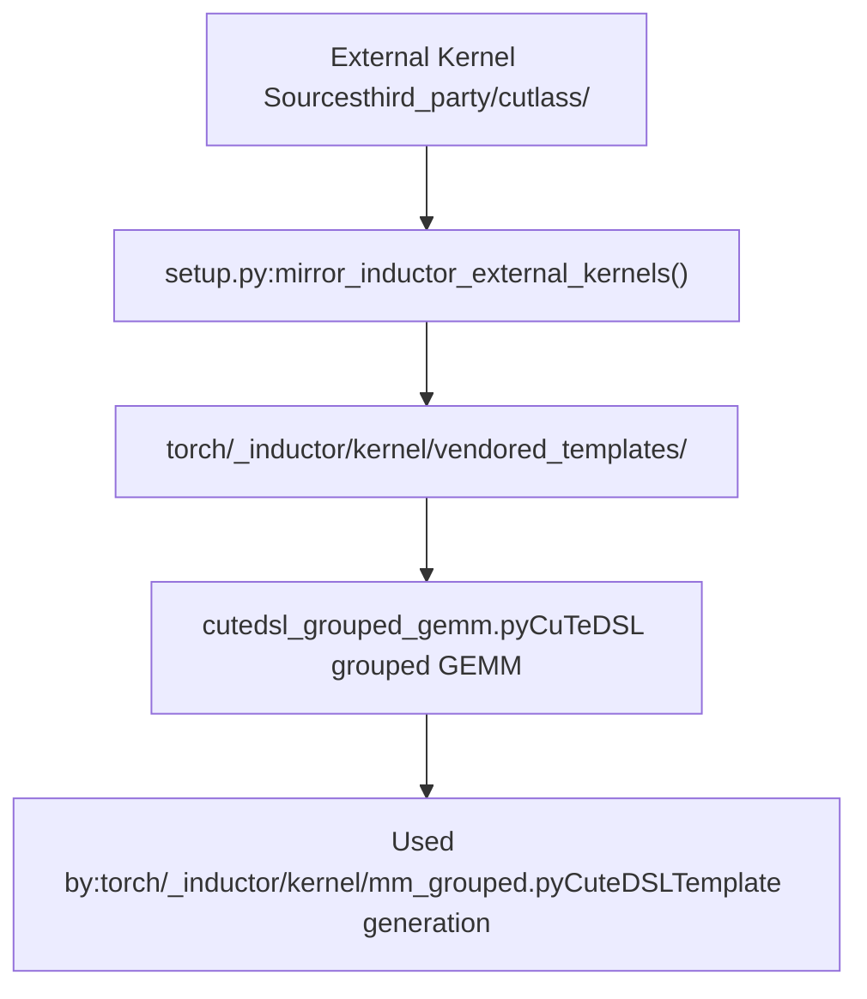
**Sources**: [setup.py633-672](https://github.com/pytorch/pytorch/blob/915982a4/setup.py#L633-L672) [torch/\_inductor/kernel/mm\_grouped.py1-50](https://github.com/pytorch/pytorch/blob/915982a4/torch/_inductor/kernel/mm_grouped.py#L1-L50)

The [setup.py633-672](https://github.com/pytorch/pytorch/blob/915982a4/setup.py#L633-L672) function `mirror_inductor_external_kernels()` copies specialized kernels:

```
paths = [    (        CWD / "torch/_inductor/kernel/vendored_templates/cutedsl_grouped_gemm.py",        CWD / "third_party/cutlass/examples/python/CuTeDSL/blackwell/grouped_gemm.py",        True,  # allow_missing_if_cuda_is_disabled    ),]
```
This allows Inductor to use cutting-edge CUDA kernel implementations without directly depending on external repositories during runtime.

**Sources**: [setup.py633-672](https://github.com/pytorch/pytorch/blob/915982a4/setup.py#L633-L672) [torch/\_inductor/kernel/mm\_grouped.py139-143](https://github.com/pytorch/pytorch/blob/915982a4/torch/_inductor/kernel/mm_grouped.py#L139-L143)

---

## Build Configuration Reference

### Key CMake Variables

| Variable | Type | Default | Description |
| --- | --- | --- | --- |
| `CMAKE_BUILD_TYPE` | STRING | Release | Build type (Debug/Release/RelWithDebInfo) |
| `CMAKE_INSTALL_PREFIX` | PATH | /usr/local | Installation directory |
| `BUILD_SHARED_LIBS` | BOOL | ON | Build shared libraries |
| `BUILD_PYTHON` | BOOL | ON | Build Python bindings |
| `BUILD_TEST` | BOOL | ON | Build C++ test binaries |
| `USE_CUDA` | BOOL | ON | Enable CUDA support |
| `USE_CUDNN` | BOOL | ON | Enable cuDNN |
| `USE_MKLDNN` | BOOL | ON (x86) | Enable MKLDNN/oneDNN |
| `USE_DISTRIBUTED` | BOOL | ON | Enable distributed training |
| `USE_NCCL` | BOOL | ON | Enable NCCL backend |

**Sources**: [CMakeLists.txt201-400](https://github.com/pytorch/pytorch/blob/915982a4/CMakeLists.txt#L201-L400)

### Environment Variable to CMake Option Mapping

The [setup.py](https://github.com/pytorch/pytorch/blob/915982a4/setup.py) script translates environment variables to CMake options:

| Environment Variable | CMake Option | Notes |
| --- | --- | --- |
| `DEBUG=1` | `-DCMAKE_BUILD_TYPE=Debug` | Adds -g and -O0 flags |
| `REL_WITH_DEB_INFO=1` | `-DCMAKE_BUILD_TYPE=RelWithDebInfo` | Optimizations + debug symbols |
| `USE_CUDA=0` | `-DUSE_CUDA=OFF` | Disables CUDA |
| `MAX_JOBS=8` | Sets Ninja parallel jobs | Controls compilation parallelism |
| `BLAS=OpenBLAS` | `-DBLAS=OpenBLAS` | Selects BLAS implementation |
| `TORCH_CUDA_ARCH_LIST=7.0;8.0` | `-DTORCH_CUDA_ARCH_LIST=7.0;8.0` | CUDA architectures |

**Sources**: [setup.py1-400](https://github.com/pytorch/pytorch/blob/915982a4/setup.py#L1-L400) [tools/setup\_helpers/cmake.py](https://github.com/pytorch/pytorch/blob/915982a4/tools/setup_helpers/cmake.py) (referenced)

### Generated File Locations

After a successful build, generated files are located:

| Category | Location | Pattern |
| --- | --- | --- |
| ATen operators | `build/aten/src/ATen/` | `Register*.cpp`, `Functions.h` |
| Autograd | `torch/csrc/autograd/generated/` | `VariableType_*.cpp` |
| Python bindings | `torch/csrc/autograd/generated/` | `python_*.cpp` |
| Type stubs | `torch/_C/` | `*.pyi` |
| Libraries | `torch/lib/` | `libtorch.so`, `libc10.so` |
| Python extensions | `torch/` | `_C.cpython-*.so` |

**Sources**: [CMakeLists.txt](https://github.com/pytorch/pytorch/blob/915982a4/CMakeLists.txt) [torch/CMakeLists.txt](https://github.com/pytorch/pytorch/blob/915982a4/torch/CMakeLists.txt) Build output

---

**Summary**: PyTorch's build system combines Python packaging (PEP 517) with CMake-based C++ compilation and extensive code generation from YAML specifications. The `torchgen` package generates thousands of C++ files from `native_functions.yaml`, ensuring consistency across 4000+ operators. Build configuration is controlled through environment variables and CMake options, supporting diverse backends (CUDA, ROCm, MPS, XPU) and use cases (server, mobile, embedded).

**Sources**: [pyproject.toml](https://github.com/pytorch/pytorch/blob/915982a4/pyproject.toml) [setup.py](https://github.com/pytorch/pytorch/blob/915982a4/setup.py) [CMakeLists.txt](https://github.com/pytorch/pytorch/blob/915982a4/CMakeLists.txt) [cmake/Dependencies.cmake](https://github.com/pytorch/pytorch/blob/915982a4/cmake/Dependencies.cmake) [torchgen/](https://github.com/pytorch/pytorch/blob/915982a4/torchgen/) (directory)
