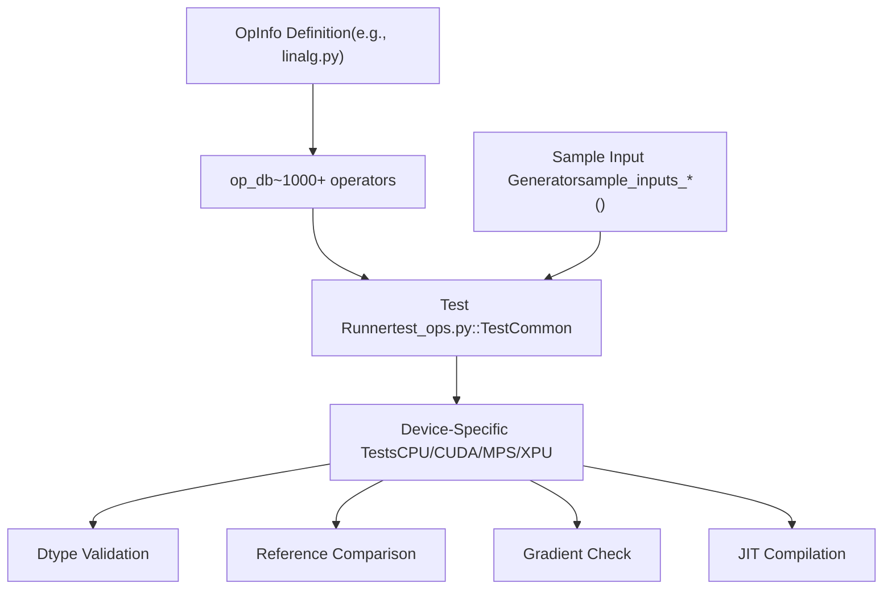
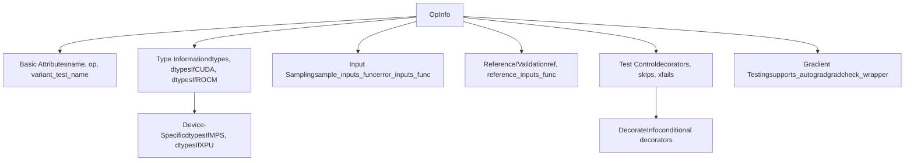
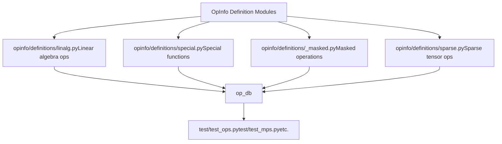
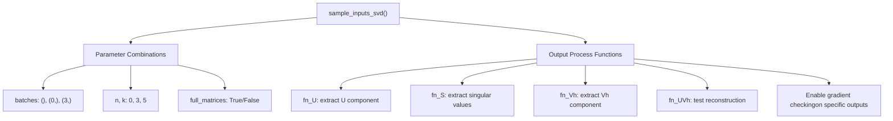
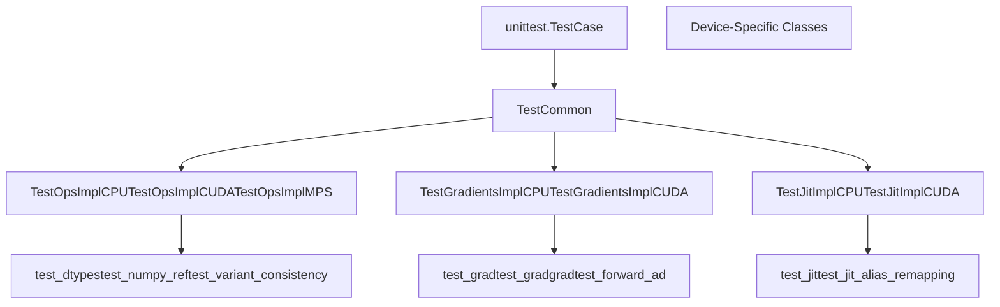
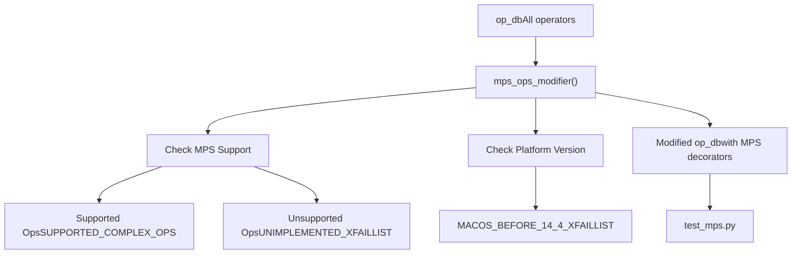
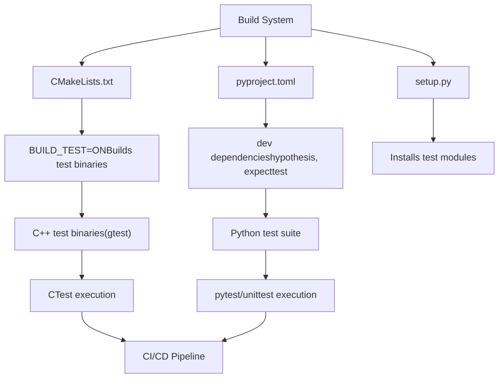
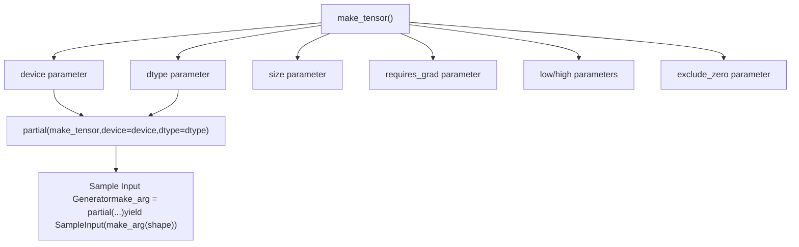
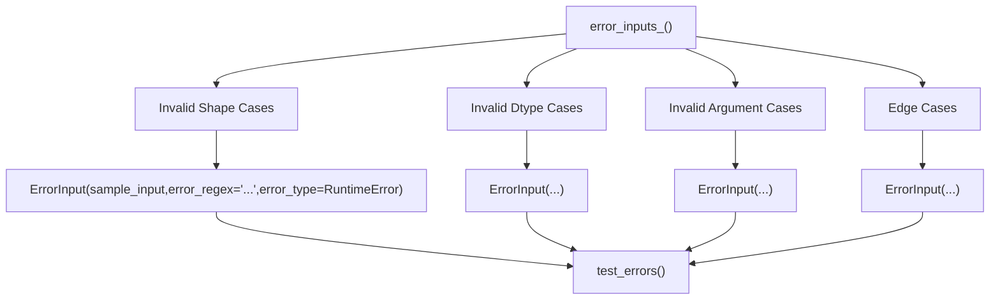
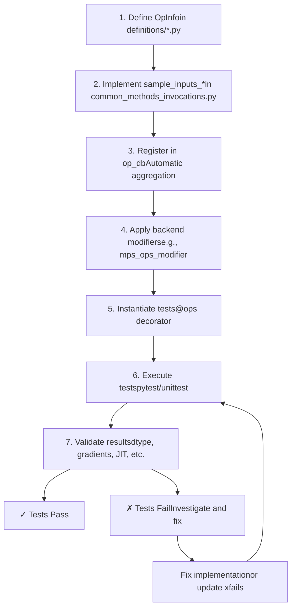

# Testing Infrastructure and OpInfo

Relevant source files

-   [.ci/docker/common/install\_cpython.sh](https://github.com/pytorch/pytorch/blob/915982a4/.ci/docker/common/install_cpython.sh)
-   [.ci/docker/manywheel/build\_scripts/ssl-check.py](https://github.com/pytorch/pytorch/blob/915982a4/.ci/docker/manywheel/build_scripts/ssl-check.py)
-   [.ci/pytorch/numba-cuda-13.patch](https://github.com/pytorch/pytorch/blob/915982a4/.ci/pytorch/numba-cuda-13.patch)
-   [.ci/pytorch/test.sh](https://github.com/pytorch/pytorch/blob/915982a4/.ci/pytorch/test.sh)
-   [.github/actions/linux-test/action.yml](https://github.com/pytorch/pytorch/blob/915982a4/.github/actions/linux-test/action.yml)
-   [.github/actions/test-pytorch-binary/action.yml](https://github.com/pytorch/pytorch/blob/915982a4/.github/actions/test-pytorch-binary/action.yml)
-   [.github/workflows/\_linux-build.yml](https://github.com/pytorch/pytorch/blob/915982a4/.github/workflows/_linux-build.yml)
-   [.github/workflows/\_linux-test.yml](https://github.com/pytorch/pytorch/blob/915982a4/.github/workflows/_linux-test.yml)
-   [.github/workflows/\_xpu-test.yml](https://github.com/pytorch/pytorch/blob/915982a4/.github/workflows/_xpu-test.yml)
-   [aten/src/ATen/native/tags.yaml](https://github.com/pytorch/pytorch/blob/915982a4/aten/src/ATen/native/tags.yaml)
-   [docs/source/distributed.md](https://github.com/pytorch/pytorch/blob/915982a4/docs/source/distributed.md)
-   [test/custom\_operator/test\_out\_variant.py](https://github.com/pytorch/pytorch/blob/915982a4/test/custom_operator/test_out_variant.py)
-   [test/distributed/test\_c10d\_nccl.py](https://github.com/pytorch/pytorch/blob/915982a4/test/distributed/test_c10d_nccl.py)
-   [test/jit/test\_autodiff\_subgraph\_slicing.py](https://github.com/pytorch/pytorch/blob/915982a4/test/jit/test_autodiff_subgraph_slicing.py)
-   [test/run\_test.py](https://github.com/pytorch/pytorch/blob/915982a4/test/run_test.py)
-   [test/test\_bundled\_inputs.py](https://github.com/pytorch/pytorch/blob/915982a4/test/test_bundled_inputs.py)
-   [test/test\_complex.py](https://github.com/pytorch/pytorch/blob/915982a4/test/test_complex.py)
-   [test/test\_jit.py](https://github.com/pytorch/pytorch/blob/915982a4/test/test_jit.py)
-   [test/test\_jit\_autocast.py](https://github.com/pytorch/pytorch/blob/915982a4/test/test_jit_autocast.py)
-   [test/test\_jit\_fuser.py](https://github.com/pytorch/pytorch/blob/915982a4/test/test_jit_fuser.py)
-   [test/test\_jit\_fuser\_legacy.py](https://github.com/pytorch/pytorch/blob/915982a4/test/test_jit_fuser_legacy.py)
-   [test/test\_jit\_fuser\_te.py](https://github.com/pytorch/pytorch/blob/915982a4/test/test_jit_fuser_te.py)
-   [test/test\_jit\_legacy.py](https://github.com/pytorch/pytorch/blob/915982a4/test/test_jit_legacy.py)
-   [test/test\_ops.py](https://github.com/pytorch/pytorch/blob/915982a4/test/test_ops.py)
-   [test/test\_type\_hints.py](https://github.com/pytorch/pytorch/blob/915982a4/test/test_type_hints.py)
-   [test/test\_type\_info.py](https://github.com/pytorch/pytorch/blob/915982a4/test/test_type_info.py)
-   [tools/stats/monitor.py](https://github.com/pytorch/pytorch/blob/915982a4/tools/stats/monitor.py)
-   [tools/stats/utilization\_stats\_lib.py](https://github.com/pytorch/pytorch/blob/915982a4/tools/stats/utilization_stats_lib.py)
-   [torch/\_library/\_out\_variant.py](https://github.com/pytorch/pytorch/blob/915982a4/torch/_library/_out_variant.py)
-   [torch/csrc/distributed/c10d/Backend.hpp](https://github.com/pytorch/pytorch/blob/915982a4/torch/csrc/distributed/c10d/Backend.hpp)
-   [torch/csrc/distributed/c10d/NCCLUtils.cpp](https://github.com/pytorch/pytorch/blob/915982a4/torch/csrc/distributed/c10d/NCCLUtils.cpp)
-   [torch/csrc/distributed/c10d/NCCLUtils.hpp](https://github.com/pytorch/pytorch/blob/915982a4/torch/csrc/distributed/c10d/NCCLUtils.hpp)
-   [torch/csrc/distributed/c10d/ProcessGroupNCCL.cpp](https://github.com/pytorch/pytorch/blob/915982a4/torch/csrc/distributed/c10d/ProcessGroupNCCL.cpp)
-   [torch/csrc/distributed/c10d/ProcessGroupNCCL.hpp](https://github.com/pytorch/pytorch/blob/915982a4/torch/csrc/distributed/c10d/ProcessGroupNCCL.hpp)
-   [torch/distributed/distributed\_c10d.py](https://github.com/pytorch/pytorch/blob/915982a4/torch/distributed/distributed_c10d.py)
-   [torch/testing/\_internal/common\_distributed.py](https://github.com/pytorch/pytorch/blob/915982a4/torch/testing/_internal/common_distributed.py)
-   [torch/testing/\_internal/common\_fsdp.py](https://github.com/pytorch/pytorch/blob/915982a4/torch/testing/_internal/common_fsdp.py)
-   [torch/testing/\_internal/common\_nn.py](https://github.com/pytorch/pytorch/blob/915982a4/torch/testing/_internal/common_nn.py)
-   [torch/testing/\_internal/common\_utils.py](https://github.com/pytorch/pytorch/blob/915982a4/torch/testing/_internal/common_utils.py)
-   [torch/testing/\_internal/distributed/distributed\_test.py](https://github.com/pytorch/pytorch/blob/915982a4/torch/testing/_internal/distributed/distributed_test.py)
-   [torch/testing/\_internal/opinfo/definitions/fft.py](https://github.com/pytorch/pytorch/blob/915982a4/torch/testing/_internal/opinfo/definitions/fft.py)

## Purpose and Scope

This document describes PyTorch's operator testing infrastructure, centered around the **OpInfo** abstraction. The OpInfo system provides a systematic way to test ~1000+ PyTorch operators across multiple devices (CPU, CUDA, MPS, XPU) and data types, with automatic validation of correctness, gradients, JIT compilation, and other properties.

**Related Pages:**

-   For information about code generation from `native_functions.yaml`, see [5.1](/pytorch/pytorch/5.1-build-system-and-code-generation)
-   For information about build system and CMake, see [5.1](/pytorch/pytorch/5.1-build-system-and-code-generation)

---

## Overview: Testing Architecture

PyTorch's testing infrastructure is organized around three core concepts:

1.  **OpInfo Database** (`op_db`) - A centralized registry of operator metadata
2.  **Sample Input Generators** - Functions that produce test cases for each operator
3.  **Test Runners** - Device-specific test classes that execute validation

The system enables comprehensive cross-device testing with minimal per-operator boilerplate.

### High-Level Testing Flow


**Sources:** [torch/testing/\_internal/common\_methods\_invocations.py1-160](https://github.com/pytorch/pytorch/blob/915982a4/torch/testing/_internal/common_methods_invocations.py#L1-L160) [test/test\_ops.py1-80](https://github.com/pytorch/pytorch/blob/915982a4/test/test_ops.py#L1-L80)

---

## OpInfo: The Core Abstraction

The `OpInfo` class is the central data structure that describes an operator's testing requirements. Each OpInfo instance contains metadata about:

-   The operator callable
-   Supported dtypes and devices
-   Sample input generation strategy
-   Reference implementations for validation
-   Expected failures and decorators

### OpInfo Class Structure


**Sources:** [torch/testing/\_internal/opinfo/core.py](https://github.com/pytorch/pytorch/blob/915982a4/torch/testing/_internal/opinfo/core.py) [torch/testing/\_internal/common\_methods\_invocations.py59-109](https://github.com/pytorch/pytorch/blob/915982a4/torch/testing/_internal/common_methods_invocations.py#L59-L109)

### Specialized OpInfo Types

PyTorch provides specialized OpInfo subclasses for different operator categories:

| OpInfo Type | Purpose | Key Features |
| --- | --- | --- |
| `OpInfo` | General operators | Base class with full flexibility |
| `UnaryUfuncInfo` | Element-wise unary ops | Automatic reference generation, domain checking |
| `BinaryUfuncInfo` | Element-wise binary ops | Broadcasting tests, type promotion |
| `ReductionOpInfo` | Reduction operations | Dimension handling, keepdim parameter |
| `SpectralFuncInfo` | FFT and spectral ops | Complex number support, normalization modes |
| `ShapeFuncInfo` | Shape manipulation | Dynamic shape testing |
| `ForeachFuncInfo` | Foreach operations | List-of-tensors input handling |

**Sources:** [torch/testing/\_internal/common\_methods\_invocations.py88-101](https://github.com/pytorch/pytorch/blob/915982a4/torch/testing/_internal/common_methods_invocations.py#L88-L101)

---

## The OpInfo Database (op\_db)

The `op_db` is a tuple of all OpInfo instances, serving as the single source of truth for operator testing. It is constructed by importing OpInfo definitions from multiple specialized modules.

### OpInfo Registration Pattern


### Key Database Files

```
# torch/testing/_internal/common_methods_invocations.py from torch.testing._internal.opinfo.core import (    OpInfo,    SampleInput,    ErrorInput,    # ... other imports) # Import specialized OpInfo definitionsfrom torch.testing._internal.opinfo.definitions.linalg import (    sample_inputs_linalg_cholesky,    sample_inputs_svd,    # ... more) from torch.testing._internal.opinfo.definitions.special import (    sample_inputs_i0_i1,    sample_inputs_polygamma,    # ... more)
```
**Sources:** [torch/testing/\_internal/common\_methods\_invocations.py1-154](https://github.com/pytorch/pytorch/blob/915982a4/torch/testing/_internal/common_methods_invocations.py#L1-L154) [torch/testing/\_internal/opinfo/definitions/linalg.py1-60](https://github.com/pytorch/pytorch/blob/915982a4/torch/testing/_internal/opinfo/definitions/linalg.py#L1-L60)

---

## Sample Input Generation

Sample input generation is the process of creating concrete test cases for each operator. Each OpInfo specifies a `sample_inputs_func` that yields `SampleInput` objects.

### SampleInput and ErrorInput Classes

### Sample Input Generation Pattern

Sample input generators follow a consistent pattern:

```
def sample_inputs_<operation>(op_info, device, dtype, requires_grad, **kwargs):    """    Generator function that yields SampleInput instances.        Args:        op_info: The OpInfo object for this operation        device: Target device ('cpu', 'cuda', 'mps', etc.)        dtype: Data type to test        requires_grad: Whether tensors should require gradients        Yields:        SampleInput: Test case with input tensor, args, kwargs    """    make_arg = partial(make_tensor, device=device, dtype=dtype,                       requires_grad=requires_grad)        # Yield various test cases    yield SampleInput(make_arg((S, S)))  # Square matrix    yield SampleInput(make_arg((S, M)))  # Rectangular matrix    yield SampleInput(make_arg((3, S, S)), kwargs={'dim': 1})  # Batched
```
**Sources:** [torch/testing/\_internal/common\_methods\_invocations.py174-229](https://github.com/pytorch/pytorch/blob/915982a4/torch/testing/_internal/common_methods_invocations.py#L174-L229) [torch/testing/\_internal/opinfo/definitions/linalg.py120-130](https://github.com/pytorch/pytorch/blob/915982a4/torch/testing/_internal/opinfo/definitions/linalg.py#L120-L130)

### Example: SVD Sample Inputs

The SVD operation demonstrates advanced sample input generation with output processing:


**Sources:** [torch/testing/\_internal/opinfo/definitions/linalg.py75-118](https://github.com/pytorch/pytorch/blob/915982a4/torch/testing/_internal/opinfo/definitions/linalg.py#L75-L118)

---

## Test Execution Framework

The test execution framework in `test_ops.py` instantiates tests for each OpInfo across all supported device types and dtypes.

### Test Class Hierarchy


### Test Method: test\_numpy\_ref

One of the core test methods validates operators against NumPy references:

```
# test/test_ops.py @ops(_ref_test_ops, allowed_dtypes=(torch.float, torch.cfloat))def test_numpy_ref(self, device, dtype, op):    """    Validates that PyTorch op matches NumPy reference implementation.    """    # Generate sample inputs    for sample_input in op.sample_inputs(device, dtype, requires_grad=False):        # Run PyTorch version        torch_result = op(sample_input.input, *sample_input.args,                          **sample_input.kwargs)                # Run NumPy reference        numpy_result = op.ref(sample_input.input.cpu().numpy(),                              *sample_input.args, **sample_input.kwargs)                # Compare results        self.assertEqual(torch_result, numpy_result)
```
**Sources:** [test/test\_ops.py99-107](https://github.com/pytorch/pytorch/blob/915982a4/test/test_ops.py#L99-L107)

### Test Instantiation with @ops Decorator

Tests are instantiated using the `@ops` decorator, which automatically generates test methods for each OpInfo:

```
# The @ops decorator generates test methods like:# - test_dtypes_add_cpu_float32# - test_dtypes_add_cuda_float64# - test_numpy_ref_svd_cpu_complex64# etc. @ops(op_db, dtypes=OpDTypes.supported)def test_dtypes(self, device, dtype, op):    """Test operator with specific dtype."""    pass @ops(_ref_test_ops)def test_numpy_ref(self, device, dtype, op):    """Compare against NumPy reference."""    pass
```
**Sources:** [test/test\_ops.py90-107](https://github.com/pytorch/pytorch/blob/915982a4/test/test_ops.py#L90-L107) [torch/testing/\_internal/common\_device\_type.py](https://github.com/pytorch/pytorch/blob/915982a4/torch/testing/_internal/common_device_type.py)

---

## Backend-Specific Testing: MPS Example

Backend-specific testing requires handling different operator support levels and failure modes. The MPS (Metal Performance Shaders) backend provides a comprehensive example.

### MPS Testing Architecture


### MPS Ops Modifier Implementation

The `mps_ops_modifier` function applies backend-specific decorators to OpInfo instances:

```
# torch/testing/_internal/common_mps.py def mps_ops_modifier(    ops: Sequence[OpInfo],    device_type: str = "mps",    xfail_exclusion: Optional[list[str]] = None,    sparse: bool = False,) -> Sequence[OpInfo]:    """    Modifies OpInfo database for MPS testing by adding:    - xfails for unsupported operations    - xfails for specific dtypes    - platform-specific xfails (macOS version)    """        # Define supported complex operations    SUPPORTED_COMPLEX_OPS = {        "__radd__", "__rmul__", "abs", "add", "conj", "exp", ...    }        # Define unimplemented operations with optional dtype restrictions    UNIMPLEMENTED_XFAILLIST: dict[str, Optional[list]] = {        "logspace": None,  # Completely unsupported        "linalg.eig": None,        "median": [torch.bool],  # Only bool unsupported        "native_batch_norm": [torch.uint8, torch.bool, ...],        ...    }        # Apply modifications...
```
**Sources:** [torch/testing/\_internal/common\_mps.py13-659](https://github.com/pytorch/pytorch/blob/915982a4/torch/testing/_internal/common_mps.py#L13-L659)

### MPS Xfail Lists

The MPS backend maintains several xfail lists to track operator support:

| List Name | Purpose | Example Entries |
| --- | --- | --- |
| `SUPPORTED_COMPLEX_OPS` | Explicitly supported complex ops | `"abs"`, `"add"`, `"matmul"`, `"fft.fft"` |
| `UNIMPLEMENTED_XFAILLIST` | Ops not yet implemented | `"logspace"`, `"linalg.eig"`, `"qr"` |
| `MACOS_BEFORE_14_4_XFAILLIST` | Version-specific failures | `"fft.hfft2": [torch.complex64]` |
| `UNDEFINED_XFAILLIST` | Ops with random/unstable output | `"multinomial"`, `"uniform"`, `"randn"` |

**Sources:** [torch/testing/\_internal/common\_mps.py22-659](https://github.com/pytorch/pytorch/blob/915982a4/torch/testing/_internal/common_mps.py#L22-L659)

### Test Consistency Pattern

MPS tests use a deep copy of `op_db` to enable independent modification:

```
# test/test_mps.py # Create independent copy for consistency testingtest_consistency_op_db = copy.deepcopy(op_db) # Apply MPS-specific modificationsmodified_ops = mps_ops_modifier(    test_consistency_op_db,    device_type="mps",    xfail_exclusion=[]) # Use modified database in tests@ops(modified_ops, allowed_dtypes=MPS_DTYPES)def test_mps_consistency(self, device, dtype, op):    """Validate MPS output matches CPU."""    pass
```
**Sources:** [test/test\_mps.py52-63](https://github.com/pytorch/pytorch/blob/915982a4/test/test_mps.py#L52-L63)

---

## Integration with Build System

The testing infrastructure integrates with PyTorch's build system to enable pre-commit testing and CI validation.

### Key Integration Points


**Sources:** [CMakeLists.txt218-234](https://github.com/pytorch/pytorch/blob/915982a4/CMakeLists.txt#L218-L234) [pyproject.toml19-51](https://github.com/pytorch/pytorch/blob/915982a4/pyproject.toml#L19-L51) [setup.py1-50](https://github.com/pytorch/pytorch/blob/915982a4/setup.py#L1-L50)

### Test Discovery and Execution

The `pyproject.toml` specifies development dependencies for testing:

```
[dependency-groups]dev = [    "expecttest>=0.3.0",    "hypothesis",    "networkx>=2.5.1",    ...]
```
CMake controls C++ test compilation:

```
# CMakeLists.txtoption(BUILD_TEST "Build C++ test binaries (need gtest and gbenchmark)" ON)
```
**Sources:** [pyproject.toml19-51](https://github.com/pytorch/pytorch/blob/915982a4/pyproject.toml#L19-L51) [CMakeLists.txt218-234](https://github.com/pytorch/pytorch/blob/915982a4/CMakeLists.txt#L218-L234)

### Linting and Code Quality

The testing infrastructure is validated by linters configured in `.lintrunner.toml`:

```
[[linter]]code = 'FLAKE8'include_patterns = ['**/*.py']exclude_patterns = [    'test/generated_type_hints_smoketest.py',    'test/torch_np/numpy_test/**/*.py',    ...]
```
**Sources:** [.lintrunner.toml1-50](https://github.com/pytorch/pytorch/blob/915982a4/.lintrunner.toml#L1-L50) [.flake81-20](https://github.com/pytorch/pytorch/blob/915982a4/.flake8#L1-L20)

---

## Common Sample Input Patterns

The `common_methods_invocations.py` module provides reusable patterns for generating sample inputs across different operator categories.

### Tensor Factory Functions


### Common Patterns by Operator Type

**Reduction Operations:**

```
def sample_inputs_reduction(op_info, device, dtype, requires_grad, **kwargs):    make_arg = partial(make_tensor, device=device, dtype=dtype,                       requires_grad=requires_grad)        # No reduction (keepdim variations)    yield SampleInput(make_arg((S, S, S)))    yield SampleInput(make_arg((S, S, S)), kwargs={'keepdim': True})        # Single dimension reduction    yield SampleInput(make_arg((S, S, S)), kwargs={'dim': 0})    yield SampleInput(make_arg((S, S, S)), kwargs={'dim': 1, 'keepdim': True})        # Multi-dimension reduction    yield SampleInput(make_arg((S, S, S)), kwargs={'dim': (0, 2)})
```
**Element-wise Binary Operations:**

```
def sample_inputs_elementwise_binary(op_info, device, dtype, requires_grad, **kwargs):    make_arg = partial(make_tensor, device=device, dtype=dtype,                      requires_grad=requires_grad)        # Same shape inputs    yield SampleInput(make_arg((S, S)), args=(make_arg((S, S)),))        # Broadcasting inputs    yield SampleInput(make_arg((S, 1)), args=(make_arg((S, S)),))    yield SampleInput(make_arg((1, S)), args=(make_arg((S, S)),))        # Scalar arguments    yield SampleInput(make_arg((S, S)), args=(0.5,))
```
**Linear Algebra Operations:**

```
def sample_inputs_linalg_invertible(op_info, device, dtype, requires_grad, **kwargs):    """For operations requiring invertible matrices."""    make_fullrank = make_fullrank_matrices_with_distinct_singular_values    make_arg = partial(make_fullrank, dtype=dtype, device=device,                      requires_grad=requires_grad)        # Square matrices    yield SampleInput(make_arg(S, S))        # Batched square matrices    yield SampleInput(make_arg(3, S, S))    yield SampleInput(make_arg(2, 1, S, S))
```
**Sources:** [torch/testing/\_internal/common\_methods\_invocations.py174-658](https://github.com/pytorch/pytorch/blob/915982a4/torch/testing/_internal/common_methods_invocations.py#L174-L658)

---

## Error Input Testing

Error input testing validates that operators correctly raise exceptions for invalid inputs.

### ErrorInput Pattern


### Example: Error Inputs for Split Operations

```
def error_inputs_hsplit(op_info, device, **kwargs):    make_arg = partial(make_tensor, dtype=torch.float32, device=device)        # Error: 0-dimensional tensor    err_msg1 = "torch.hsplit requires a tensor with at least 1 dimension"    yield ErrorInput(        SampleInput(make_arg(()), 0),         error_regex=err_msg1    )        # Error: size not divisible by split_size    err_msg2 = f"size of the dimension {S} is not divisible by the split_size 0"    yield ErrorInput(        SampleInput(make_arg((S, S, S)), 0),        error_regex=err_msg2    )        # Error: incorrect type for argument    err_msg3 = "received an invalid combination of arguments"    yield ErrorInput(        SampleInput(make_arg((S, S, S)), "abc"),        error_type=TypeError,        error_regex=err_msg3    )
```
**Sources:** [torch/testing/\_internal/common\_methods\_invocations.py230-275](https://github.com/pytorch/pytorch/blob/915982a4/torch/testing/_internal/common_methods_invocations.py#L230-L275)

---

## Summary: Testing Workflow

The complete testing workflow from OpInfo definition to test execution:


**Key Files in Testing Infrastructure:**

| File | Purpose |
| --- | --- |
| `torch/testing/_internal/opinfo/core.py` | OpInfo class definitions |
| `torch/testing/_internal/common_methods_invocations.py` | Sample input generators and op\_db |
| `torch/testing/_internal/opinfo/definitions/*.py` | OpInfo definitions by category |
| `test/test_ops.py` | Main operator test suite |
| `test/test_mps.py` | MPS backend-specific tests |
| `torch/testing/_internal/common_mps.py` | MPS modifier functions |
| `torch/testing/_internal/common_device_type.py` | Device-type testing decorators |

**Sources:** [torch/testing/\_internal/common\_methods\_invocations.py1-160](https://github.com/pytorch/pytorch/blob/915982a4/torch/testing/_internal/common_methods_invocations.py#L1-L160) [test/test\_ops.py1-80](https://github.com/pytorch/pytorch/blob/915982a4/test/test_ops.py#L1-L80) [torch/testing/\_internal/common\_mps.py1-60](https://github.com/pytorch/pytorch/blob/915982a4/torch/testing/_internal/common_mps.py#L1-L60)
