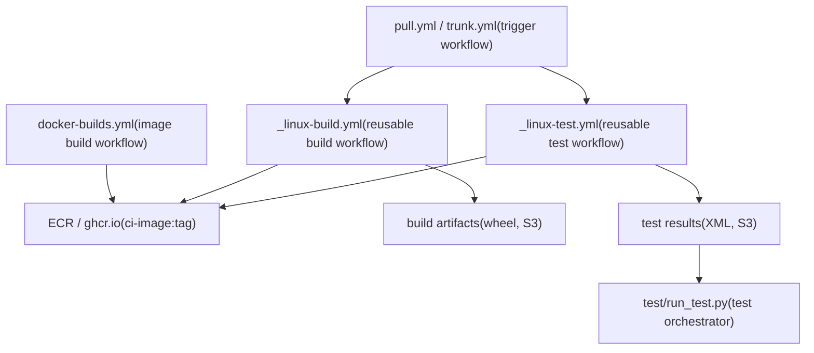
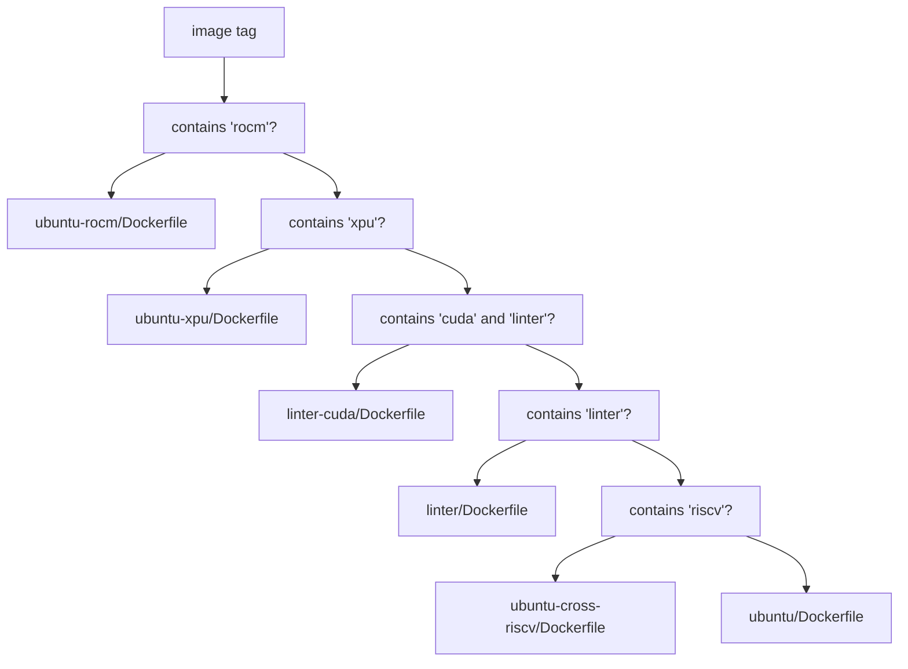
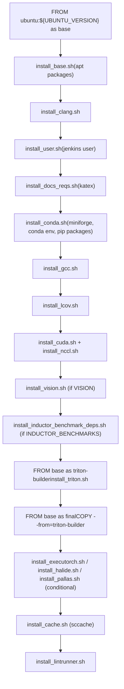
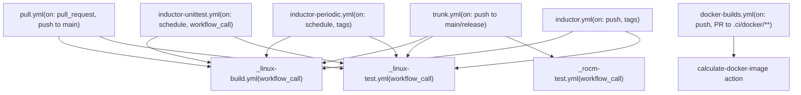
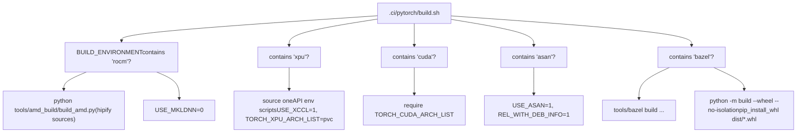
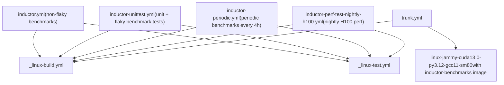

# CI/CD Workflows and Docker Image Builds

Relevant source files

-   [.ci/docker/build.sh](https://github.com/pytorch/pytorch/blob/915982a4/.ci/docker/build.sh)
-   [.ci/docker/common/install\_amdsmi.sh](https://github.com/pytorch/pytorch/blob/915982a4/.ci/docker/common/install_amdsmi.sh)
-   [.ci/docker/common/install\_cache.sh](https://github.com/pytorch/pytorch/blob/915982a4/.ci/docker/common/install_cache.sh)
-   [.ci/docker/common/install\_conda.sh](https://github.com/pytorch/pytorch/blob/915982a4/.ci/docker/common/install_conda.sh)
-   [.ci/docker/common/install\_cpython.sh](https://github.com/pytorch/pytorch/blob/915982a4/.ci/docker/common/install_cpython.sh)
-   [.ci/docker/common/install\_inductor\_benchmark\_deps.sh](https://github.com/pytorch/pytorch/blob/915982a4/.ci/docker/common/install_inductor_benchmark_deps.sh)
-   [.ci/docker/common/install\_mingw.sh](https://github.com/pytorch/pytorch/blob/915982a4/.ci/docker/common/install_mingw.sh)
-   [.ci/docker/common/install\_rocm.sh](https://github.com/pytorch/pytorch/blob/915982a4/.ci/docker/common/install_rocm.sh)
-   [.ci/docker/manywheel/build\_scripts/ssl-check.py](https://github.com/pytorch/pytorch/blob/915982a4/.ci/docker/manywheel/build_scripts/ssl-check.py)
-   [.ci/docker/ubuntu-rocm/Dockerfile](https://github.com/pytorch/pytorch/blob/915982a4/.ci/docker/ubuntu-rocm/Dockerfile)
-   [.ci/docker/ubuntu/Dockerfile](https://github.com/pytorch/pytorch/blob/915982a4/.ci/docker/ubuntu/Dockerfile)
-   [.ci/pytorch/build.sh](https://github.com/pytorch/pytorch/blob/915982a4/.ci/pytorch/build.sh)
-   [.ci/pytorch/common\_utils.sh](https://github.com/pytorch/pytorch/blob/915982a4/.ci/pytorch/common_utils.sh)
-   [.ci/pytorch/numba-cuda-13.patch](https://github.com/pytorch/pytorch/blob/915982a4/.ci/pytorch/numba-cuda-13.patch)
-   [.ci/pytorch/test.sh](https://github.com/pytorch/pytorch/blob/915982a4/.ci/pytorch/test.sh)
-   [.github/actions/linux-test/action.yml](https://github.com/pytorch/pytorch/blob/915982a4/.github/actions/linux-test/action.yml)
-   [.github/actions/test-pytorch-binary/action.yml](https://github.com/pytorch/pytorch/blob/915982a4/.github/actions/test-pytorch-binary/action.yml)
-   [.github/ci\_commit\_pins/fbgemm\_rocm.txt](https://github.com/pytorch/pytorch/blob/915982a4/.github/ci_commit_pins/fbgemm_rocm.txt)
-   [.github/workflows/\_linux-build.yml](https://github.com/pytorch/pytorch/blob/915982a4/.github/workflows/_linux-build.yml)
-   [.github/workflows/\_linux-test.yml](https://github.com/pytorch/pytorch/blob/915982a4/.github/workflows/_linux-test.yml)
-   [.github/workflows/\_xpu-test.yml](https://github.com/pytorch/pytorch/blob/915982a4/.github/workflows/_xpu-test.yml)
-   [.github/workflows/docker-builds.yml](https://github.com/pytorch/pytorch/blob/915982a4/.github/workflows/docker-builds.yml)
-   [.github/workflows/dynamo-unittest.yml](https://github.com/pytorch/pytorch/blob/915982a4/.github/workflows/dynamo-unittest.yml)
-   [.github/workflows/inductor-micro-benchmark.yml](https://github.com/pytorch/pytorch/blob/915982a4/.github/workflows/inductor-micro-benchmark.yml)
-   [.github/workflows/inductor-perf-compare.yml](https://github.com/pytorch/pytorch/blob/915982a4/.github/workflows/inductor-perf-compare.yml)
-   [.github/workflows/inductor-perf-test-b200.yml](https://github.com/pytorch/pytorch/blob/915982a4/.github/workflows/inductor-perf-test-b200.yml)
-   [.github/workflows/inductor-perf-test-nightly-h100.yml](https://github.com/pytorch/pytorch/blob/915982a4/.github/workflows/inductor-perf-test-nightly-h100.yml)
-   [.github/workflows/inductor-perf-test-nightly.yml](https://github.com/pytorch/pytorch/blob/915982a4/.github/workflows/inductor-perf-test-nightly.yml)
-   [.github/workflows/inductor-periodic.yml](https://github.com/pytorch/pytorch/blob/915982a4/.github/workflows/inductor-periodic.yml)
-   [.github/workflows/inductor-unittest.yml](https://github.com/pytorch/pytorch/blob/915982a4/.github/workflows/inductor-unittest.yml)
-   [.github/workflows/inductor.yml](https://github.com/pytorch/pytorch/blob/915982a4/.github/workflows/inductor.yml)
-   [.github/workflows/pull.yml](https://github.com/pytorch/pytorch/blob/915982a4/.github/workflows/pull.yml)
-   [.github/workflows/rocm-nightly.yml](https://github.com/pytorch/pytorch/blob/915982a4/.github/workflows/rocm-nightly.yml)
-   [.github/workflows/slow.yml](https://github.com/pytorch/pytorch/blob/915982a4/.github/workflows/slow.yml)
-   [.github/workflows/torchbench.yml](https://github.com/pytorch/pytorch/blob/915982a4/.github/workflows/torchbench.yml)
-   [.github/workflows/trunk.yml](https://github.com/pytorch/pytorch/blob/915982a4/.github/workflows/trunk.yml)
-   [aten/src/ATen/native/tags.yaml](https://github.com/pytorch/pytorch/blob/915982a4/aten/src/ATen/native/tags.yaml)
-   [cmake/public/utils.cmake](https://github.com/pytorch/pytorch/blob/915982a4/cmake/public/utils.cmake)
-   [test/custom\_operator/test\_out\_variant.py](https://github.com/pytorch/pytorch/blob/915982a4/test/custom_operator/test_out_variant.py)
-   [test/run\_test.py](https://github.com/pytorch/pytorch/blob/915982a4/test/run_test.py)
-   [test/test\_bundled\_inputs.py](https://github.com/pytorch/pytorch/blob/915982a4/test/test_bundled_inputs.py)
-   [test/test\_complex.py](https://github.com/pytorch/pytorch/blob/915982a4/test/test_complex.py)
-   [test/test\_ops.py](https://github.com/pytorch/pytorch/blob/915982a4/test/test_ops.py)
-   [test/test\_type\_hints.py](https://github.com/pytorch/pytorch/blob/915982a4/test/test_type_hints.py)
-   [test/test\_type\_info.py](https://github.com/pytorch/pytorch/blob/915982a4/test/test_type_info.py)
-   [tools/stats/monitor.py](https://github.com/pytorch/pytorch/blob/915982a4/tools/stats/monitor.py)
-   [tools/stats/utilization\_stats\_lib.py](https://github.com/pytorch/pytorch/blob/915982a4/tools/stats/utilization_stats_lib.py)
-   [torch/\_library/\_out\_variant.py](https://github.com/pytorch/pytorch/blob/915982a4/torch/_library/_out_variant.py)
-   [torch/csrc/distributed/c10d/symm\_mem/nccl\_dev\_cap.hpp](https://github.com/pytorch/pytorch/blob/915982a4/torch/csrc/distributed/c10d/symm_mem/nccl_dev_cap.hpp)
-   [torch/csrc/distributed/c10d/symm\_mem/nccl\_devcomm\_manager.hpp](https://github.com/pytorch/pytorch/blob/915982a4/torch/csrc/distributed/c10d/symm_mem/nccl_devcomm_manager.hpp)
-   [torch/testing/\_internal/opinfo/definitions/fft.py](https://github.com/pytorch/pytorch/blob/915982a4/torch/testing/_internal/opinfo/definitions/fft.py)

## Purpose and Scope

This page documents how PyTorch's GitHub Actions CI/CD system is structured, how Docker images are constructed for each build configuration, how builds and tests are executed inside those containers, and how the major workflow files relate to each other.

This page covers the CI infrastructure layer: image construction, workflow orchestration, and the shell scripts that run inside containers. For information about the test framework itself (test utilities, parametrization, OpInfo), see [Testing Infrastructure and OpInfo](/pytorch/pytorch/5.2-testing-infrastructure-and-opinfo). For the binary release pipeline which produces distributable packages, see [Binary Release Pipeline](/pytorch/pytorch/5.4-binary-release-pipeline).

---

## High-Level Architecture

The CI system has three major phases: Docker image construction, PyTorch building inside a container, and test execution inside a container. These are coordinated by GitHub Actions workflows that call reusable sub-workflows.

**CI Phase Flow**


Sources: [.github/workflows/pull.yml1-114](https://github.com/pytorch/pytorch/blob/915982a4/.github/workflows/pull.yml#L1-L114) [.github/workflows/trunk.yml1-115](https://github.com/pytorch/pytorch/blob/915982a4/.github/workflows/trunk.yml#L1-L115) [.github/workflows/docker-builds.yml1-50](https://github.com/pytorch/pytorch/blob/915982a4/.github/workflows/docker-builds.yml#L1-L50) [.github/workflows/\_linux-build.yml1-60](https://github.com/pytorch/pytorch/blob/915982a4/.github/workflows/_linux-build.yml#L1-L60) [.github/workflows/\_linux-test.yml1-100](https://github.com/pytorch/pytorch/blob/915982a4/.github/workflows/_linux-test.yml#L1-L100)

---

## Docker Image Construction

### Image Naming Convention

All CI images follow this naming pattern:

```
pytorch-linux-{os}-{accelerator?}-{python}-{compiler}-{variant?}
```
Examples:

-   `pytorch-linux-jammy-cuda13.0-cudnn9-py3-gcc11`
-   `pytorch-linux-jammy-rocm-n-py3`
-   `pytorch-linux-noble-xpu-n-py3`
-   `pytorch-linux-jammy-py3.10-clang15`
-   `pytorch-linux-jammy-linter`

Images are stored in ECR under the `ci-image:` prefix and mirrored to `ghcr.io/pytorch/ci-image` on pushes to `main` or release branches.

### `build.sh`: Image Tag to Build Parameters

[.ci/docker/build.sh](https://github.com/pytorch/pytorch/blob/915982a4/.ci/docker/build.sh) is the entry point for constructing any CI Docker image. Given an image tag, it:

1.  Parses the tag to extract version components (`CUDA_VERSION`, `ROCM_VERSION`, `ANACONDA_PYTHON_VERSION`, `GCC_VERSION`, `CLANG_VERSION`, etc.)
2.  Selects the appropriate `Dockerfile`
3.  Calls `docker buildx build` with resolved `--build-arg` values
4.  Validates the built image by running version checks inside a container

**Dockerfile Selection Logic**


Sources: [.ci/docker/build.sh68-83](https://github.com/pytorch/pytorch/blob/915982a4/.ci/docker/build.sh#L68-L83)

**Build Arguments Passed to Docker**

| Build Arg | Purpose |
| --- | --- |
| `ANACONDA_PYTHON_VERSION` | Python version for conda env |
| `CUDA_VERSION` | CUDA toolkit version to install |
| `ROCM_VERSION` | ROCm version to install |
| `GCC_VERSION` / `CLANG_VERSION` | Compiler version |
| `TRITON` | Whether to install Triton |
| `INDUCTOR_BENCHMARKS` | Whether to install torchbench/HuggingFace/timm |
| `VISION` | Whether to install torchvision |
| `PALLAS` / `TPU` | JAX/Pallas support |
| `HALIDE` | Halide compiler support |
| `EXECUTORCH` | ExecuTorch support |
| `KATEX` | KaTeX for docs |
| `INSTALL_MINGW` | MinGW cross-compilation toolchain |

Sources: [.ci/docker/build.sh359-401](https://github.com/pytorch/pytorch/blob/915982a4/.ci/docker/build.sh#L359-L401)

### Hardcoded Tag Configurations

Rather than deriving all parameters from the tag name, most production image configurations are hardcoded in a `case` statement in `build.sh`. This avoids ambiguity and allows fine-grained control. Selected examples:

| Tag | Python | Compiler | Extras |
| --- | --- | --- | --- |
| `pytorch-linux-jammy-cuda13.0-cudnn9-py3-gcc11` | 3.10 | GCC 11 | VISION, KATEX, TRITON |
| `pytorch-linux-jammy-cuda13.0-cudnn9-py3-gcc11-inductor-benchmarks` | 3.10 | GCC 11 | \+ INDUCTOR\_BENCHMARKS |
| `pytorch-linux-jammy-rocm-n-py3` | 3.10 | GCC 13 | ROCm 7.2, TRITON |
| `pytorch-linux-noble-xpu-n-py3` | 3.10 | GCC 13 | XPU 2025.3 |
| `pytorch-linux-jammy-py3-clang18-asan` | 3.10 | Clang 18 | VISION |
| `pytorch-linux-jammy-py3.12-halide` | 3.12 | GCC 11 | HALIDE, CUDA 12.6 |
| `pytorch-linux-jammy-aarch64-py3.10-gcc13` | 3.10 | GCC 13 | ACL, OPENBLAS |

Sources: [.ci/docker/build.sh93-306](https://github.com/pytorch/pytorch/blob/915982a4/.ci/docker/build.sh#L93-L306)

### Ubuntu Dockerfile Structure

The base Ubuntu Dockerfile ([.ci/docker/ubuntu/Dockerfile](https://github.com/pytorch/pytorch/blob/915982a4/.ci/docker/ubuntu/Dockerfile)) uses a multi-stage build:

**Ubuntu Dockerfile Layer Order**


Sources: [.ci/docker/ubuntu/Dockerfile1-165](https://github.com/pytorch/pytorch/blob/915982a4/.ci/docker/ubuntu/Dockerfile#L1-L165)

### ROCm Dockerfile

[.ci/docker/ubuntu-rocm/Dockerfile](https://github.com/pytorch/pytorch/blob/915982a4/.ci/docker/ubuntu-rocm/Dockerfile) follows a similar pattern but installs ROCm via `install_rocm.sh`. It sets `PYTORCH_ROCM_ARCH` as an environment variable baked into the image (e.g., `gfx90a;gfx942;gfx950;gfx1100`).

### Inductor Benchmark Dependencies

When `INDUCTOR_BENCHMARKS=yes`, [.ci/docker/common/install\_inductor\_benchmark\_deps.sh](https://github.com/pytorch/pytorch/blob/915982a4/.ci/docker/common/install_inductor_benchmark_deps.sh) installs:

-   `torchbench` (from pinned commit in `ci_commit_pins/torchbench.txt`)
-   HuggingFace Transformers (from `ci_commit_pins/huggingface-requirements.txt`)
-   `timm` (from pinned commit in `ci_commit_pins/timm.txt`)

After installation, it removes `torch`, `torchvision`, `torchaudio`, and `triton` so that the CI-built versions are used at test time.

Sources: [.ci/docker/common/install\_inductor\_benchmark\_deps.sh1-72](https://github.com/pytorch/pytorch/blob/915982a4/.ci/docker/common/install_inductor_benchmark_deps.sh#L1-L72)

---

## GitHub Actions Workflow Structure

### Reusable Workflow Pattern

PyTorch uses GitHub Actions reusable workflows (`workflow_call`) extensively. Top-level workflows delegate to shared implementations:


Sources: [.github/workflows/pull.yml1-30](https://github.com/pytorch/pytorch/blob/915982a4/.github/workflows/pull.yml#L1-L30) [.github/workflows/trunk.yml1-35](https://github.com/pytorch/pytorch/blob/915982a4/.github/workflows/trunk.yml#L1-L35) [.github/workflows/docker-builds.yml43-120](https://github.com/pytorch/pytorch/blob/915982a4/.github/workflows/docker-builds.yml#L43-L120) [.github/workflows/inductor-unittest.yml34-61](https://github.com/pytorch/pytorch/blob/915982a4/.github/workflows/inductor-unittest.yml#L34-L61)

### Workflow Trigger Summary

| Workflow | Triggers |
| --- | --- |
| `pull.yml` | `pull_request`, push to `main`/`release/*`/`landchecks/*`, `ciflow/pull/*` tags, schedule |
| `trunk.yml` | Push to `main`/`release/*`/`landchecks/*`, `ciflow/trunk/*` tags, schedule |
| `docker-builds.yml` | Changes to `.ci/docker/**`, push to `main`/`release/*`, schedule (weekly) |
| `inductor-unittest.yml` | `workflow_call`, schedule (daily), PR to workflow file |
| `inductor-periodic.yml` | `ciflow/inductor-periodic/*` tags, schedule (every 4h weekdays) |
| `inductor.yml` | Push to `main`/`release/*`, `ciflow/inductor/*` tags |
| `slow.yml` | Push to `main`/`release/*`, `ciflow/slow/*` tags, schedule |

Sources: [.github/workflows/pull.yml3-27](https://github.com/pytorch/pytorch/blob/915982a4/.github/workflows/pull.yml#L3-L27) [.github/workflows/trunk.yml3-24](https://github.com/pytorch/pytorch/blob/915982a4/.github/workflows/trunk.yml#L3-L24) [.github/workflows/docker-builds.yml4-21](https://github.com/pytorch/pytorch/blob/915982a4/.github/workflows/docker-builds.yml#L4-L21)

### Job Filtering and Runner Selection

Both `pull.yml` and `trunk.yml` start with two prerequisite jobs:

-   **`job-filter`**: Uses `.github/workflows/job-filter.yml` to filter which jobs to run (can be overridden via `workflow_dispatch` input `jobs-to-include`)
-   **`get-label-type`**: Uses `_runner-determinator.yml` to determine runner label prefix (selects between standard and LF runners based on PR labels and actor)
-   **`llm-td` + `target-determination`**: Download and run target determination artifacts to selectively skip tests not affected by the PR

Sources: [.github/workflows/pull.yml37-69](https://github.com/pytorch/pytorch/blob/915982a4/.github/workflows/pull.yml#L37-L69) [.github/workflows/trunk.yml36-68](https://github.com/pytorch/pytorch/blob/915982a4/.github/workflows/trunk.yml#L36-L68)

### `docker-builds.yml`: Image Build and Push

This workflow builds and validates all production CI images. Each image is built in a matrix job. After building:

1.  The image is pushed to AWS ECR (always)
2.  On `push` events to `main`/release branches, it is also pushed to `ghcr.io/pytorch/ci-image` with a retry loop

ARM64 images (`pytorch-linux-jammy-aarch64-*`) use `linux.arm64.m7g.4xlarge` runners via `matrix.include` overrides.

Sources: [.github/workflows/docker-builds.yml43-170](https://github.com/pytorch/pytorch/blob/915982a4/.github/workflows/docker-builds.yml#L43-L170)

---

## Build Pipeline: `_linux-build.yml` and `build.sh`

### `_linux-build.yml` Inputs

The reusable build workflow accepts:

| Input | Description |
| --- | --- |
| `build-environment` | Label string, e.g. `linux-jammy-cuda13.0-py3.10-gcc11` |
| `docker-image-name` | e.g. `ci-image:pytorch-linux-jammy-cuda13.0-cudnn9-py3-gcc11` |
| `cuda-arch-list` | Space-separated CUDA arch list, e.g. `7.5 8.9` |
| `test-matrix` | JSON matrix for downstream test jobs |
| `runner` | Runner label |
| `build-generates-artifacts` | Whether to upload wheel to S3 |

Sources: [.github/workflows/\_linux-build.yml1-60](https://github.com/pytorch/pytorch/blob/915982a4/.github/workflows/_linux-build.yml#L1-L60)

### `build.sh`: In-Container Build Logic

[.ci/pytorch/build.sh](https://github.com/pytorch/pytorch/blob/915982a4/.ci/pytorch/build.sh) runs inside the Docker container and handles the actual PyTorch build. Key decisions made:

**Platform-specific behavior:**


After the wheel is built and installed, `build.sh` also conditionally installs additional packages like `torchvision`, `torchaudio`, `torchrec`, `fbgemm`, or `torchao` based on `BUILD_ADDITIONAL_PACKAGES`.

Sources: [.ci/pytorch/build.sh26-300](https://github.com/pytorch/pytorch/blob/915982a4/.ci/pytorch/build.sh#L26-L300)

---

## Test Pipeline: `_linux-test.yml` and `test.sh`

### `_linux-test.yml`: Test Orchestration

The reusable test workflow:

1.  Checks out PyTorch
2.  Sets up Linux environment (SSH access, nvidia drivers)
3.  Pulls the Docker image from ECR
4.  Downloads build artifacts from S3
5.  Downloads target determination artifacts
6.  Runs the `Test` step inside Docker, invoking `.ci/pytorch/test.sh`
7.  Uploads test results and artifacts

Key environment variables forwarded into Docker:

| Variable | Source |
| --- | --- |
| `BUILD_ENVIRONMENT` | Workflow input |
| `TEST_CONFIG` | `matrix.config` |
| `SHARD_NUMBER` | `matrix.shard` |
| `NUM_TEST_SHARDS` | `matrix.num_shards` |
| `CONTINUE_THROUGH_ERROR` | From `keep-going` action |
| `REENABLED_ISSUES` | From `filter-test-configs` action |

Sources: [.github/workflows/\_linux-test.yml311-370](https://github.com/pytorch/pytorch/blob/915982a4/.github/workflows/_linux-test.yml#L311-L370)

### `test.sh`: In-Container Test Dispatch

[.ci/pytorch/test.sh](https://github.com/pytorch/pytorch/blob/915982a4/.ci/pytorch/test.sh) is the primary dispatcher for test execution inside the container. It reads `TEST_CONFIG` and `BUILD_ENVIRONMENT` to determine which test function to invoke.

**Test Function Dispatch Logic**

```mermaid
flowchart TD
    TS[".ci/pytorch/test.sh"]
    TC["TEST_CONFIG value"]
    PS["test_python_shard→ test/run_test.py --shard N M"]
    DW["test_dynamo_wrapped_shard→ test/run_test.py --dynamo"]
    IS["test_inductor_shard→ test/run_test.py --inductor"]
    ID["test_inductor_distributed→ test/run_test.py -i distributed/..."]
    IC["test_inductor_core→ test/run_test.py --include-inductor-core-tests"]
    CW["test_inductor_cpp_wrapper_shard→ TORCHINDUCTOR_CPP_WRAPPER=1"]
    DIST["test_distributed"]
    SLOW["PYTORCH_TEST_WITH_SLOW=1PYTORCH_TEST_SKIP_FAST=1"]
    BM["test_single_dynamo_benchmarkbenchmarks/dynamo/*.py --ci"]
    PERF["test_perf_for_dashboard(performance mode)"]
    PRB["pr_time_benchmarksbenchmarks/dynamo/pr_time_benchmarks/"]
    IH["test_inductor_halide→ inductor/test_halide.py"]
    IP["test_inductor_pallas→ inductor/test_pallas*.py"]

    TS --> TC
    TC --> PS
    TC --> DW
    TC --> IS
    TC --> ID
    TC --> IC
    TC --> CW
    TC --> DIST
    TC --> SLOW
    TC --> BM
    TC --> PERF
    TC --> PRB
    TC --> IH
    TC --> IP
```


Sources: [.ci/pytorch/test.sh625-1100](https://github.com/pytorch/pytorch/blob/915982a4/.ci/pytorch/test.sh#L625-L1100)

**Environment setup in `test.sh` by platform:**

| Platform (`BUILD_ENVIRONMENT`) | Setup |
| --- | --- |
| `*cuda*` | `PYTORCH_TESTING_DEVICE_ONLY_FOR=cuda`, `detect_cuda_arch`, numba CUDA-13 patch |
| `*rocm*` | `rocminfo`, `HIP_VISIBLE_DEVICES`, `VALGRIND=OFF` |
| `*xpu*` | Source oneAPI vars.sh scripts, `xpu-smi discovery` |
| `*asan*` | `ASAN_OPTIONS`, `UBSAN_OPTIONS`, `LD_PRELOAD`, `VALGRIND=OFF` |
| `*aarch64*` | `VALGRIND=OFF` |
| `*s390x*` | `VALGRIND=OFF` |

Sources: [.ci/pytorch/test.sh37-235](https://github.com/pytorch/pytorch/blob/915982a4/.ci/pytorch/test.sh#L37-L235)

### `run_test.py`: Test Orchestrator

[test/run\_test.py](https://github.com/pytorch/pytorch/blob/915982a4/test/run_test.py) is invoked by `test.sh` and handles the actual test selection, sharding, and execution. It maintains several key lists:

| List | Purpose |
| --- | --- |
| `WINDOWS_BLOCKLIST` | Tests excluded on Windows |
| `ROCM_BLOCKLIST` | Tests excluded on ROCm |
| `S390X_BLOCKLIST` | Tests excluded on s390x |
| `RUN_PARALLEL_BLOCKLIST` | Tests that must not run in parallel with each other |
| `CI_SERIAL_LIST` | Tests that must run serially with other files |
| `CORE_TEST_LIST` | Minimal set for core functionality validation |

Key functions:

-   `run_test()`: Executes a single test module via subprocess, handles retry logic via `run_test_retries()`
-   `calculate_shards()`: Distributes tests across shards based on historical timing data
-   `get_test_case_configs()`: Loads per-test timing data from S3 for shard balancing

Sources: [test/run\_test.py146-345](https://github.com/pytorch/pytorch/blob/915982a4/test/run_test.py#L146-L345) [test/run\_test.py485-680](https://github.com/pytorch/pytorch/blob/915982a4/test/run_test.py#L485-L680)

---

## Test Configurations and Sharding

### Standard Test Configs

The `TEST_CONFIG` matrix value determines which subset of tests `test.sh` executes. Configs used across `pull.yml`, `trunk.yml`, and `inductor*.yml`:

| `TEST_CONFIG` | Description |
| --- | --- |
| `default` | Standard Python tests, sharded, excludes JIT/distributed/inductor |
| `dynamo_wrapped` | Same tests run under TorchDynamo |
| `inductor` | Core inductor tests + `test_modules`, `test_ops`, `test_torch` |
| `inductor_core` | Inductor unit tests subset (excludes large/slow tests) |
| `inductor_distributed` | Multi-GPU inductor + distributed tests |
| `inductor_cpp_wrapper` | Inductor tests with `TORCHINDUCTOR_CPP_WRAPPER=1` |
| `distributed` | Distributed tests only |
| `slow` | Tests with `PYTORCH_TEST_WITH_SLOW=1` |
| `crossref` | Tests with `PYTORCH_TEST_WITH_CROSSREF=1` |
| `jit_legacy` | `test_jit_legacy`, `test_jit_fuser_legacy` |
| `docs_test` | Documentation tests |
| `pr_time_benchmarks` | Performance benchmarks for PR regression tracking |
| `dynamo_eager_torchbench` | Dynamo accuracy benchmarks on TorchBench suite |
| `inductor_torchbench` | Inductor accuracy benchmarks on TorchBench suite |

Sources: [.ci/pytorch/test.sh614-638](https://github.com/pytorch/pytorch/blob/915982a4/.ci/pytorch/test.sh#L614-L638) [.github/workflows/pull.yml82-98](https://github.com/pytorch/pytorch/blob/915982a4/.github/workflows/pull.yml#L82-L98) [.github/workflows/trunk.yml100-145](https://github.com/pytorch/pytorch/blob/915982a4/.github/workflows/trunk.yml#L100-L145)

### Sharding Pattern

Most test configs use `N` shards across `N` parallel runners. The `_linux-build.yml` workflow accepts `test-matrix` as a JSON object that specifies per-shard runner assignments. Example from `pull.yml`:

```
{ config: "default", shard: 1, num_shards: 5, runner: "linux.2xlarge" },
{ config: "default", shard: 2, num_shards: 5, runner: "linux.2xlarge" },
...
```
These values become `SHARD_NUMBER` and `NUM_TEST_SHARDS` environment variables, which `run_test.py`'s `calculate_shards()` uses to partition the test list based on historical runtime data pulled from S3.

Sources: [.github/workflows/pull.yml82-98](https://github.com/pytorch/pytorch/blob/915982a4/.github/workflows/pull.yml#L82-L98) [test/run\_test.py364-384](https://github.com/pytorch/pytorch/blob/915982a4/test/run_test.py#L364-L384)

---

## Inductor-Specific Workflows

The inductor testing system has its own workflow hierarchy. See also [TorchInductor Backend](/pytorch/pytorch/2.5-torchinductor-backend) for the compiler subsystem being tested.

**Inductor Workflow Structure**


The `inductor-build` job in `trunk.yml` uses a separate image (`pytorch-linux-jammy-cuda13.0-cudnn9-py3-gcc11-inductor-benchmarks`) that includes `torchbench`, `timm`, and HuggingFace pre-installed.

Sources: [.github/workflows/inductor-unittest.yml34-90](https://github.com/pytorch/pytorch/blob/915982a4/.github/workflows/inductor-unittest.yml#L34-L90) [.github/workflows/trunk.yml312-323](https://github.com/pytorch/pytorch/blob/915982a4/.github/workflows/trunk.yml#L312-L323) [.github/workflows/inductor-periodic.yml34-60](https://github.com/pytorch/pytorch/blob/915982a4/.github/workflows/inductor-periodic.yml#L34-L60)

---

## Key File Reference

| File | Role |
| --- | --- |
| `.ci/docker/build.sh` | Parses image name → calls `docker buildx build` |
| `.ci/docker/ubuntu/Dockerfile` | Standard Ubuntu CI image definition |
| `.ci/docker/ubuntu-rocm/Dockerfile` | ROCm CI image definition |
| `.ci/docker/common/install_*.sh` | Individual component installers |
| `.ci/pytorch/build.sh` | In-container PyTorch build script |
| `.ci/pytorch/test.sh` | In-container test dispatcher |
| `.ci/pytorch/common.sh` | Shared shell utilities |
| `.ci/pytorch/common_utils.sh` | `pip_install`, `trap_add`, `assert_git_not_dirty` |
| `test/run_test.py` | Python test orchestrator, handles sharding and selection |
| `.github/workflows/pull.yml` | PR and main-branch CI workflow |
| `.github/workflows/trunk.yml` | Trunk (post-merge) extended CI workflow |
| `.github/workflows/docker-builds.yml` | Image build and push workflow |
| `.github/workflows/_linux-build.yml` | Reusable Linux build sub-workflow |
| `.github/workflows/_linux-test.yml` | Reusable Linux test sub-workflow |
| `.github/workflows/inductor-unittest.yml` | Inductor unit test workflow |
| `.github/workflows/inductor-periodic.yml` | Inductor periodic benchmark workflow |
| `.github/workflows/inductor.yml` | Inductor benchmark CI workflow |
