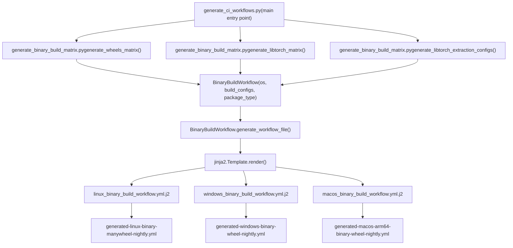

# Binary Release Pipeline

Relevant source files

-   [.ci/docker/README.md](https://github.com/pytorch/pytorch/blob/915982a4/.ci/docker/README.md)
-   [.ci/docker/common/install\_cuda.sh](https://github.com/pytorch/pytorch/blob/915982a4/.ci/docker/common/install_cuda.sh)
-   [.ci/docker/common/install\_cusparselt.sh](https://github.com/pytorch/pytorch/blob/915982a4/.ci/docker/common/install_cusparselt.sh)
-   [.ci/docker/manywheel/build\_scripts/manylinux1-check.py](https://github.com/pytorch/pytorch/blob/915982a4/.ci/docker/manywheel/build_scripts/manylinux1-check.py)
-   [.ci/libtorch/extract\_libtorch\_from\_wheel.py](https://github.com/pytorch/pytorch/blob/915982a4/.ci/libtorch/extract_libtorch_from_wheel.py)
-   [.ci/pytorch/smoke\_test/smoke\_test.py](https://github.com/pytorch/pytorch/blob/915982a4/.ci/pytorch/smoke_test/smoke_test.py)
-   [.ci/wheel/build\_wheel.sh](https://github.com/pytorch/pytorch/blob/915982a4/.ci/wheel/build_wheel.sh)
-   [.github/scripts/close\_nonexistent\_disable\_issues.py](https://github.com/pytorch/pytorch/blob/915982a4/.github/scripts/close_nonexistent_disable_issues.py)
-   [.github/scripts/generate\_binary\_build\_matrix.py](https://github.com/pytorch/pytorch/blob/915982a4/.github/scripts/generate_binary_build_matrix.py)
-   [.github/scripts/generate\_ci\_workflows.py](https://github.com/pytorch/pytorch/blob/915982a4/.github/scripts/generate_ci_workflows.py)
-   [.github/scripts/label\_utils.py](https://github.com/pytorch/pytorch/blob/915982a4/.github/scripts/label_utils.py)
-   [.github/templates/linux\_binary\_build\_workflow.yml.j2](https://github.com/pytorch/pytorch/blob/915982a4/.github/templates/linux_binary_build_workflow.yml.j2)
-   [.github/templates/macos\_binary\_build\_workflow.yml.j2](https://github.com/pytorch/pytorch/blob/915982a4/.github/templates/macos_binary_build_workflow.yml.j2)
-   [.github/templates/upload.yml.j2](https://github.com/pytorch/pytorch/blob/915982a4/.github/templates/upload.yml.j2)
-   [.github/templates/windows\_binary\_build\_workflow.yml.j2](https://github.com/pytorch/pytorch/blob/915982a4/.github/templates/windows_binary_build_workflow.yml.j2)
-   [.github/workflows/generated-linux-aarch64-binary-manywheel-nightly.yml](https://github.com/pytorch/pytorch/blob/915982a4/.github/workflows/generated-linux-aarch64-binary-manywheel-nightly.yml)
-   [.github/workflows/generated-linux-binary-manywheel-nightly.yml](https://github.com/pytorch/pytorch/blob/915982a4/.github/workflows/generated-linux-binary-manywheel-nightly.yml)
-   [.github/workflows/generated-linux-s390x-binary-manywheel-nightly.yml](https://github.com/pytorch/pytorch/blob/915982a4/.github/workflows/generated-linux-s390x-binary-manywheel-nightly.yml)
-   [.github/workflows/generated-macos-arm64-binary-wheel-nightly.yml](https://github.com/pytorch/pytorch/blob/915982a4/.github/workflows/generated-macos-arm64-binary-wheel-nightly.yml)
-   [.github/workflows/generated-windows-arm64-binary-libtorch-debug-nightly.yml](https://github.com/pytorch/pytorch/blob/915982a4/.github/workflows/generated-windows-arm64-binary-libtorch-debug-nightly.yml)
-   [.github/workflows/generated-windows-arm64-binary-wheel-nightly.yml](https://github.com/pytorch/pytorch/blob/915982a4/.github/workflows/generated-windows-arm64-binary-wheel-nightly.yml)
-   [.github/workflows/generated-windows-binary-libtorch-debug-nightly.yml](https://github.com/pytorch/pytorch/blob/915982a4/.github/workflows/generated-windows-binary-libtorch-debug-nightly.yml)
-   [.github/workflows/generated-windows-binary-wheel-nightly.yml](https://github.com/pytorch/pytorch/blob/915982a4/.github/workflows/generated-windows-binary-wheel-nightly.yml)
-   [test/jit/test\_freezing.py](https://github.com/pytorch/pytorch/blob/915982a4/test/jit/test_freezing.py)

This page documents the automated pipeline that builds, tests, and publishes PyTorch binary packages (Python wheels and libtorch C++ libraries) to public distribution channels. It covers how build configurations are generated, how GitHub Actions workflows are assembled from templates, what Docker images are used per platform, and how smoke tests validate produced artifacts.

For CI workflows that run on pull requests and trunk (non-release builds), see [CI/CD Workflows and Docker Image Builds](/pytorch/pytorch/5.3-cicd-workflows-and-docker-image-builds). For the build system itself, see [Build System and Code Generation](/pytorch/pytorch/5.1-build-system-and-code-generation).

---

## Overview

The release pipeline is fully code-generated: a Python script reads platform and version constants, computes a matrix of build configurations, then renders Jinja2 templates into concrete GitHub Actions YAML files. The resulting workflow files are committed to the repository and are not edited manually.

**Pipeline stages per configuration:**

```
Build → Test → Upload
```
Each configuration is an independent set of three sequential GitHub Actions jobs. The upload job only runs on the `nightly` branch or release candidate tags.

---

## Build Configuration Matrix

Sources: [.github/scripts/generate\_binary\_build\_matrix.py1-541](https://github.com/pytorch/pytorch/blob/915982a4/.github/scripts/generate_binary_build_matrix.py#L1-L541)

The file `.github/scripts/generate_binary_build_matrix.py` is the single source of truth for all supported build configurations.

### Supported Platforms and Accelerators

| Constant | Values |
| --- | --- |
| `CUDA_ARCHES` | `12.6`, `12.8`, `12.9`, `13.0` |
| `ROCM_ARCHES` | `7.1`, `7.2` |
| `XPU_ARCHES` | `xpu` |
| `CPU_AARCH64_ARCH` | `cpu-aarch64` |
| `CPU_S390X_ARCH` | `cpu-s390x` |
| `CUDA_AARCH64_ARCHES` | `12.6-aarch64`, `12.8-aarch64`, `12.9-aarch64`, `13.0-aarch64` |
| `FULL_PYTHON_VERSIONS` | `3.10`, `3.11`, `3.12`, `3.13`, `3.13t`, `3.14`, `3.14t` |

The `arch_type()` function [.github/scripts/generate\_binary\_build\_matrix.py239-253](https://github.com/pytorch/pytorch/blob/915982a4/.github/scripts/generate_binary_build_matrix.py#L239-L253) maps a version string like `"12.6"` or `"7.1"` to an arch type string (`"cuda"`, `"rocm"`, `"xpu"`, `"cpu-aarch64"`, `"cpu-s390x"`, `"cuda-aarch64"`, or `"cpu"`).

### Container Image Mapping

Each platform resolves to a named Docker image via `WHEEL_CONTAINER_IMAGES` and `LIBTORCH_CONTAINER_IMAGES` [.github/scripts/generate\_binary\_build\_matrix.py258-278](https://github.com/pytorch/pytorch/blob/915982a4/.github/scripts/generate_binary_build_matrix.py#L258-L278):

| Arch | Wheel Container | Libtorch Container |
| --- | --- | --- |
| `12.6` (x86) | `manylinux2_28-builder:cuda12.6` | `libtorch-cxx11-builder:cuda12.6` |
| `7.1` (ROCm) | `manylinux2_28-builder:rocm7.1` | `libtorch-cxx11-builder:rocm7.1` |
| `xpu` | `manylinux2_28-builder:xpu` | *(not built)* |
| `cpu` | `manylinux2_28-builder:cpu` | `libtorch-cxx11-builder:cpu` |
| `cpu-aarch64` | `manylinux2_28_aarch64-builder:cpu-aarch64` | *(not built)* |
| `cpu-s390x` | `pytorch/manylinuxs390x-builder:cpu-s390x` | *(not built)* |
| `12.6-aarch64` | `manylinuxaarch64-builder:cuda12.6` | *(not built)* |

The split between the image name and its tag is done with `.split(":")` and stored separately as `container_image` and `container_image_tag_prefix` in each config dict, which the workflow templates use to call the `calculate-docker-image` action.

### Matrix Generation Functions

**`generate_wheels_matrix(os, arches, python_versions)`** [.github/scripts/generate\_binary\_build\_matrix.py360-479](https://github.com/pytorch/pytorch/blob/915982a4/.github/scripts/generate_binary_build_matrix.py#L360-L479)

Returns a list of config dicts, one per `(python_version, arch_version)` combination. For Linux, `package_type` is `manywheel`; for other OSes, it is `wheel`. Linux CUDA configurations include `pytorch_extra_install_requirements` strings that list exact pinned versions of `nvidia-cudnn-cu12`, `nvidia-nccl-cu12`, `nvidia-nvshmem-cu12`, `nvidia-cusparselt-cu12`, etc.

**`generate_libtorch_matrix(os, release_type, arches, libtorch_variants)`** [.github/scripts/generate\_binary\_build\_matrix.py299-357](https://github.com/pytorch/pytorch/blob/915982a4/.github/scripts/generate_binary_build_matrix.py#L299-L357)

Returns configs for standalone libtorch builds. Variants are `shared-with-deps`, `shared-without-deps`, `static-with-deps`, `static-without-deps`. ROCm builds skip `without-deps` variants. Used for dedicated libtorch Windows builds in debug/release mode.

**`generate_libtorch_extraction_configs(os, wheel_configs)`** [.github/scripts/generate\_binary\_build\_matrix.py482-526](https://github.com/pytorch/pytorch/blob/915982a4/.github/scripts/generate_binary_build_matrix.py#L482-L526)

Returns lightweight extraction configs that take the Python 3.10 wheel for each arch and unzip libtorch headers and libraries from it instead of building libtorch from scratch. This is the preferred approach for Linux and macOS libtorch distributions.

### Dependency Version Validation

At module import time, `generate_binary_build_matrix.py` runs two validators [.github/scripts/generate\_binary\_build\_matrix.py530-533](https://github.com/pytorch/pytorch/blob/915982a4/.github/scripts/generate_binary_build_matrix.py#L530-L533):

-   `validate_nccl_dep_consistency(arch_version)` — checks that the NCCL wheel version in `PYTORCH_EXTRA_INSTALL_REQUIREMENTS` matches the pinned submodule version from `tools/optional_submodules.py`.
-   `validate_cudnn_version_consistency(arch_version)` — parses `CUDNN_VERSION` out of `.ci/docker/common/install_cuda.sh` and `.ci/pytorch/windows/internal/cuda_install.bat` to confirm they match.

---

## Workflow File Generation

Sources: [.github/scripts/generate\_ci\_workflows.py1-313](https://github.com/pytorch/pytorch/blob/915982a4/.github/scripts/generate_ci_workflows.py#L1-L313)

The script `.github/scripts/generate_ci_workflows.py` calls `generate_binary_build_matrix` to get config lists, wraps them in `BinaryBuildWorkflow` dataclass instances, and uses `jinja2` to render template files into the `.github/workflows/generated-*.yml` files.

### Key Data Structures

**`BinaryBuildWorkflow`** [.github/scripts/generate\_ci\_workflows.py51-93](https://github.com/pytorch/pytorch/blob/915982a4/.github/scripts/generate_ci_workflows.py#L51-L93)

| Field | Type | Description |
| --- | --- | --- |
| `os` | `str` | One of the `OperatingSystem` constants |
| `build_configs` | `list[dict]` | Output of a `generate_*_matrix()` call |
| `package_type` | `str` | `"wheel"`, `"manywheel"`, or `"libtorch"` |
| `build_environment` | `str` | Computed name like `linux-binary-manywheel` |
| `ciflow_config` | `CIFlowConfig` | Which ciflow tags trigger this workflow |
| `branches` | `str` | Default `"nightly"` |
| `libtorch_extraction_configs` | `list[dict]` | Extraction jobs derived from wheel configs |

`generate_workflow_file()` writes the rendered template to `GITHUB_DIR / "workflows/generated-{build_environment}-{branches}.yml"`.

**`CIFlowConfig`** [.github/scripts/generate\_ci\_workflows.py29-43](https://github.com/pytorch/pytorch/blob/915982a4/.github/scripts/generate_ci_workflows.py#L29-L43)

Controls which ciflow labels activate the workflow. Binary build workflows use labels like `LABEL_CIFLOW_BINARIES` (`ciflow/binaries`), `LABEL_CIFLOW_BINARIES_WHEEL`, and `LABEL_CIFLOW_BINARIES_LIBTORCH`.

### Jinja2 Templates

| Template File | Rendered Into |
| --- | --- |
| `.github/templates/linux_binary_build_workflow.yml.j2` | `generated-linux-binary-manywheel-nightly.yml`, etc. |
| `.github/templates/windows_binary_build_workflow.yml.j2` | `generated-windows-binary-wheel-nightly.yml`, etc. |
| `.github/templates/macos_binary_build_workflow.yml.j2` | `generated-macos-arm64-binary-wheel-nightly.yml`, etc. |
| `.github/templates/upload.yml.j2` | Macros embedded in all of the above |

The Jinja2 environment uses `!{{` / `}}` as its variable delimiters (not the default `{{`) to avoid conflicts with GitHub Actions' `${{ }}` syntax [.github/scripts/generate\_ci\_workflows.py264-267](https://github.com/pytorch/pytorch/blob/915982a4/.github/scripts/generate_ci_workflows.py#L264-L267)

**Figure: Workflow file generation flow**


Sources: [.github/scripts/generate\_ci\_workflows.py263-308](https://github.com/pytorch/pytorch/blob/915982a4/.github/scripts/generate_ci_workflows.py#L263-L308) [.github/templates/linux\_binary\_build\_workflow.yml.j21-260](https://github.com/pytorch/pytorch/blob/915982a4/.github/templates/linux_binary_build_workflow.yml.j2#L1-L260)

---

## Per-Job Pipeline Structure

Each `(python_version, arch_version)` tuple in the matrix expands to three chained jobs. Their naming convention is `{build_name}-build`, `{build_name}-test`, and `{build_name}-upload`, where `build_name` is computed by `generate_wheels_matrix()` and follows the pattern `manywheel-py3_10-cuda12_6`.

**Figure: Three-stage job structure per build configuration**

> **[Mermaid sequence]**
> *(图表结构无法解析)*

Sources: [.github/templates/linux\_binary\_build\_workflow.yml.j266-213](https://github.com/pytorch/pytorch/blob/915982a4/.github/templates/linux_binary_build_workflow.yml.j2#L66-L213) [.github/templates/upload.yml.j245-71](https://github.com/pytorch/pytorch/blob/915982a4/.github/templates/upload.yml.j2#L45-L71)

### Build Job

Linux and aarch64: delegates to the reusable workflow `_binary-build-linux.yml`.
Windows: runs inline steps calling `.circleci/scripts/binary_windows_build.sh`.
macOS: runs `.ci/wheel/build_wheel.sh` directly [.ci/wheel/build\_wheel.sh1-259](https://github.com/pytorch/pytorch/blob/915982a4/.ci/wheel/build_wheel.sh#L1-L259)

Artifacts are stored with `actions/upload-artifact@v4.4.0` using `build_name` as the artifact name and a 14-day retention.

### Test Job

Linux (non-ROCm, non-XPU): delegates to `_binary-test-linux.yml`.

ROCm test jobs run inline steps on `linux.rocm.gpu.mi250.1` runners [.github/templates/linux\_binary\_build\_workflow.yml.j2164-209](https://github.com/pytorch/pytorch/blob/915982a4/.github/templates/linux_binary_build_workflow.yml.j2#L164-L209):

1.  `setup-rocm` action
2.  Download artifact
3.  `calculate-docker-image` action
4.  `pull-docker-image` action
5.  `test-pytorch-binary` action (runs `smoke_test.py`)
6.  `teardown-rocm` action

XPU test jobs run inline steps on `linux.idc.xpu` runners with the equivalent `setup-xpu` / `teardown-xpu` actions [.github/templates/linux\_binary\_build\_workflow.yml.j2128-163](https://github.com/pytorch/pytorch/blob/915982a4/.github/templates/linux_binary_build_workflow.yml.j2#L128-L163)

### Upload Job

All platforms use the reusable workflow `_binary-upload.yml`. Credentials are passed as secrets: `R2_ACCOUNT_ID`, `R2_ACCESS_KEY_ID`, `R2_SECRET_ACCESS_KEY`. For macOS uploads, `use_s3: False` is set because R2 is used instead [.github/templates/macos\_binary\_build\_workflow.yml.j2122](https://github.com/pytorch/pytorch/blob/915982a4/.github/templates/macos_binary_build_workflow.yml.j2#L122-L122)

---

## Platform-Specific Details

### Linux (x86\_64)

Generated file: `generated-linux-binary-manywheel-nightly.yml`

Package type: `manywheel`. All CUDA, ROCm, XPU, and CPU configurations are built. Default arches for Linux are `cpu + CUDA_ARCHES + ROCM_ARCHES + XPU_ARCHES` [.github/scripts/generate\_binary\_build\_matrix.py376-378](https://github.com/pytorch/pytorch/blob/915982a4/.github/scripts/generate_binary_build_matrix.py#L376-L378)

Each CUDA build receives a `PYTORCH_EXTRA_INSTALL_REQUIREMENTS` environment variable listing the exact pinned versions of all required NVIDIA packages [.github/scripts/generate\_binary\_build\_matrix.py51-107](https://github.com/pytorch/pytorch/blob/915982a4/.github/scripts/generate_binary_build_matrix.py#L51-L107)

### Linux (aarch64)

Generated file: `generated-linux-aarch64-binary-manywheel-nightly.yml`

Arches: `CPU_AARCH64_ARCH + CUDA_AARCH64_ARCHES`. Build runners are `linux.arm64.r7g.12xlarge.memory`; test runners are `linux.arm64.2xlarge`. Uses `manylinux2_28_aarch64-builder` for CPU builds and `manylinuxaarch64-builder` for CUDA builds. CUDA aarch64 builds skip testing (upload depends on build, not test) [.github/templates/upload.yml.j252-56](https://github.com/pytorch/pytorch/blob/915982a4/.github/templates/upload.yml.j2#L52-L56)

### Linux (s390x)

Generated file: `generated-linux-s390x-binary-manywheel-nightly.yml`

Arch: `cpu-s390x` only. Container: `pytorch/manylinuxs390x-builder:cpu-s390x`. Runs on `linux.s390x` runners. Timeout is 420 minutes. Triggered by `ciflow/s390` in addition to the standard binary labels.

### Windows (x86\_64)

Generated file: `generated-windows-binary-wheel-nightly.yml`

Package type: `wheel`. Arches: `cpu + CUDA_ARCHES (minus 12.9) + XPU_ARCHES`. Jobs run inline (not via reusable workflows) on `windows.12xlarge` runners. Build calls `.circleci/scripts/binary_windows_build.sh`; test calls `.circleci/scripts/binary_windows_test.sh`. `SKIP_ALL_TESTS: 1` is set at the workflow level.

Windows also has a dedicated `generated-windows-binary-libtorch-debug-nightly.yml` that builds libtorch in debug mode (`LIBTORCH_CONFIG: debug`).

### Windows (ARM64)

Generated file: `generated-windows-arm64-binary-wheel-nightly.yml`

Arches: `cpu` only. Python versions: `3.11`, `3.12`, `3.13`. Runs on `windows-11-arm64-preview` runners. MSVC 14.42, APL enabled, OpenBLAS disabled [.github/workflows/generated-windows-arm64-binary-wheel-nightly.yml33-37](https://github.com/pytorch/pytorch/blob/915982a4/.github/workflows/generated-windows-arm64-binary-wheel-nightly.yml#L33-L37)

### macOS (ARM64)

Generated file: `generated-macos-arm64-binary-wheel-nightly.yml`

Runs on `macos-14-xlarge`. No separate test job — smoke test runs as a step inside the build job after building the wheel. Upload uses R2 (`use_s3: False`). macOS builds enable `USE_PYTORCH_METAL_EXPORT=1` and `USE_COREML_DELEGATE=1`.

---

## libtorch Distribution

libtorch packages are distributed in two ways:

**1\. Extraction from wheel (preferred for Linux, macOS, Windows ARM64)**

`generate_libtorch_extraction_configs()` creates jobs that download the Python 3.10 wheel artifact and run `extract_libtorch_from_wheel.py` [.ci/libtorch/extract\_libtorch\_from\_wheel.py1-30](https://github.com/pytorch/pytorch/blob/915982a4/.ci/libtorch/extract_libtorch_from_wheel.py#L1-L30) to copy out the C++ libraries, headers, and CMake files into a libtorch zip.

The extraction job name follows the pattern `libtorch-{gpu_arch_type}{gpu_arch_version}-shared-with-deps-release-extract`.

**2\. Dedicated libtorch build (Windows x86\_64 and ARM64)**

`generate_libtorch_matrix()` generates configs for building libtorch from source. Variants are `shared-with-deps`, `shared-without-deps`, `static-with-deps`, `static-without-deps`. Windows builds only produce `shared-with-deps` in debug mode via `LIBTORCH_CONFIG: debug`.

---

## Smoke Test Validation

Sources: [.ci/pytorch/smoke\_test/smoke\_test.py1-541](https://github.com/pytorch/pytorch/blob/915982a4/.ci/pytorch/smoke_test/smoke_test.py#L1-L541)

The smoke test script `.ci/pytorch/smoke_test/smoke_test.py` is run after installing the built wheel. It reads several environment variables:

| Variable | Source |
| --- | --- |
| `MATRIX_GPU_ARCH_VERSION` / `GPU_ARCH_VERSION` | Workflow env |
| `MATRIX_GPU_ARCH_TYPE` | Workflow env |
| `MATRIX_CHANNEL` | Workflow env (`nightly` or `stable`) |
| `MATRIX_PACKAGE_TYPE` | Workflow env |
| `TARGET_OS` | Workflow env |

**Test functions:**

| Function | What it checks |
| --- | --- |
| `check_version()` | Package version matches expected nightly date or stable version from `release_matrix.json` |
| `check_nightly_binaries_date()` | Nightly `dev` date is within `NIGHTLY_ALLOWED_DELTA = 3` days |
| `smoke_test_cuda()` | `torch.cuda.is_available()`, CUDA version, cuDNN version via `torch.backends.cudnn.version()`, NCCL version, PyPI package version cross-check |
| `smoke_test_compile()` | `torch.compile()` with `sin + cos` and `mode='max-autotune'`, vectorized ISA detection via `pick_vec_isa()` |
| `smoke_test_conv2d()` | Basic Conv2d on CPU and CUDA with autocast |
| `test_linalg()` | `torch.linalg.svd` on CPU and CUDA |
| `smoke_test_nvshmem()` | `_is_nvshmem_available()` from `torch._C._distributed_c10d` |
| `test_cuda_runtime_errors_captured()` | CUDA exception propagation |
| `test_cuda_gds_errors_captured()` | GDS file handle registration error (CUDA ≥ 12.6 only) |
| `test_sdpa()` | `scaled_dot_product_attention` to catch cuDNN execution plan failures |

The `Net` class [.ci/pytorch/smoke\_test/smoke\_test.py58-71](https://github.com/pytorch/pytorch/blob/915982a4/.ci/pytorch/smoke_test/smoke_test.py#L58-L71) is a small CNN used to test `max-autotune` compilation.

---

## Trigger Conditions

Binary build workflows are isolated (`isolated_workflow=True` in `CIFlowConfig`) from regular trunk CI. They activate on:

| Trigger | Details |
| --- | --- |
| Push to `nightly` branch | Produces nightly packages with a date-stamped version |
| Release candidate tags | Pattern: `v[0-9]+.[0-9]+.[0-9]+-rc[0-9]+` |
| `ciflow/binaries/*` tags | Triggers all binary workflows |
| `ciflow/binaries_wheel/*` tags | Triggers wheel-only workflows |
| `ciflow/binaries_libtorch/*` tags | Triggers libtorch-only workflows |
| `ciflow/s390/*` tags | Triggers s390x workflow only |
| `workflow_dispatch` | Manual trigger |

The `get-label-type` job (using `_runner-determinator.yml`) is the first job in every workflow and determines the runner label prefix (e.g., `lf.` for Linux Foundation runners).

---

## Code Entity Map

**Figure: Key code entities and their roles in the pipeline**

```mermaid
flowchart TD
    GBMX[".github/scripts/generate_binary_build_matrix.py"]
    GWF[".github/scripts/generate_ci_workflows.py"]
    CUDA_ARCHES["CUDA_ARCHESROCM_ARCHESXPU_ARCHES"]
    WHEEL_CONT["WHEEL_CONTAINER_IMAGES"]
    LIBTORCH_CONT["LIBTORCH_CONTAINER_IMAGES"]
    EXTRA_REQS["PYTORCH_EXTRA_INSTALL_REQUIREMENTS"]
    BBW["BinaryBuildWorkflowdataclass"]
    CFC["CIFlowConfigdataclass"]
    TMPL_L[".github/templates/linux_binary_build_workflow.yml.j2"]
    TMPL_W[".github/templates/windows_binary_build_workflow.yml.j2"]
    TMPL_M[".github/templates/macos_binary_build_workflow.yml.j2"]
    UPL[".github/templates/upload.yml.j2"]
    LNX["generated-linux-binary-manywheel-nightly.yml"]
    WIN["generated-windows-binary-wheel-nightly.yml"]
    MAC["generated-macos-arm64-binary-wheel-nightly.yml"]
    AARCH["generated-linux-aarch64-binary-manywheel-nightly.yml"]
    S390["generated-linux-s390x-binary-manywheel-nightly.yml"]
    BWS[".ci/wheel/build_wheel.sh"]
    SMK[".ci/pytorch/smoke_test/smoke_test.py"]
    EXTR[".ci/libtorch/extract_libtorch_from_wheel.py"]
    INST_CUDA[".ci/docker/common/install_cuda.sh"]

    GBMX --> CUDA_ARCHES
    GBMX --> WHEEL_CONT
    GBMX --> LIBTORCH_CONT
    GBMX --> EXTRA_REQS
    GWF --> BBW
    GWF --> CFC
    BBW --> TMPL_L
    BBW --> TMPL_W
    BBW --> TMPL_M
    TMPL --> L_LNX
    TMPL --> W_WIN
    TMPL --> M_MAC
    TMPL --> L_AARCH
    TMPL --> L_S390
    LNX --> BWS
    MAC --> BWS
    LNX --> SMK
    MAC --> SMK
    WIN --> SMK
    LNX --> EXTR
    MAC --> EXTR
```


Sources: [.github/scripts/generate\_binary\_build\_matrix.py1-100](https://github.com/pytorch/pytorch/blob/915982a4/.github/scripts/generate_binary_build_matrix.py#L1-L100) [.github/scripts/generate\_ci\_workflows.py50-130](https://github.com/pytorch/pytorch/blob/915982a4/.github/scripts/generate_ci_workflows.py#L50-L130) [.github/templates/linux\_binary\_build\_workflow.yml.j21-70](https://github.com/pytorch/pytorch/blob/915982a4/.github/templates/linux_binary_build_workflow.yml.j2#L1-L70)
