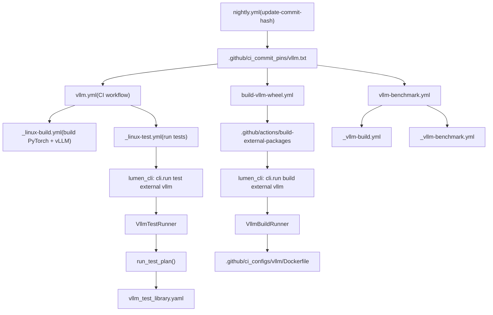
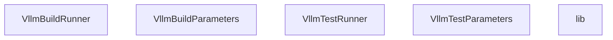
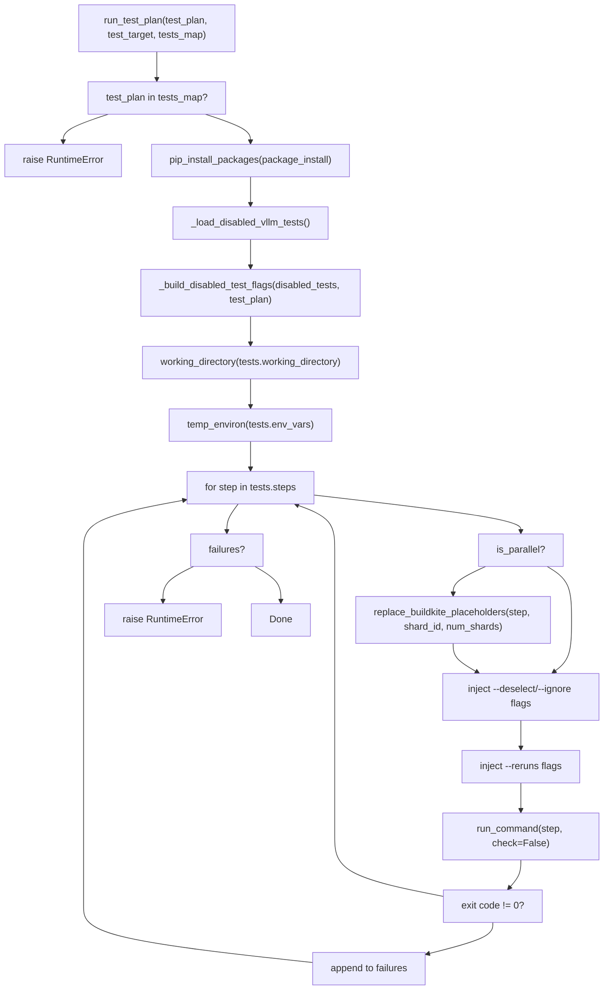

# External Integration: vLLM CI Pipeline

Relevant source files

-   [.ci/lumen\_cli/cli/lib/common/gh\_summary.py](https://github.com/pytorch/pytorch/blob/915982a4/.ci/lumen_cli/cli/lib/common/gh_summary.py)
-   [.ci/lumen\_cli/cli/lib/common/git\_helper.py](https://github.com/pytorch/pytorch/blob/915982a4/.ci/lumen_cli/cli/lib/common/git_helper.py)
-   [.ci/lumen\_cli/cli/lib/common/pip\_helper.py](https://github.com/pytorch/pytorch/blob/915982a4/.ci/lumen_cli/cli/lib/common/pip_helper.py)
-   [.ci/lumen\_cli/cli/lib/core/vllm/disabled\_vllm\_tests.yaml](https://github.com/pytorch/pytorch/blob/915982a4/.ci/lumen_cli/cli/lib/core/vllm/disabled_vllm_tests.yaml)
-   [.ci/lumen\_cli/cli/lib/core/vllm/lib.py](https://github.com/pytorch/pytorch/blob/915982a4/.ci/lumen_cli/cli/lib/core/vllm/lib.py)
-   [.ci/lumen\_cli/cli/lib/core/vllm/vllm\_build.py](https://github.com/pytorch/pytorch/blob/915982a4/.ci/lumen_cli/cli/lib/core/vllm/vllm_build.py)
-   [.ci/lumen\_cli/cli/lib/core/vllm/vllm\_test.py](https://github.com/pytorch/pytorch/blob/915982a4/.ci/lumen_cli/cli/lib/core/vllm/vllm_test.py)
-   [.ci/lumen\_cli/cli/lib/core/vllm/vllm\_test\_library.yaml](https://github.com/pytorch/pytorch/blob/915982a4/.ci/lumen_cli/cli/lib/core/vllm/vllm_test_library.yaml)
-   [.ci/lumen\_cli/cli/test\_cli/register\_test.py](https://github.com/pytorch/pytorch/blob/915982a4/.ci/lumen_cli/cli/test_cli/register_test.py)
-   [.ci/lumen\_cli/tests/test\_run\_plan.py](https://github.com/pytorch/pytorch/blob/915982a4/.ci/lumen_cli/tests/test_run_plan.py)
-   [.circleci/scripts/binary\_linux\_test.sh](https://github.com/pytorch/pytorch/blob/915982a4/.circleci/scripts/binary_linux_test.sh)
-   [.circleci/scripts/binary\_upload.sh](https://github.com/pytorch/pytorch/blob/915982a4/.circleci/scripts/binary_upload.sh)
-   [.github/actions/build-external-packages/action.yml](https://github.com/pytorch/pytorch/blob/915982a4/.github/actions/build-external-packages/action.yml)
-   [.github/ci\_commit\_pins/torchao.txt](https://github.com/pytorch/pytorch/blob/915982a4/.github/ci_commit_pins/torchao.txt)
-   [.github/ci\_commit\_pins/vllm.txt](https://github.com/pytorch/pytorch/blob/915982a4/.github/ci_commit_pins/vllm.txt)
-   [.github/ci\_configs/vllm/Dockerfile](https://github.com/pytorch/pytorch/blob/915982a4/.github/ci_configs/vllm/Dockerfile)
-   [.github/ci\_configs/vllm/use\_existing\_torch.py](https://github.com/pytorch/pytorch/blob/915982a4/.github/ci_configs/vllm/use_existing_torch.py)
-   [.github/merge\_rules.yaml](https://github.com/pytorch/pytorch/blob/915982a4/.github/merge_rules.yaml)
-   [.github/scripts/prepare\_vllm\_wheels.sh](https://github.com/pytorch/pytorch/blob/915982a4/.github/scripts/prepare_vllm_wheels.sh)
-   [.github/workflows/\_binary-upload.yml](https://github.com/pytorch/pytorch/blob/915982a4/.github/workflows/_binary-upload.yml)
-   [.github/workflows/\_vllm-benchmark.yml](https://github.com/pytorch/pytorch/blob/915982a4/.github/workflows/_vllm-benchmark.yml)
-   [.github/workflows/\_vllm-build.yml](https://github.com/pytorch/pytorch/blob/915982a4/.github/workflows/_vllm-build.yml)
-   [.github/workflows/build-vllm-wheel.yml](https://github.com/pytorch/pytorch/blob/915982a4/.github/workflows/build-vllm-wheel.yml)
-   [.github/workflows/nightly.yml](https://github.com/pytorch/pytorch/blob/915982a4/.github/workflows/nightly.yml)
-   [.github/workflows/vllm-benchmark.yml](https://github.com/pytorch/pytorch/blob/915982a4/.github/workflows/vllm-benchmark.yml)
-   [.github/workflows/vllm.yml](https://github.com/pytorch/pytorch/blob/915982a4/.github/workflows/vllm.yml)
-   [test/dynamo\_skips/TestScript.test\_static\_method\_on\_module](https://github.com/pytorch/pytorch/blob/915982a4/test/dynamo_skips/TestScript.test_static_method_on_module)

## Purpose and Scope

This page describes how PyTorch's CI infrastructure integrates with [vLLM](https://github.com/pytorch/pytorch/blob/915982a4/vLLM) the external LLM inference library, for compatibility testing and benchmarking. It covers the commit pin mechanism that tracks a specific vLLM revision, the Docker image construction for building vLLM wheels against PyTorch, the Lumen CLI test orchestration layer, and the benchmark workflows.

This page focuses on CI infrastructure concerns. For general CI/CD workflows and Docker image construction for PyTorch itself, see [CI/CD Workflows and Docker Image Builds](/pytorch/pytorch/5.3-cicd-workflows-and-docker-image-builds). For the binary release pipeline, see [Binary Release Pipeline](/pytorch/pytorch/5.4-binary-release-pipeline).

---

## Architecture Overview

The vLLM integration consists of four loosely coupled subsystems:

**Overall vLLM CI Pipeline**


Sources: [.github/workflows/vllm.yml1-65](https://github.com/pytorch/pytorch/blob/915982a4/.github/workflows/vllm.yml#L1-L65) [.github/workflows/build-vllm-wheel.yml1-60](https://github.com/pytorch/pytorch/blob/915982a4/.github/workflows/build-vllm-wheel.yml#L1-L60) [.github/workflows/vllm-benchmark.yml1-124](https://github.com/pytorch/pytorch/blob/915982a4/.github/workflows/vllm-benchmark.yml#L1-L124) [.github/workflows/\_vllm-build.yml1-126](https://github.com/pytorch/pytorch/blob/915982a4/.github/workflows/_vllm-build.yml#L1-L126) [.github/workflows/\_vllm-benchmark.yml1-230](https://github.com/pytorch/pytorch/blob/915982a4/.github/workflows/_vllm-benchmark.yml#L1-L230)

---

## Commit Pin Mechanism

The file [.github/ci\_commit\_pins/vllm.txt1-2](https://github.com/pytorch/pytorch/blob/915982a4/.github/ci_commit_pins/vllm.txt#L1-L2) holds a single git commit SHA for the vLLM repository. All CI workflows that check out vLLM read from this file to ensure reproducibility.

```
8b5014d3dd343736ccf3e26cd44a0bb7700d205c
```
**How the pin is read** (from `_vllm-build.yml` and `_vllm-benchmark.yml`):

```
VLLM_PINNED_COMMIT=$(cat .github/ci_commit_pins/vllm.txt)
```
Then used as a checkout ref:

```
ref: ${{ steps.vllm-pinned-commit.outputs.commit }}
```
**How the pin is updated**: The `nightly.yml` workflow runs nightly via cron and calls the `pytorch/test-infra` `update-commit-hash` action for the `vllm-project/vllm` repo, targeting its `main` branch. This creates a PR updating `vllm.txt`.

[.github/workflows/nightly.yml89-104](https://github.com/pytorch/pytorch/blob/915982a4/.github/workflows/nightly.yml#L89-L104)

**Merge rules**: The `.github/merge_rules.yaml` file grants `pytorchbot` auto-merge permission for changes to `.github/ci_commit_pins/vllm.txt`, with `inductor` as a required check.

[.github/merge\_rules.yaml74-88](https://github.com/pytorch/pytorch/blob/915982a4/.github/merge_rules.yaml#L74-L88)

**Pin lifecycle diagram:**

> **[Mermaid sequence]**
> *(图表结构无法解析)*

Sources: [.github/workflows/nightly.yml66-104](https://github.com/pytorch/pytorch/blob/915982a4/.github/workflows/nightly.yml#L66-L104) [.github/ci\_commit\_pins/vllm.txt1-2](https://github.com/pytorch/pytorch/blob/915982a4/.github/ci_commit_pins/vllm.txt#L1-L2) [.github/merge\_rules.yaml74-88](https://github.com/pytorch/pytorch/blob/915982a4/.github/merge_rules.yaml#L74-L88) [.ci/lumen\_cli/cli/lib/common/git\_helper.py65-69](https://github.com/pytorch/pytorch/blob/915982a4/.ci/lumen_cli/cli/lib/common/git_helper.py#L65-L69)

---

## Docker Image Construction

### Dockerfile Stages

The Dockerfile at [.github/ci\_configs/vllm/Dockerfile1-285](https://github.com/pytorch/pytorch/blob/915982a4/.github/ci_configs/vllm/Dockerfile#L1-L285) defines a multi-stage build. Each stage has a distinct responsibility.

| Stage | `FROM` base | Purpose |
| --- | --- | --- |
| `torch-nightly-base` | `nvidia/cuda:${CUDA_VERSION}-devel-ubuntu22.04` | Install system deps, GCC 10, Python venv, `uv` |
| `base` | `${BUILD_BASE_IMAGE}` | Install PyTorch wheels (local, pinned nightly, or latest nightly) |
| `build` | `base` | Compile vLLM wheel via `python setup.py bdist_wheel` |
| `vllm-base` | `${FINAL_BASE_IMAGE}` | Install final torch + built vLLM wheel |
| `export-wheels` | `scratch` | Export-only: copies `.whl` and `build_summary.txt` |

**PyTorch installation logic (in `base` stage)**: The Dockerfile selects among three strategies based on build args:

1.  If `TORCH_WHEELS_PATH` points to local `.whl` files → install from local directory
2.  Else if `PINNED_TORCH_VERSION` is set → install that specific nightly version
3.  Otherwise → install latest torch nightly from `download.pytorch.org/whl/nightly/cu*`

[.github/ci\_configs/vllm/Dockerfile95-109](https://github.com/pytorch/pytorch/blob/915982a4/.github/ci_configs/vllm/Dockerfile#L95-L109)

**Wheel repackaging**: After the Docker build, `prepare_vllm_wheels.sh` renames the wheel to use a nightly version number, adds a `Requires-Dist: torch==${torch_version}` dependency, recomputes the RECORD hash, and runs `auditwheel repair` to make the wheel manylinux-compliant.

[.github/scripts/prepare\_vllm\_wheels.sh1-94](https://github.com/pytorch/pytorch/blob/915982a4/.github/scripts/prepare_vllm_wheels.sh#L1-L94)

**Key environment variables for the `build` stage:**

| Variable | Default | Description |
| --- | --- | --- |
| `TORCH_CUDA_ARCH_LIST` | `8.0;8.9;9.0;10.0;12.0` | CUDA architectures compiled into vLLM kernels |
| `MAX_JOBS` | `16` | Parallel compile jobs |
| `NVCC_THREADS` | `8` | NVCC threads |
| `USE_SCCACHE` | `0` | Enable sccache for kernel compilation caching |
| `VLLM_TARGET_DEVICE` | `cuda` | Target device for vLLM build |

Sources: [.github/ci\_configs/vllm/Dockerfile139-189](https://github.com/pytorch/pytorch/blob/915982a4/.github/ci_configs/vllm/Dockerfile#L139-L189) [.github/scripts/prepare\_vllm\_wheels.sh1-94](https://github.com/pytorch/pytorch/blob/915982a4/.github/scripts/prepare_vllm_wheels.sh#L1-L94)

---

## CI Workflows

### Main Test Workflow: `vllm.yml`

The workflow at [.github/workflows/vllm.yml1-65](https://github.com/pytorch/pytorch/blob/915982a4/.github/workflows/vllm.yml#L1-L65) is the primary integration test workflow. It triggers on:

-   Push to `main` or `release/*` branches
-   Tags matching `ciflow/vllm/*`
-   Manual `workflow_dispatch`

It runs two jobs sequentially:

1.  **`build` job** (`vllm-x-pytorch-build`): Delegates to `_linux-build.yml` with `build-external-packages: "vllm"`, running on a `linux.24xlarge.memory` runner. This produces a Docker image containing both PyTorch and vLLM wheels.

2.  **`test` job** (`vllm-x-pytorch-test`): Delegates to `_linux-test.yml` using the Docker image from the build job. It fans out across the test matrix below.


**Test matrix** (from `vllm.yml`):

| Config | Shards | Runner |
| --- | --- | --- |
| `vllm_basic_correctness_test` | 1/1 | `linux.g6.4xlarge.experimental.nvidia.gpu` |
| `vllm_basic_models_test` | 1/1 | `linux.g6.4xlarge.experimental.nvidia.gpu` |
| `vllm_entrypoints_test` | 1/1 | `linux.g6.4xlarge.experimental.nvidia.gpu` |
| `vllm_regression_test` | 1/1 | `linux.g6.4xlarge.experimental.nvidia.gpu` |
| `vllm_multi_model_processor_test` | 1/1 | `linux.g6.4xlarge.experimental.nvidia.gpu` |
| `vllm_pytorch_compilation_unit_tests` | 1/1 | `linux.g6.4xlarge.experimental.nvidia.gpu` |
| `vllm_pytorch_compilation_unit_tests` | 1/1 | `linux.dgx.b200` |
| `vllm_lora_test` | 0-3/4 | `linux.g6.4xlarge.experimental.nvidia.gpu` |
| `vllm_lora_tp_test_distributed` | 1/1 | `linux.g6.12xlarge.nvidia.gpu` |
| `vllm_distributed_test_28_failure_test` | 1/1 | `linux.g6.12xlarge.nvidia.gpu` |
| Various `*_28_failure_test` configs | 1/1 | `linux.g6.4xlarge.experimental.nvidia.gpu` |

Sources: [.github/workflows/vllm.yml34-65](https://github.com/pytorch/pytorch/blob/915982a4/.github/workflows/vllm.yml#L34-L65)

### Wheel Build Workflow: `build-vllm-wheel.yml`

[.github/workflows/build-vllm-wheel.yml1-257](https://github.com/pytorch/pytorch/blob/915982a4/.github/workflows/build-vllm-wheel.yml#L1-L257) builds standalone vLLM wheels against PyTorch nightly, without running tests. It triggers:

-   On push to `main` when `vllm.yml` or `vllm.txt` changes
-   On schedule at 01:30 UTC daily
-   On PRs touching these files
-   On `workflow_dispatch`

Build matrix:

| Platform | CUDA versions | Runner |
| --- | --- | --- |
| `manylinux_2_28_x86_64` | cu128, cu129, cu130 | `linux.12xlarge.memory` |
| `manylinux_2_28_aarch64` | cu128, cu129 | `linux.arm64.r7g.12xlarge.memory` |

Wheels are uploaded to S3 (`s3://pytorch`) and optionally Cloudflare R2 via `binary_upload.sh`.

Sources: [.github/workflows/build-vllm-wheel.yml23-257](https://github.com/pytorch/pytorch/blob/915982a4/.github/workflows/build-vllm-wheel.yml#L23-L257) [.circleci/scripts/binary\_upload.sh1-132](https://github.com/pytorch/pytorch/blob/915982a4/.circleci/scripts/binary_upload.sh#L1-L132)

---

## Lumen CLI: Test and Build Orchestration

The Lumen CLI (`lumen_cli`) is an internal Python tool under `.ci/lumen_cli/`. It provides `cli.run build external vllm` and `cli.run test external vllm` entry points.

**Code entity map for Lumen CLI vLLM subsystem:**


Sources: [.ci/lumen\_cli/cli/lib/core/vllm/vllm\_build.py1-297](https://github.com/pytorch/pytorch/blob/915982a4/.ci/lumen_cli/cli/lib/core/vllm/vllm_build.py#L1-L297) [.ci/lumen\_cli/cli/lib/core/vllm/vllm\_test.py1-283](https://github.com/pytorch/pytorch/blob/915982a4/.ci/lumen_cli/cli/lib/core/vllm/vllm_test.py#L1-L283) [.ci/lumen\_cli/cli/lib/core/vllm/lib.py1-289](https://github.com/pytorch/pytorch/blob/915982a4/.ci/lumen_cli/cli/lib/core/vllm/lib.py#L1-L289)

### Build Flow (`VllmBuildRunner`)

`VllmBuildRunner.run()` executes the following steps:

1.  **Clone vLLM** at the pinned commit via `clone_vllm()` → `clone_external_repo()`, which reads `.github/ci_commit_pins/vllm.txt`
2.  **Copy `use_existing_torch.py`** from `.github/ci_configs/vllm/use_existing_torch.py` into the vLLM workspace. This script removes all `torch`/`torchvision`/`torchaudio` lines from vLLM's requirements files to prevent pip from overwriting the already-installed PyTorch build.
3.  **Copy `Dockerfile`** from `.github/ci_configs/vllm/Dockerfile` into `vllm/docker/Dockerfile.nightly_torch`
4.  **Copy torch wheels** into `vllm/tmp/` if `use_torch_whl=True`
5.  **Run `docker buildx build`** targeting the `export-wheels` stage, writing output to `${output_dir}`

[.ci/lumen\_cli/cli/lib/core/vllm/vllm\_build.py157-182](https://github.com/pytorch/pytorch/blob/915982a4/.ci/lumen_cli/cli/lib/core/vllm/vllm_build.py#L157-L182)

**Docker build command generation** (`_generate_docker_build_cmd`):

The command is assembled with `--build-arg` flags for `CUDA_VERSION`, `PYTHON_VERSION`, `TORCH_WHEELS_PATH`, `BUILD_BASE_IMAGE`, `FINAL_BASE_IMAGE`, `torch_cuda_arch_list`, and optionally `USE_SCCACHE` with bucket/region settings.

[.ci/lumen\_cli/cli/lib/core/vllm/vllm\_build.py267-296](https://github.com/pytorch/pytorch/blob/915982a4/.ci/lumen_cli/cli/lib/core/vllm/vllm_build.py#L267-L296)

### Test Flow (`VllmTestRunner`)

`VllmTestRunner.run()` executes:

1.  **`prepare()`**:
    -   Clone vLLM at pinned commit
    -   Copy `use_existing_torch.py` cleaning script
    -   Install PyTorch wheels from `torch_whls_path`
    -   Install vLLM wheels from `vllm_whls_path`
    -   Run `use_existing_torch.py` to strip torch from vLLM requirements
    -   Install `requirements/common.txt` and `requirements/build.txt`
    -   Resolve test dependencies via `uv pip compile` with constraint pinning
2.  **Run test plan** via `run_test_plan()` from `lib.py`

[.ci/lumen\_cli/cli/lib/core/vllm/vllm\_test.py88-130](https://github.com/pytorch/pytorch/blob/915982a4/.ci/lumen_cli/cli/lib/core/vllm/vllm_test.py#L88-L130)

---

## Test Library: `vllm_test_library.yaml`

The file [.ci/lumen\_cli/cli/lib/core/vllm/vllm\_test\_library.yaml1-129](https://github.com/pytorch/pytorch/blob/915982a4/.ci/lumen_cli/cli/lib/core/vllm/vllm_test_library.yaml#L1-L129) defines all available test plans. Each entry contains:

| Field | Type | Description |
| --- | --- | --- |
| `title` | `str` | Human-readable name |
| `id` | `str` | Identifier used in workflow matrix |
| `steps` | `list[str]` | Shell commands (usually `pytest` invocations) |
| `env_vars` | `dict` | Environment variables set for all steps |
| `package_install` | `list[str]` | Extra pip packages to install before testing |
| `num_gpus` | `int` | Minimum GPU count required |
| `parallelism` | `int` | If > 1, the test is sharded |
| `working_directory` | `str` | Working directory (default: `tests`) |

**Available test plans summary:**

| Plan ID | Title | GPU Count | Shards |
| --- | --- | --- | --- |
| `vllm_basic_correctness_test` | Basic Correctness Test | 1 | 1 |
| `vllm_basic_models_test` | Basic models test | 1 | 1 |
| `vllm_entrypoints_test` | Entrypoints Test | 1 | 1 |
| `vllm_regression_test` | Regression Test | 1 | 1 |
| `vllm_lora_tp_test_distributed` | LoRA TP Test (Distributed) | 4 | 1 |
| `vllm_multi_model_processor_test` | Multi-Modal Processor Test | 1 | 1 |
| `vllm_pytorch_compilation_unit_tests` | PyTorch Compilation Unit Tests | 1 | 1 |
| `lora_test` | LoRA Test | 1 | 4 |

Sources: [.ci/lumen\_cli/cli/lib/core/vllm/vllm\_test\_library.yaml1-129](https://github.com/pytorch/pytorch/blob/915982a4/.ci/lumen_cli/cli/lib/core/vllm/vllm_test_library.yaml#L1-L129)

### `run_test_plan` Execution Flow

The function `run_test_plan()` in [.ci/lumen\_cli/cli/lib/core/vllm/lib.py181-259](https://github.com/pytorch/pytorch/blob/915982a4/.ci/lumen_cli/cli/lib/core/vllm/lib.py#L181-L259) orchestrates a test plan:


Key behaviors:

-   All steps are run regardless of prior failures (no early exit); failures are aggregated
-   `pytest` commands get `--reruns` and `--reruns-delay` flags injected (via `pytest-rerunfailures`)
-   Default: `VLLM_RERUN_FAILURES_COUNT=2`, `VLLM_RERUN_FAILURES_DELAY=10`

Sources: [.ci/lumen\_cli/cli/lib/core/vllm/lib.py181-259](https://github.com/pytorch/pytorch/blob/915982a4/.ci/lumen_cli/cli/lib/core/vllm/lib.py#L181-L259)

---

## Disabled Test Mechanism

Tests can be disabled without modifying `vllm_test_library.yaml` via two sources that are merged together.

### Source 1: Static YAML file

[.ci/lumen\_cli/cli/lib/core/vllm/disabled\_vllm\_tests.yaml1-22](https://github.com/pytorch/pytorch/blob/915982a4/.ci/lumen_cli/cli/lib/core/vllm/disabled_vllm_tests.yaml#L1-L22) — checked into the repo. Each entry requires `test` (node ID relative to vLLM's `tests/`) and `issue` (tracking URL). An optional `configs` list restricts the entry to specific test plan IDs.

```
disabled_tests:  - test: basic_correctness/test_basic_correctness.py::test_something    issue: https://github.com/pytorch/pytorch/issues/12345    configs:      - vllm_basic_correctness_test
```
### Source 2: GitHub issue body

`_load_disabled_vllm_tests_from_github()` fetches issue #`_DISABLED_VLLM_TESTS_ISSUE` (currently `175899`) from the pytorch/pytorch repository. It parses a ` ```yaml ``` ` code block in the issue body using `_parse_disabled_tests_from_issue_body()`. This allows disabling tests dynamically without a code commit.

[.ci/lumen\_cli/cli/lib/core/vllm/lib.py95-162](https://github.com/pytorch/pytorch/blob/915982a4/.ci/lumen_cli/cli/lib/core/vllm/lib.py#L95-L162)

### Flag generation

`_build_disabled_test_flags()` converts entries to pytest flags:

| Node ID format | Generated flag |
| --- | --- |
| `path/to/file.py::test_name` | `--deselect=path/to/file.py::test_name` |
| `path/to/file.py` | `--ignore=path/to/file.py` |

Deduplication: YAML entries take precedence over GitHub issue entries with the same `test` key.

[.ci/lumen\_cli/cli/lib/core/vllm/lib.py153-178](https://github.com/pytorch/pytorch/blob/915982a4/.ci/lumen_cli/cli/lib/core/vllm/lib.py#L153-L178)

---

## Benchmark Workflows

### Orchestration: `vllm-benchmark.yml`

[.github/workflows/vllm-benchmark.yml1-124](https://github.com/pytorch/pytorch/blob/915982a4/.github/workflows/vllm-benchmark.yml#L1-L124) is triggered on `workflow_dispatch` or daily at 5:15 AM PST. It has three jobs:

1.  **`set-parameters`**: Uses `pytorch-integration-testing` repo to generate a benchmark matrix (grouped by model and runner) via `generate_vllm_benchmark_matrix.py`.

2.  **`build`**: Calls `_vllm-build.yml` to build both PyTorch and vLLM from source.

3.  **`benchmarks`**: Fans out across the matrix, calling `_vllm-benchmark.yml` per (runner, model) combination.


**Benchmark execution in `_vllm-benchmark.yml`:**

The reusable workflow at [.github/workflows/\_vllm-benchmark.yml1-230](https://github.com/pytorch/pytorch/blob/915982a4/.github/workflows/_vllm-benchmark.yml#L1-L230) runs inside a GPU Docker container and:

1.  Checks out PyTorch at the specified commit/branch
2.  Reads `vllm.txt` to get the pinned vLLM commit
3.  Checks out vLLM at the pinned commit
4.  Downloads pre-built wheel artifacts from S3 (`gha-artifacts` bucket)
5.  Installs `torch`, `torchvision`, `torchaudio`, `torchao`, `vllm`, and `deep_gemm` wheels
6.  Clones `pytorch/pytorch-integration-testing` for benchmark config management
7.  Calls `setup_vllm_benchmark.py` to populate vLLM's `.buildkite/performance-benchmarks/tests/`
8.  Runs `run-performance-benchmarks.sh` with `ENGINE_VERSION=v1` and `SAVE_TO_PYTORCH_BENCHMARK_FORMAT=1`
9.  Validates results with `check_benchmark_results.py --strict`
10.  Uploads results to AWS S3 benchmark database via `upload-benchmark-results` action

Sources: [.github/workflows/vllm-benchmark.yml37-124](https://github.com/pytorch/pytorch/blob/915982a4/.github/workflows/vllm-benchmark.yml#L37-L124) [.github/workflows/\_vllm-benchmark.yml43-229](https://github.com/pytorch/pytorch/blob/915982a4/.github/workflows/_vllm-benchmark.yml#L43-L229)

---

## Supporting Utilities

### `use_existing_torch.py`

[.github/ci\_configs/vllm/use\_existing\_torch.py1-22](https://github.com/pytorch/pytorch/blob/915982a4/.github/ci_configs/vllm/use_existing_torch.py#L1-L22) is a small script copied into vLLM's workspace before dependency installation. It strips every line containing `torch` (case-insensitive) from all `requirements/*.txt` files and `pyproject.toml`. This prevents pip from downgrading the PyTorch build installed from the CI-built wheels.

### `clone_vllm()` and `get_post_build_pinned_commit()`

`clone_vllm()` in `lib.py` delegates to `clone_external_repo()` in `git_helper.py`:

[.ci/lumen\_cli/cli/lib/common/git\_helper.py34-69](https://github.com/pytorch/pytorch/blob/915982a4/.ci/lumen_cli/cli/lib/common/git_helper.py#L34-L69)

`get_post_build_pinned_commit("vllm")` reads `.github/ci_commit_pins/vllm.txt` to obtain the commit SHA for checkout.

### `summarize_build_info()`

[.ci/lumen\_cli/cli/lib/core/vllm/lib.py282-288](https://github.com/pytorch/pytorch/blob/915982a4/.ci/lumen_cli/cli/lib/core/vllm/lib.py#L282-L288) renders a GitHub Actions step summary with the vLLM commit SHA (with link to `vllm-project/vllm`) and PyTorch commit SHA (from `GITHUB_SHA` env var). Uses the `_TPL_VLLM_INFO` Jinja2 template defined at [.ci/lumen\_cli/cli/lib/core/vllm/lib.py47-55](https://github.com/pytorch/pytorch/blob/915982a4/.ci/lumen_cli/cli/lib/core/vllm/lib.py#L47-L55)

---

## End-to-End Flow Summary

**vllm.yml CI run (push to `main`):**

> **[Mermaid sequence]**
> *(图表结构无法解析)*

Sources: [.github/workflows/vllm.yml1-65](https://github.com/pytorch/pytorch/blob/915982a4/.github/workflows/vllm.yml#L1-L65) [.github/workflows/\_vllm-build.yml1-126](https://github.com/pytorch/pytorch/blob/915982a4/.github/workflows/_vllm-build.yml#L1-L126) [.ci/lumen\_cli/cli/lib/core/vllm/vllm\_build.py157-182](https://github.com/pytorch/pytorch/blob/915982a4/.ci/lumen_cli/cli/lib/core/vllm/vllm_build.py#L157-L182) [.ci/lumen\_cli/cli/lib/core/vllm/vllm\_test.py88-130](https://github.com/pytorch/pytorch/blob/915982a4/.ci/lumen_cli/cli/lib/core/vllm/vllm_test.py#L88-L130) [.ci/lumen\_cli/cli/lib/core/vllm/lib.py181-259](https://github.com/pytorch/pytorch/blob/915982a4/.ci/lumen_cli/cli/lib/core/vllm/lib.py#L181-L259)
