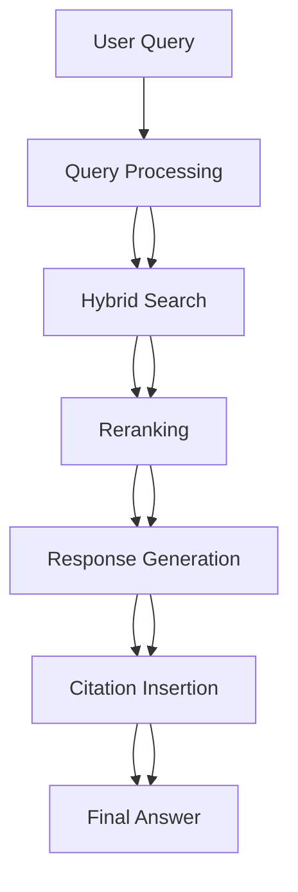
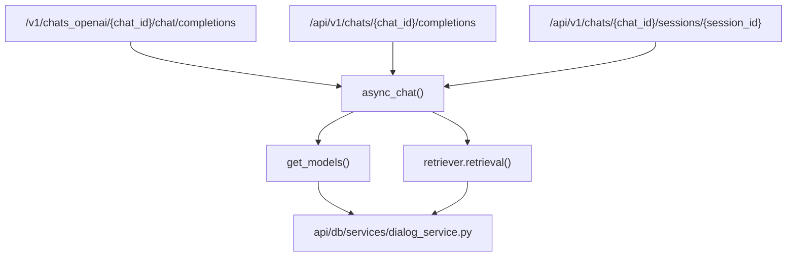
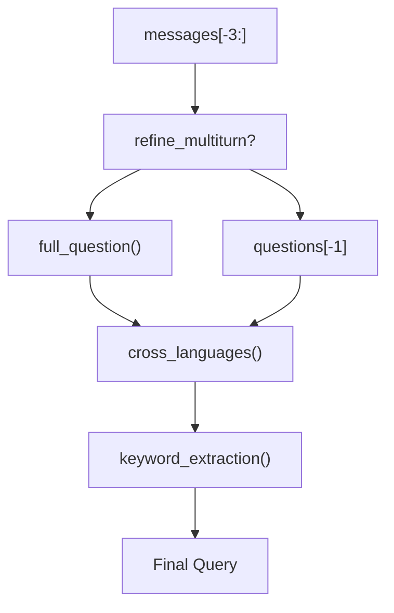
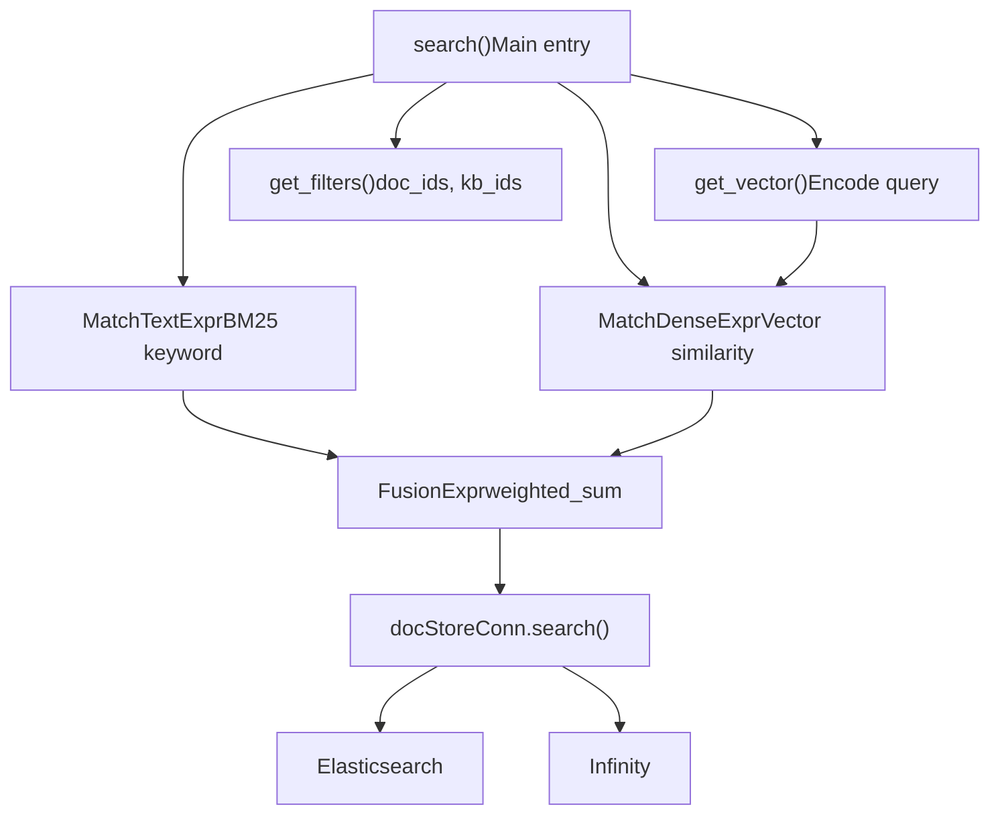
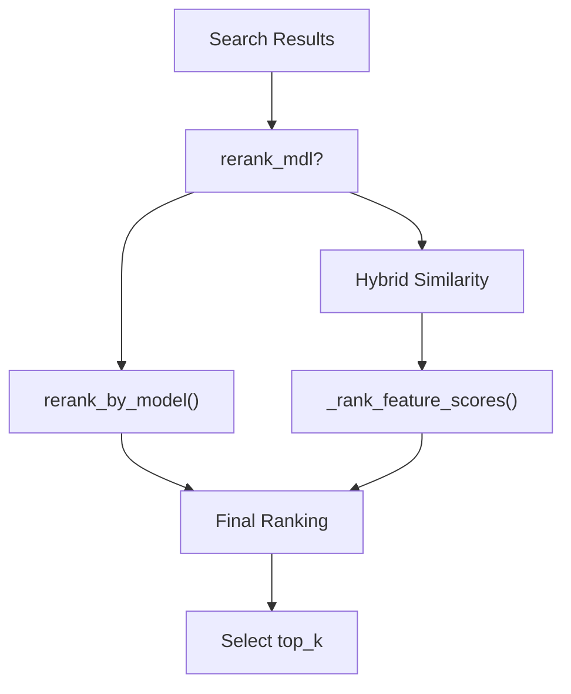
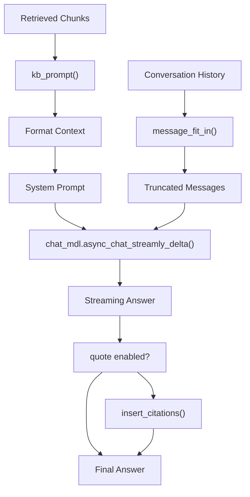
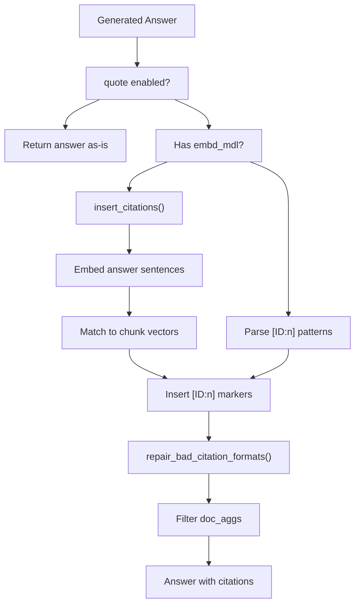
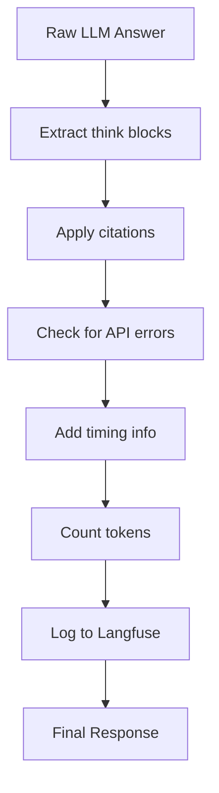

# Retrieval and RAG System

Relevant source files

-   [agent/tools/retrieval.py](https://github.com/infiniflow/ragflow/blob/80a16e71/agent/tools/retrieval.py)
-   [api/apps/chunk\_app.py](https://github.com/infiniflow/ragflow/blob/80a16e71/api/apps/chunk_app.py)
-   [api/apps/conversation\_app.py](https://github.com/infiniflow/ragflow/blob/80a16e71/api/apps/conversation_app.py)
-   [api/apps/document\_app.py](https://github.com/infiniflow/ragflow/blob/80a16e71/api/apps/document_app.py)
-   [api/apps/file2document\_app.py](https://github.com/infiniflow/ragflow/blob/80a16e71/api/apps/file2document_app.py)
-   [api/apps/file\_app.py](https://github.com/infiniflow/ragflow/blob/80a16e71/api/apps/file_app.py)
-   [api/apps/kb\_app.py](https://github.com/infiniflow/ragflow/blob/80a16e71/api/apps/kb_app.py)
-   [api/apps/sdk/chat.py](https://github.com/infiniflow/ragflow/blob/80a16e71/api/apps/sdk/chat.py)
-   [api/apps/sdk/dataset.py](https://github.com/infiniflow/ragflow/blob/80a16e71/api/apps/sdk/dataset.py)
-   [api/apps/sdk/dify\_retrieval.py](https://github.com/infiniflow/ragflow/blob/80a16e71/api/apps/sdk/dify_retrieval.py)
-   [api/apps/sdk/doc.py](https://github.com/infiniflow/ragflow/blob/80a16e71/api/apps/sdk/doc.py)
-   [api/apps/sdk/session.py](https://github.com/infiniflow/ragflow/blob/80a16e71/api/apps/sdk/session.py)
-   [api/db/db\_models.py](https://github.com/infiniflow/ragflow/blob/80a16e71/api/db/db_models.py)
-   [api/db/services/canvas\_service.py](https://github.com/infiniflow/ragflow/blob/80a16e71/api/db/services/canvas_service.py)
-   [api/db/services/conversation\_service.py](https://github.com/infiniflow/ragflow/blob/80a16e71/api/db/services/conversation_service.py)
-   [api/db/services/dialog\_service.py](https://github.com/infiniflow/ragflow/blob/80a16e71/api/db/services/dialog_service.py)
-   [api/db/services/document\_service.py](https://github.com/infiniflow/ragflow/blob/80a16e71/api/db/services/document_service.py)
-   [api/db/services/file\_service.py](https://github.com/infiniflow/ragflow/blob/80a16e71/api/db/services/file_service.py)
-   [api/db/services/knowledgebase\_service.py](https://github.com/infiniflow/ragflow/blob/80a16e71/api/db/services/knowledgebase_service.py)
-   [api/db/services/task\_service.py](https://github.com/infiniflow/ragflow/blob/80a16e71/api/db/services/task_service.py)
-   [api/utils/api\_utils.py](https://github.com/infiniflow/ragflow/blob/80a16e71/api/utils/api_utils.py)
-   [docs/references/http\_api\_reference.md](https://github.com/infiniflow/ragflow/blob/80a16e71/docs/references/http_api_reference.md)
-   [docs/references/python\_api\_reference.md](https://github.com/infiniflow/ragflow/blob/80a16e71/docs/references/python_api_reference.md)
-   [docs/release\_notes.md](https://github.com/infiniflow/ragflow/blob/80a16e71/docs/release_notes.md)
-   [rag/advanced\_rag/\_\_init\_\_.py](https://github.com/infiniflow/ragflow/blob/80a16e71/rag/advanced_rag/__init__.py)
-   [rag/benchmark.py](https://github.com/infiniflow/ragflow/blob/80a16e71/rag/benchmark.py)
-   [rag/nlp/search.py](https://github.com/infiniflow/ragflow/blob/80a16e71/rag/nlp/search.py)
-   [rag/svr/task\_executor.py](https://github.com/infiniflow/ragflow/blob/80a16e71/rag/svr/task_executor.py)
-   [sdk/python/ragflow\_sdk/modules/chat.py](https://github.com/infiniflow/ragflow/blob/80a16e71/sdk/python/ragflow_sdk/modules/chat.py)
-   [sdk/python/ragflow\_sdk/ragflow.py](https://github.com/infiniflow/ragflow/blob/80a16e71/sdk/python/ragflow_sdk/ragflow.py)

## Purpose and Scope

This document describes RAGFlow's Retrieval-Augmented Generation (RAG) system, which processes user queries, retrieves relevant knowledge chunks from indexed documents, reranks results, and generates grounded responses with citations. The system implements hybrid search combining vector similarity and BM25 keyword matching, sophisticated reranking strategies, and automatic citation insertion.

For information about document processing and indexing that precedes retrieval, see [Document Processing Pipeline](/infiniflow/ragflow/6-document-processing-pipeline). For agent-based retrieval workflows, see [Agent and Workflow System](/infiniflow/ragflow/9-agent-and-workflow-system). For the HTTP and SDK interfaces to the RAG system, see [Backend API System](/infiniflow/ragflow/8-backend-api-system).

## System Architecture Overview

The RAG pipeline executes the following stages:


**Retrieval-Augmented Generation Pipeline**

The system coordinates multiple subsystems:

-   **Query Processing**: Translates queries, refines multi-turn context, extracts keywords
-   **Hybrid Search**: Combines vector embeddings and BM25 text matching via weighted fusion
-   **Reranking**: Uses rerank models or hybrid similarity scoring to prioritize chunks
-   **Response Generation**: Formats context, calls LLM with system prompts
-   **Citation Insertion**: Embeds references into the generated answer

Sources: [api/db/services/dialog\_service.py275-583](https://github.com/infiniflow/ragflow/blob/80a16e71/api/db/services/dialog_service.py#L275-L583) [rag/nlp/search.py37-172](https://github.com/infiniflow/ragflow/blob/80a16e71/rag/nlp/search.py#L37-L172)

## Entry Points and API Flow

The RAG system is invoked through multiple interfaces:


**RAG System Entry Points**

The primary entry point is `async_chat()` in [api/db/services/dialog\_service.py275](https://github.com/infiniflow/ragflow/blob/80a16e71/api/db/services/dialog_service.py#L275-L275) which orchestrates the entire pipeline. It is called from:

-   OpenAI-compatible endpoint: [api/apps/sdk/session.py180-436](https://github.com/infiniflow/ragflow/blob/80a16e71/api/apps/sdk/session.py#L180-L436)
-   Native SDK endpoint: [api/apps/sdk/session.py129-177](https://github.com/infiniflow/ragflow/blob/80a16e71/api/apps/sdk/session.py#L129-L177)
-   Web UI endpoint: [api/apps/conversation\_app.py137-194](https://github.com/infiniflow/ragflow/blob/80a16e71/api/apps/conversation_app.py#L137-L194)

Sources: [api/db/services/dialog\_service.py275-583](https://github.com/infiniflow/ragflow/blob/80a16e71/api/db/services/dialog_service.py#L275-L583) [api/apps/sdk/session.py180-436](https://github.com/infiniflow/ragflow/blob/80a16e71/api/apps/sdk/session.py#L180-L436)

## Query Processing and Refinement

Before retrieval, the system refines user queries through multiple transformations:

### Multi-Turn Question Refinement


**Query Refinement Pipeline**

The refinement process:

1.  **Multi-Turn Context** ([api/db/services/dialog\_service.py349-352](https://github.com/infiniflow/ragflow/blob/80a16e71/api/db/services/dialog_service.py#L349-L352)):

    -   Extracts last 3 user messages from conversation history
    -   If `prompt_config.get("refine_multiturn")` is enabled, calls `full_question()` to condense context
    -   Otherwise uses only the last question
2.  **Cross-Language Translation** ([api/db/services/dialog\_service.py354-355](https://github.com/infiniflow/ragflow/blob/80a16e71/api/db/services/dialog_service.py#L354-L355)):

    -   If `prompt_config.get("cross_languages")` is set, translates query to target languages
    -   Implementation in [rag/prompts/generator.py](https://github.com/infiniflow/ragflow/blob/80a16e71/rag/prompts/generator.py) using `cross_languages()` function
3.  **Keyword Extraction** ([api/db/services/dialog\_service.py367-368](https://github.com/infiniflow/ragflow/blob/80a16e71/api/db/services/dialog_service.py#L367-L368)):

    -   If `prompt_config.get("keyword")` is true, appends extracted keywords to query
    -   Uses LLM-based keyword extraction via `keyword_extraction(chat_mdl, questions[-1])`
4.  **Metadata Filtering** ([api/db/services/dialog\_service.py357-365](https://github.com/infiniflow/ragflow/blob/80a16e71/api/db/services/dialog_service.py#L357-L365)):

    -   Applies `dialog.meta_data_filter` to pre-filter documents
    -   Calls `apply_meta_data_filter()` to convert filter expressions to document IDs
    -   Restricts retrieval to matching `attachments` list

Sources: [api/db/services/dialog\_service.py349-368](https://github.com/infiniflow/ragflow/blob/80a16e71/api/db/services/dialog_service.py#L349-L368) [rag/prompts/generator.py](https://github.com/infiniflow/ragflow/blob/80a16e71/rag/prompts/generator.py)

## Hybrid Search Architecture

The `Dealer` class in [rag/nlp/search.py37](https://github.com/infiniflow/ragflow/blob/80a16e71/rag/nlp/search.py#L37-L37) implements hybrid search combining vector and keyword retrieval:


**Dealer Hybrid Search Architecture**

### Vector Search

The `get_vector()` method ([rag/nlp/search.py53-61](https://github.com/infiniflow/ragflow/blob/80a16e71/rag/nlp/search.py#L53-L61)):

-   Encodes query text using `emb_mdl.encode_queries(txt)`
-   Creates `MatchDenseExpr` with vector column name `q_{len}_vec`
-   Parameters: `topk`, similarity threshold (default 0.1)
-   Returns embedding data as float array

### Keyword Search

The `search()` method constructs `MatchTextExpr` ([rag/nlp/search.py115](https://github.com/infiniflow/ragflow/blob/80a16e71/rag/nlp/search.py#L115-L115)):

-   Uses `self.qryr.question(qst, min_match=0.3)` to tokenize query
-   Generates BM25-based keyword matching expression
-   Highlights fields: `content_ltks`, `title_tks`

### Fusion Strategy

The `FusionExpr` combines both modalities ([rag/nlp/search.py128-129](https://github.com/infiniflow/ragflow/blob/80a16e71/rag/nlp/search.py#L128-L129)):

-   Formula: `weighted_sum` with weights `"0.05,0.95"` (5% keyword, 95% vector)
-   Configured via `FusionExpr("weighted_sum", topk, {"weights": "0.05,0.95"})`
-   Adjustable through dialog settings: `vector_similarity_weight`, `similarity_threshold`

### Fallback Strategy

If no results found, the system retries with relaxed parameters ([rag/nlp/search.py136-148](https://github.com/infiniflow/ragflow/blob/80a16e71/rag/nlp/search.py#L136-L148)):

-   Reduces `min_match` from 0.3 to 0.1
-   Lowers similarity threshold from 0.1 to 0.17
-   If `doc_id` filter present, searches without text/vector matching

Sources: [rag/nlp/search.py37-172](https://github.com/infiniflow/ragflow/blob/80a16e71/rag/nlp/search.py#L37-L172) [api/db/services/dialog\_service.py417-430](https://github.com/infiniflow/ragflow/blob/80a16e71/api/db/services/dialog_service.py#L417-L430)

## Retrieval Method Invocation

The retrieval call from `async_chat()`:

```
# From api/db/services/dialog_service.py:417-430
kbinfos = await retriever.retrieval(
    " ".join(questions),
    embd_mdl,
    tenant_ids,
    dialog.kb_ids,
    1,                              # page
    dialog.top_n,                   # page_size
    dialog.similarity_threshold,
    dialog.vector_similarity_weight,
    doc_ids=attachments,
    top=dialog.top_k,
    aggs=True,
    rerank_mdl=rerank_mdl,
    rank_feature=label_question(" ".join(questions), kbs),
)
```
Parameters:

-   `top_n`: Number of chunks to retrieve (default: from dialog settings)
-   `top_k`: Final number after reranking
-   `similarity_threshold`: Minimum vector similarity (0.0-1.0)
-   `vector_similarity_weight`: Balance between vector/keyword (0.0-1.0)
-   `rank_feature`: Tag-based ranking scores from `label_question()`

The retrieval returns `kbinfos` dict containing:

-   `chunks`: List of retrieved chunk dictionaries
-   `doc_aggs`: Document-level aggregations with counts
-   `total`: Total matching chunks

Sources: [api/db/services/dialog\_service.py417-430](https://github.com/infiniflow/ragflow/blob/80a16e71/api/db/services/dialog_service.py#L417-L430) [rag/app/tag.py](https://github.com/infiniflow/ragflow/blob/80a16e71/rag/app/tag.py)

## Reranking and Scoring

The reranking phase prioritizes the most relevant chunks:


**Reranking Strategy Selection**

### Model-Based Reranking

When a rerank model is configured ([rag/nlp/search.py296-313](https://github.com/infiniflow/ragflow/blob/80a16e71/rag/nlp/search.py#L296-L313)):

```
def rerank(self, sres, query, tkweight=0.3, vtweight=0.7,
           rerank_mdl=None, rank_feature=None):
    if rerank_mdl:
        return self.rerank_by_model(sres, query, rerank_mdl)
```
The `rerank_by_model()` method:

-   Sends query + chunk pairs to rerank model
-   Model returns relevance scores (0.0-1.0)
-   Sorts chunks by score descending
-   Configured models: Jina reranker, Cohere rerank, BGE-reranker

### Hybrid Similarity Scoring

Without a rerank model, uses hybrid scoring ([rag/nlp/search.py332-350](https://github.com/infiniflow/ragflow/blob/80a16e71/rag/nlp/search.py#L332-L350)):

1.  **Token Similarity**: BM25 score between query and chunk tokens
2.  **Vector Similarity**: Cosine similarity between embeddings
3.  **Rank Feature Score**: Tag-based relevance from `_rank_feature_scores()`
4.  **Page Rank**: Document-level importance score from `PAGERANK_FLD`

Combined formula:

```
sim = tkweight * tksim + vtweight * vtsim + rank_feature_scores
```
The `_rank_feature_scores()` method ([rag/nlp/search.py268-293](https://github.com/infiniflow/ragflow/blob/80a16e71/rag/nlp/search.py#L268-L293)):

-   Compares query tags with chunk tags from `TAG_FLD`
-   Computes cosine similarity between tag vectors
-   Adds static `PAGERANK_FLD` values (0-100)
-   Formula: `tag_similarity * 10.0 + pagerank`

Sources: [rag/nlp/search.py268-350](https://github.com/infiniflow/ragflow/blob/80a16e71/rag/nlp/search.py#L268-L350) [api/db/services/dialog\_service.py417-430](https://github.com/infiniflow/ragflow/blob/80a16e71/api/db/services/dialog_service.py#L417-L430)

## Response Generation with Context

After retrieval and reranking, the system generates responses:


**Response Generation Pipeline**

### Context Formatting

The `kb_prompt()` function ([rag/prompts/generator.py](https://github.com/infiniflow/ragflow/blob/80a16e71/rag/prompts/generator.py)) formats chunks into context:

```
# From api/db/services/dialog_service.py:448
knowledges = kb_prompt(kbinfos, max_tokens)
```
-   Concatenates chunk contents with separators
-   Respects `max_tokens` limit from LLM configuration
-   Returns list of knowledge snippets

### Message Fitting

The `message_fit_in()` function ([rag/prompts/generator.py](https://github.com/infiniflow/ragflow/blob/80a16e71/rag/prompts/generator.py)) ensures messages fit in context window ([api/db/services/dialog\_service.py466](https://github.com/infiniflow/ragflow/blob/80a16e71/api/db/services/dialog_service.py#L466-L466)):

```
used_token_count, msg = message_fit_in(msg, int(max_tokens * 0.95))
```
-   Truncates older messages if needed
-   Preserves system prompt and latest user message
-   Returns token count and truncated message list

### System Prompt Construction

The system prompt includes formatted knowledge ([api/db/services/dialog\_service.py461](https://github.com/infiniflow/ragflow/blob/80a16e71/api/db/services/dialog_service.py#L461-L461)):

```
msg = [{"role": "system", "content": prompt_config["system"].format(**kwargs)+attachments_}]
kwargs["knowledge"] = "\n------\n" + "\n\n------\n\n".join(knowledges)
```
-   `prompt_config["system"]` is a template with `{knowledge}` placeholder
-   `kwargs` contains formatted knowledge sections
-   Attachments (files) appended to system message

### Streaming Response

The LLM call uses async streaming ([api/db/services/dialog\_service.py558](https://github.com/infiniflow/ragflow/blob/80a16e71/api/db/services/dialog_service.py#L558-L558)):

```
stream_iter = chat_mdl.async_chat_streamly_delta(prompt + prompt4citation, msg[1:], gen_conf)
async for kind, value, state in _stream_with_think_delta(stream_iter):
    yield {"answer": value, "reference": {}, "audio_binary": tts(tts_mdl, value), "final": False}
```
-   Streams response tokens incrementally
-   `_stream_with_think_delta()` handles `<think>` reasoning blocks
-   TTS converts text to speech if enabled

Sources: [api/db/services/dialog\_service.py448-580](https://github.com/infiniflow/ragflow/blob/80a16e71/api/db/services/dialog_service.py#L448-L580) [rag/prompts/generator.py](https://github.com/infiniflow/ragflow/blob/80a16e71/rag/prompts/generator.py)

## Citation Insertion Mechanism

RAGFlow automatically inserts citations into generated answers:


**Citation Insertion Flow**

### Automatic Citation Insertion

If LLM doesn't generate citations, `insert_citations()` adds them ([api/db/services/dialog\_service.py486-493](https://github.com/infiniflow/ragflow/blob/80a16e71/api/db/services/dialog_service.py#L486-L493)):

```
if embd_mdl and not re.search(r"\[ID:([0-9]+)\]", answer):
    answer, idx = retriever.insert_citations(
        answer,
        [ck["content_ltks"] for ck in kbinfos["chunks"]],
        [ck["vector"] for ck in kbinfos["chunks"]],
        embd_mdl,
        tkweight=1 - dialog.vector_similarity_weight,
        vtweight=dialog.vector_similarity_weight,
    )
```
The `insert_citations()` method ([rag/nlp/search.py178-266](https://github.com/infiniflow/ragflow/blob/80a16e71/rag/nlp/search.py#L178-L266)):

1.  **Sentence Splitting**: Splits answer using regex patterns:

    ```
    r"([^\|][；。？!！\n]|[a-z][.?;!][ \n])"
    ```

2.  **Sentence Embedding**: Encodes each sentence with `embd_mdl.encode(pieces_)`

3.  **Similarity Computation**: Calculates hybrid similarity between sentences and chunks:

    ```
    sim, tksim, vtsim = self.qryr.hybrid_similarity(
        ans_v[i], chunk_v,
        sentence_tokens, chunks_tks,
        tkweight, vtweight
    )
    ```

4.  **Citation Insertion**: For sentences with similarity > threshold, inserts `[ID:n]` markers

5.  **Threshold Adaptation**: Starts at 0.63, decreases to 0.3 if no citations found


### Manual Citation Parsing

If LLM generates `[ID:n]` patterns ([api/db/services/dialog\_service.py495-498](https://github.com/infiniflow/ragflow/blob/80a16e71/api/db/services/dialog_service.py#L495-L498)):

-   Extracts all IDs using regex: `r"\[ID:([0-9]+)\]"`
-   Validates IDs are within chunk list bounds

### Bad Format Repair

The `repair_bad_citation_formats()` function ([api/db/services/dialog\_service.py246-272](https://github.com/infiniflow/ragflow/blob/80a16e71/api/db/services/dialog_service.py#L246-L272)) handles incorrect citation formats:

Recognized patterns:

-   `(ID: 12)` or `(ID:12)`
-   `[ID: 12]` without brackets
-   `【ID: 12】` (Chinese brackets)
-   `ref12` or `REF 12`

All converted to standard `[ID:n]` format.

### Reference Filtering

Final step filters `doc_aggs` to cited documents ([api/db/services/dialog\_service.py502-506](https://github.com/infiniflow/ragflow/blob/80a16e71/api/db/services/dialog_service.py#L502-L506)):

```
idx = set([kbinfos["chunks"][int(i)]["doc_id"] for i in idx])
recall_docs = [d for d in kbinfos["doc_aggs"] if d["doc_id"] in idx]
if not recall_docs:
    recall_docs = kbinfos["doc_aggs"]  # Fallback to all docs
kbinfos["doc_aggs"] = recall_docs
```
Sources: [rag/nlp/search.py178-266](https://github.com/infiniflow/ragflow/blob/80a16e71/rag/nlp/search.py#L178-L266) [api/db/services/dialog\_service.py246-506](https://github.com/infiniflow/ragflow/blob/80a16e71/api/db/services/dialog_service.py#L246-L506)

## Citation Prompt Injection

When citations are enabled, a special prompt instructs the LLM:

```
# From api/db/services/dialog_service.py:463-464
prompt4citation = ""
if knowledges and (prompt_config.get("quote", True) and kwargs.get("quote", True)):
    prompt4citation = citation_prompt()
```
The `citation_prompt()` function ([rag/prompts/generator.py](https://github.com/infiniflow/ragflow/blob/80a16e71/rag/prompts/generator.py)) returns:

```
When answering questions, always cite the source using [ID:n] where n is the chunk ID.
```
This is appended to the system prompt before sending to the LLM.

Sources: [api/db/services/dialog\_service.py463-464](https://github.com/infiniflow/ragflow/blob/80a16e71/api/db/services/dialog_service.py#L463-L464) [rag/prompts/generator.py](https://github.com/infiniflow/ragflow/blob/80a16e71/rag/prompts/generator.py)

## TOC Enhancement for Long Documents

For documents with table of contents, an additional retrieval layer improves results:

```
# From api/db/services/dialog_service.py:432-435
if prompt_config.get("toc_enhance"):
    cks = await retriever.retrieval_by_toc(" ".join(questions), kbinfos["chunks"], tenant_ids, chat_mdl, dialog.top_n)
    if cks:
        kbinfos["chunks"] = cks
```
The `retrieval_by_toc()` method ([rag/nlp/search.py](https://github.com/infiniflow/ragflow/blob/80a16e71/rag/nlp/search.py)) uses the `relevant_chunks_with_toc()` prompt to:

1.  Extract TOC structure from chunks
2.  Identify relevant sections
3.  Retrieve child chunks under those sections
4.  Expand context beyond initial retrieval

This addresses context loss from over-chunking in long documents.

Sources: [api/db/services/dialog\_service.py432-435](https://github.com/infiniflow/ragflow/blob/80a16e71/api/db/services/dialog_service.py#L432-L435) [rag/nlp/search.py](https://github.com/infiniflow/ragflow/blob/80a16e71/rag/nlp/search.py) [rag/prompts/generator.py](https://github.com/infiniflow/ragflow/blob/80a16e71/rag/prompts/generator.py)

## Parent-Child Chunk Retrieval

After initial retrieval, the system can expand to include child chunks:

```
# From api/db/services/dialog_service.py:436
kbinfos["chunks"] = retriever.retrieval_by_children(kbinfos["chunks"], tenant_ids)
```
The `retrieval_by_children()` method ([rag/nlp/search.py461-475](https://github.com/infiniflow/ragflow/blob/80a16e71/rag/nlp/search.py#L461-L475)):

-   Checks each chunk for `mom_id` field (parent chunk ID)
-   If parent is not in results, fetches it from document store
-   Adds parent context to improve comprehension

This implements parent-child chunking strategy where:

-   Child chunks are indexed for precise retrieval
-   Parent chunks provide broader context when needed

Sources: [rag/nlp/search.py461-475](https://github.com/infiniflow/ragflow/blob/80a16e71/rag/nlp/search.py#L461-L475) [api/db/services/dialog\_service.py436](https://github.com/infiniflow/ragflow/blob/80a16e71/api/db/services/dialog_service.py#L436-L436)

## Knowledge Graph Integration

For KB with knowledge graph enabled:

```
# From api/db/services/dialog_service.py:442-446
if prompt_config.get("use_kg"):
    ck = await settings.kg_retriever.retrieval(
        " ".join(questions), tenant_ids, dialog.kb_ids, embd_mdl,
        LLMBundle(dialog.tenant_id, LLMType.CHAT)
    )
    if ck["content_with_weight"]:
        kbinfos["chunks"].insert(0, ck)  # Prepend to chunks
```
The KG retriever:

-   Queries entity/relationship graph
-   Extracts relevant subgraphs
-   Converts to text format
-   Inserts at beginning of chunk list (highest priority)

Sources: [api/db/services/dialog\_service.py442-446](https://github.com/infiniflow/ragflow/blob/80a16e71/api/db/services/dialog_service.py#L442-L446)

## Tavily Web Search Integration

For queries requiring external information:

```
# From api/db/services/dialog_service.py:437-441
if prompt_config.get("tavily_api_key"):
    tav = Tavily(prompt_config["tavily_api_key"])
    tav_res = tav.retrieve_chunks(" ".join(questions))
    kbinfos["chunks"].extend(tav_res["chunks"])
    kbinfos["doc_aggs"].extend(tav_res["doc_aggs"])
```
Tavily integration:

-   Searches web for current information
-   Returns chunks in same format as KB chunks
-   Appended to retrieval results
-   Enables RAG over internet + knowledge base

Sources: [api/db/services/dialog\_service.py437-441](https://github.com/infiniflow/ragflow/blob/80a16e71/api/db/services/dialog_service.py#L437-L441) [rag/utils/tavily\_conn.py](https://github.com/infiniflow/ragflow/blob/80a16e71/rag/utils/tavily_conn.py)

## Deep Reasoning Mode

For complex queries requiring multi-step reasoning:

```
# From api/db/services/dialog_service.py:380-413
if prompt_config.get("reasoning", False) or kwargs.get("reasoning"):
    reasoner = DeepResearcher(
        chat_mdl, prompt_config,
        partial(retriever.retrieval, embd_mdl=embd_mdl, ...)
    )
    await reasoner.research(kbinfos, questions[-1], questions[-1], callback=callback)
```
The `DeepResearcher` class ([rag/advanced\_rag.py](https://github.com/infiniflow/ragflow/blob/80a16e71/rag/advanced_rag.py)):

1.  **Planning**: Breaks query into sub-questions
2.  **Retrieval**: Retrieves for each sub-question
3.  **Synthesis**: Combines answers
4.  **Reflection**: Evaluates completeness
5.  **Iteration**: Repeats until satisfied

Output streams through `<START_DEEP_RESEARCH>` and `<END_DEEP_RESEARCH>` markers, triggering UI to show/hide thinking process.

Sources: [api/db/services/dialog\_service.py380-413](https://github.com/infiniflow/ragflow/blob/80a16e71/api/db/services/dialog_service.py#L380-L413) [rag/advanced\_rag.py](https://github.com/infiniflow/ragflow/blob/80a16e71/rag/advanced_rag.py)

## SQL-Based Retrieval for Structured Data

For knowledge bases with field mappings, the system can use SQL queries:

```
# From api/db/services/dialog_service.py:327-336
field_map = KnowledgebaseService.get_field_map(dialog.kb_ids)
if field_map:
    ans = await use_sql(questions[-1], field_map, dialog.tenant_id, chat_mdl,
                       prompt_config.get("quote", True), dialog.kb_ids)
    if ans and (ans.get("reference", {}).get("chunks") or ans.get("answer")):
        yield ans
        return
```
The `use_sql()` function ([api/db/services/dialog\_service.py585-731](https://github.com/infiniflow/ragflow/blob/80a16e71/api/db/services/dialog_service.py#L585-L731)):

1.  **SQL Generation**: Prompts LLM to write SQL based on field schema
2.  **Dialect Selection**: Generates Elasticsearch SQL or Infinity SQL
3.  **Execution**: Runs query via `settings.retriever.sql_retrieval()`
4.  **Error Retry**: If query fails, provides error to LLM for correction
5.  **Format**: Returns results as chunks for consistent handling

Supported for:

-   Aggregate queries: `COUNT(*)`, `SUM()`, `AVG()`, `MAX()`, `MIN()`
-   Filtering: `WHERE field = value`
-   Grouping: `GROUP BY field`
-   Ordering: `ORDER BY field`

Sources: [api/db/services/dialog\_service.py327-731](https://github.com/infiniflow/ragflow/blob/80a16e71/api/db/services/dialog_service.py#L327-L731)

## Response Decoration and Metadata

The `decorate_answer()` function ([api/db/services/dialog\_service.py473-549](https://github.com/infiniflow/ragflow/blob/80a16e71/api/db/services/dialog_service.py#L473-L549)) adds metadata to responses:


**Response Decoration Flow**

Metadata added:

-   **Time Elapsed**: Breakdown of pipeline stages (ms)
    -   Check LLM
    -   Bind models
    -   Query refinement
    -   Retrieval
    -   Generate answer
-   **Token Usage**: Approximate token count
-   **Token Speed**: Tokens per second
-   **Prompt**: Full prompt used (for debugging)
-   **Reference**: Filtered chunk/document references
-   **Created At**: Timestamp

Example timing output:

```
## Time elapsed:
  - Total: 2453.2ms
  - Check LLM: 12.3ms
  - Bind models: 45.1ms
  - Query refinement(LLM): 234.5ms
  - Retrieval: 567.8ms
  - Generate answer: 1593.5ms
```
Sources: [api/db/services/dialog\_service.py473-549](https://github.com/infiniflow/ragflow/blob/80a16e71/api/db/services/dialog_service.py#L473-L549)

## Metadata-Based Filtering

The system supports filtering chunks by metadata conditions:

```
# From api/apps/sdk/session.py:276-290
metadata_condition = extra_body.get("metadata_condition") or {}
if metadata_condition:
    metas = DocumentService.get_meta_by_kbs(dia.kb_ids or [])
    filtered_doc_ids = meta_filter(
        metas,
        convert_conditions(metadata_condition),
        metadata_condition.get("logic", "and"),
    )
    if metadata_condition.get("conditions") and not filtered_doc_ids:
        filtered_doc_ids = ["-999"]  # No matches
    doc_ids_str = ",".join(filtered_doc_ids) if filtered_doc_ids else None
```
Metadata condition format:

```
{
  "logic": "and",
  "conditions": [
    {"name": "author", "comparison_operator": "is", "value": "bob"},
    {"name": "year", "comparison_operator": ">=", "value": "2020"}
  ]
}
```
Supported operators:

-   `is`: Exact match
-   `is_not`: Not equal
-   `contains`: Substring match
-   `>=`, `<=`, `>`, `<`: Numeric comparison

The `meta_filter()` function ([common/metadata\_utils.py](https://github.com/infiniflow/ragflow/blob/80a16e71/common/metadata_utils.py)) converts conditions to document ID sets using inverted index.

Sources: [api/apps/sdk/session.py276-290](https://github.com/infiniflow/ragflow/blob/80a16e71/api/apps/sdk/session.py#L276-L290) [common/metadata\_utils.py](https://github.com/infiniflow/ragflow/blob/80a16e71/common/metadata_utils.py) [api/db/services/dialog\_service.py357-365](https://github.com/infiniflow/ragflow/blob/80a16e71/api/db/services/dialog_service.py#L357-L365)

## Embedding Generation During Retrieval

Embeddings are generated on-demand during query processing:

```
# From rag/nlp/search.py:53-61
async def get_vector(self, txt, emb_mdl, topk=10, similarity=0.1):
    qv, _ = await thread_pool_exec(emb_mdl.encode_queries, txt)
    shape = np.array(qv).shape
    if len(shape) > 1:
        raise Exception("Dealer.get_vector returned array's shape doesn't match expectation")
    embedding_data = [get_float(v) for v in qv]
    vector_column_name = f"q_{len(embedding_data)}_vec"
    return MatchDenseExpr(vector_column_name, embedding_data, 'float', 'cosine', topk, {"similarity": similarity})
```
The embedding model:

-   Retrieved via `get_models()` ([api/db/services/dialog\_service.py213-235](https://github.com/infiniflow/ragflow/blob/80a16e71/api/db/services/dialog_service.py#L213-L235))
-   Must match KB's configured `embd_id`
-   Cached per tenant in `LLMBundle`
-   Executed in thread pool to avoid blocking

Vector column naming:

-   Format: `q_{dimension}_vec`
-   Example: `q_1024_vec` for 1024-dimensional embeddings
-   Matches indexed chunk field names

Sources: [rag/nlp/search.py53-61](https://github.com/infiniflow/ragflow/blob/80a16e71/rag/nlp/search.py#L53-L61) [api/db/services/dialog\_service.py213-235](https://github.com/infiniflow/ragflow/blob/80a16e71/api/db/services/dialog_service.py#L213-L235)

## Empty Response Handling

When no knowledge is retrieved:

```
# From api/db/services/dialog_service.py:452-456
if not knowledges and prompt_config.get("empty_response"):
    empty_res = prompt_config["empty_response"]
    yield {"answer": empty_res, "reference": kbinfos, "prompt": "\n\n### Query:\n%s" % " ".join(questions),
           "audio_binary": tts(tts_mdl, empty_res), "final": True}
    return
```
Configurable empty response message, typically:

```
"I apologize, but I couldn't find any relevant information in the knowledge base to answer your question."
```
Prevents LLM from hallucinating when no context available.

Sources: [api/db/services/dialog\_service.py452-456](https://github.com/infiniflow/ragflow/blob/80a16e71/api/db/services/dialog_service.py#L452-L456)

## OpenAI-Compatible API Response Format

The `/v1/chats_openai/{chat_id}/chat/completions` endpoint returns OpenAI-formatted responses:

```
# From api/apps/sdk/session.py:318-387
response = {
    "id": f"chatcmpl-{chat_id}",
    "choices": [{
        "delta": {
            "content": value,
            "role": "assistant",
            "reasoning_content": None,
        },
        "finish_reason": None,
        "index": 0,
    }],
    "created": int(time.time()),
    "model": "model",
    "object": "chat.completion.chunk",
    "usage": None,
}
```
Streaming format:

-   Multiple `data:` events with incremental content
-   `finish_reason: "stop"` in final chunk
-   `usage` field only in last chunk
-   `data:[DONE]` terminator

Non-streaming format:

```
{
  "choices": [{
    "message": {
      "role": "assistant",
      "content": "...",
      "reference": {...}
    },
    "finish_reason": "stop"
  }],
  "usage": {
    "prompt_tokens": 100,
    "completion_tokens": 200,
    "total_tokens": 300
  }
}
```
Reference field added when `extra_body.reference = true`.

Sources: [api/apps/sdk/session.py180-436](https://github.com/infiniflow/ragflow/blob/80a16e71/api/apps/sdk/session.py#L180-L436) [docs/references/http\_api\_reference.md34-175](https://github.com/infiniflow/ragflow/blob/80a16e71/docs/references/http_api_reference.md#L34-L175)

## Chunk Data Structure

Retrieved chunks have the following structure:

```
{
    "id": "chunk_id_hash",
    "content_with_weight": "Full chunk text...",
    "content_ltks": "tokenized content",
    "doc_id": "document_id",
    "docnm_kwd": "Document name",
    "kb_id": ["dataset_id"],
    "important_kwd": ["keyword1", "keyword2"],
    "question_kwd": ["question1?", "question2?"],
    "img_id": "image_chunk_id",
    "page_num_int": [1, 2],
    "position_int": [[x, y, w, h, page]],
    "vector": [0.1, 0.2, ...],  # Embedding vector
    "create_timestamp_flt": 1234567890.0,
    "available_int": 1,  # 1=active, 0=disabled
    "pagerank_int": 50,  # 0-100
    "tag_dict": {"tag1": 0.9, "tag2": 0.7}
}
```
Sources: [rag/nlp/search.py92-96](https://github.com/infiniflow/ragflow/blob/80a16e71/rag/nlp/search.py#L92-L96) [rag/svr/task\_executor.py290-338](https://github.com/infiniflow/ragflow/blob/80a16e71/rag/svr/task_executor.py#L290-L338)

## Document Aggregation Structure

The `doc_aggs` field contains document-level summaries:

```
{
    "doc_id": "document_id",
    "doc_name": "Document.pdf",
    "count": 5  # Number of chunks cited
}
```
Used to display source documents in UI and track which documents contributed to the answer.

Sources: [rag/nlp/search.py163](https://github.com/infiniflow/ragflow/blob/80a16e71/rag/nlp/search.py#L163-L163) [api/db/services/dialog\_service.py502-506](https://github.com/infiniflow/ragflow/blob/80a16e71/api/db/services/dialog_service.py#L502-L506)

## Integration with Agent System

The RAG retrieval can be invoked from agent workflows via the **Retrieval** component:

```
# From agent/tools/retrieval.py
class Retrieval(ComponentBase):
    async def invoke_async(self, query: str):
        kbinfos = await settings.retriever.retrieval(
            query, embd_mdl, tenant_ids, kb_ids,
            page=1, page_size=top_n, ...
        )
        return kbinfos
```
This allows agents to:

-   Dynamically retrieve context during multi-step reasoning
-   Use retrieval as a tool in ReAct loops
-   Combine multiple knowledge bases

Sources: [agent/tools/retrieval.py](https://github.com/infiniflow/ragflow/blob/80a16e71/agent/tools/retrieval.py) [agent/component/retrieval.py](https://github.com/infiniflow/ragflow/blob/80a16e71/agent/component/retrieval.py)
