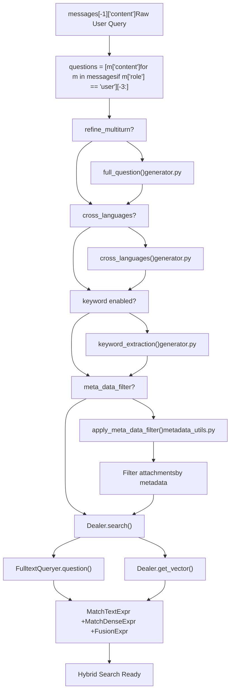
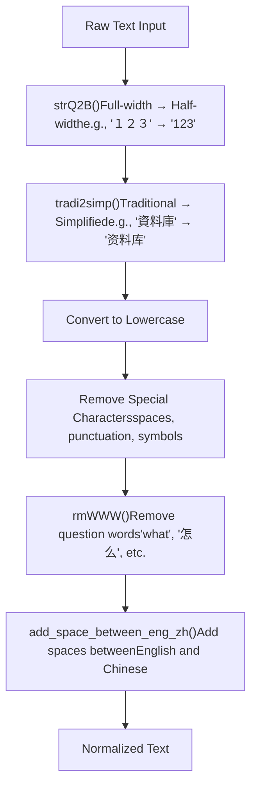
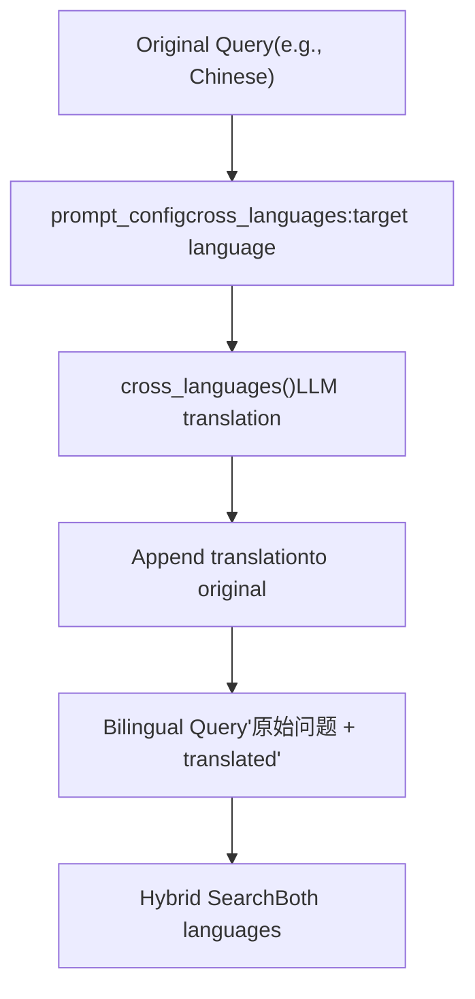
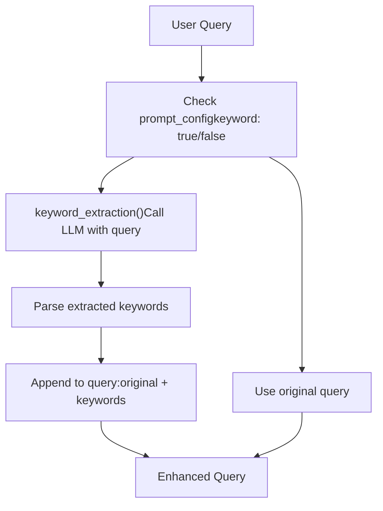
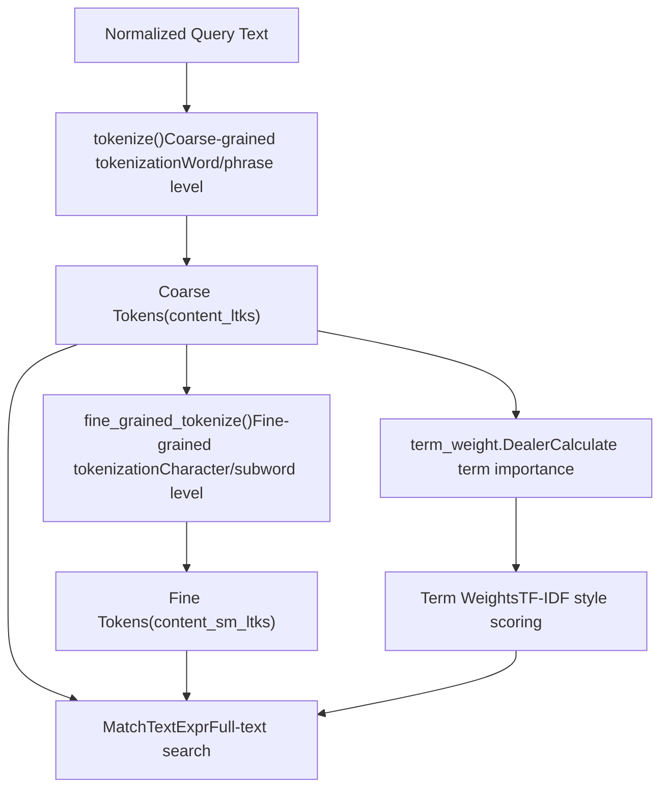
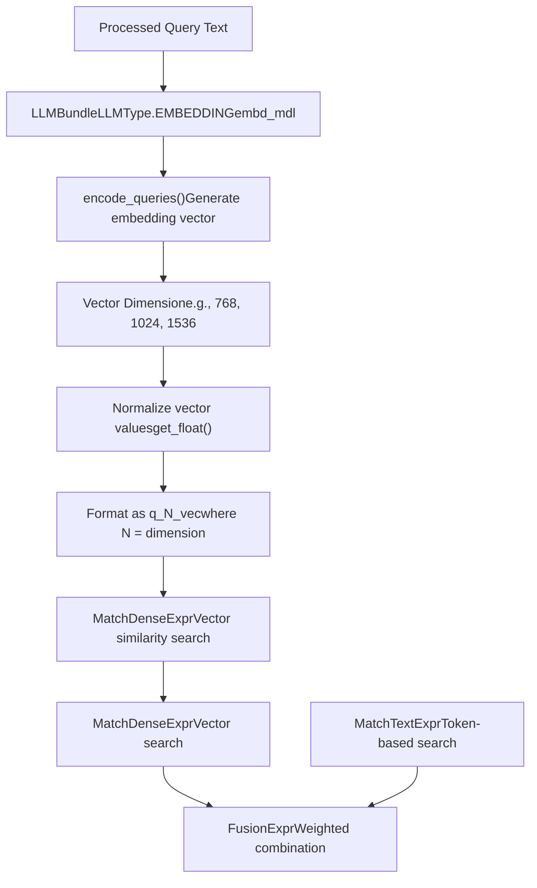
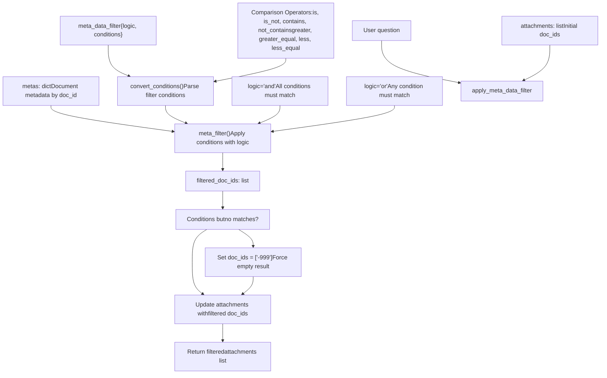
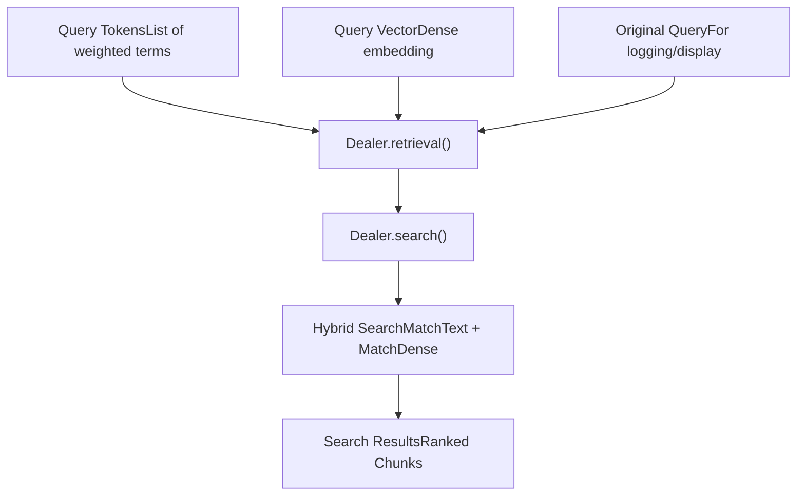

# Query Processing and Refinement

Relevant source files

-   [api/apps/chunk\_app.py](https://github.com/infiniflow/ragflow/blob/80a16e71/api/apps/chunk_app.py)
-   [api/apps/conversation\_app.py](https://github.com/infiniflow/ragflow/blob/80a16e71/api/apps/conversation_app.py)
-   [api/apps/document\_app.py](https://github.com/infiniflow/ragflow/blob/80a16e71/api/apps/document_app.py)
-   [api/apps/file2document\_app.py](https://github.com/infiniflow/ragflow/blob/80a16e71/api/apps/file2document_app.py)
-   [api/apps/file\_app.py](https://github.com/infiniflow/ragflow/blob/80a16e71/api/apps/file_app.py)
-   [api/apps/kb\_app.py](https://github.com/infiniflow/ragflow/blob/80a16e71/api/apps/kb_app.py)
-   [api/db/db\_models.py](https://github.com/infiniflow/ragflow/blob/80a16e71/api/db/db_models.py)
-   [api/db/services/dialog\_service.py](https://github.com/infiniflow/ragflow/blob/80a16e71/api/db/services/dialog_service.py)
-   [api/db/services/document\_service.py](https://github.com/infiniflow/ragflow/blob/80a16e71/api/db/services/document_service.py)
-   [api/db/services/file\_service.py](https://github.com/infiniflow/ragflow/blob/80a16e71/api/db/services/file_service.py)
-   [api/db/services/knowledgebase\_service.py](https://github.com/infiniflow/ragflow/blob/80a16e71/api/db/services/knowledgebase_service.py)
-   [api/db/services/task\_service.py](https://github.com/infiniflow/ragflow/blob/80a16e71/api/db/services/task_service.py)
-   [rag/nlp/search.py](https://github.com/infiniflow/ragflow/blob/80a16e71/rag/nlp/search.py)
-   [rag/svr/task\_executor.py](https://github.com/infiniflow/ragflow/blob/80a16e71/rag/svr/task_executor.py)

This page describes the query preprocessing and refinement pipeline that transforms user questions into optimized representations for retrieval. This includes text normalization, tokenization, keyword extraction, cross-language translation, and multi-turn conversation refinement. For information about how refined queries are used in search, see [Hybrid Search Architecture](/infiniflow/ragflow/9.2-component-system-architecture). For post-retrieval processing, see [Reranking and Filtering](/infiniflow/ragflow/9.3-built-in-components).

## Query Processing Pipeline Overview

The query processing pipeline transforms raw user input through multiple refinement stages before retrieval. The pipeline is coordinated by the `async_chat` function in `DialogService` and uses components from the `Dealer` and `FulltextQueryer` classes.


**Query Processing Pipeline: Code Flow from async\_chat to Dealer.search**

Sources: [api/db/services/dialog\_service.py281-437](https://github.com/infiniflow/ragflow/blob/80a16e71/api/db/services/dialog_service.py#L281-L437) [rag/nlp/query.py26-39](https://github.com/infiniflow/ragflow/blob/80a16e71/rag/nlp/query.py#L26-L39) [rag/nlp/search.py36-61](https://github.com/infiniflow/ragflow/blob/80a16e71/rag/nlp/search.py#L36-L61)

## Text Normalization and Cleaning

The `FulltextQueryer` class performs initial text normalization to standardize query representation. This ensures consistent processing regardless of input format variations.

### Character Normalization

Full-width characters are converted to half-width, and traditional Chinese is converted to simplified Chinese:


**Character Normalization Flow**

The `question` method in `FulltextQueryer` implements this pipeline:

[rag/nlp/query.py85-94](https://github.com/infiniflow/ragflow/blob/80a16e71/rag/nlp/query.py#L85-L94)

```
def question(self, txt, tbl="qa", min_match: float = 0.6):
    original_query = txt
    txt = FulltextQueryer.add_space_between_eng_zh(txt)
    txt = re.sub(
        r"[ :|\r\n\t,，。？?/`!！&^%%()\[\]{}<>]+",
        " ",
        rag_tokenizer.tradi2simp(rag_tokenizer.strQ2B(txt.lower())),
    ).strip()
```
Sources: [rag/nlp/query.py85-94](https://github.com/infiniflow/ragflow/blob/80a16e71/rag/nlp/query.py#L85-L94) [rag/nlp/rag\_tokenizer.py1-18](https://github.com/infiniflow/ragflow/blob/80a16e71/rag/nlp/rag_tokenizer.py#L1-L18)

### Question Word Removal

The `rmWWW` method removes interrogative words that don't contribute to semantic meaning:

| Language | Removed Words | Examples |
| --- | --- | --- |
| Chinese | 怎么办, 什么样的, 哪家, 请问, 是否, 多少, 怎么样, 如何 | "如何使用系统" → "使用系统" |
| English | what, who, how, which, where, why, is, are, do, does | "How to use the system" → "use system" |

[rag/nlp/query.py56-72](https://github.com/infiniflow/ragflow/blob/80a16e71/rag/nlp/query.py#L56-L72)

Sources: [rag/nlp/query.py56-72](https://github.com/infiniflow/ragflow/blob/80a16e71/rag/nlp/query.py#L56-L72)

### Space Normalization

English-Chinese boundary detection adds spaces between different script types to improve tokenization:

[rag/nlp/query.py75-83](https://github.com/infiniflow/ragflow/blob/80a16e71/rag/nlp/query.py#L75-L83)

```
@staticmethod
def add_space_between_eng_zh(txt):
    # (ENG/ENG+NUM) + ZH
    txt = re.sub(r'([A-Za-z]+[0-9]+)([\u4e00-\u9fa5]+)', r'\1 \2', txt)
    # ENG + ZH
    txt = re.sub(r'([A-Za-z])([\u4e00-\u9fa5]+)', r'\1 \2', txt)
    # ZH + (ENG/ENG+NUM)
    txt = re.sub(r'([\u4e00-\u9fa5]+)([A-Za-z]+[0-9]+)', r'\1 \2', txt)
    txt = re.sub(r'([\u4e00-\u9fa5]+)([A-Za-z])', r'\1 \2', txt)
```
Sources: [rag/nlp/query.py75-83](https://github.com/infiniflow/ragflow/blob/80a16e71/rag/nlp/query.py#L75-L83)

## Multi-turn Query Refinement

For conversational contexts with multiple turns, the system can consolidate conversation history into a single comprehensive query. This is controlled by the `refine_multiturn` parameter in the dialog's prompt configuration.

> **[Mermaid sequence]**
> *(图表结构无法解析)*

**Multi-turn Refinement Sequence**

The refinement logic in the `async_chat` function:

[api/db/services/dialog\_service.py343-346](https://github.com/infiniflow/ragflow/blob/80a16e71/api/db/services/dialog_service.py#L343-L346)

```
if len(questions) > 1 and prompt_config.get("refine_multiturn"):
    questions = [await full_question(dialog.tenant_id, dialog.llm_id, messages)]
else:
    questions = questions[-1:]
```
The `full_question` function uses an LLM to combine context:

[rag/prompts/generator.py](https://github.com/infiniflow/ragflow/blob/80a16e71/rag/prompts/generator.py) (referenced but not shown in provided files)

This generates a standalone question that incorporates context from previous turns:

-   **Input**: "What about pricing?" (following "Tell me about RAGFlow")
-   **Output**: "What is the pricing for RAGFlow?"

Sources: [api/db/services/dialog\_service.py387-416](https://github.com/infiniflow/ragflow/blob/80a16e71/api/db/services/dialog_service.py#L387-L416)

## Cross-language Query Translation

When the `cross_languages` parameter is configured, the system translates queries to improve retrieval across multilingual knowledge bases. This is particularly useful when documents are in a different language than the query.


**Cross-language Translation Flow**

The translation is invoked in the `async_chat` function:

[api/db/services/dialog\_service.py348-349](https://github.com/infiniflow/ragflow/blob/80a16e71/api/db/services/dialog_service.py#L348-L349)

```
if prompt_config.get("cross_languages"):
    questions = [await cross_languages(dialog.tenant_id, dialog.llm_id, questions[0], prompt_config["cross_languages"])]
```
Configuration example in prompt\_config:

```
{
  "cross_languages": "English"
}
```
This creates queries like: "如何使用系统 How to use the system"

Sources: [api/db/services/dialog\_service.py418-419](https://github.com/infiniflow/ragflow/blob/80a16e71/api/db/services/dialog_service.py#L418-L419)

## Keyword Extraction

LLM-based keyword extraction augments queries with semantically relevant terms. This improves recall by expanding the query vocabulary.


**Keyword Extraction Pipeline**

Implementation in the `async_chat` function:

[api/db/services/dialog\_service.py361-362](https://github.com/infiniflow/ragflow/blob/80a16e71/api/db/services/dialog_service.py#L361-L362)

```
if prompt_config.get("keyword", False):
    questions[-1] += await keyword_extraction(chat_mdl, questions[-1])
```
The `keyword_extraction` function (from `rag/prompts/generator.py`) uses the LLM to identify key terms. For example:

-   **Original**: "How to build a RAG application"
-   **Extracted Keywords**: "RAG, retrieval, augmented generation, application development"
-   **Enhanced Query**: "How to build a RAG application RAG retrieval augmented generation application development"

Sources: [api/db/services/dialog\_service.py434-435](https://github.com/infiniflow/ragflow/blob/80a16e71/api/db/services/dialog_service.py#L434-L435)

## Query Tokenization

Tokenization converts text into searchable tokens using the `rag_tokenizer` module. This supports both full-text search and term-based matching.


**Tokenization and Term Weighting Flow**

The tokenizer is implemented using Infinity's RAG tokenizer:

[rag/nlp/rag\_tokenizer.py17-18](https://github.com/infiniflow/ragflow/blob/80a16e71/rag/nlp/rag_tokenizer.py#L17-L18)

```
import infinity.rag_tokenizer
from common import settings
```
Tokenization methods:

-   `tokenize(text)` - Produces coarse-grained tokens for primary matching
-   `fine_grained_tokenize(text)` - Produces fine-grained tokens for fuzzy matching

The `FulltextQueryer` uses these tokens to build search expressions:

[rag/nlp/query.py98-103](https://github.com/infiniflow/ragflow/blob/80a16e71/rag/nlp/query.py#L98-L103)

```
tks = rag_tokenizer.tokenize(txt).split()
keywords = [t for t in tks if t]
tks_w = self.tw.weights(tks, preprocess=False)
tks_w = [(re.sub(r"[ \\\"'^]", "", tk), w) for tk, w in tks_w]
```
Sources: [rag/nlp/query.py85-120](https://github.com/infiniflow/ragflow/blob/80a16e71/rag/nlp/query.py#L85-L120) [rag/nlp/rag\_tokenizer.py1-18](https://github.com/infiniflow/ragflow/blob/80a16e71/rag/nlp/rag_tokenizer.py#L1-L18)

## Query Embedding Generation

For vector similarity search, queries are converted to dense embeddings using the configured embedding model.


**Query Embedding and Search Expression Building**

The `Dealer` class coordinates embedding generation:

[rag/nlp/search.py52-60](https://github.com/infiniflow/ragflow/blob/80a16e71/rag/nlp/search.py#L52-L60)

```
def get_vector(self, txt, emb_mdl, topk=10, similarity=0.1):
    qv, _ = emb_mdl.encode_queries(txt)
    shape = np.array(qv).shape
    if len(shape) > 1:
        raise Exception(
            f"Dealer.get_vector returned array's shape {shape} doesn't match expectation(exact one dimension).")
    embedding_data = [get_float(v) for v in qv]
    vector_column_name = f"q_{len(embedding_data)}_vec"
    return MatchDenseExpr(vector_column_name, embedding_data, 'float', 'cosine', topk, {"similarity": similarity})
```
The embedding model is obtained from the knowledge base configuration:

[api/db/services/dialog\_service.py217-227](https://github.com/infiniflow/ragflow/blob/80a16e71/api/db/services/dialog_service.py#L217-L227)

```
def get_models(dialog):
    embd_mdl, chat_mdl, rerank_mdl, tts_mdl = None, None, None, None
    kbs = KnowledgebaseService.get_by_ids(dialog.kb_ids)
    embedding_list = list(set([kb.embd_id for kb in kbs]))
    if len(embedding_list) > 1:
        raise Exception("**ERROR**: Knowledge bases use different embedding models.")

    if embedding_list:
        embd_mdl = LLMBundle(dialog.tenant_id, LLMType.EMBEDDING, embedding_list[0])
```
Sources: [rag/nlp/search.py52-60](https://github.com/infiniflow/ragflow/blob/80a16e71/rag/nlp/search.py#L52-L60) [api/db/services/dialog\_service.py217-239](https://github.com/infiniflow/ragflow/blob/80a16e71/api/db/services/dialog_service.py#L217-L239)

## Query Processing Configuration

Query refinement behavior is controlled through the dialog's `prompt_config` dictionary:

| Configuration Key | Type | Description | Default |
| --- | --- | --- | --- |
| `refine_multiturn` | boolean | Enable multi-turn query refinement | false |
| `cross_languages` | string | Target language for translation | null |
| `keyword` | boolean | Enable LLM keyword extraction | false |

[api/db/services/dialog\_service.py325-362](https://github.com/infiniflow/ragflow/blob/80a16e71/api/db/services/dialog_service.py#L325-L362)

Example configuration:

```
{
  "system": "You are a helpful assistant.",
  "refine_multiturn": true,
  "cross_languages": "English",
  "keyword": true,
  "parameters": [
    {"key": "knowledge", "optional": false}
  ]
}
```
Sources: [api/db/services/dialog\_service.py325-362](https://github.com/infiniflow/ragflow/blob/80a16e71/api/db/services/dialog_service.py#L325-L362)

## Metadata-based Document Filtering

Before retrieval, queries can be filtered by document metadata to narrow the search scope. This is handled by the `apply_meta_data_filter` function.


**Metadata Filtering Pipeline: Filtering Documents by Attributes**

The metadata filtering is invoked when `dialog.meta_data_filter` is configured:

[api/db/services/dialog\_service.py351-359](https://github.com/infiniflow/ragflow/blob/80a16e71/api/db/services/dialog_service.py#L351-L359)

```
if dialog.meta_data_filter:
    metas = DocumentService.get_meta_by_kbs(dialog.kb_ids)
    attachments = await apply_meta_data_filter(
        dialog.meta_data_filter,
        metas,
        questions[-1],
        chat_mdl,
        attachments,
    )
```
Example metadata filter configuration:

```
{
  "logic": "and",
  "conditions": [
    {
      "name": "author",
      "comparison_operator": "is",
      "value": "John Smith"
    },
    {
      "name": "publication_year",
      "comparison_operator": "greater_equal",
      "value": 2020
    }
  ]
}
```
This filters documents to only those matching all specified conditions, significantly reducing the search space and improving retrieval precision.

Sources: [api/db/services/dialog\_service.py351-359](https://github.com/infiniflow/ragflow/blob/80a16e71/api/db/services/dialog_service.py#L351-L359) [common/metadata\_utils.py](https://github.com/infiniflow/ragflow/blob/80a16e71/common/metadata_utils.py) [api/apps/sdk/session.py143-157](https://github.com/infiniflow/ragflow/blob/80a16e71/api/apps/sdk/session.py#L143-L157)

## Integration with Search Pipeline

The refined query components are passed to the hybrid search system:


**Query to Retrieval Integration**

The retrieval is invoked in the `async_chat` function after all query refinements:

[api/db/services/dialog\_service.py397-410](https://github.com/infiniflow/ragflow/blob/80a16e71/api/db/services/dialog_service.py#L397-L410)

```
if embd_mdl:
    kbinfos = retriever.retrieval(
        " ".join(questions),
        embd_mdl,
        tenant_ids,
        dialog.kb_ids,
        1,
        dialog.top_n,
        dialog.similarity_threshold,
        dialog.vector_similarity_weight,
        doc_ids=attachments,
        top=dialog.top_k,
        aggs=False,
        rerank_mdl=rerank_mdl,
        rank_feature=label_question(" ".join(questions), kbs),
    )
```
The `retriever.retrieval` method is implemented in the `Dealer` class:

[rag/nlp/search.py359-404](https://github.com/infiniflow/ragflow/blob/80a16e71/rag/nlp/search.py#L359-L404)

Sources: [api/db/services/dialog\_service.py470-485](https://github.com/infiniflow/ragflow/blob/80a16e71/api/db/services/dialog_service.py#L470-L485) [rag/nlp/search.py359-404](https://github.com/infiniflow/ragflow/blob/80a16e71/rag/nlp/search.py#L359-L404)

## Summary Table: Query Refinement Steps

| Step | Input | Output | Key Classes/Functions | Configurable |
| --- | --- | --- | --- | --- |
| Text Normalization | Raw query text | Normalized text | `FulltextQueryer.question()`, `rag_tokenizer.strQ2B()` | No |
| Question Word Removal | Normalized text | Cleaned text | `FulltextQueryer.rmWWW()` | No |
| Multi-turn Refinement | Conversation history | Standalone question | `full_question()` | Yes (`refine_multiturn`) |
| Cross-language Translation | Original query | Bilingual query | `cross_languages()` | Yes (`cross_languages`) |
| Keyword Extraction | Query text | Enhanced query | `keyword_extraction()` | Yes (`keyword`) |
| Tokenization | Enhanced query | Token list | `rag_tokenizer.tokenize()` | No |
| Term Weighting | Token list | Weighted terms | `term_weight.Dealer.weights()` | No |
| Embedding Generation | Query text | Dense vector | `LLMBundle.encode_queries()` | No (model selection only) |

Sources: [api/db/services/dialog\_service.py387-437](https://github.com/infiniflow/ragflow/blob/80a16e71/api/db/services/dialog_service.py#L387-L437) [rag/nlp/query.py26-120](https://github.com/infiniflow/ragflow/blob/80a16e71/rag/nlp/query.py#L26-L120) [rag/nlp/search.py36-61](https://github.com/infiniflow/ragflow/blob/80a16e71/rag/nlp/search.py#L36-L61)
