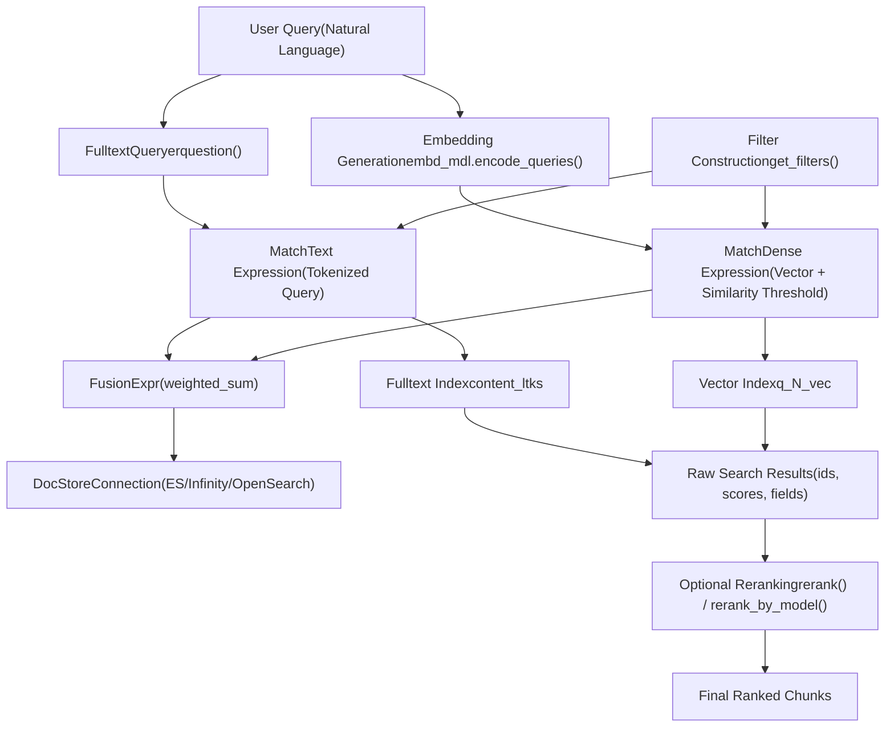
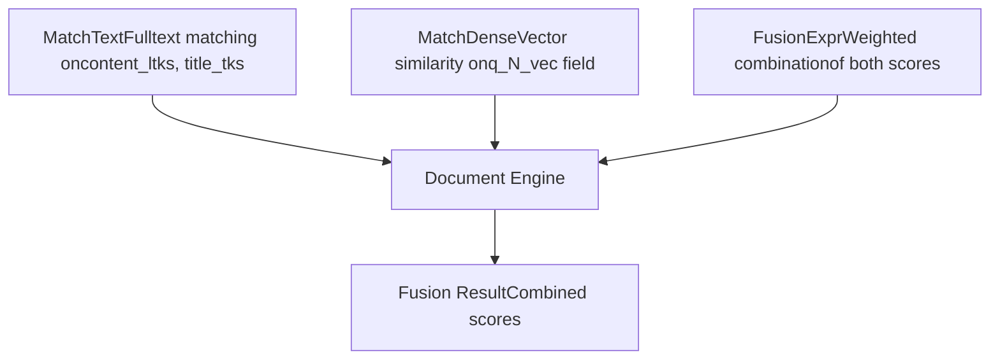
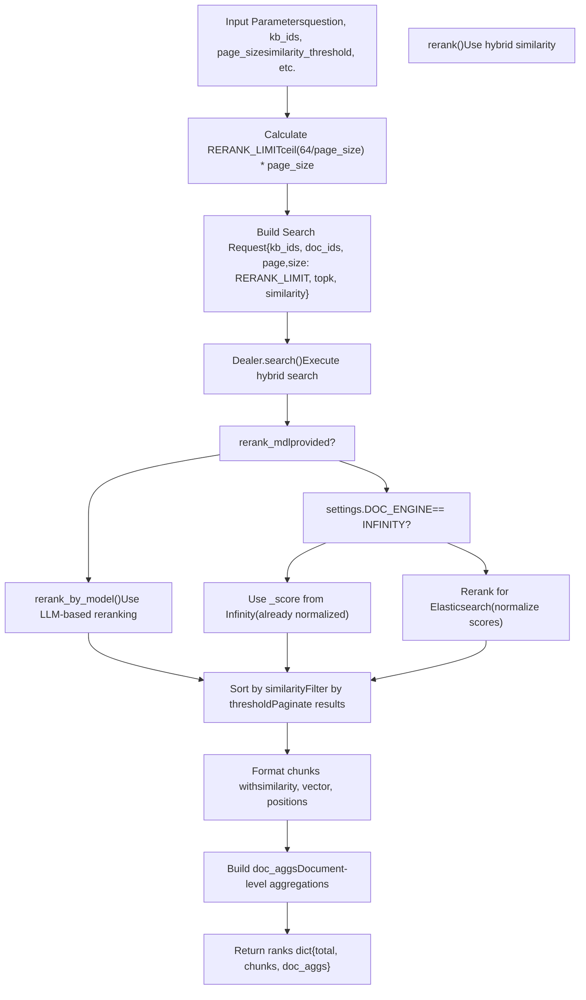
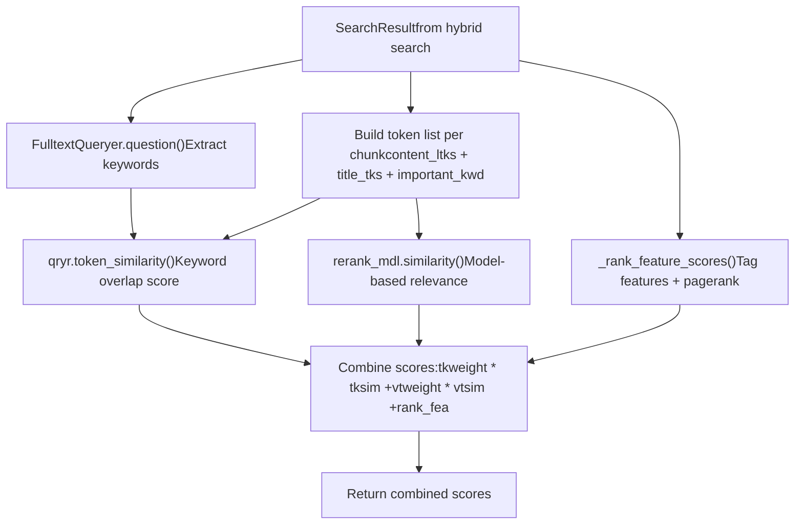
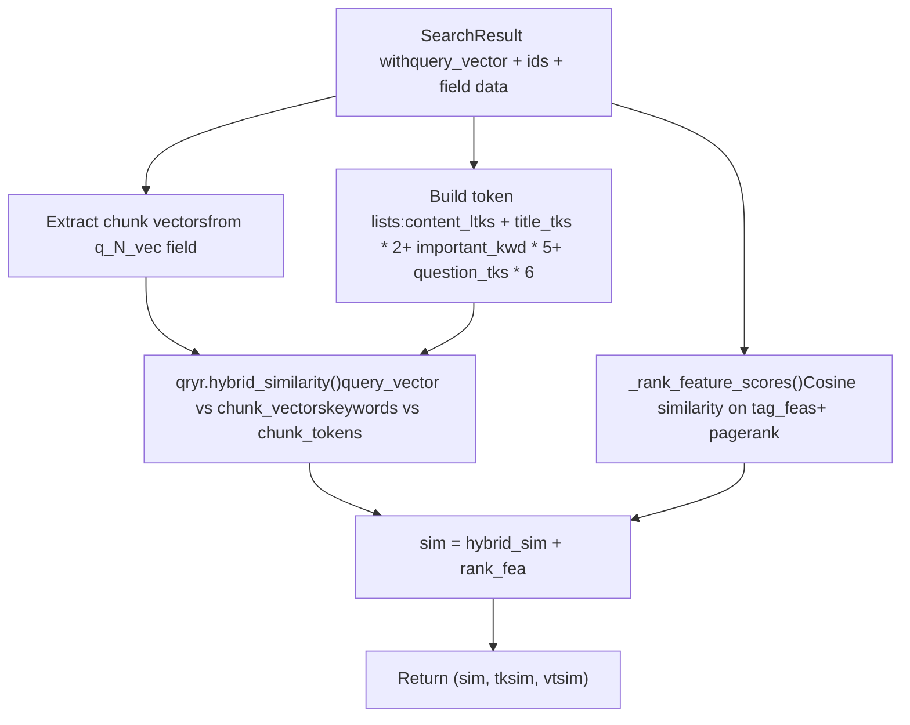
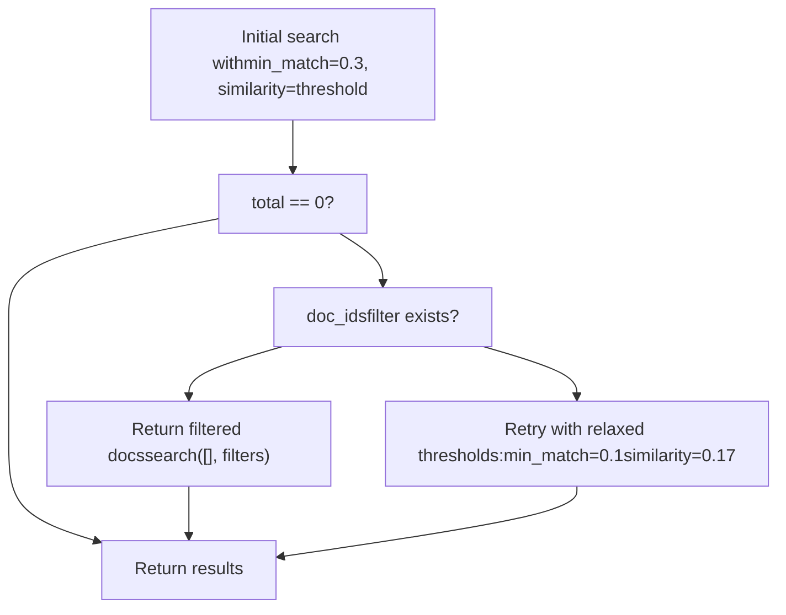
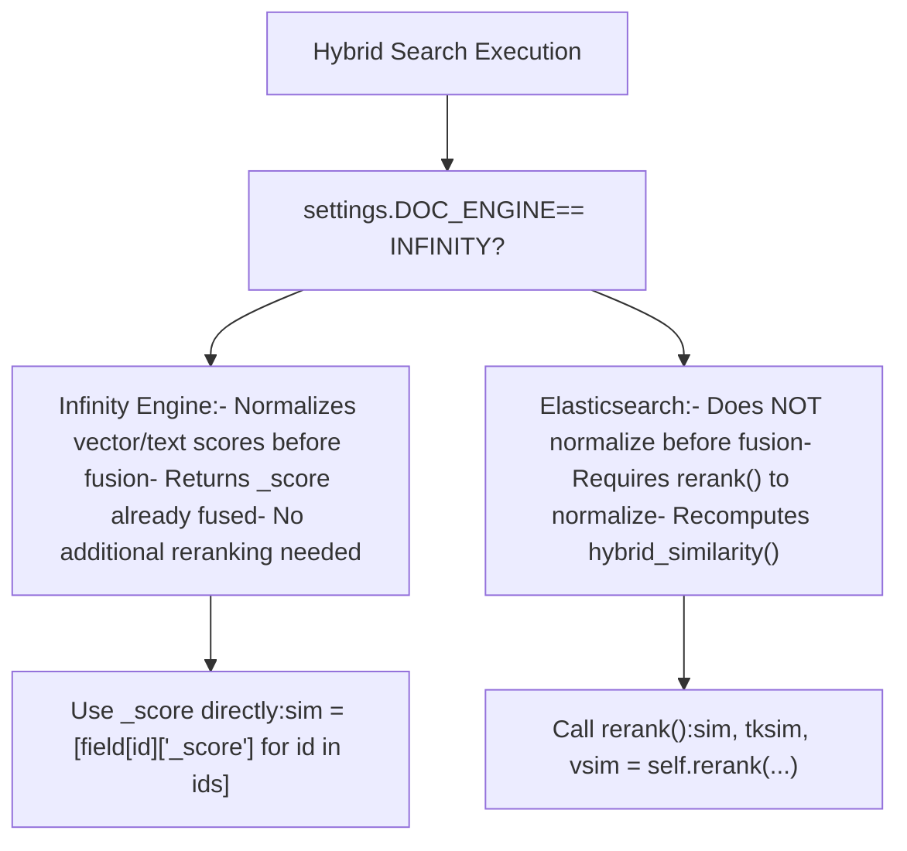

# Hybrid Search Architecture

Relevant source files

-   [api/apps/chunk\_app.py](https://github.com/infiniflow/ragflow/blob/80a16e71/api/apps/chunk_app.py)
-   [api/apps/conversation\_app.py](https://github.com/infiniflow/ragflow/blob/80a16e71/api/apps/conversation_app.py)
-   [api/apps/document\_app.py](https://github.com/infiniflow/ragflow/blob/80a16e71/api/apps/document_app.py)
-   [api/apps/file2document\_app.py](https://github.com/infiniflow/ragflow/blob/80a16e71/api/apps/file2document_app.py)
-   [api/apps/file\_app.py](https://github.com/infiniflow/ragflow/blob/80a16e71/api/apps/file_app.py)
-   [api/apps/kb\_app.py](https://github.com/infiniflow/ragflow/blob/80a16e71/api/apps/kb_app.py)
-   [api/db/db\_models.py](https://github.com/infiniflow/ragflow/blob/80a16e71/api/db/db_models.py)
-   [api/db/services/dialog\_service.py](https://github.com/infiniflow/ragflow/blob/80a16e71/api/db/services/dialog_service.py)
-   [api/db/services/document\_service.py](https://github.com/infiniflow/ragflow/blob/80a16e71/api/db/services/document_service.py)
-   [api/db/services/file\_service.py](https://github.com/infiniflow/ragflow/blob/80a16e71/api/db/services/file_service.py)
-   [api/db/services/knowledgebase\_service.py](https://github.com/infiniflow/ragflow/blob/80a16e71/api/db/services/knowledgebase_service.py)
-   [api/db/services/task\_service.py](https://github.com/infiniflow/ragflow/blob/80a16e71/api/db/services/task_service.py)
-   [rag/nlp/search.py](https://github.com/infiniflow/ragflow/blob/80a16e71/rag/nlp/search.py)
-   [rag/svr/task\_executor.py](https://github.com/infiniflow/ragflow/blob/80a16e71/rag/svr/task_executor.py)

## Purpose and Scope

This document details RAGFlow's hybrid search architecture, which combines vector similarity search with fulltext matching to retrieve relevant document chunks. The system fuses semantic understanding (via embeddings) with exact keyword matching to improve retrieval quality across diverse query types.

For query processing and text normalization, see [Query Processing and Refinement](/infiniflow/ragflow/10.1-query-processing-and-refinement). For reranking strategies and metadata filtering applied after retrieval, see [Reranking and Metadata Filtering](/infiniflow/ragflow/10.3-reranking-and-metadata-filtering). For how retrieved chunks are formatted into LLM context, see [Response Generation and Citations](/infiniflow/ragflow/10.4-response-generation-and-citations).

---

## Architecture Overview

The hybrid search architecture operates through a multi-stage pipeline that processes natural language queries into structured search expressions, executes parallel vector and fulltext searches, fuses the results with configurable weights, and optionally reranks the output.

### System Components


**Sources**: [rag/nlp/search.py36-172](https://github.com/infiniflow/ragflow/blob/80a16e71/rag/nlp/search.py#L36-L172)

---

## Core Components

### Dealer Class

The `Dealer` class ([rag/nlp/search.py36](https://github.com/infiniflow/ragflow/blob/80a16e71/rag/nlp/search.py#L36-L36)) orchestrates all search operations. It maintains a `FulltextQueryer` instance for text processing and a `DocStoreConnection` for database interactions.

| Component | Purpose | Key Methods |
| --- | --- | --- |
| `qryr: FulltextQueryer` | Text processing and tokenization | `question()`, `hybrid_similarity()` |
| `dataStore: DocStoreConnection` | Database interface | `search()`, `get_doc_ids()`, `get_fields()` |

**Sources**: [rag/nlp/search.py36-40](https://github.com/infiniflow/ragflow/blob/80a16e71/rag/nlp/search.py#L36-L40)

### Search Expression Types

RAGFlow constructs three types of search expressions that are passed to the document engine:


-   **MatchText**: Generated by `FulltextQueryer.question()` ([rag/nlp/query.py](https://github.com/infiniflow/ragflow/blob/80a16e71/rag/nlp/query.py)), tokenizes the query and creates boosted search expressions for important terms
-   **MatchDense**: Created by `Dealer.get_vector()` ([rag/nlp/search.py52-60](https://github.com/infiniflow/ragflow/blob/80a16e71/rag/nlp/search.py#L52-L60)), encodes the query as a vector and specifies similarity threshold and topk
-   **FusionExpr**: Combines the above with `weighted_sum` fusion type and configurable weights

**Sources**: [rag/nlp/search.py52-60](https://github.com/infiniflow/ragflow/blob/80a16e71/rag/nlp/search.py#L52-L60) [rag/nlp/search.py114-133](https://github.com/infiniflow/ragflow/blob/80a16e71/rag/nlp/search.py#L114-L133)

---

## Hybrid Search Execution Flow

### Main Search Method

The `Dealer.search()` method ([rag/nlp/search.py74-172](https://github.com/infiniflow/ragflow/blob/80a16e71/rag/nlp/search.py#L74-L172)) implements the core hybrid search logic:

> **[Mermaid sequence]**
> *(图表结构无法解析)*

**Sources**: [rag/nlp/search.py74-172](https://github.com/infiniflow/ragflow/blob/80a16e71/rag/nlp/search.py#L74-L172)

### Fusion Weight Configuration

The fusion weights control the balance between vector and fulltext scores:

```
# Default fusion weights from search.py:127
fusionExpr = FusionExpr("weighted_sum", topk, {"weights": "0.05,0.95"})
```
This configuration gives:

-   **5%** weight to fulltext matching
-   **95%** weight to vector similarity

These weights are fixed in the `search()` method but can be adjusted during reranking through the `vector_similarity_weight` parameter.

**Sources**: [rag/nlp/search.py127](https://github.com/infiniflow/ragflow/blob/80a16e71/rag/nlp/search.py#L127-L127)

---

## Retrieval Method Integration

The `Dealer.retrieval()` method ([rag/nlp/search.py362-509](https://github.com/infiniflow/ragflow/blob/80a16e71/rag/nlp/search.py#L362-L509)) provides the high-level retrieval interface used by the chat system:

### Method Signature

```
def retrieval(
    question: str,
    embd_mdl: LLMBundle,
    tenant_ids: list[str],
    kb_ids: list[str],
    page: int,
    page_size: int,
    similarity_threshold: float = 0.2,
    vector_similarity_weight: float = 0.3,
    top: int = 1024,
    doc_ids: list[str] = None,
    aggs: bool = True,
    rerank_mdl: LLMBundle = None,
    highlight: bool = False,
    rank_feature: dict = {PAGERANK_FLD: 10}
) -> dict
```
**Sources**: [rag/nlp/search.py362-378](https://github.com/infiniflow/ragflow/blob/80a16e71/rag/nlp/search.py#L362-L378)

### Retrieval Pipeline


**Sources**: [rag/nlp/search.py362-509](https://github.com/infiniflow/ragflow/blob/80a16e71/rag/nlp/search.py#L362-L509)

### Rerank Limit Calculation

The retrieval method uses a `RERANK_LIMIT` to batch results before pagination:

```
# From search.py:384
RERANK_LIMIT = math.ceil(64 / page_size) * page_size if page_size > 1 else 1
```
This ensures the limit is a multiple of `page_size`, enabling efficient reranking over larger batches (typically 64 chunks) before selecting the final page. The search request page is calculated as:

```
page: math.ceil(page_size * page / RERANK_LIMIT)
```
**Sources**: [rag/nlp/search.py384-389](https://github.com/infiniflow/ragflow/blob/80a16e71/rag/nlp/search.py#L384-L389)

---

## Reranking Strategies

RAGFlow supports two reranking approaches after the initial hybrid search:

### 1\. Model-Based Reranking

When a `rerank_mdl` is provided, the `rerank_by_model()` method ([rag/nlp/search.py333-354](https://github.com/infiniflow/ragflow/blob/80a16e71/rag/nlp/search.py#L333-L354)) uses an LLM reranker:


The model-based reranker calls `rerank_mdl.similarity(query, passages)` which sends the query and all candidate chunks to a specialized reranking model (e.g., BGE-reranker) that scores relevance.

**Sources**: [rag/nlp/search.py333-354](https://github.com/infiniflow/ragflow/blob/80a16e71/rag/nlp/search.py#L333-L354)

### 2\. Hybrid Similarity Reranking

The `rerank()` method ([rag/nlp/search.py294-331](https://github.com/infiniflow/ragflow/blob/80a16e71/rag/nlp/search.py#L294-L331)) recomputes similarity using query vectors and tokens:


**Token Weight Boosting**: Different fields receive different multipliers:

-   `content_ltks`: 1x
-   `title_tks`: 2x
-   `important_kwd`: 5x
-   `question_tks`: 6x

This prioritizes chunks where the query matches synthetic questions or important keywords.

**Sources**: [rag/nlp/search.py294-331](https://github.com/infiniflow/ragflow/blob/80a16e71/rag/nlp/search.py#L294-L331)

### Rank Feature Scoring

The `_rank_feature_scores()` method ([rag/nlp/search.py267-292](https://github.com/infiniflow/ragflow/blob/80a16e71/rag/nlp/search.py#L267-L292)) adds two signals:

1.  **Tag Feature Similarity**: Cosine similarity between query tags and chunk tags (stored in `tag_feas` field)
2.  **Pagerank**: A static rank signal per chunk (stored in `PAGERANK_FLD`)

```
# Simplified logic from search.py:267-292
tag_score = cosine_similarity(query_tags, chunk_tags) * 10.0
final_score = tag_score + pagerank
```
**Sources**: [rag/nlp/search.py267-292](https://github.com/infiniflow/ragflow/blob/80a16e71/rag/nlp/search.py#L267-L292)

---

## Fallback Strategies

The hybrid search implements multiple fallback mechanisms when results are insufficient:

### Empty Result Handling


From [rag/nlp/search.py136-148](https://github.com/infiniflow/ragflow/blob/80a16e71/rag/nlp/search.py#L136-L148):

```
if total == 0:
    if filters.get("doc_id"):
        res = self.dataStore.search(src, [], filters, [], orderBy, offset, limit, idx_names, kb_ids)
    else:
        matchText, _ = self.qryr.question(qst, min_match=0.1)
        matchDense.extra_options["similarity"] = 0.17
        res = self.dataStore.search(src, highlightFields, filters, [matchText, matchDense, fusionExpr], ...)
```
This ensures users get results even with challenging queries by progressively relaxing constraints.

**Sources**: [rag/nlp/search.py136-148](https://github.com/infiniflow/ragflow/blob/80a16e71/rag/nlp/search.py#L136-L148)

---

## Integration with Chat System

The hybrid search is invoked from the chat completion flow in `async_chat()`:

> **[Mermaid sequence]**
> *(图表结构无法解析)*

**Sources**: [api/db/services/dialog\_service.py391-423](https://github.com/infiniflow/ragflow/blob/80a16e71/api/db/services/dialog_service.py#L391-L423)

### Parameter Mapping

Dialog-level settings map to retrieval parameters:

| Dialog Setting | Retrieval Parameter | Default | Description |
| --- | --- | --- | --- |
| `dialog.top_n` | `page_size` | 6 | Number of chunks to retrieve |
| `dialog.top_k` | `top` | 1024 | Maximum candidates before filtering |
| `dialog.similarity_threshold` | `similarity_threshold` | 0.2 | Minimum similarity score |
| `dialog.vector_similarity_weight` | `vector_similarity_weight` | 0.3 | Weight for vector vs text (inverted for reranking: tkweight=1-w, vtweight=w) |
| `dialog.rerank_id` | `rerank_mdl` | None | Optional rerank model |

**Sources**: [api/db/services/dialog\_service.py391-406](https://github.com/infiniflow/ragflow/blob/80a16e71/api/db/services/dialog_service.py#L391-L406)

---

## Engine-Specific Behavior

RAGFlow supports multiple document engines with slightly different behaviors:

### Infinity vs. Elasticsearch


From [rag/nlp/search.py413-427](https://github.com/infiniflow/ragflow/blob/80a16e71/rag/nlp/search.py#L413-L427):

```
if settings.DOC_ENGINE_INFINITY:
    # Infinity normalizes each way score before fusion
    sim = [sres.field[id].get("_score", 0.0) for id in sres.ids]
    tsim = sim
    vsim = sim
else:
    # ElasticSearch doesn't normalize, so rerank
    sim, tsim, vsim = self.rerank(
        sres, question,
        1 - vector_similarity_weight,
        vector_similarity_weight,
        rank_feature=rank_feature
    )
```
**Sources**: [rag/nlp/search.py413-427](https://github.com/infiniflow/ragflow/blob/80a16e71/rag/nlp/search.py#L413-L427)

---

## Field Schema

The hybrid search operates on specific fields in the document store:

### Indexed Fields

| Field Name | Type | Purpose |
| --- | --- | --- |
| `content_ltks` | Text | Tokenized content for fulltext matching |
| `content_with_weight` | Text | Display content with highlighting |
| `title_tks` | Text | Tokenized title (boosted 2x in reranking) |
| `important_kwd` | Array | Important keywords (boosted 5x) |
| `question_tks` | Text | Synthetic questions (boosted 6x) |
| `q_{N}_vec` | Vector | Embedding vector (dimension N) |
| `doc_id` | Keyword | Document ID for filtering |
| `kb_id` | Keyword | Knowledge base ID for filtering |
| `docnm_kwd` | Keyword | Document name |
| `available_int` | Integer | Availability status (0/1) |
| `position_int` | Array | Page positions \[page, x, y, w, h\] |
| `tag_feas` | JSON | Tag feature vector for rank feature scoring |
| `PAGERANK_FLD` | Float | Static page rank score |

**Sources**: [rag/nlp/search.py91-95](https://github.com/infiniflow/ragflow/blob/80a16e71/rag/nlp/search.py#L91-L95) [rag/nlp/search.py454-477](https://github.com/infiniflow/ragflow/blob/80a16e71/rag/nlp/search.py#L454-L477)

### Vector Field Naming

The vector field name is dynamically determined by embedding dimension:

```
# From search.py:59
vector_column_name = f"q_{len(embedding_data)}_vec"
```
For example, a 1024-dimensional embedding uses field `q_1024_vec`.

**Sources**: [rag/nlp/search.py59](https://github.com/infiniflow/ragflow/blob/80a16e71/rag/nlp/search.py#L59-L59)

---

## Usage Example

A complete hybrid search invocation from the chat system:

```
# From dialog_service.py:391-406
kbinfos = retriever.retrieval(
    question=" ".join(questions),  # Query text
    embd_mdl=embd_mdl,              # Embedding model bundle
    tenant_ids=tenant_ids,           # Tenant IDs for index names
    kb_ids=dialog.kb_ids,           # Knowledge base IDs to search
    page=1,                         # Page number
    page_size=dialog.top_n,         # Chunks per page (default 6)
    similarity_threshold=dialog.similarity_threshold,  # Default 0.2
    vector_similarity_weight=dialog.vector_similarity_weight,  # Default 0.3
    doc_ids=attachments,            # Optional document filter
    top=dialog.top_k,               # Candidate pool size (default 1024)
    aggs=True,                      # Include document aggregations
    rerank_mdl=rerank_mdl,          # Optional rerank model
    rank_feature=label_question(" ".join(questions), kbs)  # Tag features
)

# Returns:
# {
#   "total": 42,
#   "chunks": [{"chunk_id": "...", "similarity": 0.85, ...}],
#   "doc_aggs": [{"doc_name": "...", "doc_id": "...", "count": 5}]
# }
```
**Sources**: [api/db/services/dialog\_service.py391-406](https://github.com/infiniflow/ragflow/blob/80a16e71/api/db/services/dialog_service.py#L391-L406)
