# System Architecture

Relevant source files

-   [README.md](https://github.com/infiniflow/ragflow/blob/80a16e71/README.md)
-   [README\_id.md](https://github.com/infiniflow/ragflow/blob/80a16e71/README_id.md)
-   [README\_ja.md](https://github.com/infiniflow/ragflow/blob/80a16e71/README_ja.md)
-   [README\_ko.md](https://github.com/infiniflow/ragflow/blob/80a16e71/README_ko.md)
-   [README\_pt\_br.md](https://github.com/infiniflow/ragflow/blob/80a16e71/README_pt_br.md)
-   [README\_tzh.md](https://github.com/infiniflow/ragflow/blob/80a16e71/README_tzh.md)
-   [README\_zh.md](https://github.com/infiniflow/ragflow/blob/80a16e71/README_zh.md)
-   [admin/client/README.md](https://github.com/infiniflow/ragflow/blob/80a16e71/admin/client/README.md)
-   [admin/client/http\_client.py](https://github.com/infiniflow/ragflow/blob/80a16e71/admin/client/http_client.py)
-   [admin/client/parser.py](https://github.com/infiniflow/ragflow/blob/80a16e71/admin/client/parser.py)
-   [admin/client/pyproject.toml](https://github.com/infiniflow/ragflow/blob/80a16e71/admin/client/pyproject.toml)
-   [admin/client/ragflow\_cli.py](https://github.com/infiniflow/ragflow/blob/80a16e71/admin/client/ragflow_cli.py)
-   [admin/client/ragflow\_client.py](https://github.com/infiniflow/ragflow/blob/80a16e71/admin/client/ragflow_client.py)
-   [admin/client/user.py](https://github.com/infiniflow/ragflow/blob/80a16e71/admin/client/user.py)
-   [admin/server/admin\_server.py](https://github.com/infiniflow/ragflow/blob/80a16e71/admin/server/admin_server.py)
-   [admin/server/auth.py](https://github.com/infiniflow/ragflow/blob/80a16e71/admin/server/auth.py)
-   [admin/server/config.py](https://github.com/infiniflow/ragflow/blob/80a16e71/admin/server/config.py)
-   [admin/server/routes.py](https://github.com/infiniflow/ragflow/blob/80a16e71/admin/server/routes.py)
-   [admin/server/services.py](https://github.com/infiniflow/ragflow/blob/80a16e71/admin/server/services.py)
-   [api/apps/chunk\_app.py](https://github.com/infiniflow/ragflow/blob/80a16e71/api/apps/chunk_app.py)
-   [api/apps/conversation\_app.py](https://github.com/infiniflow/ragflow/blob/80a16e71/api/apps/conversation_app.py)
-   [api/apps/document\_app.py](https://github.com/infiniflow/ragflow/blob/80a16e71/api/apps/document_app.py)
-   [api/apps/file2document\_app.py](https://github.com/infiniflow/ragflow/blob/80a16e71/api/apps/file2document_app.py)
-   [api/apps/file\_app.py](https://github.com/infiniflow/ragflow/blob/80a16e71/api/apps/file_app.py)
-   [api/apps/kb\_app.py](https://github.com/infiniflow/ragflow/blob/80a16e71/api/apps/kb_app.py)
-   [api/constants.py](https://github.com/infiniflow/ragflow/blob/80a16e71/api/constants.py)
-   [api/db/db\_models.py](https://github.com/infiniflow/ragflow/blob/80a16e71/api/db/db_models.py)
-   [api/db/services/dialog\_service.py](https://github.com/infiniflow/ragflow/blob/80a16e71/api/db/services/dialog_service.py)
-   [api/db/services/document\_service.py](https://github.com/infiniflow/ragflow/blob/80a16e71/api/db/services/document_service.py)
-   [api/db/services/file\_service.py](https://github.com/infiniflow/ragflow/blob/80a16e71/api/db/services/file_service.py)
-   [api/db/services/knowledgebase\_service.py](https://github.com/infiniflow/ragflow/blob/80a16e71/api/db/services/knowledgebase_service.py)
-   [api/db/services/system\_settings\_service.py](https://github.com/infiniflow/ragflow/blob/80a16e71/api/db/services/system_settings_service.py)
-   [api/db/services/task\_service.py](https://github.com/infiniflow/ragflow/blob/80a16e71/api/db/services/task_service.py)
-   [api/ragflow\_server.py](https://github.com/infiniflow/ragflow/blob/80a16e71/api/ragflow_server.py)
-   [api/utils/configs.py](https://github.com/infiniflow/ragflow/blob/80a16e71/api/utils/configs.py)
-   [api/utils/health\_utils.py](https://github.com/infiniflow/ragflow/blob/80a16e71/api/utils/health_utils.py)
-   [common/connection\_utils.py](https://github.com/infiniflow/ragflow/blob/80a16e71/common/connection_utils.py)
-   [conf/system\_settings.json](https://github.com/infiniflow/ragflow/blob/80a16e71/conf/system_settings.json)
-   [docker/.env](https://github.com/infiniflow/ragflow/blob/80a16e71/docker/.env)
-   [docker/README.md](https://github.com/infiniflow/ragflow/blob/80a16e71/docker/README.md)
-   [docs/configurations.md](https://github.com/infiniflow/ragflow/blob/80a16e71/docs/configurations.md)
-   [docs/guides/manage\_files.md](https://github.com/infiniflow/ragflow/blob/80a16e71/docs/guides/manage_files.md)
-   [docs/guides/upgrade\_ragflow.mdx](https://github.com/infiniflow/ragflow/blob/80a16e71/docs/guides/upgrade_ragflow.mdx)
-   [docs/quickstart.mdx](https://github.com/infiniflow/ragflow/blob/80a16e71/docs/quickstart.mdx)
-   [rag/nlp/search.py](https://github.com/infiniflow/ragflow/blob/80a16e71/rag/nlp/search.py)
-   [rag/svr/task\_executor.py](https://github.com/infiniflow/ragflow/blob/80a16e71/rag/svr/task_executor.py)

## Purpose and Scope

This document describes RAGFlow's overall system architecture, including the core service layers, storage architecture, and data flow patterns. It provides a technical overview of how the major components interact to deliver RAG (Retrieval-Augmented Generation) capabilities.

For details on specific subsystems:

-   Core application services (ragflow\_server, task\_executor, etc.): see [Core Application Services](/infiniflow/ragflow/3.1-core-application-services)
-   Storage backend configuration: see [Data Storage Architecture](/infiniflow/ragflow/3.2-data-storage-architecture)
-   Asynchronous task processing: see [Task Execution and Queue System](/infiniflow/ragflow/3.3-task-execution-and-queue-system)
-   Document processing pipeline: see [Document Processing Pipeline](/infiniflow/ragflow/6-document-processing-pipeline)
-   LLM integration: see [LLM Integration System](/infiniflow/ragflow/5-llm-integration-system)
-   Agent workflows: see [Agent and Workflow System](/infiniflow/ragflow/9-agent-and-workflow-system)

## Architectural Layers

RAGFlow is organized into six distinct architectural layers that separate concerns and enable independent scaling and deployment:

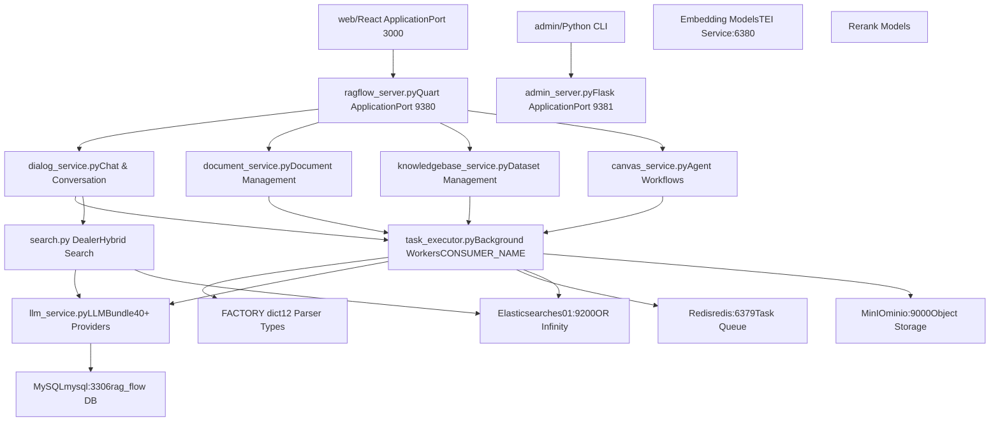
**Sources:** [README.md137-141](https://github.com/infiniflow/ragflow/blob/80a16e71/README.md#L137-L141) [api/ragflow\_server.py1-144](https://github.com/infiniflow/ragflow/blob/80a16e71/api/ragflow_server.py#L1-L144) [rag/svr/task\_executor.py1-100](https://github.com/infiniflow/ragflow/blob/80a16e71/rag/svr/task_executor.py#L1-L100) [docker/.env1-199](https://github.com/infiniflow/ragflow/blob/80a16e71/docker/.env#L1-L199)

## Service Components and Initialization

### Main Server Processes

RAGFlow runs three primary server processes that handle different responsibilities:

| Process | File | Port | Framework | Purpose |
| --- | --- | --- | --- | --- |
| **RAGFlow Server** | `api/ragflow_server.py` | 9380 | Quart (async) | HTTP API endpoints, chat, dataset management |
| **Admin Server** | `admin/admin_server.py` | 9381 | Flask | User management, service monitoring, RBAC |
| **Task Executor** | `rag/svr/task_executor.py` | N/A | asyncio | Background document processing workers |

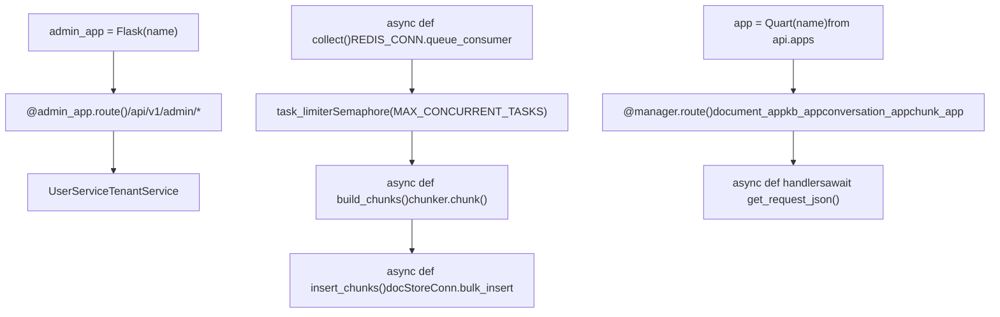
**Sources:** [api/ragflow\_server.py1-144](https://github.com/infiniflow/ragflow/blob/80a16e71/api/ragflow_server.py#L1-L144) [rag/svr/task\_executor.py110-131](https://github.com/infiniflow/ragflow/blob/80a16e71/rag/svr/task_executor.py#L110-L131) [admin/server/routes.py1-600](https://github.com/infiniflow/ragflow/blob/80a16e71/admin/server/routes.py#L1-L600)

### Server Initialization Sequence

The `ragflow_server.py` initialization follows this sequence:

> **[Mermaid sequence]**
> *(图表结构无法解析)*

Key initialization code in [api/ragflow\_server.py40-144](https://github.com/infiniflow/ragflow/blob/80a16e71/api/ragflow_server.py#L40-L144):

-   `init_web_db()`: Creates MySQL database tables
-   `init_web_data()`: Seeds initial configuration data
-   `RuntimeConfig.load()`: Loads runtime settings
-   `app.run(host="0.0.0.0", port=9380)`: Starts Quart server

**Sources:** [api/ragflow\_server.py40-144](https://github.com/infiniflow/ragflow/blob/80a16e71/api/ragflow_server.py#L40-L144) [api/db/db\_models.py1-600](https://github.com/infiniflow/ragflow/blob/80a16e71/api/db/db_models.py#L1-L600) [docker/.env149-154](https://github.com/infiniflow/ragflow/blob/80a16e71/docker/.env#L149-L154)

## Data Flow Architecture

### Document Ingestion Flow

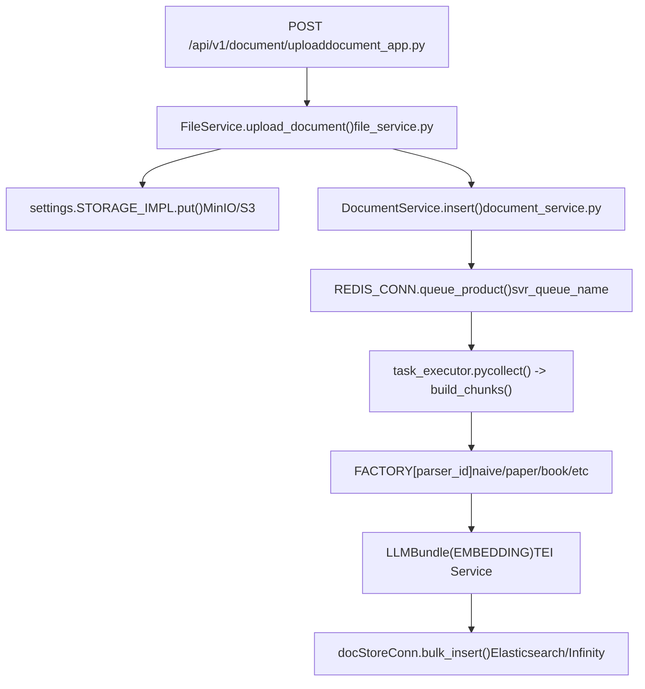
**Key Constants:**

-   `BATCH_SIZE = 64` [rag/svr/task\_executor.py81](https://github.com/infiniflow/ragflow/blob/80a16e71/rag/svr/task_executor.py#L81-L81)
-   `MAX_CONCURRENT_TASKS = 5` [rag/svr/task\_executor.py122](https://github.com/infiniflow/ragflow/blob/80a16e71/rag/svr/task_executor.py#L122-L122)
-   `MAX_CONCURRENT_CHUNK_BUILDERS = 1` [rag/svr/task\_executor.py123](https://github.com/infiniflow/ragflow/blob/80a16e71/rag/svr/task_executor.py#L123-L123)

**Sources:** [api/apps/document\_app.py52-98](https://github.com/infiniflow/ragflow/blob/80a16e71/api/apps/document_app.py#L52-L98) [rag/svr/task\_executor.py242-514](https://github.com/infiniflow/ragflow/blob/80a16e71/rag/svr/task_executor.py#L242-L514) [api/db/services/file\_service.py1-800](https://github.com/infiniflow/ragflow/blob/80a16e71/api/db/services/file_service.py#L1-L800)

### Chat/RAG Query Flow

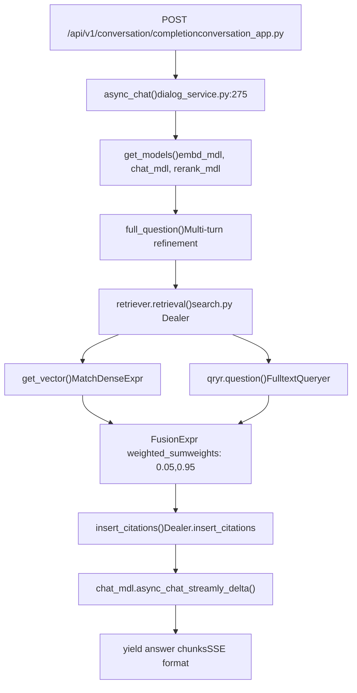
**Key Query Processing Functions:**

-   `async_chat()` [api/db/services/dialog\_service.py275-580](https://github.com/infiniflow/ragflow/blob/80a16e71/api/db/services/dialog_service.py#L275-L580)
-   `Dealer.search()` [rag/nlp/search.py75-172](https://github.com/infiniflow/ragflow/blob/80a16e71/rag/nlp/search.py#L75-L172)
-   `insert_citations()` [rag/nlp/search.py178-266](https://github.com/infiniflow/ragflow/blob/80a16e71/rag/nlp/search.py#L178-L266)

**Sources:** [api/apps/conversation\_app.py1-600](https://github.com/infiniflow/ragflow/blob/80a16e71/api/apps/conversation_app.py#L1-L600) [api/db/services/dialog\_service.py275-580](https://github.com/infiniflow/ragflow/blob/80a16e71/api/db/services/dialog_service.py#L275-L580) [rag/nlp/search.py37-266](https://github.com/infiniflow/ragflow/blob/80a16e71/rag/nlp/search.py#L37-L266)

## Storage Architecture Detail

### Database Schema Organization

RAGFlow uses MySQL for metadata storage with the following key tables:


**Primary Models:**

-   `Tenant` [api/db/db\_models.py400-450](https://github.com/infiniflow/ragflow/blob/80a16e71/api/db/db_models.py#L400-L450)
-   `Knowledgebase` [api/db/db\_models.py500-550](https://github.com/infiniflow/ragflow/blob/80a16e71/api/db/db_models.py#L500-L550)
-   `Document` [api/db/db\_models.py600-700](https://github.com/infiniflow/ragflow/blob/80a16e71/api/db/db_models.py#L600-L700)
-   `Task` [api/db/db\_models.py800-850](https://github.com/infiniflow/ragflow/blob/80a16e71/api/db/db_models.py#L800-L850)
-   `Dialog` [api/db/db\_models.py900-950](https://github.com/infiniflow/ragflow/blob/80a16e71/api/db/db_models.py#L900-L950)

**Sources:** [api/db/db\_models.py1-1500](https://github.com/infiniflow/ragflow/blob/80a16e71/api/db/db_models.py#L1-L1500) [docker/.env109-123](https://github.com/infiniflow/ragflow/blob/80a16e71/docker/.env#L109-L123)

### Document Store Configuration

The document store is pluggable and configured via `DOC_ENGINE` environment variable:

| Engine | Host:Port | Vector Index | Full-Text | Configuration |
| --- | --- | --- | --- | --- |
| **Elasticsearch** | `es01:9200` | ✅ Cosine similarity | ✅ BM25 | `DOC_ENGINE=elasticsearch` |
| **Infinity** | `infinity:23817` | ✅ Cosine similarity | ✅ Full-text | `DOC_ENGINE=infinity` |
| **OpenSearch** | `opensearch01:9201` | ✅ HNSW | ✅ BM25 | `DOC_ENGINE=opensearch` |
| **OceanBase** | `oceanbase:2881` | ✅ Vector extension | ✅ SQL | `DOC_ENGINE=oceanbase` |

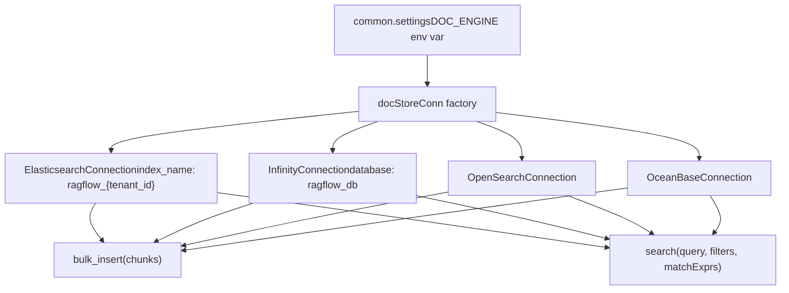
**Index Structure:**

-   Index name: `ragflow_{tenant_id}` [rag/nlp/search.py34](https://github.com/infiniflow/ragflow/blob/80a16e71/rag/nlp/search.py#L34-L34)
-   Vector field: `q_{dimension}_vec` (e.g., `q_768_vec`)
-   Text fields: `content_ltks`, `title_tks`, `question_tks`
-   Metadata fields: `docnm_kwd`, `kb_id`, `doc_id`, `page_num_int`

**Sources:** [docker/.env13-20](https://github.com/infiniflow/ragflow/blob/80a16e71/docker/.env#L13-L20) [rag/nlp/search.py34-62](https://github.com/infiniflow/ragflow/blob/80a16e71/rag/nlp/search.py#L34-L62) [common/doc\_store/doc\_store\_base.py1-300](https://github.com/infiniflow/ragflow/blob/80a16e71/common/doc_store/doc_store_base.py#L1-L300)

### Redis Queue Architecture

Redis serves two purposes: caching and task queue management.

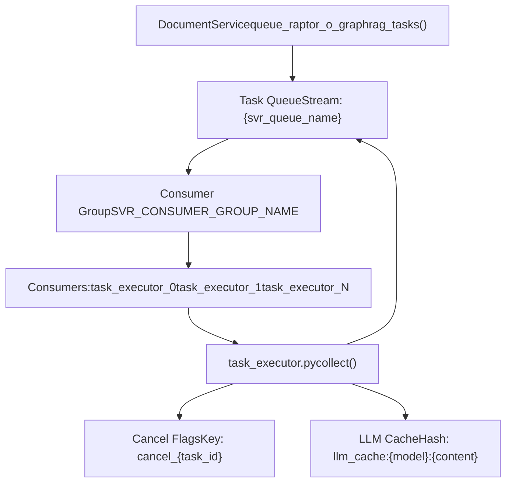
**Queue Configuration:**

-   Stream name: Configurable via `settings.get_svr_queue_names()` [rag/svr/task\_executor.py177](https://github.com/infiniflow/ragflow/blob/80a16e71/rag/svr/task_executor.py#L177-L177)
-   Consumer group: `SVR_CONSUMER_GROUP_NAME` [common/constants.py79](https://github.com/infiniflow/ragflow/blob/80a16e71/common/constants.py#L79-L79)
-   Consumer name: `task_executor_{CONSUMER_NO}` [rag/svr/task\_executor.py113](https://github.com/infiniflow/ragflow/blob/80a16e71/rag/svr/task_executor.py#L113-L113)

**Task Message Format:**

```
{
    "id": "task_id",
    "doc_id": "document_id",
    "task_type": "dataflow|raptor|graphrag|mindmap|memory",
    "tenant_id": "tenant_id",
    "kb_id": "kb_id"
}
```
**Sources:** [rag/svr/task\_executor.py173-234](https://github.com/infiniflow/ragflow/blob/80a16e71/rag/svr/task_executor.py#L173-L234) [api/db/services/document\_service.py400-500](https://github.com/infiniflow/ragflow/blob/80a16e71/api/db/services/document_service.py#L400-L500) [rag/utils/redis\_conn.py1-300](https://github.com/infiniflow/ragflow/blob/80a16e71/rag/utils/redis_conn.py#L1-L300)

## Concurrency Control

### Semaphore-Based Rate Limiting

The task executor uses asyncio Semaphores to limit concurrent operations:

```mermaid
flowchart TD
    TaskLim["task_limiterSemaphore(MAX_CONCURRENT_TASKS=5)"]
    ChunkLim["chunk_limiterSemaphore(MAX_CONCURRENT_CHUNK_BUILDERS=1)"]
    EmbedLim["embed_limiterSemaphore(MAX_CONCURRENT_CHUNK_BUILDERS=1)"]
    MinioLim["minio_limiterSemaphore(MAX_CONCURRENT_MINIO=10)"]
    KGLim["kg_limiterSemaphore(2)"]
    ChatLim["chat_limiterSemaphore(10)"]
    TaskLoop["async for task in collect()"]
    ChunkBuild["build_chunks()Document parsing"]
    EmbedGen["embedding()Vector generation"]
    MinioOp["upload_to_minio()Image storage"]
    KGExtract["run_graphrag_for_kb()Knowledge graph"]
    LLMCall["keyword_extraction()question_proposal()"]

    TaskLoop --> TaskLim
    ChunkBuild --> ChunkLim
    EmbedGen --> EmbedLim
    MinioOp --> MinioLim
    KGExtract --> KGLim
    LLMCall --> ChatLim
```
**Configuration via Environment Variables:**

-   `MAX_CONCURRENT_TASKS`: Overall task concurrency [rag/svr/task\_executor.py122](https://github.com/infiniflow/ragflow/blob/80a16e71/rag/svr/task_executor.py#L122-L122)
-   `MAX_CONCURRENT_CHUNK_BUILDERS`: Parsing concurrency [rag/svr/task\_executor.py123](https://github.com/infiniflow/ragflow/blob/80a16e71/rag/svr/task_executor.py#L123-L123)
-   `MAX_CONCURRENT_MINIO`: Storage operations [rag/svr/task\_executor.py124](https://github.com/infiniflow/ragflow/blob/80a16e71/rag/svr/task_executor.py#L124-L124)

**Sources:** [rag/svr/task\_executor.py122-129](https://github.com/infiniflow/ragflow/blob/80a16e71/rag/svr/task_executor.py#L122-L129) [graphrag/utils.py1-100](https://github.com/infiniflow/ragflow/blob/80a16e71/graphrag/utils.py#L1-L100)

### Task Cancellation Mechanism

> **[Mermaid sequence]**
> *(图表结构无法解析)*

**Implementation:**

-   Check: `has_canceled(task_id)` [api/db/services/task\_service.py100-120](https://github.com/infiniflow/ragflow/blob/80a16e71/api/db/services/task_service.py#L100-L120)
-   Raise: `TaskCanceledException` [common/exceptions.py20-30](https://github.com/infiniflow/ragflow/blob/80a16e71/common/exceptions.py#L20-L30)
-   Called in: `set_progress()` [rag/svr/task\_executor.py141-171](https://github.com/infiniflow/ragflow/blob/80a16e71/rag/svr/task_executor.py#L141-L171)

**Sources:** [rag/svr/task\_executor.py141-171](https://github.com/infiniflow/ragflow/blob/80a16e71/rag/svr/task_executor.py#L141-L171) [api/db/services/task\_service.py100-120](https://github.com/infiniflow/ragflow/blob/80a16e71/api/db/services/task_service.py#L100-L120) [common/exceptions.py1-50](https://github.com/infiniflow/ragflow/blob/80a16e71/common/exceptions.py#L1-L50)

## Request Processing Patterns

### Async Request Handling

The RAGFlow server uses Quart (async Flask) for concurrent request handling:

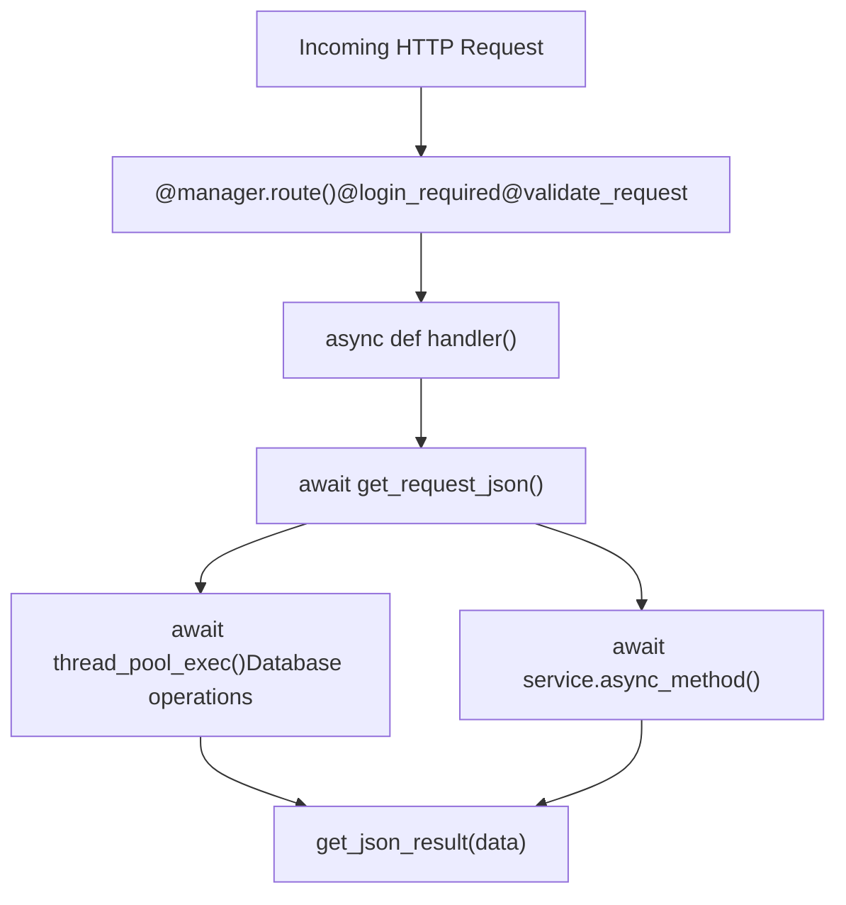
**Key Patterns:**

-   `@manager.route()`: Route registration [api/apps/document\_app.py52](https://github.com/infiniflow/ragflow/blob/80a16e71/api/apps/document_app.py#L52-L52)
-   `@login_required`: Authentication decorator [api/apps/\_\_init\_\_.py50-80](https://github.com/infiniflow/ragflow/blob/80a16e71/api/apps/__init__.py#L50-L80)
-   `@validate_request()`: Request validation [api/utils/api\_utils.py100-150](https://github.com/infiniflow/ragflow/blob/80a16e71/api/utils/api_utils.py#L100-L150)
-   `await get_request_json()`: Parse JSON body [api/utils/api\_utils.py50-70](https://github.com/infiniflow/ragflow/blob/80a16e71/api/utils/api_utils.py#L50-L70)
-   `await thread_pool_exec()`: Run blocking code in thread pool [common/misc\_utils.py30-60](https://github.com/infiniflow/ragflow/blob/80a16e71/common/misc_utils.py#L30-L60)

**Sources:** [api/apps/document\_app.py52-98](https://github.com/infiniflow/ragflow/blob/80a16e71/api/apps/document_app.py#L52-L98) [api/utils/api\_utils.py1-200](https://github.com/infiniflow/ragflow/blob/80a16e71/api/utils/api_utils.py#L1-L200) [common/misc\_utils.py1-100](https://github.com/infiniflow/ragflow/blob/80a16e71/common/misc_utils.py#L1-L100)

### Streaming Response Pattern

For real-time chat responses, RAGFlow uses Server-Sent Events (SSE):

> **[Mermaid sequence]**
> *(图表结构无法解析)*

**Implementation Details:**

-   Generator: `async_chat()` yields dicts [api/db/services/dialog\_service.py275-580](https://github.com/infiniflow/ragflow/blob/80a16e71/api/db/services/dialog_service.py#L275-L580)
-   Format: Each chunk is `{"answer": str, "reference": dict, "final": bool}`
-   Streaming LLM: `async_chat_streamly_delta()` [api/db/services/llm\_service.py200-300](https://github.com/infiniflow/ragflow/blob/80a16e71/api/db/services/llm_service.py#L200-L300)

**Sources:** [api/db/services/dialog\_service.py275-580](https://github.com/infiniflow/ragflow/blob/80a16e71/api/db/services/dialog_service.py#L275-L580) [api/apps/conversation\_app.py200-400](https://github.com/infiniflow/ragflow/blob/80a16e71/api/apps/conversation_app.py#L200-L400)

## Configuration Management

### Multi-Tier Configuration

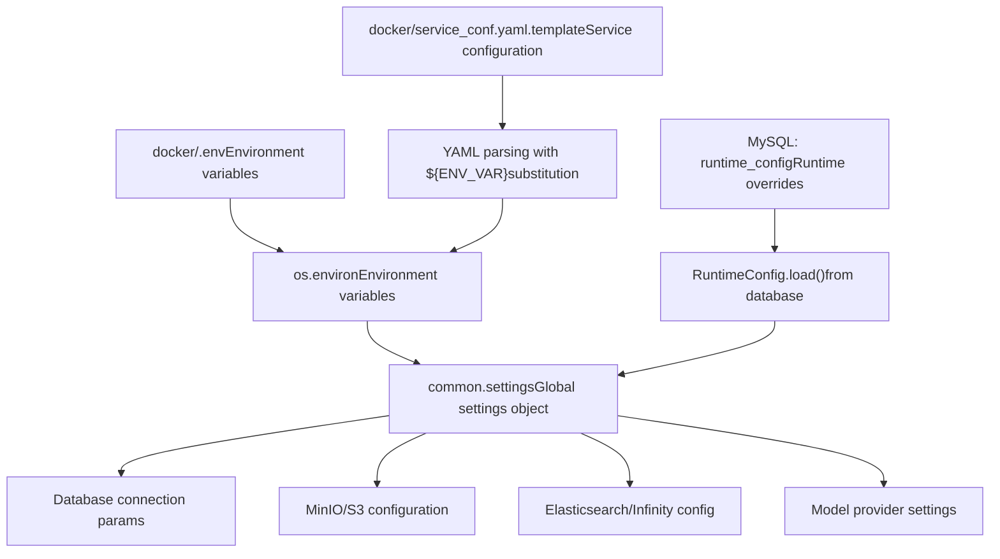
**Key Configuration Files:**

-   `.env`: Infrastructure settings [docker/.env1-199](https://github.com/infiniflow/ragflow/blob/80a16e71/docker/.env#L1-L199)
    -   `DOC_ENGINE`, `MYSQL_HOST`, `REDIS_HOST`, `MINIO_HOST`
-   `service_conf.yaml.template`: Service defaults [docker/service\_conf.yaml.template1-300](https://github.com/infiniflow/ragflow/blob/80a16e71/docker/service_conf.yaml.template#L1-L300)
    -   LLM providers, embedding models, parser configs
-   `RuntimeConfig` table: Per-tenant runtime settings [api/db/runtime\_config.py1-100](https://github.com/infiniflow/ragflow/blob/80a16e71/api/db/runtime_config.py#L1-L100)

**Environment Variable Substitution:**

```
# service_conf.yaml.template
mysql:
  host: ${MYSQL_HOST}  # Replaced with value from .env
  port: ${MYSQL_PORT}
  db: ${MYSQL_DBNAME}
```
**Sources:** [docker/.env1-199](https://github.com/infiniflow/ragflow/blob/80a16e71/docker/.env#L1-L199) [docker/README.md1-300](https://github.com/infiniflow/ragflow/blob/80a16e71/docker/README.md#L1-L300) [api/db/runtime\_config.py1-100](https://github.com/infiniflow/ragflow/blob/80a16e71/api/db/runtime_config.py#L1-L100) [common/settings.py1-200](https://github.com/infiniflow/ragflow/blob/80a16e71/common/settings.py#L1-L200)

## Deployment Architecture

### Docker Compose Service Topology

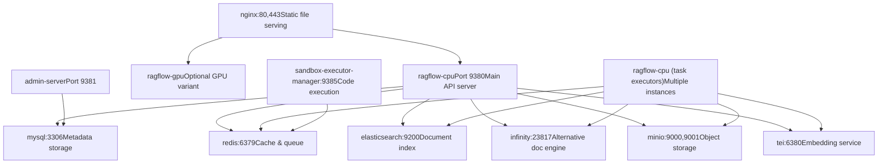
**Service Profiles:**

-   Base profile: `elasticsearch,cpu` [docker/.env28](https://github.com/infiniflow/ragflow/blob/80a16e71/docker/.env#L28-L28)
-   GPU variant: `elasticsearch,gpu`
-   Alternative engines: `infinity,cpu` or `opensearch,cpu`

**Port Mappings:**

-   HTTP API: `80:80` (nginx) → `9380` (ragflow-cpu) [docker/.env150-152](https://github.com/infiniflow/ragflow/blob/80a16e71/docker/.env#L150-L152)
-   Admin API: `9381:9381` [docker/.env153](https://github.com/infiniflow/ragflow/blob/80a16e71/docker/.env#L153-L153)
-   MySQL: `5455:3306` (external access) [docker/.env121](https://github.com/infiniflow/ragflow/blob/80a16e71/docker/.env#L121-L121)
-   Redis: `6379:6379` [docker/.env144](https://github.com/infiniflow/ragflow/blob/80a16e71/docker/.env#L144-L144)

**Sources:** [docker/docker-compose.yml1-500](https://github.com/infiniflow/ragflow/blob/80a16e71/docker/docker-compose.yml#L1-L500) [docker/.env1-199](https://github.com/infiniflow/ragflow/blob/80a16e71/docker/.env#L1-L199) [docker/README.md13-100](https://github.com/infiniflow/ragflow/blob/80a16e71/docker/README.md#L13-L100)

## Key Architectural Patterns

### Factory Pattern for Document Parsers

The system uses a factory dictionary to dynamically select document parsers:

```
# rag/svr/task_executor.py:83-100
FACTORY = {
    "general": naive,
    ParserType.NAIVE.value: naive,
    ParserType.PAPER.value: paper,
    ParserType.BOOK.value: book,
    ParserType.PRESENTATION.value: presentation,
    ParserType.MANUAL.value: manual,
    ParserType.LAWS.value: laws,
    ParserType.QA.value: qa,
    ParserType.TABLE.value: table,
    ParserType.RESUME.value: resume,
    ParserType.PICTURE.value: picture,
    ParserType.ONE.value: one,
    ParserType.AUDIO.value: audio,
    ParserType.EMAIL.value: email,
    ParserType.KG.value: naive,
    ParserType.TAG.value: tag
}

# Usage in build_chunks()
chunker = FACTORY[task["parser_id"].lower()]
cks = await thread_pool_exec(
    chunker.chunk,
    task["name"],
    binary=binary,
    ...
)
```
**Sources:** [rag/svr/task\_executor.py83-100](https://github.com/infiniflow/ragflow/blob/80a16e71/rag/svr/task_executor.py#L83-L100) [rag/svr/task\_executor.py248](https://github.com/infiniflow/ragflow/blob/80a16e71/rag/svr/task_executor.py#L248-L248)

### Service Layer Pattern

Database operations are encapsulated in service classes:

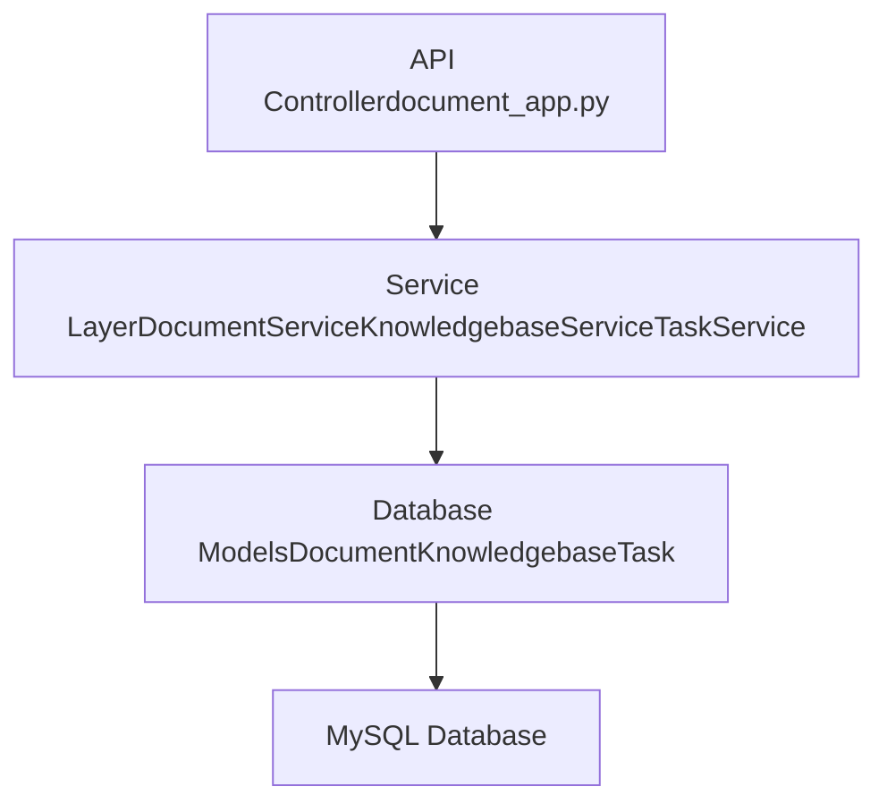
**Common Service Pattern:**

```
class DocumentService(CommonService):
    model = Document

    @classmethod
    @DB.connection_context()
    def get_by_kb_id(cls, kb_id, page, size, ...):
        docs = cls.model.select().where(
            cls.model.kb_id == kb_id
        )
        return list(docs.dicts()), count
```
**Key Services:**

-   `DocumentService` [api/db/services/document\_service.py46-1000](https://github.com/infiniflow/ragflow/blob/80a16e71/api/db/services/document_service.py#L46-L1000)
-   `KnowledgebaseService` [api/db/services/knowledgebase\_service.py1-600](https://github.com/infiniflow/ragflow/blob/80a16e71/api/db/services/knowledgebase_service.py#L1-L600)
-   `DialogService` [api/db/services/dialog\_service.py50-1000](https://github.com/infiniflow/ragflow/blob/80a16e71/api/db/services/dialog_service.py#L50-L1000)
-   `TaskService` [api/db/services/task\_service.py1-500](https://github.com/infiniflow/ragflow/blob/80a16e71/api/db/services/task_service.py#L1-L500)

**Sources:** [api/db/services/document\_service.py46-150](https://github.com/infiniflow/ragflow/blob/80a16e71/api/db/services/document_service.py#L46-L150) [api/db/services/common\_service.py1-100](https://github.com/infiniflow/ragflow/blob/80a16e71/api/db/services/common_service.py#L1-L100)

### Dealer Pattern for Hybrid Search

The `Dealer` class abstracts search operations across different document engines:

```
# rag/nlp/search.py:37-172
class Dealer:
    def __init__(self, dataStore: DocStoreConnection):
        self.qryr = query.FulltextQueryer()
        self.dataStore = dataStore

    async def search(self, req, idx_names, kb_ids, emb_mdl=None, ...):
        # Keyword search
        matchText, keywords = self.qryr.question(qst, min_match=0.3)

        # Vector search
        matchDense = await self.get_vector(qst, emb_mdl, topk, ...)

        # Fusion
        fusionExpr = FusionExpr("weighted_sum", topk,
                               {"weights": "0.05,0.95"})

        res = await thread_pool_exec(
            self.dataStore.search,
            src, highlightFields, filters,
            [matchText, matchDense, fusionExpr],
            ...
        )
        return self.SearchResult(total=total, ids=ids, ...)
```
**Sources:** [rag/nlp/search.py37-172](https://github.com/infiniflow/ragflow/blob/80a16e71/rag/nlp/search.py#L37-L172)

This architecture enables RAGFlow to handle complex RAG workloads with clear separation of concerns, scalable processing, and flexible deployment options.
